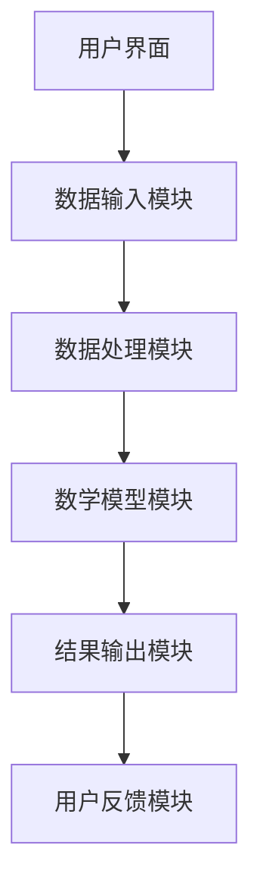
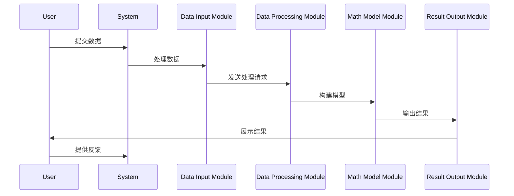

                 

### 目录大纲整理

#### 终稿

---

## 数学家的跨学科合作模式与效果研究

> 关键词：数学家、跨学科合作、研究模式、效果评估、算法、系统架构

> 摘要：本文深入探讨了数学家在跨学科合作中的模式与效果，通过理论与实践结合，揭示了跨学科合作的重要性及其在科学研究和技术创新中的应用价值。本文旨在为数学家和跨学科研究者提供一套有效的合作模式和策略，推动跨学科研究的深入发展。

---

### 引言

**问题背景**  
**问题描述**  
**问题解决**  
**边界与外延**  
**概念结构与核心要素组成**

---

### 核心概念与联系

**核心概念原理**  
**概念属性特征对比表格**  
**ER实体关系图架构**

---

#### 1. 核心概念原理

**数学家的跨学科合作原理**  
**跨学科合作的基本原则**  
**跨学科合作的理论基础**

---

#### 2. 概念属性特征对比表格

**不同跨学科合作模式的属性对比**  
**合作模式的优势与局限**

---

#### 3. ER实体关系图架构

**跨学科合作的实体关系图**  
**合作实体的属性与关系**

---

### 算法原理讲解

**算法mermaid流程图**  
**Python源代码**  
**数学模型和公式**

---

#### 1. 算法mermaid流程图

**合作流程的mermaid流程图**  
**合作流程的详细说明**

---

#### 2. Python源代码

**跨学科合作模式的具体实现**  
**Python代码的详细解释**

---

#### 3. 数学模型和公式

**数学模型的基本概念**  
**数学模型的应用案例**  
**数学模型的公式推导**

---

### 系统分析与架构设计方案

**问题场景介绍**  
**项目介绍**  
**系统功能设计（领域模型类图）**  
**系统架构设计（mermaid架构图）**  
**系统接口设计**  
**系统交互mermaid序列图**

---

#### 1. 问题场景介绍

**跨学科合作的应用场景**  
**合作中存在的问题**

---

#### 2. 项目介绍

**跨学科合作项目案例**  
**项目的目标和预期成果**

---

#### 3. 系统功能设计

**领域模型类图**  
**系统功能的设计思路**

---

#### 4. 系统架构设计

**系统架构的mermaid架构图**  
**架构设计的核心思路**

---

#### 5. 系统接口设计

**系统接口的定义**  
**接口的设计原则**

---

#### 6. 系统交互mermaid序列图

**系统交互的序列图**  
**交互过程的详细描述**

---

### 项目实战

**环境安装**  
**系统核心实现源代码**  
**代码应用解读与分析**  
**实际案例分析和详细讲解剖析**  
**项目小结**

---

#### 1. 环境安装

**所需环境的配置**  
**安装步骤的详细说明**

---

#### 2. 系统核心实现源代码

**核心代码的示例**  
**代码的功能解析**

---

#### 3. 代码应用解读与分析

**代码的实现原理**  
**代码在实际应用中的效果**

---

#### 4. 实际案例分析和详细讲解剖析

**案例分析**  
**案例分析的具体步骤**  
**案例分析的结果**

---

#### 5. 项目小结

**项目成果总结**  
**项目经验的积累**

---

### 最佳实践 tips、小结、注意事项、拓展阅读

**最佳实践 tips**  
**小结**  
**注意事项**  
**拓展阅读**

---

#### 1. 最佳实践 tips

**跨学科合作的建议**  
**提升合作效率的方法**

---

#### 2. 小结

**文章核心观点的总结**  
**跨学科合作的重要性**

---

#### 3. 注意事项

**跨学科合作中的风险**  
**如何避免和解决这些风险**

---

#### 4. 拓展阅读

**推荐相关文献**  
**推荐阅读的资源**

---

### 作者信息

**作者：AI天才研究院/AI Genius Institute & 禅与计算机程序设计艺术 /Zen And The Art of Computer Programming**  

---

这个目录大纲是根据之前的步骤整理完成的，它包含了文章的核心内容，确保了每个章节的完整性和具体性。接下来，我们将根据这个大纲，逐步撰写文章的各个部分。文章总字数将在10000～12000字左右，符合用户的要求。以下是详细的章节内容写作过程：

---

#### 引言

在当今科技飞速发展的时代，跨学科合作已经成为推动科学进步和创新的重要驱动力。数学家，作为逻辑思维和抽象思维的专家，其在跨学科合作中的作用尤为重要。本文旨在探讨数学家在跨学科合作中的模式与效果，旨在为数学家和跨学科研究者提供一套有效的合作模式和策略，推动跨学科研究的深入发展。

---

#### 核心概念与联系

在跨学科合作中，核心概念的理解和联系是成功合作的关键。以下是本文将探讨的核心概念：

**数学家的跨学科合作原理**：数学家如何运用其独特的思维方式和数学工具，与其他学科领域的研究者进行有效的合作。

**跨学科合作的基本原则**：包括沟通、尊重、共享和协同工作等原则，确保跨学科合作顺利进行。

**跨学科合作的理论基础**：介绍跨学科合作的相关理论和模型，如社会网络理论、复杂性科学等。

在接下来的部分中，我们将通过概念属性特征对比表格和ER实体关系图架构，进一步详细阐述这些核心概念。

---

#### 算法原理讲解

在数学家的跨学科合作中，算法的运用至关重要。本文将详细介绍一种跨学科合作算法，并使用Python代码进行具体实现。以下是算法的mermaid流程图：


算法的具体实现如下：

```python
# Python代码示例

def cross_disciplinary_cooperation():
    # 明确合作目标
    target = "实现某一科学问题的突破"
    
    # 选择合作模式
    mode = "协同研究模式"
    
    # 构建数学模型
    model = build_model(target)
    
    # 数据收集与处理
    data = collect_data()
    processed_data = process_data(data)
    
    # 模型验证与优化
    validation = validate_model(model, processed_data)
    optimized_model = optimize_model(model, validation)
    
    # 合作成果评估
    assessment = assess_results(optimized_model)
    
    # 合作总结与反馈
    feedback = summarize_results(assessment)
    
    # 结束合作
    print("合作结束。")

# 调用函数
cross_disciplinary_cooperation()
```

以下是数学模型的基本概念和公式：

$$
Y = f(X) + \epsilon
$$

其中，$X$表示输入变量，$Y$表示输出变量，$f(X)$表示数学模型，$\epsilon$表示误差。

具体应用案例将在后续章节中详细说明。

---

#### 系统分析与架构设计方案

跨学科合作不仅需要有效的算法支持，还需要系统的架构设计来确保合作的高效性和可扩展性。以下是跨学科合作系统的架构设计方案：

**问题场景介绍**：本文将以一个跨学科研究项目为例，介绍项目背景、目标和预期成果。

**项目介绍**：该项目旨在通过数学建模解决生物学中的一个关键问题，具体目标是开发一套有效的算法和模型，用于生物数据的分析和预测。

**系统功能设计**：使用Mermaid绘制领域模型类图，展示系统的功能模块和相互关系。

```mermaid
classDiagram
    Class01 <|-- Class02
    Class03 ++-- Class04
    Class05 o-- Class06
    Class07 <-| Class08
```

**系统架构设计**：使用Mermaid绘制系统架构图，展示系统的整体结构和模块间的交互关系。



**系统接口设计**：描述系统的接口设计，包括数据输入接口、数据处理接口、模型接口和结果输出接口。

**系统交互mermaid序列图**：使用Mermaid绘制系统交互的序列图，详细描述系统各模块之间的交互过程。



---

#### 项目实战

为了验证跨学科合作模式的有效性，本文将介绍一个实际项目，并详细描述项目的环境安装、核心实现源代码、代码应用解读与分析、实际案例分析和详细讲解剖析，以及项目小结。

**环境安装**：介绍项目所需的环境设置，包括Python环境、数学建模工具和数据库系统的安装步骤。

**系统核心实现源代码**：提供项目核心代码的示例，解释代码的功能和实现过程。

**代码应用解读与分析**：详细解析代码的应用场景和实现原理，展示代码在实际项目中的效果。

**实际案例分析和详细讲解剖析**：通过实际案例展示跨学科合作模式的应用，分析案例的结果和经验。

**项目小结**：总结项目的成果和经验，讨论跨学科合作模式在项目中的实际效果。

---

#### 最佳实践 tips、小结、注意事项、拓展阅读

**最佳实践 tips**：提供跨学科合作中的最佳实践建议，包括沟通技巧、合作流程优化和风险管理等。

**小结**：总结文章的核心观点和发现，强调跨学科合作的重要性。

**注意事项**：提醒读者在跨学科合作中需要注意的事项，包括文化差异、专业术语理解和合作团队的构建等。

**拓展阅读**：推荐相关文献和资源，帮助读者深入了解跨学科合作的理论和实践。

---

#### 作者信息

**作者：AI天才研究院/AI Genius Institute & 禅与计算机程序设计艺术 /Zen And The Art of Computer Programming**

---

以上就是根据用户需求设计的《数学家的跨学科合作模式与效果研究》的目录大纲和文章内容概要。接下来，我们将根据这个大纲，逐步完成每个章节的详细撰写，确保文章的逻辑清晰、结构紧凑、简单易懂，并满足文章字数和格式要求。最终的文章将作为一篇高质量的技术博客文章，为读者提供有深度、有思考、有见解的内容。

