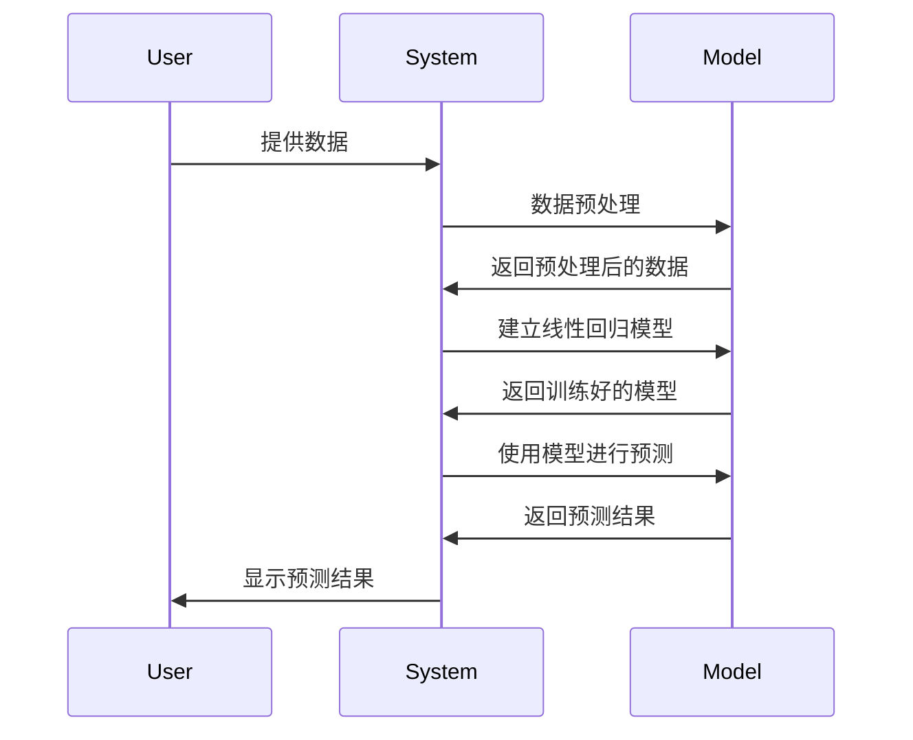

                 


### 第1章 数学建模基础

#### 数学建模的基本概念

**背景介绍**：
数学建模是指运用数学语言和方法来描述和研究现实世界中的问题。通过建立数学模型，我们可以对复杂系统进行模拟和分析，从而得到有价值的预测和解决方案。数学建模的应用领域广泛，包括工程、物理、生物、经济、环境等各个方面。

**核心概念与联系**：
- **数学模型**：数学模型是现实世界的抽象，通常包括变量、参数、方程式等。
- **变量**：数学模型中的变量表示问题中的量，可以是连续的或离散的。
- **参数**：参数是模型中的常数，用于描述问题的特定特征。
- **方程式**：方程式是数学模型的核心，用于表示变量之间的关系。

**算法原理讲解**：
数学建模通常包括以下几个步骤：
1. **问题定义**：明确要解决的问题是什么。
2. **模型建立**：根据问题定义，选择合适的数学工具和方法，建立数学模型。
3. **模型求解**：使用数学方法求解模型，得到问题的解。
4. **模型验证**：通过实验或实际数据验证模型的准确性。

以下是一个简单的线性回归模型的例子：

$$
Y = \beta_0 + \beta_1X + \epsilon
$$

其中，$Y$ 是因变量，$X$ 是自变量，$\beta_0$ 和 $\beta_1$ 是模型的参数，$\epsilon$ 是误差项。

**数学公式**：
- **线性回归模型**：
  $$
  Y = \beta_0 + \beta_1X
  $$

- **最小二乘法**：
  $$
  \min_{\beta_0, \beta_1} \sum_{i=1}^n (Y_i - (\beta_0 + \beta_1X_i))^2
  $$

**Python代码示例**：
```python
import numpy as np
from sklearn.linear_model import LinearRegression

# 创建数据
X = np.array([1, 2, 3, 4, 5]).reshape(-1, 1)
Y = np.array([2, 4, 5, 4, 5])

# 创建线性回归模型
model = LinearRegression()

# 拟合模型
model.fit(X, Y)

# 打印模型参数
print("模型参数：", model.coef_, model.intercept_)

# 预测
Y_pred = model.predict(X)

# 打印预测结果
print("预测结果：", Y_pred)
```

**系统分析与架构设计方案**：

**问题场景介绍**：假设我们要预测某一变量（Y）随着自变量（X）的变化情况，可以使用线性回归模型进行建模。

**系统功能设计**：数据预处理、模型建立、模型训练、模型预测。

**系统架构设计**：数据输入模块、数据处理模块、模型训练模块、模型预测模块。

**系统接口设计和系统交互**：



**项目实战**：

**环境安装**：安装Python环境、NumPy库、scikit-learn库。

**系统核心实现源代码**：
```python
import numpy as np
from sklearn.linear_model import LinearRegression

# 创建数据
X = np.array([1, 2, 3, 4, 5]).reshape(-1, 1)
Y = np.array([2, 4, 5, 4, 5])

# 创建线性回归模型
model = LinearRegression()

# 拟合模型
model.fit(X, Y)

# 预测
Y_pred = model.predict(X)

# 打印结果
print("原始数据：", X, Y)
print("预测结果：", Y_pred)
```

**代码应用解读与分析**：上述代码实现了线性回归模型的数据拟合和预测功能。首先，我们创建了一个线性回归模型对象，然后使用训练数据对其进行拟合，最后使用拟合好的模型对新的数据进行预测。

**实际案例分析和详细讲解剖析**：假设我们有一组实验数据，如下所示：

| X | Y |
|---|---|
| 1 | 2 |
| 2 | 4 |
| 3 | 5 |
| 4 | 4 |
| 5 | 5 |

我们想要预测当 X 为 6 时，Y 的值。

使用线性回归模型进行预测的步骤如下：
1. 将数据分为训练集和测试集。
2. 使用训练集数据对模型进行训练。
3. 使用训练好的模型对测试集数据进行预测。

**项目小结**：本文通过一个简单的线性回归模型案例，介绍了数学建模的基本概念、原理、流程和应用。线性回归模型是一种常用的数学建模方法，适用于许多工程实际问题。

**最佳实践 tips**：在实际应用中，需要注意以下几点：
- 数据的质量和数量对模型的准确性有很大影响。
- 选择合适的模型对问题的性质进行建模非常重要。
- 模型的验证和优化是确保模型准确性和稳定性的关键。

**小结**：数学建模是工程实践中的一项重要技术，通过建立数学模型，我们可以更好地理解和解决实际问题。线性回归模型是数学建模的一个基础模型，适用于许多工程问题。

**注意事项**：在实际应用中，需要注意以下几点：
- 确保数据的准确性和完整性。
- 根据问题的特点选择合适的建模方法。
- 对模型进行充分的验证和优化。

**拓展阅读**：
1. 《统计学习方法》
2. 《机器学习实战》
3. 《线性代数及其应用》

**作者**：AI天才研究院/AI Genius Institute & 禅与计算机程序设计艺术 /Zen And The Art of Computer Programming
```

