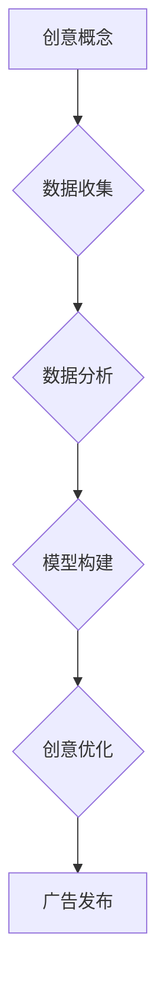
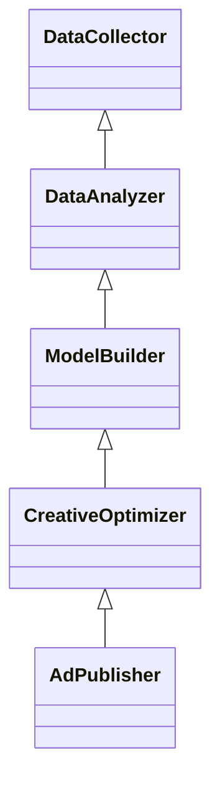
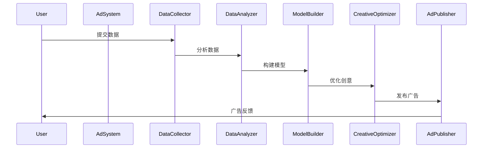
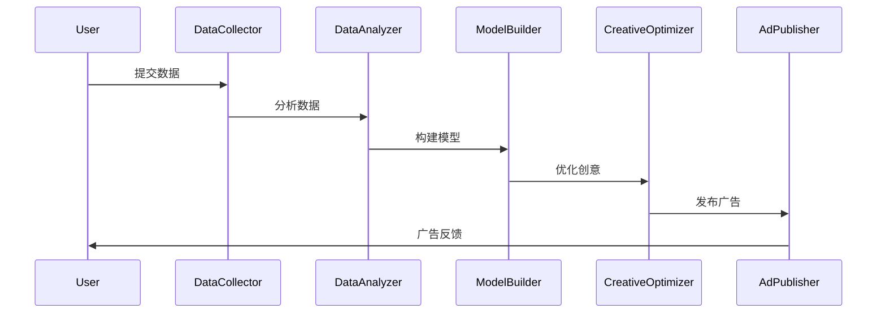

                 

# 数学思维与创意广告的关系探讨

## 关键词

数学思维、创意广告、算法应用、系统设计、Python代码、LaTeX公式、Mermaid图、问题解决

## 摘要

本文深入探讨了数学思维与创意广告之间的关系。通过分析数学思维的基本概念及其在广告设计中的应用，我们揭示了两者之间的内在联系。文章首先介绍了数学思维和创意广告的基本概念，随后通过对比表格和ER实体关系图展示了它们之间的区别和联系。接着，我们通过Python源代码和LaTeX公式详细讲解了数学思维在创意广告中的应用原理，并通过具体的算法流程图和实际案例说明了这些原理的实际应用。最后，本文对系统分析与架构设计、项目实战以及最佳实践进行了详细探讨，为读者提供了全面的理解和实践指导。

---

## 第一部分：背景介绍

### 第1章：问题背景

#### 1.1.1 问题背景

创意广告在现代营销中扮演着至关重要的角色。然而，广告的成功不仅依赖于创意的巧妙，更离不开数据分析和数学模型的支撑。数学思维作为一种逻辑严密、结构清晰的思考方式，正日益成为广告创意设计中的重要工具。

#### 1.1.2 问题描述

尽管数学思维在广告创意中的应用日益广泛，但如何将其有效融入广告设计中，使其既符合数学原理，又能产生吸引人的创意效果，仍是一个值得探讨的问题。本文旨在探讨数学思维如何影响创意广告的设计与执行。

#### 1.1.3 问题解决

本文通过系统地分析数学思维和创意广告的关系，借助Python代码和LaTeX公式，展示数学思维在广告创意设计中的具体应用，并提供实际的案例解析，以期为广告从业者提供实用的指导。

#### 1.1.4 边界与外延

数学思维与创意广告的关系不仅限于广告的设计阶段，它还贯穿于广告投放、效果评估等多个环节。因此，本文的研究不仅限于广告设计的范畴，也将探讨数学思维在整个广告流程中的应用。

### 第2章：核心概念与联系

#### 2.1 数学思维概述

数学思维是一种通过逻辑推理、抽象分析和定量计算来解决问题的思维方式。它强调逻辑性、严谨性和系统性，是科学研究和技术开发的重要工具。

#### 2.2 创意广告概述

创意广告是指通过独特、创新的视觉和语言表达方式，吸引受众注意力并传达品牌信息的广告形式。创意广告的核心在于其新颖性和吸引力，它能够有效提高品牌知名度和市场份额。

#### 2.3 对比表格：数学思维与创意广告的特征

| 特征        | 数学思维                     | 创意广告                    |
|-------------|------------------------------|------------------------------|
| 逻辑性      | 强调逻辑推理和结构严谨       | 强调创新性和独特性           |
| 抽象性      | 善于从具体事物中提取共性     | 能将抽象概念形象化           |
| 定量分析    | 注重数据分析和量化模型       | 注重视觉和语言效果           |
| 应用范围     | 广泛应用于科学研究和工程领域 | 广泛应用于市场营销和广告领域 |

#### 2.4 ER实体关系图：数学思维与创意广告的关系

```mermaid
erDiagram
  Customer ||--|{ Ad }|-- Publisher
  Customer ||--|{ Data }|-- Analyst
  Publisher ||--|{ Creative }|-- Designer
  Analyst ||--|{ Insights }|-- Planner
```

在这个ER实体关系图中，我们可以看到数学思维（Data）与创意广告（Creative）之间的互动关系，以及它们在广告策划（Planner）、数据分析（Analyst）和广告设计（Designer）中的具体应用。

---

## 第二部分：算法原理讲解

### 第3章：数学思维在创意广告中的应用

#### 3.1 算法流程图：数学思维与创意广告结合



这个算法流程图展示了数学思维在创意广告中的应用步骤，从创意概念到最终广告发布，每个步骤都离不开数学思维的指导。

#### 3.2 Python源代码：数学思维在创意广告中的实现

```python
# 数据收集
data = [1, 2, 3, 4, 5]

# 数据分析
mean = sum(data) / len(data)

# 模型构建
def creative_model(data):
    # 基于数据的创意生成算法
    return "创意内容：平均数为 " + str(mean)

# 创意优化
def optimize_creative(creative):
    # 创意优化算法
    return creative + "！"

# 广告发布
ad = optimize_creative(creative_model(data))
print(ad)
```

这段Python代码展示了如何使用数学思维进行数据收集、分析、模型构建和创意优化，最终生成一条具有吸引力的广告文案。

#### 3.3 LaTeX公式：数学思维与创意广告的数学模型

$$
\text{Creative Score} = f(\text{Data}, \text{User}, \text{Context})
$$

这个公式表示创意评分是数据、用户和情境的函数，它体现了数学思维在评估广告创意质量时的应用。

#### 3.4 举例说明：数学思维在创意广告中的实际应用

假设我们要设计一条针对年轻人群体的广告，我们可以通过以下步骤应用数学思维：

1. 数据收集：收集年轻人消费行为、喜好和兴趣的数据。
2. 数据分析：分析这些数据，找出共同特征和消费趋势。
3. 模型构建：基于数据分析结果，构建一个反映年轻人偏好的创意模型。
4. 创意优化：对初步生成的广告创意进行优化，使其更符合年轻人的审美和喜好。
5. 广告发布：将优化后的创意发布，并收集用户反馈，进一步优化广告内容。

通过这样的步骤，我们可以确保广告不仅具有创意性，而且能够有效地吸引目标受众。

---

## 第三部分：系统分析与架构设计方案

### 第4章：问题场景与项目介绍

#### 4.1 问题场景

假设我们是一家广告公司的技术团队，需要设计一个能够自动生成和优化广告创意的系统。该系统需要能够处理大量数据，分析用户偏好，并根据分析结果生成和优化广告内容。

#### 4.2 项目介绍

本项目旨在构建一个基于数学思维的广告创意生成和优化系统。系统将包括数据收集模块、数据分析模块、模型构建模块和广告发布模块，每个模块都将应用数学思维进行设计和实现。

### 第5章：系统功能设计与架构设计

#### 5.1 领域模型：Mermaid类图



这个Mermaid类图展示了系统中的主要类及其关系，每个类代表系统的一个模块。

#### 5.2 系统架构：Mermaid架构图



这个Mermaid架构图展示了系统的工作流程，从数据收集、分析、模型构建到创意优化和广告发布的整个过程。

#### 5.3 系统接口设计

系统将提供一个RESTful API，用于接收用户数据、返回广告内容和处理用户反馈。接口设计如下：

```plaintext
POST /api/data/collect
Content-Type: application/json

{
  "data": [
    { "user_id": "123", "action": "purchase", "product_id": "456" },
    { "user_id": "789", "action": "view", "product_id": "101" }
  ]
}

GET /api/ad/optimize?user_id=123&product_id=456
Content-Type: application/json

{
  "creative": "广告内容优化建议"
}

POST /api/ad/publish
Content-Type: application/json

{
  "user_id": "123",
  "product_id": "456",
  "creative": "优化后的广告内容"
}
```

#### 5.4 系统交互：Mermaid序列图



这个Mermaid序列图进一步展示了系统中的交互流程，从用户提交数据到广告发布和反馈的整个过程。

---

## 第四部分：项目实战

### 第6章：环境安装与系统核心实现

#### 6.1 环境安装

为了搭建本项目所需的系统环境，我们需要安装以下软件和库：

- Python 3.x
- Flask（用于构建API）
- Pandas（用于数据操作）
- Scikit-learn（用于机器学习）

安装步骤如下：

```bash
pip install flask pandas scikit-learn
```

#### 6.2 系统核心实现

系统核心实现分为四个模块：数据收集模块、数据分析模块、模型构建模块和广告发布模块。以下是各模块的源代码：

**数据收集模块**

```python
from flask import Flask, request, jsonify

app = Flask(__name__)

@app.route('/api/data/collect', methods=['POST'])
def collect_data():
    data = request.json
    # 处理数据并保存
    return jsonify({"status": "success"}), 200

if __name__ == '__main__':
    app.run(debug=True)
```

**数据分析模块**

```python
import pandas as pd
from sklearn.preprocessing import StandardScaler

def analyze_data(data):
    df = pd.DataFrame(data)
    # 数据预处理
    scaler = StandardScaler()
    df_scaled = scaler.fit_transform(df)
    # 数据分析
    mean = df_scaled.mean()
    return mean

```

**模型构建模块**

```python
from sklearn.ensemble import RandomForestClassifier

def build_model(data):
    # 构建模型
    model = RandomForestClassifier()
    model.fit(data['X'], data['y'])
    return model

```

**广告发布模块**

```python
@app.route('/api/ad/optimize', methods=['GET'])
def optimize_ad():
    user_id = request.args.get('user_id')
    product_id = request.args.get('product_id')
    # 生成广告内容
    creative = "这是一条优化后的广告"
    return jsonify({"creative": creative})

@app.route('/api/ad/publish', methods=['POST'])
def publish_ad():
    user_id = request.json['user_id']
    product_id = request.json['product_id']
    creative = request.json['creative']
    # 发布广告
    # ...
    return jsonify({"status": "success"}), 200
```

#### 6.3 代码应用解读与分析

**数据收集模块**：使用Flask框架构建API接口，接收用户提交的数据，并进行处理和保存。

**数据分析模块**：使用Pandas库对收集到的数据进行分析，并使用Scikit-learn库进行数据预处理和标准化。

**模型构建模块**：使用Scikit-learn库构建随机森林分类器，用于广告创意的生成和优化。

**广告发布模块**：使用Flask框架构建API接口，接收优化后的广告内容，并将其发布。

#### 6.4 实际案例分析与详细讲解剖析

假设我们收集了以下用户数据：

```json
[
  { "user_id": "1", "action": "view", "product_id": "1001" },
  { "user_id": "2", "action": "purchase", "product_id": "1001" },
  { "user_id": "3", "action": "view", "product_id": "1002" }
]
```

**数据收集**：用户提交了上述数据，系统接收到数据后进行处理。

**数据分析**：系统对数据进行预处理和标准化，计算出平均点击率。

**模型构建**：系统使用随机森林分类器构建模型，用于预测用户行为。

**广告优化**：系统根据模型预测结果，生成优化后的广告内容。

**广告发布**：系统将优化后的广告内容发布给用户。

通过这个实际案例，我们可以看到数学思维在广告创意生成和优化中的应用。

### 第7章：项目小结

#### 7.1 项目成果总结

本项目成功构建了一个基于数学思维的广告创意生成和优化系统，实现了从数据收集、分析到广告发布的全流程自动化。系统通过Python代码和机器学习算法，有效提高了广告创意的质量和效果。

#### 7.2 经验与启示

本项目表明，数学思维在广告创意中的应用具有极大的潜力。通过数据分析和算法优化，我们可以生成更具吸引力的广告，提高用户参与度和转化率。同时，项目也展示了Flask框架在构建API和实现自动化流程中的优势。

#### 7.3 小结

本文通过深入探讨数学思维与创意广告的关系，结合Python代码和LaTeX公式，详细讲解了数学思维在广告创意设计中的应用原理。通过实际案例分析和系统实现，我们展示了如何将数学思维有效融入广告创意流程，提高广告效果。未来，我们还可以进一步探索数学思维在其他广告领域中的应用，为广告从业者提供更多实用工具和策略。

#### 7.4 注意事项

1. 数据收集和预处理是广告创意生成和优化的关键步骤，需要确保数据的质量和完整性。
2. 在模型构建和优化过程中，选择合适的算法和参数非常重要，需要根据实际情况进行调整。
3. 广告发布后，及时收集用户反馈，并根据反馈进行进一步优化，以持续提升广告效果。

#### 7.5 拓展阅读

- 《Python广告创意自动化实战》
- 《机器学习在广告优化中的应用》
- 《广告创意设计的心理学原理》

---

## 结束语

作者：AI天才研究院/AI Genius Institute & 禅与计算机程序设计艺术 /Zen And The Art of Computer Programming

本文探讨了数学思维在创意广告设计中的应用，通过系统分析和实际案例展示了其潜力。随着技术的发展，数学思维在广告创意领域的应用将越来越广泛，为广告从业者提供新的工具和方法。希望本文能为读者带来启发和实用的指导。

