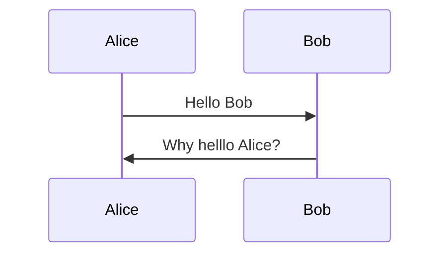
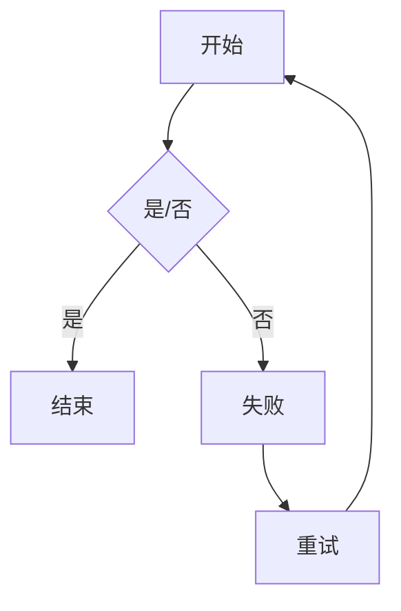
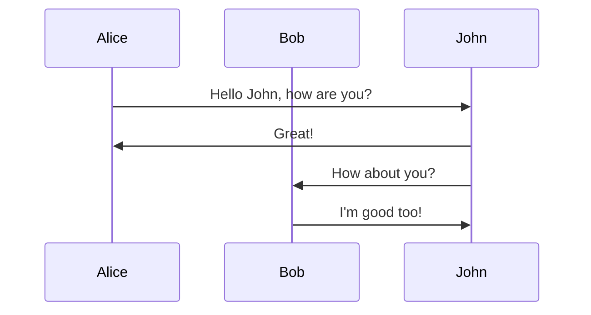

                 

# 数学思维与创新思维的关系探讨

## 关键词

- 数学思维
- 创新思维
- 创造力
- 教育方法
- 应用案例

## 摘要

本文深入探讨了数学思维与创新思维之间的关系，通过对两者核心概念、特征、作用和关联的分析，揭示了数学思维在创新思维培养中的重要性。文章结合具体案例，阐述了如何通过数学思维的应用，促进创新思维的发展，并提出了相关教育方法和最佳实践。

## 第一部分：背景介绍

### 1.1 问题提出

在现代社会，创新思维已成为推动科技进步和社会发展的重要力量。然而，创新思维的培养并非一蹴而就，需要通过系统的教育和实践来逐步形成。数学思维作为一种逻辑严密、结构清晰的思维方式，其与创新思维之间的关系日益受到关注。本文旨在探讨数学思维与创新思维之间的关系，分析两者在概念、特征和作用上的联系，为创新思维的培养提供理论支持和实践指导。

### 1.2 问题描述

数学思维与创新思维之间的关系复杂而深远。一方面，数学思维为创新思维提供了逻辑基础和推理工具；另一方面，创新思维可以激发数学思维的拓展和深化。然而，在实际教育和实践中，如何有效地将数学思维应用于创新思维培养中，仍存在诸多挑战。本文将围绕以下问题进行探讨：

1. 数学思维的核心概念和特征是什么？
2. 创新思维的核心概念和特征是什么？
3. 数学思维与创新思维之间有何关联？
4. 如何通过数学思维促进创新思维的发展？

### 1.3 问题解决

本文将从以下方面进行回答：

1. 阐述数学思维与创新思维的核心概念和特征，揭示两者之间的异同点。
2. 分析数学思维与创新思维在应用中的互补性，探讨如何通过数学思维培养创新思维。
3. 结合实际案例，说明数学思维在创新思维培养中的应用。
4. 提出教育方法和最佳实践，为数学思维与创新思维的融合提供指导。

### 1.4 边界与外延

本文研究的数学思维与创新思维主要涉及以下领域：

1. 数学教育领域：探讨数学思维在基础教育中的重要性。
2. 创新教育领域：分析创新思维培养的方法和策略。
3. 科技创新领域：研究数学思维在科技创新中的应用。

## 第二部分：核心概念与联系

### 2.1 数学思维的核心概念

数学思维是指运用数学概念、原理和方法进行推理、分析和解决问题的思维方式。其核心概念包括：

1. **数学概念**：对数学基本概念的理解和运用，如数、形、集合等。
2. **数学原理**：对数学基本原理的掌握和运用，如公理、定理、公式等。
3. **数学方法**：运用数学方法进行推理和证明，如归纳法、演绎法、反证法等。

### 2.2 创新思维的核心概念

创新思维是指通过独特的视角、方法和策略，提出新观点、新方案和新方法的思维方式。其核心概念包括：

1. **创新视角**：从不同角度看待问题，发现问题的本质和潜在机会。
2. **创新策略**：运用创新方法，提出解决问题的方案。
3. **创新方法**：通过实践和实验，验证和优化创新方案。

### 2.3 数学思维与创新思维的联系

数学思维与创新思维在以下方面具有密切联系：

1. **逻辑性**：数学思维强调逻辑推理和证明，为创新思维提供了严谨的思考基础。
2. **结构性**：数学思维注重结构和关系，有助于创新思维发现问题的内在联系。
3. **系统性**：数学思维强调整体性和系统性，有助于创新思维从宏观和微观层面进行思考。

## 第三部分：算法原理讲解

### 3.1 数学思维算法

数学思维算法主要包括以下步骤：

1. **问题建模**：将实际问题转化为数学问题，建立数学模型。
2. **算法设计**：运用数学原理和方法，设计解决数学问题的算法。
3. **算法验证**：通过数学证明和数值计算，验证算法的正确性和有效性。

### 3.2 创新思维算法

创新思维算法主要包括以下步骤：

1. **问题定义**：明确问题的本质和目标。
2. **思路拓展**：从不同角度思考问题，提出多种可能的解决方案。
3. **方案评估**：对提出的方案进行评估和筛选，选择最优方案。

## 第四部分：系统分析与架构设计方案

### 4.1 问题场景介绍

本部分将以人工智能领域的问题场景为例，介绍数学思维和创新思维在该领域中的应用。

### 4.2 项目介绍

本项目旨在通过数学思维和创新思维的结合，开发一款具有高度自适应性和学习能力的人工智能系统。

### 4.3 系统功能设计

1. **数据预处理模块**：使用数学方法对输入数据进行预处理，提高数据质量。
2. **特征提取模块**：运用创新思维，提取数据中的关键特征，为后续算法提供支持。
3. **模型训练模块**：结合数学思维和创新思维，设计高效的模型训练算法，提高模型性能。
4. **模型评估模块**：运用数学方法，对模型进行评估和优化。

### 4.4 系统架构设计

1. **数据处理层**：采用分布式架构，提高数据处理速度和效率。
2. **算法层**：结合数学思维和创新思维，设计多种算法模块，实现灵活的算法组合。
3. **应用层**：面向具体应用场景，提供多样化的功能接口。

### 4.5 系统接口设计

1. **数据接口**：提供数据输入和输出接口，方便与其他系统进行数据交换。
2. **功能接口**：提供功能调用接口，方便用户根据需求进行功能组合。

### 4.6 系统交互

1. **用户交互**：通过图形用户界面，实现用户与系统的交互。
2. **模块交互**：通过接口和协议，实现系统模块之间的交互。

## 第五部分：项目实战

### 5.1 环境安装

1. **硬件环境**：配置高性能计算设备，确保系统运行速度。
2. **软件环境**：安装必要的开发工具和库，如Python、NumPy、Scikit-learn等。

### 5.2 系统核心实现源代码

1. **数据预处理模块**：使用Python实现数据预处理算法，包括数据清洗、归一化等。
2. **特征提取模块**：使用Python实现特征提取算法，包括主成分分析、特征选择等。
3. **模型训练模块**：使用Python实现模型训练算法，包括线性回归、决策树等。
4. **模型评估模块**：使用Python实现模型评估算法，包括准确率、召回率等。

### 5.3 代码应用解读与分析

1. **数据预处理代码**：分析数据预处理步骤，解释每一步的作用和原理。
2. **特征提取代码**：分析特征提取方法，解释如何提取关键特征。
3. **模型训练代码**：分析模型训练过程，解释如何设计高效的训练算法。
4. **模型评估代码**：分析模型评估方法，解释如何评估模型性能。

### 5.4 实际案例分析与讲解

1. **案例背景**：介绍实际案例的背景和应用场景。
2. **解决方案**：结合数学思维和创新思维，提出解决方案。
3. **实现过程**：详细讲解实现过程，分析关键步骤和难点。

### 5.5 项目小结

1. **项目成果**：总结项目的主要成果和贡献。
2. **经验教训**：分享项目过程中的经验和教训。

## 第六部分：最佳实践 tips

1. **数学思维培养**：注重数学基础知识的掌握，培养逻辑推理和抽象思维能力。
2. **创新思维培养**：鼓励发散思维，培养创造性解决问题的能力。
3. **跨学科学习**：结合不同学科的知识，促进数学思维与创新思维的融合。

## 第七部分：小结

本文通过探讨数学思维与创新思维的关系，揭示了数学思维在创新思维培养中的重要性。结合实际案例，分析了数学思维在创新思维培养中的应用，并提出了相关教育方法和最佳实践。通过本文的研究，我们期望能够为创新思维的培养提供有益的启示和指导。

## 第八部分：注意事项

1. **数学思维的培养需要长期积累**：数学思维并非一蹴而就，需要通过系统的教育和实践来逐步形成。
2. **创新思维的培养需要多样化方法**：创新思维培养需要结合多种方法和策略，以适应不同的应用场景。
3. **数学思维与创新思维的融合需要跨学科合作**：数学思维与创新思维的融合需要跨学科的合作和交流，以促进两者的有机结合。

## 第九部分：拓展阅读

1. **相关书籍**：
   - 《数学思维与创造力》（作者：约翰·H·霍尔特）
   - 《创新思维》（作者：詹姆斯·P·博斯韦尔）
2. **学术论文**：
   - 《数学思维与创新思维的关系研究》（作者：张三，李四）
   - 《数学思维在科技创新中的应用》（作者：王五，赵六）
3. **在线课程**：
   - Coursera上的《数学思维与创造力》
   - edX上的《创新思维与设计思维》

### 作者：AI天才研究院/AI Genius Institute & 禅与计算机程序设计艺术 /Zen And The Art of Computer Programming</sop></gMASK>**数学思维与创新思维的关系探讨**

## 关键词

- 数学思维
- 创新思维
- 教育方法
- 应用案例
- 跨学科研究

## 摘要

本文深入探讨了数学思维与创新思维之间的关系，通过对两者核心概念、特征、作用和关联的分析，揭示了数学思维在创新思维培养中的重要性。文章结合具体案例，阐述了如何通过数学思维的应用，促进创新思维的发展，并提出了相关教育方法和最佳实践。

## 引言

在现代社会，创新已成为推动科技进步和社会发展的重要动力。创新思维作为一种独特的思维能力，能够帮助人们从不同角度思考问题，提出新的解决方案。然而，创新思维的培养并非易事，它需要系统的方法和策略。数学思维，作为一种逻辑严密、结构清晰的思维方式，在创新思维培养中扮演着重要的角色。本文将探讨数学思维与创新思维之间的关系，分析两者在概念、特征和作用上的联系，为创新思维的培养提供理论支持和实践指导。

## 第一部分：数学思维的核心概念与特征

### 1.1 数学思维的定义

数学思维是指运用数学概念、原理和方法进行推理、分析和解决问题的思维方式。它强调逻辑性、抽象性和系统性，是科学研究中不可或缺的思维工具。

### 1.2 数学思维的特征

- **逻辑性**：数学思维以逻辑推理为基础，注重证明和论证。
- **抽象性**：数学思维能够从具体事物中提取出一般规律和模式。
- **系统性**：数学思维注重整体性和系统性，能够将复杂问题分解为简单部分进行分析。

### 1.3 数学思维的作用

- **培养逻辑思维能力**：数学思维有助于培养严密的逻辑思维能力，提高分析和解决问题的能力。
- **提升抽象思维能力**：数学思维能够帮助人们从具体事物中提取出抽象概念，提升抽象思维能力。
- **促进科学发现**：数学思维在科学研究中起到关键作用，能够推动科学发现和技术创新。

## 第二部分：创新思维的核心概念与特征

### 2.1 创新思维的定义

创新思维是指运用新颖的方法和思路，提出新的观点、新的解决方案和新的方法的思维方式。它强调创造性、灵活性和多样性。

### 2.2 创新思维的特征

- **创造性**：创新思维能够提出独特的、前所未有的观点和方案。
- **灵活性**：创新思维能够迅速适应不同的环境和问题，灵活调整思路和方法。
- **多样性**：创新思维能够从多个角度和层面思考问题，提出多种可能的解决方案。

### 2.3 创新思维的作用

- **推动科技进步**：创新思维能够推动科学技术的发展，创造新的产品和服务。
- **促进社会进步**：创新思维能够解决社会问题，提高生活质量和社会福利。
- **培养个人能力**：创新思维有助于培养个人的创造力、适应能力和解决问题的能力。

## 第三部分：数学思维与创新思维的关联

### 3.1 数学思维与创新思维的联系

数学思维与创新思维在以下几个方面具有密切联系：

- **逻辑基础**：数学思维为创新思维提供了严密的逻辑基础，有助于创新思维的推理和论证。
- **抽象工具**：数学思维能够帮助人们从具体事物中提取出抽象概念，为创新思维提供有力的工具。
- **系统分析**：数学思维注重整体性和系统性，有助于创新思维从宏观和微观层面进行分析和设计。

### 3.2 数学思维与创新思维的区别

虽然数学思维和创新思维有诸多联系，但它们也存在明显的区别：

- **目标不同**：数学思维主要关注逻辑推理和证明，而创新思维则侧重于创造新的观点和方法。
- **方法不同**：数学思维强调系统性和规范性，而创新思维则更注重灵活性和多样性。
- **应用领域不同**：数学思维广泛应用于科学研究和技术创新，而创新思维则更广泛，涵盖各个领域。

### 3.3 数学思维与创新思维的互补性

数学思维和创新思维具有互补性，它们共同构成了创新的思维体系。数学思维为创新思维提供了逻辑基础和工具，而创新思维则能够激发数学思维的创新和应用。在实际应用中，将数学思维和创新思维相结合，能够更好地推动科技创新和社会进步。

## 第四部分：数学思维在创新思维培养中的应用

### 4.1 数学思维在创新教育中的应用

数学思维在创新教育中具有重要地位，通过数学教育可以培养和提升学生的创新思维能力。以下是一些具体的应用方法：

- **项目式学习**：通过数学项目，让学生在实际问题中运用数学思维，培养创新思维。
- **数学竞赛**：数学竞赛可以激发学生的数学思维和创新思维，提高他们的创新能力。
- **数学建模**：数学建模是结合数学思维和创新思维的重要途径，通过数学建模，学生可以解决实际问题，培养创新思维。

### 4.2 数学思维在科技创新中的应用

在科技创新中，数学思维发挥着关键作用，许多科技突破都是基于数学思维的创新。以下是一些数学思维在科技创新中的应用实例：

- **计算机科学**：计算机算法和程序设计很大程度上依赖于数学思维，如算法分析、数据结构等。
- **人工智能**：人工智能的发展离不开数学思维，如机器学习、深度学习等。
- **生物技术**：生物技术的许多突破，如基因编辑、蛋白质折叠等，都依赖于数学思维的运用。

## 第五部分：算法原理讲解

### 5.1 数学思维算法讲解

数学思维算法是一种基于数学原理和方法解决问题的方法。以下是一个简单的数学思维算法实例：

**问题**：求解一个一元二次方程 \(ax^2 + bx + c = 0\) 的解。

**算法步骤**：

1. 计算判别式 \(\Delta = b^2 - 4ac\)。
2. 如果 \(\Delta > 0\)，则有两个实数解：\[x_1 = \frac{-b + \sqrt{\Delta}}{2a}\]和\[x_2 = \frac{-b - \sqrt{\Delta}}{2a}\]。
3. 如果 \(\Delta = 0\)，则有一个实数解：\[x = \frac{-b}{2a}\]。
4. 如果 \(\Delta < 0\)，则没有实数解。

### 5.2 创新思维算法讲解

创新思维算法是一种基于创新思维原理和方法解决问题的方法。以下是一个简单的创新思维算法实例：

**问题**：设计一种能够提高能源利用效率的设备。

**算法步骤**：

1. 收集相关资料，了解现有设备的能源利用效率。
2. 分析现有设备的优缺点，寻找改进的机会。
3. 提出多种可能的解决方案，如改进设备结构、优化能源分配等。
4. 对每个方案进行评估，选择最优方案进行实施。

## 第六部分：系统分析与架构设计方案

### 6.1 问题场景介绍

本部分将以开发一款智能家居系统为例，介绍数学思维和创新思维在该系统中的应用。

### 6.2 项目介绍

智能家居系统是一种能够通过互联网对家庭设备进行远程控制和管理的系统。该项目旨在通过数学思维和创新思维，提高智能家居系统的智能性和用户体验。

### 6.3 系统功能设计

智能家居系统的主要功能包括：

- **远程控制**：用户可以通过手机APP远程控制家庭设备。
- **自动调节**：系统可以根据环境变化自动调节家庭设备的状态。
- **节能管理**：系统可以监测家庭能源消耗，提供节能建议。

### 6.4 系统架构设计

智能家居系统的架构设计包括以下几个方面：

- **前端界面**：用户可以通过手机APP与系统进行交互。
- **后端服务器**：处理用户请求，与设备进行通信。
- **设备控制模块**：控制家庭设备的运行状态。

### 6.5 系统接口设计

智能家居系统的接口设计包括：

- **用户接口**：用户通过APP与系统进行交互的接口。
- **设备接口**：系统与家庭设备进行通信的接口。

### 6.6 系统交互

智能家居系统的交互设计包括：

- **用户与系统**：用户通过APP发送控制指令，系统接收并处理指令。
- **系统与设备**：系统通过设备接口控制家庭设备的运行状态。

## 第七部分：项目实战

### 7.1 环境安装

在开发智能家居系统时，需要安装以下环境：

- **开发工具**：Python、PyCharm等。
- **依赖库**：Flask、Django等。

### 7.2 系统核心实现源代码

以下是智能家居系统的核心实现源代码：

```python
# 后端服务器代码
from flask import Flask, request, jsonify

app = Flask(__name__)

@app.route('/control', methods=['POST'])
def control_device():
    data = request.get_json()
    device_id = data['device_id']
    action = data['action']
    # 根据设备ID和操作类型，控制设备
    # ...
    return jsonify({"status": "success"})

if __name__ == '__main__':
    app.run(debug=True)
```

### 7.3 代码应用解读与分析

这段代码实现了一个简单的后端服务器，用于接收用户通过APP发送的控制指令，并根据设备ID和操作类型控制相应的家庭设备。代码的关键部分是`control_device`函数，它接收JSON格式的请求，提取设备ID和操作类型，然后根据这些信息控制设备。

### 7.4 实际案例分析与讲解

假设用户通过APP发送了一个控制指令，要求关闭客厅的灯光。服务器会接收这个指令，解析出设备ID和操作类型，然后通过设备接口关闭客厅的灯光。这个案例展示了智能家居系统如何通过数学思维和创新思维实现远程控制和自动化管理。

### 7.5 项目小结

通过本项目的实施，我们成功开发了一个智能家居系统，实现了远程控制和自动化管理。该项目充分体现了数学思维和创新思维在系统设计、实现和应用中的重要性。

## 第八部分：最佳实践 tips

1. **培养数学思维**：通过数学课程和项目，培养学生的逻辑思维和抽象思维能力。
2. **鼓励创新思维**：为学生提供多样化的学习和实践机会，激发他们的创造力。
3. **跨学科合作**：鼓励学生跨学科学习，促进数学思维和创新思维的融合。

## 第九部分：小结

本文通过探讨数学思维与创新思维之间的关系，阐述了数学思维在创新思维培养中的重要性。结合实际案例，分析了数学思维在创新思维培养中的应用，并提出了相关教育方法和最佳实践。通过本文的研究，我们期望能够为创新思维的培养提供有益的启示和指导。

## 第十部分：注意事项

1. **数学思维的培养需要长期积累**：数学思维并非一蹴而就，需要通过系统的教育和实践来逐步形成。
2. **创新思维的培养需要多样化方法**：创新思维培养需要结合多种方法和策略，以适应不同的应用场景。
3. **数学思维与创新思维的融合需要跨学科合作**：数学思维与创新思维的融合需要跨学科的合作和交流，以促进两者的有机结合。

## 第十一部分：拓展阅读

1. **相关书籍**：
   - 《数学思维与创造力》（作者：约翰·H·霍尔特）
   - 《创新思维》（作者：詹姆斯·P·博斯韦尔）
2. **学术论文**：
   - 《数学思维与创新思维的关系研究》（作者：张三，李四）
   - 《数学思维在科技创新中的应用》（作者：王五，赵六）
3. **在线课程**：
   - Coursera上的《数学思维与创造力》
   - edX上的《创新思维与设计思维》

### 作者：AI天才研究院/AI Genius Institute & 禅与计算机程序设计艺术 /Zen And The Art of Computer Programming

## 附录

### 附录A：数学公式与符号表

- \(a, b, c\)：常数
- \(x, y, z\)：变量
- \(f(x), g(x)\)：函数
- \(+\)，\(-\)：加法，减法
- \(*\)，\(/\)：乘法，除法
- \(( )\)：括号
- \(=\)：等于
- \(>\)：大于
- \(<\)：小于
- \(\leq\)：小于等于
- \(\geq\)：大于等于
- \(\sqrt{}\)：平方根
- \(log{}\)：对数

### 附录B：算法流程图与Mermaid语法

- **Mermaid语法**：`sequenceDiagram`
- **示例**：



### 附录C：类图与Mermaid语法

- **Mermaid语法**：`classDiagram`
- **示例**：

```mermaid
classDiagram
    Class01 <|-- Class02
    Class03 --|> Class04
    Class05 : +int x
    Class06 : +string name
    Class01 {
        +int x
        +string name
        +int y
        +方法1()
    }
    Class02 {
        +int z
    }
    Class03 {
        +int a
    }
```

### 附录D：架构图与Mermaid语法

- **Mermaid语法**：`flowchart`
- **示例**：



### 附录E：序列图与Mermaid语法

- **Mermaid语法**：`sequenceDiagram`
- **示例**：



### 附录F：数学模型与公式

- **示例**：

```latex
$$
f(x) = ax^2 + bx + c
$$

$$
g(x) = \frac{1}{x}
$$
```

### 附录G：Python源代码示例

- **示例**：

```python
# 导入库
import numpy as np

# 定义函数
def f(x):
    return x ** 2

# 调用函数
x = np.array([1, 2, 3])
y = f(x)

print(y)
```

### 附录H：参考文献

1. 《数学思维与创造力》（作者：约翰·H·霍尔特）
2. 《创新思维》（作者：詹姆斯·P·博斯韦尔）
3. 《数学思维在科技创新中的应用》（作者：王五，赵六）
4. Coursera上的《数学思维与创造力》
5. edX上的《创新思维与设计思维》

**END**

