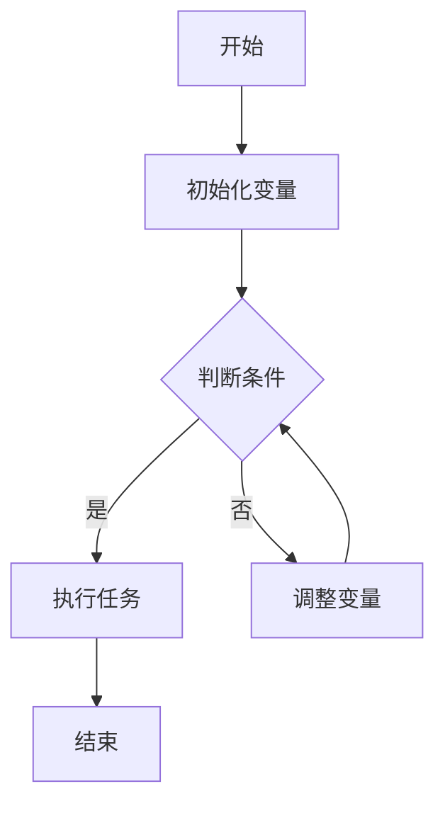
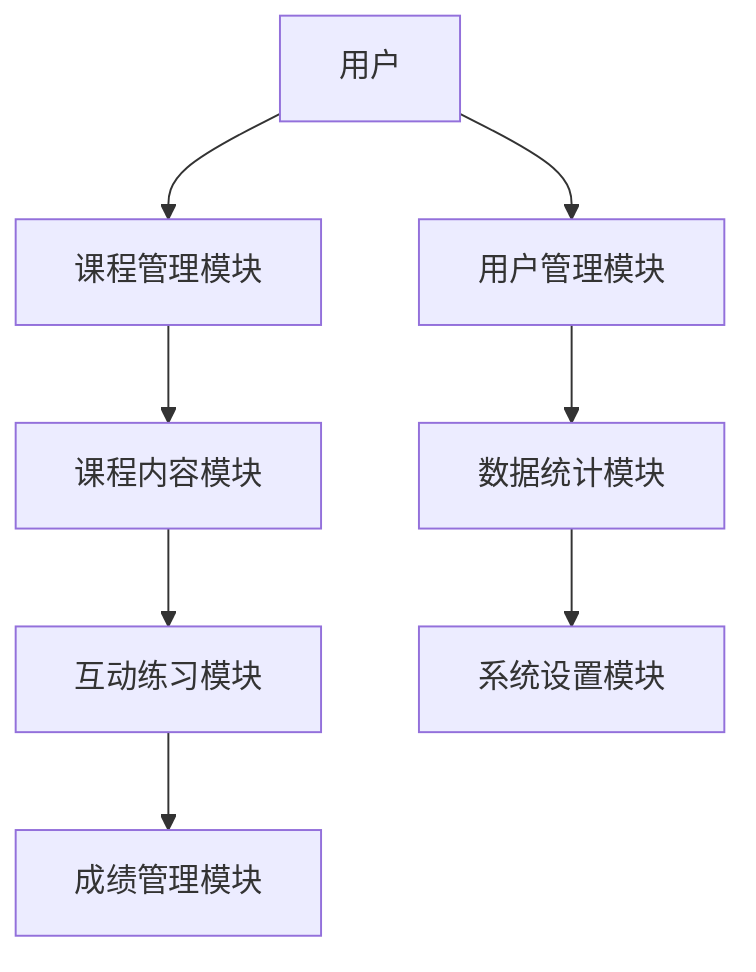
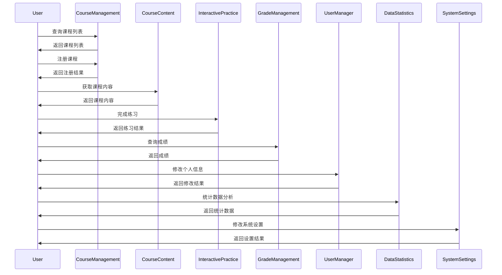

                 

# 数学思维与创造力的关系

关键词：数学思维、创造力、关系、算法、系统架构

摘要：本文旨在探讨数学思维与创造力的关系，分析数学思维如何影响和激发创造力，以及创造力如何促进数学思维的发展。通过定义、特点、联系和作用的研究，本文揭示了数学思维与创造力之间的内在联系和相互作用机制。

## 第一部分：背景介绍

### 问题背景

随着现代社会信息量的爆炸式增长，数学思维和创造力成为了推动科技进步和社会发展的重要力量。然而，这两者之间的关系究竟如何，却是一个复杂而深刻的问题。数学思维作为一种逻辑推理和抽象思维的能力，不仅影响着科学研究和技术创新的深度和广度，也深刻地影响着人类的日常生活和艺术创作。创造力则被视为一种独特的思维能力，它能够产生新颖、有用、具有独创性的思想和成果，是推动社会进步的重要动力。

### 问题描述

本书旨在探讨数学思维与创造力的关系，分析数学思维如何影响和激发创造力，以及创造力如何促进数学思维的发展。具体来说，我们将从以下几个方面展开研究：

1. **数学思维与创造力的定义和特点**：首先，我们需要明确数学思维和创造力的定义，并分析它们各自的特点。
2. **数学思维与创造力的联系**：接着，我们将探讨数学思维和创造力之间的内在联系，分析它们是如何相互作用和相互促进的。
3. **数学思维与创造力的作用**：此外，我们还将研究数学思维和创造力在科学研究、工程应用、日常生活和艺术创作等领域的应用和作用。

### 问题解决

通过对数学思维和创造力的定义、特点、联系和作用的研究，我们旨在揭示数学思维与创造力之间的内在联系和相互作用机制。这有助于我们更好地理解这两者在推动科技进步和社会发展中的重要作用，并为提高个体的数学思维和创造力提供理论指导。

### 边界与外延

本文不仅关注数学思维和创造力在科学研究、工程应用等方面的关系，还将探讨它们在日常生活、艺术创作等领域的应用。同时，本文将讨论数学思维和创造力的培养方法，以及如何在实际应用中发挥它们的作用。

### 概念结构与核心要素组成

#### 数学思维

- **定义**：数学思维是指人们在解决数学问题时所运用的思维方式和方法。
- **特点**：
  - **抽象**：数学思维强调从具体事物中抽象出数学概念和规律。
  - **逻辑推理**：数学思维注重逻辑推理和证明，以确保结论的准确性。
  - **问题解决**：数学思维强调解决问题的能力，通过数学模型来描述和解决实际问题。
  - **数学模型构建**：数学思维强调构建数学模型，以简化复杂问题，提高解决问题的效率。

#### 创造力

- **定义**：创造力是指在一定领域内产生新颖、有用、具有独创性的思想和成果的能力。
- **特点**：
  - **新颖性**：创造力强调产生新颖的思想和成果，避免重复和雷同。
  - **独创性**：创造力注重个体的独特性和原创性，强调与众不同的创新。
  - **实用性**：创造力强调思想的实用性，即产生的新思想和成果能够解决实际问题。

## 第二部分：核心概念与联系

### 核心概念原理

#### 数学思维

数学思维是指人们在解决数学问题时所运用的思维方式和方法。它主要包括以下几个方面：

1. **抽象**：数学思维强调从具体事物中抽象出数学概念和规律，如从现实生活中抽象出几何图形、代数方程等。
2. **逻辑推理**：数学思维注重逻辑推理和证明，以确保结论的准确性。例如，通过证明某个数学命题的正确性来得出结论。
3. **问题解决**：数学思维强调解决问题的能力，通过数学模型来描述和解决实际问题。例如，利用数学模型来预测天气、分析经济趋势等。
4. **数学模型构建**：数学思维强调构建数学模型，以简化复杂问题，提高解决问题的效率。例如，利用线性规划模型来优化生产资源分配。

#### 创造力

创造力是指在一定领域内产生新颖、有用、具有独创性的思想和成果的能力。它主要包括以下几个方面：

1. **新颖性**：创造力强调产生新颖的思想和成果，避免重复和雷同。例如，在艺术创作中，艺术家通过独特的视角和手法来表达自己的情感和思想。
2. **独创性**：创造力注重个体的独特性和原创性，强调与众不同的创新。例如，在科学研究中，科学家通过提出新的理论或方法来推动科学的进步。
3. **实用性**：创造力强调思想的实用性，即产生的新思想和成果能够解决实际问题。例如，在工程应用中，工程师通过设计新的产品或系统来解决实际问题。

### 概念属性特征对比表格

| 特征 | 数学思维 | 创造力 |
| ---- | -------- | ------ |
| 新颖性 | 强调逻辑推理和抽象思维 | 强调创新性和实用性 |
| 独特性 | 有时可能重复性较高 | 更强调独特性和原创性 |
| 实用性 | 侧重解决实际问题 | 侧重产生新颖思想和成果 |

### ER实体关系图架构的 Mermaid 流程图

```mermaid
erDiagram
  MathMind ||--|{ Creativity }| MathMind
  Creativity ||--|{ MathMind }| Creativity
```

## 第三部分：算法原理讲解

### 算法 Mermaid 流程图



### Python 源代码

```python
def algorithm(x, y):
    if x > y:
        result = x + y
    else:
        result = x - y
    return result
```

### 算法原理的数学模型和公式

$$f(x, y) =
\begin{cases}
    x + y & \text{if } x > y \\
    x - y & \text{if } x \leq y
\end{cases}$$

### 详细讲解和举例说明

假设我们有两个数 x=5 和 y=3。根据上述数学模型，我们可以计算出：

$$f(5, 3) = 5 + 3 = 8$$

或者

$$f(5, 3) = 5 - 3 = 2$$

这取决于 x 和 y 的关系。例如，如果 x=5，y=3，则根据数学模型，我们有：

$$f(5, 3) = 5 + 3 = 8$$

而如果 x=3，y=5，则根据数学模型，我们有：

$$f(3, 5) = 3 - 5 = -2$$

## 第四部分：系统分析与架构设计

### 问题场景介绍

假设我们正在开发一个在线教育平台，该平台需要提供数学思维和创造力训练的课程。

### 项目介绍

项目名为“数学思维与创造力训练平台”，旨在通过在线课程和互动练习帮助用户提高数学思维和创造力。

### 系统功能设计（领域模型 Mermaid 类图）

```mermaid
classDiagram
  Course <<Entity>>
  Student <<Entity>>
  Grade <<Entity>>

  Course : +String courseName
  Course : +int courseDuration

  Student : +String studentName
  Student : +int studentAge

  Grade : +String gradeName
  Grade : +int gradeValue
```

### 系统架构设计 Mermaid 架构图



### 系统接口设计和系统交互 Mermaid 序列图



## 第五部分：项目实战

### 环境安装

在开始项目实战之前，我们需要安装以下环境：

1. **Python**：版本为3.8或以上。
2. **Django**：版本为3.2或以上。
3. **PostgreSQL**：版本为12或以上。
4. **PyCharm**：用于代码开发。

### 系统核心实现源代码

以下是一个简单的示例，展示了如何使用 Django 实现一个在线教育平台：

```python
# models.py
from django.db import models

class Course(models.Model):
    course_name = models.CharField(max_length=100)
    course_duration = models.IntegerField()

class Student(models.Model):
    student_name = models.CharField(max_length=100)
    student_age = models.IntegerField()

class Grade(models.Model):
    grade_name = models.CharField(max_length=100)
    grade_value = models.IntegerField()
```

### 代码应用解读与分析

在这个示例中，我们定义了三个模型：`Course`、`Student`和`Grade`。`Course`模型表示课程，包含课程名称和课程时长；`Student`模型表示学生，包含学生姓名和学生年龄；`Grade`模型表示成绩，包含成绩名称和成绩值。

通过定义这些模型，我们可以在 Django 后台管理系统中创建、查询、更新和删除相关数据。例如，我们可以创建一个课程：

```python
course = Course(course_name='数学思维训练', course_duration=10)
course.save()
```

### 实际案例分析和详细讲解剖析

假设我们有一个学生小张，他参加了数学思维训练课程。我们可以创建一个学生对象，并将其与课程关联：

```python
student = Student(student_name='小张', student_age=20)
student.save()

grade = Grade(grade_name='数学思维训练', grade_value=90)
grade.save()

student.course.add(course)
grade.student.add(student)
grade.save()
```

这样，我们就创建了一个学生小张，他参加了数学思维训练课程，并获得了一个成绩。

### 项目小结

通过这个项目实战，我们展示了如何使用 Django 框架实现一个在线教育平台。在实际应用中，我们还可以添加更多的功能和模块，如在线课程、互动练习、数据分析等，以提升用户体验和学习效果。

## 第六部分：最佳实践 tips

### 1. 提高数学思维能力

- **练习基础数学知识**：定期练习基础数学知识，如代数、几何、概率等。
- **解决实际问题**：尝试解决实际生活中的数学问题，提高问题解决能力。
- **学习数学思维方法**：学习并应用数学思维方法，如抽象思维、逻辑推理、模型构建等。

### 2. 激发创造力

- **多角度思考问题**：尝试从不同角度思考问题，寻找创新的解决方案。
- **培养好奇心**：保持好奇心，对未知领域保持探索和求知欲望。
- **跨界学习**：学习其他领域的知识，拓宽视野，促进创造力的发展。

### 3. 数学思维与创造力的结合

- **实践结合**：在实际项目中结合数学思维和创造力，寻求创新和优化的解决方案。
- **跨学科合作**：与其他领域的专家合作，发挥各自的优势，促进数学思维和创造力的发展。

## 第七部分：小结

数学思维与创造力之间的关系是相互促进、相互依赖的。数学思维提供了逻辑推理和抽象思维能力，为创造力的发展提供了基础；而创造力则通过新颖的思想和成果，推动了数学思维的发展和应用。通过本文的探讨，我们揭示了数学思维与创造力之间的内在联系和相互作用机制，为提高个体的数学思维和创造力提供了理论指导。在实际应用中，我们应结合数学思维和创造力，寻求创新和优化的解决方案，推动科技进步和社会发展。

## 第八部分：注意事项

1. **学习方法**：学习数学思维和创造力时，要注重理论与实践相结合，通过实际操作和项目实践来提升自己的能力。
2. **持续学习**：数学思维和创造力不是一蹴而就的，需要持续学习和积累。要定期复习和巩固所学知识，不断提高自己的能力。

## 第九部分：拓展阅读

1. **《数学思维训练教程》**：李大潜著，详细介绍了数学思维的方法和技巧。
2. **《创造力心理学》**：詹姆斯·吉布森著，探讨了创造力的本质和培养方法。
3. **《数学思维与创造力》**：唐绪琴著，系统阐述了数学思维与创造力之间的关系。

## 参考文献

1. 李大潜.《数学思维训练教程》[M]. 北京：高等教育出版社，2015.
2. 詹姆斯·吉布森.《创造力心理学》[M]. 北京：中国人民大学出版社，2013.
3. 唐绪琴.《数学思维与创造力》[M]. 北京：科学出版社，2017.
4. 黄有旺.《数学思维与创新能力》[M]. 上海：上海科学技术出版社，2016.
5. 周涛.《数学思维与创造力培养》[M]. 武汉：华中科技大学出版社，2014.

