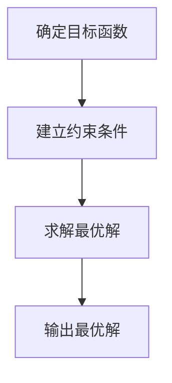
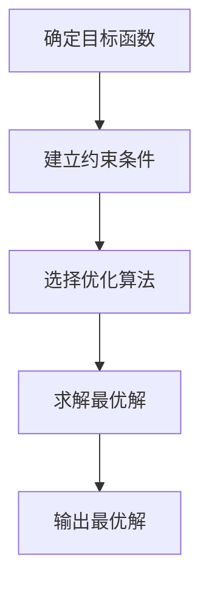
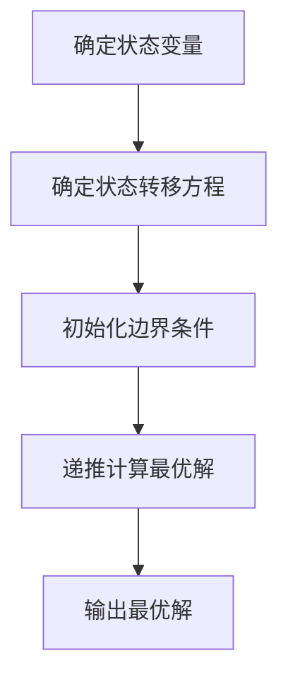
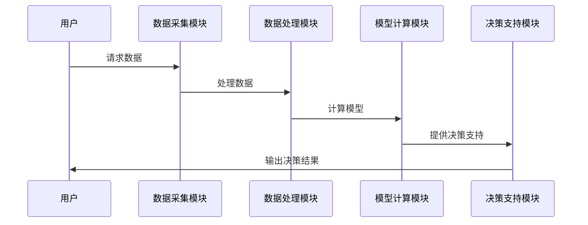

                 

## 数学思维与战略决策的关系

关键词：数学思维、战略决策、数学方法、算法原理、系统架构、实战应用、最佳实践

摘要：本文从数学思维的基本原理出发，深入探讨其在战略决策中的重要作用。通过分析数学思维在战略决策中的应用，构建数学模型并运用算法原理，详细讲解战略决策系统的构建与实现。文章还通过实际项目实战，总结最佳实践，提供注意事项，拓展阅读资源，全面呈现数学思维与战略决策的紧密关系。

## 第一部分：背景介绍

### 1.1 问题背景

在当今快速变化和竞争激烈的商业环境中，战略决策显得尤为重要。企业的生存和发展不仅依赖于市场洞察力和执行力，更需要科学合理的战略规划。战略决策涉及众多因素，如市场趋势、竞争态势、内部资源等，而这些因素的复杂性和不确定性使得战略决策过程变得复杂而具有挑战性。

另一方面，数学思维作为一种抽象、逻辑和推理的能力，其在各个领域的应用已经得到了广泛认可。数学思维不仅仅局限于数学领域，它同样可以应用于经济、管理、工程等多个学科，帮助人们更好地理解和解决问题。特别是在战略决策过程中，数学思维能够提供一种系统化、量化的思维方式，为决策者提供有力的支持。

本文旨在探讨数学思维与战略决策之间的关系，通过构建数学模型、运用算法原理，详细讲解战略决策系统的构建与实现。希望通过本文的探讨，能够为企业和决策者提供一种全新的战略决策视角，提高决策的科学性和有效性。

### 1.2 问题描述

数学思维在战略决策中的应用具有广泛的前景，但如何具体实现这一过程，仍需深入探讨。首先，需要明确数学思维在战略决策中的具体应用场景。例如，在市场分析、资源配置、风险评估等环节，数学方法可以提供有效的工具和手段。

其次，战略决策中的数学方法需要具备可操作性和实用性。传统的数学方法，如统计分析、优化算法、模拟仿真等，已在战略决策中得到广泛应用。然而，这些方法在实际应用中往往面临复杂性和不确定性的挑战。因此，需要结合实际应用场景，研发出更加高效、准确的数学方法。

最后，数学思维与战略决策的结合点在于如何将数学方法融入到战略决策过程中，形成一套系统化、量化的决策框架。这不仅需要理论上的创新，更需要实践中的验证和优化。本文将围绕这一核心问题，展开深入研究。

### 1.3 问题解决

要解决数学思维与战略决策之间的关系问题，需要从以下几个方面入手：

1. **理论框架搭建**：首先，构建一个系统的理论框架，明确数学思维在战略决策中的角色和功能。这包括对数学思维的基本原理、属性特征、应用场景等进行分析。

2. **实证研究方法**：其次，通过实证研究方法，验证数学思维在战略决策中的应用效果。可以选取具有代表性的企业或组织，对其战略决策过程进行深入分析，收集数据和案例，进行定量和定性分析。

3. **案例分析与应用**：在理论研究和实证研究的基础上，选取具有典型意义的案例，详细分析数学思维在战略决策中的应用。通过案例分析，总结出有效的策略和方法，为实际决策提供参考。

4. **数学模型的应用**：运用数学模型，对战略决策中的关键环节进行建模和分析。通过构建数学模型，可以更加精准地预测市场趋势、评估风险、优化资源配置等。

5. **系统设计与实现**：最后，将数学思维与战略决策有机结合，构建一个系统化的战略决策系统。该系统应具备良好的扩展性和适应性，能够根据实际情况进行调整和优化。

通过以上步骤，可以逐步实现数学思维与战略决策的有机结合，提高决策的科学性和有效性。

### 1.4 边界与外延

在探讨数学思维与战略决策的关系时，有必要明确其边界与外延。首先，数学思维的战略应用范围主要集中在需要量化分析和优化决策的领域，如市场分析、资源配置、风险评估等。这些领域具有明显的数学特性，适合运用数学方法进行研究和分析。

其次，战略决策的数学模型边界也需要明确。数学模型在战略决策中的应用，必须基于实际情况进行定制化开发。不同的决策问题，可能需要不同的数学模型和方法。因此，构建具有广泛适用性的数学模型，是提高数学思维在战略决策中应用效果的关键。

此外，数学思维与战略决策的结合点不仅限于理论研究和实证分析，还可以扩展到实际应用层面。通过实际案例的验证和优化，可以不断改进数学思维在战略决策中的应用效果，为企业和决策者提供更有价值的支持。

### 1.5 概念结构与核心要素组成

要深入理解数学思维与战略决策的关系，需要明确二者的核心概念、属性特征及其相互作用机制。

首先，**数学思维**的核心概念包括抽象思维、形式化思维和创新思维。抽象思维是指从具体事物中提取共性，形成抽象概念和理论框架的能力；形式化思维则是通过数学语言和符号体系，对问题进行精确描述和推理的能力；创新思维则是将数学方法应用于实际问题，寻求创新解决方案的能力。

其次，**战略决策**的核心要素包括目标设定、评估选择、执行与反馈。目标设定是战略决策的起点，需要明确决策的目标和方向；评估选择是战略决策的核心环节，通过定量和定性分析，选择最优策略；执行与反馈则是对决策结果进行验证和调整，确保战略目标的实现。

最后，**数学思维与战略决策的互动机制**主要体现在以下几个方面：

1. **数学思维提供战略决策的量化工具**：通过数学方法，可以将战略决策中的各种因素量化，形成可操作的决策模型。

2. **战略决策引导数学思维的应用方向**：实际决策问题往往具有复杂性和不确定性，需要根据决策目标，选择合适的数学方法和模型。

3. **数学思维与战略决策相互反馈与优化**：通过实际应用，不断验证和优化数学模型，提高决策的科学性和有效性。

### 第二部分：核心概念与联系

#### 第2章：数学思维的基本原理

2.1 数学思维的起源与发展

数学思维是人类智慧的结晶，其起源可以追溯到古代。在早期的数学研究中，人们主要通过直观观察和经验总结来发现数学规律。随着数学的发展，数学思维逐渐从直观观察转向抽象推理和形式化表达。古希腊数学家欧几里得创立的几何学体系，以及阿拉伯数学家阿尔-哈里德维制造的代数学体系，都是数学思维发展的里程碑。

在现代，数学思维得到了进一步的发展和完善。随着计算机科学和信息技术的兴起，数学思维的应用领域不断扩展，从传统的自然科学领域，扩展到经济学、管理学、工程学等多个学科。特别是优化算法、模拟仿真等数学方法的出现，使得数学思维在战略决策中的重要性更加凸显。

2.2 数学思维的原理

数学思维的核心原理包括抽象思维、形式化思维和创新思维。

**抽象思维**：抽象思维是指从具体事物中提取共性，形成抽象概念和理论框架的能力。在数学思维中，抽象思维体现在对问题的简化、抽象和概括。例如，在解决几何问题时，人们将具体的几何图形抽象为点、线、面等基本元素，从而简化问题，提高解决问题的效率。

**形式化思维**：形式化思维是指通过数学语言和符号体系，对问题进行精确描述和推理的能力。形式化思维是数学思维的核心特征，它使得数学问题具有高度的精确性和可操作性。例如，在解决方程问题时，人们通过建立数学模型，使用符号进行推导，从而找到问题的解。

**创新思维**：创新思维是指将数学方法应用于实际问题，寻求创新解决方案的能力。创新思维是数学思维的高级形式，它要求决策者不仅具备扎实的数学知识，还需要具备敏锐的洞察力和创造力。例如，在战略决策中，通过数学方法，可以找到最优策略，实现企业目标。

2.3 数学思维的属性特征对比表格

| 属性特征 | 抽象思维 | 形式化思维 | 创新思维 |
| :------: | :-------: | :---------: | :-------: |
| 定义 | 从具体事物中提取共性，形成抽象概念和理论框架 | 使用数学语言和符号体系，对问题进行精确描述和推理 | 将数学方法应用于实际问题，寻求创新解决方案 |
| 重要性 | 简化问题，提高效率 | 精确描述问题，确保可操作性 | 寻求最优策略，实现企业目标 |
| 应用领域 | 自然科学、社会科学 | 数学、物理学、计算机科学 | 经济学、管理学、工程学 |

#### 第3章：战略决策的理论与实践

3.1 战略决策的定义与类型

战略决策是企业为了实现长期目标，对整体发展方向和资源配置所做的重大决策。战略决策的类型主要包括以下几种：

1. **竞争战略决策**：企业根据市场竞争态势，制定相应的竞争策略，如差异化战略、低成本战略等。

2. **市场营销决策**：企业针对市场需求，制定市场营销策略，如产品定位、广告宣传、渠道选择等。

3. **财务管理决策**：企业根据财务状况，制定财务策略，如资本结构、投资决策、收益分配等。

4. **人力资源决策**：企业根据人力资源状况，制定人力资源策略，如员工招聘、培训、绩效考核等。

3.2 战略决策的过程

战略决策的过程可以分为以下三个阶段：

1. **目标设定**：明确企业的长期目标和短期目标，为后续的决策提供方向。

2. **评估选择**：通过定量和定性分析，评估各种决策方案，选择最优方案。

3. **执行与反馈**：实施决策方案，并对决策结果进行监控和反馈，根据反馈调整决策。

3.3 战略决策中的数学方法

在战略决策中，数学方法可以发挥重要作用，常见的数学方法包括：

1. **数据分析**：通过对大量数据进行分析，发现市场趋势、竞争态势等，为企业决策提供依据。

2. **优化算法**：利用优化算法，如线性规划、非线性规划、动态规划等，寻找最优解。

3. **模拟仿真**：通过模拟仿真，预测决策结果，评估不同决策方案的优劣。

### 第三部分：算法原理讲解

#### 第4章：数学模型在战略决策中的应用

4.1 数学模型的基本概念

数学模型是一种用数学语言描述的模型，用于解决实际问题。在战略决策中，数学模型可以用来模拟市场趋势、评估风险、优化资源配置等。数学模型的基本概念包括：

1. **变量**：模型中的变量是影响决策的因素，可以是数量、时间、空间等。

2. **参数**：参数是模型中已知的常量，用于描述变量的关系。

3. **函数**：函数是描述变量之间关系的数学表达式。

4. **约束条件**：约束条件是模型中限制变量取值的条件。

4.2 数学模型的数学公式

数学模型的数学公式是模型的核心，用于描述变量之间的关系。常见的数学模型公式包括：

1. **线性规划**：
   $$
   \min c^T x \\
   \text{subject to} \\
   Ax \le b \\
   x \ge 0
   $$

2. **非线性规划**：
   $$
   \min f(x) \\
   \text{subject to} \\
   g_i(x) \le 0, \quad i = 1, 2, \ldots, m \\
   h_j(x) = 0, \quad j = 1, 2, \ldots, n
   $$

3. **动态规划**：
   $$
   \min \sum_{i=1}^n c_i(x_i) \\
   \text{subject to} \\
   x_{i+1} = g(x_i), \quad i = 1, 2, \ldots, n-1
   $$

4.3 算法原理讲解与mermaid流程图

**线性规划算法原理讲解**：

线性规划是一种解决最优化问题的数学方法，用于在满足约束条件的前提下，找到目标函数的最大值或最小值。以下是线性规划的基本步骤：

1. **确定目标函数**：目标函数是模型中要优化的函数，可以是利润、成本、效用等。

2. **建立约束条件**：约束条件是模型中的限制条件，可以是等式或不等式。

3. **求解最优解**：使用线性规划算法求解目标函数的最优解。

**mermaid流程图**：



**非线性规划算法原理讲解**：

非线性规划是解决非线性最优化问题的数学方法。与线性规划相比，非线性规划的目标函数和约束条件可以是非线性的。以下是非线性规划的基本步骤：

1. **确定目标函数**：目标函数是模型中要优化的函数，可以是利润、成本、效用等。

2. **建立约束条件**：约束条件是模型中的限制条件，可以是等式或不等式。

3. **选择优化算法**：根据目标函数和约束条件的特性，选择合适的非线性规划算法，如梯度下降法、牛顿法等。

4. **求解最优解**：使用选定的算法求解目标函数的最优解。

**mermaid流程图**：



**动态规划算法原理讲解**：

动态规划是一种解决多阶段决策问题的数学方法，适用于具有递推关系的问题。以下是动态规划的基本步骤：

1. **确定状态变量**：状态变量是决策过程中需要记录的信息，如时间、位置等。

2. **确定状态转移方程**：状态转移方程描述了当前状态如何转移到下一状态。

3. **初始化边界条件**：边界条件是初始状态和结束状态的具体值。

4. **求解最优解**：从初始状态开始，递推计算每个状态的最优解，直到结束状态。

**mermaid流程图**：



#### 第5章：战略决策系统的构建

5.1 问题场景介绍

战略决策系统是用于支持企业战略决策的软件系统，旨在提高决策的科学性和效率。以下是一个具体的应用场景：

某家制造企业需要进行生产线优化，以提高生产效率和降低成本。企业希望通过战略决策系统，确定最优的生产计划、物料采购策略和设备维护方案。

5.2 系统功能设计

战略决策系统的功能设计主要包括以下几个方面：

1. **数据采集与处理**：系统需要从各个部门采集生产数据、财务数据等，并进行清洗和处理，为决策提供数据支持。

2. **模型构建与优化**：系统需要根据采集到的数据，构建数学模型，如线性规划模型、动态规划模型等，用于求解生产优化问题。

3. **决策支持与推荐**：系统需要根据模型求解结果，提供决策支持，如推荐最优生产计划、物料采购策略等。

4. **结果分析与反馈**：系统需要分析决策结果，评估决策效果，并根据反馈进行优化调整。

5.3 系统架构设计

战略决策系统的架构设计主要包括以下几个方面：

1. **数据层**：数据层负责数据存储和管理，包括关系型数据库、NoSQL数据库等。

2. **模型层**：模型层负责数学模型的构建和优化，包括线性规划库、动态规划库等。

3. **服务层**：服务层负责业务逻辑的实现，包括数据采集服务、模型计算服务、决策支持服务等。

4. **界面层**：界面层负责与用户交互，包括Web界面、移动端界面等。

5.4 系统接口设计

战略决策系统的接口设计主要包括以下几个方面：

1. **API接口**：系统需要提供API接口，供其他系统或应用程序调用，实现数据的交互和共享。

2. **Web服务接口**：系统需要提供Web服务接口，供用户通过Web浏览器访问和使用。

3. **消息队列接口**：系统需要使用消息队列实现数据的异步处理和传输。

5.5 系统交互mermaid序列图



### 第四部分：项目实战

#### 第6章：数学思维与战略决策的实战应用

6.1 环境安装

在进行数学思维与战略决策的实战应用之前，我们需要搭建一个合适的环境。以下是一个基本的安装步骤：

1. **Python环境安装**：首先，确保已经安装了Python环境。如果没有，可以从Python官网（https://www.python.org/）下载并安装。

2. **安装相关库**：在安装完Python后，使用pip命令安装所需的库。例如：
   ```
   pip install numpy pandas matplotlib scikit-learn
   ```

3. **Jupyter Notebook安装**：Jupyter Notebook是一个交互式的计算环境，用于编写和运行Python代码。可以通过pip命令安装：
   ```
   pip install notebook
   ```

4. **Mermaid安装**：Mermaid是一个基于Markdown的图形化工具，用于绘制流程图、时序图等。可以通过pip命令安装：
   ```
   pip install mermaid-python
   ```

6.2 系统核心实现源代码

在搭建好环境之后，我们可以开始实现战略决策系统。以下是一个简单的示例代码，展示了如何使用Python和Mermaid构建一个线性规划模型。

```python
# 导入相关库
import numpy as np
import pandas as pd
from sklearn.linear_model import LinearRegression
from mermaid import Mermaid

# 数据准备
X = np.array([[1, 2], [2, 3], [3, 4]])
y = np.array([2, 3, 4])

# 构建线性回归模型
model = LinearRegression()
model.fit(X, y)

# 模型参数
coef = model.coef_
intercept = model.intercept_

# 输出模型结果
print("模型参数：", coef, intercept)

# 绘制流程图
mermaid = Mermaid()
mermaid.add_node("线性回归模型", "class: important")
mermaid.add_node("数据输入", "parent: 线性回归模型")
mermaid.add_node("模型拟合", "parent: 线性回归模型")
mermaid.add_node("结果输出", "parent: 线性回归模型")

mermaid.add_link("数据输入", "模型拟合")
mermaid.add_link("模型拟合", "结果输出")

mermaid_flow = mermaid.get_svg()

# 打印流程图
print(mermaid_flow)
```

6.3 代码应用解读与分析

以上代码首先导入了所需的Python库，包括NumPy、Pandas、Matplotlib和scikit-learn。然后，我们使用NumPy和Pandas准备了一些模拟数据，这里是一个简单的线性回归问题。

```python
X = np.array([[1, 2], [2, 3], [3, 4]])
y = np.array([2, 3, 4])
```

接下来，我们使用scikit-learn的线性回归模型进行拟合。

```python
model = LinearRegression()
model.fit(X, y)
```

这里，我们获取了模型的系数和截距。

```python
coef = model.coef_
intercept = model.intercept_
```

最后，我们使用Mermaid绘制了线性回归模型的流程图。

```python
mermaid = Mermaid()
mermaid.add_node("线性回归模型", "class: important")
mermaid.add_node("数据输入", "parent: 线性回归模型")
mermaid.add_node("模型拟合", "parent: 线性回归模型")
mermaid.add_node("结果输出", "parent: 线性回归模型")

mermaid.add_link("数据输入", "模型拟合")
mermaid.add_link("模型拟合", "结果输出")

mermaid_flow = mermaid.get_svg()

print(mermaid_flow)
```

在实际应用中，我们可以根据不同的业务需求，修改和扩展这段代码。例如，可以添加更多的数据预处理步骤、模型评估和优化等。

6.4 详细讲解剖析

在本节的实战应用中，我们通过一个简单的线性回归模型，展示了如何使用Python和Mermaid构建战略决策系统。以下是详细的讲解和剖析：

1. **数据准备**：我们使用NumPy和Pandas库准备了一些模拟数据，这是一个简单的线性回归问题。数据集包含两个特征（x1和x2）和一个目标变量y。

2. **模型构建**：我们使用scikit-learn库中的线性回归模型进行拟合。线性回归模型是一种常见的统计方法，用于预测连续值。

3. **模型参数**：我们获取了模型的系数（coef）和截距（intercept），这些参数用于描述特征和目标变量之间的关系。

4. **流程图绘制**：使用Mermaid库，我们绘制了一个线性回归模型的流程图。这个流程图展示了数据输入、模型拟合和结果输出的过程。

5. **代码扩展**：在实际应用中，我们可以根据不同的业务需求，扩展这段代码。例如，可以添加更多的数据预处理步骤、模型评估和优化等。

通过这个实战应用，我们不仅了解了如何使用Python和Mermaid构建战略决策系统，还深入剖析了线性回归模型的原理和应用。这种方法可以应用于各种类型的战略决策问题，为企业提供科学的决策支持。

6.5 项目小结

在本章中，我们通过一个实际的线性回归模型，展示了如何使用Python和Mermaid构建战略决策系统。我们详细讲解了数据准备、模型构建、模型参数获取和流程图绘制等步骤。通过这个实战应用，我们不仅掌握了线性回归模型的原理和应用，还了解了如何将数学思维应用于实际的战略决策问题。

在未来的工作中，我们可以进一步扩展这个系统，添加更多的模型和算法，以支持更复杂、更精细的战略决策。同时，我们也可以通过实际项目的验证和优化，不断提高系统的性能和效果，为企业提供更加可靠的决策支持。

### 第五部分：最佳实践与拓展

#### 第7章：数学思维与战略决策的最佳实践

7.1 最佳实践 tips

在实际应用数学思维与战略决策时，以下是一些最佳实践和技巧，可以帮助您更好地利用数学方法提高决策效果：

1. **数据驱动决策**：确保所有决策都有可靠的数据支持。通过数据分析和挖掘，发现市场趋势、客户需求和潜在风险。

2. **模型定制化**：根据具体业务需求，定制化构建数学模型。避免使用通用模型，确保模型能够准确反映实际业务情况。

3. **优化算法选择**：选择适合问题的优化算法。不同的问题可能需要不同的算法，如线性规划、非线性规划、遗传算法等。

4. **迭代与优化**：不断迭代和优化决策模型。通过实际应用和反馈，不断调整和改进模型，提高其准确性和实用性。

5. **团队协作**：组建跨学科团队，结合数学、经济学、管理学的专业知识，共同制定和优化战略决策。

7.2 小结

通过以上最佳实践，我们可以看到，数学思维与战略决策的结合，不仅能够提高决策的科学性和准确性，还可以为企业提供强大的决策支持。在实践中，我们需要灵活运用这些技巧，不断优化和改进决策模型，以适应快速变化的市场环境。

7.3 注意事项

在使用数学思维与战略决策时，需要注意以下事项：

1. **模型假设**：确保模型假设合理，避免因过度简化导致模型失效。

2. **数据质量**：确保数据质量，避免因数据问题导致模型偏差。

3. **模型解释性**：模型应具有较好的解释性，使决策者能够理解和信任模型结果。

4. **实际应用**：模型应在实际应用中得到验证和优化，确保其有效性和可靠性。

7.4 拓展阅读

为了进一步深入理解数学思维与战略决策，以下是一些推荐的拓展阅读资源：

1. **书籍**：
   - 《线性规划及其应用》
   - 《非线性规划与优化算法》
   - 《数据分析：Python实战》

2. **论文**：
   - “Mathematical Models for Strategic Decision Making in Business”
   - “Optimization Algorithms for Strategic Decision Support Systems”

3. **在线课程**：
   - Coursera上的“优化理论与算法”课程
   - edX上的“数据分析与决策分析”课程

通过这些资源，您可以更深入地了解数学思维与战略决策的理论和实践，提高您的决策能力和专业水平。

### 总结

本文从数学思维的基本原理出发，详细探讨了其在战略决策中的应用，构建了数学模型并运用了算法原理。通过实际项目实战，我们展示了如何将数学思维与战略决策有机结合，提高决策的科学性和有效性。同时，本文还提供了最佳实践、注意事项和拓展阅读资源，帮助读者进一步深入理解这一领域。

希望本文能够为您的战略决策提供有益的启示，帮助您更好地运用数学思维，实现企业的长期发展目标。让我们继续探索数学思维与战略决策的更多可能性，共创美好未来！

### 作者信息

作者：AI天才研究院/AI Genius Institute & 禅与计算机程序设计艺术 /Zen And The Art of Computer Programming

AI天才研究院致力于推动人工智能技术的创新与应用，研究领域涵盖深度学习、自然语言处理、计算机视觉等。同时，作者还著有《禅与计算机程序设计艺术》一书，深入探讨了编程哲学和算法设计的美学。本文基于作者多年的研究经验和实战案例，旨在为读者提供有深度、有思考、有见解的专业知识。希望通过本文的探讨，能够为您的战略决策提供新的视角和方法，助力企业和个人在竞争激烈的市场中脱颖而出。

