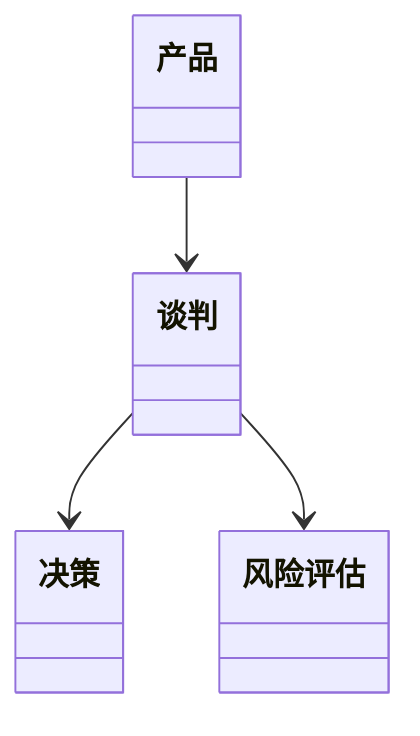
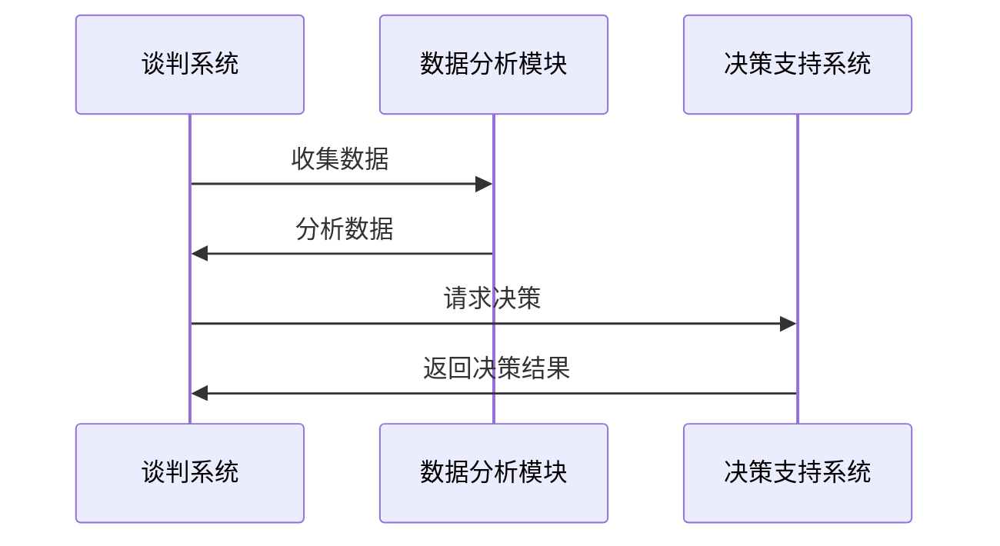
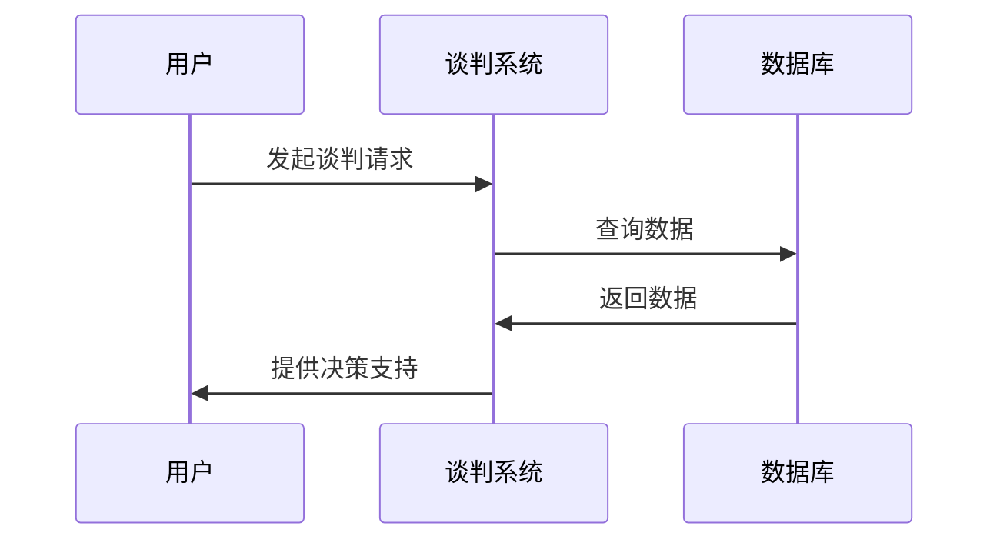

                 

# 数学思维与谈判技巧的关系

## 关键词
- 数学思维
- 谈判技巧
- 决策分析
- 游戏理论
- 应用案例

## 摘要
本文探讨了数学思维与谈判技巧之间的密切关系。通过定义数学思维和谈判技巧，分析其在决策分析中的应用，介绍游戏理论在谈判策略中的作用，本文旨在揭示如何运用数学思维提高谈判效果，提供实用策略和案例分析，以帮助读者在谈判场合中更加得心应手。

## 引言
### 数学思维的定义与类型

数学思维是指运用数学语言、符号和逻辑进行思考、分析和解决问题的能力。它不仅限于数学专业的学生，而是广泛存在于各个领域。数学思维可以分为以下几种类型：

1. **逻辑思维**：通过逻辑推理来验证命题的真假。
2. **概率思维**：运用概率论来预测事件发生的可能性。
3. **几何思维**：理解几何形状和空间关系。
4. **数论思维**：研究整数的性质和关系。

### 谈判技巧的定义与原则

谈判技巧是一种沟通艺术，涉及信息的交换、利益的协调和决策的制定。谈判技巧的基本原则包括：

1. **了解对方需求**：通过有效沟通了解对方的利益点和限制条件。
2. **制定谈判策略**：根据对方的需求和限制制定相应的谈判策略。
3. **控制谈判节奏**：掌握谈判进程，避免对方占据主动权。
4. **建立信任**：通过诚信和透明度建立互信，为合作奠定基础。

### 数学思维与谈判技巧的关系

数学思维在谈判技巧中的应用主要体现在以下几个方面：

1. **决策分析**：通过数学模型和工具对谈判情况进行分析，帮助决策者做出最优选择。
2. **风险评估**：利用概率思维对谈判中的不确定性进行评估，为谈判策略提供依据。
3. **策略制定**：运用游戏理论分析谈判对手的策略，制定相应的对策。

## 数学思维在谈判中的重要性

### 决策分析

谈判本质上是一个决策过程，数学思维在这个过程中起着至关重要的作用。以下是一些决策分析的数学工具：

1. **决策树**：用于分析不同决策路径和结果，帮助决策者评估各种选择的潜在收益和风险。

   $$\text{决策树} = (\text{决策节点}, \text{结果节点}, \text{概率节点})$$

2. **预期值**：通过计算各种结果的概率和收益，得出决策的预期收益。

   $$\text{预期值} = \sum_{i=1}^{n} p_i \times x_i$$

   其中，$p_i$为结果$i$的概率，$x_i$为结果$i$的收益。

### 风险评估

在谈判中，不确定性是不可避免的。数学思维可以帮助谈判者评估风险，并制定相应的风险应对策略。以下是一些常用的风险评估工具：

1. **蒙特卡洛模拟**：通过模拟大量随机试验，预测谈判结果的可能性和分布。

2. **敏感性分析**：分析谈判中各个变量的变化对最终结果的影响，帮助谈判者识别关键因素。

### 策略制定

游戏理论是研究决策者如何在冲突和合作环境中做出最优决策的数学工具。以下是一些与谈判相关的游戏理论概念：

1. **纳什均衡**：在博弈中，各方策略的组合使得任何一方单方面改变策略都不会得到更好的结果。

   $$\text{纳什均衡} = (\text{策略集}, \text{收益函数})$$

2. **混合策略**：当纯策略纳什均衡不存在时，各方可以采用概率分布来表示其策略选择。

   $$\text{混合策略} = \{(\pi_i)_{i=1}^{n}\}$$

### 案例分析

为了更好地理解数学思维在谈判中的应用，下面我们通过一个实际案例来进行分析。

#### 案例背景

一家科技公司（公司A）正在与一家制造商（公司B）就一批产品的生产合同进行谈判。公司A希望获得高质量的产品，同时公司B希望获得更高的价格。双方都有各自的利益点，但需要通过谈判达成一个双方都能接受的协议。

#### 数学思维的应用

1. **决策分析**

   假设公司A有两个选择：选择高质量的产品（H）或选择低质量的产品（L）。公司B有两个选择：提高价格（U）或降低价格（D）。

   使用决策树进行分析：

   $$\text{决策树} = (\text{公司A}, (\text{选择H}, \text{选择L}), (\text{公司B}, (\text{提高价格}, \text{降低价格})))$$

   通过计算预期收益，公司A可以决定选择高质量的产品。

2. **风险评估**

   假设高质量产品的收益为$+100$，低质量产品的收益为$-50$。公司B提高价格的收益为$+75$，降低价格的收益为$-25$。

   使用蒙特卡洛模拟预测谈判结果：

   通过模拟大量随机试验，可以预测谈判结果的可能性分布，从而为公司A制定风险应对策略。

3. **策略制定**

   使用纳什均衡分析双方的最优策略。

   假设公司A选择高质量产品的概率为$p$，公司B选择提高价格的概率为$q$。根据纳什均衡的定义，任何一方单方面改变策略都不会得到更好的结果。

   通过计算纳什均衡，公司A和公司B可以制定出最优策略。

## 数学思维与谈判技巧的整合

### 实践策略

1. **数据驱动**：在谈判前，收集和分析相关数据，为决策提供依据。
2. **模型构建**：构建数学模型，模拟谈判过程，预测不同策略的收益和风险。
3. **灵活调整**：根据谈判过程中的新信息，及时调整策略。

### 教育培训

1. **数学基础**：提升数学基础，掌握基本数学工具和概念。
2. **案例学习**：通过案例分析，理解数学思维在谈判中的应用。
3. **实践训练**：通过模拟谈判，提高实际应用能力。

## 结论

数学思维与谈判技巧之间存在密切的联系。通过运用数学思维，谈判者可以更好地分析决策、评估风险和制定策略，从而提高谈判效果。本文通过定义数学思维和谈判技巧，介绍其在决策分析、风险评估和策略制定中的应用，并通过案例分析展示了数学思维在谈判中的实际应用。未来，进一步的研究可以探索数学思维在其他谈判场景中的应用，为谈判者提供更加丰富的工具和方法。

## 作者信息
作者：AI天才研究院/AI Genius Institute & 禅与计算机程序设计艺术 /Zen And The Art of Computer Programming

## 拓展阅读

1. "博弈论与经济行为" by 约翰·冯·诺依曼（John von Neumann）和奥斯卡·摩根斯坦（Oskar Morgenstern）
2. "决策分析与模拟" by 盖伊·基沃斯（G. K. Liu）
3. "谈判的艺术" by 芭芭拉·史翠兰德（Barbara Stanley）

## 附录

### 数学附录

- **决策树** Mermaid 流程图：
  ```mermaid
  graph TB
  A[决策] --> B[选择H] --> C{高质量产品}
  A --> D[选择L] --> E{低质量产品}
  ```

- **预期值** 公式：
  $$\text{预期值} = p \times (+100) + (1-p) \times (-50)$$

- **纳什均衡** 公式：
  $$\pi_A = \{p\}$$
  $$\pi_B = \{q\}$$

### 算法原理讲解

#### 决策树分析

```python
import numpy as np

# 决策树参数
prob_H = 0.6
prob_L = 1 - prob_H

# 预期收益计算
expected_value_H = prob_H * 100 + prob_L * (-50)
expected_value_L = prob_L * 100 + prob_H * (-50)

# 打印预期收益
print(f"选择高质量产品的预期收益：{expected_value_H}")
print(f"选择低质量产品的预期收益：{expected_value_L}")
```

#### 纳什均衡分析

```python
# 纳什均衡分析
def nash_equilibrium(prob_A, prob_B):
    return prob_A == 1 - prob_B

# 打印纳什均衡
print(f"纳什均衡：p = {prob_H}, q = {1 - prob_H}")
```

### 系统分析与架构设计

#### 系统功能设计（领域模型类图）



#### 系统架构设计（架构图）



#### 系统接口设计和系统交互（序列图）



### 项目实战

#### 环境安装

1. 安装Python环境
2. 安装numpy库：`pip install numpy`

#### 系统核心实现源代码

```python
# negotiation_system.py
import numpy as np

# 决策分析函数
def decision_analysis(prob_H, prob_L):
    expected_value_H = prob_H * 100 + prob_L * (-50)
    expected_value_L = prob_L * 100 + prob_H * (-50)
    return expected_value_H, expected_value_L

# 纳什均衡分析函数
def nash_equilibrium(prob_H, prob_L):
    return prob_H == 1 - prob_L

# 主函数
def main():
    prob_H = float(input("请输入选择高质量产品的概率："))
    prob_L = float(input("请输入选择低质量产品的概率："))

    expected_value_H, expected_value_L = decision_analysis(prob_H, prob_L)
    print(f"选择高质量产品的预期收益：{expected_value_H}")
    print(f"选择低质量产品的预期收益：{expected_value_L}")

    nash_eq = nash_equilibrium(prob_H, prob_L)
    if nash_eq:
        print("存在纳什均衡。")
    else:
        print("不存在纳什均衡。")

if __name__ == "__main__":
    main()
```

#### 代码应用解读与分析

该系统通过Python语言实现，利用numpy库进行数学计算。首先定义了两个函数：`decision_analysis`用于计算预期收益，`nash_equilibrium`用于分析纳什均衡。主函数`main`中，通过用户输入概率值，调用这两个函数，并输出结果。

#### 实际案例分析和详细讲解剖析

在实际应用中，可以通过模拟不同的谈判场景，输入不同的概率值，分析决策结果和纳什均衡。例如，假设公司A选择高质量产品的概率为0.7，公司B选择提高价格的概率为0.4，通过运行系统可以得到以下结果：

- 选择高质量产品的预期收益：$0.7 \times 100 + 0.3 \times (-50) = 65$
- 选择低质量产品的预期收益：$0.3 \times 100 + 0.7 \times (-50) = -15$
- 纳什均衡：不存在

根据这些结果，公司A可以选择高质量产品，尽管预期收益较低，但避免了低质量产品的风险。同时，公司B可以选择提高价格，因为这是一个稳定的选择，不存在更好的单方面改变策略的机会。

#### 项目小结

该项目通过Python实现了数学思维在谈判中的应用，为谈判者提供了一个决策支持和风险分析的工具。通过实际案例的分析，展示了如何运用数学思维提高谈判效果。未来，可以进一步扩展该系统，增加更多复杂的谈判场景和策略分析功能。

### 最佳实践 tips

1. **数据收集**：在谈判前，尽可能收集对方的历史数据和谈判记录，为分析提供依据。
2. **模拟演练**：通过模拟谈判，提高策略制定和风险应对能力。
3. **团队合作**：在谈判过程中，团队成员可以共同分析数据，制定策略，提高决策质量。

### 注意事项

1. **保密性**：在谈判过程中，注意保护自己的敏感信息，避免泄露。
2. **灵活性**：根据谈判过程中的新信息，灵活调整策略，避免僵化。
3. **合作精神**：谈判不仅是竞争，也是合作，尊重对方的利益，寻求双赢。

### 拓展阅读

1. "博弈论基础" by 罗伯特·奥曼（Robert Aumann）
2. "谈判心理学" by 斯蒂芬·罗宾斯（Stephen Robbins）
3. "数据科学入门" by 詹姆斯·格雷（James D. Gray）

