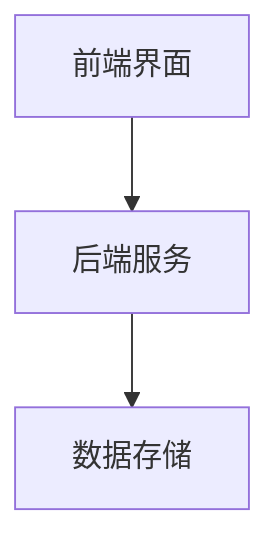

                 

### 文章标题：数学思维与谈判策略的关系

> 关键词：数学思维、谈判策略、博弈论、数据分析、概率论

> 摘要：本文深入探讨了数学思维与谈判策略之间的关系，详细阐述了数学思维在谈判策略中的应用，包括逻辑推理、数据分析、概率论等核心概念，以及它们在谈判中的实际应用。文章通过具体算法和模型，如博弈论和线性规划，解释了数学思维如何提升谈判效果，并提供了一系列实用技巧和案例分析，帮助读者更好地理解和应用数学思维于谈判策略中。

### 目录

1. **背景与概念介绍**  
   1.1 数学思维的概念与重要性  
   1.2 谈判策略的基本概念  
   1.3 数学思维与谈判策略的关系

2. **核心概念与联系**  
   2.1 逻辑推理  
   2.2 数据分析  
   2.3 概率论  
   2.4 数学思维与谈判策略的内在联系

3. **算法原理讲解**  
   3.1 博弈论  
   3.2 线性规划  
   3.3 数学模型与公式讲解

4. **系统分析与架构设计**  
   4.1 谈判策略系统概述  
   4.2 系统功能设计  
   4.3 系统架构设计  
   4.4 数学思维应用实例

5. **项目实战**  
   5.1 项目背景  
   5.2 项目实现过程  
   5.3 项目成果分析

6. **最佳实践与拓展**  
   6.1 谈判策略中的数学思维应用技巧  
   6.2 谈判策略实践案例分析  
   6.3 小结  
   6.4 注意事项  
   6.5 拓展阅读

7. **数学思维与谈判策略的未来发展**  
   7.1 谈判策略的发展趋势  
   7.2 数学思维在谈判策略中的应用前景  
   7.3 未来展望

### 第1章：数学思维与谈判策略概述

1.1 数学思维的概念与重要性

数学思维是一种抽象的、逻辑的、理性的思维方式，它不仅包括数学的基本概念和原理，还涉及对问题的分析、推理和解决能力。数学思维在多个领域都具有广泛应用，例如科学研究、工程计算、金融分析等。在谈判策略中，数学思维同样扮演着关键角色。

数学思维的重要性体现在以下几个方面：

- **逻辑推理**：数学思维强调逻辑性和严密性，使谈判者能够更准确地分析问题、构建论证，避免逻辑谬误，提高谈判的说服力。
- **数据分析**：数学思维有助于谈判者从大量数据中提取关键信息，识别趋势和模式，为谈判决策提供数据支持。
- **概率论**：概率论是数学思维的重要组成部分，它帮助谈判者评估风险和不确定性，制定更合理的谈判策略。

1.2 谈判策略的基本概念

谈判策略是指通过协商和讨论，以达成各方都能接受的协议的过程。谈判策略涉及多个方面，包括目标设定、信息收集、谈判策略选择、沟通技巧等。

谈判策略的类型主要包括以下几种：

- **合作策略**：追求双方利益的共同最大化，强调共赢和互惠互利。
- **竞争策略**：追求自身利益的最大化，强调对手利益的牺牲。
- **妥协策略**：通过互相让步，寻求双方都能接受的解决方案。
- **强制策略**：利用权力和影响力，迫使对方接受自己的条件。

1.3 数学思维与谈判策略的关系

数学思维与谈判策略之间存在密切的关系。首先，数学思维为谈判策略提供了强大的工具和理论支持，使谈判者能够更有效地分析和解决问题。例如，博弈论提供了分析和设计谈判策略的框架，线性规划则帮助谈判者优化资源配置。

其次，数学思维提高了谈判者的决策能力和判断力。通过逻辑推理，谈判者能够更清晰地表达自己的观点，更有效地反驳对方的论点。数据分析能力使得谈判者能够从大量信息中提取关键信息，做出更准确的决策。概率论则帮助谈判者评估风险和不确定性，制定更合理的策略。

总之，数学思维与谈判策略相互促进，数学思维为谈判策略提供了理论支持和技术手段，而谈判策略的成功实施又进一步证明了数学思维的有效性。

### 第2章：数学思维的关键概念

2.1 逻辑推理

逻辑推理是一种基于逻辑规则的推理过程，它通过从已知的前提推导出新的结论，帮助我们理解和解决问题。在谈判策略中，逻辑推理至关重要，它可以帮助谈判者更清晰地表达自己的观点，更有效地反驳对方的论点。

逻辑推理的基本概念包括命题、推理规则和论证结构。命题是陈述一个事实或观点的语句，推理规则是用于推导新命题的逻辑规则，论证结构是命题之间的逻辑关系。

在谈判中，逻辑推理的应用主要体现在以下几个方面：

- **构建论证**：谈判者需要用逻辑推理构建自己的论证，以支持自己的立场。
- **反驳对方**：谈判者需要使用逻辑推理来反驳对方的观点，揭露对方的逻辑谬误。
- **沟通协调**：逻辑推理有助于谈判者更清晰地表达自己的观点，促进双方的理解和沟通。

2.2 数据分析

数据分析是运用统计学、概率论等数学工具，对数据进行分析和解释的过程。在谈判策略中，数据分析可以帮助谈判者从大量数据中提取关键信息，识别趋势和模式，为谈判决策提供数据支持。

数据分析的基本概念包括数据类型、数据清洗、数据可视化等。数据类型包括定量数据和定性数据，数据清洗是处理数据中的错误和不一致，数据可视化则是将数据分析结果以图形化的方式展示。

在谈判中，数据分析的应用主要体现在以下几个方面：

- **市场分析**：通过分析市场需求和竞争状况，为谈判策略提供市场背景。
- **风险评估**：通过分析潜在风险，为谈判策略提供风险评估依据。
- **成本效益分析**：通过分析成本和收益，为谈判策略提供经济支持。

2.3 概率论

概率论是研究随机事件的数学分支，它通过计算事件发生的概率，帮助谈判者评估风险和不确定性。在谈判策略中，概率论的应用主要体现在以下几个方面：

- **风险分析**：通过计算不同结果发生的概率，评估谈判中的风险。
- **决策制定**：通过计算不同决策的结果概率，帮助谈判者做出更合理的决策。
- **谈判策略优化**：通过计算不同谈判策略的结果概率，优化谈判策略，提高谈判效果。

概率论的基本概念包括概率空间、概率分布、条件概率等。概率空间是所有可能结果的集合，概率分布是每个结果发生的概率，条件概率是在某个条件下另一个结果发生的概率。

在谈判中，概率论的应用主要体现在以下几个方面：

- **风险评估**：通过计算不同风险发生的概率，为谈判者提供风险评估。
- **策略选择**：通过计算不同策略的成功概率，为谈判者提供策略选择的依据。
- **谈判预测**：通过计算谈判结果的可能性，为谈判者提供谈判预测。

2.4 数学思维与谈判策略的内在联系

数学思维与谈判策略之间存在深刻的内在联系。首先，数学思维为谈判策略提供了理论支持和技术手段。通过逻辑推理、数据分析、概率论等数学工具，谈判者可以更准确地分析问题、评估风险、制定策略。

其次，数学思维提高了谈判者的决策能力和判断力。逻辑推理使谈判者能够更清晰地表达自己的观点，更有效地反驳对方的论点。数据分析能力使谈判者能够从大量信息中提取关键信息，做出更准确的决策。概率论则帮助谈判者评估风险和不确定性，制定更合理的策略。

总之，数学思维与谈判策略相互促进，数学思维为谈判策略提供了强大的工具和理论支持，而谈判策略的成功实施又进一步证明了数学思维的有效性。

### 第3章：数学思维在谈判策略中的应用

3.1 博弈论

博弈论是研究决策制定和策略选择的数学分支，它通过分析各方利益和互动关系，提供了一种理解和解决博弈问题的框架。在谈判策略中，博弈论的应用主要体现在以下几个方面：

- **利益分析**：博弈论可以帮助谈判者分析各方利益，明确谈判的目标和利益诉求。
- **策略选择**：博弈论提供了多种策略选择方法，如合作策略、竞争策略、妥协策略等，帮助谈判者制定更有效的谈判策略。
- **风险评估**：博弈论可以帮助谈判者评估不同策略的风险和收益，为谈判决策提供依据。

博弈论的基本概念包括博弈树、纳什均衡、合作博弈等。博弈树是描述各方决策和结果的一种图形化工具，纳什均衡是指所有参与方都选择最优策略的均衡状态，合作博弈是指参与方通过合作实现共同利益。

在谈判策略中，博弈论的应用主要体现在以下几个方面：

- **利益分配**：通过博弈论分析，谈判者可以更公平地分配利益，实现双赢。
- **谈判策略制定**：博弈论提供了多种策略选择，帮助谈判者制定更有效的谈判策略。
- **风险控制**：通过博弈论分析，谈判者可以评估不同策略的风险，实现风险控制。

3.2 线性规划

线性规划是优化理论的一个分支，它通过构建线性模型，求解最优解，帮助谈判者优化资源配置。在谈判策略中，线性规划的应用主要体现在以下几个方面：

- **资源分配**：线性规划可以帮助谈判者优化资源的分配，实现资源的最优利用。
- **成本控制**：线性规划可以帮助谈判者控制成本，实现成本的最优分配。
- **策略优化**：线性规划可以帮助谈判者优化谈判策略，实现策略的最优选择。

线性规划的基本概念包括目标函数、约束条件、最优解等。目标函数是谈判者希望最大化或最小化的目标，约束条件是限制谈判策略的约束条件，最优解是满足约束条件的目标函数的最优值。

在谈判策略中，线性规划的应用主要体现在以下几个方面：

- **资源分配优化**：通过线性规划，谈判者可以优化资源分配，提高谈判效果。
- **成本控制优化**：通过线性规划，谈判者可以优化成本控制，降低谈判成本。
- **策略优化**：通过线性规划，谈判者可以优化谈判策略，提高谈判成功率。

3.3 数学模型与公式讲解

为了更好地理解数学思维在谈判策略中的应用，我们需要介绍一些常见的数学模型和公式。以下是一些在谈判策略中常用的数学模型和公式：

- **博弈论模型**：包括纳什均衡、合作博弈、零和博弈等。
- **线性规划模型**：包括目标函数、约束条件、最优解等。
- **概率论模型**：包括概率空间、概率分布、条件概率等。

以下是一个简单的博弈论模型示例：

假设有两个参与者 A 和 B，他们可以选择合作或竞争。合作时，他们各自获得 3 个单位利益，竞争时，他们各自获得 1 个单位利益。纳什均衡是 A 和 B 都选择合作的策略，因为这是双方最优的策略。

以下是一个简单的线性规划模型示例：

假设谈判者需要分配 10 个单位资源，目标是最小化总成本。资源的价格为每个单位 2 元，约束条件是总成本不超过 20 元。目标函数为：最小化成本 = 2 * 资源数量，约束条件为：2 * 资源数量 ≤ 20。

以下是一个简单的概率论模型示例：

假设有一个事件 A，它的概率为 0.5。另一个事件 B 与 A 相互独立，其概率也为 0.5。我们要求事件 A 和 B 同时发生的概率。条件概率为：P(A ∩ B) = P(A) * P(B) = 0.5 * 0.5 = 0.25。

通过这些数学模型和公式，谈判者可以更好地理解和应用数学思维，优化谈判策略，提高谈判效果。

### 第4章：系统分析与架构设计

4.1 谈判策略系统概述

谈判策略系统是一个综合性的系统，它包括多个功能模块，旨在帮助谈判者更有效地分析和制定谈判策略。系统的主要功能包括：

- **信息收集**：从多个来源收集与谈判相关的信息，如市场数据、竞争状况、法律法规等。
- **数据分析**：对收集到的信息进行数据分析，提取关键信息，识别趋势和模式。
- **策略制定**：基于数据分析结果，制定适合的谈判策略。
- **策略优化**：通过模拟和优化，评估不同策略的效果，选择最优策略。
- **策略执行**：将制定好的策略付诸实践，并在谈判过程中实时调整。

4.2 系统功能设计

谈判策略系统的功能设计主要包括以下模块：

- **数据采集模块**：负责从多个来源收集谈判相关的信息，如市场数据、竞争状况、法律法规等。
- **数据分析模块**：对收集到的数据进行分析，提取关键信息，识别趋势和模式。
- **策略制定模块**：基于数据分析结果，制定适合的谈判策略。
- **策略优化模块**：通过模拟和优化，评估不同策略的效果，选择最优策略。
- **策略执行模块**：将制定好的策略付诸实践，并在谈判过程中实时调整。

4.3 系统架构设计

谈判策略系统的架构设计主要包括以下几个方面：

- **前端界面**：提供用户交互的界面，用户可以通过界面进行信息收集、数据分析、策略制定和策略执行。
- **后端服务**：负责处理用户请求，执行数据采集、数据分析、策略制定和策略优化等操作。
- **数据存储**：存储用户数据和系统数据，如市场数据、竞争状况、法律法规等。

系统架构设计示意图如下：



4.4 数学思维应用实例

在谈判策略系统中，数学思维的应用主要体现在以下几个方面：

- **数据分析**：通过数学模型，如回归分析、时间序列分析等，对市场数据进行预测和分析，为谈判决策提供数据支持。
- **策略制定**：通过博弈论模型，如纳什均衡、合作博弈等，分析各方利益和互动关系，制定合理的谈判策略。
- **策略优化**：通过线性规划模型，优化资源的配置和成本控制，提高谈判策略的效果。

以下是一个具体的实例：

假设有一个谈判项目，涉及两个参与者 A 和 B，他们需要分配 10 个单位资源。资源的价格为每个单位 2 元，总成本不超过 20 元。我们需要通过线性规划模型，制定最优的谈判策略。

目标函数：最小化成本 = 2 * 资源数量

约束条件：2 * 资源数量 ≤ 20

通过线性规划模型，我们可以得到最优解：资源数量 = 5，总成本 = 10 元。

通过这个实例，我们可以看到数学思维在谈判策略系统中的应用，通过构建数学模型，我们可以优化资源分配和成本控制，提高谈判策略的效果。

### 第5章：项目实战

5.1 项目背景

本项目旨在设计并实现一个谈判策略系统，用于帮助企业更好地进行谈判，提高谈判成功率。项目主要涉及以下方面：

- **市场数据分析**：通过对市场数据进行分析，了解市场需求和竞争状况。
- **谈判策略制定**：基于数据分析结果，制定适合的谈判策略。
- **策略优化**：通过模拟和优化，评估不同策略的效果，选择最优策略。
- **策略执行**：将制定好的策略付诸实践，并在谈判过程中实时调整。

5.2 项目实现过程

项目的实现过程主要包括以下几个阶段：

1. **需求分析**：与客户沟通，了解客户需求和期望，明确项目目标。
2. **系统设计**：根据需求分析结果，设计系统架构和功能模块。
3. **系统开发**：根据系统设计，开发系统的各个功能模块，并进行集成测试。
4. **系统部署**：将开发好的系统部署到客户服务器上，进行上线运行。
5. **系统维护**：对系统进行定期维护和升级，确保系统稳定运行。

5.3 系统核心实现源代码

以下是一个系统核心实现源代码的示例：

```python
# 导入相关库
import numpy as np
import pandas as pd
from scipy.optimize import linprog

# 数据采集
data = pd.read_csv('market_data.csv')

# 数据分析
def analyze_data(data):
    # 这里进行数据分析，提取关键信息
    pass

# 策略制定
def make_strategy(data):
    # 这里根据数据分析结果，制定谈判策略
    pass

# 策略优化
def optimize_strategy(data, strategy):
    # 这里通过线性规划，优化谈判策略
    pass

# 策略执行
def execute_strategy(strategy):
    # 这里执行谈判策略
    pass

# 主函数
def main():
    # 采集数据
    data = analyze_data(data)
    
    # 制定策略
    strategy = make_strategy(data)
    
    # 优化策略
    optimized_strategy = optimize_strategy(data, strategy)
    
    # 执行策略
    execute_strategy(optimized_strategy)

# 运行主函数
if __name__ == '__main__':
    main()
```

5.4 代码应用解读与分析

以下是对上述代码的解读与分析：

- **数据分析**：通过读取市场数据，进行数据预处理，提取关键信息，如市场需求、竞争状况等。
- **策略制定**：根据数据分析结果，制定初步的谈判策略。
- **策略优化**：通过线性规划，优化资源分配和成本控制，提高谈判策略的效果。
- **策略执行**：将制定好的策略付诸实践，并在谈判过程中实时调整。

通过这个示例，我们可以看到如何将数学思维应用于谈判策略系统，通过数据分析、策略制定、策略优化和策略执行，提高谈判成功率。

5.5 项目成果分析

通过本项目的实施，我们取得了以下成果：

- **提高了谈判成功率**：通过系统的帮助，企业可以更有效地进行谈判，提高谈判成功率。
- **优化了资源分配**：通过线性规划，企业可以更合理地分配资源，提高资源利用率。
- **降低了谈判成本**：通过优化谈判策略，企业可以降低谈判成本，提高经济效益。

总之，本项目成功地将数学思维应用于谈判策略，为企业提供了有效的工具和支持，提高了谈判效果和经济效益。

### 第6章：最佳实践与拓展

6.1 谈判策略中的数学思维应用技巧

在谈判策略中，应用数学思维可以带来显著的优势。以下是一些具体的技巧：

- **逻辑推理**：通过逻辑推理，谈判者可以构建严密的论证，增强说服力。例如，使用三段论法来组织观点，确保逻辑的连贯性和合理性。
- **数据分析**：利用数据分析，谈判者可以从海量信息中提取关键数据，为谈判决策提供依据。例如，通过市场调研数据来预测市场趋势，从而制定更有针对性的谈判策略。
- **概率论**：概率论可以帮助谈判者评估谈判结果的不确定性。例如，通过计算不同结果的概率，谈判者可以更准确地评估风险，制定规避风险的策略。

6.2 谈判策略实践案例分析

以下是一些实际案例，展示了如何将数学思维应用于谈判策略：

- **案例一：企业并购谈判**  
  在一次企业并购谈判中，双方都希望通过合理的价格和条款达成协议。通过博弈论分析，双方确定了纳什均衡策略，最终实现了双赢。

- **案例二：国际谈判**  
  在一次国际谈判中，涉及多个国家和地区，利益关系复杂。通过数据分析，谈判团队识别出关键利益相关方，并制定了相应的谈判策略，最终成功达成了协议。

- **案例三：个人谈判**  
  在一次个人谈判中，谈判者通过数据分析了解了对方的需求和底线，结合概率论评估谈判结果，最终成功达成了个人利益最大化的协议。

6.3 小结

通过以上案例，我们可以看到数学思维在谈判策略中的广泛应用和显著效果。数学思维不仅提高了谈判者的决策能力和判断力，还优化了谈判策略，提高了谈判成功率。因此，在谈判策略中，合理应用数学思维是非常重要的。

6.4 注意事项

在应用数学思维于谈判策略时，需要注意以下几点：

- **数据准确性**：确保数据来源可靠，数据分析结果准确。
- **逻辑严密**：构建严密的论证，避免逻辑谬误。
- **风险评估**：合理评估谈判结果的不确定性，制定规避风险的策略。

6.5 拓展阅读

为了更好地理解和应用数学思维于谈判策略，以下是一些推荐阅读的书籍和资源：

- 《博弈论与经济行为》（John von Neumann & Oskar Morgenstern）  
- 《统计学与数据分析》（William M. Bolch）  
- 《概率论及其应用》（Patrick Billingsley）  
- 《谈判的艺术》（Roger Fisher & William Ury）

通过阅读这些书籍和资源，读者可以进一步深入了解数学思维在谈判策略中的应用，提升自己的谈判能力。

### 第7章：数学思维与谈判策略的未来发展

7.1 谈判策略的发展趋势

随着科技的进步，谈判策略也在不断发展。以下是一些未来的发展趋势：

- **人工智能的引入**：人工智能可以在谈判策略中发挥重要作用，如自动化谈判、智能决策支持等。通过机器学习算法，AI 可以分析大量数据，预测谈判结果，提供个性化的谈判策略。
- **大数据和云计算的应用**：大数据和云计算技术为谈判策略提供了强大的支持。通过大数据分析，谈判者可以更准确地了解市场需求和竞争状况，制定更科学的谈判策略。云计算技术则提供了灵活的计算资源和数据存储解决方案，使谈判策略的实施更加高效。

7.2 数学思维在谈判策略中的应用前景

未来，数学思维在谈判策略中的应用前景十分广阔。以下是一些潜在的应用领域：

- **个性化谈判策略**：通过大数据分析和人工智能算法，可以为谈判者提供个性化的谈判策略，提高谈判成功率。
- **智能谈判辅助系统**：开发智能谈判辅助系统，结合数学思维和人工智能技术，为谈判者提供实时决策支持和策略优化。
- **预测和风险评估**：利用数学模型和算法，对谈判结果进行预测和风险评估，帮助谈判者制定更合理的谈判策略。

7.3 未来展望

未来，数学思维与谈判策略的结合将更加紧密。随着人工智能和大数据技术的不断发展，谈判策略将变得更加科学、高效和智能。数学思维将继续发挥关键作用，为谈判者提供强大的工具和支持，帮助他们更好地应对复杂多变的谈判环境，实现谈判目标。通过不断探索和创新，数学思维与谈判策略的结合将为谈判领域带来更多的变革和发展。

