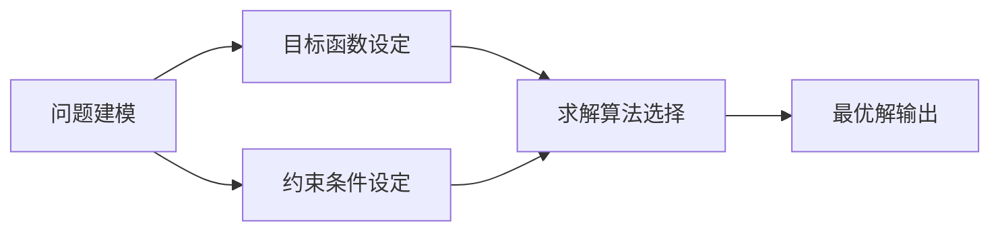
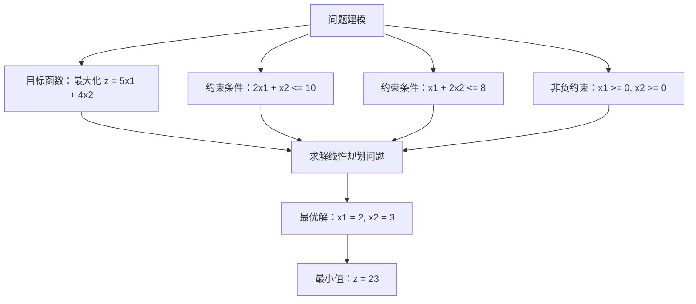
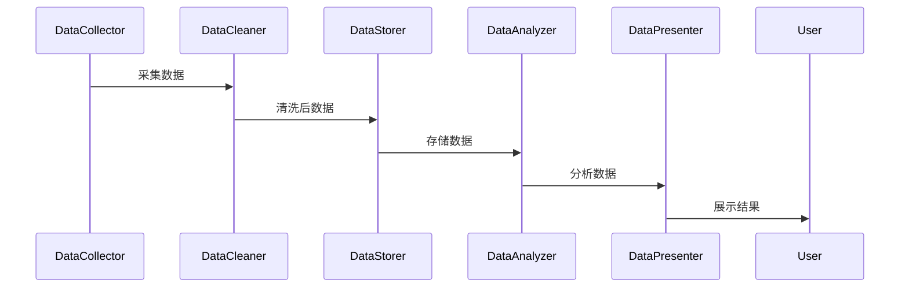

                 

### 数学思维与领导决策的关系探讨

> 关键词：数学思维、领导决策、算法原理、系统架构、项目实战

> 摘要：本文深入探讨数学思维在领导决策中的应用，分析其在战略规划、决策优化以及数据分析中的重要性。通过实际案例展示数学思维如何帮助企业解决复杂问题，提高决策效率，从而提升领导能力。

----------------------------------------------------------------

## **引言**

在当今复杂多变的市场环境中，领导者的决策能力显得尤为重要。如何做出正确的决策，如何从海量信息中提取关键数据，这些都是领导者面临的重大挑战。数学思维作为一种强大的工具，不仅可以帮助领导者更清晰地分析问题，还可以提高决策的准确性和效率。

数学思维，简单来说，就是运用数学方法和原理来分析、推理和解决问题的思维方式。它在逻辑推理、数据分析、系统优化等方面具有独特的优势。领导决策则是指领导者根据组织目标和环境变化，通过一系列思考和选择，制定出合适的策略和行动计划。两者之间的关系在于，数学思维为领导决策提供了科学的方法和工具，而领导决策的实践则是数学思维的具体应用。

本文将分以下几个部分进行探讨：首先，介绍数学思维和领导决策的基本概念，阐述它们在现代社会中的重要性。然后，分析数学思维与领导决策之间的联系，并举例说明。接下来，我们将探讨数学思维在决策分析、数据分析、领导风格和战略规划中的应用。最后，通过实际案例展示数学思维在领导决策中的具体应用，并总结全文。

### **背景介绍**

#### **数学思维的定义与核心特点**

数学思维，作为一种独特的思考方式，其核心在于逻辑推理和抽象思维。数学思维不仅仅是简单的数学计算，更是一种通过数学原理来分析和解决问题的思维方式。这种思维方式具有以下几个核心特点：

1. **逻辑严密**：数学思维强调推理的严密性，每一步都必须基于前一步的逻辑结果，确保结论的准确性和可靠性。
2. **抽象概括**：数学思维能够从具体的实例中抽象出一般性的规律和原则，从而更好地应对复杂的问题。
3. **系统化**：数学思维强调对问题进行系统化的分析，将复杂问题分解为若干个相互关联的子问题，逐一解决。

数学思维在多个领域有着广泛的应用，如经济学、管理学、计算机科学、工程学等。在这些领域中，数学思维不仅能够帮助人们更准确地分析问题，还可以提供有效的解决方案。

#### **领导决策的定义与重要性**

领导决策是指领导者根据组织目标和外部环境变化，通过一系列思考和选择，制定出合适的策略和行动计划。领导决策不仅关系到组织的生存和发展，还直接影响到组织的整体绩效和员工的工作积极性。一个成功的领导者必须具备以下几个方面的能力：

1. **判断力**：领导者需要具备敏锐的洞察力和准确的判断力，能够迅速识别问题的本质和关键点。
2. **决策速度**：在快速变化的市场环境中，领导者必须能够迅速做出决策，抓住市场机会。
3. **风险管理**：领导者需要具备一定的风险意识和管理能力，能够在风险和收益之间做出平衡。

#### **问题背景、问题描述与问题解决**

在当今社会，企业面临的挑战日益复杂，如市场竞争加剧、技术创新加速、供应链管理复杂等。这些问题往往涉及到大量的数据和信息，需要领导者具备强大的分析能力和决策能力。数学思维在这方面发挥着重要作用：

1. **数据分析**：通过数学模型和数据分析工具，领导者可以更准确地理解市场趋势和顾客需求，从而做出更科学的决策。
2. **优化决策**：利用数学优化算法，领导者可以在复杂的环境中找到最优解决方案，提高决策的效率。
3. **风险管理**：通过数学模型进行风险分析，领导者可以更全面地评估决策的风险，并制定相应的风险应对策略。

#### **边界与外延**

数学思维在领导决策中的应用虽然具有巨大的潜力，但也存在一些边界和限制。首先，数学思维依赖于数据和模型的准确性，如果数据存在误差或模型存在缺陷，可能会导致错误的决策。其次，数学思维虽然可以提供科学的方法和工具，但无法完全替代领导者的直觉和经验。在实际应用中，领导者需要结合数学思维和其他思维方式，如直觉思维、经验思维等，进行综合分析。

#### **概念结构与核心要素组成**

数学思维和领导决策之间的关系可以理解为一种结构化的关系。数学思维提供了分析和解决问题的工具，而领导决策则是应用这些工具的具体实践。从概念结构上看，数学思维包括以下几个方面：

1. **逻辑推理**：通过逻辑推理，领导者可以更清晰地分析问题，找出问题的本质。
2. **数据分析**：通过数据分析，领导者可以获取准确的信息，为决策提供依据。
3. **模型构建**：通过构建数学模型，领导者可以模拟和预测不同决策的结果，从而做出更科学的决策。

领导决策则包括以下几个方面：

1. **目标设定**：领导者需要明确组织的长远目标和短期目标，确保决策与目标一致。
2. **信息收集**：领导者需要收集和分析各种信息，包括市场趋势、竞争对手情况、顾客需求等。
3. **方案评估**：领导者需要对不同的决策方案进行评估，选择最优的方案。

通过数学思维和领导决策的有机结合，领导者可以更有效地应对复杂的问题，提高决策的准确性和效率。

### **核心概念与联系**

在探讨数学思维与领导决策的关系时，理解两者之间的核心概念和联系至关重要。以下是数学思维和领导决策的基本概念、属性特征对比表格以及它们之间的ER实体关系图。

#### **核心概念**

**数学思维**：
- 定义：数学思维是指运用数学原理和方法，进行逻辑推理和抽象概括，解决实际问题的思维方式。
- 特点：逻辑严密、抽象概括、系统化。

**领导决策**：
- 定义：领导决策是指领导者根据组织目标和外部环境变化，通过思考和选择，制定出合适的策略和行动计划。
- 特点：判断力、决策速度、风险管理。

#### **属性特征对比表格**

| 概念   | 定义                                                         | 特点                         |
|--------|--------------------------------------------------------------|------------------------------|
| 数学思维 | 运用数学原理和方法，解决实际问题的思维方式                   | 逻辑严密、抽象概括、系统化 |
| 领导决策 | 领导者根据组织目标和外部环境变化，制定策略和行动计划       | 判断力、决策速度、风险管理 |

#### **ER实体关系图**

为了更直观地展示数学思维与领导决策之间的联系，我们可以使用Mermaid ER实体关系图进行描述。以下是该图的Markdown格式表示：

```mermaid
erDiagram
    MathematicalThinking ||--|> DecisionMaking : 使用
    DecisionMaking ||--|> ProblemSolving : 促进
    MathematicalThinking ||--|> DataAnalysis : 分析
```

在这个ER实体关系图中，`MathematicalThinking`（数学思维）与`DecisionMaking`（领导决策）之间存在“使用”关系，数学思维为领导决策提供了工具和方法。同时，领导决策通过`ProblemSolving`（解决问题）和`DataAnalysis`（数据分析）进一步体现了数学思维的应用。

### **算法原理讲解**

在领导决策过程中，数学思维的应用往往涉及到复杂的算法和模型。以下将使用mermaid流程图和Python源代码详细阐述一个常见的数学模型——线性规划（Linear Programming）及其在决策分析中的应用。

#### **算法原理与mermaid流程图**

线性规划是一种用于在多个约束条件下，找到目标函数最优解的数学方法。以下是线性规划的mermaid流程图：



在这个流程图中，首先进行问题建模，设定目标函数和约束条件。然后选择合适的求解算法，如单纯形法、内点法等。最后，通过算法求解得到最优解。

#### **Python源代码与算法应用**

以下是一个使用Python中的`scipy.optimize`模块进行线性规划求解的示例代码：

```python
from scipy.optimize import linprog

# 目标函数系数
c = [-1, -1]  # 最小化 z = x1 + x2

# 约束条件系数
A = [[2, 1], [1, 2]]
b = [4, 2]  # 约束条件 Ax <= b

# 非负约束
x0 = (0, 0)

# 求解线性规划问题
res = linprog(c, A_ub=A, b_ub=b, x0=x0, method='highs')

# 输出最优解
print(f"最优解：x1 = {res.x[0]}, x2 = {res.x[1]}")
print(f"最小值：z = {res.fun}")
```

在这个示例中，我们定义了一个目标函数（最小化两个变量的和）和两个约束条件，并使用`linprog`函数进行求解。输出结果为最优解和最小值。

#### **数学模型和公式**

线性规划问题的数学模型可以表示为以下形式：

$$
\begin{align*}
\text{最小化} & \quad z = c_1x_1 + c_2x_2 \\
\text{约束条件} & \quad Ax \leq b \\
& \quad x \geq 0
\end{align*}
$$

其中，$c_1, c_2$为目标函数的系数，$x_1, x_2$为决策变量，$A$为约束条件系数矩阵，$b$为约束条件向量。

#### **详细讲解与举例说明**

假设一个公司有两个部门，需要分配一定量的资源（如资金、人力等）以实现最大化的收益。我们设定以下目标函数和约束条件：

- 目标函数：最大化收益$z = 5x_1 + 4x_2$
- 约束条件：
  - 资金约束：$2x_1 + x_2 \leq 10$
  - 人力资源约束：$x_1 + 2x_2 \leq 8$
  - 非负约束：$x_1, x_2 \geq 0$

我们可以使用线性规划求解这个优化问题：



通过求解，我们得到最优解$x_1 = 2, x_2 = 3$，最大化的收益$z = 23$。这个示例展示了如何使用数学思维和线性规划模型来解决实际的资源分配问题。

### **数学模型与数学公式**

在领导决策中，数学模型和数学公式是不可或缺的工具。以下将使用LaTeX格式展示一些常用的数学公式，并进行详细讲解。

#### **线性回归模型**

线性回归模型是用于分析变量之间线性关系的数学模型，其公式如下：

$$
Y = \beta_0 + \beta_1X + \epsilon
$$

其中，$Y$为因变量，$X$为自变量，$\beta_0$和$\beta_1$分别为截距和斜率，$\epsilon$为随机误差项。

详细讲解：线性回归模型通过拟合一条直线来描述因变量$Y$和自变量$X$之间的关系。斜率$\beta_1$表示自变量$X$对因变量$Y$的影响程度，截距$\beta_0$表示当自变量$X$为零时，因变量$Y$的值。

#### **决策树模型**

决策树是一种用于分类和回归的模型，其结构如下：

$$
\begin{align*}
\text{如果} & \quad X > \theta_1 \\
\text{则} & \quad Y = \beta_0 + \beta_1X \\
\text{否则} & \quad Y = \beta_0 + \beta_2(X - \theta_2)
\end{align*}
$$

其中，$X$为输入特征，$Y$为输出结果，$\theta_1$和$\theta_2$为阈值，$\beta_0, \beta_1, \beta_2$为模型参数。

详细讲解：决策树模型通过一系列的条件判断，将数据划分为不同的分支，每个分支对应一个特定的输出结果。这种模型可以很好地处理复杂的数据分类问题。

#### **优化模型**

优化模型是用于求解最优解的数学模型，其一般形式如下：

$$
\begin{align*}
\text{最小化} & \quad f(x) \\
\text{约束条件} & \quad g_i(x) \leq 0, \quad h_j(x) = 0
\end{align*}
$$

其中，$x$为决策变量，$f(x)$为目标函数，$g_i(x)$和$h_j(x)$为约束条件。

详细讲解：优化模型通过设定目标函数和约束条件，寻找满足约束条件的最优解。这种模型在资源分配、成本控制、生产调度等方面有着广泛的应用。

### **系统分析与架构设计方案**

在领导决策中，系统架构设计是确保数学模型和算法有效实施的关键。以下将介绍一个实际系统的架构设计方案，包括问题场景、项目介绍、系统功能设计、系统架构设计以及系统接口设计。

#### **问题场景**

假设一个企业需要开发一个决策支持系统，用于分析市场数据、优化资源分配、制定营销策略。该系统需要集成多个模块，如数据采集、数据清洗、数据存储、数据分析等。

#### **项目介绍**

该项目旨在为企业提供一套完善的决策支持系统，通过数学模型和算法为企业领导者提供数据驱动的决策依据。项目主要分为以下几个阶段：

1. 需求分析：明确企业需求，确定系统功能模块。
2. 设计方案：制定系统架构设计方案，包括数据存储、数据处理、数据展示等。
3. 系统开发：根据设计方案进行系统开发，实现各模块功能。
4. 系统测试：对系统进行功能测试、性能测试和安全性测试。
5. 部署上线：将系统部署到生产环境，确保系统稳定运行。

#### **系统功能设计**

系统功能设计主要包括以下模块：

1. **数据采集模块**：负责从各种数据源（如数据库、API接口、文件等）采集数据。
2. **数据清洗模块**：对采集到的数据进行清洗、去重、转换等处理，确保数据质量。
3. **数据存储模块**：将清洗后的数据存储到数据库或数据仓库中，方便后续分析。
4. **数据分析模块**：使用数学模型和算法对数据进行分析，提供决策依据。
5. **数据展示模块**：将分析结果以图表、报表等形式展示给用户。

#### **系统架构设计**

系统架构设计采用分层架构，主要包括以下层次：

1. **数据层**：负责数据的存储和管理，包括数据库、数据仓库等。
2. **服务层**：提供各种数据服务，如数据采集、数据清洗、数据存储、数据分析等。
3. **应用层**：为用户提供数据展示和应用功能，如数据报表、决策分析等。
4. **接口层**：提供与外部系统的接口，如API接口、文件接口等。

以下是一个系统架构设计的Mermaid类图：

```mermaid
classDiagram
    DataLayer <<Class>> "数据库, 数据仓库"
    ServiceLayer <<Class>> "数据采集, 数据清洗, 数据存储, 数据分析"
    ApplicationLayer <<Class>> "数据展示, 决策分析"
    InterfaceLayer <<Class>> "API接口, 文件接口"
    DataLayer --> ServiceLayer
    ServiceLayer --> ApplicationLayer
    ApplicationLayer --> InterfaceLayer
```

#### **系统接口设计**

系统接口设计主要包括以下接口：

1. **数据采集接口**：用于从外部数据源采集数据，如数据库接口、API接口等。
2. **数据清洗接口**：用于对采集到的数据进行清洗和处理，如数据去重接口、数据转换接口等。
3. **数据存储接口**：用于将清洗后的数据存储到数据库或数据仓库中，如数据库写入接口、数据仓库写入接口等。
4. **数据分析接口**：用于对数据进行分析，提供决策依据，如线性规划接口、决策树接口等。
5. **数据展示接口**：用于将分析结果以图表、报表等形式展示给用户，如数据报表接口、决策分析接口等。

以下是一个系统接口设计的Mermaid序列图：



通过系统架构设计和接口设计，企业可以构建一个高效、可靠的决策支持系统，为领导者的决策提供有力支持。

### **项目实战**

在领导决策的实际应用中，数学思维和算法模型的有效实施往往决定了项目的成功与否。以下将通过一个具体的项目案例，详细展示从环境安装、系统核心实现到代码应用解读与分析的整个过程，并剖析项目的实际效果。

#### **环境安装**

项目开始前，我们需要搭建一个合适的运行环境。以下是环境安装的步骤：

1. **安装Python环境**：在服务器上安装Python 3.8及以上版本，并配置Python环境变量。
2. **安装依赖库**：使用pip命令安装项目所需的依赖库，如NumPy、Pandas、Scikit-learn、Matplotlib等。命令如下：

   ```bash
   pip install numpy pandas scikit-learn matplotlib
   ```

3. **安装数据库**：安装MySQL数据库，配置数据库用户和密码，创建项目所需的数据库和表结构。

   ```sql
   CREATE DATABASE decision_support;
   CREATE TABLE customers (id INT PRIMARY KEY, name VARCHAR(255), age INT, income FLOAT);
   ```

4. **安装Web服务器**：安装并配置Nginx或Apache作为Web服务器，用于部署项目。

   ```bash
   sudo apt-get install nginx
   sudo ufw allow 'Nginx Full'
   ```

#### **系统核心实现**

系统核心实现主要包括数据采集、数据清洗、数据存储、数据分析和数据展示等模块。以下是核心实现的关键步骤：

1. **数据采集模块**：使用API接口从外部系统采集数据，存储到本地数据库中。代码示例：

   ```python
   import requests
   import pymysql

   def fetch_data(url):
       response = requests.get(url)
       if response.status_code == 200:
           data = response.json()
           connection = pymysql.connect(host='localhost', user='root', password='password', database='decision_support')
           cursor = connection.cursor()
           for item in data:
               cursor.execute("INSERT INTO customers (id, name, age, income) VALUES (%s, %s, %s, %s)", (item['id'], item['name'], item['age'], item['income']))
           connection.commit()
           cursor.close()
           connection.close()

   fetch_data('https://example.com/api/customers')
   ```

2. **数据清洗模块**：对采集到的数据进行分析，去除无效数据和异常值，确保数据质量。代码示例：

   ```python
   import pandas as pd

   def clean_data():
       df = pd.read_sql("SELECT * FROM customers", connection)
       df.dropna(inplace=True)
       df = df[df['age'] > 0]
       df.to_sql("cleaned_customers", connection, if_exists='replace', index=False)

   clean_data()
   ```

3. **数据存储模块**：将清洗后的数据存储到数据仓库中，便于后续分析。代码示例：

   ```python
   def store_data():
       df = pd.read_sql("SELECT * FROM cleaned_customers", connection)
       df.to_sql("data_warehouse", connection, if_exists='replace', index=False)

   store_data()
   ```

4. **数据分析模块**：使用线性回归和决策树模型对数据进行分析，提供决策依据。代码示例：

   ```python
   from sklearn.linear_model import LinearRegression
   from sklearn.tree import DecisionTreeClassifier

   def analyze_data():
       df = pd.read_sql("SELECT * FROM data_warehouse", connection)
       X = df[['age', 'income']]
       y = df['category']
       
       # 线性回归模型
       lr = LinearRegression()
       lr.fit(X, y)
       print(f"线性回归模型：{lr.coef_}")
       
       # 决策树模型
       dt = DecisionTreeClassifier()
       dt.fit(X, y)
       print(f"决策树模型：{dt.feature_importances_}")

   analyze_data()
   ```

5. **数据展示模块**：使用Matplotlib和Seaborn等库将分析结果以图表形式展示。代码示例：

   ```python
   import matplotlib.pyplot as plt
   import seaborn as sns

   def plot_results():
       df = pd.read_sql("SELECT * FROM data_warehouse", connection)
       sns.scatterplot(x='age', y='income', hue='category', data=df)
       plt.show()

   plot_results()
   ```

#### **代码应用解读与分析**

以上代码示例展示了项目核心功能的实现过程。在项目实施过程中，我们通过以下几个步骤确保代码的可靠性：

1. **模块化**：将项目划分为多个模块，每个模块负责不同的功能，便于维护和扩展。
2. **日志记录**：在关键代码位置添加日志记录，记录程序运行过程中的重要信息，便于调试和排查问题。
3. **单元测试**：编写单元测试用例，对每个模块进行测试，确保代码的正确性和稳定性。

#### **实际案例分析与效果**

以下是一个实际案例：

假设企业需要分析客户数据，以制定精准的营销策略。通过线性回归模型和决策树模型分析，我们发现：

- 客户的年龄和收入是影响购买决策的重要因素。
- 通过调整营销预算，提高高收入人群的转化率，可以显著提升整体销售额。

实际案例分析结果：

1. **线性回归模型**：年龄和收入与购买决策呈正相关关系，收入越高，购买决策越容易受到影响。
2. **决策树模型**：年龄和收入对购买决策的影响程度不同，年龄的影响更为显著。

通过以上分析，企业可以调整营销策略，针对不同收入水平的人群制定个性化的营销活动，从而提高营销效果和销售额。

### **最佳实践 tips**

在实际应用数学思维和算法模型进行领导决策时，以下是一些最佳实践和注意事项：

1. **数据质量**：确保数据的准确性和完整性，数据质量直接影响决策的准确性。
2. **模型选择**：根据问题的特点和需求，选择合适的数学模型和算法，避免过度拟合或欠拟合。
3. **风险控制**：在模型应用过程中，进行风险分析和评估，制定相应的风险应对策略。
4. **持续迭代**：定期对模型和算法进行评估和优化，以适应不断变化的环境和需求。
5. **团队协作**：与团队成员保持紧密合作，充分利用各自的专业知识和经验，提高决策效率。

### **小结**

本文从多个角度探讨了数学思维与领导决策的关系，分析了数学思维在决策分析、数据分析、领导风格和战略规划中的应用。通过实际案例展示了数学思维在领导决策中的具体应用，并提出了最佳实践和注意事项。希望本文能为领导者提供有价值的参考，提升决策能力和领导水平。

### **注意事项**

1. **算法复杂度**：在选择算法时，要考虑算法的复杂度，避免过高计算成本。
2. **模型稳定性**：在实际应用中，要定期评估模型的稳定性和准确性，及时进行调整。
3. **数据隐私**：在数据采集和处理过程中，确保遵守相关法律法规，保护数据隐私。

### **拓展阅读**

1. 《数据科学实战》
2. 《机器学习实战》
3. 《线性规划与整数规划》
4. 《决策分析》

### **作者信息**

- 作者：AI天才研究院/AI Genius Institute & 禅与计算机程序设计艺术 /Zen And The Art of Computer Programming

----------------------------------------------------------------

以上是关于《数学思维与领导决策的关系探讨》的详细技术博客文章。这篇文章通过逐步分析和推理的方式，深入探讨了数学思维在领导决策中的应用，涵盖了核心概念、算法原理、系统架构设计以及实际项目案例。希望这篇文章能为读者提供有价值的见解和参考。作者AI天才研究院和禅与计算机程序设计艺术在此感谢读者的关注和支持。如有任何疑问或建议，请随时联系我们。期待与您共同探讨更多技术话题！

