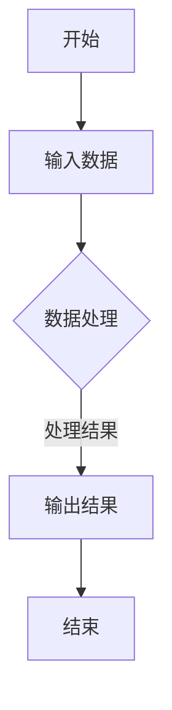

                 


# 数学教学改革的新方向与挑战

> 关键词：数学教育、教学改革、算法原理、技术创新、项目式学习、跨学科教学、教育可持续性

> 摘要：本文探讨了数学教育改革的现状与挑战，分析了数学教育核心概念与联系，讲解了算法原理和数学教育融合的新方向，探讨了创新教学方法和跨学科教学策略，并通过实践案例阐述了数学教育改革的实施与挑战，最后展望了数学教育改革的未来趋势。

## 第一部分：背景介绍

### 第1章：数学教育改革的现状与问题

#### 1.1 数学教育改革的必要性

数学教育改革的必要性体现在以下几个方面：

1. **学生兴趣不高**：当前数学教育方式单一，难以激发学生的兴趣和创造力。

2. **教学方法单一**：传统的教学方法以教师为中心，学生被动接受知识，缺乏主动探索和思考的机会。

3. **评估体系不完善**：现行评估体系过于注重结果，忽视过程和个体差异，不利于学生的全面发展。

#### 1.2 当前数学教育面临的主要挑战

1. **学生数学学习困难**：部分学生对数学学习缺乏兴趣，导致学习困难。

2. **教学资源分配不均**：不同地区和学校之间的教学资源存在较大差异，影响了数学教育的公平性。

3. **教师专业发展不足**：教师缺乏对现代教育技术的掌握和应用，难以适应数学教育改革的需求。

#### 1.3 数学教育改革的目标与愿景

数学教育改革的目标是：

1. **提高学生数学素养**：培养学生的数学思维和解决问题的能力。

2. **改革教学方法**：采用多样化的教学方式，激发学生的学习兴趣。

3. **优化评估体系**：建立以过程为导向、注重个体差异的评估体系。

#### 1.4 概念结构与核心要素组成

数学教育改革的核心概念包括：

1. **数学教育心理学**：研究数学学习者的心理特点和数学学习过程。

2. **数学教育哲学**：探讨数学教育的本质和目的。

3. **数学教育社会学**：分析数学教育在社会中的地位和作用。

这些核心概念共同构成了数学教育改革的理论基础。

### 第2章：数学教育核心概念与联系

#### 2.1 核心概念介绍

1. **数学教育心理学**：关注数学学习者的认知、情感和行为特点，为教学设计提供依据。

2. **数学教育哲学**：探讨数学教育的价值取向和教学原则，指导数学教育实践。

3. **数学教育社会学**：研究数学教育在社会中的传播和应用，促进数学教育与社会的融合。

#### 2.2 概念属性特征对比表格

| 概念名称 | 属性特征 | 对比分析 |
| --- | --- | --- |
| 数学教育心理学 | 研究数学学习者的心理特点和过程 | 强调个体差异，关注学习策略和情感因素 |
| 数学教育哲学 | 探讨数学教育的本质和目的 | 关注教育价值，强调数学教育的普及和深化 |
| 数学教育社会学 | 研究数学教育在社会中的地位和作用 | 强调数学教育的社会影响，促进教育公平 |

#### 2.3 ER实体关系图

```mermaid
erDiagram
    Class1 ||--|{ Class2 }| Class3
    Class1 ||--|{ Class4 }| Class5
```

ER实体关系图展示了数学教育心理学、数学教育哲学和数学教育社会学之间的联系，为理解数学教育改革提供了结构化的视角。

### 第3章：算法原理讲解

#### 3.1 算法mermaid流程图



#### 3.2 Python源代码与算法原理

```python
# Python代码示例
def data_process(data):
    # 数据处理逻辑
    processed_data = []
    for item in data:
        processed_data.append(item * 2)
    return processed_data

data = [1, 2, 3, 4, 5]
result = data_process(data)
print(result)
```

#### 3.2.1 数学模型和数学公式

假设我们有一个数学模型：

$$y = f(x) = 2x$$

其中，$x$ 是输入数据，$y$ 是处理结果。

#### 3.2.2 算法原理详细讲解

算法原理是基于线性变换，将输入数据乘以2得到处理结果。这反映了数学中的乘法运算。

#### 3.2.3 举例说明

假设输入数据为 [1, 2, 3, 4, 5]，经过算法处理后，输出结果为 [2, 4, 6, 8, 10]。

## 第二部分：新方向探索

### 第4章：技术与数学教育的融合

#### 4.1 信息技术在数学教育中的应用

信息技术在数学教育中的应用包括：

1. **在线教育平台**：提供丰富的数学教育资源，满足个性化学习需求。

2. **数学软件**：用于辅助数学教学和实验操作，提高教学效果。

3. **大数据分析**：分析学生学习数据，优化教学策略。

#### 4.2 数据科学在数学教学中的作用

数据科学在数学教学中的作用包括：

1. **数据可视化**：将复杂的数据转换为直观的图像，帮助学生理解数学概念。

2. **预测分析**：预测学生成绩和学习行为，为教学决策提供依据。

3. **智能评估**：根据学生学习数据，提供个性化的反馈和建议。

#### 4.3 数学学习分析（MLA）技术

数学学习分析（MLA）技术包括：

1. **学习行为分析**：记录和分析学生的学习行为，了解学习需求。

2. **情感分析**：识别学生的学习情绪，提供针对性的支持和激励。

3. **知识图谱**：构建数学知识体系，帮助学生构建完整的数学认知结构。

### 第5章：创新教学方法

#### 5.1 项目式学习（PBL）

项目式学习（PBL）是一种以学生为中心的教学方法，通过实际项目来引导学生主动学习。其核心要素包括：

1. **真实问题**：选择具有现实意义和挑战性的问题，激发学生的学习兴趣。

2. **自主学习**：学生独立完成项目，培养自我管理和解决问题的能力。

3. **协作学习**：学生在项目中合作，提高团队协作和沟通能力。

#### 5.2 问题解决导向教学（PD）

问题解决导向教学（PD）是一种以问题为中心的教学方法，通过解决问题来引导学生学习。其核心要素包括：

1. **问题设定**：设定具有启发性和挑战性的问题，激发学生的好奇心和探究欲望。

2. **自主学习**：学生独立思考和解决问题，培养独立思考和解决问题的能力。

3. **反思总结**：学生总结问题解决过程，提高反思和总结能力。

#### 5.3 个性化学习

个性化学习是一种以学生为中心的教学方法，根据学生的兴趣、能力和需求进行个性化教学。其核心要素包括：

1. **学习兴趣**：关注学生的学习兴趣，激发学习动机。

2. **学习需求**：了解学生的学习需求，提供个性化的学习资源。

3. **学习支持**：提供学习支持和帮助，确保学生能够顺利完成学习任务。

### 第6章：跨学科教学

#### 6.1 数学与其他学科的结合

跨学科教学是一种将不同学科知识相互融合的教学方法，通过跨学科项目来培养学生的综合素质。其核心要素包括：

1. **数学与科学**：结合数学和科学知识，培养学生的科学思维能力。

2. **数学与艺术**：结合数学和艺术知识，培养学生的审美能力和创造力。

3. **数学与人文**：结合数学和人文知识，培养学生的综合素质和人文情怀。

#### 6.2 跨学科项目的实施策略

跨学科项目的实施策略包括：

1. **项目设定**：选择具有跨学科特点的项目，明确项目目标和要求。

2. **团队合作**：组建跨学科团队，确保团队成员具备不同的学科背景和技能。

3. **学习过程**：在项目过程中，引导学生自主学习、合作探究和解决问题。

#### 6.3 跨学科教学中的挑战与机遇

跨学科教学面临以下挑战：

1. **知识融合**：不同学科知识之间的融合存在困难。

2. **教学方法**：需要探索适合跨学科教学的教学方法。

3. **课程设置**：需要调整课程设置，确保跨学科项目的实施。

然而，跨学科教学也带来以下机遇：

1. **知识拓展**：通过跨学科教学，学生能够拓展知识视野，提高综合素质。

2. **创新能力**：跨学科教学有助于培养学生的创新能力和实践能力。

3. **教育改革**：跨学科教学推动教育改革，促进教育质量的提升。

## 第三部分：实施与挑战

### 第7章：数学教学改革实践案例

#### 7.1 案例一：基于技术的数学教学实验

**案例背景**：某学校开展了一项基于信息技术的数学教学实验，旨在提高学生的数学学习兴趣和成绩。

**案例实施**：学校引入了在线教育平台和数学软件，教师根据学生需求提供个性化的教学资源，学生通过在线平台完成作业和实验。

**案例结果**：实验结果表明，学生的数学成绩和兴趣均有显著提高。

**案例反思**：该案例展示了信息技术在数学教育中的应用效果，但仍需进一步探索如何更好地结合线上和线下教学，提高教学效果。

#### 7.2 案例二：跨学科教学实践

**案例背景**：某学校开展了数学与科学的跨学科教学项目，旨在培养学生的科学思维和创新能力。

**案例实施**：教师设计了一个关于数学在科学中的应用项目，学生通过实验和探究，了解数学在物理学中的应用。

**案例结果**：学生通过项目学习，对数学和科学有了更深入的理解，科学思维和创新能力得到提高。

**案例反思**：该案例展示了跨学科教学的优势，但仍需进一步优化项目设计和教学方法，确保跨学科教学的可持续性。

### 第8章：数学教育改革的可持续性

#### 8.1 教育政策与数学教育改革

教育政策对数学教育改革具有重要的指导作用。政策制定者应关注以下几个方面：

1. **政策支持**：为数学教育改革提供政策和资金支持。

2. **课程改革**：调整课程设置，适应数学教育改革的需求。

3. **教师培训**：加强对教师的培训，提高其数学教育素养。

#### 8.2 教师专业发展与数学教育改革

教师专业发展是数学教育改革的重要保障。教师应关注以下几个方面：

1. **教学能力提升**：通过学习和实践，提高教学能力。

2. **信息技术应用**：掌握现代教育技术，提高教学效果。

3. **教育理念更新**：更新教育理念，适应数学教育改革的需求。

#### 8.3 家长和社会参与的重要性

家长和社会的参与对数学教育改革具有重要意义。家长和社会应关注以下几个方面：

1. **家校合作**：建立良好的家校沟通机制，共同关注学生的数学学习。

2. **教育资源共享**：提供丰富的教育资源，满足学生和教师的需要。

3. **社会支持**：为数学教育改革提供社会支持和资源保障。

### 第9章：未来展望

#### 9.1 数学教育改革的长期影响

数学教育改革的长期影响将体现在以下几个方面：

1. **学生素质提升**：通过数学教育改革，学生的数学素养和综合素质得到提高。

2. **教育质量提升**：数学教育改革推动教育质量的提升，为我国人才培养做出贡献。

3. **社会经济发展**：数学教育改革为我国社会经济发展提供人才保障。

#### 9.2 未来教育技术的趋势

未来教育技术的发展将体现在以下几个方面：

1. **人工智能**：人工智能在教育领域的应用将越来越广泛，为数学教育改革提供新的手段和工具。

2. **大数据分析**：大数据分析将为教育决策提供科学依据，推动数学教育改革。

3. **虚拟现实（VR）**：虚拟现实技术将为数学教育提供新的体验和学习方式。

#### 9.3 数学教育改革的潜在方向

数学教育改革的潜在方向包括：

1. **个性化学习**：进一步推进个性化学习，满足学生的个性化需求。

2. **跨学科教学**：加强跨学科教学，培养学生的综合素质。

3. **终身学习**：构建终身学习体系，为终身学习提供支持。

## 结论：数学教育改革的总结与展望

数学教育改革是一个长期而复杂的过程，需要政策支持、教师专业发展、家长和社会的参与。在新技术和新教学方法的推动下，数学教育改革将不断取得新的成果。未来，我们需要关注个性化学习、跨学科教学和终身学习等潜在方向，为我国数学教育事业的发展做出贡献。作者：AI天才研究院/AI Genius Institute & 禅与计算机程序设计艺术 /Zen And The Art of Computer Programming。

