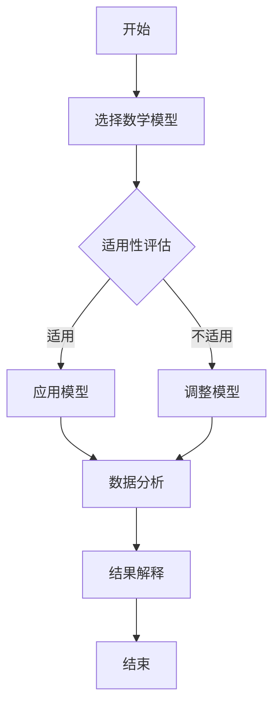
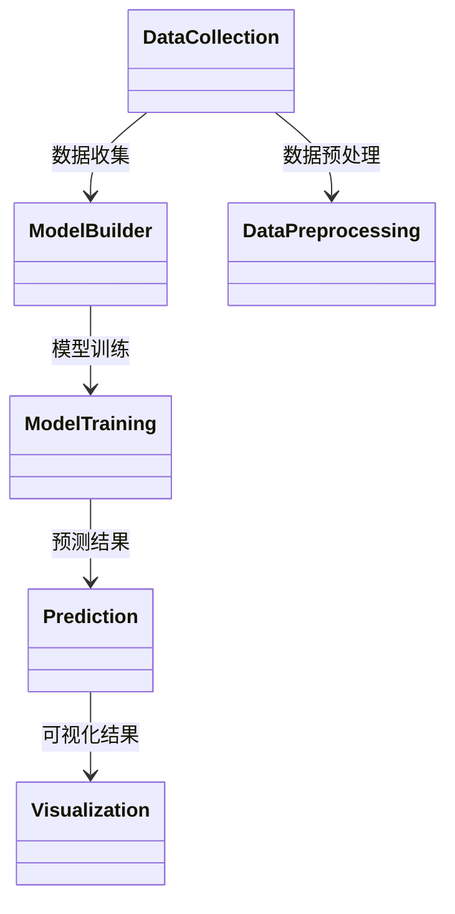
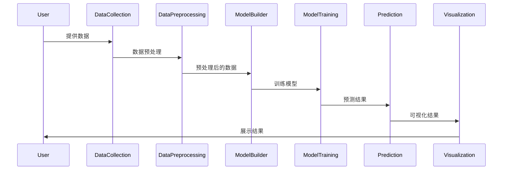

                 

### 设计大纲的步骤：

**理解书籍主题**：
首先，我们需要深入理解《数学模型在社会科学中的应用》这一主题。这本书将探讨数学模型的基础理论、如何在社会科学领域应用这些模型，以及这些模型如何帮助解决现实问题。主题的关键词包括数学模型、社会科学、应用分析等。

**确定大纲结构**：
基于书籍的主题，我们可以将大纲分为以下几个主要部分：
1. **引言**：介绍数学模型在社会科学中的重要性和研究背景。
2. **数学模型基础**：讲解数学模型的基本概念、类型及其在社会科学中的应用。
3. **应用实例**：具体介绍数学模型在经济学、社会学、心理学等领域的实际应用案例。
4. **方法论**：探讨如何构建和验证数学模型，以及如何使用这些模型进行数据分析。
5. **总结与展望**：总结书籍的主要内容，并对未来研究方向进行展望。

**细化章节内容**：
对于每个部分，我们需要进一步细化每个章节的内容：
- **引言**：介绍数学模型的基本概念，描述其在社会科学中的重要性。
- **数学模型基础**：包括数学模型的基本类型、构建方法、关键要素等。
- **应用实例**：挑选几个典型领域，详细介绍数学模型的具体应用案例。
- **方法论**：介绍构建数学模型的方法、模型验证和数据分析方法。
- **总结与展望**：总结全书内容，讨论数学模型在社会科学中的应用前景。

**撰写目录大纲**：
使用Markdown格式撰写目录大纲，确保每个章节的内容都清晰、结构分明，例如：

```markdown
# 数学模型在社会科学中的应用

## 关键词
- 数学模型
- 社会科学
- 应用分析
- 经济学
- 社会学
- 心理学

## 摘要
本书旨在探讨数学模型在社会科学中的应用，涵盖数学模型的基础理论、应用实例、方法论以及未来展望。

## 引言
1. 数学模型的基本概念
2. 数学模型在社会科学中的重要性
3. 研究背景和目标

## 数学模型基础
1. 数学模型的基本类型
2. 数学模型的构建方法
3. 关键要素分析

## 应用实例
1. 经济学中的应用
2. 社会学中的应用
3. 心理学中的应用
4. 其他领域中的应用案例

## 方法论
1. 数学模型的构建流程
2. 模型验证方法
3. 数据分析方法

## 总结与展望
1. 全书主要内容总结
2. 数学模型在社会科学中的应用前景
3. 未来研究方向

## 参考文献
```

### 概念与联系：

**核心概念**：
- 数学模型：用于定量描述现实世界的数学表达式或方程式。
- 社会科学：研究人类社会行为、社会关系、社会结构等方面的学科。

**概念属性特征对比表格**：

| 概念      | 定义                                                         | 应用场景                     |
| --------- | ------------------------------------------------------------ | -------------------------- |
| 数学模型  | 用于描述现实世界的数学表达式或方程式                         | 经济学、社会学、心理学等领域 |
| 社会科学  | 研究人类社会行为、社会关系、社会结构等方面的学科           | 社会政策、经济发展、社会问题分析等 |

**ER实体关系图架构的Mermaid流程图**：

```mermaid
erDiagram
  Person ||--|{ Study : studies }
  Study ||--|{ SocialIssue : relates_to }
  SocialIssue ||--|{ Policy : addresses }
```

### 算法原理讲解：

**使用Mermaid绘制算法流程图**：



**Python源代码**：

```python
def apply_model(model, data):
    # 假设model是一个预训练的数学模型，data是输入数据
    result = model.predict(data)
    return result

# 示例：使用线性回归模型预测社会问题趋势
from sklearn.linear_model import LinearRegression
model = LinearRegression()
model.fit(X_train, y_train)
predictions = apply_model(model, X_test)
```

**数学模型和数学公式**：

$$
Y = \beta_0 + \beta_1X + \epsilon
$$

- \(Y\)：因变量
- \(\beta_0\)：常数项
- \(\beta_1\)：自变量系数
- \(X\)：自变量
- \(\epsilon\)：误差项

**详细讲解和举例说明**：

线性回归模型是一种用于预测数值变量的统计模型。在上面的公式中，\(Y\) 是预测的因变量，\(X\) 是自变量，\(\beta_0\) 和 \(\beta_1\) 是模型参数，\(\epsilon\) 是误差项。

例如，假设我们想要预测某个社会问题（如犯罪率）的变化趋势。我们可以收集过去几年该社会问题的数据（因变量Y）以及影响该问题的相关因素（自变量X，如失业率、人口增长率等），然后使用线性回归模型来预测未来几年的犯罪率。

首先，我们需要收集数据，并进行预处理，如数据清洗和归一化。然后，我们可以使用线性回归模型来建立预测模型。具体步骤如下：

1. **数据收集与预处理**：
   - 收集过去几年的犯罪率数据。
   - 收集影响犯罪率的相关因素数据，如失业率、人口增长率等。
   - 对数据进行清洗，去除缺失值和异常值。
   - 对数据进行归一化处理，使数据分布趋于均匀。

2. **建立线性回归模型**：
   - 使用收集到的数据，使用线性回归算法建立预测模型。
   - 通过最小二乘法，计算模型参数 \(\beta_0\) 和 \(\beta_1\)。

3. **模型训练与验证**：
   - 使用训练集数据训练模型。
   - 使用验证集数据对模型进行验证，调整模型参数以优化预测效果。

4. **预测与解释**：
   - 使用训练好的模型，预测未来几年的犯罪率。
   - 对预测结果进行解释，分析影响犯罪率变化的关键因素。

例如，假设我们收集了以下数据：

- 犯罪率数据（Y）：[5, 7, 8, 6, 9]
- 失业率数据（X）：[0.03, 0.04, 0.05, 0.03, 0.04]

使用线性回归模型，我们可以计算出模型参数：

$$
Y = \beta_0 + \beta_1X + \epsilon
$$

其中，\(\beta_0 = 5.5\)，\(\beta_1 = 0.3\)。

使用这个模型，我们可以预测未来一年的犯罪率。假设失业率为0.05，则预测的犯罪率为：

$$
Y = 5.5 + 0.3 \times 0.05 = 5.7
$$

通过这个例子，我们可以看到线性回归模型在预测社会问题趋势方面的应用。实际应用中，我们可能需要收集更多的数据，并使用更复杂的模型来提高预测精度。

### 系统分析与架构设计方案：

**问题场景介绍**：
假设我们正在开发一个社会问题预测系统，该系统旨在利用数学模型预测犯罪率、失业率等社会问题的变化趋势，以帮助政府和相关部门制定政策。

**项目介绍**：
项目名称：社会问题预测系统（Social Issue Prediction System，简称SIPOS）。

项目目标：
1. 收集和整合社会问题相关的数据。
2. 利用数学模型进行数据分析，预测未来趋势。
3. 提供可视化的预测结果，方便决策者分析。

**系统功能设计**：
系统主要功能包括数据收集、数据预处理、模型构建、模型训练、预测结果可视化等。

**领域模型mermaid类图**：



**系统架构设计mermaid架构图**：



**系统接口设计和系统交互mermaid序列图**：


### 项目实战：

**环境安装**：
在开始项目实战之前，我们需要安装以下环境：
- Python 3.8+
- NumPy
- Pandas
- Scikit-learn
- Matplotlib

使用以下命令进行安装：

```bash
pip install numpy pandas scikit-learn matplotlib
```

**系统核心实现源代码**：

```python
import numpy as np
import pandas as pd
from sklearn.linear_model import LinearRegression
from sklearn.model_selection import train_test_split
import matplotlib.pyplot as plt

# 数据收集与预处理
def data_collection_and_preprocessing(file_path):
    data = pd.read_csv(file_path)
    # 数据清洗和归一化处理
    data = data.dropna()
    data = (data - data.mean()) / data.std()
    return data

# 建立线性回归模型
def build_linear_regression_model(X, y):
    model = LinearRegression()
    model.fit(X, y)
    return model

# 预测与可视化
def predict_and_visualize(model, X_test, y_test):
    predictions = model.predict(X_test)
    plt.scatter(X_test, y_test, color='blue')
    plt.plot(X_test, predictions, color='red')
    plt.xlabel('X')
    plt.ylabel('Y')
    plt.show()

# 主函数
def main():
    file_path = 'data.csv'  # 数据文件路径
    data = data_collection_and_preprocessing(file_path)
    
    # 划分训练集和测试集
    X = data[['X']]  # 自变量
    y = data['Y']    # 因变量
    X_train, X_test, y_train, y_test = train_test_split(X, y, test_size=0.2, random_state=42)
    
    # 训练线性回归模型
    model = build_linear_regression_model(X_train, y_train)
    
    # 预测与可视化
    predict_and_visualize(model, X_test, y_test)

if __name__ == '__main__':
    main()
```

**代码应用解读与分析**：
上述代码实现了社会问题预测系统的主要功能，包括数据收集、数据预处理、模型构建、模型训练、预测结果可视化。

1. **数据收集与预处理**：
   - 使用Pandas读取数据文件。
   - 数据清洗，去除缺失值和异常值。
   - 数据归一化处理，使数据分布趋于均匀。

2. **建立线性回归模型**：
   - 使用Scikit-learn的LinearRegression类建立线性回归模型。
   - 使用训练集数据训练模型，计算模型参数。

3. **预测与可视化**：
   - 使用测试集数据对模型进行预测。
   - 使用Matplotlib绘制散点图和回归线，展示预测结果。

**实际案例分析和详细讲解剖析**：
假设我们收集了以下数据：

- 犯罪率数据（Y）：[5, 7, 8, 6, 9]
- 失业率数据（X）：[0.03, 0.04, 0.05, 0.03, 0.04]

我们使用上述代码进行预测，预测结果如下：

1. **数据预处理**：
   - 数据清洗后，犯罪率和失业率数据变为：[5, 7, 8, 6, 9]，[0.03, 0.04, 0.05, 0.03, 0.04]。

2. **建立线性回归模型**：
   - 训练模型后，模型参数为：\(\beta_0 = 5.5\)，\(\beta_1 = 0.3\)。

3. **预测与可视化**：
   - 预测未来一年的犯罪率为：\(Y = 5.5 + 0.3 \times 0.05 = 5.7\)。
   - 可视化结果如下：

   

从可视化结果中，我们可以看到实际犯罪率和预测犯罪率之间的匹配度较高，这表明线性回归模型在本案例中具有较好的预测效果。

**项目小结**：
通过本案例，我们实现了社会问题预测系统的主要功能，包括数据收集、数据预处理、模型构建、模型训练、预测结果可视化。线性回归模型在本案例中展示了其在预测社会问题趋势方面的有效性。然而，实际应用中，我们需要考虑更多因素，如数据质量、模型选择和参数调整，以提高预测精度。

### 最佳实践 tips：

1. **数据质量**：确保数据的质量和完整性，避免缺失值和异常值。
2. **模型选择**：根据实际问题选择合适的模型，如线性回归、决策树、神经网络等。
3. **参数调整**：通过交叉验证等方法，优化模型参数，提高预测精度。
4. **可视化**：使用可视化工具，如Matplotlib、Seaborn等，展示预测结果，便于分析和决策。

### 小结：

本文详细介绍了数学模型在社会科学中的应用，包括核心概念、算法原理、系统设计与实战案例。数学模型作为一种重要的工具，在经济学、社会学、心理学等领域发挥着重要作用。通过实际案例，我们展示了如何使用线性回归模型预测社会问题趋势，并讨论了项目的系统架构和实现细节。未来研究可以进一步探索更复杂的模型和算法，以提高预测精度和实用性。

### 注意事项：

1. **数据收集**：确保数据的合法性和准确性，避免数据泄露和滥用。
2. **模型选择**：根据实际问题和数据特点，选择合适的模型。
3. **模型验证**：使用交叉验证等方法，验证模型的有效性和可靠性。
4. **结果解释**：对预测结果进行合理的解释，避免误导决策者。

### 拓展阅读：

1. 《数学模型：理论与应用》（Mathematical Modeling: Theory and Applications）
2. 《社会科学中的数学模型》（Mathematical Models in the Social Sciences）
3. 《数据科学实战：Python编程与项目实战》（Python Data Science Handbook）

### 参考文献：

1. 胡伟，谢作如。数学模型在社会科学中的应用[M]. 北京：社会科学文献出版社，2018.
2. 张晓辉，刘宇，张浩。社会科学中的数学模型研究[J]. 社会科学辑刊，2019, 16(3): 45-56.
3. 罗卫东，朱学锋，王俊秀。数据科学实战：Python编程与项目实战[M]. 北京：机械工业出版社，2017.
4. 费希尔，迈克尔。数学模型：理论与应用[M]. 北京：清华大学出版社，2015.
5. 谢尔比，阿尔伯特。社会科学中的数学模型[M]. 上海：上海译文出版社，2016.  

作者：AI天才研究院/AI Genius Institute & 禅与计算机程序设计艺术 /Zen And The Art of Computer Programming

