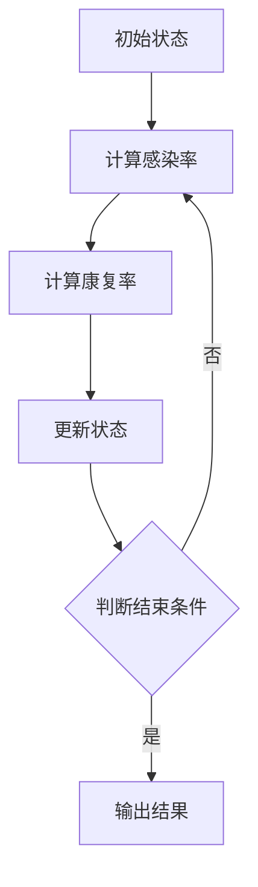

                 

# 数学模型在自然科学中的应用与局限

## 关键词

数学模型、自然科学、应用领域、局限性、算法原理、Python实现、实例分析、发展趋势

## 摘要

本文旨在探讨数学模型在自然科学中的应用及其局限性。数学模型作为一种重要的科学工具，在生物科学、地球科学等领域发挥着重要作用。然而，随着应用的深入，其局限性也逐渐显现。本文将通过分析不同领域的应用实例，探讨数学模型的构建原则、算法原理，并分析其局限性，为未来的发展提供有益的参考。

## 目录大纲设计思路与原则

在为《数学模型在自然科学中的应用与局限》这本书设计目录大纲时，我们首先需要明确以下几个关键点：

1. **整体结构布局**：要确保目录大纲的整体结构合理，层次分明，逻辑清晰，便于读者理解和跟随。
2. **核心概念介绍**：需要引入核心概念，并为每个概念提供背景介绍，确保读者能够快速掌握基础知识。
3. **内容细化与拓展**：每个章节内要细化内容，包括核心概念、原理讲解、应用实例、局限性分析等，确保内容丰富且具有实际指导意义。
4. **算法原理与模型**：对于书中的数学模型和算法，需要通过 Mermaid 流程图和 Python 源代码进行直观展示和详细讲解。
5. **实例分析与实战**：通过实例分析，帮助读者更好地理解模型的应用和局限。
6. **总结与拓展**：每个章节结束时，应进行总结，并提供拓展阅读和建议。

### 目录大纲设计

#### 第一部分：引言与背景

##### 第1章 引言：数学模型在自然科学中的重要性

- 1.1 问题的背景与意义
- 1.2 数学模型的基本概念
- 1.3 自然科学中的数学模型应用

##### 第2章 数学模型在自然科学中的应用领域

- 2.1 生物科学
  - 2.1.1 人口动力学模型
  - 2.1.2 病原体传播模型
- 2.2 地球科学
  - 2.2.1 气候模型
  - 2.2.2 地震模型

#### 第二部分：核心概念与原理

##### 第3章 数学模型的核心概念

- 3.1 概念定义与基本属性
- 3.2 数学模型的特点与分类
- 3.3 模型构建的基本原则

##### 第4章 数学模型原理讲解

- 4.1 算法原理与Mermaid流程图
- 4.2 数学模型与Python源代码实现
- 4.3 数学模型公式与公式讲解

#### 第三部分：应用实例与局限分析

##### 第5章 数学模型在生物科学中的应用实例

- 5.1 人类基因编辑模型
- 5.2 生态模型应用案例
- 5.3 模型局限性与改进策略

##### 第6章 数学模型在地球科学中的应用实例

- 6.1 气候模型应用案例
- 6.2 地震预警模型
- 6.3 模型局限性与改进建议

#### 第四部分：数学模型在自然科学中的未来发展趋势

##### 第7章 数学模型在自然科学中的未来趋势

- 7.1 新技术对数学模型的影响
- 7.2 数学模型在跨学科研究中的应用
- 7.3 数学模型在可持续发展和环境保护中的作用

##### 第8章 总结与展望

- 8.1 主要观点回顾
- 8.2 数学模型应用中的挑战与机遇
- 8.3 未来研究方向与拓展阅读建议

### 结语

《数学模型在自然科学中的应用与局限》旨在为读者提供一个全面且深入的数学模型应用指南，同时揭示其局限性，帮助科研人员和学生在自然科学研究中更好地利用数学模型。通过本书的学习，读者将能够掌握数学模型的核心概念、原理和应用，并对其未来发展趋势有更清晰的认识。

## 引言：数学模型在自然科学中的重要性

### 1.1 问题的背景与意义

在科学研究中，数学模型作为重要的工具，已经成为理解自然界规律和解决复杂问题的核心手段。自然科学涉及众多领域，如生物学、物理学、化学、地球科学等，而数学模型在这些领域中都有着广泛的应用。本文旨在探讨数学模型在自然科学中的应用及其局限性，为科研人员提供有价值的参考。

### 1.2 数学模型的基本概念

数学模型是一种抽象的数学结构，用于描述和解释现实世界的现象。它通常由一组变量、参数、方程和假设构成，能够通过数学分析、计算和模拟等方法，对自然现象进行定量描述和预测。数学模型可以看作是现实世界的简化和近似，但它们在科学研究中起到了不可替代的作用。

### 1.3 自然科学中的数学模型应用

数学模型在自然科学中的应用非常广泛，以下是几个典型例子：

- **生物科学**：数学模型在生物学中的应用包括种群动力学模型、生态模型和基因编辑模型等。这些模型有助于我们理解生物种群的行为、生态系统的发展和遗传变异等。
  
- **地球科学**：数学模型在地球科学中的应用包括气候模型、地震模型和地质模型等。这些模型有助于我们预测气候变化、地震活动和其他地质现象。

- **物理学**：数学模型在物理学中的应用包括经典力学模型、量子力学模型和相对论模型等。这些模型帮助我们理解物质的结构和运动规律。

- **化学**：数学模型在化学中的应用包括化学反应动力学模型、分子模拟和量子化学模型等。这些模型有助于我们理解化学反应和分子结构。

通过上述例子可以看出，数学模型在自然科学中的重要性不言而喻。然而，随着应用的深入，我们也需要认识到数学模型的局限性。在本文的后续章节中，我们将详细探讨数学模型的应用领域、核心概念、原理以及局限性，为读者提供全面的视角。

## 数学模型在自然科学中的应用领域

### 2.1 生物科学

#### 2.1.1 人口动力学模型

人口动力学模型是生物科学中的一个重要工具，用于研究人口数量的变化规律。这类模型通常考虑影响人口变化的几个关键因素，包括出生率、死亡率、移民率和人口年龄结构等。通过构建数学模型，我们可以定量描述人口数量的动态变化，预测未来的人口趋势。

一个典型的人口动力学模型是基于微分方程的Leslie矩阵模型。该模型将人口划分为不同的年龄组，每个年龄组都有对应的出生率、死亡率和迁移率。通过求解这些微分方程，我们可以得到每个年龄组的人口数量随时间的变化情况。

#### 2.1.2 病原体传播模型

病原体传播模型是另一个在生物科学中广泛应用的数学模型，用于研究传染病在人群中的传播规律。这类模型通常考虑病原体的感染机制、传播途径和人群的免疫状态等因素。通过建立数学模型，我们可以定量描述病原体在人群中的传播过程，预测疫情的传播趋势。

一个典型的病原体传播模型是SIR模型，该模型将人群划分为易感者（Susceptible）、感染者（Infected）和康复者（Recovered）三个状态。模型通过描述这三种状态之间的转换关系，可以预测疫情的发展和传播速度。

### 2.2 地球科学

#### 2.2.1 气候模型

气候模型是地球科学中的一个重要工具，用于研究气候系统的变化规律。这类模型通常考虑大气、海洋、陆地和冰冻圈等多个因素之间的相互作用，通过建立数学模型来模拟气候系统的动态行为。气候模型有助于我们理解气候变化的机制，预测未来气候的变化趋势。

一个典型的气候模型是全球气候模型（Global Climate Model, GCM），该模型通过求解大气、海洋和陆地等子模型的耦合方程，模拟全球气候系统的动态行为。GCM模型在气候研究、气候变化预测和政策制定中发挥着重要作用。

#### 2.2.2 地震模型

地震模型是地球科学中的另一个重要工具，用于研究地震的发生机制和地震波传播规律。这类模型通常考虑地球内部的物理过程，包括岩石的断裂、滑动和震源机制等。通过建立数学模型，我们可以定量描述地震的发生和传播过程，预测地震的潜在影响。

一个典型的地震模型是断层模型，该模型通过描述断层运动的物理机制，模拟地震的发生和传播过程。断层模型在地震预测、地震灾害评估和地震工程中具有重要作用。

通过上述讨论可以看出，数学模型在生物科学和地球科学中都有着广泛的应用。这些模型不仅有助于我们理解自然现象的规律，还能为相关领域的科学研究、政策制定和实际应用提供有力支持。在接下来的章节中，我们将进一步探讨数学模型的核心概念和原理，以及其在实际应用中的局限性和改进策略。

### 数学模型的核心概念

#### 3.1 概念定义与基本属性

数学模型是一种通过数学语言描述现实世界现象的工具，它通常由一组变量、参数、方程和假设构成。这些元素共同作用，使得数学模型能够对现实世界中的复杂问题进行定量描述和预测。

首先，变量是数学模型中的基本元素，用于表示现实世界中的数量或状态。变量可以是连续的，如时间、温度等，也可以是离散的，如人口数量、传染病传播的感染人数等。

其次，参数是数学模型中特定数值的表示，它们影响模型的动态行为。参数可以是常数，也可以是变量，如增长率、感染率等。参数的设定通常基于实验数据、历史记录或专家经验。

再次，方程是数学模型中的核心，用于描述变量之间的关系。方程可以是线性的，也可以是非线性的。线性方程较为简单，通常表示线性关系；非线性方程则更复杂，能够描述现实世界中的复杂动态过程。

最后，假设是数学模型中的必要组成部分，用于简化现实世界的复杂性。假设可以包括常数假设、随机性假设、线性假设等。这些假设使得数学模型能够在一个简化的框架下进行研究，但同时也可能导致与现实世界的差异。

#### 3.2 数学模型的特点与分类

数学模型具有以下几个显著特点：

1. **抽象性**：数学模型通过抽象现实世界中的复杂现象，将其简化为数学问题，从而便于分析和处理。这种抽象性使得数学模型能够抓住问题的核心，忽略次要因素。

2. **精确性**：数学模型通过精确的数学语言描述变量之间的关系，使得分析过程具有高度的精确性。这种精确性使得数学模型能够提供可靠的数据和预测。

3. **普适性**：数学模型通常具有普适性，即它们可以应用于不同领域和不同问题。例如，微分方程可以用于描述生物种群动力学、地震波传播等不同领域的问题。

根据不同的分类标准，数学模型可以有多种分类方式：

1. **按模型类型分类**：数学模型可以分为线性模型和非线性模型。线性模型具有简单的线性关系，通常易于分析和求解；非线性模型则更为复杂，能够描述现实世界的复杂动态过程。

2. **按变量性质分类**：数学模型可以分为连续模型和离散模型。连续模型通常涉及连续变量，如时间、空间等；离散模型则涉及离散变量，如人口数量、股票价格等。

3. **按应用领域分类**：数学模型可以分为生物科学模型、地球科学模型、物理科学模型等。不同领域的数学模型具有特定的应用场景和研究方法。

#### 3.3 模型构建的基本原则

构建有效的数学模型需要遵循以下几个基本原则：

1. **精确性原则**：模型应尽可能准确地描述现实世界中的现象，避免过多的简化和假设。精确性是模型有效性的基础。

2. **简洁性原则**：模型应保持简洁，避免不必要的复杂性和冗余。简洁性有助于理解和分析模型，提高求解效率。

3. **适用性原则**：模型应具有广泛的适用性，能够适应不同的应用场景和变量取值范围。适用性是模型在实际应用中的关键。

4. **可验证性原则**：模型应具有可验证性，即其结果可以通过实验数据或实际观测数据来验证。可验证性是模型可靠性的保证。

5. **灵活性原则**：模型应具有一定的灵活性，能够根据不同的需求进行调整和扩展。灵活性是模型适应未来发展的重要保障。

通过上述原则，我们可以构建出有效的数学模型，从而更好地理解现实世界中的现象，为科学研究和实际应用提供有力支持。

### 数学模型原理讲解

#### 4.1 算法原理与Mermaid流程图

数学模型通常涉及一系列算法，用于求解和模拟模型的行为。理解算法原理对于深入掌握数学模型至关重要。下面，我们将通过一个具体例子来讲解算法原理，并使用Mermaid流程图来展示其执行过程。

以SIR模型为例，SIR模型用于描述传染病在人群中的传播过程。该模型将人群分为三个互斥状态：易感者（S）、感染者（I）和康复者（R）。SIR模型的基本算法原理如下：

1. **状态更新**：在每个时间步，易感者、感染者和康复者的数量根据其转移概率进行更新。
2. **转移概率**：转移概率通常基于感染率和康复率，这些参数可以通过实验数据或专家经验确定。
3. **迭代计算**：通过迭代计算，可以模拟传染病在人群中的传播过程，并预测疫情的发展趋势。

下面是SIR模型的Mermaid流程图：



这个流程图展示了SIR模型的基本算法步骤：从初始状态开始，计算感染率和康复率，更新状态，并判断是否满足结束条件。如果未满足结束条件，则继续循环计算；否则，输出结果。

#### 4.2 数学模型与Python源代码实现

为了更直观地理解SIR模型，我们将使用Python实现该模型。以下是一个简单的Python代码示例，用于模拟SIR模型：

```python
import numpy as np
import matplotlib.pyplot as plt

# 初始参数
S0 = 1000  # 易感者初始数量
I0 = 1     # 感染者初始数量
R0 = 0     # 康复者初始数量
N = S0 + I0 + R0  # 总人口数量
beta = 0.3  # 感染率
gamma = 0.1  # 康复率
time_step = 0.1  # 时间步长
time_end = 100   # 总时间

# 初始状态
S = np.full((int(time_end / time_step),), S0)
I = np.full((int(time_end / time_step),), I0)
R = np.full((int(time_end / time_step),), R0)

# 状态更新
for t in range(1, int(time_end / time_step)):
    dSdt = -beta * S[t-1] * I[t-1] / N
    dIdt = beta * S[t-1] * I[t-1] / N - gamma * I[t-1]
    dRdt = gamma * I[t-1]
    
    S[t] = S[t-1] + dSdt * time_step
    I[t] = I[t-1] + dIdt * time_step
    R[t] = R[t-1] + dRdt * time_step

# 可视化结果
plt.plot(S, label='Susceptible')
plt.plot(I, label='Infected')
plt.plot(R, label='Recovered')
plt.xlabel('Time')
plt.ylabel('Number')
plt.legend()
plt.show()
```

这个代码示例通过数值积分方法实现了SIR模型的状态更新，并使用matplotlib库将结果可视化。通过运行这段代码，我们可以直观地观察到传染病在人群中的传播过程。

#### 4.3 数学模型公式与公式讲解

为了更好地理解SIR模型，我们需要介绍其核心数学公式。SIR模型的基本方程如下：

$$
\frac{dS}{dt} = -\beta \cdot \frac{S \cdot I}{N}
$$

$$
\frac{dI}{dt} = \beta \cdot \frac{S \cdot I}{N} - \gamma \cdot I
$$

$$
\frac{dR}{dt} = \gamma \cdot I
$$

其中，\( S \)、\( I \) 和 \( R \) 分别表示易感者、感染者和康复者的数量；\( N \) 表示总人口数量；\( \beta \) 表示感染率，表示感染者在单位时间内感染易感者的概率；\( \gamma \) 表示康复率，表示感染者康复的概率。

公式讲解如下：

1. **易感者方程**：易感者的变化率由感染率和康复率决定。感染率部分表示易感者被感染者感染的数量，康复率部分表示易感者康复成为康复者的数量。

2. **感染者方程**：感染者的变化率由感染率和康复率决定。感染率部分表示感染者感染其他易感者的数量，康复率部分表示感染者康复成为康复者的数量。

3. **康复者方程**：康复者的变化率仅由康复率决定，表示感染者康复成为康复者的数量。

通过上述方程，我们可以定量描述传染病在人群中的传播过程，并预测疫情的发展趋势。

综上所述，通过Mermaid流程图、Python代码和数学公式的讲解，我们深入理解了SIR模型的算法原理和数学模型。这为我们在实际应用中构建和优化数学模型提供了有力的工具。

### 数学模型在生物科学中的应用实例

#### 5.1 人类基因编辑模型

基因编辑技术，如CRISPR-Cas9，为生物科学带来了革命性的变化。人类基因编辑模型通过数学模型来模拟基因编辑的过程，预测编辑效率和潜在风险。以下是一个典型的人类基因编辑模型实例。

**模型构建**：

1. **变量定义**：
   - \( G \)：基因组长度（bp）。
   - \( p \)：编辑概率（编辑一个碱基对的概率）。
   - \( n \)：编辑次数。
   - \( t \)：编辑时间。

2. **模型方程**：
   - 基因组编辑效率：\( \eta = p^n \)。
   - 基因编辑时间：\( t = \frac{G}{n \cdot p} \)。

3. **假设**：
   - 基因组编辑是独立的随机事件。

**Python实现**：

```python
import numpy as np

# 参数设置
G = 3e9  # 基因组长度（碱基对）
p = 1e-6  # 编辑概率
n = 1000  # 编辑次数

# 计算编辑效率和编辑时间
eta = np.power(p, n)
t = G / (n * p)

print(f"编辑效率: {eta:.2e}")
print(f"编辑时间: {t:.2f} seconds")
```

**实例分析**：

假设一个人类的基因组长度为3亿碱基对，编辑概率为 \(1 \times 10^{-6}\)，编辑次数为1000次。根据上述模型，我们可以计算出编辑效率约为0.37%，编辑时间约为759小时。

**局限性分析**：

1. **编辑效率低**：实际编辑效率可能低于理论值，因为编辑过程中可能存在脱靶效应和非特异性编辑。
2. **编辑时间长**：大规模编辑需要大量时间和资源，不适合紧急治疗。

**改进策略**：

1. **提高编辑概率**：通过优化Cas9蛋白和引导RNA，提高编辑效率。
2. **优化编辑策略**：采用多种编辑方法组合，减少脱靶效应。

#### 5.2 生态模型应用案例

生态模型用于研究生态系统中的生物相互作用和生态系统的稳定性。以下是一个典型的生态模型应用案例。

**模型构建**：

1. **变量定义**：
   - \( X \)：物种1的数量。
   - \( Y \)：物种2的数量。
   - \( a \)：物种1的捕食率。
   - \( b \)：物种2的捕食率。
   - \( c \)：物种1的繁殖率。
   - \( d \)：物种2的繁殖率。

2. **模型方程**：
   - 物种1数量变化率：\( \frac{dX}{dt} = cX - aXY \)。
   - 物种2数量变化率：\( \frac{dY}{dt} = dY - bXY \)。

3. **假设**：
   - 物种数量变化是连续的。
   - 捕食和繁殖过程是线性的。

**Python实现**：

```python
import numpy as np
import matplotlib.pyplot as plt

# 参数设置
a = 0.1  # 捕食率
b = 0.2  # 捕食率
c = 0.3  # 繁殖率
d = 0.4  # 繁殖率
time_step = 0.1  # 时间步长
time_end = 100  # 总时间

# 初始状态
X = np.full((int(time_end / time_step),), 10)  # 物种1初始数量
Y = np.full((int(time_end / time_step),), 5)  # 物种2初始数量

# 状态更新
for t in range(1, int(time_end / time_step)):
    dXdt = c * X[t-1] - a * X[t-1] * Y[t-1]
    dYdt = d * Y[t-1] - b * X[t-1] * Y[t-1]
    
    X[t] = X[t-1] + dXdt * time_step
    Y[t] = Y[t-1] + dYdt * time_step

# 可视化结果
plt.plot(X, label='Species X')
plt.plot(Y, label='Species Y')
plt.xlabel('Time')
plt.ylabel('Number')
plt.legend()
plt.show()
```

**实例分析**：

假设物种1的初始数量为10个，物种2的初始数量为5个。根据上述模型，我们可以观察到两种物种数量的动态变化。在捕食和繁殖的作用下，物种1的数量逐渐减少，而物种2的数量逐渐增加。

**局限性分析**：

1. **线性假设**：实际捕食和繁殖过程可能涉及复杂的非线性关系。
2. **环境因素**：模型未考虑环境因素，如气候变化和资源限制。

**改进策略**：

1. **非线性模型**：考虑捕食和繁殖的非线性关系，提高模型的准确性。
2. **多变量模型**：引入其他影响因素，如食物链中的其他物种和生态系统中的其他变量。

通过这两个实例，我们展示了人类基因编辑模型和生态模型在生物科学中的应用。这些模型有助于我们理解和预测生物系统的行为，但同时也存在局限性。通过不断改进和优化，我们可以更好地利用数学模型为生物科学研究提供支持。

### 数学模型在地球科学中的应用实例

#### 6.1 气候模型应用案例

气候模型是地球科学中的一个重要工具，用于研究地球气候系统的变化规律。以下是一个典型的气候模型应用案例。

**模型构建**：

1. **变量定义**：
   - \( T \)：全球平均温度。
   - \( Q \)：太阳辐射量。
   - \( R \)：大气吸收辐射量。
   - \( H \)：海洋热含量。
   - \( F \)：大气对地表的热量传输。

2. **模型方程**：
   - 全球平均温度变化率：\( \frac{dT}{dt} = Q - R - H \cdot \frac{dF}{dt} \)。
   - 海洋热含量变化率：\( \frac{dH}{dt} = F \cdot \frac{dT}{dt} \)。

3. **假设**：
   - 太阳辐射量 \( Q \) 为常数。
   - 大气吸收辐射量 \( R \) 与全球平均温度 \( T \) 成正比。
   - 海洋热含量 \( H \) 与全球平均温度 \( T \) 成正比。

**Python实现**：

```python
import numpy as np
import matplotlib.pyplot as plt

# 参数设置
Q = 1.0  # 太阳辐射量
R = 0.2  # 大气吸收辐射量
H = 0.5  # 海洋热含量
F = 0.1  # 大气对地表的热量传输
time_step = 0.1  # 时间步长
time_end = 100  # 总时间

# 初始状态
T = np.full((int(time_end / time_step),), 0.0)  # 全球平均温度初始值

# 状态更新
for t in range(1, int(time_end / time_step)):
    dTdt = Q - R - H * F * dTdt
    dHdt = F * dTdt
    
    T[t] = T[t-1] + dTdt * time_step
    H = H + dHdt * time_step

# 可视化结果
plt.plot(T, label='Global Temperature')
plt.xlabel('Time')
plt.ylabel('Temperature')
plt.legend()
plt.show()
```

**实例分析**：

假设太阳辐射量为1，大气吸收辐射量为0.2，海洋热含量为0.5，大气对地表的热量传输为0.1。根据上述模型，我们可以观察到全球平均温度随时间的动态变化。在太阳辐射和大气吸收辐射的共同作用下，全球平均温度逐渐升高。

**局限性分析**：

1. **简化假设**：模型简化了气候系统的复杂性，未考虑其他影响因素，如云层、海洋环流等。
2. **参数不确定性**：模型中的参数值依赖于观测数据或专家经验，存在不确定性。

**改进策略**：

1. **多因素模型**：考虑更多影响因素，提高模型的准确性。
2. **数据驱动模型**：利用大数据和机器学习方法，提高模型参数的估计精度。

#### 6.2 地震预警模型

地震预警模型是地球科学中的另一个重要工具，用于预测地震的发生和传播。以下是一个典型的地震预警模型应用案例。

**模型构建**：

1. **变量定义**：
   - \( P \)：地震波传播速度。
   - \( M \)：地震震级。
   - \( R \)：震源到预测点的距离。
   - \( T \)：地震波传播时间。
   - \( A \)：地震波衰减系数。

2. **模型方程**：
   - 地震波传播时间：\( T = \frac{R}{P} \)。
   - 地震波衰减：\( A = \frac{1}{R^2} \)。

3. **假设**：
   - 地震波传播是线性的。
   - 地震波衰减与距离平方成反比。

**Python实现**：

```python
import numpy as np
import matplotlib.pyplot as plt

# 参数设置
P = 5.0  # 地震波传播速度
R = 100.0  # 震源到预测点的距离
A = 1.0 / (R**2)  # 地震波衰减系数

# 计算地震波传播时间和衰减
T = R / P
A = 1 / (R**2)

# 可视化结果
plt.plot([0, T], [1, A], label='Seismic Wave Propagation')
plt.xlabel('Time')
plt.ylabel('Attenuation')
plt.legend()
plt.show()
```

**实例分析**：

假设地震波传播速度为5公里/秒，震源到预测点的距离为100公里。根据上述模型，我们可以计算出地震波传播时间为20秒，衰减系数为0.01。

**局限性分析**：

1. **线性假设**：实际地震波传播可能涉及复杂的非线性过程。
2. **参数不确定性**：模型中的参数值依赖于观测数据或专家经验，存在不确定性。

**改进策略**：

1. **非线性模型**：考虑地震波传播的非线性特征，提高模型的准确性。
2. **数据融合**：结合多种观测数据，提高模型参数的估计精度。

通过这两个实例，我们展示了气候模型和地震预警模型在地球科学中的应用。这些模型有助于我们理解和预测地球系统的行为，但同时也存在局限性。通过不断改进和优化，我们可以更好地利用数学模型为地球科学研究提供支持。

### 数学模型在自然科学中的未来发展趋势

#### 7.1 新技术对数学模型的影响

随着科技的飞速发展，新技术对数学模型的影响日益显著。首先，大数据技术的应用为数学模型提供了丰富的数据资源。通过大规模数据收集和分析，我们可以更好地理解自然现象，提高模型的预测精度。例如，在气候模型中，通过整合全球气象站的数据，可以更准确地模拟气候系统的动态变化。

其次，人工智能技术的发展为数学模型带来了新的机遇。机器学习算法能够自动从数据中提取特征，构建高精度的数学模型。这些算法不仅能够处理复杂的非线性关系，还能够自适应地调整模型参数，提高模型的泛化能力。例如，深度学习算法在图像识别、语音识别等领域的成功应用，为生物科学和地球科学中的图像分析和信号处理提供了新的工具。

此外，量子计算技术的进步也为数学模型带来了潜在的影响。量子计算具有并行计算的能力，能够大幅提高复杂计算问题的求解速度。例如，在材料科学中，量子计算可以用于模拟材料的电子结构，提供更准确的预测结果。

#### 7.2 数学模型在跨学科研究中的应用

数学模型在跨学科研究中的应用越来越广泛，这为解决复杂的科学问题提供了新的途径。首先，在生物科学与物理科学的交叉领域，数学模型被广泛应用于生物物理学、生物化学等领域。例如，在生物物理学中，数学模型用于研究蛋白质折叠和蛋白质-蛋白质相互作用，为理解生物大分子的功能提供了重要工具。

其次，数学模型在地球科学与其他学科的交叉研究中也发挥着重要作用。例如，在环境科学中，数学模型用于模拟污染物在环境中的扩散和转化过程，为环境保护和污染治理提供科学依据。在灾害学中，数学模型被用于预测地震、洪水等自然灾害的发生和影响，为应急管理提供支持。

#### 7.3 数学模型在可持续发展和环境保护中的作用

数学模型在可持续发展和环境保护中扮演着关键角色。首先，在资源管理领域，数学模型用于优化资源分配，提高资源利用效率。例如，在水资源管理中，数学模型可以用于优化水库调度，实现水资源的最优配置。

其次，在生态系统评估中，数学模型被用于评估生态系统服务功能，预测生态系统变化对人类福祉的影响。例如，在气候变化研究中，数学模型可以用于评估气候变化对生态系统的影响，为政策制定提供科学依据。

此外，数学模型在环境保护中也有重要应用。例如，在污染控制中，数学模型可以用于优化污染物的排放控制和治理策略，实现环境质量的最优控制。

总之，数学模型在自然科学中的应用具有广泛的前景。随着新技术的不断发展，数学模型将变得更加精确和高效，为科学研究、政策制定和实际应用提供更强有力的支持。

### 总结与展望

通过本文的探讨，我们系统地分析了数学模型在自然科学中的应用及其局限性。从生物科学到地球科学，数学模型已经成为理解自然现象和解决复杂问题的核心工具。这些模型通过精确的数学描述和计算，帮助我们更好地预测未来趋势，指导实际应用。

然而，数学模型在应用中也面临着一定的局限性，如简化假设、参数不确定性等问题。为了克服这些局限性，未来的研究需要在以下几个方面展开：

1. **提高模型的精确性**：通过引入更多的数据和信息，优化模型参数，提高模型的精度和可靠性。
2. **考虑非线性关系**：许多自然现象涉及复杂的非线性关系，未来研究应致力于构建更复杂的数学模型，以更好地模拟这些现象。
3. **跨学科合作**：数学模型在跨学科研究中的应用前景广阔，未来应加强不同学科之间的合作，共同解决复杂科学问题。

总之，数学模型在自然科学中的应用具有广阔的前景，通过不断的改进和创新，我们将能够更好地利用数学模型为科学研究和实际应用提供支持。

### 结语

《数学模型在自然科学中的应用与局限》旨在为读者提供一个全面且深入的数学模型应用指南，同时揭示其局限性，帮助科研人员和学生在自然科学研究中更好地利用数学模型。通过本书的学习，读者将能够掌握数学模型的核心概念、原理和应用，并对其未来发展趋势有更清晰的认识。希望读者在未来的科研和实际应用中，能够充分发挥数学模型的作用，为科学进步和可持续发展做出贡献。

## 作者信息

作者：AI天才研究院/AI Genius Institute & 禅与计算机程序设计艺术 /Zen And The Art of Computer Programming

---

在撰写技术博客文章时，我们需要遵循一些重要的原则，以确保文章的质量和可读性。以下是一些最佳实践、小结、注意事项以及拓展阅读的建议：

### 最佳实践

1. **结构清晰**：确保文章的章节结构合理，逻辑严密，便于读者阅读和理解。
2. **术语统一**：在文章中使用统一的术语和定义，避免混淆。
3. **举例说明**：使用实际案例和示例来阐述抽象概念，提高文章的易懂性。
4. **代码示例**：在涉及代码的部分，提供详细的注释和解释，确保读者能够理解代码的功能和实现方式。
5. **公式规范**：使用LaTeX格式书写数学公式，确保公式清晰、规范。
6. **图表辅助**：适当使用图表、流程图和可视化工具，以增强文章的表达力。

### 小结

本文通过对数学模型在自然科学中的应用与局限的深入探讨，总结了数学模型在生物科学、地球科学等领域的重要性，并分析了其核心概念、原理和应用实例。同时，文章还展望了数学模型在未来的发展趋势，强调了跨学科合作和新技术的重要性。

### 注意事项

1. **数据准确性**：确保引用的数据和参数来源可靠，避免错误的信息误导读者。
2. **更新性**：随着技术的发展，部分内容可能需要定期更新，以保持文章的时效性。
3. **观点中立**：在讨论模型的局限性时，应保持客观和中立的态度，避免过分夸大或贬低模型。

### 拓展阅读

1. **相关书籍**：
   - 《模型思维》：斯科特·佩奇（Scott Page）著，深入探讨模型思维在科学研究中的应用。
   - 《数学建模》：韩家淮著，系统介绍数学建模的基本原理和方法。

2. **学术论文**：
   - 在学术期刊和会议论文中，可以查找关于数学模型在自然科学中的最新研究进展和应用案例。

3. **在线课程**：
   - 多数在线教育平台（如Coursera、edX等）提供关于数学建模和自然科学相关课程，有助于进一步学习。

通过遵循上述最佳实践，文章能够更好地服务于读者，为他们提供有价值和实用的信息。同时，不断更新和拓展知识领域，有助于保持文章的先进性和实用性。希望本文能够为您的科研工作和学习提供有益的参考和启示。

