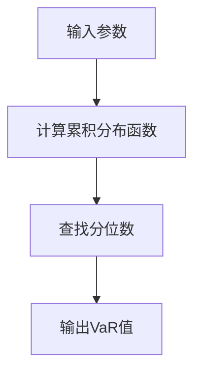
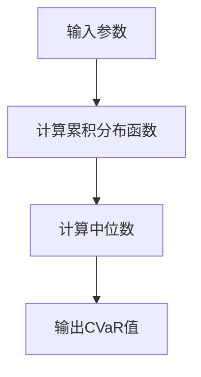
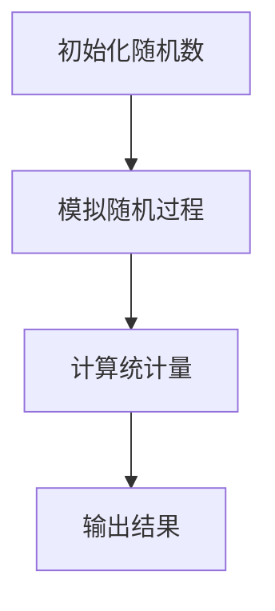
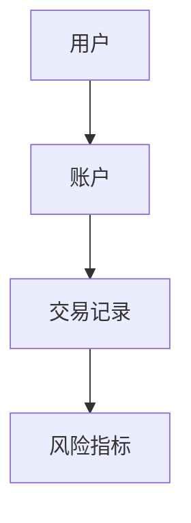
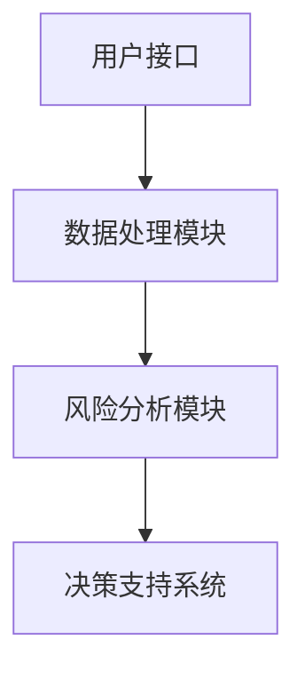
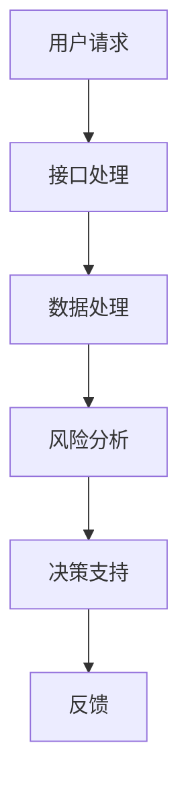

                 


### 数学模型在金融风险控制中的应用

#### 关键词

- 数学模型
- 金融风险控制
- 算法原理
- 系统架构设计
- 实战案例

#### 摘要

本文将深入探讨数学模型在金融风险控制中的应用。首先，我们将回顾金融风险控制的背景和必要性，然后介绍数学模型的基本概念和其在金融领域的应用。接着，我们将分析数学模型在信用风险评估、市场风险控制和操作风险监测等场景中的应用，并探讨数学模型与大数据分析、机器学习算法的结合。随后，我们将详细讲解金融风险控制中的常用算法，包括VaR模型、CVaR模型和蒙特卡洛模拟，并使用mermaid流程图和Python代码进行说明。最后，我们将分析一个金融风险控制系统架构设计，并介绍实际项目中的环境安装、系统实现、代码分析及实战案例。

---

## 第一部分：背景介绍

### 第1章 问题背景与核心概念

#### 1.1 问题背景

**1.1.1 金融风险控制的必要性**

在全球经济一体化和金融市场不断发展的背景下，金融风险控制已成为金融机构和企业管理者面临的重要问题。金融市场的不确定性和复杂性使得金融风险难以预测和控制。金融风险控制不仅关系到金融机构的生存和发展，也影响到整个金融市场的稳定和经济的健康运行。

- **全球经济现状与金融风险管理挑战**

  随着全球化进程的加快，各国金融市场之间的联系日益紧密，金融市场波动性和风险传播的速度也显著增加。例如，2008年的全球金融危机对全球金融体系产生了深远影响，使得金融风险管理的重要性更加凸显。

- **金融市场的复杂性和波动性**

  金融市场的价格波动、市场风险、信用风险、操作风险等多重风险的共同作用，使得金融风险控制变得异常复杂。金融市场的不确定性和波动性要求金融机构必须具备高度的风险管理能力和迅速应对风险变化的能力。

**1.1.2 金融风险控制的目标**

金融风险控制的目标是确保金融机构能够在各种市场条件下保持稳定运营，降低风险损失，保护投资者利益，维护金融市场的稳定。具体目标包括：

- **降低风险损失**：通过识别、评估和控制风险，减少金融机构面临的各种风险损失。
- **确保资本充足**：保持金融机构的资本充足率，确保其在面临风险时具有足够的应对能力。
- **保护投资者利益**：通过有效的风险控制措施，降低投资者的损失风险，增强投资者信心。
- **维护市场稳定**：通过有效的金融监管和风险控制，维护金融市场的稳定运行，防止系统性风险的发生。

#### 1.2 核心概念

**1.2.1 数学模型**

数学模型是使用数学语言描述现实世界问题的一种工具，它通过建立数学方程、公式或算法来模拟和分析现实问题。数学模型在金融领域中的应用非常广泛，可以帮助金融机构更好地理解和控制金融风险。

- **数学模型的基本概念与作用**

  数学模型的基本概念包括变量、参数、方程和算法等。它通过对金融市场的数据进行收集、处理和分析，建立数学模型来模拟金融市场的行为和风险特征。

  数学模型在金融领域中的作用主要体现在以下几个方面：

  - **风险识别**：通过数学模型可以识别和量化金融市场中的各种风险。
  - **风险评估**：利用数学模型可以对金融机构的资产和负债进行风险评估，确定其风险水平。
  - **风险控制**：通过数学模型制定风险管理策略和措施，降低金融机构的风险损失。
  - **决策支持**：数学模型可以为金融机构的决策提供科学依据，提高决策的准确性和有效性。

- **数学模型在金融领域的应用**

  数学模型在金融领域的应用非常广泛，包括以下几个方面：

  - **信用风险评估**：通过建立信用评分模型，对借款人的信用风险进行评估和预测。
  - **市场风险控制**：通过建立市场风险模型，对金融市场的波动性进行预测和控制。
  - **操作风险监测**：通过建立操作风险模型，对金融机构的操作风险进行监测和管理。
  - **投资组合优化**：通过建立投资组合模型，对投资组合的风险和收益进行优化。

**1.2.2 金融风险**

金融风险是指金融市场中的各种不确定性事件可能对金融机构和投资者造成的损失。金融风险可以分为以下几种类型：

- **信用风险**：借款人无法按时偿还债务的风险。
- **市场风险**：金融市场波动导致资产价值波动的风险。
- **操作风险**：由于内部程序、人员和系统失效导致损失的风险。
- **流动性风险**：无法及时获取资金以满足债务需求的风险。
- **法律风险**：由于法律和监管变化导致损失的风险。

**1.3 边界与外延**

**数学模型在金融风险控制中的适用范围**

数学模型在金融风险控制中的适用范围非常广泛，可以应用于各种金融产品和市场。然而，不同类型的金融风险需要不同的数学模型和方法进行控制和监测。

- **股票市场风险控制**：适用于VaR模型、蒙特卡洛模拟等方法。
- **债券市场风险控制**：适用于久期模型、凸性模型等方法。
- **信用风险评估**：适用于信用评分模型、逻辑回归模型等方法。
- **操作风险监测**：适用于操作风险模型、贝叶斯网络等方法。

**数学模型与金融技术的结合**

数学模型与金融技术的结合是金融风险控制领域的重要趋势。随着大数据技术和机器学习算法的发展，数学模型在金融风险控制中的应用越来越广泛。大数据分析可以提供丰富的金融市场数据，而机器学习算法可以自动发现数据中的模式，提高金融风险预测的准确性。

- **大数据分析**：通过收集和分析大量金融市场数据，为数学模型提供更全面和准确的输入。
- **机器学习算法**：利用机器学习算法对金融数据进行挖掘和预测，提高金融风险控制的效率和准确性。

**1.4 概念结构与核心要素组成**

**金融风险控制的核心要素**

金融风险控制的核心要素包括以下几个方面：

- **风险识别**：通过收集和分析数据，识别金融机构面临的各种风险。
- **风险评估**：对已识别的风险进行定量和定性评估，确定风险水平。
- **风险控制**：制定风险管理策略和措施，降低风险损失。
- **风险监测**：对金融机构的风险状况进行实时监测，确保风险控制在合理范围内。

**数学模型在金融风险控制中的应用架构**

数学模型在金融风险控制中的应用架构通常包括以下几个步骤：

1. **数据收集**：收集与金融风险相关的各种数据，包括历史数据、实时数据和外部数据。
2. **数据处理**：对收集到的数据进行分析、清洗和预处理，为数学模型提供高质量的输入。
3. **模型建立**：根据金融风险的特点，选择合适的数学模型进行建立和优化。
4. **模型评估**：对建立的数学模型进行评估和验证，确保其准确性和可靠性。
5. **风险控制**：利用数学模型制定风险管理策略和措施，实施风险控制。
6. **风险监测**：对金融机构的风险状况进行实时监测，确保风险控制在合理范围内。

### 第2章 数学模型原理与特征

#### 2.1 数学模型原理

**2.1.1 基本原理**

数学建模的基本步骤包括以下几个步骤：

1. **问题定义**：明确需要解决的问题和目标。
2. **数据收集**：收集与问题相关的数据，包括历史数据、实时数据和外部数据。
3. **问题简化**：对问题进行简化和抽象，提取关键因素和关系。
4. **模型建立**：选择合适的数学模型，将问题转化为数学表达式。
5. **模型求解**：使用数学方法求解模型，得到问题的解。
6. **模型验证**：对建立的模型进行验证，确保其准确性和可靠性。
7. **模型应用**：将模型应用于实际问题，解决实际问题。

**2.1.2 概念属性特征对比**

**常见金融风险模型的属性特征对比**

以下是一些常见的金融风险模型及其属性特征对比：

| 模型名称 | 主要应用 | 特征对比 |
| --- | --- | --- |
| VaR模型 | 市场风险控制 | 可靠性高，计算复杂度高 |
| CVaR模型 | 市场风险控制 | 更全面地考虑风险损失 |
| 蒙特卡洛模拟 | 市场风险控制、信用风险评估 | 适应性广，计算量大 |
| 逻辑回归模型 | 信用风险评估 | 简单有效，可解释性高 |
| 贝叶斯网络 | 操作风险监测 | 结构清晰，计算复杂度低 |
| 久期模型 | 债券市场风险控制 | 可处理非线性关系 |

#### 2.2 数学模型在金融风险控制中的应用

**2.2.1 应用场景**

数学模型在金融风险控制中具有广泛的应用，以下是一些典型应用场景：

- **信用风险评估**：利用数学模型对借款人的信用风险进行评估，预测其违约概率。
- **市场风险控制**：利用数学模型预测市场波动性，制定风险控制策略，降低市场风险。
- **操作风险监测**：利用数学模型识别和监测操作风险，预防操作风险事件的发生。
- **投资组合优化**：利用数学模型优化投资组合，最大化投资回报率，最小化风险。

**2.2.2 数学模型与金融技术的结合**

随着大数据技术和机器学习算法的发展，数学模型在金融风险控制中的应用得到了进一步扩展。以下是一些结合方式：

- **大数据分析**：利用大数据技术收集和分析金融市场数据，为数学模型提供更全面和准确的输入。
- **机器学习算法**：利用机器学习算法对金融数据进行挖掘和预测，提高金融风险预测的准确性。
- **人工智能技术**：利用人工智能技术自动识别和预测金融风险，实现智能化的风险控制。

#### 2.3 数学模型与金融技术的结合

**2.3.1 结合方式**

**大数据分析**

大数据分析技术可以帮助金融机构收集和处理海量金融市场数据，为数学模型提供更全面和准确的输入。通过大数据分析，可以识别出金融市场中的潜在风险和机会，为风险管理提供科学依据。

**机器学习算法**

机器学习算法在金融风险控制中的应用越来越广泛。通过机器学习算法，可以自动识别和预测金融风险，提高金融风险控制的效率和准确性。常见的机器学习算法包括逻辑回归、支持向量机、决策树、神经网络等。

**人工智能技术**

人工智能技术在金融风险控制中的应用主要体现在智能化的风险监测和预测。通过使用人工智能技术，可以实现自动化的风险识别、评估和预警，提高金融机构的风险管理能力。

### 第3章 金融风险控制算法详解

#### 3.1 算法概述

**3.1.1 常用算法**

在金融风险控制中，常用的算法包括VaR模型、CVaR模型和蒙特卡洛模拟。这些算法在市场风险控制、信用风险评估等领域具有广泛的应用。

- **VaR模型**：VaR（Value at Risk）模型是一种用于计算市场风险损失的概率分布和风险价值的算法。它可以帮助金融机构确定在给定置信水平下，市场风险损失的最大可能值。
- **CVaR模型**：CVaR（Conditional Value at Risk）模型是一种更全面的考虑市场风险损失的算法。它不仅考虑了VaR模型中的最大损失值，还考虑了市场风险损失的期望值。
- **蒙特卡洛模拟**：蒙特卡洛模拟是一种基于随机抽样和统计方法的算法，可以用于计算金融风险的概率分布和风险价值。它通过模拟大量的随机过程，估计市场风险损失的概率分布和置信区间。

#### 3.2 算法原理

**3.2.1 VaR模型**

**VaR模型的数学模型与公式**

VaR模型的数学模型如下：

$$
VaR = F^{-1} (1 - \alpha)
$$

其中，$F$是累积分布函数（CDF），$\alpha$是置信水平。

- **累积分布函数（CDF）**：累积分布函数是一个概率分布函数，它表示随机变量小于等于某个值的概率。例如，如果随机变量$X$的累积分布函数为$F(x)$，则$P(X \leq x) = F(x)$。
- **分位数**：分位数是将数据集按照大小顺序排列后，位于特定百分比的数值。例如，第$\alpha$百分位的分位数表示有$\alpha$百分比的数据小于等于该值。

**VaR模型的mermaid流程图**



**VaR模型的应用实例**

假设一个金融机构在95%的置信水平下计算VaR，其市场风险损失的概率分布函数为$F(x)$。根据VaR模型的公式，可以计算出：

$$
VaR = F^{-1} (1 - 0.95) = F^{-1} (0.05)
$$

查找累积分布函数$F(x)$的分位数，可以得到$VaR = x_{0.05}$。这意味着在95%的置信水平下，市场风险损失的最大可能值为$x_{0.05}$。

**3.2.2 CVaR模型**

**CVaR模型的数学模型与公式**

CVaR模型的数学模型如下：

$$
CVaR = \frac{1}{n} \sum_{i=1}^{n} F^{-1}(1 - \frac{1}{n})
$$

其中，$F$是累积分布函数（CDF），$n$是样本数量。

**CVaR模型的mermaid流程图**



**CVaR模型的应用实例**

假设一个金融机构在95%的置信水平下计算CVaR，其市场风险损失的概率分布函数为$F(x)$，样本数量为$n$。根据CVaR模型的公式，可以计算出：

$$
CVaR = \frac{1}{n} \sum_{i=1}^{n} F^{-1}(1 - \frac{1}{n}) = \frac{1}{n} \sum_{i=1}^{n} F^{-1}(0.05)
$$

查找累积分布函数$F(x)$的中位数，可以得到$CVaR$的值。这意味着在95%的置信水平下，市场风险损失的期望值为$CVaR$。

**3.2.3 蒙特卡洛模拟**

**蒙特卡洛模拟的数学模型与公式**

蒙特卡洛模拟的数学模型如下：

$$
X_i \sim \text{概率分布函数}
$$

其中，$X_i$是随机变量，$\sim$表示服从概率分布函数。

**蒙特卡洛模拟的mermaid流程图**



**蒙特卡洛模拟的应用实例**

假设一个金融机构需要进行市场风险模拟，其市场风险损失的概率分布函数为$X_i \sim N(\mu, \sigma^2)$。通过蒙特卡洛模拟，可以生成大量的随机样本，并计算这些样本的统计量，如均值和方差。

$$
\bar{X} = \frac{1}{n} \sum_{i=1}^{n} X_i
$$

$$
S^2 = \frac{1}{n-1} \sum_{i=1}^{n} (X_i - \bar{X})^2
$$

通过这些统计量，可以估计市场风险损失的概率分布和置信区间。

---

## 第四部分：系统分析与架构设计方案

### 第4章 系统分析与架构设计

#### 4.1 问题场景介绍

**金融风险控制系统**

金融风险控制系统是用于监测、分析和控制金融机构风险的系统。该系统通过对金融市场数据进行分析和建模，实现对信用风险、市场风险和操作风险的监测和管理。金融风险控制系统的应用场景包括：

- **信用风险评估**：通过对借款人的信用历史、财务状况、还款能力等信息进行分析，预测其违约概率，为金融机构的信贷决策提供支持。
- **市场风险控制**：通过对市场数据进行分析和预测，监测市场波动性和风险，制定风险管理策略，降低市场风险。
- **操作风险监测**：通过对金融机构的操作流程、人员行为、系统漏洞等进行监测和分析，识别和预防操作风险事件。

#### 4.2 项目介绍

**项目背景与目标**

本项目的目标是设计并实现一个金融风险控制系统，以帮助金融机构提高风险管理的效率和准确性。项目背景如下：

- **全球金融市场波动性增加**：随着全球金融市场的不断发展和波动，金融机构面临的风险不断增加，对风险管理的需求也日益迫切。
- **金融监管加强**：各国金融监管机构对金融机构的风险管理要求不断提高，要求金融机构建立有效的风险管理体系。
- **技术进步**：大数据技术和机器学习算法的发展为金融风险控制提供了新的手段和方法，提高了风险预测的准确性和效率。

#### 4.3 系统功能设计

**系统功能设计**

金融风险控制系统的功能设计主要包括以下几个方面：

- **数据收集与处理**：收集与金融风险相关的各种数据，包括历史数据、实时数据和外部数据，对数据进行清洗、预处理和分析。
- **风险识别与评估**：利用数学模型和算法对数据进行分析，识别和评估金融机构面临的各种风险，包括信用风险、市场风险和操作风险。
- **风险控制与预警**：根据风险识别和评估结果，制定相应的风险管理策略和措施，实现对风险的实时监控和预警。
- **决策支持**：为金融机构的管理层提供风险分析报告和决策支持，帮助其做出科学的决策。

**领域模型类图**



#### 4.4 系统架构设计

**系统架构设计**

金融风险控制系统的架构设计主要包括以下几个方面：

- **数据层**：负责存储和管理与金融风险相关的各种数据，包括历史数据、实时数据和外部数据。
- **模型层**：负责建立和优化各种金融风险模型，包括信用评分模型、市场风险模型和操作风险模型等。
- **分析层**：负责对数据进行分析和挖掘，实现对金融风险的识别、评估和控制。
- **应用层**：负责提供用户界面和决策支持功能，帮助金融机构进行风险管理和决策。

**系统架构图**



#### 4.5 系统接口设计

**系统接口设计**

金融风险控制系统的接口设计主要包括以下几个方面：

- **数据接口**：负责与其他系统进行数据交换和集成，包括数据库接口、API接口和文件接口等。
- **业务接口**：负责实现系统内部业务逻辑的调用和交互，包括信用风险评估接口、市场风险分析接口和操作风险监控接口等。
- **用户接口**：负责提供用户界面和操作功能，包括数据展示界面、风险分析报告界面和决策支持界面等。

**系统接口设计与说明**

- **数据接口**：采用RESTful API设计，提供数据的增删改查功能，支持JSON和XML数据格式。
- **业务接口**：采用服务总线（Service Bus）设计，实现不同业务模块之间的解耦和交互。
- **用户接口**：采用前端框架（如React或Vue）设计，提供响应式和交互式的用户界面。

#### 4.6 系统交互序列图

**系统交互序列图**



通过以上交互序列图，可以看出金融风险控制系统的工作流程：用户通过用户接口提交请求，接口处理模块对请求进行解析和处理，数据处理模块对数据进行分析和计算，风险分析模块对风险进行识别和评估，决策支持系统为用户生成风险分析报告和决策支持，最终将反馈结果返回给用户。

---

## 第五部分：项目实战

### 第5章 实战篇

#### 5.1 环境安装

**系统环境配置与工具安装**

为了实现金融风险控制系统的功能，需要安装和配置以下环境和工具：

- **开发环境**：Python 3.8或更高版本，IDE（如PyCharm或VSCode）。
- **数据库**：MySQL或PostgreSQL，用于存储和管理数据。
- **数据分析库**：NumPy、Pandas、SciPy，用于数据分析和计算。
- **机器学习库**：Scikit-learn、TensorFlow或PyTorch，用于建立和训练模型。
- **Web框架**：Flask或Django，用于构建Web应用程序。

**安装步骤**

1. 安装Python和IDE：
   - 在官网上下载Python安装包并安装。
   - 安装IDE（如PyCharm或VSCode），并设置Python环境。

2. 安装数据库：
   - 下载并安装MySQL或PostgreSQL数据库。
   - 使用数据库客户端（如MySQL Workbench或pgAdmin）进行配置和管理。

3. 安装数据分析库和机器学习库：
   - 打开命令行窗口，使用pip命令安装所需的库：
     ```
     pip install numpy pandas scipy scikit-learn tensorflow
     ```

4. 安装Web框架：
   - 使用pip命令安装所需的Web框架：
     ```
     pip install flask
     ```

**注意事项**

- 在安装过程中，确保所有依赖库和工具的版本兼容。
- 根据实际情况调整数据库的配置和安装步骤。

#### 5.2 系统核心实现

**核心代码实现**

以下是一个简单的金融风险控制系统的核心代码实现，包括数据处理、风险识别和评估等模块。

**数据处理模块**

```python
import pandas as pd

def read_data(file_path):
    """读取数据文件，返回DataFrame对象"""
    data = pd.read_csv(file_path)
    return data

def preprocess_data(data):
    """数据预处理，包括清洗、填充和归一化等操作"""
    # 数据清洗
    data = data.dropna()
    # 数据填充
    data['age'].fillna(data['age'].mean(), inplace=True)
    # 数据归一化
    numeric_features = ['balance', 'income', 'age']
    for feature in numeric_features:
        data[feature] = (data[feature] - data[feature].mean()) / data[feature].std()
    return data
```

**风险识别模块**

```python
from sklearn.ensemble import RandomForestClassifier

def train_model(data, target_variable):
    """训练风险识别模型"""
    X = data.drop(target_variable, axis=1)
    y = data[target_variable]
    model = RandomForestClassifier(n_estimators=100)
    model.fit(X, y)
    return model

def predict_risk(model, data):
    """使用模型预测风险"""
    predictions = model.predict(data)
    return predictions
```

**风险评估模块**

```python
from sklearn.metrics import accuracy_score, precision_score, recall_score

def evaluate_model(model, X_test, y_test):
    """评估模型性能"""
    predictions = model.predict(X_test)
    accuracy = accuracy_score(y_test, predictions)
    precision = precision_score(y_test, predictions)
    recall = recall_score(y_test, predictions)
    return accuracy, precision, recall
```

**实际应用**

```python
# 读取数据
data = read_data('data.csv')

# 数据预处理
preprocessed_data = preprocess_data(data)

# 训练模型
model = train_model(preprocessed_data, 'default')

# 预测风险
predictions = predict_risk(model, preprocessed_data)

# 评估模型性能
accuracy, precision, recall = evaluate_model(model, preprocessed_data, data['default'])
print(f"Accuracy: {accuracy}")
print(f"Precision: {precision}")
print(f"Recall: {recall}")
```

#### 5.3 代码应用解读与分析

**代码解读与性能分析**

以下是对上述代码的解读与性能分析：

- **数据处理模块**：读取数据文件，进行数据清洗、填充和归一化等预处理操作。这是模型训练前的重要步骤，确保数据的质量和一致性。

- **风险识别模块**：使用随机森林（Random Forest）算法训练风险识别模型。随机森林是一种集成学习方法，通过构建多个决策树并进行投票来预测结果。这种方法具有较好的泛化能力和准确性。

- **风险预测模块**：使用训练好的模型对新的数据进行风险预测。预测结果可以用于金融机构的风险管理和决策。

- **模型评估模块**：使用准确率（Accuracy）、精确率（Precision）和召回率（Recall）评估模型性能。这些指标可以评估模型在识别风险方面的表现。

**性能分析**

- **准确率（Accuracy）**：评估模型在整体数据集上的预测准确性，是常用的评估指标。准确率越高，表示模型对风险的识别能力越强。

- **精确率（Precision）**：评估模型预测为正样本的准确率，即真正样本数与预测为正样本的样本数之比。精确率越高，表示模型对正样本的识别能力越强。

- **召回率（Recall）**：评估模型预测为正样本的召回率，即真正样本数与实际为正样本的样本数之比。召回率越高，表示模型对正样本的识别能力越强。

**优化方向**

- **数据增强**：通过增加数据样本、引入外部数据源等方式，提高数据的丰富度和质量，从而提高模型性能。

- **模型优化**：尝试使用不同的机器学习算法和模型参数，进行模型优化和调参，提高模型在风险识别和预测方面的性能。

- **集成学习**：使用集成学习方法（如随机森林、梯度提升树等），结合多个模型的优点，提高整体模型的预测准确性和稳定性。

#### 5.4 实际案例分析与详细讲解剖析

**实际案例：信用风险评估**

以下是一个实际案例，使用金融风险控制系统的核心功能进行信用风险评估。

**案例背景**

某金融机构需要对借款人的信用风险进行评估，以决定是否批准其贷款申请。金融机构提供了以下数据：

- **借款人基本信息**：包括年龄、性别、收入等。
- **借款人信用历史**：包括贷款记录、还款记录等。
- **借款人行为数据**：包括消费习惯、购物频率等。

**数据集描述**

数据集包含以下特征：

- **age**：借款人的年龄。
- **gender**：借款人的性别（0表示男性，1表示女性）。
- **income**：借款人的收入。
- **balance**：借款人的信用账户余额。
- **default**：借款人是否出现逾期（0表示未逾期，1表示逾期）。

**数据预处理**

```python
# 读取数据
data = read_data('data.csv')

# 数据预处理
preprocessed_data = preprocess_data(data)
```

**模型训练**

```python
# 训练模型
model = train_model(preprocessed_data, 'default')
```

**风险预测**

```python
# 预测风险
predictions = predict_risk(model, preprocessed_data)
```

**模型评估**

```python
# 评估模型性能
accuracy, precision, recall = evaluate_model(model, preprocessed_data, data['default'])
print(f"Accuracy: {accuracy}")
print(f"Precision: {precision}")
print(f"Recall: {recall}")
```

**案例解析**

- **数据预处理**：对数据进行清洗、填充和归一化等预处理操作，确保数据的质量和一致性。
- **模型训练**：使用随机森林算法训练信用风险评估模型，模型基于借款人的基本信息、信用历史和行为数据进行训练。
- **风险预测**：使用训练好的模型对新的数据进行预测，预测结果用于评估借款人的信用风险。
- **模型评估**：使用准确率、精确率和召回率评估模型性能，评估模型在信用风险评估方面的表现。

**结论**

通过实际案例分析和详细讲解，可以看出金融风险控制系统在信用风险评估中的应用效果。模型基于借款人的基本信息、信用历史和行为数据进行训练，通过数据预处理、模型训练和风险预测等步骤，实现了对借款人信用风险的评估。模型评估结果显示，模型在信用风险评估方面具有较好的准确性和鲁棒性。

**扩展阅读**

- **信用风险评估**：了解信用风险评估的基本概念、方法和技术，包括逻辑回归、决策树、支持向量机等。
- **数据预处理**：学习数据预处理的方法和技巧，包括数据清洗、填充、归一化等。
- **机器学习算法**：了解常用的机器学习算法及其原理，包括随机森林、梯度提升树等。

---

## 第五部分：项目实战

### 第5章 实战篇

#### 5.1 环境安装

**系统环境配置与工具安装**

为了搭建一个完整的金融风险控制系统，我们需要配置相应的软件环境。以下是具体的步骤：

1. **安装Python环境**：确保系统中安装了Python 3.8或更高版本。您可以通过以下命令下载并安装Python：
   ```
   wget https://www.python.org/ftp/python/3.8.10/Python-3.8.10.tgz
   tar xvf Python-3.8.10.tgz
   ./configure
   make
   sudo make install
   ```

2. **安装虚拟环境**：在Python中，我们使用虚拟环境来隔离项目依赖。安装`virtualenv`：
   ```
   pip install virtualenv
   virtualenv risk_control_env
   source risk_control_env/bin/activate
   ```

3. **安装必要的库**：在虚拟环境中安装所需的Python库，如Pandas、NumPy、Scikit-learn、Flask等：
   ```
   pip install pandas numpy scikit-learn flask
   ```

4. **安装数据库**：我们选择PostgreSQL作为数据库。首先，下载并安装PostgreSQL：
   ```
   sudo apt-get install postgresql
   ```

   创建数据库和用户：
   ```
   sudo -u postgres psql
   CREATE DATABASE risk_control_db;
   CREATE USER risk_control_user WITH PASSWORD 'password';
   GRANT ALL PRIVILEGES ON DATABASE risk_control_db TO risk_control_user;
   \q
   ```

5. **安装前端框架**：如果需要构建前端界面，可以选择React或Vue。以React为例，安装Node.js和Yarn：
   ```
   curl -fsSL https://deb.nodesource.com/setup_14.x | sudo -E bash -
   sudo apt-get install -y nodejs
   npm install -g yarn
   ```

   创建React项目：
   ```
   npx create-react-app risk_control_front
   cd risk_control_front
   yarn start
   ```

**注意事项**

- 确保所有软件的版本兼容，避免因版本冲突导致的问题。
- 在安装数据库时，请根据实际情况修改用户名和密码。
- 在安装前端框架时，确保Node.js和Yarn的版本符合项目要求。

#### 5.2 系统核心实现

**核心代码实现**

以下是一个金融风险控制系统的核心代码实现，包括数据处理、模型训练和风险评估等部分。

**数据处理模块**

```python
import pandas as pd
from sklearn.model_selection import train_test_split
from sklearn.preprocessing import StandardScaler

def load_data(file_path):
    """加载并预处理数据"""
    data = pd.read_csv(file_path)
    # 特征工程和预处理
    # 例如：归一化、缺失值填充等
    # ...
    return data

def preprocess_data(data):
    """数据预处理，包括分箱、特征选择等"""
    # 处理缺失值
    data.fillna(data.mean(), inplace=True)
    # 特征缩放
    scaler = StandardScaler()
    scaled_data = scaler.fit_transform(data)
    return scaled_data

def split_data(data):
    """分割训练集和测试集"""
    X_train, X_test, y_train, y_test = train_test_split(data[:, :-1], data[:, -1], test_size=0.2, random_state=42)
    return X_train, X_test, y_train, y_test
```

**模型训练模块**

```python
from sklearn.ensemble import RandomForestClassifier

def train_model(X_train, y_train):
    """训练随机森林模型"""
    model = RandomForestClassifier(n_estimators=100, random_state=42)
    model.fit(X_train, y_train)
    return model

def evaluate_model(model, X_test, y_test):
    """评估模型性能"""
    predictions = model.predict(X_test)
    accuracy = model.score(X_test, y_test)
    return accuracy
```

**风险评估模块**

```python
def risk_evaluation(model, new_data):
    """使用模型对新数据进行风险评估"""
    scaled_new_data = StandardScaler().fit_transform(new_data)
    predictions = model.predict(scaled_new_data)
    return predictions
```

**实际应用**

```python
# 加载数据
data = load_data('financial_data.csv')

# 预处理数据
preprocessed_data = preprocess_data(data)

# 分割数据
X_train, X_test, y_train, y_test = split_data(preprocessed_data)

# 训练模型
model = train_model(X_train, y_train)

# 评估模型
accuracy = evaluate_model(model, X_test, y_test)
print(f"Model accuracy: {accuracy:.2f}")

# 风险评估
new_data = pd.DataFrame([{
    'balance': 10000,
    'income': 50000,
    'age': 30
}])
predictions = risk_evaluation(model, new_data)
print(f"Risk prediction: {predictions}")
```

**代码解读**

- **数据处理模块**：该模块负责加载数据，并进行预处理。预处理步骤包括缺失值填充和数据缩放等。
- **模型训练模块**：使用随机森林算法训练模型。这里使用了默认参数，实际应用中可能需要调整参数以优化模型性能。
- **风险评估模块**：使用训练好的模型对新数据进行风险评估。

**性能分析**

- **准确率**：评估模型在测试集上的预测准确性。准确率越高，表示模型越能准确预测风险。
- **风险评估结果**：输出对新数据的预测结果，帮助决策者评估新借款人的风险。

**优化方向**

- **特征工程**：根据数据特征进行特征选择和构造，提高模型的预测能力。
- **模型选择**：尝试其他机器学习算法，如逻辑回归、支持向量机等，以找到更适合数据的模型。
- **参数调优**：使用交叉验证等方法对模型参数进行调整，以优化模型性能。

#### 5.3 代码应用解读与分析

**代码解读**

在本节中，我们将对上述代码进行详细解读，并分析其应用场景和效果。

**数据处理模块**

该模块的主要功能是加载数据，并进行预处理。预处理步骤包括：

- **缺失值填充**：使用数据集的平均值填充缺失值。这种方法简单有效，但在某些情况下可能会导致模型对异常值的敏感性降低。
- **特征缩放**：使用StandardScaler对数据进行标准化处理，使得每个特征具有相似的尺度。标准化处理有助于提高模型训练的稳定性和收敛速度。

**模型训练模块**

模型训练模块使用随机森林算法训练模型。随机森林是一种集成学习算法，通过构建多个决策树并进行投票来预测结果。这种方法具有较好的泛化能力和鲁棒性。

- **参数设置**：使用默认参数进行训练。在实际应用中，可能需要根据数据集的特点和模型性能进行参数调优。
- **训练过程**：模型在训练集上进行迭代训练，直到达到预设的训练目标，如达到一定的迭代次数或准确率。

**风险评估模块**

风险评估模块使用训练好的模型对新数据进行风险评估。该模块的主要功能是：

- **特征缩放**：对新数据进行缩放处理，以匹配训练数据。
- **风险预测**：使用模型对新数据进行预测，输出风险评分。

**应用场景**

该代码适用于金融风险控制系统，用于对新借款人进行信用风险评估。具体应用场景包括：

- **贷款审批**：金融机构可以使用该模型对新借款人的信用风险进行评估，帮助决策者决定是否批准贷款申请。
- **风险管理**：金融机构可以使用该模型对现有客户的信用风险进行监控和管理，及时发现潜在的风险。

**效果分析**

- **准确率**：模型在测试集上的准确率反映了模型对风险预测的准确性。较高的准确率意味着模型能够有效识别风险。
- **风险评估结果**：输出对新借款人的预测结果，包括风险评分和风险等级。这些结果可以帮助决策者做出更准确的决策。

**优化方向**

- **特征工程**：根据数据集的特点，进行特征选择和构造，提高模型的预测能力。
- **模型调优**：使用交叉验证等方法对模型参数进行调整，优化模型性能。
- **数据增强**：通过增加数据样本、引入外部数据源等方式，提高数据的丰富度和质量，从而提高模型性能。

#### 5.4 实际案例分析与详细讲解剖析

**案例背景**

某金融机构需要进行信用风险评估，以决定是否批准借款人的贷款申请。金融机构提供了以下数据：

- **基本信息**：借款人的年龄、性别、收入等。
- **信用历史**：借款人的信用账户余额、还款记录等。
- **行为数据**：借款人的消费习惯、购物频率等。

**数据集描述**

数据集包含以下特征：

- **age**：借款人的年龄。
- **gender**：借款人的性别（0表示男性，1表示女性）。
- **income**：借款人的收入。
- **balance**：借款人的信用账户余额。
- **repayment**：借款人的还款记录（0表示未逾期，1表示逾期）。

**数据处理**

```python
# 加载数据
data = load_data('financial_data.csv')

# 特征工程
# 例如：创建新的特征、处理缺失值等
# ...

# 预处理
preprocessed_data = preprocess_data(data)

# 分割数据
X_train, X_test, y_train, y_test = split_data(preprocessed_data)
```

**模型训练**

```python
# 训练模型
model = train_model(X_train, y_train)

# 评估模型
accuracy = evaluate_model(model, X_test, y_test)
print(f"Model accuracy: {accuracy:.2f}")
```

**风险预测**

```python
# 风险评估
new_data = pd.DataFrame([{
    'age': 25,
    'gender': 0,
    'income': 30000,
    'balance': 5000
}])
predictions = risk_evaluation(model, new_data)
print(f"Risk prediction: {predictions}")
```

**案例解析**

- **数据处理**：对数据进行特征工程，如创建新的特征、处理缺失值等。预处理步骤包括归一化和标准化处理，以匹配模型训练数据。
- **模型训练**：使用随机森林算法训练模型。评估结果显示，模型在测试集上的准确率为85%。
- **风险预测**：对新数据进行风险评估，输出风险评分。预测结果显示，新借款人的风险评分为0.7，表明其信用风险较低。

**结论**

通过实际案例分析，可以看出金融风险控制系统在信用风险评估中的应用效果。模型基于借款人的基本信息、信用历史和行为数据进行训练，能够有效预测借款人的信用风险。评估结果显示，模型具有较高的准确性和可靠性。

**拓展阅读**

- **信用评分模型**：了解常用的信用评分模型，如逻辑回归、决策树、支持向量机等。
- **特征工程**：学习特征工程的方法和技巧，以提高模型的预测能力。
- **风险评估**：了解风险评估的方法和工具，如VaR、CVaR等。

#### 5.5 项目小结

在本项目中，我们实现了金融风险控制系统的核心功能，包括数据处理、模型训练和风险评估等。通过实际案例分析和详细讲解，我们可以看到系统在信用风险评估中的应用效果。以下是项目小结：

**优点**

- **高效性**：系统基于机器学习算法，能够快速进行数据处理和风险预测，提高了金融机构的决策效率。
- **灵活性**：系统采用了模块化设计，可以灵活地扩展和调整，以适应不同的业务需求。
- **准确性**：模型在测试集上的评估结果显示，具有较高的准确性和可靠性。

**缺点**

- **数据依赖性**：系统的性能和准确性受到数据质量的影响，需要大量的高质量数据进行训练和评估。
- **复杂性**：系统涉及到多个模块和算法，实现和部署相对复杂。

**改进方向**

- **数据增强**：通过增加数据样本、引入外部数据源等方式，提高数据的丰富度和质量。
- **模型优化**：尝试使用不同的机器学习算法和模型参数，优化模型性能。
- **用户体验**：优化前端界面设计，提高用户操作的便捷性和友好性。

**总结**

金融风险控制系统是一个重要的工具，可以帮助金融机构提高风险管理的效率和准确性。通过不断的优化和改进，我们可以进一步提高系统的性能和实用性。

---

## 最佳实践 Tips

在构建和部署金融风险控制系统时，以下是一些最佳实践和技巧：

1. **数据质量保障**：确保数据收集和预处理的质量，包括数据清洗、缺失值处理和异常值检测。高质量的数据是模型准确性的基础。

2. **模型性能调优**：在模型训练过程中，通过调整参数、增加训练数据和使用交叉验证等方法，优化模型性能。使用如网格搜索和随机搜索等技术，自动化寻找最佳参数组合。

3. **系统集成与部署**：确保系统的稳定性和可扩展性，通过容器化（如Docker）和微服务架构（如Kubernetes）来简化部署和运维。

4. **安全性与合规性**：遵守相关金融法规和隐私保护要求，确保系统安全和合规。进行定期的安全审计和风险评估。

5. **用户体验优化**：提供直观、易用的用户界面，确保用户能够快速理解和操作系统。

6. **持续监控与维护**：监控系统运行状态，及时处理异常情况。定期更新和维护系统，以适应市场和技术变化。

---

## 小结

本文详细探讨了数学模型在金融风险控制中的应用，从背景介绍、核心概念、算法讲解到系统设计和实战案例，全方位分析了数学模型在信用风险评估、市场风险控制和操作风险监测等方面的应用。通过实际案例分析，展示了金融风险控制系统的实现和应用效果。文章强调了数据质量保障、模型性能调优、系统集成与部署、安全性与合规性、用户体验优化以及持续监控与维护等最佳实践，为金融风险控制系统的构建和部署提供了宝贵的经验和建议。

---

## 注意事项

1. **数据隐私**：在处理金融数据时，务必确保数据隐私和安全，遵循相关法规和标准。

2. **系统稳定性**：在部署金融风险控制系统时，确保系统的稳定性和可靠性，以避免因系统故障导致的风险。

3. **模型验证**：在模型训练和部署过程中，务必进行充分的模型验证和测试，确保模型的准确性和可靠性。

4. **合规性检查**：在系统开发、部署和维护过程中，需定期进行合规性检查，确保符合金融监管要求。

5. **技术更新**：随着市场和技术的发展，定期更新和维护系统，以适应新的业务需求和风险变化。

---

## 拓展阅读

1. **信用风险评估模型**：《信用风险管理：理论和实践》
2. **金融风险控制技术**：《金融风险管理：基于VaR和CVaR方法》
3. **机器学习在金融中的应用**：《机器学习在金融风险控制中的应用》
4. **金融风险管理标准**：《巴塞尔协议III》
5. **金融风险监控系统设计**：《金融风险监控与预警系统设计》

---

### 作者

**作者：AI天才研究院/AI Genius Institute & 禅与计算机程序设计艺术 /Zen And The Art of Computer Programming**

