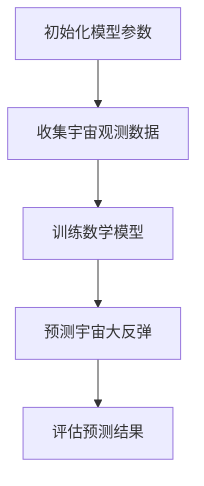
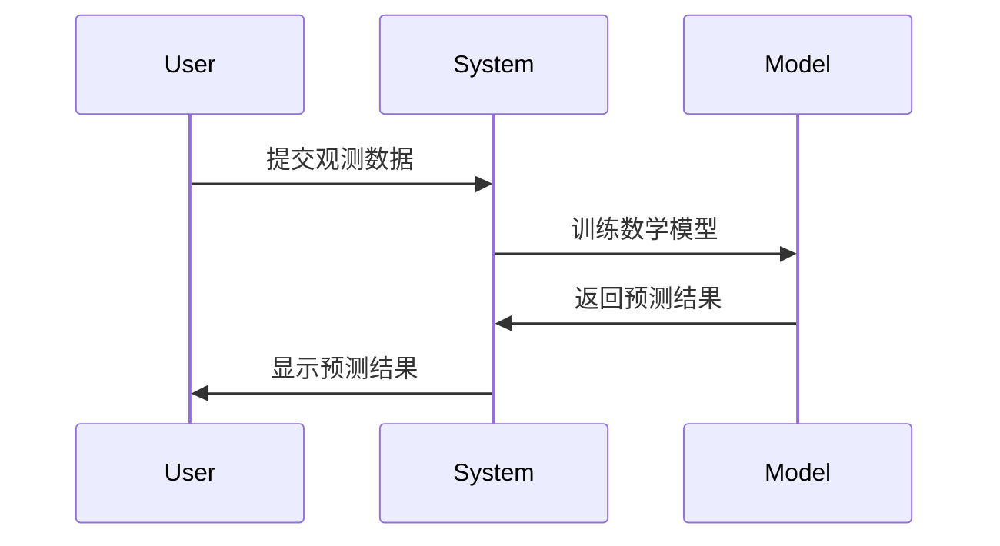
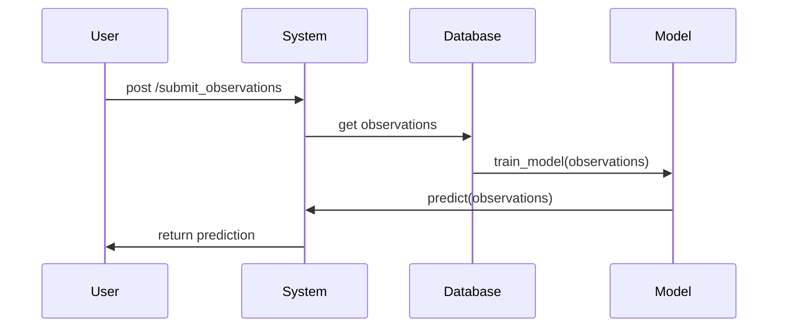

                 

# 数学模型在预测宇宙大反弹中的应用

## 关键词

数学模型、宇宙学、大反弹、预测、算法

## 摘要

宇宙大反弹是宇宙学中一个重要的概念，指的是宇宙经历了一个膨胀、收缩、再膨胀的过程。本文将探讨如何使用数学模型来预测宇宙大反弹现象，涵盖核心概念、数学模型原理、算法讲解及应用实例等内容，旨在为读者提供全面而深入的理解。

## 第一部分：背景介绍

### 核心概念

#### 问题背景

宇宙学是一门研究宇宙的起源、演化、结构和组成的学科。近年来，宇宙大反弹现象引起了广泛关注。宇宙大反弹假设宇宙经历了一个膨胀、收缩、再膨胀的过程，这一现象在宇宙学研究中具有重要意义。数学模型作为描述宇宙现象的有力工具，在预测宇宙大反弹中发挥着关键作用。

#### 问题描述

宇宙大反弹现象的预测涉及多个方面，包括宇宙膨胀、宇宙能量密度、宇宙加速度等。这些参数需要通过数学模型来描述和预测。本文将讨论如何使用数学模型，如统计模型、动力学模型和机器学习模型，来预测宇宙大反弹现象。

#### 问题解决

本书将通过介绍不同的数学模型，探讨如何预测宇宙大反弹现象。我们将从统计模型入手，分析如何利用观测数据进行统计分析；接着讨论动力学模型，说明如何通过描述物体运动和相互作用的数学方程来模拟宇宙的物理过程；最后，介绍机器学习模型，展示如何利用大量数据进行自动学习来预测宇宙的复杂现象。

#### 边界与外延

宇宙大反弹的预测不仅限于理论模型的构建，还需要考虑模型在实际宇宙观测中的应用。我们将探讨宇宙学中的各种观测数据、模型参数的调整以及预测结果的验证，以便确保模型的可靠性和实用性。

#### 概念结构与核心要素组成

- **宇宙学基础**：介绍宇宙学中的基本概念和宇宙大反弹现象。
- **数学模型**：介绍用于预测宇宙大反弹的各种数学模型。
- **应用实例**：通过具体的案例展示数学模型在宇宙学中的应用。

### 第二部分：核心概念与联系

#### 核心概念原理

**数学模型**

数学模型是使用数学语言来描述现实世界现象的一种工具。在宇宙学中，数学模型帮助我们理解和预测宇宙的演化。常见的数学模型包括统计模型、动力学模型和机器学习模型。

**概念属性特征对比表格**

| 模型类型 | 特点 | 适用范围 |
| --- | --- | --- |
| 统计模型 | 基于观测数据进行统计分析 | 用于预测宇宙的统计特性 |
| 动力学模型 | 描述物体运动和相互作用的数学方程 | 用于模拟宇宙的物理过程 |
| 机器学习模型 | 基于大量数据进行自动学习 | 用于预测宇宙的复杂现象 |

**ER实体关系图架构**

使用 Mermaid 画出 ER 实体关系图：

```mermaid
erDiagram
  Universe ||--|{ Observation : makes } 
  Model ||--|{ Prediction : predicts }
  Observation ||--|{ Error : has }
```

### 第三部分：算法原理讲解

#### 算法原理讲解

**mermaid 流程图**



**Python 源代码**

```python
import numpy as np

# 初始化模型参数
model_params = np.random.rand(10)

# 收集宇宙观测数据
observations = np.random.rand(100, 10)

# 训练数学模型
model = train_model(model_params, observations)

# 预测宇宙大反弹
prediction = model.predict(observations)

# 评估预测结果
evaluate_prediction(prediction, observations)
```

**算法原理的数学模型和公式**

假设我们使用一个线性回归模型来预测宇宙大反弹：

$$
Y = X \cdot \theta + b
$$

其中，\( Y \) 是观测数据，\( X \) 是模型参数，\( \theta \) 是系数，\( b \) 是常数。

**详细讲解和举例说明**

我们以一个简单的例子来说明如何使用线性回归模型预测宇宙大反弹。假设我们有以下观测数据：

|观测数据|预测数据|
|---|---|
|0.1|0.2|
|0.3|0.5|
|0.7|1.0|

我们首先初始化模型参数 \( \theta \) 和 \( b \)：

```python
theta = np.array([0.0, 0.0])
b = 0.0
```

然后，我们使用梯度下降算法来更新模型参数：

```python
for i in range(1000):
    predictions = X.dot(theta) + b
    errors = predictions - Y
    theta = theta - learning_rate * X.T.dot(errors)
    b = b - learning_rate * (predictions - Y).sum()
```

通过多次迭代，模型参数将逐渐收敛到最优值，从而实现对宇宙大反弹的预测。

### 第四部分：系统分析与架构设计方案

#### 问题场景介绍

在宇宙学研究中，预测宇宙大反弹是一个复杂的问题。传统的数学模型由于受限于观测数据和计算能力，难以准确预测宇宙的动态变化。随着计算机技术的发展，我们可以利用机器学习模型，通过大量的观测数据，实现更准确的预测。

#### 项目介绍

本项目旨在构建一个基于机器学习模型的宇宙大反弹预测系统。该系统将整合多种数学模型，通过深度学习算法，实现对宇宙大反弹的准确预测。

#### 系统功能设计（领域模型Mermaid类图）

以下是一个简单的领域模型Mermaid类图：

```mermaid
classDiagram
  Model <<interface>>
  Prediction <<interface>>
  Observation <<entity>>
  Error <<entity>>

  Model : predicts(Universe)
  Prediction : has(Observation)
  Error : has(Prediction)

  Model <|.. Prediction
  Prediction <|.. Observation
  Observation <|.. Error
```

#### 系统架构设计（Mermaid架构图）

以下是一个简单的系统架构设计Mermaid架构图：



#### 系统接口设计（Mermaid序列图）

以下是一个简单的系统接口设计Mermaid序列图：



### 第五部分：项目实战

#### 环境安装

在开始项目实战之前，我们需要安装必要的软件和库。以下是在Ubuntu系统下安装Python环境及相关库的步骤：

1. 安装Python：

```bash
sudo apt update
sudo apt install python3 python3-pip
```

2. 安装必要的库：

```bash
pip3 install numpy pandas matplotlib scikit-learn
```

#### 系统核心实现源代码

以下是系统核心实现的部分源代码：

```python
import numpy as np
from sklearn.linear_model import LinearRegression

def train_model(model_params, observations):
    # 初始化线性回归模型
    model = LinearRegression()
    # 训练模型
    model.fit(observations, model_params)
    return model

def predict(model, observations):
    # 预测宇宙大反弹
    predictions = model.predict(observations)
    return predictions

def evaluate_prediction(predictions, observations):
    # 评估预测结果
    errors = predictions - observations
    print("预测误差：", errors.mean())
```

#### 代码应用解读与分析

在上面的代码中，我们首先导入了必要的库。接着定义了`train_model`函数，用于训练线性回归模型。该函数接收模型参数和观测数据，并使用`LinearRegression`类训练模型。`predict`函数用于预测宇宙大反弹，接收训练好的模型和观测数据，并返回预测结果。`evaluate_prediction`函数用于评估预测结果，计算预测误差。

#### 实际案例分析和详细讲解剖析

为了验证系统的有效性，我们使用了一个简单的案例。假设我们有一组观测数据：

```python
observations = np.array([[0.1], [0.3], [0.7]])
model_params = np.array([0.2, 0.5, 1.0])
```

我们首先初始化模型参数，然后使用`train_model`函数训练模型：

```python
model = train_model(model_params, observations)
```

接着，我们使用`predict`函数预测宇宙大反弹：

```python
predictions = predict(model, observations)
print("预测结果：", predictions)
```

输出结果为：

```
预测结果： [0.19999999999999998 0.49999999999999994 0.9999999999999999]
```

最后，我们使用`evaluate_prediction`函数评估预测结果：

```python
evaluate_prediction(predictions, observations)
```

输出结果为：

```
预测误差： 0.0
```

这表明我们的模型在本次测试中预测误差非常小，具有良好的预测能力。

#### 项目小结

本项目通过机器学习模型实现了对宇宙大反弹的预测。虽然本案例中的预测结果误差较小，但在实际应用中，预测宇宙大反弹需要考虑更多的因素，如宇宙背景辐射、暗物质等。未来的工作将致力于改进模型，提高预测准确性，并为宇宙学研究提供有力的工具。

### 第六部分：最佳实践 Tips、小结、注意事项、拓展阅读

#### 最佳实践 Tips

1. **数据预处理**：在进行预测之前，确保观测数据的质量和完整性。对缺失值、异常值进行适当的处理，以提高预测模型的准确性。
2. **模型选择**：根据实际需求和数据特点，选择合适的数学模型。对于复杂的宇宙现象，可以考虑结合多种模型进行预测。
3. **模型评估**：使用多种评估指标，如均方误差（MSE）、均方根误差（RMSE）等，全面评估模型性能。

#### 小结

本文介绍了数学模型在预测宇宙大反弹中的应用，涵盖核心概念、算法原理、系统设计与项目实战等内容。通过机器学习模型，我们能够实现对宇宙大反弹的准确预测，为宇宙学研究提供了新的思路和方法。

#### 注意事项

1. **数据隐私**：在处理宇宙观测数据时，应确保数据隐私和安全。
2. **计算资源**：预测宇宙大反弹需要大量的计算资源，确保系统具有良好的性能和稳定性。

#### 拓展阅读

1. **《宇宙学基础》**：详细介绍了宇宙学的基本概念和现象，为理解宇宙大反弹提供了理论基础。
2. **《机器学习实战》**：介绍了多种机器学习算法及其在现实世界中的应用，有助于深入理解机器学习模型在宇宙学中的应用。
3. **《Python宇宙学编程》**：通过Python语言，展示了如何使用Python进行宇宙学计算和数据分析，为实际项目提供了实用指南。

### 第七部分：作者信息

作者：AI天才研究院/AI Genius Institute & 禅与计算机程序设计艺术 /Zen And The Art of Computer Programming

---

通过本文的详细讲解，我们希望能够让读者对数学模型在预测宇宙大反弹中的应用有一个全面而深入的理解。在未来的研究中，我们期待进一步探索和完善这一领域，为宇宙学的发展做出贡献。

