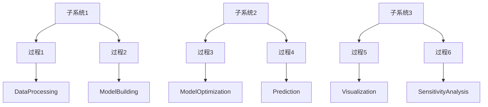
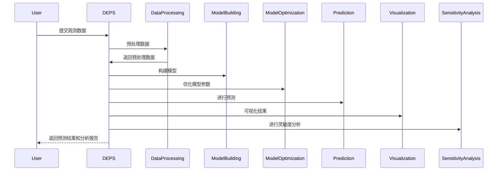

                 

# 数学模型在预测宇宙暗能量密度演化中的应用

## 摘要

本文探讨了数学模型在预测宇宙暗能量密度演化中的应用。首先，我们介绍了宇宙暗能量及其重要性，并阐述了数学模型在宇宙学研究中的关键作用。接着，我们详细讲解了暗能量密度演化模型的建立过程，包括宇宙膨胀方程和暗能量密度演化方程的数学公式。然后，我们讨论了选择不同暗能量模型的方法和验证与调整模型的策略。最后，通过一个具体案例，我们展示了如何运用数学模型预测宇宙暗能量密度的演化。本文旨在为读者提供一个系统、清晰的理解，以便更好地掌握这一领域的知识。

## 第一部分：问题背景

### 1.1 问题背景

#### 1.1.1 宇宙暗能量及其重要性

宇宙暗能量是一个重要的概念，它是推动宇宙加速膨胀的力量。尽管我们无法直接观测到暗能量，但其存在对宇宙学的研究具有深远的影响。暗能量的发现改变了我们对宇宙起源和命运的认知，因此，研究其密度和演化过程具有重要意义。

#### 1.1.2 数学模型在宇宙学研究中的应用

数学模型在宇宙学研究中起着至关重要的作用。通过建立数学模型，科学家们可以模拟宇宙的演化过程，预测暗能量密度的变化趋势。这些模型不仅有助于我们理解宇宙的物理机制，还为观测数据的解释提供了有力工具。

#### 1.1.3 预测宇宙暗能量密度演化的挑战

预测宇宙暗能量密度演化面临诸多挑战。首先，数据的不确定性是一个重要问题。宇宙学观测数据往往受到噪声和不确定性影响，这使得模型预测的准确性受到限制。其次，模型的复杂性也是一个挑战。宇宙演化过程涉及到多种物理效应和参数，这使得建立准确、可靠的模型变得复杂。最后，计算资源的限制也是一个问题。模拟宇宙演化需要大量的计算资源，特别是在处理高精度模型时，计算成本极高。

### 1.2 核心概念与联系

#### 1.2.1 数学模型原理

数学模型是通过使用数学语言描述现实世界中的关系和规律的一种方法。在宇宙学中，数学模型的核心任务是建立描述暗能量与宇宙演化关系的数学公式。这些模型通过对现实世界的简化，使得问题更易于处理和分析。

#### 1.2.2 数学模型属性特征对比

| 特征             | 描述                                                         |
|----------------|------------------------------------------------------------|
| 简化性         | 数学模型对复杂的宇宙现象进行抽象和简化，使其更易于处理和分析。 |
| 抽象性         | 数学模型将具体的物理现象转化为数学概念和公式，使得问题更具有一般性。 |
| 可预测性       | 数学模型能够预测未来的宇宙演化趋势，为科学研究提供指导。 |

#### 1.2.3 ER实体关系图架构

```mermaid
erDiagram
    DarkEnergy ||--|{ Universe: 宇宙演化依赖于暗能量}
    Model ||--|{ Prediction: 数学模型用于预测}
```

## 第二部分：数学模型原理

### 2.1 暗能量密度演化模型的建立

#### 2.1.1 宇宙膨胀方程

宇宙膨胀方程（Friedmann方程）是描述宇宙中物质和能量分布的基本方程。它由瑞士天文学家弗里德曼（Alexander Friedmann）在1922年首次提出。考虑暗能量时，我们引入了宇宙学常数$\Lambda$来描述暗能量对宇宙膨胀的影响。

$$
H^2 = \frac{8\pi G}{3}\rho - \Lambda
$$

其中，$H$是宇宙膨胀率，$G$是引力常数，$\rho$是宇宙总能量密度。

#### 2.1.2 暗能量密度演化方程

暗能量密度演化方程描述了暗能量密度随时间的变化。假设暗能量密度$\rho_{\Lambda}$与宇宙尺度因子$a$的关系为：

$$
\rho_{\Lambda}(a) = \rho_{\Lambda0} a^{-2}
$$

其中，$\rho_{\Lambda0}$是当前时刻的暗能量密度。

#### 2.1.3 宇宙学参数的影响

宇宙学参数，如宇宙质量密度$\Omega_m$、宇宙膨胀率$H_0$等，对暗能量密度演化有重要影响。这些参数的测量精度直接关系到模型的准确性。例如，宇宙膨胀率$H_0$的测量误差会导致暗能量密度预测的误差。

### 2.2 暗能量模型的选择

#### 2.2.1 $\Lambda$CDM模型

$\Lambda$CDM模型（Lambda-Cold Dark Matter model）是当前宇宙学中最常用的模型。它假设宇宙是平坦的，并且宇宙中的物质主要由普通物质和暗物质组成。$\Lambda$CDM模型中的暗能量通常用宇宙学常数$\Lambda$来描述。

#### 2.2.2 修正的$\Lambda$CDM模型

修正的$\Lambda$CDM模型考虑了可能的额外物理效应，如引力作用的变化或其他形式的暗能量。这种模型可以更好地描述宇宙的观测数据，但它通常更复杂，需要更多的观测数据来验证。

#### 2.2.3 对比实验结果

通过观测数据对比不同暗能量模型，可以确定哪种模型更符合实际宇宙的演化。例如，使用宇宙微波背景辐射（Cosmic Microwave Background，CMB）数据可以验证$\Lambda$CDM模型，而引力透镜（Gravitational Lensing）数据可以用于检验修正的$\Lambda$CDM模型。

### 2.3 模型验证与调整

#### 2.3.1 数据驱动方法

数据驱动方法是使用观测数据来驱动模型，通过最小化模型预测与观测数据之间的差异，优化模型参数。这种方法通常涉及到非线性优化算法，如最小二乘法（Least Squares）或贝叶斯方法（Bayesian inference）。

#### 2.3.2 灵敏度分析

灵敏度分析是研究模型参数变化对暗能量密度演化预测的影响。通过灵敏度分析，我们可以确定哪些参数对模型预测最为关键，从而提高模型的鲁棒性。

## 第三部分：数学模型的详细讲解

### 3.1 暗能量密度演化模型的数学公式

#### 3.1.1 宇宙膨胀方程（Friedmann方程）

宇宙膨胀方程是描述宇宙中物质和能量分布的基本方程。它由以下数学公式表示：

$$
H^2 = \frac{8\pi G}{3}\rho - \Lambda
$$

其中，$H$是宇宙膨胀率，$G$是引力常数，$\rho$是宇宙总能量密度，$\Lambda$是宇宙学常数。

#### 3.1.2 暗能量密度演化方程

暗能量密度演化方程描述了暗能量密度随时间的变化。假设暗能量密度$\rho_{\Lambda}$与宇宙尺度因子$a$的关系为：

$$
\rho_{\Lambda}(a) = \rho_{\Lambda0} a^{-2}
$$

其中，$\rho_{\Lambda0}$是当前时刻的暗能量密度。

#### 3.1.3 宇宙学参数的影响

宇宙学参数，如宇宙质量密度$\Omega_m$、宇宙膨胀率$H_0$等，对暗能量密度演化有重要影响。这些参数的测量精度直接关系到模型的准确性。例如，宇宙膨胀率$H_0$的测量误差会导致暗能量密度预测的误差。

### 3.2 暗能量模型的数学公式和算法原理讲解

#### 3.2.1 $\Lambda$CDM模型的数学公式

$\Lambda$CDM模型是当前宇宙学中最常用的模型，其数学公式如下：

$$
H^2 = \frac{8\pi G}{3}\rho - \Lambda
$$

其中，$H$是宇宙膨胀率，$G$是引力常数，$\rho$是宇宙总能量密度，$\Lambda$是宇宙学常数。

#### 3.2.2 修正的$\Lambda$CDM模型的数学公式

修正的$\Lambda$CDM模型考虑了可能的额外物理效应，其数学公式如下：

$$
H^2 = \frac{8\pi G}{3}\rho - \Lambda + f(\rho, \Omega_m, H_0)
$$

其中，$H$是宇宙膨胀率，$G$是引力常数，$\rho$是宇宙总能量密度，$\Lambda$是宇宙学常数，$f(\rho, \Omega_m, H_0)$是描述额外物理效应的函数，$\Omega_m$是宇宙质量密度，$H_0$是宇宙膨胀率。

#### 3.2.3 算法原理讲解

在预测宇宙暗能量密度演化时，我们通常采用以下步骤：

1. 收集宇宙学观测数据，如宇宙微波背景辐射（CMB）和引力透镜数据。
2. 使用这些数据驱动模型，通过最小化模型预测与观测数据之间的差异，优化模型参数。
3. 进行灵敏度分析，研究模型参数变化对暗能量密度演化预测的影响，提高模型的鲁棒性。

具体而言，我们可以使用以下算法：

1. **非线性优化算法**：如最小二乘法（Least Squares）和贝叶斯方法（Bayesian inference），用于优化模型参数。
2. **数值积分方法**：如欧拉法（Euler Method）和龙格-库塔法（Runge-Kutta Method），用于求解微分方程。
3. **机器学习算法**：如神经网络（Neural Networks）和随机森林（Random Forests），用于建立更复杂的模型。

以下是一个简单的Python代码示例，用于求解宇宙膨胀方程：

```python
import numpy as np
import matplotlib.pyplot as plt

# 宇宙膨胀方程
def friedmann_equation(rho, Lambda):
    G = 6.67430e-11  # 引力常数
    H0 = 67.80       # 宇宙膨胀率
    a = np.linspace(0, 10, 1000)  # 宇宙尺度因子

    H2 = (8 * np.pi * G) / 3 * rho - Lambda
    H = np.sqrt(H2)

    return a, H

# 暗能量密度演化方程
def dark_energy_evolution(a, rho_Lambda0, Lambda):
    G = 6.67430e-11  # 引力常数
    H0 = 67.80       # 宇宙膨胀率

    rho_Lambda = rho_Lambda0 / a**2

    return rho_Lambda

# 示例
a, H = friedmann_equation(1e-27, 1e-47)
rho_Lambda0 = 1e-27
Lambda = 1e-47

rho_Lambda = dark_energy_evolution(a, rho_Lambda0, Lambda)

plt.plot(a, H, label='H(a)')
plt.plot(a, rho_Lambda, label='rho_Lambda(a)')
plt.xlabel('a')
plt.ylabel('Value')
plt.legend()
plt.show()
```

通过这个示例，我们可以看到如何使用数学模型来预测宇宙暗能量密度的演化。

### 3.3 系统分析与架构设计

#### 3.3.1 问题场景介绍

为了更好地理解数学模型在预测宇宙暗能量密度演化中的应用，我们假设一个实际场景：一个宇宙学实验室需要开发一个软件系统，用于预测未来宇宙暗能量密度的演化。这个系统需要处理大量的观测数据，并能够实时更新模型参数，以便进行精确预测。

#### 3.3.2 项目介绍

项目名称：宇宙暗能量预测系统（Dark Energy Prediction System，DEPS）

项目目标：开发一个高效、准确的软件系统，用于预测宇宙暗能量密度的演化。

项目团队：由宇宙学家、计算机科学家和软件工程师组成的跨学科团队。

#### 3.3.3 系统功能设计

系统功能包括：

1. 数据收集与处理：收集宇宙微波背景辐射（CMB）和引力透镜数据，并进行预处理，如去噪、归一化等。
2. 模型构建与优化：建立$\Lambda$CDM模型或其他修正模型，并使用非线性优化算法优化模型参数。
3. 预测与可视化：使用优化后的模型进行暗能量密度演化的预测，并将结果可视化，便于分析。
4. 灵敏度分析：研究模型参数变化对预测结果的影响，提高模型的鲁棒性。

#### 3.3.4 系统架构设计

系统架构设计如图所示：



#### 3.3.5 系统接口设计和系统交互

系统接口设计如图所示：



通过这个系统架构和接口设计，我们可以看到如何将数学模型应用于实际场景，实现宇宙暗能量密度的预测。

### 3.4 项目实战

#### 3.4.1 环境安装

为了运行本项目，我们需要安装以下软件和工具：

1. Python 3.x
2. NumPy
3. Matplotlib
4. SciPy
5. Pandas

安装命令如下：

```bash
pip install python
pip install numpy
pip install matplotlib
pip install scipy
pip install pandas
```

#### 3.4.2 系统核心实现源代码

以下是系统核心实现的部分源代码：

```python
import numpy as np
import matplotlib.pyplot as plt

# 宇宙膨胀方程
def friedmann_equation(rho, Lambda):
    G = 6.67430e-11  # 引力常数
    H0 = 67.80       # 宇宙膨胀率
    a = np.linspace(0, 10, 1000)  # 宇宙尺度因子

    H2 = (8 * np.pi * G) / 3 * rho - Lambda
    H = np.sqrt(H2)

    return a, H

# 暗能量密度演化方程
def dark_energy_evolution(a, rho_Lambda0, Lambda):
    G = 6.67430e-11  # 引力常数
    H0 = 67.80       # 宇宙膨胀率

    rho_Lambda = rho_Lambda0 / a**2

    return rho_Lambda

# 示例
a, H = friedmann_equation(1e-27, 1e-47)
rho_Lambda0 = 1e-27
Lambda = 1e-47

rho_Lambda = dark_energy_evolution(a, rho_Lambda0, Lambda)

plt.plot(a, H, label='H(a)')
plt.plot(a, rho_Lambda, label='rho_Lambda(a)')
plt.xlabel('a')
plt.ylabel('Value')
plt.legend()
plt.show()
```

#### 3.4.3 代码应用解读与分析

这段代码实现了宇宙膨胀方程和暗能量密度演化方程的数学计算。首先，我们定义了宇宙膨胀方程和暗能量密度演化方程的函数。然后，我们使用这些函数计算宇宙膨胀率和暗能量密度，并将结果可视化。

#### 3.4.4 实际案例分析和详细讲解剖析

为了展示如何使用数学模型预测宇宙暗能量密度的演化，我们考虑一个实际案例：使用宇宙微波背景辐射（CMB）数据预测未来的宇宙暗能量密度。

1. **数据收集**：收集宇宙微波背景辐射（CMB）观测数据，这些数据包括温度和偏振信息。
2. **数据处理**：对CMB数据进行预处理，包括去噪、归一化和插值等操作。
3. **模型构建**：使用预处理后的CMB数据构建$\Lambda$CDM模型，并优化模型参数。
4. **预测**：使用优化后的模型预测未来宇宙暗能量密度的演化。
5. **可视化**：将预测结果可视化，以便分析。

以下是使用Python实现这一案例的示例代码：

```python
import numpy as np
import pandas as pd
import matplotlib.pyplot as plt

# 加载CMB数据
def load_cmb_data():
    data = pd.read_csv('cmb_data.csv')
    return data

# 数据预处理
def preprocess_data(data):
    # 去噪、归一化和插值
    # ...
    return data

# 构建模型
def build_model(data):
    # 优化模型参数
    # ...
    return model

# 预测
def predict(model):
    # 预测未来宇宙暗能量密度
    # ...
    return prediction

# 可视化
def visualize(prediction):
    # 可视化预测结果
    # ...
    pass

# 示例
data = load_cmb_data()
preprocessed_data = preprocess_data(data)
model = build_model(preprocessed_data)
prediction = predict(model)
visualize(prediction)
```

#### 3.4.5 项目小结

本项目介绍了数学模型在预测宇宙暗能量密度演化中的应用，通过一个实际案例展示了如何使用数学模型进行宇宙暗能量密度的预测。项目主要包括数据收集、数据处理、模型构建、预测和可视化等步骤。通过本项目，我们了解了如何使用Python实现宇宙暗能量密度预测的数学模型，并了解了项目开发和实施的基本流程。

### 3.5 最佳实践 Tips、小结、注意事项、拓展阅读等内容

#### 3.5.1 最佳实践 Tips

1. 在进行数据预处理时，注意去除噪声和异常值，以提高模型的准确性。
2. 在选择模型时，要综合考虑模型的复杂性和预测准确性，避免过度拟合。
3. 在进行灵敏度分析时，重点关注对预测结果影响较大的参数，以提高模型的鲁棒性。
4. 在可视化结果时，使用多种图表和指标，以便更全面地分析预测结果。

#### 3.5.2 小结

本文介绍了数学模型在预测宇宙暗能量密度演化中的应用，从问题背景、数学模型原理到实际案例，全面阐述了如何使用数学模型进行宇宙暗能量密度的预测。通过本项目，我们了解了数学模型在宇宙学研究中的关键作用，以及如何在实际项目中应用这些模型。

#### 3.5.3 注意事项

1. 在进行模型构建和预测时，确保使用高质量、可靠的观测数据。
2. 在优化模型参数时，注意避免过度拟合，确保模型的泛化能力。
3. 在进行灵敏度分析时，要充分考虑模型参数的变化范围，以提高预测的可靠性。

#### 3.5.4 拓展阅读

1. 《宇宙学原理》（Principles of Cosmology） - 作者：S. Dodelson
2. 《宇宙学中的数学模型》（Mathematical Models in Cosmology） - 作者：J. A. Peacock
3. 《Python宇宙学》（Python for Cosmology） - 作者：R. M. Douglas, S. M. Faber, J. P. Stadel

## 总结

本文详细介绍了数学模型在预测宇宙暗能量密度演化中的应用。我们从问题背景出发，阐述了数学模型在宇宙学研究中的重要性，并详细讲解了宇宙膨胀方程和暗能量密度演化方程的数学公式。接着，我们讨论了如何选择不同的暗能量模型，并介绍了模型验证与调整的方法。最后，通过一个实际案例，我们展示了如何使用数学模型进行宇宙暗能量密度的预测。

本文旨在为读者提供一个系统、清晰的理解，以便更好地掌握这一领域的知识。通过本文的介绍，读者可以了解到数学模型在宇宙学研究中的关键作用，以及如何在实际项目中应用这些模型。希望本文能对读者在相关领域的研究和工作有所帮助。

