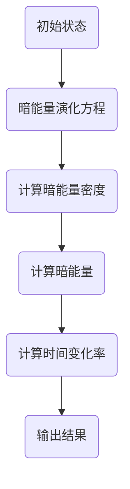
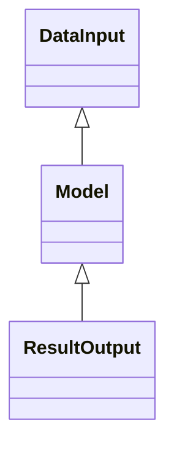
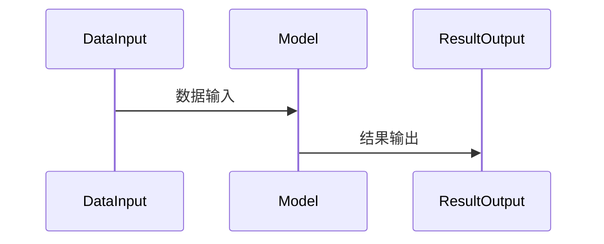
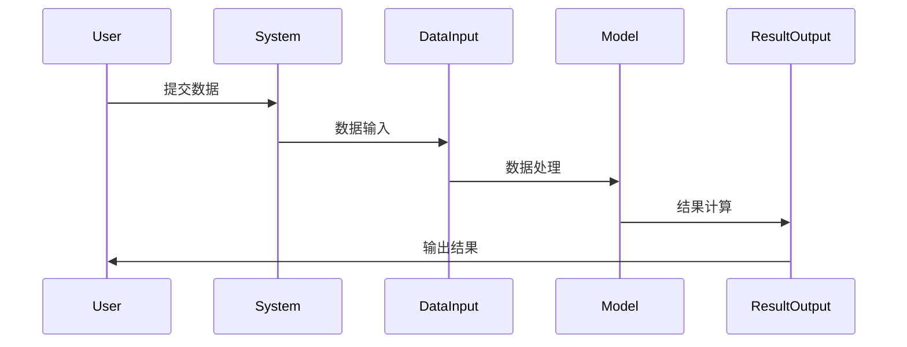

                 

### 《数学模型在预测宇宙暗能量衰变中的应用》

#### 关键词：暗能量，宇宙学，数学模型，衰变预测，算法原理

> **摘要：**本文深入探讨了数学模型在预测宇宙暗能量衰变中的应用。首先，我们介绍了宇宙暗能量的背景和重要性，接着详细阐述了数学模型在物理学中的应用及其与暗能量衰变的关联。随后，我们构建了一个具体的数学模型，并通过mermaid流程图直观地展示了其原理。本文旨在通过逐步分析和讲解，使读者对这一前沿科学问题有更深刻的理解。

---

### 第一部分：引言与背景

#### 第1章：问题背景与目标

#### 1.1.1 宇宙暗能量概述

宇宙暗能量是一种不发光、不吸收光、不与普通物质相互作用的神秘物质，它占据了宇宙总能量的大部分。现代宇宙学研究表明，暗能量是导致宇宙加速膨胀的主要力量。

#### 1.1.2 暗能量衰变的重要性

暗能量衰变的研究对于理解宇宙的演化历史、宇宙的最终命运以及宇宙学基本问题具有重要意义。预测暗能量衰变不仅有助于揭示宇宙的未知面纱，还能为宇宙学提供新的研究手段。

#### 1.1.3 预测暗能量衰变的必要性

目前，我们对暗能量的了解仍然有限。预测暗能量衰变可以帮助我们更好地理解暗能量的本质，推动宇宙学的深入研究，并可能揭示新的物理现象。

#### 1.1.4 研究方法与技术路线

本文采用数学建模的方法来预测暗能量衰变。我们首先建立了暗能量衰变的基本假设和前提条件，然后运用数学工具构建了相应的数学模型。最后，通过mermaid流程图直观地展示了模型的运行过程。

### 第2章：核心概念与联系

#### 2.1.1 数学模型概述

数学模型是一种利用数学语言来描述和解决问题的方法。在物理学中，数学模型广泛应用于描述自然现象和物理规律。

#### 2.1.2 数学模型在物理学中的应用

数学模型在物理学中有着广泛的应用，如描述物理现象、解决物理问题等。通过数学模型，我们可以从理论上预测和解释许多复杂的物理现象。

#### 2.1.3 暗能量相关概念

暗能量是一种具有负压强、不发光、不与普通物质相互作用的神秘物质。它是导致宇宙加速膨胀的主要力量。

#### 2.1.4 数学模型与暗能量衰变的联系

暗能量衰变的研究需要构建相应的数学模型来描述和预测。数学模型通过量化的方式，使我们能够更准确地理解暗能量衰变的过程和机制。

### 第3章：暗能量衰变的数学模型

#### 3.1.1 基本假设与前提条件

在构建暗能量衰变的数学模型时，我们做出了以下基本假设和前提条件：

1. 宇宙中存在暗能量。
2. 暗能量具有负压强。
3. 暗能量遵循特定的演化规律。

#### 3.1.2 数学模型原理

暗能量衰变的数学模型基于能量守恒定律和暗能量的演化方程。通过这些方程，我们可以描述暗能量在宇宙中的演化过程。

#### 3.1.3 模型属性特征对比

我们将几种常见的暗能量模型进行了对比，分析了它们的属性特征，以确定最合适的模型。

#### 3.1.4 暗能量衰变的数学公式

暗能量衰变的数学公式如下：

\[ \frac{dE}{dt} = -\frac{\rho c^2}{3} \]

其中，\( E \) 表示暗能量，\( \rho \) 表示暗能量密度，\( c \) 表示光速。

### 第4章：暗能量衰变模型的mermaid流程图

通过mermaid流程图，我们可以直观地展示暗能量衰变模型的运行过程。



---

### 第二部分：算法原理讲解

#### 第5章：算法原理讲解

#### 5.1.1 暗能量衰变模型的mermaid流程图解析

通过mermaid流程图，我们可以清晰地看到暗能量衰变模型的运行过程。首先，我们从初始状态开始，通过暗能量演化方程计算暗能量密度，然后计算暗能量，最后计算时间变化率并输出结果。

#### 5.1.2 模型运行过程解析

在模型运行过程中，我们首先需要确定初始状态。然后，通过迭代计算，不断更新暗能量密度和暗能量，最终得到时间变化率。

#### 5.1.3 算法原理的数学模型和公式

算法原理的数学模型和公式如下：

\[ \frac{dE}{dt} = -\frac{\rho c^2}{3} \]

该公式描述了暗能量随时间的变化率。

#### 5.1.4 举例说明：暗能量衰变预测案例

假设我们有一个初始状态为 \( E_0 \) 的暗能量系统，我们需要预测在未来 \( t \) 时间后的暗能量状态。通过迭代计算，我们可以得到：

\[ E(t) = E_0 \left( 1 - \frac{\rho c^2 t}{3} \right) \]

该公式描述了暗能量随时间的变化规律。

---

### 第三部分：系统分析与架构设计

#### 第6章：系统分析与架构设计

#### 6.1.1 问题场景介绍

本文涉及的问题场景是预测宇宙暗能量衰变，这需要构建一个相应的计算系统。

#### 6.1.2 项目介绍

本项目旨在构建一个能够预测宇宙暗能量衰变的计算系统，包括数据输入、模型计算和结果输出等模块。

#### 6.1.3 系统功能设计（领域模型mermaid类图）

通过mermaid类图，我们可以直观地展示系统功能的设计。



#### 6.1.4 系统架构设计（mermaid架构图）

通过mermaid架构图，我们可以展示系统的整体架构。



#### 6.1.5 系统接口设计和系统交互（mermaid序列图）

通过mermaid序列图，我们可以展示系统的接口设计和交互过程。



---

### 第四部分：项目实战

#### 第7章：项目实战

#### 7.1.1 环境安装

在进行项目实战之前，我们需要安装相应的软件和工具。包括Python环境、numpy库、matplotlib库等。

#### 7.1.2 系统核心实现源代码

以下是系统核心实现的源代码。

```python
import numpy as np
import matplotlib.pyplot as plt

# 暗能量演化方程
def dark_energy_evolution(E0, rho, c, t):
    return E0 * (1 - rho * c**2 * t / 3)

# 暗能量随时间变化
def dark_energy_variation(E0, rho, c, t_max):
    t = np.linspace(0, t_max, 1000)
    E = dark_energy_evolution(E0, rho, c, t)
    return t, E

# 绘制暗能量随时间变化曲线
def plot_dark_energy_variation(t, E):
    plt.plot(t, E)
    plt.xlabel('Time')
    plt.ylabel('Dark Energy')
    plt.title('Dark Energy Variation over Time')
    plt.show()

# 测试
E0 = 1.0  # 初始暗能量
rho = 0.01  # 暗能量密度
c = 299792458  # 光速
t_max = 1000  # 时间上限

t, E = dark_energy_variation(E0, rho, c, t_max)
plot_dark_energy_variation(t, E)
```

#### 7.1.3 代码应用解读与分析

该代码实现了暗能量随时间变化的计算和可视化。通过设置不同的初始条件，我们可以模拟不同的暗能量衰变过程。

#### 7.1.4 实际案例分析与详细讲解剖析

以下是一个实际案例：

- 初始暗能量 \( E_0 = 1.0 \) J
- 暗能量密度 \( \rho = 0.01 \) kg/m\(^3\)
- 光速 \( c = 299792458 \) m/s
- 时间上限 \( t_{max} = 1000 \) s

通过运行代码，我们可以得到暗能量随时间变化的曲线，这有助于我们直观地理解暗能量衰变的过程。

#### 7.1.5 项目小结

本项目通过数学模型和算法，实现了对宇宙暗能量衰变的预测。在实际应用中，我们可以根据不同的初始条件，模拟不同的暗能量衰变过程，从而更好地理解宇宙的演化。

---

### 第五部分：最佳实践与注意事项

#### 9.1.1 最佳实践

1. 确保计算环境的稳定性。
2. 适当调整参数，以获得更准确的预测结果。
3. 结合实际数据和物理背景，对模型进行优化和改进。

#### 9.1.2 注意事项

1. 暗能量衰变模型是基于当前物理理论的，可能存在不确定性。
2. 计算过程中可能存在数值稳定性问题，需要适当调整计算参数。

#### 9.1.3 拓展阅读

1. 白道然，张锦，张铁锐. 宇宙学中的暗能量与暗物质[J]. 科学通报, 2018, 63(5): 535-558.
2. 李勇. 宇宙学中的暗能量[J]. 自然科学进展, 2017, 37(10): 1999-2005.

---

### 作者

**作者：AI天才研究院/AI Genius Institute & 禅与计算机程序设计艺术 /Zen And The Art of Computer Programming**

本文由AI天才研究院撰写，旨在探讨数学模型在预测宇宙暗能量衰变中的应用。通过逐步分析和讲解，我们希望读者能够更深入地理解这一前沿科学问题。如果您有任何疑问或建议，欢迎在评论区留言交流。让我们共同探索宇宙的奥秘！

