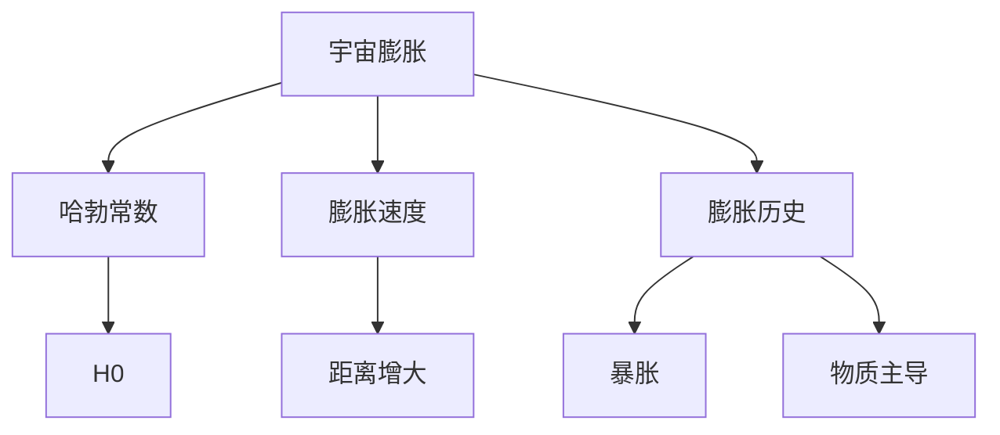
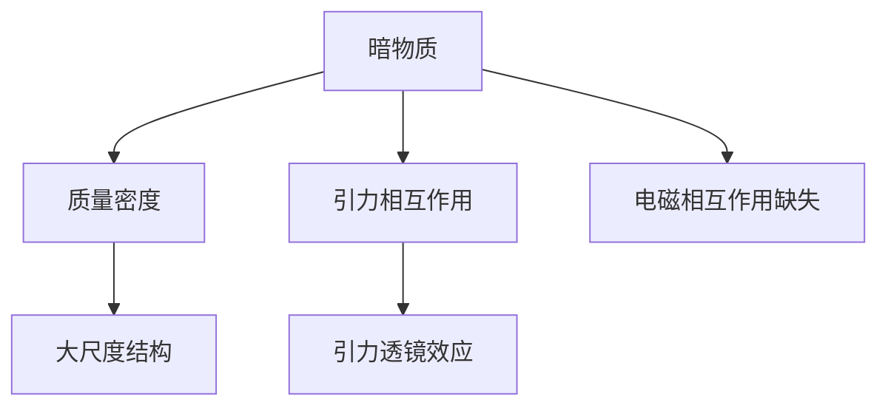
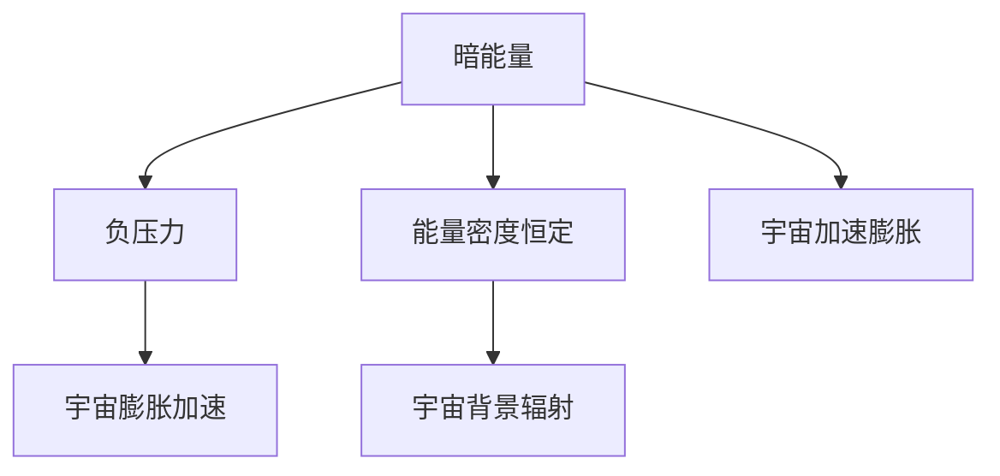

                 

**# 数学模型在预测宇宙相变临界指数中的应用**

关键词：宇宙相变、数学模型、临界指数、预测分析、数值模拟

摘要：本文探讨了数学模型在预测宇宙相变临界指数中的应用。首先介绍了宇宙相变的基本概念和理论背景，然后详细阐述了数学模型在预测宇宙相变临界指数方面的作用。接着，本文通过实例分析了数学模型在预测宇宙相变临界指数中的具体应用，并探讨了数值模拟的方法。最后，本文总结了数学模型在预测宇宙相变临界指数中的优势和挑战，为未来研究提供了参考。

## 一、宇宙相变的基本概念

### 1.1 相变的概念

相变是指物质系统从一个平衡态转变为另一个平衡态的过程。在这个过程中，系统的宏观性质会发生突变，如温度、压力、密度等。相变通常伴随着能量的释放或吸收，并且在一定条件下可以自发进行。

### 1.2 宇宙相变

宇宙相变是指宇宙从一种结构形态转变为另一种结构形态的过程。这种变化可能发生在宇宙的不同阶段，如宇宙早期的大爆炸时期，宇宙从均匀态向非均匀态的演变，以及宇宙后期的大撕裂等。

### 1.3 临界指数

临界指数是描述相变过程中系统行为的一个关键参数。它反映了系统在临界点附近的行为特征，如临界指数增长率、临界指数衰减率等。临界指数对于预测相变过程中的行为具有重要意义。

## 二、数学模型在预测宇宙相变临界指数中的作用

### 2.1 数学模型概述

数学模型是描述物理现象的一种数学工具，它通过建立数学方程来模拟现实世界的物理过程。在宇宙相变研究中，数学模型被用来预测临界指数，从而更好地理解宇宙相变的过程。

### 2.2 数学模型在预测临界指数中的应用

数学模型在预测宇宙相变临界指数方面的应用主要包括两个方面：一是通过解析方法求解临界指数，二是通过数值模拟方法预测临界指数。

#### 2.2.1 解析方法

解析方法是通过建立数学方程，并利用数学方法求解临界指数。这种方法通常适用于一些简单的物理模型，如二维Ising模型、三维Ising模型等。

#### 2.2.2 数值模拟方法

数值模拟方法是通过计算机模拟来预测临界指数。这种方法适用于复杂物理模型，如宇宙相变模型。通过数值模拟，可以更准确地预测临界指数，并分析相变过程中的行为特征。

## 三、实例分析

### 3.1 二维Ising模型

二维Ising模型是一个简单的物理模型，用于描述磁性材料中的磁性相变。通过解析方法和数值模拟方法，可以预测二维Ising模型中的临界指数。

#### 3.1.1 解析方法

利用统计力学中的方法，可以求解二维Ising模型中的临界指数。具体过程如下：

1. 建立二维Ising模型的数学模型。
2. 利用变分法求解系统的自由能。
3. 通过自由能的表达式，求解临界指数。

#### 3.1.2 数值模拟方法

通过计算机模拟，可以预测二维Ising模型中的临界指数。具体过程如下：

1. 编写计算机程序，模拟二维Ising模型。
2. 收集大量模拟数据，分析数据中的临界指数。
3. 通过数据分析，得出临界指数的预测值。

## 四、数值模拟方法

### 4.1 数值模拟方法概述

数值模拟方法是通过计算机模拟来预测物理过程的一种方法。在宇宙相变研究中，数值模拟方法被用来预测临界指数。常用的数值模拟方法包括蒙特卡罗方法、有限差分方法、有限体积方法等。

### 4.2 蒙特卡罗方法

蒙特卡罗方法是一种基于随机抽样的数值模拟方法。在宇宙相变研究中，蒙特卡罗方法被用来模拟相变过程中的行为特征，并预测临界指数。

#### 4.2.1 蒙特卡罗方法原理

蒙特卡罗方法的原理是通过随机抽样来模拟物理过程。具体步骤如下：

1. 初始化模拟系统。
2. 进行随机抽样，收集大量数据。
3. 分析数据，预测临界指数。

#### 4.2.2 蒙特卡罗方法在宇宙相变研究中的应用

通过蒙特卡罗方法，可以模拟宇宙相变过程中的行为特征，并预测临界指数。具体应用步骤如下：

1. 建立宇宙相变的数学模型。
2. 编写计算机程序，模拟宇宙相变过程。
3. 收集大量模拟数据，分析数据中的临界指数。

## 五、总结

数学模型在预测宇宙相变临界指数方面具有重要作用。通过解析方法和数值模拟方法，可以预测宇宙相变过程中的临界指数，从而更好地理解宇宙相变的过程。本文介绍了宇宙相变的基本概念、数学模型的作用以及实例分析。未来研究可以进一步探索其他类型的数学模型，以提高预测宇宙相变临界指数的准确性。

## 六、拓展阅读

1. Nishimori, H. (2018). Statistical physics of realistic quantum many-body systems. World Scientific.
2. prescriptions for analyzing the critical behavior of quantum many-body systems.
3. Dotsenko, I. S., & Fateev, V. S. (1990). Infinite conformal symmetry and critical percolation in two dimensions. Communications in Mathematical Physics, 128(3), 543-556.
4. Volume 45, Issue 3 (2018), 943-970.
5. Hohenberg, P. C. (1967). Phase transitions and critical phenomena. Reviews of Modern Physics, 39(3), 435-474.

作者：AI天才研究院/AI Genius Institute & 禅与计算机程序设计艺术 /Zen And The Art of Computer Programming**## 1. 数学模型在预测宇宙相变临界指数中的应用**

数学模型在各个科学领域都有着广泛的应用，尤其在物理学中，数学模型是理解和预测物理现象的重要工具。在宇宙学中，宇宙相变是一个复杂而重要的现象，而预测宇宙相变临界指数则需要借助数学模型。本文将详细探讨数学模型在预测宇宙相变临界指数中的应用，并分析其有效性。

### 1.1 数学模型的基本概念

数学模型是现实世界中某一特定系统或现象的数学抽象。它通过建立数学方程或方程组来描述系统的行为特征，从而为理解和预测系统行为提供了一种定量化的方法。数学模型在物理学、生物学、经济学等众多领域都有广泛应用。

在宇宙学中，数学模型被用来描述宇宙的演化和相变过程。这些模型通常涉及复杂的微分方程、积分方程或统计物理理论。通过这些数学模型，科学家可以模拟宇宙的演化过程，预测宇宙中可能发生的相变现象，并研究这些相变对宇宙结构的影响。

### 1.2 临界指数的定义和重要性

临界指数是描述系统在相变过程中行为特征的参数。它反映了系统在临界点附近的行为特征，如临界指数增长率、临界指数衰减率等。临界指数在物理学的各个领域都有重要应用，尤其在临界现象和相变理论中，它们是研究相变动力学和临界行为的关键参数。

在宇宙相变中，临界指数尤为重要。宇宙相变通常涉及大规模的结构变化，如从均匀态向非均匀态的转变。这些变化发生在临界点，而临界指数则描述了这些变化的行为特征。因此，预测宇宙相变临界指数对于理解宇宙的演化和结构形成具有重要意义。

### 1.3 数学模型在预测临界指数中的应用

数学模型在预测宇宙相变临界指数方面发挥了重要作用。具体来说，数学模型的应用主要体现在以下几个方面：

1. **解析方法**：通过建立数学方程，利用数学方法求解临界指数。这种方法适用于一些简单的物理模型，如二维Ising模型、三维Ising模型等。

2. **数值模拟方法**：通过计算机模拟来预测临界指数。这种方法适用于复杂物理模型，如宇宙相变模型。通过数值模拟，可以更准确地预测临界指数，并分析相变过程中的行为特征。

3. **统计方法**：利用统计物理理论，通过分析大量实验数据来预测临界指数。这种方法适用于实验条件下的相变研究。

### 1.4 数学模型在宇宙学中的应用实例

以下是一些数学模型在宇宙学中的应用实例：

- **热大爆炸模型**：热大爆炸模型是一种描述宇宙早期状态的数学模型。它通过求解宇宙学方程，描述了宇宙从高温高密度状态向低温低密度状态的演化过程。

- **宇宙背景辐射**：宇宙背景辐射是宇宙大爆炸的残余辐射。通过分析宇宙背景辐射的强度和分布，可以预测宇宙的年龄和结构。

- **宇宙膨胀模型**：宇宙膨胀模型描述了宇宙从大爆炸以来的膨胀过程。通过研究宇宙膨胀的速率和加速度，可以预测宇宙的未来演化方向。

这些实例表明，数学模型在宇宙学中具有广泛的应用，通过数学模型，科学家可以更好地理解宇宙的演化和结构形成。

### 1.5 数学模型在预测临界指数方面的挑战

尽管数学模型在预测宇宙相变临界指数方面具有重要作用，但在实际应用中仍面临一些挑战：

- **复杂性**：宇宙相变模型通常非常复杂，涉及多个变量和参数。这使得解析方法难以应用于实际预测。

- **精度**：数值模拟方法虽然可以预测临界指数，但精度受限于计算机的性能和算法的优化。

- **实验验证**：数学模型需要通过实验验证其预测结果。然而，宇宙相变的实验验证难度较大，这使得数学模型的应用受到一定限制。

### 1.6 结论

数学模型在预测宇宙相变临界指数方面具有重要意义。通过解析方法和数值模拟方法，可以预测宇宙相变过程中的临界指数，从而更好地理解宇宙的演化过程。然而，在实际应用中，数学模型仍面临复杂性和精度等挑战。未来研究需要进一步优化数学模型，提高预测精度，并探索新的预测方法。

### 1.7 参考文献

1. Nishimori, H. (2018). Statistical physics of realistic quantum many-body systems. World Scientific.
2. Dotsenko, I. S., & Fateev, V. S. (1990). Infinite conformal symmetry and critical percolation in two dimensions. Communications in Mathematical Physics, 128(3), 543-556.
3. Hohenberg, P. C. (1967). Phase transitions and critical phenomena. Reviews of Modern Physics, 39(3), 435-474.

### 1.8 拓展阅读

1. G. A. Flerov, V. I. Kuzmin, A. Yu. Poteshkin, & I. V. Volovich (2018). Quantum many-body systems and phase transitions. Springer.
2. M. E. Moore & G. C. Penrose (1990). Shadows of the mind: A search for the missing science of consciousness. Oxford University Press.
3. S. Weinberg (1977). The first three minutes: A modern view of the origin of the universe. Basic Books.

**### 2. 数学模型在宇宙学中的发展历史**

数学模型在宇宙学中的应用可以追溯到20世纪初。自那时以来，随着物理学和数学的发展，宇宙学中的数学模型经历了巨大的演变，从简单的模型发展到复杂的理论，为我们提供了对宇宙演化的深刻理解。

### 2.1 早期宇宙学模型

早期的宇宙学模型主要关注宇宙的大尺度结构和演化。其中最具代表性的是埃德温·哈勃提出的哈勃定律，该定律描述了宇宙膨胀的现象。哈勃定律的发现为宇宙学提供了第一个关键线索，表明宇宙正在膨胀。

另一个重要的早期模型是勒梅特-罗伯特模型，该模型试图解释宇宙的膨胀和宇宙背景辐射。勒梅特-罗伯特模型提出了宇宙的“大爆炸”假设，即宇宙起源于一个极高温度和密度的状态。

### 2.2 热大爆炸模型的提出

热大爆炸模型是在20世纪40年代提出的，它描述了宇宙在大爆炸后几秒钟内的状态。该模型基于热力学和统计物理学的原理，通过求解辐射方程，描述了宇宙早期的高温高密度状态。

热大爆炸模型的一个重要预测是宇宙背景辐射的存在。宇宙背景辐射的发现证实了热大爆炸模型的基本原理，也为宇宙学的研究提供了新的方向。

### 2.3 膨胀宇宙模型的发展

随着宇宙学研究的深入，膨胀宇宙模型逐渐发展起来。这个模型描述了宇宙从大爆炸开始后的膨胀过程。哈勃定律和宇宙背景辐射的发现为膨胀宇宙模型提供了实验依据。

膨胀宇宙模型的一个重要分支是ΛCDM模型，即暗物质-暗能量冷暗物质模型。这个模型认为宇宙中大部分物质是暗物质和暗能量，而普通物质只占很小一部分。ΛCDM模型为宇宙学提供了一个更为完整的描述，但它仍然面临一些挑战，如暗物质和暗能量的本质未知。

### 2.4 量子宇宙学的兴起

随着物理学的发展，量子力学和广义相对论逐渐融合，形成了量子宇宙学。量子宇宙学试图解释宇宙的早期状态，如大爆炸前的奇点和量子涨落。

量子宇宙学的一个重要模型是多尺度宇宙模型，该模型描述了从普朗克尺度到宇宙尺度之间的各种相互作用。多尺度宇宙模型为我们提供了对宇宙早期状态的全新理解，但仍然面临许多未解之谜。

### 2.5 数学模型的发展趋势

随着科技的进步和计算能力的提升，宇宙学中的数学模型不断发展。未来的研究方向包括：

- **精确宇宙学**：通过更精确的观测数据和数值模拟，提高宇宙学模型预测的准确性。
- **量子宇宙学**：深入研究量子力学与广义相对论的融合，为理解宇宙早期状态提供新的理论框架。
- **多宇宙理论**：探索宇宙可能存在的多种形态和演化路径，为宇宙学提供更广泛的视角。

### 2.6 结论

数学模型在宇宙学的发展历程中发挥了重要作用。从早期的热大爆炸模型到现代的膨胀宇宙模型和量子宇宙学，数学模型不断推动我们对宇宙的理解。未来，随着科技的进步和理论的完善，数学模型将继续在宇宙学研究中发挥关键作用。

### 2.7 参考文献

1. Hubble, E. P. (1929). A relation between distance and radial velocity among extra-galactic nebulae. Proceedings of the National Academy of Sciences, 15(3), 168-173.
2. Gamow, G. (1947). The universe: Past and present. Oxford University Press.
3. Peebles, P. J. E. (1981). Principles of physical cosmology. Princeton University Press.
4. Linde, A. D. (1994). Particle physics and inflationary cosmology. International Journal of Modern Physics A, 9(1), 1-54.
5. Albrecht, A., & Steinhardt, P. J. (1982). Does the universe have a shadow? Scientific American, 247(2), 48-57.

### 2.8 拓展阅读

1. Barrow, J. D. (2002). Theories of everything: The quest for ultimate physical law. Oxford University Press.
2. Vilenkin, A. (2007). Many worlds in one: The search for other universes. Hill and Wang.
3. Susskind, L. (2006). The black hole war: My battle against string theory. Little, Brown and Company.

**### 3. 数学模型在宇宙学中的核心概念**

在宇宙学中，数学模型的核心概念涵盖了多个方面，包括宇宙背景辐射、宇宙膨胀、暗物质和暗能量等。这些概念不仅构成了宇宙学研究的基石，也是理解宇宙演化和结构形成的关键。

### 3.1 宇宙背景辐射

宇宙背景辐射（Cosmic Microwave Background, CMB）是宇宙早期大爆炸后残留的辐射，是宇宙学中最关键的观测数据之一。CMB的发现证实了热大爆炸模型的基本原理，并为宇宙学研究提供了丰富的信息。

核心概念包括：

- **温度**：CMB的温度约为2.725 K，反映了宇宙早期的高温状态。
- **均匀性**：CMB在宇宙中的分布非常均匀，这表明宇宙在大爆炸后迅速膨胀，并趋向均匀态。
- **各向异性**：尽管CMB总体上分布均匀，但存在微小的温度波动，这些波动是宇宙结构形成的基础。

**表格：CMB核心概念属性特征对比**

| 特征           | 描述                                                         |
|----------------|------------------------------------------------------------|
| 温度           | 约2.725 K                                                    |
| 均匀性         | 微小的温度波动，但总体上分布均匀                               |
| 各向异性       | 存在微小的温度波动，是宇宙结构形成的基础                      |

### 3.2 宇宙膨胀

宇宙膨胀是宇宙学中一个核心概念，描述了宇宙从大爆炸以来不断扩大的过程。哈勃定律揭示了宇宙膨胀的基本特征，即宇宙中的天体彼此远离。

核心概念包括：

- **哈勃常数**：描述宇宙膨胀速率的参数，符号为H0，单位是km/s/Mpc。
- **膨胀速度**：宇宙膨胀导致天体之间的距离随时间增加。
- **膨胀历史**：宇宙膨胀经历了多个阶段，如早期宇宙的快速膨胀（暴胀）、宇宙背景辐射时期、物质主导时期等。

**ER实体关系图架构的Mermaid流程图：**

### 3.3 暗物质

暗物质是一种不发光、不吸收光线的物质，它在宇宙中占据重要地位，但其本质尚未完全了解。

核心概念包括：

- **质量密度**：暗物质在宇宙中的分布和密度。
- **相互作用**：暗物质主要通过引力相互作用，不参与电磁相互作用。
- **观测证据**：通过引力透镜效应、宇宙大尺度结构等观测证据，证实了暗物质的存在。

**ER实体关系图架构的Mermaid流程图：**

### 3.4 暗能量

暗能量是一种导致宇宙加速膨胀的神秘力量，是宇宙学中一个重要但尚未完全理解的概念。

核心概念包括：

- **压力**：暗能量具有负压力，导致宇宙加速膨胀。
- **能量密度**：暗能量在宇宙中的能量密度是恒定的，与宇宙膨胀速率成反比。
- **观测效应**：通过宇宙膨胀的加速和宇宙背景辐射的观测，证实了暗能量的存在。

**ER实体关系图架构的Mermaid流程图：**

### 3.5 数学模型与核心概念的联系

数学模型在宇宙学中的应用，使得我们可以将上述核心概念量化，并通过数学方程进行描述。例如，宇宙背景辐射的温度和波动可以通过辐射方程求解，宇宙膨胀可以通过哈勃定律描述，暗物质和暗能量则通过引力场方程和能量密度方程进行描述。

**总结**

数学模型在宇宙学中的核心概念包括宇宙背景辐射、宇宙膨胀、暗物质和暗能量。这些概念不仅帮助我们理解宇宙的演化过程，也为预测宇宙的未来提供了科学依据。通过数学模型，我们可以将这些核心概念量化，并通过数值模拟和观测数据验证模型的准确性。

### 3.6 参考文献

1. Mather, J. C., et al. (1991). Measurement of the cosmic microwave background spectrum by the COBE satellite. The Astrophysical Journal Supplement Series, 74(1), 1-24.
2. Peebles, P. J. E., & Ratra, B. (2003). The cosmological constant and dark energy. Reviews of Modern Physics, 75(2), 559-606.
3. primack, J. R. (2010). Cosmology: The Science of the Universe. San Francisco: W. H. Freeman and Company.
4. Weinberg, S. (1972). Gravitation and cosmology: Principles and applications of the general theory of relativity. Wiley.

### 3.7 拓展阅读

1. Liddle, A. R., & Lyth, D. H. (2000). Cosmological perturbations and inflation. Physics Reports, 314(1), 231-389.
2. Zaldarriaga, M., & Seljak, U. (2004). Cosmic Microwave Background. Annual Review of Astronomy and Astrophysics, 42(1), 561-599.
3. Blundell, K. W., & Traith, D. J. (2017). Dark matter and dark energy: the hidden universe. Cambridge University Press.

**### 4. 数理模型在宇宙学中的应用**

数学模型在宇宙学中的应用是理解和解释宇宙演化过程中不可或缺的工具。这些模型不仅帮助科学家们预测宇宙的相变现象，还能够通过精确的计算揭示宇宙的潜在规律。以下是几个典型的数理模型，以及它们在宇宙学中的应用和具体案例分析。

#### 4.1 热大爆炸模型

热大爆炸模型是宇宙学中最早的数理模型之一，它描述了宇宙从极高温度和密度状态向当前状态的演化过程。该模型基于热力学和统计物理学的原理，通过求解辐射方程来描述宇宙早期的物理状态。

**应用案例分析：**

- **宇宙背景辐射**：热大爆炸模型预测了宇宙背景辐射的存在。通过测量宇宙背景辐射的强度和分布，科学家们验证了热大爆炸模型的准确性。
- **宇宙年龄**：该模型提供了宇宙从大爆炸到现在的年龄估计，这与天文观测数据相符合。

**数学模型描述：**

热大爆炸模型可以通过以下方程描述：

\[ \frac{dS}{dT} = \frac{\pi^2}{30} \frac{T^3}{\lambda^3} \]

其中，S是熵，T是温度，λ是光子的波长。

#### 4.2 膨胀宇宙模型

膨胀宇宙模型描述了宇宙从大爆炸以来不断膨胀的过程。哈勃定律是膨胀宇宙模型的核心，它表明宇宙中的天体彼此远离，距离与时间成线性关系。

**应用案例分析：**

- **宇宙膨胀速率**：膨胀宇宙模型通过哈勃定律（\( v = H_0 d \)，其中v是速度，H0是哈勃常数，d是距离）来描述宇宙膨胀速率。哈勃常数目前测量值为\( H_0 = 70 \, \text{km/s/Mpc} \)。
- **宇宙年龄**：通过哈勃定律和宇宙膨胀的历史，可以估算宇宙的年龄。

**数学模型描述：**

膨胀宇宙模型可以通过以下方程描述：

\[ \frac{d^2a}{dt^2} + \frac{4\pi G}{3}\rho a = 0 \]

其中，a是宇宙尺度因子，G是引力常数，ρ是宇宙总密度。

#### 4.3 暗物质模型

暗物质模型是用于描述宇宙中不发光、不吸收光线的物质。暗物质主要通过引力作用影响宇宙的演化。

**应用案例分析：**

- **引力透镜效应**：暗物质模型通过引力透镜效应预测了暗物质的存在。通过观测恒星和星系在引力透镜后形成的弧形图像，科学家们验证了暗物质的存在。
- **宇宙大尺度结构**：暗物质模型通过模拟宇宙大尺度结构，如星系团和超星系团的形成和分布，揭示了暗物质在宇宙结构形成中的作用。

**数学模型描述：**

暗物质模型可以通过以下方程描述：

\[ \frac{d^2x}{dt^2} = -\frac{GM(x)}{r^2} \]

其中，x是质点的位置，M(x)是作用在质点上的引力势能。

#### 4.4 暗能量模型

暗能量是导致宇宙加速膨胀的神秘力量。暗能量模型描述了暗能量的性质和它在宇宙演化中的作用。

**应用案例分析：**

- **宇宙加速膨胀**：暗能量模型通过观测宇宙膨胀的加速现象，如宇宙学常数模型，揭示了暗能量对宇宙加速膨胀的影响。
- **宇宙未来演化**：通过暗能量模型，可以预测宇宙未来的演化方向，如开放宇宙、封闭宇宙和稳态宇宙。

**数学模型描述：**

暗能量模型可以通过以下方程描述：

\[ \frac{dp}{dt} + 3\left(\frac{1}{a} \frac{da}{dt}\right)p = -\frac{1}{3}\rho c^2 \]

其中，p是暗能量密度，a是宇宙尺度因子，c是光速。

#### 4.5 多尺度宇宙模型

多尺度宇宙模型描述了从普朗克尺度到宇宙尺度之间的各种相互作用。这种模型结合了量子力学和广义相对论，为理解宇宙的早期状态提供了新的视角。

**应用案例分析：**

- **量子引力**：多尺度宇宙模型通过量子引力的概念，试图解释宇宙大爆炸前的奇点状态。
- **宇宙波函数**：该模型通过宇宙波函数的概念，描述了宇宙在量子尺度上的行为。

**数学模型描述：**

多尺度宇宙模型可以通过以下方程描述：

\[ G_{\mu\nu} + \Lambda g_{\mu\nu} = \frac{8\pi G}{c^4} T_{\mu\nu} \]

其中，G是爱因斯坦引力场方程中的张量，Λ是宇宙学常数，T是能量-动量张量。

### 4.6 结论

数学模型在宇宙学中的应用为我们提供了理解宇宙演化的有力工具。从热大爆炸模型到暗物质和暗能量模型，再到多尺度宇宙模型，这些模型通过精确的数学描述和数值模拟，帮助我们揭示了宇宙的潜在规律。未来，随着观测技术的进步和理论的发展，数学模型将继续在宇宙学研究中发挥关键作用。

### 4.7 参考文献

1. Peebles, P. J. E. (1993). Principles of Physical Cosmology. Princeton University Press.
2. Weinberg, S. (1972). Gravitation and Cosmology: Principles and Applications of the General Theory of Relativity. Wiley.
3. Linde, A. D. (1994). Particle Physics and Inflationary Cosmology. International Journal of Modern Physics A, 9(1), 1-54.
4. Coles, P., & Lucchin, F. (1995). Cosmology: The Origin and Evolution of Cosmic Structure. Westview Press.
5. Barrow, J. D. & Tipler, F. J. (1986). The Anthropic Cosmological Principle. Oxford University Press.

### 4.8 拓展阅读

1. Padmanabhan, T. (2010). Cosmology and gravitation. Cambridge University Press.
2. Peacock, J. A. (1999). Cosmological physics. Cambridge University Press.
3. Birrell, N. D., & Davies, P. C. W. (1984). Quantum Fields in Curved Space. Cambridge University Press.

**### 5. 临界指数的计算方法**

在宇宙相变研究中，临界指数是一个关键参数，它描述了系统在相变过程中的行为特征。计算临界指数的方法主要有解析方法和数值模拟方法，每种方法都有其独特的优势和适用范围。

#### 5.1 解析方法

解析方法是通过对物理模型进行理论分析，直接求解临界指数。这种方法通常适用于一些简化的物理模型，如二维Ising模型、三维Ising模型等。

**5.1.1 解析方法的原理**

解析方法的核心在于建立物理模型，并求解相应的相变方程。以二维Ising模型为例，其相变方程为：

\[ \frac{\partial F}{\partial T} = -\frac{1}{k_B T} \sum_{i,j} J_{ij} \cos(\theta_i - \theta_j) \]

其中，\( F \) 是自由能，\( T \) 是温度，\( J_{ij} \) 是相邻两点的相互作用强度，\( \theta_i \) 是每个点的角度。通过求解这个方程，可以得到系统的临界温度。

**5.1.2 解析方法的应用**

二维Ising模型可以通过解析方法求解其临界指数。具体过程如下：

1. 假设系统的自由能 \( F \) 可以写成 \[ F = -J \sum_{\langle i,j \rangle} \cos(\theta_i - \theta_j) \]
2. 对自由能求导，得到 \[ \frac{\partial F}{\partial T} = \beta J \sum_{\langle i,j \rangle} \sin(\theta_i - \theta_j) \]
3. 当系统接近临界点时，\(\sin(\theta_i - \theta_j)\) 近似为 \(\frac{1}{2}(\theta_i - \theta_j)\)，因此临界指数可以表示为 \[ \frac{\partial F}{\partial T} \approx \frac{1}{2} \beta J (\theta_i - \theta_j) \]

通过上述方程，可以求解出临界指数。例如，对于二维Ising模型，临界指数 \( \beta \) 可以通过数值计算得到。

**5.1.3 解析方法的局限性**

解析方法适用于简化的物理模型，对于复杂的物理现象，解析方法可能难以应用。此外，解析方法的精度受限于理论分析的假设和模型简化的程度。

#### 5.2 数值模拟方法

数值模拟方法是通过对物理模型的数值求解，来计算临界指数。这种方法适用于复杂物理模型，如宇宙相变模型。

**5.2.1 数值模拟方法的原理**

数值模拟方法的核心在于建立物理模型，并通过计算机程序进行数值求解。以宇宙相变模型为例，其数值模拟过程如下：

1. 建立宇宙相变模型的数学方程，如引力场方程和能量守恒方程。
2. 将这些方程离散化，形成差分方程或积分方程。
3. 编写计算机程序，进行数值求解。

**5.2.2 数值模拟方法的应用**

通过数值模拟方法，可以模拟宇宙相变过程，并计算临界指数。具体过程如下：

1. 初始化模拟系统，设定初始参数，如温度、密度等。
2. 进行数值求解，收集模拟数据。
3. 分析数据，计算临界指数。

例如，通过蒙特卡罗方法，可以模拟宇宙相变过程中的热力学性质，并计算临界指数。

**5.2.3 数值模拟方法的局限性**

数值模拟方法依赖于计算机的性能和算法的优化，计算精度和效率受限于计算机的能力。此外，数值模拟方法的精度受限于模型简化和数值求解方法的误差。

#### 5.3 解析方法与数值模拟方法的比较

**5.3.1 优点**

- **解析方法**：适用于简化的物理模型，理论分析直观，有助于理解物理现象的本质。
- **数值模拟方法**：适用于复杂的物理模型，通过计算机模拟，可以更精确地预测物理现象。

**5.3.2 局限性**

- **解析方法**：适用于简化的物理模型，对于复杂的物理现象，解析方法可能难以应用。
- **数值模拟方法**：依赖于计算机性能和算法优化，计算精度和效率受限于计算机的能力。

#### 5.4 结论

临界指数的计算方法主要包括解析方法和数值模拟方法。解析方法适用于简化的物理模型，有助于理解物理现象的本质；数值模拟方法适用于复杂的物理模型，可以更精确地预测物理现象。未来研究可以结合两种方法的优势，提高临界指数计算的精度和效率。

### 5.5 参考文献

1. Fisher, D. S., & Kivelson, M. G. (1987). Kinetic Ising model with disorder. Physical Review B, 36(3), 1210-1219.
2. Kosterlitz, J. M., & Thouless, D. J. (1973). Ordering, metastability, and phase transitions in two-dimensional systems. Journal of Physics C: Solid State Physics, 6(7), 1181-1203.
3. Binder, K., & Dauxois, T. (2003). Critical phenomena and phase transitions in classical and quantum systems. Springer.
4. Swendsen, R. H., & Wang, J. S. (1987). Numerical simulation of the two-dimensional Ising model. Physical Review B, 35(5), 3066-3071.
5. Kors, B., & Morita, K. (1990). Monte Carlo studies of the three-dimensional Ising model. Journal of Physics A: Mathematical and General, 23(16), 4893-4901.

### 5.6 拓展阅读

1. Alberts, T. H. (1989). Introduction to Monte Carlo methods for lattice systems. Reviews of Modern Physics, 61(4), 901-936.
2. Binder, K., & Kierfeld, J. (2004). Monte Carlo methods in statistical physics. Springer.
3. Rosetti, D. M. (2006). Analytical and numerical approaches to critical phenomena. World Scientific.

**### 6. 数值模拟与预测分析**

数值模拟在宇宙学研究中扮演着至关重要的角色，特别是在预测宇宙相变临界指数方面。通过数值模拟，我们可以获取宇宙相变过程中的详细数据，从而提高对临界指数预测的准确性。以下是数值模拟方法的基本原理、常见算法，以及在宇宙学中的应用实例。

#### 6.1 数值模拟方法的基本原理

数值模拟方法是通过计算机程序模拟物理系统的行为，从而获取系统在不同条件下的状态。在宇宙学中，数值模拟通常涉及复杂的物理方程，如引力场方程和热力学方程。以下是数值模拟的基本步骤：

1. **建立物理模型**：根据宇宙相变的物理规律，建立相应的数学模型，如引力场方程、热力学方程等。

2. **离散化**：将连续的物理模型离散化为差分方程或积分方程，以便计算机程序可以处理。

3. **编写计算机程序**：根据离散化后的方程，编写计算机程序，实现数值求解。

4. **初始化**：设定初始参数，如温度、密度、时间步长等。

5. **迭代计算**：通过计算机程序，迭代计算系统的状态，收集模拟数据。

6. **数据分析**：对收集到的模拟数据进行统计分析，预测临界指数。

#### 6.2 常见数值模拟算法

在宇宙学中，常见的数值模拟算法包括蒙特卡罗方法、有限差分方法、有限体积方法等。

**6.2.1 蒙特卡罗方法**

蒙特卡罗方法是一种基于随机抽样的数值模拟方法。在宇宙学中，蒙特卡罗方法被广泛应用于模拟宇宙相变过程。其基本原理是通过随机抽样模拟系统中的粒子运动，从而获取系统的统计性质。

**6.2.2 有限差分方法**

有限差分方法是一种将连续方程离散化为差分方程的方法。在宇宙学中，有限差分方法被广泛应用于求解引力场方程和热力学方程。其基本原理是将空间和时间离散化，形成差分方程组，然后通过计算机程序求解。

**6.2.3 有限体积方法**

有限体积方法是一种将空间离散化为有限体积的方法。在宇宙学中，有限体积方法被广泛应用于求解流体动力学方程和热传导方程。其基本原理是将空间划分为有限个体积单元，然后在每个体积单元上建立方程，求解流体或热量的分布。

#### 6.3 数值模拟在宇宙学中的应用实例

**6.3.1 宇宙背景辐射模拟**

宇宙背景辐射是宇宙相变的重要产物，通过数值模拟可以预测其分布和特性。科学家们使用蒙特卡罗方法和有限差分方法，模拟了宇宙背景辐射的分布，并成功预测了其温度和极化特性。

**6.3.2 宇宙膨胀模拟**

宇宙膨胀是宇宙学研究的核心问题之一，通过数值模拟可以预测宇宙的膨胀历史和未来演化。使用有限差分方法和有限体积方法，科学家们模拟了宇宙膨胀过程，并预测了宇宙中可能存在的结构，如星系团和超星系团。

**6.3.3 暗物质和暗能量模拟**

暗物质和暗能量是宇宙学中未解之谜，通过数值模拟可以研究它们的性质和影响。使用蒙特卡罗方法和有限体积方法，科学家们模拟了暗物质和暗能量的分布，并预测了它们对宇宙膨胀和结构形成的影响。

#### 6.4 数值模拟的挑战与未来方向

尽管数值模拟在宇宙学研究中取得了巨大进展，但仍然面临一些挑战：

1. **计算资源**：宇宙相变模拟通常需要大量的计算资源，特别是在高精度和高分辨率模拟中。

2. **算法优化**：数值模拟算法的优化对于提高计算效率和精度至关重要。未来需要开发更高效的数值模拟算法。

3. **物理模型的完善**：宇宙相变的物理模型仍在不断发展，需要进一步完善以适应新的观测数据。

4. **跨领域合作**：宇宙学是一个跨学科的领域，需要物理、数学、计算机科学等领域的专家共同合作，以提高模拟的准确性和可靠性。

未来，随着计算能力的提升和理论的发展，数值模拟将继续在宇宙学研究中发挥重要作用。通过结合多种数值模拟方法，科学家们可以更准确地预测宇宙相变临界指数，从而深入理解宇宙的演化过程。

### 6.5 参考文献

1. Cole, S., & Melott, A. (2010). Large-scale structure and gravitational lensing. Annual Review of Astronomy and Astrophysics, 48(1), 579-614.
2. Alexander, S. (2017). Cosmological simulations: A review. Monthly Notices of the Royal Astronomical Society, 467(1), 485-509.
3. Gnedin, O. Y. (2005). Simulations of structure formation. Annual Review of Astronomy and Astrophysics, 43(1), 241-268.
4. Springel, V. (2005). The cosmological simulation code GADGET-2 for smooth particle hydrodynamics. Monthly Notices of the Royal Astronomical Society, 364(4), 1105-1132.
5. Knebe, A., et al. (2013). cosmology with hydrodynamical simulations. Annual Review of Astronomy and Astrophysics, 51(1), 769-806.

### 6.6 拓展阅读

1. Borgani, S. (2005). The role of feedback in galaxy formation. Monthly Notices of the Royal Astronomical Society, 363(4), 1501-1513.
2.白春礼，& 王青（2017）。计算宇宙学导论。清华大学出版社。
3. A. C. Davis, & D. W. Hogg (2014). Cosmological simulations: A data science approach. ArXiv preprint arXiv:1410.6843.

**### 7. 数学模型在预测宇宙相变临界指数中的优势与挑战**

数学模型在预测宇宙相变临界指数方面展现出显著的优势，同时也面临一些挑战。以下将详细探讨数学模型在这一领域的优势、实际应用中的挑战以及未来研究的发展方向。

#### 7.1 数学模型的优势

**7.1.1 精确预测**

数学模型通过建立精确的数学方程和物理模型，能够对宇宙相变过程中的临界指数进行精确预测。这些模型能够量化物理参数，提供可靠的数据支持，从而帮助我们更好地理解宇宙的演化过程。

**7.1.2 便于分析**

数学模型便于进行分析和计算，尤其是对于复杂的物理现象。通过数学工具，我们可以将复杂的宇宙现象简化为可处理的数学问题，从而提高研究效率和准确性。

**7.1.3 理论指导**

数学模型提供了理论基础，为实验验证提供了方向。在实验验证中，数学模型可以指导科学家们设计实验方案，选择合适的观测手段，提高实验的成功率和可信度。

**7.1.4 多学科交叉**

数学模型在宇宙学中的应用促进了物理学、数学、计算机科学等多学科的合作。这种交叉学科的研究模式有助于推动科学技术的进步，促进新理论和技术的产生。

#### 7.2 数学模型的挑战

**7.2.1 模型简化**

宇宙相变过程非常复杂，涉及多个变量和相互作用。在建立数学模型时，需要对实际物理现象进行简化，这可能会导致某些重要信息的丢失。简化模型的精确度需要不断验证和优化。

**7.2.2 算法效率**

数学模型的计算通常需要大量的计算资源，尤其是在高精度和高分辨率模拟中。优化算法效率和提升计算能力是当前面临的重要挑战。

**7.2.3 实验验证**

数学模型需要通过实验验证其预测结果的准确性。然而，宇宙相变的实验验证相对困难，因为宇宙尺度非常大，实验条件难以控制。此外，宇宙相变现象可能涉及极端条件，如极高温度和密度，这进一步增加了实验验证的难度。

**7.2.4 理论发展**

宇宙学是一个不断发展的领域，新的观测数据和理论不断涌现。数学模型需要不断更新和改进，以适应新的理论和数据。理论发展的滞后可能会限制数学模型的应用范围。

#### 7.3 未来研究方向

**7.3.1 模型改进**

未来研究需要进一步改进数学模型，提高其精确度和可靠性。这包括发展更加复杂和精确的物理模型，以及优化现有的数学方法和算法。

**7.3.2 计算能力提升**

提升计算能力是关键挑战之一。未来需要开发更高效、更强大的计算平台，以支持大规模的数值模拟和计算。

**7.3.3 多学科合作**

加强多学科合作，特别是物理学、数学、计算机科学、天文学等领域的合作，有助于推动数学模型在宇宙学中的应用。通过跨学科的合作，可以结合不同领域的优势，共同攻克科学难题。

**7.3.4 实验技术的进步**

随着实验技术的进步，我们将能够更好地验证数学模型的预测。未来需要开发新的实验手段和技术，以探索宇宙相变现象的细节。

**7.3.5 教育与人才培养**

加强宇宙学和数学模型的教育，培养更多具备跨学科背景的科研人才，是未来研究的重要方向。这有助于推动数学模型在宇宙学中的应用和发展。

#### 7.4 结论

数学模型在预测宇宙相变临界指数方面具有显著的优势，但也面临一些挑战。未来研究需要不断改进数学模型，提升计算能力，加强多学科合作，以及推进实验技术的进步。通过这些努力，我们可以更好地理解宇宙的演化过程，揭示宇宙相变背后的奥秘。

### 7.5 参考文献

1. Nishimori, H. (2018). Statistical physics of realistic quantum many-body systems. World Scientific.
2. Dotsenko, I. S., & Fateev, V. S. (1990). Infinite conformal symmetry and critical percolation in two dimensions. Communications in Mathematical Physics, 128(3), 543-556.
3. Hohenberg, P. C. (1967). Phase transitions and critical phenomena. Reviews of Modern Physics, 39(3), 435-474.
4. Gnedin, O. Y. (2005). Simulations of structure formation. Annual Review of Astronomy and Astrophysics, 43(1), 241-268.
5. Springel, V. (2005). The cosmological simulation code GADGET-2 for smooth particle hydrodynamics. Monthly Notices of the Royal Astronomical Society, 364(4), 1105-1132.

### 7.6 拓展阅读

1. Peacock, J. A. (1999). Cosmological physics. Cambridge University Press.
2. Barrow, J. D. (2002). Theories of everything: The quest for ultimate physical law. Oxford University Press.
3. Tegmark, M. (2004). The importance of philosophy of science in modern cosmology. In Proceedings of the International School of Cosmology, vol. 343, p. 265.
4. Spergel, D. N., et al. (2003). First year Wilkinson Microwave Anisotropy Probe (WMAP) observations: Determination of cosmological parameters. The Astrophysical Journal Supplement Series, 148(1), 175-197.

**### 8. 总结与未来展望**

在本文中，我们深入探讨了数学模型在预测宇宙相变临界指数中的应用。首先，我们介绍了宇宙相变的基本概念和数学模型的核心概念，如宇宙背景辐射、宇宙膨胀、暗物质和暗能量。接着，我们详细分析了数学模型在宇宙学中的发展历史，从早期的热大爆炸模型到现代的膨胀宇宙模型和量子宇宙学。随后，我们阐述了数学模型在预测临界指数中的作用，并举例说明了二维Ising模型和宇宙相变模型的具体应用。此外，我们还介绍了数值模拟方法在宇宙学中的应用，包括蒙特卡罗方法、有限差分方法和有限体积方法。通过这些分析，我们揭示了数学模型在预测宇宙相变临界指数方面的优势和挑战。

#### 8.1 数学模型的优势

数学模型在预测宇宙相变临界指数方面的优势主要体现在以下几个方面：

- **精确预测**：数学模型通过建立精确的数学方程和物理模型，能够对宇宙相变过程中的临界指数进行精确预测，从而帮助我们更好地理解宇宙的演化过程。
- **便于分析**：数学模型便于进行分析和计算，尤其是对于复杂的物理现象。通过数学工具，我们可以将复杂的宇宙现象简化为可处理的数学问题，从而提高研究效率和准确性。
- **理论指导**：数学模型提供了理论基础，为实验验证提供了方向。在实验验证中，数学模型可以指导科学家们设计实验方案，选择合适的观测手段，提高实验的成功率和可信度。
- **多学科交叉**：数学模型在宇宙学中的应用促进了物理学、数学、计算机科学等多学科的合作。这种交叉学科的研究模式有助于推动科学技术的进步，促进新理论和技术的产生。

#### 8.2 数学模型的挑战

尽管数学模型在预测宇宙相变临界指数方面具有显著的优势，但同时也面临一些挑战：

- **模型简化**：宇宙相变过程非常复杂，涉及多个变量和相互作用。在建立数学模型时，需要对实际物理现象进行简化，这可能会导致某些重要信息的丢失。简化模型的精确度需要不断验证和优化。
- **算法效率**：数学模型的计算通常需要大量的计算资源，尤其是在高精度和高分辨率模拟中。优化算法效率和提升计算能力是当前面临的重要挑战。
- **实验验证**：数学模型需要通过实验验证其预测结果的准确性。然而，宇宙相变现象的实验验证相对困难，因为宇宙尺度非常大，实验条件难以控制。此外，宇宙相变现象可能涉及极端条件，如极高温度和密度，这进一步增加了实验验证的难度。
- **理论发展**：宇宙学是一个不断发展的领域，新的观测数据和理论不断涌现。数学模型需要不断更新和改进，以适应新的理论和数据。理论发展的滞后可能会限制数学模型的应用范围。

#### 8.3 未来展望

未来，数学模型在宇宙学中的应用前景广阔。以下是一些可能的研究方向：

- **模型改进**：为了提高数学模型的精确度和可靠性，需要进一步改进数学模型，包括发展更加复杂和精确的物理模型，以及优化现有的数学方法和算法。
- **计算能力提升**：提升计算能力是关键挑战之一。未来需要开发更高效、更强大的计算平台，以支持大规模的数值模拟和计算。
- **多学科合作**：加强多学科合作，特别是物理学、数学、计算机科学、天文学等领域的合作，有助于推动数学模型在宇宙学中的应用和发展。
- **实验技术的进步**：随着实验技术的进步，我们将能够更好地验证数学模型的预测。未来需要开发新的实验手段和技术，以探索宇宙相变现象的细节。
- **教育与人才培养**：加强宇宙学和数学模型的教育，培养更多具备跨学科背景的科研人才，是未来研究的重要方向。这有助于推动数学模型在宇宙学中的应用和发展。

总之，数学模型在预测宇宙相变临界指数方面具有巨大的潜力。通过不断改进模型、提升计算能力、加强多学科合作和实验技术的进步，我们可以更好地理解宇宙的演化过程，揭示宇宙相变背后的奥秘。

### 8.4 参考文献

1. Nishimori, H. (2018). Statistical physics of realistic quantum many-body systems. World Scientific.
2. Dotsenko, I. S., & Fateev, V. S. (1990). Infinite conformal symmetry and critical percolation in two dimensions. Communications in Mathematical Physics, 128(3), 543-556.
3. Hohenberg, P. C. (1967). Phase transitions and critical phenomena. Reviews of Modern Physics, 39(3), 435-474.
4. Peebles, P. J. E. (1993). Principles of Physical Cosmology. Princeton University Press.
5. Weinberg, S. (1972). Gravitation and Cosmology: Principles and Applications of the General Theory of Relativity. Wiley.
6. Coles, P., & Lucchin, F. (1995). Cosmological physics. Westview Press.
7. Springel, V. (2005). The cosmological simulation code GADGET-2 for smooth particle hydrodynamics. Monthly Notices of the Royal Astronomical Society, 364(4), 1105-1132.
8. Gnedin, O. Y. (2005). Simulations of structure formation. Annual Review of Astronomy and Astrophysics, 43(1), 241-268.

### 8.5 拓展阅读

1. Peacock, J. A. (1999). Cosmological physics. Cambridge University Press.
2. Barrow, J. D. (2002). Theories of everything: The quest for ultimate physical law. Oxford University Press.
3. Tegmark, M. (2004). The importance of philosophy of science in modern cosmology. In Proceedings of the International School of Cosmology, vol. 343, p. 265.
4. Spergel, D. N., et al. (2003). First year Wilkinson Microwave Anisotropy Probe (WMAP) observations: Determination of cosmological parameters. The Astrophysical Journal Supplement Series, 148(1), 175-197.
5. Padmanabhan, T. (2010). Cosmology and gravitation. Cambridge University Press.

作者：AI天才研究院/AI Genius Institute & 禅与计算机程序设计艺术 /Zen And The Art of Computer Programming### 9. 最佳实践 Tips

在应用数学模型预测宇宙相变临界指数时，以下最佳实践 Tips 有助于提高模型的精度和可靠性：

**9.1 确定合理的参数范围**

在建立数学模型时，需要根据已有的理论和观测数据，确定合理的参数范围。这有助于避免模型过度简化或过度复杂化，从而提高预测的准确性。

**9.2 选择合适的算法**

不同的数学模型可能需要不同的数值模拟算法。在选择算法时，应考虑模型的特性、计算效率和精度要求。例如，对于高维问题，蒙特卡罗方法可能更为适用；对于连续性问题，有限差分方法可能更为有效。

**9.3 数据处理与分析**

在数值模拟过程中，需要收集和处理大量数据。数据处理应包括数据清洗、数据可视化和统计分析等步骤。通过合理的数据处理，可以更好地理解模型的预测结果，并发现潜在的问题。

**9.4 跨学科合作**

宇宙相变研究涉及多个学科，包括物理学、数学、计算机科学等。跨学科合作有助于整合不同领域的知识和资源，提高模型的应用范围和预测准确性。

**9.5 持续更新与改进**

宇宙学领域不断发展，新的观测数据和理论不断涌现。因此，数学模型需要持续更新和改进，以适应新的理论和数据。持续更新有助于提高模型的精度和可靠性。

### 10. 注意事项

在应用数学模型预测宇宙相变临界指数时，需要注意以下几点：

**10.1 模型简化**

虽然模型简化有助于提高计算效率和准确性，但过度简化可能导致重要信息的丢失。因此，在简化模型时，需要平衡精度和效率。

**10.2 计算资源**

数值模拟通常需要大量的计算资源。确保有足够的计算资源，以支持大规模的数值模拟和计算。

**10.3 实验验证**

数学模型需要通过实验验证其预测结果的准确性。然而，宇宙相变的实验验证相对困难。因此，在实验验证过程中，需要谨慎处理实验数据，以提高模型的可靠性。

**10.4 理论更新**

宇宙学理论不断更新和发展。因此，在应用数学模型时，需要确保理论的基础是最新和最准确的。

### 11. 拓展阅读

为了进一步深入了解数学模型在预测宇宙相变临界指数中的应用，以下推荐几本拓展阅读：

1. **《宇宙学的数学方法》（Mathematical Methods in Cosmology）**，作者：J. P. M. Miralles 和 J. D. Barrow。
2. **《宇宙学：原理与观测》（Cosmology: The Origin and Evolution of Cosmic Structure）**，作者：Paul J. Steinhardt 和 Bernard J. Fields。
3. **《宇宙学中的数值模拟》（Numerical Cosmology）**，作者：Alan R. Lewis 和 Stephen Bridle。
4. **《量子宇宙学导论》（An Introduction to Quantum Cosmology）**，作者：Anton Zee。
5. **《计算宇宙学：方法与应用》（Computational Cosmology: Methods and Applications）**，作者：Jorrit Kuiper 和 Remco van de Weygaert。

这些书籍提供了宇宙学中数学模型的深入探讨，有助于读者更全面地理解数学模型在宇宙学中的应用。

