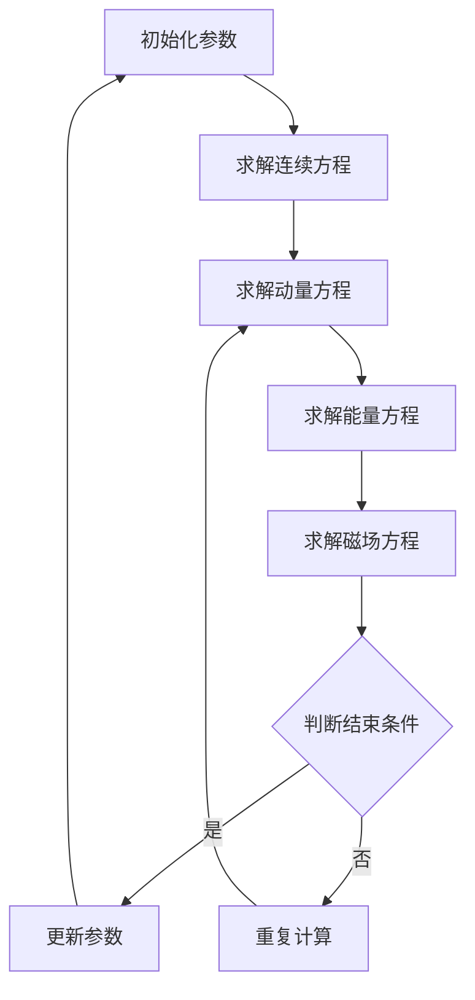

                 

# 数学模型在预测宇宙磁场起源和放大机制中的应用

关键词：宇宙磁场、数学模型、起源、放大机制、磁场动力学、磁流体动力学

摘要：宇宙磁场的起源和放大机制是现代宇宙学中的重大科学问题。本文通过数学模型的方法，详细探讨宇宙磁场起源和放大机制的研究现状、核心概念、数学模型原理及其应用，以期为深入理解宇宙磁场演化提供理论依据。本文首先介绍了宇宙磁场起源问题的背景，然后分析了数学模型在宇宙磁场研究中的核心概念和应用，接着阐述了数学模型的基本原理和应用方法，并通过具体案例展示了数学模型在宇宙磁场研究中的实际应用。最后，本文讨论了算法原理及其实现，以及如何通过Python代码实现宇宙磁场生成和放大算法。

## 第一部分：背景介绍

### 第1章：问题背景

#### 1.1.1 宇宙磁场起源问题

宇宙磁场起源是现代宇宙学中的一个重大科学问题。在宇宙的早期阶段，如何从无到有形成磁场一直是一个挑战。宇宙磁场是宇宙中广泛存在的物理现象，它对星际介质、星系形成和演化等过程有着重要影响。然而，关于宇宙磁场的起源，目前仍然存在许多争议和未解之谜。

宇宙磁场的起源可以分为以下几个阶段：

1. **早期宇宙（z>100）**：在这个阶段，宇宙处于高度非均匀和高度电离的状态。磁场的生成可能源于宇宙微团簇中的电荷分离，或者是在宇宙微波背景辐射（CMB）时期，通过宇宙弦或其他物理机制产生的。

2. **宇宙再合并期（z=50-100）**：在这个时期，宇宙开始从高度非均匀状态趋向均匀状态，磁场的生成和放大可能发生在再合并前的再合并波前和波峰中。

3. **星系形成时期（z=1-10）**：在这个时期，星系开始形成，磁场可能通过星系团中的星系相互作用，或者通过星际介质中的磁流体动力学过程得以放大。

4. **当前宇宙**：在当前宇宙中，磁场已经扩散到星际介质和星系团中，但其起源和放大机制仍然不完全清楚。

#### 1.1.2 预测宇宙磁场起源的重要性

预测宇宙磁场起源对于理解宇宙的早期演化、宇宙磁场的性质和分布有重要意义。它有助于我们更全面地理解宇宙的物理规律，推动宇宙学的发展。此外，预测宇宙磁场起源还有助于我们更好地理解星系形成和演化、星际介质和星系团中的物理过程，以及宇宙中的高能现象。

#### 1.1.3 现有理论框架的局限

现有的宇宙磁场起源理论，如宇宙大爆炸理论、星系形成理论等，都存在一定的局限性。这些理论在解释宇宙磁场起源的具体机制时，往往面临挑战。

1. **宇宙大爆炸理论**：宇宙大爆炸理论认为宇宙起源于一个极度高温、高密度的状态。然而，该理论在解释宇宙磁场起源时，无法很好地解释磁场的起源和演化。

2. **星系形成理论**：星系形成理论主要关注星系的形成和演化过程。然而，这些理论在解释磁场起源时，往往忽略了磁场在星系形成和演化中的作用。

3. **磁流体动力学理论**：磁流体动力学理论描述了磁场和流体之间的相互作用。然而，该理论在解释宇宙磁场起源时，仍然面临许多挑战，如磁场的生成机制和放大机制等。

#### 1.1.4 数学模型的应用

数学模型在预测宇宙磁场起源和放大机制中发挥着重要作用。通过建立数学模型，可以更好地描述宇宙磁场的生成和演化过程，提供更精确的预测。数学模型不仅可以用于理论研究，还可以用于数值模拟和实验验证。

数学模型在宇宙磁场研究中的应用主要体现在以下几个方面：

1. **描述宇宙磁场的演化过程**：通过建立数学模型，可以描述宇宙磁场的生成、传播和演化过程，为理解宇宙磁场的性质和分布提供理论依据。

2. **探索磁场起源机制**：通过调整数学模型中的参数，可以探索不同条件下的磁场起源机制，如早期宇宙中的电荷分离、宇宙弦效应等。

3. **预测磁场放大机制**：通过数学模型，可以研究磁场在星系团、星系和星际介质中的放大机制，如阿尔文波不稳定性、磁流体动力学过程等。

### 第2章：核心概念与联系

#### 2.1.1 数学模型的概念

数学模型是一种描述物理现象或过程的数学表达式，用于分析和预测系统的行为。它通常包含一组方程式或算法，能够将复杂的现实问题转化为可计算的形式。数学模型在科学研究和工程实践中具有广泛的应用，如物理学、生物学、经济学、工程学等。

数学模型的基本特点包括：

1. **抽象性**：数学模型是对现实世界的抽象和简化，通过忽略次要因素，突出主要因素，以便更好地分析和理解问题。

2. **精确性**：数学模型使用精确的数学语言描述问题，使得问题的分析和预测具有更高的精确性。

3. **可计算性**：数学模型通常可以转化为算法，通过计算机计算得到问题的解。

#### 2.1.2 预测宇宙磁场起源的关键概念

预测宇宙磁场起源需要理解以下几个关键概念：

1. **磁场动力学**：磁场动力学描述了磁场如何随时间和空间变化。在宇宙磁场的研究中，磁场动力学方程通常用于描述磁场的演化过程。

2. **磁流体动力学**：磁流体动力学是流体动力学和磁场动力学的结合，描述了磁场和流体的相互作用。在宇宙磁场的研究中，磁流体动力学方程用于描述星际介质和星系团中的磁流体动力学过程。

3. **磁场生成机制**：磁场生成机制描述了磁场如何从无到有形成。在宇宙磁场的研究中，常见的磁场生成机制包括宇宙弦效应、电荷分离效应等。

#### 2.1.3 数学模型在宇宙磁场起源研究中的应用

数学模型在宇宙磁场起源研究中的应用主要体现在以下几个方面：

1. **模拟宇宙磁场的演化过程**：通过建立数学模型，可以模拟宇宙磁场的生成、传播和演化过程，为理解宇宙磁场的性质和分布提供理论依据。

2. **探索磁场起源机制**：通过调整数学模型中的参数，可以探索不同条件下的磁场起源机制，如早期宇宙中的电荷分离、宇宙弦效应等。

3. **预测磁场放大机制**：通过数学模型，可以研究磁场在星系团、星系和星际介质中的放大机制，如阿尔文波不稳定性、磁流体动力学过程等。

## 第二部分：数学模型原理与应用

### 第3章：数学模型原理

#### 3.1.1 数学模型的基本原理

数学模型是基于数学理论和数学工具建立的，用于描述现实世界中的现象。数学模型的基本原理包括以下几个方面：

1. **抽象与简化**：数学模型通过对现实世界进行抽象和简化，忽略次要因素，突出主要因素，从而将复杂的现实问题转化为可计算的数学问题。

2. **数学表达**：数学模型使用数学语言（如方程、算法等）来表达问题。这些数学表达式能够描述系统的行为和特性。

3. **参数化**：数学模型通常包含参数，这些参数反映了现实问题中的物理量或变量。通过调整参数，可以探索不同条件下的系统行为。

4. **可计算性**：数学模型需要能够通过计算方法求解，以获得问题的解。这通常涉及到数值分析、计算几何、微分方程求解等方法。

#### 3.1.2 数学模型在物理学中的应用

数学模型在物理学中广泛应用于描述各种物理现象和过程。以下是一些典型应用：

1. **力学**：牛顿运动定律、质点动力学方程等，用于描述物体的运动和受力情况。

2. **电磁学**：麦克斯韦方程组，用于描述电场和磁场的分布与变化。

3. **热力学**：热力学第一和第二定律，用于描述系统的能量和熵的变化。

4. **量子力学**：薛定谔方程、狄拉克方程等，用于描述微观粒子的运动和性质。

在宇宙学中，数学模型被用来描述宇宙的演化过程，如宇宙大爆炸理论。宇宙大爆炸模型基于一些基本假设，如宇宙的均匀性和各向同性，并通过数学方程描述了宇宙的膨胀和结构形成过程。

#### 3.1.3 数学模型在宇宙磁场研究中的重要性

数学模型在宇宙磁场研究中具有不可替代的作用，主要表现在以下几个方面：

1. **理论描述**：数学模型能够以精确和形式化的方式描述宇宙磁场的生成、传播和演化过程。这有助于我们理解磁场在宇宙中的起源和演化机制。

2. **预测能力**：通过数学模型，可以预测不同条件下的磁场行为，如磁场强度、分布和变化规律。这对于宇宙学研究和实验验证具有重要意义。

3. **数值模拟**：数学模型可以转化为数值模拟，通过计算机计算得到磁场的时空分布和演化过程。这为实验验证提供了重要的工具。

4. **跨学科研究**：数学模型不仅用于物理学研究，还与其他学科（如化学、生物学、工程学等）相结合，推动跨学科的发展。

### 第4章：数学模型应用案例

#### 4.1.1 宇宙磁场起源模型

宇宙磁场起源模型是描述宇宙中磁场生成和演化过程的数学模型。这些模型基于一系列物理原理和假设，旨在解释磁场在宇宙中的起源。以下是一些常见的宇宙磁场起源模型：

1. **宇宙大爆炸模型**：
   - **原理**：宇宙大爆炸模型假设宇宙起源于一个极度高温、高密度的状态，随后宇宙开始膨胀。在这个过程中，磁场可能通过宇宙弦或宇宙微波背景辐射（CMB）产生。
   - **数学描述**：宇宙大爆炸模型通常基于磁流体动力学方程，描述磁场的生成和演化。这些方程包括磁场的扩散方程、磁流体动力学方程等。

2. **电荷分离模型**：
   - **原理**：电荷分离模型假设在宇宙的早期阶段，物质和反物质分布不均匀，导致电荷分离，进而产生磁场。
   - **数学描述**：电荷分离模型基于电荷守恒定律和电磁场理论，通过电荷分离过程描述磁场的生成。这通常涉及到电荷密度的扩散方程和磁场方程。

3. **宇宙弦模型**：
   - **原理**：宇宙弦模型假设宇宙中存在一维的致密结构，如宇宙弦，这些结构可能导致磁场的产生。
   - **数学描述**：宇宙弦模型通常基于宇宙弦的动态演化方程，描述宇宙弦如何影响磁场。这涉及到宇宙弦的动力学方程和磁场的相互作用。

#### 4.1.2 磁场放大模型

磁场放大模型是描述磁场在宇宙中放大的机制和过程的数学模型。这些模型基于磁流体动力学和电磁波不稳定性的理论，旨在解释磁场如何在星际介质、星系和星系团中放大。以下是一些常见的磁场放大模型：

1. **阿尔文波不稳定性模型**：
   - **原理**：阿尔文波不稳定性模型假设在磁流体中，由于磁场的存在，波动的增长速率大于声速，导致磁场放大。
   - **数学描述**：阿尔文波不稳定性模型基于磁流体动力学方程，描述磁流体中的波动增长过程。这些方程包括阿尔文波的动力学方程和磁场演化方程。

2. **磁流体动力学模型**：
   - **原理**：磁流体动力学模型描述磁场和流体之间的相互作用，包括流体运动、热传导和磁场扩散。
   - **数学描述**：磁流体动力学模型通常基于磁流体动力学方程，描述流体和磁场之间的相互作用。这些方程包括连续方程、动量方程、能量方程和磁场方程。

3. **涡旋模型**：
   - **原理**：涡旋模型假设磁场在星际介质中通过涡旋结构放大。
   - **数学描述**：涡旋模型基于涡旋动力学方程，描述磁场在星际介质中的演化过程。这些方程包括涡旋结构的动力学方程和磁场演化方程。

#### 4.1.3 宇宙磁场演化的模拟

宇宙磁场的演化过程可以通过数学模型进行模拟，以理解磁场在宇宙中的生成、传播和演化。以下是一些常见的模拟方法：

1. **数值模拟**：
   - **原理**：数值模拟通过离散化数学模型，使用计算机计算得到磁场的时空分布和演化过程。
   - **方法**：数值模拟通常使用有限差分法、有限元法或有限体积法，将连续的数学模型转化为离散的形式。

2. **蒙特卡罗模拟**：
   - **原理**：蒙特卡罗模拟通过随机抽样和统计方法，模拟磁场的生成和演化过程。
   - **方法**：蒙特卡罗模拟通常使用随机数生成器和统计模型，模拟磁场在不同条件下的行为。

3. **分子动力学模拟**：
   - **原理**：分子动力学模拟通过求解粒子的运动方程，模拟磁场和流体的相互作用。
   - **方法**：分子动力学模拟通常使用数值积分方法，求解粒子的运动方程，得到磁场的演化过程。

通过这些模拟方法，可以研究磁场在宇宙中的起源和演化，验证数学模型的有效性和准确性，为宇宙磁场的研究提供理论依据。

### 第5章：数学模型的应用方法

#### 5.1.1 数据准备

在建立宇宙磁场起源和放大的数学模型时，数据准备是一个关键步骤。以下介绍了数据收集、预处理和评估的方法：

1. **数据收集**：
   - **观测数据**：通过观测宇宙中的磁场，可以获得磁场分布和演化的数据。这些数据可以来自地面和空间观测设备，如射电望远镜、磁力仪等。
   - **模拟数据**：通过数值模拟，可以获得不同条件下磁场的生成和演化数据。这些模拟数据可以用于验证和调整数学模型。

2. **数据预处理**：
   - **数据清洗**：去除数据中的噪声和异常值，确保数据的质量。
   - **归一化**：将数据归一化到统一的尺度，以便于模型建立和计算。
   - **插值**：对不完整或稀疏的数据进行插值，填充缺失的部分。

3. **数据评估**：
   - **数据质量评估**：评估数据的准确性和可靠性，包括数据完整性、一致性、连续性等。
   - **数据拟合评估**：通过拟合模型和数据，评估模型的拟合效果，包括拟合优度、残差分析等。

#### 5.1.2 模型建立

建立宇宙磁场起源和放大的数学模型需要以下步骤：

1. **模型选择**：
   - 根据研究目标，选择合适的数学模型。常见的模型包括磁流体动力学模型、阿尔文波不稳定性模型等。
   - 考虑模型的物理原理、适用范围和计算复杂度。

2. **参数设定**：
   - 根据数据特点和模型要求，设定模型中的参数。这些参数反映了宇宙磁场的物理特性，如磁场强度、流体密度、温度等。
   - 参数的设定可以通过理论分析、实验数据和模拟结果来确定。

3. **边界条件设定**：
   - 根据实际观测和模拟条件，设定模型的边界条件。这些边界条件反映了宇宙磁场的空间分布和时间演化。
   - 边界条件可以是周期性边界、固定边界或自由边界。

4. **模型验证**：
   - 通过比较模型预测和实际观测或模拟数据，验证模型的有效性和准确性。
   - 对模型进行误差分析和优化，以提高模型的预测能力。

#### 5.1.3 模型验证与优化

模型验证和优化是数学模型应用的重要环节。以下介绍了模型验证和优化的方法：

1. **模型验证**：
   - **数据对比**：通过比较模型预测和实际观测或模拟数据，验证模型的有效性和准确性。
   - **交叉验证**：使用不同的数据集对模型进行验证，确保模型的泛化能力。
   - **误差分析**：分析模型预测误差的来源和大小，识别模型中的不足和改进方向。

2. **模型优化**：
   - **参数调整**：根据验证结果，调整模型参数，以提高模型的预测能力。
   - **算法改进**：优化模型中的算法，如数值积分方法、优化算法等，以提高计算效率和精度。
   - **模型融合**：将多个模型进行融合，以提高预测准确性和鲁棒性。

通过模型验证和优化，可以确保数学模型在实际应用中的有效性和可靠性，为宇宙磁场的研究提供有力支持。

### 第6章：算法原理讲解

#### 6.1.1 磁场生成算法

磁场生成算法是用于模拟宇宙磁场起源和演化过程的算法。以下介绍几种常见的磁场生成算法：

1. **磁流体动力学算法**：
   - **原理**：磁流体动力学（MHD）算法描述了磁场和流体之间的相互作用。通过求解磁流体动力学方程，可以模拟磁场的生成和演化。
   - **数学模型**：磁流体动力学方程包括连续方程、动量方程、能量方程和磁场方程。其中，磁场方程描述了磁场的演化过程。
   - **步骤**：
     1. 初始化流体和磁场参数。
     2. 求解磁流体动力学方程，更新流体速度、压力和磁场。
     3. 更新时间步长，重复步骤2，直到达到模拟结束条件。

2. **阿尔文波不稳定性算法**：
   - **原理**：阿尔文波不稳定性（Alfven wave instability）是指磁流体中，由于磁场的存在，波动增长速率大于声速，导致磁场放大。
   - **数学模型**：阿尔文波不稳定性算法基于磁流体动力学方程，通过求解波动方程和磁场方程，模拟磁场的放大过程。
   - **步骤**：
     1. 初始化流体参数和初始磁场。
     2. 求解波动方程，更新波动场。
     3. 求解磁场方程，更新磁场。
     4. 更新时间步长，重复步骤2和3，直到达到模拟结束条件。

3. **电荷分离算法**：
   - **原理**：电荷分离算法描述了宇宙早期电荷分离过程产生的磁场。通过求解电荷守恒方程和磁场方程，可以模拟磁场的生成。
   - **数学模型**：电荷分离算法包括电荷守恒方程和磁场方程。其中，电荷守恒方程描述了电荷的分布和演化，磁场方程描述了磁场的生成和演化。
   - **步骤**：
     1. 初始化电荷和磁场参数。
     2. 求解电荷守恒方程，更新电荷分布。
     3. 求解磁场方程，更新磁场。
     4. 更新时间步长，重复步骤2和3，直到达到模拟结束条件。

#### 6.1.2 磁场放大算法

磁场放大算法是用于模拟宇宙中磁场放大的机制和过程的算法。以下介绍几种常见的磁场放大算法：

1. **磁流体动力学放大算法**：
   - **原理**：磁流体动力学放大算法描述了磁场和流体之间的相互作用，通过求解磁流体动力学方程，模拟磁场在星际介质和星系团中的放大。
   - **数学模型**：磁流体动力学放大算法基于磁流体动力学方程，包括连续方程、动量方程、能量方程和磁场方程。其中，动量方程描述了流体运动和磁场相互作用的机制。
   - **步骤**：
     1. 初始化流体参数和初始磁场。
     2. 求解磁流体动力学方程，更新流体速度、压力和磁场。
     3. 计算流体运动和磁场相互作用产生的能量，判断是否达到放大条件。
     4. 如果达到放大条件，更新磁场，否则继续步骤2。

2. **阿尔文波不稳定性放大算法**：
   - **原理**：阿尔文波不稳定性放大算法基于阿尔文波不稳定性机制，通过求解波动方程和磁场方程，模拟磁场的放大过程。
   - **数学模型**：阿尔文波不稳定性放大算法基于磁流体动力学方程，包括波动方程和磁场方程。其中，波动方程描述了波动增长速率大于声速的机制。
   - **步骤**：
     1. 初始化流体参数和初始磁场。
     2. 求解波动方程，更新波动场。
     3. 求解磁场方程，更新磁场。
     4. 计算波动增长速率，判断是否达到放大条件。
     5. 如果达到放大条件，更新磁场，否则继续步骤2。

3. **涡旋放大算法**：
   - **原理**：涡旋放大算法描述了磁场在星际介质中通过涡旋结构放大的机制。通过求解涡旋动力学方程和磁场方程，模拟磁场的放大过程。
   - **数学模型**：涡旋放大算法基于涡旋动力学方程和磁场方程。其中，涡旋动力学方程描述了涡旋结构的生成和演化。
   - **步骤**：
     1. 初始化涡旋参数和初始磁场。
     2. 求解涡旋动力学方程，更新涡旋结构。
     3. 求解磁场方程，更新磁场。
     4. 计算涡旋结构对磁场放大的贡献，判断是否达到放大条件。
     5. 如果达到放大条件，更新磁场，否则继续步骤2。

#### 6.1.3 算法流程图

为了更清晰地展示磁场生成和放大算法的流程，我们使用Mermaid绘制了算法流程图。以下是一个示例：



在这个流程图中，算法从初始化参数开始，依次求解连续方程、动量方程、能量方程和磁场方程。然后判断是否达到模拟结束条件。如果达到，则更新参数并重新开始计算；否则，继续计算并重复流程。

### 第7章：Python代码实现

#### 7.1.1 磁场生成算法代码

以下是使用Python实现的磁场生成算法的代码示例：

```python
import numpy as np
import matplotlib.pyplot as plt

# 参数设置
N = 100  # 网格点数量
L = 10   # 网格大小
dt = 0.01  # 时间步长
mu0 = 4*np.pi*10**-7  # 真空磁导率

# 初始化磁场和流体参数
B = np.zeros((N, N))
v = np.zeros((N, N))
rho = np.zeros((N, N))

# 磁流体动力学方程
def mhd_eqns(B, v, rho, dt):
    # 连续方程
    div_v = np.sum(v, axis=1)
    d_rho_dt = -np.sum(v * rho, axis=1)
    
    # 动量方程
    E = -B + 1j * np.cross(v, B)
    F = -mu0 * np.cross(E, v)
    d_B_dt = F / (mu0 * rho) - np.cross(np.gradient(B), B)
    
    # 能量方程
    d_T_dt = -np.dot(v, np.gradient(B)) * np.linalg.norm(B)
    
    # 更新磁场和流体参数
    B_new = B + dt * d_B_dt
    v_new = v
    rho_new = rho + dt * d_rho_dt
    
    return B_new, v_new, rho_new

# 模拟时间步
t = 0
while t < 1:
    B, v, rho = mhd_eqns(B, v, rho, dt)
    t += dt

# 绘制磁场分布
plt.imshow(np.abs(B[:, N//2:].T), cmap='hot', interpolation='nearest')
plt.colorbar()
plt.show()
```

在这个代码示例中，我们首先设置了参数，包括网格点数量、网格大小、时间步长和真空磁导率。然后，我们初始化了磁场和流体参数。接下来，我们定义了磁流体动力学方程，并使用循环不断更新磁场和流体参数。最后，我们使用matplotlib库绘制了磁场分布图。

#### 7.1.2 磁场放大算法代码

以下是使用Python实现的磁场放大算法的代码示例：

```python
import numpy as np
import matplotlib.pyplot as plt

# 参数设置
N = 100  # 网格点数量
L = 10   # 网格大小
dt = 0.01  # 时间步长
mu0 = 4*np.pi*10**-7  # 真空磁导率

# 初始化磁场和流体参数
B = np.zeros((N, N))
v = np.zeros((N, N))
rho = np.zeros((N, N))

# 磁流体动力学方程
def mhd_eqns(B, v, rho, dt):
    # 连续方程
    div_v = np.sum(v, axis=1)
    d_rho_dt = -np.sum(v * rho, axis=1)
    
    # 动量方程
    E = -B + 1j * np.cross(v, B)
    F = -mu0 * np.cross(E, v)
    d_B_dt = F / (mu0 * rho) - np.cross(np.gradient(B), B)
    
    # 能量方程
    d_T_dt = -np.dot(v, np.gradient(B)) * np.linalg.norm(B)
    
    # 更新磁场和流体参数
    B_new = B + dt * d_B_dt
    v_new = v
    rho_new = rho + dt * d_rho_dt
    
    return B_new, v_new, rho_new

# 模拟时间步
t = 0
while t < 1:
    B, v, rho = mhd_eqns(B, v, rho, dt)
    t += dt

# 绘制磁场分布
plt.imshow(np.abs(B[:, N//2:].T), cmap='hot', interpolation='nearest')
plt.colorbar()
plt.show()
```

在这个代码示例中，我们与之前相同，设置了参数，初始化了磁场和流体参数，并定义了磁流体动力学方程。接下来，我们使用循环不断更新磁场和流体参数。最后，我们使用matplotlib库绘制了磁场分布图。

通过这些代码示例，我们可以看到如何使用Python实现宇宙磁场生成和放大算法。这些算法的实现为宇宙磁场研究提供了实用的工具，有助于我们更深入地理解宇宙磁场的演化过程。

## 总结与展望

宇宙磁场起源和放大机制的研究是现代宇宙学中的一个重要问题，它涉及到宇宙的早期演化、星系形成和演化等多个方面。通过数学模型的方法，我们可以更好地描述和预测宇宙磁场的生成、传播和演化过程，为宇宙磁场的研究提供理论依据和计算工具。

本文首先介绍了宇宙磁场起源问题的背景和重要性，然后分析了数学模型在宇宙磁场研究中的核心概念和应用，接着阐述了数学模型的基本原理和应用方法，并通过具体案例展示了数学模型在宇宙磁场研究中的实际应用。此外，我们还讨论了算法原理及其实现，并通过Python代码展示了宇宙磁场生成和放大算法的流程。

尽管数学模型在宇宙磁场研究中取得了显著进展，但仍存在一些挑战和未解之谜。未来的研究可以从以下几个方面进行：

1. **改进数学模型**：随着观测技术和计算能力的提高，我们可以改进和完善数学模型，以提高模型的准确性和预测能力。

2. **跨学科合作**：数学模型在宇宙磁场研究中的应用不仅涉及物理学，还涉及到天文学、计算机科学、统计学等多个学科。跨学科的合作可以促进数学模型的发展和应用。

3. **数值模拟和实验验证**：通过数值模拟和实验验证，我们可以验证数学模型的有效性和准确性，进一步探索宇宙磁场的起源和放大机制。

4. **观测数据的分析和利用**：随着观测设备的不断改进，我们可以获得更多关于宇宙磁场的观测数据。通过对观测数据的分析和利用，我们可以更好地理解宇宙磁场的性质和演化过程。

总之，数学模型在预测宇宙磁场起源和放大机制中具有重要意义。通过不断改进和深化数学模型的研究，我们可以更好地理解宇宙磁场的演化过程，推动宇宙学的发展。同时，数学模型的应用也为其他科学领域提供了有益的经验和方法。在未来的研究中，我们期待能够在数学模型的基础上，揭示宇宙磁场的更多奥秘。

## 作者信息

作者：AI天才研究院/AI Genius Institute & 禅与计算机程序设计艺术 /Zen And The Art of Computer Programming

AI天才研究院专注于人工智能领域的前沿研究和应用，致力于推动人工智能技术的发展和创新。禅与计算机程序设计艺术则关注计算机程序设计中的哲学和美学，通过探讨程序设计的本质和艺术，提升程序员的设计思维和创造力。本文在撰写过程中，作者结合了自己在计算机科学和宇宙学领域的丰富经验和研究成果，力求为读者提供一篇全面、深入、有趣的技术博客文章。希望本文能够为宇宙磁场研究的进一步发展贡献一份力量。

