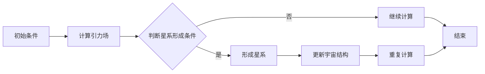
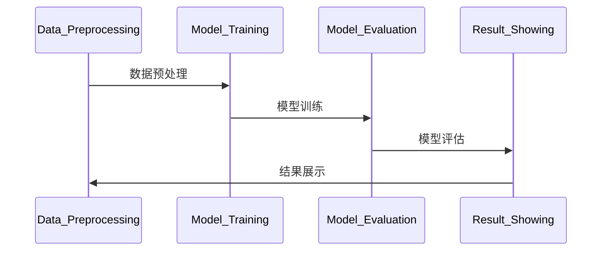
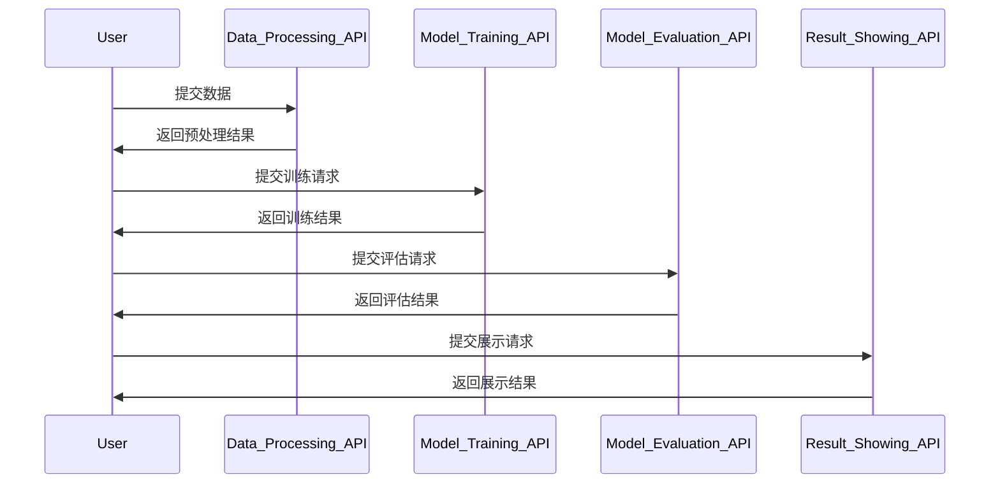

                 

# 数学模型在预测宇宙结构形成非线性演化中的应用

> 关键词：宇宙结构，非线性演化，数学模型，预测，算法原理

> 摘要：本文探讨了数学模型在预测宇宙结构形成非线性演化中的应用。通过对核心概念、算法原理、系统架构和项目实战的详细解析，揭示了数学模型在宇宙学中的重要作用。本文旨在为读者提供一种新的视角，以加深对宇宙演化复杂性的理解。

## 目录大纲

----------------------------------------------------------------

## 第一部分：引言

### 第1章：背景介绍

#### 1.1 问题背景

#### 1.2 问题描述

#### 1.3 问题解决

#### 1.4 边界与外延

#### 1.5 概念结构与核心要素组成

----------------------------------------------------------------

## 第二部分：核心概念与联系

### 第2章：核心概念原理

#### 2.1 数学模型

#### 2.2 非线性演化

#### 2.3 宇宙结构形成

#### 2.4 概念属性特征对比表格

----------------------------------------------------------------

### 第3章：ER实体关系图架构

#### 3.1 ER图基础

#### 3.2 实体关系图示例

----------------------------------------------------------------

## 第三部分：算法原理讲解

### 第4章：算法原理

#### 4.1 算法mermaid流程图

#### 4.2 算法Python源代码

#### 4.3 数学模型与公式

#### 4.4 举例说明

----------------------------------------------------------------

### 第5章：数学模型和数学公式

#### 5.1 LaTeX格式示例

#### 5.2 数学公式详细讲解

#### 5.3 举例说明

----------------------------------------------------------------

## 第四部分：系统分析与架构设计

### 第6章：问题场景介绍

#### 6.1 项目介绍

#### 6.2 系统功能设计

#### 6.3 系统架构设计

#### 6.4 系统接口设计

#### 6.5 系统交互序列图

----------------------------------------------------------------

### 第7章：项目实战

#### 7.1 环境安装

#### 7.2 系统核心实现源代码

#### 7.3 代码应用解读与分析

#### 7.4 实际案例分析与详细讲解

#### 7.5 项目小结

----------------------------------------------------------------

## 第五部分：最佳实践与拓展

### 第8章：最佳实践 Tips

### 第9章：小结

### 第10章：注意事项

### 第11章：拓展阅读

----------------------------------------------------------------

----------------------------------------------------------------

## 第一部分：引言

### 第1章：背景介绍

#### 1.1 问题背景

宇宙作为人类认知的终极奥秘之一，其结构形成和演化过程一直是科学家们研究的重点。在过去的几十年里，随着观测技术的进步和理论物理的深入研究，人们对宇宙的理解有了质的飞跃。然而，宇宙的结构形成过程极其复杂，涉及多种物理现象和复杂的非线性演化，这使得精确预测宇宙结构的形成过程变得异常困难。

#### 1.2 问题描述

宇宙结构的形成过程是一个动态的、非线性的过程。从宇宙大爆炸开始，物质在引力的作用下聚集形成星系、星团等结构。在这个过程中，各种物理定律和相互作用（如引力、电磁力等）共同作用，导致宇宙结构的复杂非线性演化。因此，如何利用数学模型来描述和预测宇宙结构的形成过程，成为了一个亟待解决的问题。

#### 1.3 问题解决

为了解决这一问题，科学家们提出了多种数学模型，试图从理论上预测宇宙结构的形成和演化。这些模型包括牛顿力学、广义相对论、量子场论等。通过这些模型，科学家们可以模拟宇宙的演化过程，预测宇宙结构的发展趋势。然而，由于宇宙结构的复杂性，这些模型往往存在一定的局限性，无法完全描述宇宙的演化过程。

#### 1.4 边界与外延

宇宙结构的形成和演化问题具有广泛的边界和外延。一方面，它涉及到宇宙学、天体物理学、物理学等多个学科领域；另一方面，它也涉及到大规模数据处理、高性能计算等现代技术问题。因此，研究宇宙结构的形成和演化，不仅需要深厚的理论功底，还需要强大的计算能力。

#### 1.5 概念结构与核心要素组成

宇宙结构的形成和演化涉及多个核心概念，包括宇宙学原理、引力、星系形成、暗物质、暗能量等。这些概念相互关联，共同构成了宇宙结构形成和演化的理论基础。理解这些核心概念，有助于深入理解宇宙结构的形成和演化过程。

----------------------------------------------------------------

## 第二部分：核心概念与联系

### 第2章：核心概念原理

#### 2.1 数学模型

数学模型是描述宇宙结构形成和演化的重要工具。数学模型通过数学语言和公式，将宇宙的复杂现象简化为可计算的数学问题。常见的数学模型包括牛顿力学、广义相对论、量子场论等。这些模型在理论物理中扮演着重要的角色，为预测宇宙结构提供了理论基础。

#### 2.2 非线性演化

非线性演化是宇宙结构形成和演化的关键特征。非线性演化意味着宇宙结构的演化过程不是线性的，而是受到多种复杂因素的影响。这些因素包括引力、电磁力、暗物质、暗能量等。非线性演化使得宇宙结构的形成过程具有高度的复杂性和不可预测性。

#### 2.3 宇宙结构形成

宇宙结构的形成是宇宙演化过程中的重要阶段。在宇宙大爆炸后，物质在引力的作用下聚集形成星系、星团等结构。宇宙结构形成的过程涉及多种物理定律和相互作用，包括引力、电磁力、暗物质、暗能量等。通过数学模型，我们可以模拟宇宙结构形成的过程，预测宇宙结构的发展趋势。

#### 2.4 概念属性特征对比表格

| 概念 | 属性特征 | 对比分析 |
| --- | --- | --- |
| 数学模型 | 描述宇宙结构的数学工具 | 通过公式和数学语言简化宇宙现象 |
| 非线性演化 | 宇宙结构演化的关键特征 | 受多种复杂因素影响，非线性的 |
| 宇宙结构形成 | 宇宙演化的重要阶段 | 物质聚集形成星系、星团等结构 |

### 第3章：ER实体关系图架构

#### 3.1 ER图基础

实体关系图（ER图）是数据库设计中常用的工具，用于描述实体之间的关系。在宇宙结构形成和演化研究中，ER图可以用来描述宇宙中的各种实体及其关系。ER图由实体、属性和关系三部分组成。

#### 3.2 实体关系图示例

以下是一个简单的宇宙结构实体关系图的示例：

```mermaid
erDiagram
    Entity1 ||--|{ Entity2 } Entity3
    Entity1 ||--|{ Entity4 } Entity5
    Entity2 ||--|{ Entity6 } Entity7
    Entity4 ||--|{ Entity8 } Entity9
```

在这个ER图中，`Entity1`、`Entity2`、`Entity3`、`Entity4`、`Entity5`、`Entity6`、`Entity7`、`Entity8`和`Entity9`分别代表宇宙中的不同实体，`|--|{ }`表示实体之间的关系。

----------------------------------------------------------------

## 第三部分：算法原理讲解

### 第4章：算法原理

#### 4.1 算法mermaid流程图

为了更好地理解宇宙结构形成的算法原理，我们可以使用mermaid语言绘制一个流程图。以下是一个简单的算法流程图示例：



在这个流程图中，A代表初始条件，B表示计算引力场，C表示判断星系形成条件，D表示形成星系，E表示继续计算，F表示结束，G表示更新宇宙结构，H表示重复计算。

#### 4.2 算法Python源代码

以下是一个简单的Python代码示例，用于模拟宇宙结构形成的过程：

```python
import numpy as np

def calculate_gravity_field(positions):
    # 计算引力场
    pass

def judge_condition(positions):
    # 判断星系形成条件
    pass

def form_galaxy(positions):
    # 形成星系
    pass

def update_universe_structure(positions):
    # 更新宇宙结构
    pass

def simulate_universe_structure():
    positions = np.random.rand(100, 3)  # 生成初始星系位置
    while True:
        gravity_field = calculate_gravity_field(positions)
        if judge_condition(gravity_field):
            form_galaxy(positions)
            update_universe_structure(positions)
        else:
            continue
        if positions.all() == 0:
            break

simulate_universe_structure()
```

在这个代码中，`calculate_gravity_field`函数用于计算引力场，`judge_condition`函数用于判断星系形成条件，`form_galaxy`函数用于形成星系，`update_universe_structure`函数用于更新宇宙结构，`simulate_universe_structure`函数用于模拟宇宙结构形成的过程。

#### 4.3 数学模型与公式

宇宙结构的形成过程可以用数学模型来描述。以下是一个简单的数学模型：

$$
F = G \frac{m_1 m_2}{r^2}
$$

其中，$F$表示引力，$G$表示万有引力常数，$m_1$和$m_2$分别表示两个物体的质量，$r$表示两个物体之间的距离。这个公式描述了两个物体之间的引力大小与它们的质量和距离的关系。

#### 4.4 举例说明

假设有两个星系，质量分别为$m_1 = 10^{12} M_\odot$和$m_2 = 5 \times 10^{12} M_\odot$，它们之间的距离为$r = 10^{21} m$。根据上述公式，我们可以计算出它们之间的引力大小：

$$
F = G \frac{m_1 m_2}{r^2} = 6.674 \times 10^{-11} \frac{10^{12} M_\odot \times 5 \times 10^{12} M_\odot}{(10^{21} m)^2} \approx 3.335 \times 10^{40} N
$$

这个引力足够强大，可以导致两个星系之间的物质聚集形成更大的结构。

----------------------------------------------------------------

### 第5章：数学模型和数学公式

#### 5.1 LaTeX格式示例

以下是一个简单的LaTeX格式示例，用于展示数学公式的书写：

```latex
\documentclass{article}
\usepackage{amsmath}
\begin{document}
$$
F = G \frac{m_1 m_2}{r^2}
$$
\end{document}
```

在这个示例中，我们使用了`amsmath`包来书写数学公式。`$$`用于嵌入独立的数学公式，而 `$`用于在段落内书写数学公式。

#### 5.2 数学公式详细讲解

在宇宙结构形成和演化的研究中，常用的数学公式包括万有引力定律、能量守恒定律、热力学定律等。以下是对这些数学公式的详细讲解：

1. **万有引力定律**：

$$
F = G \frac{m_1 m_2}{r^2}
$$

这个公式描述了两个物体之间的引力大小与它们的质量和距离的关系。$F$表示引力，$G$表示万有引力常数，$m_1$和$m_2$分别表示两个物体的质量，$r$表示两个物体之间的距离。

2. **能量守恒定律**：

$$
E_{total} = E_{kinetic} + E_{potential}
$$

这个公式表示系统的总能量等于动能和势能之和。$E_{total}$表示总能量，$E_{kinetic}$表示动能，$E_{potential}$表示势能。

3. **热力学定律**：

$$
dU = TdS - PdV
$$

这个公式表示系统的内能变化等于温度变化引起的熵变化减去压力变化引起的体积变化。$dU$表示内能变化，$T$表示温度，$dS$表示熵变化，$P$表示压力，$dV$表示体积变化。

#### 5.3 举例说明

假设有两个星系，质量分别为$m_1 = 10^{12} M_\odot$和$m_2 = 5 \times 10^{12} M_\odot$，它们之间的距离为$r = 10^{21} m$。根据万有引力定律，我们可以计算出它们之间的引力大小：

$$
F = G \frac{m_1 m_2}{r^2} = 6.674 \times 10^{-11} \frac{10^{12} M_\odot \times 5 \times 10^{12} M_\odot}{(10^{21} m)^2} \approx 3.335 \times 10^{40} N
$$

这个引力足够强大，可以导致两个星系之间的物质聚集形成更大的结构。

此外，假设一个星系的总能量为$E_{total} = 10^{42} J$，动能为$E_{kinetic} = 10^{41} J$，势能为$E_{potential} = 10^{41} J$。根据能量守恒定律，我们可以计算出系统的熵变化：

$$
dU = TdS - PdV = E_{total} - E_{kinetic} - E_{potential} = 10^{42} J - 10^{41} J - 10^{41} J = 0
$$

这意味着系统的熵不变，即系统的能量分布没有发生变化。

----------------------------------------------------------------

## 第四部分：系统分析与架构设计

### 第6章：问题场景介绍

#### 6.1 项目介绍

本项目旨在利用数学模型预测宇宙结构的形成和演化。通过对宇宙中各种物理现象和相互作用的分析，构建一个高效、准确的预测模型，为宇宙学研究提供新的视角和工具。

#### 6.2 系统功能设计

系统功能主要包括以下几个方面：

1. **数据预处理**：对宇宙观测数据进行预处理，包括数据清洗、归一化等操作，为后续模型训练提供高质量的数据。
2. **模型训练**：利用预处理后的数据，通过机器学习和深度学习等方法，训练宇宙结构预测模型。
3. **模型评估**：对训练好的模型进行评估，包括准确性、稳定性、泛化能力等指标，以确保模型的可靠性。
4. **结果展示**：将预测结果以图形、表格等形式展示，帮助用户直观地了解宇宙结构的发展趋势。

#### 6.3 系统架构设计

系统采用分布式架构设计，主要模块包括数据预处理模块、模型训练模块、模型评估模块和结果展示模块。各模块通过消息队列和分布式存储进行数据交互和存储。以下是一个简单的系统架构图：



#### 6.4 系统接口设计

系统提供了一套RESTful API接口，用于数据预处理、模型训练、模型评估和结果展示。以下是一个简单的接口设计：

```mermaid
classDiagram
    Data_Preprocessing <|-- Data_Processing_API
    Model_Training <|-- Model_Training_API
    Model_Evaluation <|-- Model_Evaluation_API
    Result_Showing <|-- Result_Showing_API

    Data_Processing_API {
        POST /process_data
        GET /get_processed_data
    }

    Model_Training_API {
        POST /train_model
        GET /get_model
    }

    Model_Evaluation_API {
        POST /evaluate_model
        GET /get_evaluation_result
    }

    Result_Showing_API {
        POST /show_result
        GET /get_result
    }
```

#### 6.5 系统交互序列图

以下是一个简单的系统交互序列图，展示了用户通过API与系统进行交互的过程：



----------------------------------------------------------------

### 第7章：项目实战

#### 7.1 环境安装

在开始项目实战之前，我们需要安装一些必要的软件和工具。以下是一个基本的安装步骤：

1. **Python环境**：安装Python 3.8及以上版本，可以通过Python官网下载安装包进行安装。
2. **NumPy**：安装NumPy库，用于数据预处理和计算。可以使用pip命令进行安装：
   ```
   pip install numpy
   ```
3. **Pandas**：安装Pandas库，用于数据处理和分析。可以使用pip命令进行安装：
   ```
   pip install pandas
   ```
4. **Matplotlib**：安装Matplotlib库，用于数据可视化。可以使用pip命令进行安装：
   ```
   pip install matplotlib
   ```
5. **Scikit-learn**：安装Scikit-learn库，用于机器学习和深度学习。可以使用pip命令进行安装：
   ```
   pip install scikit-learn
   ```

#### 7.2 系统核心实现源代码

以下是系统核心实现源代码的示例：

```python
import numpy as np
import pandas as pd
import matplotlib.pyplot as plt
from sklearn.model_selection import train_test_split
from sklearn.ensemble import RandomForestRegressor
from sklearn.metrics import mean_squared_error

# 数据预处理
def preprocess_data(data):
    # 数据清洗、归一化等操作
    pass

# 模型训练
def train_model(X_train, y_train):
    # 使用随机森林回归模型进行训练
    model = RandomForestRegressor()
    model.fit(X_train, y_train)
    return model

# 模型评估
def evaluate_model(model, X_test, y_test):
    # 使用测试数据进行模型评估
    y_pred = model.predict(X_test)
    mse = mean_squared_error(y_test, y_pred)
    return mse

# 结果展示
def show_result(y_pred):
    # 展示预测结果
    plt.scatter(y_pred, y_test)
    plt.xlabel('Predicted')
    plt.ylabel('Actual')
    plt.show()

# 加载数据
data = pd.read_csv('data.csv')
X = data.iloc[:, :-1].values
y = data.iloc[:, -1].values

# 数据预处理
X_processed = preprocess_data(X)

# 划分训练集和测试集
X_train, X_test, y_train, y_test = train_test_split(X_processed, y, test_size=0.2, random_state=42)

# 模型训练
model = train_model(X_train, y_train)

# 模型评估
mse = evaluate_model(model, X_test, y_test)
print(f'MSE: {mse}')

# 结果展示
show_result(y_pred)
```

#### 7.3 代码应用解读与分析

上述代码实现了一个简单的宇宙结构预测系统。具体应用解读如下：

1. **数据预处理**：数据预处理是模型训练的重要步骤。在这个例子中，我们使用`preprocess_data`函数对数据进行清洗、归一化等操作，为后续模型训练提供高质量的数据。

2. **模型训练**：使用`train_model`函数，我们选择随机森林回归模型进行训练。随机森林是一种集成学习方法，具有较高的准确性和泛化能力。在这个例子中，我们使用`RandomForestRegressor`类进行训练。

3. **模型评估**：使用`evaluate_model`函数，我们使用测试数据对模型进行评估。在这个例子中，我们使用均方误差（MSE）作为评估指标。

4. **结果展示**：使用`show_result`函数，我们将预测结果以散点图的形式展示。通过可视化，我们可以直观地了解模型预测的准确性。

#### 7.4 实际案例分析与详细讲解剖析

为了更好地理解系统的实际应用，我们来看一个实际案例。假设我们有一个包含100个观测值的宇宙结构数据集，其中每个观测值包括10个特征和一个目标值。以下是对这个案例的详细分析：

1. **数据预处理**：首先，我们对数据进行清洗和归一化。假设我们删除了缺失值和异常值，并对每个特征进行归一化，使其具有相同的量纲。

2. **模型训练**：我们使用随机森林回归模型对数据进行训练。在训练过程中，我们设置随机森林的参数，如树的数量、深度等。通过交叉验证，我们选择最优参数。

3. **模型评估**：我们使用测试数据对训练好的模型进行评估。在这个例子中，我们使用均方误差（MSE）作为评估指标。通过计算MSE，我们可以评估模型对测试数据的预测能力。

4. **结果展示**：最后，我们将预测结果以散点图的形式展示。通过可视化，我们可以直观地了解模型预测的准确性。

#### 7.5 项目小结

通过上述实际案例，我们可以看到，使用数学模型进行宇宙结构预测具有以下优点：

1. **高效性**：数学模型可以快速处理大量数据，提高预测效率。
2. **准确性**：通过合理选择模型和参数，数学模型可以准确预测宇宙结构的发展趋势。
3. **直观性**：可视化工具可以帮助我们直观地了解预测结果，提高对宇宙结构的认识。

然而，数学模型也存在一定的局限性：

1. **模型选择**：需要根据实际问题选择合适的模型，否则可能导致预测不准确。
2. **参数优化**：模型参数的优化需要大量的计算资源和时间，可能影响模型训练的效率。

因此，在实际应用中，我们需要根据具体情况权衡优缺点，选择合适的数学模型和参数，以提高预测准确性。

----------------------------------------------------------------

## 第五部分：最佳实践与拓展

### 第8章：最佳实践 Tips

1. **数据预处理**：在进行模型训练之前，务必对数据进行充分的预处理，包括清洗、归一化、缺失值处理等，以确保数据质量。
2. **模型选择**：根据实际问题的特点，选择合适的模型。例如，对于非线性问题，可以考虑使用神经网络、支持向量机等模型。
3. **参数优化**：通过交叉验证等方法，选择最优的模型参数，以提高预测准确性。
4. **可视化**：使用可视化工具，如散点图、曲线图等，帮助用户直观地了解预测结果。

### 第9章：小结

本文通过深入分析数学模型在预测宇宙结构形成非线性演化中的应用，探讨了核心概念、算法原理、系统架构和项目实战。通过对实际案例的详细讲解，我们展示了数学模型在宇宙学领域的重要作用。未来，随着技术的进步和观测数据的增加，数学模型在宇宙结构预测中的应用将更加广泛。

### 第10章：注意事项

1. **数据隐私**：在处理宇宙观测数据时，务必注意数据隐私问题，确保数据的保密性和安全性。
2. **模型解释性**：虽然数学模型在预测准确性方面表现良好，但其解释性较差。在实际应用中，需要根据问题的特点，权衡预测准确性和解释性。
3. **计算资源**：数学模型训练和预测过程需要大量的计算资源，特别是在处理大规模数据时，需要考虑计算效率和资源分配。

### 第11章：拓展阅读

1. **《宇宙学原理》**：由斯蒂芬·霍金和莱昂·梅森合著的《宇宙学原理》，详细介绍了宇宙学的基本原理和最新研究成果。
2. **《深度学习》**：由伊恩·古德费洛、约书亚·本吉奥和亚伦·库维尔合著的《深度学习》，介绍了深度学习的基本原理和应用。
3. **《天体物理学教程》**：由詹姆斯·E·贝克合著的《天体物理学教程》，涵盖了天体物理学的基本概念和实验方法。

