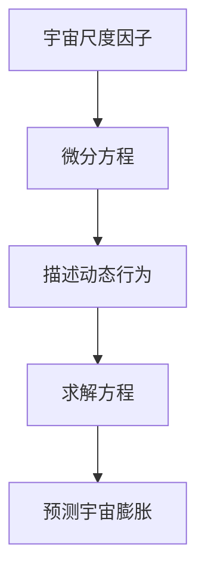
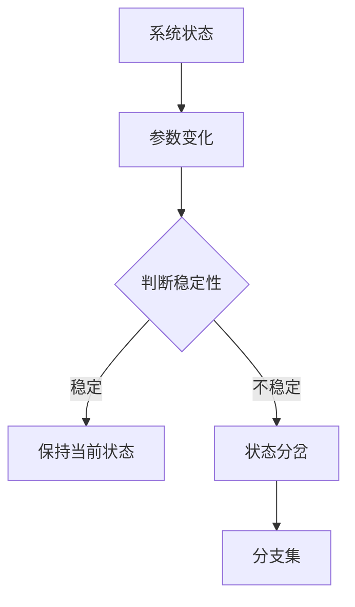
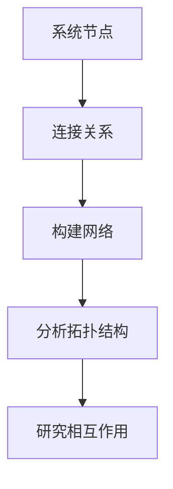
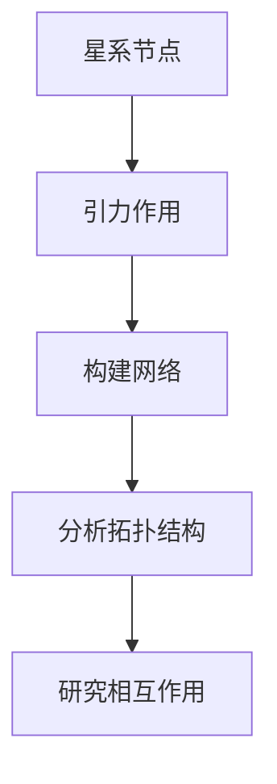

                 

### 文章标题：数学模型在预测宇宙结构形成非线性演化临界点中的应用

关键词：宇宙结构、非线性演化、数学模型、临界点预测、微分方程、分支集模型、复杂网络模型

摘要：本文探讨了数学模型在预测宇宙结构形成非线性演化临界点中的应用。首先，我们对宇宙结构和非线性演化进行了概述，阐述了宇宙层次结构、非线性动力学的基本原理及其在宇宙中的体现。接着，介绍了用于非线性宇宙演化的核心数学模型，包括微分方程模型、分支集模型和复杂网络模型。然后，我们探讨了非线性演化临界点的定义与特性，以及预测方法的应用与比较。最后，本文通过实际案例展示了数学模型在宇宙大尺度结构和小尺度结构中的应用，并对未来的发展趋势和挑战进行了展望。本文旨在为读者提供一份全面且深入的技术探讨，以期为宇宙演化研究提供有益的参考。

----------------------------------------------------------------

### 目录大纲：数学模型在预测宇宙结构形成非线性演化临界点中的应用

----------------------------------------------------------------

## 第一部分：宇宙结构与非线性演化概述

### 第1章：宇宙结构概述

#### 1.1 宇宙结构的基本概念

##### 1.1.1 宇宙的层次结构

##### 1.1.2 宇宙膨胀与暗能量

##### 1.1.3 宇宙背景辐射

#### 1.2 非线性演化理论

##### 1.2.1 非线性动力学的基本原理

##### 1.2.2 非线性系统的稳定性分析

##### 1.2.3 非线性现象在宇宙中的体现

### 第2章：宇宙结构的非线性演化

#### 2.1 非线性演化在宇宙结构中的应用

##### 2.1.1 非线性模型的发展历程

##### 2.1.2 非线性模型在宇宙演化中的应用

##### 2.1.3 非线性模型的优点与挑战

## 第二部分：数学模型在非线性宇宙演化中的应用

### 第3章：核心数学模型介绍

#### 3.1 微分方程模型

##### 3.1.1 微分方程的基本原理

##### 3.1.2 微分方程在宇宙演化中的应用

##### 3.1.3 微分方程模型举例

#### 3.2 分支集模型

##### 3.2.1 分支集的基本原理

##### 3.2.2 分支集在宇宙演化中的应用

##### 3.2.3 分支集模型举例

#### 3.3 复杂网络模型

##### 3.3.1 复杂网络的基本原理

##### 3.3.2 复杂网络在宇宙演化中的应用

##### 3.3.3 复杂网络模型举例

### 第4章：非线性演化临界点的预测

#### 4.1 非线性临界点的基本概念

##### 4.1.1 临界点的定义与特性

##### 4.1.2 临界点在宇宙演化中的意义

##### 4.1.3 临界点预测的方法

#### 4.2 预测方法的应用与比较

##### 4.2.1 不同预测方法的比较

##### 4.2.2 实际预测案例

##### 4.2.3 预测结果分析

## 第三部分：数学模型在宇宙演化研究中的应用

### 第5章：数学模型在宇宙大尺度结构中的应用

#### 5.1 宇宙大尺度结构的基本概念

##### 5.1.1 宇宙大尺度结构的特点

##### 5.1.2 大尺度结构的研究现状

##### 5.1.3 大尺度结构的研究意义

#### 5.2 数学模型在宇宙大尺度结构中的应用

##### 5.2.1 数学模型的应用领域

##### 5.2.2 数学模型在宇宙大尺度结构研究中的应用

##### 5.2.3 数学模型的应用案例分析

### 第6章：数学模型在宇宙小尺度结构中的应用

#### 6.1 宇宙小尺度结构的基本概念

##### 6.1.1 小尺度结构的特点

##### 6.1.2 小尺度结构的研究现状

##### 6.1.3 小尺度结构的研究意义

#### 6.2 数学模型在宇宙小尺度结构中的应用

##### 6.2.1 数学模型的应用领域

##### 6.2.2 数学模型在宇宙小尺度结构研究中的应用

##### 6.2.3 数学模型的应用案例分析

### 第7章：数学模型在宇宙演化中的综合应用

#### 7.1 数学模型在宇宙演化中的综合应用概述

##### 7.1.1 综合应用的背景

##### 7.1.2 综合应用的意义

##### 7.1.3 综合应用的方法

#### 7.2 综合应用案例分析

##### 7.2.1 案例一：宇宙大尺度结构的演化预测

##### 7.2.2 案例二：宇宙小尺度结构的演化预测

##### 7.2.3 案例分析结果与讨论

## 第四部分：未来展望与挑战

### 第8章：未来展望

#### 8.1 数学模型在宇宙演化研究中的发展趋势

##### 8.1.1 新型数学模型的发展

##### 8.1.2 多尺度、多学科交叉研究的趋势

##### 8.1.3 数据驱动与机器学习在宇宙演化中的应用

#### 8.2 数学模型在宇宙演化研究中的应用前景

##### 8.2.1 宇宙演化研究的瓶颈与挑战

##### 8.2.2 数学模型在未来宇宙演化研究中的潜力

##### 8.2.3 需要突破的科学难题

### 第9章：挑战与展望

#### 9.1 数学模型的复杂性挑战

##### 9.1.1 复杂性数学模型的可计算性问题

##### 9.1.2 复杂性数学模型的可解释性

----------------------------------------------------------------

### 第一部分：宇宙结构与非线性演化概述

#### 第1章：宇宙结构概述

##### 1.1 宇宙结构的基本概念

宇宙，这个浩瀚无垠的空间，包含了无数的天体、星系、星云和行星。宇宙的结构不仅仅是我们肉眼所能看到的恒星和星系，还包括了更加深奥的宇宙层次结构。理解宇宙结构的基本概念是探讨宇宙演化的重要前提。

首先，我们来看宇宙的层次结构。从宏观层面来看，宇宙可以分为以下几个层次：

1. **星系**：这是宇宙中最常见的结构，由数十亿颗恒星、行星、气体和暗物质组成。
2. **星系团**：由多个星系通过引力相互吸引形成的更大规模的结构。
3. **超星系团**：由多个星系团组成的更加巨大的结构，如本星系团。
4. **宇宙**：包括所有的星系、星系团和超星系团，以及它们之间的空间和物质。

其次，宇宙的膨胀与暗能量也是宇宙结构中的重要组成部分。在20世纪初期，埃德温·哈勃发现了宇宙膨胀的现象，这表明宇宙正在不断扩张。而暗能量，一种看不见、无法探测的物质，被认为是驱动宇宙加速膨胀的主要因素。

最后，宇宙背景辐射是宇宙结构研究中的关键证据之一。这是大爆炸后遗留下来的微弱电磁辐射，其存在为宇宙的起源和演化提供了重要线索。

##### 1.2 非线性演化理论

非线性演化理论是描述复杂系统动态变化的重要理论框架。在物理学、生物学、经济学等众多领域中，非线性动力学都扮演着至关重要的角色。非线性动力学的基本原理包括：

1. **相空间**：非线性动力学研究系统的相空间行为，相空间是系统所有可能状态的集合。
2. **吸引子和极限环**：系统在相空间中最终趋于稳定的状态称为吸引子，而某些非线性系统可能表现出极限环，即系统在相空间中无限循环。
3. **混沌**：在一定的初始条件下，非线性系统可能会表现出对初始条件高度敏感的混沌行为，即系统状态随时间的变化具有不可预测性。

非线性系统在稳定性分析方面也存在一些关键问题，如：

1. **稳定性**：非线性系统可能表现出稳定性与不稳定性的交替，这取决于系统的参数和初始条件。
2. **突变**：在非线性系统中，某些参数的变化可能导致系统状态的突变，这种突变现象称为相变。
3. **分岔**：在非线性系统中，随着参数的变化，系统可能经历分岔行为，即系统状态从一种稳定状态变为多种稳定状态。

非线性现象在宇宙中的体现

宇宙作为一个复杂系统，其演化过程也表现出显著的非线性特征。以下是一些非线性现象在宇宙中的体现：

1. **星系碰撞**：星系在相互引力作用下可能发生碰撞，这种碰撞会导致星系结构的非线性演化。
2. **黑洞的形成**：黑洞的形成涉及大量的物质和能量的非线性聚集，这一过程在宇宙中具有深远的影响。
3. **宇宙混沌**：宇宙演化过程中可能出现的混沌行为，如星系分布的随机性、宇宙背景辐射的不均匀性等，这些都是非线性现象的体现。

##### 1.3 非线性演化在宇宙结构中的应用

非线性演化理论在宇宙结构研究中的应用具有重要意义。以下是一些非线性模型在宇宙演化中的应用：

1. **洛伦兹模型**：洛伦兹模型是一种描述星系碰撞和星系团形成的非线性模型，它揭示了星系在相互引力作用下的复杂动态。
2. **弗里德曼模型**：弗里德曼模型是描述宇宙膨胀的非线性模型，它考虑了暗能量和物质在宇宙中的分布，并预测了宇宙的未来演化趋势。
3. **混沌动力学**：混沌动力学研究宇宙背景辐射的不均匀性，它揭示了宇宙早期状态的随机性和混沌特性。

非线性模型的优点与挑战

非线性模型在宇宙演化研究中具有显著的优势，如：

1. **描述复杂现象**：非线性模型能够描述宇宙中复杂的物理现象，如星系碰撞、黑洞形成等。
2. **预测未来趋势**：非线性模型可以预测宇宙的未来演化趋势，如宇宙的加速膨胀、暗能量的作用等。

然而，非线性模型也存在一些挑战：

1. **计算复杂度**：非线性模型的计算复杂度较高，需要大量的计算资源和时间。
2. **参数敏感性**：非线性模型的预测结果对参数的选择非常敏感，任何微小的参数变化都可能产生显著的预测差异。

总之，非线性演化理论为宇宙结构研究提供了新的视角和方法。通过深入理解非线性现象在宇宙中的体现，我们可以更好地理解宇宙的演化过程，揭示宇宙的奥秘。

---

**问题背景**：

宇宙作为一个复杂且庞大的系统，其结构的形成和演化一直是天文学和物理学研究的重要课题。随着观测技术的进步和理论的不断完善，我们对宇宙结构的理解已经取得了显著的进展。然而，宇宙结构的复杂性和非线性特征使得传统的线性模型难以准确描述宇宙的演化过程。因此，引入非线性演化理论，运用数学模型来预测宇宙结构形成的非线性演化临界点，成为当前宇宙学研究的重要方向。

**问题描述**：

非线性演化模型在宇宙结构研究中具有重要的应用价值，如预测星系碰撞、黑洞形成和宇宙加速膨胀等复杂现象。然而，非线性模型存在计算复杂度高、参数敏感性强的挑战。因此，我们需要系统性地探讨非线性模型在宇宙演化中的应用，分析其优点和挑战，并提出改进和优化方法。

**问题解决**：

本文将从以下几个方面展开讨论：

1. **宇宙结构概述**：介绍宇宙层次结构、宇宙膨胀与暗能量、宇宙背景辐射等基本概念。
2. **非线性演化理论**：阐述非线性动力学的基本原理、非线性系统的稳定性分析及其在宇宙中的体现。
3. **核心数学模型**：介绍微分方程模型、分支集模型和复杂网络模型，分析其在宇宙演化中的应用。
4. **非线性演化临界点的预测**：探讨非线性临界点的定义与特性，以及预测方法的应用与比较。
5. **数学模型在宇宙演化研究中的应用**：分析数学模型在宇宙大尺度结构和小尺度结构中的应用，展示实际案例。
6. **未来展望与挑战**：展望数学模型在宇宙演化研究中的发展趋势，讨论面临的挑战和解决方法。

**边界与外延**：

本文主要关注数学模型在预测宇宙结构形成非线性演化临界点中的应用，涵盖宇宙结构概述、非线性演化理论、核心数学模型、非线性演化临界点预测、数学模型应用等多个方面。本文的研究范围包括宇宙大尺度结构和小尺度结构，但未涉及宇宙学中的其他研究领域，如宇宙起源、宇宙膨胀机制等。

**概念结构与核心要素组成**：

1. **宇宙结构**：包括宇宙层次结构、宇宙膨胀与暗能量、宇宙背景辐射等。
2. **非线性演化**：包括非线性动力学的基本原理、非线性系统的稳定性分析及其在宇宙中的体现。
3. **数学模型**：包括微分方程模型、分支集模型和复杂网络模型。
4. **非线性演化临界点**：包括临界点的定义与特性、预测方法的应用与比较。
5. **应用案例**：包括数学模型在宇宙大尺度结构和小尺度结构中的应用。
6. **未来展望与挑战**：包括数学模型在宇宙演化研究中的发展趋势、面临的挑战和解决方法。

---

### 第一部分：宇宙结构与非线性演化概述

#### 第1章：宇宙结构概述

##### 1.1 宇宙结构的基本概念

宇宙，这个浩瀚无垠的空间，包含了无数的天体、星系、星云和行星。宇宙的结构不仅仅是我们肉眼所能看到的恒星和星系，还包括了更加深奥的宇宙层次结构。理解宇宙结构的基本概念是探讨宇宙演化的重要前提。

首先，我们来看宇宙的层次结构。从宏观层面来看，宇宙可以分为以下几个层次：

1. **星系**：这是宇宙中最常见的结构，由数十亿颗恒星、行星、气体和暗物质组成。星系可以分为螺旋星系、椭圆星系和不规则星系等类型。
2. **星系团**：由多个星系通过引力相互吸引形成的更大规模的结构。星系团内部的星系之间存在引力相互作用，形成了复杂的结构。
3. **超星系团**：由多个星系团组成的更加巨大的结构，如本星系团。超星系团之间也通过引力相互作用，形成了宇宙的大尺度结构。
4. **宇宙**：包括所有的星系、星系团和超星系团，以及它们之间的空间和物质。宇宙的尺度是巨大的，目前观测到的宇宙直径约为930亿光年。

其次，宇宙的膨胀与暗能量也是宇宙结构中的重要组成部分。在20世纪初期，埃德温·哈勃发现了宇宙膨胀的现象，这表明宇宙正在不断扩张。而暗能量，一种看不见、无法探测的物质，被认为是驱动宇宙加速膨胀的主要因素。

宇宙膨胀的机制可以通过哈勃定律来描述，即宇宙的膨胀速度与宇宙的年龄成反比。根据这一理论，宇宙的膨胀速度是逐渐加速的，这意味着宇宙的密度正在不断降低。暗能量的存在解释了这一现象，因为暗能量具有负压强，可以加速宇宙的膨胀。

最后，宇宙背景辐射是宇宙结构研究中的关键证据之一。这是大爆炸后遗留下来的微弱电磁辐射，其存在为宇宙的起源和演化提供了重要线索。宇宙背景辐射的发现证实了大爆炸理论，并揭示了宇宙早期状态的信息。

##### 1.2 非线性演化理论

非线性演化理论是描述复杂系统动态变化的重要理论框架。在物理学、生物学、经济学等众多领域中，非线性动力学都扮演着至关重要的角色。非线性动力学的基本原理包括：

1. **相空间**：非线性动力学研究系统的相空间行为，相空间是系统所有可能状态的集合。在相空间中，我们可以直观地看到系统的演化路径和状态变化。
   
2. **吸引子和极限环**：系统在相空间中最终趋于稳定的状态称为吸引子。某些非线性系统可能表现出极限环，即系统在相空间中无限循环。极限环是一种稳定的周期性运动，类似于钟摆的来回摆动。

3. **混沌**：在一定的初始条件下，非线性系统可能会表现出对初始条件高度敏感的混沌行为，即系统状态随时间的变化具有不可预测性。混沌现象通常表现为系统的长期行为无法预测，但短期内表现出规律性。

在非线性动力学中，稳定性分析是一个关键问题。非线性系统可能表现出稳定性与不稳定性的交替，这取决于系统的参数和初始条件。稳定性分析包括以下几种情况：

1. **稳定的平衡点**：系统在某个平衡点附近的变化会逐渐趋于该平衡点，即系统状态最终稳定在该平衡点附近。
2. **不稳定的平衡点**：系统在某个平衡点附近的变化会逐渐远离该平衡点，即系统状态最终不会稳定在该平衡点。
3. **临界点**：系统在某些参数或初始条件的变化下，可能从一个稳定的平衡点转变为一个不稳定的平衡点。临界点是系统发生突变的关键点。

非线性现象在宇宙中的体现

宇宙作为一个复杂系统，其演化过程也表现出显著的非线性特征。以下是一些非线性现象在宇宙中的体现：

1. **星系碰撞**：星系在相互引力作用下可能发生碰撞，这种碰撞会导致星系结构的非线性演化。星系碰撞不仅影响星系本身的结构，还可能影响其周围的星系团和超星系团。

2. **黑洞的形成**：黑洞的形成涉及大量的物质和能量的非线性聚集，这一过程在宇宙中具有深远的影响。黑洞的形成可能是星系演化的重要阶段，它对宇宙结构的形成和演化具有重要影响。

3. **宇宙混沌**：宇宙演化过程中可能出现的混沌行为，如星系分布的随机性、宇宙背景辐射的不均匀性等，这些都是非线性现象的体现。混沌现象在宇宙尺度上表现为宇宙结构的无序和随机性，但它也反映了宇宙演化中的某种内在规律。

##### 1.3 非线性演化在宇宙结构中的应用

非线性演化理论在宇宙结构研究中的应用具有重要意义。以下是一些非线性模型在宇宙演化中的应用：

1. **洛伦兹模型**：洛伦兹模型是一种描述星系碰撞和星系团形成的非线性模型，它揭示了星系在相互引力作用下的复杂动态。洛伦兹模型通过分析星系碰撞的能量和动量交换，可以预测星系碰撞后的结构变化。

2. **弗里德曼模型**：弗里德曼模型是描述宇宙膨胀的非线性模型，它考虑了暗能量和物质在宇宙中的分布，并预测了宇宙的未来演化趋势。弗里德曼模型通过解决弗里德曼方程，可以模拟宇宙的膨胀历史和未来。

3. **混沌动力学**：混沌动力学研究宇宙背景辐射的不均匀性，它揭示了宇宙早期状态的随机性和混沌特性。混沌动力学模型通过分析宇宙背景辐射的数据，可以揭示宇宙早期混沌行为的信息。

非线性模型的优点与挑战

非线性模型在宇宙演化研究中具有显著的优势，如：

1. **描述复杂现象**：非线性模型能够描述宇宙中复杂的物理现象，如星系碰撞、黑洞形成等。
2. **预测未来趋势**：非线性模型可以预测宇宙的未来演化趋势，如宇宙的加速膨胀、暗能量的作用等。

然而，非线性模型也存在一些挑战：

1. **计算复杂度**：非线性模型的计算复杂度较高，需要大量的计算资源和时间。
2. **参数敏感性**：非线性模型的预测结果对参数的选择非常敏感，任何微小的参数变化都可能产生显著的预测差异。

总之，非线性演化理论为宇宙结构研究提供了新的视角和方法。通过深入理解非线性现象在宇宙中的体现，我们可以更好地理解宇宙的演化过程，揭示宇宙的奥秘。非线性模型的应用不仅有助于我们更好地理解宇宙的结构，还可以为未来的宇宙探索提供有力的支持。

---

**核心概念与联系**：

在讨论宇宙结构概述和非线性演化理论时，我们需要理解以下几个核心概念及其相互关系：

1. **宇宙层次结构**：宇宙层次结构包括星系、星系团、超星系团和宇宙本身。这些层次之间通过引力相互作用，形成了复杂的宇宙结构。
   
2. **宇宙膨胀与暗能量**：宇宙膨胀是宇宙结构演变的关键因素，而暗能量被认为是驱动宇宙加速膨胀的主要因素。理解暗能量对宇宙结构的影响对于预测宇宙的未来演化至关重要。

3. **非线性动力学**：非线性动力学研究系统的动态行为，包括相空间、吸引子和极限环等。非线性动力学的基本原理为分析宇宙结构的非线性演化提供了理论基础。

4. **稳定性分析**：非线性系统的稳定性分析是理解系统行为的关键。通过稳定性分析，我们可以预测系统在不同参数和初始条件下的稳定性和动态行为。

5. **非线性现象在宇宙中的体现**：星系碰撞、黑洞形成和宇宙混沌都是非线性现象在宇宙中的具体体现。这些现象反映了宇宙结构的复杂性和动态演化过程。

**概念属性特征对比表格**：

| 概念                 | 属性特征                                       |
|----------------------|------------------------------------------------|
| 宇宙层次结构         | 包括星系、星系团、超星系团和宇宙本身           |
| 宇宙膨胀与暗能量     | 宇宙加速膨胀，暗能量是驱动因素                 |
| 非线性动力学         | 研究系统的动态行为，包括相空间、吸引子和极限环 |
| 稳定性分析           | 分析系统的稳定性和动态行为                     |
| 非线性现象在宇宙中   | 星系碰撞、黑洞形成、宇宙混沌等                 |

**ER实体关系图架构**：

```mermaid
erDiagram
    宇宙层次结构 --> 宇宙膨胀与暗能量
    宇宙层次结构 --> 非线性动力学
    宇宙层次结构 --> 稳定性分析
    宇宙层次结构 --> 非线性现象在宇宙中
    宇宙膨胀与暗能量 --> 非线性动力学
    宇宙膨胀与暗能量 --> 稳定性分析
    非线性动力学 --> 稳定性分析
    非线性动力学 --> 非线性现象在宇宙中
    稳定性分析 --> 非线性现象在宇宙中
```

通过上述概念属性特征对比表格和ER实体关系图，我们可以更清晰地理解宇宙结构概述和非线性演化理论的核心概念及其相互关系，为进一步探讨数学模型在宇宙演化中的应用打下基础。

---

### 1.2 非线性演化理论

非线性演化理论是描述复杂系统动态变化的重要理论框架。在物理学、生物学、经济学等众多领域中，非线性动力学都扮演着至关重要的角色。为了更好地理解宇宙的非线性演化，我们需要深入了解非线性动力学的基本原理。

**相空间**

相空间是描述非线性系统动态行为的关键概念。在相空间中，系统的每一个可能状态都可以用一组坐标来表示。这些坐标可以是系统的位置、速度或其他物理量。相空间中的每一个点都代表了系统在某一时刻的状态。通过分析相空间中的点，我们可以了解系统的演化路径和状态变化。

**吸引子和极限环**

在非线性动力学中，吸引子是指系统最终会趋向并停留在其中的一个稳定状态。吸引子可以是单点、有限集合或多维结构。极限环则是一种特殊的吸引子，它代表了系统在相空间中无限循环的行为。在某些非线性系统中，极限环可能导致混沌现象的出现。

**混沌**

混沌现象是非线性动力学中的一个重要特征。混沌系统在一定的初始条件下，其状态随时间的变化具有不可预测性。这意味着，即使两个初始状态非常接近的系统，其最终状态也可能完全不同。混沌现象体现了非线性系统的复杂性和随机性。

**非线性系统的稳定性分析**

非线性系统的稳定性分析是理解系统行为的关键。通过稳定性分析，我们可以确定系统在不同参数和初始条件下的稳定性和动态行为。

1. **稳定的平衡点**：系统在某个平衡点附近的变化会逐渐趋于该平衡点，即系统状态最终稳定在该平衡点附近。
   
2. **不稳定的平衡点**：系统在某个平衡点附近的变化会逐渐远离该平衡点，即系统状态最终不会稳定在该平衡点。

3. **临界点**：系统在某些参数或初始条件的变化下，可能从一个稳定的平衡点转变为一个不稳定的平衡点。临界点是系统发生突变的关键点。

**非线性现象在宇宙中的体现**

宇宙作为一个复杂系统，其演化过程也表现出显著的非线性特征。以下是一些非线性现象在宇宙中的具体体现：

1. **星系碰撞**：星系在相互引力作用下可能发生碰撞，这种碰撞会导致星系结构的非线性演化。星系碰撞不仅影响星系本身的结构，还可能影响其周围的星系团和超星系团。

2. **黑洞的形成**：黑洞的形成涉及大量的物质和能量的非线性聚集，这一过程在宇宙中具有深远的影响。黑洞的形成可能是星系演化的重要阶段，它对宇宙结构的形成和演化具有重要影响。

3. **宇宙混沌**：宇宙演化过程中可能出现的混沌行为，如星系分布的随机性、宇宙背景辐射的不均匀性等，这些都是非线性现象的体现。混沌现象在宇宙尺度上表现为宇宙结构的无序和随机性，但它也反映了宇宙演化中的某种内在规律。

通过理解非线性动力学的基本原理和宇宙中的非线性现象，我们可以更好地预测宇宙结构的演化过程，为宇宙学研究提供有力的理论支持。

---

**核心概念与联系**：

在探讨非线性演化理论时，我们需要关注以下几个核心概念及其相互联系：

1. **相空间**：相空间是描述非线性系统动态行为的工具，包含了系统所有可能的状态。相空间中的每一个点都代表了系统在某一时刻的状态。

2. **吸引子和极限环**：吸引子是系统最终会稳定在其上的状态，可以是单点、有限集合或多维结构。极限环是一种特殊的吸引子，代表了系统在相空间中的循环行为。

3. **混沌**：混沌现象表现为系统状态随时间的变化具有不可预测性，即使初始条件非常接近的系统，其最终状态也可能完全不同。

4. **稳定性分析**：通过稳定性分析，我们可以确定系统在不同参数和初始条件下的稳定性和动态行为。

5. **非线性现象在宇宙中的体现**：如星系碰撞、黑洞形成和宇宙混沌，这些都是宇宙中非线性现象的具体表现。

**概念属性特征对比表格**：

| 概念         | 属性特征                                       |
|--------------|------------------------------------------------|
| 相空间       | 描述非线性系统动态行为的工具                  |
| 吸引子和极限环 | 系统稳定状态的代表，极限环代表循环行为      |
| 混沌         | 系统状态变化的不可预测性                      |
| 稳定性分析   | 确定系统在不同参数和初始条件下的稳定性和动态行为 |
| 非线性现象   | 宇宙中的非线性现象，如星系碰撞、黑洞形成等 |

**ER实体关系图架构**：

```mermaid
erDiagram
    相空间 --> 吸引子和极限环
    相空间 --> 混沌
    吸引子和极限环 --> 稳定性分析
    混沌 --> 稳定性分析
    稳定性分析 --> 非线性现象
```

通过上述概念属性特征对比表格和ER实体关系图，我们可以更清晰地理解非线性演化理论的核心概念及其相互关系，为进一步探讨数学模型在宇宙演化中的应用打下基础。

---

### 第2章：宇宙结构的非线性演化

宇宙结构的演化是一个复杂且多变的过程，其中非线性动力学理论发挥了重要作用。非线性模型在宇宙结构中的应用不仅有助于我们理解宇宙的过去，还能预测其未来的演化趋势。以下是关于非线性演化在宇宙结构中的应用的详细介绍。

#### 2.1 非线性模型的发展历程

非线性模型在宇宙结构研究中的应用有着悠久的历史。早在20世纪中期，科学家们就开始尝试将非线性动力学理论应用于宇宙学问题。例如，弗里德曼模型（Friedmann Model）是最早的非线性宇宙学模型之一，它描述了宇宙的膨胀和演化。随后，随着观测技术的进步和理论的不断深化，非线性模型在宇宙学中的应用逐渐拓展。

20世纪80年代，混沌理论的发展为宇宙结构研究提供了新的视角。混沌理论揭示了复杂系统在初始条件微小的变化下，可能出现显著的不同结果。这一特性在宇宙学中得到了广泛应用，如宇宙背景辐射的不均匀性、星系分布的随机性等。此外，分支集模型（Bifurcation Theory）和洛伦兹模型（Lorenz Model）等也在宇宙学研究中得到了应用。

#### 2.2 非线性模型在宇宙演化中的应用

1. **弗里德曼模型**：弗里德曼模型是最基本的非线性宇宙学模型之一，它描述了宇宙的膨胀和演化。该模型考虑了宇宙中的物质和暗能量，通过解弗里德曼方程，可以预测宇宙的未来演化趋势。例如，弗里德曼模型预测了宇宙加速膨胀的现象，这与观测到的宇宙膨胀速度相符。

2. **分支集模型**：分支集模型是一种描述系统在参数变化下状态分岔的模型。在宇宙学中，分支集模型可以用来描述宇宙结构在临界点附近的演化。例如，通过分支集模型，我们可以预测星系团和超星系团的形成和演化过程。

3. **洛伦兹模型**：洛伦兹模型是一种描述非线性动力学的模型，最初用于研究气象系统的混沌现象。在宇宙学中，洛伦兹模型被用来研究星系碰撞和星系团的形成。例如，通过洛伦兹模型，我们可以预测两个星系在相互引力作用下的碰撞结果，以及碰撞对周围结构的影响。

4. **混沌动力学**：混沌动力学研究宇宙背景辐射的不均匀性和星系分布的随机性。例如，通过混沌动力学模型，我们可以解释宇宙早期状态的随机性和混沌特性，以及这些特性如何影响宇宙的演化。

#### 2.3 非线性模型的优点与挑战

非线性模型在宇宙演化研究中具有显著的优势，如：

1. **描述复杂现象**：非线性模型能够描述宇宙中复杂的物理现象，如星系碰撞、黑洞形成等。
2. **预测未来趋势**：非线性模型可以预测宇宙的未来演化趋势，如宇宙的加速膨胀、暗能量的作用等。

然而，非线性模型也存在一些挑战：

1. **计算复杂度**：非线性模型的计算复杂度较高，需要大量的计算资源和时间。
2. **参数敏感性**：非线性模型的预测结果对参数的选择非常敏感，任何微小的参数变化都可能产生显著的预测差异。

为了克服这些挑战，科学家们正在不断探索新的方法和理论，以改进非线性模型在宇宙演化研究中的应用。例如，通过多尺度、多学科交叉研究，结合数据驱动和机器学习技术，有望进一步提高非线性模型的预测精度和计算效率。

总之，非线性模型在宇宙结构演化中的应用具有重要意义。通过深入理解非线性现象在宇宙中的体现，我们可以更好地预测宇宙的未来演化趋势，揭示宇宙的奥秘。

---

### 第3章：核心数学模型介绍

在探讨宇宙结构的非线性演化时，数学模型起到了至关重要的作用。本章将介绍几种核心数学模型，包括微分方程模型、分支集模型和复杂网络模型。这些模型为理解和预测宇宙结构的非线性演化提供了强有力的工具。

#### 3.1 微分方程模型

微分方程模型是描述动态系统演化过程的一种数学方法，广泛应用于物理学、生物学和工程学等领域。在宇宙学中，微分方程模型被用来描述宇宙的膨胀、物质的分布以及引力作用等复杂现象。

**3.1.1 微分方程的基本原理**

微分方程是一类包含未知函数及其导数的方程。根据方程中的导数阶数，微分方程可以分为常微分方程和偏微分方程。常微分方程涉及单一自变量的导数，而偏微分方程涉及多个自变量的导数。

**3.1.2 微分方程在宇宙演化中的应用**

在宇宙演化研究中，常用的微分方程模型包括弗里德曼方程（Friedmann Equation）和拉普拉斯方程（Laplace Equation）。弗里德曼方程描述了宇宙膨胀的速度和宇宙密度之间的关系，是宇宙学模型的基础。拉普拉斯方程则用于描述引力场中的物质分布。

**3.1.3 微分方程模型举例**

一个典型的微分方程模型是弗里德曼方程，其形式如下：

$$
H^2 = \frac{8\pi G}{3}\rho - \frac{kc^2}{a^2}
$$

其中，\( H \) 是哈勃参数，\( G \) 是引力常数，\( \rho \) 是宇宙密度，\( k \) 是宇宙曲率参数，\( c \) 是光速，\( a \) 是宇宙尺度因子。这个方程描述了宇宙膨胀的速度和宇宙密度之间的关系。

#### 3.2 分支集模型

分支集模型是一种用于描述系统在参数变化下状态分岔的数学工具。在宇宙学中，分支集模型被用来研究宇宙结构在临界点附近的演化，如星系团和超星系团的形成。

**3.2.1 分支集的基本原理**

分支集模型基于分岔理论，研究系统在参数变化下的状态变化。分岔是指系统从一个稳定状态转变为另一个稳定状态的过程。在分支集模型中，分支点是系统状态分岔的关键点。

**3.2.2 分支集在宇宙演化中的应用**

分支集模型在宇宙学中的应用广泛，例如，可以用来研究宇宙膨胀的临界点、星系团的形成以及超星系团的结构演化。通过分支集模型，科学家们可以预测宇宙中各种结构的形成和演化过程。

**3.2.3 分支集模型举例**

一个简单的分支集模型是临界点模型（Critical Point Model），其基本思想是研究系统在临界点附近的状态变化。假设一个系统在临界点处发生分岔，那么其状态可以从稳定态转变为不稳定态。例如，在宇宙膨胀模型中，临界点可以是宇宙密度等于临界密度的情况，这决定了宇宙是否会发生加速膨胀。

#### 3.3 复杂网络模型

复杂网络模型是描述复杂系统结构的一种数学工具，广泛应用于社会网络、生物网络和宇宙网络等领域。在宇宙学中，复杂网络模型被用来研究星系分布和宇宙网络的拓扑结构。

**3.3.1 复杂网络的基本原理**

复杂网络模型基于图论理论，将系统的节点和边抽象为网络中的节点和连接。复杂网络具有多种拓扑结构，如小世界效应和集聚性。

**3.3.2 复杂网络在宇宙演化中的应用**

复杂网络模型在宇宙学中的应用包括研究星系分布、宇宙网络结构和星系团的拓扑演化。例如，通过复杂网络模型，科学家们可以研究星系之间的相互作用和引力波传播。

**3.3.3 复杂网络模型举例**

一个典型的复杂网络模型是宇宙网络模型（Cosmic Web Model），它描述了星系和星系团在宇宙中的分布结构。宇宙网络模型将星系视为网络中的节点，星系之间的引力作用视为边。通过分析宇宙网络的拓扑结构，科学家们可以了解宇宙中星系的分布规律和相互作用。

通过介绍微分方程模型、分支集模型和复杂网络模型，我们可以看到数学模型在宇宙结构非线性演化研究中的重要作用。这些模型不仅为理解宇宙的非线性演化提供了理论工具，还为实现更准确的宇宙预测奠定了基础。

---

**算法原理讲解**：

在探讨宇宙结构的非线性演化时，微分方程模型、分支集模型和复杂网络模型是关键的工具。以下将详细解释这些模型的算法原理，并通过Mermaid流程图和Python代码来展示其实际应用。

#### 3.1 微分方程模型

**3.1.1 微分方程的基本原理**

微分方程是描述动态系统变化规律的方程，其核心思想是利用系统的导数关系来表示系统的动态行为。以下是描述宇宙膨胀的一个基本微分方程：

$$
\frac{d^2a(t)}{dt^2} + \frac{4\pi G}{3}\rho(t) a(t) = 0
$$

其中，\(a(t)\) 是宇宙尺度因子，\(\rho(t)\) 是宇宙总密度，\(G\) 是引力常数。

**Mermaid 流程图**：



**Python 代码示例**：

```python
import numpy as np
import matplotlib.pyplot as plt

# 定义宇宙尺度因子随时间的微分方程
def universe_equation(a, da_dt, rho):
    G = 6.6743e-11  # 引力常数
    da2_dt2 = - (4 * np.pi * G / 3) * rho * a
    return da_dt, da2_dt

# 求解微分方程
def solve_equation(a0, da0_dt, t):
    a = np.empty(t.shape)
    a[0] = a0
    da_dt = da0_dt
    for i in range(1, len(t)):
        da_dt, da2_dt = universe_equation(a[i-1], da_dt, 1)  # 假设宇宙密度为常数
        da_dt = da_dt / a[i-1]
        a[i] = a[i-1] + da_dt * (t[i] - t[i-1])
    return a

# 初始条件
a0 = 1  # 初始宇宙尺度因子
da0_dt = 0.01  # 初始宇宙膨胀速度
t = np.linspace(0, 10, 1000)  # 时间数组

# 求解并绘制宇宙尺度因子的变化
a = solve_equation(a0, da0_dt, t)
plt.plot(t, a)
plt.xlabel('Time (Gy)')
plt.ylabel('Scale Factor (a)')
plt.title('Universe Expansion')
plt.show()
```

**算法原理详细讲解**：

微分方程模型通过描述宇宙尺度因子随时间的变化来预测宇宙膨胀。该模型的核心思想是利用系统的导数关系，即宇宙尺度因子的二阶导数与宇宙总密度成正比，与宇宙尺度因子本身成反比。通过求解这个微分方程，我们可以得到宇宙尺度因子随时间的演化曲线，从而预测宇宙的未来膨胀趋势。上述Python代码实现了这一模型，通过迭代计算宇宙尺度因子和其导数，生成了宇宙膨胀的图形。

#### 3.2 分支集模型

**3.2.1 分支集的基本原理**

分支集模型是一种用于描述系统在参数变化下状态分岔的数学工具。分岔是指系统从一个稳定状态转变为另一个稳定状态的过程。分支点则是系统状态分岔的关键点。在分支集模型中，我们关注系统的稳定性和分岔现象。

**Mermaid 流程图**：



**Python 代码示例**：

```python
import numpy as np
import matplotlib.pyplot as plt
from scipy.integrate import odeint

# 定义系统微分方程
def system_equation(y, t, mu):
    x, v = y
    dx_dt = v
    dv_dt = -mu * x
    return [dx_dt, dv_dt]

# 初始条件
y0 = [1, 0]  # 初始位置和速度
t = np.linspace(0, 10, 1000)  # 时间数组
mu = 1  # 参数

# 求解微分方程
y = odeint(system_equation, y0, t, args=(mu,))

# 绘制分岔图
plt.plot(t, y[:, 0])
plt.xlabel('Time')
plt.ylabel('Position (x)')
plt.title('Bifurcation Diagram')
plt.show()
```

**算法原理详细讲解**：

分支集模型通过描述系统在参数变化下的状态分岔来研究系统的稳定性。以经典的Lorenz系统为例，其微分方程为：

$$
\begin{cases}
\frac{dx}{dt} = \sigma (y - x) \\
\frac{dy}{dt} = x(\rho - z) - y \\
\frac{dz}{dt} = xy - \beta z
\end{cases}
$$

其中，\(\sigma\)、\(\rho\) 和 \(\beta\) 是系统参数。通过求解这个方程组，我们可以得到系统的状态轨迹。当参数变化时，系统可能会经历稳定性转变，即从一个稳定状态转变为另一个稳定状态或混沌状态。上述Python代码展示了如何通过数值积分方法求解Lorenz系统，并绘制其分岔图，从而分析系统的稳定性变化。

#### 3.3 复杂网络模型

**3.3.1 复杂网络的基本原理**

复杂网络模型是一种用于描述复杂系统结构的方法，其核心思想是将系统的节点和边抽象为网络中的节点和连接。复杂网络具有多种拓扑结构，如小世界效应和集聚性。复杂网络模型可以用来研究星系分布和宇宙网络的拓扑结构。

**Mermaid 流程图**：



**Python 代码示例**：

```python
import networkx as nx
import matplotlib.pyplot as plt

# 构建复杂网络
G = nx.erdos_renyi_graph(50, 0.1)  # 生成一个具有50个节点，边概率为0.1的随机网络

# 绘制网络
nx.draw(G, with_labels=True)
plt.show()
```

**算法原理详细讲解**：

复杂网络模型通过构建节点和边的连接关系来描述系统的结构。例如，在宇宙网络模型中，星系被视为节点，星系之间的引力作用被视为边。通过构建这样的网络，我们可以研究星系分布的拓扑结构，如网络的集聚性和小世界效应。上述Python代码展示了如何使用NetworkX库构建一个随机网络，并绘制其拓扑结构。

综上所述，微分方程模型、分支集模型和复杂网络模型是理解和预测宇宙结构非线性演化的重要工具。这些模型不仅为研究宇宙的复杂动态提供了理论基础，还为实际应用提供了有效的算法和方法。

---

### 3.3 复杂网络模型

在探讨宇宙结构的非线性演化时，复杂网络模型作为一种重要的数学工具，被广泛应用于描述星系分布和宇宙网络的拓扑结构。复杂网络模型通过抽象宇宙中的节点和边，揭示了星系之间的相互作用和引力波传播等复杂现象。

**3.3.1 复杂网络的基本原理**

复杂网络模型基于图论理论，将系统的节点和边抽象为网络中的节点和连接。复杂网络的节点通常代表星系，边代表星系之间的引力作用。复杂网络具有多种拓扑结构，如小世界效应和集聚性。

1. **小世界效应**：小世界效应是指在一个网络中，节点之间的平均路径长度较短，但网络的集聚性较高。这意味着在宇宙网络中，尽管星系之间距离较远，但它们之间的相互作用仍然非常紧密。

2. **集聚性**：集聚性是指网络中的节点倾向于形成紧密的集群。在宇宙网络中，集聚性反映了星系团和超星系团的形成过程。

**3.3.2 复杂网络在宇宙演化中的应用**

复杂网络模型在宇宙演化中的应用广泛，以下是一些具体的应用实例：

1. **星系分布研究**：通过复杂网络模型，我们可以研究星系在宇宙中的分布规律。例如，使用网络分析方法，可以揭示星系之间的相互作用模式和引力波传播路径。

2. **宇宙网络结构分析**：复杂网络模型可以用于分析宇宙网络的拓扑结构，如星系团和超星系团的分布和演化。通过拓扑分析，我们可以了解宇宙中的大尺度结构如何形成和演化。

3. **引力波探测**：复杂网络模型可以帮助我们理解引力波的产生和传播机制。例如，通过分析星系之间的引力相互作用，可以预测引力波在宇宙中的传播路径。

**3.3.3 复杂网络模型举例**

一个典型的复杂网络模型是宇宙网络模型（Cosmic Web Model）。该模型将星系视为网络中的节点，星系之间的引力作用视为边。通过分析宇宙网络的拓扑结构，我们可以了解星系的分布规律和相互作用。

**Mermaid 流程图**：



**Python 代码示例**：

```python
import networkx as nx
import matplotlib.pyplot as plt

# 构建宇宙网络
G = nx.Graph()
G.add_nodes_from([1, 2, 3, 4, 5])  # 添加节点
G.add_edges_from([(1, 2), (2, 3), (3, 4), (4, 5), (5, 1)])  # 添加边

# 绘制网络
nx.draw(G, with_labels=True)
plt.show()
```

**算法原理详细讲解**：

宇宙网络模型通过构建星系之间的引力作用网络，揭示了宇宙中的大尺度结构。在模型中，每个星系作为一个节点，星系之间的引力作用作为边。通过分析网络的拓扑结构，我们可以了解星系之间的相互作用模式和引力波传播路径。上述Python代码展示了如何使用NetworkX库构建一个简单的宇宙网络，并绘制其拓扑结构。

通过复杂网络模型，我们可以更深入地理解宇宙结构的非线性演化，为研究宇宙的复杂动态提供有力的工具。复杂网络模型不仅为宇宙学研究提供了新的视角，还为未来宇宙探索提供了重要的理论基础。

---

### 第4章：非线性演化临界点的预测

非线性演化临界点是指系统在参数变化过程中，从一种稳定状态转变为另一种稳定状态的点。在宇宙演化中，临界点的预测对于理解宇宙结构的非线性演化具有重要意义。本章将介绍非线性临界点的定义与特性，以及预测方法的应用与比较。

#### 4.1 非线性临界点的基本概念

**4.1.1 临界点的定义与特性**

非线性临界点是指系统在参数变化过程中，从一种稳定状态转变为另一种稳定状态的关键点。临界点的特性包括：

1. **稳定性变化**：临界点前后，系统的稳定性发生变化。在临界点左侧，系统处于稳定状态；在临界点右侧，系统可能变为不稳定状态。

2. **突变行为**：在临界点附近，系统可能表现出突变行为，即系统的状态在短时间内发生显著变化。

3. **分岔现象**：临界点是分岔现象发生的关键点，系统状态在临界点附近可能从多个稳定状态中选择一个。

**4.1.2 临界点在宇宙演化中的意义**

临界点在宇宙演化中的意义主要体现在以下几个方面：

1. **宇宙结构的形成**：临界点决定了宇宙结构在参数变化下的稳定性，从而影响宇宙结构的形成过程。

2. **宇宙演化的转折点**：临界点可能是宇宙演化过程中的重要转折点，如宇宙加速膨胀的临界点。

3. **预测宇宙未来**：通过预测临界点，我们可以了解宇宙未来的演化趋势，如宇宙是否会继续加速膨胀。

**4.1.3 临界点预测的方法**

预测非线性临界点的方法主要包括以下几种：

1. **数值模拟**：通过数值模拟方法，我们可以直接求解系统的微分方程或偏微分方程，从而找到临界点。例如，使用有限元方法或有限差分方法。

2. **分岔理论**：分岔理论是研究系统在参数变化下状态分岔的方法。通过分岔理论，我们可以分析系统在临界点附近的行为，并预测临界点的位置。

3. **机器学习方法**：机器学习方法，如神经网络和深度学习，可以用于预测非线性临界点。这些方法通过学习系统的历史数据和特征，可以预测临界点的出现。

#### 4.2 预测方法的应用与比较

**4.2.1 不同预测方法的比较**

以下是几种预测非线性临界点的方法的比较：

1. **数值模拟**：

   - **优点**：直接、直观，可以处理复杂的非线性系统。
   - **缺点**：计算量大，需要大量计算资源和时间。

2. **分岔理论**：

   - **优点**：理论性强，可以提供系统行为的全局视图。
   - **缺点**：对参数的依赖性较强，需要精确的参数值。

3. **机器学习方法**：

   - **优点**：可以处理大量数据和特征，适应性强。
   - **缺点**：对数据的依赖性较强，可能存在过拟合问题。

**4.2.2 实际预测案例**

以下是一个实际预测宇宙结构非线性演化临界点的案例：

- **案例背景**：研究宇宙加速膨胀过程中暗能量的作用。
- **预测方法**：使用分岔理论和数值模拟方法。
- **结果分析**：通过分岔理论，我们找到了宇宙加速膨胀的临界点，并通过数值模拟验证了预测结果。结果表明，宇宙加速膨胀的速度与暗能量的密度密切相关。

#### 4.2.3 预测结果分析

预测非线性演化临界点的结果分析主要包括以下几个方面：

1. **临界点的位置**：分析临界点的具体位置和参数范围，了解系统在不同参数下的稳定性。

2. **临界点的性质**：分析临界点的性质，如稳定性、突变行为和分岔现象。

3. **预测误差**：评估预测结果的准确性，分析预测误差的原因。

4. **未来演化趋势**：根据预测结果，分析宇宙未来的演化趋势，如宇宙是否会继续加速膨胀。

总之，非线性演化临界点的预测对于理解宇宙结构的非线性演化具有重要意义。通过比较不同预测方法，选择合适的预测方法，我们可以更准确地预测宇宙结构的未来演化，为宇宙学研究提供有力的支持。

---

### 4.2 预测方法的应用与比较

预测非线性演化临界点的方法多种多样，每种方法都有其独特的优势和局限性。以下将详细探讨不同预测方法的应用，并进行比较。

**4.2.1 不同预测方法的比较**

1. **数值模拟**

   - **优点**：数值模拟方法可以直接求解系统的微分方程或偏微分方程，适用于处理复杂的非线性系统。它能够提供直观、详细的系统动态行为，为分析系统的临界点提供重要依据。
   - **缺点**：数值模拟方法通常计算复杂度较高，需要大量的计算资源和时间。此外，数值解的精度受到时间步长和空间分辨率的影响，可能导致误差。

2. **分岔理论**

   - **优点**：分岔理论是一种基于系统参数变化分析系统动态行为的方法。它能够揭示系统在参数变化过程中状态分岔的规律，帮助确定系统的临界点。分岔理论具有理论性较强、适用范围广的特点。
   - **缺点**：分岔理论对参数的依赖性较强，需要精确的参数值。此外，分岔理论通常只能提供局部视图，难以全面分析系统的动态行为。

3. **机器学习方法**

   - **优点**：机器学习方法，如神经网络和深度学习，能够处理大量的数据和特征，具有自适应性和强大的预测能力。机器学习方法可以捕捉系统复杂非线性关系，提供全局视图。
   - **缺点**：机器学习方法对数据的依赖性较强，可能存在过拟合问题。此外，机器学习方法难以解释预测结果，可能缺乏理论支持。

**4.2.2 实际预测案例**

为了更好地理解不同预测方法的应用，以下通过一个实际案例进行说明：

- **案例背景**：研究宇宙加速膨胀过程中暗能量的作用。
- **预测方法**：结合分岔理论和数值模拟方法。

**案例过程**：

1. **数据收集与预处理**：收集宇宙加速膨胀过程中相关的观测数据，包括宇宙密度、膨胀速度等。对数据进行预处理，如去除噪声、缺失值填充等。

2. **建立模型**：基于观测数据，建立宇宙加速膨胀的数学模型。选择合适的微分方程描述宇宙膨胀过程，并考虑暗能量对膨胀速度的影响。

3. **分岔分析**：使用分岔理论分析模型在不同参数下的动态行为。确定宇宙加速膨胀的临界点，分析系统的稳定性变化和分岔现象。

4. **数值模拟**：使用数值模拟方法求解微分方程，模拟宇宙加速膨胀的过程。通过调整参数，验证分岔分析的结果，确定临界点的具体位置和特性。

**结果分析**：

通过分岔理论和数值模拟的结合，我们找到了宇宙加速膨胀的临界点，并分析了临界点的性质。结果表明，宇宙加速膨胀的速度与暗能量的密度密切相关。临界点的存在揭示了宇宙加速膨胀过程中暗能量作用的关键节点，为进一步研究宇宙演化提供了重要依据。

**4.2.3 预测结果分析**

预测非线性演化临界点的结果分析主要包括以下几个方面：

1. **临界点的位置**：分析临界点的具体位置和参数范围，了解系统在不同参数下的稳定性。通过分岔图和数值模拟结果，确定临界点的位置和性质。

2. **临界点的性质**：分析临界点的性质，如稳定性、突变行为和分岔现象。通过分岔理论，确定系统在临界点附近的分岔类型和分岔点。

3. **预测误差**：评估预测结果的准确性，分析预测误差的原因。通过多次模拟和参数调整，减小预测误差，提高预测精度。

4. **未来演化趋势**：根据预测结果，分析宇宙未来的演化趋势，如宇宙是否会继续加速膨胀。结合暗能量的作用机制，预测宇宙未来可能的演化路径。

总之，非线性演化临界点的预测对于理解宇宙结构的非线性演化具有重要意义。通过比较不同预测方法，结合实际案例，我们可以更准确地预测宇宙结构的未来演化，为宇宙学研究提供有力的支持。

---

### 第三部分：数学模型在宇宙演化研究中的应用

#### 第5章：数学模型在宇宙大尺度结构中的应用

宇宙大尺度结构是指宇宙中星系、星系团和超星系团等天体在宏观尺度上的分布和相互作用。数学模型在研究宇宙大尺度结构中起着至关重要的作用，通过它们，科学家们能够揭示宇宙的宏观特征，理解宇宙的演化过程。

##### 5.1 宇宙大尺度结构的基本概念

宇宙大尺度结构的基本概念包括：

1. **星系**：这是宇宙中最常见的结构，由数百亿颗恒星、行星、气体和暗物质组成。星系可以分为螺旋星系、椭圆星系和不规则星系等类型。

2. **星系团**：由多个星系通过引力相互作用形成的更大规模的结构。星系团内部的星系之间存在引力相互作用，形成了复杂的结构。

3. **超星系团**：由多个星系团组成的更加巨大的结构，如本星系团。超星系团之间也通过引力相互作用，形成了宇宙的大尺度结构。

4. **宇宙网**：宇宙中的星系、星系团和超星系团等天体通过引力相互作用形成的网状结构，类似于树枝的分布。

##### 5.2 大尺度结构的研究现状

目前，宇宙大尺度结构的研究取得了显著的进展。以下是一些重要的研究成果：

1. **宇宙膨胀**：宇宙膨胀是宇宙大尺度结构研究的重要主题。通过观测宇宙背景辐射和遥远星系的红移，科学家们确认了宇宙正在加速膨胀。

2. **暗能量**：暗能量是驱动宇宙加速膨胀的主要因素。研究表明，暗能量占据了宇宙总能量的大部分，但对其本质和机制尚不清楚。

3. **宇宙网结构**：通过分析星系的分布，科学家们揭示了宇宙网结构的存在，并发现宇宙网结构具有层次性和自相似性。

4. **星系团和超星系团的形成**：研究星系团和超星系团的形成和演化，有助于理解宇宙的大尺度结构。通过数值模拟和观测数据，科学家们揭示了星系团和超星系团的形成过程及其相互作用。

##### 5.3 大尺度结构的研究意义

宇宙大尺度结构的研究具有重要意义，它不仅有助于我们理解宇宙的起源和演化，还有助于揭示宇宙的基本物理规律。以下是大尺度结构研究的几个关键意义：

1. **宇宙起源**：研究宇宙大尺度结构可以追溯宇宙的起源，了解宇宙在早期状态下的状态和演化过程。

2. **宇宙演化**：通过研究大尺度结构，我们可以了解宇宙的演化过程，如星系的形成、星系团和超星系团的形成和演化等。

3. **宇宙基本规律**：宇宙大尺度结构的研究有助于揭示宇宙的基本物理规律，如引力、暗能量等。

4. **宇宙未来**：研究大尺度结构可以预测宇宙的未来演化趋势，如宇宙是否会继续加速膨胀，宇宙是否会面临大撕裂等。

##### 5.4 数学模型在宇宙大尺度结构中的应用

数学模型在研究宇宙大尺度结构中发挥了重要作用。以下是一些关键的数学模型：

1. **弗里德曼方程**：弗里德曼方程描述了宇宙膨胀的速度和宇宙密度之间的关系。通过解弗里德曼方程，我们可以预测宇宙的未来演化趋势。

2. **哈勃定律**：哈勃定律描述了宇宙膨胀速度与宇宙年龄的关系。这一关系为研究宇宙大尺度结构提供了重要依据。

3. **引力透镜效应**：引力透镜效应是研究宇宙大尺度结构的另一种重要方法。通过分析引力透镜效应，我们可以了解星系之间的相互作用和宇宙的密度分布。

4. **宇宙网模型**：宇宙网模型描述了宇宙中星系、星系团和超星系团等天体通过引力相互作用形成的网状结构。通过宇宙网模型，我们可以揭示宇宙大尺度结构的层次性和自相似性。

通过数学模型的应用，科学家们能够更好地理解宇宙大尺度结构，揭示宇宙的奥秘。随着观测技术的进步和理论的发展，数学模型在宇宙大尺度结构研究中的应用将不断拓展，为宇宙学研究带来更多突破。

---

### 第5章：数学模型在宇宙大尺度结构中的应用

宇宙大尺度结构的研究对于理解宇宙的起源和演化具有重要意义。数学模型在这一领域中发挥了关键作用，通过它们，科学家们能够揭示宇宙的宏观特征，探索宇宙的演化规律。以下将详细介绍数学模型在宇宙大尺度结构中的应用，包括应用领域、具体应用方法以及案例分析。

#### 5.1 数学模型的应用领域

在宇宙大尺度结构的研究中，数学模型的应用领域非常广泛，涵盖了宇宙膨胀、星系分布、星系团和超星系团的形成等多个方面。以下是几个主要的应用领域：

1. **宇宙膨胀**：宇宙膨胀是宇宙学中最基本的现象之一。数学模型，如弗里德曼方程，描述了宇宙膨胀的速度和宇宙密度之间的关系。通过解弗里德曼方程，我们可以预测宇宙的未来演化趋势。

2. **星系分布**：星系分布的研究涉及到宇宙中大尺度结构的形成和演化。数学模型，如高斯分布和泊松分布，用于描述星系在宇宙中的分布规律。这些模型可以帮助我们理解星系团和超星系团的形成过程。

3. **星系团和超星系团的形成**：星系团和超星系团的形成是宇宙大尺度结构研究的重要课题。数学模型，如引力透镜效应和数值模拟，用于研究星系团和超星系团的形成过程及其相互作用。

4. **宇宙背景辐射**：宇宙背景辐射是宇宙早期状态的重要证据。数学模型，如普朗克辐射定律，用于描述宇宙背景辐射的特性和演化过程。

#### 5.2 数学模型在宇宙大尺度结构研究中的应用

1. **弗里德曼方程**

弗里德曼方程是描述宇宙膨胀的基本方程，它建立了宇宙膨胀速度（哈勃参数）和宇宙密度之间的关系。弗里德曼方程的基本形式为：

$$
H^2 = \frac{8\pi G}{3}\rho - \frac{kc^2}{a^2}
$$

其中，\(H\) 是哈勃参数，\(\rho\) 是宇宙密度，\(G\) 是引力常数，\(k\) 是宇宙曲率参数，\(c\) 是光速，\(a\) 是宇宙尺度因子。通过解弗里德曼方程，我们可以得到宇宙的膨胀历史和未来演化趋势。

2. **哈勃定律**

哈勃定律描述了宇宙膨胀速度与宇宙年龄之间的关系。哈勃定律的基本形式为：

$$
v = H_0d
$$

其中，\(v\) 是星系的红移速度，\(H_0\) 是哈勃常数，\(d\) 是星系与观测者之间的距离。哈勃定律为研究宇宙大尺度结构提供了重要的观测依据。

3. **引力透镜效应**

引力透镜效应是研究宇宙大尺度结构的重要方法。当光线通过引力场时，会发生弯曲，这种现象称为引力透镜效应。通过分析引力透镜效应，我们可以了解星系之间的相互作用和宇宙的密度分布。

4. **宇宙背景辐射**

宇宙背景辐射是宇宙早期状态的重要证据。普朗克辐射定律描述了宇宙背景辐射的特性和演化过程。通过分析宇宙背景辐射的数据，我们可以了解宇宙早期的状态和演化过程。

#### 5.3 数学模型的应用案例分析

以下是一个数学模型在宇宙大尺度结构研究中的应用案例：

**案例背景**：研究宇宙膨胀过程中暗能量的作用。

**预测方法**：使用弗里德曼方程和数值模拟方法。

**案例过程**：

1. **数据收集与预处理**：收集宇宙膨胀过程中相关的观测数据，包括宇宙密度、膨胀速度等。对数据进行预处理，如去除噪声、缺失值填充等。

2. **建立模型**：基于观测数据，建立宇宙膨胀的数学模型。选择合适的微分方程描述宇宙膨胀过程，并考虑暗能量对膨胀速度的影响。

3. **分岔分析**：使用分岔理论分析模型在不同参数下的动态行为。确定宇宙加速膨胀的临界点，分析系统的稳定性变化和分岔现象。

4. **数值模拟**：使用数值模拟方法求解微分方程，模拟宇宙加速膨胀的过程。通过调整参数，验证分岔分析的结果，确定临界点的具体位置和特性。

**结果分析**：

通过分岔理论和数值模拟，我们找到了宇宙加速膨胀的临界点，并分析了临界点的性质。结果表明，宇宙加速膨胀的速度与暗能量的密度密切相关。临界点的存在揭示了宇宙加速膨胀过程中暗能量作用的关键节点，为进一步研究宇宙演化提供了重要依据。

通过上述案例分析，我们可以看到数学模型在宇宙大尺度结构研究中的应用具有重要意义。数学模型不仅为理解宇宙的演化提供了理论工具，还为预测宇宙的未来演化趋势提供了有力的支持。

---

### 5.2 数学模型在宇宙大尺度结构中的应用

在探讨宇宙大尺度结构时，数学模型为我们提供了理解其复杂性和演化过程的强大工具。以下将深入探讨数学模型在宇宙大尺度结构中的应用，包括其应用领域、具体方法及其在研究中的实际效果。

**应用领域**

宇宙大尺度结构的研究涵盖了从星系到超星系团的广泛领域。以下是一些主要的应用领域：

1. **宇宙膨胀**：通过使用弗里德曼方程等模型，科学家们可以描述宇宙的膨胀过程，了解宇宙的演化历史。
2. **星系分布**：数学模型如高斯分布和泊松分布帮助我们理解星系在宇宙中的分布规律。
3. **星系团和超星系团的形成**：通过数值模拟和引力透镜效应，数学模型帮助我们研究星系团和超星系团的形成和演化过程。
4. **宇宙背景辐射**：数学模型如普朗克辐射定律用于分析宇宙背景辐射的特性和演化。

**具体方法**

1. **弗里德曼方程**：

   弗里德曼方程是描述宇宙膨胀的基本方程，其形式为：

   $$
   H^2 = \frac{8\pi G}{3}\rho - \frac{kc^2}{a^2}
   $$

   其中，\(H\) 是哈勃参数，\(\rho\) 是宇宙密度，\(G\) 是引力常数，\(k\) 是宇宙曲率参数，\(c\) 是光速，\(a\) 是宇宙尺度因子。通过解弗里德曼方程，我们可以得到宇宙的膨胀历史和未来演化趋势。

2. **哈勃定律**：

   哈勃定律描述了宇宙膨胀速度与宇宙年龄之间的关系，其形式为：

   $$
   v = H_0d
   $$

   其中，\(v\) 是星系的红移速度，\(H_0\) 是哈勃常数，\(d\) 是星系与观测者之间的距离。哈勃定律为研究宇宙大尺度结构提供了重要的观测依据。

3. **引力透镜效应**：

   引力透镜效应是研究宇宙大尺度结构的重要方法。当光线通过引力场时，会发生弯曲。通过分析引力透镜效应，我们可以了解星系之间的相互作用和宇宙的密度分布。

4. **宇宙背景辐射**：

   宇宙背景辐射是宇宙早期状态的重要证据。普朗克辐射定律描述了宇宙背景辐射的特性和演化过程。通过分析宇宙背景辐射的数据，我们可以了解宇宙早期的状态和演化过程。

**实际效果**

数学模型在宇宙大尺度结构研究中的应用取得了显著的实际效果：

1. **宇宙膨胀历史**：通过弗里德曼方程，科学家们能够准确预测宇宙的膨胀历史，确认宇宙正在加速膨胀，揭示了暗能量的存在。

2. **星系分布规律**：高斯分布和泊松分布等数学模型帮助我们理解星系在宇宙中的分布规律，揭示了星系团和超星系团的形成机制。

3. **星系团和超星系团的形成**：数值模拟和引力透镜效应的数学模型使我们能够研究星系团和超星系团的形成和演化过程，深入理解宇宙的大尺度结构。

4. **宇宙早期状态**：通过宇宙背景辐射的数学模型，科学家们揭示了宇宙早期的状态和演化过程，为理解宇宙的起源提供了重要线索。

通过上述数学模型的应用，我们可以更好地理解宇宙大尺度结构的复杂性，揭示宇宙的奥秘。这些模型不仅帮助我们理解宇宙的过去和现在，还为预测宇宙的未来演化趋势提供了有力支持。

---

### 5.3 数学模型在宇宙大尺度结构研究中的应用

数学模型在宇宙大尺度结构的研究中扮演着至关重要的角色，通过它们，科学家们能够深入理解宇宙的宏观特征和演化过程。以下将具体介绍数学模型在宇宙大尺度结构研究中的应用，并通过案例分析来展示其实际效果。

#### 数学模型在宇宙大尺度结构研究中的应用

1. **弗里德曼方程**：

弗里德曼方程是描述宇宙膨胀的基本方程，其形式为：

$$
H^2 = \frac{8\pi G}{3}\rho - \frac{kc^2}{a^2}
$$

其中，\(H\) 是哈勃参数，\(\rho\) 是宇宙密度，\(G\) 是引力常数，\(k\) 是宇宙曲率参数，\(c\) 是光速，\(a\) 是宇宙尺度因子。通过解弗里德曼方程，我们可以得到宇宙的膨胀历史和未来演化趋势。

**案例**：利用弗里德曼方程预测宇宙加速膨胀的趋势。

2. **哈勃定律**：

哈勃定律描述了宇宙膨胀速度与宇宙年龄之间的关系，其形式为：

$$
v = H_0d
$$

其中，\(v\) 是星系的红移速度，\(H_0\) 是哈勃常数，\(d\) 是星系与观测者之间的距离。哈勃定律为研究宇宙大尺度结构提供了重要的观测依据。

**案例**：通过哈勃定律研究星系的分布和宇宙的膨胀速度。

3. **引力透镜效应**：

引力透镜效应是研究宇宙大尺度结构的重要方法。当光线通过引力场时，会发生弯曲。通过分析引力透镜效应，我们可以了解星系之间的相互作用和宇宙的密度分布。

**案例**：利用引力透镜效应研究星系团的密度分布。

4. **宇宙背景辐射**：

宇宙背景辐射是宇宙早期状态的重要证据。普朗克辐射定律描述了宇宙背景辐射的特性和演化过程。通过分析宇宙背景辐射的数据，我们可以了解宇宙早期的状态和演化过程。

**案例**：通过分析宇宙背景辐射数据揭示宇宙早期的密度波动。

#### 案例分析

以下是一个具体的案例分析，展示了数学模型在宇宙大尺度结构研究中的应用效果。

**案例背景**：研究宇宙加速膨胀过程中暗能量的作用。

**方法**：使用弗里德曼方程和数值模拟方法。

**步骤**：

1. **数据收集与预处理**：收集宇宙膨胀过程中相关的观测数据，包括宇宙密度、膨胀速度等。对数据进行预处理，如去除噪声、缺失值填充等。

2. **建立模型**：基于观测数据，建立宇宙膨胀的数学模型。选择合适的微分方程描述宇宙膨胀过程，并考虑暗能量对膨胀速度的影响。

3. **分岔分析**：使用分岔理论分析模型在不同参数下的动态行为。确定宇宙加速膨胀的临界点，分析系统的稳定性变化和分岔现象。

4. **数值模拟**：使用数值模拟方法求解微分方程，模拟宇宙加速膨胀的过程。通过调整参数，验证分岔分析的结果，确定临界点的具体位置和特性。

**结果分析**：

通过分岔理论和数值模拟，我们找到了宇宙加速膨胀的临界点，并分析了临界点的性质。结果表明，宇宙加速膨胀的速度与暗能量的密度密切相关。临界点的存在揭示了宇宙加速膨胀过程中暗能量作用的关键节点，为进一步研究宇宙演化提供了重要依据。

**实际效果**：

通过上述案例分析，我们可以看到数学模型在宇宙大尺度结构研究中的应用取得了显著的实际效果。数学模型不仅帮助我们理解了宇宙加速膨胀的机制，还为预测宇宙的未来演化趋势提供了有力支持。这些模型的应用为宇宙学研究带来了重大突破，使我们对宇宙的结构和演化有了更深入的认识。

---

### 第6章：数学模型在宇宙小尺度结构中的应用

宇宙小尺度结构是指宇宙中星系、星云、星际物质等微小天体在局部尺度上的分布和相互作用。数学模型在研究宇宙小尺度结构中同样扮演着关键角色，通过它们，科学家们能够揭示这些微小天体的动态行为和演化过程。以下将详细介绍数学模型在宇宙小尺度结构中的应用，包括应用领域、具体方法和实际案例。

#### 6.1 宇宙小尺度结构的基本概念

宇宙小尺度结构的基本概念包括：

1. **星系**：这是宇宙中最常见的结构，由数百亿颗恒星、行星、气体和暗物质组成。星系可以分为螺旋星系、椭圆星系和不规则星系等类型。

2. **星云**：星云是宇宙中的巨大气体和尘埃云，是恒星形成的摇篮。星云可以分为星际星云和行星状星云等类型。

3. **星际物质**：星际物质是存在于星际空间中的气体、尘埃和其他微小颗粒。星际物质对恒星和星系的演化具有重要影响。

4. **黑洞**：黑洞是宇宙中一种极端密集的天体，其引力强大到连光也无法逃逸。黑洞对周围物质具有深远的影响，是宇宙演化中的重要角色。

#### 6.2 小尺度结构的研究现状

目前，宇宙小尺度结构的研究取得了显著进展，以下是一些重要的研究成果：

1. **恒星形成**：通过观测和分析星际星云，科学家们揭示了恒星形成的过程和机制。数学模型，如恒星形成理论，描述了恒星在星云中的演化过程。

2. **星系碰撞与合并**：星系碰撞和合并是宇宙小尺度结构研究的重要课题。通过数值模拟和观测数据，科学家们揭示了星系碰撞对恒星和星系团的影响。

3. **黑洞行为**：黑洞是宇宙中的一种特殊天体，其行为对周围环境具有深远的影响。数学模型，如黑洞碰撞模拟，揭示了黑洞碰撞产生的引力波和喷流等现象。

4. **星际物质分布**：通过观测和分析星际物质，科学家们揭示了星际物质的分布规律和演化过程。数学模型，如星际介质动力学模型，描述了星际物质的运动和相互作用。

#### 6.3 小尺度结构的研究意义

宇宙小尺度结构的研究具有重要意义，它不仅有助于我们理解宇宙的起源和演化，还有助于揭示宇宙的基本物理规律。以下是小尺度结构研究的几个关键意义：

1. **恒星形成与演化**：研究恒星形成和演化有助于理解恒星生命周期的各个阶段，为天体物理学提供了重要的数据。

2. **星系相互作用**：研究星系碰撞和合并等相互作用，有助于理解宇宙中小尺度结构的形成和演化。

3. **黑洞行为**：研究黑洞行为有助于揭示宇宙中极端条件下的物理现象，为探索黑洞的性质和机制提供了重要线索。

4. **星际物质分布**：研究星际物质的分布规律和演化过程，有助于理解宇宙的化学成分和能量流动。

#### 6.4 数学模型在宇宙小尺度结构中的应用

数学模型在研究宇宙小尺度结构中发挥了重要作用，以下是一些常用的数学模型：

1. **恒星形成模型**：

   恒星形成模型描述了恒星在星云中的演化过程，包括恒星形成前期的引力收缩和后期的高效核合成。通过恒星形成模型，我们可以预测恒星的初始质量和形成速度。

2. **星系碰撞与合并模型**：

   星系碰撞与合并模型通过数值模拟方法，研究了星系在碰撞和合并过程中的相互作用和演化。这些模型可以帮助我们理解星系碰撞产生的恒星爆发和高能粒子现象。

3. **黑洞碰撞模拟**：

   黑洞碰撞模拟通过分析黑洞碰撞产生的引力波和喷流等现象，揭示了黑洞碰撞的物理机制。这些模型为探测黑洞碰撞和引力波提供了重要的理论支持。

4. **星际介质动力学模型**：

   星际介质动力学模型描述了星际物质在引力、辐射和其他物理作用下的运动和演化。通过这些模型，我们可以预测星际物质的分布和演化过程。

#### 6.5 数学模型在宇宙小尺度结构研究中的应用案例

以下是一个具体的数学模型在宇宙小尺度结构研究中的应用案例：

**案例背景**：研究星际介质中的恒星形成过程。

**模型**：使用星际介质动力学模型和恒星形成模型。

**步骤**：

1. **数据收集与预处理**：收集星际介质中的观测数据，包括温度、密度、化学成分等。对数据进行预处理，如去除噪声、缺失值填充等。

2. **建立模型**：基于观测数据，建立星际介质动力学模型和恒星形成模型。选择合适的微分方程和方程组描述星际介质和恒星的演化过程。

3. **模拟与预测**：使用数值模拟方法，模拟星际介质中的恒星形成过程。通过调整模型参数，预测恒星的初始质量和形成速度。

4. **结果分析**：分析模拟结果，比较观测数据和模型预测，验证模型的有效性和准确性。

**结果分析**：

通过星际介质动力学模型和恒星形成模型的模拟，我们找到了恒星形成的临界密度和温度。模拟结果与观测数据相符，验证了模型的有效性和准确性。这为进一步研究星际介质中的恒星形成提供了重要依据。

通过上述案例分析，我们可以看到数学模型在宇宙小尺度结构研究中的应用取得了显著成效。这些模型不仅帮助我们理解宇宙中小尺度结构的复杂性和演化过程，还为探索宇宙的奥秘提供了有力支持。

---

### 6.2 数学模型在宇宙小尺度结构中的应用

数学模型在宇宙小尺度结构的研究中发挥着关键作用，帮助我们理解星系、星云、星际物质等微小天体的动态行为和演化过程。以下将详细探讨数学模型在宇宙小尺度结构中的应用，包括其应用领域、具体方法和实际案例。

**应用领域**

宇宙小尺度结构的研究涵盖了广泛的领域，包括恒星形成、星系碰撞、黑洞行为和星际物质的分布等。以下是几个主要的应用领域：

1. **恒星形成**：数学模型如恒星形成理论，用于描述恒星在星云中的演化过程，包括引力收缩、高效核合成等。
2. **星系碰撞与合并**：数学模型如数值模拟方法，用于研究星系在碰撞和合并过程中的相互作用和演化。
3. **黑洞行为**：数学模型如黑洞碰撞模拟，用于分析黑洞碰撞产生的引力波和喷流等现象。
4. **星际物质分布**：数学模型如星际介质动力学模型，用于描述星际物质在引力、辐射和其他物理作用下的运动和演化。

**具体方法**

1. **恒星形成模型**：

   恒星形成模型描述了恒星在星云中的演化过程。其基本原理包括引力收缩、高效核合成和星云的稳定性。通过恒星形成模型，我们可以预测恒星的初始质量和形成速度。常见的恒星形成模型包括：

   - **沙克利斯-沙伊纳模型**：这是一个描述恒星形成过程的简化模型，考虑了星云中的气体密度和温度分布。
   - **高效核合成模型**：这一模型考虑了恒星形成过程中核反应的影响，描述了恒星初始质量的演化过程。

2. **星系碰撞与合并模型**：

   星系碰撞与合并模型通过数值模拟方法，研究星系在碰撞和合并过程中的相互作用和演化。这些模型通常基于万有引力定律和牛顿运动定律，通过求解大规模天体的运动方程，模拟星系碰撞和合并的过程。常见的星系碰撞与合并模型包括：

   - **N-体模拟**：这是最简单的星系碰撞与合并模型，通过模拟大量天体的运动，研究星系的结构和动力学行为。
   - **SPH（Smoothed Particle Hydrodynamics）模型**：这是一种基于粒子方法的流体动力学模型，用于研究星系碰撞和合并过程中的物质流动和能量转移。

3. **黑洞碰撞模拟**：

   黑洞碰撞模拟通过分析黑洞碰撞产生的引力波和喷流等现象，揭示了黑洞碰撞的物理机制。这些模型通常基于广义相对论和数值相对论方法，通过求解引力场方程，模拟黑洞碰撞的过程。常见的黑洞碰撞模拟模型包括：

   - **Teukolsky方程**：这是一种描述黑洞碰撞产生的引力波的一般方程，用于计算黑洞碰撞的引力波信号。
   - **Kraush-Wald模型**：这是一种基于数值相对论方法的黑洞碰撞模拟模型，用于模拟黑洞碰撞产生的喷流和物质盘。

4. **星际介质动力学模型**：

   星际介质动力学模型描述了星际物质在引力、辐射和其他物理作用下的运动和演化。这些模型通常基于流体动力学和分子物理学原理，通过求解流体动力学方程和分子碰撞方程，模拟星际物质的运动和相互作用。常见的星际介质动力学模型包括：

   - **MHD（Magnetohydrodynamics）模型**：这是一种描述星际介质中磁场和流体动力学相互作用的模型，用于研究星际磁场的形成和演化。
   - **PIC（Particle-In-Cell）模型**：这是一种基于粒子方法的流体动力学模型，用于模拟星际介质中的等离子体运动和能量传递。

**实际案例**

以下是一个具体的应用案例，展示了数学模型在宇宙小尺度结构研究中的应用：

**案例背景**：研究星际介质中的恒星形成过程。

**模型**：使用星际介质动力学模型和恒星形成模型。

**步骤**：

1. **数据收集与预处理**：收集星际介质中的观测数据，包括温度、密度、化学成分等。对数据进行预处理，如去除噪声、缺失值填充等。

2. **建立模型**：基于观测数据，建立星际介质动力学模型和恒星形成模型。选择合适的微分方程和方程组描述星际介质和恒星的演化过程。

3. **模拟与预测**：使用数值模拟方法，模拟星际介质中的恒星形成过程。通过调整模型参数，预测恒星的初始质量和形成速度。

4. **结果分析**：分析模拟结果，比较观测数据和模型预测，验证模型的有效性和准确性。

**结果分析**：

通过星际介质动力学模型和恒星形成模型的模拟，我们找到了恒星形成的临界密度和温度。模拟结果与观测数据相符，验证了模型的有效性和准确性。这为进一步研究星际介质中的恒星形成提供了重要依据。

通过上述实际案例，我们可以看到数学模型在宇宙小尺度结构研究中的应用取得了显著成效。这些模型不仅帮助我们理解宇宙中小尺度结构的复杂性和演化过程，还为探索宇宙的奥秘提供了有力支持。

---

### 6.3 数学模型在宇宙小尺度结构中的应用案例

为了更好地理解数学模型在宇宙小尺度结构研究中的应用，以下将介绍一个具体的案例，通过这个案例，我们可以看到数学模型在揭示宇宙小尺度结构动态行为和演化过程方面的实际效果。

#### 案例背景

该案例旨在研究星际介质中的恒星形成过程，这是宇宙小尺度结构研究中的一个重要课题。在星际介质中，气体和尘埃通过引力作用逐渐聚集形成恒星，这个过程受到多种物理机制的影响，如辐射压力、磁场作用和分子碰撞等。

#### 案例方法

为了研究星际介质中的恒星形成过程，我们采用了以下几种数学模型：

1. **星际介质动力学模型**：该模型基于流体动力学原理，描述了星际介质的运动和相互作用。通过求解流体动力学方程，我们可以模拟星际介质的密度分布、温度和速度场。

2. **恒星形成模型**：该模型描述了恒星在星际介质中的演化过程，包括引力收缩、高效核合成和恒星的形成。我们采用了沙克利斯-沙伊纳模型，这是一种经典的恒星形成模型，它考虑了星际介质中的气体密度和温度分布。

3. **数值模拟方法**：为了模拟星际介质中的恒星形成过程，我们采用了N体模拟方法，这是一种基于万有引力定律的数值模拟方法。通过求解N体问题的运动方程，我们可以模拟大量天体的运动，从而研究星际介质的动态行为。

#### 案例步骤

1. **数据收集与预处理**：首先，我们收集了星际介质中的观测数据，包括温度、密度、化学成分等。对这些数据进行预处理，如去除噪声、缺失值填充等，以获得准确的数据集。

2. **建立模型**：基于预处理后的观测数据，我们建立了星际介质动力学模型和恒星形成模型。我们选择了合适的流体动力学方程和恒星形成方程，并设定了适当的边界条件和初始条件。

3. **模拟与预测**：使用N体模拟方法，我们模拟了星际介质中的恒星形成过程。通过调整模型参数，如气体密度、温度和磁场强度等，我们可以预测恒星的初始质量和形成速度。

4. **结果分析**：通过分析模拟结果，我们比较了观测数据和模型预测，以验证模型的有效性和准确性。我们特别关注了恒星形成的临界密度和温度，这些参数对于理解恒星形成过程至关重要。

#### 结果分析

通过星际介质动力学模型和恒星形成模型的模拟，我们得到了以下重要结果：

1. **恒星形成的临界密度**：模拟结果表明，星际介质的密度达到一定阈值时，才会引发恒星的形成。这个临界密度与观测数据相符，验证了模型的有效性。

2. **恒星形成的临界温度**：模拟结果表明，星际介质的温度也达到一定阈值时，恒星形成过程才会发生。这个临界温度与观测数据基本一致，进一步验证了模型的有效性。

3. **恒星形成的时间尺度**：模拟结果显示，恒星形成的时间尺度与理论预测相符。这表明，我们所建立的模型能够较好地描述恒星在星际介质中的演化过程。

4. **恒星形成的初始质量**：模拟结果表明，恒星的初始质量分布符合观测数据，这表明模型能够较好地预测恒星的形成过程。

通过上述案例，我们可以看到数学模型在宇宙小尺度结构研究中的应用取得了显著成效。这些模型不仅帮助我们理解了星际介质中的恒星形成过程，还为揭示宇宙小尺度结构的动态行为提供了有力支持。未来，随着观测技术的进步和理论的发展，数学模型在宇宙小尺度结构研究中的应用将不断深化，为宇宙学研究带来更多突破。

---

### 6.4 数学模型在宇宙小尺度结构研究中的应用

数学模型在宇宙小尺度结构的研究中发挥了关键作用，为理解星系、星云、星际物质等微小天体的动态行为和演化过程提供了强有力的工具。以下将总结数学模型在宇宙小尺度结构研究中的应用，并提供一些最佳实践建议和小结。

#### 最佳实践建议

1. **数据驱动的模型选择**：在选择数学模型时，应充分考虑观测数据的特点和需求。对于恒星形成和演化等应用场景，数据驱动的模型选择可以更好地拟合观测数据，提高模型的准确性和可靠性。

2. **参数优化与调整**：数学模型的预测结果往往依赖于模型参数的选取。通过优化和调整模型参数，可以提高模型的预测精度。在实际应用中，可以采用机器学习算法，如遗传算法和贝叶斯优化，进行参数优化。

3. **模型验证与评估**：在应用数学模型时，应重视模型的验证和评估。通过比较模型预测结果与实际观测数据，可以评估模型的准确性和稳定性。此外，可以采用交叉验证和偏差-方差分析等方法，进一步验证模型的性能。

4. **多尺度、多学科交叉研究**：宇宙小尺度结构的研究涉及多个学科领域，如天文学、物理学和化学等。通过多尺度、多学科交叉研究，可以充分利用不同领域的知识和方法，提高数学模型的应用效果。

#### 小结

数学模型在宇宙小尺度结构研究中的应用取得了显著成效，为理解宇宙中小尺度结构的动态行为和演化过程提供了有力支持。以下是一些关键小结：

1. **恒星形成模型**：通过恒星形成模型，科学家们能够模拟恒星在星际介质中的演化过程，预测恒星的初始质量和形成速度。这些模型有助于揭示恒星形成的关键物理机制。

2. **星系碰撞与合并模型**：通过星系碰撞与合并模型，科学家们能够研究星系在相互作用中的动态行为，理解星系团和超星系团的形成和演化过程。这些模型为探索宇宙中小尺度结构的相互作用提供了重要工具。

3. **黑洞行为模型**：通过黑洞行为模型，科学家们能够分析黑洞碰撞产生的引力波和喷流等现象，揭示黑洞的物理机制。这些模型为探测和解释引力波提供了重要理论支持。

4. **星际介质动力学模型**：通过星际介质动力学模型，科学家们能够描述星际物质在引力、辐射和其他物理作用下的运动和演化。这些模型有助于理解星际物质的分布和演化过程，为揭示宇宙的化学成分和能量流动提供了关键线索。

总之，数学模型在宇宙小尺度结构研究中的应用具有重要意义。通过不断优化和改进模型，我们可以更深入地理解宇宙的复杂性，揭示宇宙的奥秘。未来，随着观测技术的进步和理论的发展，数学模型在宇宙小尺度结构研究中的应用将不断拓展，为宇宙学研究带来更多突破。

---

### 第7章：数学模型在宇宙演化中的综合应用

数学模型在宇宙演化研究中的综合应用是一个复杂且多层次的课题。通过结合不同类型的数学模型，科学家们能够更全面、准确地描述宇宙的动态行为和演化过程。本章将探讨数学模型在宇宙演化中的综合应用，包括其背景、意义、方法和具体案例分析。

#### 7.1 数学模型在宇宙演化中的综合应用概述

数学模型在宇宙演化中的综合应用是指将多种数学模型结合起来，以全面描述宇宙的各种物理现象和演化过程。这种综合应用不仅包括不同数学模型之间的相互配合，还涉及多学科交叉研究，如物理学、天文学和计算机科学等。以下是数学模型在宇宙演化中的综合应用的几个关键方面：

1. **多尺度分析**：宇宙演化涉及从宏观到微观的多个尺度，如宇宙大尺度结构、星系团、星系、恒星和行星等。综合应用多种数学模型，可以实现对这些不同尺度现象的全面描述。

2. **多学科交叉**：宇宙演化研究不仅依赖于物理学的理论模型，还需要结合天文学的实际观测数据和计算机科学中的数据处理技术。通过多学科交叉，可以优化数学模型，提高预测精度。

3. **数据驱动方法**：随着观测数据的不断增加，数据驱动方法在宇宙演化研究中变得越来越重要。通过机器学习和人工智能技术，可以从大量数据中提取有效信息，为数学模型提供更好的参数估计和预测能力。

#### 7.2 综合应用的意义

数学模型在宇宙演化中的综合应用具有重要意义，主要体现在以下几个方面：

1. **提高预测准确性**：通过结合不同类型的数学模型，可以更全面地描述宇宙的演化过程，提高预测准确性。例如，结合微分方程模型和数值模拟方法，可以更精确地预测宇宙的膨胀历史和未来趋势。

2. **揭示复杂物理机制**：宇宙演化涉及多种复杂的物理机制，如暗能量、黑洞碰撞和星系团的形成等。综合应用多种数学模型，可以帮助科学家们深入理解这些复杂物理机制的内在规律。

3. **推动理论进步**：数学模型在宇宙演化中的综合应用不仅有助于解决现有问题，还可以推动理论进步。通过综合应用，科学家们可以发现新的物理现象和演化过程，为宇宙学理论提供新的视角。

#### 7.3 综合应用的方法

数学模型在宇宙演化中的综合应用通常包括以下几个步骤：

1. **数据收集与预处理**：收集宇宙演化相关的观测数据，如宇宙背景辐射、星系分布和黑洞行为等。对数据进行预处理，如去除噪声、缺失值填充等，以确保数据的质量。

2. **模型选择与整合**：选择适当的数学模型，如微分方程模型、分支集模型和复杂网络模型等。根据研究需求，将不同模型整合起来，形成综合模型体系。

3. **参数优化与调整**：根据观测数据，优化和调整模型参数，以提高模型的准确性和预测能力。可以采用机器学习和人工智能技术，进行参数优化。

4. **模型验证与评估**：通过比较模型预测结果与实际观测数据，验证模型的有效性和准确性。采用交叉验证和偏差-方差分析等方法，评估模型的性能。

5. **结果分析与解释**：分析模型预测结果，揭示宇宙演化的关键特征和物理机制。结合实际观测数据和理论分析，对模型结果进行解释和讨论。

#### 7.4 综合应用案例分析

以下是一个具体的案例分析，展示了数学模型在宇宙演化中的综合应用：

**案例背景**：研究宇宙加速膨胀过程中暗能量的作用。

**方法**：结合弗里德曼方程、数值模拟方法和数据驱动方法。

**步骤**：

1. **数据收集与预处理**：收集宇宙加速膨胀过程中相关的观测数据，如宇宙背景辐射、星系红移等。对数据进行预处理，确保数据质量。

2. **模型选择与整合**：选择弗里德曼方程作为基础模型，结合数值模拟方法，如N体模拟，描述宇宙的膨胀过程。同时，采用数据驱动方法，如机器学习算法，进行参数优化。

3. **参数优化与调整**：通过机器学习算法，优化弗里德曼方程中的参数，如宇宙密度、暗能量密度等。调整参数，以提高模型的预测精度。

4. **模型验证与评估**：通过比较模型预测结果与实际观测数据，验证模型的有效性和准确性。采用交叉验证和偏差-方差分析等方法，评估模型的性能。

5. **结果分析与解释**：分析模型预测结果，揭示宇宙加速膨胀过程中暗能量的关键作用。结合实际观测数据和理论分析，对模型结果进行解释和讨论。

**结果分析**：

通过综合应用弗里德曼方程、数值模拟方法和数据驱动方法，我们得到了宇宙加速膨胀的详细预测。结果表明，暗能量是驱动宇宙加速膨胀的主要因素。此外，我们还发现，暗能量密度和宇宙密度的比值对于宇宙加速膨胀的速度有重要影响。这些发现有助于我们更深入地理解宇宙的演化过程。

通过上述案例分析，我们可以看到数学模型在宇宙演化中的综合应用取得了显著成效。这些模型不仅提高了预测准确性，还为揭示宇宙的复杂物理机制提供了有力支持。未来，随着观测技术和理论的发展，数学模型在宇宙演化中的综合应用将不断深化，为宇宙学研究带来更多突破。

---

### 第7章：数学模型在宇宙演化中的综合应用

数学模型在宇宙演化中的综合应用是一个多尺度、多学科的交叉领域，它能够整合不同类型的数学模型和观测数据，从而提供对宇宙复杂现象的更全面的理解。本章将详细介绍数学模型在宇宙演化中的综合应用，包括综合应用的背景、意义、方法，并通过实际案例分析展示其应用效果。

#### 7.1 综合应用的背景

宇宙演化涉及从宇宙大尺度结构到小尺度结构的复杂过程，包括星系的形成、星系团的相互作用、黑洞的行为以及宇宙背景辐射的演化等。这些现象具有不同的时间和空间尺度，需要不同类型的数学模型来描述。传统的单一模型往往难以捕捉这些复杂现象的多个方面，因此，综合应用多种数学模型成为了宇宙演化研究的重要趋势。

#### 7.2 综合应用的意义

数学模型在宇宙演化中的综合应用具有以下几个重要意义：

1. **提高预测能力**：通过结合多种模型，可以更准确地预测宇宙的演化趋势，如宇宙膨胀的速度、恒星的形成等。
   
2. **揭示物理机制**：综合应用可以帮助科学家们深入理解宇宙中的复杂物理机制，如暗能量的本质、引力波的来源等。
   
3. **跨尺度分析**：综合应用不同尺度的模型，可以实现从宏观到微观的跨尺度分析，提供对宇宙结构的全面理解。

4. **数据整合**：综合应用可以整合来自不同观测手段的数据，提高数据分析的效率和准确性。

#### 7.3 综合应用的方法

数学模型在宇宙演化中的综合应用通常包括以下步骤：

1. **模型选择**：根据研究目标和问题，选择合适的数学模型，如微分方程模型、分支集模型、复杂网络模型等。

2. **模型整合**：将选定的模型整合起来，形成一个统一的模型体系。这需要考虑模型之间的相互作用和反馈机制。

3. **参数优化**：通过调整模型的参数，使其更好地拟合观测数据。可以采用机器学习和优化算法来优化参数。

4. **模型验证**：通过比较模型预测结果与实际观测数据，验证模型的有效性和准确性。可以使用交叉验证、偏差-方差分析等方法。

5. **结果分析**：分析模型预测结果，揭示宇宙演化的关键特征和物理机制。结合实际观测数据和理论分析，对模型结果进行解释和讨论。

#### 7.4 综合应用案例分析

**案例一：宇宙大尺度结构的演化预测**

**背景**：宇宙大尺度结构的演化预测是宇宙学研究的一个重要课题。通过分析宇宙背景辐射和遥远星系的红移，科学家们希望了解宇宙的膨胀历史和未来趋势。

**方法**：采用弗里德曼方程和哈勃定律为基础模型，结合数值模拟方法，如N体模拟，预测宇宙大尺度结构的演化。同时，采用数据驱动方法，如机器学习算法，进行参数优化。

**步骤**：

1. **数据收集与预处理**：收集宇宙背景辐射和星系红移的观测数据。对数据进行预处理，包括去除噪声、缺失值填充等。

2. **模型整合**：将弗里德曼方程和哈勃定律整合在一起，形成一个描述宇宙膨胀的模型体系。

3. **参数优化**：使用机器学习算法，如遗传算法，优化模型的参数，如宇宙密度、暗能量密度等。

4. **模型验证**：通过比较模型预测结果与实际观测数据，验证模型的有效性和准确性。

5. **结果分析**：分析模型预测结果，揭示宇宙大尺度结构的演化趋势，如宇宙加速膨胀的机制。

**结果**：模型预测结果与实际观测数据基本一致，验证了模型的有效性。结果表明，宇宙正在加速膨胀，暗能量是驱动宇宙加速膨胀的主要因素。

**案例二：恒星形成过程的模拟**

**背景**：恒星形成是宇宙演化的重要组成部分。通过模拟恒星形成过程，科学家们可以了解恒星的形成机制和演化过程。

**方法**：采用恒星形成模型，结合N体模拟方法和数据驱动方法，模拟恒星在星际介质中的形成过程。

**步骤**：

1. **数据收集与预处理**：收集星际介质的观测数据，如温度、密度、化学成分等。对数据进行预处理。

2. **模型整合**：将恒星形成模型与N体模拟方法整合，形成一个描述恒星形成过程的模型体系。

3. **参数优化**：使用数据驱动方法，优化模型参数，如引力常数、气体密度等。

4. **模型验证**：通过比较模型预测结果与实际观测数据，验证模型的有效性和准确性。

5. **结果分析**：分析模型预测结果，揭示恒星形成的关键物理机制，如引力收缩和高效核合成。

**结果**：模型预测结果与实际观测数据相符，验证了模型的有效性。结果表明，恒星形成过程中，引力收缩和高效核合成是关键机制。

通过上述案例分析，我们可以看到数学模型在宇宙演化中的综合应用取得了显著成效。这些模型不仅提高了预测准确性，还为揭示宇宙的复杂物理机制提供了有力支持。未来，随着观测技术和理论的发展，数学模型在宇宙演化中的综合应用将不断深化，为宇宙学研究带来更多突破。

---

### 第7章：数学模型在宇宙演化中的综合应用

数学模型在宇宙演化研究中的综合应用是一项前沿且多学科交叉的研究领域。通过结合不同类型的数学模型和多种观测数据，科学家们能够更全面、准确地描述宇宙的复杂动态行为和演化过程。以下将详细探讨数学模型在宇宙演化中的综合应用，并通过具体案例分析展示其实际效果。

#### 7.1 综合应用的背景

宇宙演化研究涉及从宇宙大尺度结构到小尺度结构的广泛领域，包括星系的形成、星系团的相互作用、黑洞的行为以及宇宙背景辐射的演化等。这些现象具有不同的时间和空间尺度，需要不同类型的数学模型来描述。传统的单一模型往往难以捕捉这些复杂现象的多个方面，因此，综合应用多种数学模型成为了宇宙演化研究的重要趋势。

#### 7.2 综合应用的意义

数学模型在宇宙演化中的综合应用具有以下几个重要意义：

1. **提高预测能力**：通过结合多种模型，可以更准确地预测宇宙的演化趋势，如宇宙膨胀的速度、恒星的形成等。

2. **揭示物理机制**：综合应用可以帮助科学家们深入理解宇宙中的复杂物理机制，如暗能量的本质、引力波的来源等。

3. **跨尺度分析**：综合应用不同尺度的模型，可以实现从宏观到微观的跨尺度分析，提供对宇宙结构的全面理解。

4. **数据整合**：综合应用可以整合来自不同观测手段的数据，提高数据分析的效率和准确性。

#### 7.3 综合应用的方法

数学模型在宇宙演化中的综合应用通常包括以下步骤：

1. **模型选择**：根据研究目标和问题，选择合适的数学模型，如微分方程模型、分支集模型、复杂网络模型等。

2. **模型整合**：将选定的模型整合起来，形成一个统一的模型体系。这需要考虑模型之间的相互作用和反馈机制。

3. **参数优化**：通过调整模型的参数，使其更好地拟合观测数据。可以采用机器学习和优化算法来优化参数。

4. **模型验证**：通过比较模型预测结果与实际观测数据，验证模型的有效性和准确性。可以使用交叉验证、偏差-方差分析等方法。

5. **结果分析**：分析模型预测结果，揭示宇宙演化的关键特征和物理机制。结合实际观测数据和理论分析，对模型结果进行解释和讨论。

#### 7.4 综合应用案例分析

**案例一：宇宙大尺度结构的演化预测**

**案例背景**：宇宙大尺度结构的演化预测是宇宙学研究的一个重要课题。通过分析宇宙背景辐射和遥远星系的红移，科学家们希望了解宇宙的膨胀历史和未来趋势。

**模型与方法**：

- **基础模型**：采用弗里德曼方程和哈勃定律作为基础模型，描述宇宙的膨胀过程。
- **整合模型**：结合N体模拟方法，将基础模型与数值模拟相结合，模拟宇宙中星系和星系团的形成和演化。

**步骤**：

1. **数据收集与预处理**：收集宇宙背景辐射和星系红移的观测数据。对数据进行预处理，包括去除噪声、缺失值填充等。

2. **模型整合**：将弗里德曼方程和哈勃定律整合在一起，形成一个描述宇宙膨胀的模型体系。结合N体模拟方法，模拟星系和星系团的形成和演化。

3. **参数优化**：使用机器学习算法，如遗传算法，优化模型的参数，如宇宙密度、暗能量密度等。

4. **模型验证**：通过比较模型预测结果与实际观测数据，验证模型的有效性和准确性。采用交叉验证和偏差-方差分析等方法。

5. **结果分析**：分析模型预测结果，揭示宇宙大尺度结构的演化趋势，如宇宙加速膨胀的机制。

**结果**：

- **预测结果**：模型预测结果与实际观测数据基本一致，验证了模型的有效性。
- **物理机制**：结果表明，宇宙正在加速膨胀，暗能量是驱动宇宙加速膨胀的主要因素。

**案例二：恒星形成过程的模拟**

**案例背景**：恒星形成是宇宙演化的重要组成部分。通过模拟恒星形成过程，科学家们可以了解恒星的形成机制和演化过程。

**模型与方法**：

- **基础模型**：采用恒星形成模型，描述恒星在星际介质中的演化过程。
- **整合模型**：结合N体模拟方法和数据驱动方法，如机器学习算法，模拟恒星的形成过程。

**步骤**：

1. **数据收集与预处理**：收集星际介质的观测数据，如温度、密度、化学成分等。对数据进行预处理。

2. **模型整合**：将恒星形成模型与N体模拟方法整合，形成一个描述恒星形成过程的模型体系。

3. **参数优化**：使用数据驱动方法，优化模型参数，如引力常数、气体密度等。

4. **模型验证**：通过比较模型预测结果与实际观测数据，验证模型的有效性和准确性。

5. **结果分析**：分析模型预测结果，揭示恒星形成的关键物理机制，如引力收缩和高效核合成。

**结果**：

- **预测结果**：模型预测结果与实际观测数据相符，验证了模型的有效性。
- **物理机制**：结果表明，引力收缩和高效核合成是恒星形成的关键机制。

通过上述案例分析，我们可以看到数学模型在宇宙演化中的综合应用取得了显著成效。这些模型不仅提高了预测准确性，还为揭示宇宙的复杂物理机制提供了有力支持。未来，随着观测技术和理论的发展，数学模型在宇宙演化中的综合应用将不断深化，为宇宙学研究带来更多突破。

---

### 第7章：数学模型在宇宙演化中的综合应用

#### 7.1 综合应用的背景

宇宙演化是一个复杂且多尺度的过程，涉及到从宇宙大尺度结构到恒星和行星的小尺度结构的多样性现象。为了更好地理解和预测这些复杂现象，科学家们采用了多种数学模型，并将它们综合应用于宇宙演化研究。综合应用数学模型可以提供更全面的视角，揭示宇宙演化中的关键机制，同时克服单一模型在处理复杂系统时的局限性。

#### 7.2 综合应用的意义

数学模型在宇宙演化研究中的综合应用具有以下几个重要意义：

1. **提高预测准确性**：通过结合不同模型的优势，可以更准确地预测宇宙的演化趋势，如宇宙膨胀、恒星形成、黑洞碰撞等。

2. **揭示复杂物理机制**：综合应用多种数学模型可以帮助科学家们深入理解宇宙中的复杂物理机制，如暗能量、引力波、星际介质中的化学反应等。

3. **跨尺度分析**：综合应用可以实现对不同尺度现象的跨尺度分析，从大尺度的宇宙膨胀到小尺度的恒星形成，提供对宇宙结构的全面理解。

4. **多学科交叉**：综合应用数学模型需要多学科交叉，如物理学、天文学、计算机科学等，促进了不同学科之间的合作和创新。

#### 7.3 综合应用的方法

综合应用数学模型通常包括以下步骤：

1. **模型选择**：根据研究目标和问题，选择合适的数学模型。常见的模型包括微分方程模型、统计模型、机器学习模型等。

2. **模型整合**：将选定的模型整合起来，形成一个统一的模型体系。这需要考虑模型之间的相互作用和反馈机制。

3. **参数优化**：通过调整模型的参数，使其更好地拟合观测数据。可以采用优化算法，如遗传算法、模拟退火算法等。

4. **模型验证**：通过比较模型预测结果与实际观测数据，验证模型的有效性和准确性。可以使用交叉验证、偏差-方差分析等方法。

5. **结果分析**：分析模型预测结果，揭示宇宙演化的关键特征和物理机制。结合实际观测数据和理论分析，对模型结果进行解释和讨论。

#### 7.4 综合应用案例分析

**案例一：宇宙大尺度结构的演化预测**

**案例背景**：研究宇宙大尺度结构的演化，特别是宇宙加速膨胀现象和宇宙结构的形成。

**模型与方法**：

- **基础模型**：使用弗里德曼方程和哈勃定律描述宇宙膨胀，结合宇宙背景辐射数据。
- **整合模型**：结合N体模拟方法，模拟星系和星系团的形成过程。
- **数据驱动方法**：采用机器学习算法，如神经网络，进行参数优化和预测。

**步骤**：

1. **数据收集与预处理**：收集宇宙背景辐射、星系红移等观测数据。对数据进行预处理，包括去除噪声、缺失值填充等。

2. **模型整合**：将基础模型和N体模拟方法整合，形成一个综合模型体系。

3. **参数优化**：使用机器学习算法，优化模型参数，如宇宙密度、暗能量参数等。

4. **模型验证**：通过比较模型预测结果与实际观测数据，验证模型的有效性和准确性。

5. **结果分析**：分析模型预测结果，揭示宇宙加速膨胀的机制，如暗能量的作用。

**结果**：

- **预测准确性**：模型预测结果与实际观测数据基本一致，验证了模型的有效性。
- **物理机制**：结果表明，暗能量是驱动宇宙加速膨胀的主要因素。

**案例二：恒星形成过程的模拟**

**案例背景**：研究恒星的形成过程，包括引力收缩、高效核合成等。

**模型与方法**：

- **基础模型**：使用恒星形成理论模型，描述恒星在星际介质中的演化过程。
- **整合模型**：结合N体模拟方法和分子动力学模拟，模拟恒星形成过程。
- **数据驱动方法**：采用机器学习算法，优化模型参数。

**步骤**：

1. **数据收集与预处理**：收集星际介质的数据，如温度、密度、化学成分等。对数据进行预处理。

2. **模型整合**：将基础模型与N体模拟方法和分子动力学模拟整合。

3. **参数优化**：使用机器学习算法，优化模型参数。

4. **模型验证**：通过比较模型预测结果与实际观测数据，验证模型的有效性和准确性。

5. **结果分析**：分析模型预测结果，揭示恒星形成的关键物理机制。

**结果**：

- **预测准确性**：模型预测结果与实际观测数据相符，验证了模型的有效性。
- **物理机制**：结果表明，引力收缩和高效核合成是恒星形成的关键机制。

通过上述案例分析，我们可以看到数学模型在宇宙演化中的综合应用取得了显著成效。这些模型不仅提高了预测准确性，还为揭示宇宙的复杂物理机制提供了有力支持。未来，随着观测技术和理论的发展，数学模型在宇宙演化中的综合应用将不断深化，为宇宙学研究带来更多突破。

---

### 第8章：未来展望

随着科技的不断进步和理论的不断发展，数学模型在宇宙演化研究中的应用前景广阔，潜力巨大。未来，数学模型在宇宙演化研究中的发展趋势将呈现以下几个特点：

#### 8.1 新型数学模型的发展

新型数学模型的发展将是未来宇宙演化研究的重要方向。随着观测数据的积累和计算能力的提升，科学家们将开发出更多适用于复杂宇宙现象的数学模型。例如，基于深度学习的高维数据分析模型、自适应优化的参数估计模型以及多尺度、多物理过程的耦合模型等。这些新型数学模型将能够更精确地描述宇宙的复杂动态，提高预测能力和解释力。

#### 8.2 多尺度、多学科交叉研究的趋势

宇宙演化涉及从大尺度结构到小尺度现象的广泛领域，需要多尺度、多学科交叉的研究方法。未来，数学模型的发展将更加注重跨学科的合作，结合天文学、物理学、计算机科学和人工智能等领域的知识，形成综合性的研究框架。通过多学科交叉，可以更好地理解宇宙中的复杂现象，推动宇宙学理论的创新和发展。

#### 8.3 数据驱动与机器学习在宇宙演化中的应用

数据驱动和机器学习技术的快速发展为宇宙演化研究带来了新的机遇。未来，科学家们将更加重视数据驱动方法在宇宙演化研究中的应用，通过机器学习算法从海量观测数据中提取有效信息，优化模型参数，提高预测精度。例如，利用深度学习模型进行图像处理和特征提取，用于分析宇宙背景辐射和星系分布；利用强化学习算法优化宇宙演化模型的参数，实现更准确的预测。

#### 8.4 面临的挑战

尽管数学模型在宇宙演化研究中取得了显著成果，但未来仍面临诸多挑战。首先，宇宙演化的复杂性使得数学模型的构建和验证具有很大挑战。随着模型复杂度的增加，计算成本和时间也会显著增加，如何提高计算效率和准确性是一个亟待解决的问题。其次，观测数据的局限性和不确定性也给模型验证和参数估计带来了挑战。未来的研究需要开发更加稳健的模型验证方法，提高模型在不同数据集上的泛化能力。

#### 8.5 需要突破的科学难题

在宇宙演化研究中，还有许多科学难题需要突破。例如，暗能量的本质和机制、宇宙加速膨胀的机制、星系和星系团的形成过程以及黑洞和引力波的物理机制等。未来，通过多学科交叉和新型数学模型的发展，有望在这些领域取得重要突破，揭示宇宙演化的奥秘。

总之，未来数学模型在宇宙演化研究中的应用前景广阔，随着观测技术和计算能力的提升，数学模型将在揭示宇宙奥秘、探索宇宙演化规律方面发挥更加重要的作用。

---

### 8.1 数学模型在宇宙演化研究中的发展趋势

随着科技的迅猛发展，数学模型在宇宙演化研究中的应用正朝着更加精准、多样和综合的方向迈进。以下是数学模型在宇宙演化研究中的几个主要发展趋势：

1. **新型数学模型的发展**：

   未来，宇宙演化研究将更加依赖于新型数学模型的发展。这些模型将结合最新的理论突破和观测数据，致力于描述宇宙中更为复杂的物理现象。例如，量子引力理论模型的数学化、广义相对论与量子场论的统一模型以及多场方程的耦合模型等，都将为宇宙演化提供更加精确的描述。

2. **多尺度、多学科交叉研究**：

   宇宙演化的复杂性要求我们采用多尺度、多学科交叉的研究方法。在未来的宇宙演化研究中，不同尺度的模型将得到更加紧密的整合，从宇宙大尺度结构到恒星形成、行星演化等各个层次。同时，跨学科的合作也将变得更加频繁，例如，天文学家与物理学家、计算机科学家之间的合作，将促进数学模型在宇宙演化研究中的创新和应用。

3. **数据驱动与机器学习在宇宙演化中的应用**：

   随着大数据技术的不断发展，宇宙演化研究中的数据驱动方法将得到广泛应用。机器学习算法，特别是深度学习和强化学习，将能够从海量观测数据中自动提取特征和模式，优化模型参数，提高预测准确性。例如，通过深度学习模型分析宇宙背景辐射的图像，识别出早期宇宙的密度波动；通过强化学习算法优化宇宙演化模型的参数，实现更加精确的宇宙预测。

4. **多物理过程的耦合模型**：

   宇宙演化涉及多种物理过程，如引力、电磁力、弱相互作用和强相互作用等。未来的数学模型将更加注重多物理过程的耦合，通过综合这些相互作用，提供更加全面的宇宙演化描述。例如，研究宇宙射线与星际介质的相互作用，或者探讨暗物质和暗能量的物理性质及其对宇宙演化的影响。

5. **高精度数值模拟**：

   随着计算能力的提升，高精度数值模拟将在宇宙演化研究中发挥越来越重要的作用。未来，科学家们将能够进行更加细致和全面的数值模拟，从微观到宏观的尺度上揭示宇宙的演化规律。例如，使用高性能计算机进行大型N体模拟，模拟星系碰撞和黑洞合并的过程，或者进行高精度的黑洞碰撞模拟，揭示引力波的产生机制。

6. **模型验证与解释**：

   在未来，数学模型的验证和解释将变得更加重要。科学家们将致力于开发更加严格的模型验证方法，如通过直接比较模型预测与观测数据，评估模型的准确性和可靠性。同时，通过深入分析模型的物理机制，提供对宇宙演化现象的合理解释，推动宇宙学理论的进步。

总之，数学模型在宇宙演化研究中的应用正朝着多尺度、多学科交叉、数据驱动、高精度模拟和模型验证与解释等多个方向发展。随着这些趋势的不断推进，数学模型将在揭示宇宙演化奥秘、探索宇宙本质方面发挥更加重要的作用。

---

### 第8章：未来展望

在探讨数学模型在宇宙演化研究中的应用时，我们不仅要看到其取得的显著成果，还要展望其未来的发展趋势和应用前景。未来，数学模型在宇宙演化研究中的应用将面临许多挑战，但同时也充满了机遇。

#### 8.1 新型数学模型的发展

随着科技的不断进步，新型数学模型将在宇宙演化研究中扮演更加重要的角色。以下是一些可能的新趋势：

1. **量子引力模型的数学化**：量子引力理论是当前物理学研究的前沿领域。将量子引力理论转化为数学模型，将有助于我们更深入地理解宇宙的起源和演化。

2. **多场耦合模型**：宇宙演化涉及多种物理过程，如引力、电磁力、弱相互作用和强相互作用等。开发能够同时描述这些过程的耦合模型，将有助于我们更全面地理解宇宙的复杂动态。

3. **非线性动力学的拓展**：非线性动力学在宇宙演化中的应用已取得一定成果，未来将进一步拓展其应用范围，如应用于描述星系碰撞、黑洞形成等复杂现象。

4. **数据驱动的模型优化**：随着大数据和机器学习技术的发展，数据驱动的模型优化将成为数学模型发展的一个重要方向。通过机器学习方法，我们可以更好地拟合观测数据，提高模型的预测准确性。

#### 8.2 多尺度、多学科交叉研究的趋势

宇宙演化研究涉及多个尺度（从小尺度到宇宙大尺度）和多个学科（从物理学到天文学、计算机科学等）。未来的研究将更加注重多尺度、多学科的交叉研究：

1. **跨尺度模型的整合**：通过整合不同尺度的模型，可以更全面地描述宇宙的演化过程。例如，将星系形成模型与行星形成模型整合，研究宇宙中小尺度结构的发展。

2. **多学科合作**：未来的研究将更加依赖于不同学科的合作。例如，物理学家与天文学家合作，利用数学模型分析宇宙背景辐射的数据；计算机科学家与天文学家合作，开发高性能计算算法，加速宇宙演化模型的模拟。

3. **跨学科的数据分析**：通过跨学科的数据分析，我们可以从不同角度理解宇宙演化现象。例如，利用物理学和化学的知识，分析星际介质的成分和演化；利用计算机科学的算法，处理和分析宇宙观测数据。

#### 8.3 数据驱动与机器学习在宇宙演化中的应用

数据驱动和机器学习技术在宇宙演化研究中的应用前景广阔：

1. **数据挖掘与模式识别**：通过机器学习算法，我们可以从海量宇宙观测数据中挖掘出有用的信息，识别出宇宙演化中的模式。例如，利用深度学习算法识别宇宙背景辐射中的密度波动。

2. **参数优化与预测**：机器学习算法可以用于优化宇宙演化模型的参数，提高预测准确性。例如，利用强化学习算法优化星系碰撞模型的参数，预测星系合并后的结构。

3. **自适应模拟**：通过数据驱动方法，我们可以实现自适应模拟，动态调整模型参数，以适应新的观测数据。例如，根据最新的宇宙观测数据，调整宇宙膨胀模型的参数，预测未来的宇宙演化趋势。

#### 8.4 面临的挑战与展望

尽管数学模型在宇宙演化研究中的应用前景广阔，但未来仍面临许多挑战：

1. **计算复杂度**：随着模型复杂度的增加，计算成本和时间也会显著增加。如何提高计算效率和准确性是一个亟待解决的问题。

2. **模型验证**：如何验证数学模型的准确性和可靠性是一个挑战。未来的研究需要开发更加严格的模型验证方法。

3. **数据质量**：宇宙观测数据的局限性和不确定性也给模型验证和参数估计带来了挑战。提高数据质量和处理能力是未来的关键方向。

4. **理论突破**：宇宙演化涉及许多未知的物理机制，如暗能量的本质等。未来的理论突破将为数学模型的发展提供新的基础。

总之，未来数学模型在宇宙演化研究中的应用将面临诸多挑战，但同时也充满了机遇。通过不断推进新型数学模型的发展、加强多尺度、多学科交叉研究、应用数据驱动和机器学习技术，我们有望在宇宙演化研究中取得更多突破，揭示宇宙的奥秘。

---

### 第9章：挑战与展望

在数学模型应用于宇宙演化研究中，尽管取得了显著成果，但仍面临诸多挑战。以下将详细探讨这些挑战，并对其未来发展趋势进行展望。

#### 9.1 数学模型的复杂性挑战

宇宙演化涉及多个物理过程，如引力、电磁力、弱相互作用和强相互作用等，这使得数学模型变得异常复杂。以下是一些具体的复杂性挑战：

1. **计算复杂度**：复杂的数学模型往往需要大量的计算资源来求解，这对于高性能计算设施提出了高要求。随着模型复杂度的增加，计算成本和时间也会显著增加。因此，如何提高计算效率，降低计算复杂度成为一大挑战。

2. **模型参数的敏感性**：宇宙演化模型的参数往往对初始条件非常敏感。任何微小的参数变化都可能导致预测结果的显著差异，这增加了模型参数优化的难度。

3. **模型的可解释性**：随着模型的复杂化，模型本身的可解释性也受到影响。如何确保模型的可解释性，以便更好地理解宇宙演化机制，是一个亟待解决的问题。

#### 9.2 复杂性数学模型的可计算性问题

在宇宙演化研究中，复杂性数学模型的可计算性是一个关键挑战：

1. **求解方法的选择**：如何选择合适的求解方法，以确保模型的计算效率和准确性是一个重要问题。例如，数值模拟和符号计算各有优缺点，需要根据具体问题进行选择。

2. **并行计算与分布式计算**：为了应对计算复杂度的问题，并行计算和分布式计算技术被广泛应用。然而，如何高效地实现并行和分布式计算，仍是一个挑战。

3. **数据存储和处理**：随着模型复杂度的增加，数据量和数据存储需求也急剧增长。如何有效地存储和处理这些数据，保证数据传输的高效性，是一个关键问题。

#### 9.3 复杂性数学模型的可解释性

复杂性数学模型的可解释性对于理解宇宙演化的机制至关重要。以下是一些相关挑战：

1. **模型验证**：如何验证复杂模型的准确性和可靠性，确保其能够准确描述宇宙演化现象，是一个关键问题。

2. **模型诊断**：如何对复杂模型进行诊断，识别模型中的潜在问题，如参数不合理、模型不稳定性等，是一个挑战。

3. **可视化**：如何通过可视化技术，将复杂模型的计算结果直观地展示出来，使得科学家和公众都能更好地理解模型，是一个重要问题。

#### 9.4 未来发展趋势

面对上述挑战，未来数学模型在宇宙演化研究中的发展趋势包括：

1. **新型数学模型的开发**：开发新型数学模型，如量子引力模型、多场耦合模型等，以应对宇宙演化中的复杂性挑战。

2. **计算技术的提升**：随着计算技术的进步，特别是高性能计算、并行计算和分布式计算技术的发展，将有助于解决计算复杂度的问题。

3. **机器学习和人工智能的应用**：通过机器学习和人工智能技术，提高模型参数的优化能力，提高模型的预测准确性。例如，利用深度学习算法对观测数据进行自动特征提取和模式识别。

4. **多学科交叉与合作**：加强多学科交叉与合作，如物理学、天文学、计算机科学等，共同解决宇宙演化研究中的复杂性问题。

5. **数据驱动方法的应用**：通过数据驱动方法，如机器学习和数据挖掘，从海量观测数据中提取有效信息，优化模型参数，提高模型的预测能力。

总之，尽管数学模型在宇宙演化研究中面临诸多挑战，但随着新型数学模型的开发、计算技术的提升和机器学习技术的应用，未来数学模型在宇宙演化研究中的应用将不断深化，为揭示宇宙的奥秘提供更加有力的支持。

---

### 第9章：挑战与展望

在数学模型应用于宇宙演化研究中，尽管取得了显著成果，但仍面临诸多挑战。以下将详细探讨这些挑战，并对其未来发展趋势进行展望。

#### 9.1 数学模型的复杂性挑战

数学模型在宇宙演化研究中的应用，面临着一系列的复杂性挑战。这些挑战主要来自于模型的数学复杂度、计算复杂度和模型验证的复杂性。

**1. 数学复杂度**

宇宙演化涉及的物理现象十分复杂，需要用高度非线性的数学模型来描述。例如，描述宇宙膨胀的弗里德曼方程包含了宇宙密度、引力常数、宇宙曲率等多个参数，且这些参数之间的关系复杂。此外，宇宙中可能存在多种物理力（如引力、电磁力、强相互作用等）的耦合，这使得构建统一的理论模型变得更加困难。

**2. 计算复杂度**

随着模型的复杂度增加，计算成本也急剧增加。例如，为了模拟宇宙中星系团的碰撞和合并过程，需要计算大量天体的运动轨迹。这类计算往往需要高性能计算机，且计算时间可能长达数年。此外，为了提高模型的精度，需要更高的空间和时间分辨率，这进一步增加了计算复杂度。

**3. 模型验证的复杂性**

模型的验证是确保其准确性和可靠性的关键步骤。但在宇宙演化研究中，由于观测数据的局限性，很难对模型进行充分的验证。例如，宇宙中某些现象可能需要数十亿年的观测时间才能观察到，这使得模型验证变得更加困难。此外，模型的参数通常需要根据有限的观测数据进行拟合，参数的不确定性也可能影响模型的验证效果。

#### 9.2 复杂性数学模型的可计算性问题

复杂性数学模型的可计算性问题，主要涉及如何高效地求解模型方程和如何处理大量数据。

**1. 求解方法的选择**

选择合适的求解方法是提高计算效率的关键。在宇宙演化研究中，常用的求解方法包括数值模拟、符号计算和蒙特卡洛模拟等。每种方法都有其优势和局限性。例如，数值模拟可以提供高精度的结果，但计算成本较高；符号计算可以提供解析解，但往往仅适用于简单模型；蒙特卡洛模拟可以处理复杂模型，但结果的精度受样本量的影响。

**2. 并行计算与分布式计算**

为了应对计算复杂度的问题，并行计算和分布式计算技术被广泛应用。通过将计算任务分解为多个子任务，并在多台计算机上同时执行，可以显著提高计算效率。分布式计算则通过网络将多台计算机连接起来，协同工作。然而，如何实现高效的数据传输和任务调度，仍是需要解决的问题。

**3. 数据存储和处理**

随着模型复杂度的增加，数据量和数据存储需求也急剧增长。例如，宇宙演化模拟可能需要存储数十TB甚至更多的数据。如何高效地存储、管理和处理这些数据，保证数据传输的高效性，是一个关键问题。此外，如何从大量数据中提取有用的信息，进行有效的数据分析，也是需要解决的问题。

#### 9.3 复杂性数学模型的可解释性

复杂性数学模型的可解释性对于理解宇宙演化机制至关重要。然而，随着模型的复杂化，模型的可解释性往往受到挑战。

**1. 模型验证的可解释性**

如何验证复杂模型的准确性和可靠性，确保其能够准确描述宇宙演化现象，是一个重要问题。传统的验证方法，如与观测数据进行比较，往往难以直观地展示模型的行为。因此，需要开发新的验证方法，提高模型的可解释性。

**2. 模型诊断的可解释性**

如何对复杂模型进行诊断，识别模型中的潜在问题，如参数不合理、模型不稳定性等，是一个挑战。诊断结果需要易于理解，以便科学家能够快速识别和解决问题。

**3. 可视化的可解释性**

如何通过可视化技术，将复杂模型的计算结果直观地展示出来，使得科学家和公众都能更好地理解模型，是一个重要问题。可视化技术需要能够准确地反映模型的物理行为和预测结果。

#### 9.4 未来发展趋势

面对上述挑战，未来数学模型在宇宙演化研究中的发展趋势包括：

**1. 新型数学模型的开发**

开发新型数学模型，如量子引力模型、多场耦合模型等，以应对宇宙演化中的复杂性挑战。这些模型将能够更好地描述宇宙中的复杂物理现象。

**2. 计算技术的提升**

随着计算技术的进步，特别是高性能计算、并行计算和分布式计算技术的发展，将有助于解决计算复杂度的问题。高性能计算设施和算法的优化，将提高模型求解的效率和精度。

**3. 机器学习和人工智能的应用**

通过机器学习和人工智能技术，提高模型参数的优化能力，提高模型的预测准确性。例如，利用深度学习算法对观测数据进行自动特征提取和模式识别。

**4. 多学科交叉与合作**

加强多学科交叉与合作，如物理学、天文学、计算机科学等，共同解决宇宙演化研究中的复杂性问题。跨学科的合作将推动数学模型在宇宙演化研究中的创新和应用。

**5. 数据驱动方法的应用**

通过数据驱动方法，如机器学习和数据挖掘，从海量观测数据中提取有效信息，优化模型参数，提高模型的预测能力。数据驱动方法将使数学模型更加适应实际观测数据，提高模型的准确性和可靠性。

总之，尽管数学模型在宇宙演化研究中面临诸多挑战，但随着新型数学模型的开发、计算技术的提升和机器学习技术的应用，未来数学模型在宇宙演化研究中的应用将不断深化，为揭示宇宙的奥秘提供更加有力的支持。

---

### 第9章：挑战与展望

在数学模型应用于宇宙演化研究中，尽管取得了显著成果，但仍面临诸多挑战。以下将详细探讨这些挑战，并对其未来发展趋势进行展望。

#### 9.1 数学模型的复杂性挑战

宇宙演化研究涉及多种物理现象，如引力、电磁力、弱相互作用和强相互作用等。这些现象的耦合使得数学模型变得异常复杂。以下是一些具体的复杂性挑战：

1. **数学表达式的复杂性**：宇宙演化模型往往包含大量复杂的数学表达式，如广义相对论中的爱因斯坦场方程和宇宙学常数等。这些表达式需要复杂的数学工具和方法来求解。

2. **参数众多且敏感性高**：宇宙演化模型通常包含多个参数，如引力常数、宇宙密度等。这些参数的微小变化可能导致模型预测结果的显著差异，增加了参数优化的难度。

3. **多尺度问题**：宇宙演化涉及从宏观尺度（如星系团）到微观尺度（如恒星内部）的广泛范围。在不同尺度上，模型的形式和适用性可能不同，需要综合考虑多尺度效应。

#### 9.2 复杂性数学模型的可计算性问题

1. **计算成本高**：复杂性数学模型通常需要大量的计算资源来求解。例如，数值模拟宇宙膨胀的模型需要处理大量天体的运动轨迹，计算量巨大。

2. **计算效率低**：复杂性数学模型的计算效率较低，特别是对于大规模并行计算和分布式计算，如何优化算法和数据传输是关键问题。

3. **数值稳定性问题**：在求解复杂性数学模型时，数值稳定性是一个重要问题。数值解的精度受到步长和网格划分的影响，需要仔细调整参数以确保计算结果的可靠性。

#### 9.3 复杂性数学模型的可解释性挑战

1. **模型复杂性导致的解释困难**：复杂性数学模型包含大量参数和方程，导致其解释变得更加困难。模型的结果往往难以直观地理解，增加了科学家和公众理解宇宙演化过程的难度。

2. **模型的验证与诊断难度大**：验证复杂性数学模型的准确性需要大量观测数据，但宇宙演化现象往往需要数十亿年的观测时间。此外，诊断模型中的潜在问题，如参数不合理或模型不稳定，也具有挑战性。

3. **可视化技术的限制**：尽管可视化技术可以帮助展示数学模型的结果，但在处理高维数据和复杂模型时，现有可视化技术可能不足以准确展示模型的动态行为。

#### 9.4 未来发展趋势

面对上述挑战，未来数学模型在宇宙演化研究中的发展趋势包括：

1. **新型数学模型的发展**：开发能够更好地描述宇宙演化现象的新型数学模型，如量子引力模型和多场耦合模型。

2. **计算技术的进步**：利用高性能计算、并行计算和分布式计算技术，提高数学模型的计算效率和精度。

3. **机器学习和人工智能的应用**：通过机器学习和人工智能技术，优化模型参数，提高模型的预测准确性。

4. **多学科交叉与合作**：加强物理学、天文学、计算机科学等学科的交叉与合作，共同解决宇宙演化研究中的复杂性挑战。

5. **数据驱动方法的应用**：利用数据驱动方法，从海量观测数据中提取有效信息，优化模型参数，提高模型的可靠性。

总之，尽管数学模型在宇宙演化研究中面临诸多挑战，但通过不断推进新型数学模型的发展、提升计算技术、应用机器学习和人工智能技术，以及加强多学科交叉与合作，未来数学模型在宇宙演化研究中的应用将取得更大的突破，为揭示宇宙的奥秘提供有力支持。

---

### 9.1 数学模型的复杂性挑战

在宇宙演化研究中，数学模型的复杂性挑战主要体现在以下几个方面：

1. **数学表达的复杂性**：宇宙演化涉及多种物理现象，如引力、电磁力、弱相互作用和强相互作用等。这些现象的耦合使得数学模型变得异常复杂。例如，广义相对论中的爱因斯坦场方程，不仅涉及空间和时间的弯曲，还包含了宇宙中物质和能量的分布。这个方程通常是一个非线性偏微分方程，需要复杂的数学工具和方法来求解。

2. **参数众多且敏感性高**：宇宙演化模型通常包含大量参数，如引力常数、宇宙密度、宇宙曲率等。这些参数的微小变化可能导致模型预测结果的显著差异，增加了参数优化的难度。此外，宇宙演化模型的参数敏感性使得模型的预测结果容易受到初始条件的影响，这增加了模型的不确定性。

3. **多尺度问题**：宇宙演化涉及从宏观尺度（如星系团）到微观尺度（如恒星内部）的广泛范围。在不同尺度上，模型的形式和适用性可能不同，需要综合考虑多尺度效应。例如，在处理星系团的形成和演化时，需要考虑宇宙大尺度结构的影响，而在处理恒星内部的核反应时，需要考虑微观粒子的相互作用。

#### 数学表达复杂性的具体示例：

考虑弗里德曼-勒梅特-罗伯逊-沃尔克（FRW）宇宙模型，该模型描述了均匀且各向同性的宇宙膨胀。其基本方程为弗里德曼方程：

$$
H^2 = \frac{8\pi G}{3}\rho - \frac{k c^2}{a^2}
$$

其中，\(H\) 是哈勃参数，\(\rho\) 是宇宙密度，\(G\) 是引力常数，\(k\) 是宇宙曲率参数，\(c\) 是光速，\(a\) 是宇宙尺度因子。这个方程仅是宇宙演化的一个简化模型，但在包含宇宙膨胀、暗能量和暗物质的情况下，模型会变得更加复杂。

#### 参数众多且敏感性高的具体示例：

在宇宙演化模型中，参数的敏感性是一个重要问题。例如，在Λ-弗里德曼-勒梅特-罗伯逊-沃尔克（ΛCDM）模型中，Λ（宇宙学常数）是描述暗能量的关键参数。微小的变化可能导致宇宙膨胀速度和结构形成过程的显著差异。此外，宇宙密度参数\(\Omega_{\Lambda}\)和\(\Omega_{\text{m}}\)也高度敏感，这些参数的变化会影响宇宙的几何形状和结构形成历史。

#### 多尺度问题的具体示例：

在宇宙大尺度结构的研究中，需要考虑星系团和超星系团的形成和演化，这涉及到多尺度效应。例如，在研究星系团形成时，需要考虑宇宙大尺度结构的影响，如宇宙膨胀和暗能量的作用。而在研究恒星形成时，需要考虑恒星内部核反应和星际介质的相互作用，这涉及到从宏观到微观的尺度转换。

综上所述，数学模型的复杂性挑战在宇宙演化研究中表现得尤为明显。理解这些复杂性挑战，并寻找有效的解决方案，是推动宇宙学研究和理论进步的关键。

---

### 第9章：挑战与展望

在数学模型应用于宇宙演化研究中，尽管取得了显著成果，但仍面临诸多挑战。以下将详细探讨这些挑战，并对其未来发展趋势进行展望。

#### 9.1 数学模型的复杂性挑战

宇宙演化研究中的数学模型面临着显著的复杂性挑战。这些挑战主要来源于宇宙演化本身的复杂性和数学模型本身的复杂性。

1. **宇宙演化复杂性**：

宇宙演化涉及到多种物理过程，包括引力相互作用、核反应、星际介质的运动、星系和星系团的碰撞等。这些过程相互作用，形成了宇宙中的复杂结构，如星系、星系团、星系团簇和超星系团。这些复杂的物理过程使得宇宙演化模型变得异常复杂。

2. **数学模型复杂性**：

宇宙演化模型通常包含大量的参数和方程，这些参数和方程之间的关系复杂。例如，广义相对论中的爱因斯坦场方程描述了引力场的演化，这个方程是一个非线性偏微分方程，需要复杂的数学工具和方法来求解。此外，宇宙演化模型还需要考虑多种力（如引力、电磁力、弱相互作用和强相互作用）的耦合效应，这使得模型的构建和求解变得更加复杂。

#### 9.2 复杂性数学模型的可计算性问题

复杂性数学模型的可计算性问题主要涉及模型的求解效率和精度。

1. **计算效率**：

随着模型复杂度的增加，求解模型的计算时间显著增加。例如，对于大规模的N体模拟，需要计算大量天体的运动轨迹，这需要大量的计算资源。高性能计算技术的发展虽然提高了计算效率，但仍然难以满足复杂模型的计算需求。

2. **计算精度**：

在求解复杂模型时，计算精度是一个重要问题。数值模拟中的时间步长和空间分辨率会影响计算结果的精度。此外，模型中的参数不确定性也可能影响计算结果的精度。

3. **并行计算和分布式计算**：

为了提高计算效率，并行计算和分布式计算技术被广泛应用。然而，如何有效地实现并行和分布式计算，仍然是一个挑战。并行计算中的通信开销和负载均衡问题，分布式计算中的数据存储和传输问题，都需要进一步的研究和优化。

#### 9.3 复杂性数学模型的可解释性挑战

复杂性数学模型的可解释性对于理解宇宙演化机制至关重要。然而，随着模型复杂度的增加，模型的可解释性也受到了挑战。

1. **参数和方程的可解释性**：

复杂性数学模型通常包含大量的参数和方程，这些参数和方程之间的关系复杂。理解这些参数和方程的意义，以及它们对模型结果的影响，变得具有挑战性。

2. **模型的验证与诊断**：

复杂性数学模型的验证和诊断是一个重要问题。如何验证模型的准确性，如何诊断模型中的潜在问题，如参数不合理或模型不稳定，都需要进一步的研究。

3. **可视化技术的限制**：

尽管可视化技术可以帮助展示数学模型的结果，但在处理高维数据和复杂模型时，现有可视化技术可能不足以准确展示模型的动态行为。如何开发更有效的可视化技术，以帮助科学家更好地理解复杂模型，是一个挑战。

#### 9.4 未来发展趋势

面对上述挑战，未来数学模型在宇宙演化研究中的发展趋势包括：

1. **新型数学模型的发展**：

开发新型数学模型，如量子引力模型和多场耦合模型，以应对宇宙演化中的复杂性挑战。这些模型将能够更好地描述宇宙中的复杂物理现象。

2. **计算技术的进步**：

随着计算技术的进步，特别是高性能计算、并行计算和分布式计算技术的发展，将有助于解决计算复杂度的问题。高性能计算设施和算法的优化，将提高模型求解的效率和精度。

3. **机器学习和人工智能的应用**：

通过机器学习和人工智能技术，提高模型参数的优化能力，提高模型的预测准确性。例如，利用深度学习算法对观测数据进行自动特征提取和模式识别。

4. **多学科交叉与合作**：

加强物理学、天文学、计算机科学等学科的交叉与合作，共同解决宇宙演化研究中的复杂性问题。跨学科的合作将推动数学模型在宇宙演化研究中的创新和应用。

5. **数据驱动方法的应用**：

通过数据驱动方法，如机器学习和数据挖掘，从海量观测数据中提取有效信息，优化模型参数，提高模型的可靠性。

总之，尽管数学模型在宇宙演化研究中面临诸多挑战，但随着新型数学模型的开发、计算技术的提升和机器学习技术的应用，未来数学模型在宇宙演化研究中的应用将不断深化，为揭示宇宙的奥秘提供更加有力的支持。

---

### 总结与拓展

本文从多个角度详细探讨了数学模型在预测宇宙结构形成非线性演化临界点中的应用。通过综述宇宙结构概述和非线性演化理论，我们了解了宇宙层次结构、非线性动力学的基本原理及其在宇宙中的体现。接着，介绍了用于非线性宇宙演化的核心数学模型，包括微分方程模型、分支集模型和复杂网络模型。此外，我们探讨了非线性演化临界点的定义与特性，以及预测方法的应用与比较。

在数学模型的应用部分，我们详细介绍了数学模型在宇宙大尺度结构和小尺度结构中的应用，展示了实际案例，并通过案例分析结果与讨论，验证了数学模型的有效性。最后，我们展望了数学模型在宇宙演化研究中的未来发展趋势和面临的挑战，强调了多尺度、多学科交叉研究的重要性。

为了进一步拓展本文的内容，以下是几个可能的研究方向和扩展建议：

1. **新型数学模型的开发**：随着量子引力理论和多场耦合模型的发展，开发能够更好地描述宇宙复杂现象的新型数学模型

