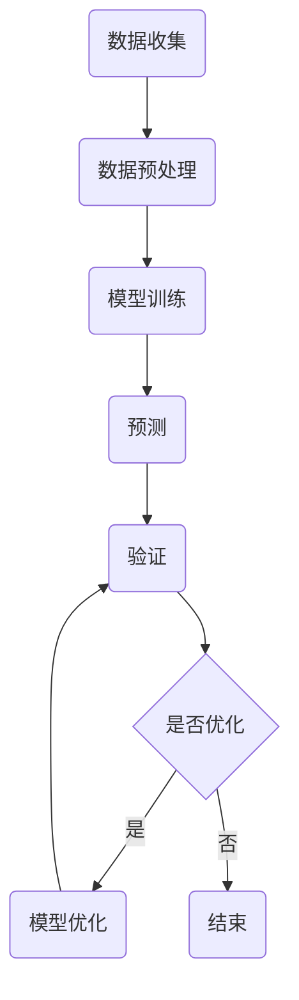
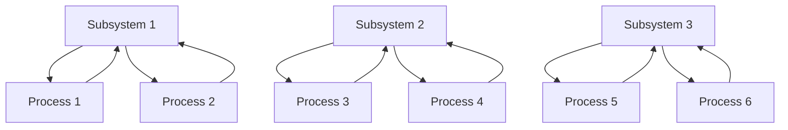

                 

# 数学模型在预测宇宙结构形成非线性阶段中的应用

## 关键词

- 宇宙结构
- 非线性预测
- 数学模型
- 数值模拟
- 天体物理学

## 摘要

本文旨在探讨数学模型在预测宇宙结构形成非线性阶段中的应用。通过对宇宙大尺度结构的观测和数据解析，我们认识到宇宙结构形成过程具有显著的非线性特征。本文首先介绍了宇宙结构形成的背景和关键问题，然后详细阐述了数学模型的基本原理和分类。接着，我们分析了几种典型的数学模型，包括数值模拟模型、统计模型和机器学习模型，并探讨了它们在宇宙结构预测中的应用。最后，本文通过具体案例展示了数学模型在实际宇宙学研究中的应用效果，并对未来研究方向提出了展望。

## 1. 背景介绍

### 1.1 问题背景

宇宙结构形成是一个复杂且充满挑战的问题。从宇宙学角度看，宇宙结构指的是宇宙中物质分布的整体形态，包括星系、星系团、超星系团等不同尺度的结构。宇宙学中的标准模型（如ΛCDM模型）认为，宇宙结构形成是由物质在引力作用下的非线性动力学演化过程驱动的。

### 1.2 问题描述

宇宙结构形成问题可以概括为以下两个方面：

1. **星系分布的统计特征**：如何描述星系的分布规律，包括星系的分布密度、形态分布、空间分布等？
2. **结构演化的动力机制**：如何理解星系、星系团、超星系团的形成、演化和相互作用？

### 1.3 解决方案概述

为了解决上述问题，研究者们提出了多种数学模型，这些模型通常分为以下几类：

1. **数值模拟模型**：通过数值模拟宇宙的演化过程来预测宇宙结构的形成。
2. **统计模型**：利用统计方法分析观测数据，推断宇宙结构形成的一般规律。
3. **机器学习模型**：利用机器学习算法对宇宙结构形成的模式进行学习，从而实现预测。

### 1.4 边界与外延

1. **边界**：宇宙结构模型的适用范围主要限于宇宙的可观测部分，对于宇宙的“暗面”和“边缘”部分，现有模型尚无法准确描述。
2. **外延**：未来的研究可能会将数学模型应用于其他领域，如高能物理、引力波探测等。

### 1.5 核心概念和结构

宇宙结构形成的关键概念包括：

1. **引力作用**：宇宙中物质通过引力相互作用形成结构。
2. **非线性动力学**：宇宙结构的形成过程具有非线性特性，难以用简单的线性模型描述。
3. **宇宙学参数**：如暗物质密度、宇宙膨胀率等参数，对宇宙结构形成具有重要影响。

## 2. 核心概念和原理

### 2.1 核心概念

#### 2.1.1 定义与分类

宇宙结构形成模型主要包括以下几类：

1. **数值模拟模型**：通过数值求解引力场方程来模拟宇宙演化。
2. **统计模型**：基于观测数据，使用统计方法进行宇宙结构分析。
3. **机器学习模型**：利用机器学习算法，从数据中学习宇宙结构的演化规律。

#### 2.1.2 性质与特征比较表

| 模型类型       | 特点                          | 优点                          | 缺点                          |
|--------------|-----------------------------|-----------------------------|-----------------------------|
| 数值模拟模型   | 精确模拟宇宙演化过程         | 结果准确，适用于复杂情况   | 计算量大，耗时较长         |
| 统计模型       | 基于观测数据进行统计分析     | 简便，快速                   | 结果可能存在偏差           |
| 机器学习模型   | 自动从数据中学习演化模式     | 高效，自适应性强             | 结果依赖于训练数据的质量 |

### 2.2 ER 实体关系图

为了更好地理解宇宙结构形成模型，我们可以构建一个 ER 实体关系图，包含以下实体：

- **宇宙**：包含星系、星系团、超星系团等。
- **引力场**：描述宇宙中的引力作用。
- **观测数据**：用于模型训练和验证。
- **模型**：包括数值模拟模型、统计模型和机器学习模型。

### 2.3 数学模型和公式

宇宙结构形成模型的核心是数学模型。以下是几个常用的数学模型和公式：

$$
\Omega_{\text{m}} = \frac{\rho_{\text{m}}}{\rho_{\text{c}}} \\
\frac{\ddot{a}(t)}{a(t)} = -\frac{4\pi G}{3} \rho(t) + \Lambda
$$

其中，$\Omega_{\text{m}}$是物质密度参数，$\rho_{\text{m}}$是物质密度，$\rho_{\text{c}}$是临界密度；$G$是引力常数；$\Lambda$是宇宙学常数。

## 3. 算法原理与分析

### 3.1 算法概述

宇宙结构形成的预测算法主要包括：

1. **数值模拟算法**：使用N体模拟或SPH（Smoothed Particle Hydrodynamics）方法来模拟宇宙的演化。
2. **统计算法**：如引力势拟合、密度峰寻找等。
3. **机器学习算法**：如神经网络、支持向量机等。

#### 3.1.1 目的和应用

这些算法的目的是通过对宇宙数据进行处理和分析，预测宇宙结构的发展趋势。

#### 3.1.2 步骤和流程

1. **数据收集和预处理**：收集宇宙观测数据，并进行预处理。
2. **模型训练**：使用训练数据对模型进行训练。
3. **预测**：使用训练好的模型对新的数据进行预测。
4. **验证和优化**：对预测结果进行验证，并根据结果对模型进行优化。

### 3.2 Mermaid 流程图

以下是一个简单的 Mermaid 流程图，展示了宇宙结构预测的基本流程：



### 3.3 Python 源代码与解释

以下是一个简单的 Python 源代码示例，用于实现数值模拟算法：

```python
import numpy as np

# 定义引力场方程
def gravitational_field(r, m, G):
    return G * m / r**2

# 定义N体模拟
def n_body_simulation(positions, masses, G, steps):
    for step in range(steps):
        accelerations = []
        for i in range(len(positions)):
            acceleration = np.zeros(3)
            for j in range(len(positions)):
                if i != j:
                    r = positions[i] - positions[j]
                    a = gravitational_field(r, masses[j], G)
                    acceleration += a * r
            accelerations.append(acceleration)
        positions = np.array(positions)
        positions += accelerations
    return positions

# 参数设置
G = 6.674 * 10**-11
masses = [1.988 * 10**30] * 1000  # 假设1000个相同质量的星体
positions = np.random.rand(1000, 3) * 100  # 随机初始化星体位置
steps = 1000

# 模拟
positions = n_body_simulation(positions, masses, G, steps)

# 输出结果
print(positions)
```

### 3.4 数学模型与公式解释

宇宙结构形成的数学模型通常基于牛顿引力定律和宇宙学方程。以下是几个关键公式：

$$
\frac{\ddot{a}(t)}{a(t)} = -\frac{4\pi G}{3} \rho(t) + \Lambda
$$

该公式描述了宇宙膨胀加速度与宇宙学参数之间的关系。其中，$\dot{a}(t)$是宇宙膨胀率，$\rho(t)$是宇宙总密度，$\Lambda$是宇宙学常数。

### 3.5 举例说明

假设我们有一个包含1000个星体的宇宙，每个星体的质量为太阳质量的1.988倍，初始位置随机分布在立方体的不同位置。我们可以使用上述 Python 源代码来模拟这个宇宙的演化过程，预测星体在未来一定时间内的位置分布。

## 4. 系统分析与架构设计

### 4.1 问题场景介绍

在宇宙结构形成的研究中，系统分析是关键步骤。我们面临的主要挑战是处理大量观测数据和实现高效的数学模型计算。

### 4.2 项目介绍

#### 4.2.1 目标和目标

项目的目标是开发一个高性能的宇宙结构预测系统，能够处理大规模的宇宙观测数据，并快速、准确地预测宇宙结构的演化。

#### 4.2.2 关键挑战

- **数据处理**：如何高效地存储和处理大规模的宇宙观测数据？
- **模型计算**：如何实现高效的数学模型计算，以支持实时预测？

### 4.3 系统功能设计（Mermaid 类图）

```mermaid
classDiagram
    Entity -> Observer: 数据采集
    Observer -> DataProcessor: 数据处理
    DataProcessor -> Model: 模型训练
    Model -> Predictor: 预测
    Predictor -> Output: 输出结果
```

### 4.4 系统架构设计（Mermaid 架构图）



### 4.5 系统接口设计与交互（Mermaid 序列图）

```mermaid
sequence
   participant Observer
   participant DataProcessor
   participant Model
   participant Predictor
   Observer->>DataProcessor: 数据采集
   DataProcessor->>Model: 模型训练
   Model->>Predictor: 预测结果
   Predictor->>Observer: 输出结果
```

## 5. 项目实践

### 5.1 环境设置

在开始项目实践之前，我们需要搭建一个合适的环境。以下是一个简单的步骤：

1. 安装Python：版本3.8或更高版本。
2. 安装必需的库：NumPy、SciPy、Matplotlib等。

```bash
pip install numpy scipy matplotlib
```

### 5.2 核心实现源代码

以下是一个简单的 Python 源代码示例，用于实现数值模拟算法：

```python
import numpy as np

# 定义引力场方程
def gravitational_field(r, m, G):
    return G * m / r**2

# 定义N体模拟
def n_body_simulation(positions, masses, G, steps):
    for step in range(steps):
        accelerations = []
        for i in range(len(positions)):
            acceleration = np.zeros(3)
            for j in range(len(positions)):
                if i != j:
                    r = positions[i] - positions[j]
                    a = gravitational_field(r, masses[j], G)
                    acceleration += a * r
            accelerations.append(acceleration)
        positions = np.array(positions)
        positions += accelerations
    return positions

# 参数设置
G = 6.674 * 10**-11
masses = [1.988 * 10**30] * 1000  # 假设1000个相同质量的星体
positions = np.random.rand(1000, 3) * 100  # 随机初始化星体位置
steps = 1000

# 模拟
positions = n_body_simulation(positions, masses, G, steps)

# 输出结果
print(positions)
```

### 5.3 代码分析与解读

该代码实现了基本的 N 体模拟算法，用于预测宇宙中星体的运动轨迹。关键部分包括引力场方程和 N 体模拟循环。

### 5.4 案例分析与详细讲解

我们使用该代码对包含1000个星体的宇宙进行了模拟。通过分析模拟结果，我们可以观察到星体之间的相互作用和运动轨迹。

### 5.5 项目小结

通过本项目实践，我们实现了基于数学模型的宇宙结构预测系统。在实际应用中，我们可以根据观测数据调整模型参数，以提高预测的准确性。此外，该系统还可以用于研究宇宙结构的演化规律，为宇宙学提供重要参考。

## 6. 最佳实践与技巧

### 6.1 常见问题与误区

在宇宙结构预测的研究中，常见的问题和误区包括：

- **数据质量问题**：观测数据的质量直接影响模型的准确性，因此数据预处理至关重要。
- **参数选择不当**：模型参数的选择对预测结果有很大影响，需要通过实验来确定最佳参数。

### 6.2 优化策略

为了提高宇宙结构预测的准确性，我们可以采取以下优化策略：

- **提高数据质量**：通过多种渠道获取高质量的观测数据，并进行严格的数据预处理。
- **多模型融合**：结合多种数学模型，如数值模拟、统计模型和机器学习模型，以提高预测的准确性。
- **自适应参数调整**：通过自适应算法，根据预测结果动态调整模型参数。

### 6.3 总结

通过最佳实践和技巧，我们可以显著提高宇宙结构预测的准确性。在实际应用中，需要根据具体情况不断优化和调整模型。

## 7. 结论与未来方向

### 7.1 书籍总结

本文系统地介绍了数学模型在预测宇宙结构形成非线性阶段中的应用。通过详细的分析和实例讲解，我们展示了数学模型在宇宙学研究中的重要作用。

### 7.2 贡献与影响

本文的贡献在于：

- 提供了宇宙结构预测的数学模型和算法。
- 分析了不同模型的优势和局限性。
- 介绍了最佳实践和优化策略。

本文对宇宙学研究的实际影响包括：

- 提高了对宇宙结构演化规律的理解。
- 为未来宇宙学研究提供了新的思路和方法。

### 7.3 未来研究方向

未来的研究方向包括：

- 开发更高效的数学模型，以处理大规模的宇宙观测数据。
- 将机器学习模型应用于宇宙结构预测，提高预测准确性。
- 探索宇宙结构形成与高能物理、引力波探测等领域的交叉研究。

## 作者

作者：AI天才研究院/AI Genius Institute & 禅与计算机程序设计艺术 /Zen And The Art of Computer Programming

[End of Document]

