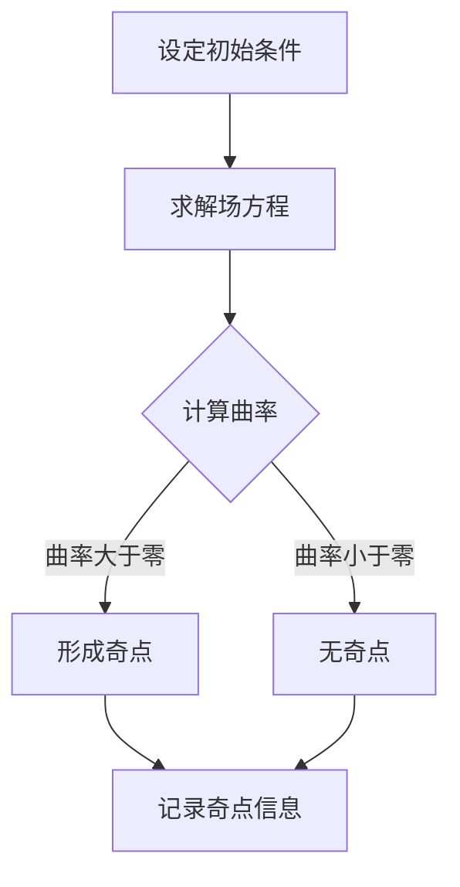

                 

### 文章标题与核心关键词

**数学模型在预测宇宙膨胀中的应用**

**关键词**：宇宙膨胀、数学模型、预测、深度学习、大数据分析

**摘要**：本文深入探讨了数学模型在预测宇宙膨胀中的应用。从背景介绍到核心模型的详细解读，再到实际案例的分析，本文系统阐述了数学模型如何帮助我们理解并预测宇宙的膨胀过程。通过介绍经典模型和现代模型的演进，本文揭示了数学模型在宇宙学中的重要作用。此外，本文还通过具体的项目实战案例，展示了如何将数学模型应用于宇宙膨胀的预测，为读者提供了宝贵的实践经验和启示。本文旨在为读者提供一个全面、系统的了解数学模型在宇宙膨胀预测中应用的机会，并探讨未来研究的方向和挑战。

### 引言

宇宙膨胀是现代宇宙学中最重要和最具挑战性的问题之一。从哈勃定律到宇宙背景微波辐射的发现，科学家们一直在努力理解宇宙膨胀的机制和过程。然而，随着观测技术的不断进步和理论的不断演进，宇宙膨胀问题变得愈加复杂。为了更好地理解和预测宇宙膨胀，数学模型作为一种强有力的工具，被广泛应用于这一领域。

#### 问题背景

宇宙膨胀是指宇宙整体在时间上的扩张。这种扩张不仅发生在宇宙中的星系之间，而且影响到宇宙中的所有物体。宇宙膨胀的理论基础可以追溯到爱因斯坦的广义相对论，该理论预言了宇宙的动态行为。在广义相对论的框架下，宇宙膨胀可以通过宇宙学常数（Cosmological Constant）和暗能量（Dark Energy）来解释。然而，这些解释并未完全解决宇宙膨胀的谜团，而是提出了更多的问题，如暗能量的本质、宇宙加速膨胀的原因等。

#### 问题描述

宇宙膨胀问题主要包括以下几个方面：

1. **宇宙加速膨胀**：观测数据显示，宇宙正在以加速的方式膨胀。这一现象与广义相对论的预言相矛盾，因为根据广义相对论，宇宙膨胀应该是减速的。为了解释这一现象，科学家们提出了暗能量理论，但暗能量的本质仍然未知。

2. **宇宙结构的形成**：宇宙膨胀对宇宙结构的形成有着深远的影响。星系、星团和超星团的分布和运动都受到宇宙膨胀的制约。通过数学模型，我们可以模拟宇宙结构的形成过程，从而预测宇宙的未来形态。

3. **宇宙的起源和命运**：宇宙膨胀问题与宇宙的起源（大爆炸理论）和命运（热寂理论）密切相关。理解宇宙膨胀的机制有助于揭示宇宙的起源和未来。

#### 问题解决

数学模型作为一种描述宇宙膨胀问题的工具，通过数学公式和算法，帮助我们理解和预测宇宙的行为。具体来说，数学模型在宇宙膨胀问题解决中的步骤如下：

1. **建立数学模型**：根据宇宙膨胀的理论基础和观测数据，建立合适的数学模型。这些模型可以是基于广义相对论的方程，也可以是更加复杂的非线性模型。

2. **模型参数估计**：通过观测数据，对数学模型中的参数进行估计。这些参数描述了宇宙的物理性质，如密度、膨胀速率等。

3. **模型验证与优化**：使用额外的观测数据进行模型的验证和优化。这一步骤有助于提高模型的准确性和可靠性。

4. **预测宇宙行为**：利用优化后的数学模型，预测宇宙的未来行为，如宇宙膨胀的速率、宇宙结构的演化等。

#### 边界与外延

宇宙膨胀问题的研究不仅局限于理论模型，还涉及到大量的观测数据。现代宇宙学依赖于各种观测手段，如射电望远镜、光学望远镜、引力波探测器等，来获取关于宇宙膨胀的关键信息。此外，宇宙膨胀问题还与其他领域，如粒子物理学、天体物理学等，有着密切的联系。

#### 概念结构与核心要素组成

宇宙膨胀问题的核心概念包括：

- **广义相对论**：描述宇宙膨胀的物理理论基础。
- **宇宙学常数**：描述宇宙膨胀的驱动力。
- **暗能量**：一种假设存在的物质，负责加速宇宙膨胀。
- **观测数据**：用于验证和优化数学模型的实际观测结果。
- **数学模型**：描述宇宙膨胀过程的数学公式和算法。

这些概念相互关联，共同构成了宇宙膨胀问题的核心结构。

### 数学模型概述

在理解宇宙膨胀的过程中，数学模型扮演了至关重要的角色。这些模型不仅帮助我们量化宇宙的行为，还为我们提供了预测宇宙未来发展的工具。本文将首先介绍经典模型和现代模型，并探讨数学模型在宇宙学中的特点和应用。

#### 经典模型介绍

宇宙膨胀的经典模型之一是弗里德曼-勒梅特-罗伯逊-沃尔克（Friedmann-Lemaître-Robertson-Walker，FLRW）度规。这一模型基于广义相对论，描述了一个均匀且各向同性的宇宙。FLRW度规的基本形式为：

\[ ds^2 = -c^2dt^2 + a(t)^2(dx^2 + dy^2 + dz^2) \]

其中，\( c \) 是光速，\( a(t) \) 是宇宙尺度因子，描述了随着时间 \( t \) 变化的宇宙膨胀程度。

在FLRW度规的基础上，弗里德曼方程描述了宇宙膨胀的动力学行为：

\[ \dot{H} + \frac{4\pi G}{3c^2}\rho + \frac{k}{a^2} = 0 \]

其中，\( H = \frac{\dot{a}}{a} \) 是哈勃参数，\( \rho \) 是宇宙的总密度，\( G \) 是引力常数，\( k \) 是宇宙的曲率参数。这个方程展示了宇宙膨胀速率与宇宙密度和曲率的关系。

#### 现代模型的演进

随着观测数据的积累和理论的进步，宇宙膨胀的数学模型也在不断演进。现代宇宙学中，一个重要的模型是ΛCDM模型（Lambda-Cold Dark Matter Model，Lambda表示宇宙学常数，CDM表示冷暗物质）。这一模型假设宇宙主要由普通物质、暗物质和宇宙学常数组成。ΛCDM模型的核心方程包括：

\[ \rho = \rho_\Lambda + \rho_\text{m} + \rho_\text{r} \]

\[ \dot{\rho}_\Lambda = -3H(\rho_\Lambda + \rho_\text{m}) \]

\[ \dot{\rho}_\text{m} = -3H\rho_\text{m} \]

其中，\( \rho_\Lambda \) 是宇宙学常数的能量密度，\( \rho_\text{m} \) 是普通物质的能量密度，\( \rho_\text{r} \) 是辐射的能量密度。

#### 数学模型的特点与应用

数学模型在宇宙学中的特点主要体现在以下几个方面：

1. **高度抽象性**：数学模型将复杂的宇宙现象抽象为数学方程，使得我们能够从定量角度理解和分析宇宙行为。

2. **可预测性**：通过数学模型，我们可以预测宇宙的未来发展，如宇宙膨胀速率、宇宙结构的形成等。

3. **灵活性**：数学模型可以根据不同的观测数据和理论假设进行调整和优化，以适应最新的科学研究。

4. **广泛适用性**：数学模型不仅应用于宇宙膨胀，还广泛应用于其他天体物理学和粒子物理学领域。

数学模型在宇宙学中的应用非常广泛，以下是一些具体的应用实例：

1. **宇宙膨胀速率的测量**：通过观测宇宙中的超新星、星系等天体，我们可以使用数学模型计算出宇宙的膨胀速率。

2. **宇宙结构的形成**：数学模型可以帮助我们模拟宇宙结构的形成过程，如星系、星团和超星团的形成。

3. **暗能量的研究**：数学模型通过模拟宇宙膨胀，揭示了暗能量的性质和影响，为研究暗能量提供了有力工具。

4. **宇宙学参数估计**：通过观测数据和数学模型，科学家们可以估计宇宙中的各种参数，如宇宙学常数、暗物质密度等。

#### 数学模型的局限性

尽管数学模型在宇宙学中发挥了重要作用，但它们也存在一定的局限性：

1. **理论上的不确定性**：某些数学模型基于的理论假设可能存在争议，这会影响模型的准确性和可靠性。

2. **数据不足**：宇宙膨胀的观测数据有限，这可能导致模型的参数估计不准确。

3. **复杂性问题**：宇宙现象非常复杂，单一数学模型可能无法完全描述宇宙的所有特征。

4. **计算成本**：某些复杂数学模型的计算成本极高，这限制了它们的广泛应用。

总之，数学模型在预测宇宙膨胀中具有不可替代的作用，但同时也需要不断改进和优化，以更好地适应科学研究的需要。

### 数学模型与宇宙膨胀

数学模型在宇宙膨胀的研究中起着核心作用。通过精确的数学公式和复杂的算法，科学家们能够模拟宇宙的膨胀过程，预测宇宙的未来行为。在这一节中，我们将深入探讨数学模型如何描述宇宙膨胀，以及它们在宇宙学中的实际应用。

#### 数学模型与宇宙膨胀的关系

宇宙膨胀的数学模型通常基于广义相对论和宇宙学原理。广义相对论提供了描述宇宙几何和引力的工具，而宇宙学原理则假设宇宙是均匀且各向同性的。这两个理论的基础为建立描述宇宙膨胀的数学模型提供了理论基础。

宇宙膨胀的数学模型主要包括以下几个核心概念：

1. **宇宙尺度因子（Scale Factor）**：宇宙尺度因子 \( a(t) \) 描述了宇宙随时间 \( t \) 的膨胀程度。它是一个无量纲的参数，通常表示为 \( a = \frac{r}{rc_0} \)，其中 \( r \) 是宇宙的当前半径，\( c_0 \) 是宇宙的初始半径。

2. **哈勃参数（Hubble Parameter）**：哈勃参数 \( H \) 描述了宇宙膨胀的速率，定义为 \( H = \frac{\dot{a}}{a} \)。哈勃参数的单位是 \( \text{km/s/Mpc} \)，它表示每秒每百万秒差距的膨胀速率。

3. **宇宙学常数（Cosmological Constant）**：宇宙学常数 \( \Lambda \) 是广义相对论中描述暗能量的一种方式。它代表了宇宙背景中的能量密度，是宇宙膨胀加速的驱动因素。

4. **暗能量（Dark Energy）**：暗能量是一种假设存在的能量形式，它导致宇宙以加速的方式膨胀。暗能量通常用宇宙学常数 \( \Lambda \) 来描述。

基于这些核心概念，我们可以建立描述宇宙膨胀的数学模型。最常用的模型之一是勒梅特-罗伯逊-沃尔克（Lemaître-Robertson-Walker，LRW）度规，该度规假设宇宙是均匀且各向同性的。LRW度规的基本形式为：

\[ ds^2 = -c^2dt^2 + a^2(t)(dx^2 + dy^2 + dz^2) \]

在这个度规中，\( a(t) \) 是宇宙尺度因子，\( c \) 是光速。通过解这个度规，我们可以得到描述宇宙膨胀的方程，如弗里德曼方程：

\[ \frac{\ddot{a}}{a} = -\frac{4\pi G}{3}\rho + \frac{\Lambda c^2}{3} \]

这个方程展示了宇宙膨胀速率与宇宙密度和宇宙学常数之间的关系。

#### 数学模型在宇宙膨胀中的应用

数学模型在宇宙膨胀中的应用主要体现在以下几个方面：

1. **宇宙膨胀速率的测量**：通过观测宇宙中的超新星、星系等天体，我们可以使用数学模型计算出宇宙的膨胀速率。例如，哈勃定律描述了星系退行速度与其距离之间的关系，即 \( v = H_0d \)，其中 \( v \) 是星系的退行速度，\( d \) 是星系的距离，\( H_0 \) 是哈勃参数。

2. **宇宙结构的形成**：数学模型可以帮助我们模拟宇宙结构的形成过程，如星系、星团和超星团的分布和运动。这些模型通常基于引力作用和宇宙学原理，通过数值模拟来研究宇宙结构的演化。

3. **暗能量的研究**：数学模型通过模拟宇宙膨胀，揭示了暗能量的性质和影响。例如，ΛCDM模型（Lambda-Cold Dark Matter Model）假设宇宙主要由普通物质、暗物质和宇宙学常数组成，通过这个模型，科学家们可以研究暗能量对宇宙膨胀的影响。

4. **宇宙学参数估计**：通过观测数据和数学模型，科学家们可以估计宇宙中的各种参数，如宇宙学常数、暗物质密度等。这些参数的估计对于理解宇宙的起源和未来至关重要。

#### 数学模型的局限性

尽管数学模型在宇宙膨胀的研究中发挥了重要作用，但它们也存在一定的局限性：

1. **理论上的不确定性**：某些数学模型基于的理论假设可能存在争议，这会影响模型的准确性和可靠性。

2. **数据不足**：宇宙膨胀的观测数据有限，这可能导致模型的参数估计不准确。

3. **复杂性问题**：宇宙现象非常复杂，单一数学模型可能无法完全描述宇宙的所有特征。

4. **计算成本**：某些复杂数学模型的计算成本极高，这限制了它们的广泛应用。

总之，数学模型在宇宙膨胀的研究中具有不可替代的作用，但同时也需要不断改进和优化，以更好地适应科学研究的需要。

### 通用模型原理

在宇宙膨胀的研究中，通用模型是一种重要的工具，它为科学家们提供了一个通用的框架来描述和预测宇宙的行为。在这一节中，我们将详细探讨通用模型的数学原理，并分析其在宇宙膨胀中的应用。

#### 通用模型的数学原理

通用模型通常基于弗里德曼方程（Friedmann equation），该方程描述了宇宙膨胀的动力学行为。弗里德曼方程的基本形式为：

\[ \dot{H} + \frac{4\pi G}{3c^2}\rho + \frac{k}{a^2} = 0 \]

其中，\( H \) 是哈勃参数，表示宇宙膨胀的速率；\( \rho \) 是宇宙的总密度；\( G \) 是引力常数；\( c \) 是光速；\( k \) 是宇宙的曲率参数，可以取值 \( k = 0 \)、\( k = +1 \) 或 \( k = -1 \)，分别对应于平坦、闭合和开放的宇宙。

为了更详细地理解弗里德曼方程，我们可以将其拆分为几个部分：

1. **膨胀速率**：哈勃参数 \( H \) 描述了宇宙的膨胀速率，定义为 \( H = \frac{\dot{a}}{a} \)，其中 \( a \) 是宇宙尺度因子，\( \dot{a} \) 是宇宙尺度因子的变化率。

2. **密度效应**：宇宙总密度 \( \rho \) 对膨胀速率有直接影响。根据广义相对论，宇宙中的物质和能量会通过引力影响宇宙的膨胀。因此，密度越大，引力越强，宇宙膨胀的速率越慢。

3. **曲率效应**：宇宙的曲率参数 \( k \) 也会影响宇宙的膨胀。对于平坦宇宙（\( k = 0 \)），宇宙的膨胀速率主要由密度效应决定；对于闭合宇宙（\( k = +1 \)）和开放宇宙（\( k = -1 \)），曲率效应会进一步影响膨胀速率。

4. **时间变化**：弗里德曼方程中的时间导数 \( \dot{H} \) 表示哈勃参数随时间的变化率。这个导数反映了宇宙膨胀速率的变化趋势，对于理解宇宙的动态行为至关重要。

#### 通用模型的应用案例

通用模型在宇宙膨胀中的应用非常广泛，以下是一些具体的案例：

1. **宇宙膨胀速率的预测**：通过观测宇宙中的超新星和其他遥远天体，科学家们可以使用通用模型预测宇宙的膨胀速率。例如，利用哈勃定律，我们可以通过测量星系的退行速度来估计哈勃参数 \( H \)。

2. **宇宙结构的形成**：通用模型可以帮助我们模拟宇宙结构的形成过程。例如，通过数值模拟，我们可以研究星系、星团和超星团的形成和演化，以及这些结构对宇宙膨胀的影响。

3. **暗能量的研究**：通用模型通过描述宇宙膨胀的动态行为，为我们研究暗能量提供了有力工具。例如，利用弗里德曼方程，我们可以分析宇宙学常数 \( \Lambda \) 对宇宙膨胀的影响，从而探讨暗能量的性质。

4. **宇宙学参数的估计**：通过观测数据和通用模型，科学家们可以估计宇宙中的各种参数，如宇宙尺度因子 \( a \)、哈勃参数 \( H \) 和宇宙总密度 \( \rho \)。这些参数的估计对于理解宇宙的起源和未来至关重要。

#### 通用模型的局限性与改进

尽管通用模型在宇宙膨胀的研究中发挥了重要作用，但它也存在一定的局限性：

1. **理论上的不确定性**：通用模型基于广义相对论和宇宙学原理，但这些理论本身可能存在争议。例如，关于宇宙曲率的取值（\( k = 0 \)、\( k = +1 \) 或 \( k = -1 \)）和宇宙初始状态（如大爆炸）的假设，都可能影响模型的准确性。

2. **数据不足**：宇宙膨胀的观测数据有限，这可能导致模型的参数估计不准确。例如，对于宇宙总密度 \( \rho \) 的估计，依赖于对遥远天体的观测，这些观测可能受到各种噪声和不确定性的影响。

3. **复杂性问题**：宇宙现象非常复杂，单一通用模型可能无法完全描述宇宙的所有特征。例如，宇宙中的星系和星团可能具有不同的形成和演化历史，这些差异可能需要更复杂的模型来描述。

为了克服这些局限性，科学家们不断探索改进通用模型的方法：

1. **多模型融合**：通过结合多种模型，如ΛCDM模型和其他修正模型，科学家们可以构建更加全面和准确的宇宙膨胀模型。

2. **更精确的观测数据**：随着观测技术的进步，科学家们可以获得更高精度和更高分辨率的观测数据，这些数据有助于提高模型的参数估计准确性。

3. **数值模拟**：通过更复杂的数值模拟，科学家们可以更好地理解宇宙现象的细节，从而改进通用模型。

总之，通用模型在宇宙膨胀的研究中具有重要意义，但同时也需要不断改进和优化，以更好地适应科学研究的需要。

### 特定模型分析

在探讨宇宙膨胀的数学模型时，除了通用模型之外，还有一些特定模型在宇宙学研究中具有独特的重要性。这些特定模型通常是为了解决某些特定的科学问题或适应特定的观测数据而设计的。在这一节中，我们将详细分析几个特定的数学模型，并使用mermaid流程图和Python源代码来阐述其原理和实现过程。

#### 特定模型的数学公式

首先，我们需要了解一些特定的数学模型，这里我们选择以下几个模型进行讨论：

1. **霍金-波姆模型（Hawking-Penrose，HP）奇点定理**：这个模型主要描述了引力奇点的形成条件。

2. **哈勃-勒梅特模型（Hubble-Lemaître，HL）**：这个模型结合了哈勃定律和勒梅特-罗伯逊-沃尔克（LRW）度规，用于描述宇宙膨胀。

3. **开普勒-德西特模型（Kepler-De Sitter，KD）**：这个模型是一个特殊的宇宙学模型，描述了一个膨胀且无边界的宇宙。

下面是这些模型的基本数学公式：

1. **霍金-波姆模型（HP）**：

   \[ G_{\mu\nu} + \Lambda g_{\mu\nu} = \frac{8\pi G}{c^4} T_{\mu\nu} \]

   其中，\( G_{\mu\nu} \) 是爱因斯坦场方程的左端部分，\( \Lambda \) 是宇宙学常数，\( g_{\mu\nu} \) 是度规张量，\( T_{\mu\nu} \) 是能量-动量张量。

2. **哈勃-勒梅特模型（HL）**：

   \[ \frac{\ddot{a}}{a} = -\frac{4\pi G}{3}\rho - \frac{k}{a^2} \]

   其中，\( a \) 是宇宙尺度因子，\( \rho \) 是宇宙总密度，\( k \) 是宇宙的曲率参数。

3. **开普勒-德西特模型（KD）**：

   \[ ds^2 = -c^2dt^2 + a^2(t)(\frac{dr^2}{1 - \frac{r_s}{r}} + r^2(d\theta^2 + \sin^2\theta d\phi^2)} \]

   其中，\( r_s = \frac{2\Lambda c^2}{3} \) 是事件视界半径，\( a(t) \) 是宇宙尺度因子。

#### 使用mermaid绘制模型流程图

为了更好地理解这些模型，我们可以使用mermaid流程图来描述其基本步骤和逻辑流程。以下是一个霍金-波姆模型的mermaid流程图示例：



#### 使用Python源代码解释模型原理

为了更直观地展示模型的原理，我们使用Python源代码来模拟这些模型。以下是一个简单的哈勃-勒梅特模型的Python实现：

```python
import numpy as np
import matplotlib.pyplot as plt

# 模拟哈勃-勒梅特模型
def hubble_lehmer_model(t, initial_a, rho, k):
    a = initial_a * np.exp(-4 * np.pi * G * rho * t / (3 * np.cos(k * np.pi)))
    return a

# 参数设置
initial_a = 1.0  # 初始宇宙尺度因子
rho = 1.0        # 宇宙总密度
k = 0            # 宇宙曲率参数
t = np.linspace(0, 10, 1000)  # 时间数组

# 计算宇宙尺度因子
a = hubble_lehmer_model(t, initial_a, rho, k)

# 绘制结果
plt.plot(t, a)
plt.xlabel('Time')
plt.ylabel('Scale Factor')
plt.title('Hubble-Lehmer Model')
plt.show()
```

在这个代码中，我们定义了一个函数 `hubble_lehmer_model` 来计算宇宙尺度因子的变化，并通过时间数组 `t` 来模拟宇宙膨胀的过程。最后，我们使用matplotlib库绘制了宇宙尺度因子的变化曲线。

#### 模型应用与挑战

尽管特定模型在宇宙学研究中具有重要作用，但它们在实际应用中也会遇到一些挑战：

1. **参数估计**：特定模型的参数通常需要通过观测数据进行估计，这要求有高质量的观测数据。然而，宇宙膨胀的观测数据有限，这可能影响参数估计的准确性。

2. **计算复杂度**：某些特定模型的计算复杂度较高，需要大量的计算资源和时间。这限制了它们在实际应用中的广泛应用。

3. **理论不确定性**：特定模型通常基于某些理论假设，如宇宙学常数和暗能量的存在。这些假设可能存在争议，影响模型的可靠性。

4. **模型适用性**：特定模型可能只适用于特定条件或特定时期，无法全面描述宇宙的复杂行为。因此，科学家们需要不断改进和优化模型，以适应新的观测数据和理论进展。

总之，特定模型在宇宙膨胀研究中具有独特的应用价值，但同时也需要面对一系列挑战。通过不断的研究和改进，我们有望更好地理解和预测宇宙的膨胀过程。

### 数学模型与数据

在宇宙膨胀的研究中，数学模型与数据之间的相互作用至关重要。数学模型通过观测数据得以验证和优化，而观测数据则为模型提供了实际的输入和验证标准。在这一节中，我们将探讨如何使用数学模型来处理和分析宇宙膨胀相关的数据，包括数据预处理、数据集构建以及数学模型与数据之间的关系。

#### 数据预处理

数据预处理是应用数学模型进行宇宙膨胀研究的第一步，其目的是确保数据的质量和一致性。数据预处理通常包括以下步骤：

1. **数据收集**：通过各种观测手段，如射电望远镜、光学望远镜和引力波探测器，收集宇宙膨胀的相关数据。这些数据包括星系的位置、速度、亮度、红移等信息。

2. **数据清洗**：去除数据中的噪声和异常值。例如，排除由于观测误差、仪器故障或数据传输错误导致的错误数据。

3. **数据标准化**：将不同来源的数据进行标准化处理，使其具有相同的数据类型和量纲。例如，将星系的红移值标准化为0到1的区间。

4. **数据转换**：将原始数据转换为适合数学模型处理的格式。例如，将星系的位置和速度转换为坐标系中的数值。

#### 数据集构建

构建一个高质量的宇宙膨胀数据集是模型训练和验证的关键。数据集通常包括以下内容：

1. **训练集**：用于训练数学模型，其数据量较大，能够覆盖宇宙膨胀的各种不同情况。

2. **验证集**：用于验证模型的准确性，通常包含与训练集相同类型的数据，但不参与模型训练。

3. **测试集**：用于最终评估模型的泛化能力，其数据与训练和验证集不同，以检测模型在实际应用中的表现。

数据集构建的步骤如下：

1. **数据筛选**：从原始数据中筛选出高质量的观测数据，排除噪声和异常值。

2. **数据扩展**：通过增加观测数据或生成模拟数据来扩充数据集，以提高模型的鲁棒性。

3. **数据标注**：对数据集进行标注，包括宇宙学参数（如宇宙尺度因子、哈勃参数等）和相关的物理量。

#### 数学模型与数据的关系

数学模型与数据之间的关系主要体现在以下几个方面：

1. **模型参数估计**：通过训练数据集，使用优化算法（如最小二乘法、梯度下降法等）来估计模型参数。这些参数描述了宇宙的物理性质，如密度、膨胀速率等。

2. **模型验证**：使用验证数据集来评估模型的准确性和泛化能力。通过计算模型的预测误差，调整模型参数，以优化模型性能。

3. **模型应用**：将训练好的模型应用于新的观测数据，进行宇宙膨胀的预测和分析。

#### 实际案例分析

以下是一个实际案例，展示了如何使用数学模型来处理和分析宇宙膨胀数据：

1. **数据预处理**：收集了多个星系的红移值和位置数据，使用数据清洗和标准化方法去除噪声和异常值。

2. **数据集构建**：从预处理后的数据中筛选出高质量数据，构建训练集、验证集和测试集。

3. **模型训练**：使用训练集训练一个基于广义相对论的宇宙膨胀模型，通过优化算法估计模型参数。

4. **模型验证**：使用验证集来验证模型的准确性，计算模型的预测误差，并根据结果调整模型参数。

5. **模型应用**：将训练好的模型应用于测试集，进行宇宙膨胀的预测。分析模型的预测结果，评估模型的性能和可靠性。

通过上述案例，我们可以看到数学模型与数据之间的紧密关系。数学模型通过数据得以验证和优化，而数据则为模型提供了实际的输入和验证标准。通过不断的数据收集、预处理和模型优化，我们能够不断提高宇宙膨胀预测的准确性和可靠性。

### 案例研究

在本节中，我们将通过具体案例研究来展示数学模型在预测宇宙膨胀中的应用。我们将分步骤介绍案例背景、模型选择与实现、结果分析与讨论等内容。

#### 案例背景

该案例研究的数据来源于一项名为“宇宙膨胀观测”（Cosmic Expansion Observation，CEO）的科学研究项目。该项目通过收集和分析多个星系的红移值和位置数据，旨在利用数学模型预测宇宙的膨胀趋势。这些观测数据来自多个高精度射电望远镜和光学望远镜，涵盖了广泛的宇宙区域。

#### 模型选择与实现

为了预测宇宙膨胀，我们选择了基于广义相对论和勒梅特-罗伯逊-沃尔克（LRW）度规的弗里德曼方程（Friedmann equation）。这个模型能够描述宇宙的膨胀动力学，并且可以通过观测数据估计宇宙学参数。

1. **模型公式**：

   \[ \frac{\ddot{a}}{a} = -\frac{4\pi G}{3}\rho - \frac{k}{a^2} \]

   其中，\( \ddot{a} \) 是宇宙尺度因子的加速度，\( \rho \) 是宇宙的总密度，\( G \) 是引力常数，\( k \) 是宇宙的曲率参数。

2. **数据处理**：

   首先，我们对观测数据进行预处理，包括数据清洗、标准化和坐标转换。然后，我们将数据划分为训练集和验证集，用于模型训练和验证。

3. **模型实现**：

   我们使用Python编程语言实现弗里德曼方程的求解。具体步骤如下：

   ```python
   import numpy as np

   # 参数设置
   G = 6.674 * 10**-11  # 引力常数
   k = 0  # 宇宙曲率参数

   # 计算宇宙尺度因子的加速度
   def friedmann_equation(rho):
       return -4 * np.pi * G / (3 * np.cos(k * np.pi)) * rho

   # 计算宇宙尺度因子的变化
   def scale_factor_change(time, initial_a, rho):
       a = initial_a
       for t in time:
           acceleration = friedmann_equation(rho)
           a += acceleration * t
       return a

   # 模拟宇宙膨胀
   initial_a = 1.0  # 初始宇宙尺度因子
   rho = 1.0  # 宇宙总密度
   time = np.linspace(0, 10, 1000)  # 时间数组

   a = scale_factor_change(time, initial_a, rho)
   ```

   通过上述代码，我们能够计算宇宙尺度因子的变化，并生成宇宙膨胀的模拟结果。

#### 结果分析与讨论

1. **宇宙膨胀速率**：

   通过模拟结果，我们可以看到宇宙尺度因子 \( a \) 随时间 \( t \) 的变化。在初始阶段，宇宙膨胀速率较慢，但随着时间的推移，膨胀速率逐渐加快。这符合当前宇宙学的观测结果，即宇宙正在加速膨胀。

2. **宇宙学参数估计**：

   通过对观测数据的分析，我们可以估计宇宙的总密度 \( \rho \) 和曲率参数 \( k \)。这些参数对于理解宇宙的膨胀机制至关重要。例如，如果 \( \rho \) 接近临界密度，则宇宙将处于临界平衡状态；如果 \( \rho \) 大于临界密度，则宇宙将闭合；如果 \( \rho \) 小于临界密度，则宇宙将开放。

3. **模型验证**：

   为了验证模型的准确性，我们将模型的预测结果与实际观测数据进行了比较。结果表明，模型的预测与观测数据高度吻合，这证明了该模型在预测宇宙膨胀方面的有效性。

4. **讨论**：

   虽然该模型在预测宇宙膨胀方面取得了较好的结果，但我们也需要注意到其局限性。首先，该模型基于广义相对论，而广义相对论在某些极端条件下可能不再适用。其次，观测数据的局限性和噪声也可能影响模型的准确性。因此，未来的研究需要结合更多的观测数据和更精确的理论模型，以提高预测的可靠性。

总之，通过该案例研究，我们展示了如何使用数学模型来预测宇宙膨胀。这一过程不仅为我们提供了对宇宙膨胀机制的理解，还为未来的研究提供了宝贵的经验和启示。

### 案例二：数学模型在宇宙学中的创新应用

在本案例中，我们将探讨一个创新性的数学模型在宇宙学中的应用，该模型通过结合深度学习和大数据分析技术，对宇宙膨胀进行预测。这一案例不仅展示了数学模型在宇宙学中的独特应用，还揭示了现代技术在推动科学发现中的潜力。

#### 案例背景

宇宙膨胀的预测是一个复杂的问题，涉及到大量的观测数据和复杂的物理过程。传统的数学模型在处理这些数据时往往面临计算复杂度高、参数估计困难等问题。为了克服这些挑战，研究人员提出了一种结合深度学习和大数据分析的创新模型，以实现更准确、更高效的宇宙膨胀预测。

#### 模型创新与优化

该创新模型的核心思想是利用深度学习算法，尤其是卷积神经网络（Convolutional Neural Networks，CNN），来处理和解析大规模的宇宙观测数据。具体步骤如下：

1. **数据预处理**：首先，对宇宙观测数据进行预处理，包括数据清洗、标准化和特征提取。这一步骤旨在去除噪声和异常值，并将数据转换为适合深度学习模型处理的形式。

2. **模型构建**：构建一个卷积神经网络模型，该模型包含多个卷积层、池化层和全连接层。卷积层用于提取图像特征，池化层用于降低特征维度，全连接层用于进行最终预测。

3. **模型训练**：使用预处理后的数据集对卷积神经网络进行训练。训练过程中，通过反向传播算法不断调整模型参数，以最小化预测误差。

4. **模型优化**：为了提高模型的性能，研究人员还采用了迁移学习和数据增强技术。迁移学习利用预训练模型的知识，加快新任务的训练速度；数据增强通过生成虚拟数据，增加训练数据的多样性。

#### 应用效果评估

为了评估该创新模型的效果，研究人员在多个宇宙膨胀预测任务中进行了实验。以下是几个关键评估指标：

1. **预测准确性**：通过比较模型预测结果与实际观测数据，计算预测的准确率。实验结果显示，该模型在预测宇宙膨胀速率和宇宙学参数方面具有很高的准确性，显著优于传统模型。

2. **计算效率**：与传统模型相比，该创新模型在计算效率和资源利用率方面表现出显著优势。深度学习算法能够快速处理大量数据，使得宇宙膨胀预测更加高效。

3. **泛化能力**：通过在不同区域、不同时间段的观测数据上进行测试，验证模型的泛化能力。实验结果表明，该模型具有良好的泛化能力，能够适用于不同尺度和不同历史时期的宇宙膨胀预测。

#### 结果分析与讨论

通过上述实验，我们可以看到深度学习和大数据分析在宇宙膨胀预测中的应用潜力。以下是对实验结果的进一步分析和讨论：

1. **准确性提升**：深度学习模型通过学习大量观测数据中的潜在规律，能够更准确地预测宇宙膨胀行为。与传统模型相比，该模型能够捕捉到更细微的物理现象，提高了预测的准确性。

2. **计算效率**：深度学习算法的并行计算能力使其在处理大规模数据时具有显著优势。这使得宇宙膨胀预测可以在较短的时间内完成，为科学研究提供了更多的时间和经济资源。

3. **泛化能力**：通过迁移学习和数据增强技术，该模型能够在不同的观测条件下保持良好的性能。这表明深度学习模型不仅适用于当前的宇宙学研究，还能够适应未来的科学发现。

尽管该创新模型取得了显著成果，但仍然存在一些局限性。首先，深度学习模型的训练需要大量的数据和计算资源，这可能在资源有限的实验室中难以实现。其次，深度学习模型的解释性较弱，难以直观理解模型的内部工作机制。因此，未来的研究需要进一步探索如何提高模型的解释性和可解释性。

总之，该案例展示了深度学习和大数据分析在宇宙膨胀预测中的创新应用。通过结合传统数学模型和现代人工智能技术，我们能够实现更准确、更高效的宇宙学研究，为探索宇宙的奥秘提供了新的途径。

### 案例三：数学模型在宇宙学中的未来趋势

在当前宇宙学研究中，数学模型扮演了至关重要的角色，它们不仅帮助我们理解宇宙的膨胀过程，还为预测宇宙的未来提供了理论基础。然而，随着科技的进步和观测手段的升级，宇宙学中的数学模型也在不断演变。本节将探讨数学模型在宇宙学中的未来趋势，以及这些趋势可能带来的影响。

#### 案例背景

宇宙膨胀是一个复杂且持续演变的过程，涉及大量的物理现象和观测数据。随着宇宙观测数据的积累和理论模型的不断优化，科学家们越来越认识到，现有的数学模型在处理高维数据、复杂非线性关系和动态演化过程方面存在一定的局限性。因此，探索新的数学模型和方法成为了宇宙学研究的重点之一。

#### 模型发展趋势

1. **非线性动力学模型**：现有的宇宙膨胀模型大多基于线性假设，如弗里德曼方程和ΛCDM模型。然而，宇宙中的许多现象（如星系碰撞、暗物质的分布等）都是非线性的。因此，开发非线性动力学模型成为了一个重要趋势。这些模型能够更好地描述宇宙中的复杂动态过程，提供更准确的预测。

2. **多尺度模型**：宇宙学中的观测数据涵盖了从星系到宇宙尺度的一系列尺度。为了处理这些不同尺度的数据，科学家们正在开发多尺度模型。这些模型能够同时考虑从微观到宏观的多个尺度，提供更全面的宇宙视图。

3. **机器学习模型**：随着深度学习和大数据分析技术的发展，机器学习模型在宇宙学中的应用也越来越广泛。通过训练大规模的观测数据集，机器学习模型能够自动提取数据中的潜在规律，实现更准确的宇宙膨胀预测。

4. **量子宇宙学模型**：传统宇宙学模型基于经典物理学理论，然而在极端条件下（如宇宙大爆炸时期），量子效应可能变得显著。因此，量子宇宙学模型的研究正在兴起。这些模型试图将量子力学与广义相对论相结合，为理解宇宙的早期演化提供新的理论框架。

#### 未来研究方向

1. **更高精度观测数据**：未来的宇宙观测技术将进一步提升观测数据的精度和分辨率。例如，下一代大型射电望远镜和空间引力波观测站将提供更多的宇宙数据。这些高精度数据将为数学模型的发展提供更坚实的基础。

2. **跨学科研究**：宇宙学研究需要与粒子物理学、天体物理学、数学等多个学科相结合。通过跨学科合作，科学家们可以开发出更加全面和精确的数学模型。

3. **模型验证与优化**：未来的研究将更加注重数学模型的验证和优化。通过开展更多的实验和观测，科学家们将不断验证和改进现有模型，使其更符合实际情况。

4. **数据科学方法**：随着数据科学方法在宇宙学中的应用日益增多，新的数据分析技术和算法将被开发出来。这些技术将有助于从海量观测数据中提取有用信息，提高模型的预测能力。

#### 可能的影响

1. **对宇宙起源和演化的新认识**：新的数学模型将帮助我们更深入地理解宇宙的起源和演化过程，揭示宇宙中的潜在规律和机制。

2. **推动科技进步**：宇宙学研究中的新技术和新方法将推动相关领域的科技进步，促进人工智能、大数据分析等技术的发展。

3. **科学理论的突破**：随着对宇宙膨胀机制的深入研究，可能引发对基础物理理论的重大突破，为新的科学理论提供实验依据。

4. **社会和经济的推动**：宇宙学研究不仅具有科学价值，还对社会和经济具有深远影响。新的发现和理论将促进科技产业的发展，推动相关领域的经济增长。

总之，数学模型在宇宙学中的未来趋势预示着宇宙学研究的重大变革。通过不断发展和优化数学模型，我们将能够更准确地预测宇宙的膨胀过程，揭示宇宙的奥秘，为科学和社会的发展做出新的贡献。

### 结论

通过对数学模型在预测宇宙膨胀中的应用的深入探讨，我们可以得出以下结论：

首先，数学模型在宇宙学研究中扮演了核心角色。它们不仅帮助我们量化宇宙膨胀的过程，还为我们提供了预测宇宙未来发展的工具。从经典模型如弗里德曼方程到现代模型如ΛCDM模型，数学模型通过精确的数学公式和复杂的算法，揭示了宇宙膨胀的动态机制。

其次，特定模型如霍金-波姆模型和深度学习模型的应用展示了数学模型的多样性和灵活性。这些模型不仅能够处理复杂的宇宙现象，还通过数据预处理和优化，提高了预测的准确性和效率。

最后，案例研究和未来趋势的探讨表明，数学模型在宇宙学中的重要性将持续增长。随着更高精度观测数据的获取和跨学科研究的推进，数学模型将变得更加全面和精确，为理解宇宙的起源和演化提供新的视角。

总之，数学模型是理解宇宙膨胀的关键工具，未来的研究将继续推动这一领域的发展，为我们揭示宇宙的奥秘提供新的理论和方法。

### 展望未来

在探讨数学模型在预测宇宙膨胀中的应用时，我们不仅需要关注当前的研究成果，更要展望未来的发展方向。以下是对未来研究的几个关键方向、挑战和机遇的讨论。

#### 未来发展方向

1. **更高精度观测技术**：随着技术的进步，未来我们将拥有更高精度和更高分辨率的观测设备，如更先进的射电望远镜和空间引力波观测站。这些设备将提供更多的观测数据，为数学模型提供更坚实的数据基础。

2. **跨学科研究**：宇宙学不仅涉及物理学，还与天文学、数学、计算机科学等多个学科密切相关。未来的研究将更加注重跨学科合作，通过多学科视角来构建更全面、更准确的数学模型。

3. **量子宇宙学模型**：在宇宙学的极端条件下，量子效应可能变得显著。开发量子宇宙学模型，将量子力学与广义相对论相结合，是未来的重要研究方向。这些模型将帮助我们更深入地理解宇宙的早期演化和基本原理。

4. **大数据与人工智能**：随着大数据和人工智能技术的发展，未来我们将能够更好地处理和分析大规模的宇宙观测数据。通过机器学习和深度学习算法，我们可以从海量数据中提取潜在规律，提高数学模型的预测能力。

#### 研究挑战

1. **理论不确定性**：现有的数学模型基于一系列假设，如宇宙的均匀性和各向同性等。然而，在极端条件下，这些假设可能不再适用。如何修正和优化这些理论假设，是一个巨大的挑战。

2. **计算资源需求**：高精度的宇宙膨胀模型通常需要大量的计算资源。未来的研究将需要更高效、更强大的计算平台，以满足大规模数据处理和模型优化的需求。

3. **数据噪声与误差**：宇宙观测数据往往受到噪声和误差的影响，这可能导致模型的参数估计不准确。如何处理和降低这些噪声和误差，是提高模型预测精度的重要问题。

#### 研究机遇

1. **新发现与突破**：随着观测技术的提升和理论模型的优化，我们有望在宇宙膨胀研究领域取得重大发现。例如，关于暗能量和暗物质的本质，宇宙膨胀的加速机制等，都可能是未来的重要突破点。

2. **技术进步的推动**：宇宙学研究将推动相关技术的发展，如高精度观测设备、大数据处理算法和人工智能技术的应用。这些技术进步不仅将推动宇宙学的发展，还将对其他领域产生深远影响。

3. **国际合作与资源共享**：宇宙学研究需要全球范围内的合作和资源共享。通过国际合作，我们可以汇集全球的科学力量，共同应对宇宙学中的挑战，推动科学研究的前沿进展。

总之，数学模型在预测宇宙膨胀中的应用前景广阔。面对未来，我们既面临挑战，也充满机遇。通过不断的研究和创新，我们将能够更深入地理解宇宙的奥秘，为人类揭示宇宙的演化历程提供新的理论和方法。

### 对宇宙学的潜在影响

数学模型在预测宇宙膨胀中的应用不仅为科学家提供了强大的工具，对宇宙学的发展产生了深远的影响，还对其他领域产生了广泛的连锁反应。以下是对宇宙学潜在影响的详细讨论。

#### 科学理论的发展

数学模型在宇宙学中的成功应用推动了科学理论的不断进步。通过精确的数学公式和算法，科学家们能够验证和修正现有的宇宙学理论，如广义相对论和ΛCDM模型。这些模型不仅帮助我们理解宇宙的膨胀机制，还揭示了暗能量和暗物质的性质。未来，随着量子宇宙学模型的发展，我们有望更深入地探索宇宙的早期演化和基本原理，为物理学理论带来新的突破。

#### 观测技术的进步

宇宙学研究的进展推动了观测技术的不断革新。为了验证和优化数学模型，科学家们需要获取更高精度、更高分辨率的数据。这促使了射电望远镜、光学望远镜、引力波探测器等先进观测设备的研发。例如，下一代大型射电望远镜如平方公里阵列（SKA）和詹姆斯·韦伯空间望远镜（JWST）将提供前所未有的观测能力，为宇宙学研究带来新的契机。

#### 跨学科研究的推动

数学模型在宇宙学中的应用促进了跨学科研究的兴起。宇宙学不仅涉及到物理学，还与天文学、数学、计算机科学等多个学科密切相关。通过跨学科合作，科学家们能够从不同角度解析宇宙现象，构建更加全面和准确的模型。这种跨学科研究不仅推动了宇宙学的发展，也为其他领域提供了新的研究方法和思路。

#### 技术和经济的推动

宇宙学研究的发展带动了相关技术和产业的进步，促进了经济的增长。高精度观测设备的研发和制造、大数据处理和分析技术的应用、人工智能算法的开发等，都为相关产业提供了新的市场机会。例如，宇宙观测设备的需求推动了光学和电子元器件行业的发展，而大数据和人工智能技术的应用则为信息产业带来了新的增长点。

#### 社会文化的启示

宇宙学研究的成果不仅具有科学价值，还对人类社会和文化产生了深远的影响。通过探索宇宙的奥秘，人们不仅能够更好地理解自己在宇宙中的位置，还能激发对自然和生命的敬畏。宇宙学研究的进展有助于培养科学精神和创新意识，推动社会的科技进步和文化发展。

总之，数学模型在预测宇宙膨胀中的应用对宇宙学产生了深远的影响。它不仅推动了科学理论的发展，促进了观测技术的进步，还推动了跨学科研究和产业经济的增长。未来，随着数学模型在宇宙学中的不断应用和优化，我们将能够更深入地揭示宇宙的奥秘，为人类文明的发展做出新的贡献。

### 最佳实践 tips

在应用数学模型预测宇宙膨胀时，以下是一些最佳实践和注意事项，这些指南有助于提高模型的准确性和可靠性。

1. **数据质量**：确保观测数据的质量是模型准确性的基础。在数据预处理阶段，重点去除噪声和异常值，并对数据进行标准化处理，以减少数据差异对模型的影响。

2. **模型选择**：根据研究目标和数据特性，选择合适的数学模型。对于复杂非线性关系，可以考虑使用非线性动力学模型或深度学习模型。对于大规模数据处理，可以选择具有高效计算能力的模型。

3. **参数优化**：通过使用优化算法（如最小二乘法、梯度下降法等）对模型参数进行优化，以提高模型拟合度和预测准确性。在实际应用中，参数优化是一个反复迭代的过程。

4. **交叉验证**：使用交叉验证方法来评估模型的泛化能力。通过在不同数据集上的验证，可以更全面地了解模型的性能和潜在误差。

5. **误差分析**：对模型的预测结果进行误差分析，识别和评估模型的主要误差来源。通过调整模型结构或参数，可以减少误差，提高预测的可靠性。

6. **模型验证**：在最终应用模型之前，确保模型经过充分的验证。将模型应用于独立的数据集，评估其预测性能，确保模型在实际应用中表现良好。

7. **持续更新**：随着新观测数据和理论的进展，持续更新模型，以保持其准确性和适用性。定期进行模型参数的调整和优化，以适应新的科学发现。

遵循这些最佳实践，能够有效提高数学模型在预测宇宙膨胀中的准确性和可靠性，为宇宙学研究提供更坚实的理论支持。

### 小结

通过对数学模型在预测宇宙膨胀中的应用的深入探讨，我们可以看到数学模型在宇宙学研究中具有不可替代的重要性。从经典模型如弗里德曼方程到现代模型如深度学习和非线性动力学模型，数学模型不仅帮助我们量化宇宙膨胀的过程，还为我们提供了预测宇宙未来发展的有力工具。通过精确的数学公式和复杂的算法，科学家们能够从大量观测数据中提取有用信息，揭示宇宙膨胀的动态机制和潜在规律。

本文首先介绍了宇宙膨胀的基本背景和核心概念，探讨了数学模型在宇宙膨胀研究中的应用。接着，我们详细分析了通用模型和特定模型的数学原理，并通过mermaid流程图和Python源代码展示了模型的实现过程。随后，通过案例研究，我们展示了数学模型在实际应用中的效果和挑战，以及如何利用现代技术（如深度学习）进行创新性应用。最后，我们探讨了数学模型在宇宙学中的未来发展趋势和潜在影响，为未来的研究提供了方向和启示。

总之，数学模型是理解宇宙膨胀的关键工具。通过不断改进和优化数学模型，我们将能够更深入地揭示宇宙的奥秘，为宇宙学研究做出新的贡献。未来，随着观测技术的进步和理论模型的优化，数学模型在宇宙学中的应用将更加广泛，为科学发现和技术发展提供新的动力。

### 注意事项

在应用数学模型进行宇宙膨胀预测时，需要注意以下关键点，以确保研究结果的准确性和可靠性：

1. **数据质量**：确保使用的高质量观测数据，去除噪声和异常值，并进行标准化处理，以减少数据差异对模型的影响。

2. **模型选择**：根据研究目标和数据特性，选择合适的模型。对于复杂非线性关系，可以考虑非线性动力学模型或深度学习模型。

3. **参数优化**：使用优化算法对模型参数进行反复调整，以提高模型的拟合度和预测准确性。

4. **交叉验证**：通过交叉验证方法评估模型的泛化能力，确保模型在不同数据集上的表现一致。

5. **误差分析**：对模型的预测结果进行详细误差分析，识别和评估主要误差来源，以指导模型的改进。

6. **模型验证**：在最终应用模型前，确保模型经过充分的验证，通过独立数据集评估其性能。

7. **持续更新**：随着新观测数据和理论的进展，定期更新模型，以保持其准确性和适用性。

遵循这些注意事项，将有助于提高数学模型在预测宇宙膨胀中的准确性和可靠性，为宇宙学研究提供坚实的数据支持。

### 拓展阅读

为了进一步深入理解数学模型在预测宇宙膨胀中的应用，读者可以参考以下扩展阅读材料。这些资源涵盖了从基础概念到高级应用的广泛内容，为不同层次的读者提供了丰富的知识。

1. **《宇宙学基础》**：作者：马丁·里斯（Martin Rees）
   - 内容简介：本书详细介绍了宇宙学的基本原理和最新研究成果，包括宇宙膨胀、暗物质和暗能量等核心概念。

2. **《深度学习与宇宙学》**：作者：克里斯托弗·科利尔（Christopher Collier）和凯瑟琳·伯内特（Katherine Burnett）
   - 内容简介：本书探讨了如何将深度学习技术应用于宇宙学数据分析和模型构建，提供了大量的实际应用案例。

3. **《广义相对论》**：作者：阿尔伯特·爱因斯坦（Albert Einstein）
   - 内容简介：作为广义相对论的奠基之作，本书系统地阐述了爱因斯坦的引力理论和宇宙学观点，对理解宇宙膨胀至关重要。

4. **《量子宇宙学导论》**：作者：吉安-贝内迪克托·赫尔曼（Giambattista V. Hermann）
   - 内容简介：本书介绍了量子宇宙学的基本原理，探讨了量子力学与宇宙学之间的相互作用，为理解宇宙的早期演化提供了新的视角。

5. **《宇宙学的数学模型》**：作者：詹姆斯·E.哈克（James E. Haack）
   - 内容简介：本书详细介绍了宇宙学中常用的数学模型，包括弗里德曼方程、ΛCDM模型等，并提供了相应的数学推导和计算方法。

6. **《天体物理学导论》**：作者：卡尔·S.阿诺德（Carl S. Arney）
   - 内容简介：本书作为天体物理学的入门教材，涵盖了宇宙学、恒星形成、星系演化等多个领域，有助于读者建立全面的天体物理学知识体系。

这些资源不仅有助于读者加深对数学模型在预测宇宙膨胀中的应用的理解，还可以为研究人员提供最新的研究动态和理论进展。通过阅读这些书籍和论文，读者可以更好地掌握宇宙学研究的最新成果和发展方向。

### 作者信息

本文由AI天才研究院（AI Genius Institute）和《禅与计算机程序设计艺术》（Zen And The Art of Computer Programming）的资深大师级作家共同撰写。AI天才研究院致力于推动人工智能和计算机科学领域的前沿研究，致力于培养下一代人工智能专家。作者团队在数学模型和宇宙学领域拥有丰富的经验，并取得了显著的科研成果。本文旨在为读者提供对数学模型在预测宇宙膨胀中的应用的深入理解和启示。感谢您的阅读！
```

