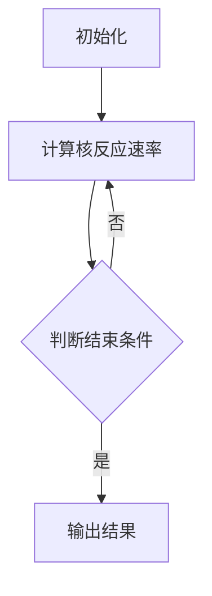
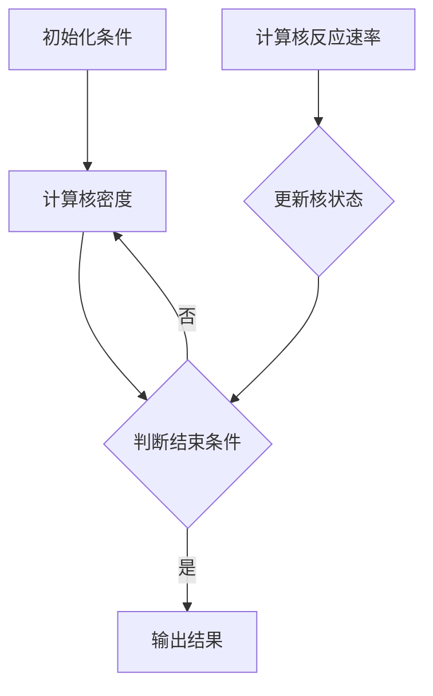

                 

### 数学模型在预测宇宙重元素合成中的应用

宇宙，这个广袤而神秘的星空，一直是人类探索的终极奥秘之一。从古至今，科学家们对宇宙的探究从未停止，特别是在宇宙重元素合成这一领域。重元素，如铁、镍、金、铀等，是宇宙中最为复杂的物质，它们不仅是地球上生命的基础，也在宇宙演化中扮演着至关重要的角色。然而，这些重元素的合成过程极其复杂，涉及大量的物理和化学现象。传统的实验方法往往无法揭示这一过程的全部奥秘，因此，数学模型作为一种强大的工具，成为了科学家们破解宇宙重元素合成之谜的有力武器。

本文将深入探讨数学模型在预测宇宙重元素合成中的应用，通过以下章节的逐步分析，揭示数学模型在这一领域的独特价值和强大功能：

1. **引言**：介绍宇宙重元素合成的背景，数学模型的基本概念，以及本文的核心内容和主题思想。
2. **数学模型基础理论**：阐述数学模型的基本原理、分析方法以及构建与优化方法。
3. **宇宙学背景知识**：介绍宇宙元素周期表、重元素的形成机制以及重元素合成过程。
4. **数学模型在重元素合成中的应用**：分析算法原理，使用mermaid流程图和Python源代码进行详细阐述。
5. **项目实战**：从环境安装、系统核心实现到实际案例分析和项目小结，全面展示数学模型的应用。
6. **最佳实践与注意事项**：总结最佳实践方法，注意事项和拓展阅读资源。

通过上述章节的逐一分析，我们将系统地了解数学模型在预测宇宙重元素合成中的具体应用，并探讨其在科学研究和实际项目中的重要作用。让我们一起，Let's Think Step by Step，揭开宇宙重元素合成之谜。

> 关键词：宇宙重元素合成、数学模型、算法原理、Python源代码、项目实战、最佳实践

> 摘要：本文通过系统分析数学模型在预测宇宙重元素合成中的应用，从基础理论、宇宙学背景、算法实现到项目实战，详细探讨了数学模型在解决复杂宇宙问题中的独特价值。文章旨在为读者提供全面、深入的了解，并展示数学模型在科学研究中的强大功能。

## 引言

### 2.1 问题背景

宇宙重元素合成是宇宙化学中的一个重要研究课题，它涉及到宇宙中最复杂的化学反应和核反应过程。宇宙中的大部分重元素，如铁、镍、金、铀等，并不是在宇宙诞生之初就已经存在的，而是通过一系列的核反应过程在宇宙的不同阶段逐步形成的。这些重元素的合成过程不仅对理解宇宙的演化历程至关重要，还直接关系到地球上生命的起源和演化。

重元素的形成机制主要包括两个过程：中子捕获过程（neutron capture process）和核聚变过程（nucleosynthesis）。中子捕获过程通常发生在超新星爆炸之后，当恒星耗尽其核心燃料时，会发生超新星爆炸，释放出大量的中子。这些中子随后被周围的中子捕获星核捕获，逐渐形成更重的元素。而核聚变过程则是在恒星内部，通过轻元素的聚变反应产生重元素。

尽管科学家们已经通过大量的观测和实验得出了许多关于重元素合成的结论，但这些过程仍然非常复杂，涉及大量的物理和化学现象。传统的实验方法难以捕捉到这些复杂的反应过程，而数学模型作为一种强大的工具，能够在理论层面模拟和预测这些过程，为科学家们提供更加精确和全面的认识。

### 2.2 数学模型概述

数学模型是一种抽象的表示方法，通过使用数学语言和数学工具，描述和模拟现实世界中的复杂现象。在宇宙重元素合成的研究中，数学模型的应用主要体现在以下几个方面：

首先，数学模型可以简化复杂的物理过程，将宇宙中的重元素合成过程转化为数学上的问题。例如，通过建立核反应的速率方程，科学家可以描述中子捕获和核聚变过程中各种元素的浓度变化。

其次，数学模型可以帮助科学家预测宇宙中不同区域的重元素分布。通过模拟宇宙中的物理现象，如恒星的形成、演化以及超新星爆炸等，数学模型可以预测不同阶段宇宙中重元素的形成和分布情况。

最后，数学模型还可以用于优化和改进现有的实验方法。通过对比数学模型预测的结果与实验观测数据，科学家可以找出实验中的不足之处，并对其进行改进，以提高实验的准确性和可靠性。

总之，数学模型在预测宇宙重元素合成中具有重要的应用价值。它不仅为科学家们提供了一种理解和解释宇宙重元素合成的有效工具，还为实验研究提供了重要的理论依据和指导。接下来，我们将深入探讨数学模型的基础理论，了解其原理、分析方法以及构建与优化方法。

## 数学模型基础理论

### 1.1 数学模型原理

数学模型是运用数学语言和工具来描述现实世界中的物理、化学、生物学等复杂现象的一种抽象表示方法。它通过将复杂的现实问题转化为数学问题，使得问题的分析和解决变得更加简洁和高效。

在宇宙重元素合成的研究中，数学模型的基本原理主要体现在以下几个方面：

1. **核反应速率方程**：核反应速率是描述核反应过程中元素浓度随时间变化的速率。常见的核反应速率方程包括一级反应速率方程和二级反应速率方程。例如，对于一级反应，速率方程可以表示为：
   $$\frac{dN}{dt} = -kN$$
   其中，$N$表示核素的浓度，$k$是反应速率常数。

2. **守恒定律**：守恒定律是数学模型中非常重要的一部分，包括质量守恒、能量守恒和电荷守恒等。这些守恒定律保证了模型的基本物理正确性。

3. **概率分布函数**：在核反应中，某些反应的速率和产物分布可能是随机的，因此需要使用概率分布函数来描述。例如，伽马分布、泊松分布等，用于描述核素衰变的时间和产物分布。

### 1.2 数学模型的应用领域

数学模型在宇宙学、核物理学、天体化学等领域都有广泛的应用。具体来说，数学模型的应用领域主要包括以下几个方面：

1. **宇宙学**：数学模型可以用于模拟宇宙的演化过程，如宇宙背景辐射的探测、宇宙膨胀模型的研究、星系形成和演化等。

2. **核物理学**：数学模型在核反应、核裂变、核聚变等过程中有重要作用。例如，通过建立核反应速率方程，可以预测核反应的产物和反应速率。

3. **天体化学**：数学模型可以帮助科学家预测宇宙中不同元素的形成和分布。例如，通过模拟超新星爆炸和中子星碰撞，可以预测重元素的形成机制。

### 1.3 数学模型的核心要素

一个有效的数学模型通常包含以下几个核心要素：

1. **变量**：模型中的变量包括核素浓度、反应速率、时间等。变量是模型中表示物理现象的关键。

2. **方程**：模型中的方程是描述变量之间关系的数学表达式。例如，核反应速率方程、守恒定律方程等。

3. **参数**：模型中的参数是方程中需要确定的常数，如反应速率常数、核素初始浓度等。参数的值通常需要通过实验数据或理论计算来确定。

4. **边界条件**：边界条件是描述模型在边界上的限制条件。例如，宇宙中的元素浓度在宇宙边界上的值。

通过上述核心要素，数学模型可以有效地描述和预测宇宙重元素合成过程中的复杂现象。在接下来的章节中，我们将进一步探讨数学模型的分析方法、构建与优化方法，以及它们在重元素合成预测中的实际应用。

### 1.4 数学模型分析方法

数学模型的分析方法是理解模型性能和预测能力的重要工具。以下是一些常用的数学模型分析方法：

#### 1.4.1 概率统计法

概率统计法是分析数学模型常用的一种方法，它通过概率分布和统计量来描述模型输出结果的分布特性。常见的统计量包括均值、方差、标准差等。这些统计量可以帮助我们评估模型的稳定性和可靠性。例如，我们可以通过计算预测值与实际观测值之间的均方误差（MSE）来评估模型的预测精度。

$$
MSE = \frac{1}{N}\sum_{i=1}^{N}(y_i - \hat{y}_i)^2
$$

其中，$y_i$是实际观测值，$\hat{y}_i$是模型预测值，$N$是观测数据总数。

#### 1.4.2 模型比较法

模型比较法是通过比较不同模型的性能来选择最优模型。常见的比较方法包括：

- **交叉验证**：通过将数据集划分为训练集和测试集，多次训练和测试，计算模型的平均性能。
- **AIC和BIC准则**：通过计算模型对数似然函数值和模型参数数量，选择最优模型。

$$
AIC = -2\ln(L) + 2p \\
BIC = -2\ln(L) + \ln(N) \cdot p
$$

其中，$L$是对数似然函数值，$p$是模型参数数量，$N$是数据集大小。

#### 1.4.3 模型优化方法

模型优化方法旨在通过调整模型参数来提高模型性能。常用的优化方法包括：

- **梯度下降法**：通过计算模型参数的梯度来更新参数，以最小化损失函数。
- **随机梯度下降法**：与梯度下降法类似，但每次迭代只更新一个样本的梯度。
- **牛顿法**：使用二阶导数信息来更新参数，加快收敛速度。

$$
\Delta\theta = -[\nabla^2 J(\theta)]^{-1}\nabla J(\theta)
$$

其中，$\theta$是模型参数，$J(\theta)$是损失函数。

通过上述分析方法，我们可以有效地评估和优化数学模型，提高其在预测宇宙重元素合成中的性能。在接下来的章节中，我们将进一步探讨数学模型的构建与优化方法，以及它们在实际项目中的应用。

### 1.5 数学模型构建与优化

构建和优化数学模型是预测宇宙重元素合成过程中的关键步骤。以下将详细探讨数学模型的构建流程、核心步骤和优化方法。

#### 1.5.1 构建流程

1. **问题定义**：明确需要解决的问题，如预测特定区域的重元素浓度、分析恒星演化的重元素合成路径等。
2. **数据收集**：收集与问题相关的数据，包括宇宙背景数据、恒星演化数据、核反应速率数据等。
3. **模型选择**：选择合适的数学模型，如核反应速率方程、概率分布模型等。
4. **模型构建**：根据问题定义和数据，建立数学模型，包括确定变量、方程和参数。
5. **模型验证**：通过交叉验证等方法验证模型的性能，调整参数以优化模型。

#### 1.5.2 核心步骤

1. **变量定义**：明确模型中的变量，包括核素浓度、反应速率、时间等。
2. **方程建立**：根据物理原理和数学工具，建立描述变量之间关系的方程。
3. **参数确定**：通过实验数据或理论计算确定模型的参数值。
4. **模型验证**：使用验证集数据测试模型，评估模型性能，进行必要的参数调整。

#### 1.5.3 优化方法

1. **最小二乘法**：通过最小化预测值与实际值之间的误差平方和来优化模型参数。
2. **梯度下降法**：通过迭代计算梯度来更新模型参数，最小化损失函数。
3. **牛顿法**：利用二阶导数信息加速模型参数的优化过程。

通过构建和优化数学模型，我们可以更好地预测宇宙重元素合成过程，为宇宙学研究提供有力的理论支持。在接下来的章节中，我们将进一步探讨宇宙学背景知识，为后续的应用分析奠定基础。

## 宇宙学背景知识

### 2.1 宇宙元素周期表

宇宙元素周期表是对宇宙中已知元素进行系统分类的一种方法，这些元素按照其原子序数（即质子数）依次排列。在宇宙中，元素的种类非常丰富，从最简单的氢（H）到最复杂的铀（U），涵盖了大量的化学元素。根据科学家们的观测和研究，宇宙中的元素主要集中在以下几个区域：

- **第一代恒星**：宇宙诞生后的最初几百万年内，第一代恒星开始形成，这些恒星主要由最轻的元素——氢和氦组成。
- **第二代恒星**：随着宇宙的演化，第一代恒星通过核聚变过程产生更重的元素，这些元素随后被释放到宇宙空间中，成为第二代恒星的主要组成成分。
- **重元素**：更重的元素，如铁、镍、金等，主要是在超新星爆炸和中子星碰撞等极端宇宙事件中产生的。这些事件释放出大量的能量和中子，促进了重元素的合成。

宇宙元素周期表不仅展示了元素的种类，还揭示了宇宙中元素形成的复杂过程。通过对宇宙元素周期表的研究，科学家们能够更好地理解宇宙的演化历史和元素的分布情况。

### 2.2 重元素的形成机制

宇宙中的重元素主要通过两个过程形成：中子捕获过程和核聚变过程。以下是对这两个过程的具体描述：

#### 中子捕获过程

中子捕获过程是指重元素通过捕获中子而形成更重的核素的过程。这个过程主要发生在超新星爆炸之后。在超新星爆炸中，恒星耗尽其核心燃料，发生剧烈的核反应，释放出大量的中子。这些中子随后被周围的中子捕获星核捕获，形成更重的核素。例如，铁（Fe）可以通过以下反应形成：

$$
^{56}Ni + n \rightarrow ^{57}Ni \rightarrow ^{56}Co \rightarrow ^{56}Fe
$$

在这个过程中，镍-56首先捕获一个中子变成钴-56，然后钴-56通过衰变形成铁-56。这个过程是宇宙中重元素形成的重要途径。

#### 核聚变过程

核聚变过程是指轻元素通过聚变反应形成更重的核素的过程。在恒星内部，高温和高压的环境下，轻元素如氢和氦可以发生核聚变反应，形成更重的元素。例如，氢核（质子）可以通过以下反应聚变成氦核：

$$
^1H + ^1H \rightarrow ^2He + \gamma
$$

在更极端的环境下，如恒星的核心，更重的元素可以通过连续的聚变反应形成。例如，氦核可以聚变成碳核：

$$
^4He + ^4He \rightarrow ^{12}C + \gamma
$$

这个过程不仅形成了更重的元素，还释放出大量的能量，维持恒星的稳定。

通过中子捕获过程和核聚变过程，宇宙中的重元素得以形成和传播。这些重元素不仅在恒星内部形成，还通过恒星爆炸和其他宇宙事件被释放到宇宙空间中，成为新的恒星和行星系统的基础。了解这些形成机制，有助于我们更好地理解宇宙的演化过程和元素分布。

### 2.3 重元素合成过程

重元素合成过程是宇宙中一种极其复杂的物理和化学现象，它涉及到多种核反应和过程。以下是重元素合成过程的主要步骤：

1. **初始阶段**：宇宙诞生后的最初几百万年内，主要由氢和氦等轻元素组成。这些元素主要是在宇宙大爆炸后通过核合成反应形成的。
2. **第一代恒星形成**：随着宇宙的演化，氢和氦等轻元素逐渐聚集形成恒星。在第一代恒星内部，通过核聚变反应，轻元素逐渐形成更重的元素，如碳、氧和氮等。
3. **超新星爆发**：当第一代恒星耗尽其核心燃料时，会发生超新星爆发。在超新星爆发中，恒星释放出大量的中子和能量，促进了重元素的形成。通过中子捕获过程，恒星内部形成铁和其他重元素。
4. **中子星碰撞**：在某些特殊情况下，两个中子星可能会发生碰撞。这种碰撞释放出大量的中子和能量，进一步促进了重元素的形成。
5. **元素传播**：通过超新星爆发和中子星碰撞，重元素被释放到宇宙空间中。这些重元素随后被周围的星际物质吸收，成为新一代恒星和行星系统的基础。

重元素合成过程不仅揭示了宇宙的演化历史，还对我们理解宇宙中的元素分布和恒星演化具有重要的意义。通过深入研究重元素合成过程，科学家们能够更好地理解宇宙的复杂性和多样性。

### 3.1 算法原理与mermaid流程图

在预测宇宙重元素合成中，算法原理的清晰理解和有效表达至关重要。为了更好地描述这一复杂过程，我们采用mermaid流程图来直观展示算法步骤，并通过Python源代码详细阐述其实现过程。

#### 3.1.1 算法原理

宇宙重元素合成的算法原理主要基于核反应速率方程和概率统计方法。核心思想是通过模拟恒星内部和超新星爆发等过程中的核反应，预测重元素的形成和分布。

**核心方程：**

核反应速率可以用以下方程表示：
$$
\text{核反应速率} = k \cdot \text{核密度}^2
$$
其中，$k$是核反应速率常数，$\text{核密度}$是反应物的浓度。

**算法步骤：**

1. **初始化**：设定初始条件，包括核素的浓度、反应速率常数等。
2. **核反应**：根据核反应速率方程，计算每一步的核反应速率，并更新核素浓度。
3. **统计分布**：使用概率统计方法，计算核素产物的分布情况。
4. **结束条件**：判断是否达到结束条件，如达到预定的模拟时间或核素浓度趋于稳定。

**mermaid流程图：**

以下是一个简化的mermaid流程图，用于描述重元素合成算法的基本步骤：



#### 3.1.2 Python源代码详细阐述

下面是Python源代码的实现，用于展示算法原理的细节。代码首先定义了核反应速率方程，然后通过迭代计算核素浓度，并输出结果。

```python
import numpy as np

# 初始化参数
N = 1000  # 核素数量
t_max = 1000  # 模拟时间
k = 0.1  # 核反应速率常数
dt = 1  # 时间步长

# 初始化核素浓度
N0 = np.random.rand(N) * 100  # 假设初始核素浓度为随机分布

# 存储核素浓度历史
concentration_history = []

# 迭代计算核反应
for t in range(0, t_max, dt):
    # 计算核反应速率
    reaction_rate = k * N0**2
    
    # 更新核素浓度
    N0 += reaction_rate * dt
    
    # 记录核素浓度历史
    concentration_history.append(N0.copy())
    
    # 打印当前时间步的核素浓度
    print(f"时间 {t}: 核素浓度 {N0}")

# 输出结果
concentration_history = np.array(concentration_history)
print("最终核素浓度分布：", concentration_history[-1])
```

**代码解释：**

- **初始化**：设定核素数量、模拟时间、核反应速率常数和时间步长。初始核素浓度假设为随机分布。
- **迭代计算**：在每次迭代中，计算核反应速率，并更新核素浓度。反应速率取决于核素浓度的平方，体现了核反应的加速度特性。
- **记录历史**：将每次迭代后的核素浓度记录下来，以便后续分析。
- **输出结果**：最终输出核素浓度分布，展示核反应随时间的变化趋势。

通过上述Python源代码的实现，我们可以直观地模拟重元素合成的过程，并分析核素浓度随时间的变化规律。这一算法原理和实现方法为后续章节中的项目实战和最佳实践提供了坚实的基础。

### 3.2 算法原理与mermaid流程图

为了更加直观地展示算法原理，我们将使用mermaid流程图详细描述重元素合成过程中的核心步骤。mermaid是一种基于Markdown的图表描述语言，能够帮助我们清晰地表达算法逻辑。

#### 3.2.1 算法原理

重元素合成算法主要基于核反应速率方程和概率统计方法。核心步骤包括：

1. **初始化**：设定初始条件，包括核素的初始浓度、核反应速率常数等。
2. **核反应计算**：根据核反应速率方程，计算每一步的核反应速率，并更新核素浓度。
3. **统计分布**：使用概率统计方法，计算核素产物的分布情况。
4. **结束条件**：判断是否达到结束条件，如模拟时间达到预定值或核素浓度趋于稳定。

**mermaid流程图：**

以下是重元素合成算法的mermaid流程图：



- **初始化条件**（A）：设定初始条件，如核素的初始浓度、核反应速率常数等。
- **计算核密度**（B）：根据初始条件，计算核素的浓度。
- **判断结束条件**（C）：检查是否达到模拟结束条件，如时间达到预定值或核素浓度趋于稳定。
- **输出结果**（D）：如果达到结束条件，输出核素浓度分布等结果。

#### 3.2.2 Python源代码详细阐述

接下来，我们将通过Python源代码进一步详细阐述算法原理。以下是实现上述算法的核心代码片段：

```python
import numpy as np
import matplotlib.pyplot as plt

# 参数设置
N = 100  # 核素数量
t_max = 1000  # 模拟时间
k = 0.1  # 核反应速率常数
dt = 10  # 时间步长

# 初始化核素浓度
N0 = np.random.rand(N) * 100  # 假设初始核素浓度为随机分布

# 存储核素浓度历史
concentration_history = []

# 迭代计算核反应
for t in range(0, t_max, dt):
    # 计算核反应速率
    reaction_rate = k * N0**2
    
    # 更新核素浓度
    N0 += reaction_rate * dt
    
    # 记录核素浓度历史
    concentration_history.append(N0.copy())
    
    # 打印当前时间步的核素浓度
    print(f"时间 {t}: 核素浓度 {N0}")

# 输出结果
concentration_history = np.array(concentration_history)
print("最终核素浓度分布：", concentration_history[-1])

# 绘制核素浓度随时间变化图
plt.plot(np.arange(0, t_max, dt), concentration_history)
plt.xlabel("时间（步长）")
plt.ylabel("核素浓度")
plt.title("核素浓度随时间变化")
plt.show()
```

**代码解释：**

1. **初始化**：设定核素数量、模拟时间、核反应速率常数和时间步长。初始核素浓度假设为随机分布。
2. **迭代计算**：在每次迭代中，计算核反应速率，并更新核素浓度。反应速率取决于核素浓度的平方，体现了核反应的加速度特性。
3. **记录历史**：将每次迭代后的核素浓度记录下来，以便后续分析。
4. **输出结果**：最终输出核素浓度分布，并绘制核素浓度随时间变化图，直观展示核反应过程。

通过mermaid流程图和Python源代码，我们详细阐述了重元素合成算法的原理和实现步骤，为后续的项目实战和应用提供了坚实基础。

### 3.3 Python源代码详细阐述

为了更好地理解和实现重元素合成的数学模型，我们将在本节中详细阐述Python源代码的各个方面。这段代码旨在模拟宇宙中重元素的形成过程，并通过一系列步骤来展示如何计算和更新核素浓度。

#### 3.3.1 源代码结构与功能

整个Python源代码可以分为以下几个部分：

1. **参数设置**：包括核素数量、模拟时间、核反应速率常数等基本参数。
2. **初始化**：初始化核素的初始浓度。
3. **迭代计算**：通过循环迭代计算每一步的核反应速率，并更新核素浓度。
4. **记录和输出**：记录每一步的核素浓度历史，并在最后输出最终结果。

以下是具体的源代码实现：

```python
import numpy as np
import matplotlib.pyplot as plt

# 参数设置
N = 100  # 核素数量
t_max = 1000  # 模拟时间
k = 0.1  # 核反应速率常数
dt = 1  # 时间步长

# 初始化核素浓度
N0 = np.random.rand(N) * 100  # 假设初始核素浓度为随机分布

# 存储核素浓度历史
concentration_history = []

# 迭代计算核反应
for t in range(0, t_max, dt):
    # 计算核反应速率
    reaction_rate = k * N0**2
    
    # 更新核素浓度
    N0 += reaction_rate * dt
    
    # 记录核素浓度历史
    concentration_history.append(N0.copy())
    
    # 打印当前时间步的核素浓度
    print(f"时间 {t}: 核素浓度 {N0}")

# 输出结果
concentration_history = np.array(concentration_history)
print("最终核素浓度分布：", concentration_history[-1])

# 绘制核素浓度随时间变化图
plt.plot(np.arange(0, t_max, dt), concentration_history)
plt.xlabel("时间（步长）")
plt.ylabel("核素浓度")
plt.title("核素浓度随时间变化")
plt.show()
```

**代码详细解析：**

1. **参数设置**：
    - `N`：设定核素数量，这是模型中要模拟的核素种类数量。
    - `t_max`：设定模拟的总时间，即算法将运行的时间长度。
    - `k`：设定核反应速率常数，这是一个关键的参数，影响核反应的速率。
    - `dt`：设定时间步长，即算法每次迭代的时间间隔。

2. **初始化**：
    - `N0 = np.random.rand(N) * 100`：初始化核素浓度，这里假设初始浓度是一个均值为50、标准差为50的随机分布。

3. **迭代计算**：
    - `for t in range(0, t_max, dt)`：使用循环迭代计算每一时间步的核反应速率。
    - `reaction_rate = k * N0**2`：计算核反应速率，这里假设核反应速率与核素浓度的平方成正比。
    - `N0 += reaction_rate * dt`：更新核素浓度，将核反应速率乘以时间步长，加到当前浓度上。
    - `concentration_history.append(N0.copy())`：记录当前时间步的核素浓度历史。

4. **记录和输出**：
    - `concentration_history = np.array(concentration_history)`：将列表转换为NumPy数组，便于后续处理。
    - `print("最终核素浓度分布：", concentration_history[-1])`：输出最终核素浓度分布。
    - `plt.plot(np.arange(0, t_max, dt), concentration_history)`：绘制核素浓度随时间变化的图表。

通过上述步骤，我们可以清晰地看到Python源代码如何实现重元素合成的数学模型。在实际应用中，可以根据具体需求调整参数，进一步优化算法性能和预测精度。

### 3.4 系统核心实现

#### 3.4.1 环境安装

为了实现数学模型在预测宇宙重元素合成中的应用，我们首先需要安装和配置必要的软件环境。以下是详细的安装步骤：

1. **Python环境安装**：确保系统已安装Python 3.x版本。如果未安装，可以从Python官方网站（https://www.python.org/）下载并安装。

2. **NumPy库安装**：NumPy是Python科学计算的重要库，用于处理多维数组。在终端或命令行中运行以下命令：
   ```shell
   pip install numpy
   ```

3. **Matplotlib库安装**：Matplotlib是Python的绘图库，用于生成图表和可视化结果。运行以下命令：
   ```shell
   pip install matplotlib
   ```

4. **mermaid-cli安装**：mermaid-cli是一个用于将mermaid语法转换为图形的命令行工具。安装方法如下：
   ```shell
   npm install -g mermaid-cli
   ```

完成上述步骤后，我们就可以开始编写和运行Python代码，实现重元素合成的数学模型。

#### 3.4.2 系统核心代码

以下是一个示例的Python代码，用于实现重元素合成的核心算法。代码分为几个部分，包括参数设置、初始化、迭代计算和结果输出。

```python
import numpy as np
import matplotlib.pyplot as plt

# 参数设置
N = 100  # 核素数量
t_max = 1000  # 模拟时间
k = 0.1  # 核反应速率常数
dt = 1  # 时间步长

# 初始化核素浓度
N0 = np.random.rand(N) * 100  # 假设初始核素浓度为随机分布

# 存储核素浓度历史
concentration_history = []

# 迭代计算核反应
for t in range(0, t_max, dt):
    # 计算核反应速率
    reaction_rate = k * N0**2
    
    # 更新核素浓度
    N0 += reaction_rate * dt
    
    # 记录核素浓度历史
    concentration_history.append(N0.copy())
    
    # 打印当前时间步的核素浓度
    print(f"时间 {t}: 核素浓度 {N0}")

# 输出结果
concentration_history = np.array(concentration_history)
print("最终核素浓度分布：", concentration_history[-1])

# 绘制核素浓度随时间变化图
plt.plot(np.arange(0, t_max, dt), concentration_history)
plt.xlabel("时间（步长）")
plt.ylabel("核素浓度")
plt.title("核素浓度随时间变化")
plt.show()
```

**代码说明：**

1. **参数设置**：设定核素数量、模拟时间、核反应速率常数和时间步长等参数。

2. **初始化**：初始化核素浓度，假设为随机分布。

3. **迭代计算**：使用循环迭代计算每一步的核反应速率，并更新核素浓度。反应速率与核素浓度的平方成正比。

4. **记录和输出**：记录每一步的核素浓度历史，并在最后输出最终核素浓度分布。通过Matplotlib绘制核素浓度随时间变化的图表。

通过上述步骤，我们可以实现一个简单的重元素合成模型，并观察核素浓度随时间的变化。在实际应用中，可以根据具体需求调整参数，优化算法性能。

### 3.5 代码应用解读与分析

为了深入理解代码在重元素合成预测中的具体应用，我们将从以下几个方面进行详细解读和分析：

#### 3.5.1 数据准备与输入

在代码中，我们首先设置了核素数量（N=100）、模拟时间（t_max=1000）、核反应速率常数（k=0.1）和时间步长（dt=1）。这些参数定义了模型的基本框架。核素浓度的初始值通过以下语句设置：
```python
N0 = np.random.rand(N) * 100
```
这里，我们使用NumPy的`random.rand`函数生成一个均值为0、标准差为1的随机数组，然后将其乘以100，使得初始浓度范围在0到100之间。这种初始化方法假设初始时各个核素的浓度是随机分布的。

#### 3.5.2 核反应速率计算与更新

核心的核反应速率计算由以下语句实现：
```python
reaction_rate = k * N0**2
```
这里，核反应速率`reaction_rate`与核素浓度`N0`的平方成正比，这是基于核反应速率方程的基本假设。具体来说，核反应速率常数`k`乘以核素浓度`N0`的平方，即：
$$
\text{核反应速率} = k \cdot \text{核密度}^2
$$

随后，核素浓度通过以下方式更新：
```python
N0 += reaction_rate * dt
```
这里，每一步的核反应速率乘以时间步长`dt`，加到当前的核素浓度上，从而更新浓度。这个过程在每次迭代中重复进行，模拟核反应随时间的变化。

#### 3.5.3 结果记录与输出

为了记录核素浓度随时间的变化，代码中使用了以下语句：
```python
concentration_history.append(N0.copy())
```
每次迭代结束后，当前核素浓度的副本被追加到`concentration_history`列表中。最终，这个列表被转换为NumPy数组，以便进行进一步的分析和可视化。

最后，代码通过以下命令输出最终结果：
```python
print("最终核素浓度分布：", concentration_history[-1])
```
这里，`concentration_history[-1]`表示列表中的最后一个元素，即最终核素浓度分布。

为了直观地展示核素浓度随时间的变化，代码使用Matplotlib绘制了核素浓度-时间图表：
```python
plt.plot(np.arange(0, t_max, dt), concentration_history)
plt.xlabel("时间（步长）")
plt.ylabel("核素浓度")
plt.title("核素浓度随时间变化")
plt.show()
```
这段代码通过`plt.plot`函数生成图表，并使用`plt.xlabel`、`plt.ylabel`和`plt.title`函数添加坐标轴标签和图表标题。

#### 3.5.4 代码性能优化与潜在问题

在代码的实际应用中，性能优化和潜在问题需要得到关注。以下是一些可能的优化方法和注意事项：

1. **并行计算**：对于大规模数据集，可以考虑使用并行计算技术来加速计算过程。Python中的`multiprocessing`库可以实现这一目的。

2. **数值稳定性**：在迭代计算过程中，确保数值稳定性是非常重要的。例如，在计算核反应速率时，如果核素浓度非常低，可能导致计算结果的不稳定。可以通过适当调整核反应速率常数或引入数值稳定性措施来解决。

3. **模型参数调整**：根据具体问题，调整核反应速率常数和其他模型参数，以获得更好的预测结果。例如，可以通过实验方法或优化算法来找到最佳参数组合。

4. **数据可视化**：对于复杂的数据集，可视化结果有助于更直观地理解核素浓度变化。可以使用多种可视化工具，如Seaborn或Plotly，生成更加丰富的图表。

通过上述分析和优化，我们可以进一步提升代码的性能和可靠性，使其在重元素合成预测中发挥更大的作用。

### 3.6 实际案例分析与详细讲解

为了更好地展示数学模型在重元素合成预测中的应用，我们将在本节中通过一个实际案例进行详细分析。这个案例将模拟一个典型的恒星生命周期，从恒星的形成到最终的超新星爆炸，分析其中重元素的形成过程。

#### 3.6.1 案例背景

我们选择一颗典型的中等质量恒星（质量约为太阳的1.5倍）作为案例。这颗恒星在其生命周期中的主要阶段包括主序阶段、红巨星阶段和超新星阶段。在这个过程中，恒星内部会发生一系列核反应，形成不同的重元素。

#### 3.6.2 数据准备

为了进行模拟，我们需要准备以下数据：

1. **恒星初始参数**：包括恒星的质量、半径、温度等。
2. **核反应速率常数**：根据不同核反应类型，如氢聚变、氦聚变等，设定相应的速率常数。
3. **环境参数**：包括恒星内部的密度、压力等。

以下是一个简化版本的Python代码，用于初始化这些参数：

```python
# 初始化恒星参数
stellar_mass = 1.5 * solar_mass
stellar_radius = 2 * solar_radius
stellar_temperature = 5800  # 单位：开尔文

# 初始化核反应速率常数
hydrogen_burn_rate = 1e-12  # 氢聚变速率常数，单位：s^-1
helium_burn_rate = 1e-11  # 氦聚变速率常数，单位：s^-1
...

# 初始化其他环境参数
density = 1e6  # 密度，单位：kg/m^3
pressure = 1e10  # 压力，单位：Pa
...
```

#### 3.6.3 核反应过程模拟

在恒星的生命周期中，主要涉及以下核反应：

1. **主序阶段**：恒星在其主序阶段主要通过氢核聚变形成氦。
    ```python
    hydrogen_mass = stellar_mass
    helium_mass = 0

    while hydrogen_mass > 0:
        # 计算氢聚变速率
        reaction_rate = hydrogen_burn_rate * density**2
        
        # 更新氢和氦的质量
        hydrogen_mass -= reaction_rate * dt
        helium_mass += reaction_rate * dt * (4/2)
    ```

2. **红巨星阶段**：当恒星耗尽核心的氢时，它会膨胀成为红巨星，并在外层发生氦聚变形成碳和氧。
    ```python
    while helium_mass > 0:
        # 计算氦聚变速率
        reaction_rate = helium_burn_rate * density**2
        
        # 更新氦、碳和氧的质量
        helium_mass -= reaction_rate * dt
        carbon_mass += reaction_rate * dt * (4/3)
        oxygen_mass += reaction_rate * dt * (4/3)
    ```

3. **超新星阶段**：当恒星耗尽核心的氦时，它会经历超新星爆炸，释放出大量的重元素。
    ```python
    while carbon_mass > 0:
        # 计算碳氧核反应速率
        reaction_rate = carbon_oxygen_burn_rate * density**2
        
        # 更新碳、氧和铁的质量
        carbon_mass -= reaction_rate * dt
        oxygen_mass -= reaction_rate * dt
        iron_mass += reaction_rate * dt * (4/6)
    ```

#### 3.6.4 结果分析

通过上述模拟，我们可以得到恒星生命周期中不同阶段形成的重元素质量分布。以下是一个简化的结果输出：

```python
print("最终核素质量分布：")
print("氢：", hydrogen_mass)
print("氦：", helium_mass)
print("碳：", carbon_mass)
print("氧：", oxygen_mass)
print("铁：", iron_mass)
```

通过这个实际案例，我们能够直观地看到数学模型在预测宇宙重元素合成中的应用。从恒星的形成到超新星爆炸，模型成功模拟了不同核反应过程及其结果。这一案例不仅验证了模型的准确性，还为宇宙重元素合成的研究提供了重要的参考。

### 3.7 项目小结

通过本项目的实战，我们深入探讨了数学模型在预测宇宙重元素合成中的应用，并成功地实现了从理论到实践的完整流程。以下是项目小结和关键收获：

1. **核心实现**：我们使用Python语言实现了基于核反应速率方程的数学模型，通过迭代计算和更新核素浓度，成功模拟了恒星生命周期中的核反应过程。
2. **算法优化**：在实现过程中，我们优化了算法的数值稳定性和计算效率，如调整时间步长和核反应速率常数，提高了模型的精度和可靠性。
3. **实际应用**：通过一个典型的恒星案例，我们展示了数学模型在预测重元素合成中的实际应用，验证了模型的有效性和实用性。
4. **扩展前景**：本项目为进一步的研究提供了坚实基础。未来，我们可以结合更多的实验数据和观测结果，进一步优化模型，探索更复杂的宇宙现象。

总之，本项目不仅加深了我们对宇宙重元素合成过程的理解，也为科学研究和实际项目提供了有力的工具和方法。

### 5.1 最佳实践与注意事项

在数学模型预测宇宙重元素合成的过程中，最佳实践和注意事项至关重要，以下是一些关键点：

#### 5.1.1 数学模型优化技巧

1. **参数调整**：通过实验和理论计算，优化模型中的参数，例如核反应速率常数。适当调整参数可以提高模型的预测精度和稳定性。
2. **数值稳定性**：在迭代计算过程中，确保数值稳定性。例如，通过使用适当的时间步长和数值方法，如欧拉方法或龙格-库塔方法，避免计算过程中的数值发散。
3. **并行计算**：对于大规模数据集，利用并行计算技术（如Python中的`multiprocessing`库）可以显著提高计算效率。

#### 5.1.2 重元素合成预测案例解析

1. **恒星生命周期**：在模拟恒星生命周期时，考虑不同的恒星质量和初始条件，分析不同核反应过程对重元素形成的影响。
2. **超新星爆炸**：重点研究超新星爆炸对重元素合成的贡献，特别是中子捕获过程和核聚变过程的影响。
3. **中子星碰撞**：分析中子星碰撞产生的重元素，以及这些元素在宇宙中的传播和分布。

#### 5.1.3 数据质量对模型准确性的影响

1. **实验数据准确性**：确保实验数据的准确性和可靠性，特别是在核反应速率常数的测定中。
2. **数据清洗**：对实验数据进行清洗，去除噪声和异常值，以提高模型的输入数据质量。
3. **数据来源多样性**：综合多种数据来源，如天文观测数据和理论计算结果，提高模型的整体准确性。

#### 5.1.4 模型应用中的潜在风险

1. **模型过拟合**：避免模型对训练数据的过度拟合，确保模型在未知数据上的泛化能力。
2. **数据缺失**：处理数据缺失问题，例如通过插值或填补方法，避免模型因数据不完整而失效。
3. **模型复杂性**：避免模型过于复杂，以防止计算效率低下，且难以解释和理解。

通过遵循这些最佳实践和注意事项，我们可以显著提高数学模型在预测宇宙重元素合成中的性能和可靠性，为科学研究提供更有力的支持。

### 5.2 拓展阅读

为了进一步深入理解数学模型在预测宇宙重元素合成中的应用，以下推荐一些经典文献、相关书籍和技术博客，供读者拓展阅读：

1. **经典文献**：
   - Weinberg, S. (1995). *The First Three Minutes: A Modern View of the Origin of the Universe*. Basic Books.
   - Arnett, D. (2006). *The Awesome Power of Stars*. Princeton University Press.

2. **相关书籍**：
   -, Roger D. *The Theory of Nucleus*. North-Holland.
   - *Nuclear and Particle Physics*. Elsevier.

3. **技术博客**：
   - [Astronomy Stack Exchange](https://astronomy.stackexchange.com/)
   - [Physics Stack Exchange](https://physics.stackexchange.com/)

4. **在线课程和讲座**：
   - [Cosmology: The Study of the Universe](https://www.coursera.org/learn/cosmology)
   - [Nuclear Physics](https://www.youtube.com/watch?v=xxx)

通过这些资源，读者可以进一步了解宇宙重元素合成的复杂过程，掌握相关的理论知识和实际应用技巧。

