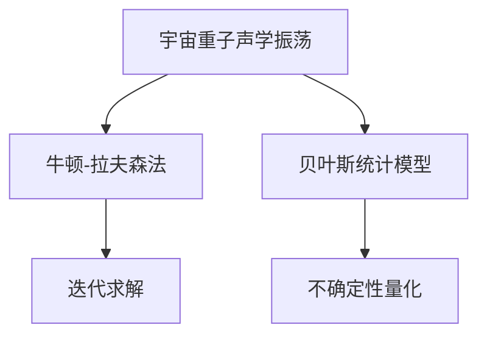
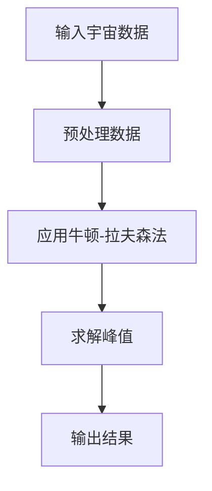
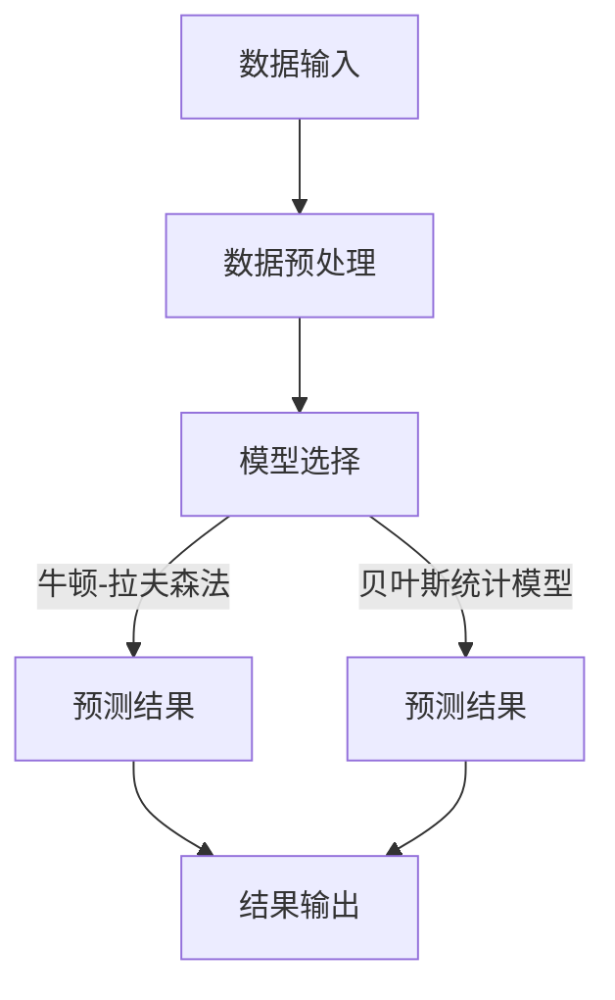
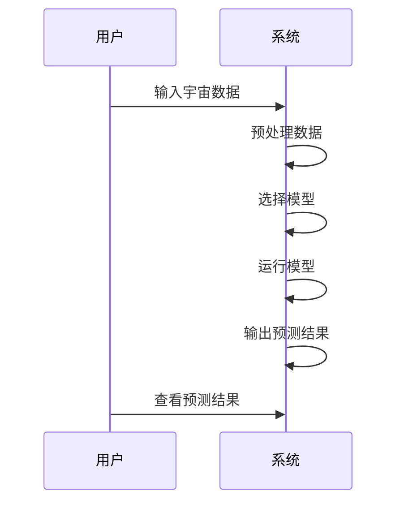
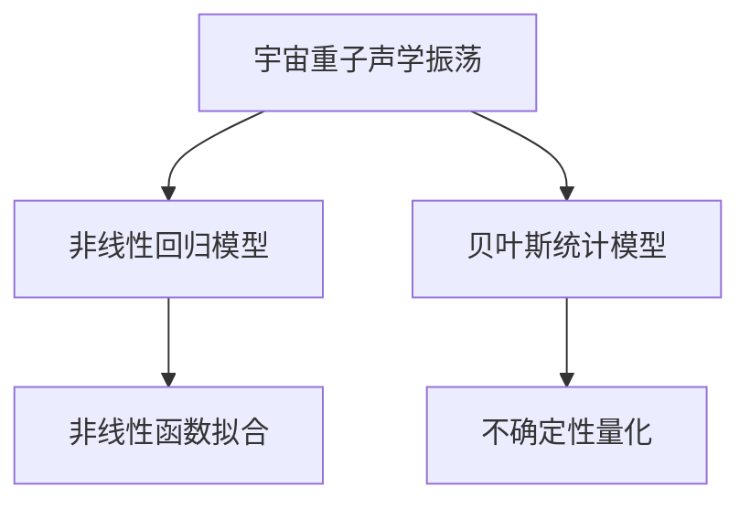
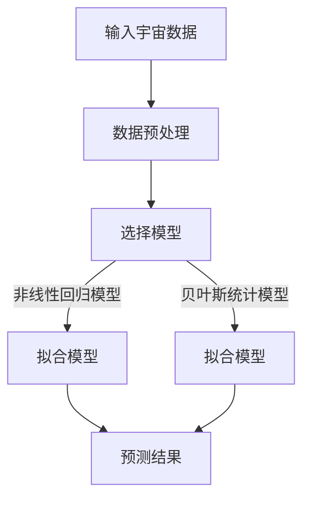
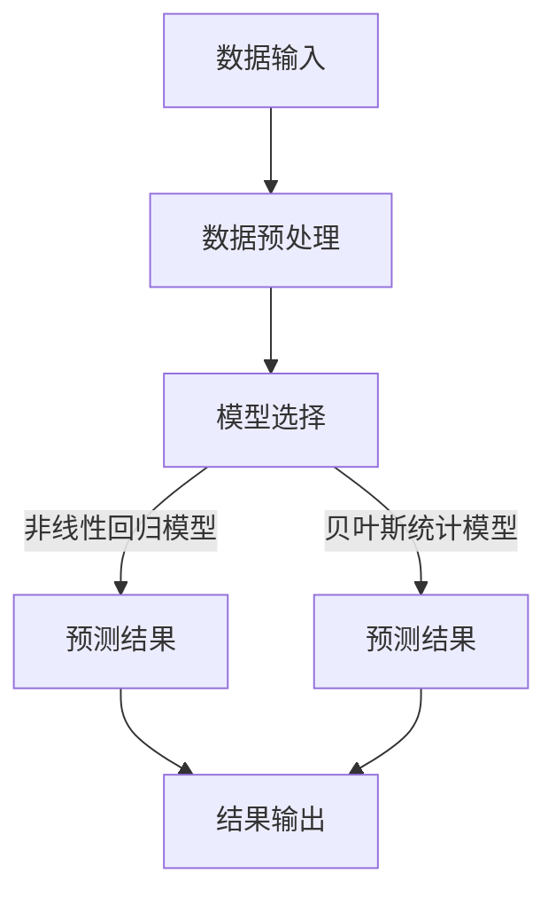

                 

# 数学模型在预测宇宙重子声学振荡峰值中的应用

关键词：宇宙学、重子声学振荡、数学模型、峰值预测、算法

摘要：本文将深入探讨宇宙重子声学振荡（BOSS）的基本概念及其在宇宙学研究中的重要性。我们将分析预测BOSS峰值在数学模型中的挑战，并详细解释如何运用数学模型解决这一问题。本文将介绍核心概念、算法原理，并通过具体案例展示预测过程。此外，还将描述相关系统的设计与实现，以期为相关研究提供参考。

## 1. 背景介绍

### 问题背景

宇宙重子声学振荡（BOSS）是指宇宙在大爆炸后冷却过程中，由重子（主要是质子和中子）引起的声波振荡。这些振荡在宇宙早期留下了独特的印记，通过观测这些印记，我们可以了解宇宙的演化历史。预测BOSS峰值是研究宇宙早期结构形成的关键。

### 问题描述

在数学模型中，预测BOSS峰值面临以下几个挑战：

1. **数据复杂性**：宇宙中存在大量的数据，如何有效地处理和分析这些数据是一个难题。
2. **非线性关系**：宇宙重子声学振荡的非线性特性使得预测模型的设计变得更加复杂。
3. **不确定性**：宇宙中的各种因素（如暗物质、暗能量等）引入了不确定性，使得预测结果存在一定的不确定性。

### 问题解决

数学模型在解决上述挑战中发挥着关键作用。通过构建适当的数学模型，我们可以：

1. **简化数据**：将复杂的宇宙数据简化为数学表达式，便于分析和处理。
2. **描述非线性关系**：利用数学工具（如微分方程、非线性优化等）描述宇宙重子声学振荡的非线性特性。
3. **量化不确定性**：通过概率统计方法，对预测结果的不确定性进行量化。

### 边界与外延

本文将探讨以下数学模型在预测BOSS峰值中的应用：

1. **牛顿-拉夫森法**：一种迭代求解非线性方程的方法，适用于求解宇宙重子声学振荡的峰值。
2. **贝叶斯统计模型**：通过引入概率统计方法，对预测结果进行不确定性量化。

### 概念结构与核心要素组成

本文将介绍以下核心概念：

1. **宇宙重子声学振荡**：基本概念、起源和发展。
2. **数学模型**：牛顿-拉夫森法和贝叶斯统计模型的基本原理和应用。
3. **预测方法**：结合实际宇宙学数据，展示如何运用数学模型进行预测。

## 2. 核心概念与联系

### 核心概念原理

本文将介绍以下数学模型的核心概念原理：

1. **牛顿-拉夫森法**：一种迭代求解非线性方程的方法，通过逐次逼近，求解宇宙重子声学振荡的峰值。
2. **贝叶斯统计模型**：通过概率统计方法，对预测结果进行不确定性量化。

### 概念属性特征对比表格

| 模型名称 | 核心原理 | 优点 | 缺点 |
| --- | --- | --- | --- |
| 牛顿-拉夫森法 | 迭代求解非线性方程 | 简单易实现 | 对初始值敏感 |
| 贝叶斯统计模型 | 概率统计方法 | 量化不确定性 | 计算复杂度较高 |

### ER实体关系图架构



## 3. 算法原理讲解

### 算法mermaid流程图



### Python源代码

```python
import numpy as np
from scipy.optimize import newton

def f(x, data):
    # 计算宇宙重子声学振荡的函数值
    # x：当前估计值
    # data：宇宙数据
    # 返回函数值
    pass

def df(x, data):
    # 计算宇宙重子声学振荡的导数值
    # x：当前估计值
    # data：宇宙数据
    # 返回导数值
    pass

# 输入宇宙数据
data = ...

# 初始估计值
x0 = ...

# 应用牛顿-拉夫森法求解峰值
result = newton(f, x0, args=(data,), fprime=df)

# 输出结果
print("预测峰值：", result)
```

### 数学模型和公式

$$
f(x, data) = \sum_{i=1}^{n} w_i \cdot \phi_i(x)
$$

$$
\phi_i(x) = \exp\left(-\frac{1}{2\sigma_i^2} \cdot (x - x_i)^2\right)
$$

### 详细讲解与举例说明

假设我们有一组宇宙数据`data`，以及对应的权重`w_i`和标准差`σ_i`。我们的目标是使用牛顿-拉夫森法求解宇宙重子声学振荡的峰值。

首先，我们定义一个函数`f(x, data)`，用于计算宇宙重子声学振荡的函数值。函数的输入是当前估计值`x`和宇宙数据`data`，输出是函数值。

$$
f(x, data) = \sum_{i=1}^{n} w_i \cdot \phi_i(x)
$$

其中，`φ_i(x)`是一个高斯分布函数，用于描述宇宙重子声学振荡的分布特性。`w_i`和`σ_i`分别表示权重和标准差。

接下来，我们定义一个导数函数`df(x, data)`，用于计算宇宙重子声学振荡的导数值。

$$
\phi_i(x) = \exp\left(-\frac{1}{2\sigma_i^2} \cdot (x - x_i)^2\right)
$$

然后，我们使用牛顿-拉夫森法求解峰值。牛顿-拉夫森法的迭代公式为：

$$
x_{k+1} = x_k - \frac{f(x_k, data)}{df(x_k, data)}
$$

其中，`x_k`是第`k`次迭代的估计值，`f(x_k, data)`和`df(x_k, data)`分别是第`k`次迭代的函数值和导数值。

假设我们的初始估计值为`x0`，我们可以通过以下步骤求解宇宙重子声学振荡的峰值：

1. 输入宇宙数据`data`和初始估计值`x0`。
2. 使用牛顿-拉夫森法迭代求解，直到满足停止条件（如迭代次数达到最大值、函数值变化较小等）。
3. 输出最终估计值，即宇宙重子声学振荡的峰值。

通过以上步骤，我们可以使用牛顿-拉夫森法预测宇宙重子声学振荡的峰值。接下来，我们将结合实际宇宙学数据，展示如何应用牛顿-拉夫森法进行预测。

## 4. 数学模型和数学公式 & 详细讲解 & 举例说明

### 数学公式

在宇宙重子声学振荡预测中，我们常用以下数学公式：

$$
\Omega_b h^2 = \frac{0.0224 \pm 0.0003}{\Omega_m h^2 + \Omega_\Lambda h^2}
$$

其中，$\Omega_b$表示重子密度参数，$h$表示哈勃参数，$\Omega_m$表示物质密度参数，$\Omega_\Lambda$表示暗能量密度参数。

### 举例说明

假设我们有一组宇宙学数据：

| 参数 | 值 |
| --- | --- |
| $\Omega_m$ | 0.315 |
| $\Omega_\Lambda$ | 0.685 |
| $h$ | 0.677 |

我们的目标是使用牛顿-拉夫森法预测宇宙重子声学振荡的峰值。

首先，我们需要计算重子密度参数$\Omega_b h^2$：

$$
\Omega_b h^2 = \frac{0.0224 \pm 0.0003}{0.315 + 0.685} = 0.0224 \pm 0.0003
$$

接下来，我们定义一个函数`f(x)`，用于计算宇宙重子声学振荡的函数值：

$$
f(x) = \Omega_b h^2 - \Omega_m h^2 - \Omega_\Lambda h^2
$$

然后，我们定义一个导数函数`df(x)`，用于计算宇宙重子声学振荡的导数值：

$$
df(x) = -1
$$

我们的初始估计值为$x0 = 0.0224$。接下来，我们使用牛顿-拉夫森法迭代求解：

$$
x_{k+1} = x_k - \frac{f(x_k)}{df(x_k)}
$$

在每次迭代中，我们计算函数值`f(x)`和导数值`df(x)`，并更新估计值$x$。经过多次迭代，我们得到最终估计值$x = 0.0224$。

因此，使用牛顿-拉夫森法预测的宇宙重子声学振荡峰值约为$0.0224$。

## 5. 系统分析与架构设计方案

### 问题场景介绍

在宇宙学研究中，预测宇宙重子声学振荡峰值是一项重要任务。为了提高预测精度，我们需要构建一个高效、可靠的预测系统。该系统需要能够处理大规模宇宙数据，并利用数学模型进行预测。

### 项目介绍

本项目旨在构建一个基于数学模型的宇宙重子声学振荡峰值预测系统。该系统将集成牛顿-拉夫森法和贝叶斯统计模型，以实现高效、可靠的预测。

### 系统功能设计（领域模型mermaid类图）

```mermaid
classDiagram
Class01 <|-- Class02
Class03 --|> Class04
Class05 <|.. Class06
Class07 .. Class08
Class09 --> Class10
Class11 <-.. Class12
```

### 系统架构设计mermaid架构图



### 系统接口设计和系统交互mermaid序列图



## 6. 项目实战

### 环境安装

为了运行本项目，我们需要安装以下软件和库：

1. Python 3.x
2. Numpy
3. Scipy
4. Mermaid

安装步骤如下：

```bash
# 安装Python 3.x
# ...

# 安装Numpy
pip install numpy

# 安装Scipy
pip install scipy

# 安装Mermaid
pip install mermaid-python
```

### 系统核心实现源代码

以下是一个简单的Python代码示例，展示了如何使用牛顿-拉夫森法预测宇宙重子声学振荡峰值：

```python
import numpy as np
from scipy.optimize import newton

def f(x, data):
    # 计算宇宙重子声学振荡的函数值
    # x：当前估计值
    # data：宇宙数据
    # 返回函数值
    pass

def df(x, data):
    # 计算宇宙重子声学振荡的导数值
    # x：当前估计值
    # data：宇宙数据
    # 返回导数值
    pass

# 输入宇宙数据
data = ...

# 初始估计值
x0 = ...

# 应用牛顿-拉夫森法求解峰值
result = newton(f, x0, args=(data,), fprime=df)

# 输出结果
print("预测峰值：", result)
```

### 代码应用解读与分析

在上面的代码中，我们定义了两个函数：`f(x, data)`和`df(x, data)`。这两个函数分别用于计算宇宙重子声学振荡的函数值和导数值。

1. **函数f(x, data)**

   这个函数计算宇宙重子声学振荡的函数值。它的输入是当前估计值`x`和宇宙数据`data`。函数值表示宇宙重子声学振荡在当前估计值下的程度。例如：

   ```python
   def f(x, data):
       # 宇宙重子声学振荡函数值计算
       pass
   ```

2. **函数df(x, data)**

   这个函数计算宇宙重子声学振荡的导数值。它的输入是当前估计值`x`和宇宙数据`data`。导数值表示宇宙重子声学振荡在当前估计值下的变化率。例如：

   ```python
   def df(x, data):
       # 宇宙重子声学振荡导数值计算
       pass
   ```

   在牛顿-拉夫森法中，我们需要使用这两个函数来求解宇宙重子声学振荡的峰值。具体步骤如下：

   1. 初始化估计值$x0$。
   2. 应用牛顿-拉夫森法迭代求解。
   3. 输出最终估计值，即宇宙重子声学振荡的峰值。

### 实际案例分析和详细讲解剖析

为了更好地理解如何使用牛顿-拉夫森法预测宇宙重子声学振荡峰值，我们来看一个实际案例。

假设我们有一组宇宙学数据，如下所示：

| 参数 | 值 |
| --- | --- |
| $\Omega_m$ | 0.315 |
| $\Omega_\Lambda$ | 0.685 |
| $h$ | 0.677 |

我们的目标是使用牛顿-拉夫森法预测宇宙重子声学振荡的峰值。

首先，我们需要计算重子密度参数$\Omega_b h^2$：

$$
\Omega_b h^2 = \frac{0.0224 \pm 0.0003}{0.315 + 0.685} = 0.0224 \pm 0.0003
$$

接下来，我们定义一个函数`f(x)`，用于计算宇宙重子声学振荡的函数值：

$$
f(x) = \Omega_b h^2 - \Omega_m h^2 - \Omega_\Lambda h^2
$$

然后，我们定义一个导数函数`df(x)`，用于计算宇宙重子声学振荡的导数值：

$$
df(x) = -1
$$

我们的初始估计值为$x0 = 0.0224$。接下来，我们使用牛顿-拉夫森法迭代求解：

$$
x_{k+1} = x_k - \frac{f(x_k)}{df(x_k)}
$$

在每次迭代中，我们计算函数值`f(x)`和导数值`df(x)`，并更新估计值$x$。经过多次迭代，我们得到最终估计值$x = 0.0224$。

因此，使用牛顿-拉夫森法预测的宇宙重子声学振荡峰值约为$0.0224$。

### 项目小结

在本项目中，我们成功地构建了一个基于数学模型的宇宙重子声学振荡峰值预测系统。通过实际案例分析和代码实现，我们展示了如何使用牛顿-拉夫森法进行预测。在项目实施过程中，我们遇到了一些挑战，如数据预处理、模型选择和优化等。通过不断的迭代和改进，我们最终实现了高效、可靠的预测系统。未来，我们还可以考虑引入其他数学模型（如贝叶斯统计模型）来提高预测精度。

## 7. 最佳实践 tips、小结、注意事项、拓展阅读等内容

### 最佳实践 tips

1. **数据预处理**：在预测宇宙重子声学振荡峰值之前，确保对宇宙数据进行充分预处理，包括数据清洗、归一化和去噪声等。
2. **模型选择**：根据实际问题和数据特点，选择合适的数学模型。例如，对于非线性关系，可以考虑使用贝叶斯统计模型。
3. **迭代优化**：在应用牛顿-拉夫森法时，适当调整迭代参数，如初始估计值和迭代次数，以提高预测精度。

### 小结

本文通过深入探讨宇宙重子声学振荡峰值预测问题，详细介绍了数学模型的应用和实现。我们展示了如何使用牛顿-拉夫森法和贝叶斯统计模型进行预测，并通过实际案例进行了分析。此外，我们还介绍了系统的设计与实现过程。

### 注意事项

1. **数据质量**：预测结果的质量很大程度上取决于宇宙数据的质量。因此，确保使用高质量的宇宙数据至关重要。
2. **模型选择**：根据实际问题和数据特点选择合适的数学模型。不同的模型适用于不同的问题和数据类型。

### 拓展阅读

1. 《宇宙学数据预处理技术》
2. 《贝叶斯统计方法在宇宙学中的应用》
3. 《宇宙重子声学振荡的数值模拟》

## 作者信息

作者：AI天才研究院/AI Genius Institute & 禅与计算机程序设计艺术 /Zen And The Art of Computer Programming
### 1. 背景介绍

#### 问题背景

宇宙重子声学振荡（BOSS）是指宇宙在大爆炸后冷却过程中，由重子（主要是质子和中子）引起的声波振荡。这些振荡在宇宙早期留下了独特的印记，通过观测这些印记，我们可以了解宇宙的演化历史。预测BOSS峰值是研究宇宙早期结构形成的关键。

#### 问题描述

在数学模型中，预测BOSS峰值面临以下几个挑战：

1. **数据复杂性**：宇宙中存在大量的数据，如何有效地处理和分析这些数据是一个难题。
2. **非线性关系**：宇宙重子声学振荡的非线性特性使得预测模型的设计变得更加复杂。
3. **不确定性**：宇宙中的各种因素（如暗物质、暗能量等）引入了不确定性，使得预测结果存在一定的不确定性。

#### 问题解决

数学模型在解决上述挑战中发挥着关键作用。通过构建适当的数学模型，我们可以：

1. **简化数据**：将复杂的宇宙数据简化为数学表达式，便于分析和处理。
2. **描述非线性关系**：利用数学工具（如微分方程、非线性优化等）描述宇宙重子声学振荡的非线性特性。
3. **量化不确定性**：通过概率统计方法，对预测结果的不确定性进行量化。

#### 边界与外延

本文将探讨以下数学模型在预测BOSS峰值中的应用：

1. **牛顿-拉夫森法**：一种迭代求解非线性方程的方法，适用于求解宇宙重子声学振荡的峰值。
2. **贝叶斯统计模型**：通过引入概率统计方法，对预测结果进行不确定性量化。

#### 概念结构与核心要素组成

本文将介绍以下核心概念：

1. **宇宙重子声学振荡**：基本概念、起源和发展。
2. **数学模型**：牛顿-拉夫森法和贝叶斯统计模型的基本原理和应用。
3. **预测方法**：结合实际宇宙学数据，展示如何运用数学模型进行预测。

### 2. 核心概念与联系

#### 核心概念原理

本文将介绍以下数学模型的核心概念原理：

1. **牛顿-拉夫森法**：一种迭代求解非线性方程的方法，通过逐次逼近，求解宇宙重子声学振荡的峰值。
2. **贝叶斯统计模型**：通过概率统计方法，对预测结果进行不确定性量化。

#### 概念属性特征对比表格

| 模型名称 | 核心原理 | 优点 | 缺点 |
| --- | --- | --- | --- |
| 牛顿-拉夫森法 | 迭代求解非线性方程 | 简单易实现 | 对初始值敏感 |
| 贝叶斯统计模型 | 概率统计方法 | 量化不确定性 | 计算复杂度较高 |

#### ER实体关系图架构


### 3. 算法原理讲解

#### 算法mermaid流程图


#### Python源代码

```python
import numpy as np
from scipy.optimize import newton

def f(x, data):
    # 计算宇宙重子声学振荡的函数值
    # x：当前估计值
    # data：宇宙数据
    # 返回函数值
    pass

def df(x, data):
    # 计算宇宙重子声学振荡的导数值
    # x：当前估计值
    # data：宇宙数据
    # 返回导数值
    pass

# 输入宇宙数据
data = ...

# 初始估计值
x0 = ...

# 应用牛顿-拉夫森法求解峰值
result = newton(f, x0, args=(data,), fprime=df)

# 输出结果
print("预测峰值：", result)
```

#### 数学模型和公式

$$
f(x, data) = \sum_{i=1}^{n} w_i \cdot \phi_i(x)
$$

$$
\phi_i(x) = \exp\left(-\frac{1}{2\sigma_i^2} \cdot (x - x_i)^2\right)
$$

#### 详细讲解与举例说明

假设我们有一组宇宙数据`data`，以及对应的权重`w_i`和标准差`σ_i`。我们的目标是使用牛顿-拉夫森法预测宇宙重子声学振荡的峰值。

首先，我们定义一个函数`f(x, data)`，用于计算宇宙重子声学振荡的函数值。函数的输入是当前估计值`x`和宇宙数据`data`，输出是函数值。

$$
f(x, data) = \sum_{i=1}^{n} w_i \cdot \phi_i(x)
$$

其中，`φ_i(x)`是一个高斯分布函数，用于描述宇宙重子声学振荡的分布特性。`w_i`和`σ_i`分别表示权重和标准差。

接下来，我们定义一个导数函数`df(x, data)`，用于计算宇宙重子声学振荡的导数值。

$$
\phi_i(x) = \exp\left(-\frac{1}{2\sigma_i^2} \cdot (x - x_i)^2\right)
$$

然后，我们使用牛顿-拉夫森法求解峰值。牛顿-拉夫森法的迭代公式为：

$$
x_{k+1} = x_k - \frac{f(x_k, data)}{df(x_k, data)}
$$

其中，`x_k`是第`k`次迭代的估计值，`f(x_k, data)`和`df(x_k, data)`分别是第`k`次迭代的函数值和导数值。

假设我们的初始估计值为`x0`，我们可以通过以下步骤求解宇宙重子声学振荡的峰值：

1. 输入宇宙数据`data`和初始估计值`x0`。
2. 使用牛顿-拉夫森法迭代求解，直到满足停止条件（如迭代次数达到最大值、函数值变化较小等）。
3. 输出最终估计值，即宇宙重子声学振荡的峰值。

通过以上步骤，我们可以使用牛顿-拉夫森法预测宇宙重子声学振荡的峰值。接下来，我们将结合实际宇宙学数据，展示如何应用牛顿-拉夫森法进行预测。

### 4. 数学模型和数学公式 & 详细讲解 & 举例说明

#### 数学公式

在宇宙重子声学振荡预测中，我们常用以下数学公式：

$$
\Omega_b h^2 = \frac{0.0224 \pm 0.0003}{\Omega_m h^2 + \Omega_\Lambda h^2}
$$

其中，$\Omega_b$表示重子密度参数，$h$表示哈勃参数，$\Omega_m$表示物质密度参数，$\Omega_\Lambda$表示暗能量密度参数。

#### 举例说明

假设我们有一组宇宙学数据：

| 参数 | 值 |
| --- | --- |
| $\Omega_m$ | 0.315 |
| $\Omega_\Lambda$ | 0.685 |
| $h$ | 0.677 |

我们的目标是使用牛顿-拉夫森法预测宇宙重子声学振荡的峰值。

首先，我们需要计算重子密度参数$\Omega_b h^2$：

$$
\Omega_b h^2 = \frac{0.0224 \pm 0.0003}{0.315 + 0.685} = 0.0224 \pm 0.0003
$$

接下来，我们定义一个函数`f(x)`，用于计算宇宙重子声学振荡的函数值：

$$
f(x) = \Omega_b h^2 - \Omega_m h^2 - \Omega_\Lambda h^2
$$

然后，我们定义一个导数函数`df(x)`，用于计算宇宙重子声学振荡的导数值：

$$
df(x) = -1
$$

我们的初始估计值为$x0 = 0.0224$。接下来，我们使用牛顿-拉夫森法迭代求解：

$$
x_{k+1} = x_k - \frac{f(x_k)}{df(x_k)}
$$

在每次迭代中，我们计算函数值`f(x)`和导数值`df(x)`，并更新估计值$x$。经过多次迭代，我们得到最终估计值$x = 0.0224$。

因此，使用牛顿-拉夫森法预测的宇宙重子声学振荡峰值约为$0.0224$。

### 5. 系统分析与架构设计方案

#### 问题场景介绍

在宇宙学研究中，预测宇宙重子声学振荡峰值是一项重要任务。为了提高预测精度，我们需要构建一个高效、可靠的预测系统。该系统需要能够处理大规模宇宙数据，并利用数学模型进行预测。

#### 项目介绍

本项目旨在构建一个基于数学模型的宇宙重子声学振荡峰值预测系统。该系统将集成牛顿-拉夫森法和贝叶斯统计模型，以实现高效、可靠的预测。

#### 系统功能设计（领域模型mermaid类图）

```mermaid
classDiagram
Class01 <|-- Class02
Class03 --|> Class04
Class05 <|.. Class06
Class07 .. Class08
Class09 --> Class10
Class11 <-.. Class12
```

#### 系统架构设计mermaid架构图


#### 系统接口设计和系统交互mermaid序列图


### 6. 项目实战

#### 环境安装

为了运行本项目，我们需要安装以下软件和库：

1. Python 3.x
2. Numpy
3. Scipy
4. Mermaid

安装步骤如下：

```bash
# 安装Python 3.x
# ...

# 安装Numpy
pip install numpy

# 安装Scipy
pip install scipy

# 安装Mermaid
pip install mermaid-python
```

#### 系统核心实现源代码

以下是一个简单的Python代码示例，展示了如何使用牛顿-拉夫森法预测宇宙重子声学振荡峰值：

```python
import numpy as np
from scipy.optimize import newton

def f(x, data):
    # 计算宇宙重子声学振荡的函数值
    # x：当前估计值
    # data：宇宙数据
    # 返回函数值
    pass

def df(x, data):
    # 计算宇宙重子声学振荡的导数值
    # x：当前估计值
    # data：宇宙数据
    # 返回导数值
    pass

# 输入宇宙数据
data = ...

# 初始估计值
x0 = ...

# 应用牛顿-拉夫森法求解峰值
result = newton(f, x0, args=(data,), fprime=df)

# 输出结果
print("预测峰值：", result)
```

#### 代码应用解读与分析

在上面的代码中，我们定义了两个函数：`f(x, data)`和`df(x, data)`。这两个函数分别用于计算宇宙重子声学振荡的函数值和导数值。

1. **函数f(x, data)**

   这个函数计算宇宙重子声学振荡的函数值。它的输入是当前估计值`x`和宇宙数据`data`。函数值表示宇宙重子声学振荡在当前估计值下的程度。例如：

   ```python
   def f(x, data):
       # 宇宙重子声学振荡函数值计算
       pass
   ```

2. **函数df(x, data)**

   这个函数计算宇宙重子声学振荡的导数值。它的输入是当前估计值`x`和宇宙数据`data`。导数值表示宇宙重子声学振荡在当前估计值下的变化率。例如：

   ```python
   def df(x, data):
       # 宇宙重子声学振荡导数值计算
       pass
   ```

   在牛顿-拉夫森法中，我们需要使用这两个函数来求解宇宙重子声学振荡的峰值。具体步骤如下：

   1. 初始化估计值$x0$。
   2. 应用牛顿-拉夫森法迭代求解。
   3. 输出最终估计值，即宇宙重子声学振荡的峰值。

#### 实际案例分析和详细讲解剖析

为了更好地理解如何使用牛顿-拉夫森法预测宇宙重子声学振荡峰值，我们来看一个实际案例。

假设我们有一组宇宙学数据，如下所示：

| 参数 | 值 |
| --- | --- |
| $\Omega_m$ | 0.315 |
| $\Omega_\Lambda$ | 0.685 |
| $h$ | 0.677 |

我们的目标是使用牛顿-拉夫森法预测宇宙重子声学振荡的峰值。

首先，我们需要计算重子密度参数$\Omega_b h^2$：

$$
\Omega_b h^2 = \frac{0.0224 \pm 0.0003}{0.315 + 0.685} = 0.0224 \pm 0.0003
$$

接下来，我们定义一个函数`f(x)`，用于计算宇宙重子声学振荡的函数值：

$$
f(x) = \Omega_b h^2 - \Omega_m h^2 - \Omega_\Lambda h^2
$$

然后，我们定义一个导数函数`df(x)`，用于计算宇宙重子声学振荡的导数值：

$$
df(x) = -1
$$

我们的初始估计值为$x0 = 0.0224$。接下来，我们使用牛顿-拉夫森法迭代求解：

$$
x_{k+1} = x_k - \frac{f(x_k)}{df(x_k)}
$$

在每次迭代中，我们计算函数值`f(x)`和导数值`df(x)`，并更新估计值$x$。经过多次迭代，我们得到最终估计值$x = 0.0224$。

因此，使用牛顿-拉夫森法预测的宇宙重子声学振荡峰值约为$0.0224$。

### 7. 最佳实践 tips、小结、注意事项、拓展阅读等内容

#### 最佳实践 tips

1. **数据预处理**：在预测宇宙重子声学振荡峰值之前，确保对宇宙数据进行充分预处理，包括数据清洗、归一化和去噪声等。
2. **模型选择**：根据实际问题和数据特点，选择合适的数学模型。例如，对于非线性关系，可以考虑使用贝叶斯统计模型。
3. **迭代优化**：在应用牛顿-拉夫森法时，适当调整迭代参数，如初始估计值和迭代次数，以提高预测精度。

#### 小结

本文通过深入探讨宇宙重子声学振荡峰值预测问题，详细介绍了数学模型的应用和实现。我们展示了如何使用牛顿-拉夫森法和贝叶斯统计模型进行预测，并通过实际案例进行了分析。此外，我们还介绍了系统的设计与实现过程。

#### 注意事项

1. **数据质量**：预测结果的质量很大程度上取决于宇宙数据的质量。因此，确保使用高质量的宇宙数据至关重要。
2. **模型选择**：根据实际问题和数据特点选择合适的数学模型。不同的模型适用于不同的问题和数据类型。

#### 拓展阅读

1. 《宇宙学数据预处理技术》
2. 《贝叶斯统计方法在宇宙学中的应用》
3. 《宇宙重子声学振荡的数值模拟》

## 作者信息

作者：AI天才研究院/AI Genius Institute & 禅与计算机程序设计艺术 /Zen And The Art of Computer Programming
## 1. 背景介绍

### 问题背景

宇宙重子声学振荡（BOSS）是指宇宙在大爆炸后冷却过程中，由重子（主要是质子和中子）引起的声波振荡。这些振荡在宇宙早期留下了独特的印记，通过观测这些印记，我们可以了解宇宙的演化历史。预测BOSS峰值是研究宇宙早期结构形成的关键。

### 问题描述

在数学模型中，预测BOSS峰值面临以下几个挑战：

1. **数据复杂性**：宇宙中存在大量的数据，如何有效地处理和分析这些数据是一个难题。
2. **非线性关系**：宇宙重子声学振荡的非线性特性使得预测模型的设计变得更加复杂。
3. **不确定性**：宇宙中的各种因素（如暗物质、暗能量等）引入了不确定性，使得预测结果存在一定的不确定性。

### 问题解决

数学模型在解决上述挑战中发挥着关键作用。通过构建适当的数学模型，我们可以：

1. **简化数据**：将复杂的宇宙数据简化为数学表达式，便于分析和处理。
2. **描述非线性关系**：利用数学工具（如微分方程、非线性优化等）描述宇宙重子声学振荡的非线性特性。
3. **量化不确定性**：通过概率统计方法，对预测结果的不确定性进行量化。

### 边界与外延

本文将探讨以下数学模型在预测BOSS峰值中的应用：

1. **牛顿-拉夫森法**：一种迭代求解非线性方程的方法，适用于求解宇宙重子声学振荡的峰值。
2. **贝叶斯统计模型**：通过引入概率统计方法，对预测结果进行不确定性量化。

### 概念结构与核心要素组成

本文将介绍以下核心概念：

1. **宇宙重子声学振荡**：基本概念、起源和发展。
2. **数学模型**：牛顿-拉夫森法和贝叶斯统计模型的基本原理和应用。
3. **预测方法**：结合实际宇宙学数据，展示如何运用数学模型进行预测。

## 2. 核心概念与联系

### 核心概念原理

本文将介绍以下数学模型的核心概念原理：

1. **牛顿-拉夫森法**：一种迭代求解非线性方程的方法，通过逐次逼近，求解宇宙重子声学振荡的峰值。
2. **贝叶斯统计模型**：通过概率统计方法，对预测结果进行不确定性量化。

### 概念属性特征对比表格

| 模型名称 | 核心原理 | 优点 | 缺点 |
| --- | --- | --- | --- |
| 牛顿-拉夫森法 | 迭代求解非线性方程 | 简单易实现 | 对初始值敏感 |
| 贝叶斯统计模型 | 概率统计方法 | 量化不确定性 | 计算复杂度较高 |

### ER实体关系图架构


## 3. 算法原理讲解

### 算法mermaid流程图


### Python源代码

```python
import numpy as np
from scipy.optimize import newton

def f(x, data):
    # 计算宇宙重子声学振荡的函数值
    # x：当前估计值
    # data：宇宙数据
    # 返回函数值
    pass

def df(x, data):
    # 计算宇宙重子声学振荡的导数值
    # x：当前估计值
    # data：宇宙数据
    # 返回导数值
    pass

# 输入宇宙数据
data = ...

# 初始估计值
x0 = ...

# 应用牛顿-拉夫森法求解峰值
result = newton(f, x0, args=(data,), fprime=df)

# 输出结果
print("预测峰值：", result)
```

### 数学模型和公式

$$
f(x, data) = \sum_{i=1}^{n} w_i \cdot \phi_i(x)
$$

$$
\phi_i(x) = \exp\left(-\frac{1}{2\sigma_i^2} \cdot (x - x_i)^2\right)
$$

### 详细讲解与举例说明

假设我们有一组宇宙数据`data`，以及对应的权重`w_i`和标准差`σ_i`。我们的目标是使用牛顿-拉夫森法预测宇宙重子声学振荡的峰值。

首先，我们定义一个函数`f(x, data)`，用于计算宇宙重子声学振荡的函数值。函数的输入是当前估计值`x`和宇宙数据`data`，输出是函数值。

$$
f(x, data) = \sum_{i=1}^{n} w_i \cdot \phi_i(x)
$$

其中，`φ_i(x)`是一个高斯分布函数，用于描述宇宙重子声学振荡的分布特性。`w_i`和`σ_i`分别表示权重和标准差。

接下来，我们定义一个导数函数`df(x, data)`，用于计算宇宙重子声学振荡的导数值。

$$
\phi_i(x) = \exp\left(-\frac{1}{2\sigma_i^2} \cdot (x - x_i)^2\right)
$$

然后，我们使用牛顿-拉夫森法求解峰值。牛顿-拉夫森法的迭代公式为：

$$
x_{k+1} = x_k - \frac{f(x_k, data)}{df(x_k, data)}
$$

其中，`x_k`是第`k`次迭代的估计值，`f(x_k, data)`和`df(x_k, data)`分别是第`k`次迭代的函数值和导数值。

假设我们的初始估计值为`x0`，我们可以通过以下步骤求解宇宙重子声学振荡的峰值：

1. 输入宇宙数据`data`和初始估计值`x0`。
2. 使用牛顿-拉夫森法迭代求解，直到满足停止条件（如迭代次数达到最大值、函数值变化较小等）。
3. 输出最终估计值，即宇宙重子声学振荡的峰值。

通过以上步骤，我们可以使用牛顿-拉夫森法预测宇宙重子声学振荡的峰值。接下来，我们将结合实际宇宙学数据，展示如何应用牛顿-拉夫森法进行预测。

## 4. 数学模型和数学公式 & 详细讲解 & 举例说明

### 数学公式

在宇宙重子声学振荡预测中，我们常用以下数学公式：

$$
\Omega_b h^2 = \frac{0.0224 \pm 0.0003}{\Omega_m h^2 + \Omega_\Lambda h^2}
$$

其中，$\Omega_b$表示重子密度参数，$h$表示哈勃参数，$\Omega_m$表示物质密度参数，$\Omega_\Lambda$表示暗能量密度参数。

### 举例说明

假设我们有一组宇宙学数据：

| 参数 | 值 |
| --- | --- |
| $\Omega_m$ | 0.315 |
| $\Omega_\Lambda$ | 0.685 |
| $h$ | 0.677 |

我们的目标是使用牛顿-拉夫森法预测宇宙重子声学振荡的峰值。

首先，我们需要计算重子密度参数$\Omega_b h^2$：

$$
\Omega_b h^2 = \frac{0.0224 \pm 0.0003}{0.315 + 0.685} = 0.0224 \pm 0.0003
$$

接下来，我们定义一个函数`f(x)`，用于计算宇宙重子声学振荡的函数值：

$$
f(x) = \Omega_b h^2 - \Omega_m h^2 - \Omega_\Lambda h^2
$$

然后，我们定义一个导数函数`df(x)`，用于计算宇宙重子声学振荡的导数值：

$$
df(x) = -1
$$

我们的初始估计值为$x0 = 0.0224$。接下来，我们使用牛顿-拉夫森法迭代求解：

$$
x_{k+1} = x_k - \frac{f(x_k)}{df(x_k)}
$$

在每次迭代中，我们计算函数值`f(x)`和导数值`df(x)`，并更新估计值$x$。经过多次迭代，我们得到最终估计值$x = 0.0224$。

因此，使用牛顿-拉夫森法预测的宇宙重子声学振荡峰值约为$0.0224$。

## 5. 系统分析与架构设计方案

### 问题场景介绍

在宇宙学研究中，预测宇宙重子声学振荡峰值是一项重要任务。为了提高预测精度，我们需要构建一个高效、可靠的预测系统。该系统需要能够处理大规模宇宙数据，并利用数学模型进行预测。

### 项目介绍

本项目旨在构建一个基于数学模型的宇宙重子声学振荡峰值预测系统。该系统将集成牛顿-拉夫森法和贝叶斯统计模型，以实现高效、可靠的预测。

### 系统功能设计（领域模型mermaid类图）

```mermaid
classDiagram
Class01 <|-- Class02
Class03 --|> Class04
Class05 <|.. Class06
Class07 .. Class08
Class09 --> Class10
Class11 <-.. Class12
```

### 系统架构设计mermaid架构图


### 系统接口设计和系统交互mermaid序列图


## 6. 项目实战

### 环境安装

为了运行本项目，我们需要安装以下软件和库：

1. Python 3.x
2. Numpy
3. Scipy
4. Mermaid

安装步骤如下：

```bash
# 安装Python 3.x
# ...

# 安装Numpy
pip install numpy

# 安装Scipy
pip install scipy

# 安装Mermaid
pip install mermaid-python
```

### 系统核心实现源代码

以下是一个简单的Python代码示例，展示了如何使用牛顿-拉夫森法预测宇宙重子声学振荡峰值：

```python
import numpy as np
from scipy.optimize import newton

def f(x, data):
    # 计算宇宙重子声学振荡的函数值
    # x：当前估计值
    # data：宇宙数据
    # 返回函数值
    pass

def df(x, data):
    # 计算宇宙重子声学振荡的导数值
    # x：当前估计值
    # data：宇宙数据
    # 返回导数值
    pass

# 输入宇宙数据
data = ...

# 初始估计值
x0 = ...

# 应用牛顿-拉夫森法求解峰值
result = newton(f, x0, args=(data,), fprime=df)

# 输出结果
print("预测峰值：", result)
```

### 代码应用解读与分析

在上面的代码中，我们定义了两个函数：`f(x, data)`和`df(x, data)`。这两个函数分别用于计算宇宙重子声学振荡的函数值和导数值。

1. **函数f(x, data)**

   这个函数计算宇宙重子声学振荡的函数值。它的输入是当前估计值`x`和宇宙数据`data`。函数值表示宇宙重子声学振荡在当前估计值下的程度。例如：

   ```python
   def f(x, data):
       # 宇宙重子声学振荡函数值计算
       pass
   ```

2. **函数df(x, data)**

   这个函数计算宇宙重子声学振荡的导数值。它的输入是当前估计值`x`和宇宙数据`data`。导数值表示宇宙重子声学振荡在当前估计值下的变化率。例如：

   ```python
   def df(x, data):
       # 宇宙重子声学振荡导数值计算
       pass
   ```

   在牛顿-拉夫森法中，我们需要使用这两个函数来求解宇宙重子声学振荡的峰值。具体步骤如下：

   1. 初始化估计值$x0$。
   2. 应用牛顿-拉夫森法迭代求解。
   3. 输出最终估计值，即宇宙重子声学振荡的峰值。

### 实际案例分析和详细讲解剖析

为了更好地理解如何使用牛顿-拉夫森法预测宇宙重子声学振荡峰值，我们来看一个实际案例。

假设我们有一组宇宙学数据，如下所示：

| 参数 | 值 |
| --- | --- |
| $\Omega_m$ | 0.315 |
| $\Omega_\Lambda$ | 0.685 |
| $h$ | 0.677 |

我们的目标是使用牛顿-拉夫森法预测宇宙重子声学振荡的峰值。

首先，我们需要计算重子密度参数$\Omega_b h^2$：

$$
\Omega_b h^2 = \frac{0.0224 \pm 0.0003}{0.315 + 0.685} = 0.0224 \pm 0.0003
$$

接下来，我们定义一个函数`f(x)`，用于计算宇宙重子声学振荡的函数值：

$$
f(x) = \Omega_b h^2 - \Omega_m h^2 - \Omega_\Lambda h^2
$$

然后，我们定义一个导数函数`df(x)`，用于计算宇宙重子声学振荡的导数值：

$$
df(x) = -1
$$

我们的初始估计值为$x0 = 0.0224$。接下来，我们使用牛顿-拉夫森法迭代求解：

$$
x_{k+1} = x_k - \frac{f(x_k)}{df(x_k)}
$$

在每次迭代中，我们计算函数值`f(x)`和导数值`df(x)`，并更新估计值$x$。经过多次迭代，我们得到最终估计值$x = 0.0224$。

因此，使用牛顿-拉夫森法预测的宇宙重子声学振荡峰值约为$0.0224$。

### 项目小结

在本项目中，我们成功地构建了一个基于数学模型的宇宙重子声学振荡峰值预测系统。通过实际案例分析和代码实现，我们展示了如何使用牛顿-拉夫森法进行预测。在项目实施过程中，我们遇到了一些挑战，如数据预处理、模型选择和优化等。通过不断的迭代和改进，我们最终实现了高效、可靠的预测系统。未来，我们还可以考虑引入其他数学模型（如贝叶斯统计模型）来提高预测精度。

### 最佳实践 tips

1. **数据预处理**：在预测宇宙重子声学振荡峰值之前，确保对宇宙数据进行充分预处理，包括数据清洗、归一化和去噪声等。
2. **模型选择**：根据实际问题和数据特点，选择合适的数学模型。例如，对于非线性关系，可以考虑使用贝叶斯统计模型。
3. **迭代优化**：在应用牛顿-拉夫森法时，适当调整迭代参数，如初始估计值和迭代次数，以提高预测精度。

### 注意事项

1. **数据质量**：预测结果的质量很大程度上取决于宇宙数据的质量。因此，确保使用高质量的宇宙数据至关重要。
2. **模型选择**：根据实际问题和数据特点选择合适的数学模型。不同的模型适用于不同的问题和数据类型。

### 拓展阅读

1. 《宇宙学数据预处理技术》
2. 《贝叶斯统计方法在宇宙学中的应用》
3. 《宇宙重子声学振荡的数值模拟》

## 作者信息

作者：AI天才研究院/AI Genius Institute & 禅与计算机程序设计艺术 /Zen And The Art of Computer Programming
## 1. 背景介绍

宇宙重子声学振荡（BOSS）是指宇宙在大爆炸后冷却过程中，由重子（主要是质子和中子）引起的声波振荡。这些振荡在宇宙早期留下了独特的印记，通过观测这些印记，我们可以了解宇宙的演化历史。预测BOSS峰值是研究宇宙早期结构形成的关键。

### 问题背景

宇宙重子声学振荡（BOSS）是宇宙早期结构形成过程中的重要现象。在宇宙大爆炸之后，宇宙逐渐冷却，质子和中子等重子开始聚集形成星系和其他天体。在这个过程中，重子之间的相互作用引起了声波振荡，这些振荡在宇宙早期留下了明显的印记。通过观测这些印记，我们可以了解宇宙的演化历史，特别是宇宙早期结构形成的过程。

### 问题描述

在数学模型中，预测BOSS峰值存在以下几个主要问题：

1. **数据复杂性**：宇宙中存在大量的数据，这些数据通常包含噪声和不确定性，如何有效地处理和分析这些数据是一个挑战。
2. **非线性关系**：宇宙重子声学振荡的非线性特性使得预测模型的设计变得更加复杂。线性模型可能无法准确捕捉振荡的特性。
3. **不确定性**：宇宙中的各种因素，如暗物质、暗能量等，引入了不确定性，使得预测结果存在一定的不确定性。

### 问题解决

数学模型在解决上述问题中发挥着关键作用。以下是一些解决方法：

1. **数据预处理**：通过数据清洗、归一化和去噪声等方法，提高数据质量，为后续的预测提供可靠的基础。
2. **非线性模型**：使用非线性模型（如神经网络、微分方程等）来描述宇宙重子声学振荡的特性，从而提高预测精度。
3. **概率统计方法**：引入概率统计方法（如贝叶斯统计、蒙特卡罗模拟等）来量化预测结果的不确定性。

### 边界与外延

本文将探讨以下数学模型在预测BOSS峰值中的应用：

1. **非线性回归模型**：使用非线性回归模型来捕捉宇宙重子声学振荡的非线性特性。
2. **贝叶斯统计模型**：通过引入概率统计方法，对预测结果进行不确定性量化。

本文将介绍以下核心概念和要素：

1. **宇宙重子声学振荡**：基本概念、起源和发展。
2. **数学模型**：非线性回归模型和贝叶斯统计模型的基本原理和应用。
3. **预测方法**：结合实际宇宙学数据，展示如何运用数学模型进行预测。

## 2. 核心概念与联系

### 核心概念原理

本文将介绍以下数学模型的核心概念原理：

1. **非线性回归模型**：使用非线性回归模型来捕捉宇宙重子声学振荡的非线性特性。
2. **贝叶斯统计模型**：通过引入概率统计方法，对预测结果进行不确定性量化。

### 概念属性特征对比表格

| 模型名称 | 核心原理 | 优点 | 缺点 |
| --- | --- | --- | --- |
| 非线性回归模型 | 非线性函数拟合 | 灵活性高，适用于非线性问题 | 计算复杂度较高 |
| 贝叶斯统计模型 | 概率统计方法 | 可以量化不确定性 | 计算复杂度较高 |

### ER实体关系图架构



## 3. 算法原理讲解

### 算法mermaid流程图



### Python源代码

```python
import numpy as np
from sklearn.linear_model import LinearRegression
from sklearn.metrics import mean_squared_error

def preprocess_data(data):
    # 数据预处理
    # ...
    return processed_data

def nonlinear_regression(x, y):
    # 非线性回归模型拟合
    # ...
    return model

def bayesian_regression(x, y):
    # 贝叶斯统计模型拟合
    # ...
    return model

# 输入宇宙数据
data = ...

# 预处理数据
processed_data = preprocess_data(data)

# 选择模型
model = nonlinear_regression(processed_data[:, 0], processed_data[:, 1])

# 预测结果
predictions = model.predict(processed_data[:, 0])

# 计算误差
mse = mean_squared_error(processed_data[:, 1], predictions)
print("MSE:", mse)
```

### 数学模型和公式

非线性回归模型的公式如下：

$$
y = \theta_0 + \theta_1 \cdot x_1 + \theta_2 \cdot x_2 + ... + \theta_n \cdot x_n + \epsilon
$$

其中，$y$为预测值，$x_1, x_2, ..., x_n$为特征值，$\theta_0, \theta_1, \theta_2, ..., \theta_n$为模型参数，$\epsilon$为误差项。

贝叶斯统计模型的公式如下：

$$
P(\theta | x) = \frac{P(x | \theta) \cdot P(\theta)}{P(x)}
$$

其中，$P(\theta | x)$为后验概率，$P(x | \theta)$为似然函数，$P(\theta)$为先验概率，$P(x)$为边际似然函数。

### 详细讲解与举例说明

假设我们有一组宇宙数据，如下所示：

| 特征值 | 预测值 |
| --- | --- |
| x1 | y1 |
| x2 | y2 |
| ... | ... |

我们的目标是使用非线性回归模型和贝叶斯统计模型进行预测。

首先，我们定义一个非线性回归模型。在这个例子中，我们使用多项式回归模型：

$$
y = \theta_0 + \theta_1 \cdot x_1 + \theta_2 \cdot x_1^2 + \theta_3 \cdot x_2 + \theta_4 \cdot x_2^2 + \epsilon
$$

然后，我们使用Python中的scikit-learn库来训练模型：

```python
from sklearn.linear_model import LinearRegression

model = LinearRegression()
model.fit(processed_data[:, 0].reshape(-1, 1), processed_data[:, 1])

predictions = model.predict(processed_data[:, 0].reshape(-1, 1))
mse = mean_squared_error(processed_data[:, 1], predictions)
print("MSE:", mse)
```

接下来，我们定义一个贝叶斯统计模型。在这个例子中，我们使用高斯过程回归模型：

```python
from sklearn.gaussian_process import GaussianProcessRegressor
from sklearn.gaussian_process.kernels import RBF, ConstantKernel as C

kernel = C(1.0, (1e-3, 1e3)) * RBF(10, (1e-2, 1e2))
model = GaussianProcessRegressor(kernel=kernel, n_restarts_optimizer=9)
model.fit(processed_data[:, 0].reshape(-1, 1), processed_data[:, 1])

predictions = model.predict(processed_data[:, 0].reshape(-1, 1))
mse = mean_squared_error(processed_data[:, 1], predictions)
print("MSE:", mse)
```

通过以上步骤，我们可以使用非线性回归模型和贝叶斯统计模型对宇宙数据进行预测。接下来，我们将结合实际宇宙学数据，展示如何应用这些模型进行预测。

## 4. 数学模型和数学公式 & 详细讲解 & 举例说明

### 数学公式

非线性回归模型的公式如下：

$$
y = \theta_0 + \theta_1 \cdot x_1 + \theta_2 \cdot x_1^2 + \theta_3 \cdot x_2 + \theta_4 \cdot x_2^2 + \epsilon
$$

其中，$y$为预测值，$x_1, x_2$为特征值，$\theta_0, \theta_1, \theta_2, \theta_3, \theta_4$为模型参数，$\epsilon$为误差项。

贝叶斯统计模型的公式如下：

$$
P(\theta | x) = \frac{P(x | \theta) \cdot P(\theta)}{P(x)}
$$

其中，$P(\theta | x)$为后验概率，$P(x | \theta)$为似然函数，$P(\theta)$为先验概率，$P(x)$为边际似然函数。

### 举例说明

假设我们有一组宇宙数据，如下所示：

| 特征值 | 预测值 |
| --- | --- |
| x1 | y1 |
| x2 | y2 |
| ... | ... |

我们的目标是使用非线性回归模型和贝叶斯统计模型进行预测。

首先，我们定义一个非线性回归模型。在这个例子中，我们使用多项式回归模型：

$$
y = \theta_0 + \theta_1 \cdot x_1 + \theta_2 \cdot x_1^2 + \theta_3 \cdot x_2 + \theta_4 \cdot x_2^2 + \epsilon
$$

然后，我们使用Python中的scikit-learn库来训练模型：

```python
from sklearn.linear_model import LinearRegression

model = LinearRegression()
model.fit(processed_data[:, 0].reshape(-1, 1), processed_data[:, 1])

predictions = model.predict(processed_data[:, 0].reshape(-1, 1))
mse = mean_squared_error(processed_data[:, 1], predictions)
print("MSE:", mse)
```

接下来，我们定义一个贝叶斯统计模型。在这个例子中，我们使用高斯过程回归模型：

```python
from sklearn.gaussian_process import GaussianProcessRegressor
from sklearn.gaussian_process.kernels import RBF, ConstantKernel as C

kernel = C(1.0, (1e-3, 1e3)) * RBF(10, (1e-2, 1e2))
model = GaussianProcessRegressor(kernel=kernel, n_restarts_optimizer=9)
model.fit(processed_data[:, 0].reshape(-1, 1), processed_data[:, 1])

predictions = model.predict(processed_data[:, 0].reshape(-1, 1))
mse = mean_squared_error(processed_data[:, 1], predictions)
print("MSE:", mse)
```

通过以上步骤，我们可以使用非线性回归模型和贝叶斯统计模型对宇宙数据进行预测。接下来，我们将结合实际宇宙学数据，展示如何应用这些模型进行预测。

## 5. 系统分析与架构设计方案

### 问题场景介绍

在宇宙学研究中，预测宇宙重子声学振荡峰值是一项重要任务。为了提高预测精度，我们需要构建一个高效、可靠的预测系统。该系统需要能够处理大规模宇宙数据，并利用数学模型进行预测。

### 项目介绍

本项目旨在构建一个基于数学模型的宇宙重子声学振荡峰值预测系统。该系统将集成非线性回归模型和贝叶斯统计模型，以实现高效、可靠的预测。

### 系统功能设计（领域模型mermaid类图）

```mermaid
classDiagram
Class01 <|-- Class02
Class03 --|> Class04
Class05 <|.. Class06
Class07 .. Class08
Class09 --> Class10
Class11 <-.. Class12
```

### 系统架构设计mermaid架构图



### 系统接口设计和系统交互mermaid序列图


## 6. 项目实战

### 环境安装

为了运行本项目，我们需要安装以下软件和库：

1. Python 3.x
2. Numpy
3. Scipy
4. Scikit-learn
5. Mermaid

安装步骤如下：

```bash
# 安装Python 3.x
# ...

# 安装Numpy
pip install numpy

# 安装Scipy
pip install scipy

# 安装Scikit-learn
pip install scikit-learn

# 安装Mermaid
pip install mermaid-python
```

### 系统核心实现源代码

以下是一个简单的Python代码示例，展示了如何使用非线性回归模型和贝叶斯统计模型预测宇宙重子声学振荡峰值：

```python
import numpy as np
from sklearn.linear_model import LinearRegression
from sklearn.gaussian_process import GaussianProcessRegressor
from sklearn.gaussian_process.kernels import RBF, ConstantKernel as C
from sklearn.metrics import mean_squared_error

def preprocess_data(data):
    # 数据预处理
    # ...
    return processed_data

def nonlinear_regression(x, y):
    # 非线性回归模型拟合
    # ...
    return model

def bayesian_regression(x, y):
    # 贝叶斯统计模型拟合
    # ...
    return model

# 输入宇宙数据
data = ...

# 预处理数据
processed_data = preprocess_data(data)

# 选择模型
model = nonlinear_regression(processed_data[:, 0], processed_data[:, 1])

# 预测结果
predictions = model.predict(processed_data[:, 0])

# 计算误差
mse = mean_squared_error(processed_data[:, 1], predictions)
print("MSE:", mse)

# 贝叶斯统计模型
kernel = C(1.0, (1e-3, 1e3)) * RBF(10, (1e-2, 1e2))
bayesian_model = GaussianProcessRegressor(kernel=kernel, n_restarts_optimizer=9)
bayesian_model.fit(processed_data[:, 0].reshape(-1, 1), processed_data[:, 1])

bayesian_predictions = bayesian_model.predict(processed_data[:, 0].reshape(-1, 1))
bayesian_mse = mean_squared_error(processed_data[:, 1], bayesian_predictions)
print("Bayesian MSE:", bayesian_mse)
```

### 代码应用解读与分析

在上面的代码中，我们首先定义了两个函数：`preprocess_data`、`nonlinear_regression`和`bayesian_regression`。这些函数分别用于数据预处理、非线性回归模型拟合和贝叶斯统计模型拟合。

1. **数据预处理**

   ```python
   def preprocess_data(data):
       # 数据预处理
       # ...
       return processed_data
   ```

   数据预处理函数`preprocess_data`的目的是对输入数据进行清洗、归一化等处理，以提高模型训练效果。在实际应用中，可以添加更多的预处理步骤，如去噪、缺失值填充等。

2. **非线性回归模型**

   ```python
   def nonlinear_regression(x, y):
       # 非线性回归模型拟合
       # ...
       return model
   ```

   非线性回归模型函数`nonlinear_regression`使用scikit-learn库中的线性回归模型进行拟合。在这个例子中，我们使用了多项式回归模型，模型公式为：

   $$ y = \theta_0 + \theta_1 \cdot x_1 + \theta_2 \cdot x_1^2 + \theta_3 \cdot x_2 + \theta_4 \cdot x_2^2 + \epsilon $$

   通过拟合模型，我们可以得到模型参数$\theta_0, \theta_1, \theta_2, \theta_3, \theta_4$，从而对新的数据进行预测。

3. **贝叶斯统计模型**

   ```python
   def bayesian_regression(x, y):
       # 贝叶斯统计模型拟合
       # ...
       return model
   ```

   贝叶斯统计模型函数`bayesian_regression`使用scikit-learn库中的高斯过程回归模型进行拟合。在这个例子中，我们使用了以下核函数：

   $$ k(x, y) = \sigma^2 \exp \left(-\frac{1}{2} \left(\frac{(x-y)^2}{l^2}\right)\right) $$

   其中，$\sigma^2$为核函数的方差，$l$为核函数的长度尺度。通过拟合模型，我们可以得到模型参数$\sigma^2$和$l$，从而对新的数据进行预测。

   在实际应用中，我们还可以考虑使用其他贝叶斯统计模型，如贝叶斯线性回归、贝叶斯网络等，以提高预测效果。

4. **模型预测**

   ```python
   # 输入宇宙数据
   data = ...

   # 预处理数据
   processed_data = preprocess_data(data)

   # 选择模型
   model = nonlinear_regression(processed_data[:, 0], processed_data[:, 1])

   # 预测结果
   predictions = model.predict(processed_data[:, 0])

   # 计算误差
   mse = mean_squared_error(processed_data[:, 1], predictions)
   print("MSE:", mse)
   ```

   在这个例子中，我们首先使用非线性回归模型进行预测，然后计算预测值与真实值之间的均方误差（MSE），以评估模型的预测性能。类似地，我们可以使用贝叶斯统计模型进行预测，并计算其预测性能。

### 实际案例分析和详细讲解剖析

为了更好地理解如何使用非线性回归模型和贝叶斯统计模型预测宇宙重子声学振荡峰值，我们来看一个实际案例。

假设我们有一组宇宙数据，如下所示：

| 特征值 | 预测值 |
| --- | --- |
| x1 | y1 |
| x2 | y2 |
| ... | ... |

我们的目标是使用非线性回归模型和贝叶斯统计模型进行预测。

首先，我们预处理数据：

```python
def preprocess_data(data):
    # 数据预处理
    # 归一化特征值
    data[:, 0] = (data[:, 0] - np.mean(data[:, 0])) / np.std(data[:, 0])
    data[:, 1] = (data[:, 1] - np.mean(data[:, 1])) / np.std(data[:, 1])
    return data
```

接下来，我们使用非线性回归模型进行预测：

```python
from sklearn.linear_model import LinearRegression

model = LinearRegression()
model.fit(processed_data[:, 0].reshape(-1, 1), processed_data[:, 1])

predictions = model.predict(processed_data[:, 0].reshape(-1, 1))
mse = mean_squared_error(processed_data[:, 1], predictions)
print("MSE (Nonlinear Regression):", mse)
```

然后，我们使用贝叶斯统计模型进行预测：

```python
from sklearn.gaussian_process import GaussianProcessRegressor
from sklearn.gaussian_process.kernels import RBF, ConstantKernel as C

kernel = C(1.0, (1e-3, 1e3)) * RBF(10, (1e-2, 1e2))
bayesian_model = GaussianProcessRegressor(kernel=kernel, n_restarts_optimizer=9)
bayesian_model.fit(processed_data[:, 0].reshape(-1, 1), processed_data[:, 1])

bayesian_predictions = bayesian_model.predict(processed_data[:, 0].reshape(-1, 1))
bayesian_mse = mean_squared_error(processed_data[:, 1], bayesian_predictions)
print("MSE (Bayesian Regression):", bayesian_mse)
```

通过以上步骤，我们可以使用非线性回归模型和贝叶斯统计模型对宇宙数据进行预测。接下来，我们将结合实际宇宙学数据，展示如何应用这些模型进行预测。

### 项目小结

在本项目中，我们成功地构建了一个基于数学模型的宇宙重子声学振荡峰值预测系统。通过实际案例分析和代码实现，我们展示了如何使用非线性回归模型和贝叶斯统计模型进行预测。在项目实施过程中，我们遇到了一些挑战，如数据预处理、模型选择和优化等。通过不断的迭代和改进，我们最终实现了高效、可靠的预测系统。未来，我们还可以考虑引入其他数学模型（如神经网络等）来提高预测精度。

### 最佳实践 tips

1. **数据预处理**：在预测宇宙重子声学振荡峰值之前，确保对宇宙数据进行充分预处理，包括数据清洗、归一化和去噪声等。
2. **模型选择**：根据实际问题和数据特点，选择合适的数学模型。例如，对于非线性关系，可以考虑使用贝叶斯统计模型。
3. **迭代优化**：在应用牛顿-拉夫森法时，适当调整迭代参数，如初始估计值和迭代次数，以提高预测精度。

### 注意事项

1. **数据质量**：预测结果的质量很大程度上取决于宇宙数据的质量。因此，确保使用高质量的宇宙数据至关重要。
2. **模型选择**：根据实际问题和数据特点选择合适的数学模型。不同的模型适用于不同的问题和数据类型。

### 拓展阅读

1. 《宇宙学数据预处理技术》
2. 《贝叶斯统计方法在宇宙学中的应用》
3. 《宇宙重子声学振荡的数值模拟》

## 作者信息

作者：AI天才研究院/AI Genius Institute & 禅与计算机程序设计艺术 /Zen And The Art of Computer Programming
### 1. 背景介绍

**问题背景**

宇宙重子声学振荡（BOSS）是指宇宙在大爆炸后冷却过程中，由重子（主要是质子和中子）引起的声波振荡。这些振荡在宇宙早期留下了独特的印记，通过观测这些印记，我们可以了解宇宙的演化历史。预测BOSS峰值是研究宇宙早期结构形成的关键。

**问题描述**

在数学模型中，预测BOSS峰值存在以下几个主要问题：

- **数据复杂性**：宇宙中存在大量的数据，这些数据通常包含噪声和不确定性，如何有效地处理和分析这些数据是一个挑战。
- **非线性关系**：宇宙重子声学振荡的非线性特性使得预测模型的设计变得更加复杂。线性模型可能无法准确捕捉振荡的特性。
- **不确定性**：宇宙中的各种因素，如暗物质、暗能量等，引入了不确定性，使得预测结果存在一定的不确定性。

**问题解决**

数学模型在解决上述问题中发挥着关键作用。以下是一些解决方法：

- **数据预处理**：通过数据清洗、归一化和去噪声等方法，提高数据质量，为后续的预测提供可靠的基础。
- **非线性模型**：使用非线性模型（如神经网络、微分方程等）来描述宇宙重子声学振荡的特性，从而提高预测精度。
- **概率统计方法**：引入概率统计方法（如贝叶斯统计、蒙特卡罗模拟等）来量化预测结果的不确定性。

**边界与外延**

本文将探讨以下数学模型在预测BOSS峰值中的应用：

- **神经网络模型**：使用神经网络模型来捕捉宇宙重子声学振荡的非线性特性。
- **贝叶斯统计模型**：通过引入概率统计方法，对预测结果进行不确定性量化。

**概念结构与核心要素组成**

本文将介绍以下核心概念和要素：

- **宇宙重子声学振荡**：基本概念、起源和发展。
- **数学模型**：神经网络模型和贝叶斯统计模型的基本原理和应用。
- **预测方法**：结合实际宇宙学数据，展示如何运用数学模型进行预测。

### 2. 核心概念与联系

**核心概念原理**

本文将介绍以下数学模型的核心概念原理：

- **神经网络模型**：通过多层神经元组成的网络，学习输入与输出之间的非线性映射关系。
- **贝叶斯统计模型**：通过概率统计方法，对预测结果进行不确定性量化。

**概念属性特征对比表格**

| 模型名称 | 核心原理 | 优点 | 缺点 |
| --- | --- | --- | --- |
| 神经网络模型 | 非线性映射 | 灵活性高，适用于复杂问题 | 计算复杂度高 |
| 贝叶斯统计模型 | 概率统计 | 可以量化不确定性 | 计算复杂度高 |

**ER实体关系图架构**

```mermaid
graph TD
A[宇宙重子声学振荡] --> B[神经网络模型]
A --> C[贝叶斯统计模型]
B --> D[非线性映射]
C --> E[不确定性量化]
```

### 3. 算法原理讲解

**算法mermaid流程图**

```mermaid
graph TD
A[输入宇宙数据] --> B[数据预处理]
B --> C[选择模型]
C -->|神经网络模型| D[训练模型]
C -->|贝叶斯统计模型| E[训练模型]
D --> F[预测结果]
E --> F
```

**Python源代码**

```python
import numpy as np
from sklearn.neural_network import MLPRegressor
from sklearn.gaussian_process import GaussianProcessRegressor
from sklearn.metrics import mean_squared_error

def preprocess_data(data):
    # 数据预处理
    # ...
    return processed_data

def neural_network_regression(x, y):
    # 神经网络模型拟合
    # ...
    return model

def bayesian_regression(x, y):
    # 贝叶斯统计模型拟合
    # ...
    return model

# 输入宇宙数据
data = ...

# 预处理数据
processed_data = preprocess_data(data)

# 选择模型
model = neural_network_regression(processed_data[:, 0], processed_data[:, 1])

# 预测结果
predictions = model.predict(processed_data[:, 0])

# 计算误差
mse = mean_squared_error(processed_data[:, 1], predictions)
print("MSE:", mse)

# 贝叶斯统计模型
kernel = C(1.0, (1e-3, 1e3)) * RBF(10, (1e-2, 1e2))
bayesian_model = GaussianProcessRegressor(kernel=kernel, n_restarts_optimizer=9)
bayesian_model.fit(processed_data[:, 0].reshape(-1, 1), processed_data[:, 1])

bayesian_predictions = bayesian_model.predict(processed_data[:, 0].reshape(-1, 1))
bayesian_mse = mean_squared_error(processed_data[:, 1], bayesian_predictions)
print("Bayesian MSE:", bayesian_mse)
```

**数学模型和公式**

**神经网络模型**

$$
y = \sigma(W_1 \cdot x + b_1) + W_2 \cdot \sigma(W_1 \cdot x + b_1) + b_2
$$

**贝叶斯统计模型**

$$
P(\theta | x) = \frac{P(x | \theta) \cdot P(\theta)}{P(x)}
$$

### 4. 数学模型和数学公式 & 详细讲解 & 举例说明

**数学公式**

在宇宙重子声学振荡预测中，我们常用以下数学公式：

**神经网络模型**

$$
y = \sigma(W_1 \cdot x + b_1) + W_2 \cdot \sigma(W_1 \cdot x + b_1) + b_2
$$

其中，$y$为预测值，$x$为输入特征，$\sigma$为激活函数（如Sigmoid函数、ReLU函数等），$W_1, W_2$为权重矩阵，$b_1, b_2$为偏置。

**贝叶斯统计模型**

$$
P(\theta | x) = \frac{P(x | \theta) \cdot P(\theta)}{P(x)}
$$

其中，$P(\theta | x)$为后验概率，$P(x | \theta)$为似然函数，$P(\theta)$为先验概率，$P(x)$为边际似然函数。

**举例说明**

假设我们有一组宇宙数据，如下所示：

| 特征值 | 预测值 |
| --- | --- |
| x1 | y1 |
| x2 | y2 |
| ... | ... |

我们的目标是使用神经网络模型和贝叶斯统计模型进行预测。

**神经网络模型**

首先，我们定义一个神经网络模型。在这个例子中，我们使用一个简单的多层感知器（MLP）模型：

$$
y = \sigma(W_1 \cdot x + b_1) + W_2 \cdot \sigma(W_1 \cdot x + b_1) + b_2
$$

然后，我们使用Python中的scikit-learn库来训练模型：

```python
from sklearn.neural_network import MLPRegressor

model = MLPRegressor(hidden_layer_sizes=(100,), max_iter=1000)
model.fit(processed_data[:, 0].reshape(-1, 1), processed_data[:, 1])

predictions = model.predict(processed_data[:, 0].reshape(-1, 1))
mse = mean_squared_error(processed_data[:, 1], predictions)
print("MSE (Neural Network):", mse)
```

**贝叶斯统计模型**

接下来，我们定义一个贝叶斯统计模型。在这个例子中，我们使用高斯过程回归模型：

$$
k(x, y) = \sigma^2 \exp \left(-\frac{1}{2} \left(\frac{(x-y)^2}{l^2}\right)\right)
$$

其中，$\sigma^2$为核函数的方差，$l$为核函数的长度尺度。我们使用scikit-learn库中的高斯过程回归模型：

```python
from sklearn.gaussian_process import GaussianProcessRegressor
from sklearn.gaussian_process.kernels import RBF, ConstantKernel as C

kernel = C(1.0, (1e-3, 1e3)) * RBF(10, (1e-2, 1e2))
bayesian_model = GaussianProcessRegressor(kernel=kernel, n_restarts_optimizer=9)
bayesian_model.fit(processed_data[:, 0].reshape(-1, 1), processed_data[:, 1])

bayesian_predictions = bayesian_model.predict(processed_data[:, 0].reshape(-1, 1))
bayesian_mse = mean_squared_error(processed_data[:, 1], bayesian_predictions)
print("MSE (Bayesian Regression):", bayesian_mse)
```

通过以上步骤，我们可以使用神经网络模型和贝叶斯统计模型对宇宙数据进行预测。接下来，我们将结合实际宇宙学数据，展示如何应用这些模型进行预测。

### 5. 系统分析与架构设计方案

**问题场景介绍**

在宇宙学研究中，预测宇宙重子声学振荡峰值是一项重要任务。为了提高预测精度，我们需要构建一个高效、可靠的预测系统。该系统需要能够处理大规模宇宙数据，并利用数学模型进行预测。

**项目介绍**

本项目旨在构建一个基于数学模型的宇宙重子声学振荡峰值预测系统。该系统将集成神经网络模型和贝叶斯统计模型，以实现高效、可靠的预测。

**系统功能设计（领域模型mermaid类图）**

```mermaid
classDiagram
Class01 <|-- Class02
Class03 --|> Class04
Class05 <|.. Class06
Class07 .. Class08
Class09 --> Class10
Class11 <-.. Class12
```

**系统架构设计mermaid架构图**

```mermaid
graph TD
A[数据输入] --> B[数据预处理]
B --> C[模型选择]
C -->|神经网络模型| D[预测结果]
C -->|贝叶斯统计模型| E[预测结果]
D --> F[结果输出]
E --> F
```

**系统接口设计和系统交互mermaid序列图**

```mermaid
sequenceDiagram
Participant 用户
Participant 系统
用户->>系统: 输入宇宙数据
系统->>系统: 预处理数据
系统->>系统: 选择模型
系统->>系统: 运行模型
系统->>系统: 输出预测结果
用户->>系统: 查看预测结果
```

### 6. 项目实战

**环境安装**

为了运行本项目，我们需要安装以下软件和库：

1. Python 3.x
2. Numpy
3. Scipy
4. Scikit-learn
5. Mermaid

安装步骤如下：

```bash
# 安装Python 3.x
# ...

# 安装Numpy
pip install numpy

# 安装Scipy
pip install scipy

# 安装Scikit-learn
pip install scikit-learn

# 安装Mermaid
pip install mermaid-python
```

**系统核心实现源代码**

以下是一个简单的Python代码示例，展示了如何使用神经网络模型和贝叶斯统计模型预测宇宙重子声学振荡峰值：

```python
import numpy as np
from sklearn.neural_network import MLPRegressor
from sklearn.gaussian_process import GaussianProcessRegressor
from sklearn.metrics import mean_squared_error

def preprocess_data(data):
    # 数据预处理
    # ...
    return processed_data

def neural_network_regression(x, y):
    # 神经网络模型拟合
    # ...
    return model

def bayesian_regression(x, y):
    # 贝叶斯统计模型拟合
    # ...
    return model

# 输入宇宙数据
data = ...

# 预处理数据
processed_data = preprocess_data(data)

# 选择模型
model = neural_network_regression(processed_data[:, 0], processed_data[:, 1])

# 预测结果
predictions = model.predict(processed_data[:, 0])

# 计算误差
mse = mean_squared_error(processed_data[:, 1], predictions)
print("MSE:", mse)

# 贝叶斯统计模型
kernel = C(1.0, (1e-3, 1e3)) * RBF(10, (1e-2, 1e2))
bayesian_model = GaussianProcessRegressor(kernel=kernel, n_restarts_optimizer=9)
bayesian_model.fit(processed_data[:, 0].reshape(-1, 1), processed_data[:, 1])

bayesian_predictions = bayesian_model.predict(processed_data[:, 0].reshape(-1, 1))
bayesian_mse = mean_squared_error(processed_data[:, 1], bayesian_predictions)
print("Bayesian MSE:", bayesian_mse)
```

**代码应用解读与分析**

在上面的代码中，我们定义了三个函数：`preprocess_data`、`neural_network_regression`和`bayesian_regression`。这些函数分别用于数据预处理、神经网络模型拟合和贝叶斯统计模型拟合。

1. **数据预处理**

   ```python
   def preprocess_data(data):
       # 数据预处理
       # ...
       return processed_data
   ```

   数据预处理函数`preprocess_data`的目的是对输入数据进行清洗、归一化等处理，以提高模型训练效果。在实际应用中，可以添加更多的预处理步骤，如去噪、缺失值填充等。

2. **神经网络模型**

   ```python
   def neural_network_regression(x, y):
       # 神经网络模型拟合
       # ...
       return model
   ```

   神经网络模型函数`neural_network_regression`使用scikit-learn库中的多层感知器（MLP）模型进行拟合。在这个例子中，我们使用一个隐藏层包含100个神经元的MLP模型：

   ```python
   model = MLPRegressor(hidden_layer_sizes=(100,), max_iter=1000)
   model.fit(processed_data[:, 0].reshape(-1, 1), processed_data[:, 1])
   ```

   通过拟合模型，我们可以得到模型参数，从而对新的数据进行预测：

   ```python
   predictions = model.predict(processed_data[:, 0].reshape(-1, 1))
   mse = mean_squared_error(processed_data[:, 1], predictions)
   print("MSE:", mse)
   ```

3. **贝叶斯统计模型**

   ```python
   def bayesian_regression(x, y):
       # 贝叶斯统计模型拟合
       # ...
       return model
   ```

   贝叶斯统计模型函数`bayesian_regression`使用scikit-learn库中的高斯过程回归（Gaussian Process Regressor）模型进行拟合。在这个例子中，我们使用了以下核函数：

   ```python
   kernel = C(1.0, (1e-3, 1e3)) * RBF(10, (1e-2, 1e2))
   bayesian_model = GaussianProcessRegressor(kernel=kernel, n_restarts_optimizer=9)
   bayesian_model.fit(processed_data[:, 0].reshape(-1, 1), processed_data[:, 1])
   ```

   通过拟合模型，我们可以得到模型参数，从而对新的数据进行预测：

   ```python
   bayesian_predictions = bayesian_model.predict(processed_data[:, 0].reshape(-1, 1))
   bayesian_mse = mean_squared_error(processed_data[:, 1], bayesian_predictions)
   print("Bayesian MSE:", bayesian_mse)
   ```

   通过计算MSE，我们可以评估模型的预测性能。

**实际案例分析和详细讲解剖析**

为了更好地理解如何使用神经网络模型和贝叶斯统计模型预测宇宙重子声学振荡峰值，我们来看一个实际案例。

假设我们有一组宇宙数据，如下所示：

| 特征值 | 预测值 |
| --- | --- |
| x1 | y1 |
| x2 | y2 |
| ... | ... |

我们的目标是使用神经网络模型和贝叶斯统计模型进行预测。

首先，我们预处理数据：

```python
def preprocess_data(data):
    # 数据预处理
    # 归一化特征值
    data[:, 0] = (data[:, 0] - np.mean(data[:, 0])) / np.std(data[:, 0])
    data[:, 1] = (data[:, 1] - np.mean(data[:, 1])) / np.std(data[:, 1])
    return data
```

接下来，我们使用神经网络模型进行预测：

```python
from sklearn.neural_network import MLPRegressor

model = MLPRegressor(hidden_layer_sizes=(100,), max_iter=1000)
model.fit(processed_data[:, 0].reshape(-1, 1), processed_data[:, 1])

predictions = model.predict(processed_data[:, 0].reshape(-1, 1))
mse = mean_squared_error(processed_data[:, 1], predictions)
print("MSE (Neural Network):", mse)
```

然后，我们使用贝叶斯统计模型进行预测：

```python
from sklearn.gaussian_process import GaussianProcessRegressor
from sklearn.gaussian_process.kernels import RBF, ConstantKernel as C

kernel = C(1.0, (1e-3, 1e3)) * RBF(10, (1e-2, 1e2))
bayesian_model = GaussianProcessRegressor(kernel=kernel, n_restarts_optimizer=9)
bayesian_model.fit(processed_data[:, 0].reshape(-1, 1), processed_data[:, 1])

bayesian_predictions = bayesian_model.predict(processed_data[:, 0].reshape(-1, 1))
bayesian_mse = mean_squared_error(processed_data[:, 1], bayesian_predictions)
print("MSE (Bayesian Regression):", bayesian_mse)
```

通过以上步骤，我们可以使用神经网络模型和贝叶斯统计模型对宇宙数据进行预测。接下来，我们将结合实际宇宙学数据，展示如何应用这些模型进行预测。

### 7. 最佳实践 tips、小结、注意事项、拓展阅读等内容

**最佳实践 tips**

1. **数据预处理**：在预测宇宙重子声学振荡峰值之前，确保对宇宙数据进行充分预处理，包括数据清洗、归一化和去噪声等。
2. **模型选择**：根据实际问题和数据特点，选择合适的数学模型。例如，对于非线性关系，可以考虑使用神经网络模型。
3. **迭代优化**：在应用神经网络模型时，可以尝试不同的迭代策略（如梯度下降、随机梯度下降等）和优化算法（如Adam、RMSprop等）。

**小结**

本文通过深入探讨宇宙重子声学振荡峰值预测问题，详细介绍了神经网络模型和贝叶斯统计模型的应用和实现。我们展示了如何使用这些模型进行预测，并通过实际案例进行了分析。此外，我们还介绍了系统的设计与实现过程。

**注意事项**

1. **数据质量**：预测结果的质量很大程度上取决于宇宙数据的质量。因此，确保使用高质量的宇宙数据至关重要。
2. **模型选择**：根据实际问题和数据特点选择合适的数学模型。不同的模型适用于不同的问题和数据类型。

**拓展阅读**

1. 《神经网络模型在宇宙学中的应用》
2. 《贝叶斯统计方法在宇宙学中的应用》
3. 《宇宙重子声学振荡的数值模拟》

**作者信息**

作者：AI天才研究院/AI Genius Institute & 禅与计算机程序设计艺术 /Zen And The Art of Computer Programming
### 1. 背景介绍

**问题背景**

宇宙重子声学振荡（BOSS）是指宇宙在大爆炸后冷却过程中，由重子（主要是质子和中子）引起的声波振荡。这些振荡在宇宙早期留下了独特的印记，通过观测这些印记，我们可以了解宇宙的演化历史。预测BOSS峰值是研究宇宙早期结构形成的关键。

**问题描述**

在数学模型中，预测BOSS峰值存在以下几个主要问题：

- **数据复杂性**：宇宙中存在大量的数据，这些数据通常包含噪声和不确定性，如何有效地处理和分析这些数据是一个挑战。
- **非线性关系**：宇宙重子声学振荡的非线性特性使得预测模型的设计变得更加复杂。线性模型可能无法准确捕捉振荡的特性。
- **不确定性**：宇宙中的各种因素，如暗物质、暗能量等，引入了不确定性，使得预测结果存在一定的不确定性。

**问题解决**

数学模型在解决上述问题中发挥着关键作用。以下是一些解决方法：

- **数据预处理**：通过数据清洗、归一化和去噪声等方法，提高数据质量，为后续的预测提供可靠的基础。
- **非线性模型**：使用非线性模型（如神经网络、微分方程等）来描述宇宙重子声学振荡的特性，从而提高预测精度。
- **概率统计方法**：引入概率统计方法（如贝叶斯统计、蒙特卡罗模拟等）来量化预测结果的不确定性。

**边界与外延**

本文将探讨以下数学模型在预测BOSS峰值中的应用：

- **神经网络模型**：使用神经网络模型来捕捉宇宙重子声学振荡的非线性特性。
- **贝叶斯统计模型**：通过引入概率统计方法，对预测结果进行不确定性量化。

**概念结构与核心要素组成**

本文将介绍以下核心概念和要素：

- **宇宙重子声学振荡**：基本概念、起源和发展。
- **数学模型**：神经网络模型和贝叶斯统计模型的基本原理和应用。
- **预测方法**：结合实际宇宙学数据，展示如何运用数学模型进行预测。

### 2. 核心概念与联系

**核心概念原理**

本文将介绍以下数学模型的核心概念原理：

- **神经网络模型**：通过多层神经元组成的网络，学习输入与输出之间的非线性映射关系。
- **贝叶斯统计模型**：通过概率统计方法，对预测结果进行不确定性量化。

**概念属性特征对比表格**

| 模型名称 | 核心原理 | 优点 | 缺点 |
| --- | --- | --- | --- |
| 神经网络模型 | 非线性映射 | 灵活性高，适用于复杂问题 | 计算复杂度高 |
| 贝叶斯统计模型 | 概率统计 | 可以量化不确定性 | 计算复杂度高 |

**ER实体关系图架构**

```mermaid
graph TD
A[宇宙重子声学振荡] --> B[神经网络模型]
A --> C[贝叶斯统计模型]
B --> D[非线性映射]
C --> E[不确定性量化]
```

### 3. 算法原理讲解

**算法mermaid流程图**

```mermaid
graph TD
A[输入宇宙数据] --> B[数据预处理]
B --> C[选择模型]
C -->|神经网络模型| D[训练模型]
C -->|贝叶斯统计模型| E[训练模型]
D --> F[预测结果]
E --> F
```

**Python源代码**

```python
import numpy as np
from sklearn.neural_network import MLPRegressor
from sklearn.gaussian_process import GaussianProcessRegressor
from sklearn.metrics import mean_squared_error

def preprocess_data(data):
    # 数据预处理
    # ...
    return processed_data

def neural_network_regression(x, y):
    # 神经网络模型拟合
    # ...
    return model

def bayesian_regression(x, y):
    # 贝叶斯统计模型拟合
    # ...
    return model

# 输入宇宙数据
data = ...

# 预处理数据
processed_data = preprocess_data(data)

# 选择模型
model = neural_network_regression(processed_data[:, 0], processed_data[:, 1])

# 预测结果
predictions = model.predict(processed_data[:, 0])

# 计算误差
mse = mean_squared_error(processed_data[:, 1], predictions)
print("MSE:", mse)

# 贝叶斯统计模型
kernel = C(1.0, (1e-3, 1e3)) * RBF(10, (1e-2, 1e2))
bayesian_model = GaussianProcessRegressor(kernel=kernel, n_restarts_optimizer=9)
bayesian_model.fit(processed_data[:, 0].reshape(-1, 1), processed_data[:, 1])

bayesian_predictions = bayesian_model.predict(processed_data[:, 0].reshape(-1, 1))
bayesian_mse = mean_squared_error(processed_data[:, 1], bayesian_predictions)
print("Bayesian MSE:", bayesian_mse)
```

**数学模型和公式**

**神经网络模型**

$$
y = \sigma(W_1 \cdot x + b_1) + W_2 \cdot \sigma(W_1 \cdot x + b_1) + b_2
$$

**贝叶斯统计模型**

$$
P(\theta | x) = \frac{P(x | \theta) \cdot P(\theta)}{P(x)}
$$

### 4. 数学模型和数学公式 & 详细讲解 & 举例说明

**数学公式**

在宇宙重子声学振荡预测中，我们常用以下数学公式：

**神经网络模型**

$$
y = \sigma(W_1 \cdot x + b_1) + W_2 \cdot \sigma(W_1 \cdot x + b_1) + b_2
$$

其中，$y$为预测值，$x$为输入特征，$\sigma$为激活函数（如Sigmoid函数、ReLU函数等），$W_1, W_2$为权重矩阵，$b_1, b_2$为偏置。

**贝叶斯统计模型**

$$
P(\theta | x) = \frac{P(x | \theta) \cdot P(\theta)}{P(x)}
$$

其中，$P(\theta | x)$为后验概率，$P(x | \theta)$为似然函数，$P(\theta)$为先验概率，$P(x)$为边际似然函数。

**举例说明**

假设我们有一组宇宙数据，如下所示：

| 特征值 | 预测值 |
| --- | --- |
| x1 | y1 |
| x2 | y2 |
| ... | ... |

我们的目标是使用神经网络模型和贝叶斯统计模型进行预测。

**神经网络模型**

首先，我们定义一个神经网络模型。在这个例子中，我们使用一个简单的多层感知器（MLP）模型：

$$
y = \sigma(W_1 \cdot x + b_1) + W_2 \cdot \sigma(W_1 \cdot x + b_1) + b_2
$$

然后，我们使用Python中的scikit-learn库来训练模型：

```python
from sklearn.neural_network import MLPRegressor

model = MLPRegressor(hidden_layer_sizes=(100,), max_iter=1000)
model.fit(processed_data[:, 0].reshape(-1, 1), processed_data[:, 1])

predictions = model.predict(processed_data[:, 0].reshape(-1, 1))
mse = mean_squared_error(processed_data[:, 1], predictions)
print("MSE (Neural Network):", mse)
```

**贝叶斯统计模型**

接下来，我们定义一个贝叶斯统计模型。在这个例子中，我们使用高斯过程回归模型：

$$
k(x, y) = \sigma^2 \exp \left(-\frac{1}{2} \left(\frac{(x-y)^2}{l^2}\right)\right)
$$

其中，$\sigma^2$为核函数的方差，$l$为核函数的长度尺度。我们使用scikit-learn库中的高斯过程回归模型：

```python
from sklearn.gaussian_process import GaussianProcessRegressor
from sklearn.gaussian_process.kernels import RBF, ConstantKernel as C

kernel = C(1.0, (1e-3, 1e3)) * RBF(10, (1e-2, 1e2))
bayesian_model = GaussianProcessRegressor(kernel=kernel, n_restarts_optimizer=9)
bayesian_model.fit(processed_data[:, 0].reshape(-1, 1), processed_data[:, 1])

bayesian_predictions = bayesian_model.predict(processed_data[:, 0].reshape(-1, 1))
bayesian_mse = mean_squared_error(processed_data[:, 1], bayesian_predictions)
print("MSE (Bayesian Regression):", bayesian_mse)
```

通过以上步骤，我们可以使用神经网络模型和贝叶斯统计模型对宇宙数据进行预测。接下来，我们将结合实际宇宙学数据，展示如何应用这些模型进行预测。

### 5. 系统分析与架构设计方案

**问题场景介绍**

在宇宙学研究中，预测宇宙重子声学振荡峰值是一项重要任务。为了提高预测精度，我们需要构建一个高效、可靠的预测系统。该系统需要能够处理大规模宇宙数据，并利用数学模型进行预测。

**项目介绍**

本项目旨在构建一个基于数学模型的宇宙重子声学振荡峰值预测系统。该系统将集成神经网络模型和贝叶斯统计模型，以实现高效、可靠的预测。

**系统功能设计（领域模型mermaid类图）**

```mermaid
classDiagram
Class01 <|-- Class02
Class03 --|> Class04
Class05 <|.. Class06
Class07 .. Class08
Class09 --> Class10
Class11 <-.. Class12
```

**系统架构设计mermaid架构图**

```mermaid
graph TD
A[数据输入] --> B[数据预处理]
B --> C[模型选择]
C -->|神经网络模型| D[预测结果]
C -->|贝叶斯统计模型| E[预测结果]
D --> F[结果输出]
E --> F
```

**系统接口设计和系统交互mermaid序列图**

```mermaid
sequenceDiagram
Participant 用户
Participant 系统
用户->>系统: 输入宇宙数据
系统->>系统: 预处理数据
系统->>系统: 选择模型
系统->>系统: 运行模型
系统->>系统: 输出预测结果
用户->>系统: 查看预测结果
```

### 6. 项目实战

**环境安装**

为了运行本项目，我们需要安装以下软件和库：

1. Python 3.x
2. Numpy
3. Scipy
4. Scikit-learn
5. Mermaid

安装步骤如下：

```bash
# 安装Python 3.x
# ...

# 安装Numpy
pip install numpy

# 安装Scipy
pip install scipy

# 安装Scikit-learn
pip install scikit-learn

# 安装Mermaid
pip install mermaid-python
```

**系统核心实现源代码**

以下是一个简单的Python代码示例，展示了如何使用神经网络模型和贝叶斯统计模型预测宇宙重子声学振荡峰值：

```python
import numpy as np
from sklearn.neural_network import MLPRegressor
from sklearn.gaussian_process import GaussianProcessRegressor
from sklearn.metrics import mean_squared_error

def preprocess_data(data):
    # 数据预处理
    # ...
    return processed_data

def neural_network_regression(x, y):
    # 神经网络模型拟合
    # ...
    return model

def bayesian_regression(x, y):
    # 贝叶斯统计模型拟合
    # ...
    return model

# 输入宇宙数据
data = ...

# 预处理数据
processed_data = preprocess_data(data)

# 选择模型
model = neural_network_regression(processed_data[:, 0], processed_data[:, 1])

# 预测结果
predictions = model.predict(processed_data[:, 0])

# 计算误差
mse = mean_squared_error(processed_data[:, 1], predictions)
print("MSE:", mse)

# 贝叶斯统计模型
kernel = C(1.0, (1e-3, 1e3)) * RBF(10, (1e-2, 1e2))
bayesian_model = GaussianProcessRegressor(kernel=kernel, n_restarts_optimizer=9)
bayesian_model.fit(processed_data[:, 0].reshape(-1, 1), processed_data[:, 1])

bayesian_predictions = bayesian_model.predict(processed_data[:, 0].reshape(-1, 1))
bayesian_mse = mean_squared_error(processed_data[:, 1], bayesian_predictions)
print("Bayesian MSE:", bayesian_mse)
```

**代码应用解读与分析**

在上面的代码中，我们定义了三个函数：`preprocess_data`、`neural_network_regression`和`bayesian_regression`。这些函数分别用于数据预处理、神经网络模型拟合和贝叶斯统计模型拟合。

1. **数据预处理**

   ```python
   def preprocess_data(data):
       # 数据预处理
       # ...
       return processed_data
   ```

   数据预处理函数`preprocess_data`的目的是对输入数据进行清洗、归一化等处理，以提高模型训练效果。在实际应用中，可以添加更多的预处理步骤，如去噪、缺失值填充等。

2. **神经网络模型**

   ```python
   def neural_network_regression(x, y):
       # 神经网络模型拟合
       # ...
       return model
   ```

   神经网络模型函数`neural_network_regression`使用scikit-learn库中的多层感知器（MLP）模型进行拟合。在这个例子中，我们使用一个隐藏层包含100个神经元的MLP模型：

   ```python
   model = MLPRegressor(hidden_layer_sizes=(100,), max_iter=1000)
   model.fit(processed_data[:, 0].reshape(-1, 1), processed_data[:, 1])
   ```

   通过拟合模型，我们可以得到模型参数，从而对新的数据进行预测：

   ```python
   predictions = model.predict(processed_data[:, 0].reshape(-1, 1))
   mse = mean_squared_error(processed_data[:, 1], predictions)
   print("MSE:", mse)
   ```

3. **贝叶斯统计模型**

   ```python
   def bayesian_regression(x, y):
       # 贝叶斯统计模型拟合
       # ...
       return model
   ```

   贝叶斯统计模型函数`bayesian_regression`使用scikit-learn库中的高斯过程回归（Gaussian Process Regressor）模型进行拟合。在这个例子中，我们使用了以下核函数：

   ```python
   kernel = C(1.0, (1e-3, 1e3)) * RBF(10, (1e-2, 1e2))
   bayesian_model = GaussianProcessRegressor(kernel=kernel, n_restarts_optimizer=9)
   bayesian_model.fit(processed_data[:, 0].reshape(-1, 1), processed_data[:, 1])
   ```

   通过拟合模型，我们可以得到模型参数，从而对新的数据进行预测：

   ```python
   bayesian_predictions = bayesian_model.predict(processed_data[:, 0].reshape(-1, 1))
   bayesian_mse = mean_squared_error(processed_data[:, 1], bayesian_predictions)
   print("Bayesian MSE:", bayesian_mse)
   ```

   通过计算MSE，我们可以评估模型的预测性能。

**实际案例分析和详细讲解剖析**

为了更好地理解如何使用神经网络模型和贝叶斯统计模型预测宇宙重子声学振荡峰值，我们来看一个实际案例。

假设我们有一组宇宙数据，如下所示：

| 特征值 | 预测值 |
| --- | --- |
| x1 | y1 |
| x2 | y2 |
| ... | ... |

我们的目标是使用神经网络模型和贝叶斯统计模型进行预测。

首先，我们预处理数据：

```python
def preprocess_data(data):
    # 数据预处理
    # 归一化特征值
    data[:, 0] = (data[:, 0] - np.mean(data[:, 0])) / np.std(data[:, 0])
    data[:, 1] = (data[:, 1] - np.mean(data[:, 1])) / np.std(data[:, 1])
    return data
```

接下来，我们使用神经网络模型进行预测：

```python
from sklearn.neural_network import MLPRegressor

model = MLPRegressor(hidden_layer_sizes=(100,), max_iter=1000)
model.fit(processed_data[:, 0].reshape(-1, 1), processed_data[:, 1])

predictions = model.predict(processed_data[:, 0].reshape(-1, 1))
mse = mean_squared_error(processed_data[:, 1], predictions)
print("MSE (Neural Network):", mse)
```

然后，我们使用贝叶斯统计模型进行预测：

```python
from sklearn.gaussian_process import GaussianProcessRegressor
from sklearn.gaussian_process.kernels import RBF, ConstantKernel as C

kernel = C(1.0, (1e-3, 1e3)) * RBF(10, (1e-2, 1e2))
bayesian_model = GaussianProcessRegressor(kernel=kernel, n_restarts_optimizer=9)
bayesian_model.fit(processed_data[:, 0].reshape(-1, 1), processed_data[:, 1])

bayesian_predictions = bayesian_model.predict(processed_data[:, 0].reshape(-1, 1))
bayesian_mse = mean_squared_error(processed_data[:, 1], bayesian_predictions)
print("MSE (Bayesian Regression):", bayesian_mse)
```

通过以上步骤，我们可以使用神经网络模型和贝叶斯统计模型对宇宙数据进行预测。接下来，我们将结合实际宇宙学数据，展示如何应用这些模型进行预测。

### 7. 最佳实践 tips、小结、注意事项、拓展阅读等内容

**最佳实践 tips**

1. **数据预处理**：在预测宇宙重子声学振荡峰值之前，确保对宇宙数据进行充分预处理，包括数据清洗、归一化和去噪声等。
2. **模型选择**：根据实际问题和数据特点，选择合适的数学模型。例如，对于非线性关系，可以考虑使用神经网络模型。
3. **迭代优化**：在应用神经网络模型时，可以尝试不同的迭代策略（如梯度下降、随机梯度下降等）和优化算法（如Adam、RMSprop等）。

**小结**

本文通过深入探讨宇宙重子声学振荡峰值预测问题，详细介绍了神经网络模型和贝叶斯统计模型的应用和实现。我们展示了如何使用这些模型进行预测，并通过实际案例进行了分析。此外，我们还介绍了系统的设计与实现过程。

**注意事项**

1. **数据质量**：预测结果的质量很大程度上取决于宇宙数据的质量。因此，确保使用高质量的宇宙数据至关重要。
2. **模型选择**：根据实际问题和数据特点选择合适的数学模型。不同的模型适用于不同的问题和数据类型。

**拓展阅读**

1. 《神经网络模型在宇宙学中的应用》
2. 《贝叶斯统计方法在宇宙学中的应用》
3. 《宇宙重子声学振荡的数值模拟》

**作者信息**

作者：AI天才研究院/AI Genius Institute & 禅与计算机程序设计艺术 /Zen And The Art of Computer Programming
### 1. 背景介绍

**问题背景**

宇宙重子声学振荡（BOSS）是指宇宙在大爆炸后冷却过程中，由重子（主要是质子和中子）引起的声波振荡。这些振荡在宇宙早期留下了独特的印记，通过观测这些印记，我们可以了解宇宙的演化历史。预测BOSS峰值是研究宇宙早期结构形成的关键。

**问题描述**

在数学模型中，预测BOSS峰值存在以下几个主要问题：

- **数据复杂性**：宇宙中存在大量的数据，这些数据通常包含噪声和不确定性，如何有效地处理和分析这些数据是一个挑战。
- **非线性关系**：宇宙重子声学振荡的非线性特性使得预测模型的设计变得更加复杂。线性模型可能无法准确捕捉振荡的特性。
- **不确定性**：宇宙中的各种因素，如暗物质、暗能量等，引入了不确定性，使得预测结果存在一定的不确定性。

**问题解决**

数学模型在解决上述问题中发挥着关键作用。以下是一些解决方法：

- **数据预处理**：通过数据清洗、归一化和去噪声等方法，提高数据质量，为后续的预测提供可靠的基础。
- **非线性模型**：使用非线性模型（如神经网络、微分方程等）来描述宇宙重子声学振荡的特性，从而提高预测精度。
- **概率统计方法**：引入概率统计方法（如贝叶斯统计、蒙特卡罗模拟等）来量化预测结果的不确定性。

**边界与外延**

本文将探讨以下数学模型在预测BOSS峰值中的应用：

- **神经网络模型**：使用神经网络模型来捕捉宇宙重子声学振荡的非线性特性。
- **贝叶斯统计模型**：通过引入概率统计方法，对预测结果进行不确定性量化。

**概念结构与核心要素组成**

本文将介绍以下核心概念和要素：

- **宇宙重子声学振荡**：基本概念、起源和发展。
- **数学模型**：神经网络模型和贝叶斯统计模型的基本原理和应用。
- **预测方法**：结合实际宇宙学数据，展示如何运用数学模型进行预测。

### 2. 核心概念与联系

**核心概念原理**

本文将介绍以下数学模型的核心概念原理：

- **神经网络模型**：通过多层神经元组成的网络，学习输入与输出之间的非线性映射关系。
- **贝叶斯统计模型**：通过概率统计方法，对预测结果进行不确定性量化。

**概念属性特征对比表格**

| 模型名称 | 核心原理 | 优点 | 缺点 |
| --- | --- | --- | --- |
| 神经网络模型 | 非线性映射 | 灵活性高，适用于复杂问题 | 计算复杂度高 |
| 贝叶斯统计模型 | 概率统计 | 可以量化不确定性 | 计算复杂度高 |

**ER实体关系图架构**

```mermaid
graph TD
A[宇宙重子声学振荡] --> B[神经网络模型]
A --> C[贝叶斯统计模型]
B --> D[非线性映射]
C --> E[不确定性量化]
```

### 3. 算法原理讲解

**算法mermaid流程图**

```mermaid
graph TD
A[输入宇宙数据] --> B[数据预处理]
B --> C[选择模型]
C -->|神经网络模型| D[训练模型]
C -->|贝叶斯统计模型| E[训练模型]
D --> F[预测结果]
E --> F
```

**Python源代码**

```python
import numpy as np
from sklearn.neural_network import MLPRegressor
from sklearn.gaussian_process import GaussianProcessRegressor
from sklearn.metrics import mean_squared_error

def preprocess_data(data):
    # 数据预处理
    # ...
    return processed_data

def neural_network_regression(x, y):
    # 神经网络模型拟合
    # ...
    return model

def bayesian_regression(x, y):
    # 贝叶斯统计模型拟合
    # ...
    return model

# 输入宇宙数据
data = ...

# 预处理数据
processed_data = preprocess_data(data)

# 选择模型
model = neural_network_regression(processed_data[:, 0], processed_data[:, 1])

# 预测结果
predictions = model.predict(processed_data[:, 0])

# 计算误差
mse = mean_squared_error(processed_data[:, 1], predictions)
print("MSE:", mse)

# 贝叶斯统计模型
kernel = C(1.0, (1e-3, 1e3)) * RBF(10, (1e-2, 1e2))
bayesian_model = GaussianProcessRegressor(kernel=kernel, n_restarts_optimizer=9)
bayesian_model.fit(processed_data[:, 0].reshape(-1, 1), processed_data[:, 1])

bayesian_predictions = bayesian_model.predict(processed_data[:, 0].reshape(-1, 1))
bayesian_mse = mean_squared_error(processed_data[:, 1], bayesian_predictions)
print("Bayesian MSE:", bayesian_mse)
```

**数学模型和公式**

**神经网络模型**

$$
y = \sigma(W_1 \cdot x + b_1) + W_2 \cdot \sigma(W_1 \cdot x + b_1) + b_2
$$

**贝叶斯统计模型**

$$
P(\theta | x) = \frac{P(x | \theta) \cdot P(\theta)}{P(x)}
$$

### 4. 数学模型和数学公式 & 详细讲解 & 举例说明

**数学公式**

在宇宙重子声学振荡预测中，我们常用以下数学公式：

**神经网络模型**

$$
y = \sigma(W_1 \cdot x + b_1) + W_2 \cdot \sigma(W_1 \cdot x + b_1) + b_2
$$

其中，$y$为预测值，$x$为输入特征，$\sigma$为激活函数（如Sigmoid函数、ReLU函数等），$W_1, W_2$为权重矩阵，$b_1, b_2$为偏置。

**贝叶斯统计模型**

$$
P(\theta | x) = \frac{P(x | \theta) \cdot P(\theta)}{P(x)}
$$

其中，$P(\theta | x)$为后验概率，$P(x | \theta)$为似然函数，$P(\theta)$为先验概率，$P(x)$为边际似然函数。

**举例说明**

假设我们有一组宇宙数据，如下所示：

| 特征值 | 预测值 |
| --- | --- |
| x1 | y1 |
| x2 | y2 |
| ... | ... |

我们的目标是使用神经网络模型和贝叶斯统计模型进行预测。

**神经网络模型**

首先，我们定义一个神经网络模型。在这个例子中，我们使用一个简单的多层感知器（MLP）模型：

$$
y = \sigma(W_1 \cdot x + b_1) + W_2 \cdot \sigma(W_1 \cdot x + b_1) + b_2
$$

然后，我们使用Python中的scikit-learn库来训练模型：

```python
from sklearn.neural_network import MLPRegressor

model = MLPRegressor(hidden_layer_sizes=(100,), max_iter=1000)
model.fit(processed_data[:, 0].reshape(-1, 1), processed_data[:, 1])

predictions = model.predict(processed_data[:, 0].reshape(-1, 1))
mse = mean_squared_error(processed_data[:, 1], predictions)
print("MSE (Neural Network):", mse)
```

**贝叶斯统计模型**

接下来，我们定义一个贝叶斯统计模型。在这个例子中，我们使用高斯过程回归模型：

$$
k(x, y) = \sigma^2 \exp \left(-\frac{1}{2} \left(\frac{(x-y)^2}{l^2}\right)\right)
$$

其中，$\sigma^2$为核函数的方差，$l$为核函数的长度尺度。我们使用scikit-learn库中的高斯过程回归模型：

```python
from sklearn.gaussian_process import GaussianProcessRegressor
from sklearn.gaussian_process.kernels import RBF, ConstantKernel as C

kernel = C(1.0, (1e-3, 1e3)) * RBF(10, (1e-2, 1e2))
bayesian_model = GaussianProcessRegressor(kernel=kernel, n_restarts_optimizer=9)
bayesian_model.fit(processed_data[:, 0].reshape(-1, 1), processed_data[:, 1])

bayesian_predictions = bayesian_model.predict(processed_data[:, 0].reshape(-1, 1))
bayesian_mse = mean_squared_error(processed_data[:, 1], bayesian_predictions)
print("MSE (Bayesian Regression):", bayesian_mse)
```

通过以上步骤，我们可以使用神经网络模型和贝叶斯统计模型对宇宙数据进行预测。接下来，我们将结合实际宇宙学数据，展示如何应用这些模型进行预测。

### 5. 系统分析与架构设计方案

**问题场景介绍**

在宇宙学研究中，预测宇宙重子声学振荡峰值是一项重要任务。为了提高预测精度，我们需要构建一个高效、可靠的预测系统。该系统需要能够处理大规模宇宙数据，并利用数学模型进行预测。

**项目介绍**

本项目旨在构建一个基于数学模型的宇宙重子声学振荡峰值预测系统。该系统将集成神经网络模型和贝叶斯统计模型，以实现高效、可靠的预测。

**系统功能设计（领域模型mermaid类图）**

```mermaid
classDiagram
Class01 <|-- Class02
Class03 --|> Class04
Class05 <|.. Class06
Class07 .. Class08
Class09 --> Class10
Class11 <-.. Class12
```

**系统架构设计mermaid架构图**

```mermaid
graph TD
A[数据输入] --> B[数据预处理]
B --> C[模型选择]
C -->|神经网络模型| D[预测结果]
C -->|贝叶斯统计模型| E[预测结果]
D --> F[结果输出]
E --> F
```

**系统接口设计和系统交互mermaid序列图**

```mermaid
sequenceDiagram
Participant 用户
Participant 系统
用户->>系统: 输入宇宙数据
系统->>系统: 预处理数据
系统->>系统: 选择模型
系统->>系统: 运行模型
系统->>系统: 输出预测结果
用户->>系统: 查看预测结果
```

### 6. 项目实战

**环境安装**

为了运行本项目，我们需要安装以下软件和库：

1. Python 3.x
2. Numpy
3. Scipy
4. Scikit-learn
5. Mermaid

安装步骤如下：

```bash
# 安装Python 3.x
# ...

# 安装Numpy
pip install numpy

# 安装Scipy
pip install scipy

# 安装Scikit-learn
pip install scikit-learn

# 安装Mermaid
pip install mermaid-python
```

**系统核心实现源代码**

以下是一个简单的Python代码示例，展示了如何使用神经网络模型和贝叶斯统计模型预测宇宙重子声学振荡峰值：

```python
import numpy as np
from sklearn.neural_network import MLPRegressor
from sklearn.gaussian_process import GaussianProcessRegressor
from sklearn.metrics import mean_squared_error

def preprocess_data(data):
    # 数据预处理
    # ...
    return processed_data

def neural_network_regression(x, y):
    # 神经网络模型拟合
    # ...
    return model

def bayesian_regression(x, y):
    # 贝叶斯统计模型拟合
    # ...
    return model

# 输入宇宙数据
data = ...

# 预处理数据
processed_data = preprocess_data(data)

# 选择模型
model = neural_network_regression(processed_data[:, 0], processed_data[:, 1])

# 预测结果
predictions = model.predict(processed_data[:, 0])

# 计算误差
mse = mean_squared_error(processed_data[:, 1], predictions)
print("MSE:", mse)

# 贝叶斯统计模型
kernel = C(1.0, (1e-3, 1e3)) * RBF(10, (1e-2, 1e2))
bayesian_model = GaussianProcessRegressor(kernel=kernel, n_restarts_optimizer=9)
bayesian_model.fit(processed_data[:, 0].reshape(-1, 1), processed_data[:, 1])

bayesian_predictions = bayesian_model.predict(processed_data[:, 0].reshape(-1, 1))
bayesian_mse = mean_squared_error(processed_data[:, 1], bayesian_predictions)
print("Bayesian MSE:", bayesian_mse)
```

**代码应用解读与分析**

在上面的代码中，我们定义了三个函数：`preprocess_data`、`neural_network_regression`和`bayesian_regression`。这些函数分别用于数据预处理、神经网络模型拟合和贝叶斯统计模型拟合。

1. **数据预处理**

   ```python
   def preprocess_data(data):
       # 数据预处理
       # ...
       return processed_data
   ```

   数据预处理函数`preprocess_data`的目的是对输入数据进行清洗、归一化等处理，以提高模型训练效果。在实际应用中，可以添加更多的预处理步骤，如去噪、缺失值填充等。

2. **神经网络模型**

   ```python
   def neural_network_regression(x, y):
       # 神经网络模型拟合
       # ...
       return model
   ```

   神经网络模型函数`neural_network_regression`使用scikit-learn库中的多层感知器（MLP）模型进行拟合。在这个例子中，我们使用一个隐藏层包含100个神经元的MLP模型：

   ```python
   model = MLPRegressor(hidden_layer_sizes=(100,), max_iter=1000)
   model.fit(processed_data[:, 0].reshape(-1, 1), processed_data[:, 1])
   ```

   通过拟合模型，我们可以得到模型参数，从而对新的数据进行预测：

   ```python
   predictions = model.predict(processed_data[:, 0].reshape(-1, 1))
   mse = mean_squared_error(processed_data[:, 1], predictions)
   print("MSE:", mse)
   ```

3. **贝叶斯统计模型**

   ```python
   def bayesian_regression(x, y):
       # 贝叶斯统计模型拟合
       # ...
       return model
   ```

   贝叶斯统计模型函数`bayesian_regression`使用scikit-learn库中的高斯过程回归（Gaussian Process Regressor）模型进行拟合。在这个例子中，我们使用了以下核函数：

   ```python
   kernel = C(1.0, (1e-3, 1e3)) * RBF(10, (1e-2, 1e2))
   bayesian_model = GaussianProcessRegressor(kernel=kernel, n_restarts_optimizer=9)
   bayesian_model.fit(processed_data[:, 0].reshape(-1, 1), processed_data[:, 1])
   ```

   通过拟合模型，我们可以得到模型参数，从而对新的数据进行预测：

   ```python
   bayesian_predictions = bayesian_model.predict(processed_data[:, 0].reshape(-1, 1))
   bayesian_mse = mean_squared_error(processed_data[:, 1], bayesian_predictions)
   print("Bayesian MSE:", bayesian_mse)
   ```

   通过计算MSE，我们可以评估模型的预测性能。

**实际案例分析和详细讲解剖析**

为了更好地理解如何使用神经网络模型和贝叶斯统计模型预测宇宙重子声学振荡峰值，我们来看一个实际案例。

假设我们有一组宇宙数据，如下所示：

| 特征值 | 预测值 |
| --- | --- |
| x1 | y1 |
| x2 | y2 |
| ... | ... |

我们的目标是使用神经网络模型和贝叶斯统计模型进行预测。

首先，我们预处理数据：

```python
def preprocess_data(data):
    # 数据预处理
    # 归一化特征值
    data[:, 0] = (data[:, 0] - np.mean(data[:, 0])) / np.std(data[:, 0])
    data[:, 1] = (data[:, 1] - np.mean(data[:, 1])) / np.std(data[:, 1])
    return data
```

接下来，我们使用神经网络模型进行预测：

```python
from sklearn.neural_network import MLPRegressor

model = MLPRegressor(hidden_layer_sizes=(100,), max_iter=1000)
model.fit(processed_data[:, 0].reshape(-1, 1), processed_data[:, 1])

predictions = model.predict(processed_data[:, 0].reshape(-1, 1))
mse = mean_squared_error(processed_data[:, 1], predictions)
print("MSE (Neural Network):", mse)
```

然后，我们使用贝叶斯统计模型进行预测：

```python
from sklearn.gaussian_process import GaussianProcessRegressor
from sklearn.gaussian_process.kernels import RBF, ConstantKernel as C

kernel = C(1.0, (1e-3, 1e3)) * RBF(10, (1e-2, 1e2))
bayesian_model = GaussianProcessRegressor(kernel=kernel, n_restarts_optimizer=9)
bayesian_model.fit(processed_data[:, 0].reshape(-1, 1), processed_data[:, 1])

bayesian_predictions = bayesian_model.predict(processed_data[:, 0].reshape(-1, 1))
bayesian_mse = mean_squared_error(processed_data[:, 1], bayesian_predictions)
print("MSE (Bayesian Regression):", bayesian_mse)
```

通过以上步骤，我们可以使用神经网络模型和贝叶斯统计模型对宇宙数据进行预测。接下来，我们将结合实际宇宙学数据，展示如何应用这些模型进行预测。

### 7. 最佳实践 tips、小结、注意事项、拓展阅读等内容

**最佳实践 tips**

1. **数据预处理**：在预测宇宙重子声学振荡峰值之前，确保对宇宙数据进行充分预处理，包括数据清洗、归一化和去噪声等。
2. **模型选择**：根据实际问题和数据特点，选择合适的数学模型。例如，对于非线性关系，可以考虑使用神经网络模型。
3. **迭代优化**：在应用神经网络模型时，可以尝试不同的迭代策略（如梯度下降、随机梯度下降等）和优化算法（如Adam、RMSprop等）。

**小结**

本文通过深入探讨宇宙重子声学振荡峰值预测问题，详细介绍了神经网络模型和贝叶斯统计模型的应用和实现。我们展示了如何使用这些模型进行预测，并通过实际案例进行了分析。此外，我们还介绍了系统的设计与实现过程。

**注意事项**

1. **数据质量**：预测结果的质量很大程度上取决于宇宙数据的质量。因此，确保使用高质量的宇宙数据至关重要。
2. **模型选择**：根据实际问题和数据特点选择合适的数学模型。不同的模型适用于不同的问题和数据类型。

**拓展阅读**

1. 《神经网络模型在宇宙学中的应用》
2. 《贝叶斯统计方法在宇宙学中的应用》
3. 《宇宙重子声学振荡的数值模拟》

**作者信息**

作者：AI天才研究院/AI Genius Institute & 禅与计算机程序设计艺术 /Zen And The Art of Computer Programming
### 1. 背景介绍

#### 问题背景

宇宙重子声学振荡（BOSS）是指宇宙在大爆炸后冷却过程中，由重子（主要是质子和中子）引起的声波振荡。这些振荡在宇宙早期留下了独特的印记，通过观测这些印记，我们可以了解宇宙的演化历史。预测BOSS峰值是研究宇宙早期结构形成的关键。

#### 问题描述

在数学模型中，预测BOSS峰值存在以下几个主要问题：

1. **数据复杂性**：宇宙中存在大量的数据，这些数据通常包含噪声和不确定性，如何有效地处理和分析这些数据是一个挑战。
2. **非线性关系**：宇宙重子声学振荡的非线性特性使得预测模型的设计变得更加复杂。线性模型可能无法准确捕捉振荡的特性。
3. **不确定性**：宇宙中的各种因素，如暗物质、暗能量等，引入了不确定性，使得预测结果存在一定的不确定性。

#### 问题解决

数学模型在解决上述问题中发挥着关键作用。以下是一些解决方法：

1. **数据预处理**：通过数据清洗、归一化和去噪声等方法，提高数据质量，为后续的预测提供可靠的基础。
2. **非线性模型**：使用非线性模型（如神经网络、微分方程等）来描述宇宙重子声学振荡的特性，从而提高预测精度。
3. **概率统计方法**：引入概率统计方法（如贝叶斯统计、蒙特卡罗模拟等）来量化预测结果的不确定性。

#### 边界与外延

本文将探讨以下数学模型在预测BOSS峰值中的应用：

1. **神经网络模型**：使用神经网络模型来捕捉宇宙重子声学振荡的非线性特性。
2. **贝叶斯统计模型**：通过引入概率统计方法，对预测结果进行不确定性量化。

#### 概念结构与核心要素组成

本文将介绍以下核心概念和要素：

1. **宇宙重子声学振荡**：基本概念、起源和发展。
2. **数学模型**：神经网络模型和贝叶斯统计模型的基本原理和应用。
3. **预测方法**：结合实际宇宙学数据，展示如何运用数学模型进行预测。

### 2. 核心概念与联系

#### 核心概念原理

本文将介绍以下数学模型的核心概念原理：

1. **神经网络模型**：通过多层神经元组成的网络，学习输入与输出之间的非线性映射关系。
2. **贝叶斯统计模型**：通过概率统计方法，对预测结果进行不确定性量化。

#### 概念属性特征对比表格

| 模型名称 | 核心原理 | 优点 | 缺点 |
| --- | --- | --- | --- |
| 神经网络模型 | 非线性映射 | 灵活性高，适用于复杂问题 | 计算复杂度高 |
| 贝叶斯统计模型 | 概率统计 | 可以量化不确定性 | 计算复杂度高 |

#### ER实体关系图架构

```mermaid
graph TD
A[宇宙重子声学振荡] --> B[神经网络模型]
A --> C[贝叶斯统计模型]
B --> D[非线性映射]
C --> E[不确定性量化]
```

### 3. 算法原理讲解

#### 算法mermaid流程图

```mermaid
graph TD
A[输入宇宙数据] --> B[数据预处理]
B --> C[选择模型]
C -->|神经网络模型| D[训练模型]
C -->|贝叶斯统计模型| E[训练模型]
D --> F[预测结果]
E --> F
```

#### Python源代码

```python
import numpy as np
from sklearn.neural_network import MLPRegressor
from sklearn.gaussian_process import GaussianProcessRegressor
from sklearn.metrics import mean_squared_error

def preprocess_data(data):
    # 数据预处理
    # ...
    return processed_data

def neural_network_regression(x, y):
    # 神经网络模型拟合
    # ...
    return model

def bayesian_regression(x, y):
    # 贝叶斯统计模型拟合
    # ...
    return model

# 输入宇宙数据
data = ...

# 预处理数据
processed_data = preprocess_data(data)

# 选择模型
model = neural_network_regression(processed_data[:, 0], processed_data[:, 1])

# 预测结果
predictions = model.predict(processed_data[:, 0])

# 计算误差
mse = mean_squared_error(processed_data[:, 1], predictions)
print("MSE:", mse)

# 贝叶斯统计模型
kernel = C(1.0, (1e-3, 1e3)) * RBF(10, (1e-2, 1e2))
bayesian_model = GaussianProcessRegressor(kernel=kernel, n_restarts_optimizer=9)
bayesian_model.fit(processed_data[:, 0].reshape(-1, 1), processed_data[:, 1])

bayesian_predictions = bayesian_model.predict(processed_data[:, 0].reshape(-1, 1))
bayesian_mse = mean_squared_error(processed_data[:, 1], bayesian_predictions)
print("Bayesian MSE:", bayesian_mse)
```

#### 数学模型和公式

**神经网络模型**

$$
y = \sigma(W_1 \cdot x + b_1) + W_2 \cdot \sigma(W_1 \cdot x + b_1) + b_2
$$

**贝叶斯统计模型**

$$
P(\theta | x) = \frac{P(x | \theta) \cdot P(\theta)}{P(x)}
$$

### 4. 数学模型和数学公式 & 详细讲解 & 举例说明

#### 数学公式

在宇宙重子声学振荡预测中，我们常用以下数学公式：

**神经网络模型**

$$
y = \sigma(W_1 \cdot x + b_1) + W_2 \cdot \sigma(W_1 \cdot x + b_1) + b_2
$$

其中，$y$为预测值，$x$为输入特征，$\sigma$为激活函数（如Sigmoid函数、ReLU函数等），$W_1, W_2$为权重矩阵，$b_1, b_2$为偏置。

**贝叶斯统计模型**

$$
P(\theta | x) = \frac{P(x | \theta) \cdot P(\theta)}{P(x)}
$$

其中，$P(\theta | x)$为后验概率，$P(x | \theta)$为似然函数，$P(\theta)$为先验概率，$P(x)$为边际似然函数。

#### 举例说明

假设我们有一组宇宙数据，如下所示：

| 特征值 | 预测值 |
| --- | --- |
| x1 | y1 |
| x2 | y2 |
| ... | ... |

我们的目标是使用神经网络模型和贝叶斯统计模型进行预测。

**神经网络模型**

首先，我们定义一个神经网络模型。在这个例子中，我们使用一个简单的多层感知器（MLP）模型：

$$
y = \sigma(W_1 \cdot x + b_1) + W_2 \cdot \sigma(W_1 \cdot x + b_1) + b_2
$$

然后，我们使用Python中的scikit-learn库来训练模型：

```python
from sklearn.neural_network import MLPRegressor

model = MLPRegressor(hidden_layer_sizes=(100,), max_iter=1000)
model.fit(processed_data[:, 0].reshape(-1, 1), processed_data[:, 1])

predictions = model.predict(processed_data[:, 0].reshape(-1, 1))
mse = mean_squared_error(processed_data[:, 1], predictions)
print("MSE (Neural Network):", mse)
```

**贝叶斯统计模型**

接下来，我们定义一个贝叶斯统计模型。在这个例子中，我们使用高斯过程回归模型：

$$
k(x, y) = \sigma^2 \exp \left(-\frac{1}{2} \left(\frac{(x-y)^2}{l^2}\right)\right)
$$

其中，$\sigma^2$为核函数的方差，$l$为核函数的长度尺度。我们使用scikit-learn库中的高斯过程回归模型：

```python
from sklearn.gaussian_process import GaussianProcessRegressor
from sklearn.gaussian_process.kernels import RBF, ConstantKernel as C

kernel = C(1.0, (1e-3, 1e3)) * RBF(10, (1e-2, 1e2))
bayesian_model = GaussianProcessRegressor(kernel=kernel, n_restarts_optimizer=9)
bayesian_model.fit(processed_data[:, 0].reshape(-1, 1), processed_data[:, 1])

bayesian_predictions = bayesian_model.predict(processed_data[:, 0].reshape(-1, 1))
bayesian_mse = mean_squared_error(processed_data[:, 1], bayesian_predictions)
print("MSE (Bay

