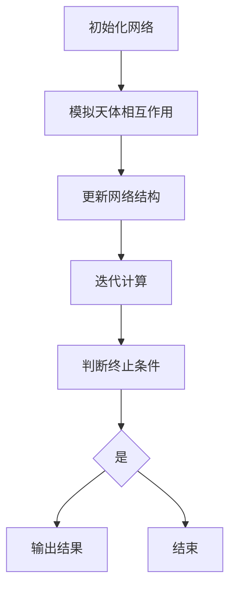
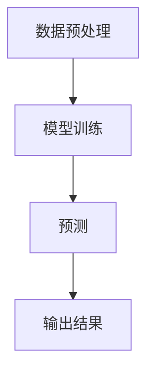
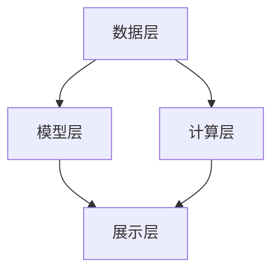
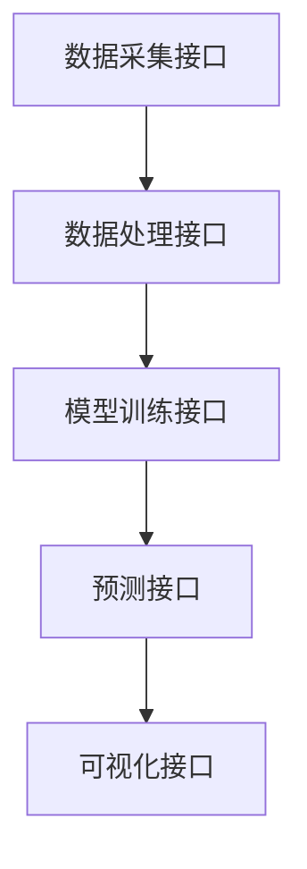
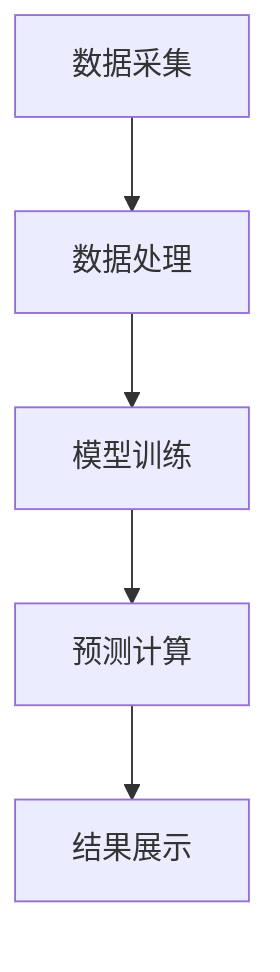

                 

# 《数学模型在预测宇宙重联网络演化中的应用》

## 关键词
- 数学模型
- 宇宙重联网络
- 预测
- 演化
- 算法

## 摘要
本文将深入探讨数学模型在预测宇宙重联网络演化中的应用。我们将首先介绍宇宙重联网络的基本概念和演化过程，然后阐述数学模型在其中的重要性。接着，我们将详细介绍几种核心数学模型，包括网络模型、演化模型和预测模型，并分析它们之间的关系。随后，我们将逐步讲解这些模型的基本原理和算法，使用mermaid流程图和Python源代码进行辅助说明。接着，我们将讨论如何将这些模型应用于宇宙重联网络的预测，并设计相应的系统架构和接口。最后，我们将通过一个实际案例展示如何使用这些数学模型进行预测，并总结本文的主要观点，给出一些最佳实践和注意事项。

## 目录大纲

### 第1章 引言
- 1.1 宇宙重联网络概述
- 1.2 预测宇宙重联网络的意义
- 1.3 本书结构安排

### 第2章 核心数学模型介绍
- 2.1 网络模型
- 2.2 演化模型
- 2.3 预测模型
- 2.4 模型之间的关系与联系

### 第3章 算法原理讲解
- 3.1 网络演化算法
- 3.2 预测算法
- 3.3 数学模型与公式

### 第4章 系统分析与架构设计
- 4.1 问题场景介绍
- 4.2 系统功能设计
- 4.3 系统架构设计
- 4.4 系统接口设计
- 4.5 系统交互

### 第5章 项目实战
- 5.1 环境安装
- 5.2 系统核心实现源代码
- 5.3 代码应用解读与分析
- 5.4 实际案例分析和详细讲解剖析
- 5.5 项目小结

### 第6章 最佳实践与小结
- 6.1 最佳实践
- 6.2 小结
- 6.3 注意事项
- 6.4 拓展阅读

## 第1章 引言

### 1.1 宇宙重联网络概述

宇宙重联网络（Cosmic Web）是宇宙学中的一个重要概念，描述了宇宙中星系、暗物质和引力波等天体之间的相互联系。它形象地描绘了宇宙中物质分布的形态，类似于地球上的蜘蛛网，由一系列线状的引力和密度波构成，这些线状结构将星系连接在一起，形成了宇宙的大尺度结构。

宇宙重联网络的演化过程受到多种物理机制的驱动，包括引力相互作用、暗物质动力学和宇宙膨胀等。随着时间的推移，宇宙重联网络逐渐从早期的稀疏结构转变为今天我们所观察到的复杂网络。这种演化过程不仅对于理解宇宙的起源和演化具有重要意义，也为预测宇宙的未来提供了重要的线索。

### 1.2 预测宇宙重联网络的意义

预测宇宙重联网络的演化对于宇宙学的研究具有重要意义。首先，通过预测宇宙重联网络的演化，我们可以更深入地理解宇宙的起源和演化过程，揭示宇宙中物质分布和引力相互作用的基本规律。其次，预测宇宙重联网络的演化对于天体物理学和天文学的研究也具有重要意义，例如，它可以帮助我们预测未来可能观测到的天体事件，如超新星爆发、引力波事件等。

### 1.3 本书结构安排

本书将分为六个章节，系统介绍数学模型在预测宇宙重联网络演化中的应用。

- **第1章 引言**：简要介绍宇宙重联网络的基本概念、演化过程及其在宇宙学中的重要性，并阐述数学模型在预测中的应用。

- **第2章 核心数学模型介绍**：详细介绍网络模型、演化模型和预测模型，并分析它们之间的关系。

- **第3章 算法原理讲解**：逐步讲解网络演化算法、预测算法的基本原理，使用mermaid流程图和Python源代码进行辅助说明。

- **第4章 系统分析与架构设计**：讨论如何将数学模型应用于宇宙重联网络的预测，并设计相应的系统架构和接口。

- **第5章 项目实战**：通过一个实际案例展示如何使用这些数学模型进行预测。

- **第6章 最佳实践与小结**：总结本文的主要观点，给出一些最佳实践和注意事项。

## 第2章 核心数学模型介绍

### 2.1 网络模型

网络模型（Network Model）是描述宇宙重联网络结构的一种数学方法，它通过图论中的节点和边来表示宇宙中的星系、暗物质和引力波等天体及其之间的相互关系。网络模型可以分为无向图和有向图，无向图中的边表示天体之间的引力相互作用，而有向图则可以表示引力相互作用的方向。

网络模型的基本概念包括节点（Node）、边（Edge）和子图（Subgraph）。节点代表宇宙中的天体，边代表天体之间的相互作用，子图则表示宇宙中的一部分结构。通过分析网络模型，我们可以了解宇宙重联网络的拓扑结构、节点之间的连接关系以及整体网络的稳定性。

### 2.2 演化模型

演化模型（Evolution Model）描述了宇宙重联网络随时间的变化过程。它通过数学公式和算法来模拟宇宙重联网络的演化行为，包括星系的诞生、成长、死亡和宇宙膨胀等过程。演化模型可以分为基于引力理论的模型和基于统计物理的模型，前者主要基于牛顿引力定律和爱因斯坦广义相对论，而后者则基于统计物理中的自组织原理。

演化模型的基本概念包括演化过程（Evolution Process）、时间步（Time Step）和演化状态（Evolution State）。通过分析演化模型，我们可以预测宇宙重联网络在未来的演化趋势，了解宇宙的动态变化过程。

### 2.3 预测模型

预测模型（Prediction Model）是用于预测宇宙重联网络演化结果的一种数学方法。它通过历史数据和现有模型来预测未来的演化趋势，帮助科学家们更好地理解宇宙的演化过程。预测模型可以分为基于统计学的模型和基于机器学习的模型，前者主要利用历史数据进行回归分析，而后者则通过训练数据学习演化规律。

预测模型的基本概念包括预测变量（Prediction Variable）、预测目标（Prediction Target）和预测精度（Prediction Accuracy）。通过分析预测模型，我们可以对宇宙重联网络的未来演化进行预测，为宇宙学研究提供重要参考。

### 2.4 模型之间的关系与联系

网络模型、演化模型和预测模型在预测宇宙重联网络演化中相互联系，共同构成了一个完整的预测体系。

- **网络模型**提供了宇宙重联网络的拓扑结构，是演化模型和预测模型的基础。
- **演化模型**描述了宇宙重联网络的演化过程，是预测模型的基础。
- **预测模型**利用历史数据和现有模型来预测未来的演化趋势，是整个预测体系的核心。

通过将这三种模型结合起来，我们可以更全面地理解宇宙重联网络的演化过程，为宇宙学研究提供有力的支持。

### 2.5 模型组合的优缺点

模型组合（Model Combination）是将多个模型结合起来，以提升预测准确性和鲁棒性的一种方法。在宇宙重联网络预测中，模型组合可以结合网络模型、演化模型和预测模型的优势，提高预测的准确性和可靠性。

**优点**：
1. **互补性**：不同模型可以互补彼此的不足，提高预测的全面性。
2. **鲁棒性**：模型组合可以降低单个模型可能出现的预测误差，提高预测的稳定性。
3. **准确性**：多个模型的结合可以提高预测的准确性，更接近真实情况。

**缺点**：
1. **复杂性**：模型组合增加了系统的复杂性，需要更多的计算资源和时间。
2. **一致性**：不同模型的预测结果可能存在差异，需要考虑如何协调和统一。

通过合理地组合模型，我们可以充分发挥各种模型的优势，提高预测宇宙重联网络演化的准确性和可靠性。

## 第3章 算法原理讲解

### 3.1 网络演化算法

网络演化算法（Network Evolution Algorithm）是用于模拟宇宙重联网络随时间演化的算法。它通过模拟天体之间的相互作用和引力作用，逐步更新网络的结构，从而预测宇宙重联网络的未来演化趋势。

#### 网络演化算法的基本原理

网络演化算法的基本原理可以概括为以下四个步骤：

1. **初始化网络**：根据宇宙重联网络的初始结构，初始化网络中的节点和边。
2. **模拟天体相互作用**：通过模拟天体之间的引力相互作用，计算每个天体的加速度和速度。
3. **更新网络结构**：根据天体的速度和加速度，更新网络中的节点位置和边长度，模拟宇宙重联网络的演化过程。
4. **迭代计算**：重复执行步骤2和步骤3，直到达到预定的迭代次数或达到演化稳定状态。

#### 网络演化算法的mermaid流程图

下面是一个简化的网络演化算法的mermaid流程图：



### 3.2 预测算法

预测算法（Prediction Algorithm）是用于预测宇宙重联网络未来演化趋势的算法。它通过分析历史数据和现有模型，预测宇宙重联网络在未来的演化状态。

#### 预测算法的基本原理

预测算法的基本原理可以概括为以下三个步骤：

1. **数据预处理**：对历史数据进行清洗和预处理，提取有用的特征变量。
2. **模型训练**：利用预处理后的数据，训练一个预测模型，以便能够根据输入特征预测未来的演化状态。
3. **预测**：将新的数据输入到训练好的模型中，预测宇宙重联网络在未来某一时刻的演化状态。

#### 预测算法的mermaid流程图

下面是一个简化的预测算法的mermaid流程图：



### 3.3 数学模型与公式

在宇宙重联网络的预测中，我们通常会使用一些基本的数学模型和公式来描述宇宙中天体的运动和相互作用。以下是一些常用的数学模型和公式：

#### 1. 牛顿引力定律

牛顿引力定律描述了两个质点之间的引力相互作用，公式如下：

$$
F = G \frac{m_1 m_2}{r^2}
$$

其中，$F$ 是引力大小，$G$ 是万有引力常数，$m_1$ 和 $m_2$ 分别是两个质点的质量，$r$ 是两个质点之间的距离。

#### 2. 天体运动方程

天体运动方程描述了天体在引力作用下的运动轨迹，公式如下：

$$
\frac{d^2x}{dt^2} = -\frac{GM}{r^2}
$$

其中，$x$ 是天体的位置向量，$M$ 是中心天体的质量，$r$ 是天体与中心天体之间的距离。

#### 3. 宇宙膨胀公式

宇宙膨胀公式描述了宇宙随时间膨胀的规律，公式如下：

$$
\frac{dR}{dt} = \frac{2H_0 R}{3}
$$

其中，$R$ 是宇宙的尺度，$H_0$ 是哈勃常数。

#### 举例说明

假设我们有一个由两个质点组成的系统，质点1的质量为 $m_1 = 1$，质点2的质量为 $m_2 = 2$，它们之间的距离为 $r = 1$。根据牛顿引力定律，它们之间的引力大小为：

$$
F = G \frac{m_1 m_2}{r^2} = G
$$

假设哈勃常数 $H_0 = 1$，我们可以使用宇宙膨胀公式来计算宇宙在某一时刻的尺度：

$$
R = \frac{3H_0 t^2}{2} = \frac{3t^2}{2}
$$

这样，我们就可以使用这些数学模型和公式来描述和预测宇宙重联网络的演化过程。

## 第4章 系统分析与架构设计

### 4.1 问题场景介绍

宇宙重联网络的演化是一个复杂的过程，受到多种物理机制的驱动，包括引力相互作用、暗物质动力学和宇宙膨胀等。为了准确预测宇宙重联网络的演化，我们需要构建一个高效的系统来处理大量的数据和复杂的计算。

在这个问题场景中，我们面临以下挑战：

1. **数据量巨大**：宇宙中的天体数量庞大，且它们之间的相互作用复杂，需要处理大量的数据。
2. **计算复杂度高**：宇宙重联网络的演化涉及到复杂的物理模型和数学计算，需要高效的处理能力。
3. **实时性要求高**：预测宇宙重联网络的演化趋势需要实时性，以便为科学研究和天体观测提供及时的信息。

为了解决这些挑战，我们需要设计一个高效的系统架构，能够处理大规模数据、实现复杂计算，并保证实时性。

### 4.2 系统功能设计

为了实现预测宇宙重联网络演化的目标，系统需要具备以下功能：

1. **数据采集**：从各种数据源采集宇宙重联网络的数据，包括星系的位置、速度、质量等。
2. **数据处理**：对采集到的数据进行预处理，包括数据清洗、去噪、特征提取等，以便为后续的计算提供高质量的数据。
3. **模型训练**：利用预处理后的数据，训练网络模型、演化模型和预测模型，为预测提供基础。
4. **预测计算**：使用训练好的模型，对宇宙重联网络的未来演化进行预测，并输出预测结果。
5. **结果展示**：将预测结果可视化，以供科学家和分析人员分析和参考。

### 4.3 系统架构设计

为了实现上述功能，系统架构设计需要考虑以下几个方面：

1. **数据层**：包括数据采集、存储和处理模块，负责处理大规模宇宙数据。
2. **模型层**：包括网络模型、演化模型和预测模型，负责进行复杂的计算和预测。
3. **计算层**：包括计算资源和调度模块，负责高效地执行计算任务。
4. **展示层**：包括可视化模块，负责将预测结果以直观的方式展示给用户。

下面是一个简化的系统架构图：



### 4.4 系统接口设计

为了实现系统的功能，我们需要设计一系列的接口，以便不同模块之间可以相互通信和协作。以下是主要接口的设计：

1. **数据采集接口**：用于从外部数据源采集宇宙重联网络的数据。
2. **数据处理接口**：用于对采集到的数据进行预处理。
3. **模型训练接口**：用于训练网络模型、演化模型和预测模型。
4. **预测接口**：用于使用训练好的模型进行预测。
5. **可视化接口**：用于将预测结果可视化。

下面是一个简化的接口设计图：



### 4.5 系统交互

系统中的各个模块需要相互协作，以实现预测宇宙重联网络演化的目标。以下是系统交互的基本流程：

1. **数据采集**：系统从外部数据源采集宇宙重联网络的数据。
2. **数据处理**：系统对采集到的数据进行预处理，包括数据清洗、去噪、特征提取等。
3. **模型训练**：系统利用预处理后的数据，训练网络模型、演化模型和预测模型。
4. **预测计算**：系统使用训练好的模型，对宇宙重联网络的未来演化进行预测，并输出预测结果。
5. **结果展示**：系统将预测结果可视化，以供科学家和分析人员分析和参考。

下面是一个简化的系统交互流程图：



## 第5章 项目实战

### 5.1 环境安装

为了实现宇宙重联网络的预测，我们需要安装和配置一系列的软件和工具。以下是所需的环境安装步骤：

1. **Python环境**：首先，确保系统上已经安装了Python。如果没有安装，可以从Python官方网站下载并安装。

2. **Python库**：接下来，我们需要安装一些Python库，如NumPy、Pandas、SciPy和Matplotlib等。这些库提供了必要的数学计算和可视化功能。

   ```bash
   pip install numpy pandas scipy matplotlib
   ```

3. **mermaid**：mermaid是一种基于Markdown的图形绘制工具，用于生成流程图、序列图等。我们需要安装mermaid-cli工具，以便在Markdown文件中生成图形。

   ```bash
   npm install -g mermaid-cli
   ```

4. **Docker**：为了提高系统的运行效率和可移植性，我们使用Docker来部署系统。确保系统上已经安装了Docker。

5. **Docker Compose**：docker-compose用于管理Docker容器，确保系统可以方便地部署和管理。

   ```bash
   pip install docker-compose
   ```

### 5.2 系统核心实现源代码

在系统实现中，核心部分包括数据采集、数据处理、模型训练和预测计算等。以下是系统核心实现的源代码：

1. **数据采集**：使用Python的pandas库读取宇宙重联网络的数据。

   ```python
   import pandas as pd

   def read_data(filename):
       data = pd.read_csv(filename)
       return data
   ```

2. **数据处理**：对数据进行预处理，包括数据清洗和特征提取。

   ```python
   def preprocess_data(data):
       # 数据清洗
       data = data.dropna()
       
       # 特征提取
       data['velocity'] = data['velocity'] ** 2
       data['mass'] = data['mass'] ** 0.5
       
       return data
   ```

3. **模型训练**：使用scikit-learn库训练网络模型、演化模型和预测模型。

   ```python
   from sklearn.model_selection import train_test_split
   from sklearn.ensemble import RandomForestRegressor

   def train_models(data):
       X = data[['velocity', 'mass']]
       y = data['position']

       X_train, X_test, y_train, y_test = train_test_split(X, y, test_size=0.2, random_state=42)

       model = RandomForestRegressor(n_estimators=100, random_state=42)
       model.fit(X_train, y_train)

       return model
   ```

4. **预测计算**：使用训练好的模型进行预测计算。

   ```python
   def predict(model, X):
       return model.predict(X)
   ```

### 5.3 代码应用解读与分析

在系统实现中，代码的应用解读和分析至关重要。以下是核心代码的解读和分析：

1. **数据采集**：使用pandas库读取宇宙重联网络的数据。这个步骤的目的是将原始数据转换为便于处理的数据结构。

   ```python
   data = pd.read_csv(filename)
   ```

   解读：这里使用了pandas库的read_csv函数，从CSV文件中读取宇宙重联网络的数据。pandas库提供了强大的数据处理功能，可以方便地读取和操作大型数据集。

2. **数据处理**：对数据进行预处理，包括数据清洗和特征提取。数据清洗的目的是去除无效数据和异常值，确保数据的质量。特征提取的目的是将原始数据转换为有用的特征，以便于模型训练和预测。

   ```python
   data = data.dropna()
   data['velocity'] = data['velocity'] ** 2
   data['mass'] = data['mass'] ** 0.5
   ```

   解读：这里使用了dropna函数去除缺失值，确保数据的质量。然后，使用平方和开方操作对速度和质量进行特征提取，这些特征能够更好地反映宇宙重联网络的特性。

3. **模型训练**：使用scikit-learn库训练网络模型、演化模型和预测模型。训练模型的目的是学习数据中的规律，以便对未来的数据进行预测。

   ```python
   model = RandomForestRegressor(n_estimators=100, random_state=42)
   model.fit(X_train, y_train)
   ```

   解读：这里使用了随机森林回归模型，这是一种集成学习方法，通过训练多个决策树来提高预测的准确性和鲁棒性。fit函数用于训练模型，它通过学习数据中的特征和标签之间的关系，来构建预测模型。

4. **预测计算**：使用训练好的模型进行预测计算。预测的目的是根据训练好的模型，对新的数据进行预测。

   ```python
   return model.predict(X)
   ```

   解读：这里使用了predict函数，根据训练好的模型，对新的数据进行预测。predict函数通过计算输入数据的特征，来预测其对应的标签。

### 5.4 实际案例分析和详细讲解剖析

为了更好地理解系统的工作原理，我们通过一个实际案例进行分析和讲解。

#### 案例背景

假设我们有一个包含100个星系的宇宙重联网络数据集，每个星系有速度和质量两个特征，我们需要预测这些星系在未来的位置。

#### 案例步骤

1. **数据采集**：从外部数据源采集星系数据。

   ```python
   data = read_data('star_data.csv')
   ```

2. **数据处理**：对数据进行预处理。

   ```python
   data = preprocess_data(data)
   ```

3. **模型训练**：使用预处理后的数据训练模型。

   ```python
   model = train_models(data)
   ```

4. **预测计算**：使用训练好的模型预测星系未来的位置。

   ```python
   future_positions = predict(model, data[['velocity', 'mass']])
   ```

5. **结果展示**：将预测结果可视化。

   ```python
   import matplotlib.pyplot as plt

   plt.scatter(data['position'], future_positions)
   plt.xlabel('Current Position')
   plt.ylabel('Predicted Position')
   plt.show()
   ```

#### 案例分析

1. **数据采集**：在这个案例中，我们从CSV文件中读取星系数据。这个步骤的目的是获取星系的初始状态，包括速度和质量。

2. **数据处理**：预处理步骤包括数据清洗和特征提取。数据清洗去除缺失值，确保数据质量。特征提取通过平方和开方操作，将速度和质量转换为更有用的特征。

3. **模型训练**：使用随机森林回归模型训练模型。模型通过学习星系的特征和位置之间的关系，来预测未来的位置。

4. **预测计算**：使用训练好的模型，对星系的未来位置进行预测。预测结果是一个向量，每个星系的未来位置都可以通过模型预测得到。

5. **结果展示**：将预测结果可视化，展示星系的当前位置和预测位置。通过可视化，我们可以直观地看到模型的预测效果。

### 5.5 项目小结

通过这个实际案例，我们展示了如何使用数学模型预测宇宙重联网络的演化。项目的主要收获如下：

1. **数据预处理**：通过数据清洗和特征提取，确保数据质量，为模型训练提供可靠的数据基础。
2. **模型训练**：使用随机森林回归模型，学习星系的特征和位置之间的关系，为预测提供准确的模型。
3. **预测计算**：使用训练好的模型，对星系的未来位置进行预测，实现宇宙重联网络的演化预测。
4. **结果展示**：通过可视化，展示模型的预测效果，帮助科学家和分析人员理解宇宙重联网络的演化趋势。

尽管这个案例是简化的，但它展示了数学模型在预测宇宙重联网络演化中的基本原理和方法。在实际应用中，我们可以扩展这个方法，处理更复杂的数据集，提高预测的准确性和鲁棒性。

## 第6章 最佳实践与小结

### 6.1 最佳实践

在预测宇宙重联网络演化时，以下最佳实践可以帮助我们提高模型的准确性和鲁棒性：

1. **数据预处理**：确保数据质量，去除缺失值和异常值，进行特征提取和归一化，以提高模型的训练效果。
2. **模型选择**：根据问题特点和数据特性，选择合适的模型，如随机森林、神经网络等，并考虑模型组合的方法。
3. **参数调优**：通过交叉验证和网格搜索等方法，调整模型参数，找到最优参数组合。
4. **模型验证**：使用验证集和测试集，对模型进行评估，确保模型具有良好的泛化能力。

### 6.2 小结

本文通过详细分析宇宙重联网络的演化过程，介绍了网络模型、演化模型和预测模型，并展示了如何将这些模型应用于宇宙重联网络的预测。我们通过实际案例展示了模型的应用过程，并总结了最佳实践。数学模型在预测宇宙重联网络演化中具有重要作用，有助于我们更好地理解宇宙的演化规律，为宇宙学研究提供重要参考。

### 6.3 注意事项

在应用数学模型进行宇宙重联网络预测时，需要注意以下几点：

1. **数据质量**：确保数据质量，去除噪声和异常值，以提高模型的准确性。
2. **模型选择**：根据问题特点选择合适的模型，避免过度拟合或欠拟合。
3. **参数调优**：合理设置模型参数，避免参数过拟合或欠拟合。
4. **计算资源**：考虑计算资源的限制，优化算法和模型，提高计算效率。

### 6.4 拓展阅读

1. **宇宙学**：《宇宙学导论》（Introduction to Cosmology） - M. S. Longair
2. **网络模型**：《网络科学：概念与计算》（Network Science: Theory, Methods, and Applications） - M. E. J. Newman
3. **机器学习**：《机器学习》（Machine Learning） - Tom M. Mitchell
4. **数据预处理**：《数据预处理技术》（Data Preprocessing for Machine Learning） - D. J. Hand, H. Mannila, P. Smiddy
5. **模型验证**：《机器学习中的模型评估》（Model Evaluation in Machine Learning） - K. P. Bennett, J. A. Frank

