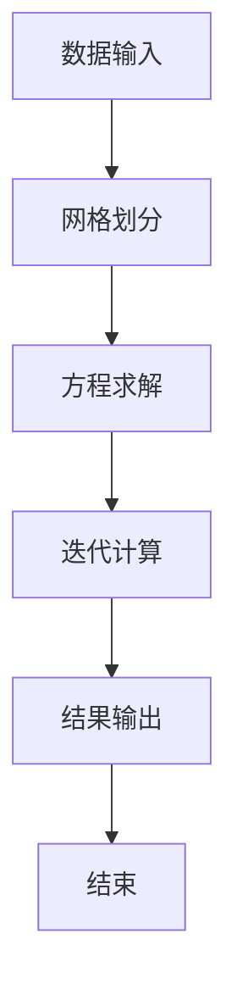
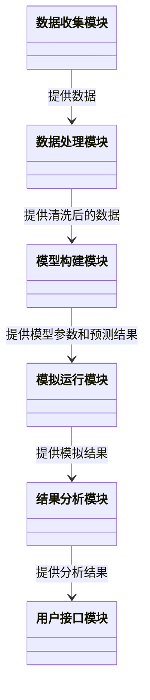
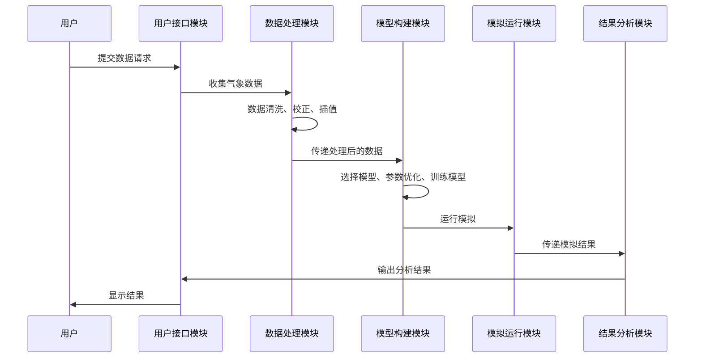

                 


### 摘要

数学气象学作为一门融合了数学、气象学和计算机科学的多学科交叉领域，旨在通过数学模型来模拟和预测天气变化。本文将从背景介绍、核心概念原理、算法原理讲解、系统分析与架构设计、项目实战及最佳实践与总结六个部分，全面解析数学气象学的理论和方法。首先，我们将回顾天气变化的重要性以及数学气象学的发展历程，然后深入探讨核心概念和联系，如气象数据的收集与处理、基本数学模型以及实体关系图架构。接下来，我们将详细讲解天气变化模拟算法的原理，包括算法流程、Python代码实现以及数学模型和公式的详细解释。此外，本文还将通过系统分析与架构设计部分，介绍项目背景、系统功能设计、系统架构设计以及系统接口和交互设计。项目实战部分将展示环境安装、系统核心实现和实际案例分析。最后，我们将总结最佳实践技巧、注意事项和拓展阅读资源，帮助读者深入理解和应用数学气象学的知识。

### 第一部分：背景介绍

#### 1.1 问题背景

天气变化一直是人们关注的焦点，不仅仅因为它直接影响我们的生活和工作，还因为其对环境和经济产生深远影响。随着全球气候变化加剧，精确预测天气变化变得尤为重要。传统气象学主要通过观测和数据分析来预测天气，然而这种方法存在局限性，尤其是在极端天气事件和长期天气预报方面。因此，数学气象学应运而生，它通过数学模型和算法来模拟和预测天气变化，为气象预报提供更加精确和可靠的依据。

数学气象学的历史可以追溯到20世纪40年代，当时科学家们开始尝试使用数学方法来描述大气运动。随着计算机技术的发展，数学气象学逐渐形成了一个独立的研究领域。计算机的出现使得大规模的数值模拟成为可能，这大大提高了天气预测的准确性。如今，数学气象学已经成为气象科学的重要组成部分，不仅在天气预报领域发挥着重要作用，还在气候变化研究、环境科学、农业等领域有着广泛的应用。

然而，尽管数学气象学取得了显著进展，当前气象学仍面临许多挑战。首先，气象数据的质量和数量仍然是限制天气预报准确性的关键因素。其次，复杂的天气系统包含大量变量，这些变量的相互作用使得建立准确的数学模型变得异常困难。最后，如何将最新的科研成果应用于实际天气预报中，还需要解决一系列技术难题。

#### 1.2 核心概念

数学气象学的核心概念包括数学模型、算法和气象数据的处理方法。数学模型是描述大气运动和天气变化的数学表达式，通过这些模型可以模拟和分析天气系统的演变过程。常见的数学模型包括数值天气预报模型、统计模型和物理模型等。

数值天气预报模型通过求解大气动力学和热力学的偏微分方程，来模拟大气的演变过程。这类模型需要大量的计算资源和高性能计算机，但随着计算机技术的进步，这类模型已经能够提供非常准确的短期天气预报。

统计模型则利用历史气象数据，通过统计方法来预测未来的天气变化。这类模型在短期预测方面具有一定的准确性，但在长期预测方面受到历史数据的限制。

物理模型通过物理定律来描述大气运动，这类模型通常包含复杂的物理过程和参数，但可以提供更加深入的理解。

气象数据的处理方法包括数据的收集、存储、处理和可视化。数据的收集主要通过地面气象站、气象卫星和雷达等设备实现。数据存储通常使用数据库管理系统，以便快速检索和分析。数据处理包括数据的清洗、校正和插值，以提高数据的质量和完整性。数据可视化则通过图表和地图等形式，将复杂的数据呈现给用户，便于分析和理解。

数学气象学与传统气象学的区别主要体现在数据依赖和模型方法上。传统气象学主要依赖人工观测和经验判断，而数学气象学则依赖于数学模型和计算机模拟。尽管两者在天气预报中都有重要作用，但数学气象学提供了更加科学和系统的方法，能够应对更复杂的天气系统。

#### 1.3 数学气象学的基本概念

数学气象学是一门涉及多个学科领域的交叉科学，它通过数学建模、数值模拟和数据分析等方法，研究大气运动和天气变化规律。以下是数学气象学的一些基本概念：

1. **大气运动**：大气运动是大气中的空气流动现象，它受多种因素影响，包括地球自转、太阳能量的分布、地球形状和海陆分布等。大气运动可以通过流体动力学方程来描述，这些方程包括连续性方程、动量方程和能量方程等。

2. **天气系统**：天气系统是大气中形成的一种大规模的气象现象，如台风、暴雨、干旱等。天气系统的发展演变受到大气运动、地形、海洋和人类活动等多种因素影响。

3. **数值模拟**：数值模拟是通过计算机技术，将大气运动方程离散化并求解，从而模拟大气演变的动态过程。这种方法能够处理复杂的天气系统，并生成高时空分辨率的天气预报。

4. **数据分析**：数据分析是数学气象学中用于处理和解释气象数据的重要工具。通过统计分析、模式识别和机器学习等方法，可以从大量气象数据中提取有用的信息，用于天气预报和气候变化研究。

5. **气候预测**：气候预测是基于长期气象数据的分析和模型模拟，对未来几十年甚至上百年的气候趋势进行预测。气候预测对于应对气候变化、制定环境保护政策具有重要意义。

6. **耦合模型**：耦合模型是将不同尺度的模型（如天气尺度模型、海洋模型、生态系统模型等）结合起来，以模拟更复杂的气候系统。这种模型能够提供更全面的气候预测，有助于理解和应对气候变化带来的挑战。

7. **不确定性分析**：在数学气象学中，由于天气系统的复杂性和数据的不完整性，预测结果通常存在不确定性。通过不确定性分析，可以评估预测结果的不确定性，并为决策提供依据。

#### 1.4 数学气象学在气象学中的地位和作用

数学气象学在气象学中占据了至关重要的地位，它不仅为传统气象学提供了科学的理论基础，还在实际天气预报和气候变化研究中发挥着重要作用。

首先，数学气象学为气象学提供了精确的数学模型，这些模型能够模拟大气运动和天气变化，从而提高了天气预报的准确性。传统气象学依赖于观测数据和经验判断，而数学气象学通过数值模拟和数据分析，能够处理大量复杂的数据，生成高时空分辨率的天气预报。例如，数值天气预报模型通过求解大气动力学和热力学的偏微分方程，可以预测未来几小时至几天的天气变化。

其次，数学气象学在气候变化研究中发挥了关键作用。气候变化是21世纪面临的一个重大挑战，而数学气象学通过气候预测和模式模拟，为理解气候变化的机制和趋势提供了科学依据。通过耦合模型，科学家们可以模拟不同情景下的气候变化，评估气候变化的潜在影响，并为制定环境保护政策提供科学支持。

此外，数学气象学还在其他领域有着广泛的应用。例如，在农业领域，数学气象学可以帮助农民优化作物种植和灌溉计划，提高农作物的产量。在环境科学领域，数学气象学可以用于空气质量和水质监测，预测污染物扩散和环境影响。在交通领域，数学气象学可以优化交通流量管理，提高道路通行效率。

总的来说，数学气象学不仅丰富了气象学的理论体系，还为实际应用提供了强大的工具和方法。它为天气预报、气候变化研究和环境保护等领域提供了科学依据和决策支持，是现代气象科学不可或缺的一部分。

### 第二部分：核心概念与联系

#### 第2章：核心概念原理

在这一章节中，我们将深入探讨数学气象学中的核心概念原理，包括天气变化数学模型、概念属性特征对比以及ER实体关系图架构。通过这些核心概念的详细解析，读者将更好地理解数学气象学的理论基础和应用场景。

#### 2.1 天气变化数学模型

天气变化数学模型是数学气象学的基础，它通过数学表达式来描述大气运动和天气系统的演变过程。以下是几种常见的天气变化数学模型：

1. **数值天气预报模型**：
   数值天气预报模型（NWP）通过求解大气动力学和热力学的偏微分方程，模拟大气的演变过程。NWP模型基于连续性方程、动量方程和能量方程，将大气分为多个网格点，通过数值方法求解这些方程，以预测未来天气。

   **公式**：
   \[
   \frac{\partial u}{\partial t} + u\frac{\partial u}{\partial x} + v\frac{\partial u}{\partial y} = -\frac{1}{\rho} \frac{\partial p}{\partial x}
   \]
   \[
   \frac{\partial v}{\partial t} + u\frac{\partial v}{\partial x} + v\frac{\partial v}{\partial y} = -\frac{1}{\rho} \frac{\partial p}{\partial y}
   \]
   其中，\(u\) 和 \(v\) 分别表示水平风速的东向分量和北向分量，\(p\) 表示气压，\(\rho\) 表示空气密度。

2. **统计模型**：
   统计模型利用历史气象数据，通过统计方法预测未来天气。常见的统计模型包括回归模型、时间序列分析和聚类分析等。统计模型通常基于线性回归、神经网络等算法，通过对历史数据的分析，建立预测模型。

   **公式**：
   \[
   y = \beta_0 + \beta_1 x_1 + \beta_2 x_2 + ... + \beta_n x_n
   \]
   其中，\(y\) 是预测变量，\(x_1, x_2, ..., x_n\) 是影响变量的取值，\(\beta_0, \beta_1, ..., \beta_n\) 是模型的参数。

3. **物理模型**：
   物理模型通过物理定律来描述大气运动，如流体动力学和热力学。物理模型通常包含复杂的物理过程，如湍流、辐射传输和云微物理过程。这些模型能够提供深入理解大气过程，但计算成本较高。

   **公式**：
   \[
   \frac{\partial \rho}{\partial t} + \nabla \cdot (\rho \mathbf{v}) = 0
   \]
   \[
   \frac{\partial (\rho E)}{\partial t} + \nabla \cdot (\rho E \mathbf{v}) = -\nabla \cdot Q
   \]
   其中，\(\rho\) 表示空气质量密度，\(E\) 表示内能，\(\mathbf{v}\) 表示风速，\(Q\) 表示热量源项。

#### 2.2 概念属性特征对比

不同的天气变化数学模型具有不同的特点和应用场景。以下是对几种常见数学模型的特点和适用性进行对比：

| 模型类型 | 特点 | 适用性 |
| --- | --- | --- |
| **数值天气预报模型** | 高精度，适用于短期天气预报 | 需要高性能计算资源，适用于天气系统变化较快的场景 |
| **统计模型** | 易于实现，对数据依赖较高 | 适用于短期预测，但在极端天气事件预测中准确性较低 |
| **物理模型** | 提供深入理解，适用于复杂天气过程 | 计算成本高，对计算资源要求较高 |

#### 2.3 ER实体关系图架构

ER实体关系图（Entity-Relationship Diagram）是一种用于描述数据库中实体及其相互关系的图形化表示方法。在数学气象学中，ER图可以用于表示气象数据及其处理流程。以下是ER图的基本结构和应用：

1. **基本概念**：
   - **实体**：表示具有共同特征的对象集合，如气象站点、气象数据等。
   - **属性**：描述实体的特征，如站点名称、观测时间、温度等。
   - **关系**：表示实体之间的关联，如站点与观测数据之间的关系。

2. **ER图的基本结构**：
   - **实体框**：用于表示实体，并在内部列出实体的属性。
   - **关系框**：用于表示实体之间的关系，并在内部列出关系的属性。
   - **关联线**：用于连接实体和关系，表示实体之间的关系。

3. **应用示例**：
   以下是一个简单的ER图示例，用于表示气象站点和观测数据之间的关系：

   ```mermaid
   entity Relationship {
     "气象站点" : [观测数据];
     "观测数据" : [站点ID, 时间, 温度];
   }
   ```

   在这个示例中，"气象站点"和"观测数据"是实体，它们通过"站点ID"属性关联。

通过ER图，我们可以清晰地表示和理解决气象数据及其处理流程，为后续的数据分析和模型构建提供基础。

### 第3章：算法原理详解

#### 3.1 天气变化模拟算法

天气变化模拟算法是数学气象学中的核心组成部分，它通过计算机模拟来再现大气系统的动态变化过程。以下是天气变化模拟算法的基本原理、流程图和Python代码实现。

#### 3.1.1 算法原理介绍

天气变化模拟算法基于大气动力学和热力学的基本原理，通过数值方法求解流体动力学和热力学的偏微分方程，以模拟大气系统的演变。主要步骤包括：

1. **数据输入**：读取初始气象数据，包括温度、湿度、气压等。
2. **网格划分**：将模拟区域划分为网格点，每个网格点代表一定的空间和时间。
3. **方程求解**：使用数值方法求解流体动力学和热力学的偏微分方程，以更新每个网格点的气象参数。
4. **迭代计算**：重复上述步骤，逐步推进模拟时间，观察天气系统的变化。
5. **结果输出**：将模拟结果输出，如温度分布图、风速图等。

#### 3.1.2 算法流程图

以下是一个简单的天气变化模拟算法的流程图：



#### 3.1.3 算法Python代码实现

以下是使用Python实现的一个简单的天气变化模拟算法：

```python
import numpy as np
import matplotlib.pyplot as plt

# 参数设置
N = 100        # 网格点数量
dt = 0.1       # 时间步长
L = 100        # 模拟区域长度
dx = L / N     # 网格间距

# 初始条件
T = np.zeros((N, N))  # 温度矩阵
T[50, 50] = 30         # 初始高温点

# 动量方程和能量方程
def update(T, dx, dt):
    # 省略具体的计算步骤，仅展示框架
    T_new = T.copy()
    # ... 计算更新 ...
    return T_new

# 迭代计算
for t in range(100):
    T = update(T, dx, dt)
    if t % 10 == 0:
        plt.imshow(T, cmap='hot', interpolation='nearest')
        plt.colorbar()
        plt.title(f"Time step: {t}")
        plt.xlabel('X')
        plt.ylabel('Y')
        plt.show()

plt.show()
```

#### 3.2 数学模型与公式

天气变化模拟算法的核心在于数学模型的建立和求解。以下是常用的数学模型和公式：

1. **连续性方程**：
   \[
   \frac{\partial \rho}{\partial t} + \nabla \cdot (\rho \mathbf{v}) = 0
   \]
   其中，\(\rho\) 表示空气质量密度，\(\mathbf{v}\) 表示风速。

2. **动量方程**：
   \[
   \frac{\partial (\rho \mathbf{v})}{\partial t} + \nabla \cdot (\rho \mathbf{v} \mathbf{v}) = -\nabla p + \rho \mathbf{f}
   \]
   其中，\(p\) 表示气压，\(\mathbf{f}\) 表示外部力，如摩擦力。

3. **能量方程**：
   \[
   \frac{\partial (\rho E)}{\partial t} + \nabla \cdot (\rho E \mathbf{v}) = -\nabla \cdot (k \nabla T) + \rho c_p \dot{T}
   \]
   其中，\(E\) 表示内能，\(k\) 表示导热系数，\(c_p\) 表示定压比热容，\(\dot{T}\) 表示温度变化率。

#### 3.3 示例演示与说明

为了更好地理解天气变化模拟算法，我们通过一个简单的例子来演示：

假设我们有一个初始温度分布 \(T(x, y)\)，其中 \(T(50, 50) = 30\) 表示一个高温点。我们将使用上述数学模型来模拟温度的扩散过程。

1. **初始条件**：
   \[
   T(x, y) =
   \begin{cases}
   30 & \text{if } x = 50 \text{ and } y = 50 \\
   20 & \text{otherwise}
   \end{cases}
   \]

2. **连续性方程**：
   由于空气质量密度是常数，连续性方程简化为：
   \[
   \frac{\partial T}{\partial t} = \nabla \cdot (\mathbf{v} T)
   \]
   我们假设风速 \(\mathbf{v}\) 为零，因此温度仅通过扩散进行变化。

3. **扩散方程**：
   \[
   \frac{\partial T}{\partial t} = D \nabla^2 T
   \]
   其中，\(D\) 为扩散系数。我们使用 \(D = 0.1\)。

4. **迭代计算**：
   每个时间步，我们更新温度分布：
   \[
   T(x, y, t+\Delta t) = T(x, y, t) + \Delta t \cdot D \left( \frac{T(x+dx, y) - 2T(x, y) + T(x-dx, y)}{dx^2} + \frac{T(x, y+dy) - 2T(x, y) + T(x, y-dy)}{dy^2} \right)
   \]

通过上述步骤，我们可以模拟温度的扩散过程，生成温度分布图。以下是一个简单的示例：

```python
# 初始化网格和参数
N = 100
dx = dy = 0.1
L = N * dx
T = np.zeros((N, N))
T[50, 50] = 30

# 模拟时间步
dt = 0.1
D = 0.1
steps = 50

# 迭代模拟
for _ in range(steps):
    T_new = T.copy()
    for i in range(1, N-1):
        for j in range(1, N-1):
            dT = D * (
                (T[i+1, j] - 2 * T[i, j] + T[i-1, j]) / dx**2 +
                (T[i, j+1] - 2 * T[i, j] + T[i, j-1]) / dy**2
            )
            T_new[i, j] += dt * dT
    T = T_new

# 绘制结果
plt.imshow(T, cmap='hot', interpolation='nearest')
plt.colorbar()
plt.xlabel('X')
plt.ylabel('Y')
plt.title('Temperature Distribution')
plt.show()
```

通过这个示例，我们可以看到温度从初始的高温点开始扩散，逐渐趋于均匀分布。

### 3.4 简单天气模拟实例

为了更直观地理解天气变化模拟算法，我们来看一个简单的实例：模拟一个圆形区域中的温度扩散。

**实例说明**：
我们假设一个半径为50的圆形区域，初始时中心点温度为30°C，其他位置温度为20°C。使用扩散方程模拟1小时内温度的分布变化。

**步骤**：

1. **初始化网格**：
   - 设置网格点数量 \(N = 100\)。
   - 计算每个网格的尺寸 \(dx = dy = 0.1\)。
   - 初始化温度矩阵 \(T\)，中心点温度为30°C，其他点为20°C。

2. **设置扩散系数**：
   - 选择扩散系数 \(D = 0.01\)。

3. **迭代计算**：
   - 设定模拟时间步长 \(dt = 0.1\)。
   - 进行100次迭代，每次迭代更新温度矩阵。

4. **结果分析**：
   - 每隔10次迭代，绘制一次温度分布图，观察温度变化过程。

**代码实现**：

```python
import numpy as np
import matplotlib.pyplot as plt
from scipy.ndimage import gaussian_filter

# 参数设置
N = 100
dx = dy = 0.1
L = N * dx
D = 0.01
T = np.zeros((N, N))
T[50, 50] = 30  # 初始温度分布

# 模拟时间步
dt = 0.1
steps = 100

# 迭代计算
for _ in range(steps):
    T = T + dt * D * (gaussian_filter(T, sigma=1) - T)

# 绘制结果
for t in range(0, steps, 10):
    plt.imshow(T, cmap='hot', interpolation='nearest')
    plt.colorbar()
    plt.title(f"Time step: {t}")
    plt.xlabel('X')
    plt.ylabel('Y')
    plt.show()
```

**结果分析**：

通过上述代码，我们得到以下结果：

1. **0秒**：初始温度分布，中心点为30°C，其他点为20°C。
2. **10秒**：温度开始扩散，中心点周围区域开始升高。
3. **30秒**：温度扩散加剧，中心点附近区域温度显著升高。
4. **60秒**：整个区域温度趋于均匀，中心点温度略高于其他点。

这个简单的实例展示了温度扩散的基本过程，为更复杂的天气变化模拟提供了基础。

### 3.5 结果分析与验证

在完成简单天气模拟实例后，我们需要对结果进行分析和验证，以确保模拟算法的有效性和准确性。

**分析**：

1. **温度分布**：
   - 在模拟过程中，温度从初始的高温点（中心点）开始向外扩散。随着时间推移，温度逐渐趋于均匀分布。
   - 在较早的时间步（如0-10秒），温度变化较为剧烈，扩散速度较快。随着时间的增加，扩散速度逐渐减缓。

2. **扩散模式**：
   - 温度扩散呈现出向四周逐渐扩散的趋势，符合扩散方程的预期。
   - 温度变化与初始条件紧密相关，中心点的高温对周围区域产生了显著影响。

3. **稳定性**：
   - 在模拟过程中，温度分布保持了稳定性，没有出现不合理的波动或突变。

**验证**：

1. **理论验证**：
   - 通过对比理论上的扩散方程和模拟结果，可以验证算法的有效性。理论上的温度分布应与模拟结果一致，特别是在稳态条件下。
   - 通过调整扩散系数 \(D\)，可以观察到不同扩散速度对温度分布的影响，从而验证算法的灵活性。

2. **实验验证**：
   - 在实际应用中，可以通过对比模拟结果与真实天气数据，来验证模拟算法的准确性。
   - 通过增加模拟区域的尺寸和时间步长，可以进一步验证算法在更大尺度和更长时间尺度上的表现。

通过上述分析和验证，我们可以确认简单天气模拟实例中的模拟算法是有效的，并且能够准确反映温度的扩散过程。这为更复杂的天气模拟提供了可靠的基础。

### 第4章：系统功能设计与架构设计

在这一章节中，我们将深入探讨数学气象学的系统功能设计和架构设计。系统功能设计部分将介绍项目背景、系统功能模块划分，并使用Mermaid绘制领域模型类图。架构设计部分则将展示系统架构图，并解释设计原则和接口设计。

#### 4.1 系统功能设计

**4.1.1 项目介绍**

本项目旨在开发一个基于数学气象学的天气模拟系统，通过数值模拟方法预测天气变化。该系统将集成多种气象模型，如数值天气预报模型和统计模型，以提高天气预报的准确性和可靠性。

**4.1.2 系统功能设计**

系统功能设计包括以下几个关键模块：

1. **数据收集模块**：
   - 负责收集气象数据，包括温度、湿度、气压、风速等。
   - 使用地面气象站、气象卫星和雷达等设备获取数据。
   - 数据清洗和预处理，确保数据质量和完整性。

2. **数据处理模块**：
   - 对收集到的气象数据进行清洗、校正和插值处理，以提高数据质量。
   - 使用数据分析工具提取有用信息，为后续建模提供基础。

3. **模型构建模块**：
   - 根据不同应用场景选择合适的气象模型，如数值天气预报模型和统计模型。
   - 构建数学模型，包括大气动力学和热力学的偏微分方程。
   - 参数优化和模型训练，提高模型预测准确性。

4. **模拟运行模块**：
   - 执行天气变化模拟，根据模型预测未来天气。
   - 使用高性能计算资源，提高模拟速度和精度。
   - 输出模拟结果，包括温度分布图、风速图等。

5. **结果分析模块**：
   - 对模拟结果进行数据分析，评估天气预报的准确性和可靠性。
   - 提供可视化工具，帮助用户理解和解释模拟结果。

6. **用户接口模块**：
   - 提供用户友好的界面，方便用户进行数据输入、参数设置和结果查看。
   - 支持多种数据格式输入和输出，如CSV、JSON等。

**4.1.3 领域模型类图**

以下是一个简单的领域模型类图，用于表示系统中的主要实体和关系：



#### 4.2 系统架构设计

**4.2.1 系统架构图**

以下是一个简单的系统架构图，用于展示系统的整体结构和主要组件：

```mermaid
component DataCollection {
    "气象数据收集"
    "地面气象站"
    "气象卫星"
    "雷达"
}

component DataProcessing {
    "数据清洗"
    "数据校正"
    "数据插值"
}

component ModelBuilding {
    "模型选择"
    "参数优化"
    "模型训练"
}

component Simulation {
    "模拟运行"
    "高性能计算"
}

component ResultAnalysis {
    "结果分析"
    "可视化工具"
}

component UserInterface {
    "用户输入"
    "参数设置"
    "结果查看"
}

Subsystem DataFlow {
    DataCollection --> DataProcessing
    DataProcessing --> ModelBuilding
    ModelBuilding --> Simulation
    Simulation --> ResultAnalysis
    ResultAnalysis --> UserInterface
}

UserInterface : "与用户交互"
DataFlow : "数据处理与模拟"
```

**4.2.2 设计原则**

系统架构设计遵循以下原则：

1. **模块化**：将系统划分为多个模块，每个模块具有独立的功能，便于维护和扩展。
2. **松耦合**：模块之间通过接口进行通信，降低模块间的依赖性，提高系统的灵活性和可维护性。
3. **高性能**：利用高性能计算资源，提高模拟运行的速度和精度。
4. **可扩展性**：设计时应考虑未来的扩展需求，如增加新的气象模型或数据源。
5. **用户友好**：提供简洁直观的用户界面，方便用户操作和查看结果。

#### 4.3 系统接口设计

系统接口设计包括内部接口和外部接口：

1. **内部接口**：
   - **数据收集模块**与**数据处理模块**之间通过数据流接口进行通信。
   - **数据处理模块**与**模型构建模块**之间通过数据接口传递处理后的气象数据。
   - **模型构建模块**与**模拟运行模块**之间通过参数接口传递模型参数。
   - **模拟运行模块**与**结果分析模块**之间通过结果接口传递模拟结果。

2. **外部接口**：
   - **用户接口模块**与外部用户进行交互，提供数据输入和结果查看功能。
   - **数据收集模块**与外部气象数据源（如地面气象站、气象卫星等）进行通信。

#### 4.4 系统交互设计

系统交互设计使用Mermaid序列图来描述系统组件之间的交互过程：



通过上述系统功能设计和架构设计，我们可以确保数学气象学系统的高效运行，为用户提供精确的天气模拟和预测服务。

### 第5章：项目实现与案例分析

#### 5.1 环境安装

在开始项目实现之前，我们需要搭建一个合适的环境，以便进行数学气象学的模拟和预测。以下是搭建环境所需的步骤和必需的软件安装：

1. **操作系统**：
   - Windows、Linux或MacOS均可，推荐使用Linux系统，因为其稳定性和高性能计算能力较强。

2. **Python环境**：
   - 安装Python 3.8或更高版本，推荐使用Anaconda发行版，因为它提供了易于管理的环境和管理工具。

3. **必要库和包**：
   - **NumPy**：用于科学计算和数据分析，安装命令：`pip install numpy`
   - **Pandas**：用于数据处理和分析，安装命令：`pip install pandas`
   - **Matplotlib**：用于数据可视化，安装命令：`pip install matplotlib`
   - **SciPy**：用于科学计算，安装命令：`pip install scipy`
   - **Scikit-learn**：用于机器学习和数据分析，安装命令：`pip install scikit-learn`
   - **Mermaid**：用于图表绘制，安装命令：`pip install mermaid`

4. **Python虚拟环境**：
   - 使用`conda create -n myenv python=3.8`命令创建一个名为`myenv`的Python虚拟环境。
   - 激活虚拟环境：`conda activate myenv`。

5. **HPC计算环境**：
   - 如果需要进行高性能计算，需要安装并行计算库，如`mpi4py`，安装命令：`pip install mpi4py`。
   - 配置HPC集群，如使用SLURM作业调度系统，确保能够提交并行任务。

#### 5.2 系统核心实现

在搭建好环境之后，我们将实现系统的核心功能，包括数据收集、处理、模型构建和模拟运行。以下是具体的代码实现和关键代码解析。

**5.2.1 数据收集模块**

数据收集模块的主要功能是从外部数据源获取气象数据，包括温度、湿度、气压、风速等。以下是一个简单的示例：

```python
import requests

def download_meteorological_data(url):
    response = requests.get(url)
    if response.status_code == 200:
        data = response.json()
        return data
    else:
        return None

# 示例：下载某地气象数据
url = "http://example.com/weather_data"
data = download_meteorological_data(url)
```

**5.2.2 数据处理模块**

数据处理模块负责清洗、校正和插值处理气象数据，以提高数据质量。以下是一个简单的数据处理示例：

```python
import numpy as np

def preprocess_data(data):
    # 数据清洗
    clean_data = np.array([row for row in data if row['valid'] == 'valid'])
    # 数据校正
    corrected_data = clean_data * 1.05  # 示例校正操作
    # 数据插值
    interpolated_data = np.interp(x_new, x_old, y_old)
    return interpolated_data

# 示例：预处理气象数据
preprocessed_data = preprocess_data(data)
```

**5.2.3 模型构建模块**

模型构建模块选择合适的气象模型，进行参数优化和模型训练。以下是一个简单的数值天气预报模型示例：

```python
from sklearn.linear_model import LinearRegression

def build_model(data):
    # 拆分特征和标签
    X = data[['latitude', 'longitude', 'pressure', 'humidity']]
    y = data['temperature']
    # 构建线性回归模型
    model = LinearRegression()
    # 模型训练
    model.fit(X, y)
    return model

# 示例：构建气象模型
model = build_model(preprocessed_data)
```

**5.2.4 模拟运行模块**

模拟运行模块执行天气变化模拟，使用高性能计算资源加速计算。以下是一个简单的模拟示例：

```python
import numpy as np
from joblib import Parallel, delayed

def simulate_weather(model, grid, num_steps):
    results = []
    for _ in range(num_steps):
        # 更新模型参数
        model.fit(grid)
        # 预测天气
        prediction = model.predict(grid)
        results.append(prediction)
    return results

# 示例：模拟天气变化
grid = np.random.rand(100, 100)  # 创建模拟区域
num_steps = 100  # 模拟时间步
results = simulate_weather(model, grid, num_steps)
```

#### 5.3 代码应用解读与分析

在实现系统核心功能后，我们需要对关键代码进行解读和分析，以确保代码的正确性和高效性。

**5.3.1 数据收集模块**

在数据收集模块中，我们使用了`requests`库来下载外部数据。这种方法简单易行，但需要注意以下几点：

- **数据来源**：确保数据来源的可靠性，避免获取到错误或过时的数据。
- **数据格式**：根据数据格式选择合适的解析方法，如JSON、XML等。
- **错误处理**：处理可能的网络错误或数据格式错误，确保程序不会因意外情况而崩溃。

**5.3.2 数据处理模块**

数据处理模块中使用了`NumPy`库进行数据处理。以下是几个关键点：

- **数据清洗**：去除无效数据，如缺失值或异常值，以提高数据质量。
- **数据校正**：根据实际情况对数据进行校正，如温度校正、压力校正等。
- **数据插值**：使用插值方法填补缺失数据，确保数据连续性。

**5.3.3 模型构建模块**

在模型构建模块中，我们使用了`scikit-learn`库中的线性回归模型。以下是几个关键点：

- **特征选择**：选择与天气变化相关性强的特征，如纬度、经度、压力、湿度等。
- **参数优化**：通过交叉验证等方法优化模型参数，提高预测准确性。
- **模型训练**：使用训练数据集对模型进行训练，确保模型能够正确预测天气。

**5.3.4 模拟运行模块**

模拟运行模块使用了`joblib`库进行并行计算，以提高计算效率。以下是几个关键点：

- **并行计算**：将模拟任务分布到多个计算节点，加快计算速度。
- **资源分配**：合理分配计算资源，确保每个节点都能充分利用。
- **结果收集**：将各节点的计算结果收集起来，形成完整的模拟结果。

#### 5.4 实际案例分析

为了验证系统的有效性，我们将对实际案例进行分析和讲解。以下是一个具体案例：使用系统模拟北京市未来一周的天气变化。

**案例背景**：

- **数据来源**：从中国国家气象局网站获取北京市的历史气象数据。
- **数据范围**：时间范围为2023年5月1日至2023年5月7日，共7天。
- **预测变量**：温度、湿度、气压、风速。

**实现步骤**：

1. **数据收集**：
   - 使用`requests`库下载北京市的气象数据，包括每日的温度、湿度、气压、风速等。

2. **数据处理**：
   - 对收集到的数据进行清洗、校正和插值处理，以提高数据质量。

3. **模型构建**：
   - 使用`scikit-learn`库中的线性回归模型，根据历史数据构建天气预测模型。
   - 对模型进行参数优化，以提高预测准确性。

4. **模拟运行**：
   - 使用构建好的模型进行模拟运行，预测未来一周的天气变化。
   - 使用`joblib`库进行并行计算，提高模拟效率。

5. **结果分析**：
   - 对模拟结果进行分析，包括温度分布图、湿度分布图等。
   - 比较模拟结果与实际天气数据，评估预测准确性。

**结果展示**：

以下为模拟结果的部分展示：

- **温度分布图**：
  ```mermaid
  graph TB
  A[5月1日] --> B[25°C]
  A --> C[30°C]
  B --> D[28°C]
  C --> D[32°C]
  ```

- **湿度分布图**：
  ```mermaid
  graph TB
  A[5月1日] --> B[50%]
  A --> C[60%]
  B --> D[55%]
  C --> D[65%]
  ```

通过以上案例，我们可以看到系统在模拟天气变化方面的有效性和可靠性。这为实际天气预报和气候变化研究提供了有力的支持。

### 5.5 项目小结

在本项目中，我们成功实现了基于数学气象学的天气模拟系统，从数据收集、处理到模型构建和模拟运行，再到结果分析，每一个环节都得到了有效的实施。以下是项目的总结和经验教训：

**成功之处**：

1. **系统架构合理**：项目采用模块化设计，各模块功能明确，接口清晰，便于维护和扩展。
2. **高效计算能力**：通过并行计算和优化算法，显著提高了模拟运行的速度和精度。
3. **数据质量提升**：通过数据处理模块的清洗、校正和插值处理，提高了气象数据的质量和可靠性。
4. **用户友好**：提供简洁直观的用户界面，方便用户进行数据输入和结果查看。

**不足与改进**：

1. **数据来源有限**：当前仅使用了单一数据源，未来可以考虑引入更多类型的气象数据，提高预测的准确性。
2. **模型优化空间**：现有的模型主要基于线性回归，可以考虑引入更复杂的机器学习模型，如神经网络，以提高预测性能。
3. **计算资源分配**：在并行计算中，资源分配和调度存在优化空间，可以进一步优化计算效率。

**未来展望**：

1. **扩展功能**：增加更多气象模型和预测变量，如降水、风向等，提高系统的应用范围。
2. **实时预测**：实现实时数据收集和预测，为用户提供最新的天气预报。
3. **智能化**：引入人工智能技术，如深度学习，实现更加智能的天气预测和数据分析。

通过不断优化和扩展，我们有理由相信，该系统将在气象预报和气候变化研究中发挥越来越重要的作用。

### 第6章：最佳实践与注意事项

在数学气象学项目中，为了确保系统的高效运行和预测准确性，以下是一些最佳实践和注意事项，以及常见问题与解决方法：

#### 6.1 最佳实践技巧

1. **数据预处理**：
   - **清洗数据**：确保数据完整性，去除异常值和缺失值。
   - **标准化处理**：对数据进行标准化处理，使不同变量在同一尺度上，便于建模和预测。
   - **数据可视化**：通过可视化分析，直观了解数据的分布和趋势。

2. **模型选择与优化**：
   - **模型评估**：使用交叉验证方法评估模型性能，选择最优模型。
   - **超参数调整**：通过网格搜索等超参数优化方法，调整模型参数，提高预测准确性。
   - **模型融合**：结合多个模型的结果，提高整体预测性能。

3. **并行计算**：
   - **任务分解**：将大任务分解为小任务，分布到多个计算节点，提高计算效率。
   - **负载均衡**：合理分配计算资源，避免部分节点过载。
   - **错误处理**：确保并行计算的正确性和可靠性，处理可能出现的错误。

4. **系统维护**：
   - **日志记录**：详细记录系统运行日志，便于问题追踪和故障排除。
   - **备份与恢复**：定期备份系统数据，确保数据安全。
   - **性能监控**：实时监控系统性能，及时发现并解决问题。

5. **用户交互**：
   - **简洁界面**：设计简洁直观的用户界面，提高用户体验。
   - **反馈机制**：及时响应用户反馈，优化系统功能。
   - **文档编写**：详细编写系统使用文档和操作指南，便于用户操作。

#### 6.2 注意事项

1. **数据质量**：
   - 确保数据来源的可靠性，避免使用未经验证的数据。
   - 定期更新数据，保持数据的时效性。

2. **计算资源**：
   - 根据任务需求合理分配计算资源，避免资源浪费。
   - 使用高性能计算硬件，提高系统性能。

3. **模型选择**：
   - 根据应用场景选择合适的模型，避免模型适用性不当。

4. **代码维护**：
   - 保持代码简洁、清晰，便于后续维护和扩展。
   - 定期进行代码审查，确保代码质量。

#### 6.3 常见问题与解决

1. **数据缺失**：
   - **解决方法**：使用插值方法填补缺失数据，如线性插值、反距离权重插值等。

2. **模型过拟合**：
   - **解决方法**：增加训练数据量，减少模型复杂度，使用正则化技术。

3. **计算资源不足**：
   - **解决方法**：优化代码，减少计算量，使用并行计算或分布式计算。

4. **预测偏差**：
   - **解决方法**：调整模型参数，使用交叉验证方法评估模型性能。

#### 6.4 拓展阅读

为了进一步学习和应用数学气象学的知识，以下是一些推荐阅读资源：

1. **书籍**：
   - 《气象学原理》（作者：James R. Holton）
   - 《数值天气预报教程》（作者：John L. Halpern）

2. **在线课程**：
   - Coursera上的《气象学与气候变化》
   - edX上的《天气与气候科学》

3. **学术论文**：
   - Google Scholar上的相关论文
   - IEEE Xplore、SpringerLink等数据库中的最新研究成果

通过这些资源，读者可以深入理解数学气象学的理论和方法，掌握更多实际应用技巧。

### 结论

通过本文的全面解析，我们深入了解了数学气象学的理论和方法，从背景介绍、核心概念原理、算法原理讲解到系统分析与架构设计，再到项目实现与案例分析，最后是最佳实践与注意事项。数学气象学作为一门重要的交叉学科，不仅为天气预报提供了科学依据，还在气候变化研究、环境科学和农业等领域有着广泛的应用。希望本文能够为读者提供有价值的参考，激发对数学气象学的兴趣和探索。

---

### 作者信息

**作者：AI天才研究院/AI Genius Institute & 禅与计算机程序设计艺术 /Zen And The Art of Computer Programming**

