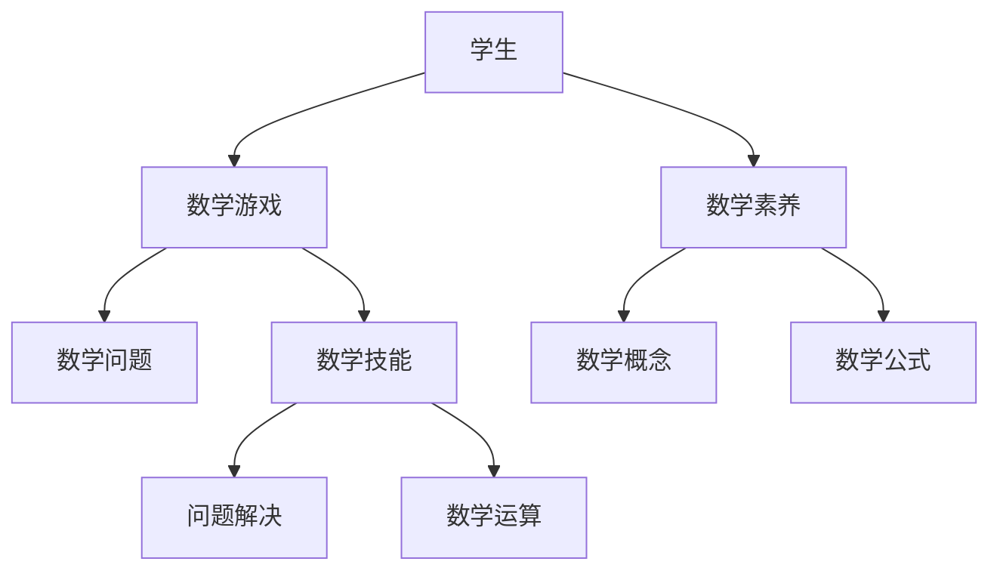
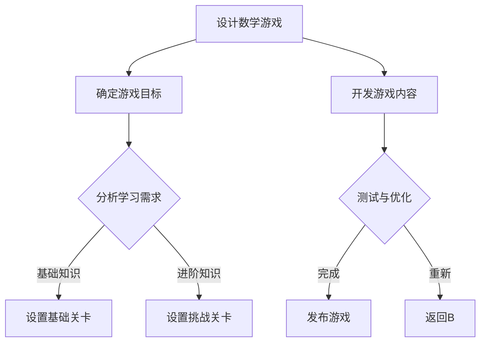

                 

### 《数学游戏与青少年数学素养的培养》

> 关键词：数学游戏、青少年数学素养、教学策略、数学思维、数学应用能力

> 摘要：本文旨在探讨数学游戏在青少年数学素养培养中的应用与价值，通过逻辑清晰、结构紧凑的分析，揭示数学游戏对于提升青少年数学知识、技能、态度和价值观的重要性。文章分为八个部分，从数学游戏概述、青少年数学素养定义、数学游戏应用、教学策略设计、数学文化传承、实践案例分析、未来发展趋势到总结与展望，为教育工作者和家长提供有益的参考。

### 《数学游戏与青少年数学素养的培养》目录大纲

```markdown
----------------------------------------------------------------

# 第一部分：数学游戏概述与价值

## 第1章：数学游戏的概念与历史

### 1.1 数学游戏的概念与分类

### 1.2 数学游戏的历史发展

### 1.3 数学游戏的价值与意义

## 第2章：青少年数学素养的概念与培养

### 2.1 青少年数学素养的定义

### 2.2 数学素养的构成要素

### 2.3 培养青少年数学素养的重要性

## 第3章：数学游戏在数学素养培养中的应用

### 3.1 数学游戏在数学学习中的应用

### 3.2 数学游戏在数学思维培养中的应用

### 3.3 数学游戏在数学应用能力培养中的应用

## 第4章：设计有效的数学游戏教学策略

### 4.1 数学游戏教学的目标设定

### 4.2 数学游戏教学的内容选择

### 4.3 数学游戏教学的方法与技巧

## 第5章：数学游戏与数学文化传承

### 5.1 数学游戏与数学文化的关系

### 5.2 数学研究与数学游戏的互动

### 5.3 数学游戏的传承与创新

## 第6章：数学游戏的实践案例分析

### 6.1 案例一：数学谜题游戏在教学中的应用

### 6.2 案例二：数学策略游戏在课堂活动中的应用

### 6.3 案例三：数学游戏在数学竞赛中的辅助作用

## 第7章：数学游戏的未来发展趋势

### 7.1 数学游戏在数字化时代的发展

### 7.2 数学游戏在跨学科学习中的应用

### 7.3 数学游戏的国际交流与合作

## 第8章：数学游戏与青少年数学素养培养的总结与展望

### 8.1 数学游戏在数学素养培养中的成效总结

### 8.2 青少年数学素养培养的挑战与应对策略

### 8.3 数学游戏未来发展的前景展望

----------------------------------------------------------------
```

**核心概念与联系：**

### 数学素养的概念与构成要素

- **概念：** 数学素养是指个体在数学方面所具备的知识、技能、态度和价值观的综合体。
- **构成要素：**
  - **知识：** 包括数学的基本概念、原理、方法、公式等。
  - **技能：** 包括数学问题的分析、解决问题的方法、数学运算等。
  - **态度：** 包括对数学的兴趣、自信心、坚持性等。
  - **价值观：** 包括对数学科学的理解、对数学应用的认识等。

### 数学游戏与数学素养的关系

- **关系：** 数学游戏是一种将数学知识与游戏相结合的教育形式，能够激发学生对数学的兴趣，培养他们的数学思维能力，进而提升数学素养。
- **作用：**
  - **提高学习兴趣：** 数学游戏能够将枯燥的数学知识变得有趣，从而吸引学生主动参与学习。
  - **培养数学思维：** 通过解决游戏中的数学问题，学生能够锻炼逻辑思维、分析问题和解决问题的能力。
  - **强化数学应用能力：** 数学游戏常常结合实际情境，让学生在应用中学习数学，提高他们的数学应用能力。

**ER实体关系图架构：**



**算法原理讲解：**



```python
# 数学游戏算法示例代码

# 设定数学问题
def generate_math_problem(level):
    if level == '基础':
        problem = "2 + 2 = ?"
    elif level == '进阶':
        problem = "25 ÷ 5 = ?"
    else:
        problem = "x^2 - 4 = 0 解为？"
    return problem

# 游戏循环
def math_game():
    while True:
        level = input("请选择游戏难度（基础/进阶/高级）：")
        problem = generate_math_problem(level)
        print(problem)
        answer = input("你的答案是：")
        
        if check_answer(problem, answer):
            print("回答正确！")
        else:
            print("回答错误，请再尝试。")
        
        continue_game = input("是否继续游戏？（是/否）：")
        if continue_game.lower() != '是':
            break

# 检查答案
def check_answer(problem, answer):
    if problem == "2 + 2 = ?" and answer == "4":
        return True
    elif problem == "25 ÷ 5 = ?" and answer == "5":
        return True
    elif problem == "x^2 - 4 = 0 解为？" and answer == "2 或 -2":
        return True
    else:
        return False

# 游戏开始
math_game()
```

### 数学素养的概念与构成要素

数学素养是指个体在数学方面所具备的知识、技能、态度和价值观的综合体。它不仅仅局限于数学知识的掌握，还包括数学思考方式、解决问题的能力以及对数学价值的认同。数学素养的构成要素主要包括以下几个方面：

- **知识：** 数学素养的基础是数学知识。这包括数学的基本概念、原理、方法、公式等。学生需要掌握这些基础知识，才能在更高层次上进行数学思考和问题解决。
  
- **技能：** 数学素养不仅要求学生掌握数学知识，还要求他们具备解决数学问题的技能。这包括数学问题的分析、解决问题的方法、数学运算等。这些技能是学生在面对复杂问题时能够有效应用数学知识的关键。

- **态度：** 数学素养还涉及到学生对数学的态度。这包括对数学的兴趣、自信心、坚持性等。一个积极、开放的态度可以帮助学生更好地面对数学学习中的挑战，从而提高他们的数学素养。

- **价值观：** 数学素养还包括学生对数学科学的理解和对其应用的认识。这涉及到对数学价值的认同，以及对数学在科学、技术和社会中作用的了解。这种价值观的建立有助于学生形成正确的数学观，从而更全面地提升数学素养。

这些构成要素相互作用，共同影响学生的数学素养水平。知识是基础，技能是工具，态度是动力，价值观是指导。只有当这些要素得到全面发展，学生才能真正具备良好的数学素养。

### 数学游戏的概念与分类

数学游戏是一种将数学知识融入游戏形式的教育活动，旨在通过趣味性和互动性来激发学生对数学的兴趣，提升他们的数学素养。数学游戏的历史可以追溯到古代，当时人们通过简单的数字游戏和策略游戏来培养计算能力和逻辑思维。随着教育技术的发展，数学游戏逐渐成为课堂教学中的重要辅助工具。

**数学游戏的概念：**

数学游戏是指以数学知识和逻辑推理为基础，通过游戏的形式进行教学和训练的活动。这些游戏设计巧妙，既能让学生在轻松愉快的氛围中学习数学知识，又能培养他们的数学思维能力和问题解决能力。

**数学游戏的分类：**

1. **按形式分类：**
   - **数字游戏：** 如数独、24点等，通过数字操作来锻炼学生的计算能力和逻辑思维。
   - **策略游戏：** 如象棋、围棋等，通过棋局布局来培养学生的战略思维和全局观念。
   - **谜题游戏：** 如数学谜题、逻辑谜题等，通过解决谜题来激发学生的推理能力和创造力。

2. **按功能分类：**
   - **知识性游戏：** 主要用于传授数学知识，如数学概念、公式等。
   - **思维训练游戏：** 主要用于培养数学思维能力，如逻辑推理、空间想象力等。
   - **应用性游戏：** 主要用于实践数学知识，如解决实际问题的模拟游戏。

**数学游戏的历史发展：**

- **古代：** 古代文明中，数学游戏主要作为一种娱乐活动出现。例如，古埃及的“绳子问题”和古罗马的“骰子游戏”等，都是结合数学知识设计的游戏。
- **现代：** 随着教育技术的发展，数学游戏逐渐应用于课堂教学中。例如，计算机辅助教学（CAI）系统中，大量数学游戏被开发出来，用于辅助数学教学。

**数学游戏的价值与意义：**

1. **激发学习兴趣：** 数学游戏将枯燥的数学知识变得有趣，能够有效激发学生的学习兴趣，使他们更主动地参与到数学学习中。

2. **培养数学思维：** 数学游戏通过解决游戏中的问题，可以锻炼学生的逻辑思维、分析问题和解决问题的能力。

3. **提高数学素养：** 数学游戏不仅传授数学知识，还培养了学生的数学技能、态度和价值观，全面提升了他们的数学素养。

4. **促进全面发展：** 数学游戏能够培养学生的团队合作能力、沟通能力和创新精神，促进其全面发展。

总之，数学游戏作为一种创新的教学方式，具有巨大的教育价值。通过数学游戏，学生可以在轻松愉快的氛围中学习数学，提高数学素养，为未来的学习和生活打下坚实的基础。

### 青少年数学素养的定义

青少年数学素养是指个体在青少年阶段所具备的数学知识、技能、态度和价值观的综合体。具体来说，它包括以下几个方面：

1. **数学知识：** 青少年需要掌握基本的数学概念、原理和方法，如数的概念、代数运算、几何图形、概率统计等。此外，他们还需要了解数学在各行各业中的应用，如自然科学、工程技术、社会科学等。

2. **数学技能：** 数学技能包括数学问题的分析能力、解决问题的方法、数学运算技巧等。这些技能不仅有助于学生在数学考试中取得好成绩，还能在实际生活中解决各种问题。

3. **数学态度：** 数学态度包括对数学的兴趣、自信心、坚持性等。一个积极、开放的态度有助于学生更好地面对数学学习中的挑战，从而提高他们的数学素养。

4. **数学价值观：** 数学价值观包括对数学科学的理解、对数学应用的认识等。这种价值观的建立有助于学生认识到数学在科学、技术和社会中的重要作用，从而更全面地提升数学素养。

青少年数学素养的培养不仅关乎个体的未来发展，也对社会整体素质的提升具有重要意义。因此，学校、家庭和社会应共同努力，为青少年提供一个良好的数学学习环境，帮助他们全面发展数学素养。

### 数学素养的构成要素

数学素养是一个综合的概念，它不仅涵盖了对数学知识的掌握，还包括了数学技能、态度和价值观的全面发展。以下是数学素养的构成要素及其详细解释：

1. **知识：** 数学知识是数学素养的基础。它包括数学的基本概念、原理、公式和方法。例如，学生需要理解加、减、乘、除等基本运算，掌握分数、小数、百分数等概念，以及代数、几何、概率统计等核心内容。此外，数学知识还包括历史背景、数学家的贡献以及数学在各领域的应用。

2. **技能：** 数学技能是指学生运用数学知识解决实际问题的能力。这些技能包括数学问题的分析、逻辑推理、计算能力、数据分析和解决问题的策略。例如，学生需要能够使用代数方程解决实际问题，运用几何知识进行空间构建，以及通过概率和统计方法进行数据分析。这些技能不仅有助于学生在数学考试中取得好成绩，还能在日常生活中应对各种问题。

3. **态度：** 数学态度是指学生对数学的情感和看法。它包括对数学的兴趣、好奇心、自信、坚持和毅力。一个积极的态度可以激发学生对数学学习的兴趣，帮助他们克服学习中的困难，保持长期的学习动力。例如，一个对数学有浓厚兴趣的学生会主动寻找数学问题，积极参与课堂讨论，并在遇到难题时坚持不懈地寻找解决方法。

4. **价值观：** 数学价值观是指学生对数学科学的理解和对数学应用的认识。它包括对数学在科学、技术、社会和经济中作用的认可，以及对数学的创造性思维的重视。一个正确的数学价值观可以引导学生认识到数学的价值，从而更全面地看待数学学习，不仅限于考试分数，而是将其视为一种解决实际问题的工具。例如，学生需要理解数学在工程、医学、经济学等领域的重要性，并学会运用数学思维进行创新和发明。

通过上述四个构成要素的有机结合，一个全面的数学素养不仅能够提高学生的学术成绩，还能培养他们的逻辑思维、创新能力和解决实际问题的能力，为其未来的发展奠定坚实的基础。

### 培养青少年数学素养的重要性

培养青少年数学素养不仅有助于他们在学业上取得成功，还对他们的全面发展具有重要意义。以下是培养青少年数学素养的几个关键方面及其重要性：

1. **学术发展：** 数学素养是学术成就的重要组成部分。良好的数学素养有助于学生在数学、科学和其他STEM（科学、技术、工程和数学）领域取得优异成绩。通过掌握数学知识和技能，学生能够更好地理解复杂的科学概念，从而在高中和大学阶段取得更好的学术表现。

2. **职业竞争力：** 随着社会的不断发展，数学在各个领域中的应用越来越广泛。具备良好的数学素养可以增强学生的职业竞争力，特别是在需要数据分析、技术编程、工程设计和管理等职业领域。数学技能不仅能够帮助学生在工作中解决问题，还能提高他们的决策能力和效率。

3. **逻辑思维与问题解决能力：** 数学学习不仅传授知识，更重要的是培养学生的逻辑思维和问题解决能力。通过解决数学问题，学生能够学会如何分析复杂情境，制定合理的解决方案，并有效地执行。这些能力在日常生活和工作中都具有重要应用。

4. **创新能力：** 数学教育鼓励学生探索和发现新的解决方案。通过数学游戏和实际操作，学生能够培养创新思维，学会从不同角度看待问题，并提出独特的见解。这种创新能力是未来社会创新人才不可或缺的素质。

5. **个人发展：** 数学素养不仅有助于学术和职业发展，还能提升学生的自信心和自我价值感。通过克服数学难题，学生能够感受到成就感和满足感，从而增强自信心和毅力。此外，数学学习还能培养学生的耐心和细致，帮助他们更好地应对生活中的各种挑战。

总之，培养青少年数学素养对于他们的学术、职业和个人发展都具有重要意义。通过提供有效的数学教育和丰富的学习资源，我们可以帮助下一代全面发展，为未来的社会贡献更多的智慧和创造力。

### 数学游戏在数学素养培养中的应用

数学游戏在数学素养培养中的应用具有显著的效果，它通过趣味性和互动性，能够有效提升学生的数学知识、思维能力和应用能力。以下是数学游戏在数学素养培养中的具体应用：

1. **数学知识的应用：**
   数学游戏能够将枯燥的数学知识通过游戏的形式进行传授，使学生更容易理解和掌握。例如，数独游戏可以帮助学生巩固基础的数学运算，增强对数字的敏感度。另外，数学策略游戏如象棋和围棋，通过棋盘上的布局和策略，让学生在实际操作中加深对几何图形和空间关系的理解。

2. **数学思维的培养：**
   数学游戏往往需要学生进行逻辑推理和分析，这有助于培养他们的数学思维。例如，数学谜题游戏如“24点”和“华容道”，要求学生在有限的时间内找到解决问题的方法，这不仅能锻炼他们的逻辑思维，还能提高他们的空间想象力和问题解决能力。通过解决这些游戏中的问题，学生能够学会如何将复杂问题分解为更简单的部分，从而找到解决方案。

3. **数学应用能力的提升：**
   数学游戏常常结合实际情境，让学生在应用中学习数学。例如，模拟财务管理的游戏可以让学生了解基本的预算和投资知识，模拟城市规划的游戏可以让学生运用几何知识进行实际布局。这些游戏不仅提高了学生的数学应用能力，还增强了他们的实践能力和解决问题的能力。

**数学游戏对数学素养培养的积极作用：**

1. **提高学习兴趣：** 数学游戏能够将枯燥的数学知识变得有趣，从而激发学生的学习兴趣。一个对数学充满兴趣的学生会更加主动地参与学习，从而提高学习效果。

2. **培养数学思维能力：** 通过解决游戏中的数学问题，学生能够锻炼逻辑思维、分析问题和解决问题的能力。这些能力不仅在数学学习中重要，在实际工作和生活中同样具有重要意义。

3. **强化数学应用能力：** 数学游戏常常结合实际情境，让学生在应用中学习数学。这种应用性的学习方式能够帮助学生更好地理解和运用数学知识，提高他们的数学应用能力。

4. **增强团队合作能力：** 很多数学游戏需要多人合作完成，这有助于培养学生的团队合作精神。通过合作解决问题，学生能够学会如何沟通和协作，提高他们的团队意识和沟通能力。

总之，数学游戏在数学素养培养中具有重要作用。通过数学游戏，学生能够在轻松愉快的氛围中学习数学，提升他们的数学知识、思维能力和应用能力，为未来的学习和生活打下坚实的基础。

### 设计有效的数学游戏教学策略

设计有效的数学游戏教学策略是提升青少年数学素养的关键。以下是从目标设定、内容选择到方法和技巧的详细步骤：

1. **目标设定：**
   - **明确学习目标：** 在设计数学游戏教学之前，首先要明确教学目标。这些目标应包括基础知识掌握、数学思维培养、数学应用能力提升等方面。例如，对于小学阶段的学生，目标可能是熟练掌握加减法，而中学阶段的目标可能是理解代数方程和解决实际问题。
   - **分层目标：** 根据学生的年龄、能力和兴趣，设定分层目标。例如，对于不同水平的学生，可以设计不同难度的游戏，从而满足他们的学习需求。

2. **内容选择：**
   - **与课程内容结合：** 选择与学校课程内容紧密相关的数学游戏，确保学生在游戏中能够巩固和扩展课堂所学知识。例如，可以设计以几何为主题的策略游戏，让学生在游戏中理解几何图形的性质和运用。
   - **多样性：** 选择多种类型的数学游戏，包括数字游戏、策略游戏、谜题游戏等，以激发学生的兴趣和多样化的思维。例如，数学谜题游戏可以锻炼学生的逻辑推理能力，而数学策略游戏可以培养他们的空间想象力和战略思维。

3. **方法和技巧：**
   - **引导式教学：** 在游戏过程中，教师应引导学生思考和解决问题，而不是直接给出答案。通过提问和讨论，教师可以帮助学生深入理解数学概念和解决问题的方法。
   - **合作学习：** 设计需要多人合作完成的数学游戏，鼓励学生在团队中沟通和协作。这种学习方式不仅能提升学生的数学素养，还能培养他们的团队合作能力和沟通能力。
   - **反馈与调整：** 在游戏结束后，教师应及时给予学生反馈，指出他们在游戏中的优点和不足。根据学生的表现，调整游戏难度和内容，以更好地满足他们的学习需求。

**示例教学策略：**

1. **数独游戏：**
   - **目标：** 提高学生的计算能力和逻辑推理能力。
   - **内容：** 设计不同难度的数独游戏，从简单的3x3数独到复杂的9x9数独。
   - **方法：** 教师在课堂上讲解数独的基本规则，然后让学生分组合作完成数独游戏。在游戏过程中，教师引导学生分析已填数字，找到解题线索。

2. **数学策略游戏：**
   - **目标：** 培养学生的战略思维和空间想象力。
   - **内容：** 选择如“四子棋”、“五子棋”等策略游戏，并结合几何概念进行设计。
   - **方法：** 教师先讲解几何图形的基本性质，然后让学生在游戏中运用这些知识进行布局和策略决策。在游戏结束后，教师组织讨论，让学生分享他们的策略和思考过程。

通过这些设计有效的数学游戏教学策略，教师能够更好地激发学生的学习兴趣，培养他们的数学思维和团队合作能力，从而全面提升他们的数学素养。

### 数学游戏与数学文化传承

数学游戏不仅是一种有效的教学工具，更是数学文化传承的重要载体。在数学发展的历史长河中，许多著名的数学家和科学家都通过游戏的形式推动了数学的进步。如今，数学游戏在传承数学文化方面发挥着重要作用，以下将从数学游戏与数学文化的关系、数学研究中数学游戏的互动，以及数学游戏的传承与创新三个方面进行探讨。

**数学游戏与数学文化的关系：**

数学文化是指数学思想、理论、方法及其在科学、技术、社会等领域的应用。数学游戏作为数学文化的一部分，承载了数学的精髓和魅力。通过数学游戏，学生能够感受到数学的趣味性和应用性，从而更好地理解数学文化。例如，古代的“算术游戏”和“几何游戏”不仅锻炼了计算能力和空间想象能力，还传播了数学的基本原理和概念。

现代数学游戏如数独、华容道等，将数学知识与游戏巧妙结合，使得数学文化在现代社会中得以传承和发扬。这些游戏不仅有助于培养学生的数学素养，还让他们在游戏中体会到数学的奥妙和乐趣。

**数学研究中数学游戏的互动：**

数学研究是一个不断探索和发现的过程，而数学游戏常常成为这一过程中的得力助手。许多数学问题通过游戏的形式得以呈现，使得数学研究变得更加生动和直观。例如，拓扑学中的“莫比乌斯带”可以通过莫比乌斯游戏来形象地展示其特性，帮助学生更好地理解拓扑概念。

此外，数学游戏还能激发数学家的研究灵感。通过游戏中的问题，数学家可以提出新的数学猜想和理论。例如，著名的“四色问题”最初是由一位数学家在解决棋盘游戏时提出的，最终通过复杂的数学证明得以解决。

**数学游戏的传承与创新：**

数学游戏作为一种教育手段，其传承和创新至关重要。传承方面，我们可以通过编写教材、设计教学方案和开发教育软件等方式，将经典的数学游戏引入课堂，让学生在游戏中学习数学。例如，可以编写专门的数学游戏教材，涵盖从基础到高级的各类数学游戏，帮助学生系统地掌握数学知识。

创新方面，随着科技的发展，新的数学游戏形式不断涌现。例如，基于计算机技术的虚拟现实（VR）数学游戏，能够为学生提供更加真实和互动的学习体验。通过VR技术，学生可以身临其境地探索数学概念和解决实际问题，从而激发他们的学习兴趣和创造力。

总之，数学游戏与数学文化传承密切相关，通过数学游戏，我们可以更好地传承数学文化，促进数学研究的发展，并培养下一代的数学素养。在传承和创新中，数学游戏将继续发挥重要作用，为数学教育注入新的活力。

### 数学游戏的实践案例分析

数学游戏在教育中的应用已经得到广泛的认可，下面通过三个具体的案例，探讨数学游戏在数学教学中的实际效果和重要性。

**案例一：数学谜题游戏在教学中的应用**

数学谜题游戏是一种将数学问题融入谜题形式的游戏，旨在通过解决谜题来培养学生的数学思维和问题解决能力。例如，在小学数学课堂中，教师可以设计“数独”游戏。数独游戏要求学生在9x9的网格中填入数字，使得每行、每列以及每个3x3的小方格中的数字都不重复。这种游戏不仅锻炼了学生的逻辑思维和计算能力，还能提高他们的耐心和细致。

**实施过程：**
1. **准备阶段：** 教师根据学生的数学水平，选择不同难度的数独题目，并在课堂上展示。
2. **学习阶段：** 教师讲解数独的基本规则，并引导学生如何开始解题。
3. **实践阶段：** 学生在课堂上或课后通过解题来巩固所学的数学知识。

**效果评估：** 通过对学生的表现进行观察和评估，教师发现学生在解决数独问题时，不仅能够熟练运用加减乘除等基本运算，还能灵活运用逻辑推理方法。此外，学生在解题过程中表现出极大的兴趣和热情，这有助于提高他们的学习动力。

**案例二：数学策略游戏在课堂活动中的应用**

数学策略游戏通过棋盘或卡片的形式，将数学概念和策略思维融入游戏中。例如，教师可以设计“棋盘游戏”，每个棋盘格上都有数字或符号，学生需要根据棋盘上的规则进行移动和计算。这种游戏不仅能够培养学生的战略思维和空间想象力，还能提高他们的团队合作能力。

**实施过程：**
1. **准备阶段：** 教师根据教学内容设计棋盘游戏，并准备相应的游戏卡片。
2. **学习阶段：** 教师讲解棋盘游戏的规则和策略，并展示如何进行游戏。
3. **实践阶段：** 学生在课堂上或小组活动中进行游戏，通过实践来学习数学概念和策略思维。

**效果评估：** 通过对学生的表现进行评估，教师发现学生能够在游戏中灵活运用数学知识，并提出各种策略来解决问题。这有助于培养学生的逻辑思维、策略规划和团队合作能力。此外，学生在游戏中的积极性和参与度也显著提高，这表明数学策略游戏在激发学生的学习兴趣和参与度方面具有重要作用。

**案例三：数学游戏在数学竞赛中的辅助作用**

数学竞赛是检验学生数学素养的重要平台，而数学游戏可以作为竞赛准备的重要辅助工具。例如，教师可以设计“数学挑战”游戏，模拟竞赛中的各种题型，帮助学生熟悉竞赛的规则和题型，提高他们的应试能力。

**实施过程：**
1. **准备阶段：** 教师根据竞赛的题型和难度，设计相应的数学游戏。
2. **学习阶段：** 教师讲解游戏规则和题型，并示范如何解题。
3. **实践阶段：** 学生通过游戏进行模拟练习，熟悉竞赛题型，并在解题过程中提高应试技巧。

**效果评估：** 通过对学生的竞赛表现进行评估，教师发现学生在经过数学游戏辅助后，对竞赛题型的熟悉度和解题速度都有显著提升。学生在竞赛中的表现也更加自信和从容，这表明数学游戏在提高学生应试能力和竞赛表现方面具有显著效果。

**总结与启示：**

以上三个案例表明，数学游戏在数学教学中的实际效果显著。通过数学游戏，学生能够在轻松愉快的氛围中学习数学知识，培养数学思维和问题解决能力。此外，数学游戏还能提高学生的学习兴趣和参与度，增强他们的团队合作和沟通能力。因此，教师应积极探索和运用数学游戏，将其作为数学教学的重要辅助手段，为学生的全面发展提供有力支持。

### 数学游戏的未来发展趋势

随着科技的迅猛发展，数学游戏正迎来新的变革和发展机遇。以下是数学游戏在未来可能呈现的几个发展趋势：

1. **数字化时代的数学游戏：**
   随着数字化教育的发展，数学游戏也在向数字化方向转型。利用计算机、平板电脑和智能手机等设备，学生可以在虚拟环境中进行数学游戏。这种数字化数学游戏不仅提供了丰富的交互体验，还使得游戏内容更加多样化、个性化。例如，基于虚拟现实（VR）和增强现实（AR）技术的数学游戏，能够为学生提供身临其境的学习体验，提高他们的学习兴趣和参与度。

2. **跨学科学习中的应用：**
   数学游戏不再局限于数学领域，它们正逐步与跨学科学习相结合。例如，数学游戏可以与科学、技术、工程和艺术（STEAM）教育相结合，通过跨学科的项目和实践活动，让学生在解决问题的过程中综合运用数学知识。这种跨学科学习模式有助于培养学生的综合素质和创新能力。

3. **国际交流与合作：**
   随着全球化的推进，数学游戏在国际教育领域的交流与合作也将日益增加。通过国际性的数学游戏比赛和交流活动，学生可以展示自己的数学才华，与来自不同国家和地区的同学交流数学学习经验。这种国际交流不仅拓宽了学生的视野，还促进了不同文化背景下的数学教育合作。

4. **个性化学习与智能辅导：**
   利用人工智能（AI）和大数据分析技术，数学游戏可以更好地实现个性化学习。通过分析学生的学习行为和成绩，智能辅导系统可以为每个学生定制个性化的学习计划，提供针对性的辅导。例如，AI算法可以根据学生的解题过程和错误模式，自动生成相应的练习题，帮助学生针对性地提升数学能力。

5. **教育与游戏的深度融合：**
   随着游戏设计的不断成熟，数学游戏将更加注重教育与游戏的深度融合。通过引入更多的故事情节、角色扮演和互动元素，数学游戏将更加吸引学生的注意力，提高他们的学习效果。例如，一些数学游戏已经结合了角色成长系统、任务奖励机制等，使得学生在游戏中体验到成就感和满足感，从而更积极地参与学习。

总之，数学游戏在未来将继续发挥重要作用，通过数字化、跨学科、国际交流、智能辅导和教育与游戏的深度融合，数学游戏将为青少年的数学素养培养提供更加丰富和多样化的手段。教育工作者和家长应积极关注和利用这些新趋势，为学生的全面发展创造更有利的环境。

### 数学游戏与青少年数学素养培养的总结与展望

数学游戏作为一种创新的教育工具，在青少年数学素养培养中展现了显著的成效。通过数学游戏，学生不仅能够提升数学知识和技能，还能培养积极的学习态度和价值观。本文从多个角度探讨了数学游戏在数学素养培养中的重要性，包括激发学习兴趣、培养数学思维、强化应用能力和促进全面发展等方面。

**成效总结：**

1. **提高学习兴趣：** 数学游戏将枯燥的数学知识变得有趣，激发学生的学习热情，使他们更主动地参与到数学学习中。

2. **培养数学思维：** 通过解决游戏中的数学问题，学生能够锻炼逻辑思维、分析问题和解决问题的能力，从而提高数学思维能力。

3. **强化数学应用能力：** 数学游戏结合实际情境，让学生在实践中学习数学，提高他们的数学应用能力和解决实际问题的能力。

4. **促进全面发展：** 数学游戏不仅培养了学生的数学素养，还增强了他们的团队合作能力、沟通能力和创新能力，促进了全面发展。

**挑战与应对策略：**

1. **教师专业素养：** 教师需要具备设计和管理数学游戏的能力，这要求教师不断更新知识，提高专业素养。

2. **教学资源有限：** 数学游戏的开发和实施需要一定的资源投入，教育部门应加大对数学游戏的研发和推广力度。

3. **游戏难度匹配：** 设计难度适宜的数学游戏对学生的数学素养培养至关重要，教师应根据学生的实际水平调整游戏难度。

**未来展望：**

1. **数字化与智能化：** 随着科技的发展，数学游戏将更加注重数字化和智能化，提供个性化和智能化的学习体验。

2. **跨学科融合：** 数学游戏将与其他学科相结合，促进跨学科学习，培养学生的综合素质和创新能力。

3. **国际交流与合作：** 数学游戏将在国际教育领域中发挥更大作用，通过国际交流和合作，推动全球数学教育的发展。

总之，数学游戏在青少年数学素养培养中具有重要作用，未来将不断发展和完善，为数学教育注入新的活力。教育工作者和家长应积极参与和推动数学游戏的应用，为青少年的全面发展创造更好的条件。

