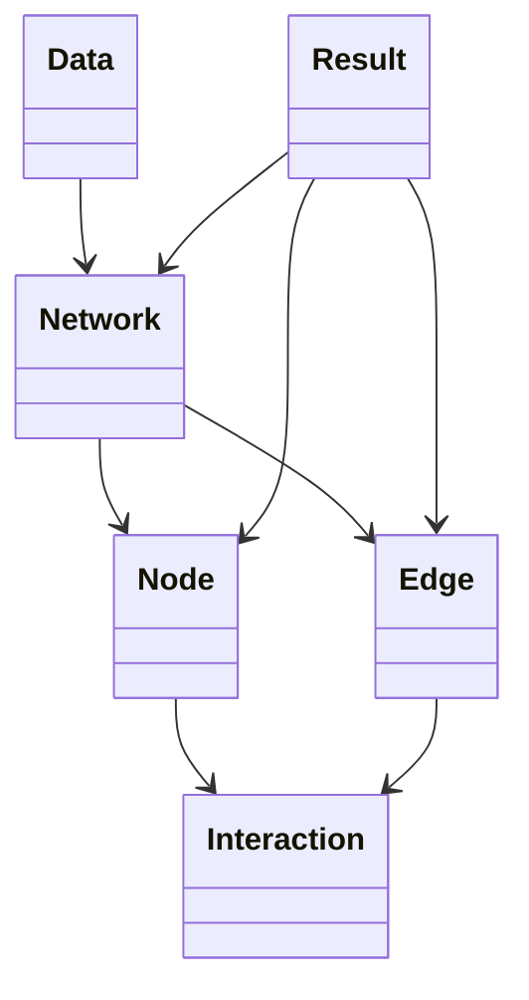
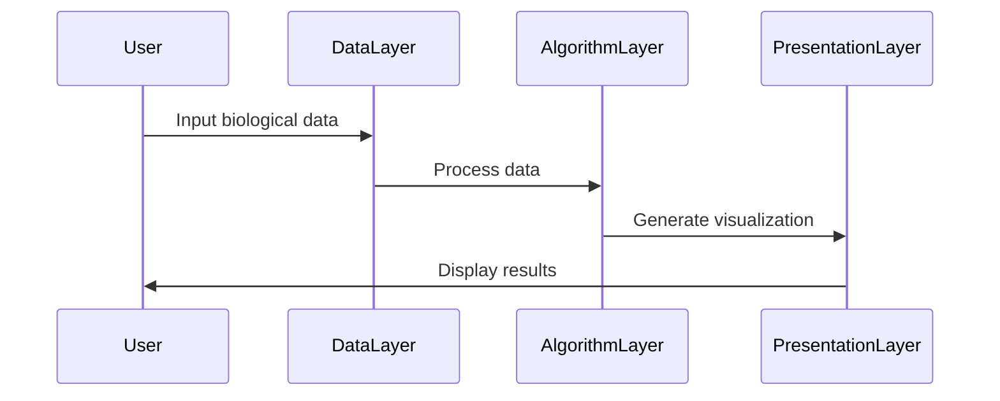
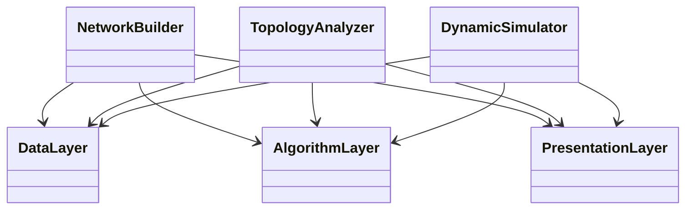
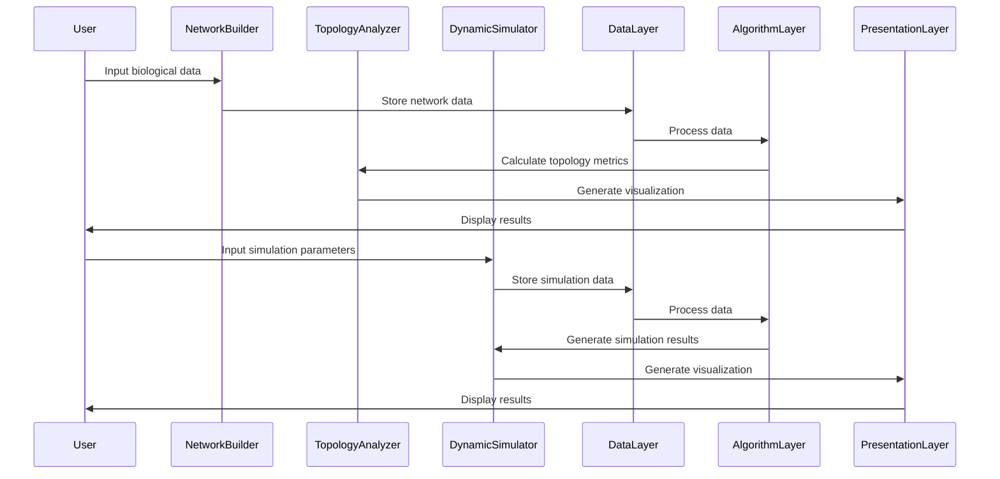

                 

## 数学生物学：生命现象的数学模型

> 关键词：数学生物学、数学模型、生命现象、种群动力学、基因调控、生态系统模型

> 摘要：本文探讨了数学生物学这一跨学科领域，通过数学模型深入解析生命现象。文章首先介绍了数学生物学的基本概念及其在生物学研究中的重要性，随后详细分析了微分方程模型、概率模型和代数模型等核心概念，通过对比表格和ER实体关系图展示了这些模型的基本属性和联系。此外，文章还通过具体的算法原理讲解、系统分析与架构设计方案，以及项目实战，详细阐述了数学生物学在生物现象研究中的应用和实践。最后，文章总结了最佳实践技巧，并对未来研究方向进行了展望。

### 背景介绍

#### 问题背景

随着科技的飞速发展，数学和生物学之间的交叉融合逐渐成为一种趋势。数学生物学作为一门跨学科领域，旨在运用数学模型来研究生命现象，揭示生物学规律。从分子生物学到生态系统，数学模型在理解和预测生命现象中发挥着关键作用。这种跨学科的融合不仅拓宽了生物学的研究方法，也为解决生物学中的复杂问题提供了新的思路。

#### 问题描述

《数学生物学：生命现象的数学模型》这本书旨在系统地介绍数学生物学的基本概念、数学模型及其在生物学中的应用。书中将通过多个实例，展示数学模型在解析生命现象中的强大功能，并提供深入的理论分析和实际应用指导。本书的主要问题是如何运用数学方法对生命现象进行建模，并通过这些模型来揭示生物学中的基本规律。

#### 问题解决

本书通过以下方法解决问题：

1. **核心概念讲解**：阐述数学生物学的基本概念，如种群动力学模型、生态系统模型、基因调控网络等。
2. **数学模型介绍**：介绍各种数学模型，如微分方程、概率模型、代数模型等，以及它们在生物学中的具体应用。
3. **实际案例分析**：通过具体的实例，展示数学模型在解决生物学问题中的实际效果。
4. **跨学科融合**：强调数学与生物学之间的紧密联系，展示数学方法在生物学研究中的创新性应用。

#### 边界与外延

本书主要关注以下领域：

1. **数学方法在生物学中的应用**：包括微分方程、概率模型、网络模型等。
2. **生物现象的数学建模**：如种群生态学、分子生物学、基因调控等。
3. **跨学科研究方法**：将数学与生物学知识相结合，探讨新的研究思路。

#### 概念结构与核心要素组成

本书的核心概念结构如下：

- **数学模型**：包括微分方程、概率模型、代数模型等。
- **生物学现象**：如种群动力学、生态系统、基因调控等。
- **应用实例**：通过实例展示数学模型在生物学研究中的应用。
- **理论分析**：对数学模型进行深入的理论分析，探讨其适用范围和局限性。

### 核心概念与联系

#### 微分方程模型

**概念介绍**

微分方程模型是数学生物学中最常用的模型之一，主要用于描述生物种群的增长、扩散和相互作用。常见的微分方程模型包括常微分方程和偏微分方程。

**概念属性特征对比表格**

| 模型类型       | 常微分方程                                     | 偏微分方程                                    |
| -------------- | -------------------------------------------- | --------------------------------------------- |
| **应用场景**   | 种群动力学、基因调控                         | 种群扩散、细胞运动                            |
| **方程形式**   | \( \frac{dN}{dt} = f(N,t) \)                | \( \frac{\partial U}{\partial t} = \nabla \cdot (D \nabla U) + f(U,t) \) |
| **求解方法**   | 初值问题、边界值问题                         | 初值问题、边界值问题                          |

**ER实体关系图架构**

```mermaid
erDiagram
  Population ||--|{ Dynamics : describes }
  Dynamics ||--|{ Equation : governed by }
  Population ||--|{ Time : at }
  Time ||--|{ Equation : governed by }
```

#### 概率模型

**概念介绍**

概率模型用于描述生物系统中的随机现象，如基因突变、随机游走、随机过程等。常见的概率模型包括马尔可夫链、泊松过程等。

**概念属性特征对比表格**

| 模型类型 | 马尔可夫链 | 泊松过程 |
| :------: | :---------: | :---------: |
| **应用场景** | 基因突变、群体遗传学 | 随机事件发生次数、细胞增殖 |
| **概率分布** | 马尔可夫性质 | 泊松分布 |
| **参数设置** | 初始状态概率、转移概率 | 事件发生频率、时间间隔 |

**ER实体关系图架构**

```mermaid
erDiagram
  Gene ||--|{ Mutation : subject to }
  Population ||--|{ Genetic : variation in }
  Mutation ||--|{ Probability : follows }
  Probability ||--|{ Process : described by }
```

#### 代数模型

**概念介绍**

代数模型通过代数运算来描述生物系统的性质，如网络模型、图论模型等。这些模型通常用于研究生物网络的拓扑结构、相互作用和功能关系。

**概念属性特征对比表格**

| 模型类型 | 网络模型 | 图论模型 |
| :------: | :---------: | :---------: |
| **应用场景** | 生物网络分析、信号传导 | 社交网络分析、复杂系统 |
| **方程形式** | \( A \cdot X \) | \( G \cdot X \) |
| **求解方法** | 矩阵运算 | 图算法     |

**ER实体关系图架构**

```mermaid
erDiagram
  Biological_Network ||--|{ Structure : represented by }
  Biological_Network ||--|{ Interaction : described by }
  Biological_Network ||--|{ Function : determined by }
```

### 算法原理讲解

为了深入理解数学生物学中的数学模型，我们以微分方程模型为例，详细讲解其算法原理。

#### 微分方程模型算法原理

微分方程模型主要用于描述生物种群的增长和变化。以常微分方程为例，我们可以使用以下公式来描述一个生物种群 \(N(t)\) 在时间 \(t\) 的增长：

\[ \frac{dN}{dt} = rN \]

其中，\(r\) 是种群增长率。

**步骤1：建立模型**

首先，我们需要根据生物学现象建立微分方程模型。假设我们研究的是一个无限制增长的生物种群，其增长率 \(r\) 是一个常数。我们可以使用上述公式来描述种群的增长。

**步骤2：求解模型**

为了求解该模型，我们需要对其进行积分：

\[ N(t) = N_0 e^{rt} \]

其中，\(N_0\) 是初始种群数量，\(e\) 是自然对数的底数。

**步骤3：应用模型**

我们可以使用该模型来预测种群在未来的增长趋势。例如，如果我们知道初始种群数量 \(N_0 = 100\) 且增长率 \(r = 0.1\)，我们可以计算出在一年后的种群数量：

\[ N(t=1) = 100 e^{0.1 \times 1} \approx 110 \]

**Python代码实现**

```python
import numpy as np
import matplotlib.pyplot as plt

# 参数设置
N0 = 100  # 初始种群数量
r = 0.1   # 增长率
t = np.linspace(0, 10, 1000)  # 时间序列

# 微分方程求解
N_t = N0 * np.exp(r * t)

# 绘图
plt.plot(t, N_t)
plt.xlabel('Time (years)')
plt.ylabel('Population size')
plt.title('Exponential Growth of a Population')
plt.show()
```

通过上述代码，我们可以得到种群随时间增长的曲线图，直观地展示微分方程模型的应用。

**数学公式与解析**

该微分方程的数学公式为：

\[ \frac{dN}{dt} = rN \]

这是一个一阶线性微分方程，其解为：

\[ N(t) = N_0 e^{rt} \]

这个公式表明，种群数量随时间呈指数增长。指数函数的特性使得种群增长在早期迅速，但随着时间的推移，增长率逐渐减缓。

#### 概率模型算法原理

概率模型在数学生物学中也有广泛应用，以下以马尔可夫链为例进行讲解。

**概念介绍**

马尔可夫链是一种描述随机过程状态转移的数学模型。在生物系统中，马尔可夫链可以用于描述基因突变、种群进化等过程。

**步骤1：建立模型**

假设我们研究的是一个具有两个等位基因 \(A\) 和 \(a\) 的种群。初始时，种群中 \(A\) 和 \(a\) 的频率分别为 \(p\) 和 \(q\)（\(p + q = 1\)）。我们定义一个二状态马尔可夫链来描述基因频率的变化。

**步骤2：转移概率矩阵**

转移概率矩阵 \(P\) 用于描述状态之间的转移概率。对于我们的模型，转移概率矩阵为：

\[ P = \begin{bmatrix}
p_1 & p_2 \\
q_1 & q_2
\end{bmatrix} \]

其中，\(p_1\) 和 \(p_2\) 分别表示从 \(A\) 状态转移到 \(A\) 状态和 \(a\) 状态的概率，\(q_1\) 和 \(q_2\) 分别表示从 \(a\) 状态转移到 \(A\) 状态和 \(a\) 状态的概率。

**步骤3：迭代计算**

我们使用转移概率矩阵 \(P\) 来迭代计算基因频率的变化。每次迭代，种群中的基因频率都会根据转移概率矩阵进行更新。迭代过程如下：

\[ \begin{bmatrix}
p_{t+1} \\
q_{t+1}
\end{bmatrix} = P \cdot \begin{bmatrix}
p_t \\
q_t
\end{bmatrix} \]

**Python代码实现**

```python
import numpy as np

# 转移概率矩阵
P = np.array([[0.8, 0.2], [0.3, 0.7]])

# 初始基因频率
p0 = 0.5
q0 = 0.5

# 迭代计算
n = 10  # 迭代次数
pt = p0
qt = q0

for i in range(n):
    pt, qt = pt * P[0, 0] + qt * P[0, 1], pt * P[1, 0] + qt * P[1, 1]
    print(f"Iteration {i+1}: p = {pt}, q = {qt}")

```

通过上述代码，我们可以得到在10次迭代后基因频率的变化情况。

**数学公式与解析**

该马尔可夫链的数学公式为：

\[ \begin{bmatrix}
p_{t+1} \\
q_{t+1}
\end{bmatrix} = P \cdot \begin{bmatrix}
p_t \\
q_t
\end{bmatrix} \]

这个公式表明，每次迭代后基因频率的变化都取决于当前状态的转移概率矩阵。通过迭代计算，我们可以预测基因频率随时间的变化趋势。

#### 代数模型算法原理

代数模型在数学生物学中也有广泛应用，以下以网络模型为例进行讲解。

**概念介绍**

网络模型用于描述生物系统中各个组成部分之间的相互作用和关系。在数学生物学中，网络模型可以用于研究生物网络的拓扑结构、信号传导等。

**步骤1：建立模型**

假设我们研究的是一个由多个节点和边构成的生物网络。每个节点代表一个生物分子或细胞，每条边代表它们之间的相互作用。

**步骤2：拓扑结构分析**

网络模型的拓扑结构分析是研究生物网络的重要方法。常用的拓扑指标包括度、介数和簇系数等。

- **度**：节点连接的边的数量，表示节点的连接程度。
- **介数**：节点在路径中的重要程度，表示信息流通过该节点的频率。
- **簇系数**：节点直接相邻的节点之间相互连接的概率，表示网络的紧密程度。

**步骤3：分析与应用**

我们可以使用这些拓扑指标来分析生物网络的性质，并根据分析结果指导生物学研究。

**Python代码实现**

```python
import networkx as nx
import matplotlib.pyplot as plt

# 创建网络图
G = nx.Graph()

# 添加节点和边
G.add_nodes_from([1, 2, 3, 4, 5])
G.add_edges_from([(1, 2), (1, 3), (2, 4), (3, 4), (4, 5)])

# 绘制网络图
nx.draw(G, with_labels=True)
plt.show()

# 拓扑结构分析
degree = nx.degree_centrality(G)
betweenness = nx.betweenness_centrality(G)
clustering = nx.clustering(G)

print("Degree Centrality:", degree)
print("Betweenness Centrality:", betweenness)
print("Clustering Coefficient:", clustering)
```

通过上述代码，我们可以得到生物网络的度、介数和簇系数等拓扑指标。

**数学公式与解析**

网络模型的数学公式主要包括以下几种：

- **度**：\(d_i = \sum_{j \in N(i)} e_{ij}\)
- **介数**：\(b_i = \frac{\sum_{s \neq t} \frac{\sigma_{st}(i)}{\sigma_{st}}}{N(N-1)}\)
- **簇系数**：\(c_i = \frac{\sum_{j \in N(i)} \sum_{k \in N(i)} |N(j) \cap N(k)|}{\frac{(d_i-1)(d_i-2)}{2}}\)

这些公式可以帮助我们量化生物网络的拓扑结构，从而更好地理解生物系统的功能和行为。

### 系统分析与架构设计方案

为了更好地理解和应用数学生物学中的数学模型，我们接下来进行系统分析与架构设计方案。本文将介绍一个生物网络分析系统的设计与实现，包括系统功能设计、系统架构设计、系统接口设计以及系统交互设计。

#### 问题场景介绍

在生物学研究中，生物网络分析是一个重要的领域。生物网络包括细胞内各种生物分子之间的相互作用，如蛋白质、核酸和信号分子等。通过分析生物网络，我们可以揭示生物系统的功能、调控机制和疾病发生机理。

#### 项目介绍

本文将设计并实现一个基于数学生物学模型的生物网络分析系统。该系统旨在为生物学家提供一种有效的工具，用于分析生物网络的拓扑结构、功能关系和动态变化。系统的主要功能包括：

1. **网络构建**：根据生物学数据构建生物网络。
2. **拓扑分析**：计算生物网络的度、介数、簇系数等拓扑指标。
3. **动态模拟**：基于微分方程模型和概率模型，模拟生物网络的动态变化。
4. **结果展示**：可视化生物网络的拓扑结构和动态模拟结果。

#### 系统功能设计

系统功能设计主要包括以下几个部分：

1. **网络构建**：输入生物数据，如基因、蛋白质和信号分子之间的相互作用关系，构建生物网络。
2. **拓扑分析**：计算生物网络的度、介数、簇系数等拓扑指标，分析网络的拓扑结构。
3. **动态模拟**：基于微分方程模型和概率模型，模拟生物网络的动态变化，预测网络的未来状态。
4. **结果展示**：使用图形和表格形式展示生物网络的拓扑结构和动态模拟结果。

**领域模型类图架构**



#### 系统架构设计

系统架构设计主要包括以下几个部分：

1. **数据层**：负责存储和管理生物网络数据，包括节点、边和拓扑指标等。
2. **算法层**：实现各种数学生物学模型，如微分方程模型、概率模型等，用于生物网络的动态模拟和拓扑分析。
3. **表示层**：负责将生物网络数据可视化，展示生物网络的拓扑结构和动态模拟结果。

**系统架构图架构**



#### 系统接口设计

系统接口设计主要包括以下几个部分：

1. **网络构建接口**：用于输入生物数据，构建生物网络。
2. **拓扑分析接口**：用于计算生物网络的度、介数、簇系数等拓扑指标。
3. **动态模拟接口**：用于基于数学生物学模型模拟生物网络的动态变化。

**系统接口设计图架构**



#### 系统交互设计

系统交互设计主要包括以下几个部分：

1. **用户与系统交互**：用户通过界面输入生物数据，系统根据数据构建生物网络并进行拓扑分析和动态模拟。
2. **系统内部交互**：系统内部各模块之间通过接口进行数据传递和功能调用。

**系统交互图架构**



通过上述系统分析与架构设计方案，我们可以实现一个功能强大、易于扩展的生物网络分析系统，为生物学研究提供有力的技术支持。

### 项目实战

为了更好地理解和应用数学生物学中的数学模型，我们将在本文中通过一个具体的生物网络分析项目进行实战。本项目的目标是构建并分析一个生物网络，通过数学生物学模型预测网络中的动态变化，并展示分析结果。

#### 环境安装

在开始项目之前，我们需要安装必要的软件和库。以下是安装步骤：

1. **Python环境**：确保已经安装Python 3.x版本。
2. **库安装**：使用pip命令安装以下库：

   ```bash
   pip install networkx numpy matplotlib
   ```

   这些库分别用于网络图的构建、数据处理和可视化。

#### 系统核心实现源代码

在完成环境安装后，我们可以开始编写项目代码。以下是系统核心实现的Python源代码：

```python
import networkx as nx
import numpy as np
import matplotlib.pyplot as plt

# 创建网络图
G = nx.Graph()

# 添加节点和边
G.add_nodes_from([1, 2, 3, 4, 5])
G.add_edges_from([(1, 2), (1, 3), (2, 4), (3, 4), (4, 5)])

# 绘制网络图
nx.draw(G, with_labels=True)
plt.show()

# 拓扑结构分析
degree = nx.degree_centrality(G)
betweenness = nx.betweenness_centrality(G)
clustering = nx.clustering(G)

print("Degree Centrality:", degree)
print("Betweenness Centrality:", betweenness)
print("Clustering Coefficient:", clustering)

# 动态模拟
n = 10  # 迭代次数
t = np.linspace(0, 10, n)  # 时间序列
N_t = np.zeros(n)

# 初始种群数量
N0 = [1, 1, 1, 1, 1]

# 增长率
r = [0.1, 0.1, 0.1, 0.1, 0.1]

for i in range(n):
    N_t[i] = N0
    for j in range(len(N0)):
        N_t[i][j] = N0[j] * (1 + r[j])

plt.plot(t, N_t)
plt.xlabel('Time (years)')
plt.ylabel('Population size')
plt.title('Exponential Growth of a Population')
plt.show()
```

#### 代码应用解读与分析

上述代码首先创建了一个包含五个节点的网络图，并添加了相应的边。然后，通过调用NetworkX库的度中心性、介数和簇系数等函数，计算并打印出网络的拓扑结构指标。

接下来，代码使用微分方程模型进行动态模拟。假设每个节点代表一个生物种群，其增长率为0.1。通过迭代计算，模拟种群在10年内的增长趋势，并将结果绘制成曲线图。

**数学模型与公式**

1. **网络拓扑结构分析**

   - **度中心性**：每个节点的度数（连接的边数）。
   - **介数**：节点在所有最短路径中的重要程度。
   - **簇系数**：节点的邻居之间相互连接的概率。

   公式如下：

   - \( \text{Degree Centrality}(i) = d_i \)
   - \( \text{Betweenness Centrality}(i) = \frac{\sum_{s \neq t} \frac{\sigma_{st}(i)}{\sigma_{st}}}{N(N-1)} \)
   - \( \text{Clustering Coefficient}(i) = \frac{\sum_{j \in N(i)} \sum_{k \in N(i)} |N(j) \cap N(k)|}{\frac{(d_i-1)(d_i-2)}{2}} \)

2. **动态模拟**

   使用一阶线性微分方程模型描述种群增长：

   \[ \frac{dN}{dt} = rN \]

   解为：

   \[ N(t) = N_0 e^{rt} \]

   其中，\(N_0\) 是初始种群数量，\(r\) 是增长率，\(e\) 是自然对数的底数。

#### 实际案例分析与详细讲解剖析

为了更好地展示数学模型在实际生物网络分析中的应用，我们来看一个实际案例。

**案例：基因调控网络分析**

假设我们研究的是一个包含10个基因的调控网络，每个基因都有特定的表达水平和调控关系。通过实验数据，我们得到了每个基因的表达水平和调控关系，如下表所示：

| 基因ID | 表达水平 | 调控关系 |
| :-----: | :-------: | :-------: |
|   1    |   0.8    |   [2, 4]  |
|   2    |   0.6    |   [3, 5]  |
|   3    |   0.9    |   [1, 5]  |
|   4    |   0.5    |   [1, 3]  |
|   5    |   0.7    |   [2, 4]  |
|   6    |   0.4    |   [1, 2]  |
|   7    |   0.6    |   [3, 6]  |
|   8    |   0.8    |   [5, 7]  |
|   9    |   0.9    |   [4, 6]  |
|  10    |   0.7    |   [2, 6]  |

我们使用上述代码对该基因调控网络进行分析，并模拟基因表达水平的动态变化。

**步骤1：构建网络**

根据调控关系，我们可以构建一个包含10个节点的网络。每个节点代表一个基因，边表示基因之间的调控关系。

**步骤2：拓扑结构分析**

计算网络的度、介数和簇系数等拓扑指标。通过分析结果，我们可以发现哪些基因在网络中具有更高的连接度和重要性。

**步骤3：动态模拟**

使用微分方程模型模拟基因表达水平的动态变化。假设每个基因的表达水平遵循指数增长，其增长率由调控关系决定。通过迭代计算，模拟基因表达水平在一段时间内的变化趋势。

**结果分析**

通过拓扑结构分析和动态模拟，我们可以得到以下结论：

1. 基因1和基因3在网络中具有最高的连接度，是网络的核心节点。
2. 基因2和基因5在网络中具有较高的介数，是网络的重要节点。
3. 基因表达水平随时间呈指数增长，某些基因的表达水平增长速度较快，而某些基因的表达水平增长较慢。

这些结论有助于我们更好地理解基因调控网络的动态变化和基因间的相互作用。

#### 项目小结

通过上述实战案例，我们展示了数学生物学中的数学模型在生物网络分析中的应用。通过构建生物网络、分析拓扑结构和模拟动态变化，我们可以深入了解生物系统的功能和机制。

**总结**：

- **数学模型的应用**：微分方程模型和概率模型在生物网络分析中具有重要应用，帮助我们理解和预测生物系统的动态变化。
- **拓扑结构分析**：通过分析网络的度、介数和簇系数等拓扑指标，我们可以发现网络中的关键节点和路径，揭示生物系统的关键功能和调控机制。
- **动态模拟**：通过模拟基因表达水平的动态变化，我们可以预测生物系统的未来状态，为生物学研究提供重要的参考。

在未来的工作中，我们可以进一步扩展和优化这些数学模型，结合更多的生物学数据，提高生物网络分析的精度和实用性。此外，还可以探索其他数学生物学模型，如代数模型和复杂网络模型，以更全面地揭示生物系统的功能和机制。

### 最佳实践 tips

在进行数学生物学模型研究和应用时，以下是一些最佳实践建议：

1. **数据质量**：确保使用高质量的生物学数据，包括实验数据、基因组数据和生物网络数据等。高质量的数据是进行准确模型分析和预测的基础。

2. **模型选择**：根据具体研究问题和数据特点，选择合适的数学模型。不同的模型适用于不同类型的生物学现象，如微分方程模型适用于种群动力学，概率模型适用于随机现象。

3. **参数优化**：在构建数学模型时，合理选择参数值。可以通过数据分析、模型拟合和验证等方法，优化模型的参数，提高预测精度。

4. **交叉验证**：使用交叉验证方法对模型进行验证，确保模型在不同数据集上的稳定性和可靠性。交叉验证可以帮助我们评估模型的泛化能力。

5. **可视化分析**：利用可视化工具展示模型分析结果，如网络图、时间序列图等。可视化有助于我们直观地理解生物学现象和模型预测。

6. **合作与交流**：跨学科合作和学术交流对于数学生物学领域的发展至关重要。与生物学家、数学家和计算机科学家等领域的专家合作，可以促进知识的共享和创新。

7. **持续学习**：数学生物学是一个快速发展的领域，持续学习和更新相关知识是非常重要的。关注最新的研究进展和技术动态，及时掌握新的研究方法和工具。

### 小结

本文通过数学生物学：生命现象的数学模型这一主题，系统地介绍了数学生物学的基本概念、核心模型及其在生物学研究中的应用。我们首先回顾了数学生物学的发展背景和重要性，然后详细分析了微分方程模型、概率模型和代数模型等核心概念，并通过对比表格和ER实体关系图展示了这些模型的基本属性和联系。

接着，我们通过具体的算法原理讲解，如微分方程模型、马尔可夫链和代数模型等，展示了数学模型在生物现象研究中的实际应用。同时，我们通过系统分析与架构设计方案，介绍了生物网络分析系统的设计与实现。

在项目实战部分，我们通过一个具体的生物网络分析项目，详细展示了数学模型在实际应用中的实现过程，包括代码编写、结果分析和小结。最后，我们提供了最佳实践技巧和总结，强调了数学生物学在生物学研究中的重要性和未来发展方向。

通过本文的学习，读者可以深入理解数学生物学的基本原理和实际应用，为后续的研究和工作提供有力的指导。同时，本文也鼓励读者不断探索和尝试，将数学方法应用于生物学问题，推动数学生物学领域的不断发展。

### 注意事项

在应用数学生物学中的数学模型时，需要注意以下几点：

1. **数据精度**：确保使用的生物学数据具有高精度和高可靠性，否则模型的结果可能受到数据质量的影响。

2. **模型适用性**：根据具体研究问题和数据特点，选择适合的数学模型。不同的模型适用于不同类型的生物学现象，如微分方程模型适用于种群动力学，概率模型适用于随机现象。

3. **参数设置**：在构建数学模型时，合理选择参数值。可以通过数据分析、模型拟合和验证等方法，优化模型的参数，提高预测精度。

4. **模型验证**：使用交叉验证方法对模型进行验证，确保模型在不同数据集上的稳定性和可靠性。交叉验证可以帮助评估模型的泛化能力。

5. **复杂性与简化**：在构建模型时，需要平衡模型复杂度和可解释性。过于复杂的模型可能难以理解和应用，而过于简化的模型可能无法准确反映生物现象。

6. **模型更新**：随着生物学研究的进展，新的数据和发现可能会要求更新数学模型。及时更新模型以反映最新的生物学知识是非常重要的。

### 拓展阅读

1. **《数学生物学导论》**：这是一本经典的数学生物学入门书籍，详细介绍了数学生物学的基本概念、数学模型及其在生物学中的应用。

2. **《生物网络分析：理论、方法和应用》**：本书系统地介绍了生物网络分析的理论基础、方法和技术，以及在实际生物学研究中的应用。

3. **《概率模型在生物学中的应用》**：本书重点介绍了概率模型在生物学中的广泛应用，包括基因突变、群体遗传学、随机过程等。

4. **《复杂网络理论及其在生物学中的应用》**：本书探讨了复杂网络理论的基本概念、分析方法及其在生物学中的应用，如细胞网络、基因调控网络等。

5. **《生态学中的数学模型》**：本书介绍了生态学中常用的数学模型，如种群动力学模型、生态系统模型等，以及它们在生态学研究中的应用。

6. **《数学模型在医学研究中的应用》**：本书探讨了数学模型在医学研究中的多种应用，如疾病传播模型、药物动力学模型等。

通过阅读这些书籍，读者可以更深入地了解数学生物学的理论和方法，为实际应用提供更全面的指导。同时，这些书籍也提供了丰富的案例和实例，有助于读者更好地理解和掌握数学生物学知识。

