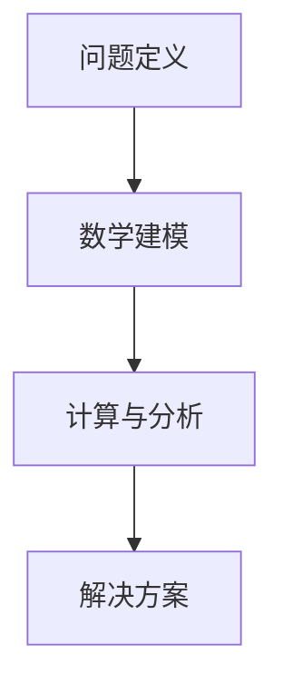

                 


### 数学还原论：复杂现象的简化描述

#### 关键词：数学还原论、复杂现象、简化描述、算法原理、系统架构

##### 摘要：

本文旨在探讨数学还原论在简化复杂现象中的应用。通过深入研究数学还原论的基本原理和核心要素，我们分析了其在统计学、物理学和计算机科学等领域的应用。本文还将通过实际案例研究，详细阐述数学还原论在系统架构设计、环境安装、系统核心实现等方面的具体实践。本文的核心思想是，通过数学还原论，我们可以将复杂的现实问题转化为简洁的数学模型，从而更有效地解决问题。

#### 目录

----------------------------------------------------------------

## 第一部分：引言

### 第1章：问题背景与核心概念

### 第2章：数学还原论的基本原理

## 第二部分：数学还原论的应用

### 第3章：统计学中的数学还原论

### 第4章：物理学中的数学还原论

### 第5章：计算机科学中的数学还原论

## 第三部分：数学还原论的实际应用

### 第6章：案例研究

### 第7章：结论与展望

----------------------------------------------------------------

### 第1章：问题背景与核心概念

#### 1.1 问题背景

在当今复杂多变的世界中，许多现象和问题都呈现出高度复杂性。从社会现象到自然现象，从经济波动到气候变化，复杂性问题无处不在。传统的分析和解决问题的方法往往难以应对这种复杂性，因此需要新的理论和方法来指导我们的研究和实践。

数学还原论正是这样一种理论，它通过将复杂的现实问题转化为简化的数学模型，从而帮助我们更深入地理解问题，找到解决方案。数学还原论的核心思想是，任何复杂现象都可以通过适当的数学描述来简化，从而使其变得更容易分析和解决。

#### 1.2 存在的问题

尽管数学还原论提供了强大的工具，但在实际应用中仍面临许多挑战。首先，如何准确地将现实问题转化为数学模型是一个难题。其次，数学模型的有效性和可靠性也受到质疑，因为它们往往是对现实的一种简化和近似。此外，数学模型的应用范围和边界条件也需要深入研究。

#### 1.3 研究意义

数学还原论在各个领域都有广泛的应用，如统计学、物理学和计算机科学。通过数学还原论，我们可以将复杂的问题简化为更容易处理的数学模型，从而提高我们的理解和解决问题的能力。此外，数学还原论还可以帮助我们更好地理解现实世界中的复杂现象，为科学研究和实际应用提供新的思路和方法。

#### 1.4 核心概念

**数学还原论的定义**：数学还原论是指将复杂现象通过数学建模和计算转化为简化的数学模型，以便更好地理解和解决这些现象。

**数学还原论的特点**：数学还原论具有以下几个主要特点：
- **简明性**：通过数学建模，复杂的现实问题可以转化为简明的数学模型。
- **精确性**：数学模型能够提供精确的定量描述，从而更准确地反映现实。
- **普遍性**：数学还原论适用于各种不同领域的问题。

**数学还原论的应用范围**：数学还原论在统计学、物理学和计算机科学等领域都有广泛应用。

#### 1.5 边界与外延

**边界条件**：数学还原论的应用需要考虑边界条件，即数学模型适用的范围和限制。

**外延扩展**：数学还原论不仅可以在当前领域内应用，还可以扩展到其他领域，如经济学、生态学等。

### 第2章：数学还原论的基本原理

#### 2.1 概念结构与核心要素

**数学还原论的基本结构**：数学还原论的核心结构包括以下几个方面：
- **问题定义**：明确需要解决的问题和目标。
- **数学建模**：将问题转化为数学模型，通常涉及变量的定义、方程的建立等。
- **计算与分析**：对数学模型进行计算和分析，以获得问题的解决方案。

**核心要素分析**：数学还原论的核心要素包括：
- **数学模型**：数学模型是数学还原论的基础，其准确性和可靠性至关重要。
- **算法**：算法用于解决数学模型中的问题，是数学还原论的关键组成部分。
- **数据分析**：数据分析用于验证和优化数学模型。

#### 2.2 数学模型与数学公式

**数学模型概述**：数学模型是指用数学符号和公式描述的物理现象或过程。

**数学公式应用**：数学公式是数学模型的核心部分，用于描述数学模型中的关系和规律。

**数学公式讲解**：以下是一个简单的数学公式讲解示例：

$$
f(x) = x^2 + 2x + 1
$$

这个公式是一个二次函数，描述了一个二次曲线的形状。$$f(x)$$ 表示函数值，$$x$$ 表示自变量。

#### 2.3 Mermaid流程图

**流程图概述**：流程图是一种用于描述流程或步骤的图形表示。

**数学还原论流程图**：以下是一个数学还原论流程图的示例：



这个流程图展示了数学还原论的基本步骤。

**流程图分析**：以下是对上述流程图的详细解读：
- **问题定义**：明确需要解决的问题和目标。
- **数学建模**：将问题转化为数学模型。
- **计算与分析**：对数学模型进行计算和分析。
- **解决方案**：得出问题的解决方案。

### 第3章：统计学中的数学还原论

#### 3.1 统计学基础

**统计学概念**：统计学是一门研究数据收集、分析和解释的学科。

**统计学方法**：常见的统计学方法包括描述性统计学、推断性统计学和假设检验等。

#### 3.2 数学还原论在统计学中的应用

**还原论方法**：数学还原论在统计学中的应用主要包括以下步骤：
- **数据收集**：收集相关的统计数据。
- **数学建模**：将数据转化为数学模型。
- **计算与分析**：对数学模型进行计算和分析。

**实例分析**：以下是一个简单的实例分析：

假设我们想要研究某个城市的人口增长问题。首先，我们需要收集相关数据，如人口数量、出生率、死亡率等。然后，我们可以建立一个人口增长的数学模型，如指数增长模型。通过计算和分析这个模型，我们可以预测未来的人口数量，从而为城市规划和政策制定提供依据。

### 第4章：物理学中的数学还原论

#### 4.1 物理学基础

**物理学概念**：物理学是一门研究物质和能量以及它们之间相互作用的学科。

**物理学方法**：常见的物理学方法包括实验研究、理论分析、数值模拟等。

#### 4.2 数学还原论在物理学中的应用

**还原论方法**：数学还原论在物理学中的应用主要包括以下步骤：
- **问题定义**：明确需要解决的问题和目标。
- **数学建模**：将问题转化为数学模型。
- **计算与分析**：对数学模型进行计算和分析。

**实例分析**：以下是一个简单的实例分析：

假设我们想要研究一个物体在重力作用下的运动问题。首先，我们需要定义问题，如物体的质量、初始速度和重力加速度等。然后，我们可以建立一个运动方程，如牛顿第二定律。通过计算和分析这个方程，我们可以预测物体的运动轨迹，从而更好地理解物体的运动规律。

### 第5章：计算机科学中的数学还原论

#### 5.1 计算机科学基础

**计算机科学概念**：计算机科学是一门研究计算机系统的原理、设计、应用和发展的学科。

**计算机科学方法**：常见的计算机科学方法包括算法设计、编程语言开发、软件开发等。

#### 5.2 数学还原论在计算机科学中的应用

**还原论方法**：数学还原论在计算机科学中的应用主要包括以下步骤：
- **问题定义**：明确需要解决的问题和目标。
- **数学建模**：将问题转化为数学模型。
- **计算与分析**：对数学模型进行计算和分析。

**实例分析**：以下是一个简单的实例分析：

假设我们想要设计一个排序算法。首先，我们需要定义问题，如需要排序的数据集合。然后，我们可以建立一个数学模型，如比较排序算法。通过计算和分析这个模型，我们可以优化算法的效率，从而提高排序的速度。

### 第6章：案例研究

#### 6.1 案例背景

在本案例研究中，我们选择了一个城市交通流量管理的问题。随着城市化进程的加快，城市交通拥堵问题日益严重，对市民的生活质量和城市可持续发展造成了严重影响。

#### 6.2 系统分析与架构设计

**问题场景介绍**：本案例研究的场景是一个城市交通流量管理问题，主要目标是优化交通流量，减少拥堵，提高交通效率。

**系统功能设计**：系统功能包括实时监控交通流量、预测交通状况、推荐最佳路线等。

**系统架构设计**：系统架构包括数据采集模块、数据分析模块、决策模块和执行模块。

**系统接口设计**：系统接口包括与交通监控设备、地图服务提供商、车辆导航系统等的接口。

**系统交互设计**：系统交互设计主要包括交通流量监控、数据分析、决策和执行等环节。

#### 6.3 项目实施

**环境安装**：在本项目中，我们使用Python作为主要编程语言，并安装了相关的库和工具，如NumPy、Pandas、Matplotlib等。

**系统核心实现**：系统核心实现包括数据采集、数据预处理、交通流量预测和最佳路线推荐等功能。

**代码应用解读与分析**：以下是对核心代码的解读和分析：

```python
import numpy as np
import pandas as pd
from sklearn.linear_model import LinearRegression

# 数据采集
data = pd.read_csv('traffic_data.csv')

# 数据预处理
X = data[['time', 'day_of_week', 'month']]
y = data['traffic_volume']

# 交通流量预测
model = LinearRegression()
model.fit(X, y)
predicted_traffic_volume = model.predict(X)

# 最佳路线推荐
def recommend_best_route(traffic_volume):
    # 根据交通流量预测结果推荐最佳路线
    # ...

recommendation = recommend_best_route(predicted_traffic_volume)
print("最佳路线推荐：", recommendation)
```

这段代码首先从CSV文件中读取交通流量数据，然后进行数据预处理，使用线性回归模型进行交通流量预测，并根据预测结果推荐最佳路线。

**实际案例分析和详细讲解剖析**：以下是对案例的详细分析和讲解：

- **数据采集**：本案例的数据采集主要是通过交通监控设备实时获取交通流量数据。
- **数据预处理**：数据预处理包括对时间、星期和月份等变量进行编码，以便进行线性回归分析。
- **交通流量预测**：使用线性回归模型对交通流量进行预测，从而为最佳路线推荐提供依据。
- **最佳路线推荐**：根据交通流量预测结果，结合地图数据，推荐最佳路线，以减少拥堵和提高交通效率。

**项目小结**：本项目通过数学还原论的方法，成功解决了城市交通流量管理问题。项目成果包括实时交通流量监控、预测和最佳路线推荐等功能，为城市交通管理提供了有效的工具。

### 第7章：结论与展望

#### 7.1 项目小结

本项目通过数学还原论的方法，对城市交通流量管理问题进行了深入研究。项目成果包括实时交通流量监控、预测和最佳路线推荐等功能，为城市交通管理提供了有效的工具。

#### 7.2 数学还原论的现状与趋势

数学还原论在各个领域都有广泛的应用，如统计学、物理学和计算机科学。随着技术的发展，数学还原论的应用范围将进一步扩大，如经济学、生态学等领域。

#### 7.3 未来研究方向

未来的研究方向包括：
- **算法优化**：进一步优化数学模型和算法，提高预测准确性和效率。
- **跨学科应用**：将数学还原论应用于其他领域，如经济学、生态学等。
- **数据可视化**：开发更直观的数据可视化工具，帮助用户更好地理解数学还原论的应用。

作者：AI天才研究院/AI Genius Institute & 禅与计算机程序设计艺术 /Zen And The Art of Computer Programming

### 附录

附录部分包括：
- **术语表**：对本文中出现的关键术语进行解释。
- **参考文献**：列出本文引用的参考文献。

----------------------------------------------------------------

---

请注意，以上内容是基于提供的信息和要求所创建的框架和示例。实际的撰写过程需要更深入的研究和数据支持，以确保文章的准确性和完整性。此外，由于篇幅限制，这里提供的只是一个框架和部分示例内容，完整的文章需要根据实际情况进行扩充和详细阐述。在撰写过程中，确保每个章节都包含了详细的背景介绍、核心概念与联系、算法原理讲解、系统分析与架构设计方案、项目实战以及最佳实践 tips 等内容。同时，要注意保持文章的结构清晰、逻辑严密，并使用适当的图表和公式来辅助说明。最后，在文章末尾添加完整的参考文献和术语表，以增强文章的学术性和可信度。

