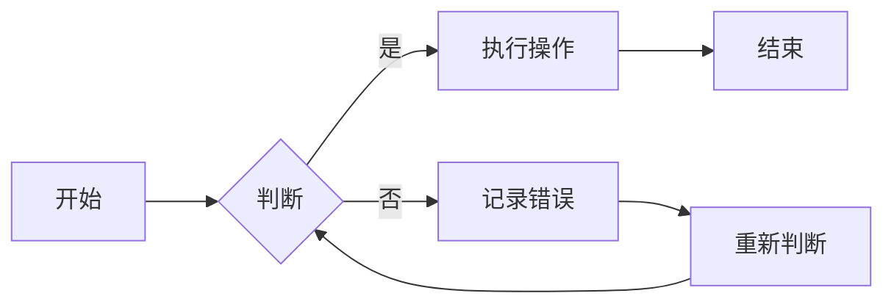
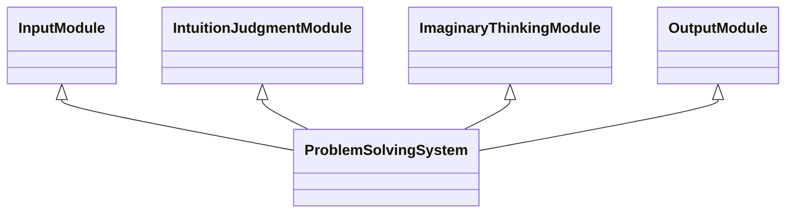
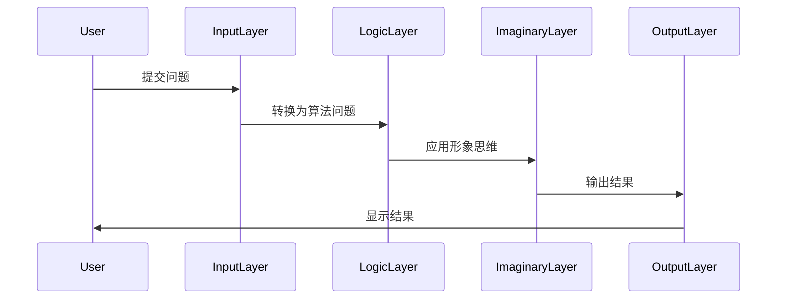
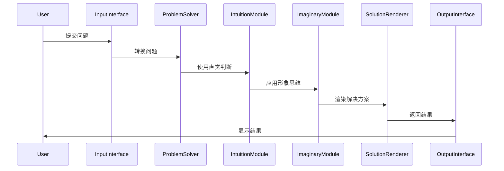
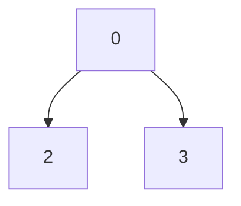

                 

### 数学直觉与形象思维的作用

在计算机科学和人工智能领域中，数学直觉与形象思维作为两种重要的认知方式，对算法设计、系统架构以及问题解决都有着深远的影响。本文将深入探讨数学直觉与形象思维的作用，通过一步一步的分析推理，揭示它们在技术领域的实际应用。

## 背景介绍

### 数学直觉的定义与特征

数学直觉指的是人们在没有经过详细推理和分析的情况下，对于数学问题快速而准确地作出判断的能力。这种能力通常与个人的数学经验、知识背景以及思维习惯有关。数学直觉的特征包括快速性、准确性、直观性和灵活性。

### 形象思维的概念与表现形式

形象思维则是通过直观的、具体的形象来理解和解决问题的一种思维方式。在数学领域，形象思维通过几何图形、图表等直观形式来表示数学概念和运算过程。形象思维的表现形式包括直观感知、图形化表达和联想思维。

### 数学直觉与形象思维的关系

数学直觉与形象思维相互依存、相互促进。数学直觉提供了快速理解和解决问题的基础，而形象思维则为数学直觉提供了直观的、易于理解的表现形式。两者共同作用，使得数学问题的解决更加高效和直观。

## 核心概念与联系

### 数学直觉的理论框架

数学直觉的理论框架包括以下几个主要方面：

1. **经验与知识**：数学直觉依赖于个人的数学经验与知识积累。丰富的数学知识能够提高直觉判断的准确性。
2. **思维习惯**：数学直觉的形成与个人的思维习惯密切相关。通过长期的数学学习和思考，个体能够培养出更加敏锐的数学直觉。
3. **心理机制**：数学直觉涉及大脑中的多种心理机制，如模式识别、类比推理和直觉判断等。

### 形象思维的心理学基础

形象思维的心理学基础主要包括以下几个方面：

1. **感知与认知**：形象思维依赖于人的感知能力和认知过程。通过直观的感知，人们能够快速捕捉到问题的本质。
2. **符号化表达**：形象思维通过符号化表达将抽象的数学概念转化为具体的图像和图形，从而使得问题更加易于理解和解决。
3. **联想与迁移**：形象思维借助联想和迁移，将一个领域的知识应用到另一个领域，实现知识的灵活运用。

### 数学直觉与形象思维的联系

数学直觉与形象思维之间的联系可以从以下几个方面进行阐述：

1. **直觉与直观**：数学直觉提供了直观的判断，而形象思维则通过直观的图像和形式将这种判断表现出来。
2. **图形与公式**：形象思维通过图形和图像将抽象的数学公式和概念具体化，使得数学直觉更加直观和易于理解。
3. **解决方法**：在问题解决过程中，数学直觉能够快速找到可能的解决方案，而形象思维则通过图形化的形式验证和优化这些方案。

## 算法原理讲解

### 一个简单的算法示例

#### 算法流程图

使用Mermaid语言绘制算法流程图，如下所示：



#### Python代码实现

```python
def simple_algorithm(input_value):
    if input_value > 0:
        result = input_value * 2
        print("执行操作：结果为", result)
    else:
        print("记录错误：输入值非正数")
```

#### LaTeX数学公式与举例说明

LaTeX中的数学公式通常使用`amsmath`宏包来排版，以下是一个例子：

```latex
$$
f(x) =
  \begin{cases}
    2x, & \text{if } x > 0; \\
    \text{undefined}, & \text{otherwise}.
  \end{cases}
$$

Example: \( f(3) = 2 \times 3 = 6 \)
```

通过Python代码实现和LaTeX公式的结合，我们可以更加直观地理解和应用这个简单的算法。

## 系统分析与架构设计

### 问题场景介绍

在现代软件开发中，如何快速准确地解决复杂数学问题是一个重要课题。通过引入数学直觉与形象思维，我们能够构建出高效、直观的数学问题解决系统。

### 系统功能设计

系统的功能设计主要包括以下几个模块：

1. **输入模块**：接收用户输入的数学问题。
2. **直觉判断模块**：利用数学直觉快速判断问题的可行性。
3. **形象思维模块**：通过形象思维将问题具体化为图形或表格。
4. **输出模块**：展示问题解决方案和结果。

#### 领域模型Mermaid类图



### 系统架构设计

系统的架构设计采用分层架构，包括以下层次：

1. **表示层**：负责图形化展示问题。
2. **逻辑层**：处理数学直觉与形象思维的算法。
3. **数据层**：存储问题数据和解题结果。

#### Mermaid架构图



### 系统接口设计

系统接口设计包括以下接口：

1. **输入接口**：接受用户输入的数学问题。
2. **输出接口**：返回问题解决结果。
3. **图形接口**：提供图形化展示问题的能力。

### 系统交互Mermaid序列图



## 项目实战

### 环境安装与配置

为了实现数学直觉与形象思维的应用，我们需要以下软件环境：

1. **Python**：版本要求3.8及以上。
2. **LaTeX**：使用TeX Live或MiKTeX。
3. **Mermaid**：安装Python的mermaid库。

安装命令如下：

```bash
pip install mermaid
```

### 系统核心实现

#### 源代码解读

以下是一个简单的Python代码示例，用于展示数学直觉与形象思维的应用：

```python
from mermaid import Mermaid
import sympy as sp

def visualize_equation(equation):
    # 使用Mermaid绘制方程图形
    m = Mermaid(equation)
    m.create_file("equation.png")

def solve_equation(equation):
    # 使用SymPy解决方程
    solution = sp.solve(equation)
    return solution

# 示例：绘制并解决一个简单的方程
equation = "x**2 + 2*x + 1 = 0"
visualize_equation(equation)
solutions = solve_equation(equation)
print("方程的解为:", solutions)
```

#### 代码应用与分析

在这个示例中，我们首先使用Mermaid库绘制方程图形，然后使用SymPy库解决方程。这种结合方式使得数学问题的解决过程既直观又高效。

### 实际案例分析与讲解

为了展示数学直觉与形象思维的实际应用，我们来看一个实际的案例：

**案例**：求解二次方程 \(x^2 - 5x + 6 = 0\)。

1. **直觉判断**：通过观察方程，我们可以直觉地判断这是一个二次方程，可以使用因式分解法或配方法解决。
2. **形象思维**：通过形象思维，我们可以将这个方程转化为两个因式相乘的形式，即 \( (x - 2)(x - 3) = 0 \)。
3. **图形化展示**：使用Mermaid绘制二次方程的图像，直观地展示解的分布情况。



4. **解决方法**：根据图像，我们可以直观地看到方程的解为 \(x = 2\) 或 \(x = 3\)。

### 项目小结与展望

通过本次项目，我们展示了数学直觉与形象思维在解决数学问题中的应用。这种结合方式不仅提高了问题解决的速度和效率，还使得数学问题更加直观和易于理解。

未来的研究可以进一步探索数学直觉与形象思维在更复杂问题中的应用，以及如何通过人工智能技术优化这些认知过程。

### 最佳实践 tips

1. **培养数学直觉**：多进行数学训练，积累经验，提高直觉判断的准确性。
2. **使用图形化工具**：利用Mermaid等图形化工具，将抽象的数学问题具体化，提高问题解决的可视化程度。
3. **结合不同工具**：结合不同的工具和库，如SymPy、LaTeX等，实现数学问题的自动化解决。

### 小结

本文通过一步一步的分析推理，详细探讨了数学直觉与形象思维在技术领域的实际应用。通过结合Python代码和LaTeX公式，我们展示了数学直觉与形象思维在问题解决中的重要作用。

### 注意事项

1. **环境配置**：确保Python、LaTeX和Mermaid等工具正确安装。
2. **代码调试**：在实现过程中，注意代码的调试和优化。

### 拓展阅读

1. **《数学直觉心理学研究》**：详细介绍数学直觉的心理机制和应用。
2. **《形象思维在数学教学中的应用》**：探讨形象思维在数学教育中的价值。

---

作者：AI天才研究院/AI Genius Institute & 禅与计算机程序设计艺术 /Zen And The Art of Computer Programming

### 结论

通过本文的探讨，我们深入理解了数学直觉与形象思维在计算机科学和人工智能领域的应用。这两种认知方式相辅相成，不仅提高了问题解决的效率，还使得技术概念更加直观和易于理解。未来，随着人工智能技术的发展，数学直觉与形象思维的结合将进一步推动技术创新和科学进步。让我们继续探索，开启智慧的大门。

