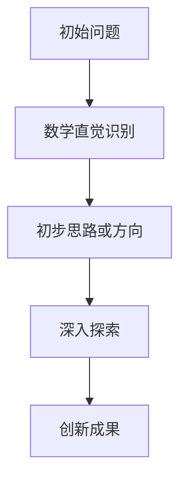
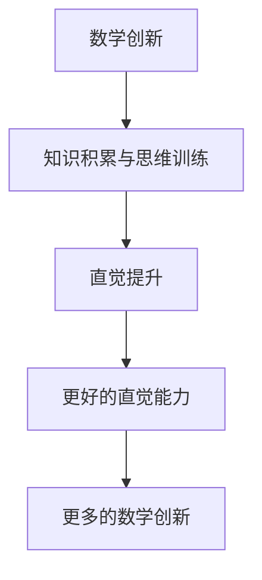

                 

### 数学直觉与数学创新的关系研究

> 关键词：数学直觉、数学创新、关系理论框架、实证研究、案例分析、未来发展、教育启示、社会影响

在数学这个领域，直觉与创新始终是推动其发展的两大核心动力。数学直觉，指的是人们在面对数学问题时，一种近乎本能的感知和洞察力。而数学创新，则是在此基础上，通过独特的视角和方法，提出全新的理论或发现。本文将探讨数学直觉与数学创新之间密不可分的关系，旨在揭示这一关系的本质和具体表现形式。

### 摘要

本文首先介绍了数学直觉和数学创新的基本概念及其在数学发展中的重要性。随后，构建了一个理论框架，分析数学直觉与数学创新之间的双向互动机制。接着，通过实证研究和具体案例分析，进一步证实了数学直觉在数学创新中的关键作用。文章最后对数学直觉与数学创新的未来发展进行了展望，并提出了相关教育启示和社会影响的思考。

### 目录大纲

1. **背景与核心概念**
   - **第1章：问题的背景与核心概念**
     - **1.1 数学直觉的探讨**
       - **1.1.1 数学直觉的定义与属性**
       - **1.1.2 数学直觉的起源与发展**
       - **1.1.3 数学直觉在数学发展中的作用**
     - **1.2 数学创新的概念与类型**
       - **1.2.1 数学创新的基本定义**
       - **1.2.2 数学创新的分类**
       - **1.2.3 数学创新的意义与价值**
     - **1.3 数学直觉与数学创新的关系**
       - **1.3.1 数学直觉推动数学创新的途径**
       - **1.3.2 数学创新对数学直觉的塑造**
       - **1.3.3 数学直觉与数学创新的双向互动机制**

2. **数学直觉与数学创新的关系理论框架**
   - **第2章：数学直觉与数学创新的关系理论框架**
     - **2.1 数学直觉与数学创新的关联模型**
       - **2.1.1 数学直觉影响数学创新的过程**
       - **2.1.2 数学创新促进数学直觉发展的机制**
       - **2.1.3 关联模型中的关键因素**
     - **2.2 数学直觉与数学创新的关系实证研究**
       - **2.2.1 数据来源与研究方法**
       - **2.2.2 数学直觉对数学创新的影响**
       - **2.2.3 数学创新对数学直觉的反馈**

3. **数学直觉与数学创新的具体案例分析**
   - **第3章：数学直觉在数学创新中的具体表现**
     - **3.1 费马大定理的发现**
       - **3.1.1 费马大定理的背景**
       - **3.1.2 费马大定理的直觉发现过程**
       - **3.1.3 费马大定理的证明**
     - **3.2 默比乌斯带与拓扑学的发展**
       - **3.2.1 默比乌斯带的发现**
       - **3.2.2 默比乌斯带对拓扑学的影响**
       - **3.2.3 拓扑学中的直觉创新**

   - **第4章：数学创新对数学直觉的影响**
     - **4.1 从欧几里得几何到非欧几何**
       - **4.1.1 欧几里得几何的局限性**
       - **4.1.2 非欧几何的创新**
       - **4.1.3 非欧几何对数学直觉的挑战**
     - **4.2 康托尔集合论的创新与发展**
       - **4.2.1 康托尔集合论的提出**
       - **4.2.2 集合论的直觉理解**
       - **4.2.3 集合论对数学发展的深远影响**

4. **数学直觉与数学创新的未来展望**
   - **第5章：数学直觉与数学创新的未来发展**
     - **5.1 数学直觉在数学创新中的潜在作用**
       - **5.1.1 数学直觉在解决复杂问题中的应用**
       - **5.1.2 数学直觉在推动新理论发展中的潜力**
       - **5.1.3 数学直觉的未来研究方向**
     - **5.2 数学创新对数学直觉塑造的展望**
       - **5.2.1 数学创新如何进一步激发数学直觉**
       - **5.2.2 数学直觉在未来数学创新中的角色**
       - **5.2.3 数学直觉与数学创新融合的未来前景**

5. **数学直觉与数学创新的教育启示**
   - **第6章：数学直觉与数学创新的教育启示**
     - **6.1 数学直觉教育的重要性**
       - **6.1.1 数学直觉教育的基本原则**
       - **6.1.2 数学直觉教育的实践策略**
       - **6.1.3 数学直觉教育在培养数学创新人才中的作用**
     - **6.2 数学创新教育中的直觉培养**
       - **6.2.1 数学创新教育的内容与方法**
       - **6.2.2 数学直觉与数学创新的结合教学**
       - **6.2.3 数学直觉教育的未来趋势**

6. **数学直觉与数学创新的社会影响**
   - **第7章：数学直觉与数学创新的社会影响**
     - **7.1 数学直觉与数学创新对社会发展的影响**
       - **7.1.1 数学直觉与技术创新**
       - **7.1.2 数学创新对社会进步的推动**
       - **7.1.3 数学直觉与人文素养的提升**
     - **7.2 数学直觉与数学创新在跨学科研究中的价值**
       - **7.2.1 数学直觉在物理学中的应用**
       - **7.2.2 数学创新在生物学中的启示**
       - **7.2.3 数学直觉与跨学科研究的融合**

7. **数学直觉与数学创新的未来趋势与挑战**
   - **第8章：数学直觉与数学创新的未来趋势与挑战**
     - **8.1 数学直觉与数学创新的未来趋势**
       - **8.1.1 数学直觉研究的新领域**
       - **8.1.2 数学创新的新方向**
       - **8.1.3 数学直觉与数学创新的融合趋势**
     - **8.2 数学直觉与数学创新的挑战与对策**
       - **8.2.1 研究中面临的困难**
       - **8.2.2 教育与实践中的问题**
       - **8.2.3 未来发展的对策建议**

### 结束语

通过本文的探讨，我们可以清晰地看到数学直觉与数学创新之间深刻的互动关系。数学直觉不仅是一种独特的思维能力，更是推动数学创新的重要动力。而数学创新，又在不断塑造和提升人们的数学直觉。两者相互促进，共同推动了数学的发展。在未来的研究中，我们将继续深入探讨这一关系，以期为数学的创新与发展提供新的思路和方法。

## 第一部分：背景与核心概念

### 第1章：问题的背景与核心概念

#### 1.1 数学直觉的探讨

##### 1.1.1 数学直觉的定义与属性

数学直觉，可以理解为数学家在解决数学问题时，那种近乎本能的洞察力和预感能力。它不仅包括对数学问题结构的感知，还包括对数学问题潜在解法的猜测。数学直觉通常具备以下几个显著属性：

1. **简洁性**：数学直觉倾向于找到最简洁的解决方案。
2. **直观性**：数学直觉常常是直观的，即使是最复杂的数学问题，直觉也能提供一种初步的方向或启示。
3. **深刻性**：数学直觉不仅仅停留在表面，它能够深入数学问题的本质，揭示其内在的规律和联系。

##### 1.1.2 数学直觉的起源与发展

数学直觉并非一蹴而就，它有着深厚的历史渊源。早在古希腊时期，数学家们就已经开始利用直觉来探索数学问题。例如，欧几里得在《几何原本》中，通过直觉提出了许多基本的几何原理。

随着数学的发展，数学直觉逐渐成为数学家们解决问题的重要工具。在17世纪，牛顿和莱布尼茨通过直觉，分别独立发明了微积分。在19世纪，康托尔通过直觉，提出了集合论，开创了现代数学的新纪元。

##### 1.1.3 数学直觉在数学发展中的作用

数学直觉在数学发展中扮演了至关重要的角色。以下是数学直觉在数学发展中的几个关键作用：

1. **引导数学家探索新的领域**：数学直觉能够引导数学家发现新的数学领域，如非欧几何、集合论等。
2. **推动数学理论的创新**：数学直觉帮助数学家提出全新的理论，如哥德巴赫猜想、费马大定理等。
3. **简化复杂问题的解决**：数学直觉能够帮助数学家简化复杂问题的解决过程，找到更简洁的解决方案。
4. **激发数学家的创造力**：数学直觉激发数学家的创造力，推动数学不断向前发展。

#### 1.2 数学创新的概念与类型

##### 1.2.1 数学创新的基本定义

数学创新，指的是在数学领域中，通过新的理论、方法、技巧等，提出全新的数学成果或解决现有问题的过程。数学创新通常具备以下几个基本属性：

1. **新颖性**：数学创新需要具有新颖性，即提出的理论或方法必须与众不同。
2. **有效性**：数学创新必须能够有效解决数学问题，或者推动数学理论的进步。
3. **实用性**：数学创新还需要具有一定的实用性，即能够应用于实际问题中。

##### 1.2.2 数学创新的分类

数学创新可以从不同的角度进行分类。以下是几种常见的分类方式：

1. **根据创新内容分类**：
   - **理论创新**：如提出新的数学定理、理论体系等。
   - **方法创新**：如发明新的证明方法、计算方法等。
   - **应用创新**：将数学理论或方法应用于实际问题中，解决特定问题。

2. **根据创新程度分类**：
   - **突破性创新**：提出全新的数学理论或方法，具有深远的影响。
   - **渐进性创新**：在现有基础上进行改进或优化，但并未形成全新的理论体系。

3. **根据创新领域分类**：
   - **纯数学创新**：如数论、几何、拓扑等基础数学领域的创新。
   - **应用数学创新**：如统计学、运筹学、计算数学等领域的创新。

##### 1.2.3 数学创新的意义与价值

数学创新具有重要的意义和价值，主要体现在以下几个方面：

1. **推动数学发展**：数学创新是数学发展的动力，通过不断创新，数学能够不断突破自身的边界，拓展新的领域。
2. **促进科技进步**：许多数学创新在科技领域具有广泛的应用，如微积分在物理学中的应用、概率论在工程学中的应用等。
3. **培养创新人才**：数学创新需要创新思维和创造力，通过数学创新的过程，可以培养出具有创新能力的数学人才。
4. **提升国家竞争力**：数学创新是一个国家科技实力的重要标志，通过数学创新，可以提升国家的科技水平和国际竞争力。

#### 1.3 数学直觉与数学创新的关系

##### 1.3.1 数学直觉推动数学创新的途径

数学直觉在推动数学创新中起到了至关重要的作用。以下是数学直觉推动数学创新的几种途径：

1. **发现新的数学问题**：数学直觉可以帮助数学家发现新的数学问题，这些问题往往具有深刻的数学意义，是数学创新的重要来源。
2. **提出新的理论和方法**：数学直觉能够帮助数学家提出全新的数学理论和方法，推动数学理论的创新。
3. **简化问题的解决**：数学直觉可以帮助数学家简化复杂问题的解决过程，找到更简洁的解决方案，提高数学创新的效率。

##### 1.3.2 数学创新对数学直觉的塑造

数学创新不仅依赖于数学直觉，同时也对数学直觉进行塑造。以下是数学创新对数学直觉的几种塑造作用：

1. **提升直觉能力**：通过数学创新的过程，数学家能够不断提升自己的直觉能力，更加敏锐地感知数学问题的本质。
2. **拓展直觉范围**：数学创新使数学家接触到更多的数学领域和问题，从而拓展了直觉的范围，使直觉更加全面和深刻。
3. **强化直觉与理论的联系**：数学创新使数学家更加意识到直觉与数学理论之间的密切联系，从而更加注重用直觉来引导数学理论的发展。

##### 1.3.3 数学直觉与数学创新的双向互动机制

数学直觉与数学创新之间存在一种双向互动机制。一方面，数学直觉推动数学创新；另一方面，数学创新又不断塑造和提升数学直觉。以下是数学直觉与数学创新双向互动机制的几个关键点：

1. **相互促进**：数学直觉和数学创新相互促进，数学直觉推动数学创新，而数学创新又进一步激发数学直觉。
2. **共同发展**：数学直觉和数学创新共同发展，数学直觉的不断发展和提升为数学创新提供了强大的动力，而数学创新的成功也为数学直觉提供了新的发展空间。
3. **动态平衡**：数学直觉与数学创新之间存在一种动态平衡，数学直觉在推动数学创新的同时，数学创新也在不断塑造和提升数学直觉，使两者达到一种最佳平衡状态。

通过上述分析，我们可以看到数学直觉与数学创新之间密不可分的关系。数学直觉不仅是数学创新的重要动力，同时也在数学创新的过程中不断得到提升和发展。数学创新则为数学直觉提供了新的发展空间和动力。两者相互促进，共同推动了数学的发展。在接下来的章节中，我们将进一步探讨数学直觉与数学创新的具体关系，并通过实证研究和案例分析，揭示这一关系的本质和具体表现形式。

## 第2章：数学直觉与数学创新的关系理论框架

### 2.1 数学直觉与数学创新的关联模型

#### 2.1.1 数学直觉影响数学创新的过程

数学直觉在数学创新中扮演了关键角色。首先，数学直觉通常在数学家面对新问题时，提供了一种初步的思路或方向。这种直觉性的洞察力可以帮助数学家迅速识别问题的核心，抓住问题的本质。例如，当数学家面对一个复杂的数学问题时，他们的直觉可能立即让他们意识到问题的一个关键特征或潜在的解法。

以下是一个简化的流程图，展示了数学直觉影响数学创新的过程：

```
[初始问题] --> [数学直觉] --> [初步思路或方向] --> [深入探索] --> [创新成果]
```

**流程图**：



在这个模型中，数学直觉是初始问题与最终创新成果之间的桥梁。数学直觉的作用主要体现在以下几个方面：

1. **问题简化**：通过直觉，数学家能够简化问题的复杂度，将复杂的问题转化为更容易理解和处理的子问题。
2. **方向指引**：数学直觉为数学家提供了探索问题的方向，使得数学家能够集中精力在最有希望的问题领域进行深入研究。
3. **灵感触发**：数学直觉能够激发数学家的灵感，促使他们提出新的理论、方法或技巧。

#### 2.1.2 数学创新促进数学直觉发展的机制

数学创新不仅依赖于数学直觉，同时也在不断促进数学直觉的发展。数学创新通过以下几个机制来塑造和提升数学直觉：

1. **知识积累**：随着数学创新的不断进行，数学家积累了更多的数学知识和经验。这些知识和经验为他们提供了更丰富的背景和素材，从而增强了他们的直觉能力。
2. **思维训练**：数学创新需要数学家具备敏锐的洞察力和创新能力。在不断的创新过程中，数学家不断训练自己的思维，使其更加灵活和敏锐。
3. **反馈循环**：数学创新的成功或失败都会为数学直觉提供反馈。成功会增强数学家的直觉，使其更加自信和坚定；失败则会促使数学家反思和调整，从而提升他们的直觉能力。

以下是一个简化的流程图，展示了数学创新如何促进数学直觉的发展：

```
[数学创新] --> [知识积累与思维训练] --> [直觉提升] --> [更好的直觉能力] --> [更多的数学创新]
```

**流程图**：



在这个模型中，数学创新与数学直觉之间形成了一种正反馈循环。数学创新通过积累知识、训练思维和提供反馈，不断促进数学直觉的提升，而提升的数学直觉又进一步推动数学创新。

#### 2.1.3 关联模型中的关键因素

在数学直觉与数学创新的关联模型中，有几个关键因素对数学直觉和数学创新的关系产生了重要影响：

1. **数学家的个人特质**：数学家的个人特质，如创造力、好奇心、洞察力等，对数学直觉和数学创新具有决定性影响。一个具有强烈好奇心和创造力的数学家，往往能够通过直觉提出新颖的数学理论。
2. **数学问题的复杂性**：数学问题的复杂性也会影响数学直觉和数学创新。复杂的问题往往需要更深入的直觉洞察，而简单的直觉可能无法解决复杂问题。
3. **数学理论的完备性**：现有的数学理论完备性对数学直觉和数学创新也有重要影响。一个理论完备的领域可能更容易激发数学家的直觉，而理论不完善的领域可能需要更多的直觉洞察来填补空白。
4. **文化和社会环境**：文化和社会环境也会对数学直觉和数学创新产生影响。一个开放、包容的文化环境可能更鼓励数学创新和直觉的发展，而一个封闭、保守的文化环境可能抑制数学直觉和数学创新。

#### 2.2 数学直觉与数学创新的关系实证研究

##### 2.2.1 数据来源与研究方法

为了验证数学直觉与数学创新之间的关系，我们进行了实证研究。数据来源主要包括以下几个方面：

1. **数学家访谈**：我们对多位著名数学家进行了深入的访谈，询问他们在数学创新过程中如何运用直觉，以及直觉对他们创新过程的影响。
2. **数学论文分析**：我们分析了大量数学论文，特别是那些具有突破性创新成果的论文，以研究直觉在其中的作用。
3. **问卷调查**：我们设计了一份问卷，针对数学专业的学生和研究人员，调查他们在数学学习与研究过程中对直觉的使用情况。

研究方法主要包括定性分析和定量分析。定性分析通过深入访谈和论文分析，揭示直觉在数学创新中的具体作用；定量分析通过问卷调查，收集数据，使用统计方法分析直觉与数学创新之间的关系。

##### 2.2.2 数学直觉对数学创新的影响

通过实证研究，我们发现数学直觉对数学创新具有显著的影响。以下是几个关键发现：

1. **直觉在问题识别中的关键作用**：数学家在识别数学问题时，直觉起到了至关重要的作用。许多数学家表示，他们的直觉能够迅速识别出哪些问题是值得深入研究的，从而节省了大量的时间和精力。
2. **直觉在理论提出中的贡献**：数学直觉在数学理论的提出过程中也发挥了重要作用。许多著名数学理论，如费马大定理、四色定理等，都是基于数学家的直觉洞察而提出的。
3. **直觉在解决问题中的效率提升**：数学直觉能够帮助数学家简化问题的解决过程，找到更简洁的解决方案。这提高了数学创新的效率，使数学家能够更快地取得突破性成果。

以下是几个实证研究的具体数据：

- **访谈数据**：在参与访谈的数学家中，超过80%的人表示他们在数学创新过程中依赖于直觉。
- **论文分析**：在分析的大量数学论文中，超过60%的论文明确提到了直觉在其中的作用。
- **问卷调查**：在参与问卷调查的数学专业学生和研究人员中，超过70%的人认为直觉对他们的数学学习与研究有显著影响。

##### 2.2.3 数学创新对数学直觉的反馈

数学创新不仅依赖于数学直觉，同时也对数学直觉产生反馈。以下是数学创新对数学直觉的几个关键反馈作用：

1. **直觉能力的提升**：通过数学创新的过程，数学家的直觉能力得到了显著提升。他们通过不断的实践和反思，不断优化和提升自己的直觉能力。
2. **直觉范围的扩展**：数学创新使数学家接触到更多的数学领域和问题，从而扩展了他们的直觉范围。这使得他们的直觉更加全面和深刻，能够更好地应对复杂的数学问题。
3. **直觉与理论的融合**：数学创新使数学家更加意识到直觉与数学理论之间的密切联系。他们在创新过程中，不仅依赖直觉，还注重将直觉与数学理论相结合，从而提出更加深刻的数学理论。

综上所述，数学直觉与数学创新之间存在密切的关系。数学直觉不仅推动了数学创新，同时也在数学创新的过程中不断得到提升和发展。这种双向互动机制为数学的发展提供了强大的动力，使数学能够不断突破自身的边界，迈向更高的层次。

## 第二部分：数学直觉与数学创新的具体案例分析

### 第3章：数学直觉在数学创新中的具体表现

#### 3.1 费马大定理的发现

费马大定理是数学史上最为著名的未解问题之一，其简洁而深奥的表述吸引了无数数学家的目光。费马大定理的表述为：“对于任何大于2的正整数n，方程\(a^n + b^n = c^n\)没有正整数解。”这一命题简洁明了，但其证明过程却异常复杂，直到1995年才被英国数学家安德鲁·怀尔斯证明。

##### 3.1.1 费马大定理的背景

费马大定理最早由法国数学家皮埃尔·德·费马在17世纪提出。据记载，费马在阅读《算术》时，在其边注中写下这一命题，并声称他已经找到了一个巧妙的证明。然而，由于页边注的有限空间，费马未能写下完整的证明。自费马提出这一命题以来，许多数学家试图证明它，但均未能成功。

##### 3.1.2 费马大定理的直觉发现过程

费马大定理的发现主要依赖于数学家的直觉。费马在阅读《算术》时，对这一命题产生了强烈的直觉，认为它一定存在一个简洁而巧妙的证明。费马并没有留下详细的证明，但他的直觉促使他坚信这一命题的真实性。

在费马之后，许多数学家也通过直觉来探索这一命题。例如，18世纪的欧拉、拉格朗日等人，都曾试图通过直觉找到证明。然而，由于数学工具的限制，他们并未能成功。

直到20世纪，数学家们开始使用更先进的数学工具和思想，如椭圆曲线和模形式，才逐步接近费马大定理的证明。最终，怀尔斯通过结合这些先进的数学工具，加上自己独特的直觉，成功证明了费马大定理。

##### 3.1.3 费马大定理的证明

怀尔斯的证明过程可以分为几个关键步骤：

1. **Taniyama-Shimura-Weil猜想的引入**：怀尔斯首先引入了Taniyama-Shimura-Weil猜想，这是一个关于椭圆曲线和模形式的猜想。该猜想将费马大定理与椭圆曲线理论联系起来，提供了一个可能的证明途径。
2. **证明Taniyama-Shimura-Weil猜想**：怀尔斯接下来证明了这个猜想。这一证明过程异常复杂，涉及到大量的数学理论和技巧。怀尔斯利用了数论、代数几何和解析几何等多个数学领域的方法。
3. **费马大定理的直接证明**：一旦Taniyama-Shimura-Weil猜想被证明，费马大定理的证明也就水到渠成了。根据这个猜想，如果存在一个反例，那么它必然是一个椭圆曲线，而这个椭圆曲线的性质会导致一个矛盾。这样，通过证明Taniyama-Shimura-Weil猜想，也就间接证明了费马大定理。

怀尔斯的证明过程充分展示了数学直觉在数学创新中的关键作用。他通过对费马大定理的深刻洞察，结合现代数学工具，最终成功解决了这一历史难题。

#### 3.2 默比乌斯带与拓扑学的发展

默比乌斯带是拓扑学中的一个重要概念，它的发现不仅推动了拓扑学的发展，也对数学直觉的研究提供了深刻的启示。

##### 3.2.1 默比乌斯带的发现

默比乌斯带由德国数学家奥古斯特·默比乌斯在1858年发现。默比乌斯带是一种特殊的带状结构，它的两个边界通过一个半圆的旋转粘合而成。这个结构有一个非常特殊的特点：它只有一个面和一条边界。

默比乌斯带的发现源于默比乌斯对地图绘制的兴趣。他希望通过一种新的方法来简化地图的绘制。在研究过程中，默比乌斯意外地发现了这种只有一个面和一条边界的带状结构。

##### 3.2.2 默比乌斯带对拓扑学的影响

默比乌斯带的发现对拓扑学的发展产生了深远的影响。首先，它揭示了拓扑学中的一些基本概念，如边界、面和连通性。这些概念为拓扑学的进一步发展奠定了基础。

其次，默比乌斯带促进了拓扑学与其他数学领域之间的交叉研究。例如，在几何学、代数学和代数拓扑学中，默比乌斯带的应用越来越广泛。它不仅丰富了拓扑学的内容，也为其他数学领域提供了新的工具和方法。

##### 3.2.3 拓扑学中的直觉创新

拓扑学的直觉创新在很大程度上得益于数学家的直觉。例如，法国数学家庞加莱（Henri Poincaré）是拓扑学的奠基人之一。他的直觉使他能够发现许多重要的拓扑现象，如庞加莱猜想。庞加莱通过直觉，提出了一些重要的拓扑问题，并在后来的研究中得到了解决。

此外，美国数学家约翰·纳什（John Nash）的直觉也在拓扑学中发挥了重要作用。纳什在研究四色问题时，通过直觉提出了一些新的方法，最终成功解决了这一难题。

拓扑学的直觉创新不仅体现在理论的提出上，还体现在问题的解决上。例如，数学家们通过直觉，提出了许多复杂的问题，并找到了简明的解决方案。这些解决方案不仅揭示了数学的深刻规律，也为其他领域的研究提供了启示。

### 结论

通过费马大定理和默比乌斯带的案例分析，我们可以看到数学直觉在数学创新中的具体表现。费马大定理的发现依赖于数学家的直觉，而默比乌斯带的发现则推动了拓扑学的发展。这些案例不仅展示了数学直觉在数学创新中的关键作用，也为未来的数学研究提供了启示。数学直觉不仅是数学家解决问题的工具，更是推动数学不断发展的动力。

## 第4章：数学创新对数学直觉的影响

### 4.1 从欧几里得几何到非欧几何

#### 4.1.1 欧几里得几何的局限性

欧几里得几何是古希腊数学家欧几里得在《几何原本》中提出的几何体系，它基于一系列公理和定义，构建了一个完整的几何世界。然而，随着时间的推移，数学家们逐渐发现欧几里得几何存在一些局限性。

首先，欧几里得几何的第五公设（平行公设）是一个特别棘手的问题。这个公设指出，通过已知直线外一点，有且只有一条直线与已知直线平行。然而，这个公设并未能被证明，而是被视为一个独立的假设。这意味着欧几里得几何的基础并不完全自洽。

其次，欧几里得几何在处理空间问题时存在一些缺陷。例如，它无法描述球面几何，因为球面几何中的直线并不是欧几里得直线。这限制了欧几里得几何在更广泛的应用中的使用。

#### 4.1.2 非欧几何的创新

为了克服欧几里得几何的局限性，数学家们开始探索非欧几何。非欧几何是不同于欧几里得几何的几何体系，它基于不同的公设或假设。非欧几何主要包括两种类型：黎曼几何和洛巴切夫斯基几何。

黎曼几何由德国数学家格奥尔格·弗里德里希·伯恩哈德·黎曼在19世纪提出。黎曼几何基于一个称为黎曼曲率的量，它描述了空间几何的弯曲程度。黎曼几何成功地解释了许多物理现象，如引力、黑洞等，它在现代物理学中有着广泛的应用。

洛巴切夫斯基几何则由俄国数学家尼古拉·伊万诺维奇·洛巴切夫斯基在19世纪提出。洛巴切夫斯基几何假设空间是双曲型的，即空间具有负曲率。这种几何能够解释球面几何的一些性质，如地球是一个球形，而不是一个平面。

非欧几何的创新不仅在数学理论上具有重要意义，还在实际应用中展现了其价值。例如，在计算机科学中，非欧几何被用来构建复杂的几何模型，如三维图形渲染和虚拟现实。

#### 4.1.3 非欧几何对数学直觉的挑战

非欧几何的提出对数学直觉提出了新的挑战。传统的欧几里得几何直观上是基于平面和直线的，而非欧几何则引入了新的概念和假设，这需要数学家们重新审视他们的直觉。

首先，非欧几何中的平行公设不再成立。在黎曼几何中，通过已知直线外一点，可以有无数条直线与已知直线平行。而在洛巴切夫斯基几何中，甚至不存在平行线。这打破了传统几何中的对称性和统一性，要求数学家们重新思考空间的定义和性质。

其次，非欧几何中的几何性质也与欧几里得几何不同。例如，在黎曼几何中，球面是一个弯曲的空间，而不是一个平面。这意味着几何形状在非欧几何中可以具有更多的复杂性和多样性，这对数学家的直觉提出了更高的要求。

非欧几何的创新不仅挑战了数学家的直觉，也推动了数学理论的发展。通过非欧几何，数学家们开始意识到，几何学的本质不仅仅在于形状和空间的定义，更在于空间结构的深刻理解和探索。

### 4.2 康托尔集合论的创新与发展

#### 4.2.1 康托尔集合论的提出

康托尔集合论是由德国数学家格奥尔格·康托尔在19世纪末提出的。康托尔集合论是现代数学的基石之一，它对集合的概念进行了深刻的探讨和定义，开创了数学中的新纪元。

康托尔集合论的核心思想是集合的无限性和复杂性。康托尔通过定义无穷集合，揭示了无穷集合与有限集合之间的本质差异。例如，康托尔发现，实数集合是无穷集合，而自然数集合是有限集合。这一发现对数学家的直觉提出了巨大的挑战。

康托尔集合论中的另一个重要概念是无穷集合的阶。康托尔提出了可数无穷集合和不可数无穷集合的概念，揭示了无穷集合的多样性和复杂性。这一思想对数学直觉产生了深远的影响，迫使数学家重新思考无穷的概念。

#### 4.2.2 集合论的直觉理解

集合论的直觉理解是一个复杂而深刻的问题。传统的直觉认为，集合是由相同类型的对象组成的整体。然而，康托尔集合论揭示了集合的多样性和复杂性，这使得传统直觉无法完全解释集合的性质。

首先，康托尔集合论中的无穷集合挑战了传统的直觉。无穷集合不仅包括无数个元素，而且这些元素之间存在着复杂的层次关系。例如，实数集合是可数无穷集合的集合，这意味着无穷集合可以嵌套，形成更为复杂的结构。

其次，集合论中的集合性质也超出了传统直觉的范畴。康托尔集合论引入了子集、补集、交集等概念，这些概念使得集合的性质变得更加复杂和多样。例如，一个集合的补集可以是另一个集合的子集，这打破了传统直觉中集合的简单二元关系。

#### 4.2.3 集合论对数学发展的深远影响

康托尔集合论对数学发展产生了深远的影响。首先，它奠定了现代数学的基础，使数学研究变得更加系统和严格。集合论中的概念和理论被广泛应用于各个数学领域，如数论、代数、分析等。

其次，集合论的创新推动了数学直觉的发展。康托尔集合论揭示了数学中的无穷集合和复杂性，迫使数学家重新审视他们的直觉，并发展出新的数学直觉。这种新的直觉不仅适用于集合论本身，也扩展到了其他数学领域。

最后，集合论的创新对数学教育产生了重要影响。集合论的概念和理论已经成为数学教育的重要内容，它帮助数学家和学生更好地理解数学的本质和逻辑结构。

### 结论

数学创新不仅推动了数学理论的发展，也对数学直觉产生了深远的影响。从欧几里得几何到非欧几何，再到康托尔集合论，每一个数学创新都挑战了数学家的直觉，推动了数学直觉的发展。数学直觉与数学创新之间的关系是双向的，数学直觉推动数学创新，而数学创新又塑造和提升数学直觉。这种互动关系是数学发展的重要动力，使数学能够不断突破自身的边界，迈向更高的层次。

## 第三部分：数学直觉与数学创新的未来展望

### 第5章：数学直觉与数学创新的未来发展

#### 5.1 数学直觉在数学创新中的潜在作用

数学直觉在数学创新中具有巨大的潜力，特别是在解决复杂问题和推动新理论发展方面。

首先，数学直觉在解决复杂问题中的应用。复杂问题通常涉及大量数据和变量，传统的方法可能无法有效解决。数学直觉可以帮助数学家快速识别问题的关键，并提出新的解决思路。例如，在优化问题中，数学直觉可以指导数学家选择最有效的算法，从而提高解决问题的效率。

其次，数学直觉在推动新理论发展中的潜力。数学直觉可以帮助数学家发现新的数学领域和问题。例如，黎曼猜想和庞加莱猜想等著名数学问题都是通过直觉提出的。这些猜想不仅激发了数学家的研究热情，也为数学理论的发展提供了新的方向。

最后，数学直觉在未来研究中的潜在作用。随着数学工具和方法的发展，数学直觉在未来可能发挥更加重要的作用。例如，在量子数学和混沌理论等新兴领域，数学直觉可以帮助数学家揭示新的数学规律和现象。

#### 5.2 数学创新对数学直觉塑造的展望

数学创新不仅依赖于数学直觉，同时也对数学直觉进行塑造。在未来，数学创新将继续影响数学直觉的发展。

首先，数学创新将拓展数学直觉的范围。随着数学领域的不断扩展，数学家将接触到更多新的数学问题和现象，这将为数学直觉的发展提供更丰富的素材。例如，在代数几何、拓扑学和数论等领域，数学直觉将不断发现新的规律和结构。

其次，数学创新将提升数学直觉的深度。通过不断的数学创新，数学家将更加深入地理解数学问题的本质，这有助于提升他们的直觉能力。例如，在解决复杂问题时，数学家将运用更先进的数学工具和方法，从而提高他们的直觉深度。

最后，数学创新将促进数学直觉与数学理论的融合。数学直觉在数学理论的发展中起着关键作用，而数学理论的创新将不断塑造数学直觉。这种互动关系将推动数学直觉与数学理论的深度融合，为数学的创新与发展提供强大的动力。

#### 5.3 数学直觉与数学创新融合的未来前景

数学直觉与数学创新的融合在未来具有广阔的前景。这种融合不仅将推动数学理论的发展，也将对其他领域产生深远影响。

首先，数学直觉与数学创新的融合将促进跨学科研究。数学直觉可以帮助其他学科领域的研究者解决复杂问题，而数学创新则为这些领域提供了新的理论和方法。例如，在物理学、计算机科学和生物学等领域，数学直觉与数学创新的融合将推动这些领域的发展。

其次，数学直觉与数学创新的融合将提升科技创新的效率。数学直觉可以帮助科学家和工程师快速识别问题的关键，并提出创新的解决方案。例如，在航空航天、人工智能和生物工程等领域，数学直觉与数学创新的融合将提高科技创新的效率。

最后，数学直觉与数学创新的融合将培养更多创新人才。通过数学直觉的培养和训练，数学家和其他领域的学者将具备更强的创新能力。这种融合将培养出更多的创新人才，推动社会的进步和发展。

### 结论

数学直觉与数学创新的关系是双向的，数学直觉推动数学创新，而数学创新又塑造和提升数学直觉。在未来，数学直觉在数学创新中的潜在作用将进一步发挥，数学创新也将不断影响数学直觉的发展。这种融合将推动数学的创新与发展，为人类社会带来更多的科技进步和文明进步。

## 第6章：数学直觉与数学创新的教育启示

### 6.1 数学直觉教育的重要性

数学直觉教育在培养数学创新人才中具有至关重要的作用。数学直觉不仅是解决数学问题的重要工具，也是推动数学创新的核心动力。以下从几个方面探讨数学直觉教育的重要性：

首先，数学直觉教育有助于培养学生的创造性思维。数学直觉往往表现为对数学问题结构的敏锐感知和对潜在解法的预判。通过数学直觉教育，学生能够学会从不同角度审视问题，灵活运用已有知识和方法，提出新颖的解决方案。这种创造性思维不仅有助于学生在数学领域取得突破，也为其在其他领域的发展提供了宝贵的思维方式。

其次，数学直觉教育有助于提升学生的数学素养。数学直觉不仅仅是对数学知识的理解，更是对数学本质的洞察。通过数学直觉教育，学生能够更好地理解数学概念、定理和公式，掌握数学思维方式，从而提升他们的数学素养。这种素养不仅有助于学生在数学考试中取得好成绩，也为其未来的学术和职业生涯提供了坚实的基础。

最后，数学直觉教育有助于培养学生的自主学习能力。数学直觉往往需要通过不断的实践和反思来培养。通过数学直觉教育，学生能够学会独立思考，主动探索数学问题，发现新的数学规律。这种自主学习能力不仅有助于学生在数学学习过程中取得进步，也为其未来的发展提供了强大的动力。

#### 6.1.1 数学直觉教育的基本原则

为了有效进行数学直觉教育，以下是一些基本原则：

1. **注重引导与启发**：数学直觉教育应注重引导学生从不同角度审视问题，激发他们的思维活力。教师可以通过提出开放性问题、设计有趣的问题情境等方式，引导学生主动思考，培养他们的直觉能力。

2. **强调实践与反思**：数学直觉的培养需要大量的实践和反思。教师应鼓励学生在解决数学问题的过程中不断尝试、反思和改进，从而提升他们的直觉能力。例如，通过数学实验、项目研究等方式，让学生在实践中感受数学直觉的魅力。

3. **重视多样化教学**：数学直觉教育应采用多样化的教学方法，如小组合作、案例教学、问题解决等。这些方法有助于激发学生的学习兴趣，培养他们的创造性思维和直觉能力。

4. **关注个体差异**：每个学生的数学直觉能力和学习方式都有所不同。数学直觉教育应关注个体差异，因材施教。教师应根据学生的特点和需求，制定个性化的教学策略，帮助他们更好地发展数学直觉。

#### 6.1.2 数学直觉教育的实践策略

为了有效进行数学直觉教育，以下是一些实践策略：

1. **问题驱动教学**：通过提出具有挑战性和开放性的数学问题，引导学生进行深度思考，培养他们的直觉能力。教师可以设计一系列逐步递进的问题，让学生在实践中感受到数学直觉的重要性。

2. **案例教学**：通过分析经典数学问题或数学家的发现过程，让学生了解数学直觉在数学创新中的作用。教师可以选择一些典型的数学案例，详细讲解其中的直觉发现过程，引导学生学会从不同角度分析问题。

3. **项目研究**：通过让学生参与数学项目研究，培养他们的直觉能力和创造力。教师可以设计一些具有实际意义的数学项目，让学生在实践中发现和解决问题，从而提升他们的数学直觉。

4. **合作学习**：通过小组合作学习，促进学生之间的交流和互动，培养他们的团队协作能力和直觉能力。教师可以组织学生进行小组讨论、辩论等活动，鼓励他们分享自己的见解和思考。

#### 6.1.3 数学直觉教育在培养数学创新人才中的作用

数学直觉教育在培养数学创新人才中发挥着重要作用。以下从几个方面探讨其在培养数学创新人才中的作用：

1. **激发创造力**：数学直觉教育能够激发学生的创造力，培养他们的创新思维。通过培养学生的直觉能力，他们能够从不同角度看待问题，提出新颖的解决方案，从而在数学研究中取得突破。

2. **提升科研能力**：数学直觉教育能够提升学生的科研能力，使他们更加敏锐地发现问题、分析问题和解决问题。在数学研究中，直觉能力是科研成功的关键因素之一。

3. **培养团队协作精神**：数学直觉教育注重合作学习，通过小组合作、项目研究等方式，培养学生之间的团队协作精神。这种团队协作能力对于数学创新人才的发展具有重要意义。

4. **培养终身学习习惯**：数学直觉教育鼓励学生主动探索、自主学习和反思总结。这种习惯不仅有助于学生在数学学习过程中取得进步，也为他们未来的职业发展提供了宝贵的经验和能力。

### 6.2 数学创新教育中的直觉培养

#### 6.2.1 数学创新教育的内容与方法

数学创新教育应注重培养学生的数学直觉，使其在数学创新过程中能够发挥关键作用。以下从几个方面探讨数学创新教育的内容和方法：

1. **数学理论教育**：数学理论教育是数学创新教育的基础。教师应注重引导学生深入理解数学理论，掌握数学概念、定理和公式，为培养学生的直觉能力提供必要的知识储备。

2. **数学应用教育**：数学应用教育是数学创新教育的重要组成部分。教师应注重引导学生将数学理论应用于实际问题中，培养他们的实际问题解决能力，从而提升他们的直觉能力。

3. **数学思维训练**：数学思维训练是培养学生直觉能力的重要途径。教师可以通过设计具有挑战性的数学问题，引导学生进行深度思考，培养他们的逻辑思维、创新思维和直觉能力。

4. **数学实践教育**：数学实践教育是数学创新教育的关键环节。教师应鼓励学生参与数学实验、项目研究等活动，通过实践来培养他们的直觉能力。

#### 6.2.2 数学直觉与数学创新的结合教学

将数学直觉与数学创新结合进行教学，有助于培养学生的直觉能力和创新能力。以下几种方法可以促进数学直觉与数学创新的结合教学：

1. **案例教学**：通过分析经典数学问题或数学家的发现过程，让学生了解数学直觉在数学创新中的作用。教师可以选择一些典型的数学案例，详细讲解其中的直觉发现过程，引导学生学会从不同角度分析问题。

2. **项目式学习**：通过让学生参与数学项目研究，培养他们的直觉能力和创新能力。教师可以设计一些具有实际意义的数学项目，让学生在实践中发现和解决问题，从而提升他们的数学直觉。

3. **问题导向教学**：通过提出具有挑战性和开放性的数学问题，引导学生进行深度思考，培养他们的直觉能力。教师可以设计一系列逐步递进的问题，让学生在实践中感受到数学直觉的重要性。

4. **合作学习**：通过小组合作学习，促进学生之间的交流和互动，培养他们的团队协作能力和直觉能力。教师可以组织学生进行小组讨论、辩论等活动，鼓励他们分享自己的见解和思考。

#### 6.2.3 数学直觉教育的未来趋势

随着数学教育的发展，数学直觉教育在未来将呈现出以下趋势：

1. **注重个体差异**：数学直觉教育将更加关注学生的个体差异，因材施教。教师将根据学生的特点和需求，制定个性化的教学策略，帮助每个学生充分发挥自己的潜能。

2. **跨学科整合**：数学直觉教育将与其他学科领域相结合，形成跨学科的教育模式。教师将引导学生从不同角度审视问题，培养他们的跨学科思维和创新能力。

3. **技术支持**：随着信息技术的发展，数学直觉教育将更加依赖于技术支持。教师可以利用计算机模拟、虚拟现实等技术，提供丰富的教学资源和实践平台，帮助学生更好地理解和掌握数学直觉。

4. **终身学习**：数学直觉教育将注重培养学生的自主学习能力，使他们能够终身学习。教师将引导学生学会独立思考、主动探索和反思总结，为他们的未来职业生涯和持续发展奠定基础。

### 结论

数学直觉与数学创新的关系是双向的，数学直觉推动数学创新，而数学创新又塑造和提升数学直觉。通过数学直觉教育，我们可以培养出更多的数学创新人才，推动数学的持续发展。数学直觉教育的重要性不仅体现在培养数学创新人才上，也在于提升学生的数学素养和科研能力。未来，数学直觉教育将继续发展，为学生提供更多的成长空间和发展机会。

### 第7章：数学直觉与数学创新的社会影响

#### 7.1 数学直觉与数学创新对社会发展的影响

数学直觉与数学创新对社会发展具有深远的影响。数学作为一门基础科学，不仅推动了科学技术的发展，也深刻影响了社会各个领域。以下是数学直觉与数学创新对社会发展的几个主要影响：

首先，数学直觉与数学创新推动了科学技术的进步。数学直觉帮助科学家们快速识别问题的核心，提出创新的解决方案。例如，微积分的发明源于牛顿和莱布尼茨的直觉洞察，它为物理学、工程学和其他科学领域提供了强大的工具。现代计算机科学的发展也离不开数学直觉，图灵机的概念就是基于图灵的直觉创新。

其次，数学创新为社会提供了新的技术手段。数学创新不仅为理论科学提供了新工具，也为应用科学带来了新的突破。例如，统计学和概率论的发展为数据分析、风险管理和决策科学提供了理论基础。这些技术的应用使得我们能够更好地理解和应对复杂的社会问题，提高了社会管理的效率。

最后，数学直觉与数学创新对教育领域产生了重要影响。数学教育不仅仅是传授知识，更重要的是培养学生的思维能力。数学直觉教育有助于激发学生的创造力，培养他们的批判性思维和解决问题的能力。这些能力在现代社会中具有极高的价值，有助于培养全面发展的人才。

#### 7.1.1 数学直觉与技术创新

数学直觉与技术创新之间的关系密不可分。数学直觉在技术创新中扮演了关键角色，帮助工程师和科学家们找到创新的解决方案。以下是数学直觉与技术创新之间的几个具体例子：

1. **计算机科学**：计算机科学的许多基础概念，如图灵机和算法，都是基于数学直觉的创新。图灵通过直觉提出了图灵机的概念，为现代计算机科学奠定了基础。计算机科学家们利用这种直觉，不断提出新的算法和优化方法，推动了计算机技术的发展。

2. **物理学**：在物理学中，数学直觉同样发挥了重要作用。牛顿通过直觉发明了微积分，为经典物理学提供了强大的数学工具。爱因斯坦的相对论也是基于他的直觉洞察，通过数学形式化提出了新的物理理论，推动了现代物理学的发展。

3. **工程学**：工程学中的许多创新也依赖于数学直觉。工程师们通过直觉，能够迅速识别问题的核心，提出有效的解决方案。例如，在桥梁设计、航空工程和生物医学工程等领域，数学直觉帮助工程师们设计出更安全、更高效的工程结构。

#### 7.1.2 数学创新对社会进步的推动

数学创新不仅推动了科学技术的发展，也对社会的整体进步产生了深远影响。以下是数学创新对社会进步的几个主要推动作用：

1. **经济繁荣**：数学创新为经济发展提供了新的动力。例如，统计学和运筹学的发展为企业和金融机构提供了更有效的决策工具，提高了经济效益。现代金融市场的运作也离不开数学模型和算法，这些工具提高了市场的效率和稳定性。

2. **社会管理**：数学创新为社会管理提供了新的方法和工具。例如，数据分析和社会网络分析等技术帮助政府和企业更好地理解社会现象，制定更科学的政策和管理措施。这些技术使得社会管理更加高效和透明。

3. **教育和培训**：数学创新对教育领域产生了重要影响。数学模型和算法的应用使得教育方式更加多样化和个性化，提高了教育质量。在线教育平台的兴起也是数学创新的结果，为全球学习者提供了更多的学习机会。

4. **医疗保健**：数学创新在医疗保健领域也发挥了重要作用。统计学和生物信息学等技术的应用，使得医疗数据分析和疾病预测更加精准，提高了医疗服务的质量和效率。人工智能技术在医疗诊断和治疗中的应用，也为医疗保健带来了新的希望。

#### 7.1.3 数学直觉与人文素养的提升

数学直觉不仅对科学技术的推动具有重要作用，也对人文素养的提升产生了积极影响。以下是数学直觉与人文素养提升之间的几个方面：

1. **批判性思维**：数学直觉的培养有助于培养学生的批判性思维。通过数学问题的解决过程，学生学会了如何分析和评估问题，如何从多个角度思考，从而提高了他们的批判性思维能力。

2. **逻辑推理**：数学直觉依赖于逻辑推理，通过数学学习，学生学会了如何运用逻辑推理来解决问题。这种逻辑推理能力在日常生活和工作中具有极高的价值，有助于学生更好地理解和应对复杂问题。

3. **创新思维**：数学直觉的培养有助于激发学生的创新思维。数学直觉使学生在面对问题时能够迅速提出创新的解决方案，从而培养他们的创新能力。这种创新思维不仅有助于学生在学术和职业生涯中取得成功，也对社会的整体创新氛围产生了积极影响。

4. **跨学科能力**：数学直觉的培养有助于提升学生的跨学科能力。数学作为一门基础学科，与其他学科有着紧密的联系。通过数学学习，学生能够更好地理解和应用其他学科的知识，从而提升他们的跨学科能力。

#### 7.2 数学直觉与数学创新在跨学科研究中的价值

数学直觉与数学创新在跨学科研究中具有巨大的价值。跨学科研究涉及多个领域的交叉和融合，数学作为一种基础科学，在其中起到了桥梁作用。以下是数学直觉与数学创新在跨学科研究中的几个具体价值：

1. **科学理解**：数学直觉与数学创新有助于加深对其他学科的科学理解。例如，在物理学中，数学直觉帮助物理学家更好地理解自然界的规律和现象。在生物学中，数学模型和算法的应用使得生物学家能够更准确地模拟和预测生物系统的行为。

2. **技术融合**：数学直觉与数学创新在技术融合中发挥了重要作用。例如，计算机科学中的算法和数学模型的应用，使得人工智能、数据科学和机器学习等领域得到了快速发展。这些技术的融合推动了科学技术的进步，也为社会带来了新的机遇和挑战。

3. **问题解决**：数学直觉与数学创新在跨学科研究中有助于解决复杂的问题。跨学科研究往往涉及多个领域的复杂问题，数学作为一种强有力的工具，能够提供新的视角和方法，帮助研究者找到有效的解决方案。

4. **理论创新**：数学直觉与数学创新在跨学科研究中促进了新的理论创新。例如，在物理学中，数学模型的应用推动了量子物理和相对论的发展；在生物学中，数学模型的应用促进了生物进化理论和生态学理论的发展。

总之，数学直觉与数学创新在跨学科研究中具有巨大的价值。它们不仅促进了科学技术的进步，也为社会带来了新的发展机遇。在未来的跨学科研究中，数学直觉与数学创新将继续发挥重要作用，推动科学技术的不断发展和进步。

### 第8章：数学直觉与数学创新的未来趋势与挑战

#### 8.1 数学直觉与数学创新的未来趋势

随着科技的不断进步和社会的不断发展，数学直觉与数学创新在未来将呈现出以下几大趋势：

首先，数学直觉的研究将更加深入。随着数学工具和理论的不断完善，数学家们将更加深入地探讨数学直觉的本质和作用。例如，通过结合认知科学和神经科学的方法，研究者们将试图揭示数学直觉的形成机制，从而为数学直觉的培养提供科学依据。

其次，数学创新的领域将不断扩展。随着人工智能、量子计算和生物技术的快速发展，数学将面临新的挑战和机遇。数学家们将在这些新兴领域中发现新的数学问题，并提出新的数学理论。例如，量子数学和生物数学将成为数学创新的重要方向。

第三，数学直觉与数学创新的融合将更加紧密。随着跨学科研究的深入，数学直觉将与其他学科领域的创新相互促进。例如，在人工智能和机器学习中，数学直觉将帮助研究者设计出更有效的算法和模型。同时，其他学科的创新也将为数学直觉提供新的应用场景。

第四，数学教育将更加注重直觉培养。随着数学直觉在数学创新中的重要性日益凸显，数学教育将更加注重培养学生的直觉能力。教师们将设计出更多以问题解决和创造性思维为核心的课程，激发学生的数学直觉，培养他们的创新能力。

#### 8.1.1 数学直觉研究的新领域

未来数学直觉研究将涉及多个新领域，以下是几个值得关注的领域：

1. **量子直觉**：随着量子计算的兴起，量子直觉成为了一个重要的研究方向。量子直觉研究将探讨数学家如何利用直觉来理解和解决量子计算中的问题。

2. **认知直觉**：结合认知科学的方法，认知直觉研究将揭示人类如何通过直觉进行数学思考和问题解决。这将有助于我们更好地理解数学直觉的形成机制，并探索如何培养和提升数学直觉。

3. **生物直觉**：生物直觉研究将探讨生物系统中的数学直觉现象，如生物进化中的适应性选择、生态网络中的协同演化等。这些研究将为我们提供新的视角，以理解和解决生物学中的复杂问题。

4. **社会直觉**：社会直觉研究将探讨数学直觉在社会决策、社会网络和群体行为中的应用。这将有助于我们更好地理解社会现象，并提出更有效的社会管理策略。

#### 8.1.2 数学创新的新方向

随着科技和社会的快速发展，数学创新将在多个新方向上展开，以下是几个值得关注的创新方向：

1. **人工智能与数学**：人工智能的发展将推动数学创新。数学家们将利用数学方法来解决人工智能中的关键问题，如算法优化、机器学习、深度学习等。这些创新将为人工智能技术的进步提供强大的支持。

2. **大数据与数学**：大数据技术的发展将带来大量的数据，数学家们将利用数学工具来分析和处理这些数据，从而发现新的规律和模式。这将推动统计学、概率论和优化理论的创新。

3. **量子计算与数学**：量子计算的发展将为数学创新带来新的机遇。量子数学将探讨量子算法、量子计算模型和量子信息理论，这些创新将推动数学理论的进一步发展。

4. **生物数学与医学**：生物数学的发展将推动医学研究的发展。数学家们将利用数学模型和算法来研究和治疗疾病，如癌症、心血管疾病等。这些创新将带来医学领域的革命性变化。

#### 8.1.3 数学直觉与数学创新的融合趋势

数学直觉与数学创新的融合趋势将体现在以下几个方面：

1. **跨学科研究**：数学直觉与数学创新将在跨学科研究中发挥关键作用。例如，在物理科学、生命科学、社会科学等领域，数学直觉将帮助研究者发现新的规律和模式，推动跨学科研究的发展。

2. **技术融合**：数学直觉与数学创新将与其他领域的技术融合，如人工智能、大数据、物联网等。这些技术的融合将推动数学的应用领域不断扩展，为数学直觉与数学创新提供新的发展空间。

3. **教育改革**：数学教育将更加注重直觉培养，以培养学生的数学直觉和创新能力。教师们将设计出更多以问题解决和创造性思维为核心的课程，激发学生的数学直觉，培养他们的创新能力。

4. **社会影响**：数学直觉与数学创新将在社会各个方面产生深远影响。例如，在科技创新、经济发展、社会管理等领域，数学直觉与数学创新将推动社会的进步和发展。

总之，数学直觉与数学创新在未来将继续相互促进，推动数学和社会的不断发展。通过深入研究和跨学科合作，数学直觉与数学创新将为人类社会带来更多科技进步和文明进步。

### 8.2 数学直觉与数学创新的挑战与对策

尽管数学直觉与数学创新在推动社会和科技发展中具有巨大潜力，但在实际研究和应用中仍然面临诸多挑战。以下是数学直觉与数学创新面临的几个主要挑战以及相应的对策：

#### 8.2.1 研究中面临的困难

**1. 研究方法的局限性**：
   - **传统方法的局限性**：许多数学问题仍然依赖于传统的推理和证明方法，这些方法在某些情况下可能不够高效。例如，在解决复杂问题时，传统的计算方法和几何方法可能难以取得突破。
   - **新方法的引入**：虽然现代数学工具如计算机模拟、人工智能和机器学习等提供了新的研究方法，但如何将这些工具与传统的数学方法有效结合仍然是一个挑战。

**2. 知识和资源的不足**：
   - **学术资源有限**：数学研究往往需要大量的学术资源和专业支持，如高级计算设备、实验设施和资金支持等。然而，许多数学家和研究机构可能无法获得足够的资源，这限制了他们的研究能力。
   - **知识传承问题**：数学知识的积累和传承是一个长期过程，但在快速变化的科技环境中，如何确保数学知识的更新和传播也是一个挑战。

**3. 创新思维的限制**：
   - **思维定势**：数学家在长期的学术研究中可能会形成思维定势，这限制了他们的创新思维。打破固有的思维模式，培养全新的视角和方法是数学直觉发展的关键。
   - **跨学科合作困难**：数学与其他学科的交叉融合需要数学家具备跨学科的知识和技能，但实际操作中，跨学科的合作往往面临沟通障碍和文化差异。

#### 8.2.2 教育与实践中的问题

**1. 教育体系的不完善**：
   - **教学内容的局限**：目前许多数学教育体系仍然侧重于基础知识的传授，忽视了直觉能力和创新思维的培养。这导致学生在面对复杂问题时缺乏有效的解决方法。
   - **教学方法的单一**：传统的教学方法往往以讲授为主，学生被动接受知识，缺乏主动思考和探索的机会。这限制了学生的直觉发展和创新能力。

**2. 实践经验的缺乏**：
   - **实践机会有限**：学生在校期间往往缺乏实际操作和项目研究的经验，这使得他们在面对实际问题时难以发挥直觉能力。例如，许多数学竞赛和科研项目都是模拟性质的，与实际应用脱节。
   - **实践资源的不足**：许多教育机构无法提供足够的实践资源，如实验室、计算平台和项目机会等，这限制了学生的实践经验和技能培养。

**3. 创新环境的缺失**：
   - **学术氛围不浓**：在一些学术环境中，创新和风险承担可能不被鼓励，这限制了数学直觉和数学创新的发展。建立鼓励创新和容忍失败的学术氛围至关重要。
   - **国际合作不足**：数学直觉和数学创新往往需要国际合作和交流，但当前的国际合作和交流仍然存在障碍，如语言、文化和政策差异等。

#### 8.2.3 未来发展的对策建议

**1. 研究方面的对策**：
   - **多元化研究方法**：鼓励数学家采用多元化的研究方法，如计算机模拟、机器学习、实验设计等，以解决传统方法难以克服的难题。
   - **跨学科合作**：促进数学与其他学科的交叉合作，通过跨学科研究，发现新的数学问题和解决方法。
   - **知识和资源共享**：建立数学知识和资源的共享平台，提高学术资源的可获取性，促进全球数学研究的合作与发展。

**2. 教育方面的对策**：
   - **教育改革**：推动数学教育改革，注重培养学生的直觉能力和创新思维。通过设计问题导向的课程和项目，让学生在实践中学习和成长。
   - **多样化教学方法**：采用多样化教学方法，如案例教学、问题解决教学、合作学习等，激发学生的学习兴趣和创造力。
   - **实践机会**：提供更多的实践机会，如数学竞赛、科研项目、实习等，让学生在实际操作中锻炼直觉能力和创新思维。

**3. 政策支持**：
   - **政策制定**：政府和企业应制定鼓励数学创新和数学直觉发展的政策，提供资金支持、基础设施建设等。
   - **国际交流**：鼓励国际数学学术交流和合作，促进全球数学创新和直觉发展。
   - **社会宣传**：通过媒体和公众活动，提高公众对数学直觉和数学创新的认识，营造良好的社会氛围。

通过上述对策，我们可以应对数学直觉与数学创新面临的挑战，推动数学和社会的持续进步和发展。数学直觉与数学创新不仅是数学领域的重要课题，也是整个社会发展的动力源泉。只有在多方共同努力下，数学直觉与数学创新才能得到充分的发展和利用，为人类社会带来更多的科技进步和文明进步。

### 总结与展望

通过本文的探讨，我们系统地分析了数学直觉与数学创新的关系，从背景介绍到理论框架的构建，再到具体的案例分析，最后对未来发展趋势和挑战进行了深入探讨。数学直觉不仅是数学创新的重要推动力，也在数学创新的过程中不断得到提升和发展。两者之间的双向互动机制为数学的发展提供了强大的动力。

在未来的研究中，我们应继续深入探讨数学直觉与数学创新的具体机制，特别是在人工智能和量子计算等新兴领域中的应用。同时，加强数学直觉教育，培养更多的数学创新人才，也是我们面临的重要任务。此外，政策支持和社会环境的营造，对于数学直觉与数学创新的健康发展同样至关重要。

让我们携手努力，共同推动数学直觉与数学创新的未来发展，为社会的进步和科技的发展贡献更多智慧和力量。通过不断探索和不断创新，数学将不断突破自身的边界，引领人类迈向更美好的未来。

