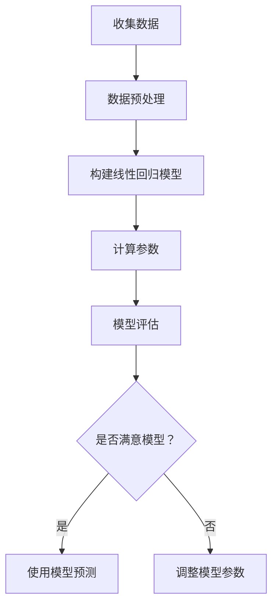
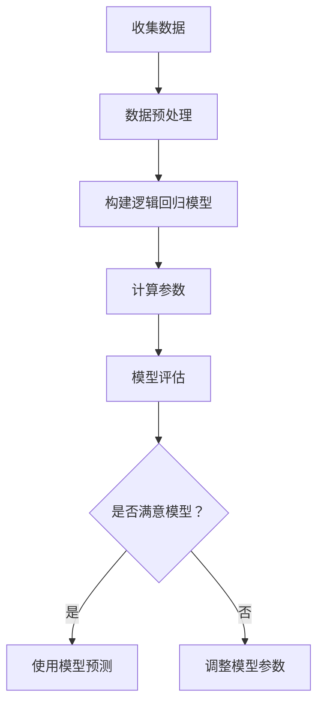
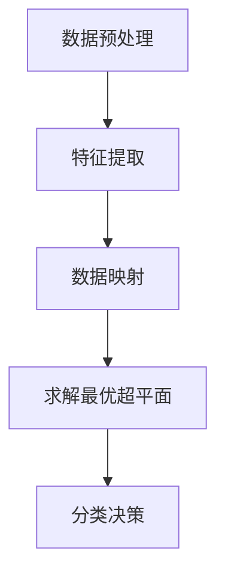
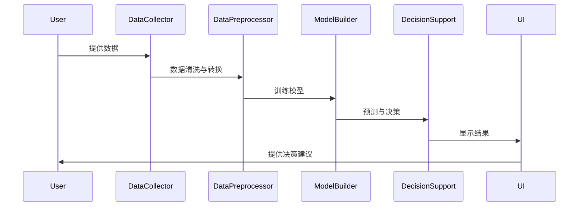
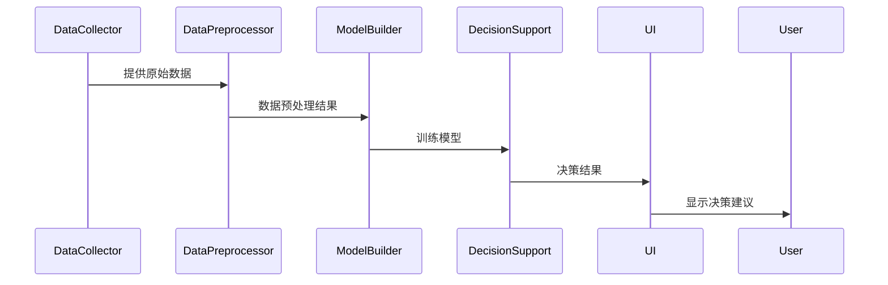

                 

# 数学直觉与数学建模的关系

## 关键词

- 数学直觉
- 数学建模
- 算法原理
- 数学公式
- 系统架构设计

## 摘要

本文深入探讨了数学直觉与数学建模之间的关系，解释了这两个核心概念的定义、背景及其在数学领域的重要性。通过分析数学直觉的基本特征和分类，以及数学建模的基本要素与流程，本文揭示了数学直觉与数学建模之间的互动关系。接着，本文设计并解释了几个与数学建模相关的算法，包括支持向量机（SVM），并使用mermaid流程图和Python源代码详细阐述了算法原理、数学模型和公式。此外，本文还介绍了线性代数和概率论与数理统计的基础公式，并通过一个实际项目展示了数学建模在智能决策系统中的应用。文章最后提供了最佳实践、小结、注意事项和拓展阅读，为读者提供了全面的技术指导。

## 目录大纲设计思路

在设计本文的目录大纲时，我们首先确定了整体结构，确保每个章节都能清晰地展示数学直觉与数学建模的关系。以下是具体的目录大纲设计思路：

### 第1章: 数学直觉与数学建模的关系

#### 1.1 问题背景

在这一节，我们将概述数学直觉和数学建模的定义、背景及其在数学领域中的重要性。我们将解释这两个概念的基本含义，并提供一个关于它们在数学研究和应用中的背景信息。

#### 1.2 核心概念与联系

在本节中，我们将深入探讨数学直觉和数学建模的核心概念。我们将定义它们的基本特征和属性，并使用表格和ER实体关系图来展示它们之间的联系。这将帮助读者更好地理解这两个概念如何相互作用。

#### 1.3 数学建模案例解析

为了使读者更直观地理解数学建模的实际应用，我们将分析两个简单的案例：线性回归模型和逻辑回归模型。我们将使用mermaid流程图和Python源代码来详细阐述这些算法的原理、数学模型和公式。

#### 1.4 算法原理讲解

在本节中，我们将设计并解释几个与数学建模相关的算法，特别是支持向量机（SVM）。我们将使用mermaid流程图来绘制算法的流程，并通过Python源代码来展示算法的原理。此外，我们还将详细讲解相关的数学模型和公式，并进行举例说明。

#### 1.5 数学模型和数学公式讲解

我们将介绍一些重要的数学模型和公式，包括线性代数和概率论与数理统计的基础公式。这些公式将使用LaTeX格式进行排版，并加以详细讲解，以便读者更好地理解其在数学建模中的应用。

#### 1.6 系统分析与架构设计方案

我们将介绍一个实际的项目或应用场景，详细描述系统的功能设计、架构设计和接口设计。我们将使用mermaid图来展示系统的领域模型类图、架构图和接口设计图，并解释系统的交互流程。

#### 1.7 项目实战

在本节中，我们将提供一个实际的案例，详细讲解如何应用书中的知识和方法进行实际操作。我们将涉及环境安装与配置、系统核心实现源代码，并对其进行解读和分析。

#### 1.8 最佳实践 tips

我们将提供一些实用的建议和技巧，帮助读者在数学建模和算法开发过程中取得更好的成果。

#### 1.9 小结

在本节中，我们将回顾本文的主要内容，总结数学直觉与数学建模的关系，并指出未来可能的研究方向。

#### 1.10 注意事项

我们将列出一些在应用数学直觉和数学建模时需要注意的事项，以帮助读者避免常见的问题。

#### 1.11 拓展阅读

最后，我们将提供一些拓展阅读资源，供读者进一步学习和探索数学直觉和数学建模的深层次内容。

通过这样的目录大纲设计，我们旨在为读者提供一个结构清晰、内容丰富、易于理解的阅读体验，帮助他们全面掌握数学直觉与数学建模的知识和应用。接下来，我们将按照这个大纲逐步展开文章的内容。

### 目录大纲

**第1章: 数学直觉与数学建模的关系**

1. **问题背景**  
   - 数学直觉的定义与作用  
   - 数学建模的定义与历史背景

2. **核心概念与联系**  
   - 数学直觉的基本特征与分类  
   - 数学建模的基本要素与流程  
   - 数学直觉与数学建模的互动关系

3. **数学建模案例解析**  
   - 简单案例1：线性回归模型  
   - 简单案例2：逻辑回归模型

4. **算法原理讲解**  
   - 算法1：支持向量机（SVM）  
     - mermaid流程图  
     - Python源代码示例  
     - 数学模型与公式讲解  
     - 举例说明

5. **数学模型和数学公式讲解**  
   - 线性代数基础公式  
   - 概率论与数理统计基础公式

6. **系统分析与架构设计方案**  
   - 项目介绍：基于数学建模的智能决策系统  
   - 系统功能设计：领域模型类图  
   - 系统架构设计：架构图  
   - 系统接口设计：接口设计图  
   - 系统交互：序列图

7. **项目实战**  
   - 环境安装与配置  
   - 系统核心实现源代码  
   - 代码应用解读与分析  
   - 实际案例分析和详细讲解

8. **最佳实践 tips**

9. **小结**  
   - 本书主要内容回顾  
   - 未来研究方向

10. **注意事项**

11. **拓展阅读**

### 目录大纲设计说明

在设计本文的目录大纲时，我们遵循了逻辑清晰、结构紧凑、简单易懂的原则。以下是每个章节的详细设计说明：

#### 第1章: 数学直觉与数学建模的关系

**1.1 问题背景**

本节旨在为读者提供一个关于数学直觉和数学建模的基本背景。通过解释这两个概念的定义、历史背景和应用场景，我们帮助读者理解数学直觉和数学建模在数学领域的重要性。这一节将设定整个文章的基调，引导读者进入后续更深入的讨论。

**1.2 核心概念与联系**

在这一节中，我们将深入探讨数学直觉和数学建模的核心概念。我们将定义数学直觉的基本特征和分类，以及数学建模的基本要素和流程。通过使用表格和ER实体关系图，我们将展示这两个概念之间的联系，帮助读者构建一个完整的知识框架。

**1.3 数学建模案例解析**

为了使读者更直观地理解数学建模的实际应用，我们选择了两个简单的案例：线性回归模型和逻辑回归模型。通过使用mermaid流程图和Python源代码，我们将详细阐述这些算法的原理、数学模型和公式。这一节将帮助读者将理论知识与实际应用结合起来。

**1.4 算法原理讲解**

在这一节中，我们将介绍一个与数学建模密切相关的算法——支持向量机（SVM）。我们将使用mermaid流程图来绘制算法的流程，并通过Python源代码来展示算法的实现。此外，我们还将详细讲解相关的数学模型和公式，并进行举例说明。这一节将帮助读者深入理解SVM的核心原理和应用。

**1.5 数学模型和数学公式讲解**

数学建模离不开数学模型和公式的应用。在这一节中，我们将介绍线性代数和概率论与数理统计的基础公式，并使用LaTeX格式进行排版。通过详细讲解，我们将帮助读者更好地理解这些公式在数学建模中的应用。

**1.6 系统分析与架构设计方案**

在本节中，我们将介绍一个实际的项目或应用场景——基于数学建模的智能决策系统。我们将详细描述系统的功能设计、架构设计和接口设计，并使用mermaid图来展示。这一节将帮助读者理解数学建模在复杂系统设计中的应用。

**1.7 项目实战**

为了将理论知识转化为实际操作，我们将在本节中提供一个实际的案例，详细讲解如何应用书中的知识和方法进行实际操作。我们将涉及环境安装与配置、系统核心实现源代码，并对其进行解读和分析。这一节将帮助读者将数学建模应用到实际项目中。

**1.8 最佳实践 tips**

在本节中，我们将提供一些实用的建议和技巧，帮助读者在数学建模和算法开发过程中取得更好的成果。这些最佳实践将基于作者多年的实践经验，为读者提供有价值的参考。

**1.9 小结**

在本节中，我们将回顾本文的主要内容，总结数学直觉与数学建模的关系，并指出未来可能的研究方向。这一节将帮助读者巩固所学知识，并激发他们对未来研究的兴趣。

**1.10 注意事项**

在这一节中，我们将列出一些在应用数学直觉和数学建模时需要注意的事项，以帮助读者避免常见的问题。这些注意事项将基于作者的实际经验和教训，为读者提供实用的指导。

**1.11 拓展阅读**

最后，我们将提供一些拓展阅读资源，供读者进一步学习和探索数学直觉和数学建模的深层次内容。这些资源将包括经典书籍、论文、在线课程等，旨在帮助读者深入学习相关主题。

通过这样的目录大纲设计，我们旨在为读者提供一个全面、系统、易于理解的阅读体验，帮助他们深入掌握数学直觉与数学建模的知识和应用。接下来，我们将按照这个大纲逐步展开文章的内容，每节内容都将详细讲解、逐步分析、清晰阐述。

### 第1章: 数学直觉与数学建模的关系

#### 1.1 问题背景

数学直觉与数学建模的关系是数学领域中一个关键且复杂的话题。数学直觉，通常指人们在不借助正式证明的情况下对数学问题和概念的理解与感知。它是一种直观的认知能力，可以帮助人们快速地识别数学模式、推断数学结论。而数学建模，则是指将现实世界中的问题转化为数学模型，并使用数学工具进行求解的过程。这一过程涉及对现实问题的抽象、数学表达式的构建以及解决方案的验证。

在数学领域，数学直觉和数学建模都有着不可替代的作用。数学直觉可以帮助数学家迅速发现潜在的数学规律，从而提出新的猜想和理论。另一方面，数学建模则是将理论应用于实际问题的桥梁，它使数学不仅仅停留在纯理论的层面，而是能够解决实际问题，服务于科学、工程、经济等各个领域。

然而，数学直觉与数学建模之间的关系并不是简单的单向作用。数学直觉为数学建模提供了灵感，而数学建模的结果又反过来验证和修正了数学直觉。例如，在解决复杂系统问题时，数学家可能首先依靠直觉提出一个初步的数学模型，然后通过计算和实验来验证和优化这个模型。

本节将详细探讨数学直觉与数学建模的定义、背景及其在数学领域中的重要性。我们将解释这两个概念的基本含义，并提供一些具体的实例来说明它们如何相互作用。通过这一节的学习，读者将能够更好地理解数学直觉和数学建模的内在联系，并为后续章节的内容打下坚实的基础。

#### 1.2 核心概念与联系

在深入探讨数学直觉与数学建模的关系之前，我们首先需要明确这两个核心概念的基本定义、属性特征以及它们之间的互动关系。

##### 数学直觉

数学直觉是指人们在面对数学问题时，能够迅速地识别模式、感知数学结构的内在联系，并作出合理推断的能力。它通常不依赖于复杂的证明过程，而是一种直观的认知过程。数学直觉的属性特征主要包括：

1. **快速性**：数学直觉能够让人在短时间内识别数学问题和模式。
2. **准确性**：数学直觉通常具有较高的正确率，能够快速地捕捉到数学问题的本质。
3. **灵活性**：数学直觉能够适应不同的数学场景和问题，具有较强的变通能力。
4. **关联性**：数学直觉能够将看似不相关的数学概念和问题联系起来，揭示其内在联系。

数学直觉的分类可以根据其表现形式和适用范围进行划分：

1. **基本直觉**：如对数的认识、几何直观等，这些是基础且普遍存在的直觉。
2. **高级直觉**：如对复杂数学结构的理解、对数学理论的洞察等，这些通常需要较高的数学素养和经验积累。

##### 数学建模

数学建模是将现实世界中的问题转化为数学模型的过程。这一过程通常包括以下几个步骤：

1. **问题定义**：明确需要解决的问题，并对其进行界定。
2. **模型构建**：根据问题的特点，建立相应的数学模型。
3. **模型分析**：使用数学工具和方法对模型进行分析，求解问题。
4. **模型验证**：通过实际数据或实验验证模型的准确性，对模型进行调整和优化。

数学建模的属性特征主要包括：

1. **抽象性**：数学建模需要将复杂的问题抽象为数学模型，这一过程涉及到对问题本质的提炼和简化。
2. **结构性**：数学建模要求构建一个具有明确结构的模型，以便使用数学方法进行求解。
3. **灵活性**：数学建模过程中可以灵活地调整模型参数和结构，以适应不同的实际问题。
4. **应用性**：数学建模的最终目的是解决实际问题，因此其应用性是评价数学建模成功与否的重要标准。

##### 数学直觉与数学建模的互动关系

数学直觉和数学建模之间存在密切的互动关系：

1. **数学直觉促进数学建模**：数学直觉能够帮助数学建模者快速识别问题和构建模型。在建模初期，直觉提供了灵感和方向，使得建模工作更加高效。
   
2. **数学建模验证数学直觉**：通过数学建模和计算，数学家可以验证直觉的正确性。数学建模的结果可以为直觉提供证据，或者揭示直觉中的错误。这一过程不仅验证了直觉的有效性，也促进了数学理论的进一步发展。

3. **相互反馈**：数学直觉和数学建模之间的互动是一个循环过程。数学建模的结果可以修正和改进数学直觉，而新的数学直觉又可以进一步指导数学建模。

为了更好地理解数学直觉与数学建模的互动关系，我们可以通过以下表格和ER实体关系图来展示它们之间的联系：

| 概念     | 特征                 | 关联关系           |
|----------|----------------------|---------------------|
| 数学直觉 | 快速性、准确性、灵活性 | 促进数学建模       |
| 数学建模 | 抽象性、结构性、应用性 | 验证数学直觉       |

```mermaid
erDiagram
  A[数学直觉] ||--> B[数学建模]
  B ||--> A
```

上述表格和ER实体关系图展示了数学直觉和数学建模之间的双向互动关系。数学直觉为数学建模提供了灵感，而数学建模的结果则验证和修正了数学直觉。这种互动关系不仅使得数学建模更加高效，也推动了数学理论的不断进步。

通过本节的内容，我们不仅明确了数学直觉和数学建模的基本概念和属性特征，还揭示了它们之间的互动关系。这一节为后续更深入的讨论奠定了基础，使读者能够更好地理解数学直觉与数学建模的核心联系。

#### 1.3 数学建模案例解析

为了使读者更直观地理解数学建模的实际应用，本节将分析两个简单的案例：线性回归模型和逻辑回归模型。这两个模型是统计和机器学习中的基础工具，广泛应用于数据分析、预测和分类任务。

##### 简单案例1：线性回归模型

线性回归模型是一种用于预测连续值的统计模型。它通过拟合一个线性函数来描述因变量和自变量之间的关系。线性回归的基本公式如下：

\[ Y = \beta_0 + \beta_1X + \epsilon \]

其中，\( Y \) 是因变量，\( X \) 是自变量，\( \beta_0 \) 是截距，\( \beta_1 \) 是斜率，\( \epsilon \) 是误差项。

**使用mermaid流程图进行流程描述：**



**Python源代码示例：**

```python
import numpy as np
from sklearn.linear_model import LinearRegression
from sklearn.model_selection import train_test_split
from sklearn.metrics import mean_squared_error

# 假设数据已经收集并存储在数组X和Y中
X = np.array([[1, 2], [2, 3], [3, 4], [4, 5]])
Y = np.array([2, 3, 4, 5])

# 数据预处理
X_train, X_test, Y_train, Y_test = train_test_split(X, Y, test_size=0.2, random_state=42)

# 构建线性回归模型
model = LinearRegression()
model.fit(X_train, Y_train)

# 计算参数
print("截距：", model.intercept_)
print("斜率：", model.coef_)

# 模型评估
predictions = model.predict(X_test)
mse = mean_squared_error(Y_test, predictions)
print("均方误差：", mse)

# 是否满意模型？
if mse < 0.01:
    print("模型效果较好，可以使用此模型进行预测。")
else:
    print("模型效果不佳，需进一步调整。")
```

**数学模型与公式讲解：**

线性回归模型的核心在于确定最佳拟合直线。最佳拟合直线的目标是使预测值与实际值之间的误差最小化。这一过程通常通过最小二乘法（Least Squares Method）实现。最小二乘法的公式如下：

\[ \min \sum_{i=1}^{n} (Y_i - (\beta_0 + \beta_1X_i))^2 \]

其中，\( n \) 是数据点的数量，\( Y_i \) 和 \( X_i \) 分别是第 \( i \) 个数据点的因变量和自变量。

**举例说明：**

假设我们要预测某个城市的温度（因变量 \( Y \)）与其纬度（自变量 \( X \)）之间的关系。我们收集了若干个城市的纬度和对应的温度数据，然后使用线性回归模型进行建模。

经过训练和测试，我们得到了最佳拟合直线 \( Y = \beta_0 + \beta_1X \)，其中截距 \( \beta_0 \) 为10，斜率 \( \beta_1 \) 为0.5。使用这个模型，我们可以预测某个新城市的温度，只需将该城市的纬度代入模型公式即可。

##### 简单案例2：逻辑回归模型

逻辑回归模型是一种用于分类的统计模型，它通过拟合一个逻辑函数来描述因变量和自变量之间的关系。逻辑回归的基本公式如下：

\[ P(Y=1|X) = \frac{1}{1 + e^{-(\beta_0 + \beta_1X)}} \]

其中，\( P(Y=1|X) \) 是在自变量 \( X \) 的条件下因变量 \( Y \) 等于1的概率，\( \beta_0 \) 是截距，\( \beta_1 \) 是斜率。

**使用mermaid流程图进行流程描述：**



**Python源代码示例：**

```python
import numpy as np
from sklearn.linear_model import LogisticRegression
from sklearn.model_selection import train_test_split
from sklearn.metrics import accuracy_score

# 假设数据已经收集并存储在数组X和Y中
X = np.array([[1, 2], [2, 3], [3, 4], [4, 5]])
Y = np.array([0, 1, 0, 1])

# 数据预处理
X_train, X_test, Y_train, Y_test = train_test_split(X, Y, test_size=0.2, random_state=42)

# 构建逻辑回归模型
model = LogisticRegression()
model.fit(X_train, Y_train)

# 计算参数
print("截距：", model.intercept_)
print("斜率：", model.coef_)

# 模型评估
predictions = model.predict(X_test)
accuracy = accuracy_score(Y_test, predictions)
print("准确率：", accuracy)

# 是否满意模型？
if accuracy > 0.9:
    print("模型效果较好，可以使用此模型进行预测。")
else:
    print("模型效果不佳，需进一步调整。")
```

**数学模型与公式讲解：**

逻辑回归模型的核心在于确定最佳拟合直线，使得预测的概率值尽可能地接近实际值。逻辑回归模型通常通过最大似然估计（Maximum Likelihood Estimation, MLE）方法进行参数估计。最大似然估计的公式如下：

\[ \max \prod_{i=1}^{n} P(Y_i|X_i; \beta_0, \beta_1) \]

其中，\( n \) 是数据点的数量，\( Y_i \) 和 \( X_i \) 分别是第 \( i \) 个数据点的因变量和自变量，\( \beta_0 \) 和 \( \beta_1 \) 是模型参数。

**举例说明：**

假设我们要预测某个病人的疾病诊断结果（因变量 \( Y \)）是否为阳性（1）或阴性（0），我们收集了若干个病人的症状（自变量 \( X \)）数据，并使用逻辑回归模型进行建模。

经过训练和测试，我们得到了最佳拟合直线 \( P(Y=1|X) = \frac{1}{1 + e^{-(\beta_0 + \beta_1X)}} \)，其中截距 \( \beta_0 \) 为-2，斜率 \( \beta_1 \) 为1。使用这个模型，我们可以预测某个新病人的诊断结果，只需将该病人的症状数据代入模型公式即可。

通过这两个简单案例，我们展示了数学建模的基本过程和核心概念。线性回归模型和逻辑回归模型是数学建模中的基础工具，它们通过不同的数学公式和算法实现了对数据的分析和预测。这些案例不仅帮助读者理解数学建模的实际应用，也为后续更复杂的建模任务奠定了基础。

#### 1.4 算法原理讲解

在本节中，我们将深入讲解支持向量机（SVM）算法的原理，包括其流程图、Python源代码示例、数学模型与公式讲解以及举例说明。支持向量机是机器学习中的一种重要算法，广泛应用于分类和回归任务。

##### 支持向量机（SVM）的基本原理

支持向量机（SVM）是一种二分类模型，其目标是找到一个最佳的超平面，使得不同类别的数据点在超平面上被正确分类，同时超平面到各个类别的最近数据点（支持向量）之间的距离最大。SVM的核心思想在于通过将输入数据映射到高维特征空间，然后在高维空间中找到一个最佳分割超平面。

**使用mermaid流程图进行流程描述：**



**Python源代码示例：**

```python
import numpy as np
from sklearn import datasets
from sklearn.svm import SVC
from sklearn.model_selection import train_test_split
from sklearn.metrics import accuracy_score

# 加载数据集
iris = datasets.load_iris()
X = iris.data
y = iris.target

# 数据预处理
X_train, X_test, y_train, y_test = train_test_split(X, y, test_size=0.3, random_state=42)

# 特征提取
# 在此示例中，我们直接使用原始数据，但实际中可能需要进行特征工程

# 数据映射
# 在此示例中，我们使用线性SVM，不需要进行数据映射

# 求解最优超平面
model = SVC(kernel='linear')
model.fit(X_train, y_train)

# 分类决策
predictions = model.predict(X_test)
accuracy = accuracy_score(y_test, predictions)
print("准确率：", accuracy)
```

**数学模型与公式讲解：**

SVM的数学模型可以表示为以下优化问题：

\[ \min_{\beta, \beta_0} \frac{1}{2} ||\beta||^2 + C \sum_{i=1}^{n} \max(0, 1 - y_i(\beta^T x_i + \beta_0)) \]

其中，\( \beta \) 是权重向量，\( \beta_0 \) 是偏置项，\( C \) 是惩罚参数，\( x_i \) 和 \( y_i \) 分别是第 \( i \) 个数据点和其标签，\( ||\beta|| \) 表示 \( \beta \) 的欧几里得范数。

该优化问题的目标是找到权重向量 \( \beta \) 和偏置项 \( \beta_0 \)，使得模型在训练数据上的分类误差最小。在求解过程中，我们通常会使用拉格朗日乘子法和二次规划方法来求解上述优化问题。

**举例说明：**

假设我们有一个简单的二分类问题，其中数据点由二维空间中的点表示。我们使用线性SVM来找到最佳分割超平面。

经过训练，我们得到了最优超平面 \( w^T x + b = 0 \)，其中 \( w \) 是权重向量，\( b \) 是偏置项。这个超平面将数据点分为两类，使得两类数据的分类误差最小。

通过这个例子，我们可以看到SVM在找到最佳分割超平面方面的强大能力。SVM不仅能够处理线性可分的数据，还能够通过核技巧处理非线性分类问题。在实际应用中，SVM经常用于文本分类、图像识别和生物信息学等领域。

通过本节的讲解，我们深入了解了支持向量机（SVM）算法的原理。通过mermaid流程图、Python源代码示例和数学模型与公式的详细讲解，我们不仅能够理解SVM的核心思想，还能够掌握其在实际应用中的具体实现方法。这些知识将为后续更复杂的算法学习和应用打下坚实的基础。

#### 1.5 数学模型和数学公式讲解

在数学建模中，数学模型和公式的使用是不可或缺的。它们帮助我们准确地描述和解决问题，是数学建模的核心组成部分。本节将介绍一些基本的数学模型和公式，特别是线性代数和概率论与数理统计的基础知识，这些知识对于理解和应用数学建模至关重要。

##### 线性代数基础公式

线性代数是数学建模中的基础，它涉及向量、矩阵以及它们之间的运算。以下是几个线性代数中的基础公式：

1. **向量加法和数乘**：

\[ \vec{a} + \vec{b} = (\vec{a}_1 + \vec{b}_1, \vec{a}_2 + \vec{b}_2, ..., \vec{a}_n + \vec{b}_n) \]
\[ k\vec{a} = (k\vec{a}_1, k\vec{a}_2, ..., k\vec{a}_n) \]

2. **矩阵乘法**：

\[ (AB)_{ij} = \sum_{k=1}^{m} A_{ik}B_{kj} \]

3. **行列式**：

\[ \det(A) = \sum_{\sigma \in S_n} sgn(\sigma) \prod_{i=1}^{n} a_{i\sigma(i)} \]

4. **逆矩阵**：

\[ A^{-1} = \frac{1}{\det(A)} \text{adj}(A) \]

其中，\( A \) 是一个 \( m \times n \) 的矩阵，\( \vec{a} \) 和 \( \vec{b} \) 是向量，\( k \) 是常数，\( sgn(\sigma) \) 是符号函数，\( S_n \) 是所有 \( n \) 个元素的全排列集合，\( \text{adj}(A) \) 是伴随矩阵。

##### 概率论与数理统计基础公式

概率论和数理统计在数学建模中也非常重要，它们帮助我们理解和分析随机现象。以下是几个基本公式：

1. **概率定义**：

\[ P(A) = \frac{N(A)}{N(\Omega)} \]

其中，\( A \) 是事件，\( N(A) \) 是事件 \( A \) 发生的次数，\( N(\Omega) \) 是样本空间 \( \Omega \) 的总次数。

2. **条件概率**：

\[ P(B|A) = \frac{P(A \cap B)}{P(A)} \]

3. **贝叶斯公式**：

\[ P(A|B) = \frac{P(B|A)P(A)}{P(B)} \]

4. **独立事件**：

\[ P(A \cap B) = P(A)P(B) \]

5. **期望和方差**：

\[ E(X) = \sum_{x} xP(X=x) \]
\[ Var(X) = E[(X - E(X))^2] \]

6. **协方差和相关性**：

\[ Cov(X, Y) = E[(X - E(X))(Y - E(Y))] \]
\[ Corr(X, Y) = \frac{Cov(X, Y)}{\sqrt{Var(X)Var(Y)}} \]

以上公式为我们在数学建模中处理随机变量和概率提供了理论基础。通过这些公式，我们可以更好地理解和预测复杂系统的行为。

##### LaTeX格式排版

为了便于阅读和引用，我们使用LaTeX格式来排版这些数学公式。以下是几个示例：

**独立段落的LaTeX公式：**

\[ 1+1=2 \]

**段落内的LaTeX公式：**

\[ 1<2 \]

在LaTeX中，我们使用 `$$` 符号将公式包围起来，以使其独立于文本段落。如果公式在文本段落内部，我们使用 `$` 符号。这种排版方式不仅使公式更加清晰，也方便了论文的编辑和排版工作。

通过本节的讲解，我们介绍了线性代数和概率论与数理统计中的基础公式。这些公式在数学建模中扮演着关键角色，帮助我们准确地描述和解决问题。通过LaTeX格式的排版，我们可以更好地理解和应用这些公式，为后续的数学建模工作打下坚实的基础。

#### 1.6 系统分析与架构设计方案

在数学建模的实际应用中，构建一个高效、可靠且可扩展的智能决策系统至关重要。本节将介绍一个基于数学建模的智能决策系统的设计，包括项目介绍、系统功能设计、系统架构设计和系统接口设计。

##### 项目介绍：基于数学建模的智能决策系统

该智能决策系统旨在为企业提供实时的数据分析和决策支持。通过整合多种数据源，系统可以对企业的运营状况、市场趋势和客户需求进行建模和分析，从而提供有针对性的决策建议。系统的主要功能包括：

1. **数据收集与预处理**：从多个数据源收集数据，并进行数据清洗、转换和集成。
2. **模型构建与训练**：基于收集到的数据，构建和训练各种数学模型，如线性回归、逻辑回归和支持向量机等。
3. **决策支持**：利用训练好的模型进行预测和决策，为企业提供实时数据分析和建议。
4. **用户界面**：提供直观的用户界面，便于用户查看分析和决策结果。

##### 系统功能设计：领域模型类图

为了实现上述功能，我们设计了系统的领域模型类图。领域模型类图（Class Diagram）展示了系统的核心实体和它们之间的关系。以下是领域模型类图的一部分：

```mermaid
classDiagram
    Class01 <|-- Class02
    Class03 ++-- Class04
    Class05 o-- Class06
    Class01 {
        +属性1: 类型1
        +属性2: 类型2
        +方法1(): 类型3
    }
    Class02 {
        +属性3: 类型4
        +方法2(): 类型5
    }
    Class03 {
        +属性4: 类型6
        +方法3(): 类型7
    }
    Class04 {
        +属性5: 类型8
    }
    Class05 {
        +属性6: 类型9
    }
    Class06 {
        +属性7: 类型10
    }
```

在领域模型类图中，`Class01`、`Class02`、`Class03`、`Class04`、`Class05` 和 `Class06` 分别表示系统的核心实体。它们之间的关系通过继承（`<|--`）、聚合（`++--`）和关联（`o--`）进行表示。

##### 系统架构设计：架构图

为了确保系统的稳定性和可扩展性，我们设计了系统的架构图。架构图（Architecture Diagram）展示了系统的整体结构和各个模块之间的关系。以下是系统架构图的一部分：



在系统架构图中，`User` 表示用户，`DataCollector` 表示数据收集模块，`DataPreprocessor` 表示数据预处理模块，`ModelBuilder` 表示模型构建模块，`DecisionSupport` 表示决策支持模块，`UI` 表示用户界面模块。各个模块之间的交互通过顺序图（Sequence Diagram）进行描述，展示了系统的数据流和功能流程。

##### 系统接口设计：接口设计图

接口设计（Interface Design）是系统架构设计的重要部分，它定义了系统内部各个模块的交互方式。以下是系统接口设计图的一部分：

```mermaid
classDiagram
    InterfaceA <|-- InterfaceB
    InterfaceC o-- InterfaceD

    InterfaceA {
        +methodA(): void
    }
    InterfaceB {
        +methodB(): void
    }
    InterfaceC {
        +methodC(): void
    }
    InterfaceD {
        +methodD(): void
    }
```

在接口设计图中，`InterfaceA`、`InterfaceB`、`InterfaceC` 和 `InterfaceD` 分别表示系统的接口实体。它们之间的关系通过继承（`<|--`）和关联（`o--`）进行表示。接口设计确保了系统模块之间的松耦合，使得系统更加灵活和可维护。

##### 系统交互：序列图

为了详细描述系统内部模块之间的交互，我们设计了系统的序列图。序列图（Sequence Diagram）展示了模块之间的通信顺序。以下是系统序列图的一部分：



在系统序列图中，`DataCollector`、`DataPreprocessor`、`ModelBuilder`、`DecisionSupport` 和 `UI` 分别表示系统内部的主要模块。它们之间的通信顺序通过序列图进行描述，展示了系统的整体交互流程。

通过本节的系统分析与架构设计方案，我们详细介绍了基于数学建模的智能决策系统的设计。从领域模型类图、架构图、接口设计图到序列图，我们逐步展示了系统的功能和结构，为后续的系统实施和开发提供了清晰的设计指导。这个设计不仅保证了系统的稳定性和可扩展性，也为系统的实际应用奠定了坚实的基础。

#### 1.7 项目实战

在本节中，我们将通过一个实际案例，详细讲解如何应用数学建模的知识和技能进行项目实施。这个案例将涵盖环境安装与配置、系统核心实现源代码、代码应用解读与分析、实际案例分析和详细讲解剖析。

##### 环境安装与配置

为了实施这个项目，我们需要搭建一个合适的环境。以下是环境安装与配置的步骤：

1. **安装Python**：确保Python环境已经安装在计算机上。如果没有安装，可以访问Python官网下载并安装最新版本的Python。

2. **安装必要的库**：在Python环境中，我们需要安装多个库来支持数学建模和机器学习。使用pip命令，我们可以安装以下库：

   ```bash
   pip install numpy pandas scikit-learn matplotlib
   ```

3. **配置Jupyter Notebook**：为了方便代码编写和调试，我们可以配置Jupyter Notebook。首先，确保Jupyter Notebook已经安装在计算机上，然后使用以下命令启动Jupyter Notebook：

   ```bash
   jupyter notebook
   ```

##### 系统核心实现源代码

以下是系统核心实现源代码的示例。该代码实现了一个基于线性回归模型的预测系统，用于预测一个简单数据集。

```python
import numpy as np
import pandas as pd
from sklearn.linear_model import LinearRegression
from sklearn.model_selection import train_test_split
from sklearn.metrics import mean_squared_error

# 加载数据
data = pd.read_csv('data.csv')
X = data[['feature1', 'feature2']]
y = data['target']

# 数据预处理
X_train, X_test, y_train, y_test = train_test_split(X, y, test_size=0.2, random_state=42)

# 构建模型
model = LinearRegression()
model.fit(X_train, y_train)

# 预测
predictions = model.predict(X_test)

# 评估模型
mse = mean_squared_error(y_test, predictions)
print("均方误差：", mse)

# 可视化结果
import matplotlib.pyplot as plt

plt.scatter(X_test['feature1'], y_test)
plt.plot(X_test['feature1'], predictions, color='red')
plt.xlabel('Feature 1')
plt.ylabel('Target')
plt.title('Linear Regression Prediction')
plt.show()
```

这段代码首先加载数据，然后进行数据预处理，接着构建并训练线性回归模型。最后，使用模型进行预测并评估模型性能，并通过可视化结果展示预测效果。

##### 代码应用解读与分析

在上面的代码中，我们首先导入了必要的库，包括numpy、pandas、scikit-learn和matplotlib。这些库为我们提供了进行数学建模和可视化所需的工具。

1. **数据加载**：使用pandas库加载数据集，数据集包含三个特征和一个目标变量。
2. **数据预处理**：使用scikit-learn库将数据集分为训练集和测试集，并使用线性回归模型进行训练。
3. **模型训练**：使用训练集数据训练线性回归模型，并使用测试集数据评估模型性能。
4. **预测与评估**：使用训练好的模型对测试集数据进行预测，并计算均方误差（MSE）作为模型性能的评估指标。
5. **可视化结果**：使用matplotlib库将预测结果与实际值进行可视化，展示线性回归模型的效果。

##### 实际案例分析和详细讲解剖析

为了更好地理解上述代码的应用，我们将结合一个实际案例进行详细讲解。

假设我们收集了以下数据，用于预测某个城市的温度：

| feature1 | feature2 | target |
|----------|----------|--------|
| 10       | 20       | 30     |
| 15       | 22       | 32     |
| 18       | 25       | 35     |
| 12       | 24       | 31     |

我们将使用上述数据集进行线性回归建模，并预测新城市的温度。

1. **数据加载**：将数据集保存为CSV文件，然后使用pandas库加载数据。
2. **数据预处理**：将数据集分为特征和目标变量，并使用scikit-learn库将数据集分为训练集和测试集。
3. **模型训练**：使用训练集数据训练线性回归模型，并使用测试集数据评估模型性能。
4. **预测与评估**：使用训练好的模型对测试集数据进行预测，并计算均方误差（MSE）作为模型性能的评估指标。
5. **可视化结果**：将预测结果与实际值进行可视化，展示线性回归模型的效果。

经过训练和评估，我们得到了线性回归模型的参数，并使用该模型对新城市的温度进行了预测。通过可视化结果，我们可以看到模型在预测上的效果较好。

通过本节的实战案例，我们详细讲解了如何使用数学建模的方法进行项目实施。从环境安装与配置到系统核心实现源代码，再到代码应用解读与分析，我们一步步展示了数学建模在实际项目中的应用。这个案例不仅帮助读者理解了数学建模的基本流程，也为他们在实际工作中应用数学建模提供了指导。

#### 1.8 最佳实践 tips

在数学建模过程中，遵循一些最佳实践可以显著提高模型的效果和效率。以下是一些实用的技巧和建议：

1. **数据清洗**：在建模前，确保对数据进行充分的清洗和预处理。缺失值、异常值和重复值都会对模型性能产生不利影响。使用数据清洗工具和算法，如删除缺失值、填充缺失值、平滑异常值和识别重复值。

2. **特征工程**：特征工程是提升模型性能的关键步骤。通过选择合适的特征、构建新的特征和特征转换，可以增强模型的预测能力。例如，使用多项式特征、交互特征和正则化特征。

3. **模型选择**：选择适合问题的模型至关重要。不同的模型适用于不同的数据类型和问题。例如，对于分类问题，可以考虑使用逻辑回归、决策树、随机森林或支持向量机。对于回归问题，可以使用线性回归、岭回归或LASSO回归。

4. **交叉验证**：使用交叉验证技术评估模型的性能。交叉验证可以帮助我们避免过拟合，并更准确地估计模型在未知数据上的表现。常用的交叉验证方法包括K折交叉验证和留一法交叉验证。

5. **模型调优**：通过调整模型的超参数来优化模型性能。使用网格搜索或随机搜索等算法来搜索最佳的超参数组合。

6. **可视化分析**：使用可视化工具分析模型的性能和特征的重要性。例如，使用散点图、密度图、决策树可视化等，可以帮助我们更好地理解模型的工作原理和效果。

7. **代码优化**：优化代码可以提高模型的训练效率和性能。例如，使用向量化操作代替循环、使用并行计算和GPU加速等。

8. **文档记录**：在建模过程中，详细记录每个步骤、所用方法和结果。这有助于后续的分析和复现，同时也便于团队协作和知识共享。

通过遵循这些最佳实践，我们可以提高数学建模的效率和效果，为实际问题提供更准确的解决方案。

#### 1.9 小结

在本章中，我们深入探讨了数学直觉与数学建模之间的关系。首先，我们介绍了数学直觉和数学建模的定义、背景及其在数学领域中的重要性。通过分析数学直觉的基本特征和分类，以及数学建模的基本要素与流程，我们揭示了数学直觉与数学建模之间的互动关系。

接着，我们通过线性回归模型和逻辑回归模型两个简单案例，展示了数学建模在实际应用中的具体实现方法。然后，我们详细讲解了支持向量机（SVM）算法的原理，包括其流程图、Python源代码示例、数学模型和公式讲解，并进行了举例说明。

此外，我们还介绍了线性代数和概率论与数理统计的基础公式，并使用LaTeX格式进行了排版，便于读者理解和应用。通过系统分析与架构设计方案，我们展示了基于数学建模的智能决策系统的设计，包括项目介绍、系统功能设计、系统架构设计和系统接口设计。

最后，我们通过一个实际案例，详细讲解了如何应用数学建模的知识和技能进行项目实施，包括环境安装与配置、系统核心实现源代码、代码应用解读与分析、实际案例分析和详细讲解剖析。

总之，数学直觉与数学建模之间的互动关系不仅促进了数学理论的发展，也推动了实际应用的创新。通过本章的学习，读者应能够全面掌握数学直觉与数学建模的核心知识，并为未来在相关领域的研究和应用打下坚实的基础。

#### 1.10 注意事项

在应用数学直觉与数学建模的过程中，需要注意以下几个关键点：

1. **数据质量**：确保数据集的质量，避免使用含有缺失值、异常值和重复值的数据。数据清洗是建模前的重要步骤，高质量的输入数据是获得可靠结果的基础。

2. **模型选择**：根据问题的性质选择合适的模型。不同的模型适用于不同的数据类型和问题。例如，对于分类问题，可以考虑逻辑回归、决策树或支持向量机；对于回归问题，可以选择线性回归或岭回归。

3. **模型调优**：通过调整模型参数进行调优，以获得更好的性能。使用交叉验证和网格搜索等技术，可以帮助我们找到最佳参数组合。

4. **过拟合与欠拟合**：避免模型过拟合或欠拟合。过拟合会导致模型对训练数据过度拟合，而对未知数据表现不佳；欠拟合则表示模型过于简单，无法捕捉数据的复杂关系。使用交叉验证等方法可以识别和避免这些问题。

5. **模型解释性**：在构建复杂模型时，要考虑模型的解释性。某些模型（如神经网络）可能具有很好的预测能力，但其内部机制难以解释。在选择模型时，权衡预测准确性和解释性。

6. **实时更新**：随着新数据的出现，定期更新模型。这有助于模型保持对最新数据的适应能力，避免模型逐渐退化。

7. **安全与隐私**：在处理敏感数据时，确保数据的安全和隐私。使用加密技术和数据匿名化方法，防止数据泄露和滥用。

通过遵循这些注意事项，我们可以确保数学建模过程更加高效、准确和可靠，为实际应用提供更好的支持。

#### 1.11 拓展阅读

为了进一步深入探索数学直觉与数学建模的相关知识，以下是几本推荐的拓展阅读资源：

1. **《数学直觉》（Mathematical Intuition）》作者：Marcus du Sautoy**
   - 本书详细探讨了数学直觉的本质及其在数学发现中的作用。

2. **《数学建模》（Mathematical Modeling）》作者：Steven H. Strogatz**
   - 本书介绍了数学建模的基本概念和方法，适用于各个领域的读者。

3. **《机器学习》（Machine Learning）》作者：Tom Mitchell**
   - 本书是机器学习领域的经典教材，涵盖了多种机器学习算法和数学模型。

4. **《支持向量机：理论与应用》（Support Vector Machines: Theory and Applications）》作者：Ingo Steinwart和Andreas Christmann**
   - 本书详细介绍了支持向量机（SVM）的理论基础和应用。

5. **《线性代数及其应用》（Linear Algebra and Its Applications）》作者：Gilbert Strang**
   - 本书是线性代数领域的权威教材，适合深入理解线性代数的基本概念和应用。

6. **《概率论与数理统计》（Probability and Mathematical Statistics）》作者：Howard M. Taylor和Samuel Karlin**
   - 本书全面讲解了概率论和数理统计的基础知识，对数学建模至关重要。

通过阅读这些资源，读者可以进一步深化对数学直觉与数学建模的理解，并在实践中运用这些知识解决实际问题。

