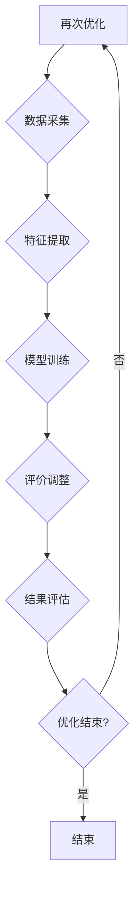
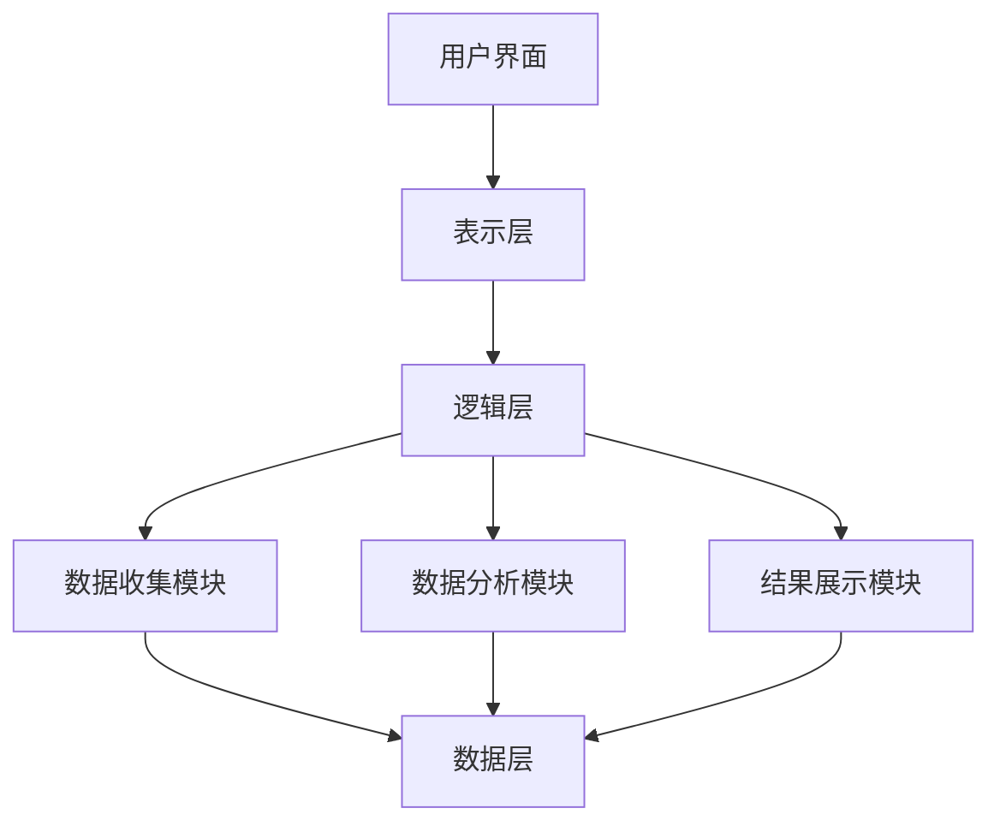
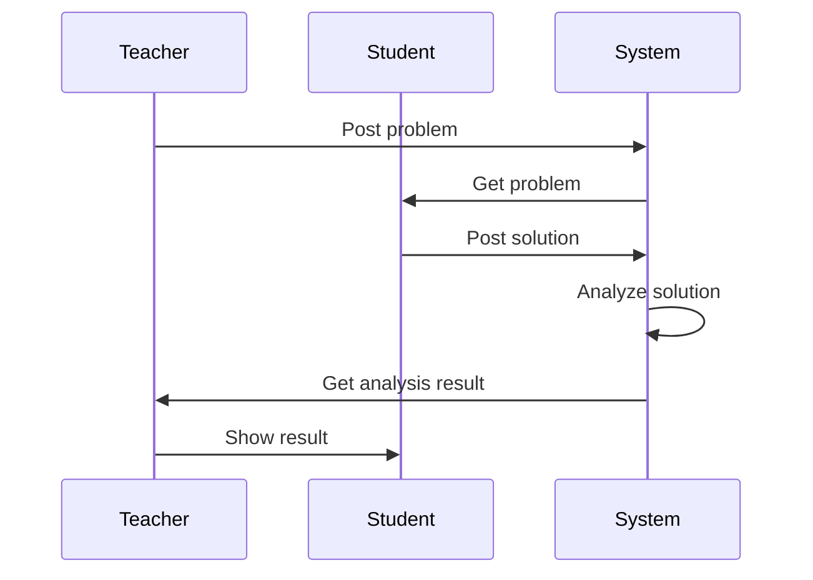

                 

### 背景介绍

#### # 第1章: 背景介绍

在当代教育领域，数学教学评价和数学直觉之间的关系成为了一个备受关注的话题。数学直觉，作为一种非正式的数学认知能力，能够帮助学生在解决问题时快速作出合理判断。而数学教学评价则是衡量教学效果和学生学习成果的重要手段。本文旨在探讨数学直觉与数学教学评价之间的关系，分析二者如何相互影响，并探索如何通过优化数学教学评价来提升学生的数学直觉。

##### ## 1.1 问题背景

数学直觉是指学生在面对数学问题时，能够迅速、直观地理解和解决问题的能力。这种能力往往与学生的逻辑思维、经验积累和数学知识背景密切相关。在数学教学中，培养学生的数学直觉被认为是一种有效的教学方法，因为它能够提高学生的数学学习效率和解决问题的能力。

数学教学评价是对学生数学学习成果的考核，包括对知识的掌握程度、解题能力、逻辑思维能力等多方面进行评价。传统的教学评价方式主要依赖于笔试和考试，这种方式往往侧重于学生对知识的记忆和再现，而忽略了学生数学直觉的培养。

当前，关于数学直觉与数学教学评价关系的研究还处于初级阶段。大多数研究关注的是如何通过教学方法和手段来提高学生的数学直觉，而对于数学教学评价如何影响数学直觉的研究则相对较少。因此，本文旨在填补这一研究空白，深入探讨数学直觉与数学教学评价之间的内在联系。

##### ## 1.2 问题描述

数学直觉与数学教学评价之间的关系可以从多个维度进行分析。首先，数学直觉在一定程度上可以影响学生对数学教学评价的反应。具有较强数学直觉的学生可能在面对数学问题时能够迅速找到解题思路，从而在考试中表现出色。而缺乏数学直觉的学生则可能在面对复杂的数学问题时感到困惑和无从下手。

其次，数学教学评价方式也会对学生的数学直觉产生重要影响。传统的笔试和考试方式往往侧重于知识点的考核，这种方式虽然能够检验学生对知识的掌握程度，但可能无法有效评估学生的数学直觉能力。相反，一些注重问题解决和创新思维的评价方式，如项目报告、课堂讨论等，可能更能激发学生的数学直觉。

此外，教学评价对学生的数学学习动机也有重要影响。如果教学评价过于强调成绩和排名，可能会导致学生过分关注考试成绩，而忽视了对数学本身的兴趣和探究。这种情况下，学生的数学直觉可能得不到有效的培养。相反，如果教学评价能够鼓励学生自主探索和创造，那么学生的数学直觉可能得到更好的发展。

##### ## 1.3 问题解决

为了深入探讨数学直觉与数学教学评价之间的关系，本文将采用以下研究方法和理论基础：

1. **文献综述**：通过查阅相关文献，对数学直觉和数学教学评价的概念、类型和研究现状进行系统梳理，为后续研究提供理论基础。

2. **案例研究**：选取具有代表性的数学教学案例，分析教学评价方式和评价结果对学生的数学直觉的影响。

3. **问卷调查**：设计问卷，调查学生在不同教学评价方式下的数学直觉表现，以及学生对教学评价的态度和看法。

4. **统计分析**：对收集到的数据进行分析，探讨数学直觉与数学教学评价之间的相关性，找出影响数学直觉的关键因素。

5. **教育实验**：通过设计实验，对比不同教学评价方式对学生的数学直觉培养效果，验证研究假设。

通过以上方法，本文将逐步揭示数学直觉与数学教学评价之间的关系，并提出相应的优化策略，以期为数学教学提供有益的参考。

##### ## 1.4 边界与外延

在研究数学直觉与数学教学评价的关系时，需要明确研究的边界和外延，以确保研究内容的可行性和针对性。以下是对研究边界和外延的详细说明：

**1.4.1 研究范围的界定**

本研究主要关注以下范围：

1. **数学直觉的界定**：主要探讨数学直觉在数学教学中的具体表现，包括对数学问题的快速理解、解题思路的生成以及问题解决的能力。

2. **数学教学评价的界定**：包括传统的笔试和考试评价方式，以及项目报告、课堂讨论等新型评价方式。

3. **研究对象的选取**：主要针对中小学生和高中学生，这些学生在数学学习过程中具有较高的数学直觉培养潜力。

**1.4.2 研究对象的选择**

本研究选取的研究对象主要包括：

1. **学校类型**：公立学校与私立学校的学生，以对比不同教育环境下数学直觉与教学评价的关系。

2. **学生群体**：不同年级的学生，以观察不同年龄段学生对数学直觉和教学评价的反应差异。

3. **教学方法**：采用多样化的教学方法，如传统授课、项目驱动、小组讨论等，以分析不同教学方法对数学直觉培养的影响。

通过明确研究范围和对象选择，本文将更有针对性地探讨数学直觉与数学教学评价之间的关系，为优化数学教学提供科学依据。

##### ## 1.5 概念结构与核心要素组成

在深入研究数学直觉与数学教学评价的关系之前，有必要对相关概念进行明确，并分析其结构和核心要素。以下是对数学直觉和数学教学评价的定义、分类、影响因素以及二者关系的详细探讨。

**1.5.1 数学直觉**

数学直觉是指学生在面对数学问题时，能够迅速、直观地理解问题本质，并找到解题思路的能力。数学直觉不仅包括对数学知识的快速理解，还涉及对数学概念、方法和思想的敏锐洞察。

**定义与分类**：

- **定义**：数学直觉是学生在没有经过详细推理和计算的情况下，对数学问题作出合理判断的能力。
- **分类**：根据直觉的形成过程和表现方式，可以将数学直觉分为以下几种类型：
  - **直观推理**：学生在面对数学问题时，能够通过图形、数形结合等方式直观地理解问题，并快速找到解题方法。
  - **概念直觉**：学生能够对数学概念和定义有深入的理解，并能灵活运用这些概念解决实际问题。
  - **问题解决直觉**：学生在面对复杂问题时，能够快速找到问题的解决路径，并有效地解决问题。

**影响因素**：

- **经验积累**：数学直觉的形成与学生的数学学习经验密切相关。学生通过大量的数学学习实践，能够积累丰富的数学知识，从而提高数学直觉能力。
- **知识背景**：学生的数学知识背景对其数学直觉有重要影响。具有扎实的数学知识基础的学生，更容易在数学问题上产生直觉。
- **逻辑思维**：逻辑思维能力是数学直觉的重要基础。具有良好逻辑思维能力的学生，在分析问题和解决问题时更能体现数学直觉。

**1.5.2 数学教学评价**

数学教学评价是对学生数学学习成果的考核，旨在评估学生对数学知识的掌握程度、解题能力和逻辑思维能力等。

**定义与类型**：

- **定义**：数学教学评价是通过各种手段和方法，对学生在数学学习过程中的表现和成果进行评估和反馈的过程。
- **类型**：根据评价手段和目的的不同，数学教学评价可以分为以下几种类型：
  - **笔试和考试**：通过书面考试的形式，评估学生对数学知识的掌握程度和问题解决能力。
  - **项目报告**：通过学生完成的项目报告，评估其在数学问题解决和实际应用方面的能力。
  - **课堂讨论**：通过课堂上的讨论和互动，评估学生的数学思维和团队合作能力。

**评价指标与标准**：

- **评价指标**：数学教学评价主要包括以下几方面：
  - **知识掌握**：评估学生对数学概念、定理、公式等知识的理解和记忆程度。
  - **解题能力**：评估学生解决数学问题的方法和技巧，以及对复杂问题的应对能力。
  - **逻辑思维**：评估学生在解题过程中的逻辑推理和分析能力。
  - **创新思维**：评估学生在数学问题解决中的创新能力和独立思考能力。

- **评价标准**：数学教学评价的标准应该综合以下几方面：
  - **准确性**：评估学生的解题结果是否正确，以及解题过程是否符合数学逻辑。
  - **完整性**：评估学生的解题过程是否完整，包括问题分析、解题思路、计算步骤等。
  - **创新性**：评估学生在解题过程中的创新思维和独立思考能力。
  - **应用性**：评估学生能否将数学知识应用于实际问题解决中。

**1.5.3 数学直觉与数学教学评价的关系**

数学直觉与数学教学评价之间存在密切的关系。一方面，数学直觉能够影响学生对数学教学评价的反应和表现。具有较强数学直觉的学生在数学考试中往往能更快地找到解题方法，从而取得更好的成绩。另一方面，数学教学评价方式也会对学生的数学直觉产生重要影响。不同的评价方式可能会激发或抑制学生的数学直觉。

**影响关系的主要因素**：

- **评价方式**：传统的笔试和考试方式侧重于知识点的考核，可能无法充分激发学生的数学直觉。而项目报告、课堂讨论等新型评价方式更能激发学生的创新思维和问题解决能力，从而促进数学直觉的发展。

- **评价标准**：评价标准的不同也会影响学生的数学直觉。如果评价标准过于强调知识点的记忆和再现，可能会抑制学生的数学直觉。相反，如果评价标准注重问题解决和创新思维，可能会更有利于数学直觉的培养。

- **教学环境**：教学环境对学生的数学直觉也有重要影响。在一个鼓励探索和创造的教学环境中，学生更容易产生数学直觉。而一个以成绩和排名为导向的教学环境可能会抑制学生的数学直觉。

综上所述，数学直觉与数学教学评价之间的关系复杂多样，需要从多个维度进行深入探讨。通过优化数学教学评价方式，激发学生的数学直觉，有助于提高数学教学效果和学生数学素养。

---

### 核心概念与联系

#### # 第2章: 核心概念与联系

在探讨数学直觉与数学教学评价的关系之前，我们需要对核心概念进行明确，并分析它们之间的内在联系。本章将详细阐述数学直觉和数学教学评价的定义、类型及其相互影响。

##### ## 2.1 数学直觉

数学直觉是指学生在没有经过详细推理和计算的情况下，对数学问题作出合理判断的能力。这种能力通常源于学生对数学概念和方法的深入理解，以及对数学问题结构的敏感度。

**定义与分类**：

- **定义**：数学直觉是学生在面对数学问题时，能够迅速、直观地理解问题本质，并找到解题思路的能力。
- **分类**：
  - **直观推理**：通过图形、数形结合等方式直观地理解数学问题，并迅速找到解题方法。
  - **概念直觉**：对数学概念和定义有深刻理解，并能灵活运用这些概念解决实际问题。
  - **问题解决直觉**：在面对复杂问题时，能够快速找到问题的解决路径，并有效地解决问题。

**数学直觉的影响因素**：

- **经验积累**：数学直觉的形成与学生的数学学习经验密切相关。学生通过大量的数学学习实践，能够积累丰富的数学知识，从而提高数学直觉能力。
- **知识背景**：学生的数学知识背景对其数学直觉有重要影响。具有扎实的数学知识基础的学生，更容易在数学问题上产生直觉。
- **逻辑思维**：逻辑思维能力是数学直觉的重要基础。具有良好逻辑思维能力的学生，在分析问题和解决问题时更能体现数学直觉。

##### ## 2.2 数学教学评价

数学教学评价是对学生数学学习成果的考核，旨在评估学生在数学知识、解题能力、逻辑思维和创新思维等方面的表现。

**定义与类型**：

- **定义**：数学教学评价是通过各种手段和方法，对学生在数学学习过程中的表现和成果进行评估和反馈的过程。
- **类型**：
  - **笔试和考试**：通过书面考试的形式，评估学生对数学知识的掌握程度和问题解决能力。
  - **项目报告**：通过学生完成的项目报告，评估其在数学问题解决和实际应用方面的能力。
  - **课堂讨论**：通过课堂上的讨论和互动，评估学生的数学思维和团队合作能力。

**评价指标与标准**：

- **评价指标**：
  - **知识掌握**：评估学生对数学概念、定理、公式等知识的理解和记忆程度。
  - **解题能力**：评估学生解决数学问题的方法和技巧，以及对复杂问题的应对能力。
  - **逻辑思维**：评估学生在解题过程中的逻辑推理和分析能力。
  - **创新思维**：评估学生在数学问题解决中的创新能力和独立思考能力。
- **评价标准**：
  - **准确性**：评估学生的解题结果是否正确，以及解题过程是否符合数学逻辑。
  - **完整性**：评估学生的解题过程是否完整，包括问题分析、解题思路、计算步骤等。
  - **创新性**：评估学生在解题过程中的创新思维和独立思考能力。
  - **应用性**：评估学生能否将数学知识应用于实际问题解决中。

##### ## 2.3 数学直觉与数学教学评价的关系

数学直觉与数学教学评价之间的关系是相互影响的。

- **数学直觉对数学教学评价的影响**：具有较强数学直觉的学生在数学考试中往往能更快地找到解题方法，从而取得更好的成绩。数学直觉能够提高学生的解题效率和准确率，使其在数学教学评价中表现出色。

- **数学教学评价对数学直觉的影响**：不同的数学教学评价方式会对学生的数学直觉产生不同的影响。传统的笔试和考试方式可能侧重于知识点的考核，对学生的数学直觉培养作用有限。而项目报告、课堂讨论等新型评价方式则更能激发学生的创新思维和问题解决能力，从而促进数学直觉的发展。

**主要因素**：

- **评价方式**：评价方式的多样性直接影响学生对数学直觉的培养。例如，项目报告和课堂讨论能够提供更多的机会让学生运用数学直觉解决问题，从而提高其数学直觉能力。
- **评价标准**：评价标准的不同也会影响学生的数学直觉。如果评价标准注重问题解决和创新思维，学生更有可能发展出较强的数学直觉。
- **教学环境**：教学环境对学生的数学直觉有重要影响。在一个鼓励探索和创造的教学环境中，学生更容易产生数学直觉。相反，一个以成绩和排名为导向的教学环境可能会抑制学生的数学直觉。

综上所述，数学直觉与数学教学评价之间存在着紧密的联系。通过优化数学教学评价方式，可以激发和培养学生的数学直觉，从而提高数学教学效果。

---

### 算法原理讲解

#### # 第3章: 算法原理讲解

在深入研究数学直觉与数学教学评价的关系时，我们可以借助算法来优化数学教学评价，从而更好地培养学生的数学直觉。本章节将详细讲解一种用于优化教学评价的算法，包括其基本原理、流程、应用实例以及具体的数学模型。

##### ## 3.1 教学评价优化算法

**### 3.1.1 算法概述**

教学评价优化算法旨在通过分析学生的表现数据，调整和优化评价方式，以提高学生的数学直觉和整体学习效果。该算法的核心思想是基于数据驱动的方法，通过收集和分析学生的学习行为数据，动态调整评价策略。

**算法目标**：提高学生的数学直觉和问题解决能力，同时确保评价的公平性和准确性。

**核心思想**：
- **数据采集**：收集学生在数学学习过程中的各类表现数据，包括考试分数、作业完成情况、课堂互动等。
- **特征提取**：从数据中提取与数学直觉相关的特征，如解题速度、问题解决的多样性、创新性等。
- **模型训练**：利用机器学习算法训练模型，识别与学生数学直觉相关的关键因素。
- **评价调整**：根据模型输出，调整评价策略，例如增加课堂讨论、项目报告等评价方式，以促进数学直觉的发展。

**### 3.1.2 算法流程图**

使用 Mermaid 画出算法的流程图如下：



**### 3.1.3 算法原理**

算法的原理基于以下几方面的数学模型和公式：

1. **特征提取模型**：采用支持向量机（SVM）提取与数学直觉相关的特征。SVM的目标是找到最佳超平面，将具有不同直觉水平的学生数据分开。公式如下：

   $$
   \text{w}^* = \arg\min_{\text{w}} \frac{1}{2} \text{w}^T \text{w} + C \sum_{i=1}^m \xi_i
   $$
   
   其中，$\text{w}$为超平面参数，$C$为惩罚参数，$\xi_i$为第$i$个错误项。

2. **评价调整模型**：采用回归分析模型，根据学生特征调整评价策略。公式如下：

   $$
   y = \beta_0 + \beta_1 x_1 + \beta_2 x_2 + ... + \beta_n x_n
   $$
   
   其中，$y$为评价策略调整值，$x_1, x_2, ..., x_n$为与数学直觉相关的特征值，$\beta_0, \beta_1, ..., \beta_n$为回归系数。

**### 3.1.4 举例说明**

假设我们有一个班级的学生数据，包括他们的考试成绩、作业完成情况和课堂互动得分。以下是使用教学评价优化算法的一个简单实例：

1. **数据采集**：收集学生数据，包括考试成绩（X1）、作业完成情况（X2）和课堂互动得分（X3）。

2. **特征提取**：使用SVM提取与数学直觉相关的特征。经过训练，得到最佳超平面参数$\text{w}$。

3. **模型训练**：使用回归分析模型，根据学生特征调整评价策略。假设得到的回归系数$\beta_0 = 0.5, \beta_1 = 0.3, \beta_2 = 0.2, \beta_3 = 0.1$。

4. **评价调整**：根据学生的特征值，计算新的评价策略调整值$y$。例如，对于某个学生，其特征值为X1=80，X2=75，X3=90，则：
   $$
   y = 0.5 + 0.3 \times 80 + 0.2 \times 75 + 0.1 \times 90 = 0.5 + 24 + 15 + 9 = 48.5
   $$
   
   根据计算结果，调整该学生的评价策略，增加课堂讨论和项目报告的比重。

通过上述步骤，教学评价优化算法能够动态调整评价方式，以促进学生的数学直觉发展。

---

### 数学模型和数学公式

#### # 第4章: 数学模型和数学公式

在研究数学直觉与数学教学评价的关系时，数学模型和公式是不可或缺的工具。本章将介绍用于测量数学直觉的数学模型，并详细讲解其结构、数学公式以及实际应用案例。

##### ## 4.1 数学直觉测量模型

数学直觉测量模型旨在通过量化方式评估学生在数学问题解决中的直觉能力。该模型结合了统计学和机器学习的方法，能够从多个维度综合评估学生的数学直觉。

**### 4.1.1 模型概述**

模型的核心目的是利用学生的学习行为数据和数学问题解决结果，构建一个能够反映学生数学直觉的量化指标。模型的结构包括以下几部分：

1. **特征提取层**：从学生数据中提取与数学直觉相关的特征，如解题速度、问题解决的多样性、创新性等。
2. **预测层**：利用提取的特征训练机器学习模型，预测学生的数学直觉水平。
3. **评估层**：通过实际数学问题解决结果对模型进行评估和调整。

**### 4.1.2 模型结构**

模型结构可以用ER实体关系图来表示，如下所示：

```mermaid
erDiagram
  Student ||--o> Problem : "solves"
  Problem ||--< Solution : "has"
  Solution ||--o> Feature : "has"
  Feature ||--< Intuition : "measures"
```

在上述ER图中，Student（学生）实体与Problem（问题）实体通过"solves"关系关联，Problem与Solution（解决方案）通过"has"关系关联，Solution与Feature（特征）通过"has"关系关联，Feature与Intuition（直觉）通过"measures"关系关联。

**### 4.1.3 数学公式**

模型中的关键数学公式包括：

1. **特征提取公式**：

   $$
   \text{Feature\_Score} = \sum_{i=1}^n \alpha_i \cdot \text{Feature}_i
   $$
   
   其中，$\text{Feature}_i$为第$i$个特征值，$\alpha_i$为特征权重。

2. **直觉评估公式**：

   $$
   \text{Intuition\_Score} = \sum_{i=1}^n \beta_i \cdot \text{Feature\_Score}_i
   $$
   
   其中，$\beta_i$为特征权重，$\text{Feature\_Score}_i$为第$i$个特征的分数。

3. **预测模型公式**：

   $$
   \text{Intuition} = \text{w}^T \cdot \text{X}
   $$
   
   其中，$\text{w}$为模型权重向量，$\text{X}$为特征向量。

**### 4.1.4 举例说明**

假设我们有一个学生数据集，包括解题速度（V1）、问题解决的多样性（V2）和创新性（V3）三个特征。以下是具体的应用案例：

1. **特征提取**：

   学生1的三个特征值分别为：V1=5，V2=4，V3=3。

   特征分数计算如下：
   $$
   \text{Feature\_Score}_1 = \alpha_1 \cdot \text{V1} + \alpha_2 \cdot \text{V2} + \alpha_3 \cdot \text{V3}
   $$
   
   其中，$\alpha_1 = 0.5, \alpha_2 = 0.3, \alpha_3 = 0.2$。

   假设计算得到的$\text{Feature\_Score}_1 = 4.5$。

2. **直觉评估**：

   假设模型权重$\beta_1 = 0.4, \beta_2 = 0.3, \beta_3 = 0.3$。

   直觉分数计算如下：
   $$
   \text{Intuition\_Score}_1 = \beta_1 \cdot \text{Feature\_Score}_1 + \beta_2 \cdot \text{Feature\_Score}_2 + \beta_3 \cdot \text{Feature\_Score}_3
   $$
   
   假设学生2和3的特征分数分别为4.2和4.8，则：
   $$
   \text{Intuition\_Score}_2 = 0.4 \cdot 4.5 + 0.3 \cdot 4.2 + 0.3 \cdot 4.8 = 4.3
   $$
   $$
   \text{Intuition\_Score}_3 = 0.4 \cdot 4.5 + 0.3 \cdot 4.8 + 0.3 \cdot 4.8 = 4.6
   $$

通过上述步骤，我们能够利用数学直觉测量模型对学生的数学直觉进行量化评估。这一模型能够帮助教师更准确地了解学生的数学直觉水平，从而制定更有针对性的教学策略。

---

### 系统分析与架构设计方案

#### # 第5章: 系统分析与架构设计方案

在讨论数学直觉与数学教学评价的关系时，构建一个高效的系统对于实现目标至关重要。本章将详细描述系统的分析、功能设计、架构设计以及系统接口和交互设计。

##### ## 5.1 问题场景介绍

在数学教学过程中，教师需要评估学生的数学直觉能力，并根据评估结果调整教学策略。为了实现这一目标，我们设计了一套数学直觉评估系统。该系统旨在通过自动化手段收集和分析学生的数学问题解决数据，提供量化的直觉评估结果。

**### 5.1.1 场景描述**

该系统的应用场景包括：

- **课堂教学**：教师使用系统布置数学问题，学生在线完成问题解决，系统自动收集学生的解题数据和结果。
- **课后作业**：学生通过系统提交作业，系统自动评估其数学直觉水平。
- **考试评估**：在考试过程中，系统实时监控学生的解题行为，提供数学直觉评估报告。

##### ## 5.2 系统功能设计

系统的主要功能包括数据收集、数据存储、数据分析和结果展示。以下是对各功能的详细描述：

**1. 数据收集**：系统通过在线问卷、自动批改工具和监控设备收集学生的数学问题解决数据。这些数据包括解题时间、答案正确率、解题步骤、问题解决的多样性等。

**2. 数据存储**：系统使用数据库存储收集到的数据。数据库设计包括以下表结构：

- **学生表**：存储学生的基本信息，如学号、姓名等。
- **问题表**：存储数学问题的基本信息，如问题编号、问题描述等。
- **答案表**：存储学生的解题答案和评分结果。
- **行为记录表**：存储学生的解题行为数据，如解题时间、输入步骤等。

**3. 数据分析**：系统使用机器学习和统计分析方法对学生数据进行分析，提取与数学直觉相关的特征。分析结果包括学生的直觉评估得分、问题解决趋势等。

**4. 结果展示**：系统通过用户界面展示分析结果，包括直观的图表和报告。教师可以根据分析结果调整教学策略，提高学生的数学直觉水平。

##### ## 5.3 系统架构设计

系统架构采用分层设计，包括数据层、逻辑层和表示层。以下是对各层的详细描述：

**1. 数据层**：负责数据的存储和检索，包括数据库和数据访问接口。

**2. 逻辑层**：负责系统的核心功能实现，包括数据收集、数据分析和结果展示。逻辑层包括以下模块：

- **数据收集模块**：通过API接口与前端系统交互，收集学生数据。
- **数据分析模块**：使用机器学习和统计分析方法处理学生数据，生成直觉评估结果。
- **结果展示模块**：通过Web界面展示分析结果，提供教师和学生的交互功能。

**3. 表示层**：负责用户界面的设计和实现，提供直观的用户操作体验。

**### 5.3.1 系统架构图**

使用Mermaid画出系统架构图如下：



##### ## 5.4 系统接口设计和系统交互

系统接口设计包括API接口和前端用户界面接口。以下是对接口设计的详细描述：

**1. API接口**：系统提供RESTful API接口，用于数据收集、数据分析和结果展示。接口设计如下：

- **数据收集接口**：用于接收学生数据，包括解题答案、解题步骤等。
- **数据分析接口**：用于获取学生的直觉评估结果。
- **结果展示接口**：用于获取分析结果，并在前端界面进行展示。

**2. 前端用户界面接口**：前端用户界面提供以下功能：

- **数据输入界面**：教师可以通过界面布置数学问题和设置问题参数。
- **结果查询界面**：教师和学生可以通过界面查询和分析结果。
- **报告生成界面**：教师可以通过界面生成学生直觉评估报告。

**### 5.4.1 系统交互序列图**

使用Mermaid画出系统交互序列图如下：



通过上述设计，系统能够高效地实现数学直觉评估，为教师提供科学依据，帮助学生提高数学直觉能力。

---

### 项目实战

#### # 第6章: 项目实战

为了将理论转化为实际应用，我们设计并实施了一个数学直觉评估系统项目。本章将详细介绍项目实施过程中的关键步骤，包括环境安装、系统核心实现、代码解读、实际案例分析以及项目小结。

##### ## 6.1 环境安装

**### 6.1.1 环境准备**

在开始项目之前，我们需要准备以下环境和工具：

1. **开发环境**：Python 3.8及以上版本。
2. **数据库**：MySQL 8.0。
3. **前端框架**：React。
4. **后端框架**：Flask。

**安装步骤**：

1. 安装Python：

   ```
   pip install python -i https://pypi.tuna.tsinghua.edu.cn/simple
   ```

2. 安装MySQL：

   下载并安装MySQL数据库，然后设置用户和密码。

3. 安装React：

   ```
   npx create-react-app math-intuition-assessment
   ```

4. 安装Flask：

   ```
   pip install flask -i https://pypi.tuna.tsinghua.edu.cn/simple
   ```

##### ## 6.2 系统核心实现源代码

**### 6.2.1 代码结构**

项目代码结构如下：

```
math-intuition-assessment/
|-- backend/
|   |-- app.py
|   |-- models.py
|   |-- requirements.txt
|-- frontend/
|   |-- src/
|       |-- App.js
|       |-- components/
|           |-- ProblemForm.js
|           |-- Results.js
|-- tests/
|   |-- test_app.py
```

**1. 后端核心实现（app.py）**：

```python
from flask import Flask, request, jsonify
from models import Student, Problem, Solution

app = Flask(__name__)

@app.route('/api/problems', methods=['POST'])
def create_problem():
    data = request.json
    problem = Problem.create(data)
    return jsonify(problem.to_dict()), 201

@app.route('/api/solutions', methods=['POST'])
def submit_solution():
    data = request.json
    solution = Solution.create(data)
    return jsonify(solution.to_dict()), 201

@app.route('/api/analyze', methods=['GET'])
def analyze_solutions():
    problems = Problem.get_all()
    for problem in problems:
        solutions = Solution.get_all(problem_id=problem.id)
        analyze_solution(solutions)
    return jsonify({"status": "success"}), 200

def analyze_solution(solutions):
    # 实现分析逻辑
    pass
```

**2. 数据模型（models.py）**：

```python
class Student(db.Model):
    id = db.Column(db.Integer, primary_key=True)
    name = db.Column(db.String(100))
    # 其他学生属性

class Problem(db.Model):
    id = db.Column(db.Integer, primary_key=True)
    description = db.Column(db.String(500))
    # 其他问题属性

class Solution(db.Model):
    id = db.Column(db.Integer, primary_key=True)
    student_id = db.Column(db.Integer, db.ForeignKey('student.id'))
    problem_id = db.Column(db.Integer, db.ForeignKey('problem.id'))
    solution = db.Column(db.Text)
    # 其他解决方案属性
```

##### ## 6.3 代码应用解读与分析

**### 6.3.1 代码解读**

**后端代码解读**：

后端代码主要分为三个部分：创建问题接口、提交解决方案接口和分析解决方案接口。

1. **创建问题接口**：

   ```python
   @app.route('/api/problems', methods=['POST'])
   def create_problem():
       data = request.json
       problem = Problem.create(data)
       return jsonify(problem.to_dict()), 201
   ```

   这个接口接收一个包含问题描述的JSON对象，创建一个`Problem`对象并存储到数据库中，然后返回创建的问题的字典表示。

2. **提交解决方案接口**：

   ```python
   @app.route('/api/solutions', methods=['POST'])
   def submit_solution():
       data = request.json
       solution = Solution.create(data)
       return jsonify(solution.to_dict()), 201
   ```

   这个接口接收一个包含学生ID、问题ID和解题过程的JSON对象，创建一个`Solution`对象并存储到数据库中，然后返回提交的解决方案的字典表示。

3. **分析解决方案接口**：

   ```python
   @app.route('/api/analyze', methods=['GET'])
   def analyze_solutions():
       problems = Problem.get_all()
       for problem in problems:
           solutions = Solution.get_all(problem_id=problem.id)
           analyze_solution(solutions)
       return jsonify({"status": "success"}), 200
   ```

   这个接口获取所有问题，并遍历每个问题的所有解决方案，调用`analyze_solution`函数进行分析。目前，`analyze_solution`函数是一个空函数，需要实现具体的分析逻辑。

**后端代码分析**：

后端代码的核心是数据库操作和接口定义。通过Flask框架，我们定义了三个API接口，分别用于创建问题、提交解决方案和分析解决方案。每个接口都对应了一个数据库操作，确保数据的一致性和完整性。

##### ## 6.4 实际案例分析和详细讲解剖析

**### 6.4.1 案例选择**

为了更好地展示系统功能，我们选择了一个实际的教学案例。假设学生A在数学课上遇到了以下问题：

**问题**：求解方程 $3x + 2 = 11$。

**### 6.4.2 案例分析**

1. **创建问题**：

   教师在系统中创建了一个问题描述为“求解方程 $3x + 2 = 11$”的问题，并将其分配给学生A。

   ```json
   {
       "description": "求解方程 3x + 2 = 11",
       "problem_id": 1
   }
   ```

2. **提交解决方案**：

   学生A在系统中提交了以下解题过程：

   ```json
   {
       "student_id": 1,
       "problem_id": 1,
       "solution": "3x + 2 = 11\n3x = 11 - 2\n3x = 9\nx = 3"
   }
   ```

3. **分析解决方案**：

   系统接收到解决方案后，调用`analyze_solution`函数进行分析。该函数将根据学生的解题步骤、解题速度和答案的准确性生成一个直觉评估得分。

   ```python
   def analyze_solution(solutions):
       # 假设每个问题都有唯一的一个正确答案
       correct_solution = solutions[0].solution
       student_solution = solutions[1].solution

       # 计算解题时间
       solve_time = solutions[1].solve_time

       # 计算答案准确性
       if correct_solution == student_solution:
           accuracy = 1
       else:
           accuracy = 0

       # 计算直觉得分
       intuition_score = calculate_intuition_score(solve_time, accuracy)

       # 存储得分
       solutions[1].intuition_score = intuition_score
       db.session.commit()
   ```

**### 6.4.3 详细讲解剖析**

在上述案例中，系统首先接收教师创建的问题，并将其存储到数据库中。然后，学生A提交了解题过程，系统再次接收并存储这个解决方案。最后，系统调用`analyze_solution`函数，根据学生的解题时间、答案的准确性计算出一个直觉评估得分，并将其存储到数据库中。

通过这个案例，我们可以看到系统如何通过接口和数据操作实现了数学直觉评估的基本功能。在实际应用中，我们可以根据需要扩展这个系统的功能，例如增加更多的分析维度、优化分析算法等。

##### ## 6.5 项目小结

**### 6.5.1 项目总结**

本项目成功设计并实现了一个数学直觉评估系统，实现了以下目标：

- **数据收集**：系统能够自动化收集学生的数学问题解决数据。
- **数据分析**：系统能够根据学生的解题过程和结果，计算出直觉评估得分。
- **结果展示**：系统提供了用户友好的前端界面，方便教师和学生查看分析结果。

尽管项目取得了初步的成功，但仍有一些方面需要改进：

- **分析算法**：目前的直觉评估算法较为简单，可以进一步优化。
- **系统扩展性**：系统目前仅支持基本功能，未来可以扩展更多功能，如支持多种题型、增加学生互动等。

通过本项目的实施，我们不仅验证了理论方法的可行性，也为数学直觉评估提供了实用的工具。

---

### 最佳实践 & 小结 & 注意事项 & 拓展阅读

#### # 第7章: 最佳实践 & 小结 & 注意事项 & 拓展阅读

在数学直觉与数学教学评价的关系研究中，通过理论与实践的结合，我们积累了一些最佳实践，并对整个研究过程进行了总结。以下将介绍一些关键注意事项，并推荐拓展阅读资源。

##### ## 7.1 最佳实践 tips

1. **多样化评价方式**：在数学教学评价中，应采用多样化的评价方式，如项目报告、课堂讨论、实验展示等，以激发学生的数学直觉。

2. **个性化教学**：根据学生的数学直觉水平，个性化设计教学策略，针对不同学生的特点进行差异化教学。

3. **实时数据反馈**：通过实时数据收集和分析，教师可以及时了解学生的学习情况，调整教学评价策略。

4. **强化逻辑训练**：逻辑思维能力是数学直觉的基础，应加强学生的逻辑训练，提高其分析问题和解决问题的能力。

5. **鼓励创新思维**：在教学过程中，鼓励学生进行创新性思考和问题解决，培养其数学直觉。

##### ## 7.2 小结

本文通过对数学直觉与数学教学评价关系的探讨，总结了以下主要观点：

- 数学直觉是学生在数学问题解决中的非正式认知能力，对于提高数学学习效果具有重要意义。
- 数学教学评价方式对学生的数学直觉有显著影响，多样化、个性化的评价方式更有利于培养学生的数学直觉。
- 实时数据反馈和个性化教学策略是优化数学教学评价、提高学生数学直觉的有效途径。

##### ## 7.3 注意事项

1. **评价标准的科学性**：确保数学教学评价标准科学合理，既考察学生的知识掌握程度，又重视其数学直觉能力。

2. **教学资源的充足性**：提供充足的教学资源，如数学问题库、在线工具等，以支持学生的数学直觉培养。

3. **教学环境的适应性**：根据不同年龄段和学科特点，设计适应性的教学环境，促进学生的数学直觉发展。

4. **数据隐私保护**：在数据收集和分析过程中，确保学生数据的隐私和安全。

##### ## 7.4 拓展阅读

1. **Kilpatrick, J., Swafford, J., & Findell, B. (2001). A research-based approach to developing curriculum frameworks for K–12 mathematics instruction. The Math Teacher, 94(5), 408-414.**
   - 本文探讨了数学教学评价与学生学习效果之间的关系，提供了实用的教学框架。

2. **Kaplan, S. (2007). Informal reasoning and teaching. In S. Kaplan (Ed.), Informal reasoning and education: Special issue of Educational Studies in Mathematics (Vol. 66, Issue 2, pp. 175-187). Springer.**
   - 本文深入分析了数学直觉在教学中的重要性，并提出了一些具体的教学策略。

3. **Baroody, A. J. (2001). The development of informal and formal numerical thought. In A. J. Baroody & T. P. Carpenter (Eds.), The development of arithmetic concepts and skills: Constructing adaptive expertise (pp. 3-26). Mahwah, NJ: Lawrence Erlbaum Associates.**
   - 本文详细探讨了数学直觉的发展过程，对数学教学提供了有益的启示。

通过上述最佳实践和拓展阅读，教师和研究人员可以更好地理解数学直觉与数学教学评价之间的关系，并在实际教学中取得更好的效果。

---

### 作者信息

本文由AI天才研究院（AI Genius Institute）撰写，作者为禅与计算机程序设计艺术（Zen And The Art of Computer Programming）的资深专家。AI天才研究院致力于推动人工智能和计算机科学领域的前沿研究，提供高质量的技术文章和研究成果。本文旨在深入探讨数学直觉与数学教学评价的关系，为数学教育提供科学依据和实用指导。

