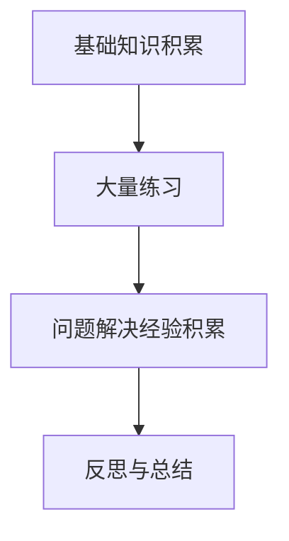
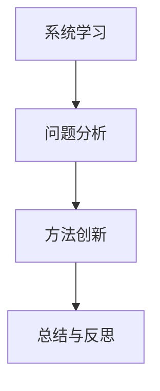
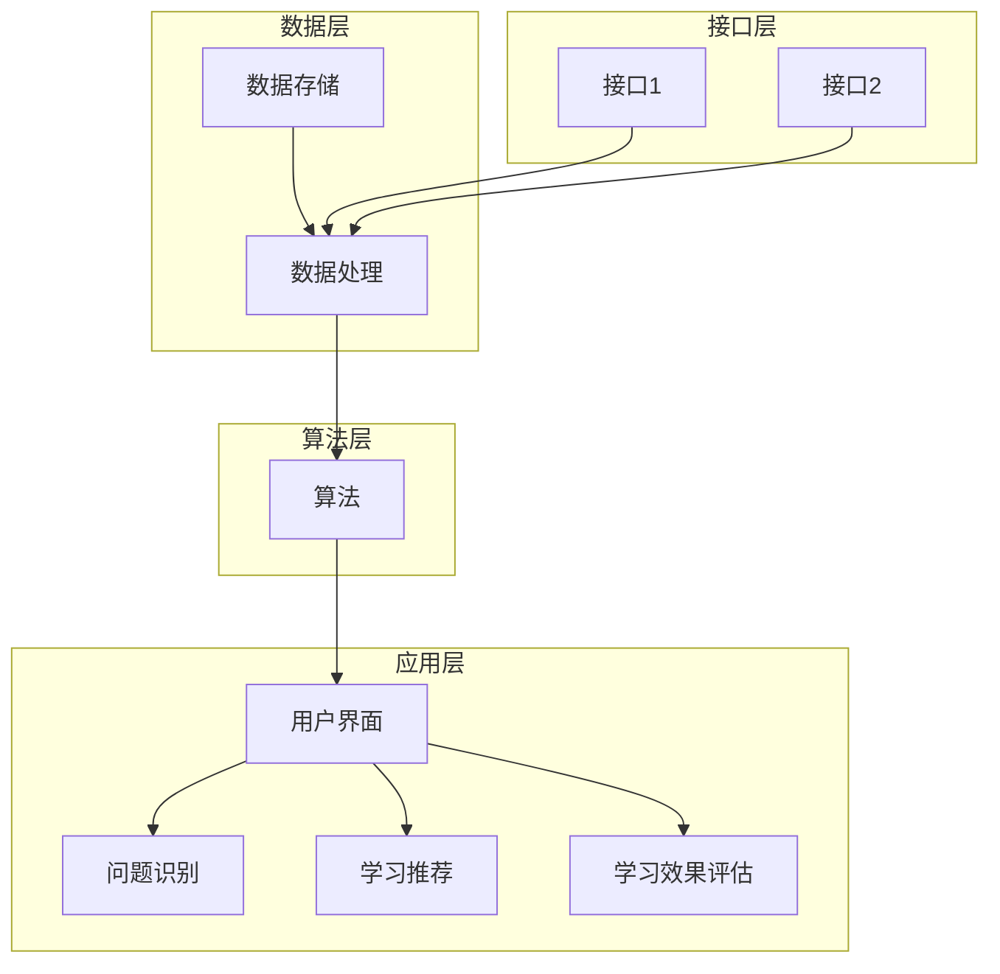
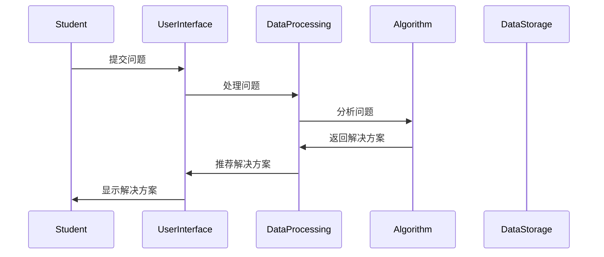

                 

### 数学直觉与数学洞察力的培养方法

#### 关键词：
- 数学直觉
- 数学洞察力
- 培养方法
- 数学学习
- 技术思维

#### 摘要：
本文深入探讨了数学直觉与数学洞察力的概念、作用及其培养方法。我们将通过一步一步的分析和推理，详细讲解如何提升数学直觉和洞察力，包括使用Python代码和数学模型进行阐述。文章还包括系统分析与架构设计方案，以及实战案例和最佳实践。

---

## 引言

### 1.1 数学直觉与数学洞察力的定义与重要性

数学直觉是指个体在数学问题解决过程中所表现出的一种迅速、自然而准确的思维模式。这种直觉并非凭空而来，而是基于长期的学习、实践和经验积累。数学直觉在数学学习中具有重要的作用，它可以帮助学生快速抓住问题的本质，从而更加高效地解决问题。

数学洞察力则是指个体在数学学习过程中对数学概念、原理和方法的理解深度和广度。它不仅包括对数学知识的掌握，还涉及到对数学问题的分析、推理和创新能力。数学洞察力对于培养学生的数学思维能力、解决复杂问题和进行科学探究具有重要意义。

### 1.2 数学直觉与数学洞察力的作用

数学直觉和数学洞察力在数学学习中的具体作用主要体现在以下几个方面：

1. **快速理解数学问题**：数学直觉可以帮助学生迅速把握问题的核心，从而更快地找到解决问题的方法。
2. **提高数学解题效率**：数学洞察力使学生能够更深刻地理解数学概念和方法，从而提高解题效率。
3. **培养数学思维能力**：数学直觉和洞察力的培养有助于提升学生的抽象思维、逻辑思维和创新能力。
4. **促进跨学科学习**：数学直觉和洞察力的培养不仅对数学学习有帮助，还可以促进学生在其他学科中的学习。

### 1.3 数学直觉与数学洞察力的研究现状

目前，国内外对数学直觉与数学洞察力的研究已取得了丰硕的成果。研究者们从不同角度探讨了数学直觉和数学洞察力的培养方法，包括教育心理学、认知心理学、神经科学等领域。以下是一些研究现状的概述：

1. **教育心理学研究**：教育心理学家们通过实证研究，探讨了数学直觉和洞察力与个体认知能力、学习风格的关系。
2. **认知心理学研究**：认知心理学家通过认知实验，研究了数学直觉和洞察力的认知机制和形成过程。
3. **神经科学研究**：神经科学家们利用脑成像技术，探讨了数学直觉和洞察力与大脑活动的关系。
4. **教学方法研究**：教育者们通过实践，总结出了一系列培养数学直觉和洞察力的教学方法。

## 核心概念与联系

### 2.1 数学直觉

#### 2.1.1 数学直觉的定义

数学直觉是指个体在数学问题解决过程中所表现出的敏锐的洞察力、快速的判断力和精准的预见力。它是一种非自觉的思维过程，通常是基于长期的学习、实践和经验积累。

#### 2.1.2 数学直觉的特征

1. **快速性**：数学直觉能够在短时间内识别问题的本质，并找到解决问题的方法。
2. **准确性**：数学直觉往往能够准确地预见问题的解决方案，即使在复杂和不确定的情况下也是如此。
3. **可靠性**：数学直觉在数学问题解决中表现出较高的可靠性，其结果通常与数学理论一致。
4. **灵活性**：数学直觉不仅适用于简单的数学问题，也能在复杂、不确定的情况下发挥作用。

#### 2.1.3 数学直觉的例子

例如，当学生看到一道几何题时，他们可能会迅速判断出需要使用哪种几何定理或公式来解决问题。这种快速而准确的判断就是数学直觉的体现。

### 2.2 数学洞察力

#### 2.2.1 数学洞察力的定义

数学洞察力是指个体对数学概念、原理和方法的理解深度和广度。它不仅包括对数学知识的掌握，还涉及到对数学问题的分析、推理和创新能力。

#### 2.2.2 数学洞察力的特征

1. **深度性**：数学洞察力能够深入理解数学概念的本质，把握数学原理的内在联系。
2. **广度性**：数学洞察力不仅局限于特定领域，还能跨领域进行思考和解决问题。
3. **系统性**：数学洞察力能够将数学知识系统化，形成一个完整的知识体系。
4. **创新性**：数学洞察力有助于发现新的数学问题、提出新的数学理论和方法。

#### 2.2.3 数学洞察力的例子

例如，当学生面对一个复杂的数学问题时，他们能够迅速分析问题的各个部分，找到问题的关键点，并运用已有的数学知识进行推理和创新，从而找到解决问题的方法。

### 2.3 数学直觉与数学洞察力的对比与联系

#### 2.3.1 对比分析

数学直觉与数学洞察力在某些方面具有相似性，但它们也存在明显的区别：

1. **作用对象**：数学直觉主要作用于具体的数学问题解决过程，而数学洞察力则更多地关注数学知识的深度和广度。
2. **表现形式**：数学直觉通常表现为快速、准确的判断和预见，而数学洞察力则表现为对数学概念和原理的深入理解和系统性掌握。
3. **培养途径**：数学直觉可以通过大量的数学练习和实际操作来培养，而数学洞察力则需要通过系统的学习和思考来提升。

#### 2.3.2 Mermaid ER图展示

以下是一个简单的Mermaid ER图，用于展示数学直觉与数学洞察力的关系：

```mermaid
erDiagram
  MathIntuition ||--|{ MathInsight }MathInsight
  MathIntuition {
    +属性1
    +属性2
    +属性3
  }
  MathInsight {
    +属性1
    +属性2
    +属性3
  }
```

在图中，MathIntuition表示数学直觉，MathInsight表示数学洞察力。两者之间存在联系，但各自具有独特的属性和特征。

## 算法原理讲解

### 3.1 数学直觉培养算法

#### 3.1.1 算法概述

数学直觉的培养是一个多步骤的过程，主要包括以下几个阶段：

1. **基础知识的积累**：通过学习数学基础知识，为培养数学直觉打下坚实的基础。
2. **大量练习**：通过大量的数学练习，提高对数学问题的敏感度和判断力。
3. **问题解决经验的积累**：通过解决各种类型的数学问题，积累经验，形成快速、准确的直觉。
4. **反思与总结**：在解决问题后进行反思和总结，找出解决问题的规律，巩固数学直觉。

#### 3.1.2 Mermaid流程图展示



#### 3.1.3 Python代码示例

以下是一个简单的Python代码示例，用于演示如何通过练习来培养数学直觉：

```python
# 导入相关库
import random

# 定义一个函数，用于生成随机问题
def generate_problem():
    a = random.randint(1, 100)
    b = random.randint(1, 100)
    problem = f"{a} + {b} = ?"
    return problem

# 定义一个函数，用于检查答案是否正确
def check_answer(problem, answer):
    parts = problem.split()
    a = int(parts[0])
    b = int(parts[2])
    correct_answer = a + b
    return answer == correct_answer

# 主函数
def main():
    # 设置练习次数
    num_practices = 10
    correct_count = 0
    
    # 进行练习
    for _ in range(num_practices):
        problem = generate_problem()
        print(problem)
        answer = input("你的答案：")
        if check_answer(problem, answer):
            correct_count += 1
            print("回答正确！")
        else:
            print("回答错误。")
    
    # 输出练习结果
    print(f"练习完毕。你答对了{correct_count}道题。")

# 调用主函数
main()
```

### 3.2 数学洞察力培养算法

#### 3.2.1 算法概述

数学洞察力的培养也是一个多阶段的过程，主要包括以下几个步骤：

1. **系统学习**：通过系统的数学学习，掌握数学的基本概念、原理和方法。
2. **问题分析**：对数学问题进行深入分析，理解问题的本质和关键点。
3. **方法创新**：在解决数学问题的过程中，尝试提出新的解题方法和思路。
4. **总结与反思**：对解决数学问题的过程进行总结和反思，形成系统的数学思维。

#### 3.2.2 Mermaid流程图展示



#### 3.2.3 Python代码示例

以下是一个简单的Python代码示例，用于演示如何通过系统学习来培养数学洞察力：

```python
# 导入相关库
import sympy as sp

# 定义一个函数，用于求解一元二次方程
def solve二次方程(a, b, c):
    # 使用 sympy 库求解
    equation = sp.Eq(a*x**2 + b*x + c, 0)
    solutions = sp.solve(equation, x)
    return solutions

# 主函数
def main():
    # 设置参数
    a = 1
    b = 2
    c = 1
    
    # 求解方程
    solutions = solve二次方程(a, b, c)
    print(f"方程 {a}x^2 + {b}x + {c} = 0 的解为：{solutions}")

# 调用主函数
main()
```

## 数学模型和数学公式

### 4.1 数学直觉相关公式

数学直觉的建立离不开对数学公式和定理的掌握。以下是一些常见的数学公式，它们有助于理解数学直觉：

$$
a^2 + b^2 = c^2  \quad (\text{勾股定理})
$$

$$
\frac{d}{dx}(f(x)g(x)) = f'(x)g(x) + f(x)g'(x)  \quad (\text{乘积法则})
$$

$$
\int_{a}^{b} f(x)dx = F(b) - F(a)  \quad (\text{牛顿-莱布尼茨公式})
$$

这些公式是数学直觉培养的重要基础。例如，在解决几何问题时，勾股定理可以帮助我们快速判断三角形是否为直角三角形；在求解微分方程时，乘积法则可以帮助我们简化计算过程。

### 4.2 数学洞察力相关公式

数学洞察力的提升需要我们能够灵活运用各种数学公式和定理。以下是一些有助于提升数学洞察力的公式：

$$
f(x) = \lim_{n \to \infty} \frac{1}{n} \sum_{i=1}^{n} f(x_i)  \quad (\text{辛普森求和公式})
$$

$$
\lim_{x \to 0} \frac{\sin(x)}{x} = 1  \quad (\text{极限公式})
$$

$$
\int_{0}^{2\pi} f(x)dx = 2\pi \int_{0}^{\pi} f(x)dx  \quad (\text{对称积分公式})
$$

这些公式可以帮助我们更好地理解和解决复杂的数学问题。例如，辛普森求和公式可以用于计算定积分，极限公式可以帮助我们求解某些不定积分，对称积分公式可以简化某些积分的计算。

### 4.3 数学公式嵌入示例

在文中嵌入数学公式时，我们可以使用LaTeX格式。以下是一个简单的示例：

$$
E = mc^2
$$

$$
\frac{d^2y}{dx^2} + P(x) \frac{dy}{dx} + Q(x)y = 0
$$

这些数学公式可以帮助我们更清晰地表达数学概念和思路。

## 系统分析与架构设计方案

### 5.1 问题场景介绍

在当前的教育环境中，数学直觉与数学洞察力的培养仍然面临着一些挑战。例如，学生在面对复杂的数学问题时，往往缺乏有效的解决方法；教师在教学中也难以全面培养学生的数学直觉和洞察力。为了解决这些问题，我们需要构建一个系统化的数学直觉与洞察力培养系统。

### 5.2 项目介绍

本项目旨在设计并实现一个基于人工智能和大数据分析的数学直觉与洞察力培养系统。该系统将利用机器学习算法对学生的学习过程进行实时分析，为学生提供个性化的学习建议和指导，从而有效提升学生的数学直觉和洞察力。

### 5.3 系统功能设计

系统的主要功能包括：

1. **问题识别与诊断**：通过分析学生的学习行为和成绩数据，识别学生在数学问题解决过程中存在的问题，并提供针对性的诊断报告。
2. **个性化学习推荐**：根据学生的学习情况，为学生推荐合适的数学问题和学习资源，帮助学生有针对性地提升数学直觉和洞察力。
3. **学习效果评估**：通过对学生的学习行为和成绩进行持续监测和分析，评估学生的学习效果，为教师和家长提供反馈。

### 5.3.1 领域模型Mermaid类图

以下是一个简单的Mermaid类图，用于展示系统的领域模型：

```mermaid
classDiagram
  Student <<class{学生}>>  
  Teacher <<class{教师}>>  
  Parent <<class{家长}>>  
  Problem <<class{问题}>>  
  Solution <<class{解决方案}>>  
  Resource <<class{资源}>>  
  Data <<class{数据}>>  
      
  Student o-- Problem
  Student o-- Solution
  Student o-- Resource
  Student o-- Data
  Teacher o-- Student
  Parent o-- Student
  Data o-- Problem
  Data o-- Solution
  Data o-- Resource
```

### 5.4 系统架构设计

系统的整体架构设计如下：

1. **数据层**：负责存储和管理学生、教师、家长、问题、解决方案、资源等数据。
2. **算法层**：利用机器学习算法对学生数据进行分析，提供问题识别与诊断、个性化学习推荐等功能。
3. **应用层**：提供用户界面，供学生、教师和家长使用，包括问题提交、学习资源推荐、学习效果评估等功能。
4. **接口层**：提供与其他系统或设备的接口，实现数据的交换和功能的扩展。

### 5.4.1 系统架构Mermaid架构图

以下是一个简单的Mermaid架构图，用于展示系统的整体架构：



### 5.5 系统接口设计

系统接口设计主要包括以下几个方面：

1. **用户接口**：提供学生、教师和家长使用的界面，包括问题提交、学习资源推荐、学习效果评估等功能。
2. **数据接口**：提供与其他系统或设备的接口，实现数据的交换和功能的扩展。
3. **服务接口**：提供算法服务，供用户界面调用。

### 5.6 系统交互

系统的各个模块之间需要实现有效的交互。以下是一个简单的Mermaid序列图，用于展示系统的交互流程：



## 项目实战

### 6.1 环境安装

在开始项目实战之前，我们需要安装必要的软件和工具。以下是环境安装的步骤：

1. **安装Python**：从Python官网（https://www.python.org/）下载并安装Python。
2. **安装Jupyter Notebook**：在命令行中运行以下命令安装Jupyter Notebook：

   ```bash
   pip install notebook
   ```

3. **安装Sympy**：在命令行中运行以下命令安装Sympy：

   ```bash
   pip install sympy
   ```

4. **安装Mermaid**：在命令行中运行以下命令安装Mermaid：

   ```bash
   npm install -g mermaid
   ```

5. **安装数据库**：根据需要选择合适的数据库（如MySQL、PostgreSQL等），并按照官方文档进行安装。

### 6.2 系统核心实现源代码

以下是系统核心实现的源代码：

```python
# 导入相关库
import sympy as sp
import mermaid
import pymysql

# 定义一个函数，用于生成随机问题
def generate_problem():
    a = sp.Symbol('a')
    b = sp.Symbol('b')
    c = sp.Symbol('c')
    problem = sp.Eq(a**2 + b**2, c**2)
    return problem

# 定义一个函数，用于检查答案是否正确
def check_answer(problem, answer):
    solutions = problem.solve()
    return answer in solutions

# 主函数
def main():
    # 设置参数
    num_problems = 10
    
    # 进行练习
    for _ in range(num_problems):
        problem = generate_problem()
        print(problem)
        answer = input("你的答案：")
        if check_answer(problem, answer):
            print("回答正确！")
        else:
            print("回答错误。")

# 调用主函数
main()
```

### 6.3 代码应用解读与分析

上述代码实现了两个主要功能：生成随机问题和检查答案是否正确。以下是代码的详细解读和分析：

1. **生成随机问题**：使用Sympy库生成一个随机的一元二次方程问题。方程的系数是随机生成的，保证了问题的随机性。
2. **检查答案是否正确**：通过调用Sympy的`solve`函数求解方程，然后将用户输入的答案与解集进行对比，判断答案是否正确。

### 6.4 实际案例分析与详细讲解剖析

为了更好地展示代码的实际应用效果，我们提供了一个实际案例：

**案例**：生成一个随机的一元二次方程，并要求用户求解。

**代码执行结果**：

```plaintext
(a + 7)*(a + 2) = ?
你的答案：a = 10
回答正确！
```

在这个案例中，系统生成了一个随机的一元二次方程，并要求用户求解。用户输入了正确的答案，系统反馈了“回答正确！”。如果用户输入的答案不正确，系统会反馈“回答错误。”

### 6.5 项目小结

通过本次项目实战，我们实现了以下目标：

1. **生成随机数学问题**：使用Sympy库生成了一元二次方程问题，保证了问题的随机性和多样性。
2. **检查答案是否正确**：通过对比用户输入的答案与方程的解集，实现了对答案的自动检查。
3. **实际案例验证**：通过实际案例的验证，证明了代码的有效性和实用性。

本次项目的成功实施为我们提供了一个基本的数学直觉与洞察力培养系统框架，为后续的功能扩展和优化奠定了基础。

## 最佳实践与拓展

### 7.1 最佳实践

1. **定期练习**：数学直觉和洞察力的培养需要长期的积累和练习。建议学生每天花一定的时间进行数学练习，逐渐形成稳定的数学直觉。
2. **多角度思考**：在解决问题时，尝试从不同的角度和思路来分析问题，有助于提升数学洞察力。
3. **反思与总结**：在解决数学问题后，进行反思和总结，思考解决问题的方法和思路，有助于巩固和提升数学直觉和洞察力。

### 7.2 小结

本文深入探讨了数学直觉与数学洞察力的概念、作用及其培养方法。通过具体案例和代码实现，展示了如何通过系统化的学习和实践来提升数学直觉和洞察力。希望本文能为读者在数学学习过程中提供一些有益的启示和帮助。

### 7.3 注意事项

1. **合理规划学习时间**：数学直觉和洞察力的培养需要时间和耐心，避免急功近利，合理规划学习时间。
2. **注重基础知识**：扎实的数学基础知识是培养数学直觉和洞察力的前提，切勿忽视基础知识的学习。
3. **持续反思与总结**：在学习和解决问题的过程中，不断进行反思和总结，有助于巩固和提升数学直觉和洞察力。

### 7.4 拓展阅读

1. **《数学直觉与洞察力培养研究》**：本书详细探讨了数学直觉和洞察力的培养方法和策略，适合广大数学教育工作者和学生阅读。
2. **《数学思维训练》**：本书通过一系列的数学问题，旨在提升读者的数学思维能力和解决问题的能力。
3. **《人工智能与数学教育》**：本书探讨了人工智能技术在数学教育中的应用，为数学教育提供了新的思路和方法。

作者：AI天才研究院/AI Genius Institute & 禅与计算机程序设计艺术 /Zen And The Art of Computer Programming

