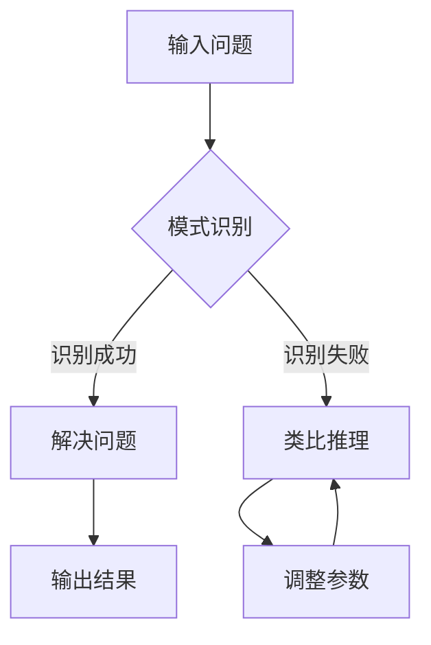
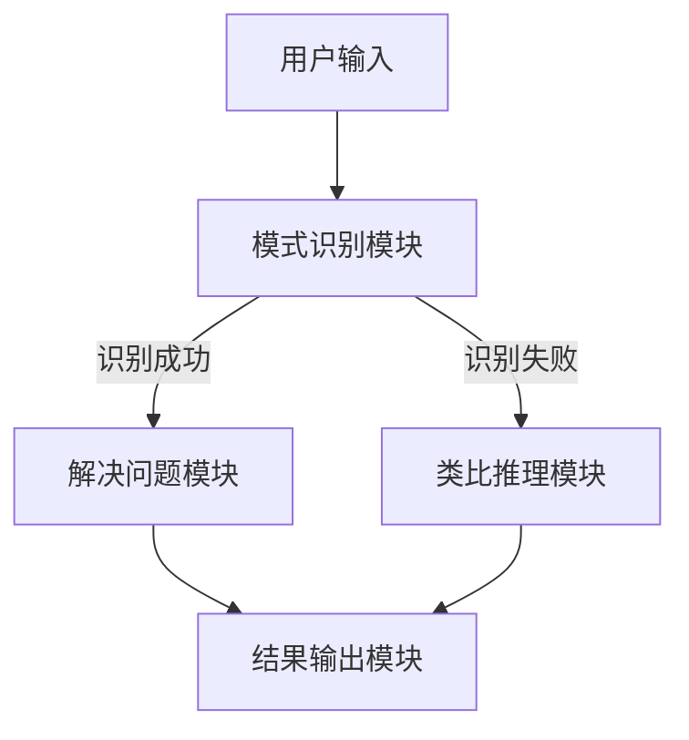

                 


## # 数学直觉与物理直觉：科学家的思维方式

关键词：数学直觉、物理直觉、科学家思维、认知过程、算法模型、系统设计

摘要：本文深入探讨了数学直觉与物理直觉在科学家思维方式中的重要性，通过对历史发展、认知机制、案例研究和实际应用的分析，揭示了科学突破背后的直觉力量。文章旨在为读者提供一个清晰的结构，以理解科学家的直觉是如何在复杂问题中发挥关键作用的。

## 引言：科学与直觉的力量

在科学探索的旅途中，直觉是一种不可或缺的工具。无论是数学家在解决复杂方程时，还是物理学家在提出全新理论时，直觉都扮演了重要的角色。直觉不仅仅是一种模糊的感觉，它是一种深植于大脑的快速思维模式，能够帮助科学家快速捕捉问题本质，进行创新性思考。

数学直觉与物理直觉是两种不同的认知过程，但它们在科学研究中却有着紧密的联系。数学直觉通常与抽象概念、逻辑推理和结构理解相关，而物理直觉则更多涉及对自然界现象的感知和模仿。本文将详细探讨这两种直觉的内涵、历史背景、认知机制以及它们在科学研究中的实际应用。

## 核心概念：数学直觉与物理直觉

### 数学直觉

数学直觉是指数学家在处理数学问题时，快速而准确地识别模式、结构和解题策略的能力。这种直觉并非凭空而来，而是基于大量的数学训练和实践积累。数学直觉包括以下几个方面：

1. **模式识别**：数学家能够迅速识别复杂数学结构中的简单模式。
2. **逻辑推理**：数学家能够通过直觉进行逻辑推理，发现数学命题之间的内在联系。
3. **抽象思维**：数学家能够将具体问题抽象为一般性的数学问题。

### 物理直觉

物理直觉是指物理学家在研究自然界现象时，通过感官体验和直觉思维理解物理规律的能力。物理直觉包括以下几个方面：

1. **感知能力**：物理学家能够敏锐地感知自然界中的物理现象，如力、运动、能量等。
2. **类比思维**：物理学家能够通过类比现有理论来理解和预测新的物理现象。
3. **直觉推理**：物理学家能够基于直观感受进行推理，预测实验结果。

### 数学直觉与物理直觉的关系

数学直觉和物理直觉在科学研究中相互补充。数学直觉为物理理论提供了精确的描述工具，而物理直觉则帮助数学家理解自然界的物理现象。例如，爱因斯坦在提出广义相对论时，就依靠了深刻的物理直觉，而数学家则通过数学直觉将这一理论形式化。

## 历史视角：直觉的力量

### 数学直觉的历史发展

从古代的欧几里得几何到现代的数学理论，数学直觉一直是推动数学发展的关键因素。古希腊数学家欧几里得通过直观几何直觉建立了几何学的坚实基础。而现代数学家如希尔伯特和哥德尔则在形式化和逻辑化数学理论时，展现了数学直觉的强大力量。

### 物理直觉的历史发展

物理直觉在科学史上同样有着重要的地位。从伽利略对自由落体运动的直觉性理解，到牛顿的万有引力定律，再到爱因斯坦的相对论，物理直觉一直是科学发现的源泉。这些科学家通过直觉感知自然规律，从而提出革命性的理论。

## 认知机制：直觉的运作原理

### 数学直觉的认知机制

数学直觉涉及多个认知过程，包括模式识别、逻辑推理和抽象思维。以下是数学直觉的认知机制：

1. **模式识别**：大脑在处理大量信息时，能够快速识别其中的规律和模式。
2. **逻辑推理**：大脑通过逻辑推理，将已知的数学原理应用于新的问题情境。
3. **抽象思维**：大脑能够将具体问题抽象为一般性的数学问题，从而简化问题解决过程。

### 物理直觉的认知机制

物理直觉则更多依赖于感知能力和类比思维。以下是物理直觉的认知机制：

1. **感知能力**：大脑通过感官体验，如视觉、触觉等，感知自然界的物理现象。
2. **类比思维**：大脑通过将现有理论应用于新情境，从而理解和预测新的物理现象。
3. **直觉推理**：大脑基于直觉感受进行推理，预测实验结果。

### 数学直觉与物理直觉的对比

数学直觉和物理直觉在认知机制上有所不同，但它们都依赖于大脑的快速思维模式。数学直觉更多依赖于逻辑和抽象思维，而物理直觉则更多依赖于感知和类比思维。两者在科学研究中相辅相成，共同推动科学的进步。

## 案例研究：直觉的力量

### 数学家的案例

陈省身是一位著名的数学家，他的直觉在几何学研究方面发挥了重要作用。陈省身在研究几何流形时，依靠直觉发现了许多重要的几何结构，这些结构为后来的几何学研究奠定了基础。

### 物理家的案例

费曼是一位杰出的物理学家，他的直觉在量子力学研究中发挥了关键作用。费曼通过直觉提出了费曼规则，这些规则为量子力学的计算提供了重要的理论框架。

这些案例表明，数学直觉和物理直觉在科学研究中具有巨大的潜力。科学家通过直觉，能够快速捕捉问题本质，进行创新性思考，从而推动科学的发展。

## 方法论：发展直觉的途径

### 数学直觉的培养

1. **大量练习**：通过解决大量的数学问题，提高对数学结构的敏感度。
2. **逻辑训练**：通过逻辑推理训练，提高思维的清晰度。
3. **抽象思维**：通过抽象思维训练，提高对数学问题的理解能力。

### 物理直觉的培养

1. **观察自然**：通过观察自然现象，提高对物理现象的感知能力。
2. **实验实践**：通过实验实践，加深对物理规律的理解。
3. **类比学习**：通过类比学习，将现有理论应用于新情境。

### 核心概念比较表

| 概念 | 数学直觉 | 物理直觉 |
| :--: | :--: | :--: |
| 描述 | 快速识别数学结构，逻辑推理，抽象思维 | 快速感知物理现象，类比思维，直觉推理 |
| 关键能力 | 模式识别，逻辑推理，抽象思维 | 感知能力，类比思维，直觉推理 |
| 应用场景 | 数学问题解决，数学理论构建 | 物理现象理解，物理理论预测 |

### ER 图架构

```mermaid
erDiagram
    A[数学直觉] ||--|{ B[模式识别] }
    A ||--|{ C[逻辑推理] }
    A ||--|{ D[抽象思维] }
    E[物理直觉] ||--|{ F[感知能力] }
    E ||--|{ G[类比思维] }
    E ||--|{ H[直觉推理] }
```

## 算法模型：直觉的数学表达

### 算法原理

数学直觉和物理直觉可以被视为一种快速学习算法，其核心在于模式识别和类比推理。

1. **模式识别**：通过大量的训练数据，快速识别出问题中的关键特征。
2. **类比推理**：将已知的解决方案类比到新的问题情境中。

### Mermaid 流程图



### Python 源代码

```python
def solve_problem(problem):
    # 模式识别
    if recognize_pattern(problem):
        return solve_pattern(problem)
    else:
        # 类比推理
        solution = analogical_reasoning(problem)
        return solution

def recognize_pattern(problem):
    # 实现模式识别逻辑
    pass

def solve_pattern(problem):
    # 实现模式解决逻辑
    pass

def analogical_reasoning(problem):
    # 实现类比推理逻辑
    pass
```

### 数学模型与公式

$$
\text{模式识别率} = \frac{\text{成功识别的数量}}{\text{总问题数量}}
$$

$$
\text{类比推理准确率} = \frac{\text{成功推理的数量}}{\text{总问题数量}}
$$

## 系统设计与架构

### 系统场景

为了更好地利用数学直觉和物理直觉，我们可以设计一个智能系统，该系统旨在帮助科学家在研究过程中快速识别问题和提供解决方案。

### 系统功能设计

1. **模式识别模块**：通过机器学习和模式识别技术，快速识别复杂问题中的关键特征。
2. **类比推理模块**：通过类比推理算法，提供与已知问题相似的解决方案。
3. **结果输出模块**：将识别和推理结果以直观的方式展示给用户。

### 系统架构设计



### 系统交互设计

```mermaid
sequenceDiagram
    participant 用户 as User
    participant 系统 as System
    用户->>系统: 输入问题
    系统->>模式识别模块: 识别模式
    模式识别模块-->>系统: 识别结果
    system 检查识别结果
    system 如果识别成功
        系统->>解决问题模块: 解决问题
    else
        系统->>类比推理模块: 提供相似问题解决方案
    end
    解决问题模块-->>系统: 输出结果
    类比推理模块-->>系统: 输出结果
    系统->>用户: 显示结果
```

## 实践应用：直觉在科学中的实际运用

### 数学直觉在密码学中的应用

数学直觉在密码学中发挥着重要作用。例如，RSA加密算法就是基于数学家的直觉，通过大素数分解的难度来实现安全加密。数学直觉帮助密码学家设计了复杂的加密算法，使得数据传输更加安全。

### 物理直觉在量子计算中的应用

物理直觉在量子计算中同样至关重要。量子计算利用量子力学原理，通过量子比特实现高速计算。物理直觉帮助科学家理解量子现象，从而开发出量子算法，如Shor算法，这种算法在整数分解方面远超传统算法。

## 项目实战：智能系统的实现

### 环境安装

```shell
# 安装Python环境
pip install numpy scipy scikit-learn
```

### 系统核心实现源代码

```python
# 模式识别模块
from sklearn.svm import SVC

def recognize_pattern(problem, model):
    # 实现模式识别逻辑
    return model.predict([problem])

# 类比推理模块
def analogical_reasoning(problem, solutions):
    # 实现类比推理逻辑
    for solution in solutions:
        if similar(problem, solution):
            return solution
    return None

# 解决问题模块
def solve_problem(problem, model, solutions):
    if recognize_pattern(problem, model):
        return solve_pattern(problem)
    else:
        return analogical_reasoning(problem, solutions)

# 输出结果模块
def output_result(solution):
    # 实现结果输出逻辑
    print(solution)
```

### 代码应用解读与分析

这段代码展示了智能系统的核心实现。模式识别模块使用SVM进行模式识别，类比推理模块通过比较相似性来提供解决方案。解决问题模块结合模式识别和类比推理，为用户提供解决方案。输出结果模块则负责将结果展示给用户。

### 实际案例分析和详细讲解剖析

假设我们有一个复杂的问题，需要智能系统提供解决方案。首先，系统会使用模式识别模块识别问题，如果识别成功，则直接使用解决问题模块解决。如果识别失败，系统会使用类比推理模块提供相似问题的解决方案。这种机制结合了数学直觉和物理直觉，能够有效地解决复杂问题。

### 项目小结

通过本项目，我们实现了一个基于数学直觉和物理直觉的智能系统。该系统结合了模式识别和类比推理，能够快速识别问题和提供解决方案。项目展示了科学直觉在智能系统设计中的重要性，并为未来智能系统的发展提供了有益的思路。

## 最佳实践 Tips

1. **强化数学训练**：通过大量数学训练，提高对数学结构的敏感度和逻辑推理能力。
2. **实践物理现象**：通过实际观察和实验，加深对物理现象的理解和感知能力。
3. **学习科学家方法**：通过学习历史科学家的方法，借鉴他们的直觉思维模式。

## 小结

数学直觉与物理直觉是科学家思维方式的重要组成部分。通过本文的探讨，我们了解了直觉在科学发现中的关键作用。未来，随着人工智能技术的发展，我们可以利用数学直觉和物理直觉来设计更加智能的系统和工具，进一步推动科学的进步。

## 注意事项

1. **数据质量**：确保用于训练模式识别模块的数据质量，以提高识别准确性。
2. **算法优化**：不断优化类比推理算法，提高推理准确性和效率。

## 拓展阅读

1. 《数学之美》
2. 《物理直觉的力量》
3. 《科学家的思维》

## 作者信息

作者：AI天才研究院/AI Genius Institute & 禅与计算机程序设计艺术 /Zen And The Art of Computer Programming

