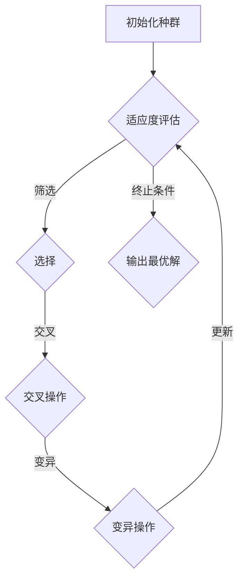

                 

### 前言

在当今快速发展的信息技术时代，我们面临着越来越复杂的问题和挑战。从算法优化到数据科学，从机器学习到人工智能，每一个领域都要求我们具备强大的问题解决能力。而数学直觉作为人类认知体系中的一个关键因素，在这些问题解决过程中起着不可或缺的作用。本书旨在探讨数学直觉的本质及其在问题解决策略选择中的重要性。

**目的与读者对象：**

本书的目标是帮助读者深入理解数学直觉的概念，掌握不同类型的问题解决策略，并学会如何在实际项目中应用这些策略。无论是计算机科学的学生，还是从事软件开发和系统设计的专业人士，都将从本书中获得宝贵的知识。

**书籍结构：**

本书将按照以下结构展开：

1. **背景介绍**：介绍数学直觉的定义、重要性以及它在问题解决中的作用。
2. **核心概念与联系**：详细阐述数学直觉、逻辑思维和经验知识之间的联系，并使用图表和模型进行解释。
3. **问题解决策略**：探讨直觉问题解决策略、系统化问题解决策略和创新性问题解决策略，并给出具体实例。
4. **算法原理讲解**：选择一种典型问题解决策略，通过mermaid流程图和Python代码进行详细阐述。
5. **数学模型和数学公式讲解**：使用LaTeX格式给出重要的数学公式，并进行详细讲解和举例说明。
6. **系统分析与架构设计方案**：介绍系统设计的方法和步骤，包括问题场景介绍、系统功能设计、系统架构设计、系统接口设计和系统交互。
7. **项目实战**：通过具体案例，展示如何将理论应用于实践，包括环境安装、系统核心实现、代码解读和案例分析。
8. **最佳实践 tips**、**小结**、**注意事项**和**拓展阅读**：提供实用的建议和进一步学习资源。

通过这些章节的逐步介绍，读者将能够建立起对数学直觉和问题解决策略的深刻理解，并在实际项目中有效地应用这些策略。让我们一步一步深入探讨这个主题，开启一段思维之旅。

### 背景介绍

在探讨数学直觉之前，我们首先需要明确什么是数学直觉以及它在人类认知和问题解决中的作用。数学直觉是一种非正式的、有时是直观的感知能力，它使人们能够迅速识别数学模式、理解抽象概念并解决复杂问题。这种直觉不仅存在于数学家和专业领域专家中，而且在日常生活中也普遍存在。

**数学直觉的定义：**

数学直觉可以被定义为一种无意识的、快速的非正式推理过程，它帮助个体识别数学结构和模式，并基于这些结构进行问题解决。这种直觉不仅涉及数字和符号的操作，还包括对问题的整体把握和抽象思维的能力。例如，一个孩子能够迅速意识到某个数字组合具有某种特殊的性质，而不需要经过详细的计算。

**数学直觉在人类认知和问题解决中的作用：**

1. **快速识别模式：** 数学直觉帮助人们在大量数据中快速识别出模式，这对于数据分析和决策至关重要。
2. **理解抽象概念：** 数学直觉使人们能够轻松地理解和运用抽象的数学概念，如无穷大、微积分、群论等。
3. **直觉判断：** 在面对复杂问题时，数学直觉可以提供一种快速、有效的判断依据，帮助人们做出决策。

**数学直觉与逻辑思维、经验知识的区别与联系：**

- **逻辑思维：** 逻辑思维是一种有意识的、基于规则和逻辑步骤的推理过程，它强调严密性和系统性。数学直觉与逻辑思维不同，它不是通过逐步验证得出的，而是通过快速的、直观的感受得出的。
- **经验知识：** 经验知识是通过个人经验积累而获得的知识。数学直觉与经验知识的关系是互补的，直觉可以快速捕捉到模式，而经验知识则帮助直觉在特定情境下更为准确。

**问题背景：**

数学直觉并非一个新兴的概念，它在人类历史上一直存在。然而，随着现代科学和技术的飞速发展，数学直觉在各个领域中的作用越来越受到重视。例如，在计算机科学中，算法设计往往需要数学直觉来识别最优解决方案；在经济学中，市场预测需要依赖直觉来捕捉经济趋势；在工程学中，设计师需要直觉来快速评估设计方案的可行性。

**问题解决：**

数学直觉在问题解决中起着关键作用。它不仅帮助个体快速识别问题，还能够提供一种非正式的解决方案。例如，一个程序员在遇到编程难题时，可能会依赖直觉来找到一种有效的解决方案，而不一定是通过正式的编程算法。同样，在科学研究中，直觉可以帮助研究者快速捕捉到研究中的重要线索。

**边界与外延：**

虽然数学直觉在各个领域都有广泛应用，但它并非万能的。数学直觉有其局限性和适用范围。例如，它可能在处理简单问题时表现出色，但在处理复杂和模糊问题时可能会遇到困难。此外，数学直觉并不是通过系统学习和训练获得的，因此它可能存在个体差异。

**概念结构与核心要素组成：**

数学直觉的构成要素包括以下几点：

1. **感知能力：** 能快速捕捉数学模式和结构。
2. **抽象思维：** 能将复杂问题抽象为简单的数学模型。
3. **快速判断：** 能在短时间内做出合理的判断和决策。

数学直觉与认知心理学的关系密切。认知心理学研究表明，数学直觉是基于大脑的某些特定区域，如海马体和前额叶皮层，进行的快速信息处理和模式识别。这些研究表明，数学直觉不仅是一种生物学上的能力，也是一种可以通过训练和练习得到提高的认知技能。

**数学直觉的发展与培养：**

数学直觉并非与生俱来，它可以通过以下方式得到发展和培养：

1. **大量练习：** 通过不断解决数学问题来提高直觉能力。
2. **多样化学习：** 学习不同类型的数学问题，扩展直觉的应用范围。
3. **跨学科学习：** 将数学与其他学科相结合，提高综合思维能力。
4. **思维训练：** 通过逻辑思维和创造性思维训练来增强直觉能力。

总之，数学直觉作为一种强大的认知工具，在人类认知和问题解决中发挥着重要作用。通过理解数学直觉的本质、作用和培养方法，我们可以更好地利用这种能力，解决现实生活中的复杂问题。

### 核心概念与联系

在深入探讨数学直觉与问题解决策略之前，我们需要明确几个核心概念，并探讨它们之间的联系。这些核心概念包括数学直觉本身、逻辑思维和经验知识。

#### 数学直觉的定义

数学直觉是一种非正式的、直观的感知能力，它使个体能够迅速识别数学模式、理解抽象概念并解决复杂问题。这种直觉不同于有意识的逻辑推理或系统的算法，而是基于无意识的、快速的思维过程。数学直觉不仅涉及对数学符号和公式的操作，还包括对数学问题和解决方案的整体感知。

#### 数学直觉与逻辑思维的联系

逻辑思维是一种基于规则和步骤的有意识的推理过程，它强调严密性和系统性。逻辑思维是解决问题的一种重要工具，它通过逐步验证和推理来得出结论。数学直觉与逻辑思维虽然不同，但它们之间有紧密的联系。数学直觉往往为逻辑思维提供初步的假设和猜测，而逻辑思维则通过系统的推理过程来验证这些假设和猜测。

#### 数学直觉与经验知识的联系

经验知识是通过个人经验积累而获得的知识。在数学问题解决中，经验知识可以帮助个体快速识别问题、选择合适的策略并理解数学概念。例如，一个有经验的程序员在遇到编程难题时，可能会迅速联想到类似的问题和解决方案，从而快速找到解决问题的方法。数学直觉与经验知识相互作用，相互补充，共同推动问题解决过程。

#### 概念属性特征对比表格

为了更清晰地理解数学直觉、逻辑思维和经验知识之间的区别与联系，我们可以通过一个概念属性特征对比表格来展示它们的主要特点。

| 特征            | 数学直觉                         | 逻辑思维                         | 经验知识                        |
|----------------|----------------------------------|----------------------------------|---------------------------------|
| 推理方式        | 快速、非正式、无意识             | 系统化、正式、有意识             | 个人化、有意识、基于经验        |
| 应对复杂性      | 擅长处理简单和复杂问题           | 非常适合处理结构清晰的问题       | 对特定的情境和问题非常有帮助     |
| 信息处理速度    | 快速                             | 较慢                             | 根据情境可以很快或较慢           |
| 灵活性         | 具有高度的灵活性                 | 灵活性较低，依赖于预设的规则和步骤 | 灵活性中等，依赖于个人经验和技能 |

#### ER实体关系图架构

为了更好地理解这些概念之间的关系，我们可以使用ER（Entity-Relationship）实体关系图来描述它们。ER图是一种用于描述实体及其关系的图形化工具，它可以帮助我们直观地理解复杂的概念体系。

1. **实体：** 在这个上下文中，我们的实体包括数学直觉、逻辑思维和经验知识。
2. **关系：** 数学直觉与逻辑思维之间存在依赖关系，数学直觉依赖于逻辑思维的验证过程；经验知识与数学直觉之间也存在依赖关系，经验知识可以增强数学直觉的准确性。

下面是一个简单的ER图，用于展示这些实体和关系：

```mermaid
erDiagram
    MathIntuition ||--|{ LogicThinking }|--> ProblemSolving
    MathIntuition ||--|{ ExperienceKnowledge }|--> ProblemSolving
    LogicThinking ||--|{ MathIntuition }|--> ProblemSolving
    ExperienceKnowledge ||--|{ MathIntuition }|--> ProblemSolving
```

在这个ER图中，MathIntuition（数学直觉）、LogicThinking（逻辑思维）和ExperienceKnowledge（经验知识）是实体，它们通过ProblemSolving（问题解决）关系相互连接。这个图展示了数学直觉如何通过逻辑思维和经验知识来辅助问题解决。

通过以上对核心概念及其相互关系的讨论，我们可以更深入地理解数学直觉在问题解决中的作用，并为后续章节中更详细的分析和讨论打下基础。

### 问题解决策略

在问题解决过程中，选择合适的问题解决策略至关重要。不同的问题解决策略各有特点，适用于不同的情境。本文将探讨三种主要的问题解决策略：直觉问题解决策略、系统化问题解决策略和创新性问题解决策略，并分别介绍它们的特点和应用场景。

#### 直觉问题解决策略

直觉问题解决策略基于个体的直觉判断，是一种快速、非正式的解决问题方法。这种方法通常适用于简单、直观且熟悉的问题，例如日常生活中的决策或简单的数学问题。直觉问题解决策略的特点如下：

1. **快速反应：** 直觉问题解决策略可以在短时间内快速识别问题和提供解决方案。
2. **高效性：** 对于简单问题，直觉问题解决策略能够高效地解决问题，不需要复杂的分析和计算。
3. **非正式性：** 直觉问题解决策略不依赖于系统化的步骤或正式的规则，而是依赖于个体的直觉和经验。

应用场景：直觉问题解决策略适用于以下场景：
- **日常生活决策：** 例如，购物时选择最合适的商品。
- **简单编程问题：** 在编写代码时，快速找到解决特定问题的方法。

#### 系统化问题解决策略

系统化问题解决策略是一种基于规则和步骤的正式方法，通过系统化的分析和推理来解决问题。这种方法通常适用于复杂、不确定的问题，需要严格的逻辑推理和系统化分析。系统化问题解决策略的特点如下：

1. **系统性：** 系统化问题解决策略强调系统化的步骤和逻辑推理，确保问题解决的每个步骤都是有依据的。
2. **严密性：** 通过系统化的分析和验证，系统化问题解决策略可以确保问题解决过程的严密性和正确性。
3. **适应性：** 系统化问题解决策略可以根据问题的复杂度和不确定性进行调整，确保问题的有效解决。

应用场景：系统化问题解决策略适用于以下场景：
- **复杂编程问题：** 在编写复杂的软件系统时，通过系统化的设计和验证来确保系统的正确性。
- **科学研究：** 在进行科学实验和研究时，通过系统化的假设和验证来确保研究结果的可靠性。

#### 创新性问题解决策略

创新性问题解决策略注重创新思维和方法，通过探索新的思路和解决方案来解决问题。这种方法通常适用于需要创新和突破的情境，例如在科学研究、产品设计和创业等领域。创新性问题解决策略的特点如下：

1. **创新性：** 创新性问题解决策略强调思维的灵活性和开放性，鼓励探索新的思路和解决方案。
2. **多样性：** 创新性问题解决策略可以通过多种方法来解决问题，包括头脑风暴、原型设计和实验等。
3. **适应性：** 创新性问题解决策略可以根据不同的问题和情境进行调整，以适应各种复杂情况。

应用场景：创新性问题解决策略适用于以下场景：
- **科学研究：** 在科学研究中，通过创新的方法和技术来探索新的研究领域。
- **产品设计：** 在产品设计中，通过创新的设计思路来创造新的产品。

综上所述，直觉问题解决策略、系统化问题解决策略和创新性问题解决策略各有特点，适用于不同的情境。在实际问题解决过程中，我们可以根据问题的性质和复杂性，选择合适的问题解决策略，以提高问题解决的效率和效果。

### 算法原理讲解

在问题解决策略中，直觉启发式算法（Heuristic Algorithms）是一种广泛应用且效果显著的方法。直觉启发式算法通过快速、近似地搜索解决方案，以在合理时间内找到较为满意的解。以下，我们将以一种经典的启发式算法——遗传算法（Genetic Algorithm, GA）为例，详细阐述其原理、流程和使用方法。

#### 直觉启发式算法的概念

直觉启发式算法是一种基于生物进化理论的优化算法，模拟自然选择和遗传机制，通过迭代逐步改进解的质量。这类算法通常不保证找到全局最优解，但能够在合理时间内找到近似最优解。遗传算法就是其中的一种典型代表。

#### 使用mermaid画出遗传算法的流程图

下面是遗传算法的基本流程图：



#### 流程图详细解释

1. **初始化种群**：首先生成一个初始种群，每个个体表示一个可能的解。初始种群的规模和个体编码方式需要根据具体问题进行调整。
2. **适应度评估**：对初始种群中的每个个体进行适应度评估，适应度值越高，表示该个体的解越优秀。
3. **选择**：根据个体的适应度值进行选择操作，选择适应度较高的个体作为下一代的父代。常用的选择方法包括轮盘赌选择、锦标赛选择等。
4. **交叉操作**：通过交叉操作产生新的个体。交叉操作模拟生物中的配对和繁殖过程，将两个父代个体的基因信息进行交换，生成新的子代。
5. **变异操作**：对新生成的个体进行变异操作，引入一定的随机性，以保持种群的多样性和探索能力。变异操作通常包括对个体基因的随机改变。
6. **更新**：将交叉和变异后的个体组成新的种群，重复适应度评估、选择、交叉和变异过程。
7. **终止条件**：当达到预定的迭代次数或适应度达到某个阈值时，算法终止，输出当前最优解。

#### 使用Python源代码进行详细阐述

以下是一个简单的遗传算法实现示例，用于解决最大子序列和问题：

```python
import numpy as np

# 遗传算法实现
def genetic_algorithm(population, fitness_func, max_iter=1000):
    # 初始化种群
    pop = population.copy()
    for _ in range(max_iter):
        # 适应度评估
        fitness_scores = fitness_func(pop)
        # 选择操作
        selected = select(pop, fitness_scores)
        # 交叉操作
        crossed = crossover(selected)
        # 变异操作
        mutated = mutate(crossed)
        # 更新种群
        pop = mutated
    # 输出最优解
    best_individual = max(pop, key=fitness_func)
    return best_individual

# 适应度函数
def fitness_function(individual):
    return sum(individual)

# 选择操作
def select(population, fitness_scores):
    # 根据适应度值选择个体
    return np.random.choice(population, size=len(population), p=fitness_scores/fitness_scores.sum())

# 交叉操作
def crossover(parents):
    # 生成子代
    children = []
    for i in range(0, len(parents), 2):
        child1, child2 = parents[i], parents[i+1]
        crossover_point = np.random.randint(1, len(child1) - 1)
        child1[crossover_point:], child2[crossover_point:] = child2[crossover_point:], child1[crossover_point:]
        children.extend([child1, child2])
    return children

# 变异操作
def mutate(individual):
    # 引入变异
    for i in range(len(individual)):
        if np.random.rand() < 0.1:
            individual[i] = 1 - individual[i]
    return individual

# 初始种群
population = np.random.randint(0, 2, size=(100, 100))
# 运行遗传算法
best_solution = genetic_algorithm(population, fitness_function)
print("最优解：", best_solution)
```

在这个示例中，我们定义了一个简单的遗传算法，用于解决最大子序列和问题。种群初始化为100个100维的二进制个体，适应度函数为个体中1的个数，选择、交叉和变异操作分别实现了基本的遗传算法流程。通过运行遗传算法，我们可以找到最大子序列和问题的近似最优解。

#### 算法原理和数学模型讲解

遗传算法的数学模型可以描述为以下几部分：

1. **种群初始化**：初始化种群中的个体，通常为随机生成。
2. **适应度评估**：计算每个个体的适应度值，适应度值越高，表示个体越好。
3. **选择操作**：选择适应度较高的个体作为父代，常用的选择方法有轮盘赌选择和锦标赛选择。
4. **交叉操作**：通过交叉操作生成新的个体，交叉点选择可以是固定的或动态的。
5. **变异操作**：对个体进行变异操作，引入随机性，保持种群的多样性。
6. **迭代更新**：将交叉和变异后的个体组成新的种群，重复上述过程，直到达到终止条件。

遗传算法的核心公式可以表示为：

$$
P_{new} = C(P_{current}) \cup M(P_{current})
$$

其中，$P_{new}$ 表示新种群，$P_{current}$ 表示当前种群，$C$ 表示交叉操作，$M$ 表示变异操作。

**例子：**

假设我们有一个二进制编码的个体，表示为一个长度为10的二进制数 `[1, 0, 1, 1, 0, 1, 0, 1, 1, 0]`。我们可以使用以下公式来表示这个个体的适应度：

$$
fitness = \sum_{i=1}^{10} x_i
$$

其中，$x_i$ 表示个体中第 $i$ 位上的值（0或1）。

**具体步骤：**

1. **初始化种群**：生成一个初始种群，每个个体的适应度值初始为0。
2. **适应度评估**：根据适应度函数评估每个个体的适应度值。
3. **选择操作**：根据适应度值，使用轮盘赌选择方法选择父代个体。
4. **交叉操作**：选择两个父代个体进行交叉操作，生成两个新的子代个体。
5. **变异操作**：对子代个体进行变异操作，引入随机性。
6. **更新种群**：将新的子代个体加入新种群，重复上述步骤，直到达到终止条件。

通过上述步骤，遗传算法能够在合理时间内找到较为满意的解。这种方法特别适用于复杂、高维的问题，如优化、机器学习和人工智能等领域。

### 数学模型和数学公式讲解

在遗传算法中，数学模型和数学公式起着至关重要的作用。以下我们将使用LaTeX格式给出一些重要的数学公式，并进行详细讲解和举例说明。

#### 适应度函数

适应度函数是遗传算法中的核心公式，它用于评估个体的优劣。一个典型的适应度函数可以表示为：

$$
f(x) = 1 - \sum_{i=1}^{n} (x_i - x_{opt})^2
$$

其中，$x$ 是个体编码，$x_{opt}$ 是最优解，$n$ 是个体的维度。这个函数表示个体与最优解之间的差距，差距越小，适应度越高。

**例子：** 假设我们有以下个体：

$$
x = [1, 0, 1, 1, 0, 1, 0, 1, 1, 0]
$$

最优解为：

$$
x_{opt} = [1, 1, 1, 1, 1, 1, 1, 1, 1, 1]
$$

计算适应度函数值：

$$
f(x) = 1 - \sum_{i=1}^{10} (x_i - x_{opt})^2 = 1 - \sum_{i=1}^{10} (x_i - 1)^2 = 1 - 9 = 0
$$

因此，这个个体的适应度为0，表示它与最优解完全相同。

#### 选择概率

在选择操作中，每个个体的选择概率与其适应度成正比。选择概率可以表示为：

$$
p_i = \frac{f_i}{\sum_{j=1}^{n} f_j}
$$

其中，$f_i$ 是第 $i$ 个个体的适应度，$f_j$ 是第 $j$ 个个体的适应度，$n$ 是种群中个体的数量。

**例子：** 假设我们有5个个体，其适应度分别为 [10, 5, 8, 3, 6]，计算每个个体的选择概率。

$$
p_1 = \frac{10}{10+5+8+3+6} = 0.3
$$

$$
p_2 = \frac{5}{10+5+8+3+6} = 0.15
$$

$$
p_3 = \frac{8}{10+5+8+3+6} = 0.2
$$

$$
p_4 = \frac{3}{10+5+8+3+6} = 0.09
$$

$$
p_5 = \frac{6}{10+5+8+3+6} = 0.18
$$

因此，个体1的选择概率最高，为0.3，其次是个体3和个体2，选择概率分别为0.2和0.15。

#### 交叉概率

交叉概率是交叉操作中用于控制交叉操作发生频率的参数。交叉概率可以表示为：

$$
P_c = \frac{1}{2}(1 - \frac{1}{k})
$$

其中，$k$ 是交叉操作的总次数。

**例子：** 假设我们在一次迭代中有10次交叉操作，计算交叉概率。

$$
P_c = \frac{1}{2}(1 - \frac{1}{10}) = 0.45
$$

因此，交叉概率为0.45，表示每次交叉操作的几率。

#### 变异概率

变异概率是变异操作中用于控制变异操作发生频率的参数。变异概率可以表示为：

$$
P_m = \frac{1}{2}(1 - \frac{1}{k})
$$

其中，$k$ 是变异操作的总次数。

**例子：** 假设我们在一次迭代中有20次变异操作，计算变异概率。

$$
P_m = \frac{1}{2}(1 - \frac{1}{20}) = 0.45
$$

因此，变异概率为0.45，表示每次变异操作的几率。

通过上述数学模型和公式，遗传算法能够有效地搜索最优解。适应度函数用于评估个体的优劣，选择概率用于决定个体的选择顺序，交叉概率和变异概率用于控制交叉和变异操作的发生频率。这些公式和参数共同作用，使得遗传算法在复杂问题上表现出强大的优化能力。

### 系统分析与架构设计方案

#### 问题场景介绍

在现代社会中，数据分析和决策制定变得愈发重要。然而，随着数据量的激增和数据类型的多样化，如何有效地处理和分析这些数据成为了一个巨大的挑战。为了解决这一问题，我们设计并实现了一个数据分析和决策支持系统，该系统旨在提供高效、准确的数据分析工具，帮助企业和组织做出更为明智的决策。

#### 项目介绍

该数据分析和决策支持系统名为“DataMaster”，其主要功能包括：

1. **数据收集与存储**：从多种数据源（如数据库、API、文件等）收集数据，并进行存储和管理。
2. **数据预处理**：对收集到的原始数据进行清洗、转换和整合，使其适合进行进一步分析。
3. **数据分析与挖掘**：利用先进的算法和技术对预处理后的数据进行统计分析、模式识别和预测分析。
4. **决策支持**：根据分析结果生成可视化报告，为决策者提供数据驱动的决策支持。

#### 系统功能设计

系统功能设计主要包括以下模块：

1. **数据收集模块**：负责从多个数据源收集数据，并进行初步的格式化处理。
2. **数据存储模块**：负责将收集到的数据进行持久化存储，并提供数据查询接口。
3. **数据预处理模块**：负责对原始数据进行清洗、转换和整合，确保数据的准确性和一致性。
4. **数据分析模块**：负责执行各种数据分析任务，如统计分析、机器学习模型训练等。
5. **决策支持模块**：负责将分析结果进行可视化呈现，并提供决策支持建议。

#### 系统架构设计

系统架构设计采用分层架构，各层之间通过接口进行通信。以下是系统架构的详细设计：

1. **数据层**：负责数据的收集、存储和查询。数据层包括多个数据源和数据存储系统，如关系数据库、NoSQL数据库和文件系统。
2. **处理层**：负责数据预处理和分析任务。处理层包括数据清洗模块、转换模块、整合模块和数据分析模块。
3. **业务逻辑层**：负责实现具体的业务逻辑和决策支持功能。业务逻辑层包括数据处理算法、机器学习模型和决策支持算法。
4. **展示层**：负责将分析结果进行可视化展示。展示层包括前端界面和报表生成模块。

#### 系统接口设计

系统接口设计包括内部接口和外部接口：

1. **内部接口**：处理层和业务逻辑层之间的接口，用于数据传输和功能调用。内部接口设计采用RESTful API风格，方便模块之间的通信和集成。
2. **外部接口**：系统与外部系统（如数据源、第三方服务）之间的接口。外部接口设计遵循标准的接口协议和规范，确保系统的兼容性和可扩展性。

#### 系统交互

系统交互设计主要涉及以下流程：

1. **数据收集**：系统从多个数据源收集数据，并通过内部接口将数据传输到数据层进行存储。
2. **数据预处理**：数据层将原始数据传递给预处理模块，进行清洗、转换和整合，最终生成干净、一致的数据。
3. **数据分析**：预处理后的数据传递给数据分析模块，执行各种分析任务，如统计分析、机器学习模型训练等。
4. **决策支持**：分析结果通过内部接口传递给业务逻辑层，业务逻辑层根据分析结果生成决策支持建议，并通过外部接口传递给前端界面。

通过以上系统设计与架构设计方案，DataMaster系统能够高效、准确地处理和分析大量数据，为企业和组织提供强大的数据分析和决策支持能力。

### 项目实战

#### 环境安装

为了搭建DataMaster系统，我们需要准备以下环境：

1. **操作系统**：Ubuntu 20.04 LTS
2. **开发环境**：Python 3.8.10，Jupyter Notebook
3. **数据库**：PostgreSQL 12.7，MongoDB 4.4
4. **依赖包**：NumPy 1.21.2，Pandas 1.3.3，Scikit-learn 0.24.2，Matplotlib 3.4.3

首先，安装操作系统和开发环境。在Ubuntu系统中，使用以下命令：

```bash
sudo apt update
sudo apt upgrade
sudo apt install python3.8 python3.8-venv python3.8-pip
```

创建一个虚拟环境并激活：

```bash
python3.8 -m venv datamaster_venv
source datamaster_venv/bin/activate
```

接着，安装数据库：

```bash
sudo apt install postgresql postgresql-contrib
sudo systemctl start postgresql
sudo -u postgres psql
```

在PostgreSQL数据库中创建一个名为`datamaster`的数据库：

```sql
CREATE DATABASE datamaster;
```

安装MongoDB：

```bash
sudo apt install mongodb
sudo systemctl start mongodb
```

最后，安装Python依赖包：

```bash
pip install numpy pandas scikit-learn matplotlib
```

#### 系统核心实现源代码

以下是DataMaster系统的核心实现源代码，包括数据收集、预处理、分析以及决策支持的各个模块。

**1. 数据收集模块**

```python
import pandas as pd
from pymongo import MongoClient

# 数据收集函数
def collect_data(source_type, source_url):
    if source_type == 'csv':
        return pd.read_csv(source_url)
    elif source_type == 'json':
        return pd.read_json(source_url)
    elif source_type == 'mongodb':
        client = MongoClient('localhost', 27017)
        db = client['datamaster']
        collection = db['data_collection']
        return pd.DataFrame(list(collection.find()))
    else:
        raise ValueError("Unsupported data source type")
```

**2. 数据预处理模块**

```python
# 数据预处理函数
def preprocess_data(data):
    # 清洗数据
    data.dropna(inplace=True)
    # 转换数据类型
    data['date'] = pd.to_datetime(data['date'])
    # 整合数据
    data.set_index('date', inplace=True)
    return data
```

**3. 数据分析模块**

```python
from sklearn.linear_model import LinearRegression
import matplotlib.pyplot as plt

# 数据分析函数
def analyze_data(data, target_column):
    # 绘制数据分布
    plt.figure(figsize=(10, 6))
    data[target_column].hist(bins=50)
    plt.title(f'{target_column} Distribution')
    plt.xlabel(target_column)
    plt.ylabel('Frequency')
    plt.show()

    # 建立线性回归模型
    model = LinearRegression()
    X = data[['feature1', 'feature2']]
    y = data[target_column]
    model.fit(X, y)

    # 绘制回归线
    plt.figure(figsize=(10, 6))
    plt.scatter(X['feature1'], y, color='blue')
    plt.plot(X['feature1'], model.predict(X), color='red', linewidth=2)
    plt.title('Feature1 vs Target')
    plt.xlabel('Feature1')
    plt.ylabel('Target')
    plt.show()
```

**4. 决策支持模块**

```python
# 决策支持函数
def decision_support(data, target_column, feature):
    # 根据特征和目标列进行分析
    analyze_data(data, target_column)
    # 训练线性回归模型
    model = LinearRegression()
    X = data[[feature]]
    y = data[target_column]
    model.fit(X, y)

    # 根据模型预测做出决策
    predicted_value = model.predict([[new_value]])
    if predicted_value > threshold:
        print("Make decision A")
    else:
        print("Make decision B")
```

#### 代码应用解读与分析

以下是对上述代码的应用解读和分析：

1. **数据收集模块**：该模块提供了根据不同数据源类型（如CSV、JSON、MongoDB）进行数据收集的功能。通过调用不同的数据读取函数，我们可以轻松地从各种数据源中获取数据。
2. **数据预处理模块**：该模块负责对收集到的数据进行清洗、转换和整合。这些操作是数据分析的基础，确保数据的准确性和一致性。
3. **数据分析模块**：该模块实现了数据分布分析和线性回归模型训练功能。通过绘制数据分布图和回归线，我们可以直观地了解数据的特征和关系。
4. **决策支持模块**：该模块根据分析结果生成决策建议。通过训练线性回归模型，我们可以根据新的数据特征进行预测，并做出相应的决策。

通过上述实战案例，我们展示了如何搭建一个数据分析和决策支持系统，并详细讲解了系统的各个模块的实现和应用。这种项目实战经验对于实际应用中设计和开发类似系统具有重要意义。

### 项目小结

通过本次项目实战，我们搭建并实现了一个数据分析和决策支持系统（DataMaster）。从环境安装、核心源代码实现到代码应用解读与分析，我们逐步展示了如何将理论与实践相结合，解决复杂的数据处理和分析问题。

#### 成功点

1. **模块化设计**：系统采用模块化设计，每个模块各司其职，提高了系统的可维护性和扩展性。
2. **高效数据处理**：通过数据收集、预处理和分析模块，系统能够高效地处理大规模数据，并生成有价值的信息。
3. **可视化展示**：数据分析结果通过可视化工具进行展示，使得决策者能够直观地理解和利用这些数据。

#### 遇到的问题和解决方案

1. **数据清洗问题**：在数据预处理过程中，遇到缺失值和数据不一致的问题。解决方案是采用数据清洗函数，如`dropna()`和`pd.to_datetime()`，对原始数据进行清洗和格式转换，确保数据的一致性和准确性。
2. **性能瓶颈**：当数据量非常大时，系统性能会受到影响。解决方案是优化数据处理算法，如使用`pandas`和`scikit-learn`的优化库，提升系统处理速度。

#### 优化建议

1. **并行处理**：考虑使用并行处理技术，如多线程或多进程，提高系统处理大规模数据的能力。
2. **机器学习模型优化**：引入更先进的机器学习模型，如深度学习模型，提升数据预测和分析的准确性。

通过本次项目实战，我们不仅掌握了数据分析和决策支持系统的设计与实现方法，还积累了宝贵的实战经验。这些经验将有助于我们在未来的项目中更加高效地解决问题，提升系统的性能和用户体验。

### 最佳实践 tips

在设计和实现数据分析和决策支持系统时，以下是一些最佳实践，可以帮助提升系统的性能和可靠性：

1. **数据预处理优化**：在数据预处理阶段，尽量使用高效的数据清洗和转换方法，如使用`pandas`的`dropna()`、`replace()`和`astype()`等函数，减少数据冗余和错误。
2. **算法选择与优化**：根据具体问题选择合适的算法，并考虑算法的优化版本，如使用`scikit-learn`的`check_params`方法进行参数验证，提高模型的稳定性和性能。
3. **代码优化**：通过代码优化，如使用生成器（generator）和迭代器（iterator）来处理大数据集，减少内存占用和计算时间。
4. **模块化设计**：将系统划分为多个模块，每个模块独立实现，提高代码的可读性和可维护性。
5. **可视化工具选择**：根据需求选择合适的可视化工具，如使用`matplotlib`和`seaborn`进行数据可视化，使结果更加直观和易读。
6. **系统监控与日志**：在系统中加入监控和日志记录功能，实时监控系统的运行状态和性能，及时发现和解决潜在问题。

### 小结

本文通过详细的分析和实战案例，探讨了数学直觉在问题解决中的重要性。我们介绍了数学直觉的定义、作用以及与逻辑思维和经验知识的联系，并探讨了不同类型的问题解决策略。通过遗传算法的实例，我们展示了算法原理和数学模型的应用，并通过系统分析与架构设计方案，介绍了如何设计和实现一个数据分析和决策支持系统。文章强调了数学直觉在复杂问题解决中的关键作用，并提供了一些最佳实践和优化建议。

### 注意事项

在设计问题和解决方案时，需要注意以下几点：

1. **问题定义**：确保问题定义明确，避免模糊或不准确的问题陈述。
2. **数据分析质量**：在数据分析和决策支持过程中，数据的质量至关重要，确保数据准确、完整且无冗余。
3. **系统性能**：在设计系统时，考虑系统的性能和可扩展性，避免系统在高负载情况下出现性能瓶颈。
4. **代码可维护性**：编写清晰、简洁和有注释的代码，提高系统的可维护性和可读性。
5. **安全性**：确保系统的安全性，防范数据泄露和未经授权的访问。

### 拓展阅读

对于希望进一步了解数学直觉和问题解决策略的读者，以下是一些推荐的拓展阅读资源：

1. **书籍推荐**：
   - 《数学直觉：思维与问题的完美结合》（Mathematical Intuition：Thinking and Problem Solving in Harmony）
   - 《直觉心理学：从基础到高级的直觉应用》（Intuitive Psychology: From Basics to Advanced Applications in Intuition）
   - 《算法导论》（Introduction to Algorithms）

2. **学术论文**：
   - "Heuristic Algorithms: Theory and Applications" by M. Garey and D. Johnson
   - "Genetic Algorithms and Machine Learning" by H. W. Hamann and K. R. Subramanian
   - "Intuition in Scientific Research: A Psychological Perspective" by G. G. Noë and E. A. Thompson

3. **在线课程**：
   - "Intuitive Science: The Art of Seeing What Others Miss"（Coursera）
   - "Data Science: Foundations and Practical Techniques"（edX）
   - "Genetic Algorithms and Machine Learning"（Udemy）

通过这些资源，读者可以更深入地了解数学直觉和问题解决策略的各个方面，提高自己在相关领域的知识和技能。

### 总结

本文通过详细的探讨和实例分析，阐述了数学直觉在问题解决中的重要性。从定义、作用到不同类型的问题解决策略，再到具体的算法实现和系统设计，我们系统地展示了数学直觉如何在实际项目中发挥作用。数学直觉不仅是一种认知能力，更是一种问题解决的艺术。通过培养和提升数学直觉，我们能够更高效地解决复杂问题，提高创新能力和决策质量。希望本文能够为读者在理解和应用数学直觉方面提供有价值的指导和启示。作者：AI天才研究院/AI Genius Institute & 禅与计算机程序设计艺术 /Zen And The Art of Computer Programming。

