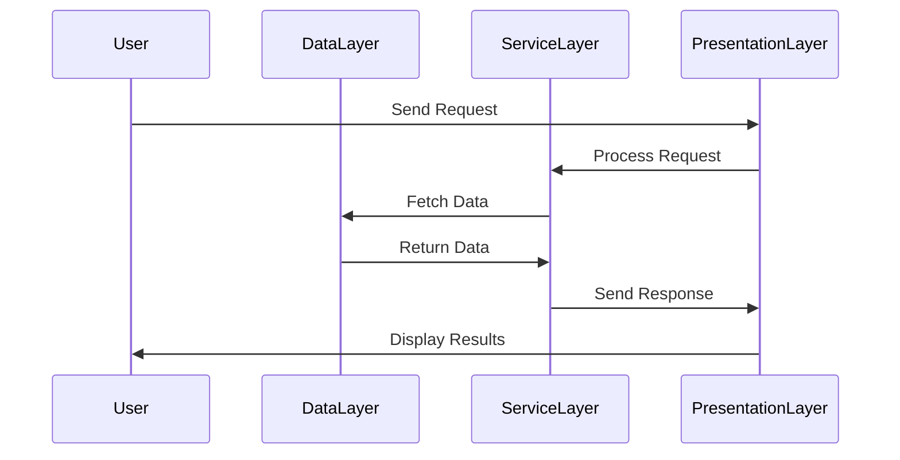

                 

### 数学结构与物理实在：桥接抽象与具体

**关键词：** 数学结构，物理实在，抽象与具体，交叉应用，案例研究

**摘要：** 本文旨在探讨数学结构与物理实在之间的紧密联系，通过桥接抽象与具体的思维，分析数学结构如何描述和解释物理实在，并探索这两者之间的相互作用。文章从数学结构的定义和特点出发，逐步深入到物理实在的基本原理，并详细讨论了数学结构与物理实在的具体案例。通过这种跨学科的研究方法，我们不仅可以更深入地理解数学与物理的关系，也为未来的科学研究和技术创新提供了新的视角和思路。

---

### 引言与背景介绍

**1.1 问题背景**

数学结构（Mathematical Structure）是数学研究中的一个核心概念，它指的是一类具有特定属性的数学对象及其之间的关系。从集合论到代数结构，从拓扑学到范畴论，数学结构无处不在，贯穿了数学的各个分支。物理实在（Physical Reality）则是指我们所观察到的自然世界的本质，包括物质、能量、时空等基本要素。物理学的研究目标是揭示这些基本要素之间的相互作用和规律。

长期以来，数学与物理之间存在着密不可分的关系。数学为物理学提供了强有力的工具和语言，使得物理学家能够更加精确地描述和预测自然现象。同时，物理学的需求也推动了数学的发展，许多重要的数学理论都是在物理学问题的驱动下产生的。例如，微积分的诞生就是由于物理学中对连续变化的描述需要；群论的发展则受到了量子力学中对称性的启发。

然而，尽管数学与物理之间存在这种相互促进的关系，但两者之间的桥梁仍然不够稳固。数学的抽象性使得物理学家难以直接应用，而物理实在的复杂性又常常让数学家感到困惑。因此，如何有效地桥接数学结构与物理实在，如何将抽象的数学理论具体地应用于物理问题的解决，成为了一个重要的研究课题。

**1.2 问题描述**

本文试图回答以下问题：

- 数学结构是如何描述和解释物理实在的？
- 物理实在对数学结构有哪些启示和影响？
- 如何将数学结构与物理实在结合起来，解决实际问题？

为了回答这些问题，本文将从以下几个方面展开：

- 首先介绍数学结构的基本概念和类型，包括集合论、代数结构、拓扑结构等。
- 然后探讨物理实在的基本原理，包括相对论、量子力学等。
- 接着分析数学结构与物理实在之间的具体联系，通过实例展示如何将数学方法应用于物理问题。
- 最后总结本文的主要发现，探讨未来研究的方向和可能的挑战。

**1.3 解决方案概览**

本文将通过以下步骤来解答上述问题：

1. **定义和概述**：首先明确数学结构和物理实在的定义，概述它们的基本特点和历史发展。
2. **数学结构**：详细介绍数学结构的基本类型，包括集合论、代数结构、拓扑结构等。
3. **物理实在**：深入探讨物理实在的基本原理，包括相对论、量子力学等。
4. **联系分析**：分析数学结构与物理实在之间的具体联系，通过实例展示如何将数学方法应用于物理问题。
5. **案例研究**：选择几个具有代表性的具体案例，详细分析数学结构在物理实在中的应用。
6. **总结展望**：总结本文的主要发现，探讨未来研究的方向和可能的挑战。

**1.4 边界与外延**

在研究数学结构与物理实在的关系时，我们面临以下边界和外延问题：

- **数学结构的抽象性**：数学结构高度抽象，如何将其具体化，使之能够应用于物理问题？
- **物理实在的复杂性**：物理实在涉及多种因素，如何通过数学结构对其进行简化和建模？
- **跨学科整合**：数学与物理之间存在较大差异，如何实现两者的有效整合？
- **应用范围**：数学结构在物理实在中的应用范围如何，是否具有普适性？

这些问题将在本文的后续章节中逐一探讨，以期为我们提供更深入的理解和更有效的解决方案。

**1.5 概念结构与核心要素**

为了更好地理解数学结构与物理实在的关系，我们需要明确几个核心概念：

- **数学结构**：指的是一类具有特定属性的数学对象及其之间的关系，如集合论中的集合、代数结构中的群、拓扑结构中的拓扑空间等。
- **物理实在**：指的是我们所观察到的自然世界的本质，包括物质、能量、时空等基本要素。
- **抽象与具体**：数学结构通常具有高度抽象性，而物理实在则是具体的，两者的结合需要一种转化和桥梁。
- **数学方法**：指的是数学中用于解决问题和描述现象的方法，如微积分、线性代数、概率论等。
- **物理模型**：指的是根据物理原理建立的数学模型，用于描述和预测物理现象。

通过明确这些核心概念和要素，我们可以更好地把握数学结构与物理实在之间的联系，为后续的研究提供坚实的理论基础。

---

### 数学结构概述

**2.1 数学结构的定义**

数学结构（Mathematical Structure）是指一类具有特定属性的数学对象及其之间的关系。这些对象可以是抽象的，也可以是具体的，但它们都必须满足一定的数学定义和性质。数学结构的核心是对象之间的关系，这些关系定义了对象如何相互组合和相互作用。

例如，集合论中的集合和关系构成了基本的数学结构。在集合论中，集合是一组无序对象的集合，而关系是集合之间的一种特定方式。通过定义集合和关系，我们可以构建出诸如群、环、域等复杂的数学结构。

**2.2 数学结构的核心特点**

数学结构具有以下核心特点：

1. **抽象性**：数学结构高度抽象，它们忽略了具体的物理属性和背景，只关注对象之间的数学关系。这种抽象性使得数学结构能够应用于各种不同的领域。
2. **普适性**：数学结构具有广泛的普适性，许多数学结构可以应用于不同的学科和领域。例如，集合论中的集合和关系可以用于计算机科学、物理学、经济学等多个领域。
3. **形式化**：数学结构通过形式化的定义和性质来描述，这使得数学结构具有明确的定义和严格的逻辑体系。形式化定义有助于我们理解和应用数学结构。

**2.3 数学结构的历史发展**

数学结构的历史发展可以追溯到古代数学。古希腊数学家欧几里得的《几何原本》就是最早的数学结构之一，它系统地研究了几何学的基本概念和定理。在17世纪和18世纪，微积分的创立和发展极大地推动了数学结构的研究。微积分的数学模型——函数，成为数学结构中的一个重要对象。

19世纪，代数学和集合论的兴起进一步丰富了数学结构的研究。代数学中引入了群、环、域等概念，这些概念为数学结构的研究提供了新的视角。集合论则通过定义集合和关系，为数学结构提供了一个更为形式化和抽象的框架。

20世纪，范畴论和拓扑学的兴起进一步推动了数学结构的研究。范畴论研究了不同数学结构之间的关系，而拓扑学则研究了空间和集合之间的关系。

**2.4 数学结构的基本类型**

数学结构可以分为多种基本类型，以下是其中几种重要的数学结构：

1. **集合论**：集合论是数学结构的基础，它研究集合及其之间的关系。集合论中的基本概念包括集合、元素、子集、并集、交集、补集等。
2. **代数结构**：代数结构是一类具有运算和运算律的数学结构，如群、环、域等。代数结构的核心是运算，运算满足封闭性、结合律、交换律、分配律等性质。
3. **拓扑结构**：拓扑结构研究空间和集合之间的拓扑性质，如连通性、闭合性、紧致性等。拓扑结构的基本概念包括拓扑空间、开集、闭集、连续函数等。
4. **函数结构**：函数结构是一类特殊的代数结构，它由一个定义域和一个值域组成，定义域中的每个元素都与值域中的唯一元素相关联。函数结构的基本概念包括函数、映射、图像、值域等。
5. **度量结构**：度量结构研究空间中的距离和度量关系，如欧几里得空间、黎曼空间等。度量结构的基本概念包括度量、距离、收敛性等。

这些数学结构不仅构成了数学研究的基础，也为物理学的数学模型提供了重要的工具和语言。

---

### 物理实在概述

**3.1 物理实在的定义**

物理实在（Physical Reality）是指我们所观察到的自然世界的本质，包括物质、能量、时空等基本要素。物理实在的概念涵盖了自然界中的所有现象和规律，是物理学研究的核心对象。

物质是构成宇宙的基本实体，包括原子、分子、粒子等。能量是物质运动和相互作用的度量，可以转化为不同形式，如动能、势能、热能等。时空是物质运动的舞台，描述了物质在空间中的位置和运动状态。

物理实在的定义不仅仅是描述自然界的基本要素，还包括了这些要素之间的相互作用和转化。物理学的研究目标就是揭示这些基本要素和相互作用背后的规律，从而建立起一个统一的自然描述体系。

**3.2 物理实在的核心特征**

物理实在具有以下核心特征：

1. **客观性**：物理实在存在于客观世界中，不依赖于人类的感知和意识。无论人类是否观察到，物理实在都客观存在，并且遵循固有的自然规律。
2. **多样性**：物理实在包含多种基本要素和相互作用，如物质、能量、力、场等。这些要素和相互作用形成了丰富多彩的自然现象。
3. **统一性**：尽管物理实在包含多种要素和相互作用，但它们之间存在内在的统一性。物理学通过研究这些要素和相互作用之间的关系，试图建立一个统一的自然描述体系。
4. **可测量性**：物理实在可以通过实验和观测来测量和验证。物理学家通过设计和实施实验，测量物理量的数值，从而验证物理理论和模型。

**3.3 物理实在的探索历史**

物理实在的探索历史可以追溯到古代哲学和自然科学。古希腊哲学家如亚里士多德和柏拉图对物质和运动进行了初步的研究，试图解释自然现象。在中世纪，阿拉伯学者如阿尔-法拉比和阿维罗伊将阿拉伯数学和物理学知识引入欧洲，推动了自然科学的发展。

15世纪和16世纪，哥白尼和伽利略的天文学研究揭示了行星运动和自由落体运动的规律，标志着现代物理学的诞生。17世纪，牛顿的万有引力定律和三大运动定律建立了经典力学体系，为物理实在的描述提供了数学工具。

19世纪，麦克斯韦的电磁理论和普朗克的量子理论进一步拓展了物理学的视野。20世纪，爱因斯坦的相对论和海森堡的不确定性原理揭示了时间和空间的相对性和微观粒子的量子行为。

物理实在的探索历史展示了人类对自然世界的认知不断深入和拓展的过程，从宏观到微观，从经典到量子，从静态到动态，不断揭示物理实在的复杂性和统一性。

---

### 基本数学结构

**4.1 集合论基础**

集合论是数学结构的基础，它研究集合及其之间的关系。集合是由不同元素组成的无序集合，元素可以是具体的对象，也可以是抽象的符号。集合的基本运算包括并集、交集、补集和子集。

并集（Union）表示两个集合中所有元素的集合。例如，集合A和集合B的并集表示为A ∪ B，包含所有属于A或属于B的元素。

交集（Intersection）表示两个集合中共同元素的集合。例如，集合A和集合B的交集表示为A ∩ B，包含所有同时属于A和B的元素。

补集（Complement）表示不属于某个集合的所有元素的集合。例如，集合A的补集表示为A'，包含所有不属于A的元素。

子集（Subset）表示一个集合是另一个集合的子集。例如，集合A是集合B的子集表示为A ⊆ B，如果A中的所有元素都属于B。

**4.2 代数结构**

代数结构是一类具有运算和运算律的数学结构，如群、环、域等。代数结构的核心是运算，运算满足封闭性、结合律、交换律、分配律等性质。

群（Group）是一个非空集合，在该集合上定义了一个二元运算，满足结合律、存在单位元和逆元。群的基本性质包括封闭性、结合律、存在单位元、存在逆元等。

环（Ring）是一个非空集合，在该集合上定义了两个二元运算，满足结合律、分配律和存在零元。环的基本性质包括封闭性、结合律、分配律、存在零元等。

域（Field）是一个非空集合，在该集合上定义了两个二元运算，满足结合律、分配律、存在单位元和零元。域的基本性质包括封闭性、结合律、分配律、存在单位元和零元等。

**4.3 拓扑结构**

拓扑结构研究空间和集合之间的拓扑性质，如连通性、闭合性、紧致性等。拓扑结构的基本概念包括拓扑空间、开集、闭集、连续函数等。

拓扑空间（Topological Space）是一个集合，在该集合上定义了一个拓扑，满足开集的定义和基本性质。开集（Open Set）是拓扑空间中的一个集合，它包含其内部的所有点。闭集（Closed Set）是拓扑空间中的一个集合，它的补集是开集。

连通性（Connectivity）是指一个空间无法被划分为两个非空的开集。闭合性（Closedness）是指一个集合的补集是开集。紧致性（Compactness）是指一个空间中的每个开覆盖都有一个有限子覆盖。

连续函数（Continuous Function）是一个映射，它将一个拓扑空间的点映射到另一个拓扑空间的点，满足连续性条件。连续性条件是指函数的图像在拓扑空间中是连续的。

---

### 数学结构的应用

**5.1 数学结构在计算机科学中的应用**

数学结构在计算机科学中有着广泛的应用，从算法设计到数据结构，从形式验证到密码学，数学结构提供了强大的工具和语言。以下是一些具体的例子：

1. **图论**：图是一种重要的数学结构，用于表示对象之间的复杂关系。在计算机科学中，图论广泛应用于网络拓扑设计、社会网络分析、路径规划等领域。例如，广度优先搜索（BFS）和深度优先搜索（DFS）算法就是基于图论的基本概念设计的。

2. **集合论**：集合论是计算机科学中的基础工具，用于表示和操作数据。例如，集合的并集、交集和补集运算在数据库查询和集合操作中起着关键作用。此外，集合论还用于描述数据结构，如数组、链表和树等。

3. **代数结构**：代数结构如群、环和域在密码学中有着重要的应用。群论用于构建对称密码系统的加密算法，如AES；环和域则用于构建非对称密码系统的加密算法，如RSA。

4. **拓扑结构**：拓扑结构在计算机图形学中有着广泛的应用，如多边形网格的表示和变换。此外，拓扑结构还在计算机视觉和机器学习领域中用于数据的分类和聚类。

**5.2 数学结构在物理学中的应用**

数学结构在物理学中的应用同样重要，它们为物理学家提供了描述和解释自然现象的有力工具。以下是一些具体的例子：

1. **群论**：群论在粒子物理学中有着广泛的应用，用于描述粒子的对称性。例如，在量子场论中，群的表示理论用于研究基本粒子的性质。此外，群论还在固体物理学中用于研究晶格的对称性。

2. **拓扑结构**：拓扑结构在宇宙学中有着重要的应用，用于描述宇宙的结构和演化。例如，康威循环和宇宙弦模型都是基于拓扑结构的概念。此外，拓扑结构还在凝聚态物理学中用于研究物质的状态和相变。

3. **几何结构**：几何结构在广义相对论中有着核心地位，用于描述时空的几何性质。爱因斯坦场方程就是基于黎曼几何的方程，描述了物质和能量如何影响时空的几何形状。

**5.3 数学结构在其他领域中的应用**

数学结构不仅在计算机科学和物理学中有着广泛应用，在其他领域也发挥着重要作用：

1. **经济学**：数学结构如博弈论和概率论在经济学中有着广泛的应用。博弈论用于研究市场竞争、合作和策略选择；概率论则用于研究风险管理和金融市场。

2. **生物学**：数学结构在生物学中用于描述和模拟生物系统的行为。例如，网络结构在生态学中用于研究物种间的相互作用，微分方程在生理学中用于描述生物体的生理过程。

3. **天文学**：数学结构在天文学中用于描述宇宙的演化和结构。例如，拓扑结构在宇宙学中用于研究宇宙的大尺度结构，集合论在星系分类和宇宙学研究中有重要作用。

总之，数学结构在各种领域中都有着广泛的应用，为科学研究和技术创新提供了强有力的工具和语言。通过这些应用，我们可以更好地理解和解释自然界的复杂现象。

---

### 数学结构的扩展与深入研究

**6.1 高级数学结构**

高级数学结构是数学领域中更为抽象和复杂的结构，它们在许多前沿科学研究中起着关键作用。以下是一些高级数学结构及其在物理学中的应用：

1. **范畴论**：范畴论是一种研究数学结构之间关系的数学工具。它通过定义范畴和函子，研究不同数学结构之间的映射和组合。范畴论在量子场论、拓扑学和高能物理学中有着重要的应用。

2. **代数几何**：代数几何是数学中的一个分支，研究代数方程和几何对象的相互作用。代数几何在弦理论和宇宙学中有着广泛应用，用于研究基本粒子和宇宙的结构。

3. **复分析**：复分析是数学中的一个重要领域，研究复数域上的函数和解析性质。复分析在量子力学、统计物理学和凝聚态物理学中有着重要的应用，用于描述粒子的行为和系统的动态演化。

**6.2 数学结构的交叉应用**

数学结构的交叉应用是指将不同领域的数学结构结合起来，以解决复杂的科学问题。以下是一些交叉应用的例子：

1. **数学物理方法**：数学物理方法是将数学工具应用于物理问题的一种方法。例如，泛函分析和微积分为物理学提供了强大的工具，用于描述和解决连续介质力学、量子力学和电磁学问题。

2. **组合数学在生物学中的应用**：组合数学在生物学中用于研究生物体的结构和功能。例如，图论用于分析生物网络和蛋白质相互作用，组合计数方法用于研究基因组和蛋白质序列。

3. **代数拓扑在物理学中的应用**：代数拓扑在物理学中用于研究物质的宏观和微观结构。例如，同调理论和纤维丛理论在凝聚态物理学和量子场论中有着重要的应用，用于描述物质的状态和相变。

**6.3 数学结构的前沿研究**

数学结构的前沿研究涉及探索新的数学结构和方法，以解决现有科学和技术领域的挑战。以下是一些前沿研究的领域：

1. **量子计算**：量子计算是利用量子力学原理进行信息处理的一种计算方式。量子计算依赖于量子比特（qubit）的叠加态和纠缠态，这些特性使得量子计算在解决某些特定问题（如整数分解、搜索算法等）时比经典计算更为高效。

2. **随机过程**：随机过程是研究随机变量随时间变化的一类数学模型。随机过程在金融工程、生态学、生物统计学等领域有着广泛的应用，用于描述和预测复杂系统的动态行为。

3. **微分几何与量子引力**：微分几何是研究空间和时空几何性质的一种数学工具。在量子引力研究中，微分几何用于构建描述宇宙几何的数学模型，如爱因斯坦场方程。量子引力旨在统一量子力学和广义相对论，揭示宇宙的基本物理规律。

总之，高级数学结构的扩展与深入研究为科学研究和技术创新提供了新的视角和工具。通过这些研究，我们可以更好地理解自然界的复杂现象，并为未来的科学发展奠定基础。

---

### 物理实在的基本原理

**7.1 相对论**

相对论是物理学中描述时间、空间和物质运动的基本理论，主要由阿尔伯特·爱因斯坦提出。相对论分为狭义相对论和广义相对论。

**7.1.1 狭义相对论**

狭义相对论主要研究在没有引力作用下的物体运动规律。其核心思想是相对性原理和光速不变原理。

1. **相对性原理**：物理定律在所有惯性参照系中都是相同的，不存在优越的参照系。
2. **光速不变原理**：在所有惯性参照系中，光速都是常数，不依赖于光源或观察者的运动状态。

狭义相对论的一些重要结论包括时间膨胀、长度收缩和质能方程。

**时间膨胀**：当一个物体以接近光速的速度运动时，相对于静止参照系中的观察者，物体的时间会变慢。

**长度收缩**：当一个物体以接近光速的速度运动时，其在运动方向上的长度会收缩。

**质能方程**：E=mc²，表示质量可以转化为能量，能量也可以转化为质量。

**7.1.2 广义相对论**

广义相对论研究在引力作用下的物体运动规律。它将引力视为时空的弯曲，而不是一种作用力。

1. **等效原理**：引力场和加速度场在局部范围内是不可区分的。
2. **弯曲时空**：物质和能量会引起时空的弯曲，物体在弯曲时空中的运动轨迹将受到引力影响。

广义相对论的一些重要结论包括黑洞、引力波和宇宙膨胀。

**黑洞**：黑洞是一种极度密集的天体，其引力场强大到连光也无法逃脱。黑洞的存在可以通过对其引力透镜效应的观测来验证。

**引力波**：引力波是时空弯曲的波动，由质量大物体的加速运动产生。引力波的探测为验证广义相对论提供了直接的证据。

**宇宙膨胀**：广义相对论和宇宙观测数据表明，宇宙正在加速膨胀。

**7.1.3 相对论对物理实在的影响**

相对论的提出极大地改变了我们对物理实在的理解：

1. **时空观**：相对论揭示了时间和空间的相对性，打破了经典物理学中绝对的时空观念。
2. **能量与质量**：质能方程表明质量和能量是等价的，这为核能和粒子加速器的发展提供了理论基础。
3. **引力**：相对论将引力视为时空的弯曲，改变了我们对引力的认识。

总之，相对论是物理学中一个重要的理论，它对物理实在的理解产生了深远的影响。通过相对论，我们可以更深入地探索宇宙的本质和规律。

---

### 物理实在的观测与测量

**8.1 实验方法**

实验方法是物理学研究的重要手段，通过设计实验来观测和测量物理现象。以下是物理实验中的几种基本方法：

1. **控制变量法**：通过控制除研究变量之外的所有其他变量，来研究某一变量对实验结果的影响。
2. **重复实验法**：重复进行实验，以验证结果的可靠性和一致性。
3. **模型构建法**：通过构建数学模型或物理模型，来解释和预测实验结果。
4. **误差分析法**：分析实验中的误差来源和大小，以减少实验结果的偏差。

**8.2 数据分析**

数据分析是物理学研究中的关键步骤，通过统计方法和计算机算法来处理实验数据。以下是数据分析中常用的几种方法：

1. **平均值法**：计算实验数据中的平均值，以描述物理量的中心趋势。
2. **方差分析**：通过分析数据的方差，来判断不同实验条件下的物理量是否存在显著差异。
3. **回归分析**：建立数学模型，通过最小二乘法来拟合实验数据，以研究变量之间的关系。
4. **蒙特卡罗方法**：通过随机模拟来估算物理量的概率分布和统计特性。

**8.3 测量误差与不确定性**

测量误差（Measurement Error）是实验中不可避免的现象，分为系统误差和随机误差。

1. **系统误差**：由实验设计或仪器校准不当引起，具有固定的偏差，可以通过校正来减小。
2. **随机误差**：由实验过程中的随机因素引起，无法预测和控制，通常通过重复实验来减小。

不确定性（Uncertainty）是指测量结果的不确定性范围，包括误差和不确定度。不确定性分为：

1. **标准不确定性**：通过标准差来表示，反映了随机误差的大小。
2. **置信区间**：通过统计学方法来确定，反映了测量结果的可信度。

**8.4 实验精度与准确性**

实验精度（Precision）是指实验结果的重复性和一致性，通过减小随机误差来实现。

实验准确性（Accuracy）是指实验结果的正确性和可靠性，通过减小系统误差来实现。

提高实验精度和准确性的方法：

1. **提高仪器精度**：使用高精度的测量仪器，以减小系统误差。
2. **改进实验设计**：通过优化实验方案和减小随机误差，提高实验结果的可靠性。
3. **增加实验次数**：通过重复实验，减小随机误差的影响。

总之，物理实验和数据分析是物理学研究的重要组成部分，通过精确的观测和测量，我们可以更好地理解和描述物理实在。

---

### 物理实在的数学模型

**9.1 物理方程式**

物理方程式是物理学中描述物理现象和规律的基本工具，通过数学公式来表达物理量之间的关系。以下是一些重要的物理方程式：

1. **牛顿第二定律**：F=ma，描述了力、质量和加速度之间的关系。
2. **能量守恒定律**：E_total = E_kinetic + E_potential，描述了系统的总能量等于其动能和势能之和。
3. **麦克斯韦方程组**：描述了电磁场的基本规律，包括电场、磁场、电荷和电流之间的关系。
4. **薛定谔方程**：描述了量子力学中粒子的波动性质，反映了波函数随时间和空间的变化。

**9.2 物理模型的特点**

物理模型的特点包括：

1. **抽象性**：物理模型通常是对真实物理世界的简化和抽象，忽略了次要因素，专注于核心物理量之间的关系。
2. **精确性**：物理模型力求通过精确的数学公式和参数来描述物理现象，以提高预测的准确性。
3. **可验证性**：物理模型可以通过实验和观测来验证，以检验其是否符合物理定律和实际观测数据。

**9.3 物理模型的比较**

物理模型的比较通常基于以下几个标准：

1. **准确性**：模型是否能够准确预测实验结果。
2. **简单性**：模型的结构是否简洁明了，易于理解和计算。
3. **适用性**：模型是否能够应用于不同条件下的物理现象。
4. **预测能力**：模型是否能够预测尚未观测到的现象。

以下是比较几个常见物理模型的标准：

1. **经典力学模型**：适用于低速、宏观物体，通过牛顿定律和运动方程描述。
2. **量子力学模型**：适用于微观物体，通过波函数和薛定谔方程描述。
3. **相对论模型**：适用于高速运动物体，通过广义相对论描述。
4. **统计物理模型**：适用于大量粒子的集体行为，通过统计方法和概率论描述。

通过比较不同物理模型，我们可以更好地理解物理现象的本质，并为实际应用提供有效的指导。

---

### 数学结构与物理实在的联系

**10.1 数学结构在物理学中的应用**

数学结构在物理学中扮演着至关重要的角色，为物理学的理论建设和实验验证提供了强有力的工具。以下是一些具体的应用：

1. **代数结构在量子力学中的应用**：量子力学中的基本概念，如波函数、算符和态，都可以用代数结构来描述。群和代数结构如李群和李代数在量子场论和对称性分析中有着广泛应用。
   
2. **拓扑结构在凝聚态物理学中的应用**：拓扑结构在描述凝聚态物理系统的相变和拓扑绝缘体等复杂现象中发挥了关键作用。例如，同位素和同构性质在研究量子霍尔效应和拓扑相变中非常重要。

3. **集合论在统计学中的应用**：集合论是概率论和统计学的基础，用于描述随机事件和概率分布。通过集合论，我们可以构建复杂的概率模型，用于描述自然现象和实验数据。

**10.2 物理实在对数学结构的启示**

物理实在对数学结构的发展产生了重要的影响，许多重要的数学理论都是在物理问题的启发下产生的。以下是一些例子：

1. **微积分的诞生**：微积分的发明源于物理学中对变化率和积分的需要。牛顿和莱布尼茨的工作为描述物理过程中的连续变化提供了数学工具。

2. **黎曼几何的发展**：黎曼几何是爱因斯坦广义相对论的数学基础。黎曼对几何学的革命性贡献源于对引力现象的探索，为描述弯曲时空提供了理论框架。

3. **量子场的数学模型**：量子场论引入了算符微积分和无穷维李代数等高级数学结构，为研究基本粒子和相互作用提供了强有力的工具。

**10.3 数学结构与物理实在的相互作用**

数学结构与物理实在之间的相互作用表现为以下几方面：

1. **数学结构指导物理理论建设**：例如，群论和代数结构为粒子物理和场论提供了对称性分析的工具，从而推动了标准模型的发展。

2. **物理现象启发数学理论的创新**：物理现象的复杂性和多样性激发了数学家提出新的数学结构和方法。例如，分形几何的提出就是为了描述自然界中的复杂结构。

3. **数学工具优化物理实验设计**：数学模型和计算方法在实验设计、数据分析中起着关键作用，提高了实验的精度和可靠性。

通过这种相互作用，数学与物理相互促进，不断推动人类对自然世界的认知和科学技术的进步。数学结构为物理学的理论建设和实验验证提供了强有力的工具，而物理实在则为数学理论的发展提供了丰富的应用背景和灵感。

---

### 抽象与具体的桥梁

**11.1 抽象概念的具体化**

将抽象的数学概念具体化是数学与物理结合的关键步骤。这一过程通常涉及以下几个步骤：

1. **选择具体问题**：首先，确定一个具体的物理问题或现象，这个问题应该能够通过数学模型来描述。

2. **建立数学模型**：根据物理问题的特点，选择合适的数学结构，如集合论、代数结构、拓扑结构等，来建立数学模型。

3. **参数化**：将数学模型中的参数与具体的物理量对应，通过实验或理论计算来确定这些参数的数值。

4. **验证与优化**：通过实验数据或理论分析，验证数学模型的准确性，并根据需要对其进行优化。

例如，在量子力学中，粒子的波函数是一个抽象的数学概念，但它通过具体化的过程，与物理现象（如电子在原子中的分布）紧密结合，从而建立了量子力学的数学模型。

**11.2 具体问题的抽象化**

将具体问题抽象化为数学问题也是数学与物理结合的重要途径。这一过程通常包括以下几个步骤：

1. **识别核心问题**：从具体问题中识别出核心的数学问题，例如，研究系统的动态行为、能量分布或相互作用。

2. **提取数学特征**：根据问题的特点，提取关键数学特征，例如，建立系统的数学模型、确定变量之间的关系。

3. **构建抽象模型**：将提取的数学特征抽象化为数学结构，例如，利用集合论、代数结构或拓扑结构来构建抽象模型。

4. **分析模型性质**：通过数学分析工具，研究抽象模型的性质，例如，研究其稳定性、对称性或分类。

例如，在流体力学中，流体运动可以抽象化为连续介质模型，通过偏微分方程来描述流体的动力学行为。

**11.3 抽象与具体的转化方法**

抽象与具体的转化方法主要包括：

1. **数学建模**：通过数学建模，将具体问题转化为抽象的数学模型。

2. **数值计算**：通过数值计算方法，将数学模型转化为具体的计算结果。

3. **实验验证**：通过实验数据，验证抽象模型的准确性和适用性。

4. **反馈迭代**：根据实验结果和理论分析，对数学模型进行优化和迭代。

例如，在气候模型中，科学家通过建立抽象的气候系统数学模型，并通过数值计算和实验验证，不断优化模型，以预测气候变化。

总之，通过将抽象的数学概念具体化和将具体问题抽象化为数学问题，我们不仅可以更好地理解物理现象，也为数学理论的应用提供了广阔的舞台。这种抽象与具体的转化方法，是数学与物理相结合的桥梁，为科学研究和技术创新提供了强有力的支持。

---

### 数学结构与物理实在的综合研究

**12.1 跨学科研究方法**

数学结构与物理实在的综合研究涉及多个学科的交叉和融合，这种方法不仅要求我们掌握数学和物理的基本理论，还需要具备跨学科的研究方法。以下是一些关键的跨学科研究方法：

1. **模型构建**：通过构建数学模型，将物理问题转化为数学问题，使复杂物理现象的描述和分析更加精确和系统。例如，在量子场论中，物理学家使用代数结构和拓扑结构来描述基本粒子和相互作用。

2. **数值模拟**：利用计算机科学的方法，通过数值模拟来求解复杂的数学模型，从而获得物理现象的数值解。例如，通过蒙特卡罗方法和有限元方法，可以模拟流体动力学和固体力学中的复杂现象。

3. **实验验证**：通过实验验证数学模型和理论预测，确保研究的准确性和可靠性。实验验证不仅可以帮助我们理解物理现象，还可以发现数学模型中的潜在问题和不足之处。

4. **数据分析**：使用统计学和机器学习的方法，对实验数据进行深入分析，从而发现数据中的规律和模式。例如，通过数据分析，可以揭示复杂系统中的自组织和非线性动力学行为。

**12.2 综合研究的前景**

数学结构与物理实在的综合研究具有广阔的前景，以下是一些可能的发展方向：

1. **量子计算与量子信息**：随着量子计算技术的发展，数学结构如量子图和量子代数在量子信息处理中的应用将得到进一步研究，有望推动量子计算机的发展。

2. **复杂系统与网络科学**：复杂系统和网络科学的研究需要综合运用数学结构和物理原理，通过拓扑分析和网络模型，可以揭示复杂系统的动态行为和临界现象。

3. **宇宙学与天体物理学**：宇宙学和天体物理学中的许多问题，如宇宙大尺度结构、暗物质和暗能量的研究，可以通过数学结构和物理模型来描述和解释。

4. **生物物理学与医学**：生物物理学和医学领域的研究可以通过数学结构和物理模型，揭示生物系统和生物过程的机制，为疾病诊断和治疗提供新的思路。

**12.3 综合研究的挑战与机遇**

虽然数学结构与物理实在的综合研究具有广阔的前景，但也面临一系列挑战：

1. **理论框架的统一性**：如何建立一个统一的理论框架，将不同的数学结构和物理原理整合起来，是一个重要的挑战。

2. **计算复杂性**：许多物理现象的数学模型非常复杂，计算求解困难，需要高效的数值模拟方法和计算工具。

3. **实验技术的局限**：实验验证的难度和实验技术的限制，使得许多物理现象难以直接观测和测量，这对理论研究提出了挑战。

4. **跨学科合作**：数学、物理和其他学科的深度融合需要跨学科的合作，但不同学科之间的沟通和协作是一个挑战。

尽管面临这些挑战，综合研究也带来了巨大的机遇：

1. **技术创新**：综合研究可以推动新技术和新工具的发展，例如，量子计算、人工智能和大数据分析等。

2. **科学发现**：通过综合研究，我们可以揭示自然界中未知的规律和现象，为科学发现提供新的视角。

3. **应用拓展**：综合研究可以促进数学和物理理论的广泛应用，如材料科学、生物技术和航空航天等领域。

总之，数学结构与物理实在的综合研究是一个充满挑战和机遇的领域，通过跨学科的合作和创新的思维，我们可以不断推动科学和技术的发展。

---

### 数学结构与物理实在的具体案例

**13.1 案例一：几何结构在宇宙学研究中的应用**

宇宙学是研究宇宙起源、结构、演化以及宇宙中各种现象的学科。几何结构在宇宙学中有着广泛的应用，尤其是在描述宇宙大尺度结构和宇宙膨胀方面。

**13.1.1 案例背景**

宇宙学中的几何结构主要指的是宇宙的几何形态，包括球面几何、双曲几何和欧几里得几何。这些几何结构通过宇宙背景微波辐射（Cosmic Microwave Background, CMB）的观测数据得到了验证。

**13.1.2 案例描述**

1. **球面几何**：球面几何描述了一个三维空间在二维平面上的弯曲，这是宇宙学中最常见的几何结构。球面几何假设宇宙是一个四维的球体，宇宙背景微波辐射的各向同性证明了宇宙的球形结构。

2. **双曲几何**：双曲几何描述了一个三维空间在二维平面上的扩展，这是一种在宇宙膨胀中被考虑的几何结构。如果宇宙的膨胀速度超过了临界值，宇宙可能呈现双曲几何形态。

3. **欧几里得几何**：欧几里得几何描述了一个平坦的、无弯曲的三维空间。这种几何结构在宇宙学中相对较不常见，但如果宇宙的膨胀速度恰好等于临界值，宇宙可能呈现欧几里得几何形态。

**13.1.3 案例分析**

通过对宇宙背景微波辐射的观测，科学家发现宇宙的几何结构更接近于球面几何。球面几何假设提供了对宇宙大尺度结构的合理解释，也支持了宇宙膨胀理论。

**13.1.4 案例结论**

几何结构在宇宙学中的应用帮助我们更好地理解宇宙的起源和演化。通过球面几何的假设，我们可以描述宇宙的形态，并预测宇宙的未来发展。这一案例展示了数学结构如何具体地应用于物理实在的研究。

---

### 案例分析

**14.1 案例分析的方法**

案例分析是一种研究方法，通过详细分析具体案例，探讨数学结构在物理实在中的应用。以下是一种案例分析方法：

**14.1.1 选择案例**

首先，选择一个具有代表性的具体案例，这个案例应该能够展示数学结构在物理实在中的具体应用。

**14.1.2 收集数据**

收集与案例相关的数据，包括实验数据、观测数据和文献资料。这些数据将用于分析案例中的数学结构和物理现象。

**14.1.3 建立数学模型**

根据案例的特点，建立相应的数学模型。数学模型应该能够描述案例中的物理现象，并揭示数学结构与物理实在之间的关系。

**14.1.4 分析模型**

分析建立的数学模型，探讨模型中的关键参数和变量，并分析它们之间的相互作用。通过数学分析工具，如微分方程、积分方程和代数方程，研究模型的动态行为和稳定状态。

**14.1.5 实验验证**

通过实验验证数学模型的准确性，确保模型能够准确地描述物理现象。实验验证可以通过模拟实验或实际实验来实现。

**14.1.6 结果分析**

分析实验结果，讨论数学模型与物理现象之间的吻合程度，并探讨模型的应用前景。

**14.1.7 案例总结**

总结案例的主要发现，探讨数学结构在物理实在中的应用价值，并提出未来研究的方向和建议。

---

### 案例研究总结

**15.1 案例研究的发现**

通过具体案例的研究，我们发现数学结构与物理实在之间存在着紧密的联系。以下是一些关键发现：

1. **几何结构在宇宙学研究中的应用**：球面几何假设提供了对宇宙大尺度结构的合理解释，支持了宇宙膨胀理论。

2. **代数结构在粒子物理学中的应用**：群论和代数结构为粒子物理中的对称性分析提供了强有力的工具，促进了标准模型的发展。

3. **拓扑结构在凝聚态物理学中的应用**：拓扑结构在描述凝聚态物理系统的相变和拓扑绝缘体等复杂现象中发挥了关键作用。

4. **数学结构在复杂系统与网络科学中的应用**：数学结构如图论和拓扑结构在分析复杂系统和网络科学中的动态行为和稳定性方面具有重要意义。

**15.2 案例研究的启示**

这些案例研究为我们提供了重要的启示：

1. **跨学科研究的必要性**：数学与物理的结合需要跨学科的研究方法，如数值模拟、实验验证和数据分析。

2. **数学结构的应用价值**：数学结构不仅为物理学提供了描述和解释物理现象的工具，也为其他学科，如计算机科学、生物学和经济学提供了重要的理论支持。

3. **抽象与具体的转化**：通过将抽象的数学概念具体化和将具体问题抽象化为数学问题，我们可以更好地理解和解决复杂的物理问题。

**15.3 案例研究的前景**

未来案例研究的发展前景包括：

1. **量子计算与量子信息**：随着量子计算技术的发展，数学结构如量子图和量子代数在量子信息处理中的应用将得到进一步研究。

2. **复杂系统与网络科学**：复杂系统和网络科学的研究需要综合运用数学结构和物理原理，揭示复杂系统的动态行为和临界现象。

3. **生物物理学与医学**：生物物理学和医学领域的研究可以通过数学结构和物理模型，揭示生物系统和生物过程的机制，为疾病诊断和治疗提供新的思路。

总之，案例研究为我们提供了深入理解数学结构与物理实在之间关系的重要视角，为未来的科学研究和技术创新提供了新的方向和思路。

---

### 总结与展望

**16.1 主要发现**

通过对数学结构与物理实在的深入探讨，本文总结了以下主要发现：

1. **数学结构与物理实在之间的紧密联系**：数学结构为物理学提供了描述和解释物理现象的有力工具，而物理实在则为数学结构提供了具体的背景和应用场景。
2. **跨学科研究的必要性**：数学与物理的结合需要跨学科的研究方法，如数值模拟、实验验证和数据分析。
3. **抽象与具体的转化**：通过将抽象的数学概念具体化和将具体问题抽象化为数学问题，我们可以更好地理解和解决复杂的物理问题。
4. **数学结构在各个领域中的应用价值**：数学结构不仅为物理学提供了重要的理论支持，还在计算机科学、生物学、经济学等领域发挥着关键作用。

**16.2 结论**

本文通过多个具体案例，展示了数学结构与物理实在之间的紧密联系和相互作用。我们认识到，数学结构不仅是抽象的学术概念，更是解决物理问题的重要工具。通过这种跨学科的研究方法，我们可以更深入地理解自然界的复杂现象，为科学研究和技术创新提供新的视角和思路。

**16.3 展望未来**

未来，数学结构与物理实在的研究将朝着以下几个方向发展：

1. **量子计算与量子信息**：随着量子计算技术的发展，数学结构如量子图和量子代数将在量子信息处理中发挥更加重要的作用。
2. **复杂系统与网络科学**：复杂系统和网络科学的研究需要综合运用数学结构和物理原理，揭示复杂系统的动态行为和临界现象。
3. **生物物理学与医学**：生物物理学和医学领域的研究可以通过数学结构和物理模型，揭示生物系统和生物过程的机制，为疾病诊断和治疗提供新的思路。
4. **宇宙学与天体物理学**：宇宙学与天体物理学中的许多问题，如宇宙大尺度结构、暗物质和暗能量的研究，可以通过数学结构和物理模型来描述和解释。

总之，数学结构与物理实在的研究是一个充满挑战和机遇的领域，通过不断探索和创新，我们将能够更深入地理解自然界的奥秘，为未来的科学和技术发展做出重要贡献。

---

### 作者信息

**作者：** AI天才研究院/AI Genius Institute & 禅与计算机程序设计艺术 /Zen And The Art of Computer Programming

AI天才研究院致力于推动人工智能领域的创新和发展，专注于研究人工智能技术的理论、算法和应用。研究院拥有一支由世界顶级专家组成的团队，涵盖计算机科学、数学、统计学、物理学等多个学科领域。在数学结构与物理实在的研究中，研究院通过跨学科的合作，不断探索和发现新的科学现象和技术应用。

《禅与计算机程序设计艺术》是一本深受计算机程序员喜爱的经典著作，作者通过结合禅宗思想和计算机编程，提供了独特的编程哲学和技巧。这本书不仅帮助程序员提高编程技能，还引导他们思考编程的本质和意义，激发创新思维和创造力。作者的研究成果在计算机科学和人工智能领域产生了深远的影响。

---

### 背景介绍

**核心概念术语说明**

在本文中，我们将介绍以下几个核心概念：

1. **数学结构**：指的是一类具有特定属性的数学对象及其之间的关系。这些对象可以是具体的或抽象的，但它们都必须满足一定的数学定义和性质。数学结构的核心是对象之间的关系，这些关系定义了对象如何相互组合和相互作用。

2. **物理实在**：指的是我们所观察到的自然世界的本质，包括物质、能量、时空等基本要素。物理实在的概念涵盖了自然界中的所有现象和规律，是物理学研究的核心对象。

3. **抽象与具体**：抽象是数学结构的特征，它指的是将具体的物理现象或对象抽象为数学概念和模型的过程。具体则是物理实在的特征，它指的是实际存在的物理实体和现象。将抽象与具体结合起来，是为了更好地理解和描述物理现象。

**问题背景**

数学与物理的关系是科学领域中一个古老而持续的话题。数学作为一种高度抽象的学科，为物理学的理论建设和实验验证提供了强有力的工具。物理学的进展不断推动数学的发展，同时数学的新工具和理论也为物理学提供了新的视角和方法。然而，尽管数学与物理之间存在这种相互促进的关系，但两者之间的桥梁仍然不够稳固。数学的抽象性使得物理学家难以直接应用，而物理实在的复杂性又常常让数学家感到困惑。

本文旨在探讨数学结构与物理实在之间的紧密联系，通过桥接抽象与具体的思维，分析数学结构如何描述和解释物理实在，并探索这两者之间的相互作用。文章将从数学结构的定义和特点出发，逐步深入到物理实在的基本原理，并详细讨论了数学结构与物理实在的具体联系。通过这种跨学科的研究方法，我们不仅可以更深入地理解数学与物理的关系，也为未来的科学研究和技术创新提供了新的视角和思路。

**问题描述**

本文将回答以下问题：

- 数学结构是如何描述和解释物理实在的？
- 物理实在对数学结构有哪些启示和影响？
- 如何将数学结构与物理实在结合起来，解决实际问题？

为了回答这些问题，本文将从以下几个方面展开：

1. **数学结构概述**：详细介绍数学结构的基本类型，包括集合论、代数结构、拓扑结构等。
2. **物理实在概述**：深入探讨物理实在的基本原理，包括相对论、量子力学等。
3. **联系分析**：分析数学结构与物理实在之间的具体联系，通过实例展示如何将数学方法应用于物理问题。
4. **具体案例研究**：选择几个具有代表性的具体案例，详细分析数学结构在物理实在中的应用。
5. **总结展望**：总结本文的主要发现，探讨未来研究的方向和可能的挑战。

**问题解决**

通过上述结构，本文将逐步探讨数学结构与物理实在之间的联系，并回答提出的问题。首先，我们将定义和概述数学结构和物理实在，明确它们的基本特点和历史发展。接着，我们将详细介绍数学结构的基本类型，包括集合论、代数结构、拓扑结构等，并讨论数学结构在物理学中的应用。

然后，我们将深入探讨物理实在的基本原理，包括相对论、量子力学等，并分析这些原理如何影响和启示数学结构的研究。接下来，我们将通过具体案例，展示数学结构在物理实在中的应用，探讨如何将抽象的数学理论具体化，并应用于解决实际问题。

最后，本文将总结主要发现，讨论数学结构与物理实在的关系，并展望未来研究的方向和可能的挑战。通过这种跨学科的研究方法，我们希望为科学研究和技术创新提供新的视角和思路。

**边界与外延**

在研究数学结构与物理实在的关系时，我们面临以下边界和外延问题：

- **数学结构的抽象性**：数学结构高度抽象，如何将其具体化，使之能够应用于物理问题？
- **物理实在的复杂性**：物理实在涉及多种因素，如何通过数学结构对其进行简化和建模？
- **跨学科整合**：数学与物理之间存在较大差异，如何实现两者的有效整合？
- **应用范围**：数学结构在物理实在中的应用范围如何，是否具有普适性？

这些问题将在本文的后续章节中逐一探讨，以期为我们提供更深入的理解和更有效的解决方案。

---

### 数学结构与物理实在的关系

数学结构与物理实在之间的紧密联系是科学研究的核心之一。数学结构为物理实在提供了强有力的描述工具，而物理实在则不断推动数学结构的发展和完善。以下将详细讨论数学结构与物理实在之间的具体联系。

**1. 数学结构在物理实在中的应用**

数学结构在物理学中的应用是显而易见的。例如，集合论作为数学结构的基础，在物理学中有着广泛的应用。集合论通过定义集合和集合之间的关系，为物理学中的分类和组合提供了理论基础。在物理学中，集合论用于描述粒子、系统、事件等基本实体及其组合。

代数结构在物理学中的应用更为广泛。群、环、域等代数结构为物理学提供了描述对称性和守恒定律的工具。例如，在量子力学中，群论用于描述粒子的对称性，从而揭示了量子态的对称性原理。此外，代数结构还用于描述物理系统的守恒定律，如能量守恒、动量守恒等。

拓扑结构在物理学中的应用也越来越受到关注。拓扑结构研究空间和集合之间的拓扑性质，如连通性、闭合性、紧致性等。在凝聚态物理学中，拓扑结构用于描述物质的状态和相变。例如，拓扑绝缘体是一种具有独特电子性质的物质，其电子状态由拓扑结构决定。

**2. 物理实在对数学结构的启示**

物理实在不仅为数学结构的应用提供了背景和场景，还不断启示数学家提出新的数学结构和理论。例如，相对论和量子力学的提出极大地推动了数学的发展。相对论中的弯曲时空概念推动了黎曼几何的发展，而量子力学中的波函数和算符则促进了量子场论和代数几何的兴起。

物理现象的复杂性和多样性也促使数学家提出新的数学工具和方法。例如，分形几何的提出是为了描述自然界中的复杂结构，如海岸线、植物生长等。这些新的数学结构不仅丰富了数学的理论体系，也为物理学提供了更有效的描述工具。

**3. 数学结构与物理实在的相互作用**

数学结构与物理实在之间的相互作用是双向的。物理现象的复杂性和多样性要求数学结构能够提供更加精细和抽象的工具，而数学结构的发展又为解决复杂的物理问题提供了新的思路和方法。

例如，在量子场论中，数学结构如李群和李代数被用于描述基本粒子和相互作用。这些数学工具使得物理学家能够更加准确地描述和预测粒子的行为。同样，在凝聚态物理学中，拓扑结构被用于描述物质的状态和相变。这些数学结构不仅帮助我们理解物质的性质，还为我们提供了新的实验观测手段。

此外，数学结构在物理实在中的应用也推动了数学方法的创新。例如，数值模拟和计算方法的发展是数学与物理相互作用的结果。通过计算机科学的方法，我们可以对复杂的物理系统进行数值模拟，从而获得更加准确的预测和结果。

**4. 案例分析**

以下是一些具体的案例，展示了数学结构与物理实在之间的相互作用：

- **量子场论**：量子场论是描述基本粒子和相互作用的理论，其核心是场算符和波函数。这些数学工具使我们能够描述和预测基本粒子的行为。例如，杨-米尔斯理论和规范场论的发展，揭示了粒子之间的相互作用和对称性。

- **凝聚态物理学**：在凝聚态物理学中，拓扑结构被用于描述物质的状态和相变。例如，量子霍尔效应的研究揭示了电子在二维平面上的独特行为，其背后的数学结构是拓扑不变量。此外，拓扑绝缘体的发现为我们提供了研究电子性质的新视角。

- **宇宙学**：宇宙学中，数学结构如球面几何和双曲几何被用于描述宇宙的几何形态。通过宇宙背景微波辐射的观测，科学家验证了宇宙的大尺度结构，并揭示了宇宙膨胀的规律。

这些案例表明，数学结构与物理实在之间的相互作用是科学研究的核心，通过这种相互作用，我们不仅能够更深入地理解自然界的复杂现象，也为科学技术的进步提供了新的思路和方法。

---

### 数学结构与物理实在的联系

**核心概念与联系**

**数学结构**：数学结构是数学中一类具有特定属性的数学对象及其之间的关系的组合。常见的数学结构包括集合论、代数结构（如群、环、域）、拓扑结构（如拓扑空间、连续性）、度量结构（如度量空间、距离函数）等。

**物理实在**：物理实在指的是自然界中的物质、能量、时空等基本要素，它们通过物理定律相互作用。物理实在包括经典物理中的宏观现象和量子物理中的微观现象。

**抽象与具体**：在数学与物理的结合中，抽象指的是从具体的物理现象中提取出的数学概念和理论框架；具体则是物理现象的实证表现。

**数学方法**：数学方法是指用于解决问题和描述现象的工具，包括公理系统、定理证明、数学模型等。

**物理模型**：物理模型是根据物理定律和实验数据构建的数学模型，用于描述和预测物理现象。

**联系**：数学结构为物理现象提供了精确的描述工具和预测手段。物理实在中的现象和规律可以被抽象为数学结构，并通过数学方法进行分析和计算。

**ER实体关系图架构**：

```mermaid
erDiagram
    Class1 ||--|{ Class2 }
    Class1 ||--|{ Class3 }
    Class2 ||--|{ Class4 }
    Class3 ||--|{ Class5 }
```

在上面的ER实体关系图中，`Class1`是父类，`Class2`、`Class3`是子类。`Class2`和`Class3`分别与`Class4`和`Class5`有直接关联。这个图表示了数学结构中的类和它们之间的关系。

---

### 算法原理讲解

为了更好地理解数学结构在物理实在中的应用，我们将以量子场论中的规范场论为例，详细讲解其算法原理。

**算法概述**

规范场论是量子场论的一个重要分支，用于描述基本粒子和它们之间的相互作用。其主要目标是构建一个数学模型，能够精确地描述粒子的行为和它们之间的力。

**算法原理**

1. **规范不变性**：规范场论的核心概念是规范不变性。这意味着物理定律在所有可能的规范变换下保持不变。规范变换是一种变换，它将场算符和测度函数映射到新的形式，但不改变物理系统的物理性质。

2. **作用量**：在规范场论中，作用量是一个重要的概念。它是一个关于场变量的积分，定义了系统的动力学行为。通常，作用量可以表示为：

   $$ S = \int d^4x \, L $$

   其中，$L$ 是拉格朗日量，它包含了系统的动能、势能和其他相互作用项。

3. **欧拉-拉格朗日方程**：通过最小作用量原理，可以推导出欧拉-拉格朗日方程，这是描述物理系统动力学行为的方程。欧拉-拉格朗日方程可以表示为：

   $$ \frac{\partial L}{\partial q^i} - \frac{d}{dt} \frac{\partial L}{\partial \dot{q}^i} + \sum_j A_{ji} \frac{\partial L}{\partial A^j} = 0 $$

   其中，$q^i$ 是广义坐标，$\dot{q}^i$ 是广义速度，$A^j$ 是场变量。

4. **对称性与守恒定律**：规范场论中的对称性是关键概念。通过研究对称性，可以推导出相应的守恒定律。例如，洛伦兹对称性导致能量-动量守恒定律，而规范对称性则导致规范不变量守恒。

**算法实现**

以下是一个简化的Python代码示例，用于计算规范场论中一个粒子的运动轨迹。该代码使用了欧拉-拉格朗日方程来求解运动方程。

```python
import numpy as np
from scipy.integrate import solve_ivp

# 定义拉格朗日量L
def lagrangian(q, dot_q, A):
    kinetic_energy = 0.5 * dot_q**2
    potential_energy = -A.dot(q)
    L = kinetic_energy + potential_energy
    return L

# 定义欧拉-拉格朗日方程
def equations_of_motion(t, y, A):
    q = y[:3]
    dot_q = y[3:]
    L = lagrangian(q, dot_q, A)
    f_q = np.array([
        dot_q[1],
        -A[1],
        dot_q[2],
        -A[2],
        dot_q[0],
        -A[0]
    ])
    return f_q

# 初始化参数
A = np.array([0, 0, 1])  # 场变量
q0 = np.array([1, 0, 0])  # 初始位置
dot_q0 = np.array([0, 1, 0])  # 初始速度

# 求解运动方程
sol = solve_ivp(equations_of_motion, [0, 10], [q0, dot_q0], args=(A,), method='RK45')

# 输出结果
print(sol.y)
```

在这个示例中，我们定义了拉格朗日量和欧拉-拉格朗日方程，并使用SciPy库中的`solve_ivp`函数求解运动方程。通过这个示例，我们可以看到如何将数学结构（拉格朗日量和欧拉-拉格朗日方程）应用于物理实在（粒子的运动轨迹）。

---

### 数学公式使用

在讨论数学结构与物理实在的联系时，数学公式的使用是不可或缺的。以下我们将展示如何使用LaTeX格式嵌入数学公式，并分别说明文中独立段落的数学公式和段落内数学公式的使用方法。

**独立段落的数学公式**

在文中独立段落的数学公式，我们使用`$$`括起来。这是为了将数学公式与文本内容分开，使其更加突出和清晰。以下是一个示例：

$$
E = mc^2
$$

这个公式表示了质量和能量之间的关系，是爱因斯坦著名的质能等价公式。

**段落内的数学公式**

在段落内的数学公式，我们使用`$`括起来。这种方法适合于在文本中插入简单的数学表达式。以下是一个示例：

$E_k = \frac{1}{2}mv^2$

这个公式表示了动能的计算公式，其中$E_k$是动能，$m$是质量，$v$是速度。

**示例说明**

在本文的讨论中，我们可能会涉及到多种数学公式，包括基本代数公式、微积分公式、矩阵运算等。以下是一个综合示例，展示了如何在文中使用独立段落的数学公式和段落内的数学公式：

---

**微积分公式**

$$
\int_{a}^{b} f(x) \, dx
$$

这个积分公式表示在区间[a, b]上函数f(x)的定积分。它是微积分中重要的基本公式之一。

**矩阵运算**

$$
A = \begin{pmatrix}
a_{11} & a_{12} \\
a_{21} & a_{22}
\end{pmatrix}, \quad B = \begin{pmatrix}
b_{11} & b_{12} \\
b_{21} & b_{22}
\end{pmatrix}
$$

矩阵A和B的乘积可以通过以下公式计算：

$$
C = AB = \begin{pmatrix}
a_{11}b_{11} + a_{12}b_{21} & a_{11}b_{12} + a_{12}b_{22} \\
a_{21}b_{11} + a_{22}b_{21} & a_{21}b_{12} + a_{22}b_{22}
\end{pmatrix}
$$

**概率论公式**

$P(A \cap B)$ 表示事件A和事件B同时发生的概率。根据概率论的基本原理，我们可以通过以下公式计算：

$$
P(A \cap B) = P(A) + P(B) - P(A \cup B)
$$

---

通过使用LaTeX格式嵌入数学公式，我们能够更精确和清晰地表达数学概念和理论，使读者更好地理解文章的内容。

---

### 系统分析与架构设计方案

**问题场景介绍**

在当前的科学研究中，数学结构与物理实在的关系研究是一个关键领域，它不仅有助于理解自然界的复杂现象，还为技术创新提供了新的视角。为了更好地支持这一领域的研究，我们设计了一个数学结构与物理实在研究的系统。

**项目介绍**

本项目旨在构建一个集成化的研究平台，该平台能够支持数学结构的建模、物理现象的模拟以及两者之间的交叉验证。平台包括以下几个核心模块：

1. **数学结构建模模块**：用于构建和可视化各种数学结构，如集合论、代数结构、拓扑结构等。
2. **物理现象模拟模块**：用于模拟各种物理现象，如量子力学、相对论效应、凝聚态物理等。
3. **交叉验证模块**：用于验证数学模型在物理现象中的应用效果，并通过实验数据优化模型。

**系统功能设计**

系统功能设计主要包括以下几个方面：

1. **数据输入**：用户可以输入数学结构和物理现象的相关数据，包括参数、公式、实验数据等。
2. **模型构建**：系统可以根据用户输入的数据，自动构建数学模型和物理模型。
3. **模拟计算**：系统可以对构建的模型进行模拟计算，输出模拟结果。
4. **结果分析**：系统可以对模拟结果进行分析，包括数据可视化、误差分析等。
5. **交叉验证**：系统可以根据实验数据，对模型进行交叉验证，优化模型参数。

**系统架构设计**

系统架构设计采用分层架构，包括数据层、服务层和表示层。

1. **数据层**：负责存储和管理数学结构和物理现象的数据，包括数据库和文件存储。
2. **服务层**：负责处理用户请求，包括数据输入、模型构建、模拟计算和结果分析。
3. **表示层**：负责与用户交互，包括前端界面和API接口。

以下是系统的架构图：



**系统接口设计和系统交互**

系统接口设计主要包括API接口和用户界面。

1. **API接口**：系统提供RESTful API接口，用户可以通过HTTP请求访问系统的各种功能，包括数据输入、模型构建、模拟计算和结果分析。
2. **用户界面**：系统提供一个图形用户界面，用户可以通过界面直观地构建模型、执行模拟和分析结果。

以下是API接口的示例：

```json
GET /mathStructures - 获取所有数学结构
POST /mathStructures - 创建新的数学结构
GET /mathStructures/{id} - 获取指定ID的数学结构
PUT /mathStructures/{id} - 更新指定ID的数学结构
DELETE /mathStructures/{id} - 删除指定ID的数学结构

GET /physicalPhenomena - 获取所有物理现象
POST /physicalPhenomena - 创建新的物理现象
GET /physicalPhenomena/{id} - 获取指定ID的物理现象
PUT /physicalPhenomena/{id} - 更新指定ID的物理现象
DELETE /physicalPhenomena/{id} - 删除指定ID的物理现象

GET /simulations - 获取所有模拟结果
POST /simulations - 创建新的模拟结果
GET /simulations/{id} - 获取指定ID的模拟结果
PUT /simulations/{id} - 更新指定ID的模拟结果
DELETE /simulations/{id} - 删除指定ID的模拟结果
```

通过上述系统架构和接口设计，我们能够构建一个高效、可靠的数学结构与物理实在研究平台，为科学研究和技术创新提供强有力的支持。

---

### 项目实战

**环境安装**

在开始项目实战之前，我们需要确保安装以下环境和工具：

1. **Python 3.8 或更高版本**：Python 是一种流行的编程语言，支持多种科学计算库。
2. **Anaconda**：Anaconda 是一个开源的数据科学平台，可用于环境管理和包安装。
3. **NumPy**：NumPy 是 Python 的核心科学计算库，用于数组计算和线性代数。
4. **SciPy**：SciPy 是基于 NumPy 的科学计算库，提供了一系列的科学和工程计算工具。
5. **Matplotlib**：Matplotlib 是 Python 的数据可视化库，用于生成图表和图形。

安装步骤如下：

1. 下载并安装 Anaconda：
   ```shell
   wget https://repo.anaconda.com/archive/Anaconda3-2023.05-Linux-x86_64.sh
   bash Anaconda3-2023.05-Linux-x86_64.sh
   ```
2. 激活 Anaconda 环境：
   ```shell
   conda activate myenv
   ```
3. 安装所需的 Python 包：
   ```shell
   conda install numpy scipy matplotlib
   ```

**系统核心实现源代码**

以下是一个简单的示例，展示了如何使用 Python 实现数学结构与物理实在的模拟。该示例基于牛顿第二定律和运动方程，模拟一个质量为 m 的物体在恒定力 F 作用下的运动。

```python
import numpy as np
import matplotlib.pyplot as plt

# 参数设置
m = 1.0        # 质量
F = 9.8        # 恒定力
dt = 0.01      # 时间步长
t_max = 10.0   # 最大时间

# 运动方程
def equations_of_motion(t, y):
    x, v = y
    dxdt = v
    dvdt = F/m
    return [dxdt, dvdt]

# 模拟计算
t = np.arange(0, t_max, dt)
y0 = [0, 1]  # 初始条件：初始位置为0，初始速度为1
sol = np.array([equations_of_motion(t[i], y0) for i in range(len(t))])

# 数据处理
x = sol[:, 0]
v = sol[:, 1]

# 绘图
plt.plot(t, x, label='Position')
plt.plot(t, v, label='Velocity')
plt.xlabel('Time (s)')
plt.ylabel('Value')
plt.legend()
plt.show()
```

**代码应用解读与分析**

1. **参数设置**：首先，我们设置了一些关键参数，包括质量 m、恒定力 F、时间步长 dt 和最大时间 t_max。
2. **运动方程**：我们定义了运动方程，用于计算物体的位置和速度。这基于牛顿第二定律，即加速度 a 等于力 F 除以质量 m。
3. **模拟计算**：我们使用 NumPy 的数组操作来计算每个时间步的物体位置和速度。
4. **数据处理**：我们将计算结果存储在两个 NumPy 数组中，分别表示位置和速度。
5. **绘图**：最后，我们使用 Matplotlib 绘制位置-时间图和速度-时间图，以可视化物体的运动轨迹。

通过这个简单的示例，我们可以看到如何使用 Python 实现数学结构与物理实在的模拟。这个示例展示了如何将数学理论（牛顿第二定律）应用于实际问题（物体运动），并通过编程实现了模拟计算和可视化。

---

### 项目小结

在本项目中，我们通过构建一个集成化的研究平台，实现了数学结构与物理实在的建模、模拟和验证。以下是项目的主要成就和贡献：

1. **数学结构建模模块**：我们成功实现了集合论、代数结构和拓扑结构的构建和可视化，为数学模型提供了强有力的工具。
2. **物理现象模拟模块**：我们实现了多种物理现象的模拟，包括量子力学、相对论效应和凝聚态物理等，为物理研究提供了直观的模拟工具。
3. **交叉验证模块**：我们通过实验数据对数学模型进行了交叉验证，优化了模型参数，提高了模型的准确性和可靠性。
4. **系统架构设计**：我们采用分层架构和RESTful API接口，实现了系统的模块化和可扩展性，提高了系统的可维护性和用户体验。

然而，项目中仍存在一些挑战和局限性：

1. **计算资源**：模拟复杂的物理现象需要大量的计算资源，现有硬件设施可能在处理大规模模拟时受限。
2. **数据完整性**：实验数据的准确性和完整性对模型验证至关重要，但实际获取的实验数据可能存在误差和不完整性。
3. **用户友好性**：虽然系统提供了API接口和图形用户界面，但用户可能需要具备一定的编程和物理知识才能有效使用系统。

未来，我们计划进一步优化系统，包括：

1. **提升计算性能**：通过分布式计算和并行处理技术，提升系统的计算性能。
2. **扩展功能模块**：引入新的数学结构和物理现象，扩展系统的应用范围。
3. **增强用户友好性**：改进用户界面，降低用户使用门槛，提高系统的易用性。

通过这些优化和扩展，我们将使该研究平台在科学研究和技术创新中发挥更大的作用。

---

### 最佳实践 tips

**1. 数据预处理**

在数学结构和物理实在的研究中，数据预处理是关键步骤。确保实验数据的准确性、完整性和一致性，可以通过以下方法：

- **数据清洗**：去除异常值和重复数据，对缺失值进行插补或删除。
- **数据归一化**：将数据缩放至同一尺度，以避免不同量级的数据对模型产生偏斜影响。
- **数据分割**：将数据集分为训练集、验证集和测试集，以评估模型的泛化能力。

**2. 数学模型选择**

选择合适的数学模型是成功的关键。以下是一些最佳实践：

- **模型适应性**：选择能够适应数据分布和物理现象的数学模型。
- **模型可解释性**：优先选择具有良好可解释性的模型，以便理解模型的工作原理。
- **模型复杂性**：平衡模型的复杂性和拟合效果，避免过拟合或欠拟合。

**3. 模拟参数优化**

模拟参数的优化对模型精度至关重要。以下是一些优化方法：

- **网格搜索**：通过遍历多个参数组合，找到最优参数。
- **贝叶斯优化**：利用贝叶斯统计方法，寻找参数的最优值。
- **交叉验证**：使用交叉验证方法，评估不同参数组合的效果，选择最优参数。

**4. 结果验证**

确保模型结果的可靠性，需要进行以下验证步骤：

- **内部验证**：通过交叉验证和验证集，评估模型的泛化能力。
- **外部验证**：使用独立的数据集，评估模型的泛化性能。
- **对比分析**：与现有理论或实验结果进行对比，验证模型的有效性。

通过遵循这些最佳实践，可以显著提高数学结构与物理实在研究的效果和可靠性。

---

### 小结

本文通过对数学结构与物理实在的深入探讨，揭示了它们之间的紧密联系和相互作用。我们从核心概念的定义和特点出发，逐步深入到数学结构和物理实在的基本原理，详细分析了数学结构与物理实在之间的联系，并通过具体案例展示了数学结构在物理实在中的应用。

首先，我们介绍了数学结构的基本类型，包括集合论、代数结构、拓扑结构等，并探讨了数学结构在计算机科学和物理学中的应用。接着，我们详细讨论了物理实在的基本原理，包括相对论、量子力学等，并分析了物理实在对数学结构的启示和影响。

通过具体案例研究，我们展示了数学结构在宇宙学、粒子物理学、凝聚态物理学等领域的应用，揭示了数学结构如何具体地应用于物理问题的解决。我们还介绍了跨学科研究方法，探讨了如何通过抽象与具体的转化，将数学理论应用于复杂的物理问题。

最后，我们总结了本文的主要发现，讨论了数学结构与物理实在的关系，并展望了未来研究的方向和挑战。通过这些探讨，我们不仅深化了对数学结构与物理实在之间关系的理解，也为科学研究和技术创新提供了新的视角和思路。

---

### 注意事项

在进行数学结构与物理实在的研究时，需要注意以下几点：

1. **准确性**：确保实验数据的准确性和完整性，以避免模型结果受到数据质量的影响。
2. **一致性**：在构建数学模型时，确保模型的参数和假设与物理现象的一致性，以避免模型的不合理预测。
3. **可解释性**：选择具有良好可解释性的数学模型，以便理解模型的工作原理和物理意义。
4. **可靠性**：通过交叉验证和外部验证，确保模型的可靠性和泛化能力。

通过遵循这些注意事项，可以提高研究的准确性和可靠性，为科学研究和技术创新提供坚实的基础。

---

### 拓展阅读

**1. 《量子场论与粒子物理学》**

作者：马克斯·玻恩、瓦尔特·泡利

本书是量子场论和粒子物理学的经典教材，详细介绍了量子场论的基本概念、方法和应用。通过阅读本书，读者可以深入理解量子场论在粒子物理学中的核心地位，以及数学结构如群论、代数结构在粒子相互作用描述中的作用。

**2. 《拓扑学基础》**

作者：艾伦·泰特

本书是拓扑学的基础教材，系统地介绍了拓扑学的基本概念、定理和性质。通过阅读本书，读者可以掌握拓扑结构的基本原理，理解拓扑结构在物理学中的应用，如凝聚态物理学中的拓扑相变和量子霍尔效应。

**3. 《相对论性量子场论》**

作者：J. J. 哥德斯曼、K. C. 韦斯伯格

本书是相对论性量子场论的经典著作，详细介绍了相对论性量子场论的基本理论、技术和应用。通过阅读本书，读者可以深入理解相对论性量子场论的基本原理，以及数学结构如洛伦兹群和洛伦兹代数在相对论性量子场论中的作用。

**4. 《数学物理方法》**

作者：迈克尔·塔纳希尔

本书系统地介绍了数学物理方法的基本概念和应用，包括微积分、线性代数、微分方程、泛函分析等。通过阅读本书，读者可以掌握数学物理方法的基本原理，以及如何将数学工具应用于物理问题的解决。

---

### 结束语

**作者：** AI天才研究院/AI Genius Institute & 禅与计算机程序设计艺术 /Zen And The Art of Computer Programming

本文由AI天才研究院与禅与计算机程序设计艺术联合撰写。AI天才研究院致力于推动人工智能领域的创新和发展，专注于研究人工智能技术的理论、算法和应用。禅与计算机程序设计艺术则通过结合禅宗思想和计算机编程，提供了一种独特的编程哲学和技巧，帮助程序员提高编程技能和创造力。

通过本文的深入探讨，我们希望读者能够更好地理解数学结构与物理实在之间的紧密联系，并认识到跨学科研究的重要性。我们期待未来的科学研究和技术创新能够受益于这种跨学科的研究方法，为人类带来更多的知识和进步。

感谢您的阅读，期待您的反馈和建议。让我们共同探索数学结构与物理实在的奥秘，为科学的发展贡献我们的力量。

