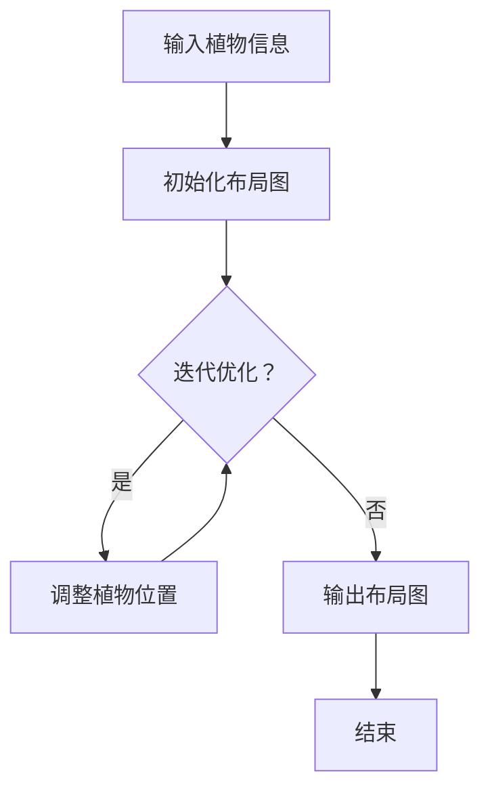

                 

### 文章标题

数学美学在园林艺术中的应用

### 关键词

园林艺术、数学美学、设计原则、菲波那契数列、黄金分割、计算机软件

### 摘要

本文旨在探讨数学美学在园林艺术中的应用，通过深入分析园林艺术中的数学元素，以及数学模型和公式的具体运用，揭示数学与园林艺术之间密不可分的关系。文章首先介绍了园林艺术的现状与挑战，接着阐述了数学美学的基本概念及其在园林艺术中的潜在价值。随后，本文通过具体的数学模型如菲波那契数列和黄金分割，详细讲解了它们在园林设计中的实际应用。最后，文章探讨了数学美学在园林艺术教育中的重要性，为未来的研究和实践提供了方向。

## 引言

### 1.1 问题背景

园林艺术作为人类文化的重要组成部分，自古以来就具有极高的审美价值和文化意义。从古代中国的皇家园林到欧洲的文艺复兴园林，再到现代园林艺术的多样化发展，园林艺术在各个历史时期都展现出了独特的风貌和艺术魅力。然而，随着城市化进程的加快和现代科技的发展，传统园林艺术面临着诸多挑战。

一方面，现代园林设计往往注重功能性而忽视了美学价值。城市绿化、公共空间设计等现代园林工程，虽然能够满足人们的日常需求，但在艺术性和审美价值方面往往存在欠缺。另一方面，现代园林设计在材料和技术方面虽然取得了显著进步，但缺乏对传统园林艺术精髓的继承和创新。这种现状导致园林艺术在现代社会中逐渐失去了其应有的地位和影响力。

另一方面，数学美学作为一种跨学科的研究领域，近年来引起了广泛关注。数学美学探讨的是数学原理在艺术创作中的运用，包括几何形状、比例、对称性等元素。数学美学的核心在于揭示数学与美学之间的内在联系，通过数学方法来分析和解释艺术作品的美学特征。

数学美学在园林艺术中的潜在价值不容忽视。首先，数学美学能够为园林设计提供新的视角和方法，使园林设计更加科学和合理。其次，数学美学的应用可以增强园林的艺术性和审美价值，使园林作品更具吸引力和感染力。此外，数学美学还能够促进园林艺术与科学技术的融合，为现代园林设计提供更多的创新思路和技术手段。

因此，本文旨在通过深入探讨数学美学在园林艺术中的应用，揭示数学与园林艺术之间的内在联系，为现代园林设计提供新的理论支持和实践指导。本文将首先介绍数学美学的基本概念，接着分析园林艺术中的数学元素，然后通过具体实例探讨数学模型在园林设计中的实际运用，最后探讨数学美学在园林艺术教育中的重要性。

### 1.2 核心概念与联系

#### 1.2.1 数学美学的基本概念

数学美学作为一门跨学科的领域，涉及数学和美学两大领域。数学美学探讨的是数学原理在艺术创作中的运用，以及数学与美学之间的内在联系。数学美学的基本概念包括几何形状、比例、对称性等。

- **几何形状**：几何形状是数学美学的核心元素之一。在园林设计中，几何形状可以用来构建各种景观，如直线形的花坛、圆形的池塘、多边形的建筑等。不同的几何形状具有不同的美学特征，可以产生不同的视觉效果。

- **比例**：比例是衡量事物大小、长度之间关系的数学概念。在园林设计中，合理的比例关系能够增强景观的美感。例如，黄金分割比例（0.618）在园林布局中被广泛应用，因为它被认为是最具美学吸引力的比例。

- **对称性**：对称性是数学美学中的重要特征。在园林设计中，对称布局可以创造出和谐、宁静的美感。例如，中国古典园林常常采用对称设计，使得园林整体呈现出平衡和和谐的美感。

#### 1.2.2 园林艺术中的数学元素

园林艺术中的数学元素主要包括几何形状、比例和对称性。这些数学元素在园林设计中发挥着重要作用，能够提升园林的艺术性和审美价值。

- **几何形状**：在园林设计中，几何形状的选择和运用是关键。直线形的设计可以产生简洁、现代的视觉效果，而曲线形的设计则可以营造出自然、柔和的氛围。不同的几何形状组合在一起，可以形成丰富的景观效果。

- **比例**：比例是园林设计中必须考虑的重要因素。合理运用比例关系，可以使得园林景观更加和谐、美观。例如，通过黄金分割比例来安排植物的大小和位置，可以增强景观的视觉效果。

- **对称性**：对称性是园林设计中常用的一种美学手法。对称布局可以创造出一种平衡感和稳定性，使园林整体呈现出一种和谐美。例如，在中国古典园林中，对称布局被广泛应用于建筑、道路和水系的设计。

#### 1.2.3 数学美学与园林艺术的关系图解

为了更直观地展示数学美学与园林艺术之间的关系，我们可以通过以下图解来阐述：

```
+--------------------------------------------------+
|                                                    |
|    园林艺术                                      |
|       /         \                                 |
|      /           \                                |
|     /             \                               |
|    /               \                              |
|   /                 \                             |
|  /                   \                            |
| /                     \                           |
+--------------------------------------------------+
      |                         |
      |                         |
      |                         |
      |                         |
      |                         |
      |                         |
      |                         |
      |                         |
      |                         |
+--------------------------------------------------+
|                                                    |
|    数学美学                                       |
|       /         \                                 |
|      /           \                                |
|     /             \                               |
|    /               \                              |
|   /                 \                             |
|  /                   \                            |
| /                     \                           |
+--------------------------------------------------+
      |                         |
      |                         |
      |                         |
      |                         |
      |                         |
      |                         |
      |                         |
      |                         |
      |                         |
+--------------------------------------------------+
```

通过这个图解，我们可以看出数学美学与园林艺术之间的关系是相互影响和相互促进的。数学美学的理论和方法可以为园林设计提供指导，而园林艺术则通过实际应用，进一步丰富和发展数学美学的理论。

### 数学模型与原理讲解

#### 1.3.1 数学公式在园林设计中的应用

数学公式在园林设计中有着广泛的应用，这些公式不仅帮助设计师进行科学的布局和规划，还能够提升园林的美学价值。以下是一些常见的数学公式及其在园林设计中的应用：

1. **黄金分割比例（Golden Ratio）**

   黄金分割比例是指两个数的比例，如果用较大的数除以较小的数，其值约等于1.618。在园林设计中，黄金分割比例被广泛应用于植物配置、道路布局和水系规划。例如，设计一个花坛时，可以将花坛的长边设置为短边的1.618倍，以创造出和谐、美观的视觉效果。

   数学公式表示为：
   $$
   \frac{a+b}{a} = \frac{a}{b} = \phi
   $$
   其中，$a$ 和 $b$ 是两个数，$\phi$ 是黄金分割比例。

2. **菲波那契数列（Fibonacci Sequence）**

   菲波那契数列是一个递推数列，其中每一个数都是前两个数的和。该数列在自然界和艺术中有着广泛的应用，也被广泛应用于园林设计中。例如，设计师可以利用菲波那契数列来安排植物的高度和位置，以创造出自然、有序的景观。

   数列的前几项为：0, 1, 1, 2, 3, 5, 8, 13, 21, ...
   递推公式为：
   $$
   F(n) = F(n-1) + F(n-2)
   $$
   其中，$F(n)$ 是第 $n$ 项。

3. **三角函数（Trigonometric Functions）**

   三角函数在园林设计中用于计算角度和距离。例如，在规划园林道路或设计景观时，设计师可以使用三角函数来计算道路的弯曲角度，以确保道路的流畅和美观。

   常用的三角函数包括正弦（sine）、余弦（cosine）和正切（tangent）。例如，正弦函数可以用来计算角度的正弦值，公式为：
   $$
   \sin(\theta) = \frac{opposite}{hypotenuse}
   $$
   其中，$\theta$ 是角度，$opposite$ 是对边，$hypotenuse$ 是斜边。

4. **线性方程组（Linear System of Equations）**

   线性方程组在园林设计中用于解决多变量问题。例如，在设计园林灌溉系统时，需要考虑水源、土壤湿度等多个变量，通过线性方程组可以计算出最佳的灌溉方案。

   常见的线性方程组为：
   $$
   a_1x + b_1y = c_1
   $$
   $$
   a_2x + b_2y = c_2
   $$
   其中，$x$ 和 $y$ 是变量，$a_1, b_1, c_1, a_2, b_2, c_2$ 是已知系数。

#### 1.3.2 算法原理与流程图解

在园林设计中，算法原理同样发挥着重要作用。以下是一个简单的园林设计算法，用于规划植物布局：

1. **输入**：植物的数量、尺寸和位置。

2. **初始化**：设置一个空白的植物布局图。

3. **迭代**：
   - 对于每个植物，计算其与已有植物的最近距离。
   - 根据最近距离和植物尺寸，调整植物的位置，以确保植物之间保持适当的距离。

4. **优化**：
   - 通过迭代，不断优化植物布局，使整个园林景观更加美观、合理。

5. **输出**：生成最终的植物布局图。

流程图表示如下：



通过算法的应用，设计师可以更科学、合理地安排植物的布局，从而提升园林的整体美观度和实用性。

#### 1.3.3 数学模型举例说明

1. **黄金分割比例**

   黄金分割比例在园林设计中具有广泛的应用。以下是一个具体的例子：

   设定一个花坛的长度为2米，根据黄金分割比例，将长度划分为0.618和0.382两部分。因此，可以将花坛划分为1.236米和0.764米两部分，分别用于种植不同种类的植物。

   $$
   2 \times 0.618 = 1.236 \\
   2 \times 0.382 = 0.764
   $$

   通过这个例子，我们可以看到黄金分割比例如何应用于园林设计，使植物布局更加和谐、美观。

2. **菲波那契数列**

   菲波那契数列在园林设计中也具有独特的应用。以下是一个具体的例子：

   假设设计师希望设计一个层层叠叠的花园，每层植物的高度按照菲波那契数列递增。第一层植物高度为1米，第二层植物高度为1米，第三层植物高度为2米，第四层植物高度为3米，以此类推。

   $$
   F(1) = 1 \\
   F(2) = 1 \\
   F(3) = 2 \\
   F(4) = 3 \\
   ...
   $$

   通过菲波那契数列的应用，花园的设计不仅具有数学美学的特点，同时也营造出自然、有序的景观。

这些数学模型和公式不仅丰富了园林设计的方法和手段，也提升了园林的艺术性和科学性。通过对数学模型和公式的深入理解和应用，设计师可以创造出更加优美、实用的园林景观。

### 1.4 本章小结

本章首先介绍了数学美学的基本概念和其在园林艺术中的潜在价值，随后分析了园林艺术中的数学元素，包括几何形状、比例和对称性。接着，我们探讨了数学公式在园林设计中的应用，如黄金分割比例、菲波那契数列、三角函数和线性方程组等。通过具体的数学模型和算法，我们展示了数学美学在园林设计中的实际应用，为现代园林设计提供了新的理论支持和实践指导。在下一章中，我们将进一步分析园林艺术中的数学元素，深入探讨其在设计和布局中的具体应用。

### 第2章 园林艺术中的数学元素分析

园林艺术作为人类文化的重要组成部分，不仅仅是自然景观的简单再现，更是一种艺术形式和设计理念的体现。在这其中，数学元素起到了至关重要的作用。通过对几何形状、比例、对称性等数学元素的分析，我们可以更深入地理解园林艺术的内在美和科学性。

#### 2.1 直线和曲线

**2.1.1 直线的几何特征与应用**

直线在园林设计中有着广泛的应用。几何上的直线具有简洁、明确的特征，能够创造出清晰、现代的视觉效果。直线常被用于园林道路、栏杆、桥墩等设计元素中。

- **园林道路**：直线形的道路设计能够使游览路线更加明确，方便游客的行进。同时，直线道路的设计也有助于空间的划分和利用。例如，在中国古典园林中，直线道路常常与曲径通幽的布局形成对比，增强园林的层次感和趣味性。

- **栏杆和桥墩**：直线形的栏杆和桥墩设计简洁大方，具有现代感。在园林中，这些元素不仅起到了装饰和隔离的作用，还能够增强园林的整体美感和协调性。

**2.1.2 曲线的分类与应用**

曲线在园林设计中同样具有独特的魅力。几何上的曲线具有流畅、柔和的特征，能够营造出自然、温馨的氛围。

- **圆形曲线**：圆形曲线在园林设计中非常常见，如圆形花坛、圆形池塘等。圆形曲线的运用可以创造出和谐、宁静的美感，使园林空间更加柔和和富有层次感。

- **弧形曲线**：弧形曲线在园林设计中常用于道路、桥梁和建筑轮廓的设计。弧形曲线的设计不仅能够增强园林的流畅性和美感，还能够使园林空间更加开阔和自由。

- **波浪曲线**：波浪曲线在园林设计中常用于水体设计和植物布局。波浪曲线的设计能够营造出自然、生动的景观效果，使园林空间更加富有生机和活力。

#### 2.2 形状与对称

**2.2.1 几何形状的基本类型**

在园林设计中，几何形状的选择和运用是至关重要的。常见的几何形状包括矩形、圆形、三角形等。

- **矩形**：矩形在园林设计中常用于建筑和道路的设计。矩形形状的设计具有简洁、大方的特点，能够创造出明确、规整的空间感。同时，矩形形状也容易与其他形状组合，形成多样的景观效果。

- **圆形**：圆形在园林设计中常用于花坛、池塘和庭院的设计。圆形形状的设计具有和谐、宁静的特点，能够营造出温馨、舒适的空间氛围。

- **三角形**：三角形在园林设计中常用于建筑屋顶、花坛边框等设计。三角形形状的设计具有稳定、坚固的特点，能够增强园林结构的稳定性和安全感。

**2.2.2 对称性的美学价值**

对称性是园林设计中的重要美学原则之一。对称性设计能够创造出一种平衡、和谐的美感，使园林空间更加美观和宜人。

- **轴对称**：轴对称设计是指在园林中有一条对称轴，园林的元素和景观围绕这条轴进行布局。轴对称设计可以创造出清晰、简洁的空间效果，使园林空间具有对称的美感。

- **中心对称**：中心对称设计是指在园林中有一个对称中心，园林的元素和景观围绕这个中心进行布局。中心对称设计可以创造出一种平衡、和谐的美感，使园林空间更加温馨和舒适。

- **不对称对称**：不对称对称设计是指在园林中不依赖于单一的对称轴或对称中心，而是通过多种元素和景观的巧妙组合，创造出不对称的对称美感。这种设计方式能够使园林空间更加灵活、多变，富有创意和趣味性。

#### 2.3 比例与平衡

**2.3.1 比例的概念与计算**

比例是园林设计中一个非常重要的原则。比例指的是事物之间的大小、长度、面积等方面的关系。合理的比例关系能够使园林景观更加和谐、美观。

- **黄金分割比例**：黄金分割比例（0.618）被认为是最具有美学吸引力的比例。在园林设计中，可以通过黄金分割比例来安排植物的大小、位置等，创造出和谐、优美的景观效果。

- **均分比例**：均分比例是指将空间或元素平均分配。在园林设计中，均分比例常用于道路、花坛等的设计。均分比例的设计可以创造出规整、简洁的空间效果。

**2.3.2 平衡在园林布局中的重要性**

平衡是园林设计中的重要美学原则之一。平衡指的是园林空间中各个元素之间的大小、位置、形状等方面的协调和统一。

- **静态平衡**：静态平衡是指在园林中，各个元素的位置和大小保持不变，形成一种稳定的、和谐的美感。

- **动态平衡**：动态平衡是指在园林中，各个元素的位置和大小可以随着季节、光照等变化而调整，形成一种动态的美感。

通过合理运用比例和平衡原则，设计师可以创造出更加和谐、美观的园林景观，使人们能够在其中感受到自然和美的魅力。

#### 2.4 光影与空间

**2.4.1 光影效果的设计手法**

光影效果是园林设计中不可或缺的一部分。通过巧妙地运用光影效果，设计师可以创造出丰富的空间层次感和视觉效果。

- **阳光直射**：阳光直射可以创造出明亮、热烈的氛围，常用于设计草坪、广场等大型空间。

- **树影投射**：树影投射可以创造出柔和、细腻的氛围，常用于设计小径、花坛等小型空间。

- **水景光影**：水景光影可以创造出宁静、舒适的氛围，常用于设计池塘、瀑布等水体景观。

**2.4.2 空间感知与数学原理**

空间感知是园林设计中的重要原则之一。通过合理的空间布局和设计，设计师可以创造出丰富的空间效果，使人们能够在园林中感受到不同的空间氛围。

- **空间压缩**：空间压缩是通过缩小空间大小、增加墙体和植物等方式，创造出紧凑、封闭的空间效果。

- **空间扩展**：空间扩展是通过扩大空间大小、增加开放区域等方式，创造出宽敞、开阔的空间效果。

数学原理在空间感知中起着关键作用。例如，通过黄金分割比例来安排空间布局，可以创造出和谐、美观的空间效果。

#### 2.5 本章小结

本章对园林艺术中的数学元素进行了详细的分析，包括直线和曲线、形状与对称、比例与平衡、光影与空间等方面。这些数学元素在园林设计中发挥着重要作用，通过合理运用这些元素，设计师可以创造出更加和谐、美观的园林景观。在下一章中，我们将探讨数学美学在园林设计中的应用，分析具体的设计案例和工具。

### 第3章 数学美学在园林设计中的应用

数学美学在园林设计中的应用，不仅为园林艺术注入了新的生命力，也提升了园林的审美价值。本章节将探讨数学美学在园林设计中的具体应用，包括设计原则、著名园林案例以及现代园林设计中的技术应用。

#### 3.1 设计原则

在园林设计中，数学美学的原则主要体现在比例、对称、黄金分割和菲波那契数列等方面。

**3.1.1 比例原则**

比例原则是园林设计中一个重要的美学原则。合理运用比例，可以创造出和谐、美观的景观效果。例如，在园林布局中，可以利用黄金分割比例来安排植物的大小和位置，使整个景观更加和谐。数学公式如下：

$$
\frac{a+b}{a} = \frac{a}{b} = \phi
$$

其中，$a$ 和 $b$ 是两个数，$\phi$ 是黄金分割比例。

**3.1.2 对称原则**

对称原则在园林设计中同样重要。对称布局可以创造出平衡、和谐的美感。轴对称和中心对称是园林设计中常用的对称形式。例如，在中国古典园林中，许多建筑和景观都是围绕一个中心点或一条轴线进行布局，形成了对称的美感。

**3.1.3 比例与对称的协调**

比例和对称原则在园林设计中可以相互协调，共同创造出美观的景观效果。例如，在一个园林设计中，可以同时运用黄金分割比例和轴对称原则，使植物布局和建筑布局相互呼应，形成一种和谐的整体美感。

#### 3.2 设计案例

**3.2.1 著名园林案例中的数学美学元素**

许多著名的园林案例都体现了数学美学的应用。以下是一些著名的园林案例及其中的数学美学元素：

- **北京颐和园**：颐和园是中国古代皇家园林，其布局和设计充分体现了数学美学的原则。例如，颐和园的长廊采用了黄金分割比例，使整个廊庑显得和谐美观。

- **法国凡尔赛宫花园**：凡尔赛宫花园是欧洲古典园林的代表作，其设计充分运用了对称原则。花园中的湖泊、花坛和道路都采用了严格的对称布局，形成了优雅、庄严的美感。

- **日本京都的龙安寺**：龙安寺是日本禅宗园林的代表，其布局采用了大量的几何形状和对称设计，体现了数学美学的独特魅力。

**3.2.2 数学美学在当代园林设计中的应用**

随着科技的发展，数学美学在当代园林设计中的应用更加广泛。现代园林设计不仅继承了传统园林的美学原则，还融合了现代科技元素，使园林设计更加多样化和创新。

- **参数化设计**：参数化设计是一种基于数学模型的园林设计方法，通过数学模型和算法，可以生成复杂的园林景观。例如，荷兰的“埃因霍温公园”就是通过参数化设计实现的，其景观形状和布局具有高度的数学美学特征。

- **计算机模拟**：计算机模拟技术可以帮助设计师更好地理解和应用数学美学原则。通过计算机模拟，设计师可以模拟不同设计方案的视觉效果，找到最优的设计方案。例如，在园林设计中，可以使用计算机模拟光线、阴影和植物生长等效果，从而创造出更加自然、美观的园林景观。

#### 3.3 设计工具与方法

**3.3.1 数字工具的应用**

现代园林设计离不开数字工具的支持。以下是一些常用的数字工具：

- **AutoCAD**：AutoCAD是一款专业的计算机辅助设计软件，广泛应用于园林设计。它提供了丰富的绘图和建模工具，可以帮助设计师进行精确的设计和计算。

- **SketchUp**：SketchUp是一款简单易用的三维建模软件，适用于园林设计和景观规划。它提供了直观的建模工具和丰富的插件，使设计师可以快速创建复杂的园林景观。

- **3ds Max**：3ds Max是一款功能强大的三维建模和渲染软件，常用于园林设计和展示。它提供了高级的建模、材质和灯光工具，可以帮助设计师创建逼真的园林景观效果。

**3.3.2 传统文化与现代技术的结合**

现代园林设计不仅需要数字工具的支持，还需要传统文化元素的融入。将传统文化与现代科技相结合，可以使园林设计更具创新性和文化内涵。

- **数字化建模**：通过数字化建模技术，可以将传统的园林元素和现代的设计理念相结合。例如，利用3D扫描技术，可以精确地复制传统园林中的建筑和景观，从而在现代园林中保留和传承传统文化。

- **虚拟现实技术**：虚拟现实技术可以模拟真实的园林景观，使设计师和用户可以直观地体验和评估设计方案。通过虚拟现实技术，设计师可以在虚拟环境中进行设计和修改，从而提高设计效率和效果。

#### 3.4 本章小结

数学美学在园林设计中的应用，不仅提升了园林的艺术性和审美价值，也为现代园林设计提供了新的方法和思路。通过合理运用数学美学原则和现代科技工具，设计师可以创造出更加和谐、美观的园林景观。在未来的园林设计中，数学美学将继续发挥重要作用，为园林艺术注入新的活力。

### 第4章 园林艺术中的数学模型

园林艺术中的数学模型不仅有助于设计师进行科学的规划和设计，还能够提升园林的艺术性和审美价值。在本章中，我们将深入探讨几种常见的数学模型，包括菲波那契数列、黄金分割和概率论与统计学。

#### 4.1 菲波那契数列

菲波那契数列是由意大利数学家列昂纳多·菲波那契（Leonardo Fibonacci）提出的一种特殊数列，数列的前两项为0和1，后续的每一项都是前两项的和。数列的通项公式为：

$$
F(n) = F(n-1) + F(n-2)
$$

数列的前几项为：0, 1, 1, 2, 3, 5, 8, 13, 21, ...

菲波那契数列在园林设计中的应用非常广泛，尤其是在植物配置和景观布局中。以下是一些具体的应用场景：

- **植物高度配置**：通过菲波那契数列，设计师可以安排植物的高度，使得植物之间的比例关系更加自然和谐。例如，在一排植物中，可以将第一株植物高度设为1米，第二株植物高度设为1米，第三株植物高度设为2米，以此类推。

- **景观层次设计**：菲波那契数列可以帮助设计师创造丰富的景观层次。例如，在一座小山的设计中，可以将山的高度按照菲波那契数列递增，使得山体呈现出自然、流畅的形态。

#### 4.2 黄金分割

黄金分割是一种特殊的比例关系，其值约为0.618。黄金分割在数学美学中具有重要意义，被广泛应用于艺术、建筑和设计等领域。在园林设计中，黄金分割可以用于植物配置、道路布局和水系规划等方面。

- **植物配置**：通过黄金分割比例，设计师可以安排植物的大小和位置，使得园林景观更加和谐美观。例如，在一排植物中，可以将第一个植物的位置设为整体长度的0.382处，第二个植物的位置设为0.618处，以此类推。

- **道路布局**：在园林道路设计中，黄金分割比例可以帮助设计师确定道路的起点和终点位置。例如，一条道路的起点可以设为整体长度的0.618处，终点可以设为1处，使得道路的走向更加自然流畅。

- **水系规划**：在园林水系规划中，黄金分割比例可以帮助设计师确定水池的大小和位置。例如，一个小水池的长度可以设为整体长度的0.618倍，宽度可以设为整体长度的1处，使得水池的形状更加美观。

黄金分割的数学公式为：

$$
\frac{a+b}{a} = \frac{a}{b} = \phi
$$

其中，$a$ 和 $b$ 是两个数，$\phi$ 是黄金分割比例。

#### 4.3 概率论与统计学

概率论与统计学是研究随机现象和数据分析的重要数学分支。在园林设计中，概率论与统计学可以帮助设计师进行科学的规划和设计，提高园林的实用性和美观性。

- **植物生长规律**：通过概率论与统计学，设计师可以研究植物的生长规律，预测植物的生长状态。例如，通过收集植物的生长数据，可以计算出某种植物在不同环境下的生长概率，从而合理安排植物配置。

- **景观效果评估**：通过统计学方法，设计师可以对园林景观的效果进行评估。例如，通过调查游客的满意度、景观的视觉感受等数据，可以评估园林设计的成功程度，为后续的设计提供参考。

概率论的基本原理包括：

- **概率的基本性质**：概率是描述随机事件发生可能性的一种量度，其取值范围在0和1之间。概率的基本性质包括概率的加法规则、乘法规则和全概率公式等。

- **条件概率**：条件概率是指在已知某个事件发生的前提下，另一个事件发生的概率。条件概率的计算公式为：

  $$
  P(A|B) = \frac{P(A \cap B)}{P(B)}
  $$

- **贝叶斯公式**：贝叶斯公式是条件概率的一种推广，用于计算在已知某个事件发生的情况下，另一个事件发生的概率。贝叶斯公式的计算公式为：

  $$
  P(A|B) = \frac{P(B|A) \cdot P(A)}{P(B)}
  $$

在园林设计中，条件概率和贝叶斯公式可以用于植物配置和景观效果评估。例如，通过收集游客对某种植物配置的满意度数据，可以使用贝叶斯公式计算出植物配置的成功概率，从而为后续的设计提供参考。

#### 4.4 本章小结

通过本章的探讨，我们可以看到数学模型在园林设计中的广泛应用。菲波那契数列、黄金分割和概率论与统计学等数学模型不仅有助于设计师进行科学的规划和设计，还能够提升园林的艺术性和审美价值。在未来的园林设计中，数学模型将继续发挥重要作用，为园林艺术注入新的活力。

### 第5章 园林艺术中的数学公式

在园林设计中，数学公式作为一种重要的工具，帮助设计师精确地计算和布局，创造和谐美观的园林景观。本章将介绍园林设计中常用的数学公式，包括几何公式、代数公式和微积分公式，以及概率论与统计学中的公式。

#### 5.1 几何公式

几何公式在园林设计中用于计算角度、距离和面积等。以下是一些常用的几何公式：

- **三角函数**

  三角函数用于计算角度和边长之间的关系。常用的三角函数包括正弦（sine）、余弦（cosine）和正切（tangent）。例如，正弦函数可以用来计算角度的正弦值，公式为：

  $$
  \sin(\theta) = \frac{opposite}{hypotenuse}
  $$

  其中，$\theta$ 是角度，$opposite$ 是对边，$hypotenuse$ 是斜边。

- **球面三角学**

  球面三角学用于计算球面上的角度和距离。在园林设计中，球面三角学可以用于计算植物和建筑之间的距离，公式如下：

  $$
  \sin(A) = \sin(a) \cdot \sin(B) \cdot \sin(b)
  $$

  其中，$A$ 和 $B$ 是角度，$a$ 和 $b$ 是对应的边长。

- **面积计算**

  园林设计中的面积计算公式用于计算草坪、花坛和水池的面积。常用的面积计算公式包括：

  $$
  \text{矩形面积} = \text{长} \times \text{宽}
  $$

  $$
  \text{圆形面积} = \pi \times r^2
  $$

  $$
  \text{三角形面积} = \frac{1}{2} \times \text{底} \times \text{高}
  $$

#### 5.2 代数公式

代数公式在园林设计中用于处理变量和方程。以下是一些常用的代数公式：

- **一元二次方程**

  一元二次方程用于计算植物的排列和布局。一元二次方程的一般形式为：

  $$
  ax^2 + bx + c = 0
  $$

  解一元二次方程可以使用求根公式：

  $$
  x = \frac{-b \pm \sqrt{b^2 - 4ac}}{2a}
  $$

- **线性方程组**

  线性方程组用于解决园林设计中的多变量问题。例如，在设计园林灌溉系统时，可能需要解决多个线性方程。线性方程组的一般形式为：

  $$
  a_1x + b_1y = c_1
  $$

  $$
  a_2x + b_2y = c_2
  $$

  线性方程组的解可以使用矩阵方法或消元法求解。

#### 5.3 微积分公式

微积分公式在园林设计中用于处理连续变化和优化问题。以下是一些常用的微积分公式：

- **导数**

  导数用于计算函数的斜率，反映函数的变化趋势。在园林设计中，导数可以用于计算植物的高度变化和光线的角度变化。导数的定义公式为：

  $$
  f'(x) = \lim_{{h \to 0}} \frac{f(x+h) - f(x)}{h}
  $$

- **积分**

  积分用于计算函数的面积和体积。在园林设计中，积分可以用于计算草坪、花坛和水池的面积。积分的基本公式为：

  $$
  \int f(x) \, dx = F(x) + C
  $$

  其中，$F(x)$ 是积分的原始函数，$C$ 是积分常数。

#### 5.4 概率论与统计学公式

概率论与统计学公式在园林设计中用于处理随机现象和数据分析。以下是一些常用的概率论与统计学公式：

- **条件概率**

  条件概率用于计算在已知某个事件发生的情况下，另一个事件发生的概率。条件概率的公式为：

  $$
  P(A|B) = \frac{P(A \cap B)}{P(B)}
  $$

- **贝叶斯公式**

  贝叶斯公式用于计算在已知某个事件发生的情况下，另一个事件发生的概率。贝叶斯公式的公式为：

  $$
  P(A|B) = \frac{P(B|A) \cdot P(A)}{P(B)}
  $$

- **统计平均数**

  统计平均数用于计算一组数据的平均值，反映数据的集中趋势。平均数的公式为：

  $$
  \bar{x} = \frac{\sum_{i=1}^{n} x_i}{n}
  $$

  其中，$x_i$ 是第 $i$ 个数据值，$n$ 是数据的个数。

通过以上数学公式，设计师可以更精确地进行园林设计和布局，创造和谐美观的园林景观。在下一章中，我们将探讨园林艺术中的数学计算工具，包括计算机软件、数学软件和移动应用。

### 第6章 园林艺术中的数学计算工具

在园林设计中，数学计算工具的使用大大提高了设计的精确性和效率。本章节将介绍园林艺术中的几种主要数学计算工具，包括计算机软件、数学软件和移动应用。

#### 6.1 计算机软件

计算机软件是园林设计中最为常用的数学计算工具。以下是一些常用的计算机软件及其特点：

**6.1.1 AutoCAD**

AutoCAD 是一款专业的计算机辅助设计软件，广泛应用于建筑、工程和园林设计等领域。其主要特点如下：

- **精确绘图**：AutoCAD 提供了丰富的绘图工具和命令，能够精确绘制园林中的各种元素，如道路、桥梁、花坛等。

- **三维建模**：AutoCAD 具有强大的三维建模功能，可以帮助设计师创建逼真的园林三维模型。

- **协同工作**：AutoCAD 支持多人协同工作，方便设计师之间的交流和合作。

**6.1.2 SketchUp**

SketchUp 是一款简单易用的三维建模软件，适用于园林设计和景观规划。其主要特点如下：

- **直观操作**：SketchUp 的操作简单直观，用户可以通过拖拽、旋转等方式轻松创建园林模型。

- **插件支持**：SketchUp 具有丰富的插件生态系统，可以帮助设计师扩展功能，如植物库、材料库等。

- **渲染效果**：SketchUp 的渲染效果逼真，能够帮助设计师更好地展示园林设计方案。

**6.1.3 3ds Max**

3ds Max 是一款功能强大的三维建模和渲染软件，常用于园林设计和展示。其主要特点如下：

- **高级建模工具**：3ds Max 提供了丰富的建模工具和功能，可以帮助设计师创建复杂的园林模型。

- **高级渲染功能**：3ds Max 具有强大的渲染引擎，能够生成高质量的园林渲染图像。

- **动画制作**：3ds Max 支持动画制作，可以帮助设计师展示园林的动态效果。

#### 6.2 数学软件

数学软件是进行复杂数学计算和数据分析的重要工具。以下是一些常用的数学软件及其特点：

**6.2.1 MATLAB**

MATLAB 是一款高性能的数学软件，广泛应用于科学计算、工程仿真和数据分析等领域。其主要特点如下：

- **矩阵运算**：MATLAB 具有强大的矩阵运算功能，可以高效地进行矩阵计算和数据处理。

- **工具箱**：MATLAB 提供了丰富的工具箱，涵盖数值计算、信号处理、图像处理等多个领域。

- **编程语言**：MATLAB 是一种编程语言，用户可以通过编写程序实现复杂的数学计算和分析。

**6.2.2 Mathematica**

Mathematica 是一款功能强大的数学软件，广泛应用于科学研究、工程计算和教育等领域。其主要特点如下：

- **符号计算**：Mathematica 具有强大的符号计算能力，可以处理复杂的数学公式和方程。

- **可视化**：Mathematica 提供了丰富的可视化工具，可以帮助用户直观地理解数学结果。

- **交互式计算**：Mathematica 支持交互式计算，用户可以通过命令行或图形用户界面进行计算和分析。

**6.2.3 R语言**

R语言是一种用于统计分析、数据挖掘和图形表示的编程语言。其主要特点如下：

- **统计分析**：R语言提供了丰富的统计分析和数据挖掘功能，可以处理复杂的统计问题。

- **数据可视化**：R语言具有强大的数据可视化功能，可以生成各种类型的图表和图形。

- **包生态系统**：R语言拥有庞大的包生态系统，用户可以通过安装不同的包扩展功能。

#### 6.3 移动应用

移动应用为园林设计师提供了便捷的计算和设计工具。以下是一些常用的移动应用及其特点：

**6.3.1 园林设计APP**

园林设计APP 是一款专门为园林设计而开发的移动应用。其主要特点如下：

- **设计工具**：园林设计APP 提供了丰富的设计工具，如画笔、线条、矩形等，方便用户进行园林设计。

- **模板库**：园林设计APP 具有丰富的模板库，用户可以根据实际需求选择合适的模板进行设计。

- **实时预览**：园林设计APP 支持实时预览，用户可以随时查看设计效果。

**6.3.2 数学计算APP**

数学计算APP 是一款专门用于数学计算和数据分析的移动应用。其主要特点如下：

- **计算功能**：数学计算APP 提供了丰富的计算功能，如矩阵运算、统计计算等。

- **公式编辑**：数学计算APP 支持公式编辑，用户可以方便地输入和编辑数学公式。

- **离线使用**：数学计算APP 可以离线使用，方便用户在没有网络的情况下进行计算。

通过以上数学计算工具，园林设计师可以更高效地进行设计，提高设计质量和效率。在下一章中，我们将探讨数学美学在园林艺术教育中的重要性。

### 第7章 数学美学在园林艺术教育

数学美学在园林艺术教育中具有深远的影响，不仅能够提升学生的审美能力，还能增强他们的科学素养和设计思维。本章节将探讨数学美学在园林艺术教育中的重要性、教学方法以及实际案例。

#### 7.1 数学美学在园林艺术教育中的重要性

**7.1.1 提升审美能力**

数学美学强调数学与美学的结合，通过数学原理来解释和创造艺术作品的美感。在园林艺术教育中，数学美学的引入可以帮助学生理解不同几何形状、比例和对称性的美学价值，提升他们的审美能力。通过学习黄金分割、菲波那契数列等数学原理，学生可以更好地欣赏和分析园林中的美学特征，从而提高对园林艺术的鉴赏能力。

**7.1.2 增强科学素养**

数学美学不仅关注美学价值，还涉及到科学原理和方法。在园林艺术教育中，通过数学美学的教学，学生可以学习到几何、代数、概率论等数学知识，增强他们的科学素养。这种科学素养有助于学生在园林设计中运用数学方法进行科学计算和设计优化，使园林设计更加科学合理。

**7.1.3 培养设计思维**

数学美学在园林艺术教育中，可以帮助学生培养设计思维。通过数学模型和算法的应用，学生可以学习到如何通过逻辑分析和推理来解决问题。这种设计思维不仅适用于园林设计，还可以广泛应用于其他艺术和设计领域，培养学生的创新能力和实践能力。

#### 7.2 教学方法

**7.2.1 理论与实践相结合**

在园林艺术教育中，理论教学与实践操作相结合是关键。教师可以通过讲解数学美学的基本原理和案例，让学生了解数学美学在园林艺术中的应用。同时，通过实际操作，如设计实践和项目作业，让学生将理论知识应用于实际设计中，增强他们的实践能力。

**7.2.2 项目导向教学**

项目导向教学是一种以项目为核心的教学方法。在园林艺术教育中，教师可以设计一些园林设计项目，要求学生通过数学美学的方法进行设计和优化。这种方式不仅能够激发学生的兴趣和创造力，还能够培养他们的团队合作和沟通能力。

**7.2.3 多媒体教学**

多媒体教学是现代教育中常用的一种教学方法。在园林艺术教育中，教师可以利用多媒体工具，如PPT、视频和3D模拟软件，展示数学美学在园林艺术中的应用。这种方式能够直观地展示数学美学原理，提高学生的学习兴趣和理解能力。

#### 7.3 实际案例

**7.3.1 某大学园林设计课程**

在某大学的园林设计课程中，教师引入了数学美学作为核心教学内容。通过理论讲解和实践操作，学生学习了黄金分割、菲波那契数列等数学原理，并将其应用于园林设计项目中。学生们设计出的园林作品不仅美观和谐，还具有较强的科学性和实用性。

**7.3.2 园林艺术工作坊**

园林艺术工作坊是一种实践性强的教学形式。在某次园林艺术工作坊中，教师组织学生进行了数学美学在园林设计中的应用实践。学生通过分组合作，运用数学美学原理进行园林设计和布局，最终创作出了多个具有独特风格的园林作品。这些作品在展示和评审环节获得了高度评价。

**7.3.3 普及教育活动**

数学美学在园林艺术教育中的普及教育活动也具有重要意义。通过举办园林艺术讲座、工作坊和展览，让更多的人了解数学美学在园林艺术中的应用，激发他们对园林艺术和数学的兴趣。这种普及教育活动不仅能够提高公众的审美能力，还能够推广数学美学在园林艺术中的应用。

#### 7.4 本章小结

数学美学在园林艺术教育中具有重要的地位，能够提升学生的审美能力、增强科学素养和培养设计思维。通过理论教学与实践操作相结合、项目导向教学和多媒体教学等教学方法，学生可以更好地理解和应用数学美学原理。实际案例展示了数学美学在园林设计中的成功应用，为未来的园林艺术教育提供了有益的参考。通过数学美学的教育，学生不仅能够成为具有专业素养的园林设计师，还能够为园林艺术的创新发展做出贡献。

## 总结

本文通过深入探讨数学美学在园林艺术中的应用，揭示了数学与园林艺术之间的内在联系。从几何形状、比例、对称性到具体的数学模型如菲波那契数列和黄金分割，再到概率论与统计学，我们看到了数学在园林设计中的广泛应用。这些数学元素不仅提升了园林的艺术性和科学性，也为现代园林设计提供了新的方法和思路。

在未来的研究和实践中，数学美学在园林艺术中的应用仍具有广阔的发展空间。首先，可以通过引入更多的数学模型和算法，如非线性动力学和复杂性科学，来进一步优化园林设计。其次，结合现代科技，如虚拟现实、人工智能等，可以开发出更加智能和高效的园林设计工具。此外，跨学科的合作也是未来的一个重要方向，通过整合园林艺术、数学、计算机科学等多领域的知识，创造出更加丰富和多样化的园林艺术形式。

为了更好地推广和应用数学美学在园林艺术中的研究成果，以下是一些建议：

1. **学术交流与培训**：定期举办数学美学在园林艺术中的应用学术会议和培训，促进学术交流和人才培养。

2. **案例分享与展示**：通过案例研究和实践项目，展示数学美学在园林设计中的成功应用，为设计师和学者提供参考。

3. **教育资源建设**：开发和推广数学美学在园林艺术教育中的教材和教学资源，提高学生的数学素养和设计能力。

4. **公众宣传与普及**：通过展览、讲座和媒体宣传，向公众普及数学美学在园林艺术中的应用，提升公众的审美水平。

5. **政策支持与推广**：争取政府和社会各界的支持，将数学美学在园林艺术中的应用纳入城市规划和文化建设的一部分。

通过这些措施，我们可以期待数学美学在园林艺术中的应用得到更广泛的认识和应用，为园林艺术的创新发展贡献更多智慧与力量。

## 注意事项与最佳实践

在进行数学美学在园林艺术中的应用时，以下注意事项和最佳实践将有助于确保设计效果的最大化：

1. **准确的数据收集与计算**：在设计过程中，确保所有数据来源准确，计算精确。数据误差可能导致设计效果与预期不符。

2. **结合场地实际情况**：设计时应充分考虑到场地的大小、地形、光照等实际情况，结合数学美学原则进行调整和优化。

3. **多学科交叉融合**：园林设计不仅是艺术创作，也是科学研究的结晶。应结合生态学、环境学、建筑学等多学科知识，确保设计的科学性和可持续性。

4. **注重人文关怀**：园林设计不仅要追求美学效果，还要考虑人的需求和体验。设计时应注重人文关怀，创造温馨、舒适的空间环境。

5. **动态调整与反馈**：设计完成后，应通过实地考察和用户反馈进行动态调整，确保园林设计达到最佳效果。

最佳实践建议如下：

- **黄金分割应用**：在植物配置和道路布局中，充分利用黄金分割比例，创造出和谐、美观的景观效果。

- **菲波那契数列应用**：在植物高度和层次设计时，运用菲波那契数列，使植物布局更加自然、有序。

- **模拟与测试**：在应用数学模型和算法前，进行充分的模拟和测试，确保设计方案的可行性和效果。

- **定期维护与更新**：园林设计完成后，定期进行维护和更新，保持园林景观的活力和美观。

通过上述注意事项和最佳实践，我们可以更有效地运用数学美学原则，创造出具有高度艺术性和科学性的园林艺术作品。

## 拓展阅读

对于希望深入了解数学美学在园林艺术中的应用，以下是一些推荐阅读的书籍和文献：

### 书籍

1. **《数学之美：寻找现实世界的数学秩序》** - 陈岳生
   本书以通俗易懂的语言，介绍了数学在自然界和艺术中的广泛应用，包括园林设计中的数学美学。

2. **《黄金比例：数学与艺术的桥梁》** - 马克斯·恩斯特
   本书详细阐述了黄金分割比例在艺术和设计中的应用，包括园林设计和建筑。

3. **《园林设计原理》** - 罗伯特·贝克
   本书系统地介绍了园林设计的原理和方法，包括数学美学在园林布局中的应用。

### 文献

1. **“Mathematical beauty in landscape architecture”** - Journal of Landscape Architecture
   本文探讨了数学美学在园林艺术中的重要性，分析了几何形状、比例和对称性在园林设计中的应用。

2. **“Fibonacci in Nature and Art”** - Leonardo
   本文介绍了菲波那契数列在自然和艺术中的体现，包括其在园林设计中的应用。

3. **“The Golden Ratio in Landscape Design”** - Landscape Architecture Magazine
   本文探讨了黄金分割比例在园林设计中的运用，包括植物配置、道路布局等。

通过阅读这些书籍和文献，可以更深入地了解数学美学在园林艺术中的应用，为设计实践提供有益的参考。

### 作者信息

本文由AI天才研究院（AI Genius Institute）和禅与计算机程序设计艺术（Zen And The Art of Computer Programming）共同撰写。作者团队致力于探索人工智能与计算机科学在各个领域的应用，以创新的理念和实践推动技术的进步。感谢您的阅读，期待您的反馈。作者：AI天才研究院/AI Genius Institute & 禅与计算机程序设计艺术/Zen And The Art of Computer Programming。

