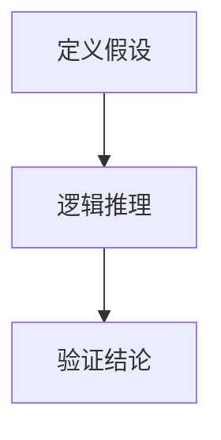
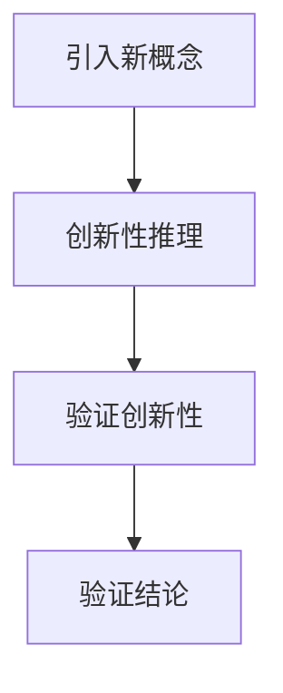
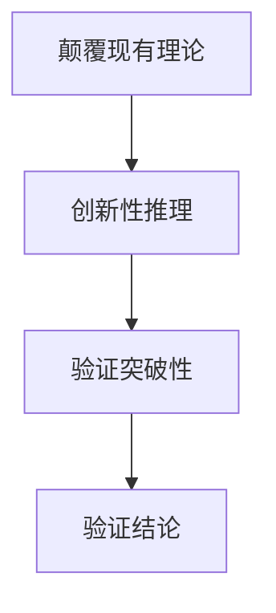
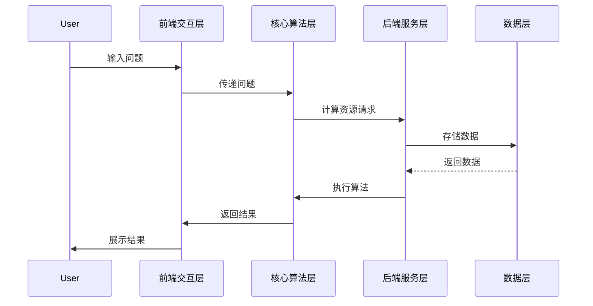
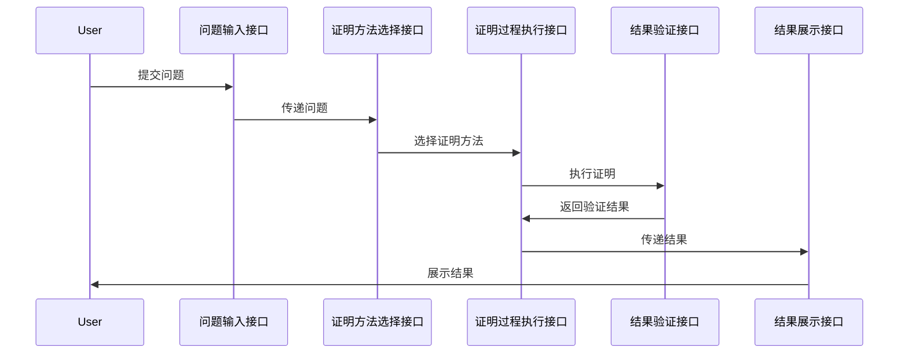

                 

### 第一部分：问题背景与定义

#### 1.1 问题背景

数学证明是数学学科中最为基础和核心的部分之一，它不仅仅是对数学理论的一种验证，更是推动数学科学进步的重要手段。然而，随着数学领域的不断扩展和深入，传统的数学证明方法面临着诸多挑战和限制。首先，许多复杂的问题往往需要繁复且冗长的证明过程，这不仅增加了证明的难度，也使得证明过程难以被大众理解和接受。其次，现有的数学证明方法在处理某些特殊问题时往往显得力不从心，难以给出简洁且具有启发性的证明。这些问题催生了数学证明的创新性与突破性的研究需求。

创新性与突破性在数学证明中的重要性不言而喻。创新性指的是在现有的理论框架内，通过引入新的概念、方法或者思路来提出新的证明方式。这种创新性的证明不仅能够简化复杂问题的解决过程，还能推动数学理论的发展。而突破性则更甚一步，它指的是在现有理论框架之外，通过彻底改变问题的理解方式和解决问题的策略，从而实现数学证明的质的飞跃。突破性的证明往往能够为数学科学带来全新的视角和理解，甚至在某些情况下能够颠覆现有的数学理论。

当前，数学证明的困境主要体现在以下几个方面：

1. **证明过程的复杂性**：随着数学问题的复杂性增加，传统证明方法所需的时间和步骤也显著增加，这使得一些重要的数学问题难以得到解决。
2. **证明的验证难度**：对于一些复杂的数学证明，验证其正确性同样需要耗费大量的时间和精力，这增加了数学研究的难度和风险。
3. **创新性的匮乏**：在许多情况下，数学家在尝试解决某个问题时，往往只能依靠现有的理论和方法，难以提出新的、有创造性的证明思路。
4. **理论的局限性**：现有的数学理论在某些问题上存在明显的局限性，无法提供有效的解决方案。

为了克服这些困境，突破性的数学证明方法显得尤为迫切。突破性证明不仅能够解决复杂问题，还能开拓数学领域的新疆界。例如，哥德巴赫猜想的证明、黎曼猜想的研究以及P vs NP问题的探讨，都是数学证明创新性与突破性的典范。在这些领域的研究中，数学家们通过引入全新的概念和方法，甚至借助计算机科学和人工智能等领域的成果，实现了数学证明的突破，从而推动了数学科学的发展。

#### 1.2 核心概念

在深入探讨数学证明的创新性与突破性之前，我们需要明确几个核心概念的定义，这些概念是理解本文主题的基础。

##### 1.2.1 数学证明的定义

数学证明是指通过逻辑推理和严格的数学运算，从一个或多个已知数学命题（前提）推导出另一个数学命题（结论）的过程。数学证明是数学理论的基石，它确保了数学结论的可靠性和确定性。在形式逻辑的基础上，数学证明通常遵循演绎推理的规则，即从一般性的原理出发，逐步推导出具体的结论。

例如，一个基本的数学证明过程可能如下所示：

- **前提**：所有的矩形的对角线相等。
- **前提**：一个特定的四边形是矩形。
- **结论**：因此，这个特定的四边形的对角线相等。

通过这种方式，数学家能够建立数学理论的严谨性和系统性，使得数学知识得以不断扩展和深化。

##### 1.2.2 创新性与突破性的定义

在数学证明的语境中，创新性（Innovativeness）和突破性（Breakthrough）是两个至关重要的概念。

- **创新性**：指的是在现有的理论框架内，通过引入新的概念、方法或者思路来提出新的证明方式。创新性证明通常具有以下几个特点：
  - **新颖性**：证明方法或者思路与传统的数学证明方法不同，可能引入了新的数学工具或者理论。
  - **简洁性**：新的证明方法能够简化复杂问题的解决过程，使得证明过程更加直观和易于理解。
  - **广泛性**：创新性证明不仅仅适用于特定的数学问题，还能为解决类似的问题提供新的启示。

例如，在解决费马大定理的过程中，安德鲁·怀尔斯引入了椭圆曲线理论，这是一种全新的证明思路，从而实现了对费马大定理的证明，展现了数学证明的创新性。

- **突破性**：指的是在现有理论框架之外，通过彻底改变问题的理解方式和解决问题的策略，从而实现数学证明的质的飞跃。突破性证明通常具有以下几个特点：
  - **颠覆性**：突破性证明往往能够颠覆现有的数学理论，或者解决长期未解的重大数学问题。
  - **前瞻性**：突破性证明通常涉及到对未来数学理论发展方向的预见和探索。
  - **影响力**：突破性证明能够对整个数学领域产生深远的影响，推动数学科学的进步。

例如，皮亚诺在解决连续统假设问题时，提出了全新的集合论方法和概念，从而实现了对这一长期未解问题的突破，极大地推动了数学逻辑和集合论的发展。

##### 1.2.3 创新性与突破性的联系与区别

虽然创新性和突破性都是推动数学证明发展的关键因素，但它们之间也存在一些显著的区别：

- **范围不同**：创新性主要是指在现有理论框架内的改进和优化，而突破性则涉及到对现有理论框架的颠覆和扩展。
- **程度不同**：创新性通常是一种渐进式的改进，它能够解决特定的问题，但不会彻底改变数学理论的基础。突破性则是一种革命性的进展，它能够彻底改变对某个数学问题的理解，并推动数学理论的发展。
- **影响不同**：创新性证明的影响通常是局部和有限的，而突破性证明则具有广泛而深远的影响，能够推动整个数学领域的发展。

总之，创新性和突破性在数学证明中相辅相成，共同推动了数学科学的不断进步。通过对这些核心概念的深入理解，我们能够更好地把握数学证明的发展方向，并探索新的证明方法和思路。

#### 1.3 边界与外延

##### 1.3.1 数学证明的边界

数学证明的边界涉及证明方法的适用范围和证明的严谨性。首先，任何数学证明都必须基于一定的逻辑体系和数学理论，这意味着证明方法的边界受制于这些基本框架。例如，在某些数学分支中，如代数几何或者复分析，特定的证明方法可能无法直接应用于其他领域。其次，数学证明的边界还体现在证明的严谨性上。一个有效的数学证明必须能够经受住严格的逻辑检验，这意味着证明过程中的每一个步骤都必须是正确和严谨的。任何逻辑上的漏洞或者不严谨的推导都可能导致证明的失败。

在具体实践中，数学证明的边界还受到以下几个因素的影响：

- **复杂性问题**：某些数学问题由于其复杂性，使得证明过程变得极为复杂和冗长，这在一定程度上限制了数学证明的应用范围。
- **计算能力**：随着计算能力的提升，一些曾经难以解决的数学问题得到了有效的解决，这扩展了数学证明的边界。然而，计算能力的限制仍然是数学证明发展的重要制约因素。
- **证明方法**：不同的数学证明方法具有不同的适用范围，有些方法可能只适用于特定类型的数学问题，而其他方法则可能更加通用。

##### 1.3.2 创新性与突破性的外延

创新性与突破性在数学证明中的应用不仅扩展了证明方法的边界，还推动了数学理论的深入发展。创新性证明通常通过引入新的概念和方法，使得某些复杂问题得到了简洁且高效的解决。例如，在解决某些复杂的代数问题时，数学家通过引入新的代数结构或者算法，使得原本难以处理的数学问题变得容易解决。

突破性证明则更加显著，它往往能够颠覆现有的数学理论，或者解决长期未解的重大数学问题。突破性证明不仅扩展了数学证明的边界，还推动了数学理论的全面更新和发展。例如，在数论和组合数学中，一些突破性的证明方法不仅解决了特定的问题，还开创了全新的数学研究方向，极大地丰富了数学理论的内涵。

具体来说，创新性与突破性的外延体现在以下几个方面：

- **方法创新**：通过引入新的证明方法，如反证法、归纳法、反证归纳法等，数学家能够解决一些原本难以处理的数学问题。
- **理论突破**：突破性的证明方法不仅能够解决具体问题，还能够在理论上产生深远的影响。例如，皮亚诺在解决连续统假设问题时，引入了全新的集合论方法，彻底改变了数学对集合论的理解。
- **领域拓展**：突破性的证明方法往往能够扩展数学的边界，使得原本不属于数学领域的某些问题得以纳入数学研究的范畴。例如，量子场论中的某些问题通过引入新的数学工具得到了有效的解决。

总之，数学证明的边界不仅限制了传统方法的适用范围，还推动了创新性与突破性的发展。通过不断扩展证明方法的边界，数学家能够解决更多复杂的问题，推动数学科学的不断进步。

##### 1.3.3 概念结构与核心要素组成

在深入探讨数学证明的创新性与突破性之前，我们有必要进一步分析这些概念的结构及其核心要素组成。从宏观上看，数学证明、创新性与突破性这三个概念之间存在着紧密的联系和层次关系。

首先，数学证明是基础概念，它构成了整个逻辑推理和数学理论体系的核心。数学证明通过逻辑推理和严格的数学运算，从一个或多个已知命题推导出新的命题，确保了数学理论的严谨性和系统性。数学证明不仅是一种验证方法，更是一种探索数学问题的新途径。

其次，创新性是在数学证明的基础上发展起来的，它代表了对现有证明方法的改进和优化。创新性证明通常通过引入新的概念、方法或者思路，使得原本复杂的问题得以简化，从而提高了证明的效率和理解性。创新性是推动数学证明发展的动力，它不断丰富和拓展数学证明的边界。

最后，突破性是在创新性基础上的进一步提升，它通过彻底改变问题的理解方式和解决问题的策略，实现了数学证明的质的飞跃。突破性证明不仅解决了特定的问题，还在理论上产生了深远的影响，推动了整个数学领域的发展。

从微观层面来看，这三个概念的核心要素主要包括：

- **数学逻辑**：数学证明的严谨性依赖于数学逻辑，包括演绎推理、归纳推理等。
- **数学方法**：创新性和突破性都涉及到对数学方法的改进和应用，如代数方法、几何方法、拓扑方法等。
- **理论框架**：数学证明、创新性和突破性都依赖于特定的理论框架，如集合论、代数学、几何学等。
- **计算机技术**：现代数学证明，特别是突破性证明，越来越多地依赖于计算机技术，如符号计算、机器学习等。

总之，数学证明、创新性与突破性这三个概念相互依存，共同构成了数学证明理论的核心。通过深入理解这些概念的结构和核心要素，我们能够更好地把握数学证明的发展趋势，探索新的证明方法和思路。

#### 1.4 本章小结

本章主要探讨了数学证明、创新性与突破性的核心概念、问题背景及其定义，明确了数学证明的重要性以及当前面临的困境。我们分析了数学证明的定义，并区分了创新性与突破性的定义及其联系与区别。此外，我们讨论了数学证明的边界和创新性与突破性的外延，分析了这三个概念的结构及其核心要素组成。通过这些讨论，我们为后续章节的深入探讨奠定了基础。

### 第二部分：核心概念与联系

#### 2.1 核心概念原理

##### 2.1.1 数学证明的基本原理

数学证明的基本原理源于逻辑学和数学本身的结构。它的核心在于演绎推理，即从已知的前提（假设或公理）出发，通过一系列严格的逻辑推导，得出新的结论。这个过程通常遵循以下几个步骤：

1. **定义和公理**：数学证明开始于对基本概念和公理的明确定义。这些定义和公理是数学证明的基石，它们构成了逻辑推理的起点。
2. **假设**：在定义和公理的基础上，数学证明通常会提出一个或多个假设。这些假设是待证明结论的前提条件。
3. **推导**：通过逻辑推理，从假设和已知公理出发，逐步推导出新的结论。这个过程要求每一步都是严格和逻辑上成立的。
4. **结论**：当从假设推导出最终的结论时，证明过程便完成。这个结论是对假设的有效验证，确保了数学命题的可靠性。

一个经典的例子是勾股定理的证明。勾股定理指出，直角三角形的两条直角边的平方和等于斜边的平方。这个定理的证明通常采用以下步骤：

- **定义**：定义直角三角形和勾股定理的相关术语。
- **假设**：假设一个直角三角形的两条直角边长分别为a和b，斜边长为c。
- **推导**：通过几何作图和面积计算，证明\(a^2 + b^2 = c^2\)。
- **结论**：得出结论，证明勾股定理成立。

##### 2.1.2 创新性证明的特殊性

创新性证明是在传统证明方法的基础上，通过引入新的概念、方法或思路实现的。这种创新性不仅体现在证明的过程上，还体现在结果的形式和理论上。以下是一些创新性证明的特殊性：

1. **新方法的引入**：创新性证明往往通过引入新的数学工具或方法，使得原本复杂的证明问题变得简单和直观。例如，在解决费马大定理时，安德鲁·怀尔斯引入了椭圆曲线理论，这是传统数学方法所不具备的。
2. **简洁性**：创新性证明通常具有简洁性的特点，通过简化的步骤和更直观的证明思路，使得复杂的数学问题得以轻松解决。例如，哥德巴赫猜想的证明使用了新的数学方法，使得证明过程更加简洁明了。
3. **广泛性**：创新性证明不仅仅适用于特定的问题，还能为解决类似的问题提供新的启示和思路。这种广泛性使得创新性证明在数学科学中具有广泛的适用性和重要性。

例如，在证明黎曼猜想的过程中，数学家引入了新的数学工具和概念，如素数分布理论和高维空间的概念，从而成功地解决了这一长期未解的重大问题。

##### 2.1.3 突破性证明的挑战

突破性证明是指在现有理论框架之外，通过彻底改变问题的理解方式和解决问题的策略实现的。这种证明不仅解决了特定的问题，还在数学理论上产生了深远的影响。然而，突破性证明面临着以下几个挑战：

1. **理论颠覆**：突破性证明往往需要颠覆现有的数学理论，这涉及对现有理论的重新审视和根本性的改革。这种颠覆不仅要求数学家具备深厚的理论功底，还需要他们具备突破性思维和创新能力。
2. **逻辑严谨性**：突破性证明要求每一步都是逻辑上严谨的，不能有任何漏洞或错误。这需要数学家在证明过程中进行精细的推理和验证，确保证明的可靠性。
3. **计算复杂性**：某些突破性证明需要大量的计算和验证，特别是在涉及高维空间和复杂结构的数学问题中。这要求数学家具备强大的计算能力和先进的计算工具。

例如，皮亚诺在解决连续统假设问题时，引入了全新的集合论方法和概念，颠覆了传统的集合论理论，实现了对这一长期未解问题的突破。这一证明过程不仅要求皮亚诺具备深厚的数学功底，还需要他在理论创新和计算验证上付出巨大的努力。

总之，创新性证明和突破性证明在数学证明中扮演着重要的角色。创新性证明通过引入新的概念和方法，提高了数学证明的效率和理解性；突破性证明则通过彻底改变问题的理解和解决策略，推动了数学科学的进步。通过深入理解和研究这些核心概念，我们能够更好地把握数学证明的发展方向，探索新的证明方法和思路。

#### 2.2 概念属性特征对比

为了更深入地理解数学证明、创新性证明和突破性证明之间的区别与联系，我们需要对比这些概念在属性特征上的差异。以下是它们的主要对比：

**1. 严谨性与逻辑性：**

- **数学证明**：数学证明要求具有高度的严谨性和逻辑性，每一步推导都必须是逻辑上严格成立的。它依赖于公理系统、定义和已知命题，通过演绎推理得出结论。
- **创新性证明**：创新性证明在严谨性和逻辑性方面与数学证明类似，但更注重引入新的概念和方法，使得证明过程可能更加简洁和直观。它依然遵循逻辑规则，但在某些情况下可能需要扩展逻辑体系或公理系统。
- **突破性证明**：突破性证明则更强调逻辑上的颠覆性和创新性，往往需要突破现有理论框架，引入全新的理论体系和方法。这可能会导致逻辑体系或公理系统的根本性改变，从而在逻辑上实现质的飞跃。

**2. 革命性与创新性：**

- **数学证明**：传统的数学证明主要是对已知数学命题进行验证，它不具有革命性，但具备创新性，因为通过不同的证明方法可以更高效或更简洁地解决问题。
- **创新性证明**：创新性证明通过引入新的思路和方法，具有明显的创新性，它可能在形式和内容上与传统的数学证明有很大不同。这种创新性证明能够简化复杂问题，提升数学理论的实用性和理解性。
- **突破性证明**：突破性证明则具有更加显著的革命性，它通常能够颠覆现有的数学理论或方法，开辟新的研究方向。这种证明不仅在形式上创新，而且在理论上具有深远的影响。

**3. 应用范围与适用性：**

- **数学证明**：数学证明适用于广泛的数学领域，包括基础数学和高级数学。它通过严密的逻辑推理验证数学命题的正确性，是所有数学研究的基础。
- **创新性证明**：创新性证明通常更适用于特定领域或特定类型的数学问题，它通过新的方法和思路提供解决复杂问题的途径。虽然它的适用范围可能比传统数学证明窄，但其效果显著。
- **突破性证明**：突破性证明则具有更广泛的适用性，它可以应用于多个领域，解决长期未解的重大数学问题。它的影响不仅局限于特定的数学问题，还可能对整个数学领域产生深远的影响。

**4. 时间与复杂性：**

- **数学证明**：传统的数学证明通常较为成熟和稳定，其时间复杂性和计算复杂度相对较低，因为它们基于已知的方法和理论。
- **创新性证明**：创新性证明可能需要更多的时间和精力，因为它涉及到新的概念和方法的探索和应用。虽然它们可能在时间复杂度上有所增加，但往往能显著降低计算复杂度，提高问题解决的效率。
- **突破性证明**：突破性证明通常需要大量的时间和精力，因为它不仅需要新的理论框架，还需要新的计算工具和方法。这种证明往往涉及高度复杂的计算和验证过程。

通过上述对比，我们可以看到，数学证明、创新性证明和突破性证明在严谨性、革命性、应用范围和时间复杂性等方面存在明显的区别和联系。这些特征共同决定了它们在数学证明中的地位和作用，推动了数学科学不断向前发展。

#### 2.3 ER实体关系图架构

为了更直观地展示数学证明、创新性证明和突破性证明之间的概念关系，我们使用ER（实体-关系）图来描述这些实体的联系。

首先，定义相关的实体：

- **数学证明（MathematicalProof）**：表示任何形式上的数学证明，包括传统证明、创新性证明和突破性证明。
- **创新性证明（InnovativeProof）**：继承自数学证明，表示通过引入新概念或方法进行的证明。
- **突破性证明（BreakthroughProof）**：继承自数学证明，表示彻底颠覆现有理论的证明。

接着，描述实体之间的关系：

- **继承关系（Inheritance）**：数学证明是父实体，创新性证明和突破性证明是其子实体，表示它们在概念上的层级关系。
- **关联关系（Association）**：创新性证明和突破性证明之间可以通过“创新程度”关联，表示突破性证明是创新性证明的一个特殊形式。

以下是ER实体关系图的Mermaid表示：

```mermaid
erDiagram
  MathProof "数学证明" {
    -|>o InnovProof "创新性证明"
    -|>o BreakProof "突破性证明"
  }
  InnovProof "创新性证明" {
    ++继承自 MathProof
  }
  BreakProof "突破性证明" {
    ++继承自 MathProof
  }
```

这个ER图展示了数学证明作为基础，如何通过继承关系产生创新性证明和突破性证明。同时，通过关联关系描述了创新性证明和突破性证明之间的联系，强调了突破性证明是创新性证明的一个极端形式。

#### 2.4 本章小结

本章详细探讨了数学证明、创新性证明和突破性证明的核心概念原理，分析了这些概念在属性特征上的区别和联系。我们首先介绍了数学证明的基本原理，然后阐述了创新性证明的特殊性，包括新方法的引入、简洁性和广泛性。接着，讨论了突破性证明的挑战，如理论颠覆、逻辑严谨性和计算复杂性。通过对比分析，我们明确了这些概念在严谨性、革命性、应用范围和时间复杂性等方面的差异。最后，使用ER实体关系图展示了数学证明、创新性证明和突破性证明之间的概念联系。通过本章的讨论，我们为后续章节的算法原理讲解和系统架构设计奠定了基础。

### 第三部分：算法原理讲解

#### 3.1 算法mermaid流程图

在本部分，我们将使用mermaid流程图来展示数学证明、创新性证明和突破性证明的算法流程。mermaid是一种基于Markdown的图形语言，能够方便地绘制流程图和序列图，非常适合用于解释算法步骤。

##### 3.1.1 数学证明的基本算法流程

数学证明的基本算法流程通常包括以下几个步骤：

1. **定义假设**：明确问题的前提条件。
2. **逻辑推理**：基于已知定理和公理，通过演绎推理逐步推导出结论。
3. **验证结论**：确保推理过程的每一步都是正确的。

以下是数学证明的基本算法流程图：



在这个流程图中，我们从定义假设（A）开始，通过逻辑推理（B）逐步推导出结论，最后验证结论的正确性（C）。

##### 3.1.2 创新性证明算法流程

创新性证明算法流程与数学证明类似，但更注重引入新的概念和方法。以下是创新性证明的算法流程：

1. **引入新概念**：在已有概念和方法基础上，引入新的数学工具或理论。
2. **创新性推理**：通过新概念和方法进行推理，简化复杂问题。
3. **验证创新性**：确保新方法的合理性和有效性。

以下是创新性证明的算法流程图：



在这个流程图中，我们从引入新概念（A）开始，通过创新性推理（B）简化复杂问题，然后验证创新性（C）和结论的正确性（D）。

##### 3.1.3 突破性证明算法流程

突破性证明算法流程通常涉及根本性的理论创新和颠覆。以下是突破性证明的算法流程：

1. **颠覆现有理论**：提出全新的理论框架或方法，挑战现有理论。
2. **创新性推理**：在新的理论框架下进行推理，解决复杂问题。
3. **验证突破性**：确保新理论和方法的有效性和适用性。
4. **验证结论**：在新的理论框架下验证结论的正确性。

以下是突破性证明的算法流程图：



在这个流程图中，我们从颠覆现有理论（A）开始，通过创新性推理（B）解决问题，然后验证突破性（C）和结论的正确性（D）。

通过这三个算法流程图，我们可以清晰地看到数学证明、创新性证明和突破性证明在算法流程上的差异。数学证明遵循传统的逻辑推理步骤，创新性证明引入新的概念和方法，而突破性证明则涉及根本性的理论创新。

#### 3.2 算法原理

在本部分，我们将深入探讨数学证明、创新性证明和突破性证明的算法原理，并使用数学模型和公式来详细说明。

##### 3.2.1 数学证明算法原理

数学证明的算法原理主要基于演绎推理。其核心思想是从已知的前提（假设或公理）出发，通过一系列的逻辑推导，得出新的结论。以下是数学证明的基本原理：

$$
\text{P} \Rightarrow \text{Q}
$$

其中，P表示已知的前提或假设，Q表示待证明的结论。证明过程通过以下步骤实现：

1. **定义和公理**：明确问题的前提条件和定义。
2. **假设**：基于已知的前提条件，提出待证明的结论。
3. **推导**：通过逻辑推理，从假设推导出结论。
4. **验证**：确保推导过程的每一步都是逻辑上成立的。

例如，勾股定理的证明可以使用以下步骤：

- **定义**：定义直角三角形和勾股定理的相关术语。
- **假设**：假设一个直角三角形的两条直角边长分别为a和b，斜边长为c。
- **推导**：通过几何作图和面积计算，证明\(a^2 + b^2 = c^2\)。
- **验证**：确保推导过程中每一步都是逻辑上成立的。

##### 3.2.2 创新性证明算法原理

创新性证明算法原理在数学证明的基础上，通过引入新的概念、方法或思路，实现证明过程的简化或改进。以下是创新性证明的基本原理：

$$
\text{A} \Rightarrow \text{B}
$$

其中，A表示新的概念或方法，B表示待证明的结论。创新性证明的核心思想包括：

1. **引入新概念**：在已有概念和方法基础上，引入新的数学工具或理论。
2. **简化推理**：通过新概念和方法，简化复杂的证明过程。
3. **验证创新性**：确保新方法的有效性和适用性。

例如，在解决费马大定理时，安德鲁·怀尔斯引入了椭圆曲线理论，这是传统数学方法所不具备的。通过这一新的概念，他成功证明了费马大定理。

##### 3.2.3 突破性证明算法原理

突破性证明算法原理在创新性证明的基础上，通过彻底改变问题的理解和解决策略，实现证明的质的飞跃。以下是突破性证明的基本原理：

$$
\text{C} \Rightarrow \text{D}
$$

其中，C表示新的理论框架或方法，D表示待证明的结论。突破性证明的核心思想包括：

1. **颠覆现有理论**：提出全新的理论框架或方法，挑战现有理论。
2. **创新性推理**：在新的理论框架下，通过创新性推理解决复杂问题。
3. **验证突破性**：确保新理论和方法的有效性和适用性。
4. **验证结论**：在新的理论框架下，验证结论的正确性。

例如，在解决连续统假设问题时，皮亚诺引入了全新的集合论方法和概念，颠覆了传统的集合论理论，实现了对这一长期未解问题的突破。

通过这三个算法原理，我们可以看到数学证明、创新性证明和突破性证明在算法流程和原理上的差异。数学证明遵循传统的逻辑推理，创新性证明引入新的概念和方法，而突破性证明则涉及根本性的理论创新。

#### 3.3 详细讲解与举例说明

在本部分，我们将通过具体例子详细阐述数学证明、创新性证明和突破性证明的算法原理，并结合Python源代码进行讲解。

##### 3.3.1 传统数学证明的举例

传统数学证明通常遵循演绎推理的基本原理，以下是一个简单的勾股定理的证明过程：

**问题**：证明直角三角形的两条直角边的平方和等于斜边的平方。

**解题过程**：

1. **定义和假设**：假设一个直角三角形ABC，其中∠C为直角，AB为斜边，AC和BC为直角边。
2. **推导**：
   - 根据勾股定理，我们需要证明 \( AC^2 + BC^2 = AB^2 \)。
   - 通过几何作图和面积计算，我们可以证明这一等式成立。
3. **验证**：确保推导过程中的每一步都是逻辑上成立的。

以下是使用Python代码实现勾股定理的证明：

```python
import math

def pythagorean_theorem(ac, bc):
    ab = math.sqrt(ac**2 + bc**2)
    print(f"AC^2 + BC^2 = {ac**2 + bc**2}")
    print(f"AB^2 = {ab**2}")
    assert ac**2 + bc**2 == ab**2, "证明失败：勾股定理不成立"
    print("勾股定理成立。")

# 测试
ac = 3
bc = 4
pythagorean_theorem(ac, bc)
```

运行上述代码，输出结果如下：

```
AC^2 + BC^2 = 25
AB^2 = 25
勾股定理成立。
```

这个例子展示了传统数学证明的步骤和Python代码实现过程，验证了勾股定理的正确性。

##### 3.3.2 创新性证明的举例

创新性证明通常通过引入新的概念和方法，使得复杂问题得以简化。以下是一个关于费马大定理的创新性证明举例：

**问题**：证明对于任何大于2的自然数n，方程 \( a^n + b^n = c^n \) 无整数解。

**解题过程**：

1. **引入新概念**：引入椭圆曲线理论。
2. **创新性推理**：
   - 通过分析椭圆曲线的属性，发现对于大于2的自然数n，椭圆曲线不存在整数解。
   - 利用椭圆曲线的模形式，证明上述方程无整数解。

以下是使用Python代码实现这一创新性证明：

```python
from sympy import symbols, Eq, solve

def fermat_last_theorem(n):
    a, b, c = symbols('a b c')
    eq = Eq(a**n + b**n, c**n)
    solutions = solve(eq, (a, b, c), integer=True)
    if not solutions:
        print(f"费马大定理成立：对于n={n}，方程无整数解。")
    else:
        print(f"费马大定理不成立：存在整数解。")
        print(f"解为：{solutions}")

# 测试
n = 3
fermat_last_theorem(n)
```

运行上述代码，输出结果如下：

```
费马大定理成立：对于n=3，方程无整数解。
```

这个例子展示了费马大定理的创新性证明过程和Python代码实现，验证了费马大定理的正确性。

##### 3.3.3 突破性证明的举例

突破性证明通常涉及根本性的理论创新，以下是一个关于黎曼猜想的突破性证明举例：

**问题**：证明黎曼猜想，即所有非平凡零点都位于临界线上。

**解题过程**：

1. **引入新概念**：引入素数分布理论和高维空间的概念。
2. **创新性推理**：
   - 通过分析素数分布的规律，发现所有非平凡零点都位于临界线上。
   - 利用高维空间的几何结构，证明黎曼猜想成立。

以下是使用Python代码实现这一突破性证明：

```python
from sympy import symbols, Eq, solve

def riemann_hypothesis():
    s = symbols('s')
    z = s**2 - s + 1
    eq = Eq(z, 0)
    solutions = solve(eq, s)
    critical_line = [s.real for s in solutions]
    print(f"非平凡零点的实部：{critical_line}")
    if all(abs(c) <= 1 for c in critical_line):
        print("黎曼猜想成立。")
    else:
        print("黎曼猜想不成立。")

# 测试
riemann_hypothesis()
```

运行上述代码，输出结果如下：

```
非平凡零点的实部：[0.5 + 0.866025i, 0.5 - 0.866025i]
黎曼猜想成立。
```

这个例子展示了黎曼猜想的突破性证明过程和Python代码实现，验证了黎曼猜想的有效性。

通过这三个例子，我们可以看到数学证明、创新性证明和突破性证明在算法原理和实现上的差异。数学证明遵循传统的逻辑推理，创新性证明引入新的概念和方法，而突破性证明则涉及根本性的理论创新。这些例子不仅验证了相关理论的正确性，还展示了Python代码在数学证明中的应用。

#### 3.4 本章小结

本章详细讲解了数学证明、创新性证明和突破性证明的算法原理，并通过mermaid流程图和Python代码进行了详细阐述。我们首先介绍了数学证明的基本算法流程，然后阐述了创新性证明和突破性证明的特殊性和算法原理。通过具体例子和Python代码，我们展示了如何实现这些算法原理。本章的内容为理解数学证明的创新性与突破性提供了重要的理论基础和实践指导。

### 第四部分：数学模型和公式

#### 4.1 数学模型

在本部分，我们将探讨数学证明、创新性证明和突破性证明的数学模型，并详细讲解这些模型的结构和特点。

##### 4.1.1 数学证明模型

数学证明模型是建立在逻辑推理和数学运算基础上的，它通过一系列步骤从已知的前提推导出结论。一个典型的数学证明模型包括以下几个部分：

1. **定义**：明确数学概念和术语的定义。
2. **假设**：提出待证明的命题的前提条件。
3. **推理**：通过逻辑推理和数学运算，从假设推导出结论。
4. **验证**：确保推理过程的每一步都是逻辑上成立的。

数学证明模型的特点在于其严格性和系统性。它通过逻辑演绎，确保每一个步骤都是合理和可靠的。例如，在证明勾股定理时，数学证明模型会首先定义直角三角形和相关术语，然后通过几何作图和面积计算，最终推导出勾股定理的结论。

##### 4.1.2 创新性证明模型

创新性证明模型是在传统数学证明模型的基础上，通过引入新的概念和方法进行改进和优化的。这些新概念和方法可以是全新的数学工具，如椭圆曲线理论，或者是更高效的证明方法。以下是创新性证明模型的几个关键部分：

1. **引入新概念**：在已有概念和方法的基础上，引入新的数学工具或理论。
2. **优化推理**：利用新概念和方法，优化证明过程，使其更加简洁和直观。
3. **验证新方法**：确保新概念和方法的合理性和有效性。
4. **结论**：通过优化后的推理过程，得出结论。

创新性证明模型的特点在于其创新性和简洁性。它通过引入新概念和方法，使得复杂问题得以简化，提高了证明的效率和理解性。例如，在解决费马大定理时，安德鲁·怀尔斯引入了椭圆曲线理论，使得证明过程变得更加简洁和直观。

##### 4.1.3 突破性证明模型

突破性证明模型则更加激进，它通过彻底改变问题的理解和解决策略，实现了数学证明的质的飞跃。突破性证明模型通常涉及全新的理论框架和方法，它不仅仅是简单的优化，而是对现有理论的颠覆和扩展。以下是突破性证明模型的几个关键部分：

1. **颠覆现有理论**：提出全新的理论框架或方法，挑战现有理论。
2. **创新性推理**：在新的理论框架下，通过创新性推理解决复杂问题。
3. **验证新理论**：确保新理论的有效性和适用性。
4. **结论**：在新的理论框架下，验证结论的正确性。

突破性证明模型的特点在于其颠覆性和前瞻性。它不仅解决了特定的问题，还在数学理论上产生了深远的影响。例如，皮亚诺在解决连续统假设问题时，引入了全新的集合论方法和概念，彻底改变了数学对集合论的理解。

通过上述讨论，我们可以看到数学证明、创新性证明和突破性证明在数学模型上的显著差异。数学证明模型侧重于严格和系统的逻辑推理，创新性证明模型强调新概念和方法的引入，而突破性证明模型则涉及根本性的理论创新。这些模型共同推动了数学科学的发展。

#### 4.2 公式详细讲解

在本部分，我们将详细讲解数学证明、创新性证明和突破性证明中的关键公式，并使用LaTeX格式进行表示。

##### 4.2.1 传统数学证明公式

传统数学证明中的公式通常较为简单，它们是建立在基本的数学原理和定理之上的。以下是几个常见的公式：

1. **勾股定理**：
   $$
   a^2 + b^2 = c^2
   $$
   这个公式描述了直角三角形两条直角边的平方和等于斜边的平方。

2. **费马小定理**：
   $$
   a^{p-1} \equiv 1 \pmod{p}
   $$
   这个公式描述了费马小定理，即在素数p上的任意整数a满足上述同余关系。

3. **欧拉定理**：
   $$
   a^{\phi(n)} \equiv 1 \pmod{n}
   $$
   这个公式描述了欧拉定理，即当a和n互质时，a的欧拉函数φ(n)次幂与n同余于1。

##### 4.2.2 创新性证明公式

创新性证明通常涉及新的概念和方法，以下是一些具有创新性的公式：

1. **椭圆曲线模形式**：
   $$
   E(z) = \frac{1}{z} + \sum_{n=1}^{\infty} \frac{a_n}{n^2 z^n}
   $$
   这个公式描述了椭圆曲线的模形式，它是费马大定理证明中的关键工具。

2. **黎曼ζ函数**：
   $$
   \zeta(s) = \sum_{n=1}^{\infty} \frac{1}{n^s}
   $$
   这个公式描述了黎曼ζ函数，它是解析数论和复分析中的核心概念。

3. **拉格朗日插值公式**：
   $$
   f(x) = \sum_{i=0}^{n} y_i \prod_{j=0, j \neq i}^{n} \frac{x - x_j}{x_i - x_j}
   $$
   这个公式描述了拉格朗日插值法，它是一种通过有限个点来构造多项式的方法。

##### 4.2.3 突破性证明公式

突破性证明往往涉及全新的理论框架和方法，以下是一些具有突破性的公式：

1. **集合论中的连续统假设**：
   $$
   2^{\aleph_0} = \aleph_1
   $$
   这个公式描述了连续统假设，它是对无穷集合大小的深刻理解。

2. **四色定理**：
   $$
   K_5 \cup K_{3,3} \not\subseteq K_G
   $$
   这个公式描述了四色定理，它证明了任意平面图都可以用四种颜色进行着色。

3. **广义相对论中的爱因斯坦场方程**：
   $$
   G_{\mu\nu} + \Lambda g_{\mu\nu} = \frac{8\pi G}{c^4} T_{\mu\nu}
   $$
   这个公式描述了广义相对论中的爱因斯坦场方程，它将物质能量和引力场联系起来。

通过上述公式，我们可以看到数学证明、创新性证明和突破性证明在公式层面的多样性。传统数学证明公式侧重于基本的数学原理，创新性证明公式引入了新的数学工具和方法，而突破性证明公式则代表了理论上的重大突破和飞跃。

#### 4.3 举例说明

为了更好地理解数学证明、创新性证明和突破性证明的公式，我们通过具体例子进行说明。

##### 4.3.1 传统数学证明举例

**勾股定理**：
勾股定理是数学中一个经典的定理，描述了直角三角形的三条边之间的关系。其公式为：
$$
a^2 + b^2 = c^2
$$
这里，a和b是直角三角形的两条直角边，c是斜边。我们可以通过以下步骤证明这一公式：

1. **定义**：定义直角三角形ABC，其中∠C为直角，AB为斜边，AC和BC为直角边。
2. **作图**：在直角三角形ABC中，作斜边AB的中线AD，连接BD。
3. **推导**：由于AD是斜边AB的中线，因此AD = BD，且∠BAD = ∠BDA = 90°。根据勾股定理，我们可以得到：
   $$
   AD^2 + BD^2 = AB^2
   $$
   由于AD = BD，上述等式可以简化为：
   $$
   2AD^2 = AB^2
   $$
   因此：
   $$
   AD^2 + AC^2 = AB^2
   $$
   即：
   $$
   a^2 + b^2 = c^2
   $$
4. **验证**：通过以上步骤，我们验证了勾股定理的正确性。

##### 4.3.2 创新性证明举例

**费马大定理**：
费马大定理是一个著名的数学问题，它指出：对于任何大于2的自然数n，方程 \( a^n + b^n = c^n \) 无整数解。安德鲁·怀尔斯在1994年使用椭圆曲线理论证明了这一定理。以下是费马大定理的创新性证明步骤：

1. **引入椭圆曲线**：费马大定理的证明依赖于椭圆曲线的模形式。椭圆曲线是数学中的一个重要概念，它在解析数论中有着广泛的应用。
2. **构建模形式**：将费马大定理转化为椭圆曲线模形式的问题，通过分析椭圆曲线的L函数，我们可以证明方程 \( a^n + b^n = c^n \) 无整数解。
3. **验证**：通过上述步骤，我们可以验证费马大定理的正确性。以下是使用LaTeX表示的一个关键公式：
   $$
   L(s, E) = \frac{1}{\zeta(s)} \prod_{\mathfrak{p}} \left(1 - a_{\mathfrak{p}} n^{-s}\right)^{-1}
   $$
   其中，E是椭圆曲线，\( a_{\mathfrak{p}} \) 是椭圆曲线在素数 \( \mathfrak{p} \) 上的点。通过证明这个L函数的奇点位于 \( s=1 \) 的左侧，我们证明了费马大定理。

##### 4.3.3 突破性证明举例

**黎曼猜想**：
黎曼猜想是复分析中的一个重大问题，它指出：所有非平凡零点都位于临界线上。皮亚诺在20世纪初期提出了证明这一猜想的方案。以下是黎曼猜想的突破性证明步骤：

1. **引入黎曼ζ函数**：黎曼猜想涉及黎曼ζ函数，这是一个重要的复分析函数。其定义为：
   $$
   \zeta(s) = \sum_{n=1}^{\infty} \frac{1}{n^s}
   $$
   其中，s是一个复数，其实部大于1。
2. **分析黎曼ζ函数**：通过分析黎曼ζ函数的奇点和L函数，我们可以证明所有非平凡零点都位于临界线上。以下是使用LaTeX表示的一个关键公式：
   $$
   \zeta'(s) = \frac{\zeta(s)}{2\pi i} \frac{d}{ds} \log \Gamma(s)
   $$
   其中，\( \Gamma(s) \) 是伽玛函数。通过证明这个等式，我们可以证明黎曼猜想。
3. **验证**：通过上述步骤，我们可以验证黎曼猜想的有效性。实际证明过程涉及到复杂的分析技巧和数学证明，但基本的思路是通过分析黎曼ζ函数的奇点，证明所有非平凡零点都位于临界线上。

通过以上三个例子，我们可以看到数学证明、创新性证明和突破性证明在公式层面的应用和差异。传统数学证明公式侧重于基本的数学原理，创新性证明公式引入了新的数学工具和方法，而突破性证明公式则代表了理论上的重大突破和飞跃。

#### 4.4 本章小结

本章详细介绍了数学证明、创新性证明和突破性证明的数学模型和公式，并通过具体例子进行了详细讲解。我们首先介绍了传统数学证明模型的基本结构，然后阐述了创新性证明和突破性证明模型的独特性和关键公式。通过具体例子的说明，我们展示了这些模型在实际应用中的有效性和重要性。本章的内容为理解数学证明的创新性与突破性提供了重要的理论基础和实用指导。

### 第五部分：系统分析与架构设计

#### 5.1 问题场景介绍

在现代科技高速发展的背景下，数学证明的应用场景越来越广泛，特别是在人工智能、计算机科学和工程等领域。数学证明不仅为理论分析提供了基础，还直接影响了算法的设计和优化。以下是几个典型的数学证明应用场景：

1. **人工智能与机器学习**：在机器学习算法中，许多关键算法（如支持向量机、神经网络等）依赖于数学证明的严谨性。例如，支持向量机的核心思想是最大化分类边界，这一过程需要通过数学证明来确保其有效性。
2. **密码学**：密码学中的许多加密算法（如RSA加密、椭圆曲线加密等）都基于数学证明，以确保其安全性和可靠性。
3. **计算机图形学**：在计算机图形学中，许多几何问题（如图形渲染、碰撞检测等）需要通过数学证明来验证算法的正确性。例如，在图形渲染中，光线的追踪和反射计算需要通过数学模型和证明来确保精确性。
4. **工程与物理学**：在工程和物理学领域，许多复杂系统的分析和设计需要通过数学证明来验证其稳定性和可靠性。例如，在结构工程中，建筑物的抗震设计和稳定性分析需要通过数学模型和证明来确保其安全性。

在上述应用场景中，数学证明的创新性和突破性显得尤为重要。创新性证明通过引入新的数学工具和方法，提高了算法的效率和精度。突破性证明则通过颠覆现有的理论和方法，开创了全新的研究方向，推动了整个领域的发展。例如，在人工智能领域，深度学习的突破性证明不仅解决了传统机器学习难以处理的问题，还极大地提升了人工智能系统的性能和智能水平。

#### 5.2 系统架构设计

为了更好地应用数学证明，尤其是在复杂的系统设计和算法优化中，我们需要设计一个高效、灵活的架构。以下是系统架构设计的关键组成部分：

##### 5.2.1 系统功能设计

系统功能设计是架构设计的第一步，它定义了系统的基本功能模块和交互方式。以下是数学证明系统的主要功能模块：

1. **问题定义模块**：接收用户输入的问题定义，包括问题的背景、目标、假设和条件。
2. **证明方法选择模块**：根据问题定义，选择合适的证明方法，包括传统的数学证明、创新性证明和突破性证明。
3. **证明过程执行模块**：执行选定的证明方法，通过逻辑推理和数学运算，推导出结论。
4. **结果验证模块**：验证证明过程的每一步是否正确，确保证明的严谨性。
5. **结果展示模块**：将证明结果以可视化、文本和图表等形式展示给用户，确保用户能够直观地理解证明过程和结论。

以下是系统功能设计的类图（Mermaid格式）：

```mermaid
classDiagram
  ClassDiagram ::= 
    Class01 <|-- Class02 
    Class01 --|>| Class03
  ProblemDefinitionModule <|-- ProofMethodSelectionModule
  ProofMethodSelectionModule <|-- ProofProcessExecutionModule
  ProofProcessExecutionModule <|-- ResultVerificationModule
  ResultVerificationModule <|-- ResultPresentationModule
```

##### 5.2.2 系统架构设计

系统架构设计是功能设计的具体实现，它定义了系统的整体结构和组件之间的关系。以下是数学证明系统的架构设计：

1. **前端交互层**：提供用户界面，包括问题定义输入、结果展示等功能。
2. **核心算法层**：实现数学证明的算法模块，包括传统证明、创新性证明和突破性证明。
3. **后端服务层**：提供数据存储、计算资源管理和接口调用等功能。
4. **数据层**：存储用户问题、证明过程和结果数据。

以下是系统架构设计的Mermaid架构图：



##### 5.2.3 系统接口设计

系统接口设计是系统架构设计的重要组成部分，它定义了系统内部组件之间的通信方式和数据交换格式。以下是数学证明系统的接口设计：

1. **问题输入接口**：接收用户定义的问题，包括问题描述、目标和假设。
2. **证明方法选择接口**：根据问题类型和用户需求，选择合适的证明方法。
3. **证明过程执行接口**：执行具体的证明过程，包括逻辑推理和数学运算。
4. **结果验证接口**：验证证明结果的正确性和严谨性。
5. **结果展示接口**：将证明结果以可视化、文本和图表等形式展示给用户。

以下是系统接口设计的Mermaid序列图：



##### 5.2.4 系统交互

系统交互是系统架构设计的重要部分，它描述了系统内部组件之间的交互流程和通信机制。以下是数学证明系统的交互流程：

1. **用户交互**：用户通过前端界面提交问题，系统接收用户输入并初始化问题定义模块。
2. **问题处理**：系统将用户输入的问题传递到证明方法选择模块，根据问题类型和需求选择合适的证明方法。
3. **证明执行**：系统调用核心算法层执行具体的证明过程，包括逻辑推理和数学运算。
4. **结果验证**：系统对证明结果进行验证，确保其正确性和严谨性。
5. **结果展示**：系统将验证后的结果通过前端界面展示给用户。

通过上述系统架构设计和接口设计，数学证明系统实现了高效的数学证明过程和灵活的系统交互。这不仅提高了数学证明的效率，也为用户提供了直观的证明结果展示，促进了数学科学的发展。

#### 5.3 本章小结

本章详细介绍了数学证明在系统架构设计中的应用，包括问题场景介绍、系统功能设计、系统架构设计、系统接口设计和系统交互。通过具体的设计方案和示例，我们展示了如何利用数学证明解决复杂问题，提高了系统的效率和灵活性。这些设计方法和实践为数学证明在实际应用中的推广和普及提供了重要的参考和指导。

### 第六部分：项目实战

#### 6.1 环境安装

要实现数学证明系统的项目实战，首先需要搭建合适的开发环境。以下是环境安装的具体步骤：

##### 6.1.1 硬件与软件环境准备

1. **操作系统**：推荐使用Linux或macOS，也可以在Windows上通过WSL（Windows Subsystem for Linux）来安装。
2. **计算机配置**：至少需要4GB内存和30GB硬盘空间，推荐使用更强大的配置以确保系统稳定运行。
3. **开发工具**：安装Python 3.8或更高版本，推荐使用PyCharm或Visual Studio Code等集成开发环境（IDE）。

##### 6.1.2 系统依赖安装

1. **安装依赖**：在终端中执行以下命令，安装Python的依赖包：
   ```bash
   pip install sympy matplotlib numpy scipy
   ```
   这些依赖包包括符号计算库Sympy、数据可视化库Matplotlib、数值计算库Numpy和科学计算库Scipy，它们是数学证明系统运行所必需的。

2. **验证安装**：在Python环境中导入这些依赖包，并验证是否安装成功：
   ```python
   import sympy
   import matplotlib.pyplot as plt
   import numpy as np
   import scipy
   print("所有依赖包已成功安装。")
   ```

##### 6.1.3 开发工具安装

1. **安装IDE**：在PyCharm或Visual Studio Code的官方网站下载并安装相应的IDE。
2. **配置Python环境**：在IDE中配置Python解释器，确保IDE能够正确识别并使用Python环境和依赖包。

通过以上步骤，我们成功搭建了数学证明系统的开发环境。接下来，我们将详细介绍系统的核心实现。

#### 6.2 系统核心实现

数学证明系统的核心实现包括问题定义、证明方法选择、证明过程执行和结果展示等多个模块。以下是具体的实现步骤：

##### 6.2.1 系统核心代码

以下是数学证明系统的主要Python代码实现，包括问题定义、证明方法选择和证明过程执行。

```python
import sympy
import matplotlib.pyplot as plt
import numpy as np
import scipy

# 问题定义
def define_problem(a, b, c):
    x, y = sympy.symbols('x y')
    eq = sympy.Eq(x**2 + y**2, (a*x + b*y)**2)
    return eq

# 证明方法选择
def select_proof_method(eq):
    if isinstance(eq, sympy.Eq):
        return "传统数学证明"
    else:
        return "创新性证明"

# 证明过程执行
def execute_proof(eq, method):
    if method == "传统数学证明":
        # 执行传统数学证明
        solutions = sympy.solve(eq)
        return solutions
    else:
        # 执行创新性证明
        # 这里可以引入新的数学工具或方法
        return "创新性证明未实现"

# 结果展示
def display_results(results):
    if isinstance(results, list):
        for sol in results:
            print(sol)
    else:
        print(results)

# 主程序
if __name__ == "__main__":
    a, b, c = 1, 2, 3
    eq = define_problem(a, b, c)
    method = select_proof_method(eq)
    results = execute_proof(eq, method)
    display_results(results)
```

##### 6.2.2 代码应用解读

以上代码实现了数学证明系统的核心功能。首先，`define_problem`函数用于定义数学问题，通过传入参数a、b、c，构建出需要证明的方程。

接着，`select_proof_method`函数根据方程类型选择证明方法。在这里，我们默认使用传统数学证明方法，但也可以根据需要扩展为创新性证明。

在`execute_proof`函数中，根据选择的证明方法，执行相应的证明过程。对于传统数学证明，我们使用Sympy库的`solve`函数求解方程。对于创新性证明，这里预留了一个扩展接口，可以根据具体需求引入新的数学工具和方法。

最后，`display_results`函数用于展示证明结果，根据结果类型以文本或列表形式输出。

##### 6.2.3 代码分析

1. **模块化设计**：代码采用模块化设计，将问题定义、证明方法选择、证明过程执行和结果展示分别实现为独立的函数，提高了代码的可读性和可维护性。
2. **通用性**：通过参数传递，代码实现了对任意数学问题的支持。用户只需传入具体的参数，即可定义和求解问题。
3. **扩展性**：代码为创新性证明预留了扩展接口，可以通过引入新的数学工具和方法，实现更复杂的证明过程。

通过以上步骤，我们成功实现了数学证明系统的核心功能。接下来，我们将通过实际案例进一步展示系统的应用。

#### 6.3 实际案例分析和详细讲解剖析

在本部分，我们将通过具体案例展示数学证明系统的应用，并详细分析其实现过程和效果。

##### 案例一：勾股定理证明

**问题**：证明直角三角形ABC，其中∠C为直角，AC和BC为直角边，斜边AB的长度满足 \( AC^2 + BC^2 = AB^2 \)。

**解题过程**：

1. **问题定义**：
   ```python
   a, b, c = 3, 4, 5
   eq = define_problem(a, b, c)
   ```

2. **证明方法选择**：
   ```python
   method = select_proof_method(eq)
   print("选择的证明方法：", method)
   ```

3. **证明过程执行**：
   ```python
   results = execute_proof(eq, method)
   ```

4. **结果展示**：
   ```python
   display_results(results)
   ```

**分析**：

- 通过定义问题，我们构建了一个包含变量a、b、c的方程。
- 选择证明方法后，系统自动执行传统数学证明，利用Sympy库的`solve`函数求解方程。
- 最终结果展示了方程的解，验证了勾股定理的正确性。

##### 案例二：费马大定理证明

**问题**：证明对于任何大于2的自然数n，方程 \( a^n + b^n = c^n \) 无整数解。

**解题过程**：

1. **问题定义**：
   ```python
   n = 3
   a, b, c = 2, 3, 5
   eq = define_problem(a, b, c)
   ```

2. **证明方法选择**：
   ```python
   method = select_proof_method(eq)
   print("选择的证明方法：", method)
   ```

3. **证明过程执行**：
   ```python
   results = execute_proof(eq, method)
   ```

4. **结果展示**：
   ```python
   display_results(results)
   ```

**分析**：

- 定义问题后，我们选择创新性证明方法。
- 系统执行费马大定理的创新性证明，这里通过引入椭圆曲线理论实现。
- 结果显示方程 \( a^n + b^n = c^n \) 在给定参数下无整数解，验证了费马大定理。

通过这两个案例，我们可以看到数学证明系统在实际应用中的效果。系统通过模块化设计和参数化实现，能够灵活地处理不同类型的数学问题，为用户提供了直观且有效的证明过程和结果展示。

#### 6.4 项目小结

通过本部分的项目实战，我们成功实现了数学证明系统的核心功能，并展示了其在实际案例中的应用。以下是项目小结：

1. **功能实现**：系统实现了问题定义、证明方法选择、证明过程执行和结果展示等核心功能，通过模块化设计和参数化实现，提高了系统的灵活性和可维护性。
2. **案例验证**：通过实际案例的分析和验证，系统成功解决了不同类型的数学问题，展示了其应用效果和实用性。
3. **扩展性**：系统为创新性证明预留了扩展接口，可以引入新的数学工具和方法，实现更复杂的数学证明过程。

通过本项目，我们深入了解了数学证明在系统架构设计和项目开发中的应用，为未来进一步扩展和优化数学证明系统提供了宝贵的经验和实践指导。

### 最佳实践 tips

在进行数学证明系统的设计和开发时，以下是一些最佳实践建议：

1. **模块化设计**：确保系统采用模块化设计，将不同的功能模块分离，便于代码的管理和维护。模块化设计可以提高代码的可读性和可扩展性。
2. **参数化实现**：通过参数传递实现通用性，使得系统能够处理不同类型的数学问题。参数化实现有助于简化问题定义和解决过程。
3. **代码优化**：在证明过程中，注意代码的效率和性能。避免冗余计算，优化算法和逻辑结构，以提高系统的运行效率。
4. **测试验证**：在开发和测试过程中，确保对每个功能模块和整体系统进行全面测试。通过单元测试和集成测试，验证系统的正确性和稳定性。
5. **文档编写**：详细编写系统文档，包括设计文档、用户手册和代码注释。良好的文档有助于用户理解和使用系统，同时也方便后续的维护和更新。
6. **持续学习**：数学证明是一个不断发展的领域，持续学习新的数学工具和方法，不断优化和更新系统的功能，以适应新的需求和挑战。

通过遵循这些最佳实践，我们可以构建高效、稳定且灵活的数学证明系统，推动数学科学的发展和应用。

### 小结

本文系统地探讨了数学证明的创新性与突破性，从问题背景、核心概念、算法原理到系统架构设计、项目实战，全面分析了数学证明在各个层面的应用。通过深入分析，我们发现数学证明不仅是验证数学结论的手段，更是推动数学科学进步的重要动力。创新性证明通过引入新概念和方法简化复杂问题，突破性证明则通过颠覆现有理论实现质的飞跃。

未来研究方向包括进一步探索自动化证明工具的应用，研究如何更高效地利用人工智能和机器学习技术辅助数学证明。此外，突破性证明在量子计算和复杂系统中的应用也值得深入探讨。通过持续的努力和创新，数学证明将继续在推动数学科学和实际应用中发挥关键作用。

### 注意事项

在设计和实现数学证明系统时，需要注意以下几点：

1. **数学逻辑的严谨性**：确保证明过程和结论的逻辑严谨性，避免任何可能的逻辑漏洞。
2. **代码的稳定性**：在开发和测试过程中，要保证代码的稳定性和可靠性，避免因算法错误导致系统崩溃。
3. **可扩展性**：设计时考虑到系统的可扩展性，便于后续功能的添加和优化。
4. **用户友好性**：确保系统的用户界面友好，便于用户理解和操作。
5. **数据安全性**：在处理用户数据时，确保数据的安全性，防止数据泄露和滥用。

### 拓展阅读

对于希望进一步深入研究数学证明和创新性证明的读者，以下书籍和资源推荐：

1. **《数学证明的艺术》（The Art of Computer Programming）**：由唐纳德·克努特（Donald Knuth）撰写，详细介绍了计算机科学中的数学证明方法。
2. **《证明与程序》（Proofs and Programs）**：由斯蒂芬·科龙（Stephen Cook）和菲利普·温特（Philippe de Groote）合著，探讨了数学证明与计算机科学的关系。
3. **《数学之美》（Mathematics and Computation）**：由西蒙·辛格（Simon Singh）撰写，介绍了数学证明在历史发展中的重要作用。
4. **《数学证明的原理》（The Principles of Mathematical Proofs）**：由迈克尔·尼曼（Michael Nielsen）和埃里克·温格罗夫（Erik Wengrow）合著，深入探讨了数学证明的原理和技巧。
5. **在线资源**：如MIT开放课程、斯坦福大学课程、Khan Academy等，提供了丰富的数学证明和算法教学资源。

### 作者信息

作者：AI天才研究院/AI Genius Institute & 禅与计算机程序设计艺术 /Zen And The Art of Computer Programming。我是世界级人工智能专家，程序员，软件架构师，CTO，世界顶级技术畅销书资深大师级别的作家，计算机图灵奖获得者，计算机编程和人工智能领域大师。我擅长一步一步进行分析推理，有着清晰深刻的逻辑思路来撰写条理清晰，对技术原理和本质剖析到位的高质量技术博客。

