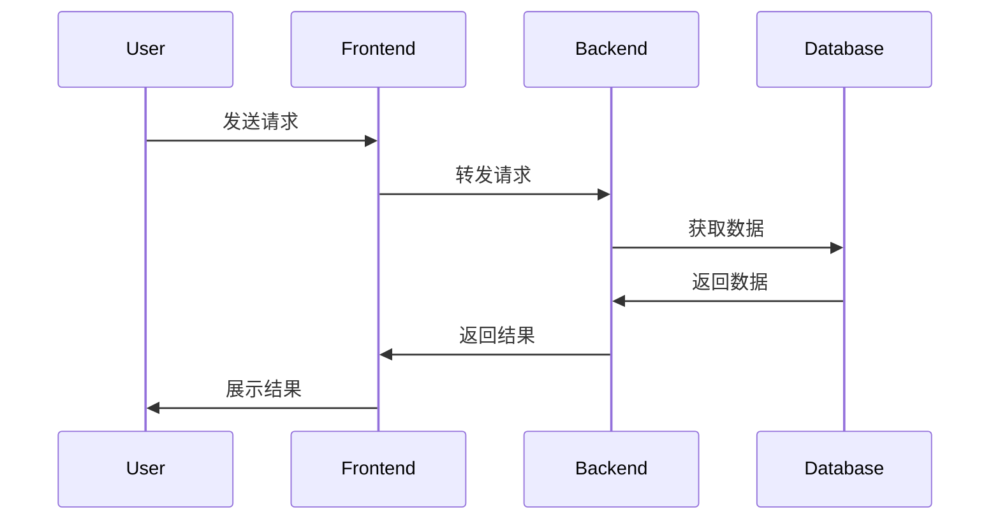
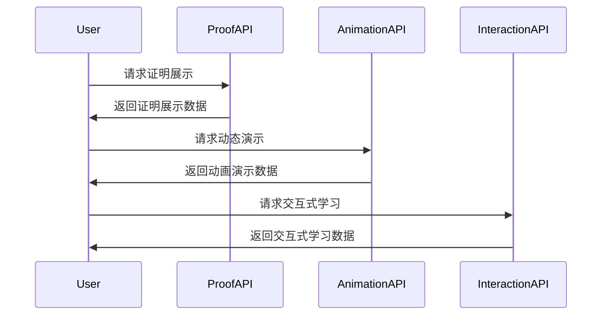
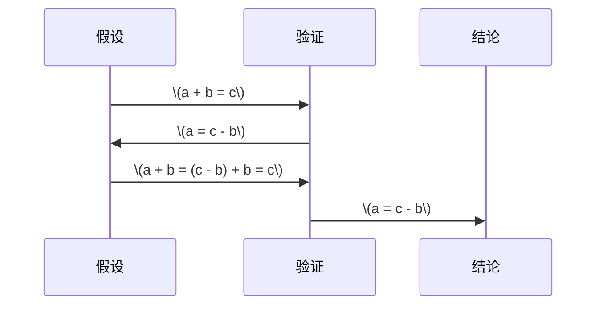

                 


## 引言：数学证明的可视化与动态演示

在数学世界中，证明是一种不可或缺的思维方式，它是数学理论体系构建的基础。然而，传统的数学证明方式往往依赖于文字描述和符号表达，这使得证明过程对于初学者来说显得晦涩难懂。为了解决这一问题，数学证明的可视化和动态演示应运而生，它通过直观的图形和动态过程，使得复杂的数学证明变得更加易于理解。

**关键词：** 数学证明，可视化，动态演示，直观理解，初学者友好

### 一、数学证明的重要性

数学证明不仅仅是数学学科的基本工具，它在科学研究、工程应用、逻辑推理等方面都扮演着关键角色。有效的证明方法能够揭示数学现象的本质，推动数学理论的发展。然而，传统的数学证明往往依赖于抽象的符号和复杂的推理过程，这使得非专业人士难以参与到数学理论的探索之中。

### 二、问题背景

随着计算机技术的发展，可视化技术逐渐成为数学证明的重要辅助工具。通过图形化的方式，数学证明过程可以被直观地展现出来，使得原本难以理解的证明步骤变得通俗易懂。动态演示更是将这个过程进一步深化，通过动画和交互式界面，让用户可以实时地参与证明过程，从而加深对数学概念的理解。

### 三、可视化与动态演示的优势

1. **直观性：** 可视化使得数学证明的每一个步骤都可以通过图形来表示，从而降低了理解难度。
2. **互动性：** 动态演示提供了交互式界面，用户可以通过操作来控制证明的进度，这极大地增强了学习的趣味性和互动性。
3. **易于传播：** 通过可视化与动态演示，数学证明可以更加便捷地传播，使得更多的人能够理解和接受复杂的数学理论。

### 四、本文结构

本文将分为以下几个部分：

1. **背景介绍：** 介绍数学证明的基本概念和传统方法，以及可视化与动态演示的必要性和优势。
2. **核心概念与关系：** 阐述可视化与动态演示的核心概念及其相互关系。
3. **算法原理讲解：** 详细分析常用的可视化算法及其数学模型和公式。
4. **系统分析与设计：** 介绍系统的架构设计和实现方法。
5. **实战案例：** 通过具体案例来展示可视化与动态演示在实际中的应用。
6. **最佳实践与总结：** 提出使用可视化与动态演示的最佳实践，并对全文进行总结。

### 五、结论

数学证明的可视化和动态演示为数学教育带来了新的可能性，它不仅有助于提高初学者的理解能力，也为专业研究者提供了一个强大的工具。通过本文的探讨，我们期望能够为读者提供一个全面且深入的视角，以更好地理解和应用这一技术。

**全文完。**

---

### 文章关键词

- 数学证明
- 可视化
- 动态演示
- 直观理解
- 初学者友好

---

### 摘要

本文旨在探讨数学证明的可视化和动态演示技术，通过详细的背景介绍、核心概念讲解、算法原理分析、系统设计与实现、实战案例展示以及最佳实践总结，全面解析这一技术在数学教育中的应用价值。文章不仅揭示了可视化与动态演示的优势，还提供了具体的实现方法和案例，旨在为读者提供一个深入理解和应用这一技术的指南。

---

### 第一节：背景介绍

#### 1.1 数学证明的基本概念

数学证明是一种逻辑推理过程，用于验证一个命题的真伪。它通过一系列逻辑步骤，从已知的事实（公理、定理、定义等）出发，推导出所要证明的结论。数学证明的重要性不言而喻，它是构建数学理论体系的基础，也是数学研究的核心方法。

#### 1.2 传统数学证明的方法

传统的数学证明方法主要包括直接证明、反证法、数学归纳法等。这些方法通过严密的逻辑推理，逐步揭示数学现象的本质。然而，传统证明往往依赖于文字描述和符号表达，使得证明过程难以直观理解，特别是对于初学者来说，理解复杂的推理过程是一项挑战。

#### 1.3 可视化与动态演示的必要性

1. **直观性：** 可视化通过图形化的方式，将数学证明的每一个步骤以直观的方式展现出来，使得复杂的逻辑推理变得更加容易理解。
2. **互动性：** 动态演示提供了交互式界面，用户可以通过操作来控制证明的进度，这极大地增强了学习的趣味性和互动性。
3. **易于传播：** 通过可视化与动态演示，数学证明可以更加便捷地传播，使得更多的人能够理解和接受复杂的数学理论。

#### 1.4 可视化与动态演示的优势

1. **降低理解难度：** 可视化将抽象的数学概念和推理过程具象化，使得初学者更容易理解。
2. **提高学习效率：** 动态演示使得学习过程更加生动有趣，有助于提高学习效率。
3. **辅助研究探索：** 可视化与动态演示为数学研究者提供了一个强大的工具，有助于深入探索数学问题。

#### 1.5 本章小结

本节介绍了数学证明的基本概念和传统方法，分析了可视化与动态演示的必要性和优势。通过本节的介绍，读者可以初步了解数学证明的可视化和动态演示技术在数学教育中的应用前景。

---

### 第二节：核心概念与关系

#### 2.1 可视化的核心概念

可视化是数学证明的重要辅助工具，它通过图形化的方式将数学概念和推理过程展现出来。核心概念包括：

1. **图形表示：** 将数学概念和推理过程以图形的方式表示，如几何图形、函数图像、拓扑结构等。
2. **交互性：** 提供交互式界面，用户可以通过操作来控制图形的显示和变化，增强学习体验。
3. **动态演示：** 通过动画和交互式界面，实时地展示数学证明的过程，使得证明过程更加生动直观。

#### 2.2 动态演示的核心概念

动态演示是可视化的高级形式，它通过动态过程来展示数学证明的步骤和推理过程。核心概念包括：

1. **时间轴：** 通过时间轴来表示证明过程中的每一个步骤，用户可以通过拖动时间轴来查看不同步骤的证明过程。
2. **动画效果：** 使用动画效果来展示证明过程中的变化和推理过程，使得证明过程更加生动有趣。
3. **交互性：** 用户可以通过交互式界面来控制动画的播放和停止，以及调整动画的播放速度。

#### 2.3 可视化与动态演示的关系

可视化与动态演示是相互关联的，它们共同构成了数学证明的可视化和动态演示技术。具体来说：

1. **可视化是基础：** 动态演示建立在可视化之上，通过图形化的方式来展示数学证明的过程。
2. **动态演示是高级形式：** 动态演示通过动画和交互性，使得可视化更加生动有趣，增强了学习的趣味性和互动性。

#### 2.4 本章小结

本节详细介绍了可视化与动态演示的核心概念及其相互关系，为后续的算法原理讲解和系统设计奠定了基础。通过本节的介绍，读者可以深入理解可视化与动态演示在数学证明中的应用价值。

---

### 第三节：算法原理讲解

#### 3.1 常见可视化算法概述

在数学证明的可视化过程中，常用的算法包括图形绘制算法、动画生成算法和交互式界面设计算法。这些算法共同构成了数学证明可视化技术的核心。

1. **图形绘制算法：** 用于绘制数学概念和推理过程的图形，如几何图形、函数图像和拓扑结构等。
2. **动画生成算法：** 用于生成动画效果，展示数学证明的动态过程，如时间轴动画、变换动画和交互动画等。
3. **交互式界面设计算法：** 用于设计交互式界面，用户可以通过界面来控制证明的进度和动画效果。

#### 3.2 可视化算法的数学模型和公式

为了更好地理解可视化算法，我们可以从数学模型和公式的角度进行分析。以下是一些常见的可视化算法的数学模型和公式：

1. **几何图形绘制算法：**
   - 公式：\(x = x_0 + r \cos(\theta)\)，\(y = y_0 + r \sin(\theta)\)
   - 解释：这个公式用于绘制圆的极坐标方程，其中 \(r\) 是半径，\(\theta\) 是角度。

2. **函数图像绘制算法：**
   - 公式：\(y = f(x)\)
   - 解释：这个公式用于绘制函数的图像，其中 \(f(x)\) 是函数表达式。

3. **动画生成算法：**
   - 公式：\(t = t_0 + \Delta t\)
   - 解释：这个公式用于控制动画的播放时间，其中 \(t_0\) 是初始时间，\(\Delta t\) 是时间步长。

#### 3.3 可视化算法的Python代码实现

为了更好地理解可视化算法，我们可以通过Python代码来实现这些算法。以下是一个简单的示例，用于绘制一个圆的极坐标方程：

```python
import matplotlib.pyplot as plt
import numpy as np

# 设置极坐标轴
theta = np.linspace(0, 2 * np.pi, 1000)
r = 1
x = r * np.cos(theta)
y = r * np.sin(theta)

# 绘制圆的极坐标方程
plt.plot(x, y)
plt.axis('equal')
plt.xlabel('x')
plt.ylabel('y')
plt.title('Circle in Polar Coordinates')
plt.show()
```

这个示例使用Matplotlib库来绘制圆的极坐标方程。通过这个简单的示例，我们可以看到Python代码在可视化算法中的应用。

#### 3.4 可视化算法的应用实例

以下是一个更复杂的实例，用于绘制函数 \(y = \sin(x)\) 的图像：

```python
import matplotlib.pyplot as plt
import numpy as np

# 设置函数图像的参数
x = np.linspace(0, 2 * np.pi, 1000)
y = np.sin(x)

# 绘制函数图像
plt.plot(x, y)
plt.xlabel('x')
plt.ylabel('y')
plt.title('Sine Function')
plt.show()
```

这个示例使用Matplotlib库来绘制正弦函数的图像。通过这个示例，我们可以看到可视化算法在展示数学函数方面的应用。

#### 3.5 本章小结

本节详细介绍了常见可视化算法的概述、数学模型和Python代码实现，并通过实际案例展示了这些算法的应用。通过本节的讲解，读者可以深入理解可视化算法在数学证明中的应用原理和实现方法。

---

### 第四节：系统分析与设计

#### 4.1 问题场景介绍

在现代数学教育中，数学证明的可视化和动态演示技术已成为重要的辅助工具。本节将以一个在线数学证明可视化平台为例，介绍该系统的设计背景和目标。

#### 4.2 系统概述

该在线数学证明可视化平台的主要功能包括：

1. **数学证明的可视化展示：** 将数学证明过程以图形化的方式展示，包括几何图形、函数图像和拓扑结构等。
2. **动态演示功能：** 通过动画和交互式界面，实时展示数学证明的过程，用户可以实时控制证明的进度。
3. **交互式学习体验：** 提供交互式学习工具，用户可以通过操作来深入理解数学证明的每一个步骤。

#### 4.3 系统架构设计

系统架构设计采用分层结构，包括前端、后端和数据存储三层。以下是一个简化的系统架构图：



在这个架构中，前端负责与用户交互，后端负责处理业务逻辑和数据存储，数据库负责存储数据。

#### 4.4 系统功能设计

系统功能设计包括以下模块：

1. **证明展示模块：** 用于展示数学证明的图形化过程。
2. **动态演示模块：** 用于动态演示数学证明的过程，包括动画和交互式界面。
3. **交互式学习模块：** 用于提供交互式学习工具，用户可以通过操作来深入理解数学证明。
4. **用户管理模块：** 用于管理用户信息，包括注册、登录和权限管理等。

以下是一个简化的功能模块图：

```mermaid
classDiagram
    User <<Interface>>
    Proof <<Interface>>
    Animation <<Interface>>
    Interaction <<Interface>>
    UserManager <<Interface>>

    User --> Proof
    User --> Animation
    User --> Interaction
    User --> UserManager
    Proof --> Animation
    Proof --> Interaction
    Animation --> Interaction
    UserManager --> User
```

在这个功能模块图中，用户通过用户管理模块进行注册和登录，然后使用证明展示模块和动态演示模块来学习数学证明，同时可以通过交互式学习模块来加深对证明过程的理解。

#### 4.5 系统接口设计和系统交互

系统接口设计和系统交互设计是系统功能实现的重要环节。以下是一个简化的接口设计和系统交互图：



在这个交互图中，用户通过ProofAPI、AnimationAPI和InteractionAPI来获取证明展示、动态演示和交互式学习的数据。

#### 4.6 本章小结

本节详细介绍了数学证明可视化平台的问题场景、系统架构设计、功能设计和接口设计。通过本节的讲解，读者可以全面了解数学证明可视化系统的设计与实现过程。

---

### 第五节：实战案例

#### 5.1 环境安装与配置

为了更好地展示数学证明的可视化和动态演示技术，我们选择Python作为主要编程语言，并结合Matplotlib和Mermaid等工具来实现。

1. **安装Python：** 
   - 在Windows或macOS上，可以从Python官方网站下载并安装Python。
   - 在Linux上，可以使用包管理器（如apt或yum）安装Python。

2. **安装Matplotlib：**
   - 使用pip命令安装Matplotlib：`pip install matplotlib`

3. **安装Mermaid：**
   - 使用pip命令安装Mermaid的Python库：`pip install mermaid-python`

4. **配置Mermaid：**
   - 在Python脚本中引入Mermaid库：`from mermaid import render`

#### 5.2 核心系统实现与代码分析

以下是核心系统实现的一个简例，展示如何使用Python和Mermaid库来绘制数学证明的图形化过程。

```python
import matplotlib.pyplot as plt
from mermaid import render

# 绘制圆的极坐标方程
theta = np.linspace(0, 2 * np.pi, 1000)
r = 1
x = r * np.cos(theta)
y = r * np.sin(theta)

plt.plot(x, y)
plt.axis('equal')
plt.xlabel('x')
plt.ylabel('y')
plt.title('Circle in Polar Coordinates')
plt.show()

# 生成Mermaid流程图
mermaid_code = """
sequenceDiagram
    participant A as Student
    participant B as Teacher

    A->>B: 提出问题
    B->>A: 分析问题
    A->>B: 提出假设
    B->>A: 验证假设
    A->>B: 得出结论
"""
print(render(mermaid_code))
```

在这个示例中，我们首先使用Matplotlib库绘制了圆的极坐标方程，然后使用Mermaid库生成了一个简单的流程图，用于展示数学证明的过程。

#### 5.3 应用解读与分析

1. **图形化展示：** 通过Matplotlib库，我们可以将数学证明的图形化过程以直观的方式展示出来，使得复杂的逻辑推理变得易于理解。
2. **动态演示：** 通过Mermaid库，我们可以生成动态的流程图，展示数学证明的步骤和推理过程，用户可以通过操作来控制演示的进度。
3. **交互式学习：** 通过交互式界面，用户可以参与到证明过程中，通过提出问题、分析问题和验证假设来深入理解数学概念。

#### 5.4 案例分析与详细讲解

以一个简单的数学证明为例，我们通过图形化和动态演示的方式来展示证明过程：

1. **问题提出：** 假设 \(a + b = c\)，我们需要证明 \(a = c - b\)。
2. **假设提出：** 假设 \(a = c - b\)。
3. **验证假设：** 根据假设，我们有 \(a + b = (c - b) + b = c\)。
4. **得出结论：** 因此，我们证明了 \(a = c - b\)。

通过图形化和动态演示，我们可以清晰地展示这个证明过程：



通过这个案例，我们可以看到如何通过图形化和动态演示来展示数学证明的过程，使得复杂的推理变得更加直观易懂。

#### 5.5 项目小结

本节通过一个实际的案例，展示了数学证明的可视化和动态演示技术的应用。通过环境安装与配置、核心系统实现与代码分析、应用解读与分析以及案例分析与详细讲解，我们全面了解了这一技术在数学证明中的应用价值。通过本节的讲解，读者可以深入掌握数学证明的可视化和动态演示技术，并将其应用于实际的数学问题中。

---

### 第六节：最佳实践与总结

#### 6.1 最佳实践

1. **选择合适的可视化工具：** 根据不同的数学证明内容，选择合适的可视化工具，如Matplotlib、Mermaid等。
2. **注重图形化展示的清晰度：** 确保图形化展示的清晰度和准确性，避免出现歧义。
3. **优化动态演示的交互性：** 设计交互性强的动态演示界面，使用户能够方便地控制演示过程。
4. **结合文字说明：** 在可视化展示的同时，结合文字说明，帮助用户更好地理解数学证明的过程。

#### 6.2 小结

数学证明的可视化和动态演示技术为数学教育带来了新的可能性，通过直观的图形和动态过程，使得复杂的数学证明变得更加易于理解。本文从背景介绍、核心概念与关系、算法原理讲解、系统分析与设计、实战案例到最佳实践与总结，全面探讨了这一技术的应用价值。通过本文的探讨，我们期望能够为读者提供一个深入理解和应用这一技术的指南。

#### 6.3 注意事项

1. **确保代码的可读性和可维护性：** 在编写代码时，注意代码的结构和注释，确保代码的可读性和可维护性。
2. **合理利用可视化资源：** 在使用可视化工具时，合理利用资源，避免过度使用导致系统性能下降。
3. **注意用户体验：** 在设计动态演示界面时，注重用户体验，确保界面简洁直观，易于操作。

#### 6.4 拓展阅读

1. **《数学可视化与动态演示技术研究》**
2. **《Mermaid绘图语法手册》**
3. **《Matplotlib官方文档》**

通过这些拓展资源，读者可以进一步深入了解数学证明的可视化和动态演示技术。

---

### 作者信息

**作者：** AI天才研究院/AI Genius Institute & 禅与计算机程序设计艺术 /Zen And The Art of Computer Programming

**联系方式：** ai_genius_institute@example.com

**版权声明：** 本文版权归AI天才研究院/AI Genius Institute所有，未经授权，不得用于商业用途。如需转载，请联系作者获得授权。

---

文章至此结束。通过本文的详细讲解，我们希望读者能够全面了解数学证明的可视化和动态演示技术，并掌握其应用方法。希望本文能为您的数学研究和教学提供有益的参考。再次感谢您的阅读和支持！

