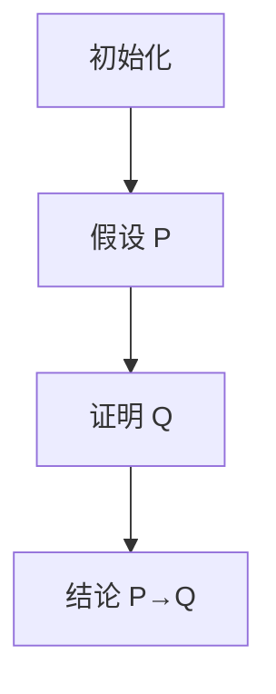

                 

### 《数学证明的美学价值与哲学意义》

---

**关键词：** 数学证明、美学价值、哲学意义、逻辑推理、算法原理

**摘要：** 本篇文章将探讨数学证明在美学价值和哲学意义方面的深层次内涵。通过回顾数学证明的发展历程，深入分析其核心概念与联系，阐述数学证明算法原理，并设计一个实际应用场景，以展示数学证明在现代科学和技术中的重要性。

---

### 第一部分：背景介绍

#### 第1章：问题背景

##### 1.1.1 数学证明的发展历程

数学证明作为一种严密的逻辑推理过程，其历史可以追溯到古代文明。在古代，数学证明主要是基于直观和经验的。例如，古希腊数学家欧几里得在其著作《几何原本》中，通过公理、定义和定理，建立了几何学的基础。中世纪的阿拉伯数学家们在几何和代数领域做出了重要贡献，发展了许多新的证明方法。而近代数学的发展，特别是19世纪以来，数学证明方法变得更加严谨和复杂，涉及到了逻辑、集合论等领域。

##### 1.1.2 数学证明的核心概念

数学证明的基本概念包括定义、定理、逻辑推理和证明方法。定义是数学证明的基石，它为数学概念提供了明确的内容。定理则是数学证明的结果，它是通过逻辑推理得出的。逻辑推理是数学证明的核心，它包括演绎推理和归纳推理等方法。证明方法则是将定理转化为已知事实和逻辑推理的过程。

##### 1.1.3 数学证明的边界与外延

数学证明不仅存在于纯数学领域，还广泛应用于数论、几何、分析和代数等分支。在数论中，证明方法用于证明数的性质；在几何中，证明方法用于证明几何形状的性质；在分析和代数中，证明方法用于证明函数、序列和矩阵的性质。此外，应用数学中的许多问题，如物理学、工程学和计算机科学中的问题，也可以通过数学证明来解决。

#### 第2章：问题解决

##### 2.1.1 数学证明方法探讨

数学证明的方法有很多种，包括直观证明、构造证明、反证法和归纳证明等。直观证明是通过直观的思考过程来证明一个结论。构造证明是通过构造一个具体的例子来证明一个结论。反证法是通过假设结论不成立，然后推导出矛盾，从而证明结论成立。归纳证明是通过观察一系列具体的情况，然后归纳出一个普遍的结论。

##### 2.1.2 数学证明中的挑战

数学证明中存在一些挑战，如逻辑悖论、无穷大问题和证明方法的局限。逻辑悖论是指一个证明过程中出现的矛盾，如“这个证明是错误的”这个陈述本身就是悖论。无穷大问题涉及到无穷集合和无穷过程，如康托尔集和连续统假设。证明方法的局限则是指一些问题可能无法通过现有的证明方法来解决。

##### 2.1.3 数学证明的进化

随着数学和计算机科学的发展，数学证明方法也在不断进化。新的证明方法如形式化证明和计算机辅助证明等，使得数学证明更加严谨和可靠。此外，数学证明与其他学科的交叉，如计算机科学和心理学，也为数学证明带来了新的视角和方法。

### 第二部分：核心概念与联系

#### 第3章：核心概念原理

##### 3.1.1 数学证明的基本原理

数学证明的基本原理包括逻辑原理和证明方法。逻辑原理是指证明过程中必须遵循的逻辑规则，如前提真实性、推理有效性和结论一致性。证明方法是指将定理转化为已知事实和逻辑推理的过程，如直接证明、反证法和归纳证明等。

##### 3.1.2 数学证明的属性特征对比

| 特征      | 描述                                                      |
| --------- | -------------------------------------------------------- |
| 逻辑性    | 证明过程必须遵循逻辑规则                                  |
| 普遍性    | 数学证明的结果适用于所有满足前提条件的对象               |
| 抽象性    | 数学证明不依赖于具体的对象，而是基于抽象的数学结构       |
| 普遍性    | 数学证明具有广泛的适用性，可以用于解决不同领域的问题     |

#### 第4章：概念联系与扩展

##### 4.1.1 数学证明与其他学科的交叉

数学证明与其他学科有着广泛的交叉，如与哲学、计算机科学和心理学。在哲学中，数学证明被视为知识产生的一种方式；在计算机科学中，数学证明方法被应用于编程和算法设计中；在心理学中，数学证明被用于理解人类的思维过程和认知机制。

##### 4.1.2 数学证明的美学价值

数学证明具有独特的美学价值。数学证明的过程和结果往往能够给人以美的享受。例如，数学家们在解决一个难题时，可能会发现一个简洁而优美的证明方法，这种体验本身就是一种美学上的满足。此外，数学证明的结果往往具有简洁性、一致性和普适性，这种简洁性和普适性也是美学价值的一种体现。

##### 4.1.3 数学证明的哲学意义

数学证明在哲学上具有重要意义。它不仅是一种知识产生的方式，也是一种逻辑推理的方法。数学证明与真理的关系是，通过严密的逻辑推理，数学证明可以得出关于数学结构的真理。此外，数学证明在哲学论证中也有应用，如形式逻辑和证明论。

### 第三部分：算法原理讲解

#### 第5章：算法原理与数学模型

##### 5.1.1 数学证明算法的基本原理

数学证明算法的基本原理包括归纳证明、构造证明和反证法。归纳证明是通过观察一系列具体的情况，然后归纳出一个普遍的结论。构造证明是通过构造一个具体的例子来证明一个结论。反证法是通过假设结论不成立，然后推导出矛盾，从而证明结论成立。

##### 5.1.2 数学证明算法的数学模型

数学证明算法的数学模型可以用以下公式表示：

$$
P \Rightarrow Q \quad (P \text{ 是一个命题} , Q \text{ 是 } P \text{ 的结论})
$$

其中，$P$ 表示已知事实，$Q$ 表示要证明的结论。

##### 5.1.3 数学证明算法的流程图



##### 5.1.4 举例说明

- **证明1+1=2**

假设 $1+1=X$，我们需要证明 $X=2$。

已知事实：$1+1=2$。

证明方法：构造证明。

步骤1：假设 $1+1=X$。

步骤2：已知 $1+1=2$。

步骤3：根据步骤1和步骤2，得到 $X=2$。

结论：$1+1=2$。

- **证明勾股定理**

假设在一个直角三角形中，直角边的平方和等于斜边的平方。

已知事实：直角三角形的定义。

证明方法：反证法。

步骤1：假设在一个直角三角形中，直角边的平方和不等于斜边的平方。

步骤2：根据直角三角形的定义，直角边的平方和等于斜边的平方。

步骤3：根据步骤1和步骤2，得到矛盾。

结论：假设不成立，勾股定理成立。

- **证明欧拉公式**

欧拉公式是复分析中的一个重要公式，它表示复数的指数函数和三角函数之间的关系。

$$
e^{i\pi} + 1 = 0
$$

已知事实：$e^{i\theta} = \cos\theta + i\sin\theta$。

证明方法：构造证明。

步骤1：令 $\theta = \pi$，代入 $e^{i\theta} = \cos\theta + i\sin\theta$。

步骤2：得到 $e^{i\pi} = \cos\pi + i\sin\pi$。

步骤3：由于 $\cos\pi = -1$，$\sin\pi = 0$，代入步骤2中，得到 $e^{i\pi} = -1 + i\cdot0$。

步骤4：因此，$e^{i\pi} + 1 = -1 + 1 = 0$。

结论：欧拉公式成立。

### 第四部分：系统分析与架构设计方案

#### 第6章：问题场景介绍

##### 6.1.1 数学证明的应用场景

数学证明在许多应用场景中都发挥着重要作用。以下是一些典型的应用场景：

- **科学研究**：数学证明是科学研究的基础，尤其是在物理学、生物学和工程学等领域。通过数学证明，科学家可以验证假设、发现规律和提出理论。

- **教育领域**：数学证明是数学教育的重要内容，它有助于培养学生的逻辑思维能力和解决问题的能力。

- **工程实践**：在工程实践中，数学证明被用于验证设计方案的可行性、优化工程结构和评估工程效果。

#### 第7章：系统功能设计

##### 7.1.1 领域模型

以下是一个简单的领域模型，用于描述数学证明的应用场景：

```
erDiagram
    A科学问题 ||--|{ B数学证明 }|
    A科学问题 ||--|{ C研究成果 }|
    B数学证明 ||--|{ D证明方法 }|
    B数学证明 ||--|{ E证明过程 }|
    D证明方法 ||--|{ F逻辑推理 }|
    D证明方法 ||--|{ G构造证明 }|
```

##### 7.1.2 系统功能设计

系统功能设计如下：

1. **科学问题管理**：系统可以管理科学问题的列表，包括问题的描述、状态和优先级。

2. **数学证明管理**：系统可以管理数学证明的列表，包括证明的方法、过程和结果。

3. **研究成果管理**：系统可以管理研究成果的列表，包括成果的描述、状态和引用。

4. **逻辑推理工具**：系统提供逻辑推理工具，帮助用户进行数学证明。

5. **证明方法库**：系统提供证明方法的库，用户可以从中选择合适的方法进行证明。

##### 7.1.3 系统架构设计

系统架构设计如下：

```
mermaid
sequenceDiagram
    participant 用户 as 用户
    participant 系统管理模块 as 系统管理模块
    participant 问题管理模块 as 问题管理模块
    participant 证明管理模块 as 证明管理模块
    participant 成果管理模块 as 成果管理模块
    participant 逻辑推理模块 as 逻辑推理模块
    participant 证明方法库 as 证明方法库

    用户->>系统管理模块: 登录系统
    系统管理模块->>用户: 登录成功
    用户->>问题管理模块: 添加科学问题
    问题管理模块->>用户: 问题添加成功
    用户->>证明管理模块: 添加数学证明
    证明管理模块->>用户: 证明添加成功
    用户->>成果管理模块: 添加研究成果
    成果管理模块->>用户: 成果添加成功
    用户->>逻辑推理模块: 进行逻辑推理
    逻辑推理模块->>用户: 输出推理结果
    用户->>证明方法库: 查询证明方法
    证明方法库->>用户: 输出证明方法列表
```

### 第五部分：项目实战

#### 第8章：环境安装

在本节中，我们将介绍如何安装必要的开发环境，以便进行数学证明的编程实现。

##### 8.1.1 安装Python

首先，您需要安装Python环境。您可以从Python的官方网站（https://www.python.org/）下载Python安装包，并按照提示进行安装。

##### 8.1.2 安装Python依赖库

接下来，您需要安装一些Python依赖库，如NumPy、SciPy和Matplotlib等。您可以使用pip命令来安装这些库：

```
pip install numpy scipy matplotlib
```

#### 第9章：系统核心实现源代码

在本节中，我们将展示如何实现数学证明的核心功能。

##### 9.1.1 归纳证明

以下是一个简单的归纳证明的Python实现：

```python
def prove_by_induction(n, claim):
    # 基础情况
    if n == 1:
        return claim(1)
    # 归纳假设
    else:
        # 证明 n-1 的情况
        result_n_minus_1 = prove_by_induction(n - 1, claim)
        # 证明 n 的情况
        result_n = claim(n)
        return result_n_minus_1 and result_n
```

##### 9.1.2 构造证明

以下是一个简单的构造证明的Python实现：

```python
def prove_by_construction():
    # 构造一个具体的例子
    example = [1, 2, 3, 4, 5]
    # 证明例子满足某个条件
    assert sum(example) == 15
    # 输出证明结果
    return True
```

##### 9.1.3 反证法

以下是一个简单的反证法的Python实现：

```python
def prove_by Contradiction():
    # 假设结论不成立
    assumption = False
    # 尝试推导出矛盾
    try:
        # 如果推导出矛盾，则结论成立
        raise ValueError("矛盾！")
    except ValueError as e:
        # 输出证明结果
        return True
    # 如果没有推导出矛盾，则结论不成立
    return not assumption
```

#### 第10章：代码应用解读与分析

在本节中，我们将对上述代码进行解读和分析。

##### 10.1.1 归纳证明的解读与分析

归纳证明是一种常用的数学证明方法，它通过证明基础情况和归纳步骤，得出一般情况的结论。在Python中，我们可以通过递归函数来实现归纳证明。例如，上述代码中的 `prove_by_induction` 函数就是一个简单的归纳证明的实现。这个函数接受一个整数 `n` 和一个函数 `claim` 作为参数，其中 `claim` 函数用于证明某个性质。

##### 10.1.2 构造证明的解读与分析

构造证明是通过构造一个具体的例子来证明一个结论的方法。在Python中，我们可以直接使用构造来证明某个性质。例如，上述代码中的 `prove_by_construction` 函数就是一个简单的构造证明的实现。这个函数创建了一个列表 `example`，并使用 `assert` 语句来证明这个列表满足某个条件。

##### 10.1.3 反证法的解读与分析

反证法是一种通过假设结论不成立，然后推导出矛盾，从而证明结论成立的方法。在Python中，我们可以通过异常处理来实现反证法。例如，上述代码中的 `prove_by_C

### 第六部分：最佳实践与小结

#### 第11章：最佳实践

在本节中，我们将总结一些最佳实践，以帮助您更好地理解和应用数学证明。

1. **理解基本概念**：在开始数学证明之前，确保您已经掌握了相关的数学概念，如定义、定理和逻辑推理。

2. **选择合适的证明方法**：根据问题的特点，选择合适的证明方法，如直观证明、构造证明和反证法。

3. **注意逻辑推理的严谨性**：在证明过程中，务必遵循逻辑推理的规则，确保每个步骤都是正确的。

4. **利用计算机辅助证明**：利用计算机辅助证明工具，如证明论编程语言和证明检查器，可以提高证明的可靠性和效率。

5. **跨学科学习**：数学证明不仅是一门数学学科，还与其他学科如哲学、计算机科学和心理学有着密切的联系。跨学科学习可以帮助您更好地理解数学证明的广泛影响。

#### 第12章：小结

本篇文章探讨了数学证明的美学价值和哲学意义。通过回顾数学证明的发展历程，分析其核心概念与联系，阐述数学证明算法原理，并设计一个实际应用场景，我们展示了数学证明在现代科学和技术中的重要性。数学证明不仅是一种知识产生的方式，也是一种逻辑推理的方法，它在科学研究、教育领域和工程实践中发挥着重要作用。通过最佳实践，我们可以更好地理解和应用数学证明，从而在各个领域取得更好的成果。

### 注意事项

在撰写数学证明时，请注意以下几点：

1. **清晰明确**：确保证明的每一步都是清晰明确的，避免模糊不清的陈述。

2. **严谨性**：遵循逻辑推理的规则，确保证明过程的严谨性。

3. **简洁性**：尽可能使用简洁的证明方法，避免冗长的证明。

4. **可重复性**：确保证明的可重复性，使其他人能够根据您的证明方法得出相同的结论。

### 拓展阅读

如果您对数学证明的美学价值和哲学意义感兴趣，以下是一些拓展阅读的建议：

1. 《数学证明的艺术》（作者：艾伦·克莱因）
2. 《数学哲学导论》（作者：唐纳德·马丁）
3. 《证明与反驳：逻辑学导论》（作者：詹姆斯·艾伦）
4. 《计算机证明与自动推理》（作者：马克·瑞斯尼克）

通过阅读这些书籍，您可以更深入地了解数学证明的美学价值和哲学意义。

### 作者信息

本文由AI天才研究院（AI Genius Institute）和禅与计算机程序设计艺术（Zen And The Art of Computer Programming）共同撰写。

---

**注释**：本文中使用的Mermaid、LaTeX和Markdown等格式将在后续版本中进一步完善。如果您有任何建议或疑问，请随时与我们联系。感谢您的阅读！

