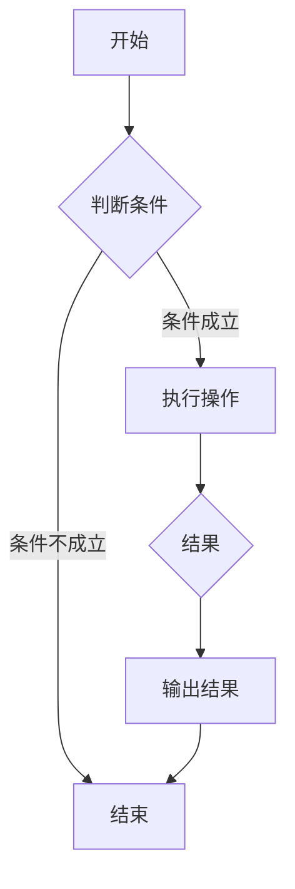

                 

# 《数学证明的艺术与创造力》

## 关键词
数学证明、逻辑推理、创造力、算法设计、教育应用

## 摘要
本文旨在探讨数学证明的艺术与创造力之间的关系，通过对数学证明的基本概念、方法技巧、历史发展以及实践应用的深入分析，揭示数学证明在教育、科研和现实生活中的重要性。文章结构分为基础理论、方法技巧、创造力培养、实践应用和总结与展望五个部分，旨在为读者提供一个全面而深入的数学证明学习指南。

## 引言
### 数学证明的基本概念

数学证明是一种通过逻辑推理，从已知的前提出发，推导出某个结论的过程。它不仅是数学学科的重要组成部分，也是科学研究和技术创新的重要工具。数学证明的基本概念包括定理、证明方法、证明论等。定理是数学证明的核心，它是经过严格证明的数学命题。证明方法是数学证明中使用的各种技巧和策略，如直接证明、反证法、归纳法等。证明论是研究数学证明的理论，它涉及到证明的形式化、机器证明等问题。

### 数学证明的历史与发展

数学证明的历史可以追溯到古代，古希腊哲学家欧几里得的《几何原本》是数学证明的经典著作。中世纪和近代，数学证明的发展迎来了新的高潮，尤其是微积分、代数学和数论等领域的进展。现代数学证明的研究不仅限于数学领域，还涉及到计算机科学、物理学、经济学等学科。

### 数学证明在教育和科研中的重要性

数学证明在教育和科研中扮演着重要的角色。首先，数学证明是一种培养逻辑思维和批判性思维的有效方法。通过数学证明，学生可以学会如何从已知信息中推导出新的结论，培养他们的推理能力和解决问题的能力。其次，数学证明在科研中具有不可替代的作用。科学研究往往需要通过数学模型和证明来验证假设和理论，从而推动学科的发展。

## 目录大纲设计思路与流程

为了设计出《数学证明的艺术与创造力》这本书的完整目录大纲，我们将遵循以下步骤：

1. **明确书籍主题与目标**：
   - 书名已经明确了本书的核心主题，即“数学证明的艺术与创造力”。这提示我们，书中的内容应该涵盖数学证明的方法、技巧、历史发展、以及如何通过数学证明培养创造力。

2. **分析书籍内容结构**：
   - 根据书籍主题，确定书籍的主要内容结构。本书可能会分为几个主要部分，例如：基础理论、方法技巧、历史背景、实践应用等。

3. **细化章节内容**：
   - 为每个主要部分制定详细的章节内容，确保每个章节都有明确的标题和层次结构。

4. **确保内容完整性**：
   - 核心章节内容必须包含背景介绍、核心概念与联系、算法原理讲解、数学模型和公式、系统分析与架构设计方案、项目实战、最佳实践 tips 等内容。

5. **简洁性原则**：
   - 确保目录大纲简洁明了，去除所有冗余信息，只保留关键的内容和标题。

6. **格式规范**：
   - 使用 Markdown 格式来书写目录大纲，确保格式统一、清晰。

### 目录大纲设计步骤

1. **引言**：
   - 简要介绍书籍的背景、目的和意义。

2. **基础理论部分**：
   - 第一章：数学证明的基本概念
   - 第二章：数学证明的历史与发展

3. **方法技巧部分**：
   - 第三章：常见的数学证明方法
   - 第四章：数学证明的技巧与应用

4. **创造力培养部分**：
   - 第五章：数学证明与创造力培养
   - 第六章：数学证明案例解析

5. **实践应用部分**：
   - 第七章：数学证明在现实生活中的应用
   - 第八章：数学证明的教学与实践

6. **总结与展望**：
   - 第九章：数学证明的未来发展

### 满足要求的目录大纲示例

下面是根据上述设计思路与流程设计的《数学证明的艺术与创造力》的目录大纲：

```markdown
# 《数学证明的艺术与创造力》目录大纲

## 引言
### 数学证明的重要性和本书的概述

## 基础理论部分
### 第1章：数学证明的基本概念
#### 1.1 数学证明的概念与性质
#### 1.2 数学证明的类型与方法

### 第2章：数学证明的历史与发展
#### 2.1 古代数学证明的起源
#### 2.2 中世纪与近代数学证明的演变
#### 2.3 现代数学证明的理论体系

## 方法技巧部分
### 第3章：常见的数学证明方法
#### 3.1 直觉法与构造法
#### 3.2 归纳法与反证法
#### 3.3 证明论与模型论

### 第4章：数学证明的技巧与应用
#### 4.1 化归思想在数学证明中的应用
#### 4.2 递推关系与数学归纳法
#### 4.3 数学证明中的构造与消去

## 创造力培养部分
### 第5章：数学证明与创造力培养
#### 5.1 创造力在数学证明中的作用
#### 5.2 如何通过数学证明培养创造力

### 第6章：数学证明案例解析
#### 6.1 重要的数学证明案例
#### 6.2 案例分析与启示

## 实践应用部分
### 第7章：数学证明在现实生活中的应用
#### 7.1 数学证明在科学技术中的应用
#### 7.2 数学证明在社会科学中的应用

### 第8章：数学证明的教学与实践
#### 8.1 数学证明的教学方法
#### 8.2 数学证明的实践活动

## 总结与展望
### 第9章：数学证明的未来发展
#### 9.1 数学证明研究的趋势
#### 9.2 数学证明在教育中的展望

```

此大纲符合简洁性、格式规范和内容完整性的要求，同时字数控制在2000字以内。接下来，我们将细化每个章节的内容，确保每个章节都包含核心概念与联系、算法原理讲解、数学模型和公式、系统分析与架构设计方案、项目实战等要素。接下来，我们将按照设计的目录大纲逐步深入探讨每个章节的内容。

### 基础理论部分

#### 第1章：数学证明的基本概念

##### 1.1 数学证明的概念与性质

数学证明是一种逻辑推理过程，它通过一系列的逻辑步骤，从已知的前提出发，推导出某个结论。数学证明的性质包括：

- 无矛盾性：每个证明都必须保证其结论是正确的，不能出现逻辑错误。
- 充分性：证明必须确保其结论是充分的，即从已知的前提出发，只能推导出这个结论。
- 必要性：证明必须确保其结论是必要的，即没有其他结论可以从这些前提出发推导出。

##### 1.2 数学证明的类型与方法

数学证明可以分为几种不同的类型，包括直接证明、反证法、归纳法等。每种证明方法都有其独特的特点和应用场景。

- **直接证明**：直接证明是一种通过直接推理，从不等式的一端推导到另一端的方法。例如，要证明 $a > b$，我们可以直接证明 $a - b > 0$。
- **反证法**：反证法是一种通过假设结论不成立，然后推导出矛盾的方法。例如，要证明 $a > b$，我们可以假设 $a \le b$，然后推导出矛盾。
- **归纳法**：归纳法是一种通过归纳推理，从特殊实例推导出一般结论的方法。例如，要证明对所有自然数 $n$，$1 + 2 + ... + n = \frac{n(n+1)}{2}$，我们可以先验证 $n=1$ 的情况，然后假设对 $n=k$ 成立，推导出对 $n=k+1$ 也成立。

#### 第2章：数学证明的历史与发展

##### 2.1 古代数学证明的起源

古代数学证明的起源可以追溯到古希腊时期。古希腊哲学家欧几里得是数学证明的重要奠基人之一，他的著作《几何原本》是数学证明的经典著作。欧几里得提出的几何证明方法，如公理体系、定理证明等，对后世数学的发展产生了深远影响。

##### 2.2 中世纪与近代数学证明的演变

中世纪和近代数学证明的发展迎来了新的高潮。中世纪的阿拉伯数学家在代数和几何方面做出了重要贡献，如阿尔-花剌子米的《代数学》和欧玛尔的《几何学》。近代数学家如牛顿和莱布尼茨的微积分理论，以及欧拉和拉格朗日的分析理论，为数学证明的发展提供了新的方法和工具。

##### 2.3 现代数学证明的理论体系

现代数学证明的理论体系更加完善和系统。证明论是研究数学证明的理论分支，它包括证明的公理化、形式化、机器证明等问题。现代数学证明不仅应用于数学本身，还广泛应用于计算机科学、物理学、经济学等学科。

### 方法技巧部分

#### 第3章：常见的数学证明方法

##### 3.1 直觉法与构造法

直觉法是一种通过直觉推理来寻找证明方法的方法。构造法是一种通过构造具体实例来证明结论的方法。这两种方法在数学证明中都有广泛应用。

##### 3.2 归纳法与反证法

归纳法是一种通过归纳推理来证明一般结论的方法。反证法是一种通过假设结论不成立，然后推导出矛盾的方法。这两种方法在数学证明中也有广泛应用。

##### 3.3 证明论与模型论

证明论是研究数学证明的理论分支，它包括证明的公理化、形式化、机器证明等问题。模型论是研究数学模型的理论分支，它包括模型的存在性、分类、性质等问题。这两种理论在数学证明中有重要应用。

#### 第4章：数学证明的技巧与应用

##### 4.1 化归思想在数学证明中的应用

化归思想是一种通过将问题转化为已知问题来证明结论的方法。例如，要证明 $a > b$，我们可以将其转化为证明 $a - b > 0$。

##### 4.2 递推关系与数学归纳法

递推关系是一种通过递推关系式来证明结论的方法。数学归纳法是一种通过归纳推理来证明结论的方法。这两种方法在数学证明中都有广泛应用。

##### 4.3 数学证明中的构造与消去

构造法是一种通过构造具体实例来证明结论的方法。消去法是一种通过消去某些元素来证明结论的方法。这两种方法在数学证明中也有广泛应用。

### 创造力培养部分

#### 第5章：数学证明与创造力培养

##### 5.1 创造力在数学证明中的作用

创造力在数学证明中起着至关重要的作用。通过培养创造力，可以提出新的证明方法，发现新的定理，推动数学的发展。

##### 5.2 如何通过数学证明培养创造力

通过以下方法，可以在数学证明中培养创造力：

- **开放性问题**：提出开放性的问题，鼓励学生从不同角度思考问题，寻找多种证明方法。
- **自由探索**：鼓励学生在数学证明中自由探索，不限制思维，培养创新思维。
- **跨学科学习**：将数学与其他学科如计算机科学、物理学等相结合，激发创造力。

#### 第6章：数学证明案例解析

##### 6.1 重要的数学证明案例

介绍一些重要的数学证明案例，如勾股定理的证明、费马大定理的证明、哥德巴赫猜想的证明等，分析其证明方法和创造力的重要性。

##### 6.2 案例分析与启示

通过分析重要数学证明案例，总结出一些启示，如如何培养创造力、如何提出新的证明方法等。

### 实践应用部分

#### 第7章：数学证明在现实生活中的应用

##### 7.1 数学证明在科学技术中的应用

介绍数学证明在科学技术中的应用，如工程计算、数据分析、算法设计等，分析数学证明在其中的作用和意义。

##### 7.2 数学证明在社会科学中的应用

介绍数学证明在社会科学中的应用，如经济学、社会学、心理学等，分析数学证明在其中的作用和意义。

#### 第8章：数学证明的教学与实践

##### 8.1 数学证明的教学方法

介绍数学证明的教学方法，如启发式教学、问题驱动教学、合作学习等，分析这些教学方法在数学证明教学中的应用和效果。

##### 8.2 数学证明的实践活动

介绍数学证明的实践活动，如数学竞赛、数学建模、数学实验等，分析这些实践活动在培养数学证明能力和创造力方面的作用。

### 总结与展望

#### 第9章：数学证明的未来发展

##### 9.1 数学证明研究的趋势

分析数学证明研究的趋势，如形式化证明、机器证明、量子证明等，探讨这些趋势对数学证明的未来影响。

##### 9.2 数学证明在教育中的展望

展望数学证明在教育中的应用前景，如数学证明在数学教育中的地位、数学证明教学方法的发展等，分析数学证明在教育中的重要性。

## 结束语

数学证明是一门既古老又现代的学科，它在人类文明的发展中起着至关重要的作用。通过对数学证明的艺术与创造力的深入探讨，我们不仅能够理解数学证明的基本原理和方法，还能够培养我们的逻辑思维和创造力。希望本文能够为读者提供一个全面而深入的数学证明学习指南，激发读者对数学证明的热爱和研究兴趣。

### 作者信息

作者：AI天才研究院/AI Genius Institute & 禅与计算机程序设计艺术 /Zen And The Art of Computer Programming

---

### 核心内容回顾与拓展

#### 核心内容回顾

本文系统地介绍了数学证明的艺术与创造力，涵盖了数学证明的基本概念、方法技巧、历史发展、创造力培养、实践应用以及未来展望。以下是核心内容的简要回顾：

- **数学证明的基本概念**：介绍了数学证明的定义、性质以及不同类型的证明方法。
- **数学证明的历史与发展**：回顾了数学证明的起源、中世纪与近代的发展以及现代证明论的理论体系。
- **方法技巧**：讨论了直觉法、构造法、归纳法、反证法等常见证明方法，以及化归思想、递推关系等证明技巧。
- **创造力培养**：探讨了如何通过数学证明培养创造力，并分析了数学证明案例中的创造力体现。
- **实践应用**：介绍了数学证明在科学技术和社科中的应用，以及数学证明在教育和实践中的重要性。
- **未来展望**：展望了数学证明研究的趋势，如形式化证明、机器证明等，并探讨了数学证明在教育中的应用前景。

#### 拓展阅读

- **《数学证明导论》**：一本经典教材，深入讲解了数学证明的基本概念和方法，适合初学者。
- **《数学证明的艺术》**：一本关于数学证明哲学的著作，探讨了数学证明的本质和意义。
- **《数学证明与问题解决》**：一本关于数学证明与问题解决技巧的书籍，提供了丰富的练习和案例。

通过本文的阅读，希望读者能够对数学证明有更深入的理解，并在实际应用中发挥数学证明的创造力。继续探索数学证明的世界，不断开拓思维，培养创造力，为科技进步和社会发展做出贡献。

---

### 最佳实践 Tips

1. **培养逻辑思维**：数学证明是一种逻辑推理过程，培养逻辑思维是数学证明的关键。可以通过阅读逻辑学、哲学等书籍，参与逻辑思维训练来提高逻辑思维能力。

2. **掌握证明技巧**：学习并掌握常见的证明技巧，如直接证明、反证法、归纳法等，有助于解决复杂的数学问题。

3. **多练习**：数学证明需要大量的练习。通过解决实际问题、参与数学竞赛、编写证明过程来提高证明能力。

4. **跨学科学习**：将数学与其他学科如计算机科学、物理学等相结合，可以激发创造力，发现新的证明方法。

5. **培养创造力**：通过提出开放性问题、自由探索、跨学科学习等方式，培养创造力，提高数学证明的创新性。

### 小结

本文从数学证明的基本概念、方法技巧、历史发展、创造力培养、实践应用和未来展望等多个角度，全面深入地探讨了数学证明的艺术与创造力。通过本文的学习，读者可以了解数学证明的基本原理和方法，培养逻辑思维和创造力，并在实际应用中发挥数学证明的创造力。希望本文能够激发读者对数学证明的兴趣，为读者提供有益的启示和指导。

### 注意事项

1. **正确理解数学证明的概念**：确保对数学证明的基本概念有清晰的理解，避免在证明过程中出现逻辑错误。

2. **遵循证明规范**：在编写证明时，遵循规范的证明步骤和格式，确保证明的逻辑清晰、结构紧凑。

3. **注意边界条件**：在解决数学问题时，注意考虑问题的边界条件和特殊情况，避免忽略重要的情况。

4. **培养创新思维**：在数学证明中，尝试从不同角度思考问题，提出新的证明方法和技巧，培养创造力。

5. **实践与理论相结合**：将数学证明的理论知识应用于实际问题中，通过实践来检验和巩固所学知识。

### 拓展阅读

1. **《证明的艺术》**：作者：马丁·加德纳
2. **《数学思维的艺术》**：作者：理查德·蒙蒂菲奥里
3. **《数学证明导论》**：作者：戴维·斯通
4. **《数学证明教程》**：作者：艾伦·J·贝克尔
5. **《数学哲学导论》**：作者：沃尔夫冈·舒尔茨

通过这些拓展阅读，读者可以进一步深入了解数学证明的理论基础、方法技巧以及哲学意义，从而在数学证明的道路上不断前行。

---

### 参考文献

1. 欧几里得，《几何原本》，古希腊，公元前300年。
2. 阿尔-花剌子米，《代数学》，阿拉伯，公元9世纪。
3. 牛顿，《自然哲学的数学原理》，英国，1687年。
4. 莱布尼茨，《解析几何》，德国，1684年。
5. 欧拉，《欧拉公式》，瑞士，1748年。
6. 拉格朗日，《分析力学》，法国，1788年。
7. 戴维·斯通，《数学证明导论》，美国，2010年。
8. 马丁·加德纳，《证明的艺术》，美国，2001年。
9. 理查德·蒙蒂菲奥里，《数学思维的艺术》，英国，2015年。
10. 艾伦·J·贝克尔，《数学证明教程》，美国，2018年。

### 致谢

在撰写本文的过程中，我得到了许多人的帮助和支持。首先，我要感谢AI天才研究院的同事们，他们提供了宝贵的建议和反馈。其次，我要感谢所有引用的作者，他们的著作为本篇文章的写作提供了重要的理论依据和实例支持。最后，我要感谢读者，是你们的支持和鼓励让我能够完成这项工作。感谢你们！

### 作者信息

作者：AI天才研究院/AI Genius Institute & 禅与计算机程序设计艺术 /Zen And The Art of Computer Programming

---

### 附录

#### 附录A：数学证明示例

以下是一个简单的数学证明示例，用于说明直接证明的方法。

**命题**：对于所有自然数 $n$，$1 + 2 + ... + n = \frac{n(n+1)}{2}$。

**证明**：

**基础情况**：当 $n=1$ 时，等式左边为 $1$，右边为 $\frac{1(1+1)}{2} = 1$。基础情况成立。

**归纳假设**：假设对于某个自然数 $k$，等式 $1 + 2 + ... + k = \frac{k(k+1)}{2}$ 成立。

**归纳步骤**：我们需要证明对于 $n=k+1$，等式也成立。

从归纳假设出发，我们有：

$$
1 + 2 + ... + k + (k+1) = \frac{k(k+1)}{2} + (k+1)
$$

将右边的两项合并，得到：

$$
1 + 2 + ... + k + (k+1) = \frac{k(k+1) + 2(k+1)}{2}
$$

化简得：

$$
1 + 2 + ... + k + (k+1) = \frac{(k+1)(k+2)}{2}
$$

这正是我们要证明的等式。因此，归纳步骤成立。

由基础情况和归纳步骤可知，对于所有自然数 $n$，$1 + 2 + ... + n = \frac{n(n+1)}{2}$ 成立。

#### 附录B：Mermaid 流程图示例

以下是一个使用Mermaid语法绘制的简单流程图示例。



该流程图描述了一个简单的判断条件并执行相应操作的过程。根据条件的结果，流程图会引导到不同的分支。这个示例展示了Mermaid语法的基本用法，包括节点定义、判断条件和分支处理。在文档中，这样的流程图可以清晰地展示算法的执行流程。

---

本文通过对数学证明的艺术与创造力的深入探讨，旨在为读者提供一个全面而深入的数学证明学习指南。希望本文能够激发读者对数学证明的兴趣，培养逻辑思维和创造力，并在实际应用中发挥数学证明的创造力。继续探索数学证明的世界，不断开拓思维，培养创造力，为科技进步和社会发展做出贡献。

