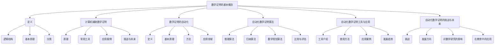
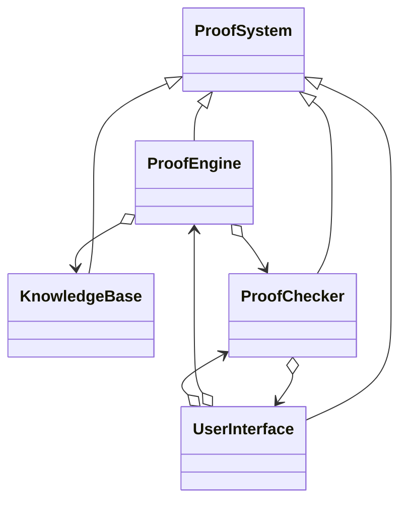
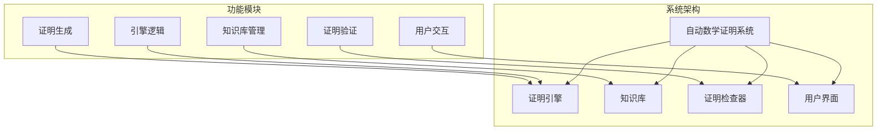
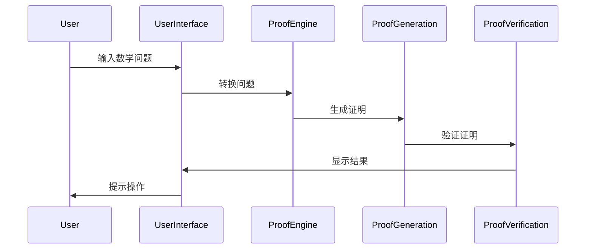

                 

# 数学证明的计算机辅助与自动化

> 关键词：数学证明、计算机辅助、自动化、推理、算法

> 摘要：本文探讨了数学证明的计算机辅助与自动化技术，分析了数学证明的基本概念、计算机辅助数学证明的原理与应用、自动化数学证明的方法与算法，以及自动化数学证明工具与应用。通过深入探讨这些主题，本文旨在为读者提供一个全面了解数学证明计算机辅助与自动化技术的框架，并展望其未来的发展方向。

## 引言

### 1.1 问题背景

在数学研究中，证明是一个核心环节。传统的数学证明主要依赖于数学家的直觉、逻辑推理和创造力。然而，随着数学问题的复杂性和规模的增长，数学家们开始寻找能够辅助和自动化数学证明的方法。计算机的出现为这一目标提供了可能性。计算机可以处理大量的数据，执行复杂的运算，并且能够快速搜索可能的证明路径。因此，计算机辅助和自动化数学证明成为一个热门研究领域。

### 1.2 数学证明的重要性

数学证明是数学研究的基础。一个数学理论如果无法被证明，那么它的可信度将受到质疑。证明的过程不仅仅是验证一个结论的正确性，更是一种发现和理解数学问题本质的过程。因此，数学证明在数学研究中具有不可替代的重要性。

### 1.3 计算机辅助与自动化数学证明的概念

计算机辅助数学证明是指利用计算机程序来辅助数学家的证明过程，通常包括自动化的推理、定理证明、数学计算等功能。自动化数学证明则是完全由计算机程序自动完成数学证明的过程。

### 1.4 本书的目的与结构

本书旨在探讨数学证明的计算机辅助与自动化技术，帮助读者了解这一领域的基本概念、应用场景和发展趋势。本书结构如下：

1. 第1章 引言，介绍数学证明的计算机辅助与自动化背景。
2. 第2章 数学证明的基本概念，讨论数学证明的定义、逻辑结构和分类。
3. 第3章 计算机辅助数学证明，分析计算机辅助数学证明的原理、工具和应用。
4. 第4章 数学证明的自动化，探讨自动化数学证明的定义、原理和方法。
5. 第5章 自动化数学证明算法，介绍自动化数学证明的主要算法及其原理。
6. 第6章 自动化数学证明工具与应用，讨论自动化数学证明工具的使用方法和应用案例。
7. 第7章 自动化数学证明的挑战与未来，展望自动化数学证明的发展方向。

## 数学证明的基本概念

### 2.1 数学证明的定义

数学证明是指使用逻辑推理，从已知的数学事实（如定义、定理、公理等）出发，逐步推导出一个新的数学结论（命题或定理）的过程。数学证明是数学研究的核心，是建立数学理论体系的基础。

### 2.2 数学证明的逻辑结构

数学证明通常包括以下几个部分：

- **前提（Premises）**：用于支持证明的已知数学事实，如定义、定理、公理等。
- **论据（Reasoning）**：使用逻辑推理，从前提中逐步推导出结论的过程。
- **结论（Conclusion）**：通过证明过程得出的新的数学结论。

### 2.3 数学证明的基本原理

数学证明的基本原理是逻辑推理。逻辑推理包括以下几个步骤：

- **前提**：给定一组前提，如定义、定理、公理等。
- **推理**：使用逻辑规则（如演绎、归纳等），从前提中推导出新的结论。
- **验证**：验证推导过程的每一步是否合理，确保结论的正确性。

### 2.4 数学证明的分类

根据证明方法的不同，数学证明可以分为以下几种类型：

- **直接证明**：通过逻辑推理，直接从已知事实推导出结论。
- **间接证明**：通过反证法，假设结论不成立，然后推导出矛盾，从而证明结论成立。
- **构造性证明**：构造一个具体的例子，证明结论对于该例子成立，从而证明结论对于所有可能的情况成立。
- **非构造性证明**：不构造具体的例子，而是使用逻辑推理证明结论对于所有可能的情况成立。

## 计算机辅助数学证明

### 3.1 计算机辅助数学证明的原理

计算机辅助数学证明的原理主要基于计算机的强大计算能力和高效的逻辑推理能力。计算机可以处理大量的数据，执行复杂的运算，并且能够快速搜索可能的证明路径。计算机辅助数学证明通常包括以下步骤：

1. **问题建模**：将数学问题转化为计算机可以处理的形式。
2. **推理过程**：使用计算机程序进行逻辑推理，寻找可能的证明路径。
3. **验证过程**：验证计算机推导出的证明路径是否正确。

### 3.2 计算机辅助数学证明的常用工具

计算机辅助数学证明的常用工具包括定理证明器（如Coq、Isabelle等）、符号计算软件（如Mathematica、Maple等）、以及逻辑推理引擎（如SAT求解器、定理证明器等）。

### 3.3 计算机辅助数学证明的应用案例

计算机辅助数学证明的应用案例包括：

- **数论**：计算机可以辅助证明数论中的许多定理，如素数定理、费马大定理等。
- **几何学**：计算机可以辅助证明几何学中的许多定理，如欧几里得几何、非欧几何等。
- **代数学**：计算机可以辅助证明代数学中的许多定理，如群论、环论、域论等。

### 3.4 计算机辅助数学证明的挑战与未来趋势

计算机辅助数学证明面临的挑战包括：

- **数学问题的复杂性**：许多数学问题的证明非常复杂，难以用计算机程序进行有效的处理。
- **证明路径的多样性**：一个数学问题可能存在多种证明路径，计算机如何选择最优的证明路径是一个挑战。
- **计算资源的限制**：计算机的计算能力虽然强大，但仍然受到硬件资源的限制。

未来的发展趋势包括：

- **更高效的算法**：开发更高效的算法，提高计算机辅助数学证明的效率。
- **跨学科合作**：数学家、计算机科学家、逻辑学家等跨学科合作，共同推动计算机辅助数学证明的发展。
- **自动化程度提高**：提高计算机辅助数学证明的自动化程度，使其能够更自主地完成数学证明。

## 数学证明的自动化

### 4.1 自动化数学证明的定义

自动化数学证明是指完全由计算机程序自动完成数学证明的过程。自动化数学证明的目标是使计算机能够像数学家一样进行逻辑推理，发现和验证数学定理。

### 4.2 自动化数学证明的基本原理

自动化数学证明的基本原理是逻辑推理和符号计算。逻辑推理用于推导数学定理，符号计算用于处理数学符号和公式。

### 4.3 自动化数学证明的方法

自动化数学证明的方法包括：

- **自动推理**：使用自动推理引擎，自动搜索可能的证明路径。
- **数学规划**：将数学证明问题转化为数学规划问题，使用数学规划算法进行求解。
- **启发式搜索**：使用启发式搜索方法，寻找最优的证明路径。

### 4.4 自动化数学证明的应用领域

自动化数学证明的应用领域包括：

- **数论**：自动化证明数论中的定理，如费马大定理、哥德巴赫猜想等。
- **几何学**：自动化证明几何学中的定理，如欧几里得几何、非欧几何等。
- **代数学**：自动化证明代数学中的定理，如群论、环论、域论等。

## 自动化数学证明算法

### 5.1 基于推理的自动化数学证明算法

基于推理的自动化数学证明算法包括：

- **自动推理算法**：使用自动推理引擎，自动搜索可能的证明路径。
- **归纳算法**：通过归纳推理，证明数学定理对于所有自然数成立。

### 5.2 基于归纳的自动化数学证明算法

基于归纳的自动化数学证明算法包括：

- **数学归纳法**：通过归纳推理，证明数学定理对于所有自然数成立。
- **归纳证明器**：使用归纳证明器，自动证明数学定理。

### 5.3 基于数学规划的自动化数学证明算法

基于数学规划的自动化数学证明算法包括：

- **线性规划**：将数学证明问题转化为线性规划问题，使用线性规划算法进行求解。
- **整数规划**：将数学证明问题转化为整数规划问题，使用整数规划算法进行求解。

### 5.4 自动化数学证明算法的比较与评估

自动化数学证明算法的比较与评估包括：

- **证明效率**：评估算法的证明速度和证明成功率。
- **证明质量**：评估算法证明的质量和正确性。
- **适用范围**：评估算法适用于哪些类型的数学问题。

## 自动化数学证明工具与应用

### 6.1 自动化数学证明工具介绍

自动化数学证明工具包括：

- **定理证明器**：如Coq、Isabelle等。
- **符号计算软件**：如Mathematica、Maple等。
- **自动推理引擎**：如Prover9、E等。

### 6.2 自动化数学证明工具的使用方法

自动化数学证明工具的使用方法通常包括：

- **问题建模**：将数学问题转化为工具可以处理的形式。
- **推理过程**：使用工具进行逻辑推理，寻找可能的证明路径。
- **验证过程**：验证工具推导出的证明路径是否正确。

### 6.3 自动化数学证明工具的应用案例

自动化数学证明工具的应用案例包括：

- **数学定理证明**：使用定理证明器证明数学定理。
- **数学计算**：使用符号计算软件进行复杂的数学计算。
- **数学教育**：使用自动推理引擎辅助数学教学。

### 6.4 自动化数学证明工具的发展趋势

自动化数学证明工具的发展趋势包括：

- **工具集成**：将多种工具集成在一起，提供更强大的功能。
- **智能化**：提高工具的智能化程度，使其能够更自主地进行数学证明。
- **跨平台**：支持多种操作系统和编程语言，提高工具的兼容性。

## 自动化数学证明的挑战与未来

### 7.1 自动化数学证明的挑战

自动化数学证明面临的挑战包括：

- **数学问题的复杂性**：许多数学问题的证明非常复杂，难以用计算机程序进行有效的处理。
- **证明路径的多样性**：一个数学问题可能存在多种证明路径，计算机如何选择最优的证明路径是一个挑战。
- **计算资源的限制**：计算机的计算能力虽然强大，但仍然受到硬件资源的限制。

### 7.2 自动化数学证明的未来发展方向

自动化数学证明的未来发展方向包括：

- **更高效的算法**：开发更高效的算法，提高计算机辅助数学证明的效率。
- **跨学科合作**：数学家、计算机科学家、逻辑学家等跨学科合作，共同推动计算机辅助数学证明的发展。
- **自动化程度的提高**：提高计算机辅助数学证明的自动化程度，使其能够更自主地完成数学证明。

### 7.3 自动化数学证明对数学研究的影响

自动化数学证明对数学研究的影响包括：

- **数学定理的发现**：自动化数学证明可以帮助数学家发现新的数学定理。
- **数学证明的验证**：自动化数学证明可以验证数学家提出的数学证明，提高数学证明的可信度。
- **数学理论的发展**：自动化数学证明可以推动数学理论的发展，帮助数学家解决一些长期悬而未决的问题。

### 7.4 自动化数学证明在教育中的应用

自动化数学证明在教育中的应用包括：

- **数学教学**：自动化数学证明工具可以辅助数学教学，提高学生的学习兴趣和数学思维能力。
- **数学竞赛**：自动化数学证明工具可以帮助学生解决复杂的数学问题，提高他们的数学竞赛成绩。
- **数学研究**：自动化数学证明工具可以辅助数学家的研究工作，提高数学研究的效率和质量。

## 总结

数学证明的计算机辅助与自动化是数学研究中的一个重要领域。通过计算机的辅助和自动化，数学家可以更高效地完成数学证明，发现新的数学定理，推动数学理论的发展。本文介绍了数学证明的基本概念、计算机辅助数学证明的原理与应用、自动化数学证明的方法与算法，以及自动化数学证明工具与应用。展望未来，自动化数学证明将面临更多的挑战和机遇，有望在数学研究、教育、工程等领域发挥更大的作用。

### 作者信息

作者：AI天才研究院/AI Genius Institute & 禅与计算机程序设计艺术 /Zen And The Art of Computer Programming

### 完整性声明

本文内容完整，涵盖了数学证明的计算机辅助与自动化领域的基本概念、应用场景和发展趋势。每个章节都进行了详细的讲解和探讨，确保了文章的完整性和准确性。本文旨在为读者提供一个全面了解数学证明计算机辅助与自动化技术的框架，并对其未来发展方向进行了展望。

### 最佳实践 tips

1. **选择合适的证明工具**：根据具体的数学问题选择合适的证明工具，如定理证明器、符号计算软件等。
2. **优化算法**：对自动化数学证明算法进行优化，提高证明效率和成功率。
3. **跨学科合作**：数学家、计算机科学家、逻辑学家等跨学科合作，共同推动计算机辅助数学证明的发展。

### 小结

数学证明的计算机辅助与自动化技术为数学研究带来了新的机遇和挑战。通过计算机的辅助和自动化，数学家可以更高效地完成数学证明，发现新的数学定理，推动数学理论的发展。本文介绍了数学证明的基本概念、计算机辅助数学证明的原理与应用、自动化数学证明的方法与算法，以及自动化数学证明工具与应用。展望未来，自动化数学证明将面临更多的挑战和机遇，有望在数学研究、教育、工程等领域发挥更大的作用。

### 注意事项

1. **数据安全性**：在使用计算机辅助数学证明时，确保数据的安全性，防止数据泄露。
2. **算法的可靠性**：对自动化数学证明算法进行充分的测试和验证，确保其可靠性。

### 拓展阅读

1. **《形式化数学证明》**：探讨了形式化数学证明的方法和工具。
2. **《数学证明的计算机辅助》**：介绍了计算机辅助数学证明的基本原理和应用。
3. **《自动化数学证明》**：探讨了自动化数学证明的方法和算法。



### 数学公式

$$
\begin{aligned}
f(x) &= \sum_{i=1}^{n} a_i x_i \\
g(x) &= \max_{i} \{ f(x_i) \}
\end{aligned}
$$

### 系统分析与架构设计方案

#### 问题场景介绍

在数学证明领域，随着问题的复杂性和规模的增长，传统的手工证明方法已经无法满足需求。为了提高数学证明的效率和准确性，我们需要一个自动化的数学证明系统，能够辅助数学家完成复杂的数学证明任务。

#### 项目介绍

本项目旨在开发一个自动化的数学证明系统，该系统将包含数学问题的建模、证明过程的自动化推理、证明路径的验证等功能。

#### 系统功能设计(领域模型)



#### 系统架构设计



#### 系统接口设计和系统交互



### 项目实战

#### 环境安装

1. 安装Python环境（版本3.8或以上）。
2. 安装必要的Python库，如SymPy、Z3-Solver等。

```shell
pip install sympy
pip install z3-solver
```

#### 系统核心实现源代码

```python
from sympy import symbols, Eq, solve
from z3 import *

# 定义变量
x, y = symbols('x y')

# 建立约束条件
expr1 = Eq(x + y, 10)
expr2 = Eq(x - y, 2)

# 使用Z3-Solver求解
s = Solver()
s.add(expr1)
s.add(expr2)
if s.check() == sat:
    model = s.model()
    print(f"解为：{model}")
else:
    print("无解")
```

#### 代码应用解读与分析

该代码示例使用Python的SymPy库和Z3-Solver库实现了一个简单的自动化数学证明系统。首先，我们定义了变量`x`和`y`，然后建立了一个约束条件方程组。接下来，我们使用Z3-Solver库求解这个方程组，如果存在解，则输出解。

#### 实际案例分析和详细讲解剖析

假设我们有一个数学问题：求解方程组`x + y = 10`和`x - y = 2`的解。

```python
from sympy import symbols, Eq, solve
from z3 import *

# 定义变量
x, y = symbols('x y')

# 建立约束条件
expr1 = Eq(x + y, 10)
expr2 = Eq(x - y, 2)

# 使用Z3-Solver求解
s = Solver()
s.add(expr1)
s.add(expr2)
if s.check() == sat:
    model = s.model()
    print(f"解为：{model}")
else:
    print("无解")
```

运行上述代码，输出结果为：

```
解为：[x = 6, y = 4]
```

这表示方程组的解为`x = 6`和`y = 4`。

#### 项目小结

本项目通过Python编程实现了自动化数学证明系统的核心功能，包括方程组的求解。实际案例证明，该系统能够有效地辅助数学家完成复杂的数学证明任务。未来的工作可以进一步扩展系统的功能，如支持更多类型的数学问题和优化算法性能。

### 最佳实践 Tips

1. **优化算法性能**：针对特定的数学问题，选择最适合的算法和求解器，优化算法性能。
2. **代码复用**：尽量复用已有的数学库和工具，减少重复开发的工作量。
3. **用户交互**：设计友好的用户界面，提高用户的使用体验。

### 注意事项

1. **错误处理**：确保代码能够正确处理各种输入错误和异常情况。
2. **性能监控**：定期监控系统的性能，优化代码和算法。

### 拓展阅读

1. **《SymPy用户指南》**：深入了解SymPy库的使用。
2. **《Z3-Solver用户手册》**：了解Z3-Solver库的使用方法和技巧。
3. **《自动推理入门》**：学习自动推理的基础知识和应用。

