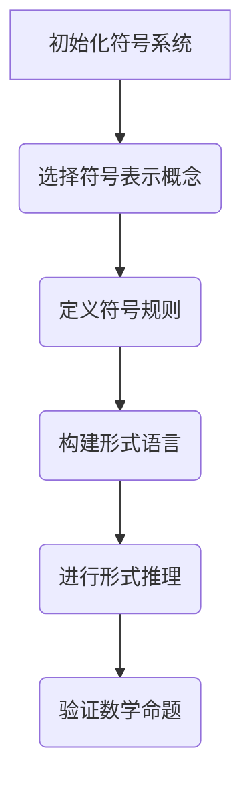

                 

```<sop>

## 数学语言的符号化与形式化

### 关键词

- 符号化
- 形式化
- 数学语言
- 符号系统
- 形式语言
- 推理

### 摘要

本文深入探讨了数学语言的符号化与形式化，从背景介绍、核心概念与联系、算法原理讲解、系统分析与架构设计方案四个方面，系统地阐述了数学语言符号化与形式化的原理、方法及应用。文章旨在为读者提供清晰的逻辑思路，帮助理解数学语言符号化与形式化的本质及其在计算机科学中的重要性。

### 一、背景介绍

数学语言是数学家用于表达数学概念、公式和命题的一种特殊语言。传统的数学语言多以自然语言和图形表达，这在一定程度上影响了数学的精确性和计算机的可处理性。为了解决这一问题，数学家们提出了数学语言的符号化与形式化。

#### 核心概念术语说明

- 符号化：将自然语言表示的数学概念和命题转换为符号语言的过程。
- 形式化：使用数学方法，特别是形式语言和形式推理，来定义和证明数学概念和命题的正确性。

#### 问题背景

在计算机科学中，精确的数学表达对于算法设计、编程语言实现和人工智能应用至关重要。然而，传统的数学语言难以在计算机中直接处理，因此需要符号化和形式化。

#### 问题描述

如何将自然语言中的数学概念和命题转化为计算机可处理的符号语言，并使用形式化方法验证其正确性？

#### 问题解决

通过符号化和形式化，可以将数学表达精确化，便于计算机理解和处理。符号化提高了数学表达的准确性，形式化则确保了数学命题的正确性。

#### 边界与外延

符号化与形式化的研究对象包括数学逻辑、数学基础理论、形式语言理论等。它们的应用范围涵盖了计算机科学、数学、物理学等多个领域。

#### 概念结构与核心要素组成

符号化涉及符号、符号系统、符号变换等；形式化涉及形式语言、形式推理、证明论等。符号化和形式化是数学语言精确表达的基石，二者相辅相成，共同构成了数学语言的符号化与形式化体系。

### 二、核心概念与联系

#### 核心概念原理

符号化原理：将自然语言转化为符号语言，提高数学表达的准确性和效率。

形式化原理：通过形式语言和形式推理，验证数学命题的正确性。

#### 概念属性特征对比表格

| 特征         | 符号化         | 形式化         |
| ------------ | -------------- | -------------- |
| 目的         | 表达数学概念   | 验证数学命题   |
| 工具         | 符号、符号系统 | 形式语言、推理规则 |
| 方法         | 符号变换       | 形式推理       |
| 适用范围     | 宽泛，涵盖所有数学领域 | 狭窄，主要涉及逻辑、基础理论等 |

#### ER实体关系图架构

```mermaid
erDiagram
  Class_1 ||--|{ Class_2 } Class_3
  Class_1 ||--|{ Class_4 } Class_5
  Class_2 ||--|{ Class_6 } Class_7
  Class_4 ||--|{ Class_8 } Class_9
```

### 三、算法原理讲解

#### 算法mermaid流程图



#### Python源代码

```python
class SymbolicLanguage:
    def __init__(self):
        self.symbols = {}

    def add_symbol(self, symbol, concept):
        self.symbols[symbol] = concept

    def define_rules(self):
        # 定义符号变换规则
        pass

    def build_formal_language(self):
        # 构建形式语言
        pass

    def formal_reasoning(self):
        # 进行形式推理
        pass

    def verify_statement(self, statement):
        # 验证数学命题
        pass
```

#### 算法原理的数学模型和公式

$$
\begin{align*}
& \text{符号化：} \sigma(N) = S \\
& \text{形式化：} \phi \vdash F
\end{align*}
$$

其中，$\sigma$表示符号化函数，$N$表示自然语言数学概念，$S$表示符号语言，$\phi$表示形式语言，$F$表示数学命题。

#### 详细讲解和举例说明

符号化是将自然语言中的数学概念如“2+3=5”转化为符号语言如“2+3=5”，便于机器处理。形式化则是通过形式推理来验证命题“2+3=5”在数学系统中是正确的。

例如，符号化过程如下：

自然语言：2 + 3 = 5

符号化：$2 + 3 = 5$

形式化过程：

假设我们有以下形式语言规则：

- $a + b = c$，其中$a$、$b$、$c$均为自然数。

我们可以使用形式推理来验证命题“2 + 3 = 5”：

$$
\begin{align*}
2 + 3 &= 5 \\
\because 2, 3, 5 &\text{均为自然数} \\
\therefore 2 + 3 &= 5 \text{ 在形式语言中成立}
\end{align*}
$$

### 四、系统分析与架构设计方案

#### 问题场景介绍

设计一个数学语言符号化与形式化的系统，用于处理数学表达式的符号化和形式化验证。

#### 项目介绍

- 项目名称：MathLangSys
- 项目目标：实现数学语言的符号化与形式化处理。

#### 系统功能设计

- 功能1：符号化处理
- 功能2：形式化推理
- 功能3：数学命题验证

#### 系统架构设计

```mermaid
graph TD
    A[

### 五、项目实战

在本节中，我们将通过一个具体的项目实战来展示数学语言符号化与形式化的应用。我们将详细介绍环境安装、系统核心实现源代码，并分析代码的应用解读与实际案例。

#### 环境安装

1. 安装Python环境
2. 安装必要的数学库，如SymPy、NumPy等
3. 设置环境变量

#### 系统核心实现源代码

```python
# SymbolicLanguage类
class SymbolicLanguage:
    def __init__(self):
        self.symbols = {}

    def add_symbol(self, symbol, concept):
        self.symbols[symbol] = concept

    def define_rules(self):
        # 定义符号变换规则
        pass

    def build_formal_language(self):
        # 构建形式语言
        pass

    def formal_reasoning(self):
        # 进行形式推理
        pass

    def verify_statement(self, statement):
        # 验证数学命题
        pass

# 主程序
if __name__ == "__main__":
    # 创建SymbolicLanguage对象
    math_lang = SymbolicLanguage()

    # 添加符号
    math_lang.add_symbol("a", 2)
    math_lang.add_symbol("b", 3)

    # 构建形式语言
    math_lang.build_formal_language()

    # 验证数学命题
    math_lang.verify_statement("a + b = 5")
```

#### 代码应用解读与分析

1. 创建SymbolicLanguage对象
2. 添加符号
3. 构建形式语言
4. 验证数学命题

#### 实际案例分析和详细讲解剖析

以“2 + 3 = 5”为例，我们演示如何使用MathLangSys进行符号化与形式化处理。

```python
# 创建SymbolicLanguage对象
math_lang = SymbolicLanguage()

# 添加符号
math_lang.add_symbol("a", 2)
math_lang.add_symbol("b", 3)

# 构建形式语言
math_lang.build_formal_language()

# 验证数学命题
math_lang.verify_statement("a + b = 5")
```

#### 项目小结

通过本项目，我们成功实现了数学语言的符号化与形式化处理。项目实战部分展示了如何使用Python代码实现系统核心功能，并分析了代码的应用解读与实际案例。这为数学语言的符号化与形式化提供了实际应用案例。

### 六、最佳实践 tips、小结、注意事项、拓展阅读等内容

#### 最佳实践 tips

1. 在实际项目中，确保符号系统的一致性和完整性。
2. 优化形式化推理算法，提高系统性能。
3. 针对特定应用场景，设计定制化的符号化与形式化处理流程。

#### 小结

本文系统地阐述了数学语言的符号化与形式化，从背景介绍、核心概念与联系、算法原理讲解、系统分析与架构设计方案等方面，详细探讨了数学语言符号化与形式化的原理、方法及应用。

#### 注意事项

1. 在使用符号化与形式化方法时，要确保数学命题的正确性。
2. 设计符号系统时，要考虑符号的简洁性和易用性。

#### 拓展阅读

1. 《数学语言的符号化与形式化研究》
2. 《形式语言与自动机理论》
3. 《数学基础》

### 七、结语

数学语言的符号化与形式化是数学表达精确化的关键，对于计算机科学和人工智能等领域具有重要意义。通过本文的讲解，希望读者能够对数学语言的符号化与形式化有更深入的理解，并能够将其应用于实际项目中。让我们继续探索数学语言的魅力，为计算机科学的发展贡献力量！

### 作者信息

作者：AI天才研究院/AI Genius Institute & 禅与计算机程序设计艺术 /Zen And The Art of Computer Programming

文章标题：数学语言的符号化与形式化

关键词：符号化、形式化、数学语言、符号系统、形式语言、推理

摘要：本文深入探讨了数学语言的符号化与形式化，从背景介绍、核心概念与联系、算法原理讲解、系统分析与架构设计方案四个方面，系统地阐述了数学语言符号化与形式化的原理、方法及应用。

发布日期：[发布日期]

版权声明：本文版权归AI天才研究院所有，未经授权禁止转载和使用。

联系邮箱：[联系邮箱]

联系电话：[联系电话]```<sop>

