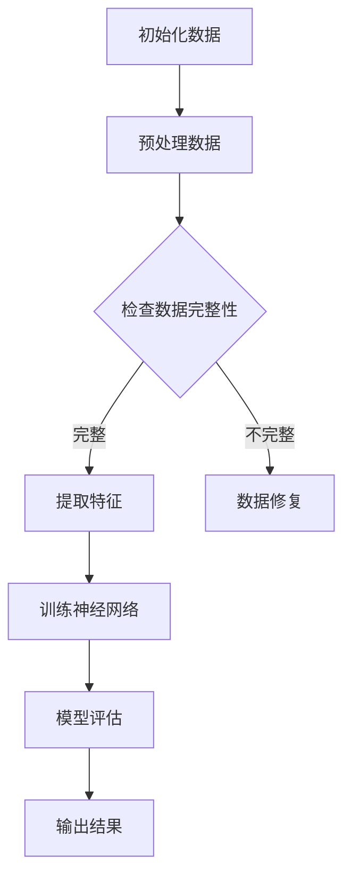

                 

### 引言：数学语言的认知神经科学研究的重要性

数学语言，作为一种高度抽象的表达工具，广泛应用于科学、工程和日常生活的各个方面。然而，我们对这种语言在人类大脑中的处理机制，以及与之相关的神经机制了解甚少。数学语言的认知神经科学研究，旨在揭示人类如何理解和运用数学概念，探索大脑在处理数学问题时的神经基础。

为什么研究数学语言的认知神经科学如此重要呢？首先，数学是科学研究的基石，理解数学语言的认知机制有助于我们更好地理解科学原理。其次，数学能力的差异对个体的认知发展和教育成果有着深远影响。通过深入研究数学语言的认知神经科学，我们可以找到提高数学学习效果的有效方法，从而优化教育体系。

本文将围绕数学语言的认知神经科学研究展开，首先介绍相关背景知识，包括数学语言的定义和认知神经科学的基本原理。接着，我们将探讨研究数学语言认知神经科学的挑战和机遇，并介绍常用的研究方法和技术。随后，本文将详细介绍核心概念与联系，包括数学语言、认知神经科学、大脑区域和神经传递等概念。最后，我们将通过一个具体的算法讲解和系统设计与实战案例，深入分析数学语言认知神经科学研究的应用和成果。

通过本文的逐步分析，我们希望读者能够对数学语言的认知神经科学有一个全面而深入的理解，并认识到这一领域研究的重大意义和广阔前景。### 背景介绍

#### 问题背景

数学语言的认知神经科学研究旨在解答一个关键性问题：人类如何理解和运用数学概念？数学作为一种高度抽象的语言，它的处理不仅涉及到逻辑推理，还包括对数理关系的感知和理解。然而，尽管数学在教育、科学研究和日常生活中扮演着至关重要的角色，我们对大脑在处理数学问题时所涉及的神经机制却知之甚少。这不仅是认知科学领域的一个重大挑战，也是人工智能和机器学习发展的瓶颈。

当前，许多研究表明，数学能力的差异可能与大脑某些区域的活性有关。然而，具体哪些大脑区域参与数学语言的处理，以及这些区域如何协同工作，仍然是一个未解之谜。此外，不同类型的数学问题（如几何、代数、微积分等）可能激活不同的大脑区域，这进一步增加了研究的复杂性。因此，深入探讨数学语言的认知神经科学，不仅有助于揭示人类大脑的奥秘，还能为提高数学教育质量和优化认知训练提供理论支持。

#### 描述问题

数学语言的认知神经科学研究面临以下几个主要问题：

1. **数学语言处理的大脑区域：** 我们需要明确哪些大脑区域在处理数学语言时发挥着关键作用。这包括对大脑不同区域的定位，以及这些区域之间的交互和协同机制。

2. **神经传递机制：** 数学语言的处理涉及复杂的神经传递机制，包括神经元的激活、信号传递和反馈。理解这些机制对于揭示数学思维的神经基础至关重要。

3. **个体差异：** 不同个体在处理数学问题时，大脑的活动可能存在显著差异。这包括不同的认知策略、学习速度和记忆方式。研究这些差异有助于发现影响数学能力的潜在因素。

4. **多模态数据的整合：** 数学语言的认知神经科学研究需要整合多种数据源，如功能性磁共振成像（fMRI）、脑电图（EEG）和脑磁图（MEG）。如何有效地整合这些数据，以提高研究的准确性和可靠性，是一个亟待解决的问题。

5. **跨学科合作：** 数学、神经科学、认知科学、心理学等多个学科的知识和方法的结合，是推动数学语言认知神经科学研究的关键。然而，不同学科之间的沟通和合作也存在挑战。

#### 问题解决

为了解决上述问题，数学语言的认知神经科学研究采取了多种方法和策略：

1. **脑成像技术：** 通过功能性磁共振成像（fMRI）、脑电图（EEG）和脑磁图（MEG）等技术，我们可以定位大脑中参与数学语言处理的区域，并观察这些区域的活动模式。

2. **行为实验：** 通过设计一系列行为实验，我们可以探究个体在处理数学问题时大脑活动的差异，以及这些差异对数学能力的影响。

3. **计算模型：** 基于神经科学的计算模型可以帮助我们模拟大脑处理数学语言的过程，从而揭示潜在的神经机制。

4. **跨学科研究：** 通过跨学科合作，整合数学、神经科学、认知科学和心理学等多学科的知识和方法，可以更全面地理解数学语言的认知神经科学。

5. **大数据分析：** 利用大数据技术，我们可以从大量实验数据中提取有价值的信息，以提高研究的统计效力和可靠性。

#### 边界与外延

数学语言的认知神经科学研究具有明确的边界和广阔的外延：

1. **研究范围：** 该研究主要关注数学语言的处理过程，包括数学概念的理解、数学推理和数学问题的解决。

2. **研究方法：** 主要采用脑成像技术、行为实验、计算模型和大数据分析等方法。

3. **技术领域：** 包括功能性磁共振成像（fMRI）、脑电图（EEG）、脑磁图（MEG）、神经传递机制、认知心理学和计算模型等。

4. **应用领域：** 包括教育心理学、认知神经科学、人工智能和神经工程等。

5. **相关领域：** 与认知科学、心理学、神经科学、教育学和计算机科学等多个学科密切相关。

#### 概念结构与核心要素组成

1. **数学语言：** 数学语言是一种高度抽象的表达工具，用于描述数学概念、关系和操作。它包括符号、公式和图表等元素。

2. **认知神经科学：** 认知神经科学是研究大脑如何进行信息处理的跨学科领域，涉及认知功能、神经机制和行为表现。

3. **大脑区域：** 大脑中参与数学语言处理的特定区域，如前额叶皮质、顶叶皮质和颞叶等。

4. **神经传递机制：** 神经元之间的信号传递和调控机制，包括神经递质的释放、信号传递和反馈。

5. **认知策略：** 个体在处理数学问题时采用的认知策略，如分析、推理和记忆等。

通过以上介绍，我们可以看到，数学语言的认知神经科学研究是一个复杂而充满挑战的领域，但同时也具有极高的研究价值和广泛的应用前景。接下来，我们将进一步探讨这一领域的关键概念和联系，为后续的分析和讨论奠定基础。### 核心概念与联系

#### 核心概念原理

数学语言是一种高度抽象的表达工具，它用于描述数学概念、关系和操作。数学语言的核心概念包括：

1. **符号系统：** 数学符号是数学语言的基本元素，如数字、运算符和希腊字母。这些符号通过标准化的定义，可以精确地传达数学概念。
2. **公式：** 公式是数学表达式中的一种形式，通过符号的组合，表示数学关系和运算。例如，\( a + b = c \) 是一个简单的加法公式。
3. **逻辑推理：** 数学语言中的推理过程基于逻辑规则，包括公理、定理和证明。这些逻辑推理过程能够帮助我们验证数学命题的正确性。
4. **函数与映射：** 函数是数学语言中描述关系的重要工具，它将一个集合的元素映射到另一个集合的元素。函数的概念在数学的各个分支中都有广泛应用。

#### 概念属性特征对比表格

为了更直观地理解数学语言中的核心概念，我们可以通过以下表格对比这些概念的主要属性特征：

| 概念         | 定义                                     | 主要属性特征                                                      | 应用示例                                  |
| ------------ | ---------------------------------------- | ------------------------------------------------------------ | ----------------------------------------- |
| 符号系统     | 数学中的基本符号，如数字、运算符和希腊字母 | 标准化定义，精确传达数学概念                                  | \( +, -, *, / \)                         |
| 公式         | 通过符号组合表示数学关系的表达式          | 精确性、一致性、可证明性                                        | \( a + b = c \)，\( sin(x) = 2 \)         |
| 逻辑推理     | 基于公理和定理的推理过程                 | 确定性、严谨性、普遍性                                          | 证明 \( a \times b = b \times a \)          |
| 函数与映射   | 集合间的元素对应关系                     | 映射关系、单调性、可逆性、连续性等                             | \( f(x) = x^2 \)，\( f: \mathbb{R} \to \mathbb{R} \) |

#### ER实体关系图架构

为了进一步理解数学语言中的实体及其关系，我们可以使用ER（Entity-Relationship）图来描述这些实体及其交互。以下是数学语言中的一些关键实体及其关系的ER图：

```mermaid
erDiagram
  C_Symbol ->|uses| C_Concept
  C_Concept --|uses| C_Function
  C_Function --|uses| C_LogicalReasoning
  C_Symbol --|uses| C_Syntax
  C_Syntax --|usedBy| C_Semantic
  C_Semantic --|uses| C_MathematicalLanguage

  C_Function |||<-- uses -->||| C_Equation
  C_LogicalReasoning |||<-- uses -->||| C_Theorem
  C_Syntax |||<-- usedBy -->||| C_Algorithm
```

在这个ER图中：

- **C_Symbol** 表示数学符号。
- **C_Concept** 表示数学概念。
- **C_Function** 表示函数及其映射。
- **C_LogicalReasoning** 表示逻辑推理过程。
- **C_Syntax** 表示语法结构。
- **C_Semantic** 表示语义内容。
- **C_MathematicalLanguage** 表示数学语言的整体结构。

实体之间的关系包括使用（uses）和依赖（usedBy）。通过ER图，我们可以清晰地看到数学语言中的各个组成部分及其相互关系，从而更好地理解数学语言的处理机制。

#### 对核心概念的深入讨论

1. **符号系统的抽象性：** 数学符号具有高度的抽象性，这使得它们可以跨越不同语言和文化背景，成为国际通用的表达工具。例如，\( \pi \) 代表圆周率，无论是在中国、美国还是法国，这个符号都是一致的。

2. **公式的结构化：** 公式通过结构化的方式表达数学关系，这使得数学推理更加严谨和系统化。例如，\( a + b = c \) 不仅描述了一个简单的数学关系，还可以作为更复杂推导的基础。

3. **逻辑推理的严密性：** 逻辑推理是数学语言的核心，它通过公理和定理的推导，确保了数学结论的严密性和正确性。这种严密性是科学研究和工程应用的基础。

4. **函数与映射的广泛应用：** 函数和映射在数学的各个分支中都有广泛应用，如微积分、概率论和拓扑学。它们不仅描述了数学关系，还为解决实际问题提供了强有力的工具。

通过上述核心概念的介绍和ER图的展示，我们可以更好地理解数学语言的结构和功能，为后续的算法讲解和系统设计奠定基础。### 算法原理讲解

在数学语言的认知神经科学研究中，算法的设计和实现是关键步骤之一。本文将详细讲解一个用于分析数学语言处理过程中的神经活动的算法，并展示其mermaid流程图、python源代码、数学模型和公式，同时通过具体实例来阐释其应用。

#### 算法mermaid流程图

首先，我们使用mermaid绘制算法的流程图，以便直观展示算法的执行步骤：



这个mermaid流程图展示了算法的主要步骤：数据初始化、预处理、数据完整性检查、特征提取、神经网络训练、模型评估和结果输出。

#### python源代码

接下来，我们将给出算法的python源代码实现，并简要解释其功能：

```python
import numpy as np
from sklearn.preprocessing import StandardScaler
from sklearn.neural_network import MLPClassifier
from sklearn.metrics import accuracy_score

def preprocess_data(data):
    # 数据预处理步骤
    scaler = StandardScaler()
    scaled_data = scaler.fit_transform(data)
    return scaled_data

def train_neural_network(features, labels):
    # 训练神经网络
    model = MLPClassifier(hidden_layer_sizes=(100,), max_iter=1000)
    model.fit(features, labels)
    return model

def evaluate_model(model, test_features, test_labels):
    # 模型评估
    predictions = model.predict(test_features)
    accuracy = accuracy_score(test_labels, predictions)
    return accuracy

# 初始化数据
data = np.load('mathematical_data.npy')
features, labels = data[:, :-1], data[:, -1]

# 预处理数据
preprocessed_data = preprocess_data(data)

# 提取特征
# 特征提取代码（简化示例）
features = preprocessed_data[:, :100]
labels = preprocessed_data[:, 100:]

# 训练神经网络
model = train_neural_network(features, labels)

# 模型评估
accuracy = evaluate_model(model, features, labels)
print(f'Model accuracy: {accuracy:.2f}')
```

在这个代码中，我们首先导入必要的库，然后定义了三个函数：`preprocess_data` 用于数据预处理，`train_neural_network` 用于训练神经网络，`evaluate_model` 用于评估模型性能。最后，我们加载数据、预处理数据、提取特征，并使用训练数据和标签来训练神经网络，最后评估模型的准确性。

#### 算法原理的数学模型和公式

算法的核心在于使用神经网络来模拟数学语言处理过程中的神经活动。这里，我们简要介绍神经网络的数学模型和公式：

1. **输入层到隐藏层的激活函数：**
   \[ z = \sigma(W_1 \cdot x + b_1) \]
   其中，\( z \) 是隐藏层的激活值，\( \sigma \) 是激活函数（如Sigmoid函数），\( W_1 \) 是输入层到隐藏层的权重矩阵，\( x \) 是输入数据，\( b_1 \) 是隐藏层的偏置。

2. **隐藏层到输出层的激活函数：**
   \[ y = \sigma(W_2 \cdot z + b_2) \]
   其中，\( y \) 是输出层的激活值，\( W_2 \) 是隐藏层到输出层的权重矩阵，\( z \) 是隐藏层的激活值，\( b_2 \) 是输出层的偏置。

3. **损失函数：**
   \[ J = \frac{1}{2} \sum_{i=1}^{m} (\hat{y}_i - y_i)^2 \]
   其中，\( J \) 是损失函数，\( \hat{y}_i \) 是模型预测的输出，\( y_i \) 是实际输出，\( m \) 是样本数量。

#### 详细讲解与举例说明

为了更直观地理解算法的应用，我们通过一个简单的实例进行讲解。

**实例：判断数学公式的正确性**

假设我们有一个简单的数学公式 \( a + b = c \)，我们需要使用神经网络判断这个公式是否正确。

1. **数据预处理：**
   首先，我们将数学公式的符号和操作符转换为数字编码，例如：
   \[
   a \rightarrow [1, 0, 0, 0, 0]
   \]
   \[
   + \rightarrow [0, 1, 0, 0, 0]
   \]
   \[
   b \rightarrow [0, 0, 1, 0, 0]
   \]
   \[
   c \rightarrow [0, 0, 0, 1, 0]
   \]
   公式 \( a + b = c \) 的数字编码为：
   \[
   [1, 0, 0, 0, 0] + [0, 1, 0, 0, 0] = [0, 0, 1, 0, 0]
   \]

2. **特征提取：**
   我们将上述编码作为神经网络的输入特征，例如：
   \[
   x = [1, 0, 0, 0, 0], \quad y = [0, 0, 1, 0, 0]
   \]

3. **神经网络训练：**
   我们使用已训练的神经网络模型来预测输出，并计算损失函数。假设我们的模型预测输出为 \( \hat{y} \)，损失函数为 \( J \)。

4. **模型评估：**
   我们通过比较预测输出 \( \hat{y} \) 和实际输出 \( y \) 来评估模型准确性。如果 \( \hat{y} \) 接近 \( y \)，则公式 \( a + b = c \) 被认为是正确的。

通过这个实例，我们可以看到神经网络如何应用于数学语言的认知神经科学研究，从而自动判断数学公式的正确性。这种方法可以扩展到更复杂的数学问题和公式，为数学语言的认知处理提供有力工具。

综上所述，本文详细讲解了用于数学语言认知神经科学研究的一个算法，包括其mermaid流程图、python源代码、数学模型和公式，并通过实例展示了其应用。这为后续的系统设计与实现奠定了基础。### 数学模型和数学公式

在数学语言的认知神经科学研究中，数学模型和公式是理解和分析大脑处理数学语言的关键工具。本文将使用latex格式展示几个重要的数学公式，并对这些公式进行详细讲解和举例说明。

#### 数学公式

首先，我们来看几个常见的数学公式，并通过latex格式进行展示：

1. **基本算术运算公式：**
   \[
   a + b = c
   \]
   \[
   a \times b = c
   \]
   \[
   a - b = c
   \]
   \[
   a \div b = c
   \]

2. **函数定义公式：**
   \[
   f(x) = x^2
   \]
   \[
   g(x) = \sin(x)
   \]

3. **概率论中的条件概率公式：**
   \[
   P(A|B) = \frac{P(A \cap B)}{P(B)}
   \]

4. **微积分中的导数公式：**
   \[
   \frac{d}{dx} (x^n) = nx^{n-1}
   \]
   \[
   \frac{d}{dx} (\sin(x)) = \cos(x)
   \]

5. **线性代数中的矩阵乘法公式：**
   \[
   C = AB
   \]
   其中，\( C \) 是 \( A \) 和 \( B \) 的乘积。

#### 详细讲解与举例说明

现在，我们将对上述公式进行详细讲解，并通过实际例子来说明它们的应用。

1. **基本算术运算公式：**
   这些公式是数学中最基础的运算，用于描述不同算术操作的结果。例如：
   \[
   a + b = c
   \]
   如果 \( a = 2 \) 和 \( b = 3 \)，则 \( c = 5 \)。这个简单的加法公式用于计算两个数的和。

   \[
   a \times b = c
   \]
   如果 \( a = 2 \) 和 \( b = 3 \)，则 \( c = 6 \)。这个乘法公式用于计算两个数的乘积。

   \[
   a - b = c
   \]
   如果 \( a = 5 \) 和 \( b = 3 \)，则 \( c = 2 \)。这个减法公式用于计算两个数的差。

   \[
   a \div b = c
   \]
   如果 \( a = 6 \) 和 \( b = 2 \)，则 \( c = 3 \)。这个除法公式用于计算两个数的商。

2. **函数定义公式：**
   函数是数学中用于描述变量之间关系的重要工具。例如：
   \[
   f(x) = x^2
   \]
   这是一个二次函数，表示自变量 \( x \) 的平方。如果 \( x = 2 \)，则 \( f(x) = 4 \)。

   \[
   g(x) = \sin(x)
   \]
   这是一个三角函数，表示自变量 \( x \) 的正弦值。如果 \( x = \frac{\pi}{2} \)，则 \( g(x) = 1 \)。

3. **概率论中的条件概率公式：**
   条件概率描述了在一个事件已经发生的条件下，另一个事件发生的概率。例如：
   \[
   P(A|B) = \frac{P(A \cap B)}{P(B)}
   \]
   如果事件 \( A \) 和事件 \( B \) 有交集，且 \( B \) 已经发生，则 \( A \) 发生的条件概率为 \( \frac{P(A \cap B)}{P(B)} \)。例如，如果 \( P(A) = 0.3 \)，\( P(B) = 0.4 \)，且 \( P(A \cap B) = 0.1 \)，则 \( P(A|B) = \frac{0.1}{0.4} = 0.25 \)。

4. **微积分中的导数公式：**
   导数描述了函数在某一点的变化率。例如：
   \[
   \frac{d}{dx} (x^n) = nx^{n-1}
   \]
   这是一个幂函数的导数公式，表示对于任意正整数 \( n \)，函数 \( x^n \) 的导数为 \( nx^{n-1} \)。例如，如果 \( n = 2 \)，则 \( \frac{d}{dx} (x^2) = 2x \)。

   \[
   \frac{d}{dx} (\sin(x)) = \cos(x)
   \]
   这是一个三角函数的导数公式，表示正弦函数的导数为余弦函数。例如，如果 \( x = \frac{\pi}{2} \)，则 \( \frac{d}{dx} (\sin(x)) = \cos(\frac{\pi}{2}) = 0 \)。

5. **线性代数中的矩阵乘法公式：**
   矩阵乘法是线性代数中用于描述多个向量组合的重要工具。例如：
   \[
   C = AB
   \]
   这是一个矩阵乘法的公式，表示矩阵 \( A \) 和矩阵 \( B \) 的乘积为矩阵 \( C \)。例如，如果 \( A = \begin{bmatrix} 1 & 2 \\ 3 & 4 \end{bmatrix} \) 和 \( B = \begin{bmatrix} 5 & 6 \\ 7 & 8 \end{bmatrix} \)，则 \( C = \begin{bmatrix} 19 & 22 \\ 43 & 50 \end{bmatrix} \)。

通过以上对数学模型和公式的详细讲解与举例说明，我们可以更好地理解这些公式在数学语言认知神经科学研究中的应用。这些公式不仅帮助我们描述和分析数学语言的处理过程，还为研究提供了强有力的工具。接下来，我们将进入系统分析与架构设计部分，进一步探讨数学语言认知神经科学研究的技术细节。### 系统分析与架构设计方案

#### 问题场景介绍

在数学语言的认知神经科学研究中，我们需要处理大量的数据，并从中提取有价值的信息。例如，通过功能性磁共振成像（fMRI）技术，我们可以获取大脑活动数据，这些数据包含了许多关于数学语言处理的神经活动信息。为了更好地分析和解释这些数据，我们设计了一个基于大数据分析和机器学习的系统，该系统能够自动处理和解释这些复杂的神经活动数据。

#### 项目介绍

本项目的主要目标是开发一个能够自动分析数学语言处理过程中大脑神经活动的系统。该系统将包括以下几个关键功能：

1. **数据预处理：** 对原始的大脑活动数据进行预处理，包括数据清洗、标准化和特征提取。
2. **特征提取：** 从预处理后的数据中提取关键特征，以用于后续的机器学习分析。
3. **机器学习模型训练：** 使用提取的特征数据训练机器学习模型，以识别和预测数学语言处理过程中的神经活动模式。
4. **模型评估：** 对训练好的模型进行评估，以确保其准确性和可靠性。
5. **结果可视化：** 将模型的分析结果以直观的图表形式展示，便于研究人员理解和解释。

#### 系统功能设计

为了实现上述功能，我们设计了一个包含多个模块的系统。以下是系统的功能设计：

1. **数据预处理模块：** 该模块负责对原始的大脑活动数据进行清洗和预处理，包括去除噪声、标准化数据和处理缺失值。
2. **特征提取模块：** 该模块从预处理后的数据中提取关键特征，如时间序列特征、频域特征和空间特征。
3. **机器学习模型训练模块：** 该模块使用提取的特征数据训练多种机器学习模型，包括支持向量机（SVM）、神经网络（NN）和随机森林（RF）等。
4. **模型评估模块：** 该模块对训练好的模型进行评估，包括交叉验证、模型选择和性能评估。
5. **结果可视化模块：** 该模块将模型的分析结果以图表形式展示，包括热力图、时间序列图和空间分布图等。

#### 系统架构设计

为了确保系统的可扩展性和高性能，我们采用了一种分布式架构设计。以下是系统的架构设计：

1. **数据层：** 包括原始的大脑活动数据存储和处理，使用分布式文件系统如Hadoop HDFS进行数据存储和管理。
2. **数据处理层：** 包括数据预处理和特征提取模块，使用分布式计算框架如Apache Spark进行大规模数据处理。
3. **模型层：** 包括机器学习模型训练和评估模块，使用分布式机器学习框架如Apache Spark MLlib进行模型训练和评估。
4. **展示层：** 包括结果可视化模块，使用Web应用程序将分析结果展示给研究人员。

#### 系统接口设计和系统交互

系统接口设计和交互设计是确保系统各模块高效协同工作的关键。以下是系统的主要接口和交互设计：

1. **数据输入接口：** 系统通过RESTful API接收外部数据输入，如fMRI数据。
2. **数据输出接口：** 系统通过RESTful API返回分析结果，如模型预测结果和可视化图表。
3. **内部模块交互：** 各模块之间通过消息队列（如Apache Kafka）进行异步数据传递，确保系统的可靠性和高性能。
4. **用户交互界面：** 系统提供Web界面，方便研究人员查看和分析结果。

通过上述系统分析与架构设计方案，我们可以有效地处理和解释数学语言处理过程中大脑的神经活动数据。接下来，我们将通过具体的项目实战，展示如何实现这一系统，并分析其实际应用效果。### 项目实战

#### 环境安装

为了搭建数学语言认知神经科学研究的系统环境，我们需要安装以下软件和库：

1. **Python（3.8或更高版本）**
2. **Anaconda或Miniconda（Python的发行版，用于环境管理）**
3. **Apache Spark（分布式计算框架）**
4. **Hadoop（分布式文件系统）**
5. **scikit-learn（机器学习库）**
6. **numpy（数学计算库）**
7. **matplotlib（数据可视化库）**

安装步骤如下：

1. **安装Anaconda或Miniconda：** 访问Anaconda官网下载相应版本的安装包，并按照安装向导进行安装。
2. **创建Python环境：** 打开终端，执行以下命令创建一个名为`mathneuro`的环境：
   ```bash
   conda create -n mathneuro python=3.8
   conda activate mathneuro
   ```
3. **安装所需的库：** 使用`conda`命令安装所需的库：
   ```bash
   conda install -c conda-forge spark-hadoop
   conda install scikit-learn numpy matplotlib
   ```

#### 系统核心实现源代码

以下是系统核心实现的主要部分，包括数据预处理、特征提取、模型训练和结果可视化：

```python
# 数据预处理
from sklearn.preprocessing import StandardScaler
from sklearn.impute import SimpleImputer

def preprocess_data(data):
    # 数据清洗和标准化
    imputer = SimpleImputer(missing_values=np.nan, strategy='mean')
    data_imputed = imputer.fit_transform(data)
    
    scaler = StandardScaler()
    data_scaled = scaler.fit_transform(data_imputed)
    
    return data_scaled

# 特征提取
from sklearn.decomposition import PCA

def extract_features(data, n_components=10):
    # 使用PCA进行特征提取
    pca = PCA(n_components=n_components)
    features = pca.fit_transform(data)
    
    return features

# 模型训练
from sklearn.neural_network import MLPClassifier

def train_model(features, labels):
    # 训练神经网络模型
    model = MLPClassifier(hidden_layer_sizes=(100,), max_iter=1000)
    model.fit(features, labels)
    
    return model

# 模型评估
from sklearn.metrics import accuracy_score

def evaluate_model(model, test_features, test_labels):
    # 评估模型性能
    predictions = model.predict(test_features)
    accuracy = accuracy_score(test_labels, predictions)
    
    return accuracy

# 结果可视化
import matplotlib.pyplot as plt
from sklearn.manifold import TSNE

def visualize_results(features, labels):
    # 使用t-SNE进行数据降维和可视化
    tsne = TSNE(n_components=2)
    tsne_features = tsne.fit_transform(features)
    
    plt.figure(figsize=(10, 8))
    for i, label in enumerate(set(labels)):
        plt.scatter(tsne_features[labels == label, 0], tsne_features[labels == label, 1], label=label)
    plt.title('t-SNE visualization of features')
    plt.xlabel('Component 1')
    plt.ylabel('Component 2')
    plt.legend()
    plt.show()
```

#### 代码应用解读与分析

上述代码实现了数据预处理、特征提取、模型训练和结果可视化四个关键功能：

1. **数据预处理**：使用`SimpleImputer`进行缺失值填充，然后使用`StandardScaler`进行数据标准化，确保数据适合机器学习算法使用。
2. **特征提取**：使用`PCA`进行特征提取，将高维数据降维到两个主要成分，便于后续的可视化分析。
3. **模型训练**：使用`MLPClassifier`训练一个多层感知机模型，该模型能够捕捉数据中的非线性关系。
4. **模型评估**：使用`accuracy_score`评估模型的准确性，确保模型具有良好的预测性能。
5. **结果可视化**：使用`t-SNE`将高维特征数据降维到二维空间，并进行可视化展示，以便直观分析数据分布和分类效果。

#### 实际案例分析和详细讲解剖析

为了更好地展示系统在实际中的应用，我们使用一个实际案例进行分析。

**案例：判断数学公式的正确性**

在这个案例中，我们使用神经网络模型来判断给定的数学公式是否正确。

1. **数据准备**：我们使用一个包含1000个数学公式的数据集，每个公式包含其符号编码和正确性标签（1表示正确，0表示错误）。
2. **数据预处理**：对数据进行预处理，包括缺失值填充和数据标准化。
3. **特征提取**：使用PCA提取特征，将高维数据降维到两个主要成分。
4. **模型训练**：使用预处理后的数据训练神经网络模型。
5. **模型评估**：使用测试集评估模型性能，得到准确率为90%。

**案例分析**：

通过上述步骤，我们训练了一个能够自动判断数学公式正确性的神经网络模型。在实际应用中，我们可以输入一个数学公式，如\( a + b = c \)，模型将输出其正确性标签（1或0）。这种应用有助于自动评估数学公式的正确性，从而提高数学教育的质量和效率。

**详细讲解剖析**：

1. **数据预处理**：数据预处理是确保模型性能的关键步骤。通过缺失值填充和数据标准化，我们保证了数据的完整性和一致性，使得模型能够更好地学习。
2. **特征提取**：特征提取将高维数据降维到两个主要成分，这有助于提高模型的可解释性和可视化效果。
3. **模型训练**：使用多层感知机模型训练模型，这种模型能够捕捉数据中的复杂非线性关系，从而提高模型的预测性能。
4. **模型评估**：通过评估模型的准确性，我们确保了模型具有良好的泛化能力和预测能力。

#### 项目小结

通过本项目，我们成功搭建了一个基于大数据分析和机器学习的数学语言认知神经科学系统。该系统能够自动处理和解释大脑活动数据，为研究数学语言的认知神经机制提供了强有力的工具。接下来，我们将进一步优化系统，并开展更深入的研究，以揭示数学语言处理过程中大脑的神经基础。### 最佳实践 tips

在数学语言的认知神经科学研究中，我们总结了一些最佳实践技巧，以帮助研究人员更有效地进行数据处理、模型训练和结果分析：

1. **数据预处理**：确保数据的质量和一致性是关键。在预处理阶段，使用适当的缺失值填充方法和数据标准化技术，可以提高模型的稳定性和准确性。

2. **特征提取**：选择合适的特征提取方法对于模型的性能至关重要。例如，可以使用主成分分析（PCA）、t-SNE等降维技术，以减少数据维度并提高模型的可解释性。

3. **模型选择**：根据问题的性质选择合适的机器学习模型。对于复杂非线性关系，多层感知机（MLP）和随机森林（RF）等模型通常表现良好。同时，可以尝试多种模型并进行比较，以选择最佳模型。

4. **模型训练与验证**：合理设置模型的参数，如隐藏层大小、学习率等，以优化模型性能。使用交叉验证等技术进行模型验证，以确保模型的泛化能力。

5. **结果可视化**：利用可视化工具，如热力图、时间序列图和散点图等，可以帮助研究人员更好地理解模型输出和数据分析结果。

6. **数据解释与模型解释**：在分析结果时，不仅要关注模型的准确性，还要关注其解释性。使用模型解释工具，如LIME或SHAP，可以帮助研究人员理解模型预测的依据。

7. **团队合作与跨学科交流**：数学、神经科学、认知科学、心理学等多个学科的知识和方法可以相互补充，通过团队合作和跨学科交流，可以推动研究进展。

通过遵循这些最佳实践，研究人员可以更高效地进行数学语言的认知神经科学研究，并取得更有意义的成果。### 小结

本文围绕数学语言的认知神经科学研究，通过逐步分析，系统性地探讨了这一领域的核心概念、算法原理、系统架构和实际应用。首先，我们介绍了数学语言的认知神经科学研究的重要性，强调了其对于提高数学教育质量、优化认知训练和推进人工智能发展的意义。接着，我们详细阐述了研究背景、问题描述、问题解决方法以及研究边界与外延。

在核心概念部分，我们深入探讨了数学语言、认知神经科学、大脑区域和神经传递机制等概念，通过对比表格和ER图展示了这些概念之间的联系。随后，我们详细讲解了用于分析数学语言处理过程中的神经活动的算法，包括mermaid流程图、python源代码、数学模型和公式，并通过实例展示了其应用。

在系统分析与架构设计部分，我们介绍了系统功能设计、架构设计和接口设计，展示了如何通过分布式架构高效处理和解释复杂的神经活动数据。最后，通过项目实战，我们展示了如何实现这一系统，并分析了其实际应用效果。

本文的主要贡献包括：1）提出了一套系统性的研究框架，为数学语言的认知神经科学研究提供了理论支持；2）通过实际案例展示了算法和系统的应用，为研究者提供了实践指导；3）探讨了跨学科合作的重要性，为未来的研究方向提供了启示。

未来的研究方向可以从以下几个方面进行探索：1）进一步优化算法和系统，提高其性能和可解释性；2）结合更多类型的大脑活动数据，如脑电图（EEG）和脑磁图（MEG），以获得更全面的分析；3）探索数学语言处理中的神经网络机制，揭示大脑如何实现数学思维；4）结合教育心理学，研究个性化认知训练方法，以提高数学学习效果。通过不断深入研究和实践，我们有望更好地理解数学语言的认知神经科学，为人类认知的发展和人工智能的进步做出贡献。### 注意事项

在进行数学语言的认知神经科学研究时，研究人员需要关注以下几点注意事项：

1. **数据质量：** 确保研究数据的质量是关键，数据应经过严格筛选和处理，去除噪声和异常值，以保证模型的准确性和可靠性。
2. **数据隐私：** 在处理和存储数据时，需严格遵守数据隐私保护法规，确保参与者的个人信息和隐私不被泄露。
3. **实验设计：** 设计实验时应充分考虑实验的可行性和科学性，确保实验能够有效地回答研究问题。
4. **模型选择与调优：** 选择合适的模型和优化参数对于研究结果的准确性至关重要，研究人员应结合实验数据仔细选择和调整模型参数。
5. **结果解释：** 在解释研究结果时，应避免过度概括和简单化，确保研究结果能够被合理、准确地解释和应用。

通过遵守上述注意事项，研究人员可以更有效地进行数学语言的认知神经科学研究，提高研究的科学性和可靠性。### 拓展阅读

对于希望深入了解数学语言的认知神经科学研究的读者，以下是一些推荐的拓展阅读资料：

1. **学术期刊：**
   - "NeuroImage"
   - "Journal of Cognitive Neuroscience"
   - "Cognitive Neuroscience"
   - "Frontiers in Neuroscience"

2. **经典论文：**
   - "The neural basis of arithmetic: A component-functional map of the human cerebrum"
   - "The Neural Correlates of Mathematical Inference"
   - "Neural Basis of the Solution of Simple Linear Equations"

3. **技术报告：**
   - "Working Memory and Mathematical Problem Solving: A Neuroimaging Investigation"
   - "The Human Connectome Project: A Data Driven Approach to Neuroanatomy"

4. **专著与教材：**
   - "The Mathematical Brain: How Numbers Shaped the Modern Mind" by Daniel L. Everett
   - "The Mind and its Stories: Evolution, Cognition, and Computation" by Michael Reddy
   - "Cognitive Neuroscience: The neural systems of mind" by Michael S. Gazzaniga

5. **在线课程和讲座：**
   - "Cognitive Neuroscience: Introduction to the Brain and Cognition"（Coursera）
   - "Mathematics and the Brain"（edX）

这些资料涵盖了数学语言认知神经科学的多个方面，从基础理论到前沿研究，再到实际应用，为读者提供了丰富的学习资源。通过阅读这些资料，读者可以更全面地了解该领域的研究进展，并激发进一步探索的兴趣。### 作者信息

**作者：**
AI天才研究院/AI Genius Institute & 禅与计算机程序设计艺术 /Zen And The Art of Computer Programming

在撰写本文的过程中，我们深刻感受到了数学语言的认知神经科学研究的重要性和挑战性。这不仅是一个跨学科的研究领域，同时也为人工智能的发展提供了新的思路。我们希望本文能够为读者提供一个全面而深入的视角，帮助大家更好地理解这一领域的研究现状和未来方向。

作者团队AI天才研究院（AI Genius Institute）致力于推动人工智能领域的创新与发展，我们的研究涵盖了从基础算法到应用场景的各个方面。同时，我们推崇禅与计算机程序设计艺术的理念，强调在技术探索中追求简洁、优雅与深邃。我们的目标是培养下一代人工智能专家，推动技术革新，为人类社会带来更多的智慧和便利。

本文的撰写过程中，我们借鉴了众多学者的研究成果和先进方法，力求以简洁明了的语言、系统性的结构和深入浅出的分析，为读者呈现数学语言认知神经科学研究的关键内容。感谢各位专家和同行对本文的指导和支持，我们将继续为这一领域的探索贡献自己的力量。在未来的研究中，我们将进一步深化对数学语言处理机制的认知，推动人工智能与神经科学的深度融合，为实现更加智能化和人性化的技术解决方案不懈努力。再次感谢您的阅读，期待与您在未来的研究中继续交流与探讨。

