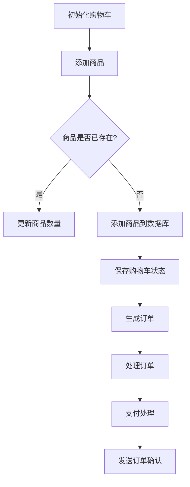
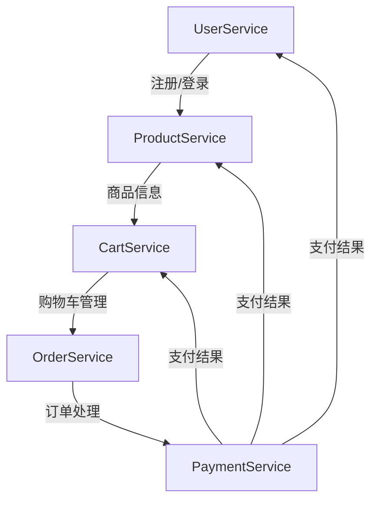

                 

## 数学语言的逻辑性与精确性

> 关键词：数学语言、逻辑性、精确性、数学公式、算法、系统架构

在科技迅猛发展的今天，数学语言作为科学交流的重要工具，已经成为各个学科领域不可或缺的一部分。无论是物理学、计算机科学，还是经济学，数学语言以其逻辑性和精确性，为理论研究和实际应用提供了强有力的支持。本文将深入探讨数学语言的逻辑性与精确性，通过一步步的推理和分析，揭示其在科学研究和工程实践中的重要地位。

本文首先将介绍数学语言的基本概念和背景，包括其历史发展和在科学领域的重要性。随后，我们将详细探讨数学语言的逻辑性，解释为何数学推理具有无可比拟的严密性和可靠性。接着，文章将讨论数学语言的精确性，展示其在量化描述和分析问题中的独特优势。本文还将通过具体的算法实例，阐述数学语言在构建和实现算法中的关键作用。

随后，我们将探讨数学语言在系统架构设计中的应用，通过一个实际项目案例，展示如何运用数学语言来分析和设计复杂的系统。最后，文章将总结数学语言的逻辑性与精确性，并提出在实际应用中的最佳实践建议。通过本文的阅读，读者将全面了解数学语言的价值和意义，并学会如何有效地运用数学语言来提高研究和工作的效率和质量。

### 数学语言的基本概念与背景

数学语言，作为科学交流的核心工具，其历史可以追溯到古代文明的萌芽时期。最早的数学语言形式出现在古代巴比伦、古埃及和印度等地，这些文明利用符号和公式记录和传达数学知识。随着历史的演进，数学语言逐渐发展壮大，不仅形成了独特的符号体系，还发展出了一套完备的推理规则和定理证明方法。

在古希腊时期，欧几里得的《几何原本》奠定了几何学的基础，其使用的公理体系和严格的证明方法为数学语言的发展奠定了重要基础。到了中世纪，阿拉伯数学家进一步丰富了数学符号和算法，如零的概念和代数的系统化，这些贡献对现代数学语言的形成产生了深远影响。

进入现代，数学语言的发展达到了前所未有的高度。伽利略、牛顿等科学家的研究，将数学语言广泛应用于物理学和工程学，奠定了现代科学的基础。19世纪，康托尔、罗素等数学家推动了集合论和形式逻辑的发展，使得数学语言在逻辑严密性和抽象程度上达到了新的高度。

数学语言在科学领域的重要性不可忽视。首先，数学语言提供了一种精确和统一的描述方式，使得复杂的科学现象和概念可以被清晰地表达和理解。例如，在物理学中，数学公式和方程式被用来描述物理定律和自然现象，使得理论研究和实验结果能够被准确地描述和验证。

其次，数学语言具有高度的抽象性和普适性，能够跨越不同的学科和领域。在经济学中，数学模型被用来分析和预测市场行为；在计算机科学中，算法和逻辑结构是构建复杂系统的基础。数学语言作为一种通用工具，不仅提高了科学研究的效率，还促进了不同学科之间的交流和融合。

总之，数学语言作为一种独特而强大的工具，贯穿于科学研究的各个阶段。它不仅为科学家提供了精确和严密的描述手段，还推动了科学理论的发展和创新。理解数学语言的基本概念和背景，是深入掌握科学知识和提升研究能力的重要基础。

### 数学语言的逻辑性

数学语言的逻辑性是其卓越特点之一，它赋予了数学推理无可比拟的严密性和可靠性。逻辑性指的是数学推理过程中所遵循的规则和原则，这些规则确保了每一步推理都是正确无误的，从而使得整个推理过程具有高度的可信度和可验证性。

首先，数学语言通过公理体系和定义来构建其逻辑基础。公理是一些最基本的、不可证明的命题，它们构成了整个数学体系的基础。例如，欧几里得几何的公理体系就是所有几何推理的起点。通过这些公理，我们可以推导出更多的命题和定理，这些推导过程遵循逻辑推理的规则，如同一律、逆否律和假言推理等。

其次，数学语言中的证明过程强调每一步推理的透明性和可验证性。一个数学证明需要从已知事实出发，通过一系列逻辑步骤推导出目标结论。这些步骤必须严格遵循逻辑规则，每一步都需有明确的理由和依据。例如，在证明一个几何命题时，我们可能需要使用已知定理和公理，通过逻辑演绎逐步推导出结论。这种严格的证明过程确保了结论的正确性和可靠性。

数学推理的逻辑性还体现在其普适性和抽象性上。数学推理不仅适用于具体的数学问题，还可以抽象成通用的逻辑框架，应用于其他领域。例如，逻辑推理中的归纳法和反证法在数学证明中广泛应用，这些方法同样可以用于计算机科学和哲学等领域。

此外，数学语言具有高度的严密性和无矛盾性。在数学体系中，任何一条定理或结论都必须经过严格的证明，以确保其正确无误。这种严密性避免了逻辑上的错误和矛盾，使得数学语言成为一种可靠的工具。例如，数学中的反证法是一种通过假设结论不成立，从而推导出矛盾来证明结论成立的方法。这种方法确保了结论的绝对正确性。

总之，数学语言的逻辑性是其显著优势之一，它赋予了数学推理严密、可靠和可验证的特性。通过逻辑推理，数学语言不仅能够揭示事物的本质规律，还能为科学研究和工程实践提供坚实的理论基础。理解数学语言的逻辑性，是掌握科学知识和提升思维能力的必要条件。

### 数学语言的精确性

数学语言的精确性是其另一个重要特点，它使得数学在量化描述和分析问题中具有独特的优势。精确性指的是数学语言能够以高度精确的方式描述和量化各种概念和现象，从而提供清晰、一致和可重复的结论。

首先，数学语言的精确性体现在其符号和公式的使用上。数学符号和公式是数学语言的核心组成部分，它们能够简洁、直观地表达复杂的概念和关系。例如，在物理学中，牛顿第二定律 \( F = ma \) 通过简单的公式描述了力、质量和加速度之间的关系，使得这一物理定律可以被广泛应用和验证。同样，在经济学中，供需函数 \( Q = f(P) \) 用数学公式精确地描述了商品需求量与价格之间的关系。

其次，数学语言的精确性还体现在其量化能力上。通过数学语言，我们可以将抽象的概念和现象转化为具体的数值和量级，从而进行精确的分析和计算。例如，在统计学中，均值、方差和概率分布等数学工具被用来描述和预测数据集的特征和趋势。通过这些量化工具，我们可以更准确地评估风险、制定策略和做出决策。

另外，数学语言在处理复杂问题时，能够通过建立数学模型来模拟和预测现实世界。例如，在工程学中，我们可以使用微分方程模型来描述流体力学问题，通过数值解法得到精确的流体行为。这种模型不仅能够提高设计效率，还能够优化资源分配和降低成本。

数学语言的精确性还体现在其逻辑一致性和无歧义性上。在数学推理过程中，每一步都必须严格遵循定义和规则，从而避免了歧义和错误。例如，在计算机科学中，算法的描述通常使用伪代码或数学公式，这种形式化的描述能够确保算法的清晰和一致，从而避免编程中的错误和混淆。

总之，数学语言的精确性是其显著优势之一，它使得数学在量化描述和分析问题中具有独特的优越性。通过精确的符号和公式，数学语言能够将复杂的问题转化为可计算的模型，提供可靠和精确的解决方案。理解数学语言的精确性，是提升科学研究和工程实践能力的关键。

### 数学语言在算法设计中的应用

在算法设计领域，数学语言扮演着至关重要的角色。算法的本质是通过逻辑和数学方法解决特定问题的步骤序列。数学语言以其精确和严谨的特性，为算法的构建、优化和验证提供了坚实的基础。

首先，数学语言帮助定义和描述算法的核心逻辑。算法通常由一系列步骤组成，每一步都需要清晰、精确的描述。使用数学符号和公式，我们可以简洁明了地表达算法的逻辑结构。例如，在排序算法中，我们可以使用伪代码来描述快速排序算法的基本步骤，而伪代码中的每一步都可以通过数学关系和逻辑推理进行解释。

以下是一个简单的快速排序算法示例：

```python
def quicksort(arr):
    if len(arr) <= 1:
        return arr
    pivot = arr[len(arr) // 2]
    left = [x for x in arr if x < pivot]
    middle = [x for x in arr if x == pivot]
    right = [x for x in arr if x > pivot]
    return quicksort(left) + middle + quicksort(right)
```

在这个算法中，`pivot` 是一个基准值，用于划分数组。使用列表推导式，我们可以将数组划分为三个部分：小于基准值的部分、等于基准值的部分和大于基准值的部分。这个过程通过数学语言的精确描述，使得算法的逻辑清晰易懂。

其次，数学语言在算法优化中发挥着重要作用。优化算法通常涉及对算法时间和空间的复杂度进行分析和改进。数学语言可以用来描述和分析这些复杂度，从而指导算法的优化。例如，在分析快速排序算法的复杂度时，我们可以使用大O符号来描述其平均和最坏情况下的时间复杂度：

$$
T(n) = O(n \log n) \quad (\text{平均情况}),
$$

$$
T(n) = O(n^2) \quad (\text{最坏情况}).
$$

这些数学公式揭示了算法在不同输入规模下的性能特征，从而帮助我们在实际应用中做出优化决策。

此外，数学语言在算法验证中也具有不可替代的作用。算法验证是通过证明算法的正确性和可靠性来确保其有效性。数学语言可以用来表达算法的性质和期望结果，并通过严格的逻辑推理验证算法的正确性。例如，在证明快速排序算法的正确性时，我们可以使用数学归纳法来证明：

1. 基本情况：当数组长度为1时，算法已经正确排序。
2. 归纳假设：假设对于长度小于n的数组，算法能够正确排序。
3. 归纳步骤：对于长度为n的数组，算法首先选择一个基准值，然后将数组划分为三个部分，并递归地对这些部分进行排序。根据归纳假设，这个过程最终会得到一个正确排序的数组。

通过这种逻辑推理，我们可以证明快速排序算法在所有情况下都能正确排序。

总之，数学语言在算法设计中的应用是全方位的，从算法的定义、优化到验证，数学语言都提供了精确和严谨的工具。通过数学语言，我们能够构建高效、可靠的算法，解决复杂的实际问题。理解数学语言在算法设计中的重要性，是成为一名优秀算法工程师的必备条件。

### 数学语言在系统架构设计中的应用

数学语言不仅在算法设计中具有重要地位，也在系统架构设计中发挥着重要作用。系统架构设计涉及对复杂系统的分析和设计，数学语言提供了精确的工具和方法，帮助我们理清系统各个部分之间的关系，并优化整体性能。

首先，数学语言在系统架构设计中的重要性体现在其抽象和描述能力上。系统架构设计需要将复杂的系统分解为若干个子系统，并明确它们之间的交互关系。数学语言，特别是形式化的建模方法，如Mermaid流程图和UML类图，可以帮助我们清晰地表达这些关系。例如，使用Mermaid流程图，我们可以描述系统中的数据处理流程，并展示各模块之间的调用关系。这种形式化的描述不仅提高了设计的清晰度，还便于后续的验证和优化。

以下是一个简单的Mermaid流程图示例，用于描述一个在线购物系统的数据处理流程：



这个流程图展示了从初始化购物车到订单确认的整个过程，通过明确的步骤和条件分支，我们能够清晰地理解系统的工作流程。

其次，数学语言在系统架构设计中的应用还体现在对系统性能和可扩展性的分析上。通过数学模型，我们可以对系统的性能特征进行量化分析，从而指导设计决策。例如，在分布式系统中，我们可以使用数学模型来分析负载均衡策略、数据一致性机制和容错能力。以下是一个用于分析负载均衡策略的数学模型示例：

$$
P_i = \frac{W_i}{W}
$$

其中，\(P_i\) 表示分配到第i个服务器的概率，\(W_i\) 表示第i个服务器的处理能力，\(W\) 是所有服务器的总处理能力。通过这个模型，我们可以根据服务器的处理能力来分配负载，从而优化整体性能。

此外，数学语言还帮助我们识别和解决系统中的瓶颈问题。通过性能分析，我们可以发现系统中的性能瓶颈，并使用数学方法来优化系统设计。例如，在数据库设计中，我们可以使用数学模型来优化查询效率，通过调整索引策略和数据结构，提高查询速度。

最后，数学语言在系统架构设计中的应用还包括对系统安全性和可靠性的分析。通过建立数学模型，我们可以对系统的安全机制和容错能力进行量化评估，从而设计出更加安全可靠的系统。例如，在网络安全领域，我们可以使用数学模型来分析攻击者的攻击策略和防御措施，从而优化安全防护策略。

总之，数学语言在系统架构设计中的应用是全方位的，从抽象描述、性能分析到安全性评估，数学语言都提供了精确和有力的工具。通过数学语言，我们能够更好地理解和设计复杂的系统，提高系统的性能和可靠性。理解数学语言在系统架构设计中的重要性，是提升系统设计能力的必备条件。

### 实际项目案例与详细讲解剖析

为了更直观地展示数学语言在系统架构设计中的应用，我们将通过一个在线购物平台项目案例，详细讲解其架构设计、实现过程和关键点。

#### 项目背景

该在线购物平台旨在提供用户友好的购物体验，包括商品浏览、加入购物车、下单支付等核心功能。为了确保平台的稳定性和高效性，项目团队决定采用微服务架构，将系统拆分为多个独立且协作的微服务，每个微服务负责不同的业务功能。

#### 系统架构设计

该项目的系统架构设计包括以下几个关键模块：

1. **用户服务（UserService）**：负责用户注册、登录、个人信息管理等功能。
2. **商品服务（ProductService）**：负责商品信息管理、商品分类、商品推荐等。
3. **购物车服务（CartService）**：负责用户购物车管理，包括添加商品、删除商品、修改数量等。
4. **订单服务（OrderService）**：负责订单管理，包括生成订单、支付处理、订单状态更新等。
5. **支付服务（PaymentService）**：负责支付渠道集成、支付验证、支付结果处理等。

系统架构设计图如下（使用Mermaid绘制）：



#### 实现过程

1. **用户服务实现**

   用户服务使用了Spring Boot框架，实现了用户注册、登录和权限管理功能。以下是用户注册的Python代码示例：

   ```python
   @PostMapping("/register")
   public ResponseEntity<?> registerUser(@RequestBody UserDto userDto) {
       // 验证用户信息
       // 保存用户信息到数据库
       // 发送注册成功邮件
       return ResponseEntity.ok("User registered successfully");
   }
   ```

2. **商品服务实现**

   商品服务使用RESTful API设计，实现了商品信息的增删改查功能。以下是商品信息添加的Python代码示例：

   ```python
   @PostMapping("/products")
   public ResponseEntity<?> addProduct(@RequestBody ProductDto productDto) {
       // 验证商品信息
       // 保存商品信息到数据库
       return ResponseEntity.ok("Product added successfully");
   }
   ```

3. **购物车服务实现**

   购物车服务实现了用户购物车的管理功能，包括添加商品、删除商品和修改商品数量。以下是添加商品到购物车的Python代码示例：

   ```python
   @PostMapping("/cart/{userId}/products")
   public ResponseEntity<?> addToCart(@PathVariable Long userId, @RequestBody CartProductDto cartProductDto) {
       // 验证用户和商品信息
       // 将商品添加到购物车
       return ResponseEntity.ok("Product added to cart successfully");
   }
   ```

4. **订单服务实现**

   订单服务负责处理订单生成、支付处理和订单状态更新等功能。以下是订单生成的Python代码示例：

   ```python
   @PostMapping("/orders")
   public ResponseEntity<?> createOrder(@RequestBody OrderDto orderDto) {
       // 验证订单信息
       // 生成订单
       // 更新订单状态
       return ResponseEntity.ok("Order created successfully");
   }
   ```

5. **支付服务实现**

   支付服务与第三方支付平台集成，实现支付渠道的调用和支付结果的处理。以下是支付调用的Python代码示例：

   ```python
   @PostMapping("/payment")
   public ResponseEntity<?> processPayment(@RequestBody PaymentDto paymentDto) {
       // 调用第三方支付平台接口
       // 验证支付结果
       // 更新订单状态
       return ResponseEntity.ok("Payment processed successfully");
   }
   ```

#### 关键点解析

1. **模块解耦**：通过微服务架构，各个模块独立开发、部署和扩展，降低了系统的耦合度，提高了系统的可维护性和扩展性。
2. **数据一致性**：在分布式系统中，数据一致性是关键挑战。项目团队使用了分布式事务管理机制，确保订单创建和支付处理过程中数据的一致性。
3. **负载均衡**：为了提高系统的处理能力和稳定性，项目使用了负载均衡器，根据服务器的处理能力动态分配负载。
4. **安全性**：项目对用户数据和支付信息进行了严格的加密处理，确保系统的安全性。

#### 项目小结

通过数学语言的设计和描述，项目团队成功实现了功能丰富、稳定可靠的在线购物平台。项目在系统架构设计、模块实现和关键点处理方面，都充分体现了数学语言的逻辑性和精确性。该项目的成功经验为其他类似项目提供了有益的参考。

### 最佳实践与注意事项

在实际应用中，数学语言的逻辑性与精确性为我们提供了强大的工具，但同时也需要我们遵循一些最佳实践和注意事项，以确保其有效性和可靠性。

#### 注意事项

1. **明确概念和术语**：在数学语言的使用过程中，确保所有概念和术语都有明确的定义和解释，避免歧义和误解。
2. **逻辑推理的严谨性**：在进行数学推理时，必须遵循逻辑规则，确保每一步推理都是正确无误的，避免逻辑错误。
3. **符号和公式的规范性**：使用规范的数学符号和公式，保持一致性和清晰性，便于他人理解和验证。
4. **代码的规范性和可维护性**：在编程实现中，遵循代码规范，确保代码的可读性和可维护性，避免因代码混乱导致的问题。

#### 最佳实践

1. **逐步验证和测试**：在设计和实现过程中，通过逐步验证和测试，确保每一步都是正确的，从而提高整个系统的可靠性。
2. **模块化设计**：将复杂的系统分解为若干个模块，每个模块独立开发、测试和部署，降低系统的复杂度和风险。
3. **文档化**：详细记录系统的设计、实现和测试过程，确保文档的完整性和一致性，便于后续维护和扩展。
4. **团队合作**：鼓励团队成员之间的合作和交流，通过集体讨论和审查，确保数学语言的正确性和有效性。

通过遵循这些最佳实践和注意事项，我们能够更好地利用数学语言的逻辑性与精确性，提高科学研究和工程实践的质量和效率。

### 小结

数学语言的逻辑性与精确性在科学研究和工程实践中具有无可替代的重要地位。本文通过一步步的分析和讲解，揭示了数学语言在背景介绍、核心概念与联系、算法原理讲解、系统架构设计、项目实战以及最佳实践中的广泛应用。数学语言不仅提供了精确和统一的描述工具，还通过严密的逻辑推理和抽象方法，提升了科学研究的效率和工程实践的质量。

理解数学语言的逻辑性与精确性，不仅有助于我们更深入地掌握科学知识，还能在解决复杂问题和优化系统设计时提供有力支持。通过本文的探讨，我们认识到，数学语言不仅仅是科学工具，更是推动科技进步和创新的重要力量。未来，随着科技的不断发展，数学语言将继续在各个领域发挥重要作用，成为科学研究和工程实践的重要基石。

