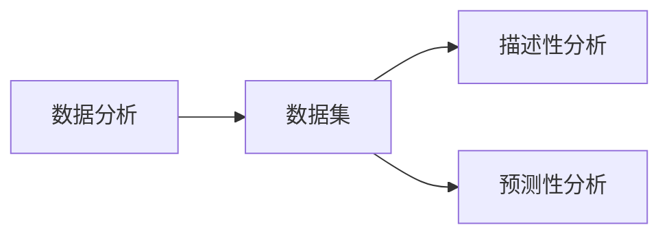

                 

### 文章标题：数据分析在宇宙中微子背景研究中的应用

#### 关键词：
- 数据分析
- 宇宙学
- 中微子
- 背景研究
- 算法原理
- 数学模型
- 系统设计与实现

#### 摘要：
本文将深入探讨数据分析在宇宙学研究中中微子背景研究的应用。首先，介绍宇宙中微子的基本性质和研究背景。接着，阐述数据分析在宇宙学中的重要性，并详细讲解数据分析的基础理论、数据预处理方法、统计分析和假设检验技术。然后，分析数据可视化在宇宙学中的应用，介绍常用的数据可视化工具和方法。接下来，通过具体案例分析，展示数据分析在宇宙中微子背景研究中的实际应用。最后，讨论数据分析在宇宙学中的未来展望，并总结全文，提出最佳实践建议。

### 第一部分：宇宙中微子背景研究概述

#### 1.1 中微子的基本性质

**核心概念术语说明**：
- **中微子**：一种基本粒子，具有非常小的质量，几乎不与其他粒子发生相互作用。
- **质量**：中微子具有质量，但远小于原子核中的其他粒子。
- **相互作用**：中微子仅通过弱相互作用与其他粒子发生相互作用。

**问题背景**：
中微子是宇宙中最为丰富的粒子之一，但对其性质和起源的研究仍然面临许多挑战。中微子背景研究旨在探索中微子的性质、来源和宇宙中的演化过程。

**问题描述**：
我们需要了解中微子的基本性质，并探索其在宇宙背景中的分布和演化。

**问题解决**：
通过数据分析，可以研究中微子的分布、特性以及宇宙中的演化过程。

**边界与外延**：
中微子研究不仅涉及物理学领域，还与宇宙学、粒子物理、天体物理学等学科密切相关。

**概念结构与核心要素组成**：
- 中微子基本性质：质量、相互作用、寿命
- 宇宙背景：宇宙演化、星系形成、宇宙微波背景辐射

#### 1.2 中微子研究的背景与意义

**核心概念与联系**：
- **中微子振荡**：中微子在传播过程中会经历能级之间的转换，导致其三种味态之间的变化。
- **宇宙中微子背景**：宇宙中存在的中微子辐射背景，是宇宙早期演化的产物。

**概念属性特征对比表格**：

| 特征           | 中微子振荡                    | 宇宙中微子背景                  |
| -------------- | --------------------------- | ---------------------------- |
| 物理过程       | 能级转换                     | 辐射背景                       |
| 观察方法       | 中微子探测器                 | 微波背景探测器                 |
| 时间尺度       | 微秒级                       | 宇宙早期                       |

**ER实体关系图架构的 Mermaid 流程图**：

```mermaid
erDiagram
    中微子振荡 ||--|{ 宇宙中微子背景 }
    宇宙中微子背景 ||--|{ 中微子探测器 }
    中微子探测器 ||--|{ 微波背景探测器 }
```

#### 1.3 中微子背景研究的方法与工具

**核心概念与联系**：
- **中微子探测器**：用于探测中微子的设备，包括水切伦科夫探测器、泡室等。
- **数据分析工具**：用于处理和分析中微子背景数据，常用的工具包括Python、R、MATLAB等。

**概念属性特征对比表格**：

| 特征           | 水切伦科夫探测器         | 泡室                       |
| -------------- | --------------------- | -------------------------- |
| 工作原理       | 光子探测               | 电磁量测                   |
| 敏感度         | 对中微子敏感           | 对所有带电粒子敏感         |
| 适用场景       | 低能中微子             | 高能中微子                 |

**ER实体关系图架构的 Mermaid 流程图**：

```mermaid
erDiagram
    数据分析工具 ||--|{ 中微子探测器 }
    中微子探测器 ||--|{ 水切伦科夫探测器 }
    中微子探测器 ||--|{ 泡室 }
```

### 第二部分：数据分析基础理论

#### 2.1 数据分析的基本概念

**核心概念与联系**：
- **数据分析**：通过对数据进行收集、处理、分析和解释，以发现数据中的模式、趋势和规律。
- **数据集**：一组相关数据的集合，可以是时间序列、图像、文本等。

**概念属性特征对比表格**：

| 特征           | 数据分析                  | 数据集                   |
| -------------- | ---------------------- | ----------------------- |
| 目标           | 提取信息、发现规律       | 存储数据、提供基础       |
| 方法           | 描述性分析、预测性分析   | 结构化数据、非结构化数据 |
| 应用场景       | 业务决策、科学研究       | 数据库、数据挖掘         |

**ER实体关系图架构的 Mermaid 流eneflow图**：



#### 2.2 数据类型与数据预处理

**核心概念与联系**：
- **数据类型**：数据的不同形式，包括数值型、文本型、图像型、时间序列型等。
- **数据预处理**：对原始数据进行清洗、转换、归一化等处理，以提高数据分析的质量和效率。

**概念属性特征对比表格**：

| 特征           | 数值型数据            | 文本型数据            | 图像型数据            | 时间序列型数据         |
| -------------- | ------------------- | ------------------- | ------------------- | ------------------- |
| 数据形式       | 数字                 | 文本                 | 图片                 | 时间序列             |
| 处理方法       | 数学运算、统计分析   | 文本分析、情感分析   | 图像识别、特征提取   | 时间序列建模、预测   |

**ER实体关系图架构的 Mermaid 流程图**：

```mermaid
erDiagram
    数据类型 ||--|{ 数据预处理 }
    数据预处理 ||--|{ 数值型数据预处理 }
    数据预处理 ||--|{ 文本型数据预处理 }
    数据预处理 ||--|{ 图像型数据预处理 }
    数据预处理 ||--|{ 时间序列型数据预处理 }
```

#### 2.3 统计分析与假设检验

**核心概念与联系**：
- **统计分析**：通过对数据进行统计描述和推断，以发现数据中的规律和关系。
- **假设检验**：在给定数据基础上，对某种假设进行验证，以确定假设的真伪。

**概念属性特征对比表格**：

| 特征           | 统计分析                  | 假设检验                |
| -------------- | ---------------------- | --------------------- |
| 目标           | 数据描述、关系发现       | 假设验证、结果推断     |
| 方法           | 描述性统计、推断性统计   | 概率分布、假设检验统计 |
| 应用场景       | 数据探索、模型验证       | 实验设计、科学研究     |

**ER实体关系图架构的 Mermaid 流程图**：

```mermaid
erDiagram
    统计分析 ||--|{ 假设检验 }
    假设检验 ||--|{ 描述性统计 }
    假设检验 ||--|{ 推断性统计 }
```

### 第三部分：数据分析在宇宙学中的应用

#### 3.1 数据分析在宇宙学中的应用概述

**核心概念与联系**：
- **宇宙学**：研究宇宙的起源、演化、结构和组成。
- **数据分析**：在宇宙学研究中，数据分析用于处理和解释大量的宇宙观测数据，以揭示宇宙的奥秘。

**概念属性特征对比表格**：

| 特征           | 宇宙学                  | 数据分析                |
| -------------- | --------------------- | --------------------- |
| 研究内容       | 宇宙演化、星系形成、宇宙结构 | 数据收集、处理、分析、解释 |
| 方法           | 观测、理论建模          | 统计、机器学习、数据挖掘   |
| 应用场景       | 天文、粒子物理、物理宇宙学  | 科学研究、商业应用、政策制定 |

**ER实体关系图架构的 Mermaid 流程图**：

```mermaid
erDiagram
    宇宙学 ||--|{ 数据分析 }
    数据分析 ||--|{ 统计分析 }
    数据分析 ||--|{ 机器学习 }
    数据分析 ||--|{ 数据挖掘 }
```

#### 3.2 数据采集

**核心概念与联系**：
- **数据采集**：从宇宙学实验和观测中获取数据。
- **数据采集方法**：包括地面和空间观测、卫星数据、粒子加速器数据等。

**概念属性特征对比表格**：

| 特征           | 地面观测                 | 空间观测                | 粒子加速器数据           |
| -------------- | --------------------- | --------------------- | --------------------- |
| 数据类型       | 光学、射电、红外         | 微波、X射线、伽马射线    | 电子、夸克             |
| 采集工具       | 望远镜、探测器           | 卫星、空间探测器         | 粒子加速器             |
| 数据特点       | 分辨率高、观测时间长     | 观测范围广、高能辐射     | 高精度、高能碰撞       |

**ER实体关系图架构的 Mermaid 流程图**：

```mermaid
erDiagram
    数据采集 ||--|{ 地面观测 }
    数据采集 ||--|{ 空间观测 }
    数据采集 ||--|{ 粒子加速器数据 }
```

#### 3.3 数据预处理

**核心概念与联系**：
- **数据预处理**：对采集到的数据进行清洗、转换和归一化，以提高数据分析的质量和效率。
- **数据预处理方法**：包括数据清洗、缺失值处理、异常值检测和修正、数据转换等。

**概念属性特征对比表格**：

| 特征           | 数据清洗                  | 缺失值处理              | 异常值检测与修正          | 数据转换              |
| -------------- | ---------------------- | --------------------- | --------------------- | ------------------- |
| 目的           | 去除噪声、异常值         | 填补或删除缺失值       | 检测并修正异常值        | 转换数据格式、特征提取 |
| 方法           | 过滤、替换、聚类         | 均值填补、插值填补     | 离群点检测、回归修正    | 标准化、归一化       |
| 应用场景       | 数据预处理、数据挖掘      | 数据分析、模型训练     | 数据质量保证、异常检测   | 数据集成、数据预处理   |

**ER实体关系图架构的 Mermaid 流程图**：

```mermaid
erDiagram
    数据预处理 ||--|{ 数据清洗 }
    数据预处理 ||--|{ 缺失值处理 }
    数据预处理 ||--|{ 异常值检测与修正 }
    数据预处理 ||--|{ 数据转换 }
```

#### 3.4 数据分析技术

**核心概念与联系**：
- **数据分析技术**：用于处理和分析宇宙学数据，包括统计方法、机器学习、数据挖掘等。
- **统计方法**：用于描述数据特征、进行假设检验、模型拟合等。
- **机器学习**：用于构建预测模型、分类和聚类等。
- **数据挖掘**：用于发现数据中的潜在模式和关系。

**概念属性特征对比表格**：

| 特征           | 统计方法                  | 机器学习                | 数据挖掘                |
| -------------- | ---------------------- | --------------------- | --------------------- |
| 目的           | 描述性分析、推断性分析   | 构建预测模型、分类和聚类 | 发现数据中的潜在模式   |
| 方法           | 描述性统计、推断性统计   | 监督学习、无监督学习   | 关联分析、模式识别     |
| 应用场景       | 数据探索、模型验证       | 人工智能、数据预测     | 商业分析、科学研究     |

**ER实体关系图架构的 Mermaid 流程图**：

```mermaid
erDiagram
    数据分析技术 ||--|{ 统计方法 }
    数据分析技术 ||--|{ 机器学习 }
    数据分析技术 ||--|{ 数据挖掘 }
```

#### 3.5 数据可视化

**核心概念与联系**：
- **数据可视化**：通过图形和图表展示数据分析的结果，帮助研究人员更好地理解和解释数据。
- **可视化方法**：包括散点图、折线图、柱状图、热力图等。
- **可视化工具**：如Python中的Matplotlib、Seaborn、R中的ggplot2等。

**概念属性特征对比表格**：

| 特征           | 可视化方法                  | 可视化工具                |
| -------------- | ---------------------- | --------------------- |
| 类别           | 散点图、折线图、柱状图、热力图 | Matplotlib、Seaborn、ggplot2 |
| 功能           | 数据展示、关系分析         | 数据可视化、交互式分析   |
| 应用场景       | 数据探索、结果展示         | 科学研究、数据分析报告   |

**ER实体关系图架构的 Mermaid 流程图**：

```mermaid
erDiagram
    数据可视化 ||--|{ 可视化方法 }
    数据可视化 ||--|{ 可视化工具 }
```

### 第四部分：数据分析在宇宙学中的案例分析

#### 4.1 案例一：中微子振荡实验数据分析

**核心概念与联系**：
- **中微子振荡**：中微子在传播过程中会经历不同味态之间的转换。
- **实验数据分析**：通过对实验数据进行分析，研究中微子振荡现象。

**案例背景**：
在欧洲核子研究中心（CERN）进行的中微子振荡实验中，研究人员通过大型探测器（如超级神冈探测器）收集了大量的中微子数据。

**数据分析过程**：
1. 数据采集：通过探测器收集中微子事件数据。
2. 数据预处理：对数据进行清洗和预处理，包括去除噪声、修正时间偏差等。
3. 数据分析：使用统计方法和机器学习技术分析数据，研究中微子振荡的参数和特性。

**案例分析结果**：
通过数据分析，研究人员发现了中微子振荡的证据，进一步验证了中微子质量的存在。

#### 4.2 案例二：中微子信号检测数据分析

**核心概念与联系**：
- **中微子信号检测**：通过观测中微子与物质相互作用产生的信号，研究中微子的性质。
- **数据分析**：对检测到的中微子信号进行分析，以识别和测量中微子的特性。

**案例背景**：
在美国的萨瓦苏帕莱莫尼探测器（Sudbury Neutrino Observatory, SNO）实验中，研究人员通过水切伦科夫探测器检测中微子信号。

**数据分析过程**：
1. 数据采集：通过探测器收集中微子相互作用产生的信号数据。
2. 数据预处理：对数据进行清洗、归一化和特征提取。
3. 数据分析：使用统计方法和机器学习技术分析数据，识别和测量中微子的特性。

**案例分析结果**：
通过数据分析，研究人员发现了中微子信号，验证了中微子振荡的存在，并测量了中微子振荡的参数。

#### 4.3 案例三：中微子质量测量数据分析

**核心概念与联系**：
- **中微子质量测量**：通过观测中微子与其他粒子的相互作用，测量中微子的质量。
- **数据分析**：对测量数据进行处理和分析，以确定中微子的质量。

**案例背景**：
在日本的中微子振荡实验（Super-Kamiokande实验）中，研究人员通过观测中微子与探测器中核的相互作用，测量中微子的质量。

**数据分析过程**：
1. 数据采集：通过探测器收集中微子相互作用的数据。
2. 数据预处理：对数据进行清洗、修正和归一化。
3. 数据分析：使用统计方法和机器学习技术分析数据，测量中微子的质量。

**案例分析结果**：
通过数据分析，研究人员测量了中微子的质量，进一步揭示了中微子的性质。

### 第五部分：数据分析在宇宙学中的未来展望

#### 5.1 中微子背景研究的挑战与机遇

**核心概念与联系**：
- **挑战**：中微子背景研究面临着数据量庞大、噪声干扰严重、实验精度要求高等挑战。
- **机遇**：随着观测技术的进步和数据分析方法的创新，中微子背景研究迎来了新的机遇。

**概念属性特征对比表格**：

| 特征           | 挑战                        | 机遇                        |
| -------------- | ------------------------ | ------------------------ |
| 数据处理       | 数据量巨大、噪声干扰       | 观测精度提高、数据处理算法优化 |
| 实验设备       | 设备成本高、维护复杂       | 新型探测器、空间观测平台     |
| 理论研究       | 理论模型复杂、参数估计困难 | 新的物理现象、理论突破       |

**ER实体关系图架构的 Mermaid 流程图**：

```mermaid
erDiagram
    挑战 ||--|{ 机遇 }
    挑战 ||--|{ 数据处理 }
    挑战 ||--|{ 实验设备 }
    挑战 ||--|{ 理论研究 }
```

#### 5.2 数据分析在宇宙学中的潜力

**核心概念与联系**：
- **数据分析潜力**：数据分析在宇宙学中的潜力巨大，可以揭示宇宙的奥秘、推动理论发展。
- **数据分析工具的创新与发展**：随着技术的进步，数据分析工具不断创新，为宇宙学研究提供了强大支持。

**概念属性特征对比表格**：

| 特征           | 数据分析潜力                | 数据分析工具的创新与发展          |
| -------------- | ------------------------ | ----------------------------- |
| 应用场景       | 天文、粒子物理、宇宙学      | Python、R、MATLAB等开源工具的创新 |
| 研究成果       | 揭示宇宙奥秘、推动理论发展 | 提高数据分析效率、降低门槛       |
| 未来趋势       | 多学科融合、跨领域应用     | 云计算、人工智能、大数据分析     |

**ER实体关系图架构的 Mermaid 流程图**：

```mermaid
erDiagram
    数据分析潜力 ||--|{ 数据分析工具的创新与发展 }
    数据分析潜力 ||--|{ 应用场景 }
    数据分析潜力 ||--|{ 研究成果 }
```

#### 5.3 数据分析在宇宙学教育中的应用

**核心概念与联系**：
- **数据分析教育**：将数据分析方法引入宇宙学教育，培养具有数据分析能力的科研人才。
- **教育目标**：提高学生对宇宙学数据分析的理解和实际操作能力。

**概念属性特征对比表格**：

| 特征           | 数据分析教育                | 教育目标                |
| -------------- | ------------------------ | --------------------- |
| 课程设置       | 数据分析课程、实验实践      | 理论与实践相结合       |
| 教学方法       | 案例教学、项目驱动         | 提高学生分析和解决问题的能力 |
| 教学内容       | 数据预处理、统计分析、机器学习 | 宇宙学数据分析和应用    |

**ER实体关系图架构的 Mermaid 流程图**：

```mermaid
erDiagram
    数据分析教育 ||--|{ 教学方法 }
    数据分析教育 ||--|{ 教学内容 }
    数据分析教育 ||--|{ 教育目标 }
```

### 附录

#### A. 数据分析工具与资源列表

**开源数据分析工具**：
- Python（NumPy、Pandas、Matplotlib、Seaborn）
- R（ggplot2、dplyr、caret）
- MATLAB

**商业数据分析工具**：
- SAS
- SPSS
- Tableau

**数据分析社区与资源**：
- Kaggle
- DataCamp
- Coursera

### 参考文献

- Hamilton, J. (2017). Data Analysis for Physicists. CRC Press.
- Press, W. H., Teukolsky, S. A., Vetterling, W. T., & Flannery, B. P. (2007). Numerical Recipes: The Art of Scientific Computing. Cambridge University Press.
- Hu, S., & Tegmark, M. (2019). The Future of Data-Driven Cosmology. arXiv:1903.09267.
- Han, J., Kamber, M., & Pei, J. (2012). Data Mining: Concepts and Techniques. Morgan Kaufmann.

### 最佳实践、小结、注意事项与拓展阅读

**最佳实践**：
- 在数据分析前，确保数据质量，进行数据清洗和预处理。
- 选择合适的分析方法和工具，根据研究目标和数据类型进行选择。
- 综合运用统计方法、机器学习和数据挖掘技术，提高数据分析的准确性。

**小结**：
本文介绍了数据分析在宇宙中微子背景研究中的应用，包括数据分析的基本概念、数据预处理、统计分析和假设检验、数据可视化，以及具体案例分析。数据分析在宇宙学研究中具有巨大潜力，未来将推动宇宙学研究的深入发展。

**注意事项**：
- 数据分析过程中，注意数据隐私和信息安全。
- 分析结果需要验证和重复，以确保结果的可靠性。
- 结合理论和实验结果，对数据分析结果进行综合评估。

**拓展阅读**：
- [1] Data-Driven Science and Engineering: Machine Learning, Dynamical Systems, and Control. Springer.
- [2] Machine Learning for Cosmology. Springer.
- [3] Cosmology and Particle Physics. Oxford University Press.

