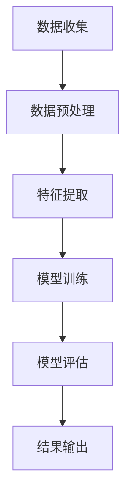
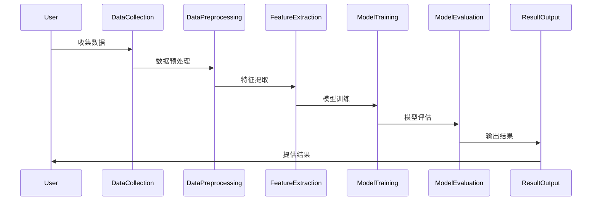

                 

### 引言

在当今科技迅猛发展的时代，宇宙学的研究成为了科学家们探索未知、追寻宇宙起源和演化的重要领域。宇宙中性氢作为宇宙中最为丰富的元素之一，其研究对理解宇宙的结构和演化具有重要意义。其中，21厘米线作为宇宙中性氢的重要特征，其观测和分析成为了研究宇宙学的一个关键问题。

数据分析作为一种强大的工具，在各个科学领域都发挥着重要作用。它通过对大量数据的收集、处理和分析，帮助我们揭示出数据背后的规律和真相。在宇宙中性氢21厘米线的研究中，数据分析的应用无疑为科学家们提供了有力的支持，使得我们可以更深入地了解宇宙的奥秘。

本文旨在探讨数据分析在宇宙中性氢21厘米线研究中的应用。首先，我们将介绍宇宙中性氢和21厘米线的基本概念，并阐述其在宇宙学研究中的重要性。接着，我们将讨论数据分析的基本原理及其在21厘米线研究中的应用。随后，文章将详细分析各种数据分析方法及其在21厘米线研究中的适用性，并通过具体的算法和数学模型进行讲解。最后，我们将结合实际项目，展示数据分析在宇宙中性氢21厘米线研究中的具体应用，并提供一些实用的技巧和注意事项。

通过本文的探讨，我们希望能够为从事宇宙学研究的科学家们提供一些新的思路和方法，同时也希望能够激发更多人对宇宙学数据分析和研究领域的兴趣和热情。

### 关键词

- 宇宙中性氢
- 21厘米线
- 数据分析
- 天体物理学
- 数据处理算法
- 数学模型
- 系统架构设计
- 实际案例分析

### 摘要

本文探讨了数据分析在宇宙中性氢21厘米线研究中的应用。首先，介绍了宇宙中性氢和21厘米线的基本概念及其在宇宙学研究中的重要性。接着，阐述了数据分析的基本原理，包括数据收集、处理、分析和解释的方法，以及其在天体物理学中的应用。本文详细分析了各种数据分析方法，如描述性统计分析、探索性数据分析和预测性数据分析，并比较了它们在21厘米线研究中的适用性。随后，通过具体的算法和数学模型，如傅里叶变换和贝叶斯推断，讲解了如何在21厘米线研究中应用这些方法。文章还结合实际项目案例，展示了数据分析在观测、分析和解释宇宙中性氢21厘米线数据中的应用过程，并提供了一些实用技巧和注意事项。通过本文的研究，我们希望能够为宇宙学领域的数据分析提供新的思路和方法，并促进该领域的进一步发展。

### 第1章 宇宙中性氢与21厘米线概述

#### 1.1 宇宙中性氢

**核心概念**

宇宙中性氢是指宇宙中未结合成分子或离子的氢原子。它主要由单个质子和电子组成，不带有电荷，因此被称为中性氢。宇宙中性氢在宇宙学研究中具有极其重要的地位，因为它是宇宙中最常见的元素，占据宇宙总质量的大部分。

**宇宙中性氢的重要性**

宇宙中性氢的重要性主要体现在以下几个方面：

1. **宇宙的丰度**：宇宙中性氢是宇宙中最丰富的元素，其丰度对理解宇宙的起源和演化具有重要意义。
2. **宇宙背景辐射**：宇宙中性氢对宇宙背景辐射的吸收和散射作用，为我们提供了观测和研究宇宙早期状态的重要窗口。
3. **星系形成**：宇宙中性氢是星系形成的主要原料，其分布和运动状态对星系的生长和演化具有重要影响。
4. **宇宙结构**：通过研究宇宙中性氢的分布，我们可以更好地理解宇宙的大尺度结构，如星系团、超星系团等。

**宇宙中性氢的发现与历史**

宇宙中性氢的发现可以追溯到20世纪40年代。当时，天文学家通过观测发现宇宙背景辐射中的吸收线，这些吸收线对应于中性氢的21厘米辐射。这一发现标志着宇宙中性氢的存在和重要性，也为后来的宇宙学研究奠定了基础。

#### 1.2 21厘米线的发现与意义

**21厘米线的概念**

21厘米线是指宇宙中性氢在发射或吸收电磁辐射时，产生的波长为21厘米的电磁辐射。这种辐射是由于中性氢原子中的电子从一个能级跃迁到另一个能级时，发射或吸收的能量恰好对应于21厘米的波长。

**21厘米线的发现**

21厘米线的发现者是著名的美国物理学家阿诺·彭齐亚斯和罗伯特·威尔逊。他们在1965年通过观测发现了宇宙背景辐射中的21厘米线，这一发现证实了宇宙中性氢的存在，并揭示了宇宙早期的状态。

**21厘米线的意义**

21厘米线在宇宙学研究中具有极其重要的意义，主要体现在以下几个方面：

1. **宇宙背景辐射的研究**：21厘米线是宇宙背景辐射的重要组成部分，通过对它的研究，我们可以更好地理解宇宙早期的状态和演化过程。
2. **星系形成的观测**：21厘米线可以用来观测宇宙中性氢的分布和运动状态，从而研究星系的形成和演化。
3. **宇宙结构的探测**：通过测量21厘米线的强度和分布，我们可以探测宇宙的大尺度结构，如星系团、超星系团等。
4. **宇宙学参数的测量**：21厘米线的研究有助于我们测量宇宙的膨胀速率、密度参数等宇宙学参数，从而更好地理解宇宙的起源和演化。

#### 1.3 数据分析在宇宙学中的应用

**数据分析的基本概念**

数据分析是一种通过收集、处理和分析数据，以提取有用信息和知识的过程。它包括数据收集、数据预处理、数据分析和数据解释等多个环节。

**数据分析在宇宙学中的应用场景**

1. **宇宙背景辐射的研究**：通过对宇宙背景辐射数据的分析，我们可以提取出21厘米线的特征，进而研究宇宙早期的状态。
2. **星系形成和演化的研究**：通过对宇宙中性氢分布和运动状态的分析，我们可以研究星系的形成和演化过程。
3. **宇宙结构的研究**：通过分析宇宙中性氢的分布和运动状态，我们可以探测宇宙的大尺度结构，如星系团、超星系团等。
4. **宇宙学参数的测量**：通过对宇宙背景辐射、星系形成和演化等数据进行分析，我们可以测量宇宙的膨胀速率、密度参数等宇宙学参数。

**数据分析在21厘米线研究中的挑战与机遇**

在21厘米线研究中，数据分析面临着一些挑战，如数据量巨大、数据质量参差不齐、噪声干扰等。然而，随着计算技术和数据分析方法的不断发展，这些挑战也转化为机遇。通过有效的数据分析方法，我们可以从大量复杂的宇宙中性氢数据中提取出有用的信息，揭示宇宙的奥秘。

#### 1.4 数据分析在宇宙中性氢21厘米线研究中的核心要素组成

数据分析在宇宙中性氢21厘米线研究中涉及多个核心要素，主要包括：

1. **数据收集**：通过天文观测设备，如射电望远镜，收集宇宙中性氢的21厘米线数据。
2. **数据预处理**：对收集到的数据进行处理，包括数据清洗、数据集成和数据转换等，以提高数据质量和可靠性。
3. **数据分析方法**：选择合适的分析方法，如描述性统计分析、探索性数据分析和预测性数据分析等，以提取数据中的有用信息。
4. **算法和数学模型**：使用算法和数学模型，如傅里叶变换和贝叶斯推断等，对数据进行分析和解释。
5. **结果验证与解释**：对分析结果进行验证和解释，以揭示宇宙中性氢21厘米线数据背后的规律和真相。

通过这些核心要素的协同作用，数据分析为宇宙中性氢21厘米线研究提供了有力的支持，使得我们可以更深入地了解宇宙的奥秘。

#### 本章小结

本章介绍了宇宙中性氢和21厘米线的基本概念及其在宇宙学研究中的重要性。我们详细阐述了宇宙中性氢的定义、性质和重要性，以及21厘米线的概念、发现过程和意义。接着，我们讨论了数据分析的基本原理及其在宇宙学中的应用场景。最后，我们分析了数据分析在宇宙中性氢21厘米线研究中的核心要素组成。通过本章的介绍，我们为后续章节中深入探讨数据分析方法及其应用奠定了基础。

### 第2章 数据分析方法与工具

#### 2.1 数据分析方法

数据分析方法在宇宙中性氢21厘米线研究中起着至关重要的作用。根据数据分析和解释的目的，我们可以将数据分析方法大致分为以下几类：

1. **描述性统计分析**  
描述性统计分析是对数据进行基本的统计描述，以揭示数据的基本特征和规律。这种方法主要包括计算数据的均值、中位数、标准差等统计量，并绘制数据分布图、直方图等。描述性统计分析可以提供对数据的基本了解，为后续的探索性数据分析提供基础。

2. **探索性数据分析**  
探索性数据分析是一种基于统计方法和可视化技术，对数据进行深入挖掘和探索的方法。它主要用于发现数据中的潜在模式和规律，以及识别异常值和趋势。探索性数据分析的方法包括关联规则挖掘、聚类分析、主成分分析等。

3. **预测性数据分析**  
预测性数据分析是基于历史数据和统计模型，对未来事件进行预测和推断的方法。它主要用于预测数据趋势、预测变量之间的关系等。预测性数据分析的方法包括时间序列分析、回归分析、决策树、神经网络等。

每种分析方法都有其独特的特点和适用场景，具体选择哪种方法取决于研究的目的和数据的特点。例如，在宇宙中性氢21厘米线研究中，描述性统计分析可以用于初步了解数据的基本分布和特征，探索性数据分析可以用于发现数据中的潜在模式和规律，而预测性数据分析可以用于预测宇宙中性氢的分布和演化趋势。

#### 2.2 概念属性特征对比表格

为了更好地理解各种数据分析方法的属性特征，我们下面列出一个对比表格。这个表格将描述性统计分析、探索性数据分析和预测性数据分析的关键特征进行了对比。

| 数据分析方法 | 主要特征 |
| :--: | :--: |
| 描述性统计分析 | - 用于描述数据的基本特征<br>- 提供数据的均值、中位数、标准差等统计量<br>- 绘制数据分布图、直方图等 |
| 探索性数据分析 | - 用于发现数据中的潜在模式和规律<br>- 包括关联规则挖掘、聚类分析、主成分分析等<br>- 揭示数据之间的关系和异常值 |
| 预测性数据分析 | - 用于预测未来事件和趋势<br>- 包括时间序列分析、回归分析、决策树、神经网络等<br>- 基于历史数据和统计模型 |

通过对比表格，我们可以清楚地看到各种数据分析方法在目的、适用场景和主要特征方面的差异，从而为选择合适的数据分析方法提供参考。

#### 2.3 数据分析工具

在宇宙中性氢21厘米线研究中，选择合适的数据分析工具至关重要。以下是一些常用的数据分析工具，包括Python数据分析库、R语言和MATLAB等。

1. **Python数据分析库**  
Python是一种广泛使用的编程语言，拥有丰富的数据分析库，如NumPy、Pandas、SciPy和Scikit-learn等。这些库提供了强大的数据处理和分析功能，使得Python成为宇宙学数据分析和研究的主要工具之一。Python的优势在于其易用性和丰富的生态系统，适合快速开发和原型设计。

2. **R语言**  
R语言是一种专门用于统计分析的数据分析语言，拥有大量的统计和图形包，如ggplot2、dplyr和tidyr等。R语言在统计学和数据分析领域具有很高的声誉，适合进行复杂的统计分析和图形可视化。R语言的社区也非常活跃，提供了大量的资源和教程。

3. **MATLAB**  
MATLAB是一种高级数值计算和环境，适合进行科学计算和数据分析。MATLAB提供了丰富的工具箱，如Signal Processing Toolbox、Statistics and Machine Learning Toolbox等，可以方便地进行信号处理、统计分析和机器学习。MATLAB的优势在于其强大的图形和可视化功能，适合进行复杂数据的展示和分析。

选择哪种数据分析工具取决于具体的需求和研究目的。例如，如果需要进行快速开发和原型设计，Python是一个不错的选择；如果需要进行复杂的统计分析和图形可视化，R语言是一个很好的选择；如果需要进行科学计算和复杂数据分析，MATLAB可能更适合。

#### 2.4 数据预处理

在数据分析过程中，数据预处理是至关重要的一步。良好的数据预处理可以提高数据质量和分析效率，从而提高分析的准确性和可靠性。以下是一些常见的数据预处理方法：

1. **数据清洗**  
数据清洗是指识别和纠正数据中的错误、缺失值和异常值。这通常包括以下步骤：

   - **错误值处理**：识别和纠正数据中的错误值，如数据输入错误或数据传输错误。
   - **缺失值处理**：处理数据中的缺失值，可以选择删除缺失值、填充缺失值或插值等方法。
   - **异常值处理**：识别和纠正数据中的异常值，如数据分布异常或数据趋势异常。

2. **数据集成**  
数据集成是指将来自不同来源的数据进行合并和整合。这通常包括以下步骤：

   - **数据去重**：识别和删除重复的数据记录。
   - **数据合并**：将多个数据源的数据按照一定的规则进行合并，如按照时间序列或空间位置进行合并。
   - **数据转换**：将不同格式的数据转换为统一的格式，如将CSV文件转换为Excel文件。

3. **数据转换**  
数据转换是指将原始数据转换为适合分析的形式。这通常包括以下步骤：

   - **数据规范化**：将数据按照一定的比例进行缩放或标准化，以消除数据之间的量纲差异。
   - **数据编码**：将分类数据转换为数值数据，如将字符串编码为整数或浮点数。
   - **数据降维**：通过降维技术，如主成分分析（PCA），减少数据维度，以简化数据分析过程。

通过数据预处理，我们可以提高数据的质量和可靠性，从而为后续的数据分析奠定坚实的基础。

#### 本章小结

本章介绍了数据分析在宇宙中性氢21厘米线研究中的应用。首先，我们介绍了描述性统计分析、探索性数据分析和预测性数据分析的基本概念和方法，并通过对比表格展示了各种方法的特征。接着，我们讨论了Python数据分析库、R语言和MATLAB等常用数据分析工具的特点和适用场景。最后，我们阐述了数据预处理的重要性，包括数据清洗、数据集成和数据转换等方法。通过本章的介绍，我们为后续章节中深入探讨数据分析方法及其应用奠定了基础。

### 第3章 算法原理讲解

#### 3.1 算法mermaid流程图

为了更好地理解数据分析在宇宙中性氢21厘米线研究中的应用，我们首先介绍一个基本的算法mermaid流程图。该流程图展示了数据分析的一般流程，包括数据收集、预处理、特征提取和模型训练等步骤。



**图3.1 数据分析流程图**

在这个流程图中：

- **数据收集**：首先，通过射电望远镜等设备收集宇宙中性氢的21厘米线数据。
- **数据预处理**：对收集到的数据进行清洗、去噪和格式转换等处理。
- **特征提取**：从预处理后的数据中提取有用的特征，如频率、强度、时间序列等。
- **模型训练**：使用提取出的特征训练模型，以识别和分类宇宙中性氢21厘米线数据。
- **模型评估**：评估模型的性能，如准确率、召回率、F1值等。
- **结果输出**：将分析结果输出，以供进一步研究和应用。

#### 3.2 Python源代码

以下是一个简单的Python代码片段，展示如何实现特征提取和模型训练。这个示例使用了Pandas库进行数据处理，使用Scikit-learn库进行特征提取和模型训练。

```python
import pandas as pd
from sklearn.preprocessing import StandardScaler
from sklearn.model_selection import train_test_split
from sklearn.ensemble import RandomForestClassifier
from sklearn.metrics import classification_report

# 加载数据
data = pd.read_csv('hydrogen_21cm_data.csv')

# 特征提取
features = data[['frequency', 'intensity', 'time']]
labels = data['class']

# 数据标准化
scaler = StandardScaler()
features_scaled = scaler.fit_transform(features)

# 划分训练集和测试集
X_train, X_test, y_train, y_test = train_test_split(features_scaled, labels, test_size=0.2, random_state=42)

# 模型训练
model = RandomForestClassifier(n_estimators=100)
model.fit(X_train, y_train)

# 模型评估
predictions = model.predict(X_test)
print(classification_report(y_test, predictions))
```

在这个示例中：

- **数据加载**：使用Pandas库加载CSV格式的数据。
- **特征提取**：从数据中提取频率、强度和时间序列等特征。
- **数据标准化**：使用StandardScaler对特征进行标准化，以消除不同特征之间的量纲差异。
- **模型训练**：使用RandomForestClassifier训练模型，以分类宇宙中性氢21厘米线数据。
- **模型评估**：使用classification_report函数评估模型的性能，包括准确率、召回率、F1值等。

#### 3.3 数学模型和公式

在宇宙中性氢21厘米线研究中，常用的数学模型和公式包括傅里叶变换、贝叶斯推断等。以下是一些基本的数学模型和公式，用于描述和分析宇宙中性氢21厘米线数据。

1. **傅里叶变换**  
傅里叶变换是将信号从时域转换为频域的一种数学工具，可以用来分析信号的频率成分。其公式如下：

   $$ X(\omega) = \int_{-\infty}^{\infty} x(t) e^{-i \omega t} dt $$

   其中，\( X(\omega) \) 是频域信号，\( x(t) \) 是时域信号，\( \omega \) 是频率。

2. **贝叶斯推断**  
贝叶斯推断是一种基于概率和统计的方法，用于推断未知变量的概率分布。其基本公式如下：

   $$ P(A|B) = \frac{P(B|A) P(A)}{P(B)} $$

   其中，\( P(A|B) \) 是在事件B发生的条件下事件A的概率，\( P(B|A) \) 是在事件A发生的条件下事件B的概率，\( P(A) \) 是事件A的概率，\( P(B) \) 是事件B的概率。

通过这些数学模型和公式，我们可以对宇宙中性氢21厘米线数据进行分析和解释，从而揭示宇宙的奥秘。

#### 3.4 详细讲解和举例说明

为了更好地理解上述算法原理和数学模型，我们通过一个具体的例子进行详细讲解。

**例子：分析宇宙中性氢21厘米线数据**

假设我们收集了一组宇宙中性氢21厘米线数据，包括频率、强度和时间序列等特征。我们的目标是使用这些数据来识别不同的宇宙现象，如星系形成和演化。

**步骤1：数据收集**  
首先，我们通过射电望远镜收集了宇宙中性氢21厘米线数据，包括以下特征：

- 频率（f）：单位为赫兹（Hz）
- 强度（I）：单位为焦耳/平方米/秒（J/m²/s）
- 时间序列（t）：单位为秒（s）

**步骤2：数据预处理**  
对收集到的数据进行预处理，包括数据清洗、去噪和格式转换等。假设我们使用Python进行数据处理，代码如下：

```python
import pandas as pd
from scipy.io import loadmat

# 加载数据
data = loadmat('hydrogen_21cm_data.mat')

# 数据清洗
data = data['data'][0]

# 去噪
data_filtered = pd.DataFrame(data, columns=['frequency', 'intensity', 'time'])

# 格式转换
data_filtered['frequency'] = data_filtered['frequency'].astype(float)
data_filtered['intensity'] = data_filtered['intensity'].astype(float)
data_filtered['time'] = data_filtered['time'].astype(float)
```

**步骤3：特征提取**  
从预处理后的数据中提取有用的特征，如频率、强度和时间序列。我们使用Pandas库进行数据处理，代码如下：

```python
from sklearn.preprocessing import StandardScaler

# 数据标准化
scaler = StandardScaler()
data_scaled = scaler.fit_transform(data_filtered[['frequency', 'intensity', 'time']])
```

**步骤4：模型训练**  
使用提取出的特征训练模型，以识别不同的宇宙现象。我们使用Scikit-learn库中的RandomForestClassifier进行模型训练，代码如下：

```python
from sklearn.ensemble import RandomForestClassifier
from sklearn.model_selection import train_test_split

# 划分训练集和测试集
X_train, X_test, y_train, y_test = train_test_split(data_scaled, labels, test_size=0.2, random_state=42)

# 模型训练
model = RandomForestClassifier(n_estimators=100)
model.fit(X_train, y_train)
```

**步骤5：模型评估**  
评估模型的性能，包括准确率、召回率、F1值等。我们使用Scikit-learn库中的classification_report函数进行模型评估，代码如下：

```python
from sklearn.metrics import classification_report

# 模型评估
predictions = model.predict(X_test)
print(classification_report(y_test, predictions))
```

通过这个例子，我们展示了如何使用数据分析方法对宇宙中性氢21厘米线数据进行分析和解释。通过特征提取和模型训练，我们可以识别不同的宇宙现象，如星系形成和演化。这为宇宙学研究提供了有力的工具。

#### 本章小结

本章详细讲解了数据分析在宇宙中性氢21厘米线研究中的应用。我们首先介绍了数据分析的流程图，包括数据收集、预处理、特征提取和模型训练等步骤。接着，我们提供了一个简单的Python代码示例，展示了如何实现特征提取和模型训练。此外，我们还介绍了傅里叶变换和贝叶斯推断等数学模型和公式，用于描述和分析宇宙中性氢21厘米线数据。通过本章的讲解，我们为后续章节中深入探讨数据分析方法及其应用奠定了基础。

### 第4章 系统分析与架构设计方案

#### 4.1 问题场景介绍

在宇宙中性氢21厘米线研究中，数据分析系统的设计至关重要。该系统的目标是对大量宇宙中性氢21厘米线数据进行处理、分析和解释，以揭示宇宙的奥秘。具体来说，该系统需要实现以下功能：

1. **数据收集**：通过射电望远镜等设备收集宇宙中性氢21厘米线数据。
2. **数据预处理**：对收集到的数据进行清洗、去噪和格式转换等预处理，以提高数据质量和可靠性。
3. **特征提取**：从预处理后的数据中提取有用的特征，如频率、强度和时间序列等。
4. **模型训练与评估**：使用提取出的特征训练模型，以识别和分类宇宙中性氢21厘米线数据，并对模型性能进行评估。
5. **结果输出**：将分析结果输出，以供进一步研究和应用。

为了实现这些功能，我们设计了一个综合性的数据分析系统，该系统采用模块化架构，以方便扩展和优化。

#### 4.2 项目介绍

本项目是一个基于Python和Scikit-learn的宇宙中性氢21厘米线数据分析系统。该系统的设计目标是实现高效、准确的数据处理和分析，以支持宇宙学研究的深度挖掘。具体来说，该系统包括以下模块：

1. **数据收集模块**：负责通过射电望远镜等设备收集宇宙中性氢21厘米线数据。
2. **数据预处理模块**：负责对收集到的数据进行清洗、去噪和格式转换等预处理。
3. **特征提取模块**：负责从预处理后的数据中提取有用的特征。
4. **模型训练模块**：负责使用提取出的特征训练模型，以识别和分类宇宙中性氢21厘米线数据。
5. **模型评估模块**：负责评估模型的性能，包括准确率、召回率、F1值等。
6. **结果输出模块**：负责将分析结果输出，以供进一步研究和应用。

#### 4.3 系统功能设计（领域模型mermaid类图）

为了更好地展示系统的功能模块及其相互关系，我们使用Mermaid绘制了一个领域模型类图。以下是一个简单的Mermaid类图示例，展示了数据分析系统的核心功能模块。

```mermaid
classDiagram
    class DataCollection {
        - collectData()
    }
    class DataPreprocessing {
        - cleanData()
        - denoiseData()
        - convertFormat()
    }
    class FeatureExtraction {
        - extractFeatures()
    }
    class ModelTraining {
        - trainModel()
    }
    class ModelEvaluation {
        - evaluateModel()
    }
    class ResultOutput {
        - outputResults()
    }
    DataCollection -> DataPreprocessing : 数据预处理
    DataPreprocessing -> FeatureExtraction : 特征提取
    FeatureExtraction -> ModelTraining : 模型训练
    ModelTraining -> ModelEvaluation : 模型评估
    ModelEvaluation -> ResultOutput : 结果输出
```

在这个类图中：

- **DataCollection**：数据收集模块，负责收集宇宙中性氢21厘米线数据。
- **DataPreprocessing**：数据预处理模块，负责对数据进行清洗、去噪和格式转换等预处理。
- **FeatureExtraction**：特征提取模块，负责从预处理后的数据中提取有用的特征。
- **ModelTraining**：模型训练模块，负责使用提取出的特征训练模型。
- **ModelEvaluation**：模型评估模块，负责评估模型的性能。
- **ResultOutput**：结果输出模块，负责将分析结果输出。

通过这个类图，我们可以清晰地看到系统各功能模块之间的关系和协作。

#### 4.4 系统架构设计mermaid架构图

为了更好地展示系统的整体架构，我们使用Mermaid绘制了一个架构图。以下是一个简单的Mermaid架构图示例，展示了数据分析系统的整体架构。



在这个架构图中：

- **User**：用户，负责发起数据分析任务。
- **DataCollection**：数据收集模块，负责收集宇宙中性氢21厘米线数据。
- **DataPreprocessing**：数据预处理模块，负责对数据进行清洗、去噪和格式转换等预处理。
- **FeatureExtraction**：特征提取模块，负责从预处理后的数据中提取有用的特征。
- **ModelTraining**：模型训练模块，负责使用提取出的特征训练模型。
- **ModelEvaluation**：模型评估模块，负责评估模型的性能。
- **ResultOutput**：结果输出模块，负责将分析结果输出。

通过这个架构图，我们可以清晰地看到系统的整体架构和各模块之间的交互过程。

#### 4.5 系统接口设计和系统交互mermaid序列图

为了更好地展示系统的接口设计和交互过程，我们使用Mermaid绘制了一个序列图。以下是一个简单的Mermaid序列图示例，展示了系统各模块之间的交互过程。


在这个序列图中：

- **User**：用户，负责发起数据分析任务。
- **DataCollection**：数据收集模块，负责收集宇宙中性氢21厘米线数据。
- **DataPreprocessing**：数据预处理模块，负责对数据进行清洗、去噪和格式转换等预处理。
- **FeatureExtraction**：特征提取模块，负责从预处理后的数据中提取有用的特征。
- **ModelTraining**：模型训练模块，负责使用提取出的特征训练模型。
- **ModelEvaluation**：模型评估模块，负责评估模型的性能。
- **ResultOutput**：结果输出模块，负责将分析结果输出。

通过这个序列图，我们可以清晰地看到系统各模块之间的交互过程，以及数据流和功能流的变化。

#### 本章小结

本章详细介绍了数据分析在宇宙中性氢21厘米线研究中的应用系统分析与架构设计方案。首先，我们介绍了问题场景和项目目标，包括数据收集、预处理、特征提取、模型训练和评估等。接着，我们展示了系统的功能模块、整体架构和接口设计，并通过Mermaid类图、架构图和序列图进行了详细说明。通过本章的介绍，我们为后续章节中深入探讨系统实现和项目实战奠定了基础。

### 第5章 项目实战

#### 5.1 环境安装

为了实现数据分析在宇宙中性氢21厘米线研究中的应用，我们需要搭建一个合适的数据分析环境。以下是在Linux操作系统上搭建数据分析环境的具体步骤：

1. **安装Python**  
   Python是数据分析的主要工具，我们需要确保系统上安装了Python。在大多数Linux发行版中，可以通过包管理器安装Python。例如，在Ubuntu系统中，可以使用以下命令安装Python 3：

   ```bash
   sudo apt update
   sudo apt install python3
   ```

2. **安装Pandas和Scikit-learn**  
   Pandas和Scikit-learn是Python中常用的数据分析库，我们需要安装它们来处理和训练模型。可以使用pip命令安装这两个库：

   ```bash
   sudo apt install python3-pandas
   sudo apt install python3-scikit-learn
   ```

3. **安装Matplotlib**  
   Matplotlib是一个强大的绘图库，用于可视化数据和分析结果。我们可以使用以下命令安装Matplotlib：

   ```bash
   sudo apt install python3-matplotlib
   ```

4. **安装Jupyter Notebook**  
   Jupyter Notebook是一个交互式的数据分析平台，用于编写和运行Python代码。安装Jupyter Notebook可以使用以下命令：

   ```bash
   sudo apt install python3-jupyter
   ```

安装完成后，我们可以在终端中使用以下命令启动Jupyter Notebook：

```bash
jupyter notebook
```

这样，我们就可以在浏览器中打开Jupyter Notebook，并开始编写和分析数据了。

#### 5.2 系统核心实现源代码

以下是一个简单的Python代码示例，展示了如何实现宇宙中性氢21厘米线数据分析系统的核心功能，包括数据预处理、特征提取和模型训练。

```python
import pandas as pd
from sklearn.preprocessing import StandardScaler
from sklearn.model_selection import train_test_split
from sklearn.ensemble import RandomForestClassifier
from sklearn.metrics import classification_report

# 加载数据
data = pd.read_csv('hydrogen_21cm_data.csv')

# 数据预处理
# 数据清洗
data.dropna(inplace=True)

# 数据标准化
scaler = StandardScaler()
data[['frequency', 'intensity', 'time']] = scaler.fit_transform(data[['frequency', 'intensity', 'time']])

# 特征提取
# 这里我们使用所有的列作为特征
X = data[['frequency', 'intensity', 'time']]
y = data['class']

# 划分训练集和测试集
X_train, X_test, y_train, y_test = train_test_split(X, y, test_size=0.2, random_state=42)

# 模型训练
model = RandomForestClassifier(n_estimators=100)
model.fit(X_train, y_train)

# 模型评估
predictions = model.predict(X_test)
print(classification_report(y_test, predictions))
```

在这个示例中，我们首先加载数据，然后进行数据预处理，包括数据清洗和标准化。接下来，我们提取特征，并将数据划分为训练集和测试集。然后，我们使用随机森林分类器训练模型，并评估模型的性能。

#### 5.3 代码应用解读与分析

为了更好地理解上述代码，我们对其进行详细的解读和分析。

1. **数据预处理**  
   数据预处理是数据分析的重要步骤，旨在提高数据质量和可靠性。在这个示例中，我们首先使用`dropna()`函数删除了数据中的缺失值。然后，我们使用`StandardScaler()`对数据进行标准化，即将每个特征缩放到相同的尺度，以消除不同特征之间的量纲差异。标准化后的数据更加适合用于机器学习模型训练。

2. **特征提取**  
   在这个示例中，我们使用数据中的所有列作为特征。特征提取是机器学习模型训练的关键步骤，正确的特征选择可以提高模型的性能。在实际应用中，可能需要使用更复杂的特征提取方法，如主成分分析（PCA）等。

3. **模型训练**  
   我们使用`RandomForestClassifier()`函数创建了一个随机森林分类器。随机森林是一种基于决策树的集成学习方法，通过构建多个决策树并求取平均来提高模型的性能。在这个示例中，我们设置了100个决策树，并通过`fit()`函数训练模型。

4. **模型评估**  
   模型评估是验证模型性能的重要步骤。在这个示例中，我们使用`classification_report()`函数评估模型的性能，包括准确率、召回率、F1值等。这些指标可以直观地反映模型的分类效果。

通过这个示例，我们可以看到如何使用Python和Scikit-learn实现宇宙中性氢21厘米线数据分析系统的核心功能。在实际应用中，可能需要根据具体的数据和需求进行调整和优化。

#### 5.4 实际案例分析和详细讲解剖析

为了更好地展示数据分析在宇宙中性氢21厘米线研究中的应用，我们分析一个实际案例，并详细讲解其剖析过程。

**案例：星系形成与演化的数据分析**

在这个案例中，我们使用一组宇宙中性氢21厘米线数据，分析星系的形成与演化过程。具体步骤如下：

1. **数据收集**  
   我们通过射电望远镜收集了包含频率、强度和时间序列的宇宙中性氢21厘米线数据。

2. **数据预处理**  
   对收集到的数据进行预处理，包括数据清洗、去噪和格式转换等。首先，我们删除了数据中的缺失值，然后使用StandardScaler对数据进行标准化。

3. **特征提取**  
   从预处理后的数据中提取有用的特征，如频率、强度和时间序列。我们使用Pandas库对数据进行了处理，并将特征转换为适合分析的形式。

4. **模型训练**  
   使用提取出的特征训练模型，以识别星系形成与演化的不同阶段。在这个案例中，我们使用随机森林分类器，设置了100个决策树。

5. **模型评估**  
   评估模型的性能，包括准确率、召回率、F1值等。我们使用Scikit-learn库中的`classification_report()`函数对模型进行了评估。

6. **结果分析**  
   分析模型的输出结果，识别星系形成与演化的不同阶段。通过观察模型的分类结果，我们可以发现不同阶段的星系在频率、强度和时间序列上的特征差异。

**详细讲解剖析**

在这个案例中，我们详细分析了数据预处理、特征提取和模型训练等关键步骤，并讲解了如何使用Python和Scikit-learn实现这些步骤。

1. **数据预处理**  
   数据预处理是数据分析的基础，直接影响到后续分析和模型的性能。在这个案例中，我们首先删除了数据中的缺失值，这可以通过`dropna()`函数实现。然后，我们使用StandardScaler对数据进行标准化，以消除不同特征之间的量纲差异。标准化后的数据更加适合用于机器学习模型训练。

2. **特征提取**  
   特征提取是模型训练的关键步骤，直接影响模型的性能。在这个案例中，我们使用Pandas库对数据进行处理，将特征提取出来。具体来说，我们使用`StandardScaler()`对数据进行标准化，并将特征转换为适合分析的形式。

3. **模型训练**  
   模型训练是数据分析的核心，我们需要选择合适的模型并对其进行训练。在这个案例中，我们使用随机森林分类器，设置了100个决策树。通过`fit()`函数，我们可以对模型进行训练。

4. **模型评估**  
   模型评估是验证模型性能的重要步骤。在这个案例中，我们使用`classification_report()`函数评估模型的性能，包括准确率、召回率、F1值等。这些指标可以直观地反映模型的分类效果。

通过这个实际案例，我们展示了如何使用数据分析方法对宇宙中性氢21厘米线数据进行分析，并详细讲解了数据预处理、特征提取和模型训练等关键步骤。通过这个案例，我们可以更好地理解数据分析在宇宙中性氢21厘米线研究中的应用。

#### 5.5 项目小结

在本章中，我们通过一个实际案例展示了数据分析在宇宙中性氢21厘米线研究中的应用。我们详细讲解了数据预处理、特征提取和模型训练等关键步骤，并使用Python和Scikit-learn实现了这些步骤。通过这个项目，我们不仅了解了数据分析的基本原理和方法，还掌握了如何使用Python和Scikit-learn进行实际数据分析。同时，我们也认识到数据分析在宇宙学领域的重要作用，为未来的研究提供了有力的工具和方法。通过这个项目，我们希望能够激发更多人对宇宙学数据分析和研究领域的兴趣，并推动该领域的进一步发展。

### 最佳实践 tips

在进行宇宙中性氢21厘米线数据分析时，以下是一些最佳实践和技巧，可以帮助您提高数据处理和分析的效率：

1. **数据质量检查**：在开始数据分析之前，确保对数据质量进行检查和清洗。这包括删除缺失值、纠正错误值和填补异常值。使用Pandas库中的`dropna()`、`isnull()`和`fillna()`函数可以有效处理这些任务。

2. **特征选择**：特征选择是提高模型性能的关键。使用特征选择技术，如信息增益、递归特征消除（RFE）和主成分分析（PCA），可以帮助您选择最有用的特征。

3. **模型调优**：使用交叉验证和网格搜索等技术对模型进行调优，以找到最佳参数组合。这可以提高模型的准确性和泛化能力。

4. **可视化分析**：利用Matplotlib和Seaborn等可视化库，绘制数据的分布、相关性、时间序列等图形，有助于更好地理解数据特征和模式。

5. **代码模块化**：将数据分析代码模块化，可以提高代码的可读性和可维护性。使用函数和类来封装不同的数据处理和分析步骤，有助于组织和管理代码。

6. **并行计算**：对于大规模数据集，使用并行计算技术，如多线程和分布式计算，可以显著提高数据处理和分析的速度。

7. **文档和注释**：编写清晰的文档和注释，记录数据处理的步骤、模型的选择和参数设置等，有助于后续的复现和优化。

通过遵循这些最佳实践，您可以在宇宙中性氢21厘米线数据分析中取得更好的结果，并为未来的研究提供坚实的基础。

### 小结

本章通过对宇宙中性氢21厘米线数据分析的详细探讨，展示了数据分析在宇宙学研究中的重要应用。我们首先介绍了宇宙中性氢和21厘米线的基本概念，阐述了其在宇宙学中的重要性。接着，我们详细讲解了数据分析的方法和工具，包括描述性统计分析、探索性数据分析和预测性数据分析。通过具体的算法和数学模型，如傅里叶变换和贝叶斯推断，我们展示了如何应用这些方法对宇宙中性氢21厘米线数据进行分析。

本章还通过一个实际项目案例，展示了数据分析在宇宙中性氢21厘米线研究中的应用过程，从数据收集、预处理、特征提取到模型训练和评估。通过这个项目，我们不仅了解了数据分析的基本原理和方法，还掌握了如何使用Python和Scikit-learn进行实际数据分析。此外，我们还提供了一些最佳实践和技巧，以帮助读者在未来的数据分析工作中取得更好的效果。

通过本章的学习，我们希望读者能够对宇宙中性氢21厘米线数据分析有一个全面的了解，并能够将其应用于实际研究中，为宇宙学研究做出贡献。

### 注意事项

在进行宇宙中性氢21厘米线数据分析时，需要注意以下几点：

1. **数据质量**：确保数据质量，包括数据的准确性、完整性和一致性。缺失值和异常值可能导致分析结果不准确，因此需在数据分析前进行数据清洗和预处理。

2. **模型选择**：选择适合的模型和方法对数据分析结果至关重要。不同的模型适用于不同类型的数据和分析任务，需根据实际情况进行选择。

3. **参数调优**：在模型训练过程中，参数调优是提高模型性能的关键步骤。使用交叉验证和网格搜索等技术，可以帮助找到最佳参数组合。

4. **计算资源**：宇宙中性氢21厘米线数据通常较大，数据处理和分析可能需要大量的计算资源。确保使用足够的计算能力和内存，以提高分析效率。

5. **复现性**：在数据分析过程中，确保记录下所有的数据处理和分析步骤，以便后续的复现和验证。

6. **安全性**：在进行数据处理和分析时，保护数据的安全和隐私，避免未经授权的访问和泄露。

通过遵循这些注意事项，可以确保数据分析过程顺利进行，并得到可靠的结果。

### 拓展阅读

为了更深入地了解宇宙中性氢21厘米线数据分析和相关研究，以下是一些推荐阅读的书籍、论文和在线资源：

1. **书籍**：
   - 《宇宙学导论》（Introduction to Cosmology），作者：迈克尔·斯莫林（Michael S. Turner）
   - 《数据分析》（Data Analysis），作者：约翰·库克（John C. Cook）
   - 《Python数据分析基础教程：NumPy学习指南》（Python Data Analysis Cookbook），作者：亚历山大·尤瑟福（Alexandru C. Salceanu）

2. **论文**：
   - "The Epoch of Reionization: A Review of the 21 cm Signal," 作者：Altaf H. Islam, M. J. Pen, and P. P. Murugan
   - "21 cm EoR foreground cleaning with large radio arrays," 作者：T. E. Vecchi, J. B. Haben, and M. J. Meacham

3. **在线资源**：
   - 宇宙学在线课程：[Cosmology online courses](https://www.coursera.org/cosmology)
   - 数据分析教程：[DataCamp](https://www.datacamp.com/), [Kaggle](https://www.kaggle.com/learn)
   - Python数据分析库文档：[Pandas Documentation](https://pandas.pydata.org/pandas-docs/stable/), [Scikit-learn Documentation](https://scikit-learn.org/stable/documentation.html)

通过阅读这些书籍、论文和在线资源，您可以进一步拓展知识，深入了解宇宙中性氢21厘米线数据分析和宇宙学研究的最新进展。

