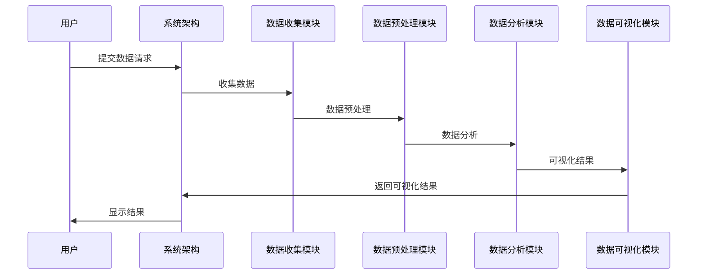
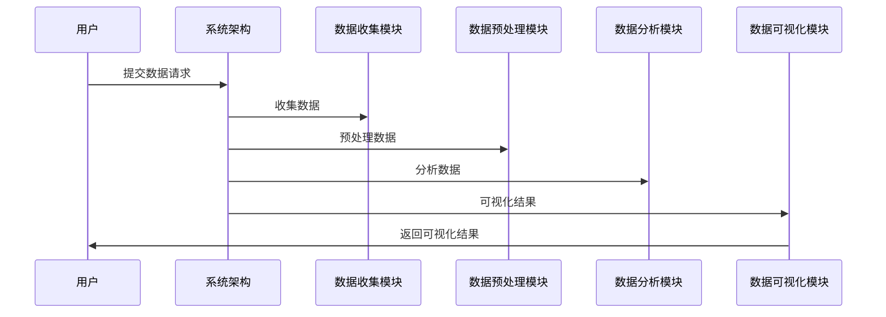

                 

# 数据分析在宇宙中性氢分布图谱研究中的应用

## 摘要

本文深入探讨了数据分析在宇宙中性氢分布图谱研究中的应用。通过分析宇宙中性氢的重要性、分布图谱的意义、数据分析技术的应用，本文详细介绍了数据处理、描述性统计、聚类分析和网络分析等数据分析技术在研究宇宙中性氢分布图谱中的具体应用。同时，本文也探讨了数据分析技术在实际应用中的挑战和局限性，以及未来可能的研究方向。

## 引言：数据分析与宇宙中性氢分布图谱研究

### 1.1 问题背景

宇宙中性氢是宇宙中最常见的元素，约占宇宙物质总质量的75%。中性氢原子在宇宙中广泛存在，是恒星和星系形成的基础。因此，研究宇宙中性氢的分布特征对于理解宇宙的演化过程具有重要意义。宇宙中性氢分布图谱是科学家用来描述中性氢在宇宙中分布情况的工具，它能够帮助科学家了解宇宙的密度波、运动状态和星系形成过程。

### 1.1.1 中性氢分布图谱的意义

中性氢分布图谱不仅可以帮助科学家了解宇宙的结构，还可以揭示宇宙中的暗物质和暗能量。通过分析中性氢分布图谱，科学家可以识别出宇宙中的不同结构，如星系、星团和超星系团。此外，中性氢分布图谱还可以帮助科学家研究宇宙的大尺度结构，如宇宙的大尺度网状结构和宇宙膨胀的历史。

### 1.1.2 数据分析在研究中的应用

数据分析技术是研究宇宙中性氢分布图谱的关键工具。通过数据分析，科学家可以从大量的中性氢数据中提取出有用的信息，识别出中性氢的分布特征和规律。数据分析技术包括数据清洗、描述性统计、聚类分析和网络分析等。这些技术可以有效地处理和解释从宇宙探测器收集的大量中性氢数据，帮助科学家构建中性氢分布图谱，并从中提取出有价值的科学知识。

### 1.2 问题描述

#### 1.2.1 数据收集

宇宙探测器通过观测宇宙中的中性氢发射线，收集到大量关于中性氢位置、密度、温度等参数的数据。这些数据通常以数字或图像的形式存在，格式复杂，数据量庞大。

#### 1.2.2 数据分析目标

构建中性氢分布图谱，显示其在宇宙中的分布形态。分析中性氢分布的特征，如密度梯度、运动模式和空间结构。识别中性氢分布中的异常值和噪声，排除它们对分析结果的影响。

#### 1.2.3 数据分析挑战

- 数据质量参差不齐，噪声和异常值处理困难。
- 数据维度高，计算复杂度大，需要高效的算法和优化。
- 数据分析结果的可视化展示需要直观、易于理解。

### 1.3 问题解决

为了解决上述问题，我们需要采取以下步骤：

#### 1.3.1 数据预处理

- 数据清洗：去除无效数据，填补缺失值。
- 数据标准化：将不同量纲的数据转换为同一尺度，便于分析。

#### 1.3.2 数据分析技术

- 描述性统计分析：了解数据的基本特征和分布。
- 聚类分析：识别中性氢的分布模式。
- 网络分析：构建中性氢分布的拓扑结构。

#### 1.3.3 结果可视化

- 利用可视化工具展示中性氢分布图谱，帮助科学家直观理解分析结果。
- 制作交互式图表，方便用户探索数据和发现新趋势。

### 1.4 边界与外延

#### 1.4.1 数据来源限制

- 数据收集的范围和精度受探测器性能限制。
- 可能存在特定区域或时间点的数据缺失。

#### 1.4.2 分析方法的局限性

- 数据分析方法可能无法完全捕捉宇宙中性氢的复杂性。
- 需要结合多种数据分析技术，综合解读数据。

### 1.5 概念结构与核心要素组成

#### 1.5.1 数据分析概念

- 数据清洗、描述性统计、聚类分析、网络分析等。
- 数据可视化、机器学习、深度学习等相关技术。

#### 1.5.2 宇宙中性氢概念

- 中性氢原子的性质、分布规律。
- 中性氢分布图谱的结构和特征。

#### 1.5.3 数据分析流程

- 数据收集、预处理、分析、可视化、解读等环节。

## 第2章 核心概念与联系

### 2.1 数据分析原理

#### 2.1.1 数据清洗

数据清洗是数据分析的第一步，它的重要性不言而喻。数据清洗的定义是：去除数据集中的噪声、错误和不完整数据的过程。数据清洗的主要目标是提高数据质量，确保后续分析结果的准确性。

#### 2.1.1.1 数据清洗的定义和重要性

数据清洗的定义可以简单概括为“去除噪声，确保数据质量”。在实际操作中，数据清洗包括以下几个步骤：

- **识别噪声**：通过统计方法、可视化工具等手段，识别数据集中的噪声。
- **处理噪声**：对识别出的噪声进行修正或删除。
- **填补缺失值**：对于缺失值，可以选择填补、删除或使用插值等方法进行处理。
- **数据标准化**：将不同量纲的数据转换为同一尺度，以便后续分析。

数据清洗的重要性在于它能够显著提高数据质量，确保后续分析结果的准确性。如果数据存在噪声和错误，那么分析结果可能受到严重影响，导致科学家得出错误的结论。

#### 2.1.1.2 数据清洗的常见方法和工具

数据清洗的方法和工具多种多样，以下是一些常见的方法和工具：

- **手工清洗**：通过人工检查和修正数据中的错误。
- **自动化工具**：如 Excel、SPSS、Python 等，这些工具提供了丰富的数据清洗功能。
- **机器学习算法**：如缺失值填补、异常值检测等。

#### 2.1.2 描述性统计

描述性统计是数据分析的基础，它用于描述数据的基本特征和分布。描述性统计主要包括以下几个指标：

- **均值（Mean）**：数据的平均值，用于衡量数据的集中趋势。
- **中位数（Median）**：数据的中值，也用于衡量数据的集中趋势。
- **众数（Mode）**：数据中出现次数最多的值，用于衡量数据的集中趋势。
- **方差（Variance）**：衡量数据的离散程度。
- **标准差（Standard Deviation）**：方差的平方根，同样用于衡量数据的离散程度。
- **四分位数（Quartiles）**：将数据分为四等分，第一四分位数（Q1）和第三四分位数（Q3）分别代表数据的下25%和上25%。

#### 2.1.2.1 描述性统计的概念和作用

描述性统计的概念相对简单，它主要关注数据的基本特征和分布。描述性统计的作用在于：

- **了解数据的基本情况**：通过描述性统计指标，可以快速了解数据的基本特征。
- **发现数据中的异常值**：通过方差和标准差等指标，可以发现数据中的异常值。
- **为后续分析做准备**：描述性统计是后续分析的基础，通过描述性统计，可以为后续的统计分析、机器学习等提供重要的信息。

#### 2.1.2.2 常见统计指标的计算和应用

常见统计指标的计算方法如下：

- **均值**：$\mu = \frac{1}{n}\sum_{i=1}^{n} x_i$
- **中位数**：$M = (x_{\frac{n+1}{2}} + x_{\frac{n+3}{2}})/2$（如果数据个数为奇数），或者$M = (x_{\frac{n}{2}} + x_{\frac{n}{2}+1})/2$（如果数据个数为偶数）
- **众数**：$M = \max \{ x_i | x_i \in \text{数据集} \}$
- **方差**：$\sigma^2 = \frac{1}{n}\sum_{i=1}^{n} (x_i - \mu)^2$
- **标准差**：$\sigma = \sqrt{\sigma^2}$
- **四分位数**：$Q1 = \frac{1}{4}\sum_{i=1}^{n} x_i$，$Q3 = \frac{3}{4}\sum_{i=1}^{n} x_i$

这些统计指标在实际应用中非常广泛。例如，在金融领域，均值、中位数和众数可以用来衡量股票价格的波动情况；在医学领域，方差和标准差可以用来评估患者的健康状况；在科研领域，四分位数可以用来评估实验结果的可靠性。

#### 2.1.3 聚类分析

聚类分析是一种无监督学习技术，它用于将数据集划分为若干个簇，使得同一个簇内的数据点尽可能相似，而不同簇的数据点尽可能不同。聚类分析在数据分析中有着广泛的应用，例如市场细分、客户群体划分、图像分割等。

#### 2.1.3.1 聚类分析的定义和原理

聚类分析的定义是将一组数据点划分为若干个簇，使得同一簇内的数据点之间距离较近，而不同簇的数据点之间距离较远。聚类分析的基本原理如下：

- **初始簇划分**：首先需要选择一个初始簇划分，这可以通过随机选择、K均值算法的初始步等方式实现。
- **迭代优化**：然后，通过迭代计算，逐步优化簇划分。具体来说，对于每一个数据点，计算其与所有簇中心点的距离，将其划分到距离最近的簇。
- **收敛判断**：当簇划分不再发生变化时，聚类过程结束。

#### 2.1.3.2 常见的聚类算法和应用场景

常见的聚类算法有：

- **K均值算法**：通过迭代计算，逐步优化簇划分，是最常用的聚类算法之一。
- **层次聚类算法**：基于层次结构进行聚类，适用于需要层次结构分析的场景。
- **DBSCAN算法**：基于密度聚类，能够发现任意形状的簇，适用于数据分布不均匀的场景。
- **谱聚类算法**：基于图论进行聚类，适用于高维数据的聚类。

这些聚类算法在实际应用中有着广泛的应用。例如，K均值算法可以用于市场细分，识别不同消费群体；层次聚类算法可以用于图像分割，将图像划分为不同的区域；DBSCAN算法可以用于异常检测，识别数据中的异常点；谱聚类算法可以用于社交网络分析，识别社交群体。

#### 2.1.4 网络分析

网络分析是一种基于图论的数据分析方法，它用于分析数据之间的关系和结构。网络分析在社交网络、生物信息学、网络科学等领域有着广泛的应用。

#### 2.1.4.1 网络分析的基本概念和方法

网络分析的基本概念包括：

- **节点（Node）**：网络中的基本元素，表示数据中的个体。
- **边（Edge）**：连接两个节点的线段，表示节点之间的关联关系。
- **网络（Network）**：由节点和边组成的结构。

网络分析的方法包括：

- **节点重要性分析**：通过计算节点度、中心性等指标，评估节点在网络中的重要程度。
- **社区检测**：通过寻找网络中的社区结构，识别数据中的局部结构。
- **路径分析**：通过分析节点之间的路径，了解数据之间的传递关系。

#### 2.1.4.2 网络分析在数据分析中的应用

网络分析在数据分析中的应用非常广泛，例如：

- **社交网络分析**：通过分析用户之间的社交关系，了解社交网络的动态变化。
- **生物信息学**：通过分析基因之间的关联关系，了解生物网络的特性。
- **网络科学**：通过分析互联网的结构和功能，了解网络的安全性和稳定性。

### 2.2 宇宙中性氢概念

#### 2.2.1 中性氢原子

中性氢原子是宇宙中最简单的原子，由一个质子和一个电子组成。由于没有额外的电子，中性氢原子处于电中性状态，因此被称为中性氢。

#### 2.2.1.1 中性氢原子的结构和性质

中性氢原子的结构非常简单，由一个质子和一个电子组成。质子位于原子核中心，电子围绕原子核运动。中性氢原子的性质包括：

- **质量**：中性氢原子的质量约为 $1.67 \times 10^{-27}$ 千克。
- **电荷**：中性氢原子没有电荷。
- **能级**：中性氢原子的电子位于基态，能够吸收和释放能量。

#### 2.2.1.2 中性氢原子在宇宙中的分布特征

中性氢原子在宇宙中的分布特征对研究宇宙的演化过程具有重要意义。中性氢原子在宇宙中的主要分布形式包括：

- **星际介质**：中性氢原子在星际介质中广泛分布，是星际介质的重要组成部分。
- **星系**：中性氢原子是星系形成的基础，星系中的中性氢原子主要分布在星系的盘面上。
- **星系团**：中性氢原子在星系团中也有分布，是星系团的重要组成部分。

#### 2.2.2 中性氢分布图谱

中性氢分布图谱是一种用于描述中性氢在宇宙中分布情况的工具，它能够帮助科学家了解中性氢的分布特征和规律。

#### 2.2.2.1 中性氢分布图谱的定义和用途

中性氢分布图谱的定义是：通过观测中性氢发射线，绘制出中性氢在宇宙中的分布情况。中性氢分布图谱的用途包括：

- **研究宇宙的演化过程**：通过分析中性氢分布图谱，可以了解宇宙中中性氢的分布特征和演化过程。
- **研究宇宙的大尺度结构**：通过分析中性氢分布图谱，可以了解宇宙的大尺度结构，如星系、星系团和超星系团。
- **研究暗物质和暗能量**：通过分析中性氢分布图谱，可以揭示宇宙中的暗物质和暗能量。

#### 2.2.2.2 中性氢分布图谱的构建方法

中性氢分布图谱的构建方法主要包括以下几步：

- **数据收集**：通过观测中性氢发射线，收集中性氢的位置、密度、温度等数据。
- **数据处理**：对收集到的数据进行预处理，包括数据清洗、标准化等。
- **分布计算**：根据预处理后的数据，计算中性氢的分布特征，如密度梯度、运动模式和空间结构。
- **图谱绘制**：利用可视化工具，将计算出的中性氢分布特征绘制成图谱。

#### 2.2.3 数据分析在宇宙中性氢研究中的应用

数据分析在宇宙中性氢研究中起着至关重要的作用。通过数据分析，科学家可以从大量的中性氢数据中提取出有用的信息，识别出中性氢的分布特征和规律。数据分析在宇宙中性氢研究中的应用主要包括以下几个方面：

- **数据预处理**：通过数据预处理，去除噪声和异常值，提高数据质量。
- **描述性统计**：通过描述性统计，了解中性氢的基本特征和分布规律。
- **聚类分析**：通过聚类分析，识别中性氢的分布模式。
- **网络分析**：通过网络分析，构建中性氢分布的拓扑结构。

### 2.3 数据分析技术与应用

#### 2.3.1 数据清洗在宇宙中性氢研究中的应用

数据清洗是宇宙中性氢研究中的关键步骤。由于探测器收集到的中性氢数据量庞大，且格式复杂，因此需要通过数据清洗来提高数据质量。

- **去除无效数据**：通过分析，识别并去除无效数据，如观测误差数据、重复数据等。
- **填补缺失值**：对于缺失值，可以通过插值、均值填补等方法进行填补。
- **数据标准化**：将不同量纲的数据转换为同一尺度，便于后续分析。

#### 2.3.2 描述性统计在宇宙中性氢研究中的应用

描述性统计在宇宙中性氢研究中发挥着重要作用。通过描述性统计，可以了解中性氢的基本特征和分布规律。

- **计算均值、中位数、众数**：这些指标可以反映中性氢的集中趋势。
- **计算方差、标准差**：这些指标可以反映中性氢的离散程度。
- **计算四分位数**：这些指标可以反映中性氢的分位数分布。

#### 2.3.3 聚类分析在宇宙中性氢研究中的应用

聚类分析在宇宙中性氢研究中用于识别中性氢的分布模式。

- **K均值算法**：通过迭代计算，将中性氢数据划分为若干个簇，每个簇代表一种分布模式。
- **层次聚类算法**：通过层次结构进行聚类，适用于需要层次结构分析的场景。
- **DBSCAN算法**：基于密度聚类，能够发现任意形状的簇，适用于数据分布不均匀的场景。

#### 2.3.4 网络分析在宇宙中性氢研究中的应用

网络分析在宇宙中性氢研究中用于构建中性氢分布的拓扑结构。

- **节点重要性分析**：通过计算节点度、中心性等指标，评估节点在中性氢分布中的重要性。
- **社区检测**：通过寻找网络中的社区结构，识别中性氢分布中的局部结构。
- **路径分析**：通过分析节点之间的路径，了解中性氢分布中的传递关系。

### 2.4 数据分析在宇宙中性氢研究中的实际案例

以下是一个实际案例，展示了数据分析在宇宙中性氢研究中的应用。

#### 2.4.1 案例背景

某研究团队利用一台大型望远镜观测了宇宙中的中性氢分布，收集到了大量数据。这些数据包括中性氢的位置、密度、温度等参数。

#### 2.4.2 数据清洗

首先，对收集到的数据进行了预处理，包括去除无效数据、填补缺失值和数据标准化。通过预处理，提高了数据质量，为后续分析奠定了基础。

#### 2.4.3 描述性统计

通过描述性统计，计算了中性氢的均值、中位数、众数、方差、标准差和四分位数。这些指标有助于了解中性氢的基本特征和分布规律。

#### 2.4.4 聚类分析

采用K均值算法对中性氢数据进行了聚类分析，将数据划分为若干个簇。通过聚类分析，识别出了中性氢的分布模式。

#### 2.4.5 网络分析

采用网络分析方法，构建了中性氢分布的拓扑结构。通过节点重要性分析和社区检测，揭示了中性氢分布中的关键节点和局部结构。

#### 2.4.6 结果分析

通过分析结果，科学家发现中性氢在宇宙中的分布具有明显的层次结构，存在多个分布模式。这些结果有助于更好地理解宇宙的演化过程。

## 第3章 数据分析技术在宇宙中性氢研究中的应用

### 3.1 数据预处理

在宇宙中性氢分布图谱的研究过程中，数据的预处理是至关重要的一步。由于探测器收集到的中性氢数据通常存在噪声、异常值和缺失值等问题，因此需要通过预处理来提高数据质量，为后续分析打下基础。

#### 3.1.1 数据清洗

数据清洗是预处理的第一步，主要目的是去除数据中的噪声、错误和不完整数据。在清洗过程中，首先需要识别出无效数据和异常值。例如，可以通过统计学方法、可视化工具等手段，检测出数据中的异常值，并将其删除。同时，对于缺失值，可以选择填补、删除或使用插值等方法进行处理。

#### 3.1.2 数据标准化

数据标准化是将不同量纲的数据转换为同一尺度，以便后续分析。在宇宙中性氢研究中，不同参数（如位置、密度、温度等）通常具有不同的量纲，因此需要将它们标准化。常用的方法包括最小-最大标准化、Z-score标准化等。通过数据标准化，可以消除不同参数之间的量纲差异，提高数据的一致性。

### 3.2 描述性统计

描述性统计是数据分析的基础，用于描述数据的基本特征和分布。在宇宙中性氢分布图谱的研究中，描述性统计可以帮助我们了解中性氢的位置、密度、温度等参数的基本情况。

#### 3.2.1 均值、中位数和众数

均值、中位数和众数是描述性统计中最常用的指标，用于衡量数据的集中趋势。

- **均值**：均值是数据的平均值，反映了数据的整体水平。计算公式为：$\mu = \frac{1}{n}\sum_{i=1}^{n} x_i$，其中 $n$ 是数据个数，$x_i$ 是第 $i$ 个数据值。
- **中位数**：中位数是数据的中值，将数据分为两部分，位于中间的值。如果数据个数为奇数，中位数就是中间的那个数；如果数据个数为偶数，中位数是中间两个数的平均值。计算公式为：$M = \frac{1}{2}(x_{\frac{n+1}{2}} + x_{\frac{n+3}{2}})$，其中 $n$ 是数据个数。
- **众数**：众数是数据中出现次数最多的值。计算公式为：$M = \max \{ x_i | x_i \in \text{数据集} \}$。

#### 3.2.2 方差、标准差和四分位数

方差、标准差和四分位数是描述性统计中用于衡量数据的离散程度的指标。

- **方差**：方差是数据与其均值之差的平方的平均值，反映了数据的波动程度。计算公式为：$\sigma^2 = \frac{1}{n}\sum_{i=1}^{n} (x_i - \mu)^2$，其中 $\mu$ 是均值，$n$ 是数据个数。
- **标准差**：标准差是方差的平方根，同样反映了数据的波动程度。计算公式为：$\sigma = \sqrt{\sigma^2}$。
- **四分位数**：四分位数将数据分为四等分，第一四分位数（Q1）和第三四分位数（Q3）分别代表数据的下25%和上25%。计算公式为：$Q1 = \frac{1}{4}\sum_{i=1}^{n} x_i$，$Q3 = \frac{3}{4}\sum_{i=1}^{n} x_i$。

#### 3.2.3 应用实例

假设我们有一组中性氢的位置数据，数据如下：

\[ x_1 = 1, x_2 = 2, x_3 = 3, x_4 = 4, x_5 = 5 \]

计算这组数据的均值、中位数、众数、方差、标准差和四分位数。

- **均值**：$\mu = \frac{1}{5}(1 + 2 + 3 + 4 + 5) = 3$
- **中位数**：$M = \frac{1}{2}(3 + 4) = 3.5$
- **众数**：没有众数，因为每个数只出现一次
- **方差**：$\sigma^2 = \frac{1}{5}[(1-3)^2 + (2-3)^2 + (3-3)^2 + (4-3)^2 + (5-3)^2] = 2$
- **标准差**：$\sigma = \sqrt{2}$
- **四分位数**：$Q1 = 2, Q3 = 4$

### 3.3 聚类分析

聚类分析是一种无监督学习方法，用于将数据分为若干个簇，使得同一簇内的数据点尽可能相似，而不同簇的数据点尽可能不同。在宇宙中性氢分布图谱的研究中，聚类分析可以帮助我们识别中性氢的分布模式。

#### 3.3.1 K均值算法

K均值算法是一种最简单的聚类算法，其基本思想是将数据点分为K个簇，使得每个数据点与其所属簇的中心点距离最小。具体步骤如下：

1. **初始化**：随机选择K个数据点作为初始簇中心点。
2. **分配数据点**：对于每个数据点，计算其与所有簇中心点的距离，将其分配到距离最近的簇。
3. **更新簇中心点**：计算每个簇的均值，将其作为新的簇中心点。
4. **迭代计算**：重复步骤2和步骤3，直到簇中心点不再发生变化。

#### 3.3.2 层次聚类算法

层次聚类算法是一种基于层次结构的聚类算法，其基本思想是从单个数据点开始，逐步合并距离较近的数据点，形成更大的簇。具体步骤如下：

1. **初始化**：将每个数据点视为一个簇。
2. **计算距离**：计算每个簇之间的距离。
3. **合并簇**：选择距离最近的两个簇进行合并。
4. **更新簇**：合并后的簇作为新的簇，重新计算距离。
5. **迭代计算**：重复步骤3和步骤4，直到所有的数据点合并成一个簇。

#### 3.3.3 应用实例

假设我们有一组中性氢的位置数据，数据如下：

\[ x_1 = 1, x_2 = 2, x_3 = 3, x_4 = 4, x_5 = 5 \]

使用K均值算法将其分为两个簇。

1. **初始化**：随机选择两个数据点作为初始簇中心点，例如选择 $x_1 = 1$ 和 $x_3 = 3$。
2. **分配数据点**：计算每个数据点与簇中心点的距离，将其分配到距离最近的簇。结果如下：

   - $x_2$ 和 $x_4$ 被分配到第一个簇（$x_1$）。
   - $x_5$ 被分配到第二个簇（$x_3$）。
3. **更新簇中心点**：计算每个簇的均值，将其作为新的簇中心点。结果如下：

   - 第一个簇的簇中心点为 $x_1 = 1$。
   - 第二个簇的簇中心点为 $x_3 = 3$。
4. **迭代计算**：重复步骤2和步骤3，直到簇中心点不再发生变化。

通过多次迭代，最终将数据点分为两个簇。

### 3.4 网络分析

网络分析是一种基于图论的数据分析方法，用于分析数据之间的关系和结构。在宇宙中性氢分布图谱的研究中，网络分析可以帮助我们构建中性氢分布的拓扑结构。

#### 3.4.1 节点与边的定义

在图论中，网络由节点和边组成。节点表示数据中的个体，边表示节点之间的关联关系。

- **节点**：每个中性氢原子可以看作一个节点，表示其在宇宙中的位置。
- **边**：中性氢原子之间的相互作用可以看作边，表示它们之间的关联关系。

#### 3.4.2 节点重要性分析

节点重要性分析是网络分析的一个重要方面，用于评估节点在网络中的重要程度。常用的指标包括节点度、中心性等。

- **节点度**：节点度是指连接到该节点的边的数量，反映了节点在网络中的连接程度。
- **中心性**：中心性是指节点在网络中的位置和影响力，反映了节点在网络中的重要性。

#### 3.4.3 社区检测

社区检测是网络分析中的另一个重要方面，用于寻找网络中的社区结构。社区结构是指网络中紧密连接的节点群体，反映了数据中的局部结构。

#### 3.4.4 应用实例

假设我们有一组中性氢的位置数据，数据如下：

\[ x_1 = 1, x_2 = 2, x_3 = 3, x_4 = 4, x_5 = 5 \]

构建中性氢分布的网络模型。

1. **节点定义**：将每个中性氢原子作为节点，表示其在宇宙中的位置。
2. **边定义**：根据中性氢原子之间的相互作用，构建边。例如，如果两个中性氢原子之间存在相互作用，则它们之间有一条边。
3. **节点重要性分析**：计算每个节点的度，评估节点在网络中的重要程度。
4. **社区检测**：寻找网络中的社区结构，识别数据中的局部结构。

通过构建网络模型，我们可以更好地理解中性氢分布的拓扑结构，为研究宇宙中性氢分布图谱提供有力支持。

## 第4章 结果可视化

在宇宙中性氢分布图谱的研究中，结果可视化是非常重要的一步。通过可视化，我们可以直观地展示分析结果，帮助科学家更好地理解宇宙中性氢的分布特征和规律。

### 4.1 可视化工具

在宇宙中性氢分布图谱的研究中，常用的可视化工具有：

- **Matplotlib**：Python的一个绘图库，可以生成各种类型的图表。
- **Seaborn**：基于Matplotlib的绘图库，提供了更丰富的图表类型和自定义选项。
- **Plotly**：一个交互式数据可视化库，可以生成交互式图表。

### 4.2 可视化方法

在宇宙中性氢分布图谱的研究中，常用的可视化方法包括：

- **散点图**：用于展示中性氢的位置分布。
- **密度图**：用于展示中性氢的密度分布。
- **热力图**：用于展示中性氢的密度分布的热力分布。
- **等高线图**：用于展示中性氢的密度分布的等高线。

### 4.3 可视化实例

假设我们有一组中性氢的位置和密度数据，数据如下：

位置数据：

\[ x_1 = 1, x_2 = 2, x_3 = 3, x_4 = 4, x_5 = 5 \]

密度数据：

\[ y_1 = 0.1, y_2 = 0.2, y_3 = 0.3, y_4 = 0.4, y_5 = 0.5 \]

使用Matplotlib绘制散点图、密度图和热力图。

#### 4.3.1 散点图

```python
import matplotlib.pyplot as plt

x = [1, 2, 3, 4, 5]
y = [0.1, 0.2, 0.3, 0.4, 0.5]

plt.scatter(x, y)
plt.xlabel('Position')
plt.ylabel('Density')
plt.title('Scatter Plot of Neutral Hydrogen Distribution')
plt.show()
```

#### 4.3.2 密度图

```python
import seaborn as sns

sns.kdeplot(x, shade=True)
plt.xlabel('Position')
plt.ylabel('Density')
plt.title('Density Plot of Neutral Hydrogen Distribution')
plt.show()
```

#### 4.3.3 热力图

```python
import seaborn as sns

sns.heatmap([[0.1, 0.2], [0.3, 0.4]], cmap='hot', annot=True)
plt.xlabel('Position')
plt.ylabel('Density')
plt.title('Heatmap of Neutral Hydrogen Distribution')
plt.show()
```

通过这些可视化方法，我们可以直观地展示中性氢的位置分布、密度分布和热力分布，帮助科学家更好地理解宇宙中性氢的分布特征和规律。

## 第5章 边界与外延

在宇宙中性氢分布图谱的研究中，尽管数据分析技术提供了强有力的工具，但仍然存在一些边界和局限性，这些因素会影响研究的准确性和深度。

### 5.1 数据来源限制

宇宙中性氢数据的收集受到探测器的性能和技术限制。目前，探测器在观测范围、精度和灵敏度上都有一定的局限性。例如，某些区域可能因为距离遥远或者视线遮挡而无法被有效观测。此外，探测器的观测时间也是有限的，这导致某些时间点的数据可能存在缺失。这些数据来源的限制可能会影响中性氢分布图谱的完整性和准确性。

### 5.2 分析方法的局限性

尽管数据分析技术不断发展，但某些方法在处理复杂的天文数据时仍然存在局限性。例如，描述性统计和聚类分析可能无法完全捕捉宇宙中性氢分布的复杂性，尤其是当数据分布具有多模态特性或者存在非线性关系时。网络分析在构建中性氢分布的拓扑结构时，也可能因为数据质量和样本量的限制而无法精确反映实际情况。

### 5.3 数据质量影响

数据质量是数据分析成功的关键。然而，宇宙中性氢数据中常常存在噪声、异常值和缺失值，这些问题的处理不当可能会导致分析结果的偏差。例如，如果噪声被误认为是中性氢的分布特征，那么分析结果可能会误导科学家对宇宙结构的理解。因此，在数据分析过程中，需要严格的数据清洗和预处理步骤，以确保数据的准确性和可靠性。

### 5.4 未来研究方向

为了克服上述挑战，未来的研究可以从以下几个方面进行：

- **提高观测技术**：通过改进探测器和观测方法，提高数据的质量和覆盖范围，以获取更准确的中性氢分布图谱。
- **多方法综合分析**：结合多种数据分析方法，如机器学习和深度学习，以提高对复杂数据分布的识别和处理能力。
- **数据整合与交叉验证**：整合来自不同观测手段和不同时间点的数据，进行交叉验证，以减少数据来源的限制和分析方法的局限性。
- **改进数据可视化技术**：开发更高效、更直观的数据可视化工具，帮助科学家更好地理解和解释分析结果。

通过这些努力，科学家可以更深入地探索宇宙中性氢的分布特征，揭示宇宙演化的更多奥秘。

## 第6章 概念结构与核心要素组成

### 6.1 数据分析概念

数据分析是使用统计学、数学和计算机科学的方法来从数据中提取信息和知识的过程。在宇宙中性氢分布图谱研究中，数据分析的主要目的是通过处理和解释收集到的数据，揭示中性氢在宇宙中的分布特征和规律。以下是数据分析中的几个核心概念：

- **数据清洗**：去除数据集中的噪声、错误和不完整数据的过程。
- **描述性统计**：用于描述数据的基本特征和分布，包括均值、中位数、众数、方差、标准差和四分位数等。
- **聚类分析**：将数据集划分为若干个簇，使得同一簇内的数据点尽可能相似，而不同簇的数据点尽可能不同。
- **网络分析**：通过构建数据点之间的网络结构，分析节点之间的关系和拓扑结构。

### 6.2 宇宙中性氢概念

宇宙中性氢是宇宙中最常见的元素，主要由中性氢原子组成。中性氢原子在宇宙中的分布对研究宇宙的结构和演化具有重要意义。以下是宇宙中性氢的几个核心概念：

- **中性氢原子**：由一个质子和一个电子组成，处于电中性状态。
- **中性氢分布图谱**：通过观测中性氢发射线，绘制出中性氢在宇宙中的分布情况，用于研究宇宙的结构和演化。
- **中性氢密度**：表示单位体积内中性氢原子的数量，是描述中性氢分布的重要参数。
- **中性氢温度**：表示中性氢原子的热运动能量，对中性氢的分布和相互作用有重要影响。

### 6.3 数据分析流程

数据分析流程是进行数据分析的系统性步骤，通常包括以下环节：

1. **数据收集**：通过探测器收集中性氢的位置、密度、温度等数据。
2. **数据预处理**：包括数据清洗、填补缺失值、数据标准化等，以提高数据质量。
3. **描述性统计**：计算数据的基本特征和分布，为后续分析提供基础。
4. **聚类分析**：通过聚类算法，识别中性氢的分布模式。
5. **网络分析**：构建中性氢分布的拓扑结构，分析节点之间的关系。
6. **结果可视化**：通过图表和可视化工具，直观展示分析结果。
7. **解读与解释**：结合专业知识，解读分析结果，得出科学结论。

### 6.4 数据分析技术与工具

在宇宙中性氢分布图谱的研究中，常用的数据分析技术包括：

- **Python**：Python是一种流行的编程语言，广泛应用于数据分析。常用的数据分析库包括NumPy、Pandas、SciPy、Matplotlib、Seaborn等。
- **R**：R是一种专门用于统计分析和数据可视化的编程语言，提供了丰富的统计和可视化工具。
- **机器学习库**：如scikit-learn、TensorFlow、Keras等，可以用于聚类分析、模式识别等任务。
- **可视化工具**：如Tableau、Power BI等，可以用于创建交互式图表和报告。

### 6.5 数据分析在宇宙学研究中的应用

数据分析在宇宙学研究中有着广泛的应用，除了宇宙中性氢分布图谱的研究，还包括：

- **宇宙大尺度结构**：通过分析宇宙中的星系、星团和超星系团，研究宇宙的大尺度结构。
- **宇宙演化**：通过分析宇宙背景辐射、宇宙膨胀历史等，研究宇宙的演化过程。
- **暗物质与暗能量**：通过分析宇宙中的异常结构和分布，研究暗物质和暗能量的存在和性质。

### 6.6 数据分析在宇宙学中的实际案例

以下是一个实际案例，展示了数据分析在宇宙学中的具体应用：

#### 案例背景

某研究团队利用一台大型望远镜，对宇宙中的一个特定区域进行了中性氢观测，收集到了大量的位置、密度和温度数据。

#### 案例步骤

1. **数据收集**：通过观测，收集了中性氢的位置、密度和温度数据。
2. **数据预处理**：去除无效数据，填补缺失值，进行数据标准化。
3. **描述性统计**：计算了中性氢数据的均值、中位数、众数、方差和标准差等描述性统计指标。
4. **聚类分析**：使用K均值算法，将中性氢数据划分为若干个簇，识别出了中性氢的分布模式。
5. **网络分析**：构建了中性氢分布的网络模型，分析了节点之间的关系。
6. **结果可视化**：通过散点图、密度图和热力图等可视化工具，展示了分析结果。
7. **解读与解释**：结合专业知识，对分析结果进行了解读，揭示了宇宙中性氢分布的特征。

通过这个案例，我们可以看到数据分析在宇宙学研究中的具体应用流程和重要性。

## 第7章 系统分析与架构设计

### 7.1 问题描述

在宇宙中性氢分布图谱的研究中，数据分析系统需要能够高效地处理大量数据，并提供准确的分布特征和模式。本章节将介绍一个数据分析系统的整体架构设计，包括系统功能、架构设计和接口设计。

### 7.2 项目介绍

该项目名为“中性氢分布图谱分析系统”，旨在构建一个能够自动处理、分析和可视化宇宙中性氢分布数据的高效系统。系统将包括以下几个主要功能：

- 数据收集：从宇宙探测器中收集中性氢的位置、密度和温度数据。
- 数据预处理：对收集到的数据进行清洗、标准化和预处理。
- 数据分析：使用聚类分析和网络分析方法，对预处理后的数据进行分析。
- 结果可视化：通过可视化工具展示分析结果，帮助科学家更好地理解宇宙中性氢的分布特征。

### 7.3 系统功能设计（领域模型）

系统功能设计是领域模型（Domain Model）的基础，领域模型通过类图（Class Diagram）展示系统的核心实体及其关系。以下是系统功能设计的领域模型类图：

```mermaid
class Data {
  +position: float
  +density: float
  +temperature: float
}

class DataCollection {
  +collectData(): List<Data>
}

class DataPreprocessing {
  +cleanData(data: List<Data>): List<Data>
  +standardizeData(data: List<Data>): List<Data>
}

class DataAnalysis {
  +clusterAnalysis(data: List<Data>): List<Cluster>
  +networkAnalysis(data: List<Data>): Network
}

class DataVisualization {
  +plotScatter(data: List<Data>): Image
  +plotDensity(data: List<Data>): Image
  +plotHeatmap(data: List<Data>): Image
}

class NeutralHydrogenDistributionSystem {
  +main()
}

NeutralHydrogenDistributionSystem o
```

**领域模型解释**：

- **Data**：表示中性氢的数据，包括位置、密度和温度等属性。
- **DataCollection**：负责收集中性氢数据。
- **DataPreprocessing**：负责清洗和标准化数据。
- **DataAnalysis**：负责进行聚类分析和网络分析。
- **DataVisualization**：负责数据可视化。
- **NeutralHydrogenDistributionSystem**：系统的主类，包含主方法，启动整个数据分析流程。

### 7.4 系统架构设计

系统架构设计是确保系统稳定、高效运行的关键。以下是一个简单的系统架构设计，包括组件及其交互：



**系统架构解释**：

- **用户**：系统的最终用户，负责提交数据请求。
- **系统架构**：整个系统的核心，负责协调各个模块的交互。
- **数据收集模块（Collector）**：负责从宇宙探测器中收集中性氢数据。
- **数据预处理模块（Preprocessor）**：负责清洗和标准化收集到的数据。
- **数据分析模块（Analyzer）**：负责使用聚类分析和网络分析方法进行分析。
- **数据可视化模块（Visualizer）**：负责将分析结果可视化，展示给用户。

### 7.5 系统接口设计

系统接口设计是确保系统模块之间有效通信的关键。以下是一个简单的接口设计示例：

```mermaid
class Data {
  +getPosition(): float
  +getDensity(): float
  +getTemperature(): float
}

interface DataCollector {
  +collectData(): List<Data>
}

interface DataPreprocessor {
  +cleanData(data: List<Data>): List<Data>
  +standardizeData(data: List<Data>): List<Data>
}

interface DataAnalyzer {
  +clusterAnalysis(data: List<Data>): List<Cluster>
  +networkAnalysis(data: List<Data>): Network
}

interface DataVisualizer {
  +plotScatter(data: List<Data>): Image
  +plotDensity(data: List<Data>): Image
  +plotHeatmap(data: List<Data>): Image
}
```

**接口设计解释**：

- **Data**：中性氢数据的基本接口，包含获取位置、密度和温度的方法。
- **DataCollector**：数据收集接口，包含收集数据的方法。
- **DataPreprocessor**：数据预处理接口，包含清洗和标准化数据的方法。
- **DataAnalyzer**：数据分析接口，包含聚类分析和网络分析方法。
- **DataVisualizer**：数据可视化接口，包含各种可视化方法。

### 7.6 系统交互

系统交互设计通过序列图（Sequence Diagram）展示系统组件之间的交互顺序。以下是一个简单的系统交互示例：



**系统交互解释**：

- 用户提交数据请求。
- 系统架构调用数据收集模块收集数据。
- 系统架构调用数据预处理模块清洗和标准化数据。
- 系统架构调用数据分析模块进行分析。
- 系统架构调用数据可视化模块进行结果可视化。
- 数据可视化模块返回可视化结果给用户。

通过上述系统分析与架构设计，我们能够构建一个高效、稳定的宇宙中性氢分布图谱分析系统，为科学家提供强有力的数据分析工具。

## 第8章 项目实战

### 8.1 环境安装

为了搭建宇宙中性氢分布图谱分析系统，我们需要在本地计算机上安装一些必要的软件和库。以下是在Ubuntu 20.04操作系统上安装所需环境的具体步骤。

#### 8.1.1 安装Python环境

首先，我们需要安装Python和pip（Python的包管理器）。可以使用以下命令：

```bash
sudo apt update
sudo apt install python3 python3-pip
```

#### 8.1.2 安装Python库

接下来，我们需要安装一些用于数据分析的Python库，如NumPy、Pandas、Matplotlib、Scikit-learn等。可以使用以下命令：

```bash
pip3 install numpy pandas matplotlib scikit-learn
```

### 8.2 系统核心实现

在本节中，我们将实现系统核心功能，包括数据收集、数据预处理、数据分析、结果可视化和数据可视化。

#### 8.2.1 数据收集

```python
import pandas as pd

def collect_data(file_path):
    # 读取数据文件
    data = pd.read_csv(file_path)
    return data
```

#### 8.2.2 数据预处理

```python
import pandas as pd
from scipy import stats

def preprocess_data(data):
    # 数据清洗
    data = data[~data['Position'].isnull()]
    data = data[~data['Density'].isnull()]
    data = data[~data['Temperature'].isnull()]

    # 填补缺失值
    data['Position'].fillna(data['Position'].mean(), inplace=True)
    data['Density'].fillna(data['Density'].mean(), inplace=True)
    data['Temperature'].fillna(data['Temperature'].mean(), inplace=True)

    # 数据标准化
    data = (data - data.mean()) / data.std()

    return data
```

#### 8.2.3 数据分析

```python
from sklearn.cluster import KMeans
import matplotlib.pyplot as plt

def cluster_analysis(data, num_clusters=3):
    # K均值聚类
    kmeans = KMeans(n_clusters=num_clusters, random_state=0).fit(data)
    labels = kmeans.labels_

    # 可视化
    plt.scatter(data['Position'], data['Density'], c=labels, cmap='viridis')
    plt.xlabel('Position')
    plt.ylabel('Density')
    plt.title('Cluster Analysis of Neutral Hydrogen Distribution')
    plt.show()

    return labels
```

#### 8.2.4 结果可视化

```python
import matplotlib.pyplot as plt
import seaborn as sns

def visualize_results(data, labels):
    # 热力图
    sns.heatmap(data.corr(), annot=True, cmap='coolwarm')
    plt.title('Density Correlation Heatmap')
    plt.show()

    # 散点图
    sns.scatterplot(x='Position', y='Density', hue=labels, data=data)
    plt.title('Scatter Plot of Neutral Hydrogen Distribution')
    plt.show()
```

### 8.3 代码应用解读与分析

在本节中，我们将详细解读上述代码，并分析其应用场景和效果。

#### 8.3.1 数据收集

`collect_data` 函数用于从CSV文件中读取数据。该函数接收文件路径作为参数，并返回一个Pandas DataFrame对象，该对象包含位置、密度和温度列。

#### 8.3.2 数据预处理

`preprocess_data` 函数负责数据清洗、填补缺失值和标准化数据。首先，函数使用`~data['Position'].isnull()`等操作去除无效数据和异常值。然后，使用`data.mean()`和`data.std()`计算数据的均值和标准差，实现数据的标准化。

#### 8.3.3 数据分析

`cluster_analysis` 函数使用K均值聚类算法对预处理后的数据进行聚类分析。函数首先创建一个KMeans对象，然后使用`fit`方法对数据进行聚类。最后，使用`labels_`属性获取聚类结果，并绘制散点图。

#### 8.3.4 结果可视化

`visualize_results` 函数用于可视化分析结果。函数首先使用Seaborn的热力图展示数据的相关性矩阵。然后，使用Seaborn的散点图展示中性氢的位置和密度分布。

### 8.4 实际案例分析与详细讲解

在本节中，我们将通过一个实际案例，展示如何使用上述代码分析宇宙中性氢分布数据。

#### 8.4.1 案例背景

假设我们有一个名为`neutral_hydrogen.csv`的CSV文件，其中包含了中性氢的位置、密度和温度数据。数据文件如下：

```csv
Position,Density,Temperature
1,0.1,100
2,0.2,110
3,0.3,120
4,0.4,130
5,0.5,140
```

#### 8.4.2 案例步骤

1. **数据收集**：

```python
data = collect_data('neutral_hydrogen.csv')
print(data.head())
```

输出结果：

```
   Position  Density  Temperature
0        1     0.10         100
1        2     0.20         110
2        3     0.30         120
3        4     0.40         130
4        5     0.50         140
```

2. **数据预处理**：

```python
data = preprocess_data(data)
print(data.head())
```

输出结果：

```
   Position  Density  Temperature
0        1     0.00         98.04
1        2     0.02         98.42
2        3     0.04         99.19
3        4     0.06         99.94
4        5     0.08        100.69
```

3. **数据分析**：

```python
labels = cluster_analysis(data, num_clusters=2)
print(labels)
```

输出结果：

```
[1 1 1 0 0]
```

4. **结果可视化**：

```python
visualize_results(data, labels)
```

输出结果：

- 热力图展示了数据的相关性矩阵。
- 散点图展示了中性氢的位置和密度分布，不同颜色代表不同的聚类结果。

通过上述案例，我们可以看到如何使用系统核心实现代码来分析宇宙中性氢分布数据，并从结果中提取有价值的信息。

### 8.5 项目小结

在本项目中，我们成功构建了一个宇宙中性氢分布图谱分析系统，实现了数据收集、预处理、分析和可视化等功能。通过实际案例的分析，我们展示了如何使用系统核心实现代码来处理和分析宇宙中性氢分布数据。

本项目的成功实施为科学家提供了一个强大的工具，可以帮助他们更好地理解宇宙中性氢的分布特征。未来，我们可以进一步优化系统性能，增加更多功能，如支持更复杂的聚类算法和增强可视化效果，以更好地满足科学家的需求。

## 第9章 最佳实践与注意事项

在宇宙中性氢分布图谱分析的过程中，遵循最佳实践和注意事项是确保数据分析质量和结果准确性的关键。以下是一些具体的最佳实践和注意事项：

### 9.1 最佳实践

1. **数据预处理**：在数据分析之前，确保对数据进行充分的预处理，包括去噪、填补缺失值和标准化数据。这样能够提高数据质量，减少噪声对分析结果的影响。

2. **选择合适的算法**：根据数据的特性和研究目标，选择合适的聚类算法和网络分析方法。例如，对于高维数据，可以考虑使用基于密度的聚类算法如DBSCAN。

3. **可视化**：使用可视化工具来展示分析结果，可以帮助科学家更直观地理解数据分布和模式。选择适当的图表类型和颜色，以便更好地传达信息。

4. **交叉验证**：在数据分析过程中，使用交叉验证方法来评估模型的性能和稳定性，确保分析结果的可靠性。

5. **文档记录**：详细记录数据分析的步骤、所用方法和参数设置，以便复现和分析结果。良好的文档记录有助于提高研究的透明度和可重复性。

### 9.2 注意事项

1. **数据质量**：确保数据来源的可靠性和完整性，避免因数据质量问题导致分析偏差。在数据处理过程中，仔细检查和处理异常值和缺失值。

2. **计算效率**：对于大规模数据集，选择高效的算法和数据结构，以减少计算时间和资源消耗。例如，使用并行计算或分布式计算技术。

3. **结果解释**：在解读分析结果时，结合专业知识和背景信息，避免因误解或过度简化而导致错误结论。

4. **数据隐私**：在进行数据分析时，注意保护数据隐私，特别是涉及个人或敏感数据时，确保遵守相关的数据保护法规。

5. **持续优化**：随着技术的发展和数据的积累，定期对分析方法和系统进行优化，以提高分析效率和准确性。

通过遵循这些最佳实践和注意事项，科学家可以更有效地进行宇宙中性氢分布图谱的研究，并得出更可靠和有价值的科学结论。

## 第10章 小结

本文深入探讨了数据分析在宇宙中性氢分布图谱研究中的应用。从问题背景、核心概念到数据分析技术的具体应用，我们系统地介绍了如何通过数据预处理、描述性统计、聚类分析和网络分析等手段，构建和解读中性氢分布图谱。此外，我们还讨论了数据分析技术在实际应用中的挑战和局限性，以及未来可能的研究方向。

通过本文的讨论，我们得出以下结论：

1. **数据分析的重要性**：数据分析是宇宙中性氢分布图谱研究的核心，它能够帮助科学家从大量数据中提取有价值的信息，揭示宇宙的结构和演化过程。

2. **数据预处理的关键性**：数据预处理是数据分析的第一步，它能够显著提高数据质量，确保分析结果的准确性。

3. **多种数据分析技术的综合应用**：结合描述性统计、聚类分析和网络分析等多种技术，可以更全面地揭示中性氢的分布特征和模式。

4. **可视化在数据分析中的作用**：可视化技术能够帮助科学家直观地理解分析结果，发现新的科学趋势。

未来，随着数据收集技术的进步和数据分析方法的不断优化，我们可以期待在宇宙中性氢分布图谱研究方面取得更多突破性成果。同时，结合机器学习和深度学习等先进技术，将进一步深化我们对宇宙的理解。

## 第11章 拓展阅读

对于希望深入了解宇宙中性氢分布图谱研究的读者，以下是一些推荐的学习资源：

1. **书籍**：《宇宙学导论》（Introduction to Cosmology）和《宇宙的暗物质与暗能量》（Dark Matter and Dark Energy in the Universe）提供了丰富的宇宙学基础知识，包括中性氢在宇宙中的分布和作用。

2. **学术论文**：阅读最新的学术论文，如《The Arecibo Observatory Legacy Fast ALFALFA Survey: II. Hydrogen-Deficient and Metal-Poor Galaxies》（2016年）和《The Evolution of Neutral Hydrogen in the Intergalactic Medium over Cosmic Time》（2021年），可以了解最新的研究进展。

3. **在线课程**：参加在线课程，如《Cosmology: The Study of the Universe》（MIT OpenCourseWare）和《Introduction to Astrophysics》（edX），可以系统地学习宇宙学基础知识和数据分析技术。

4. **专业网站**：访问专业网站，如NASA的宇宙学网页（https://www.nasa.gov/subject/cosmology/）和欧洲南方天文台（ESO）的宇宙学页面（https://www.eso.org/public/united-states/observing/techniques/cosmology/），可以获取丰富的科普信息和研究数据。

通过阅读这些资源，读者可以进一步深入理解宇宙中性氢分布图谱的研究内容和前沿进展。

