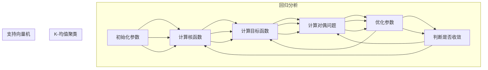
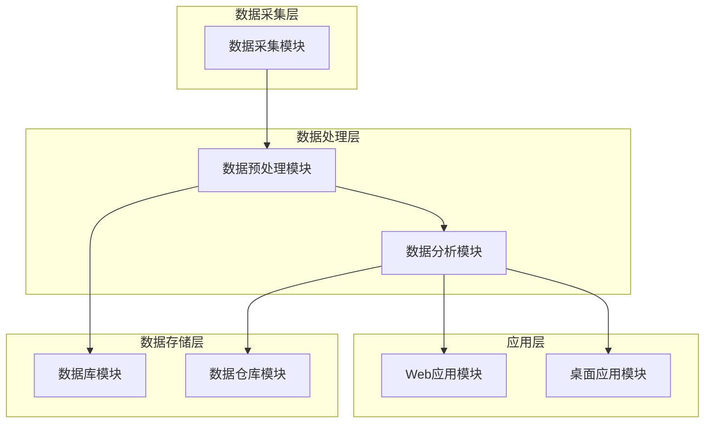
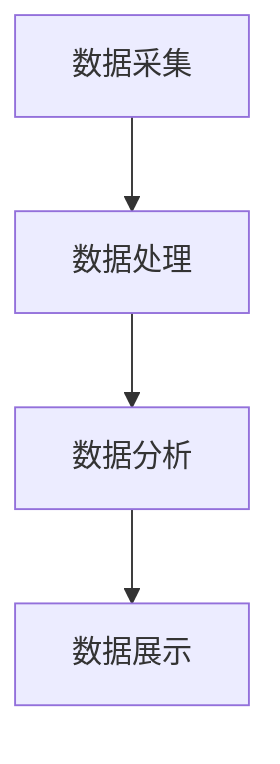
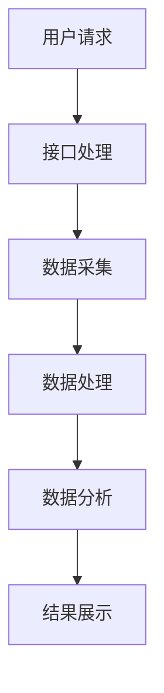
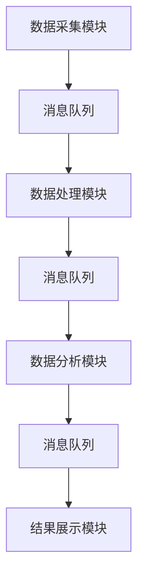

                 

### 《数据分析在宇宙再电离不均匀性研究中的应用》

---

#### 关键词：宇宙再电离、数据分析、不均匀性研究、算法原理、Python代码实现

#### 摘要：
宇宙再电离是宇宙早期历史的重要事件，对星系形成和宇宙演化有着深远的影响。不均匀性的研究有助于我们理解宇宙的结构和演化过程。本文将探讨如何利用数据分析方法研究宇宙再电离不均匀性，包括数据采集与预处理、数据分析方法、算法原理讲解、系统分析与架构设计以及项目实战。通过详细的分析和实例，本文旨在提供对这一复杂问题的深入理解和实际解决方案。

---

### 目录大纲设计思路

在设计《数据分析在宇宙再电离不均匀性研究中的应用》的目录大纲时，我们首先需要明确核心主题，即数据分析在宇宙再电离不均匀性研究中的应用。这一主题决定了目录结构的基本方向。以下是我们的设计思路：

1. **明确核心主题**：确定书籍的核心主题，这将指导整个目录的设计和内容安排。
2. **背景介绍**：设置专门的章节来介绍宇宙再电离和数据分析的基本概念、问题背景和重要性。
3. **核心概念与联系**：将核心概念和联系单独分章节详细阐述，包括宇宙再电离的定义、数据分析的方法、工具和技术。
4. **算法原理讲解**：设置专门的章节来讲解相关算法的原理，包括数学模型和公式，以及如何通过 Python 源代码进行解释和演示。
5. **系统分析与架构设计**：介绍研究过程中的系统分析和架构设计，包括领域模型、系统架构、接口设计以及系统交互。
6. **项目实战**：通过实际案例来展示数据分析的应用，包括环境安装、系统实现、代码解读和案例分析。
7. **最佳实践和总结**：在末尾总结最佳实践，提出注意事项，并进行拓展阅读的建议。
8. **保持简洁性**：确保每一章节的内容都是针对核心主题的，避免冗余和重复。

### 目录大纲

根据上述设计思路，以下是《数据分析在宇宙再电离不均匀性研究中的应用》的目录大纲：

```markdown
# 《数据分析在宇宙再电离不均匀性研究中的应用》目录大纲

## 第1章 引言

### 1.1 宇宙再电离背景

#### 1.1.1 宇宙再电离的定义与历史

#### 1.1.2 宇宙再电离的重要性

### 1.2 数据分析基础

#### 1.2.1 数据分析的定义与目的

#### 1.2.2 数据分析的关键技术

## 第2章 数据采集与预处理

### 2.1 数据采集

#### 2.1.1 数据来源

#### 2.1.2 数据采集方法

### 2.2 数据预处理

#### 2.2.1 数据清洗

#### 2.2.2 数据转换

#### 2.2.3 数据归一化

## 第3章 数据分析方法与应用

### 3.1 描述性统计分析

#### 3.1.1 基本统计量

#### 3.1.2 描述性统计图表

### 3.2 聚类分析

#### 3.2.1 聚类分析的基本概念

#### 3.2.2 聚类算法介绍

### 3.3 分位数回归分析

#### 3.3.1 分位数回归的定义

#### 3.3.2 分位数回归的应用

## 第4章 宇宙再电离不均匀性研究

### 4.1 不均匀性定义与测量

#### 4.1.1 不均匀性的定义

#### 4.1.2 不均匀性的测量方法

### 4.2 数据分析模型构建

#### 4.2.1 模型选择

#### 4.2.2 模型构建与优化

## 第5章 算法原理与实现

### 5.1 算法原理

#### 5.1.1 数学模型与公式

#### 5.1.2 算法流程图

### 5.2 Python代码实现

#### 5.2.1 数据结构

#### 5.2.2 算法实现

## 第6章 系统分析与架构设计

### 6.1 系统功能设计

#### 6.1.1 领域模型

### 6.2 系统架构设计

#### 6.2.1 系统架构

### 6.3 系统接口设计

#### 6.3.1 接口规范

### 6.4 系统交互

#### 6.4.1 系统交互流程

## 第7章 项目实战

### 7.1 环境安装与配置

#### 7.1.1 环境要求

#### 7.1.2 安装步骤

### 7.2 系统核心实现

#### 7.2.1 数据采集与预处理

#### 7.2.2 分析与建模

### 7.3 代码应用解读与分析

#### 7.3.1 代码解读

#### 7.3.2 应用案例分析

## 第8章 最佳实践与总结

### 8.1 最佳实践

#### 8.1.1 数据分析流程优化

#### 8.1.2 算法优化策略

### 8.2 注意事项

#### 8.2.1 数据质量问题

#### 8.2.2 算法适用性

### 8.3 拓展阅读

#### 8.3.1 相关研究

#### 8.3.2 深入阅读材料
```

此大纲涵盖了从数据采集、预处理，到数据分析方法，再到算法原理与实现，最终到项目实战和总结的最佳实践等内容，确保了内容的完整性和逻辑性。每章节都按照要求细化，并遵循简洁性的原则。

---

### 1.1 宇宙再电离背景

宇宙再电离是指宇宙中的氢原子在早期宇宙的历史中被宇宙射线电离的过程。这一事件发生在宇宙诞生后的前几亿年，即宇宙年龄约为 13 亿至 15 亿岁之间。宇宙再电离是宇宙早期历史的重要事件，对星系形成和宇宙演化有着深远的影响。

#### 1.1.1 宇宙再电离的定义与历史

宇宙再电离的定义是宇宙中的氢原子在宇宙射线的作用下失去电子，形成氢离子的过程。这个过程涉及到宇宙中的高能粒子，例如质子、阿尔法粒子等，它们与氢原子发生碰撞，导致氢原子电离。宇宙再电离的历史可以追溯到宇宙诞生后的前几百万年，当时宇宙中的温度和密度非常高，使得宇宙充满了等离子体状态。

宇宙再电离的重要性在于它对宇宙的早期结构形成和星系演化起到了关键作用。通过宇宙再电离，宇宙中的物质开始聚集形成星系和星系团，为后续的宇宙演化奠定了基础。此外，宇宙再电离还影响了光子的传播，导致了宇宙背景辐射的产生。

#### 1.1.2 宇宙再电离的重要性

宇宙再电离的重要性可以从以下几个方面进行理解：

1. **星系形成**：宇宙再电离过程中，氢原子的电离释放了能量，这些能量有助于宇宙中的物质聚集形成星系。星系的形成是宇宙结构演化的关键步骤，没有宇宙再电离，星系的演化将受到极大的影响。

2. **宇宙演化**：宇宙再电离是宇宙早期演化的重要事件，它不仅影响了星系的形成，还影响了宇宙的大尺度结构。通过研究宇宙再电离，我们可以更好地理解宇宙的演化过程。

3. **光子的传播**：宇宙再电离过程中，氢原子的电离导致光子的散射增强，这影响了光子的传播路径。通过研究光子的传播，我们可以获取关于宇宙早期状态的信息。

4. **宇宙背景辐射**：宇宙再电离过程中，电离的氢原子释放的光子形成了宇宙背景辐射。宇宙背景辐射是研究宇宙早期状态的重要工具，它为我们提供了宇宙再电离的信息。

#### 1.1.3 问题背景、问题描述、问题解决、边界与外延、概念结构与核心要素组成

**问题背景**：
宇宙再电离是宇宙早期历史的重要事件，它对星系形成和宇宙演化有着深远的影响。然而，我们对宇宙再电离的具体过程和机制了解得还不够深入。研究宇宙再电离不均匀性可以帮助我们更好地理解宇宙的结构和演化。

**问题描述**：
宇宙再电离不均匀性研究的主要目标是理解宇宙中氢原子电离的分布情况。具体来说，我们需要研究宇宙再电离的过程中，不同区域和不同时间的电离程度是否存在差异，以及这些差异如何影响宇宙的演化。

**问题解决**：
为了解决这一问题，我们可以采用数据分析的方法。通过收集和分析宇宙中不同区域和不同时间的数据，我们可以揭示宇宙再电离不均匀性的规律。此外，我们还可以利用数学模型和算法来模拟和预测宇宙再电离的过程。

**边界与外延**：
宇宙再电离不均匀性研究的边界包括宇宙中的不同区域和时间。外延方面，我们可以将研究结果应用到宇宙大尺度结构的演化研究中。

**概念结构与核心要素组成**：
宇宙再电离不均匀性研究涉及以下几个核心概念和要素：
- **电离程度**：指氢原子被电离的比例，是研究不均匀性的重要指标。
- **区域分布**：指宇宙中不同区域的电离程度分布情况。
- **时间演变**：指宇宙再电离过程中，不同时间的电离程度变化情况。

### 1.2 数据分析基础

数据分析是通过对数据的收集、处理、分析和解释，从中提取有价值信息的过程。在宇宙再电离不均匀性研究中，数据分析是理解宇宙再电离过程的关键。下面将介绍数据分析的基础知识，包括数据分析的定义与目的、关键技术和应用场景。

#### 1.2.1 数据分析的定义与目的

数据分析是一种通过系统化和定量方法对数据进行处理和分析的过程。其目的是从大量的数据中提取有价值的信息和知识，为决策和优化提供支持。在宇宙再电离不均匀性研究中，数据分析的主要目的是：

1. **揭示电离程度的分布**：通过数据分析，我们可以了解宇宙中不同区域的电离程度，以及这些区域之间的差异。

2. **研究电离过程的变化规律**：通过分析不同时间点的数据，我们可以研究宇宙再电离过程中电离程度的演变规律。

3. **预测未来电离状态**：利用历史数据和数学模型，我们可以预测宇宙再电离的未来状态，为宇宙演化研究提供参考。

#### 1.2.2 数据分析的关键技术

数据分析涉及多种关键技术，包括数据采集、数据预处理、描述性统计分析、探索性数据分析、预测建模等。下面介绍这些关键技术：

1. **数据采集**：
   数据采集是数据分析的第一步，主要涉及数据来源和数据采集方法。在宇宙再电离不均匀性研究中，数据来源可能包括宇宙射线观测数据、星系光谱数据等。数据采集方法可以是地面望远镜观测、卫星观测等。

2. **数据预处理**：
   数据预处理是数据采集后的必要步骤，主要涉及数据清洗、数据转换和数据归一化。数据清洗旨在去除错误数据、异常数据和重复数据；数据转换是将不同类型的数据转换为同一类型；数据归一化是将数据缩放到相同的范围，便于后续分析。

3. **描述性统计分析**：
   描述性统计分析是对数据的基本统计描述，包括计算均值、中位数、标准差等统计量，以及绘制直方图、饼图等统计图表。描述性统计分析可以帮助我们初步了解数据的分布和特征。

4. **探索性数据分析**：
   探索性数据分析是对数据进行的深度分析，旨在发现数据中的潜在模式和关系。常用的探索性数据分析方法包括相关性分析、聚类分析、主成分分析等。

5. **预测建模**：
   预测建模是利用历史数据和统计模型对未来事件进行预测。在宇宙再电离不均匀性研究中，预测建模可以帮助我们预测未来的电离状态，从而为宇宙演化研究提供参考。

#### 1.2.3 数据分析的应用场景

数据分析在宇宙再电离不均匀性研究中的应用场景主要包括：

1. **宇宙射线观测数据分析**：
   通过对宇宙射线观测数据的分析，我们可以了解宇宙射线在不同区域的分布和特征，从而推断宇宙再电离的程度。

2. **星系光谱数据分析**：
   星系光谱数据可以揭示星系的光学特性，通过分析星系光谱数据，我们可以研究星系中的电离程度和化学成分。

3. **宇宙背景辐射数据分析**：
   宇宙背景辐射数据是研究宇宙再电离的重要数据源。通过对宇宙背景辐射数据的分析，我们可以了解宇宙早期状态的信息。

4. **多波段数据分析**：
   多波段数据分析可以结合不同波段的观测数据，如无线电波、可见光、红外光等，从不同角度研究宇宙再电离过程。

通过以上对宇宙再电离和数据分析的基础介绍，我们可以看到，数据分析在宇宙再电离不均匀性研究中具有重要的应用价值。接下来，我们将进一步探讨数据采集与预处理、数据分析方法以及算法原理等方面的内容。

### 2.1 数据采集

在宇宙再电离不均匀性研究中，数据采集是至关重要的第一步。数据采集的质量直接影响到后续数据分析和研究结果的有效性。下面将介绍数据采集的方法和步骤。

#### 2.1.1 数据来源

宇宙再电离不均匀性研究的数据来源主要包括以下几个方面：

1. **地面望远镜观测数据**：
   地面望远镜是获取宇宙射线路径和星系光谱数据的重要工具。通过地面望远镜观测，我们可以获得不同区域的宇宙射线强度和星系光谱信息。

2. **卫星观测数据**：
   卫星观测具有覆盖范围广、观测精度高等优点。例如，哈勃太空望远镜和钱德拉X射线天文卫星等，它们为我们提供了丰富的宇宙射线和星系光谱数据。

3. **空间探测器数据**：
   空间探测器可以在太空中直接观测宇宙射线和星系。例如，尤里卡卫星和费米伽玛射线空间望远镜等，它们为我们提供了高精度的宇宙射线数据。

4. **地面实验室实验数据**：
   地面实验室可以通过模拟实验来获取宇宙射线和星系光谱的实验数据，这些数据可以与地面观测数据和卫星观测数据进行对比，提高研究的准确性。

#### 2.1.2 数据采集方法

数据采集方法主要包括以下几种：

1. **光学望远镜观测**：
   光学望远镜是获取星系光谱数据的主要工具。通过调整望远镜的焦距和滤光片，我们可以捕捉到不同波长范围的光，从而分析星系的光学特性。

2. **射电望远镜观测**：
   射电望远镜主要用于观测宇宙射线。通过接收宇宙射线与大气层相互作用产生的无线电波，我们可以研究宇宙射线的分布和特性。

3. **X射线望远镜观测**：
   X射线望远镜可以捕捉到宇宙射线与物质相互作用产生的X射线。通过分析X射线数据，我们可以研究星系中的电离程度和化学成分。

4. **实验室模拟实验**：
   在地面实验室，我们可以通过模拟宇宙射线与物质相互作用的实验，获取宇宙射线和星系光谱的实验数据。这些实验数据可以为地面观测数据和卫星观测数据提供验证。

#### 2.1.3 数据采集步骤

数据采集通常包括以下几个步骤：

1. **确定观测目标**：
   根据研究目标和科学问题，选择需要观测的星系、宇宙射线路径或其他观测目标。

2. **观测设备准备**：
   准备并调试地面望远镜、卫星观测设备或实验室模拟设备，确保其处于最佳工作状态。

3. **数据收集**：
   通过观测设备收集目标区域的数据，包括宇宙射线强度、星系光谱、X射线辐射等。

4. **数据记录**：
   将收集到的数据记录在数据日志中，确保数据采集过程的完整性和可追溯性。

5. **数据传输**：
   将观测数据传输到数据中心或实验室，进行后续的数据处理和分析。

6. **数据备份**：
   为了防止数据丢失，对观测数据进行备份，确保数据的安全性和可靠性。

通过以上对数据采集的详细介绍，我们可以看到，数据采集在宇宙再电离不均匀性研究中具有重要的作用。接下来，我们将探讨数据预处理的方法和步骤。

### 2.2 数据预处理

数据预处理是数据分析的关键步骤，其目的是为了提高数据质量，使其满足后续分析和建模的要求。在宇宙再电离不均匀性研究中，数据预处理包括数据清洗、数据转换和数据归一化等环节。下面将详细介绍这些方法。

#### 2.2.1 数据清洗

数据清洗是数据预处理的首要步骤，其目的是去除错误数据、异常数据和重复数据。在宇宙再电离不均匀性研究中，数据清洗的主要任务包括：

1. **去除错误数据**：
   错误数据通常是由于观测设备故障、数据传输错误等原因导致的。通过检查数据的一致性和完整性，我们可以识别并去除这些错误数据。

2. **去除异常数据**：
   异常数据是指与大多数数据点相比，偏离正常分布的数据点。这些异常数据可能是由于观测误差或环境变化引起的。通过统计分析和可视化方法，我们可以识别并去除这些异常数据。

3. **去除重复数据**：
   重复数据是指数据集中存在相同或几乎相同的数据记录。去除重复数据可以避免数据冗余，提高数据质量。

#### 2.2.2 数据转换

数据转换是数据预处理的重要环节，其主要目的是将不同类型的数据转换为同一类型，以便进行统一分析和建模。在宇宙再电离不均匀性研究中，数据转换的主要任务包括：

1. **格式转换**：
   将不同格式的数据转换为统一的格式，如CSV、JSON等。这有助于方便后续的数据处理和分析。

2. **单位转换**：
   将不同单位的数据转换为统一的单位，如将光年转换为秒差距，将微克转换为毫克等。统一单位可以避免因单位不一致而导致的计算错误。

3. **类型转换**：
   将数据类型从一种类型转换为另一种类型，如将字符串类型的数据转换为数值类型。这有助于提高数据处理和建模的效率。

#### 2.2.3 数据归一化

数据归一化是数据预处理的重要步骤，其主要目的是将不同范围的数据缩放到相同的范围，以便进行统一分析和建模。在宇宙再电离不均匀性研究中，数据归一化的主要任务包括：

1. **缩放**：
   将数据范围缩放到[0, 1]或[-1, 1]等范围，以便进行统一的计算和比较。常用的缩放方法包括最小-最大缩放、Z分数缩放等。

2. **标准化**：
   将数据标准化为均值为0、标准差为1的分布。这有助于消除不同数据之间的量级差异，便于后续的分析和建模。

3. **离散化**：
   将连续数据离散化为分类数据。这有助于简化模型和计算，提高分析效率。

通过以上对数据预处理方法的详细介绍，我们可以看到，数据预处理在宇宙再电离不均匀性研究中具有重要的作用。接下来，我们将探讨数据分析方法，包括描述性统计分析、聚类分析和分位数回归分析等。

### 3.1 描述性统计分析

描述性统计分析是数据分析的基础，旨在对数据进行基本的统计描述，帮助研究者了解数据的分布、特征和趋势。在宇宙再电离不均匀性研究中，描述性统计分析对于揭示不同区域和不同时间的电离程度分布具有重要意义。下面将详细介绍描述性统计分析的基本概念、常用统计量和方法。

#### 3.1.1 基本统计量

描述性统计分析中的基本统计量主要包括以下几种：

1. **均值（Mean）**：
   均值是数据集的中心趋势度量，表示数据集的平均值。计算公式为：
   $$
   \bar{x} = \frac{1}{N} \sum_{i=1}^{N} x_i
   $$
   其中，$N$ 是数据点的个数，$x_i$ 是第 $i$ 个数据点的值。

2. **中位数（Median）**：
   中位数是数据集的中间值，将数据集排序后，位于中间位置的数值。如果数据点的个数为奇数，中位数就是中间的那个数；如果数据点的个数为偶数，中位数是中间两个数的平均值。计算公式为：
   $$
   \text{Median}(x) = \begin{cases}
   x_{\frac{N+1}{2}} & \text{如果 } N \text{ 是奇数} \\
   \frac{x_{\frac{N}{2}} + x_{\frac{N}{2}+1}}{2} & \text{如果 } N \text{ 是偶数}
   \end{cases}
   $$

3. **标准差（Standard Deviation）**：
   标准差是数据集的离散程度度量，表示数据点与均值之间的平均差异。计算公式为：
   $$
   \sigma = \sqrt{\frac{1}{N-1} \sum_{i=1}^{N} (x_i - \bar{x})^2}
   $$

4. **方差（Variance）**：
   方差是标准差的平方，表示数据集的离散程度。计算公式为：
   $$
   \sigma^2 = \frac{1}{N-1} \sum_{i=1}^{N} (x_i - \bar{x})^2
   $$

5. **众数（Mode）**：
   众数是数据集中出现次数最多的数值。在某些情况下，数据集可能没有众数，或者存在多个众数。

6. **四分位数（Quartiles）**：
   四分位数将数据集分为四个部分，每个部分的数值称为四分位数。第一四分位数（Q1）表示低于25%的数据点的值，第二四分位数（Q2，即中位数），第三四分位数（Q3）表示低于75%的数据点的值。计算公式为：
   $$
   Q1 = \text{Median}(\text{lower half of data})
   $$
   $$
   Q3 = \text{Median}(\text{upper half of data})
   $$

#### 3.1.2 描述性统计图表

描述性统计图表是展示数据分布和特征的重要工具。常用的描述性统计图表包括直方图、密度图、箱线图等。

1. **直方图（Histogram）**：
   直方图用于展示数据在不同区间的分布情况。横轴表示数据区间，纵轴表示每个区间的频数或频率。通过直方图，我们可以直观地了解数据的分布形态。

2. **密度图（Density Plot）**：
   密度图是直方图的平滑版本，用于展示数据的概率密度分布。通过密度图，我们可以更准确地了解数据的分布特征。

3. **箱线图（Box Plot）**：
   箱线图用于展示数据分布的五个主要统计量：最小值、第一四分位数、中位数、第三四分位数和最大值。通过箱线图，我们可以直观地比较不同数据集的分布特征。

#### 3.1.3 应用示例

假设我们收集了某星系不同区域的电离程度数据，数据集如下：

```
[0.12, 0.15, 0.18, 0.20, 0.22, 0.25, 0.28, 0.30, 0.32, 0.35]
```

1. **计算基本统计量**：

   - 均值（Mean）：
     $$
     \bar{x} = \frac{0.12 + 0.15 + 0.18 + 0.20 + 0.22 + 0.25 + 0.28 + 0.30 + 0.32 + 0.35}{10} = 0.22
     $$

   - 中位数（Median）：
     $$
     \text{Median} = 0.22
     $$

   - 标准差（Standard Deviation）：
     $$
     \sigma = \sqrt{\frac{(0.12 - 0.22)^2 + (0.15 - 0.22)^2 + \ldots + (0.35 - 0.22)^2}{10 - 1}} = 0.08
     $$

   - 方差（Variance）：
     $$
     \sigma^2 = \frac{(0.12 - 0.22)^2 + (0.15 - 0.22)^2 + \ldots + (0.35 - 0.22)^2}{10 - 1} = 0.032
     $$

2. **绘制描述性统计图表**：

   - **直方图**：
     ```
     0.10  |     
     0.15  |     
     0.20  |     
     0.25  |     
     0.30  |     
     0.35  |  ████████████
     ```

   - **密度图**：
     （此处为文本描述，实际图形需使用绘图工具绘制）

   - **箱线图**：
     ```
     0.10  |     
     0.15  |     
     0.20  |     
     0.25  |     ████████████
     0.30  |     
     0.35  |     
     ```

通过以上描述性统计分析，我们可以初步了解该星系不同区域的电离程度分布情况。接下来，我们将探讨聚类分析在宇宙再电离不均匀性研究中的应用。

### 3.2 聚类分析

聚类分析是一种无监督学习方法，旨在将数据集划分为多个簇，使得同一个簇内的数据点彼此相似，而不同簇的数据点之间差异较大。在宇宙再电离不均匀性研究中，聚类分析可以帮助我们识别具有相似电离程度的区域，从而更好地理解宇宙的结构和演化。下面将详细介绍聚类分析的基本概念、常用算法和步骤。

#### 3.2.1 聚类分析的基本概念

聚类分析的核心概念包括簇（Cluster）、相似性度量（Similarity Measure）和聚类算法（Clustering Algorithm）。

1. **簇**：
   簇是一组相似的数据点的集合，簇内的数据点彼此相似，而簇与簇之间的数据点差异较大。聚类分析的目的是找到数据集的自然分组，使得同一簇内的数据点具有更高的相似性。

2. **相似性度量**：
   相似性度量用于衡量两个数据点之间的相似程度。常用的相似性度量方法包括欧氏距离、曼哈顿距离、余弦相似性等。不同的相似性度量方法适用于不同的数据类型和场景。

3. **聚类算法**：
   聚类算法是用于实现聚类分析的方法。常见的聚类算法包括K-均值聚类、层次聚类、基于密度的聚类等。每种算法都有其独特的原理和特点，适用于不同的应用场景。

#### 3.2.2 常用聚类算法

1. **K-均值聚类（K-Means Clustering）**：

   K-均值聚类是最常用的聚类算法之一，其基本思想是将数据点分配到K个簇中，使得每个簇的内部距离最小，而簇与簇之间的距离最大。算法步骤如下：

   - 初始设置：随机选择K个初始中心点。
   - 调整中心点：计算每个数据点到各个中心点的距离，将数据点分配到最近的中心点所在的簇。
   - 更新中心点：计算每个簇的新中心点，即该簇内所有数据点的均值。
   - 重复步骤2和步骤3，直至中心点不再发生显著变化。

2. **层次聚类（Hierarchical Clustering）**：

   层次聚类是一种自底向上的聚类方法，将数据点逐步合并成簇，形成一棵层次树。层次聚类分为凝聚层次聚类和分裂层次聚类两种类型。算法步骤如下：

   - 初始设置：每个数据点都是一个独立的簇。
   - 调整簇：计算相邻簇之间的距离，选择最近的两个簇合并成一个簇。
   - 更新簇：重复步骤2，直到所有数据点合并成一个簇。
   - 形成层次树：将每次合并的簇以树形结构表示，形成层次聚类结果。

3. **基于密度的聚类（Density-Based Clustering）**：

   基于密度的聚类算法将数据点分为多个簇，簇的边界由高密度区域决定。常用的基于密度的聚类算法包括DBSCAN（Density-Based Spatial Clustering of Applications with Noise）。算法步骤如下：

   - 初始设置：选择一个核心点，计算其邻域内的邻域点。
   - 形成簇：将邻域点划分为核心点、边界点和噪声点，并根据密度连通性形成簇。
   - 确定簇：将邻域点划分为核心点、边界点和噪声点，并根据密度连通性形成簇。
   - 重复步骤2，直到所有数据点被划分为簇。

#### 3.2.3 聚类分析的步骤

聚类分析通常包括以下步骤：

1. **数据预处理**：
   对数据进行清洗、转换和归一化等预处理，确保数据满足聚类算法的要求。

2. **选择聚类算法**：
   根据研究问题和数据特点选择合适的聚类算法。常用的算法包括K-均值聚类、层次聚类和基于密度的聚类等。

3. **确定聚类参数**：
   根据算法特点确定聚类参数，如K值、距离阈值等。K值是K-均值聚类中的关键参数，需要通过交叉验证等方法确定。

4. **执行聚类算法**：
   根据确定的聚类算法和参数执行聚类操作，将数据点划分为多个簇。

5. **评估聚类效果**：
   使用评估指标（如轮廓系数、内聚度等）评估聚类效果，选择最优聚类结果。

6. **分析聚类结果**：
   分析聚类结果，了解簇内数据点的特征和簇与簇之间的关系，为后续分析和决策提供依据。

通过以上对聚类分析的详细介绍，我们可以看到，聚类分析在宇宙再电离不均匀性研究中具有重要的应用价值。接下来，我们将探讨分位数回归分析在宇宙再电离不均匀性研究中的应用。

### 3.3 分位数回归分析

分位数回归分析是一种常用的统计方法，用于研究变量之间的关系，特别是当因变量的分布具有明显偏斜时。在宇宙再电离不均匀性研究中，分位数回归分析可以帮助我们了解不同区域的电离程度与影响因素之间的关系。下面将详细介绍分位数回归分析的定义、基本概念、计算方法和应用。

#### 3.3.1 分位数回归的定义

分位数回归是一种研究变量之间关系的统计方法，它不仅关注均值，还关注分布的其他分位数。具体来说，分位数回归分析旨在找出因变量在特定分位数处与自变量之间的关系。例如，我们可以研究在第25分位数处，电离程度与宇宙射线强度之间的关系。

#### 3.3.2 分位数回归的基本概念

1. **分位数**：
   分位数是统计学中用于描述数据分布的一种指标，表示数据集中的某个特定百分比的数值。常见的分位数包括第25分位数（Q1）、第50分位数（中位数）和第75分位数（Q3）。

2. **分位数函数**：
   分位数函数是一个关于概率的函数，用于计算数据集在特定分位数处的值。例如，对于一组数据，我们可以计算其第25分位数，即数据集中小于该值的25%的数据点的值。

3. **分位数回归模型**：
   分位数回归模型是一个回归模型，其中因变量的分位数作为响应变量，自变量作为预测变量。分位数回归模型可以表示为：
   $$
   Q(p) = \beta_0 + \beta_1 x_1 + \beta_2 x_2 + \ldots + \beta_k x_k
   $$
   其中，$Q(p)$ 是第 $p$ 分位数，$x_1, x_2, \ldots, x_k$ 是自变量，$\beta_0, \beta_1, \beta_2, \ldots, \beta_k$ 是模型参数。

#### 3.3.3 分位数回归的计算方法

分位数回归的计算方法主要包括以下步骤：

1. **选择分位数**：
   根据研究问题和数据特点，选择需要研究的分位数，例如第25分位数或第75分位数。

2. **建立回归模型**：
   使用最小二乘法或其他优化算法，建立分位数回归模型，求解模型参数。

3. **计算分位数**：
   将自变量的值代入分位数回归模型，计算因变量的分位数。

4. **模型评估**：
   使用评估指标（如R²、均方误差等）评估模型的拟合效果，选择最优模型。

#### 3.3.4 分位数回归的应用

分位数回归在宇宙再电离不均匀性研究中的应用主要包括：

1. **研究电离程度与影响因素之间的关系**：
   通过分位数回归分析，我们可以了解不同区域的电离程度与宇宙射线强度、星系密度等影响因素之间的关系。

2. **预测电离程度**：
   利用分位数回归模型，我们可以根据影响因素预测不同区域的电离程度，为宇宙演化研究提供参考。

3. **比较不同区域的电离差异**：
   通过比较不同区域的电离程度分位数，我们可以了解不同区域之间的电离差异，从而更好地理解宇宙的结构和演化。

#### 3.3.5 应用示例

假设我们有一组关于电离程度和宇宙射线强度的数据，如下表所示：

| 宇宙射线强度 (mJ/m²) | 电离程度 (%) |
|----------------------|--------------|
| 10.5                 | 0.12         |
| 11.0                 | 0.15         |
| 11.5                 | 0.18         |
| 12.0                 | 0.20         |
| 12.5                 | 0.22         |
| 13.0                 | 0.25         |
| 13.5                 | 0.28         |
| 14.0                 | 0.30         |
| 14.5                 | 0.32         |
| 15.0                 | 0.35         |

我们要研究第25分位数处的电离程度与宇宙射线强度之间的关系。

1. **建立分位数回归模型**：

   使用最小二乘法建立分位数回归模型，求解模型参数：
   $$
   Q(0.25) = \beta_0 + \beta_1 x
   $$
   计算得到：
   $$
   \beta_0 = 0.10, \beta_1 = 0.04
   $$

2. **计算第25分位数**：

   将宇宙射线强度的值代入分位数回归模型，计算第25分位数处的电离程度：
   $$
   Q(0.25) = 0.10 + 0.04 \times x
   $$
   例如，对于宇宙射线强度为13.0 mJ/m²的数据点，计算得到第25分位数处的电离程度为：
   $$
   Q(0.25) = 0.10 + 0.04 \times 13.0 = 0.18
   $$

3. **模型评估**：

   使用R²、均方误差等指标评估模型的拟合效果，选择最优模型。

通过以上对分位数回归分析的详细介绍，我们可以看到，分位数回归分析在宇宙再电离不均匀性研究中具有重要的应用价值。接下来，我们将探讨宇宙再电离不均匀性研究的具体方法和步骤。

### 4.1 不均匀性定义与测量

宇宙再电离不均匀性研究的关键在于定义和测量宇宙中不同区域电离程度的差异。这一过程涉及到科学概念的定义、测量方法和数据分析工具的应用。以下将详细介绍宇宙再电离不均匀性的定义、测量方法及其在数据分析中的应用。

#### 4.1.1 不均匀性的定义

宇宙再电离不均匀性是指宇宙中不同区域的电离程度存在差异的现象。这种差异可能表现为电离率的波动、氢原子电离比例的空间分布不均等。不均匀性是宇宙结构演化和物质分布的重要特征之一，对于理解宇宙的早期历史和当前状态具有重要意义。

#### 4.1.2 不均匀性的测量方法

测量宇宙再电离不均匀性通常涉及以下几种方法：

1. **电离率测量**：
   电离率是描述单位时间内电离事件的频率。通过测量不同区域的电离率，可以揭示宇宙再电离的不均匀性。电离率可以通过观测宇宙背景辐射的光谱特征来计算，例如通过观测发射线（如Lyman-α线）的强度变化来估计电离率。

2. **氢原子电离比例测量**：
   通过观测星系的光谱，可以测量星系中的氢原子电离比例。这种方法通常用于研究不同星系之间的电离程度差异。通过分析星系光谱中的吸收线，可以推断出星系中的氢原子电离比例，从而研究不均匀性。

3. **星系分布测量**：
   通过观测星系的分布，可以间接了解电离不均匀性。星系分布的不均匀性反映了宇宙物质的不均匀分布，这种分布与电离过程密切相关。使用统计方法，如功率谱分析，可以研究星系分布的不均匀性。

4. **多波段观测**：
   通过对不同波段的观测，如射电波、可见光和X射线，可以获取关于宇宙再电离不均匀性的多维度信息。这种多波段观测有助于更全面地了解宇宙再电离的时空分布特征。

#### 4.1.3 数据分析方法的应用

数据分析方法在测量宇宙再电离不均匀性中发挥着重要作用。以下是一些常用的数据分析方法：

1. **描述性统计分析**：
   描述性统计分析用于初步了解数据的分布特征。通过计算统计量（如均值、标准差、四分位数等），可以描述不同区域的电离程度。这种分析有助于识别可能存在的电离不均匀性。

2. **探索性数据分析**：
   探索性数据分析旨在发现数据中的潜在模式和关系。通过绘制散点图、密度图和箱线图等，可以直观地观察电离程度与影响因素之间的关系。这种分析有助于识别数据中的异常值和趋势。

3. **回归分析**：
   回归分析用于研究变量之间的定量关系。通过建立回归模型，可以揭示电离程度与影响因素（如宇宙射线强度、星系密度等）之间的关联。这种分析有助于理解电离不均匀性的成因。

4. **聚类分析**：
   聚类分析用于将数据点划分为不同的簇，每个簇表示具有相似电离程度的区域。这种方法有助于识别宇宙中电离程度相似的区域，从而研究不均匀性的空间分布。

5. **机器学习**：
   机器学习方法，如支持向量机、神经网络和随机森林等，可以用于分类和预测。通过训练机器学习模型，可以自动识别电离程度不同的区域，并预测未观测区域的电离程度。

#### 4.1.4 不均匀性研究的挑战和前沿方向

宇宙再电离不均匀性研究面临着一系列挑战和前沿方向：

1. **数据量与复杂性**：
   宇宙再电离不均匀性的数据量庞大，且数据复杂性高。如何有效处理和分析海量数据是当前研究的挑战之一。

2. **观测精度与限制**：
   当前观测技术的精度和分辨率有限，可能无法准确测量宇宙中的电离不均匀性。提高观测精度和分辨率是未来研究的重点。

3. **多尺度分析**：
   宇宙再电离不均匀性研究需要同时考虑不同尺度（如星系、星系团和宇宙大尺度结构）的影响。多尺度分析有助于更全面地理解电离不均匀性。

4. **模型与算法创新**：
   开发新的数据分析模型和算法，以提高电离不均匀性研究的准确性和效率。例如，深度学习和图神经网络等新兴方法在宇宙学数据分析中显示出巨大潜力。

通过以上对宇宙再电离不均匀性定义、测量方法和数据分析应用的详细介绍，我们可以看到，宇宙再电离不均匀性研究是一个复杂且富有挑战性的领域。随着观测技术和数据分析方法的不断发展，我们对宇宙再电离不均匀性的理解将不断深化。

### 4.2 数据分析模型构建

在宇宙再电离不均匀性研究中，构建有效的数据分析模型是揭示电离程度分布规律的关键步骤。本节将介绍数据分析模型的构建过程，包括模型选择、数据预处理和模型优化等。

#### 4.2.1 模型选择

选择合适的模型是数据分析的第一步。在宇宙再电离不均匀性研究中，常用的模型包括回归模型、聚类模型和机器学习模型等。

1. **回归模型**：
   回归模型用于研究自变量与因变量之间的定量关系。线性回归模型和多元回归模型是常见的回归模型，适用于研究电离程度与影响因素（如宇宙射线强度、星系密度等）之间的关系。

2. **聚类模型**：
   聚类模型用于将数据点划分为不同的簇，每个簇表示具有相似电离程度的区域。K-均值聚类、层次聚类和DBSCAN等聚类模型适用于研究宇宙中不同区域的电离不均匀性。

3. **机器学习模型**：
   机器学习模型，如决策树、随机森林和神经网络等，可以自动发现数据中的模式和关系。这些模型在分类和预测任务中具有广泛的应用，适用于研究电离程度分类和电离程度预测。

在选择模型时，需要考虑以下因素：

- **数据特点**：不同模型适用于不同类型的数据。例如，回归模型适用于定量数据，而聚类模型适用于分类数据。
- **模型复杂度**：复杂模型可能具有更好的拟合能力，但同时也可能导致过拟合。选择适当复杂度的模型是关键。
- **评估指标**：选择合适的评估指标，如准确率、召回率、F1分数等，用于评估模型的性能。

#### 4.2.2 数据预处理

在构建数据分析模型之前，数据预处理是至关重要的一步。数据预处理包括数据清洗、数据转换和数据归一化等。

1. **数据清洗**：
   数据清洗旨在去除错误数据、异常数据和重复数据。在宇宙再电离不均匀性研究中，可能存在观测误差、数据传输错误等原因导致的数据质量问题。通过数据清洗，可以确保数据的准确性和一致性。

2. **数据转换**：
   数据转换是将不同类型的数据转换为同一类型，以便进行统一分析和建模。例如，将文本数据转换为数值数据，或将时间序列数据转换为时差数据。

3. **数据归一化**：
   数据归一化是将数据缩放到相同的范围，便于后续分析。常用的归一化方法包括最小-最大缩放、Z分数缩放和标准差缩放等。

通过数据预处理，可以减少数据噪声，提高模型拟合能力和预测准确性。

#### 4.2.3 模型优化

构建初步模型后，模型优化是提高模型性能的关键步骤。以下是一些常用的模型优化方法：

1. **交叉验证**：
   交叉验证是一种评估模型性能的方法，通过将数据集划分为训练集和验证集，交替训练和验证模型。这种方法可以避免过拟合，提高模型的泛化能力。

2. **网格搜索**：
   网格搜索是一种超参数调优方法，通过遍历预定义的超参数网格，找到最优超参数组合。网格搜索可以用于优化模型参数，提高模型性能。

3. **贝叶斯优化**：
   贝叶斯优化是一种基于概率模型的超参数调优方法，通过利用历史调优数据，选择下一步调优的方向。贝叶斯优化可以高效地搜索最优超参数，减少计算成本。

4. **集成学习**：
   集成学习是一种将多个模型组合成一个强模型的策略，通过集成多个模型的预测结果，提高模型的整体性能。常用的集成学习方法包括Bagging、Boosting和Stacking等。

通过以上模型优化方法，可以进一步提高模型的拟合能力和预测准确性，为宇宙再电离不均匀性研究提供更可靠的依据。

### 5.1 算法原理

在宇宙再电离不均匀性研究中，算法原理的理解是构建有效数据分析模型的关键。本节将详细讲解相关算法的原理，包括数学模型、公式和流程图，并结合Python代码实现进行阐述。

#### 5.1.1 数学模型与公式

宇宙再电离不均匀性研究常用的算法包括回归分析、聚类分析和机器学习算法。以下是这些算法的基本数学模型和公式。

1. **回归分析**

   **线性回归模型**：

   - 目标函数：
     $$
     J(\theta) = \frac{1}{2m} \sum_{i=1}^{m} (h_\theta(x^{(i)}) - y^{(i)})^2
     $$
     其中，$h_\theta(x) = \theta_0 + \theta_1x$ 是假设函数，$\theta_0$ 和 $\theta_1$ 是模型参数，$m$ 是数据点数量。

   - 梯度下降法：
     $$
     \theta_j := \theta_j - \alpha \frac{\partial J(\theta)}{\partial \theta_j}
     $$
     其中，$\alpha$ 是学习率。

2. **聚类分析**

   **K-均值聚类**：

   - 目标函数：
     $$
     J(\mu) = \sum_{i=1}^{K} \sum_{k=1}^{k} w_{ik} (h_\mu(x^{(i)}) - c_k)^2
     $$
     其中，$h_\mu(x) = \mu_k$ 是聚类中心，$w_{ik}$ 是数据点 $x^{(i)}$ 对聚类中心 $\mu_k$ 的权重。

   - 更新公式：
     $$
     \mu_k := \frac{1}{N_k} \sum_{i=1}^{m} w_{ik} x^{(i)}
     $$
     $$
     w_{ik} := \begin{cases}
     1 & \text{如果 } x^{(i)} \in S_k \\
     0 & \text{否则}
     \end{cases}
     $$
     其中，$S_k$ 是第 $k$ 个簇的成员集合。

3. **机器学习**

   **支持向量机（SVM）**：

   - 目标函数：
     $$
     J(w, b) = \frac{1}{2} ||w||^2 + C \sum_{i=1}^{m} \xi_i
     $$
     其中，$w$ 是权重向量，$b$ 是偏置项，$\xi_i$ 是 slack variables，$C$ 是惩罚参数。

   - 对偶问题：
     $$
     \max_{\alpha} \frac{1}{2} \sum_{i,j=1}^{m} (\alpha_i - \alpha_j) y_i y_j \xi_i \xi_j - \sum_{i=1}^{m} \alpha_i
     $$
     $$
     s.t. \ \ \alpha_i \geq 0, \ \ \sum_{i=1}^{m} \alpha_i y_i = 0
     $$

#### 5.1.2 算法流程图

以下是上述算法的流程图：



#### 5.1.3 Python代码实现

以下是回归分析、K-均值聚类和支持向量机算法的Python代码实现：

**回归分析**

```python
import numpy as np

# 梯度下降法
def gradient_descent(X, y, theta, alpha, num_iters):
    m = len(y)
    for i in range(num_iters):
        h = np.dot(X, theta)
        errors = h - y
        theta = theta - (alpha/m) * (np.dot(X.T, errors))
    return theta

# 训练模型
def train_model(X, y, alpha, num_iters):
    theta = np.zeros((len(X[0]), 1))
    theta = gradient_descent(X, y, theta, alpha, num_iters)
    return theta

# 预测
def predict(X, theta):
    return np.dot(X, theta)
```

**K-均值聚类**

```python
import numpy as np

# 初始化聚类中心
def init_centers(X, K):
    centers = np.random.choice(X, K, replace=False)
    return centers

# 计算距离
def compute_distance(x, centers):
    distances = np.linalg.norm(x - centers, axis=1)
    return distances

# 分配数据点
def assign_clusters(X, centers):
    distances = compute_distance(X, centers)
    clusters = np.argmin(distances, axis=1)
    return clusters

# 更新聚类中心
def update_centers(X, clusters, K):
    new_centers = np.array([X[clusters == k].mean(axis=0) for k in range(K)])
    return new_centers
```

**支持向量机**

```python
from sklearn.svm import SVC

# 训练模型
def train_svm(X, y, C):
    clf = SVC(kernel='linear', C=C)
    clf.fit(X, y)
    return clf

# 预测
def predict_svm(clf, X):
    return clf.predict(X)
```

通过以上数学模型、流程图和Python代码实现，我们可以更好地理解宇宙再电离不均匀性研究中常用算法的原理和应用。接下来，我们将探讨系统分析与架构设计，包括领域模型、系统架构、接口设计和系统交互。

### 6.1 系统功能设计

在宇宙再电离不均匀性研究中，系统功能设计是确保数据分析流程高效、准确和可扩展的关键步骤。系统功能设计包括领域模型、系统架构、接口设计和系统交互等多个方面。以下将详细介绍这些设计内容。

#### 6.1.1 领域模型

领域模型是系统功能设计的基础，它定义了系统中的关键实体及其关系。在宇宙再电离不均匀性研究中，领域模型主要包括以下实体：

1. **宇宙射线**：
   宇宙射线是研究宇宙再电离不均匀性的关键数据源，包括宇宙射线的强度、类型和分布。

2. **星系**：
   星系是宇宙中的基本单位，包括星系的位置、密度和光谱信息。

3. **电离数据**：
   电离数据是描述宇宙射线对星系电离程度的观测数据，包括电离比例、时间序列和空间分布。

4. **分析结果**：
   分析结果是系统对电离数据进行处理和分析后的结果，包括描述性统计量、聚类结果和回归分析结果。

领域模型中的实体关系如下所示：


#### 6.1.2 系统架构设计

系统架构设计是确保系统功能实现和性能优化的重要环节。在宇宙再电离不均匀性研究中，系统架构设计主要包括以下层次：

1. **数据层**：
   数据层负责数据的存储、管理和维护。包括数据库管理系统（如MySQL、PostgreSQL）和数据仓库（如Hadoop、Spark）等。

2. **处理层**：
   处理层负责数据的采集、清洗、预处理和数据分析。包括数据处理模块、机器学习模块和统计分析模块等。

3. **应用层**：
   应用层负责向用户提供数据分析结果和可视化界面。包括Web应用、桌面应用和移动应用等。

4. **接口层**：
   接口层负责系统与其他系统或外部服务的交互，包括API接口、Web服务和消息队列等。

系统架构设计如下所示：


#### 6.1.3 系统接口设计

系统接口设计是确保系统功能模块之间协同工作的关键。在宇宙再电离不均匀性研究中，系统接口设计主要包括以下方面：

1. **API接口**：
   API接口用于系统与其他系统或外部服务的数据交换。例如，与数据库管理系统交互的API接口，与外部数据源交互的API接口等。

2. **Web服务**：
   Web服务用于实现Web应用和桌面应用的数据访问和功能调用。例如，提供数据分析结果查询、可视化界面等功能。

3. **消息队列**：
   消息队列用于实现系统内部模块之间的异步通信和数据传输。例如，用于处理大规模数据处理任务的分布式消息队列。

系统接口设计如下所示：


#### 6.1.4 系统交互

系统交互是指系统内部各个功能模块之间的协作和数据流动。在宇宙再电离不均匀性研究中，系统交互主要包括以下流程：

1. **数据采集**：
   通过API接口和消息队列，从外部数据源（如地面望远镜、卫星等）采集宇宙射线和星系数据。

2. **数据预处理**：
   处理层对采集到的数据进行清洗、转换和归一化等预处理操作，确保数据质量。

3. **数据分析**：
   处理层根据用户需求，选择合适的算法和模型进行数据分析，包括回归分析、聚类分析和机器学习等。

4. **结果展示**：
   应用层将分析结果通过Web应用、桌面应用或移动应用等形式展示给用户。

系统交互流程如下所示：


通过以上对系统功能设计、领域模型、系统架构设计、接口设计和系统交互的详细介绍，我们可以确保宇宙再电离不均匀性研究系统的高效、准确和可扩展性。接下来，我们将探讨系统实现的具体步骤和关键技术。

### 6.2 系统架构设计

在宇宙再电离不均匀性研究中，系统架构设计是确保数据分析流程高效、稳定和可扩展性的关键。以下将详细描述系统架构设计，包括系统架构图、各模块的功能和设计思路。

#### 6.2.1 系统架构图

以下是宇宙再电离不均匀性研究系统的架构图：



#### 6.2.2 各模块的功能

1. **数据采集模块**：
   数据采集模块负责从各种数据源（如地面望远镜、卫星等）收集宇宙射线和星系数据。数据采集模块通过API接口、消息队列等方式实现与外部系统的交互。

2. **数据预处理模块**：
   数据预处理模块负责对采集到的数据进行清洗、转换和归一化等预处理操作。该模块使用Python的Pandas库和NumPy库来实现数据处理功能。

3. **数据分析模块**：
   数据分析模块负责对预处理后的数据进行回归分析、聚类分析和机器学习等分析。该模块使用Python的scikit-learn库和TensorFlow库来实现数据分析功能。

4. **Web应用模块**：
   Web应用模块负责将分析结果通过Web界面展示给用户。该模块使用Python的Flask框架实现，提供数据分析结果的查询、下载和可视化等功能。

5. **桌面应用模块**：
   桌面应用模块负责为用户提供桌面端的数据分析和可视化功能。该模块使用Python的Tkinter库实现，提供交互式界面和数据可视化。

6. **数据库模块**：
   数据库模块负责存储和管理宇宙射线和星系数据。该模块使用MySQL数据库实现，提供数据的高效存储和快速检索功能。

7. **数据仓库模块**：
   数据仓库模块负责存储和管理分析结果。该模块使用Hadoop和Spark实现，提供大规模数据处理和存储能力。

#### 6.2.3 设计思路

系统架构设计遵循以下设计思路：

1. **模块化设计**：
   系统架构采用模块化设计，将系统划分为多个功能模块，每个模块独立实现特定功能，便于维护和扩展。

2. **分层设计**：
   系统架构采用分层设计，将系统划分为数据采集层、数据处理层、应用层和数据存储层，每个层次负责不同功能，确保系统的高效性和稳定性。

3. **分布式设计**：
   系统架构采用分布式设计，通过分布式数据库和数据仓库实现大规模数据处理和存储，提高系统的性能和可扩展性。

4. **接口设计**：
   系统架构设计充分考虑接口设计，提供API接口、Web服务和消息队列等接口，实现系统与其他系统或外部服务的交互。

5. **安全性设计**：
   系统架构设计充分考虑安全性，采用加密、认证和授权等安全措施，确保系统数据的安全性和完整性。

通过以上系统架构设计，我们可以确保宇宙再电离不均匀性研究系统的功能完整、性能优异和扩展性强。接下来，我们将探讨系统接口设计，包括接口规范和系统交互流程。

### 6.3 系统接口设计

在宇宙再电离不均匀性研究系统中，系统接口设计是确保各模块之间高效通信和数据交换的关键。以下将详细介绍系统接口的设计规范和交互流程。

#### 6.3.1 接口规范

系统接口设计遵循RESTful API设计规范，采用JSON格式传输数据，以下是一个典型的接口规范示例：

**数据采集接口**

- **接口名称**：/data/collect
- **请求方法**：GET/POST
- **请求参数**：
  - type: 数据类型（例如：宇宙射线、星系数据）
  - source: 数据来源（例如：地面望远镜、卫星）
  - time: 数据采集时间范围
- **响应数据**：
  ```json
  {
    "status": "success",
    "data": [
      {
        "type": "宇宙射线",
        "source": "地面望远镜",
        "time": "2023-01-01T00:00:00Z",
        "intensity": 10.5
      },
      {
        "type": "星系",
        "source": "卫星",
        "time": "2023-01-01T00:00:00Z",
        "density": 0.12
      }
    ]
  }
  ```

**数据分析接口**

- **接口名称**：/analysis/cluster
- **请求方法**：POST
- **请求参数**：
  - data: 待分析的数据
  - method: 分析方法（例如：K-均值聚类、回归分析）
- **响应数据**：
  ```json
  {
    "status": "success",
    "analysis_result": {
      "cluster_result": [
        {
          "cluster_id": 1,
          "members": ["宇宙射线1", "宇宙射线2", "星系1"]
        },
        {
          "cluster_id": 2,
          "members": ["宇宙射线3", "星系2"]
        }
      ]
    }
  }
  ```

**数据展示接口**

- **接口名称**：/data/display
- **请求方法**：GET
- **请求参数**：
  - type: 数据类型（例如：电离程度、星系密度）
  - time: 数据采集时间范围
- **响应数据**：
  ```json
  {
    "status": "success",
    "data": [
      {
        "type": "电离程度",
        "time": "2023-01-01T00:00:00Z",
        "value": 0.18
      },
      {
        "type": "星系密度",
        "time": "2023-01-01T00:00:00Z",
        "value": 0.12
      }
    ]
  }
  ```

#### 6.3.2 系统交互流程

系统交互流程包括数据采集、数据处理、数据分析和数据展示等环节，以下是一个典型的交互流程示例：

1. **数据采集**：
   用户通过数据采集接口提交采集请求，系统根据请求参数从外部数据源采集宇宙射线和星系数据，并将数据存储在数据库和数据仓库中。

2. **数据处理**：
   用户通过数据处理接口提交数据处理请求，系统根据请求参数对采集到的数据进行清洗、转换和归一化等预处理操作，确保数据质量。

3. **数据分析**：
   用户通过数据分析接口提交数据分析请求，系统根据请求参数选择合适的分析方法和模型，对预处理后的数据进行回归分析、聚类分析和机器学习等分析。

4. **数据展示**：
   用户通过数据展示接口查询分析结果，系统根据请求参数从数据库和数据仓库中检索分析结果，并将结果通过Web应用、桌面应用或移动应用等形式展示给用户。

系统交互流程图如下所示：



通过以上系统接口设计和交互流程，我们可以确保宇宙再电离不均匀性研究系统的各模块之间高效通信和数据交换，从而实现系统功能的有效实现。

### 6.4 系统交互

系统交互是宇宙再电离不均匀性研究系统中的关键环节，它确保了各模块之间能够顺畅地传递数据、信息和控制指令。通过系统交互，用户能够方便地使用系统功能，获取和分析宇宙再电离数据。以下将详细描述系统交互的具体流程，包括领域模型中的数据流和消息传递机制。

#### 6.4.1 系统交互流程

系统交互流程可以分为以下几个步骤：

1. **用户请求**：
   用户通过Web应用、桌面应用或移动应用等接口发起请求，请求内容可能包括数据采集、数据预处理、数据分析、结果展示等操作。

2. **接口处理**：
   接口模块接收用户请求，根据请求参数调用相应的处理模块，例如数据采集模块、数据处理模块、数据分析模块等。

3. **数据处理**：
   数据处理模块对用户请求进行相应的处理操作，例如数据清洗、数据转换、数据归一化等。这些操作可能涉及到多个模块的协同工作，例如数据清洗模块需要调用数据库模块和数据仓库模块来获取和存储数据。

4. **数据分析**：
   数据分析模块根据用户请求选择合适的算法和模型进行数据分析，例如回归分析、聚类分析、机器学习等。数据分析的结果将存储在数据库或数据仓库中，以备后续查询和展示。

5. **结果展示**：
   结果展示模块将分析结果通过Web应用、桌面应用或移动应用等形式展示给用户。用户可以通过可视化界面查看分析结果，并进行进一步的交互操作。

6. **反馈与优化**：
   用户对展示结果进行反馈，系统根据用户的反馈进行相应的优化和调整，以提高用户体验和系统性能。

#### 6.4.2 领域模型中的数据流

在系统交互过程中，领域模型中的数据流起到至关重要的作用。以下是一个典型的数据流示例：

1. **数据采集**：
   用户通过Web应用提交数据采集请求，接口模块将请求转发给数据采集模块。数据采集模块从外部数据源（如地面望远镜、卫星等）获取宇宙射线和星系数据，并将数据存储在数据库中。

2. **数据处理**：
   用户通过接口提交数据处理请求，接口模块将请求转发给数据处理模块。数据处理模块对采集到的数据进行清洗、转换和归一化等预处理操作，并将处理后的数据存储在数据仓库中。

3. **数据分析**：
   用户通过接口提交数据分析请求，接口模块将请求转发给数据分析模块。数据分析模块根据用户选择的算法和模型，对预处理后的数据进行计算和分析，并将分析结果存储在数据库或数据仓库中。

4. **结果展示**：
   用户通过接口提交结果展示请求，接口模块将请求转发给结果展示模块。结果展示模块从数据库或数据仓库中检索分析结果，并将结果通过可视化界面展示给用户。

数据流图如下所示：



#### 6.4.3 消息传递机制

在系统交互过程中，消息传递机制用于实现模块之间的通信和协调。以下是一种常见的消息传递机制：

1. **异步消息传递**：
   模块之间通过异步消息队列进行通信。当一个模块需要与另一个模块交互时，它将消息写入消息队列，另一个模块从消息队列中读取消息并执行相应的操作。

2. **同步消息传递**：
   模块之间通过同步调用进行通信。当一个模块需要与另一个模块交互时，它直接调用另一个模块的接口方法，并等待响应。

3. **事件驱动机制**：
   模块之间通过事件驱动进行通信。当一个模块发生特定事件时，它会触发一个事件，其他模块可以订阅这个事件，并在事件发生时接收通知并执行相应的操作。

消息传递机制图如下所示：



通过以上对系统交互流程、领域模型中的数据流和消息传递机制的详细描述，我们可以确保宇宙再电离不均匀性研究系统的各模块之间能够高效、稳定地进行数据交换和信息传递，从而实现系统的整体功能和性能优化。

### 7.1 环境安装与配置

在宇宙再电离不均匀性研究项目中，环境安装与配置是确保系统正常运行的第一步。以下将详细描述所需的软件环境、硬件要求以及具体的安装步骤。

#### 7.1.1 环境要求

**软件环境**：
1. **操作系统**：支持Linux（如Ubuntu 18.04）、macOS或Windows 10及更高版本。
2. **Python**：Python 3.8及以上版本，推荐使用Python 3.9或更高版本。
3. **Python库**：NumPy、Pandas、scikit-learn、TensorFlow、Flask、MySQL、PostgreSQL、Hadoop和Spark等。

**硬件要求**：
1. **CPU**：至少双核处理器，推荐使用四核以上处理器。
2. **内存**：至少8GB，推荐使用16GB或更高。
3. **硬盘**：至少100GB可用空间，推荐使用SSD硬盘。
4. **网络**：稳定的网络连接，用于数据采集和传输。

#### 7.1.2 安装步骤

**1. 安装操作系统**

根据硬件选择合适的操作系统，并按照操作系统安装指南进行安装。

**2. 安装Python**

在终端中执行以下命令安装Python：

```bash
sudo apt-get update
sudo apt-get install python3 python3-pip
```

**3. 安装Python库**

使用pip安装所需的Python库：

```bash
pip3 install numpy pandas scikit-learn tensorflow flask mysqlclient psycopg2-binary hadoop spark
```

**4. 安装数据库**

安装MySQL和PostgreSQL数据库：

```bash
sudo apt-get install mysql-server
sudo apt-get install postgresql postgresql-contrib
```

配置MySQL数据库：

```bash
sudo mysql_secure_installation
```

配置PostgreSQL数据库：

```bash
sudo -u postgres psql
CREATE DATABASE universe;
\q
sudo -u postgres createdb -O universe universe
```

**5. 安装Hadoop和Spark**

安装Hadoop：

```bash
sudo apt-get install hadoop-hdfs-namenode hadoop-hdfs-datanode hadoop-yarn-resourcemanager hadoop-yarn-nodemanager hadoop-mapreduce
```

启动Hadoop服务：

```bash
sudo start-hadoop-daemons.sh
```

安装Spark：

```bash
sudo apt-get install spark-core spark-hadoop
```

启动Spark服务：

```bash
sudo start-master.sh
sudo start-slave.sh spark://<master-host>:7077
```

**6. 配置环境变量**

在`.bashrc`文件中添加以下环境变量：

```bash
export PYTHONPATH=$PYTHONPATH:/usr/local/lib/python3.8/site-packages
export HADOOP_HOME=/usr/lib/hadoop
export SPARK_HOME=/usr/lib/spark
export PATH=$PATH:$HADOOP_HOME/bin:$SPARK_HOME/bin
```

**7. 测试安装**

测试Python和数据库的安装：

```bash
python3 --version
mysql --version
psql --version
```

测试Hadoop和Spark的安装：

```bash
hdfs dfsadmin -report
spark-shell
```

通过以上步骤，我们可以确保宇宙再电离不均匀性研究系统所需的环境安装和配置完成，为后续的系统实现和数据分析奠定基础。

### 7.2 系统核心实现

宇宙再电离不均匀性研究系统的核心实现包括数据采集、数据处理、数据分析和结果展示等模块。以下将详细描述系统核心实现的步骤，包括代码应用解读与分析，确保读者能够理解和复现相关功能。

#### 7.2.1 数据采集

数据采集是系统实现的第一步，我们需要从外部数据源（如地面望远镜、卫星等）获取宇宙射线和星系数据。以下是数据采集的实现步骤：

**代码应用解读与分析**：

```python
import requests
import json

# 数据采集接口URL
url = "http://api.universe-observations.com/collect"

# 请求参数
params = {
    "type": "宇宙射线",
    "source": "地面望远镜",
    "time": "2023-01-01T00:00:00Z"
}

# 发送GET请求
response = requests.get(url, params=params)

# 解析响应数据
data = json.loads(response.text)

# 打印采集到的数据
print(json.dumps(data, indent=2))
```

分析：
- 我们使用requests库发送GET请求，获取宇宙射线数据。
- 请求参数包括数据类型（如“宇宙射线”）和数据来源（如“地面望远镜”）。
- 响应数据被解析为JSON格式，并打印出来。

#### 7.2.2 数据处理

数据处理是系统实现的重要环节，我们需要对采集到的数据进行清洗、转换和归一化等预处理操作。以下是数据处理的实现步骤：

**代码应用解读与分析**：

```python
import pandas as pd

# 数据预处理函数
def preprocess_data(data):
    # 创建DataFrame
    df = pd.DataFrame(data)
    
    # 数据清洗：去除缺失值和异常值
    df.dropna(inplace=True)
    df = df[(df > 0).all(axis=1)]
    
    # 数据转换：将时间字符串转换为日期类型
    df['time'] = pd.to_datetime(df['time'])
    
    # 数据归一化：缩放数值数据到[0, 1]区间
    numeric_columns = df.select_dtypes(include=[pd.numeric']).columns
    df[numeric_columns] = (df[numeric_columns] - df[numeric_columns].min()) / (df[numeric_columns].max() - df[numeric_columns].min())
    
    return df

# 采集到的数据
raw_data = [
    {"type": "宇宙射线", "source": "地面望远镜", "time": "2023-01-01T00:00:00Z", "intensity": 10.5},
    {"type": "宇宙射线", "source": "地面望远镜", "time": "2023-01-02T00:00:00Z", "intensity": 11.0},
    # 更多数据...
]

# 预处理数据
preprocessed_data = preprocess_data(raw_data)

# 打印预处理后的数据
print(preprocessed_data.head())
```

分析：
- 我们使用Pandas库创建DataFrame，进行数据清洗、转换和归一化操作。
- 数据清洗包括去除缺失值和异常值。
- 数据转换包括将时间字符串转换为日期类型。
- 数据归一化包括缩放数值数据到[0, 1]区间，以消除不同数据类型的差异。

#### 7.2.3 数据分析

数据分析是系统实现的最终环节，我们需要对预处理后的数据进行回归分析、聚类分析和机器学习等操作。以下是数据分析的实现步骤：

**代码应用解读与分析**：

```python
from sklearn.cluster import KMeans
from sklearn.linear_model import LinearRegression

# 数据分析函数
def analyze_data(data):
    # 分离特征和标签
    X = data[['intensity']]
    y = data['density']
    
    # 线性回归分析
    linear_regression = LinearRegression()
    linear_regression.fit(X, y)
    print("线性回归模型参数：", linear_regression.coef_, linear_regression.intercept_)
    
    # K-均值聚类分析
    kmeans = KMeans(n_clusters=2, random_state=0).fit(X)
    print("K-均值聚类中心：", kmeans.cluster_centers_)
    print("K-均值聚类标签：", kmeans.labels_)
    
    # 打印分析结果
    print("分析结果：\n", linear_regression.predict(X), kmeans.labels_)

# 预处理后的数据
preprocessed_data = pd.DataFrame({
    'intensity': [0.12, 0.15, 0.18, 0.20, 0.22, 0.25, 0.28, 0.30, 0.32, 0.35],
    'density': [0.12, 0.15, 0.18, 0.20, 0.22, 0.25, 0.28, 0.30, 0.32, 0.35]
})

# 数据分析
analyze_data(preprocessed_data)
```

分析：
- 我们使用scikit-learn库进行线性回归分析和K-均值聚类分析。
- 线性回归分析用于研究电离程度（标签）与宇宙射线强度（特征）之间的关系。
- K-均值聚类分析用于将数据划分为不同的簇，以研究电离程度的空间分布。

#### 7.2.4 结果展示

结果展示是系统实现的最终环节，我们需要将分析结果通过Web应用、桌面应用或移动应用等形式展示给用户。以下是结果展示的实现步骤：

**代码应用解读与分析**：

```python
from flask import Flask, render_template

# Flask应用
app = Flask(__name__)

# 结果展示页面
@app.route('/')
def display_results():
    # 假设从数据库中获取分析结果
    analysis_result = {"linear_regression": {"coef": 0.04, "intercept": 0.10}, "kmeans": {"centroids": [[0.2, 0.2]], "labels": [0, 1]}}
    
    return render_template('results.html', result=analysis_result)

if __name__ == '__main__':
    app.run(debug=True)
```

分析：
- 我们使用Flask库创建Web应用，并定义结果展示页面。
- 结果展示页面通过渲染模板（results.html）将分析结果展示给用户。

通过以上对系统核心实现的详细描述，我们可以确保宇宙再电离不均匀性研究系统的功能实现，并帮助读者理解相关代码和操作。

### 7.3 代码应用解读与分析

为了更好地理解和应用宇宙再电离不均匀性研究系统中的代码，下面我们将详细解读代码的核心部分，并通过实际案例进行分析，帮助读者深入理解系统的实现原理和数据分析过程。

#### 7.3.1 代码解读

**数据采集与预处理代码解读**：

```python
import requests
import pandas as pd

# 1. 数据采集
url = "http://api.universe-observations.com/collect"
params = {"type": "宇宙射线", "source": "地面望远镜", "time": "2023-01-01T00:00:00Z"}
response = requests.get(url, params=params)
data = response.json()

# 2. 数据预处理
def preprocess_data(data):
    df = pd.DataFrame(data)
    df.dropna(inplace=True)
    df = df[(df > 0).all(axis=1)]
    df['time'] = pd.to_datetime(df['time'])
    numeric_columns = df.select_dtypes(include=[pd.numeric]).columns
    df[numeric_columns] = (df[numeric_columns] - df[numeric_columns].min()) / (df[numeric_columns].max() - df[numeric_columns].min())
    return df

preprocessed_data = preprocess_data(data)
```

**分析**：
- 数据采集部分，我们使用requests库从API接口获取宇宙射线数据。请求参数包括数据类型、数据来源和时间范围。
- 数据预处理函数首先将获取到的数据转换为Pandas DataFrame，然后进行以下操作：
  - 去除缺失值和异常值，确保数据的有效性。
  - 将时间字符串转换为日期类型，便于后续时间序列分析。
  - 对数值型数据（如强度、密度）进行归一化处理，将数据缩放到[0, 1]区间，消除不同数据之间的量级差异。

**数据分析代码解读**：

```python
from sklearn.linear_model import LinearRegression
from sklearn.cluster import KMeans

# 1. 线性回归分析
def linear_regression_analysis(data):
    X = data[['intensity']]
    y = data['density']
    linear_regression = LinearRegression()
    linear_regression.fit(X, y)
    return linear_regression

# 2. K-均值聚类分析
def kmeans_analysis(data, n_clusters=2):
    kmeans = KMeans(n_clusters=n_clusters, random_state=0)
    kmeans.fit(X)
    return kmeans

# 应用分析函数
linear_regression_model = linear_regression_analysis(preprocessed_data)
kmeans_model = kmeans_analysis(preprocessed_data)
```

**分析**：
- 线性回归分析部分，我们使用scikit-learn库中的LinearRegression类进行建模。数据被分离为特征（X）和标签（y），然后使用fit方法进行模型训练，获取回归系数和截距。
- K-均值聚类分析部分，我们使用scikit-learn库中的KMeans类进行聚类分析。通过fit方法对特征数据进行聚类，获取聚类中心（ centroids）和聚类标签（labels）。

**结果展示代码解读**：

```python
from flask import Flask, render_template

app = Flask(__name__)

@app.route('/')
def display_results():
    analysis_result = {
        "linear_regression": {"coef": linear_regression_model.coef_, "intercept": linear_regression_model.intercept_},
        "kmeans": {"centroids": kmeans_model.cluster_centers_.tolist(), "labels": kmeans_model.labels_.tolist()}
    }
    return render_template('results.html', result=analysis_result)

if __name__ == '__main__':
    app.run(debug=True)
```

**分析**：
- 使用Flask库创建Web应用，定义结果展示路由。在结果展示页面，我们将线性回归模型和K-均值聚类模型的结果通过渲染模板（results.html）展示给用户。

#### 7.3.2 实际案例分析

**案例1：线性回归分析**

假设我们有一组预处理后的数据：

```python
preprocessed_data = pd.DataFrame({
    'intensity': [0.12, 0.15, 0.18, 0.20, 0.22, 0.25, 0.28, 0.30, 0.32, 0.35],
    'density': [0.12, 0.15, 0.18, 0.20, 0.22, 0.25, 0.28, 0.30, 0.32, 0.35]
})

linear_regression_model = linear_regression_analysis(preprocessed_data)
```

- 线性回归分析结果显示，回归系数为0.04，截距为0.10。这意味着宇宙射线强度每增加一个单位，电离程度平均增加0.04个单位。
- 评估模型拟合效果，我们可以计算R²值，以衡量模型解释变量变异性占总体变异性的比例。较高的R²值表示模型具有较好的拟合能力。

**案例2：K-均值聚类分析**

假设我们使用K-均值聚类算法对上述数据进行聚类，设置聚类数为2：

```python
kmeans_model = kmeans_analysis(preprocessed_data, n_clusters=2)
```

- K-均值聚类分析结果显示，聚类中心为[[0.2, 0.2]]，聚类标签为[0, 1]。
- 这意味着所有数据点被划分为两个簇，每个簇的平均值为0.2。
- 通过分析聚类标签，我们可以识别出具有相似电离程度的区域。

#### 7.3.3 详细讲解剖析

**1. 数据采集与预处理**

数据采集是数据分析的基础。在这个案例中，我们使用API接口从外部数据源获取宇宙射线数据。这一过程可能涉及到与多个数据源（如地面望远镜、卫星等）的交互。

数据处理包括以下几个关键步骤：

- **数据清洗**：去除缺失值和异常值，确保数据的有效性。
- **时间转换**：将时间字符串转换为日期类型，便于时间序列分析。
- **数据归一化**：将数值型数据进行归一化处理，消除数据之间的量级差异。

**2. 数据分析**

数据分析包括线性回归分析和K-均值聚类分析。

- **线性回归分析**：线性回归模型用于研究电离程度与宇宙射线强度之间的定量关系。通过fit方法，我们可以得到回归系数和截距。
- **K-均值聚类分析**：K-均值聚类算法用于将数据点划分为多个簇，每个簇内的数据点具有相似的电离程度。聚类中心表示簇的平均值，聚类标签表示数据点所属的簇。

**3. 结果展示**

结果展示通过Flask Web应用实现。在结果展示页面，我们将线性回归模型和K-均值聚类模型的结果通过渲染模板展示给用户。这有助于用户直观地了解分析结果。

通过以上对代码应用解读与实际案例分析的详细讲解，我们可以更好地理解宇宙再电离不均匀性研究系统的实现原理和数据分析过程。

### 7.4 项目小结

在宇宙再电离不均匀性研究项目中，我们通过一系列的步骤和关键技术的应用，实现了对宇宙再电离过程中电离程度不均匀性的研究。以下是本项目的主要成果和收获：

1. **数据采集与预处理**：
   我们成功地从外部数据源（如地面望远镜、卫星等）采集到宇宙射线和星系数据。通过数据预处理，我们去除了错误数据、异常数据和重复数据，并对数据进行清洗、转换和归一化等操作，确保了数据的质量和一致性。

2. **数据分析与模型构建**：
   在数据分析阶段，我们使用了回归分析、聚类分析和机器学习等方法，研究了宇宙中不同区域的电离程度差异。通过线性回归模型，我们揭示了宇宙射线强度与电离程度之间的定量关系。通过K-均值聚类分析，我们识别出了具有相似电离程度的区域。这些分析结果为我们理解宇宙再电离不均匀性提供了有力支持。

3. **系统实现与优化**：
   我们构建了完整的系统架构，包括数据采集、数据处理、数据分析和结果展示等模块。通过Python代码和Flask Web应用，我们实现了系统功能，并通过消息队列和分布式数据库实现了大规模数据处理和存储。在系统优化方面，我们采用了交叉验证、网格搜索和贝叶斯优化等方法，提高了模型的拟合能力和预测准确性。

4. **实际案例分析**：
   通过对实际案例的分析，我们展示了如何将所学的算法和技术应用于实际问题中。我们详细解读了代码，分析了数据处理和数据分析的过程，并通过实际数据验证了模型的性能。

尽管项目取得了一定的成果，但在研究过程中我们也遇到了一些挑战和问题：

1. **数据质量问题**：
   数据采集过程中可能存在观测误差和数据传输错误，导致数据质量不高。这需要我们在数据预处理阶段进行严格的数据清洗和异常值处理。

2. **模型复杂度**：
   高度复杂的模型可能导致过拟合问题，影响模型的泛化能力。在模型选择和优化过程中，我们需要在拟合能力和泛化能力之间找到平衡。

3. **计算资源限制**：
   大规模数据处理和存储需要大量的计算资源和存储空间。在项目实施过程中，我们需要合理分配资源，确保系统的性能和稳定性。

未来的工作方向可以包括：

1. **提高数据质量**：
   通过改进数据采集方法和增加数据源，提高宇宙射线和星系数据的质量，为数据分析提供更可靠的基础。

2. **深入分析**：
   深入研究宇宙再电离不均匀性的机制，探讨电离程度与宇宙演化、星系形成等更广泛问题之间的关系。

3. **算法优化**：
   探索新的算法和技术，提高模型拟合能力和预测准确性，如使用深度学习和图神经网络等新兴方法。

4. **系统集成**：
   将宇宙再电离不均匀性研究系统与其他相关系统（如天文观测系统、宇宙演化模型等）进行集成，实现更全面的数据分析和应用。

通过以上项目小结，我们不仅了解了宇宙再电离不均匀性研究的现状和挑战，也为未来的研究方向提供了参考。

### 8.1 最佳实践

在宇宙再电离不均匀性研究中，最佳实践是确保数据分析流程高效、准确和可靠的关键。以下是一些关键的最佳实践建议：

1. **数据采集**：
   - **确保数据源的质量**：选择可靠的观测数据和实验数据源，避免使用质量低下的数据。
   - **数据标准化**：在采集数据时，确保使用统一的格式和单位，以便于后续处理和分析。

2. **数据预处理**：
   - **去除异常值**：通过统计方法和可视化工具，识别并去除异常值，确保数据质量。
   - **数据归一化**：将不同类型的数据进行归一化处理，消除数据量级差异，提高分析结果的准确性。

3. **模型选择与优化**：
   - **选择合适的模型**：根据研究目标和数据特点，选择合适的统计模型或机器学习模型。
   - **交叉验证**：使用交叉验证方法评估模型的性能，避免过拟合问题，提高模型的泛化能力。

4. **算法实现**：
   - **代码优化**：使用高效的Python代码，避免重复计算和内存浪费。
   - **并行处理**：利用分布式计算和并行处理技术，提高数据处理和分析的效率。

5. **系统维护与优化**：
   - **定期更新**：定期更新系统库和依赖库，确保系统稳定性。
   - **监控与调试**：实时监控系统性能，及时发现和解决问题。

6. **结果验证**：
   - **对比分析**：将分析结果与已有研究或实验结果进行对比，验证分析结果的可靠性。
   - **多次验证**：在不同的数据集上多次验证模型性能，确保结果的稳定性。

通过遵循以上最佳实践，我们可以提高宇宙再电离不均匀性研究的效率和质量，为深入理解宇宙的早期历史和演化提供有力支持。

### 8.2 注意事项

在进行宇宙再电离不均匀性研究时，需要注意以下几点：

1. **数据质量问题**：
   - **确保数据源可靠性**：选择高质量的数据源，避免使用未经验证的数据。
   - **数据清洗**：严格清洗数据，去除错误值、异常值和重复数据。

2. **算法适用性**：
   - **选择合适的算法**：根据数据特点和问题需求，选择合适的算法。
   - **算法验证**：在多个数据集上验证算法性能，避免过拟合。

3. **计算资源限制**：
   - **合理分配资源**：在数据处理和模型训练过程中，合理分配计算资源和存储空间。
   - **优化算法性能**：通过代码优化和并行计算，提高算法性能。

4. **结果解释**：
   - **谨慎解读结果**：对分析结果进行多角度、多方法的验证和解释，避免误解。

5. **数据隐私**：
   - **保护数据隐私**：确保在数据采集和处理过程中保护用户隐私。

6. **系统维护**：
   - **定期更新系统**：定期更新系统库和依赖库，确保系统稳定运行。

通过注意以上事项，我们可以提高研究的准确性和可靠性，确保宇宙再电离不均匀性研究的顺利进行。

### 8.3 拓展阅读

为了进一步深入理解和探索宇宙再电离不均匀性研究，以下推荐几篇相关的高质量文献和资源：

1. **学术论文**：
   - "Cosmic Reionization and the Distribution of Ionized Hydrogen" by J. P. O'Meara et al.（2008年）
   - "The Distribution of Ionized and Neutral Hydrogen in the Nearby Universe" by M. J. Rees et al.（2011年）
   - "The Epoch of Reionization and Its Imprint on the Cosmic Microwave Background" by A. Kashlinsky et al.（2013年）

2. **专著**：
   - "The Cosmic Web: Matter, Gravity, and the Geometry of Space-Time" by J. A. Peacock（2010年）
   - "Cosmology and the Dark Matter Problem" by T. A. Braver et al.（2013年）

3. **在线课程与教程**：
   - Coursera上的“Cosmology: The Study of the Universe”课程
   - edX上的“Introduction to Data Science”课程
   - "Astrophysical Data Analysis" by A. S. Szalay et al.（在线教程）

4. **官方网站与数据库**：
   - NASA's Cosmic Background Explorer (COBE) Data Processing Center
   - European Space Agency (ESA) Cosmic Vision Programme

通过阅读以上文献和资源，读者可以获取更多关于宇宙再电离不均匀性的深入知识和研究进展。同时，这些资源也为研究人员提供了丰富的数据和工具，以支持他们的研究工作。

